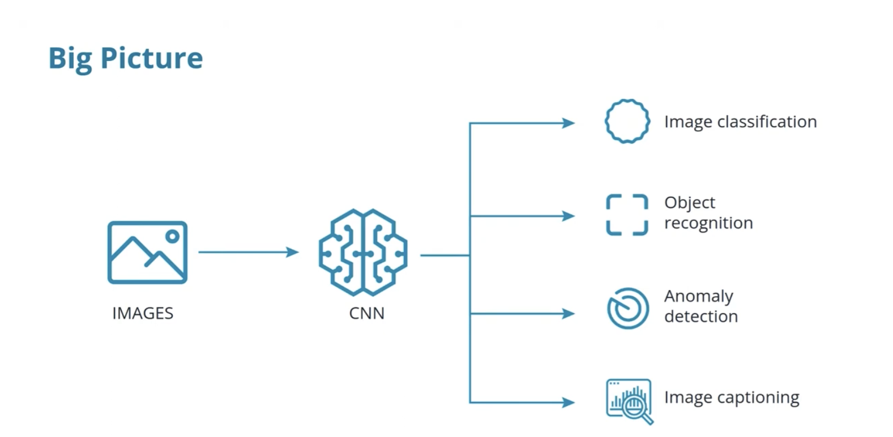

# S-2: Convolutional Neural Networks (CNNs)


# C-1: Fundamentals of Convolutional Neural Networks


1. Introduction to Convolutional Neural Networks
   - CNN Concepts and Architecture
   - Kernel Convolution
   - Weight Sharing and Feature Extraction
2. Comparative Neural Network Architectures
   - Multi-Layer Perceptrons (MLPs) vs Convolutional Neural Networks
   - Structural Differences and Design Principles
3. Advanced CNN Concepts
   - Receptive Fields
   - Pooling Techniques
   - Edge Handling and Image Processing
4. Neural Network Training Process
   - Loss Functions
   - Optimizers
   - Training and Validation Loops
   - CNN-Specific Training Considerations
5. Feature Learning and Hierarchical Representation
   - Layer-by-Layer Feature Extraction
   - From Simple to Complex Feature Detection
6. Practical Implementation and Best Practices
   - Model Design Guidelines
   - Regularization Techniques
   - Performance Monitoring and Improvement


#### Introduction to Convolutional Neural Networks

##### CNN Concepts and Architecture

Convolutional Neural Networks (CNNs) represent one of the most transformative innovations in artificial intelligence. Unlike traditional neural networks, CNNs are specifically designed to process data with grid-like topology, such as images. To understand why they're revolutionary, let's explore their core principles.

At their heart, CNNs are neural networks that use a mathematical operation called **convolution** instead of general matrix multiplication in at least one of their layers. This seemingly simple change unleashes remarkable capabilities for processing visual information.

Imagine looking at a photograph. When you recognize a face, you're not analyzing the entire image at once—your visual system focuses on specific features (eyes, nose, mouth) and their spatial relationships. CNNs work similarly, examining small regions of an image at a time and gradually building up an understanding of the whole.

<p align="center">

</p>
<p align="center">figure:  CNN Architecture Blueprint</p>

##### The Biological Inspiration

CNNs draw inspiration from the organization of the animal visual cortex, where individual neurons respond to stimuli only in a restricted region of the visual field known as the receptive field. These fields overlap to cover the entire visual area, creating a powerful system for processing visual information.

The biological inspiration for Convolutional Neural Networks comes from groundbreaking neuroscience research that revealed how our visual system processes information. This connection between biology and artificial neural networks helps explain why CNNs are so effective for computer vision tasks.

###### The Visual Cortex Structure

In the 1950s and 1960s, neuroscientists David Hubel and Torsten Wiesel conducted pioneering experiments studying how cats' visual systems process information. They discovered that individual neurons in the visual cortex respond selectively to specific patterns of light in particular regions of the visual field.

Each neuron has what's called a "receptive field" - a limited area of the visual field that it monitors. When an appropriate stimulus appears in this receptive field, the neuron activates. What's fascinating is that different neurons respond to different features:

- Some neurons fire when they detect vertical edges
- Others respond to horizontal edges
- Some activate when they see motion in particular directions
- Others react to specific colors or textures

###### The Visual Cortex: Your Brain's Image Processor

The visual cortex is a specialized region of the brain's cerebral cortex devoted to processing visual information. Located in the occipital lobe at the back of the brain, it's essentially your brain's image processing center.

When light enters your eyes, it strikes the retina, where specialized cells called photoreceptors (rods and cones) convert light energy into electrical signals. These signals travel along the optic nerve to the thalamus (specifically a region called the lateral geniculate nucleus) and then continue to the primary visual cortex, also known as V1 or the striate cortex.

The visual cortex isn't a single uniform structure but consists of multiple specialized areas, each handling different aspects of vision:

- **V1 (Primary Visual Cortex)**: The first stop for visual information, where basic features like oriented edges, brightness contrasts, and motion are detected.
- **V2**: Processes more complex visual features like orientation, spatial frequency, and color.
- **V3**: Involved in processing dynamic form information.
- **V4**: Specializes in processing color, orientation, spatial frequency, and object recognition.
- **V5/MT (Middle Temporal)**: Specializes in motion perception.

What makes the visual cortex remarkable is its hierarchical organization. Visual processing begins with simple feature detection in V1 (like detecting edges at specific orientations) and progresses through higher visual areas where these simple features are combined into increasingly complex representations.

This is why convolutional neural networks mimic this structure - they start with simple edge detection in early layers and build up to complex object recognition in deeper layers, similar to how your visual cortex processes what you see.

The visual cortex exemplifies the brain's principle of specialized processing regions working together to create our seamless visual experience of the world. Despite making up only a portion of the brain, it contains hundreds of millions of neurons working in parallel to process the rich visual information we encounter every moment.

When neuroscientists talk about "receptive fields" in the visual cortex, they're referring to the specific region of the visual field that, when stimulated, activates a particular neuron. This discovery was revolutionary because it showed how the brain breaks down complex visual scenes into manageable components processed by dedicated neural circuits.

###### Hierarchical Organization

The visual cortex is organized in a hierarchical fashion, with information processing occurring in stages:

1. Simple cells respond to basic features like oriented edges within their receptive fields
2. Complex cells combine inputs from multiple simple cells, detecting similar features but with some position invariance
3. Higher-level neurons integrate information from many complex cells to recognize increasingly sophisticated patterns

This hierarchical structure allows the visual system to build up recognition from simple components to complex objects.

###### The Overlap Principle

The part about "fields overlap to cover the entire visual area" is crucial. Individual neurons don't process the entire visual field; each has its own restricted area of vision. But these receptive fields overlap extensively, creating a complete representation of the visual field through their collective activity.

This overlapping arrangement provides several advantages:

- Redundancy: Multiple neurons monitor each region, providing resilience
- Distributed processing: Visual information is processed in parallel across many neurons
- Spatial relationships: The system inherently preserves spatial relationships between features

###### How CNNs Mirror This Biology

Convolutional Neural Networks directly implement these biological principles:

1. **Convolutional filters** mimic the receptive fields of individual neurons, each examining a small region of the input
2. **Shared weights** in CNN filters reflect how the same feature detector (like an edge detector) is applied across the entire visual field
3. **Hierarchical structure** with multiple layers parallels how visual information is processed from simple to complex in the brain
4. **Pooling operations** create position invariance similar to complex cells
5. **Increasing feature depth** in deeper layers mirrors how the brain builds more abstract representations as information moves through the visual pathway

When a CNN applies convolutional filters across an image, it's performing an operation remarkably similar to how your visual cortex processes what you see. Each filter detects specific features, and as information flows through deeper layers, these features combine to form increasingly complex representations - from edges to textures to object parts to complete objects.

This biological inspiration doesn't mean CNNs work exactly like the brain, but the shared architectural principles help explain why CNNs excel at visual tasks. Nature developed this architecture through evolution, and we've adapted similar principles in our artificial systems, creating one of the most successful examples of biologically-inspired artificial intelligence.

In a CNN, artificial neurons connect only to a small region of the layer before it, mimicking this biological structure. This constrained connectivity is one of the key architectural differences between CNNs and traditional fully-connected networks.

##### Architectural Components

A typical CNN architecture consists of several distinctive layers stacked together:


1. **Convolutional layers**: Apply learned filters to input images, extracting features like edges, textures, and patterns.
2. **Activation functions**: Introduce non-linearity to the network, typically using ReLU (Rectified Linear Unit) to transform feature maps.
3. **Pooling layers**: Reduce the spatial dimensions of the data, making the network less sensitive to slight translations in the input.
4. **Fully connected layers**: Connect every neuron to all neurons in the previous layer, combining the learned features for final classification.

What makes CNNs truly remarkable is their ability to automatically learn relevant features from data. The early layers typically detect simple features like edges and color gradients, while deeper layers combine these into increasingly complex patterns—eventually recognizing entire objects.

<p align="center">

</p>
<p align="center">figure: Overview of a Convolutional Neural Network applications</p>

##### Weight Sharing: The Efficiency Breakthrough

One of the most important innovations in CNNs is **weight sharing**. In a traditional neural network, each connection between neurons has its own weight parameter. In contrast, CNNs use the same weights for multiple connections, dramatically reducing the number of parameters.

This design choice reflects a profound insight about images: if a feature (like an edge) is useful to detect in one part of the image, it's likely useful everywhere. A single filter that detects horizontal edges should work anywhere in the image—whether it's in the top left corner or bottom right.

Through weight sharing, CNNs achieve two critical advantages:

- Dramatic reduction in parameters (improving efficiency and reducing overfitting)
- Translation invariance (recognizing objects regardless of where they appear in the image)

The power of CNNs comes from this elegant combination of biologically-inspired architecture, hierarchical feature learning, and parameter efficiency through weight sharing. This design has made CNNs the backbone of modern computer vision systems, enabling everything from facial recognition to autonomous driving.

<p align="center">

</p>
<p align="center">figure: Pre-process the data</p>

##### Kernel Convolution

The heart of a CNN is the convolution operation—a mathematical procedure that transforms an input image using a small matrix called a kernel (or filter). This operation is what gives CNNs their unique ability to extract meaningful spatial features from images.

###### The Convolution Operation: A Step-by-Step Guide

Let's demystify convolution with a concrete example. Imagine we have a grayscale image represented as a matrix of pixel values, and we want to detect edges using a specific filter.

1. **The input image**: A grid of pixel values (typically ranging from 0 to 255 for grayscale images).
2. **The kernel**: A small matrix of weights (often 3×3 or 5×5) designed to detect specific features.
3. **The convolution process**: The kernel slides across the image, performing element-wise multiplication and summation at each position.

Consider this simple 5×5 input image and a 3×3 edge-detection kernel:

Input Image:

```
[10  20  15  25  30]
[40  50  60  32  18]
[25  33  45  60  80]
[15  20  30  40  50]
[40  30  25  15  10]
```

Edge-detection kernel:

```
[-1  -1  -1]
[-1   8  -1]
[-1  -1  -1]
```

To compute the first value in our output feature map, we place the kernel over the top-left 3×3 region of the image:

```
[10  20  15]   [-1  -1  -1]
[40  50  60] × [-1   8  -1]
[25  33  45]   [-1  -1  -1]
```

We multiply corresponding elements and sum the results: $(10 \times -1) + (20 \times -1) + (15 \times -1) + (40 \times -1) + (50 \times 8) + (60 \times -1) + (25 \times -1) + (33 \times -1) + (45 \times -1)$

$= -10 - 20 - 15 - 40 + 400 - 60 - 25 - 33 - 45$

$= 400 - 248 = 152$

This value (152) becomes the first element in our output feature map. We then slide the kernel one position to the right and repeat the process, continuing until we've covered the entire image.

###### The Mathematics of Convolution

Formally, the 2D convolution operation can be expressed as:

$$S(i, j) = \sum_{m} \sum_{n} I(i+m, j+n) \cdot K(m, n)$$

Where:

- $S(i, j)$ is the output value at position $(i, j)$
- $I$ is the input image
- $K$ is the kernel
- $m, n$ are the indices for the kernel dimensions

This operation produces a feature map that highlights specific patterns in the input image, depending on the kernel values.

###### Types of Kernels and Their Effects

Different kernels detect different features. Here are some common examples:

1. **Edge detection kernels**: Highlight boundaries between regions of different intensities.

   ```
   [-1  -1  -1]
   [-1   8  -1]
   [-1  -1  -1]
   ```

2. **Horizontal edge detection**:

   ```
   [-1  -2  -1]
   [ 0   0   0]
   [ 1   2   1]
   ```

3. **Vertical edge detection**:

   ```
   [-1   0   1]
   [-2   0   2]
   [-1   0   1]
   ```

4. **Gaussian blur**: Reduces noise and detail.

   ```
   [1/16  1/8  1/16]
   [1/8   1/4  1/8 ]
   [1/16  1/8  1/16]
   ```

5. **Sharpening kernel**: Enhances details and edges.

   ```
   [ 0  -1   0]
   [-1   5  -1]
   [ 0  -1   0]
   ```

The beauty of CNNs is that they learn these kernels automatically during training. Starting from randomly initialized values, the network adjusts the kernel weights through backpropagation to extract the most useful features for the specific task.

##### Initial Kernel Values vs. Learned Kernels

When a CNN is first created, its convolutional kernels are not initialized with these nicely structured patterns like edge detectors or blurring filters. Instead, they typically start with random values drawn from specific probability distributions (like normal distributions or uniform distributions with small values).

For example, a 3×3 kernel might be initialized with random values like:

```
[ 0.02  -0.15   0.08]
[-0.11   0.05  -0.03]
[ 0.09  -0.07   0.01]
```

###### The Learning Process

The transformation from random noise to meaningful filters happens through the training process:

1. **Forward Pass**: The network uses its current kernels (initially random) to make predictions
2. **Loss Calculation**: The difference between predictions and actual labels is measured
3. **Backpropagation**: The gradient of the loss with respect to each kernel value is calculated
4. **Weight Update**: Each kernel value is adjusted slightly to reduce the loss

This process repeats thousands or millions of times across many training examples. Gradually, the kernels evolve from random values into patterns that are useful for the specific task the network is solving.

The remarkable thing is that CNNs consistently learn kernels resembling those hand-designed filters (edge detectors, etc.) without being explicitly programmed to do so. This happens because:

1. **Natural image statistics**: Real-world images have certain statistical properties - edges are extremely common and informative features in natural images
2. **Task requirements**: For tasks like object recognition, detecting edges and basic shapes is fundamentally useful
3. **Gradient descent optimization**: The learning process naturally finds patterns that minimize error in the prediction task

After sufficient training, if you visualize the kernels in the first layer of a CNN, you'll often see that some have evolved into vertical edge detectors, some into horizontal edge detectors, some into diagonal detectors, and so on.

Think of it like natural selection. The network starts with random "mutations" (kernel values). Those that happen to be somewhat useful for the task (even if just slightly better than random) get reinforced through training. Over many iterations, these initially barely-useful kernels evolve into highly specialized feature detectors.

For instance, if a kernel happens to have slightly higher values on the left and slightly lower values on the right by random chance, it might weakly detect vertical edges. During training, if detecting vertical edges helps reduce the error, backpropagation will strengthen this pattern, gradually transforming it into a proper vertical edge detector like:

```shell
[-1   0   1]
[-2   0   2]
[-1   0   1]
```

This emergence of structured patterns from random initialization is one of the most fascinating aspects of deep learning - the network discovers useful features rather than being explicitly programmed with them.

###### The Collective Training Process

All kernels in a convolutional layer train simultaneously, not separately or independently. This is an important aspect of how CNNs learn to detect different features from the same input. When you have N kernels in a convolutional layer, they all go through the training process together in each iteration.

###### Specialization Through Training

What's fascinating is that even though all kernels start randomly and train simultaneously with the same inputs and loss function, they naturally evolve to detect different features. This happens because:

1. **Random initialization**: Each kernel starts with different random values
2. **Gradient updates**: These different starting points lead to different update trajectories
3. **Feature complementarity**: The network benefits most when kernels specialize in detecting different features rather than all detecting the same thing

For example, one kernel might evolve to detect horizontal edges, another vertical edges, another diagonal edges, and so on - not because we told them to, but because this specialization collectively minimizes the loss.

###### What If One Kernel Is "Properly Trained" Earlier?

In neural network training:

1. Different kernels learn at different rates because of their random initialization and the specific features they happen to start detecting
2. However, training doesn't stop for individual kernels that have "converged" - all weights continue to be updated as long as training continues
3. A well-trained kernel might see smaller gradient updates over time if it's already doing a good job, but updates don't completely stop for just some kernels

The network optimizes all parameters together to minimize the overall loss. If one kernel is perfectly detecting horizontal edges but the network still makes errors, the training process will continue adjusting all kernels to further reduce those errors.

Think of it like a team of 5 spotters all looking at the same scene but each tasked with finding different things. Initially, they're all just randomly scanning. As they receive feedback, they gradually specialize - one becomes expert at spotting birds, another at spotting cars, another at spotting people, and so on.

Even if the bird-spotter becomes perfect at their job, the team as a whole isn't perfect until everyone is good at their specialized task. Training continues until the collective performance reaches the desired level.

This ability for kernels to naturally specialize and detect complementary features is one of the most powerful aspects of convolutional neural networks and explains why they're so effective at visual recognition tasks.

###### Padding and Stride: Controlling Spatial Dimensions

When applying convolution, two important parameters affect the output dimensions:

1. **Padding**: Adding extra pixels (typically zeros) around the border of the input image. This allows the kernel to be centered on border pixels and helps maintain the spatial dimensions of the feature map.
2. **Stride**: The number of pixels by which the kernel shifts at each step. A larger stride reduces the output dimensions.

Without padding, a convolution operation reduces the output dimensions. For an $n \times n$ input image and a $k \times k$ kernel, the output dimensions become $(n-k+1) \times (n-k+1)$.

With padding $p$ and stride $s$, the output dimensions are:

$$\text{output size} = \lfloor \frac{n + 2p - k}{s} + 1 \rfloor$$

Convolution with appropriate padding and stride enables CNNs to control spatial information flow and create hierarchical representations of visual data—a crucial capability that makes them so effective for image analysis tasks.

###### Weight Sharing and Feature Extraction

Weight sharing represents one of the most ingenious innovations in Convolutional Neural Networks, dramatically reducing parameters while preserving the network's ability to detect features anywhere in an image. To truly understand its significance, we need to explore the concept in depth and see how it enables effective feature extraction.

###### The Principle of Weight Sharing

In traditional neural networks (like MLPs), each connection between neurons has a unique weight. This means that for a fully connected layer connecting $n$ input neurons to $m$ output neurons, we need $n \times m$ weight parameters—a number that grows extremely large for high-dimensional inputs like images.

CNNs take a fundamentally different approach. Rather than learning separate weights for each spatial position, a CNN uses the same set of weights (the kernel) across the entire input. This is based on a powerful insight: the patterns we want to detect (like edges, textures, or shapes) should be recognized regardless of where they appear in the image.

The weight-sharing mechanism works as follows:

1. A single kernel (e.g., a 3×3 matrix of weights) is defined.
2. This same kernel slides across all spatial positions in the input.
3. The patterns detected by this kernel are recorded in the corresponding positions of the output feature map.

Let's quantify the parameter efficiency gained through weight sharing. Consider processing a 224×224 image:

- **Without weight sharing** (fully connected approach): Each output neuron would connect to all 50,176 input pixels, requiring millions of parameters for just one layer.
- **With weight sharing** (convolutional approach): A 3×3 kernel has only 9 weights (plus a bias term), regardless of input size. Even with 64 different kernels, we need just 640 parameters (64 × (9+1)).

This represents a reduction in parameters by several orders of magnitude!

###### From Pixels to Features: The Extraction Process

Weight sharing does much more than reduce parameters—it fundamentally changes how the network processes visual information. Let's explore how CNNs transform raw pixel data into meaningful features:

1. **Low-level feature extraction**: The first convolutional layer typically learns simple patterns like edges, lines, and color gradients. Each kernel specializes in detecting different basic visual elements.
2. **Mid-level feature composition**: Subsequent layers combine these basic elements into more complex patterns—corners, textures, and simple shapes. They achieve this by applying convolutions to the feature maps from previous layers.
3. **High-level feature abstraction**: Deeper layers detect increasingly complex and abstract features—object parts, distinctive textures, and eventually whole objects.


This hierarchical feature extraction mirrors how our own visual system processes information—building complex understanding from simple components.

###### Translation Invariance: An Emergent Property

Perhaps the most powerful consequence of weight sharing is translation invariance—the network's ability to recognize patterns regardless of their position in the image. This property emerges naturally because:

1. The same kernel scans the entire image, detecting its specific pattern wherever it appears.
2. Pooling operations (which we'll cover in a later section) further enhance position invariance by summarizing features across local regions.

Translation invariance is crucial for real-world applications. Consider face recognition—we want our system to identify a face whether it appears in the center, corner, or any other position in the image. Weight sharing gives CNNs this capability without requiring multiple examples of the same face in different positions.

###### Learning Features Automatically

One of the most remarkable aspects of CNNs is that they learn which features to extract through the training process—the kernels are not hand-designed but optimized based on the specific task.

During training:

1. Kernels start with random weights.
2. As the network processes training examples, backpropagation adjusts these weights.
3. Gradually, kernels evolve to detect the most useful features for the task.

This automatic feature learning stands in stark contrast to traditional computer vision approaches, which often relied on hand-crafted feature extractors. CNNs discover which features matter most for a given problem, often finding patterns that human designers might miss.

Weight sharing and the resulting feature extraction process give CNNs their extraordinary capabilities in visual understanding tasks. By dramatically reducing parameters while preserving the ability to detect position-invariant features, CNNs achieve both computational efficiency and remarkable accuracy—a combination that has revolutionized computer vision and many other fields.

##### Understanding Kernel Configuration in CNNs

When designing a convolutional neural network, programmer need to specify the number of kernels (also called filters) for each convolutional layer. This is a critical architectural decision that you make before training begins. In most deep learning frameworks, you specify the number of kernels when defining your network architecture. For example, in PyTorch:

```python
# Creating a convolutional layer with 64 kernels
# Each kernel is 3x3 and operates on input with 3 channels
conv_layer = nn.Conv2d(in_channels=3, out_channels=64, kernel_size=3, padding=1)
```

In this code, `out_channels=64` defines that this layer will have 64 different kernels. Each kernel will produce one feature map in the output, so the output of this layer will have 64 channels.

###### How to Choose the Number of Kernels

Deciding how many kernels to use involves balancing several considerations:

1. **Representational capacity**: More kernels can learn more diverse features, increasing the network's capacity to recognize complex patterns.
2. **Computational efficiency**: More kernels require more computation during both training and inference.
3. **Risk of overfitting**: Too many kernels might lead to overfitting, especially with limited training data.
4. **Task complexity**: More complex tasks (like recognizing thousands of object categories) generally benefit from more kernels.

A common pattern in CNN design is to increase the number of kernels as you go deeper into the network. For example:

- First layer: 32-64 kernels
- Second layer: 64-128 kernels
- Third layer: 128-256 kernels

This approach reflects how visual information is processed: early layers detect simple, general features (edges, textures) while deeper layers combine these into more complex, specific features (object parts, patterns).

###### What the Network Decides vs. What You Decide

It's important to distinguish between what aspects of the CNN are predefined and what aspects are learned:

**You decide (before training):**

- How many convolutional layers to use
- How many kernels in each layer
- The size of each kernel (3×3, 5×5, etc.)
- The stride and padding settings
- The overall network architecture

**The network learns (during training):**

- The actual weight values within each kernel
- Which specific features each kernel will detect
- How to combine these features for the task at hand

The CNN learns "which features to extract" in the sense that it learns the optimal values for each kernel, but it does so within the architectural constraints you've defined, including how many different feature detectors (kernels) it has available at each layer.

###### Automatic Architecture Search

An advanced approach is Neural Architecture Search (NAS), where algorithms automatically determine the optimal number of kernels and other architectural choices. However, this is computationally expensive and not yet standard practice for most applications. In typical scenarios, the number of kernels remains a hyperparameter that you, as the network designer, need to specify.

This balance between human-defined architecture and automatically learned features is what makes deep learning so powerful—we provide the learning framework, and the network discovers the optimal feature detectors within that framework.

##### How CNN Kernels Specialize: The Magic of Automatic Feature Learning

If you decide to use $n$ kernels (say, $n=3$) in a convolutional layer, the neural network indeed determines what type of features each kernel will detect through the training process. This automatic specialization is one of the most fascinating aspects of neural networks.

Let's walk through what typically happens with 3 kernels in an early convolutional layer:

When training begins, all three kernels contain random values. As training progresses, each kernel gradually adjusts its weights to detect patterns that help minimize the overall error. Because they start from different random initializations, they typically evolve to detect different features.

For example, after sufficient training, your three kernels might specialize like this:

1. **Kernel 1** might evolve to detect vertical edges in the image
2. **Kernel 2** might specialize in detecting horizontal edges
3. **Kernel 3** might learn to identify diagonal features or corners

The network determines this specialization entirely on its own, based on what features are most useful for the specific task you're training it for. Imagine we're training a network to recognize handwritten digits. Your three kernels might evolve in this way:

**Initial state (random):**

```shell
Kernel 1:               Kernel 2:               Kernel 3:
[ 0.12 -0.08  0.05]     [-0.11  0.09  0.02]     [ 0.03 -0.07  0.14]
[-0.01  0.07 -0.03]     [ 0.06 -0.12  0.08]     [-0.09  0.01 -0.02]
[ 0.09 -0.04  0.11]     [ 0.03  0.05 -0.09]     [ 0.10  0.05 -0.08]
```

**After training (specialized):**

```shell
Kernel 1:               Kernel 2:               Kernel 3:
[-0.92 -0.04 -0.97]     [-1.12 -1.87 -1.03]     [-0.81  0.12  0.79]
[-0.11  0.08 -0.08]     [ 0.09  0.11  0.08]     [-1.09  0.23  1.01]
[ 0.95  0.05  0.92]     [ 1.05  1.91  1.08]     [-0.83  0.14  0.86]
```

Now Kernel 1 detects vertical edges, Kernel 2 detects horizontal edges, and Kernel 3 detects diagonal edges (in this case, a 45-degree edge).

This automatic specialization is crucial because:

1. The network discovers the most informative features for your specific dataset and task, rather than using generic features a human might design.
2. Different kernels learn complementary features, maximizing the information extracted from the input.
3. As you go deeper in the network, later convolutional layers combine these basic features to detect increasingly complex patterns—from edges to textures to object parts to complete objects.

###### The Trade-off of Using Only 3 Kernels

With only 3 kernels, your network has a limited "vocabulary" of features it can detect. While 3 kernels might be sufficient for very simple tasks, most real-world applications use more:

- Simple tasks might use 16-32 kernels in early layers
- Complex image recognition might use 64-256 kernels per layer

The more kernels you have, the richer the feature representation your network can learn. With more kernels, the network might detect edges at more angles, different textures, color transitions, and various other visual patterns.

The beautiful part is that regardless of whether you choose 3 or 300 kernels, the fundamental process remains the same: the network determines what features each kernel should detect based on what helps solve the task at hand most effectively.

#### Comparative Neural Network Architectures

##### Multi-Layer Perceptrons (MLPs) vs Convolutional Neural Networks

Fully understanding CNNs requires appreciating how they differ from their predecessors. The Multi-Layer Perceptron (MLP) represents the classical neural network architecture—a foundation upon which more specialized designs like CNNs were built. By comparing these architectures, we can better understand the revolutionary innovations that make CNNs so effective for visual tasks.

###### The Classical Approach: Multi-Layer Perceptrons

MLPs are the traditional workhorses of neural networks, characterized by fully-connected layers where every neuron connects to every neuron in adjacent layers. This architecture makes them flexible general-purpose learners, but it comes with significant limitations when applied to image data.

The basic structure of an MLP includes:

1. **Input layer**: Receives the raw data (flattened, in the case of images)
2. **Hidden layers**: One or more layers that transform the input through weighted connections
3. **Output layer**: Produces the final prediction or classification

For image processing, the MLP approach requires flattening a 2D image into a 1D vector, immediately discarding the spatial relationships between pixels. Consider a modest 28×28 grayscale image (like those in the MNIST dataset)—flattening transforms it into a 784-element vector where adjacent pixels in the original image may be far apart in the vector representation.


This flattening process creates several fundamental problems:

1. **Loss of spatial information**: The network has no built-in understanding that adjacent pixels in the original image are related.
2. **Parameter explosion**: A single fully connected layer from a flattened 28×28 image to 100 hidden neurons requires 78,400 weights (784×100)—and this is for a tiny image! Modern high-resolution images would require millions of parameters.
3. **No position invariance**: An MLP must separately learn to recognize patterns in different positions, requiring enormous amounts of training data to achieve robustness.
4. **Overfitting tendency**: The massive number of parameters makes MLPs prone to memorizing training examples rather than generalizing.

Despite these limitations, MLPs can learn to classify images with reasonable accuracy given enough data and careful regularization. However, they're fundamentally inefficient for the task, requiring far more parameters and training examples than necessary.

###### The CNN Revolution: A Specialized Architecture for Visual Data

CNNs address the limitations of MLPs through an architecture specifically designed for grid-like data such as images. Instead of treating each pixel as an independent input feature, CNNs preserve and exploit the spatial relationships between pixels.

The fundamental innovations of CNNs include:

1. **Local connectivity**: Each neuron connects only to a small region of the previous layer, mirroring how visual processing works in biological systems.
2. **Weight sharing**: The same set of weights (kernels) is applied across the entire image, dramatically reducing parameters while enabling position-invariant feature detection.
3. **Hierarchical feature extraction**: Through stacked convolutional layers, the network automatically builds a hierarchy from simple features (edges, textures) to complex patterns (objects, scenes).


This specialized architecture creates several advantages for image processing:

1. **Preservation of spatial relationships**: Convolution operations maintain the spatial topology of the input data.
2. **Parameter efficiency**: Through weight sharing, a CNN can use the same small set of weights to detect a feature anywhere in the image.
3. **Translation invariance**: The network naturally recognizes patterns regardless of their position, especially when combined with pooling operations.
4. **Improved generalization**: With fewer parameters and built-in inductive biases for image data, CNNs generalize better from limited examples.

###### Structural Differences and Design Principles

The architectural differences between MLPs and CNNs reflect deeper design principles and tradeoffs in neural network design. Understanding these principles helps explain why CNNs excel at visual tasks while MLPs remain valuable for other applications.

#### Fundamental Design Differences

Let's examine the key structural distinctions between these architectures:

| Aspect               | Multi-Layer Perceptron                          | Convolutional Neural Network                      |
| -------------------- | ----------------------------------------------- | ------------------------------------------------- |
| Basic unit           | Fully connected layer                           | Convolutional layer + pooling                     |
| Input representation | Flattened (1D vector)                           | Original dimensional structure preserved          |
| Connectivity pattern | Global (each neuron connects to all inputs)     | Local (each neuron connects to a small region)    |
| Parameter sharing    | None (unique weight for each connection)        | Extensive (same kernel weights used throughout)   |
| Spatial awareness    | None (spatial relationships lost in flattening) | Strong (preserves and exploits spatial structure) |
| Parameter count      | Very high (grows quickly with input size)       | Relatively low (independent of input size)        |

These structural differences have profound implications for how each network learns and processes information.

###### Inductive Biases and Domain Knowledge

Both architectures embody different inductive biases—assumptions built into the model design that guide learning:

1. **MLP inductive biases**:
   - All input features are potentially equally important
   - No special relationship exists between features based on their order or arrangement
   - Complex patterns might depend on combinations of any input features
2. **CNN inductive biases**:
   - Nearby pixels are more strongly related than distant ones
   - The same visual patterns can appear anywhere in the image
   - Visual information has a hierarchical structure from simple to complex

These biases explain why CNNs excel at image tasks while MLPs may perform better on tabular data where feature relationships don't follow spatial patterns.

###### Computational Efficiency Considerations

The architectural differences also create significant computational efficiency gaps:

1. **Memory requirements**:
   - MLPs: Store unique weights for every connection (millions for modest image sizes)
   - CNNs: Store only kernel weights (typically thousands regardless of image size)
2. **Computational complexity**:
   - MLPs: O(n²) where n is the number of neurons per layer
   - CNNs: O(k²·n) where k is the kernel size (much more efficient for large inputs)
3. **Scaling with input size**:
   - MLPs: Parameters grow quadratically with input dimensions
   - CNNs: Parameters remain constant regardless of input dimensions

This efficiency advantage allows CNNs to process high-resolution images that would be computationally intractable for MLPs.

###### Hybrid Approaches: Combining the Best of Both Worlds

Modern neural network designs often combine elements from both architectures:

1. **CNN feature extractors with MLP classifiers**: Many CNN architectures use convolutional layers for feature extraction, followed by fully connected layers for final classification.
2. **Global average pooling**: Instead of flattening and using fully connected layers, some modern CNNs use global average pooling to reduce feature maps directly to class scores, further reducing parameters.
3. **Attention mechanisms**: These add flexible, content-dependent connectivity to traditional CNN architectures, allowing the network to focus on the most relevant parts of an image.


###### Flattening Process

The flattening process is a crucial transition point in a convolutional neural network's architecture, bridging the convolutional layers that process spatial data with the fully connected layers that make final classifications. Let me explain what this process involves and why it's necessary.

Flattening is exactly what it sounds like - taking a multi-dimensional array and "flattening" it into a one-dimensional vector. In the context of CNNs, this typically means converting the 3D output from convolutional and pooling layers (which has dimensions of height × width × channels) into a 1D array of numbers. Let's walk through a concrete example to illustrate the flattening process:

Imagine after several convolutional and pooling layers, your network has produced feature maps with dimensions 4×4×8 (height × width × channels). This means you have 8 feature maps, each 4×4 in size.

The flattening operation would transform this 3D tensor with 128 values (4×4×8) into a 1D vector with 128 elements, by simply arranging all the values in a single line. The conversion happens by taking each value from the 3D tensor and placing them sequentially in the 1D vector.

In pseudocode, this might look like:

```python
flat_vector = []
for channel in range(8):
    for row in range(4):
        for col in range(4):
            flat_vector.append(feature_maps[row][col][channel])
```

The order of traversal (whether you go through channels first or spatial dimensions first) doesn't matter as long as you're consistent, since the network will learn based on whatever order you choose.

<p align="center">

</p>
<p align="center">figure: flattening of the matrix</p>

Flattening is necessary because:

1. **Architecture transition**: Convolutional layers operate on 2D spatial grids to preserve spatial relationships, while fully connected layers require 1D inputs.
2. **Global information integration**: After extracting local features through convolution, the network needs to combine this information globally for tasks like classification.
3. **Fixed-size input requirement**: Fully connected layers require a fixed-size input, and flattening ensures this regardless of the original image dimensions (assuming consistent feature map sizes).


###### The Information Cost of Flattening

While flattening is necessary for traditional CNN architectures, it does have a significant drawback: it loses all spatial information about where features are located relative to each other. After flattening, the fully connected layers no longer "know" if two activations were adjacent or far apart in the original feature maps.

This is why many modern architectures (like Fully Convolutional Networks for segmentation) avoid flattening when spatial information needs to be preserved. Instead, they use techniques like global average pooling or 1×1 convolutions to reduce dimensions while maintaining spatial awareness. In practice, implementing flattening is straightforward:

In PyTorch:

```python
# Assuming x is your feature maps with shape [batch_size, channels, height, width]
x = x.view(x.size(0), -1)  # Reshape to [batch_size, channels*height*width]
```

In TensorFlow/Keras:

```python
# As a layer in a model
flatten_layer = Flatten()
x = flatten_layer(x)

# Or directly
x = tf.reshape(x, [x.shape[0], -1])
```

In a typical CNN architecture flow, the flattenig operation comes after the Pooling as described below:

1. **Input image** enters the network
2. **Convolutional layers** extract features while preserving spatial information
3. **Pooling layers** reduce spatial dimensions while retaining important features
4. **Flattening operation** converts the 3D feature maps to a 1D vector
5. **Fully connected layers** combine these features for classification
6. **Output layer** produces the final prediction

Flattening marks the transition from the feature extraction portion of the network (convolutional layers) to the classification portion (fully connected layers). It's the point where the network stops caring about "where" features appear and focuses instead on "what" features are present.

Understanding this transition helps explain the fundamental design philosophy of CNNs: use convolutional layers to extract spatially-aware features, then use fully connected layers to combine these features for making decisions about the input as a whole.

###### When to Use Each Architecture

Understanding the strengths and weaknesses of each architecture helps in selecting the right tool for specific tasks:

**Use MLPs when**:

- Working with tabular or unstructured data
- Input features have no inherent spatial or sequential relationship
- Interpretability of individual feature importance is needed
- Working with small input dimensions

**Use CNNs when**:

- Processing image or grid-structured data
- Spatial relationships between input features are significant
- Translation invariance is desired
- Dealing with high-dimensional inputs

The comparison between MLPs and CNNs illustrates a broader principle in deep learning: architectural specialization matters. By designing network architectures that incorporate domain-specific inductive biases, we can create more efficient models that learn more effectively from limited data.

This understanding of architectural differences not only helps us choose the right model for a given task but also inspires the development of new architectures tailored to specific problem domains—continuing the evolution of neural network design beyond both MLPs and CNNs.

#### Advanced CNN Concepts

##### Receptive Fields

The concept of receptive fields is fundamental to understanding how CNNs build increasingly complex representations of visual data. Think of a receptive field as the portion of the input image that can influence a particular neuron's activation. This concept helps us understand why deeper networks can recognize more complex patterns and how information flows through a CNN.

###### The Window to the World: Understanding Receptive Fields

Imagine looking at a large mural through a series of increasingly larger windows. Through a tiny peephole, you might only see a small patch of color. Through a slightly larger window, you might recognize simple patterns or shapes. Through an even larger window, you might identify objects or scenes. This analogy captures the essence of receptive fields in CNNs.

In a CNN, each neuron "sees" only a portion of the input from the previous layer. As we progress through deeper layers of the network, neurons incorporate information from increasingly larger regions of the original input image:

1. **Layer 1 neurons**: May see only a small 3×3 patch of the input image, enough to detect simple edges or color gradients.
2. **Layer 2 neurons**: Combine information from multiple Layer 1 neurons, allowing them to see a larger area of the original image (perhaps 5×5 or 7×7 pixels), enough to detect corners or textures.
3. **Layer 3 neurons**: Build on Layer 2 outputs, expanding their view even further, potentially recognizing simple shapes or object parts.

This hierarchical expansion of receptive fields enables the network to progress from detecting simple features to recognizing complex objects. But how exactly does this expansion happen?

###### Calculating the Receptive Field Size

The receptive field size grows systematically as we move through network layers. For a network with convolutional layers using kernels of size $k$ with stride $s$ and no dilation, we can calculate the receptive field size $r_l$ at layer $l$ using:

$$r_l = r_{l-1} + (k_l - 1) \times \prod_{i=1}^{l-1} s_i$$

Where $r_0 = 1$ (a single pixel at the input).

Let's work through a concrete example:

- Layer 1: 3×3 kernel, stride 1 → receptive field = 3×3
- Layer 2: 3×3 kernel, stride 1 → receptive field = 5×5
- Layer 3: 3×3 kernel, stride 1 → receptive field = 7×7

If we introduce a stride of 2 at Layer 2:

- Layer 1: 3×3 kernel, stride 1 → receptive field = 3×3
- Layer 2: 3×3 kernel, stride 2 → receptive field = 7×7
- Layer 3: 3×3 kernel, stride 1 → receptive field = 11×11

Notice how the receptive field grows more quickly with increased stride. This explains why architectures often use larger strides or pooling layers to efficiently increase receptive field size without adding too many layers.

###### Theoretical vs. Effective Receptive Fields

In practice, not all pixels within a neuron's theoretical receptive field contribute equally to its activation. Research has shown that the effective receptive field (ERF) is often much smaller than the theoretical one and follows a Gaussian-like distribution:

- Central pixels have the strongest influence
- Influence diminishes toward the edges of the receptive field
- This center-weighted influence creates a "spotlight" effect

This non-uniform influence explains why some CNNs struggle with long-range dependencies despite having large theoretical receptive fields. It also explains why techniques like dilated convolutions, which spread out kernel connections, can be effective for tasks requiring broader context.

###### The Role of Receptive Fields in CNN Design

Understanding receptive fields has profound implications for network architecture design:

1. **Task-appropriate receptive fields**: Different visual tasks require different receptive field sizes:
   - Texture classification might need only small receptive fields
   - Object detection needs medium-sized fields to capture whole objects
   - Scene understanding requires large fields to capture relationships between objects
2. **Receptive field engineering**: Techniques to strategically increase receptive field size include:
   - Stacking more convolutional layers (gradual growth)
   - Using larger kernels (faster growth but more parameters)
   - Increasing stride or using pooling (efficient growth)
   - Using dilated convolutions (exponential growth without loss of resolution)
3. **Global context integration**: For tasks requiring whole-image understanding, techniques to achieve near-global receptive fields include:
   - Global pooling operations
   - Attention mechanisms
   - Skip connections between distant layers

Understanding receptive fields helps explain how CNNs transition from local pattern recognition to global scene understanding. This concept ties directly to the next topic—pooling—which is one of the primary mechanisms for expanding receptive fields efficiently.

###### Pooling Techniques

Pooling operations serve as dimensional reduction mechanisms in CNNs, compressing spatial information while preserving essential features. Think of pooling as creating a lower-resolution summary of the detected features, similar to how you might squint at an image to see its essential structure without the fine details.

###### The Purpose and Mechanics of Pooling

Pooling operates by dividing feature maps into non-overlapping regions and computing a summary statistic for each region. This process:

1. Reduces the spatial dimensions of feature maps
2. Creates a form of translation invariance
3. Decreases computational load for subsequent layers
4. Helps prevent overfitting by reducing parameters

The pooling operation slides a window (typically 2×2) across feature maps, usually with a stride equal to the window size to ensure non-overlapping regions. For each window position, it computes a single value according to the pooling type.

<p align="center">

</p>
<p align="center">figure: Pooling operation in a neural network, summarizing feature maps</p>

###### Max Pooling: Preserving Strong Activations

Max pooling, the most commonly used pooling technique, selects the maximum value from each window:

```
Feature map region:   Max pooling result:
[ 3  7 ]
[ 4  9 ]       →         9
```

Max pooling effectively asks: "Was this feature detected strongly anywhere in this region?" By preserving the strongest activation, max pooling:

1. Retains the most salient feature detections
2. Creates robustness to small translations and distortions
3. Emphasizes the presence rather than the exact location of features

This approach works particularly well for features like edges and distinctive textures where the maximum response indicates the presence of that feature.

<p align="center">

</p>
<p align="center">figure: Pooling operation in a neural network, summarizing feature maps</p>

###### Average Pooling: Capturing Overall Patterns

Average pooling computes the mean of all values in the window:

```
Feature map region:   Average pooling result:
[ 3  7 ]
[ 4  9 ]       →       5.75
```

Average pooling effectively asks: "What's the overall activation level in this region?" This approach:

1. Captures the general intensity of feature activations
2. Smooths feature representations, reducing noise
3. Better preserves background and texture information

Average pooling can be preferable when the overall pattern or texture is more important than specific feature detection, such as in some texture classification tasks or in deeper layers where features represent higher-level concepts.

###### Global Pooling: From Spatial Maps to Feature Vectors

Global pooling applies the pooling operation across the entire feature map, reducing each map to a single value:

1. **Global Max Pooling**: Reports the maximum activation for each feature map
2. **Global Average Pooling**: Computes the average activation across each entire feature map

Global pooling is particularly useful in the final layers of a CNN to:

1. Convert feature maps of any size into fixed-length feature vectors
2. Greatly reduce parameters compared to fully connected layers
3. Enforce a form of spatial translation invariance
4. Act as a structural regularizer, preventing overfitting

Many modern architectures use global average pooling followed by a single fully connected layer, replacing the multiple fully connected layers used in earlier CNN designs.

###### Adaptive Pooling: Handling Variable Input Sizes

Adaptive pooling adjusts the kernel size and stride dynamically to produce output feature maps of a predefined size, regardless of input dimensions:

```python
# PyTorch example: pool to a fixed 7×7 output regardless of input size
adaptive_pool = nn.AdaptiveMaxPool2d((7, 7))
```

This technique is valuable for:

1. Processing images of different resolutions
2. Transfer learning between datasets with different dimensions
3. Creating architectures that can handle variable-sized inputs

###### Fractional Pooling and Stochastic Pooling

More specialized pooling variants include:

1. **Fractional Max Pooling**: Uses non-integer pool sizes (e.g., reducing dimensions by a factor of 1.5 instead of 2)
2. **Stochastic Pooling**: Randomly selects values from each region with probability proportional to their activation

These techniques can introduce controlled forms of regularization and help the network develop more robust feature representations.

###### The Pooling Controversy: To Pool or Not to Pool?

Despite their benefits, pooling operations are not without controversy. Some modern architectures reduce or eliminate pooling in favor of:

1. **Strided convolutions**: Using increased stride in convolutional layers to reduce dimensions
2. **Attention mechanisms**: Learning which spatial locations to emphasize rather than using fixed pooling rules
3. **Dense prediction networks**: Preserving spatial resolution for tasks like segmentation

The decision to use pooling involves balancing several factors:

- Computational efficiency benefits from dimension reduction
- Translation invariance advantages for classification tasks
- Potential loss of precise spatial information for localization tasks

Understanding these tradeoffs helps architects design networks appropriately for specific tasks—using aggressive pooling for classification but minimal pooling for segmentation or detection.

###### Edge Handling and Image Processing

The edges of images present unique challenges for CNNs. When a convolution kernel overlaps the image boundary, we need a strategy to handle the "missing" pixels that would fall outside the image. These strategies, collectively known as padding or edge handling techniques, significantly impact feature extraction, especially near image boundaries.

###### The Edge Problem in Convolution

Consider applying a 3×3 convolution kernel to the corner of an image. The kernel would extend beyond the image boundaries, creating an undefined operation. There are several ways to resolve this issue, each with different implications for feature detection.

```
Image corner:         3×3 kernel positioned at corner:
[P  P  ...]            [?  ?  ?]
[P  P  ...]    →       [?  K  K]
[...     ]             [?  K  K]
```

Where P represents pixel values, K represents the kernel overlapping the image, and ? represents undefined values that need to be resolved through edge handling.

###### Zero Padding: The Standard Approach

Zero padding is the most common technique, adding a border of zeros around the input image:

```
Original image:         Image with zero padding:
[P  P  P]               [0  0  0  0  0]
[P  P  P]      →        [0  P  P  P  0]
[P  P  P]               [0  P  P  P  0]
                        [0  P  P  P  0]
                        [0  0  0  0  0]
```

Zero padding offers several advantages:

1. **Preserves spatial dimensions**: With appropriate padding (typically $\frac{k-1}{2}$ for a $k \times k$ kernel), the output feature map maintains the same dimensions as the input, preventing spatial information loss.
2. **Implementation simplicity**: Zero padding is straightforward to implement and computationally efficient.
3. **Border emphasis**: Zeros create high contrast with actual image content, potentially emphasizing boundaries.

However, zero padding also has drawbacks:

1. **Artificial boundary artifacts**: The sharp transition between zeros and image content can create artificial edge features that don't exist in the original image.
2. **Boundary information distortion**: Features near boundaries receive less context from actual image content, potentially reducing detection accuracy.

###### Alternative Padding Strategies

Several other padding techniques address the limitations of zero padding:

1. **Reflection padding**: Reflects the image content across the boundary:

   ```
   Original image:      Image with reflection padding:
   [P1 P2 P3]           [P2 P1 P1 P2 P3]
   [P4 P5 P6]    →      [P5 P4 P4 P5 P6]
   [P7 P8 P9]           [P8 P7 P7 P8 P9]
   ```

   This creates more natural transitions at boundaries and preserves texture continuity.

2. **Replication padding**: Extends the border pixels outward:

   ```
   Original image:      Image with replication padding:
   [P1 P2 P3]           [P1 P1 P1 P2 P3]
   [P4 P5 P6]    →      [P1 P1 P1 P2 P3]
   [P7 P8 P9]           [P4 P4 P4 P5 P6]
   ```

   This eliminates artificial edges but may overemphasize actual border content.

3. **Circular padding**: Wraps the image around toroidally:

   ```
   Original image:      Image with circular padding:
   [P1 P2 P3]           [P9 P7 P8 P9 P7]
   [P4 P5 P6]    →      [P3 P1 P2 P3 P1]
   [P7 P8 P9]           [P6 P4 P5 P6 P4]
   ```

   This assumes the image has a periodic structure, which works well for textures but may create discontinuities for natural images.

###### Valid vs. Same Padding Conventions

Two common padding conventions have emerged in deep learning frameworks:

1. **Valid padding**: No padding is applied, and the output feature map shrinks with each convolution:
   - For an $n \times n$ input and $k \times k$ kernel, the output is $(n-k+1) \times (n-k+1)$
   - Ensures all convolution operations use only valid image data
   - Avoids any artificial padding-induced features
   - May lead to excessive dimension reduction in deep networks
2. **Same padding**: Padding is added to ensure output dimensions match input dimensions:
   - For a kernel of size $k$, padding of $\frac{k-1}{2}$ is added on each side
   - Maintains spatial dimensions throughout the network
   - Allows for deeper networks without excessive dimension reduction
   - Most commonly implemented as zero padding, though other strategies can be used

###### The Impact of Padding on Feature Maps

The choice of padding strategy affects feature detection in several ways:

1. **Boundary detection**: Zero padding tends to create artificial edge responses at image boundaries, which may be undesirable for accurate boundary detection.
2. **Feature consistency**: Reflection and replication padding provide more consistent feature detection near boundaries by extending actual image content.
3. **Spatial dimensions**: Valid padding progressively reduces feature map size, which could benefit memory-constrained applications but risks losing important boundary information.
4. **Network depth**: Same padding enables deeper networks without excessive dimension reduction, allowing for more complex feature hierarchies.
5. **Translation equivariance**: With proper padding, CNNs maintain better translation equivariance, meaning features are detected similarly regardless of their position in the image.

###### Dilated Convolutions: Another Approach to Context

Dilated (or atrous) convolutions offer an alternative way to handle spatial context without relying heavily on padding:

1. They insert "holes" in the convolution kernel, spreading out the receptive field without increasing parameters.

2. A 3×3 kernel with dilation rate 2 has the same number of parameters as a standard 3×3 kernel but covers a 5×5 area:

   ```
   Standard 3×3 kernel:    3×3 kernel with dilation rate 2:
   [K K K]                 [K · K · K]
   [K K K]       vs.       [· · · · ·]
   [K K K]                 [K · K · K]
                           [· · · · ·]
                           [K · K · K]
   ```

3. This approach efficiently increases receptive field size without proportionally increasing padding requirements or losing resolution through pooling.

Understanding edge handling techniques is essential for designing effective CNN architectures, especially for applications where boundary information is critical (like segmentation or edge detection) or where maintaining spatial dimensions throughout the network is important for dense predictions.

By combining appropriate padding strategies with an understanding of receptive fields and pooling operations, CNN architects can control how spatial information flows through the network, balancing the tradeoffs between feature detection accuracy, computational efficiency, and spatial precision.

###### MLP for MNIST Dataset

The input of our MLP must obviously be 28 x 28=784, which corresponds to the dimension of the flattened image. The
output of the MLP must also be obviously a vector with 10 elements (e.g. 0 to 9). The values in this vector are
proportional to the probability that the network assigns to each class. So if the network thinks that it is most likely
that the given image is an 8, then the element in the array corresponding with 8 should be the largest. But what goes
between the input and the output, how many hidden layers, and how many neurons.

<p align="center">

</p>
<p align="center">figure:  A Multi-Layer Perceptron for MNIST</p>


<p align="center">

</p>
<p align="center">figure: Visualization of the neural network training process and data flow</p>

#### Neural Network Training Process

##### Loss Functions

Training a neural network is fundamentally about optimization—finding the set of weights and biases that minimize some measure of error. The loss function quantifies this error, acting as the compass that guides our network toward better performance. Think of it as the score that tells us how far we are from our destination.

##### The Role of Loss Functions

When we train a neural network, we're essentially asking: "How wrong are our current predictions?" Loss functions answer this question by converting the difference between predictions and ground truth into a single number. This quantification is critical because:

1. It gives us a clear optimization target
2. It allows us to compute gradients for backpropagation
3. It encodes our definition of "good performance" for the specific task

Different tasks require different loss functions because the nature of "being wrong" varies across problems. Let's explore the most common loss functions for CNNs and understand when to use each one.

<p align="center">

</p>
<p align="center">figure: Validation of a Convolutional Neural Network </p>

##### Cross-Entropy Loss: The Classification Workhorse

For image classification tasks—the most common CNN application—Cross-Entropy Loss reigns supreme. It measures the difference between two probability distributions: the predicted class probabilities and the actual class distribution (usually a one-hot encoded vector).

The mathematical formula for Cross-Entropy Loss is:

$$\text{CE} = -\sum_{i=1}^{C} y_i \log(\hat{y}_i)$$

Where:

- $C$ is the number of classes
- $y_i$ is the ground truth (1 for the correct class, 0 for others in one-hot encoding)
- $\hat{y}_i$ is the predicted probability for class $i$

For a single example with one true class, this simplifies to:

$$\text{CE} = -\log(\hat{y}_{\text{true}})$$

This formula has a beautiful property: it severely punishes confident misclassifications. If the network assigns a probability of 0.1 to the correct class, the loss is $-\log(0.1) \approx 2.3$. If it assigns 0.01, the loss jumps to $-\log(0.01) \approx 4.6$—a much larger penalty for being more confidently wrong.

In PyTorch, this is typically implemented as:

```python
criterion = nn.CrossEntropyLoss()
loss = criterion(model_outputs, targets)
```

This implementation combines two operations:

1. Applying the softmax function to convert raw model outputs into probabilities
2. Computing the cross-entropy between these probabilities and the targets

##### Mean Squared Error: For Regression Tasks

While classification tasks dominate CNN applications, some tasks require predicting continuous values—such as bounding box coordinates in object detection or pixel values in image generation. For these regression tasks, Mean Squared Error (MSE) is commonly used:

$$\text{MSE} = \frac{1}{n} \sum_{i=1}^{n} (y_i - \hat{y}_i)^2$$

Where:

- $n$ is the number of output values
- $y_i$ is the true value
- $\hat{y}_i$ is the predicted value

MSE penalizes larger errors more heavily due to the squaring operation, making it particularly sensitive to outliers. This can be desirable when large deviations are especially problematic.

In PyTorch:

```python
criterion = nn.MSELoss()
loss = criterion(predictions, targets)
```

##### Task-Specific Loss Functions

Beyond these general-purpose loss functions, certain CNN applications require specialized loss formulations:

1. **Object Detection**: Combines classification loss (for object category) with regression loss (for bounding box coordinates), often with additional terms for objectness scores.
2. **Segmentation Loss**: Uses functions like Dice Loss or IoU (Intersection over Union) Loss that measure overlap between predicted and ground truth segmentation masks.
3. **Generative Model Loss**: May use perceptual losses that compare feature representations rather than raw pixel values, better capturing human perception of image similarity.

The key insight is that loss functions encode our task-specific definition of success. Choosing the right loss function is as important as choosing the right architecture.

##### Combining Multiple Loss Terms

Complex tasks often benefit from compound loss functions that balance multiple objectives:

$$\text{Total Loss} = \alpha \cdot \text{Loss}_1 + \beta \cdot \text{Loss}_2 + \gamma \cdot \text{Loss}_3 + ...$$

For example, an image reconstruction network might use:

- MSE for pixel-level accuracy
- Perceptual loss for natural-looking details
- Adversarial loss to ensure realistic outputs

The weighting coefficients ($\alpha$, $\beta$, $\gamma$) become important hyperparameters that balance these competing objectives.

##### Loss Function Considerations

When selecting a loss function, consider:

1. **Task alignment**: Does the loss function actually measure what you care about?
2. **Numerical stability**: Some loss formulations can cause gradient explosion or vanishing gradient issues
3. **Training dynamics**: Different losses create different optimization landscapes, affecting convergence
4. **Imbalanced data handling**: Some losses better handle class imbalance (like Focal Loss for object detection)

The loss function is not just a mathematical detail—it fundamentally shapes what your network learns and how it performs. Careful selection and possibly customization of loss functions often separates good models from great ones.

##### Optimizers

If loss functions tell us how wrong our predictions are, optimizers determine how we adjust our model to become less wrong. Optimizers are the algorithms that update the weights and biases of our neural network based on the gradients computed during backpropagation. They're like the navigation system that determines how to move toward our destination based on the compass reading (loss function).

###### The Optimization Challenge

Training deep neural networks is a complex optimization problem because:

1. The loss landscape is high-dimensional, non-convex, and filled with saddle points
2. Different layers may require different learning rates for effective training
3. The stochastic nature of mini-batch training creates noisy gradient estimates
4. Networks risk getting trapped in poor local minima or plateaus

Various optimizers have been developed to address these challenges, each with different approaches to determining the step size and direction during weight updates.

###### Stochastic Gradient Descent (SGD)

The simplest optimizer is Stochastic Gradient Descent, which updates weights by moving in the opposite direction of the gradient, scaled by a learning rate:

$$w_{t+1} = w_t - \eta \nabla L(w_t)$$

Where:

- $w_t$ represents the weights at time step $t$
- $\eta$ is the learning rate
- $\nabla L(w_t)$ is the gradient of the loss with respect to the weights

SGD is straightforward but has limitations:

- It's sensitive to the learning rate choice
- It treats all parameters equally
- It can oscillate in ravines (areas where the surface curves more steeply in one dimension than in another)
- It can get stuck in local minima or saddle points

In PyTorch:

```python
optimizer = torch.optim.SGD(model.parameters(), lr=0.01)
```

###### SGD with Momentum

To address some of SGD's limitations, momentum adds a memory term that accumulates past gradient directions, helping to:

- Accelerate convergence
- Dampen oscillations
- Power through shallow local minima and plateaus

The update rule becomes: $$v_{t+1} = \gamma v_t + \eta \nabla L(w_t)$$ $$w_{t+1} = w_t - v_{t+1}$$

Where $v_t$ is the velocity vector and $\gamma$ is the momentum coefficient (typically 0.9).

Think of momentum as a ball rolling down a hill. It builds up speed in consistent directions and maintains some velocity even when encountering small uphill sections.

In PyTorch:

```python
optimizer = torch.optim.SGD(model.parameters(), lr=0.01, momentum=0.9)
```

##### Adaptive Learning Rate Methods

More sophisticated optimizers adapt the learning rate for each parameter based on historical gradient information:

###### AdaGrad

AdaGrad accumulates squared gradients and divides the learning rate by the square root of this sum, causing the learning rate to decrease over time, especially for frequently updated parameters:

$$w_{t+1} = w_t - \frac{\eta}{\sqrt{G_t + \epsilon}} \odot \nabla L(w_t)$$

Where $G_t$ is the sum of squared gradients up to time $t$, and $\epsilon$ is a small constant for numerical stability.

This approach works well for sparse data but can cause premature stopping of learning for deep networks as the accumulated gradient squares grow large.

###### RMSProp

RMSProp modifies AdaGrad by using an exponentially weighted moving average of squared gradients instead of a simple sum:

$$G_t = \beta G_{t-1} + (1-\beta)(\nabla L(w_t))^2$$ $$w_{t+1} = w_t - \frac{\eta}{\sqrt{G_t + \epsilon}} \odot \nabla L(w_t)$$

This prevents the learning rate from decreasing too rapidly, allowing continued learning even in deep networks.

###### Adam: The Current Standard

Adam (Adaptive Moment Estimation) combines momentum with adaptive learning rates, maintaining both:

- A moving average of gradients (first moment)
- A moving average of squared gradients (second moment)

$$m_t = \beta_1 m_{t-1} + (1-\beta_1)\nabla L(w_t)$$ $$v_t = \beta_2 v_{t-1} + (1-\beta_2)(\nabla L(w_t))^2$$

With bias correction: $$\hat{m}_t = \frac{m_t}{1-\beta_1^t}$$ $$\hat{v}_t = \frac{v_t}{1-\beta_2^t}$$

And the weight update: $$w_{t+1} = w_t - \frac{\eta \hat{m}_t}{\sqrt{\hat{v}_t} + \epsilon}$$

Adam offers several advantages:

- Combines the benefits of momentum and adaptive learning rates
- Performs well across a wide range of problems
- Requires less learning rate tuning
- Works well with sparse gradients and non-stationary objectives

In PyTorch:

```python
optimizer = torch.optim.Adam(model.parameters(), lr=0.001, betas=(0.9, 0.999))
```

Adam has become the default optimizer for many deep learning tasks, including CNN training, due to its robustness and consistent performance.

##### Learning Rate Scheduling

Beyond the choice of optimizer, carefully managing the learning rate throughout training can significantly improve performance:

1. **Step decay**: Reduce the learning rate by a factor after a set number of epochs

   ```python
   scheduler = torch.optim.lr_scheduler.StepLR(optimizer, step_size=30, gamma=0.1)
   ```

2. **Exponential decay**: Continuously decrease the learning rate exponentially

   ```python
   scheduler = torch.optim.lr_scheduler.ExponentialLR(optimizer, gamma=0.95)
   ```

3. **Cosine annealing**: Decrease the learning rate following a cosine curve, potentially with restarts

   ```python
   scheduler = torch.optim.lr_scheduler.CosineAnnealingLR(optimizer, T_max=100)
   ```

4. **Reduce on plateau**: Decrease the learning rate when the validation metric stops improving

   ```python
   scheduler = torch.optim.lr_scheduler.ReduceLROnPlateau(optimizer, 'min', patience=10)
   ```

Learning rate scheduling helps the optimizer transition from exploration (larger learning rates) to exploitation (smaller learning rates) as training progresses.

##### Optimizer Selection Guidelines

While Adam is a good default choice, the optimal optimizer depends on your specific task:

1. **SGD with momentum**: Often achieves better generalization for image classification tasks given sufficient training time
2. **Adam**: Converges faster and works better for tasks with sparse gradients or noisy data
3. **RMSProp**: Useful for recurrent neural networks and some reinforcement learning tasks
4. **AdamW**: A variant of Adam that properly implements weight decay, often improving generalization

The interplay between optimizer, learning rate schedule, batch size, and model architecture creates a complex design space. Empirical testing remains crucial for finding the optimal configuration for your specific task.

##### Training and Validation Loops

The training and validation loops form the rhythmic heartbeat of the neural network learning process. While conceptually simple—"train, then validate, repeat"—implementing these loops effectively requires careful attention to several details. Let's walk through the anatomy of these critical processes.

###### The Training Loop: Where Learning Happens

The training loop is where your model actually learns, iteratively updating its parameters based on batches of training data. A well-implemented training loop follows this pattern:

```python
def train_epoch(model, train_loader, optimizer, criterion, device):
    model.train()  # Set model to training mode
    running_loss = 0.0
    correct = 0
    total = 0
    
    for batch_idx, (data, targets) in enumerate(train_loader):
        # Move data to the appropriate device (CPU/GPU)
        data, targets = data.to(device), targets.to(device)
        
        # Zero the parameter gradients
        optimizer.zero_grad()
        
        # Forward pass
        outputs = model(data)
        
        # Calculate loss
        loss = criterion(outputs, targets)
        
        # Backward pass
        loss.backward()
        
        # Update weights
        optimizer.step()
        
        # Track statistics
        running_loss += loss.item()
        _, predicted = outputs.max(1)
        total += targets.size(0)
        correct += predicted.eq(targets).sum().item()
        
        # Optional: learning rate scheduler step
        # scheduler.step()
    
    # Calculate epoch statistics
    epoch_loss = running_loss / len(train_loader)
    epoch_acc = 100. * correct / total
    
    return epoch_loss, epoch_acc
```

Let's dissect the key elements of this training loop:

1. **Setting training mode** with `model.train()`: This enables training-specific behaviors like dropout and batch normalization's use of batch statistics.
2. **Batch processing**: Instead of processing the entire dataset at once, we use mini-batches that balance computational efficiency with gradient noise levels.
3. **Gradient reset** with `optimizer.zero_grad()`: This prevents gradient accumulation from previous batches, ensuring each update reflects only the current batch's contribution.
4. **Forward pass**: The model processes the input data, generating predictions.
5. **Loss calculation**: The loss function quantifies the error between predictions and ground truth.
6. **Backward pass** with `loss.backward()`: This computes gradients of the loss with respect to all trainable parameters using the chain rule.
7. **Weight update** with `optimizer.step()`: The optimizer applies the computed gradients to update model parameters according to its specific update rule.
8. **Statistics tracking**: Collecting metrics like loss and accuracy helps monitor training progress.

The entire process typically repeats for multiple epochs (complete passes through the training dataset) to allow the model to converge to good parameters.

##### The Validation Loop: Measuring Generalization

After each training epoch, we evaluate the model on a separate validation dataset to assess its generalization ability. The validation loop is similar to the training loop but with critical differences:

```python
def validate(model, val_loader, criterion, device):
    model.eval()  # Set model to evaluation mode
    val_loss = 0.0
    correct = 0
    total = 0
    
    with torch.no_grad():  # Disable gradient calculation
        for data, targets in val_loader:
            data, targets = data.to(device), targets.to(device)
            
            # Forward pass
            outputs = model(data)
            
            # Calculate loss
            loss = criterion(outputs, targets)
            
            # Track statistics
            val_loss += loss.item()
            _, predicted = outputs.max(1)
            total += targets.size(0)
            correct += predicted.eq(targets).sum().item()
    
    # Calculate validation statistics
    val_loss = val_loss / len(val_loader)
    val_acc = 100. * correct / total
    
    return val_loss, val_acc
```

The key differences in the validation loop include:

1. **Evaluation mode** with `model.eval()`: This disables training-specific behaviors like dropout and uses running statistics for batch normalization instead of batch statistics.
2. **Gradient deactivation** with `torch.no_grad()`: Since we're not updating weights during validation, we disable gradient tracking to save memory and computation.
3. **No optimizer step**: The model parameters remain unchanged during validation.

These differences ensure that validation accurately reflects how the model would perform on unseen data.

##### The Full Training Process

Combining the training and validation loops into a complete training process:

```python
def train_model(model, train_loader, val_loader, optimizer, criterion, device, num_epochs=100, patience=10):
    best_val_loss = float('inf')
    epochs_without_improvement = 0
    
    for epoch in range(num_epochs):
        # Training phase
        train_loss, train_acc = train_epoch(model, train_loader, optimizer, criterion, device)
        
        # Validation phase
        val_loss, val_acc = validate(model, val_loader, criterion, device)
        
        # Print epoch results
        print(f'Epoch {epoch+1}/{num_epochs}:')
        print(f'Train Loss: {train_loss:.4f}, Train Acc: {train_acc:.2f}%')
        print(f'Val Loss: {val_loss:.4f}, Val Acc: {val_acc:.2f}%')
        
        # Optional: learning rate scheduler step
        # scheduler.step(val_loss)  # For ReduceLROnPlateau
        
        # Check for improvement
        if val_loss < best_val_loss:
            best_val_loss = val_loss
            epochs_without_improvement = 0
            # Save the model
            torch.save(model.state_dict(), 'best_model.pth')
            print("Saved best model!")
        else:
            epochs_without_improvement += 1
            
        # Early stopping
        if epochs_without_improvement >= patience:
            print(f'Early stopping after {epoch+1} epochs')
            break
    
    # Load the best model
    model.load_state_dict(torch.load('best_model.pth'))
    return model
```

This complete process incorporates several best practices:

1. **Model checkpointing**: Saving the model whenever validation performance improves ensures we retain the best version.
2. **Early stopping**: Halting training when validation performance stops improving for a specified number of epochs prevents overfitting and saves computation.
3. **Progress tracking**: Regular reporting of metrics helps identify problems early.
4. **Learning rate scheduling**: Although optional, adjusting the learning rate based on validation performance can help navigate difficult loss landscapes.

##### Training Dynamics to Monitor

Beyond simply recording loss and accuracy, watching for specific patterns in training dynamics can provide insights into model behavior:

1. **Training vs. validation gap**: A large gap suggests overfitting, while a small gap with high error suggests underfitting.
2. **Learning plateaus**: Extended periods without improvement may indicate the need for learning rate adjustment.
3. **Loss spikes**: Sudden increases in loss might signal numerical instability, requiring gradient clipping or learning rate reduction.
4. **Oscillations**: Regular fluctuations in validation metrics might suggest the learning rate is too high or the batch size too small.

Visualizing these metrics through tools like TensorBoard can make patterns more apparent and guide decisions about hyperparameter adjustments.

The training and validation loops represent the core machinery of deep learning. While the basic structure remains consistent across models, the attention to details like mode switching, gradient handling, and progress monitoring separates robust implementations from fragile ones.

##### CNN-Specific Training Considerations

Training Convolutional Neural Networks effectively requires understanding several unique aspects that distinguish them from other neural network architectures. These considerations can significantly impact training efficiency, convergence speed, and final model performance.

##### Data Augmentation: Essential for CNNs

Data augmentation is particularly important for CNNs because visual data naturally exhibits certain invariances that we want our models to learn. By artificially expanding our training dataset through transformations, we help CNNs develop robustness to variations that would occur in real-world scenarios.

Common image augmentations for CNN training include:

1. **Geometric transformations**:
   - Random crops and resizing
   - Horizontal and vertical flips
   - Rotations (typically small angles)
   - Translations
   - Perspective changes
2. **Appearance transformations**:
   - Color jittering (brightness, contrast, saturation adjustments)
   - Noise addition
   - Blur or sharpening
   - Random erasing or cutout (masking random image regions)

The key to effective augmentation is preserving the semantic content while varying the presentation. For example, flipping a cat image horizontally still shows a cat, but extreme rotations might make recognition unnatural.

In PyTorch, data augmentation is typically implemented in the data loader:

```python
transform_train = transforms.Compose([
    transforms.RandomResizedCrop(224),
    transforms.RandomHorizontalFlip(),
    transforms.ColorJitter(brightness=0.2, contrast=0.2, saturation=0.2),
    transforms.ToTensor(),
    transforms.Normalize([0.485, 0.456, 0.406], [0.229, 0.224, 0.225])
])

train_dataset = torchvision.datasets.ImageFolder(train_dir, transform=transform_train)
```

Strong augmentation can sometimes compensate for limited training data, allowing CNNs to generalize better despite smaller datasets.

##### Batch Normalization: Stabilizing CNN Training

Batch Normalization is particularly beneficial for deep CNNs, addressing the internal covariate shift problem where the distribution of layer inputs changes during training as parameters of previous layers change.

When using Batch Normalization in CNNs:

1. Apply it immediately after convolutional layers and before activation functions:

   ```python
   self.conv = nn.Sequential(
       nn.Conv2d(in_channels, out_channels, kernel_size=3, padding=1),
       nn.BatchNorm2d(out_channels),
       nn.ReLU()
   )
   ```

2. Remember that it has different behavior during training vs. inference:

   - During training, it normalizes using batch statistics
   - During inference, it uses running statistics accumulated during training
   - This is why setting the correct model mode with `model.train()` and `model.eval()` is critical

3. Batch Normalization often allows for higher learning rates, accelerating convergence

4. It adds a small computational overhead but generally provides benefits that far outweigh the cost

5. For very small batch sizes, consider alternatives like Layer Normalization or Group Normalization

Batch Normalization has become almost standard in CNN architectures, and its proper use can significantly smooth the training process.

<p align="center">

</p>
<p align="center">figure:  Training a Neural Network</p>

##### Weight Initialization Strategies

Proper weight initialization is crucial for CNNs, especially for deeper architectures:

1. **Xavier/Glorot initialization**: Designed to maintain variance across layers, it's suitable for networks with linear or tanh activations:

   ```python
   nn.init.xavier_uniform_(layer.weight)
   ```

2. **He/Kaiming initialization**: Specifically designed for ReLU activations, accounting for the non-linearity's effect on variance:

   ```python
   nn.init.kaiming_normal_(layer.weight, mode='fan_out', nonlinearity='relu')
   ```

3. **Layer-specific considerations**:

   - Convolutional layers benefit from fan-out mode (accounting for multiple output connections)
   - Fully connected layers often use fan-in mode
   - Bias terms are typically initialized to small constants or zeros

Modern deep learning frameworks often apply appropriate initialization by default, but for custom layers or particularly deep networks, explicit initialization may be necessary.

##### Transfer Learning: Leveraging Pre-trained CNNs

CNNs are particularly amenable to transfer learning due to the hierarchical nature of visual feature learning:

1. **Feature extraction**: Using a pre-trained CNN backbone while replacing and retraining only the final classification layers:

   ```python
   model = torchvision.models.resnet50(pretrained=True)
   
   # Freeze backbone layers
   for param in model.parameters():
       param.requires_grad = False
       
   # Replace classifier
   in_features = model.fc.in_features
   model.fc = nn.Linear(in_features, num_classes)
   ```

2. **Fine-tuning**: Starting with pre-trained weights but allowing all or selected layers to be updated:

   ```python
   model = torchvision.models.resnet50(pretrained=True)
   
   # Fine-tune only the last few layers
   for name, param in model.named_parameters():
       if "layer4" in name or "fc" in name:
           param.requires_grad = True
       else:
           param.requires_grad = False
   ```

3. **Progressive unfreezing**: Starting by training only the final layers, then gradually unfreezing earlier layers:

   ```python
   # First phase: train only classifier
   for param in model.parameters():
       param.requires_grad = False
   model.fc.requires_grad = True
   
   # Train for a few epochs...
   
   # Second phase: unfreeze more layers
   for param in model.layer4.parameters():
       param.requires_grad = True
   
   # Train for more epochs...
   ```

Transfer learning is particularly effective for CNNs because early layers tend to learn general-purpose visual features (edges, textures) that are useful across many tasks, while later layers learn more task-specific features.

##### Learning Rate Selection for CNNs

CNNs often benefit from careful learning rate management:

1. **Learning rate warmup**: Gradually increasing the learning rate from a small value during the first few epochs:

   ```python
   scheduler = torch.optim.lr_scheduler.OneCycleLR(
       optimizer,
       max_lr=0.01,
       steps_per_epoch=len(train_loader),
       epochs=num_epochs,
       pct_start=0.1  # Spend 10% of training time warming up
   )
   ```

2. **Layer-specific learning rates**: Using different learning rates for different parts of the network:

   ```python
   optimizer = torch.optim.SGD([
       {'params': model.backbone.parameters(), 'lr': 0.001},
       {'params': model.classifier.parameters(), 'lr': 0.01}
   ], momentum=0.9)
   ```

3. **Learning rate finders**: Automated techniques to identify optimal learning rates:

   ```python
   from torch_lr_finder import LRFinder
   
   lr_finder = LRFinder(model, optimizer, criterion)
   lr_finder.range_test(train_loader, end_lr=10, num_iter=100)
   lr_finder.plot()  # Visualize to find optimal LR
   ```

Finding the right learning rate is particularly important for CNNs because they can have widely varying gradient magnitudes across layers due to their hierarchical structure.

##### GPU Memory Management

CNNs are computationally intensive, and effective GPU memory management is crucial for training larger models:

1. **Batch size optimization**: Finding the largest batch size that fits in memory:

   ```python
   # Start with a large batch size and reduce until it fits
   batch_size = 128
   while batch_size > 1:
       try:
           # Attempt training with current batch size
           # ...
           break  # If successful, exit the loop
       except RuntimeError as e:
           if "out of memory" in str(e):
               batch_size //= 2
               print(f"Reducing batch size to {batch_size}")
           else:
               raise e
   ```

2. **Gradient accumulation**: Simulating larger batch sizes by accumulating gradients across multiple forward-backward passes:

   ```python
   virtual_batch_size = 256
   actual_batch_size = 64
   accumulation_steps = virtual_batch_size // actual_batch_size
   
   for i, (data, target) in enumerate(train_loader):
       output = model(data)
       loss = criterion(output, target) / accumulation_steps  # Scale loss
       loss.backward()
       
       if (i + 1) % accumulation_steps == 0:
           optimizer.step()
           optimizer.zero_grad()
   ```

3. **Mixed precision training**: Using lower precision (FP16) where possible to reduce memory usage and speed up computation:

   ```python
   from torch.cuda.amp import autocast, GradScaler
   
   scaler = GradScaler()
   
   for data, target in train_loader:
       with autocast():
           output = model(data)
           loss = criterion(output, target)
           
       scaler.scale(loss).backward()
       scaler.step(optimizer)
       scaler.update()
       optimizer.zero_grad()
   ```

Effective memory management is especially important for CNNs with high-resolution inputs or deep architectures, as both input size and layer depth contribute to memory consumption.

##### Monitoring and Debugging CNN Training

CNNs benefit from specialized monitoring techniques:

1. **Feature map visualization**: Periodically visualizing activations to ensure the network is learning meaningful representations:

   ```python
   def visualize_feature_maps(model, sample_input):
       # Register a hook to capture activations
       activations = {}
       def hook_fn(module, input, output):
           activations[module] = output.detach()
       
       hooks = []
       for name, module in model.named_modules():
           if isinstance(module, nn.Conv2d):
               hooks.append(module.register_forward_hook(hook_fn))
       
       # Forward pass
       with torch.no_grad():
           model(sample_input)
       
       # Remove hooks
       for hook in hooks:
           hook.remove()
       
       # Plot activations
       for module, activation in activations.items():
           plot_feature_maps(activation)
   ```

2. **Gradient flow analysis**: Checking whether gradients are flowing properly through the network:

   ```python
   for name, param in model.named_parameters():
       if param.requires_grad:
           print(f"{name}: grad norm {param.grad.norm().item()}")
   ```

3. **Weight distribution tracking**: Monitoring how weight distributions evolve during training:

   ```python
   for name, param in model.named_parameters():
       if 'weight' in name:
           writer.add_histogram(f'{name}', param.clone().cpu().data.numpy(), epoch)
   ```

These monitoring techniques can help identify common CNN training issues like vanishing gradients, dead ReLU units, or feature collapse.

Training CNNs effectively requires attention to these specific considerations. By applying these techniques appropriately, you can train more robust models, achieve faster convergence, and ultimately develop CNNs that better generalize to real-world visual recognition tasks.

#### Feature Learning and Hierarchical Representation

##### Layer-by-Layer Feature Extraction

One of the most remarkable aspects of Convolutional Neural Networks is their ability to automatically learn increasingly complex features as information flows through the network. This hierarchical feature learning is not explicitly programmed but emerges naturally from the network's architecture and training process. Understanding this progressive feature extraction helps us appreciate why CNNs have revolutionized computer vision.

##### The Visual Hierarchy: Nature's Blueprint

The hierarchical feature learning in CNNs mirrors the organization of the visual cortex in mammalian brains. Neuroscience research, particularly the work of Hubel and Wiesel in the 1960s, revealed that visual processing occurs in stages:

1. Simple cells in the primary visual cortex (V1) respond to basic features like oriented edges
2. Complex cells combine these responses to detect more elaborate patterns
3. Higher visual areas progressively integrate information to recognize objects and scenes

CNNs implement a similar hierarchical processing strategy through their layered architecture. Each layer transforms the representation from the previous layer, gradually building more abstract and task-relevant features.

##### Early Layers: Edge and Texture Detection

In the initial convolutional layers of a CNN, the network learns to detect the most fundamental visual elements: edges, colors, and simple textures. Let's examine what happens in these early layers:

1. First convolutional layer

   : The filters in this layer typically respond to:

   - Edge detectors at various orientations (horizontal, vertical, diagonal)
   - Color blobs and contrasts
   - Simple gradients and transitions

These first-layer filters bear a striking resemblance to Gabor filters and other classic computer vision operators, despite being learned entirely from data. This convergence suggests these features represent fundamental building blocks of visual perception.

When visualizing the learned filters from early layers, we typically see:

```
Horizontal edge filter:    Vertical edge filter:     Diagonal edge filter:
[-1 -1 -1]                 [-1  0  1]                [-1 -1  0]
[ 0  0  0]                 [-1  0  1]                [-1  0  1]
[ 1  1  1]                 [-1  0  1]                [ 0  1  1]
```

The activation maps from these early layers highlight basic structural elements in the image—the outline of objects, textural patterns, and color regions. These are low-level features that appear in virtually any image, regardless of its semantic content.

##### Middle Layers: Combining Patterns into Parts

As we progress deeper into the network, the middle layers combine the elementary features from earlier layers into more complex patterns:

1. **Corner and junction detectors**: Combinations of edge detectors that respond to where edges meet
2. **Texture detectors**: Patterns that capture repeated elements like fabric textures, grass, water, or skin
3. **Simple shape detectors**: Arrangements that respond to circles, rectangles, or other geometric forms

These mid-level features are less interpretable by direct visualization but can be understood by examining which input patterns maximally activate them. They represent an intermediate level of abstraction—no longer just edges, but not yet complete objects.

The receptive field of neurons in these middle layers encompasses larger portions of the input image, allowing them to detect patterns that span multiple elementary features. This expansion of the receptive field is crucial for building more complex representations.

Consider how middle-layer features might detect a simple shape:

1. Low-level features detect the edges of the shape
2. Middle-layer features recognize the arrangement of those edges into a specific configuration
3. This combination creates detectors for common visual elements like circles, squares, or more complex patterns

##### Deep Layers: Object Parts and Complete Concepts

In the deepest convolutional layers, the network learns highly specialized feature detectors that respond to specific object parts and eventually whole objects:

1. **Object part detectors**: Features that activate in response to:
   - Faces and facial features (eyes, noses, mouths)
   - Vehicle parts (wheels, windows)
   - Animal features (paws, ears, tails)
   - Architectural elements (doors, windows, roofs)
2. **Scene elements**: Features that capture typical components of scenes like:
   - Sky regions
   - Ground textures
   - Horizon lines
   - Water bodies

As we approach the final layers, features become increasingly abstract and task-specific. The exact nature of these features depends heavily on the dataset the CNN was trained on. A network trained on face recognition will develop different high-level features than one trained on urban scenes or medical imaging.

The deepest layers have very large receptive fields, potentially covering the entire input image. This allows them to detect patterns that depend on global relationships across the image, not just local features.

##### Visualization Techniques: Seeing What CNNs Learn

Several techniques have been developed to visualize and understand the features learned at different layers:

1. **Direct filter visualization**: For early layers, we can directly visualize the filter weights as small images, revealing edge and texture detectors.

2. **Activation maximization**: Generate or modify images to maximize the activation of specific neurons, revealing what patterns they detect:

   ```python
   def activation_maximization(model, layer_index, filter_index, iterations=30):
       # Create a random image
       image = torch.randn(1, 3, 224, 224, requires_grad=True, device='cuda')
       
       # Extract the target layer
       target_layer = list(model.children())[layer_index]
       
       optimizer = torch.optim.Adam([image], lr=0.1)
       
       for _ in range(iterations):
           optimizer.zero_grad()
           
           # Forward pass to get activations
           activations = image
           for i in range(layer_index + 1):
               activations = list(model.children())[i](activations)
           
           # Target is to maximize the specific filter activation
           loss = -torch.mean(activations[0, filter_index])
           
           # Backward pass
           loss.backward()
           optimizer.step()
       
       # Normalize image for visualization
       return normalize_image(image.detach())
   ```

3. **Feature map visualization**: Display the activation maps produced by different layers when processing an input image, showing what features the network detects:

   ```python
   def visualize_feature_maps(model, image, layer_index):
       # Register a hook to capture activations
       activations = []
       def hook(module, input, output):
           activations.append(output)
       
       # Attach the hook to the target layer
       target_layer = list(model.children())[layer_index]
       hook_handle = target_layer.register_forward_hook(hook)
       
       # Forward pass
       model(image)
       
       # Remove the hook
       hook_handle.remove()
       
       # Return the captured activations
       return activations[0]  # First item because the hook adds one entry
   ```

4. **t-SNE or UMAP visualization**: Reduce the high-dimensional feature representations to 2D or 3D for visualization, revealing how different classes or concepts are arranged in feature space.

These visualization techniques have been instrumental in demystifying how CNNs work, showing that they learn meaningful hierarchical representations rather than operating as black boxes.

##### Progressive Feature Integration: The Information Flow

The hierarchical feature extraction in CNNs follows a pattern of progressive integration and abstraction:


At each stage:

1. The layer receives activations representing features from the previous layer
2. It combines these features in various ways through its learned filters
3. It produces new activation maps representing more complex features
4. These are passed to the next layer, continuing the progression

This cascading process transforms the raw pixel data into increasingly abstract and task-relevant representations, culminating in features that directly support the network's ultimate goal, such as classification or detection.

##### Emergent Properties of Hierarchical Learning

The layer-by-layer feature extraction in CNNs leads to several emergent properties that make these networks particularly effective:

1. **Translation invariance**: As features become more abstract in deeper layers, their precise spatial location becomes less important, naturally leading to position invariance.
2. **Deformation robustness**: Higher-level features capture the essential characteristics of objects while being increasingly tolerant to small deformations or variations.
3. **Compositional understanding**: The network learns to recognize objects as compositions of parts, which themselves are compositions of simpler patterns, mirroring how humans understand visual scenes.
4. **Disentangled representations**: In well-trained networks, different feature maps often respond to semantically meaningful and distinct aspects of the input.

These properties emerge naturally from the hierarchical architecture and the training process, without being explicitly programmed. They help explain why CNNs generalize well to novel images and why they've been so successful across diverse computer vision tasks.

##### From Simple to Complex Feature Detection

The progression from simple to complex feature detection is not just a theoretical property of CNNs—it has profound practical implications for how these networks function and how we can optimize them for different tasks. Let's explore this progression in greater depth, examining both the mechanisms that enable it and its consequences for network design and performance.

##### The Building Blocks: How Simple Features Combine

The transformation from simple to complex features occurs through specific mechanisms within the CNN architecture:

1. **Spatial combination**: Convolutional layers combine features that occur in spatial proximity. This spatial relationship is preserved throughout the network, allowing the detection of patterns based on the relative positioning of simpler features.
2. **Channel combination**: Each convolutional layer typically increases the number of channels (feature maps), allowing the network to represent more complex feature combinations. A single filter in a deeper layer combines information across multiple feature maps from the previous layer.
3. **Non-linear transformations**: Activation functions like ReLU introduce non-linearity, enabling the network to learn more than just linear combinations of features. This non-linearity is essential for representing complex patterns.
4. **Expanding receptive fields**: As information flows through the network, the receptive field of each neuron grows, allowing it to detect patterns that span larger portions of the input image.


<p align="center">

</p>
<p align="center">figure:  ReLU Activation Function</p>

Let's examine how these mechanisms work together to build increasingly complex representations by tracing the detection of a specific feature—say, a human eye—through a CNN:

1. In early layers, simple edge detectors identify the contours of the eye, eyelids, and surrounding structures
2. Middle layers combine these edges to detect more complex shapes like the circular iris, almond-shaped eye outline, and eyebrow curves
3. Higher layers integrate these shapes with texture information to identify the eye as a complete structure
4. The deepest layers place this eye in context with other facial features to recognize a face

This progression from edges to complete objects emerges through the combined effect of the network's architecture and the patterns in the training data.

<p align="center">

</p>
<p align="center">figure:  Normalizing Image Inputs</p>

##### Visualizing the Feature Hierarchy

Research teams at Google, MIT, and other institutions have developed techniques to visualize what different layers in a CNN "see." These visualizations dramatically illustrate the progression from simple to complex features. Here's what these studies typically reveal about feature complexity at different depths:

**Layer 1 (immediate after input)**:

- Simple oriented edges
- Color blobs
- Basic textures

**Layers 2-3**:

- Corners and junctions
- More complex textures
- Simple recurring patterns
- Curved edges

**Layers 4-6**:

- Simple object parts
- Texture combinations
- Distinctive patterns like grids, spirals, or repeating structures
- Shape elements with characteristic textures

**Layers 7+**:

- Complex object parts (eyes, wheels, doors)
- Distinctive object textures (fur, feathers, fabric)
- Scene elements (sky, water, foliage)
- Almost complete objects from specific viewpoints

**Final layers**:

- Complete objects
- Scene configurations
- Combinations of objects in context

The specificity of features also increases with depth. Early layers contain general-purpose features useful for almost any visual task, while deeper layers develop features highly specialized for the specific task the network was trained on.

##### Network Depth and Feature Complexity

The relationship between network depth and feature complexity raises an important question: Why do we need deep networks? Why not just use a single layer with very complex filters?

The answer lies in both computational efficiency and statistical learning theory:

1. **Hierarchical efficiency**: Learning complex patterns directly from pixels would require enormous amounts of training data and parameters. By building features hierarchically, the network can:
   - Reuse simple components across many complex features
   - Require exponentially fewer examples to learn
   - Achieve better generalization to unseen examples
2. **Compositional representation**: The world itself has a compositional structure—objects are made of parts, which are made of simpler shapes, which are defined by edges and textures. A hierarchical network naturally mirrors this compositional reality.
3. **Optimization advantages**: Training very deep networks can be challenging, but it's often easier than training shallow networks to recognize complex patterns directly. The hierarchical structure provides useful inductive biases that guide learning.

To illustrate, consider the problem of recognizing handwritten digits. A single-layer network would need to learn separate templates for each possible variation of each digit. A deep network, however, can:

- Learn basic stroke patterns in early layers
- Combine these into digit parts in middle layers
- Assemble the parts into complete digits in later layers

This compositional approach requires far fewer parameters and examples to achieve good performance.

##### Transfer Learning and Feature Reusability

The progression from general to specific features has important implications for transfer learning—the practice of reusing networks trained on one task for another task:

1. **Early layers are most transferable**: The low-level features learned in early layers (edges, textures) are useful for almost any visual task. These layers can be transferred with minimal adaptation.
2. **Middle layers show moderate transferability**: Features like corners, simple shapes, and texture combinations transfer reasonably well between related tasks.
3. **Deep layers are task-specific**: The most complex features are specialized for the original task and may need significant adaptation for new tasks.

This pattern suggests strategies for effective transfer learning:

```python
def create_transfer_learning_model(base_model, num_classes, transfer_strategy='feature_extraction'):
    # Freeze all layers initially
    for param in base_model.parameters():
        param.requires_grad = False
    
    if transfer_strategy == 'feature_extraction':
        # Replace only the final classification layer
        in_features = base_model.fc.in_features
        base_model.fc = nn.Linear(in_features, num_classes)
        
    elif transfer_strategy == 'fine_tuning':
        # Replace the classification layer
        in_features = base_model.fc.in_features
        base_model.fc = nn.Linear(in_features, num_classes)
        
        # Unfreeze deeper layers for fine-tuning
        for name, param in base_model.named_parameters():
            if "layer4" in name or "layer3" in name:
                param.requires_grad = True
                
    elif transfer_strategy == 'progressive_unfreezing':
        # Replace the classification layer
        in_features = base_model.fc.in_features
        base_model.fc = nn.Linear(in_features, num_classes)
        
        # We'll unfreeze layers progressively during training
        # Starting with only the classification layer unfrozen
        
    return base_model
```

The effectiveness of transfer learning demonstrates that CNNs learn generalizable visual representations that capture fundamental aspects of visual perception, not just task-specific shortcuts.

##### Feature Complexity and Dataset Size

The hierarchical nature of CNN feature learning has important implications for training with different dataset sizes:

1. **Small datasets**: With limited data, networks may only reliably learn lower-level features. Transfer learning becomes critical, as pre-trained early and middle layers provide a strong foundation.
2. **Medium datasets**: With moderate data, networks can learn reliable mid-level features but may struggle with the most complex patterns. Fine-tuning pre-trained models often works best.
3. **Large datasets**: With abundant data, networks can learn the full hierarchy of features from scratch, potentially developing specialized representations optimized for the specific task.

This relationship explains why CNNs trained on small datasets often struggle with complex recognition tasks—they simply don't have enough examples to learn reliable high-level features.

##### Adversarial Examples and Feature Brittleness

The hierarchical feature learning in CNNs also helps explain the phenomenon of adversarial examples—inputs with small, carefully crafted perturbations that cause the network to misclassify with high confidence:

1. The progression from simple to complex features creates a multi-stage recognition process
2. Adversarial perturbations exploit this hierarchy by creating patterns that activate incorrect higher-level features
3. These perturbations can be imperceptible to humans because they operate on the network's learned feature space, not perceptual space

Understanding the feature hierarchy helps in developing more robust models by encouraging features that align better with human visual perception.

##### Architectural Innovations to Enhance Feature Learning

Several architectural innovations have been developed specifically to enhance the network's ability to build complex features from simple ones:

1. **Skip connections (ResNet)**: Allow information to bypass layers, helping deeper networks train effectively and enabling more complex feature combinations.
2. **Inception modules**: Compute features at multiple scales simultaneously, allowing the network to capture patterns of varying complexity within a single layer.
3. **Attention mechanisms**: Enable the network to dynamically focus on the most relevant features for a specific input, creating context-dependent feature importance.
4. **Dense connections (DenseNet)**: Connect each layer to every previous layer, providing direct paths for feature reuse and combination.

These innovations all share a common goal: enhancing the network's ability to build and combine features effectively across different levels of abstraction.

The progression from simple to complex feature detection is not just an interesting theoretical property—it's the fundamental mechanism by which CNNs achieve their remarkable performance. By understanding this progression, we gain insights into network design, training strategies, and the inherent capabilities and limitations of convolutional architectures. This understanding guides both practical applications and ongoing research to develop even more powerful visual recognition systems.

#### Practical Implementation and Best Practices

##### Model Design Guidelines

Designing effective CNN architectures requires balancing multiple considerations: performance, computational efficiency, available data, and the specific requirements of your task. While deep learning is often considered more art than science, certain principles have emerged from years of research and practice that can guide your CNN design process.

##### Architectural Design Principles

When designing a CNN architecture from scratch or adapting an existing one, consider these fundamental principles:

**Start simple, then grow complexity**. Begin with a minimal viable architecture and gradually add complexity only when needed. A simple model that works is better than a complex one that's difficult to train or debug. Start with a few convolutional layers followed by pooling and a simple classifier, then expand based on validation performance.

For example, a reasonable starting architecture for many image classification tasks might look like:

```python
class SimpleCNN(nn.Module):
    def __init__(self, num_classes=10):
        super(SimpleCNN, self).__init__()
        # Start with standard convolutional blocks
        self.features = nn.Sequential(
            # Block 1
            nn.Conv2d(3, 32, kernel_size=3, padding=1),
            nn.BatchNorm2d(32),
            nn.ReLU(inplace=True),
            nn.MaxPool2d(kernel_size=2, stride=2),
            
            # Block 2
            nn.Conv2d(32, 64, kernel_size=3, padding=1),
            nn.BatchNorm2d(64),
            nn.ReLU(inplace=True),
            nn.MaxPool2d(kernel_size=2, stride=2),
            
            # Block 3
            nn.Conv2d(64, 128, kernel_size=3, padding=1),
            nn.BatchNorm2d(128),
            nn.ReLU(inplace=True),
            nn.MaxPool2d(kernel_size=2, stride=2),
        )
        
        # Adaptive pooling ensures the model works with various input sizes
        self.avgpool = nn.AdaptiveAvgPool2d((1, 1))
        
        # Simple classifier
        self.classifier = nn.Sequential(
            nn.Linear(128, num_classes)
        )

    def forward(self, x):
        x = self.features(x)
        x = self.avgpool(x)
        x = torch.flatten(x, 1)
        x = self.classifier(x)
        return x
```

**Design with the data in mind**. Your architecture should be proportional to the amount and complexity of your training data:

1. For small datasets (thousands of images), use shallow networks with strong regularization or leverage transfer learning from pre-trained models.
2. For medium datasets (tens of thousands), consider deeper networks with moderate regularization.
3. For large datasets (hundreds of thousands or millions), deep architectures with many parameters can learn effectively, though efficiency still matters.

**Balance depth and width**. Depth (number of layers) allows the network to learn more complex features, while width (number of filters per layer) provides capacity to represent diverse features at each level of abstraction:

1. Too shallow: The network cannot learn sufficiently complex features
2. Too narrow: The network lacks capacity to represent diverse features
3. Too deep/wide: The network may overfit or be computationally inefficient

Modern research suggests that increasing depth typically yields better returns than increasing width, but both dimensions matter.

**Consider the receptive field requirements**. Different tasks require different receptive field sizes:

1. Texture classification might need only small receptive fields
2. Object classification typically requires medium-sized fields
3. Scene understanding or semantic segmentation needs large receptive fields

You can increase receptive field size through:

- Deeper networks (gradual growth)
- Larger kernels (faster growth but more parameters)
- Pooling or strided convolutions (efficient dimension reduction)
- Dilated convolutions (expanded receptive field without resolution loss)

**Plan feature resolution carefully**. Downsampling through pooling or strided convolutions reduces spatial dimensions while increasing the number of channels. This trades spatial resolution for feature richness. Consider:

1. How much spatial detail your task requires
2. The input image size and the desired output size
3. Computational constraints

For tasks requiring precise spatial localization (like segmentation), consider architectures that preserve resolution, such as U-Net's encoder-decoder structure with skip connections.

##### Building Blocks and Patterns

Several standard building blocks have emerged in CNN design. Understanding these patterns helps you construct effective architectures:

**The standard convolutional block**. The most common building block consists of:

1. Convolution
2. Batch normalization
3. Activation function (typically ReLU)
4. (Optionally) Pooling or dropout

```python
def conv_block(in_channels, out_channels, pool=False):
    layers = [
        nn.Conv2d(in_channels, out_channels, kernel_size=3, padding=1),
        nn.BatchNorm2d(out_channels),
        nn.ReLU(inplace=True)
    ]
    if pool:
        layers.append(nn.MaxPool2d(2))
    return nn.Sequential(*layers)
```

**Residual blocks**. Introduced by ResNet, these blocks add the input to the output of convolutional layers, creating "skip connections" that help gradient flow in deep networks:

```python
class ResidualBlock(nn.Module):
    def __init__(self, in_channels, out_channels, stride=1):
        super(ResidualBlock, self).__init__()
        self.conv1 = nn.Conv2d(in_channels, out_channels, kernel_size=3, 
                               stride=stride, padding=1, bias=False)
        self.bn1 = nn.BatchNorm2d(out_channels)
        self.relu = nn.ReLU(inplace=True)
        self.conv2 = nn.Conv2d(out_channels, out_channels, kernel_size=3,
                               stride=1, padding=1, bias=False)
        self.bn2 = nn.BatchNorm2d(out_channels)
        
        # Skip connection with projection if needed
        self.shortcut = nn.Sequential()
        if stride != 1 or in_channels != out_channels:
            self.shortcut = nn.Sequential(
                nn.Conv2d(in_channels, out_channels, kernel_size=1,
                          stride=stride, bias=False),
                nn.BatchNorm2d(out_channels)
            )

    def forward(self, x):
        residual = x
        out = self.relu(self.bn1(self.conv1(x)))
        out = self.bn2(self.conv2(out))
        out += self.shortcut(residual)
        out = self.relu(out)
        return out
```

**Bottleneck blocks**. These reduce computational complexity by using 1×1 convolutions to decrease channel dimensions before applying 3×3 convolutions, then expanding channels again:

```python
class BottleneckBlock(nn.Module):
    expansion = 4
    
    def __init__(self, in_channels, out_channels, stride=1):
        super(BottleneckBlock, self).__init__()
        self.conv1 = nn.Conv2d(in_channels, out_channels, kernel_size=1, bias=False)
        self.bn1 = nn.BatchNorm2d(out_channels)
        self.conv2 = nn.Conv2d(out_channels, out_channels, kernel_size=3, 
                               stride=stride, padding=1, bias=False)
        self.bn2 = nn.BatchNorm2d(out_channels)
        self.conv3 = nn.Conv2d(out_channels, out_channels * self.expansion, 
                               kernel_size=1, bias=False)
        self.bn3 = nn.BatchNorm2d(out_channels * self.expansion)
        self.relu = nn.ReLU(inplace=True)
        
        # Skip connection
        self.shortcut = nn.Sequential()
        if stride != 1 or in_channels != out_channels * self.expansion:
            self.shortcut = nn.Sequential(
                nn.Conv2d(in_channels, out_channels * self.expansion,
                          kernel_size=1, stride=stride, bias=False),
                nn.BatchNorm2d(out_channels * self.expansion)
            )

    def forward(self, x):
        residual = x
        
        out = self.relu(self.bn1(self.conv1(x)))
        out = self.relu(self.bn2(self.conv2(out)))
        out = self.bn3(self.conv3(out))
        
        out += self.shortcut(residual)
        out = self.relu(out)
        
        return out
```

**Depthwise separable convolutions**. These decompose standard convolutions into depthwise and pointwise operations, drastically reducing parameters while maintaining performance:

```python
class DepthwiseSeparableConv(nn.Module):
    def __init__(self, in_channels, out_channels, stride=1):
        super(DepthwiseSeparableConv, self).__init__()
        self.depthwise = nn.Conv2d(in_channels, in_channels, kernel_size=3,
                                  stride=stride, padding=1, groups=in_channels, bias=False)
        self.pointwise = nn.Conv2d(in_channels, out_channels, kernel_size=1, bias=False)
        self.bn1 = nn.BatchNorm2d(in_channels)
        self.bn2 = nn.BatchNorm2d(out_channels)
        self.relu = nn.ReLU(inplace=True)
        
    def forward(self, x):
        x = self.relu(self.bn1(self.depthwise(x)))
        x = self.relu(self.bn2(self.pointwise(x)))
        return x
```

##### CNN Design Patterns by Task

Different computer vision tasks benefit from specific architectural patterns:

**Image classification**:

- Progressive downsampling to reduce spatial dimensions
- Increasing channel depth to represent more complex features
- Global pooling followed by fully connected layers for classification
- Example architectures: ResNet, EfficientNet, MobileNet

**Object detection**:

- Feature pyramid networks to handle objects at different scales
- Region proposal networks or single-shot detectors
- Multiple output heads for classification and localization
- Example architectures: Faster R-CNN, YOLO, SSD

**Semantic segmentation**:

- Encoder-decoder structure to recover spatial resolution
- Skip connections between corresponding encoder-decoder layers
- Dilated convolutions to increase receptive field without losing resolution
- Example architectures: U-Net, DeepLab, FCN

**Image generation/translation**:

- Encoder-decoder or fully convolutional architectures
- Skip connections to preserve spatial details
- Adversarial training components for realistic outputs
- Example architectures: GAN variants, Pix2Pix, CycleGAN

##### Practical Considerations and Constraints

Beyond theoretical principles, practical constraints often shape architecture design:

**Memory limitations**. GPU memory constraints may require architectural compromises:

1. Batch size reduction (with gradient accumulation if needed)
2. Mixed precision training to reduce memory footprint
3. Model parallelism for very large networks
4. Efficient architectures with bottleneck designs or depthwise separable convolutions

**Inference speed requirements**. For real-time applications:

1. Prefer wider, shallower networks over very deep ones
2. Use group convolutions or depthwise separable convolutions
3. Consider quantization for deployment
4. Explore architecture search techniques to optimize the speed-accuracy tradeoff

**Energy and compute constraints**. For mobile or edge deployment:

1. Use architectures specifically designed for efficiency (MobileNet, EfficientNet)
2. Consider model compression techniques (pruning, quantization, knowledge distillation)
3. Benchmark on target hardware, not just in development environments

**Project timeframe**. Consider the development time available:

1. For rapid prototyping, use transfer learning from pre-trained models
2. For longer projects, consider custom architectures or neural architecture search
3. Balance innovation with reliability—novel architectures have higher development risk

##### Designing for Robustness

The best CNN architectures are not just accurate but robust to real-world challenges:

**Data distribution shifts**. Design networks that handle variations between training and deployment data:

1. Use extensive data augmentation during training
2. Add regularization techniques to prevent overfitting to training-specific features
3. Consider self-supervised pre-training to learn more general representations

**Adversarial robustness**. Make networks resistant to adversarial attacks:

1. Consider larger kernels which provide some natural robustness
2. Use adversarial training techniques during development
3. Add feature denoising blocks in deeper layers

**Calibration**. Ensure prediction confidence matches actual accuracy:

1. Add proper temperature scaling to softmax outputs
2. Use ensembling techniques to improve uncertainty estimates
3. Consider Bayesian neural network approaches for uncertainty quantification

Remember that architecture design is an iterative process. Start simple, measure performance on validation data, and incrementally refine your design based on empirical results rather than theoretical speculation. The best architectures balance performance, efficiency, and practical constraints for the specific application at hand.

##### Regularization Techniques

Neural networks, particularly deep CNNs with millions of parameters, have tremendous capacity to memorize training data. This can lead to overfitting—where the model performs well on training data but fails to generalize to new examples. Regularization techniques help prevent this problem by constraining the model's capacity or introducing beneficial noise during training. Let's explore the most effective regularization strategies for CNNs.

###### The Core Challenge: Generalization vs. Memorization

Before diving into specific techniques, it's important to understand the fundamental challenge: we want our model to learn generalizable patterns from the data, not simply memorize the training examples. Signs that a model is overfitting include:

1. A growing gap between training and validation performance
2. Perfect or near-perfect training accuracy with significantly lower validation accuracy
3. Increasing validation loss while training loss continues to decrease

Regularization techniques address this by effectively reducing the model's capacity to memorize specific examples while preserving its ability to learn meaningful patterns. Let's explore these techniques from simplest to most sophisticated.

###### L1 and L2 Weight Regularization

Weight regularization adds a penalty to the loss function based on the magnitude of the weights. This encourages the network to use smaller weights, effectively reducing model complexity:

**L2 regularization** (weight decay) penalizes the squared magnitude of weights:

$$L_{regularized} = L_{original} + \lambda \sum_{w} w^2$$

This is implemented in PyTorch through the `weight_decay` parameter in optimizers:

```python
optimizer = torch.optim.Adam(model.parameters(), lr=0.001, weight_decay=1e-4)
```

L2 regularization has a smoothing effect on the learned function, pushing weights toward zero but rarely making them exactly zero.

**L1 regularization** penalizes the absolute magnitude of weights:

$$L_{regularized} = L_{original} + \lambda \sum_{w} |w|$$

This tends to produce sparse solutions, with many weights exactly zero, effectively performing feature selection:

```python
# Custom implementation of L1 regularization in PyTorch
l1_lambda = 1e-5
l1_norm = sum(p.abs().sum() for p in model.parameters())
loss = criterion(outputs, targets) + l1_lambda * l1_norm
```

Often, a combination of L1 and L2 regularization (called Elastic Net) provides the best results, combining sparsity with smoothness.

###### Dropout: Simulating Ensemble Learning

Dropout is perhaps the most widely used regularization technique for neural networks. During training, it randomly deactivates a fraction of neurons in each layer, forcing the network to learn redundant representations and not rely too heavily on any single neuron:

```python
class ConvBlockWithDropout(nn.Module):
    def __init__(self, in_channels, out_channels, dropout_rate=0.2):
        super(ConvBlockWithDropout, self).__init__()
        self.conv = nn.Conv2d(in_channels, out_channels, kernel_size=3, padding=1)
        self.bn = nn.BatchNorm2d(out_channels)
        self.relu = nn.ReLU(inplace=True)
        self.dropout = nn.Dropout2d(p=dropout_rate)
        
    def forward(self, x):
        x = self.conv(x)
        x = self.bn(x)
        x = self.relu(x)
        x = self.dropout(x)
        return x
```

For CNNs, spatial dropout (or Dropout2d) is often more effective than standard dropout, as it drops entire feature maps rather than individual neurons, preserving spatial coherence:

```python
# Regular dropout (less effective for CNNs)
self.dropout = nn.Dropout(p=0.5)

# Spatial dropout (more effective for CNNs)
self.dropout = nn.Dropout2d(p=0.2)
```

Dropout has several important implementation details:

1. During inference, all neurons are active, but their outputs are scaled by the keep probability (1-dropout_rate)
2. Dropout is typically applied after activation functions
3. Dropout rates are typically higher for fully connected layers (0.5) than convolutional layers (0.1-0.3)
4. Using dropout with batch normalization requires careful ordering (typically Conv → BatchNorm → ReLU → Dropout)

Conceptually, dropout approximates training an ensemble of many different network architectures, as each training batch effectively uses a different subset of neurons. At test time, the scaled activations approximate an average prediction from this implicit ensemble.

###### Batch Normalization: Implicit Regularization

Batch normalization was initially developed to address internal covariate shift (the changing distribution of layer inputs during training), but it also provides significant regularization benefits:

```python
# Standard convolutional block with batch normalization
def conv_bn_block(in_channels, out_channels):
    return nn.Sequential(
        nn.Conv2d(in_channels, out_channels, kernel_size=3, padding=1),
        nn.BatchNorm2d(out_channels),
        nn.ReLU(inplace=True)
    )
```

Batch normalization regularizes in several ways:

1. It adds noise to the training process through the batch statistics
2. It reduces the network's sensitivity to weight initialization
3. It allows higher learning rates, enabling better exploration of the parameter space

The regularization effect depends on batch size—smaller batches introduce more noise, potentially increasing the regularization effect but also making training less stable. For very small batches, consider alternatives like Layer Normalization or Group Normalization.

###### Data Augmentation: The Most Effective Regularizer

For image tasks, data augmentation is often the most powerful regularization technique available. By randomly transforming training images, we effectively expand the dataset and teach the network to be invariant to these transformations:

```python
# Common data augmentation pipeline for training
train_transform = transforms.Compose([
    transforms.RandomResizedCrop(224),
    transforms.RandomHorizontalFlip(),
    transforms.ColorJitter(brightness=0.2, contrast=0.2, saturation=0.2, hue=0.1),
    transforms.RandomRotation(15),
    transforms.RandomAffine(degrees=0, translate=(0.1, 0.1)),
    transforms.ToTensor(),
    transforms.Normalize([0.485, 0.456, 0.406], [0.229, 0.224, 0.225])
])

# Minimal augmentation for validation/testing
test_transform = transforms.Compose([
    transforms.Resize(256),
    transforms.CenterCrop(224),
    transforms.ToTensor(),
    transforms.Normalize([0.485, 0.456, 0.406], [0.229, 0.224, 0.225])
])
```

Effective augmentation strategies depend on the task and dataset:

1. For general image classification:
   - Random crops and resizing
   - Horizontal flips (if orientation doesn't matter)
   - Color jittering (brightness, contrast, saturation, hue)
   - Slight rotations and shearing
2. For object detection:
   - All of the above, plus:
   - Random scaling
   - Careful handling of bounding box coordinates
3. For medical imaging:
   - Domain-specific transformations that preserve diagnostic features
   - Often more limited color adjustments
   - Elastic deformations to simulate anatomical variations

Advanced augmentation techniques include:

**Cutout/Random Erasing**: Randomly masking rectangular regions of the image to force the network to rely on global context rather than specific local features:

```python
class RandomErasing(object):
    def __init__(self, p=0.5, scale=(0.02, 0.33), ratio=(0.3, 3.3)):
        self.p = p
        self.scale = scale
        self.ratio = ratio
        
    def __call__(self, img):
        if random.random() > self.p:
            return img
            
        # Calculate erasing region
        img_h, img_w = img.shape[1:]
        area = img_h * img_w
        
        for _ in range(10):
            erase_area = random.uniform(self.scale[0], self.scale[1]) * area
            aspect_ratio = random.uniform(self.ratio[0], self.ratio[1])
            
            h = int(round(math.sqrt(erase_area * aspect_ratio)))
            w = int(round(math.sqrt(erase_area / aspect_ratio)))
            
            if h < img_h and w < img_w:
                i = random.randint(0, img_h - h)
                j = random.randint(0, img_w - w)
                img[:, i:i+h, j:j+w] = 0
                return img
                
        return img
```

**MixUp**: Linearly interpolating between pairs of images and their labels, creating synthetic training examples:

```python
def mixup_data(x, y, alpha=0.2):
    '''Compute the mixup data'''
    if alpha > 0:
        lam = np.random.beta(alpha, alpha)
    else:
        lam = 1

    batch_size = x.size()[0]
    index = torch.randperm(batch_size).to(x.device)

    mixed_x = lam * x + (1 - lam) * x[index, :]
    y_a, y_b = y, y[index]
    return mixed_x, y_a, y_b, lam

def mixup_criterion(criterion, pred, y_a, y_b, lam):
    return lam * criterion(pred, y_a) + (1 - lam) * criterion(pred, y_b)
```

**CutMix**: Combining MixUp and Cutout by replacing rectangular regions with patches from other images:

```python
def cutmix_data(x, y, alpha=1.0):
    if alpha > 0:
        lam = np.random.beta(alpha, alpha)
    else:
        lam = 1

    batch_size = x.size()[0]
    index = torch.randperm(batch_size).to(x.device)
    
    # Generate random bounding box
    w, h = x.size()[2:]
    cut_rat = np.sqrt(1. - lam)
    cut_w = np.int(w * cut_rat)
    cut_h = np.int(h * cut_rat)

    cx = np.random.randint(w)
    cy = np.random.randint(h)

    bbx1 = np.clip(cx - cut_w // 2, 0, w)
    bby1 = np.clip(cy - cut_h // 2, 0, h)
    bbx2 = np.clip(cx + cut_w // 2, 0, w)
    bby2 = np.clip(cy + cut_h // 2, 0, h)

    # Copy and paste regions
    x_copy = x.clone()
    x_copy[:, :, bbx1:bbx2, bby1:bby2] = x[index, :, bbx1:bbx2, bby1:bby2]
    
    # Adjust lambda to match pixel ratio
    lam = 1 - ((bbx2 - bbx1) * (bby2 - bby1) / (w * h))
    
    return x_copy, y, y[index], lam
```

**AutoAugment and RandAugment**: Learned augmentation policies that automatically determine the best combination of transformations for a specific dataset.

Data augmentation provides a powerful form of regularization because it directly addresses the root cause of overfitting: limited training data. By synthetically expanding the dataset with meaningful variations, we teach the network what changes matter and what changes don't, improving generalization.

##### Advanced Regularization Techniques

Several more sophisticated regularization approaches have shown promise in recent research:

**Label Smoothing**: Instead of using hard one-hot encoded targets, label smoothing distributes a small amount of probability mass to non-target classes, preventing the model from becoming too confident:

```python
def cross_entropy_with_label_smoothing(outputs, targets, smoothing=0.1):
    n_classes = outputs.size(1)
    
    # Create smooth targets
    targets_one_hot = torch.zeros_like(outputs).scatter_(1, targets.unsqueeze(1), 1)
    targets_smooth = targets_one_hot * (1 - smoothing) + smoothing / n_classes
    
    # Apply log softmax
    log_probs = F.log_softmax(outputs, dim=1)
    
    # Calculate loss
    loss = -(targets_smooth * log_probs).sum(dim=1).mean()
    return loss
```

Label smoothing prevents the network from becoming overly confident and improves generalization, particularly for tasks with potentially noisy labels.

**Stochastic Depth**: Randomly skipping layers during training to create an implicit ensemble of networks with different depths:

```python
class StochasticResidualBlock(nn.Module):
    def __init__(self, in_channels, out_channels, survival_prob=0.8):
        super(StochasticResidualBlock, self).__init__()
        self.survival_prob = survival_prob
        self.conv1 = nn.Conv2d(in_channels, out_channels, kernel_size=3, padding=1)
        self.bn1 = nn.BatchNorm2d(out_channels)
        self.relu = nn.ReLU(inplace=True)
        self.conv2 = nn.Conv2d(out_channels, out_channels, kernel_size=3, padding=1)
        self.bn2 = nn.BatchNorm2d(out_channels)
        
        # Skip connection
        self.shortcut = nn.Sequential()
        if in_channels != out_channels:
            self.shortcut = nn.Sequential(
                nn.Conv2d(in_channels, out_channels, kernel_size=1),
                nn.BatchNorm2d(out_channels)
            )

    def forward(self, x):
        if not self.training or torch.rand(1).item() < self.survival_prob:
            residual = x
            
            out = self.relu(self.bn1(self.conv1(x)))
            out = self.bn2(self.conv2(out))
            
            out = out + self.shortcut(residual)
            out = self.relu(out)
            
            # Scale during training
            if self.training:
                out = out / self.survival_prob
                
            return out
        else:
            return self.shortcut(x) if isinstance(self.shortcut, nn.Sequential) else x
```

Stochastic depth works especially well for very deep networks, effectively training many networks of different depths simultaneously.

**Sharpness-Aware Minimization (SAM)**: Seeking parameters that lie in flat regions of the loss landscape, which tend to generalize better:

```python
class SAM(torch.optim.Optimizer):
    def __init__(self, params, base_optimizer, rho=0.05, **kwargs):
        defaults = dict(rho=rho, **kwargs)
        super(SAM, self).__init__(params, defaults)
        
        self.base_optimizer = base_optimizer(self.param_groups, **kwargs)
        self.param_groups = self.base_optimizer.param_groups
        
    @torch.no_grad()
    def first_step(self, zero_grad=False):
        grad_norm = self._grad_norm()
        for group in self.param_groups:
            scale = group["rho"] / (grad_norm + 1e-12)
            
            for p in group["params"]:
                if p.grad is None: continue
                e_w = p.grad * scale.to(p)
                p.add_(e_w)  # Climb to the local maximum (sharpest point)
                self.state[p]["e_w"] = e_w
                
        if zero_grad: self.zero_grad()
            
    @torch.no_grad()
    def second_step(self, zero_grad=False):
        for group in self.param_groups:
            for p in group["params"]:
                if p.grad is None or "e_w" not in self.state[p]: continue
                p.sub_(self.state[p]["e_w"])  # Return to original point and update
                
        self.base_optimizer.step()  # Update weights using base optimizer
        
        if zero_grad: self.zero_grad()
            
    @torch.no_grad()
    def step(self, closure=None):
        assert closure is not None, "SAM requires closure, please provide it"
        
        # Evaluate function at current parameters
        closure()
        
        # First step: perturb weights with gradient
        self.first_step(zero_grad=True)
        
        # Second step: compute gradient at perturbed weights and update
        closure()
        self.second_step()
```

SAM requires two forward and backward passes per update but often results in better generalization, particularly for tasks with limited data or noisy labels.

##### Combining Regularization Techniques

Regularization techniques often work well in combination, but not all combinations are equally effective. Here are some guidelines for combining regularization methods:

1. **Data augmentation + weight decay** is a powerful and universally applicable combination.
2. **Batch normalization + dropout** requires careful implementation—apply dropout after batch normalization to prevent distorting batch statistics.
3. **Label smoothing + mixup** both modify labels and can be combined for stronger regularization, though the effects may overlap.
4. **Stochastic depth + weight decay** work well together for very deep networks.

The optimal combination depends on several factors:

- Dataset size (smaller datasets need stronger regularization)
- Model capacity (larger models need stronger regularization)
- Signal-to-noise ratio in your data (noisier data benefits from techniques like label smoothing)
- Available computation (more expensive regularization like SAM may not be practical for all projects)

The key is to start with well-established combinations and systematically evaluate performance on validation data, rather than applying every possible regularization technique simultaneously.

##### Choosing the Right Regularization Strength

The strength of regularization (whether dropout rate, weight decay coefficient, or augmentation intensity) creates a tradeoff between underfitting and overfitting. Too much regularization prevents the model from learning the training data, while too little allows memorization rather than generalization.

Some practical guidelines for tuning regularization strength:

1. **Start conservative**: Begin with standard values (e.g., 0.0001 for weight decay, 0.2-0.5 for dropout) and adjust based on validation performance.
2. **Scale with model size**: Larger models typically need stronger regularization.
3. **Scale with dataset size**: Smaller datasets typically need stronger regularization.
4. **Monitor the gap**: The difference between training and validation performance indicates whether you're overfitting (large gap) or underfitting (small gap with poor performance).
5. **Use grid search or Bayesian optimization** for systematic hyperparameter tuning when resources permit.

Remember that regularization is just one component of preventing overfitting. A principled approach also includes:

- Collecting more training data when possible
- Selecting appropriate model complexity for your task
- Using early stopping to prevent overfitting during training
- Employing cross-validation to ensure robust evaluation

By combining appropriate regularization techniques with these broader best practices, you can train CNNs that not only perform well on your training data but generalize effectively to new, unseen examples—the ultimate goal of machine learning.

##### Performance Monitoring and Improvement

Developing effective CNN models is an iterative process that requires systematic monitoring, analysis, and refinement. Beyond simply tracking accuracy or loss, a comprehensive performance monitoring strategy helps you understand what's working, what isn't, and how to improve your model. Let's explore the tools and techniques that can guide you toward better CNN performance.

###### Essential Metrics Beyond Accuracy

While accuracy is intuitive, it often provides an incomplete picture of model performance, especially for imbalanced datasets or tasks with varying costs for different types of errors. Consider these metrics for a more complete evaluation:

**Classification Tasks**:

1. **Precision, Recall, and F1-Score**: These metrics provide a more nuanced view of classification performance:

   ```python
   from sklearn.metrics import classification_report, confusion_matrix
   
   def evaluate_model(model, dataloader, device):
       model.eval()
       all_preds = []
       all_targets = []
       
       with torch.no_grad():
           for inputs, targets in dataloader:
               inputs, targets = inputs.to(device), targets.to(device)
               outputs = model(inputs)
               _, preds = torch.max(outputs, 1)
               
               all_preds.extend(preds.cpu().numpy())
               all_targets.extend(targets.cpu().numpy())
       
       # Generate comprehensive performance report
       print(classification_report(all_targets, all_preds))
       
       # Visualize confusion matrix
       cm = confusion_matrix(all_targets, all_preds)
       plot_confusion_matrix(cm, dataloader.dataset.classes)
   ```

2. **Area Under ROC Curve (AUC)**: Measures the model's ability to discriminate between classes across various threshold settings:

   ```python
   from sklearn.metrics import roc_curve, auc
   import numpy as np
   
   def compute_auc(model, dataloader, device):
       model.eval()
       all_probs = []
       all_targets = []
       
       with torch.no_grad():
           for inputs, targets in dataloader:
               inputs, targets = inputs.to(device), targets.to(device)
               outputs = model(inputs)
               probs = torch.nn.functional.softmax(outputs, dim=1)
               
               all_probs.append(probs.cpu().numpy())
               all_targets.append(targets.cpu().numpy())
       
       all_probs = np.concatenate(all_probs)
       all_targets = np.concatenate(all_targets)
       
       # For binary classification
       fpr, tpr, _ = roc_curve(all_targets, all_probs[:, 1])
       roc_auc = auc(fpr, tpr)
       
       return roc_auc, fpr, tpr
   ```

**Segmentation Tasks**:

1. **Intersection over Union (IoU)**: Measures the overlap between predicted and ground truth segmentation masks:

   ```python
   def iou_score(outputs, targets):
       smooth = 1e-6
       
       outputs = outputs.squeeze(1)  # BATCH x 1 x H x W => BATCH x H x W
       
       intersection = (outputs & targets).float().sum((1, 2))  # Will be zero if Truth=0 or Prediction=0
       union = (outputs | targets).float().sum((1, 2))         # Will be zero if both are 0
       
       iou = (intersection + smooth) / (union + smooth)
       
       return iou.mean()
   ```

2. **Dice Coefficient**: Similar to IoU but gives more weight to true positives:

   ```python
   def dice_coefficient(outputs, targets):
       smooth = 1e-6
       
       outputs = outputs.squeeze(1)
       
       intersection = (outputs * targets).sum((1, 2))
       union = outputs.sum((1, 2)) + targets.sum((1, 2))
       
       dice = (2. * intersection + smooth) / (union + smooth)
       
       return dice.mean()
   ```

**Object Detection Tasks**:

1. **Mean Average Precision (mAP)**: The standard metric for object detection, measuring precision across different confidence thresholds:

   ```python
   # This is a simplified example - full object detection evaluation is more complex
   def calculate_map(pred_boxes, pred_labels, pred_scores, true_boxes, true_labels, iou_threshold=0.5):
       average_precisions = []
       
       # Calculate AP for each class
       for c in range(num_classes):
           # Extract predictions and ground truth for this class
           # Calculate precision-recall curve
           # Calculate area under precision-recall curve (AP)
           # Add to list of APs
           
       # Return mean of APs across classes
       return sum(average_precisions) / len(average_precisions)
   ```

###### Effective Visualization Tools

Visual inspection can provide insights that numeric metrics alone may miss:

**Training Dynamics Visualization**:

1. **Learning curves**: Plot training and validation metrics over time to identify overfitting/underfitting:

   ```python
   def plot_learning_curves(train_losses, val_losses, train_accs, val_accs):
       epochs = range(1, len(train_losses) + 1)
       
       plt.figure(figsize=(12, 5))
       
       plt.subplot(1, 2, 1)
       plt.plot(epochs, train_losses, 'b-', label='Training Loss')
       plt.plot(epochs, val_losses, 'r-', label='Validation Loss')
       plt.title('Training and Validation Loss')
       plt.xlabel('Epochs')
       plt.ylabel('Loss')
       plt.legend()
       
       plt.subplot(1, 2, 2)
       plt.plot(epochs, train_accs, 'b-', label='Training Accuracy')
       plt.plot(epochs, val_accs, 'r-', label='Validation Accuracy')
       plt.title('Training and Validation Accuracy')
       plt.xlabel('Epochs')
       plt.ylabel('Accuracy')
       plt.legend()
       
       plt.tight_layout()
       plt.show()
   ```

2. **Gradient flow visualization**: Monitor the distribution of gradients during training to detect vanishing/exploding gradients:

   ```python
   def plot_grad_flow(named_parameters):
       ave_grads = []
       layers = []
       
       for n, p in named_parameters:
           if(p.requires_grad) and ("bias" not in n) and p.grad is not None:
               layers.append(n)
               ave_grads.append(p.grad.abs().mean().item())
       
       plt.figure(figsize=(12, 6))
       plt.bar(np.arange(len(ave_grads)), ave_grads, alpha=0.5, lw=1, fc='b')
       plt.hlines(0, 0, len(ave_grads)+1, lw=2, color="k")
       plt.xticks(range(0, len(ave_grads), 1), layers, rotation="vertical")
       plt.xlim(left=0, right=len(ave_grads))
       plt.ylim(bottom=0, top=max(ave_grads) if len(ave_grads) > 0 else 1)
       plt.xlabel("Layers")
       plt.ylabel("Average Gradient")
       plt.title("Gradient Flow")
       plt.tight_layout()
       plt.show()
   ```

**Network Introspection Visualization**:

1. **Filter visualization**: Display the learned filters to understand what patterns the network detects:

   ```python
   def visualize_filters(model, layer_idx=0, single_channel=True, collated=False):
       # Extract convolutional layers
       conv_layers = [module for module in model.modules() if isinstance(module, nn.Conv2d)]
       
       # Get the selected layer
       layer = conv_layers[layer_idx]
       
       # Get filters
       filters = layer.weight.data.cpu().numpy()
       
       if collated:
           # Collate all filters into a single image
           n_filters = filters.shape[0]
           ix = 1
           
           plt.figure(figsize=(12, 12))
           for i in range(n_filters):
               f = filters[i, :, :, :]
               
               # Plot single channel or filter mean
               if single_channel:
                   f = f[0, :, :]
               else:
                   f = np.mean(f, axis=0)
               
               ax = plt.subplot(int(np.sqrt(n_filters)) + 1, int(np.sqrt(n_filters)) + 1, ix)
               ax.set_xticks([])
               ax.set_yticks([])
               plt.imshow(f, cmap='viridis')
               ix += 1
           
           plt.show()
       else:
           # Return filters for custom visualization
           return filters
   ```

2. **Activation maps**: Visualize the model's attention across the input image:

   ```python
   def visualize_activation_maps(model, image, target_layer):
       # Register a hook to get activations
       activations = None
       
       def hook_fn(module, input, output):
           nonlocal activations
           activations = output.detach().cpu()
       
       # Register the hook
       handle = target_layer.register_forward_hook(hook_fn)
       
       # Forward pass
       output = model(image.unsqueeze(0))
       
       # Remove the hook
       handle.remove()
       
       # Get class activation map
       pred_class = output.argmax(dim=1).item()
       
       # Create class activation heatmap
       weights = model.fc.weight.data[pred_class].cpu().numpy()
       cam = np.zeros(activations.shape[2:], dtype=np.float32)
       
       for i, w in enumerate(weights):
           cam += w * activations[0, i].numpy()
       
       cam = np.maximum(cam, 0)
       cam = (cam - cam.min()) / (cam.max() - cam.min())
       cam = np.uint8(255 * cam)
       
       # Resize CAM to input size
       input_image = image.permute(1, 2, 0).cpu().numpy()
       input_image = (input_image - input_image.min()) / (input_image.max() - input_image.min())
       
       plt.figure(figsize=(10, 5))
       plt.subplot(1, 2, 1)
       plt.imshow(input_image)
       plt.title('Original Image')
       plt.axis('off')
       
       plt.subplot(1, 2, 2)
       plt.imshow(input_image)
       plt.imshow(cam, alpha=0.5, cmap='jet')
       plt.title('Activation Map')
       plt.axis('off')
       
       plt.tight_layout()
       plt.show()
   ```

3. **t-SNE visualization**: Visualize high-dimensional feature representations in 2D space to understand class separation:

   ```python
   from sklearn.manifold import TSNE
   
   def visualize_tsne(model, dataloader, device, layer=-1):
       # Extract features from the specified layer
       features = []
       labels = []
       
       def hook_fn(module, input, output):
           features.append(output.cpu().numpy())
       
       # Register the hook
       if layer == -1:  # Last layer before classification
           # For this example, assuming a model with a .features attribute
           target_layer = model.features[-1]
       else:
           # You'd need to adapt this to your specific model structure
           target_layer = list(model.modules())[layer]
           
       handle = target_layer.register_forward_hook(hook_fn)
       
       # Extract features
       model.eval()
       with torch.no_grad():
           for inputs, targets in dataloader:
               inputs = inputs.to(device)
               _ = model(inputs)
               labels.append(targets.numpy())
       
       # Remove the hook
       handle.remove()
       
       # Concatenate features and labels
       features = np.vstack(features)
       labels = np.concatenate(labels)
       
       # Reshape features if necessary (e.g., for conv layers)
       if len(features.shape) > 2:
           features = features.reshape(features.shape[0], -1)
       
       # Apply t-SNE
       tsne = TSNE(n_components=2, random_state=42)
       features_tsne = tsne.fit_transform(features)
       
       # Plot
       plt.figure(figsize=(10, 8))
       scatter = plt.scatter(features_tsne[:, 0], features_tsne[:, 1], 
                             c=labels, cmap='viridis', alpha=0.5)
       plt.colorbar(scatter, label='Class')
       plt.title('t-SNE Visualization of Features')
       plt.xlabel('t-SNE Dimension 1')
       plt.ylabel('t-SNE Dimension 2')
       plt.grid(True)
       plt.show()
   ```

**Error Analysis Visualization**:

1. **Confusion matrix visualization**: Identify patterns in classification errors:

   ```python
   def plot_confusion_matrix(cm, classes, normalize=False, title='Confusion matrix', cmap=plt.cm.Blues):
       if normalize:
           cm = cm.astype('float') / cm.sum(axis=1)[:, np.newaxis]
       
       plt.figure(figsize=(10, 8))
       plt.imshow(cm, interpolation='nearest', cmap=cmap)
       plt.title(title)
       plt.colorbar()
       tick_marks = np.arange(len(classes))
       plt.xticks(tick_marks, classes, rotation=45)
       plt.yticks(tick_marks, classes)
       
       fmt = '.2f' if normalize else 'd'
       thresh = cm.max() / 2.
       for i, j in itertools.product(range(cm.shape[0]), range(cm.shape[1])):
           plt.text(j, i, format(cm[i, j], fmt),
                    horizontalalignment="center",
                    color="white" if cm[i, j] > thresh else "black")
       
       plt.tight_layout()
       plt.ylabel('True label')
       plt.xlabel('Predicted label')
       plt.show()
   ```

2. **Misclassified examples display**: Examine the specific instances where the model fails:

   ```python
   def show_misclassified_examples(model, dataloader, device, num_images=25):
       model.eval()
       misclassified_images = []
       misclassified_labels = []
       misclassified_preds = []
       
       with torch.no_grad():
           for inputs, targets in dataloader:
               inputs, targets = inputs.to(device), targets.to(device)
               outputs = model(inputs)
               _, preds = torch.max(outputs, 1)
               
               # Find misclassified examples
               incorrect_mask = preds != targets
               if incorrect_mask.sum() > 0:
                   misclassified_images.append(inputs[incorrect_mask].cpu())
                   misclassified_labels.append(targets[incorrect_mask].cpu())
                   misclassified_preds.append(preds[incorrect_mask].cpu())
               
               if len(torch.cat(misclassified_images)) >= num_images:
                   break
       
       # Concatenate all found examples
       misclassified_images = torch.cat(misclassified_images)[:num_images]
       misclassified_labels = torch.cat(misclassified_labels)[:num_images]
       misclassified_preds = torch.cat(misclassified_preds)[:num_images]
       
       # Show images
       fig = plt.figure(figsize=(15, 15))
       for i in range(min(len(misclassified_images), 25)):
           ax = fig.add_subplot(5, 5, i+1, xticks=[], yticks=[])
           # Denormalize and convert to displayable format
           img = misclassified_images[i].permute(1, 2, 0).numpy()
           img = (img - img.min()) / (img.max() - img.min())
           
           ax.imshow(img)
           ax.set_title(f'True: {dataloader.dataset.classes[misclassified_labels[i]]}\nPred: {dataloader.dataset.classes[misclassified_preds[i]]}',
                       color='red')
       
       plt.tight_layout()
       plt.show()
   ```

##### Systematic Performance Improvement Strategies

Armed with detailed monitoring information, you can apply targeted strategies to improve your model:

**Architecture Refinement**:

1. **Systematic complexity adjustments**: Add or remove layers based on underfitting/overfitting signals:

   ```python
   # If underfitting (high training and validation loss)
   def increase_model_capacity(model):
       # Example for a ResNet-like architecture
       # 1. Add more filters to existing layers
       model.layer1[0].conv1 = nn.Conv2d(64, 128, kernel_size=3, padding=1)  # Double filters
       
       # 2. Add more layers
       model.layer3.append(copy.deepcopy(model.layer3[0]))  # Add another block
       
       # 3. Replace simple blocks with more complex ones
       # E.g., replace standard convolution with bottleneck blocks
       
       return model
       
   # If overfitting (low training loss, high validation loss)
   def reduce_model_capacity(model):
       # 1. Remove layers or blocks
       model.layer4 = model.layer4[:-1]  # Remove last block of layer4
       
       # 2. Reduce filter count
       # 3. Add regularization (covered in the regularization section)
       
       return model
   ```

2. **Receptive field adjustments**: Modify the architecture based on error analysis:

   ```python
   # If the model misses global context
   def increase_receptive_field(model):
       # Replace some layers with dilated convolutions
       model.layer3[0].conv1 = nn.Conv2d(256, 256, kernel_size=3, 
                                         padding=2, dilation=2)
       
       # Add attention mechanisms to capture long-range dependencies
       # Add global pooling branches
       
       return model
       
   # If the model misses fine details
   def preserve_spatial_resolution(model):
       # Reduce stride in early layers
       model.layer1[0].conv1 = nn.Conv2d(64, 64, kernel_size=3, 
                                         stride=1, padding=1)
       
       # Use skip connections to preserve detail
       # Add upsampling paths
       
       return model
   ```

**Training Process Optimization**:

1. **Learning rate refinement**: Use learning rate finders or step-wise schedules based on validation plateaus:

   ```python
   # Learning rate finder
   from torch_lr_finder import LRFinder
   
   def find_optimal_lr(model, train_loader, optimizer, criterion):
       lr_finder = LRFinder(model, optimizer, criterion)
       lr_finder.range_test(train_loader, end_lr=10, num_iter=100)
       lr_finder.plot()  # Visualize
       
       # Find the point with steepest negative gradient
       suggested_lr = lr_finder.suggestion()
       print(f"Suggested Learning Rate: {suggested_lr}")
       
       return suggested_lr
       
   # Implement learning rate scheduling
   def get_scheduler(optimizer, patience=5, factor=0.1):
       return torch.optim.lr_scheduler.ReduceLROnPlateau(
           optimizer, mode='min', factor=factor, patience=patience,
           verbose=True, threshold=0.0001
       )
   ```

2. **Batch size optimization**: Find the optimal batch size for your hardware and dataset:

   ```python
   def find_optimal_batch_size(model, train_dataset, initial_batch_size=512):
       """Find the largest batch size that fits in memory"""
       batch_size = initial_batch_size
       
       while batch_size > 1:
           try:
               # Create a loader with current batch size
               loader = DataLoader(train_dataset, batch_size=batch_size, 
                                   num_workers=4, pin_memory=True)
               
               # Try a forward and backward pass
               model.train()
               inputs, targets = next(iter(loader))
               inputs = inputs.to('cuda')
               targets = targets.to('cuda')
               
               outputs = model(inputs)
               loss = F.cross_entropy(outputs, targets)
               loss.backward()
               
               # If we reach here, batch size fits in memory
               return batch_size
               
           except RuntimeError as e:
               # Out of memory error
               if "out of memory" in str(e):
                   batch_size //= 2
                   torch.cuda.empty_cache()
                   print(f"Reducing batch size to {batch_size}")
               else:
                   # Some other error
                   raise e
       
       return 1  # Minimum batch size
   ```

3. **Mixed precision training**: Use FP16 to speed up training and allow larger batches:

   ```python
   from torch.cuda.amp import autocast, GradScaler
   
   def train_with_mixed_precision(model, train_loader, optimizer, criterion, epochs=10):
       scaler = GradScaler()
       
       for epoch in range(epochs):
           model.train()
           running_loss = 0.0
           
           for inputs, targets in train_loader:
               inputs, targets = inputs.cuda(), targets.cuda()
               
               optimizer.zero_grad()
               
               # Forward pass with mixed precision
               with autocast():
                   outputs = model(inputs)
                   loss = criterion(outputs, targets)
               
               # Backward pass with gradient scaling
               scaler.scale(loss).backward()
               scaler.step(optimizer)
               scaler.update()
               
               running_loss += loss.item()
           
           print(f"Epoch {epoch+1}, Loss: {running_loss/len(train_loader)}")
   ```

**Data Quality Improvements**:

1. **Class imbalance handling**: Apply techniques based on confusion matrix analysis:

   ```python
   # Based on confusion matrix, identify underrepresented classes
   
   # Option 1: Class weighting
   def get_class_weights(dataset):
       targets = [target for _, target in dataset]
       class_counts = np.bincount(targets)
       
       # Compute inverse frequency weights
       class_weights = 1. / class_counts
       class_weights = class_weights / class_weights.sum() * len(class_weights)
       
       return torch.tensor(class_weights, dtype=torch.float)
       
   # Use weighted loss
   class_weights = get_class_weights(train_dataset).to(device)
   criterion = nn.CrossEntropyLoss(weight=class_weights)
   
   # Option 2: Oversampling minority classes
   from torch.utils.data.sampler import WeightedRandomSampler
   
   def create_balanced_sampler(dataset):
       targets = [target for _, target in dataset]
       class_counts = np.bincount(targets)
       
       # Weight for each sample
       weight = 1. / class_counts[targets]
       
       # Create sampler
       sampler = WeightedRandomSampler(weight, len(weight))
       return sampler
       
   # Use in DataLoader
   train_loader = DataLoader(
       train_dataset, 
       batch_size=32, 
       sampler=create_balanced_sampler(train_dataset)
   )
   ```

2. **Focused data augmentation**: Use error analysis to guide augmentation strategies:

   ```python
   # If model struggles with rotated objects
   rotation_transform = transforms.RandomRotation(45)
   
   # If model struggles with scale variations
   scale_transform = transforms.RandomResizedCrop(224, scale=(0.5, 1.0))
   
   # If model struggles with lighting variations
   lighting_transform = transforms.ColorJitter(brightness=0.5, contrast=0.5)
   
   # Combine transforms based on error analysis
   custom_transforms = transforms.Compose([
       transforms.RandomApply([rotation_transform], p=0.5),
       transforms.RandomApply([scale_transform], p=0.3),
       transforms.RandomApply([lighting_transform], p=0.7),
       transforms.ToTensor(),
       transforms.Normalize([0.485, 0.456, 0.406], [0.229, 0.224, 0.225])
   ])
   ```

3. **Dataset cleaning**: Identify and address mislabeled examples:

   ```python
   def find_potential_mislabeled_examples(model, dataloader, device):
       model.eval()
       potential_mislabeled = []
       
       with torch.no_grad():
           for batch_idx, (inputs, targets) in enumerate(dataloader):
               inputs, targets = inputs.to(device), targets.to(device)
               outputs = model(inputs)
               
               # Get predicted probabilities
               probs = F.softmax(outputs, dim=1)
               
               # Get top predicted class and its probability
               max_probs, preds = probs.max(1)
               
               # Find examples with high confidence incorrect predictions
               # These might be mislabeled
               mislabeled_mask = (preds != targets) & (max_probs > 0.95)
               
               if mislabeled_mask.sum() > 0:
                   # Store indices, images, targets, predictions
                   for idx in torch.nonzero(mislabeled_mask).squeeze():
                       potential_mislabeled.append({
                           'batch_idx': batch_idx,
                           'sample_idx': idx.item(),
                           'image': inputs[idx].cpu(),
                           'target': targets[idx].item(),
                           'pred': preds[idx].item(),
                           'confidence': max_probs[idx].item()
                       })
       
       return potential_mislabeled
       
   # Visualize and verify potentially mislabeled examples
   def review_mislabeled_examples(potential_mislabeled, class_names):
       for i, example in enumerate(potential_mislabeled[:20]):  # Review top 20
           plt.figure(figsize=(6, 6))
           img = example['image'].permute(1, 2, 0).numpy()
           img = (img - img.min()) / (img.max() - img.min())
           plt.imshow(img)
           plt.title(f"Target: {class_names[example['target']]}\n"
                     f"Prediction: {class_names[example['pred']]} "
                     f"(Conf: {example['confidence']:.2f})")
           plt.axis('off')
           plt.show()
   ```

**Ensemble Methods**:

Ensembling multiple models often provides a significant performance boost:

1. **Model averaging**: Combine predictions from multiple models trained with different initializations:

   ```python
   def ensemble_prediction(models, dataloader, device):
       all_predictions = []
       all_targets = []
       
       # For each model, get predictions
       for model in models:
           model.eval()
           model_predictions = []
           
           with torch.no_grad():
               for inputs, targets in dataloader:
                   inputs = inputs.to(device)
                   outputs = model(inputs)
                   probs = F.softmax(outputs, dim=1)
                   model_predictions.append(probs.cpu().numpy())
                   
                   # Only store targets once
                   if len(all_predictions) == 0:
                       all_targets.append(targets.numpy())
           
           all_predictions.append(np.concatenate(model_predictions))
       
       # Average predictions from all models
       ensemble_predictions = np.mean(np.array(all_predictions), axis=0)
       all_targets = np.concatenate(all_targets)
       
       # Get class predictions
       ensemble_classes = np.argmax(ensemble_predictions, axis=1)
       
       # Calculate accuracy
       accuracy = (ensemble_classes == all_targets).mean()
       print(f"Ensemble Accuracy: {accuracy:.4f}")
       
       return ensemble_predictions, all_targets
   ```

2. **Snapshot ensembles**: Combine models from different points in the training process:

   ```python
   def train_snapshot_ensemble(model, train_loader, val_loader, criterion, 
                              epochs=100, snapshots=5, device='cuda'):
       snapshot_models = []
       optimizer = torch.optim.SGD(model.parameters(), lr=0.1, momentum=0.9)
       
       # Cosine annealing scheduler
       T_max = epochs // snapshots
       scheduler = torch.optim.lr_scheduler.CosineAnnealingLR(optimizer, T_max)
       
       model = model.to(device)
       
       for epoch in range(epochs):
           # Training
           model.train()
           for inputs, targets in train_loader:
               inputs, targets = inputs.to(device), targets.to(device)
               
               optimizer.zero_grad()
               outputs = model(inputs)
               loss = criterion(outputs, targets)
               loss.backward()
               optimizer.step()
           
           # Step the scheduler
           scheduler.step()
           
           # After each cycle, save a snapshot
           if (epoch + 1) % T_max == 0:
               # Evaluate model
               val_acc = evaluate(model, val_loader, device)
               print(f"Snapshot {len(snapshot_models)+1}, Epoch {epoch+1}, Validation Acc: {val_acc:.4f}")
               
               # Save snapshot
               snapshot_models.append(copy.deepcopy(model))
       
       return snapshot_models
   ```

3. **Diverse ensemble creation**: Train models with different architectures or training schemes:

   ```python
   def create_diverse_ensemble():
       models = []
       
       # Different architectures
       models.append(create_resnet50(num_classes))
       models.append(create_efficientnet_b0(num_classes))
       models.append(create_mobilenet_v2(num_classes))
       
       # Different initialization
       for _ in range(2):
           model = create_resnet50(num_classes)
           # Use different initialization
           for m in model.modules():
               if isinstance(m, nn.Conv2d):
                   nn.init.kaiming_normal_(m.weight, mode='fan_out', nonlinearity='relu')
           models.append(model)
       
       # Different regularization
       model = create_resnet50(num_classes)
       # Apply stronger dropout
       for m in model.modules():
           if isinstance(m, nn.Dropout):
               m.p = 0.7
       models.append(model)
       
       return models
   ```

##### Continuous Improvement Workflow

Developing effective CNNs is an iterative process. Here's a systematic workflow for continuous improvement:

1. **Establish a baseline**: Start with a simple model and standard training procedure
2. **Comprehensive evaluation**: Apply multiple metrics and visualizations to understand performance
3. **Error analysis**: Identify patterns in mistakes and weaknesses
4. **Targeted improvements**: Make specific changes based on analysis
5. **Controlled experimentation**: Implement changes one at a time with proper validation
6. **Documentation**: Keep track of what works and what doesn't for future reference

By following this systematic approach and leveraging the monitoring and improvement techniques described above, you can progressively enhance your CNN models to achieve higher performance, better generalization, and more robust behavior in real-world applications.

Remember that model improvement is often not about finding a single magic solution, but rather about combining multiple incremental enhancements that collectively lead to significant performance gains. Patience, attention to detail, and systematic experimentation are key to success in CNN development.