# C-2: CNNs in Depth

1. Convolution on Color Images
    - Multi-Channel Image Processing
    - 3D Kernel Techniques
    - Feature Map Generation
2. Stride and Padding Strategies
    - Dimensional Control Techniques
    - Convolution Parameter Management
    - Spatial Information Preservation
3. Advanced Pooling Techniques
    - Max Pooling
    - Average Pooling
    - Global Pooling Methods
    - Dimensional Reduction Strategies
4. CNN Architecture Design
    - Backbone Network Structure
    - Feature Extraction Principles
    - Neck and Head Components
    - Channel Progression Strategies
5. Performance Optimization Techniques
    - Image Augmentation
    - Batch Normalization
    - Learning Rate Scheduling
    - Hyperparameter Tuning
6. Model Export and Production Deployment
    - Preprocessing Integration
    - Model Packaging
    - Deployment Considerations
    - Testing and Validation Strategies

---

##### Convolution on Color Images

When working with grayscale images, convolution operates on a single 2D matrix of pixel intensities. However, color
images introduce an additional dimension that fundamentally transforms the convolution operation. Understanding this
extension to multi-channel inputs is essential for mastering how modern CNNs process real-world images.

###### Multi-Channel Image Processing

Color images typically consist of three channels—Red, Green, and Blue (RGB)—each representing the intensity of that
particular color component across the image. What appears as a single image to the human eye is mathematically
represented as a 3D tensor with dimensions height × width × channels.

For instance, a standard 224×224 RGB image is represented as a tensor of shape 224×224×3, containing 150,528 values in
total. This three-dimensional structure requires us to adapt the convolution operation accordingly.

The key insight is that convolution must now operate across all input channels simultaneously. Rather than sliding a 2D
filter across a 2D image, we slide a 3D filter (often called a kernel) across the 3D input volume. This preserves the
spatial relationships while incorporating information from all color channels.

###### Understanding 3D Filters in CNNs

The term "3D filter" can be confusing because we're still working with what looks like a 2D image. Let me break this
down step by step.

###### What Makes a Filter "3D"

A 3D filter has three dimensions: **height × width × depth (channels)**. For an RGB image:

- Height: $k_h$ (e.g., 3 pixels)
- Width: $k_w$ (e.g., 3 pixels)
- Depth: $C_{in}$ (3 channels for RGB)

So a $3×3$ filter for RGB images is actually $3×3×3 = 27$ individual weights.

###### Visual Example of a 3D Filter

Think of a 3D filter as **three separate 2D filters stacked together**:

$$
\begin{array}{ccc}
\text{Red Channel Filter:} & \text{Green Channel Filter:} & \text{Blue Channel Filter:} \\[0.5em]
\begin{bmatrix}
0.1 & 0.2 & 0.1 \\
0.0 & 0.3 & 0.0 \\
-0.1 & 0.0 & -0.1
\end{bmatrix} &
\begin{bmatrix}
-0.1 & 0.0 & -0.1 \\
0.2 & 0.3 & 0.2 \\
-0.1 & 0.0 & -0.1
\end{bmatrix} &
\begin{bmatrix}
-0.2 & -0.1 & -0.2 \\
-0.1 & 0.4 & -0.1 \\
-0.2 & -0.1 & -0.2
\end{bmatrix}
\end{array}
$$

###### How 3D Convolution Works

When we apply this 3D filter to an RGB image patch:

1. **Multiply each filter layer with corresponding image channel**:
    - Red filter × Red channel values
    - Green filter × Green channel values
    - Blue filter × Blue channel values
2. **Sum ALL results together** to get **one single output value**:

$$
\text{Output} = \sum_{\text{Red}} + \sum_{\text{Green}} + \sum_{\text{Blue}}
$$

###### Key Insight: Channel Integration

The "3D" aspect allows the filter to detect patterns that **span across color channels**. For example:

- A filter might learn to detect edges where red transitions to green
- Another might identify sky patterns (high blue, medium green, low red)
- Or detect skin tones (specific RGB combinations)

###### Why Not Just Process Channels Separately?

If we processed each channel with separate 2D filters, we'd miss **cross-channel relationships**. The 3D filter learns
that certain combinations of colors at the same spatial location are meaningful together.

###### The Complete Picture

So "sliding a 3D filter across a 3D input" means:

- The filter moves spatially (like normal 2D convolution)
- But at each position, it processes **all channels simultaneously**
- Producing one output value that represents the combined response across all color channels

This is why one 3D filter produces one 2D feature map, even though the input has 3 channels. The mathematical
formulation for multi-channel convolution extends the standard 2D convolution as follows:

$$
S(i, j) = \sum_{m=0}^{k_h-1} \sum_{n=0}^{k_w-1} \sum_{c=0}^{C_{in}-1} I(i+m, j+n, c) \cdot K(m, n, c)
$$

Where:

- $S(i, j)$ represents the output value at position $(i, j)$ in a single output feature map
- $I$ is the input 3D volume with $C_{in}$ channels
- $K$ is the 3D convolution kernel
- $k_h$ and $k_w$ are the height and width of the kernel
- $m$, $n$, and $c$ are the indices for the kernel dimensions and input channels

This formulation highlights an important characteristic of multi-channel convolution: the kernel must have the same
depth (number of channels) as the input. For an RGB image with 3 channels, each kernel must also have 3 channels.

<div align="center">

<p align="center">figure:  Convolution on Color Images and Multiple Channels</p>
</div>
###### 3D Kernel Techniques

The extension from 2D to 3D kernels represents more than just an additional dimension—it enables the network to detect
patterns that span across color channels, capturing correlations between color components that are crucial for
understanding images.

A 3D kernel for processing RGB images typically has dimensions $k_h \times k_w \times 3$, where $k_h$ and $k_w$
represent the spatial dimensions of the kernel (commonly 3×3, 5×5, etc.). Each kernel produces a single output feature
map by integrating information across all input channels.

Consider a 3×3×3 kernel operating on an RGB image. This kernel contains 27 weight parameters (plus a bias term), each
learning to respond to specific color and spatial patterns. For example:

- One weight might learn to detect edges where red transitions to green
- Another might identify regions with high blue intensity surrounded by low blue
- Others might detect specific color gradients that signify particular textures

Let's walk through a concrete example of how a single value in an output feature map is calculated. For an input patch
from an RGB image:

Red channel:

$$
\begin{bmatrix}
120 & 150 & 130 \\
100 & 140 & 160 \\
110 & 120 & 150
\end{bmatrix}
$$

Green channel:

$$
\begin{bmatrix}
50 & 70 & 90 \\
60 & 80 & 100 \\
70 & 90 & 110
\end{bmatrix}
$$

Blue channel:

$$
\begin{bmatrix}
30 & 20 & 40 \\
50 & 40 & 30 \\
60 & 50 & 40
\end{bmatrix}
$$

And a 3×3×3 kernel with weights:

Red channel:

$$
\begin{bmatrix}
0.1 & 0.2 & 0.1 \\
0.0 & 0.3 & 0.0 \\
-0.1 & 0.0 & -0.1
\end{bmatrix}
$$

Green channel:

$$
\begin{bmatrix}
-0.1 & 0.0 & -0.1 \\
0.2 & 0.3 & 0.2 \\
-0.1 & 0.0 & -0.1
\end{bmatrix}
$$

Blue channel:

$$
\begin{bmatrix}
-0.2 & -0.1 & -0.2 \\
-0.1 & 0.4 & -0.1 \\
-0.2 & -0.1 & -0.2
\end{bmatrix}
$$

---

###### Complete Step-by-Step Calculation

###### Red Channel Calculations (c=0)

Position by position:

- $(0,0)$: $120 \times 0.1 = 12.0$
- $(0,1)$: $150 \times 0.2 = 30.0$
- $(0,2)$: $130 \times 0.1 = 13.0$
- $(1,0)$: $100 \times 0.0 = 0.0$
- $(1,1)$: $140 \times 0.3 = 42.0$
- $(1,2)$: $160 \times 0.0 = 0.0$
- $(2,0)$: $110 \times (-0.1) = -11.0$
- $(2,1)$: $120 \times 0.0 = 0.0$
- $(2,2)$: $150 \times (-0.1) = -15.0$

**Red Channel Sum:**

$$
12.0 + 30.0 + 13.0 + 0.0 + 42.0 + 0.0 + (-11.0) + 0.0 + (-15.0) = 71.0
$$

###### Green Channel Calculations (c=1)

Position by position:

- $(0,0)$: $50 \times (-0.1) = -5.0$
- $(0,1)$: $70 \times 0.0 = 0.0$
- $(0,2)$: $90 \times (-0.1) = -9.0$
- $(1,0)$: $60 \times 0.2 = 12.0$
- $(1,1)$: $80 \times 0.3 = 24.0$
- $(1,2)$: $100 \times 0.2 = 20.0$
- $(2,0)$: $70 \times (-0.1) = -7.0$
- $(2,1)$: $90 \times 0.0 = 0.0$
- $(2,2)$: $110 \times (-0.1) = -11.0$

**Green Channel Sum:**

$$
-5.0 + 0.0 + (-9.0) + 12.0 + 24.0 + 20.0 + (-7.0) + 0.0 + (-11.0) = 24.0
$$

###### Blue Channel Calculations (c=2)

Position by position:

- $(0,0)$: $30 \times (-0.2) = -6.0$
- $(0,1)$: $20 \times (-0.1) = -2.0$
- $(0,2)$: $40 \times (-0.2) = -8.0$
- $(1,0)$: $50 \times (-0.1) = -5.0$
- $(1,1)$: $40 \times 0.4 = 16.0$
- $(1,2)$: $30 \times (-0.1) = -3.0$
- $(2,0)$: $60 \times (-0.2) = -12.0$
- $(2,1)$: $50 \times (-0.1) = -5.0$
- $(2,2)$: $40 \times (-0.2) = -8.0$

**Blue Channel Sum:**

$$
-6.0 + (-2.0) + (-8.0) + (-5.0) + 16.0 + (-3.0) + (-12.0) + (-5.0) + (-8.0) = -33.0
$$

###### Final Output Calculation

The output value is calculated as:

$$
\begin{align}
\text{Output} &= \text{Red Sum} + \text{Green Sum} + \text{Blue Sum}\\
&= 71.0 + 24.0 + (-33.0)\\
&= 95.0 - 33.0\\
&= 62.0
\end{align}
$$

Notice how the **single output value** ($62.0$) represents the **combined response** of all three color channels to
their respective kernel patterns. This is the essence of 3D convolution - integrating information across all input
channels into one feature response.

This single calculation represents one position in one output feature map. The process repeats as the kernel slides
across the entire input volume, creating a complete 2D feature map.

What's particularly powerful about 3D kernels is that they can learn cross-channel correlations—relationships between
different color components that often signify important visual phenomena. For instance, certain combinations of RGB
values might indicate skin tones, vegetation, or sky, and 3D kernels can learn to detect these specific color patterns.

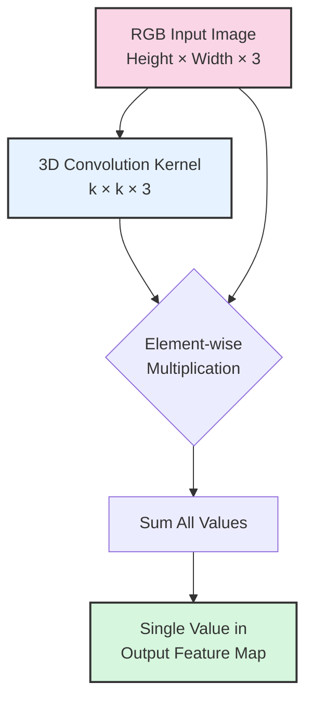

###### Feature Map Generation

While a single 3D kernel produces one 2D feature map, modern CNNs typically employ multiple kernels in each layer (often
32, 64, 128, or more). Each kernel detects different patterns, generating a separate feature map, and collectively these
feature maps form a new 3D volume that serves as input to the next layer.

For a convolutional layer with $n$ kernels operating on an RGB input image, the output will be a volume with dimensions:

$$
\text{output\_height} \times \text{output\_width} \times n
$$

Where output_height and output_width depend on the input dimensions, kernel size, stride, and padding (which we'll
explore in the next section).

###### Each 3D Kernel Produces One 2D Feature Map

This is a crucial point that often confuses students. Let me clarify this step by step.

###### How One 3D Kernel Creates One 2D Feature Map

When a **single 3D kernel** slides across a 3D input volume:

1. **At each spatial position**, the kernel performs the 3D convolution operation we just calculated
2. **Each position produces one scalar value** (like our result of 62.0)
3. **All these scalar values** form a 2D grid = **one 2D feature map**

###### Visual Example

For a $224×224×3$ RGB image with a $3×3×3$ kernel:

- The kernel slides to $(224-3+1) × (224-3+1) = 222×222$ different positions
- Each position produces **one number**
- Result: **One 2D feature map** of size $222×222$

###### Multiple Kernels Create Multiple Feature Maps

In practice, CNNs use **many different 3D kernels** in each layer:

**Example Layer Configuration:**

- Input: $224×224×3$ (RGB image)
- Number of kernels: $64$
- Kernel size: $3×3×3$
- Output: $222×222×64$

###### Breaking This Down

Each of the 64 kernels:

- Is a **3D kernel** (shape $3×3×3$)
- Produces **one 2D feature map** (shape $222×222$)
- Detects **different patterns** (edges, textures, colors, etc.)

###### The Key Transformation

$$
\text{3D Input Volume} \xRightarrow{\text{Multiple 3D Kernels}} \text{3D Output Volume}
$$

More specifically:

$$
H×W×C_{in} \xRightarrow{n \text{ kernels of size } k×k×C_{in}} H'×W'×n
$$

###### Why This Matters

- **Each 3D kernel** learns to detect a **specific pattern** across all input channels
- **Multiple kernels** allow the layer to detect **many different patterns** simultaneously
- The **output channels** ($n$) represent **different learned features**, not color channels

###### Concrete Example

Layer with 64 kernels might learn:

- Kernel 1: Horizontal edges in any color
- Kernel 2: Vertical edges in green areas
- Kernel 3: Red-to-blue color transitions
- Kernel 4: Circular shapes
- ... (60 more different patterns)

Each kernel produces its own 2D "activation map" showing where its specific pattern was detected in the image.

This transformation—from a 3-channel input to an n-channel output—represents a fundamental shift in how information is
encoded. The original RGB channels represent color information at each spatial location, but the output feature maps
represent detected patterns or features. The network has begun the process of abstraction, moving from raw pixel data
toward meaningful feature representations.

As an example, for a 224×224×3 RGB image processed by a convolutional layer with 64 filters of size 3×3×3, the output
would be a volume of size 222×222×64 (assuming no padding and stride 1). The spatial dimensions slightly decrease due to
the convolution operation, but the channel depth increases significantly.

Each position in this output volume has 64 values, representing the activation of 64 different feature detectors at that
spatial location. Some might respond to horizontal edges, others to vertical edges, others to specific colors or
textures. Collectively, they provide a rich, multi-dimensional representation of the visual content.

As we stack additional convolutional layers, the feature maps undergo further transformation:

1. **First layer**: Detects simple features like edges and color gradients (low-level features)
2. **Middle layers**: Combines these simple features into more complex patterns like textures and shapes (mid-level
   features)
3. **Deep layers**: Assembles complex features into object parts and eventually whole objects (high-level features)

The parameter count for a convolutional layer with 3D kernels can be calculated as:

$$
\text{Parameters} = n \times (k_h \times k_w \times c_{in} + 1)
$$

Where:

- $n$ is the number of kernels (output feature maps)
- $k_h$ and $k_w$ are the kernel's spatial dimensions
- $c_{in}$ is the number of input channels
- The +1 accounts for the bias term for each kernel

For example, a layer with 64 kernels of size 3×3 operating on an RGB input (3 channels) would have:
$$64 \times (3 \times 3 \times 3 + 1) = 64 \times 28 = 1,792$$ parameters.

This efficiency in parameter count—achieving rich feature extraction with relatively few parameters—is one of the key
advantages of convolutional layers compared to fully connected layers, especially for image data where spatial
relationships are critical.

Through multi-channel convolution operations with 3D kernels, CNNs transform raw pixel data into increasingly abstract
and task-relevant feature representations—the foundation upon which their remarkable visual recognition capabilities are
built.

##### Stride and Padding Strategies

When designing convolutional neural networks, precise control over spatial dimensions throughout the network becomes
critical. Two fundamental parameters—stride and padding—provide this control, acting as the primary mechanisms for
managing how information flows through the network's spatial hierarchy. Together, they allow architects to balance
feature extraction, computational efficiency, and spatial information preservation.

###### Dimensional Control Techniques

At its core, convolution involves sliding a kernel across an input feature map. How far the kernel moves after each
application is determined by the stride parameter. The relationship between input and output dimensions follows a
precise mathematical formula:

$$
\text{Output size} = \left\lfloor\frac{\text{Input size} + 2 \times \text{Padding} - \text{Kernel size}}{\text{Stride}}\right\rfloor + 1
$$

This formula applies to both height and width dimensions independently. Let's consider how different stride values
affect the output dimensions, assuming no padding for now.

With a stride of 1, the kernel moves one pixel at a time after each application, creating substantial overlap between
receptive fields. This yields the densest possible feature extraction but maintains almost the original spatial
dimensions (reduced only by kernel size - 1).

For example, applying a 3×3 kernel with stride 1 to a 7×7 input produces a 5×5 output:

$$
\left\lfloor\frac{7 + 0 - 3}{1}\right\rfloor + 1 = \lfloor 4 \rfloor + 1 = 5
$$

When we increase the stride to 2, the kernel skips every other position, effectively downsampling the feature map by
approximately half. The same 3×3 kernel with stride 2 on a 7×7 input produces a 3×3 output:

$$
\left\lfloor\frac{7 + 0 - 3}{2}\right\rfloor + 1 = \lfloor 2 \rfloor + 1 = 3
$$

Strided convolutions serve two essential purposes in CNN architecture:

1. **Dimensional reduction**: They provide a learnable alternative to pooling layers for downsampling feature maps,
   potentially preserving more information while reducing spatial dimensions.
2. **Computational efficiency**: By processing fewer spatial positions, strided convolutions reduce the computational
   load, allowing deeper networks with the same computational budget.

The stride parameter also affects the receptive field—the area in the input that influences a single output element.
With larger strides, the effective receptive field grows more quickly across layers, allowing deeper layers to "see"
more of the original input with fewer convolutions.

###### Convolution Parameter Management

Beyond stride, padding plays an equally important role in managing spatial information flow. Without padding, every
convolution operation reduces the spatial dimensions of the feature maps, causing two significant issues:

1. **Information loss**: Pixels at the edges participate in fewer convolutions than central pixels, creating an unwanted
   bias toward central content.
2. **Dimensional constraints**: Each layer reduces dimensions, limiting how deep the network can be before feature maps
   become too small.

Padding addresses these issues by adding extra border pixels around the input feature map. The most common approach is
zero-padding—surrounding the feature map with zeros. While simple, this approach has proven remarkably effective.

The amount of padding directly affects the output dimensions. By adding padding equal to
$\frac{\text{kernel size} - 1}{2}$ on each side, we can maintain the same spatial dimensions after convolution (when
using stride 1). This is often called "same" padding because the output size equals the input size.

For example, adding a padding of 1 to our previous example with a 3×3 kernel and stride 1:

$$
\left\lfloor\frac{7 + 2 \times 1 - 3}{1}\right\rfloor + 1 = \lfloor 6 \rfloor + 1 = 7
$$

This maintains the original 7×7 dimensions.

Beyond zero-padding, several alternative padding strategies exist, each with distinct properties:

1. **Reflection padding**: Border pixels mirror the nearest actual pixels, creating a reflection effect. This preserves
   texture continuity at the boundaries.
2. **Replication padding**: Border pixels copy the values of the nearest edge pixels. This extends edge features without
   creating new borders.
3. **Circular padding**: Pixels from the opposite side of the feature map wrap around to form the padding, treating the
   image as a topological torus. This is particularly useful for data with periodic structures.

Here's a visual comparison of these padding strategies on a small 4×4 feature map (letters represent pixel values):

Original feature map:

$$
\begin{array}{c}
\text{Original feature map:} \\
\begin{bmatrix}
A & B & C & D \\
E & F & G & H \\
I & J & K & L \\
M & N & O & P
\end{bmatrix}
\end{array}
$$

$$
\begin{array}{c}
\text{Zero padding (1 pixel):} \\
\begin{bmatrix}
0 & 0 & 0 & 0 & 0 & 0 \\
0 & A & B & C & D & 0 \\
0 & E & F & G & H & 0 \\
0 & I & J & K & L & 0 \\
0 & M & N & O & P & 0 \\
0 & 0 & 0 & 0 & 0 & 0
\end{bmatrix}
\end{array}
$$

$$
\begin{array}{c}
\text{Reflection padding (1 pixel):} \\
\begin{bmatrix}
F & E & F & G & H & G \\
B & A & B & C & D & C \\
F & E & F & G & H & G \\
J & I & J & K & L & K \\
N & M & N & O & P & O \\
J & I & J & K & L & K
\end{bmatrix}
\end{array}
$$

$$
\begin{array}{c}
\text{Replication padding (1 pixel):} \\
\begin{bmatrix}
A & A & A & B & C & D & D & D \\
A & A & A & B & C & D & D & D \\
E & E & E & F & G & H & H & H \\
I & I & I & J & K & L & L & L \\
M & M & M & N & O & P & P & P \\
M & M & M & N & O & P & P & P
\end{bmatrix}
\end{array}
$$

$$
\begin{array}{c}
\text{Circular padding (1 pixel):} \\
\begin{bmatrix}
P & M & N & O & P & M \\
D & A & B & C & D & A \\
H & E & F & G & H & E \\
L & I & J & K & L & I \\
P & M & N & O & P & M \\
D & A & B & C & D & A
\end{bmatrix}
\end{array}
$$

The choice of padding strategy should align with the natural properties of your data. For instance, reflection padding
works well for natural images, while circular padding suits periodic data like textures.

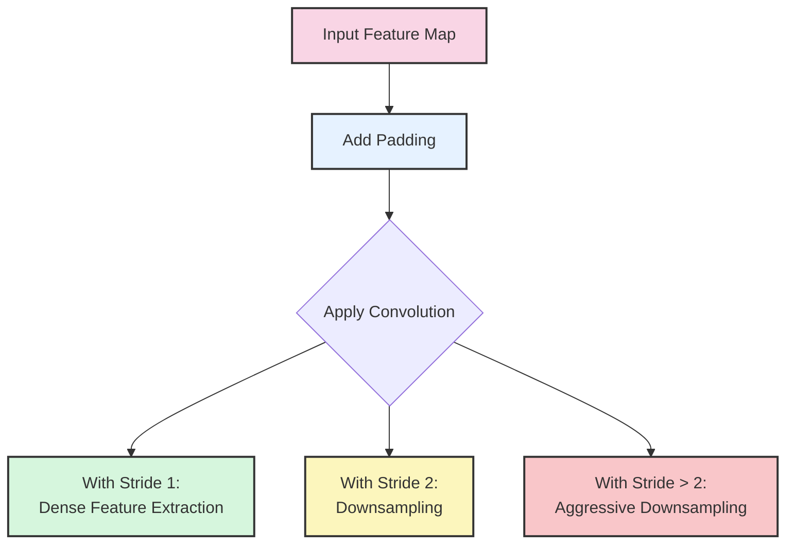

###### Spatial Information Preservation

One of the most critical architectural decisions in CNN design is how to manage spatial information throughout the
network. Aggressive downsampling reduces computational requirements but may discard important spatial details.
Conversely, preserving high resolution throughout the network increases computational demands substantially.

Two dominant design patterns have emerged for managing this tradeoff:

1. **Encoder-only networks** (typical for classification): These progressively reduce spatial dimensions while
   increasing channel depth, transforming spatial information into channel-wise feature representations. Information
   flows from spatially-dominant (high resolution, few channels) to channel-dominant (low resolution, many channels)
   representations.
2. **Encoder-decoder networks** (typical for segmentation): These first reduce dimensions (encoder) then recover them
   (decoder), creating an hourglass-shaped architecture. Skip connections often bridge the encoder and decoder to
   preserve spatial details that would otherwise be lost.

The choice between these patterns depends on the task. Classification primarily requires understanding what is present
in an image, while segmentation and detection require both what and where information.

Advanced techniques for spatial information preservation include:

1. **Dilated (atrous) convolutions**: These expand the receptive field without downsampling by inserting "holes" in the
   convolution kernel. For example, a 3×3 kernel with a dilation rate of 2 covers a 5×5 area while using only 9
   parameters:

    $$
           \begin{array}{cc}
           \text{Standard 3×3 kernel:} & \text{Dilated kernel (rate=2):} \\
           \\
           \begin{bmatrix}
           X & X & X \\
           X & X & X \\
           X & X & X
           \end{bmatrix} &
           \begin{bmatrix}
           X & \cdot & X & \cdot & X \\
           \cdot & \cdot & \cdot & \cdot & \cdot \\
           X & \cdot & X & \cdot & X \\
           \cdot & \cdot & \cdot & \cdot & \cdot \\
           X & \cdot & X & \cdot & X
           \end{bmatrix}
           \end{array}
    $$

    This allows deeper layers to access broader spatial context without reducing resolution, making dilated convolutions
    particularly valuable for segmentation tasks.

2. **Fractional strides/transposed convolutions**: These "upsampling convolutions" allow the network to learn how to
   increase spatial dimensions. While standard convolutions map from many input pixels to one output pixel, transposed
   convolutions map from one input to many outputs, effectively reversing the spatial reduction of standard
   convolutions.

Let's examine the effects of different stride and padding combinations on a concrete example. Suppose we have a 32×32
input feature map and a 3×3 convolution kernel. The following table shows how different combinations affect the output
dimensions:

| Padding | Stride | Output Size | Effect                                  |
| ------- | ------ | ----------- | --------------------------------------- |
| 0       | 1      | 30×30       | Mild reduction, dense extraction        |
| 1       | 1      | 32×32       | Maintained dimensions, dense extraction |
| 0       | 2      | 15×15       | Significant downsampling                |
| 1       | 2      | 16×16       | Exact halving of dimensions             |
| 2       | 1      | 34×34       | Spatial expansion (rare)                |
| 1       | 3      | 11×11       | Aggressive downsampling                 |

Modern CNN architectures typically adopt specific patterns for stride and padding:

1. **Early layers**: Often use stride 1 with padding to maintain resolution, focusing on extracting low-level features
   without spatial reduction.
2. **Intermediate layers**: Strategically placed strided convolutions (stride 2) perform downsampling at key points in
   the network, often between major blocks.
3. **Deep layers**: Continue with stride 1 and appropriate padding to maintain the reduced resolution while extracting
   high-level features.

For instance, ResNet architectures typically downsample the spatial dimensions by a factor of 2 (using either strided
convolutions or pooling) at specific transition points, while maintaining resolution within each residual block.

The impact of these spatial management strategies extends beyond just dimensions. They fundamentally affect:

1. **Computational efficiency**: Each 2× reduction in both height and width reduces computation by approximately 75% for
   subsequent layers.
2. **Feature hierarchy**: Downsampling encourages the network to focus on increasingly abstract features as spatial
   resolution decreases.
3. **Receptive field growth**: Each downsampling operation effectively multiplies the receptive field size of all
   subsequent layers.

By carefully balancing stride, padding, and network depth, CNN architects can create networks that efficiently transform
raw pixel data into meaningful hierarchical representations while preserving the spatial information necessary for the
task at hand.

##### Advanced Pooling Techniques

Pooling operations serve as a critical component in convolutional neural networks, providing an elegant solution to
multiple architectural challenges. While convolution layers detect features through learned weight patterns, pooling
layers implement fixed, deterministic operations that summarize spatial information. This fundamental difference gives
pooling its distinctive role in modern CNN architectures.

**1. Max Pooling**

Max pooling, the most widely implemented pooling technique, operates on a simple yet powerful principle: within each
local region, preserve only the strongest activation while discarding all others. The operation applies a sliding window
(typically 2×2) across the input feature map and selects the maximum value within each window position.

Consider a concrete example with a 4×4 feature map and a 2×2 max pooling operation:

$$
\begin{array}{c}
\text{Feature map:} \\
\begin{bmatrix}
3.1 & 0.5 & 2.3 & 1.7 \\
8.2 & 2.1 & 7.4 & 0.9 \\
1.8 & 5.1 & 4.0 & 3.5 \\
3.7 & 2.5 & 9.3 & 1.2
\end{bmatrix}
\end{array}
\quad \rightarrow \quad
\begin{array}{c}
\text{After 2×2 max pooling:} \\
\begin{bmatrix}
8.2 & 7.4 \\
5.1 & 9.3
\end{bmatrix}
\end{array}
$$

This operation reduces the spatial dimensions by half in both height and width while preserving the strongest
activations. The biological intuition behind max pooling relates to how visual systems process information—we're more
sensitive to the presence of a feature than to its exact location within a small region.

Max pooling provides several significant benefits:

1. **Translational invariance**: The exact position of a feature within the pooling window becomes less important,
   helping the network recognize patterns regardless of slight positional shifts. For example, an edge feature will be
   preserved whether it appears at the top or bottom of the pooling window.
2. **Noise suppression**: By selecting the strongest signal, max pooling naturally filters out weaker activations that
   might represent noise rather than meaningful features.
3. **Feature distillation**: The operation effectively asks: "Is this feature present anywhere in this local region?"
   rather than "Where exactly is this feature?" This distillation keeps the most salient information while reducing
   dimensionality.
4. **Computational efficiency**: Reducing spatial dimensions decreases the computational load for all subsequent layers.
   A 2×2 pooling with stride 2 reduces the feature map area by 75%, correspondingly reducing computation in later
   layers.

The statistical effect of max pooling is to transform the distribution of activations by selecting local maxima. This
tends to create sparser, more peaked distributions in subsequent layers, which can help with feature discrimination.

**2. Average Pooling**

Average pooling takes a fundamentally different approach to summarization: instead of selecting the strongest
activation, it computes the mean of all values within each window. Using our previous example:

$$
\begin{array}{c}
\text{Feature map:} \\
\begin{bmatrix}
3.1 & 0.5 & 2.3 & 1.7 \\
8.2 & 2.1 & 7.4 & 0.9 \\
1.8 & 5.1 & 4.0 & 3.5 \\
3.7 & 2.5 & 9.3 & 1.2
\end{bmatrix}
\end{array}
\quad \rightarrow \quad
\begin{array}{c}
\text{After 2×2 average pooling:} \\
\begin{bmatrix}
3.48 & 3.08 \\
3.28 & 4.50
\end{bmatrix}
\end{array}
$$

The average for the top-left window is (3.1 + 0.5 + 8.2 + 2.1) / 4 = 3.48, and so on for each window position.

While less commonly used than max pooling in general architectures, average pooling offers distinct advantages in
specific scenarios:

1. **Texture representation**: Average pooling captures the overall activation pattern across a region, making it
   particularly effective for texture analysis where collective statistics matter more than individual peak responses.
2. **Background modeling**: Areas with uniform or gradually changing patterns are better represented by averages than by
   maximum values, making average pooling valuable for capturing background contexts.
3. **Signal smoothing**: The averaging operation provides a natural smoothing effect that can help reduce high-frequency
   variations and noise, though at the cost of potentially dulling strong feature responses.
4. **Gradient stability**: During backpropagation, average pooling distributes gradients to all elements in the pooling
   window, potentially creating more stable gradient flow compared to max pooling, which routes gradients only through
   the maximum element.

The statistical effect of average pooling is to make the activation distributions more Gaussian-like, following the
central limit theorem. This contrasts with max pooling's tendency to create more peaked, non-Gaussian distributions.

At a theoretical level, the choice between max and average pooling reflects a fundamental question: Is the presence of a
feature (max) or its average intensity (mean) more important for the task at hand? Most image classification tasks
benefit from presence detection, explaining max pooling's dominance, but tasks involving texture discrimination or
overall intensity patterns may benefit from average pooling.

**3. Global Pooling Methods**

Global pooling extends the pooling concept to its logical extreme by applying the pooling operation across the entire
spatial dimensions of each feature map. Rather than producing a spatially reduced feature map, global pooling collapses
each feature map into a single value, creating a vector with length equal to the number of input feature maps.

The two primary variants of global pooling follow naturally from local pooling:

**I. Global Max Pooling (GMP)**: Extracts the maximum value from each entire feature map:

$$
\begin{array}{c}
\text{Feature map (8×8):} \\
\begin{bmatrix}
1.2 & 3.4 & \cdots & 2.1 \\
5.6 & 2.3 & \cdots & 1.5 \\
\cdots & \cdots & \cdots & \cdots \\
8.2 & 9.7 & \cdots & 3.3 \\
2.5 & 4.6 & \cdots & 5.9
\end{bmatrix}
\end{array}
\quad \rightarrow \quad
\begin{array}{c}
\text{After Global Max Pooling:} \\
\begin{bmatrix}
9.7
\end{bmatrix}
\end{array}
$$

This produces a single value that represents the strongest activation of that feature anywhere in the input.

**II. Global Average Pooling (GAP)**: Computes the mean across the entire feature map:

$$
\begin{array}{c}
\text{Feature map (8×8):} \\
\begin{bmatrix}
1.2 & 3.4 & \cdots & 2.1 \\
5.6 & 2.3 & \cdots & 1.5 \\
\cdots & \cdots & \cdots & \cdots \\
8.2 & 9.7 & \cdots & 3.3 \\
2.5 & 4.6 & \cdots & 5.9
\end{bmatrix}
\end{array}
\quad \rightarrow \quad
\begin{array}{c}
\text{After Global Average Pooling:} \\
\begin{bmatrix}
4.35
\end{bmatrix}
\end{array}
$$

This produces a value representing the average activation level of that feature across the input.

Global pooling, particularly Global Average Pooling, has become increasingly important in modern architectures for
several compelling reasons:

1. **Parameter reduction**: Traditional architectures often flattened the final convolutional feature maps and connected
   them to fully-connected layers, creating millions of parameters. Global pooling eliminates this parameter explosion
   by reducing each feature map to a single value before classification.
2. **Spatial invariance**: By collapsing spatial dimensions completely, global pooling achieves full spatial
   invariance—the network becomes entirely insensitive to where features appear, focusing solely on their presence or
   average intensity.
3. **Variable input handling**: Networks with global pooling can process inputs of various spatial dimensions since the
   pooling operation always produces a fixed-length output regardless of input size.
4. **Interpretability**: Each value in the global pooling output directly corresponds to the presence or average
   intensity of a specific high-level feature, creating a more interpretable representation than flattened feature maps.

In networks like ResNet, NIN (Network in Network), and GoogLeNet, Global Average Pooling has replaced the traditional
fully-connected layers at the network's end, reducing parameters while improving generalization. For example, in a
ResNet with 2048 final feature maps of size 7×7, replacing the flattened representation (2048×7×7 = 100,352 values) with
GAP (2048 values) dramatically reduces the parameter count in the final classification layer.

The choice between GMP and GAP again reflects the question of whether peak response or average activation better
represents the relevant features for the task. GAP has become more common in modern architectures, partly due to its
regularization effect and more stable training dynamics.

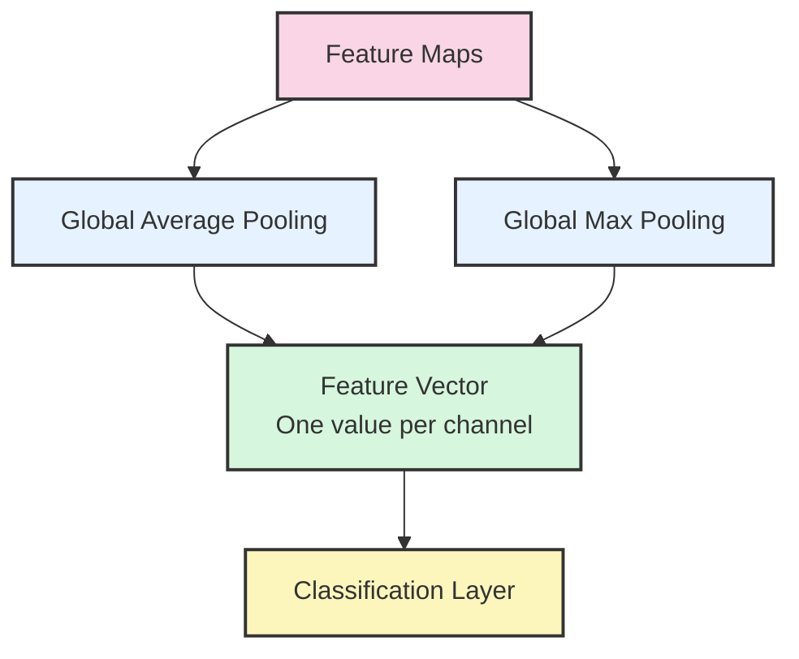

##### Dimensional Reduction Strategies

Beyond standard pooling operations, several specialized pooling variants and alternative dimensional reduction
strategies have emerged to address specific challenges:

**1. Mixed Pooling**: This approach takes a weighted combination of max and average pooling:

$$
\text{MixedPool}(x) = \alpha \cdot \max(x) + (1-\alpha) \cdot \text{avg}(x)
$$

where $\alpha$ is a learnable parameter or a fixed hyperparameter between 0 and 1. This allows the network to blend the
benefits of both pooling types, sometimes providing better performance than either method alone.

**2. Stochastic Pooling**: Instead of deterministically selecting the maximum, stochastic pooling randomly selects a
value from the pooling region with probability proportional to the activation value:

$$
 P(x_i \text{ is selected}) = \frac{x_i}{\sum_j x_j}
$$

This introduces a form of regularization during training (sampling different values each time) while approximating max
pooling during inference. This helps prevent overfitting by injecting beneficial noise into the pooling operation.

**3. Spatial Pyramid Pooling**: Rather than applying a single pooling operation, spatial pyramid pooling divides the
feature map into increasingly fine sub-regions and pools each region separately. For example, a three-level pyramid
might:

- Pool the entire feature map (1×1 grid)
- Pool each quadrant (2×2 grid)
- Pool each 1/16th section (4×4 grid)

The pooled values are then concatenated, creating a fixed-length vector regardless of input dimensions. This approach
captures information at multiple spatial scales simultaneously.

**4. Fractional Max Pooling**: This technique uses non-integer pooling window sizes to achieve more granular
downsampling ratios. For instance, rather than halving dimensions with a 2×2 pool, fractional pooling might reduce
dimensions by a factor of 1.5, allowing finer control over the spatial dimension reduction throughout the network.

**5. Lp Pooling**: This generalization of pooling operations uses the p-norm:

$$
\text{LpPool}(x) = \left( \sum_i |x_i|^p \right)^{1/p}
$$

When p=1, this becomes average pooling (scaled by the window size). As p→∞, it approaches max pooling. Using
intermediate values like p=2 (corresponding to Euclidean norm) provides behavior between these extremes.

**6. Adaptive Pooling**: Rather than specifying the pooling window size, adaptive pooling specifies the desired output
dimensions and automatically computes the appropriate pooling parameters to achieve exactly that output size.

Imagine you have a variable-sized input (like images of different resolutions) but need a fixed-size output (like a 7×7
feature map for classification). Adaptive pooling divides the input into regions and pools each region to produce
exactly the desired output.

For an input of size $H_{in} \times W_{in}$ and desired output size $H_{out} \times W_{out}$, adaptive pooling computes:

For each output position $(i, j)$ where $0 \leq i < H_{out}$ and $0 \leq j < W_{out}$:

$$
 \begin{align}
 \text{start}_h &= \left\lfloor \frac{i \cdot H_{in}}{H_{out}} \right\rfloor \\
 \text{end}_h &= \left\lfloor \frac{(i+1) \cdot H_{in}}{H_{out}} \right\rfloor \\
 \text{start}_w &= \left\lfloor \frac{j \cdot W_{in}}{W_{out}} \right\rfloor \\
 \text{end}_w &= \left\lfloor \frac{(j+1) \cdot W_{in}}{W_{out}} \right\rfloor
 \end{align}
$$

Then:

$$
 \text{output}[i,j] = \text{Pool}(\text{input}[\text{start}_h:\text{end}_h, \text{start}_w:\text{end}_w])
$$

**Numerical Example**: Consider adaptive max pooling from 14×14 input to 7×7 output:

- Output position (0,0): pools input region [0:2, 0:2] → 2×2 window
- Output position (3,3): pools input region [6:8, 6:8] → 2×2 window
- Output position (6,6): pools input region [12:14, 12:14] → 2×2 window

**Another Example**: From 15×15 input to 7×7 output:

- Output position (0,0): pools input region [0:2, 0:2] → 2×2 window
- Output position (3,3): pools input region [6:9, 6:9] → 3×3 window
- Output position (6,6): pools input region [12:15, 12:15] → 3×3 window

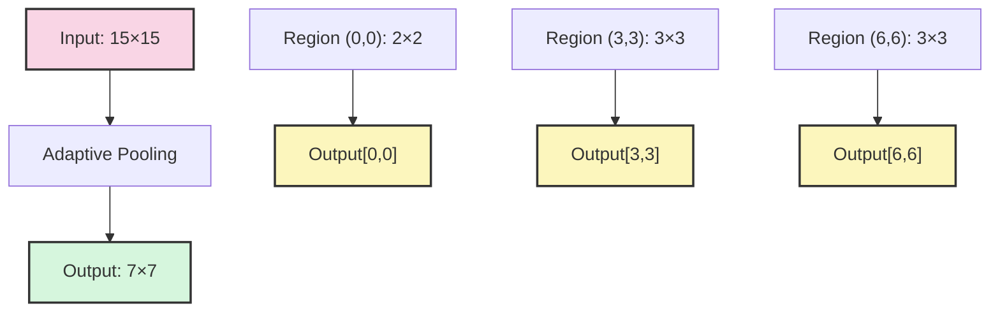

Unlike regular pooling with fixed windows, adaptive pooling uses **variable-sized windows** that automatically adjust to
ensure the output has exactly the specified dimensions, regardless of input size. This technique is particularly
valuable for handling variable-sized inputs or for creating architectures that can be applied to different resolution
images.

**7. Strided Convolutions as Pooling Alternatives**: Many modern architectures use strided convolutions (convolutions
with stride ≥ 2) in place of traditional pooling operations. This approach treats downsampling as a learnable operation
rather than a fixed function, potentially preserving more information during dimensionality reduction.

The theoretical advantages of learnable downsampling have led some architectures (like All-Convolutional Networks) to
replace pooling entirely with strided convolutions. However, the inductive bias provided by pooling
operations—particularly their built-in invariance properties—continues to make them valuable in many architectures.

When selecting a dimensional reduction strategy, consider these factors:

- **Information preservation**: How much detail needs to be preserved? Max pooling retains strong activations but
  discards subtler patterns; average pooling preserves overall intensity but may dilute strong signals.
- **Computational efficiency**: How much dimensionality reduction is appropriate? Aggressive pooling (larger windows or
  strides) reduces computation but may discard valuable information.
- **Translation invariance**: How important is position invariance? Larger pooling windows increase invariance to
  positional shifts but reduce spatial precision.
- **Network depth**: How does pooling interact with overall architecture? Deeper networks typically require more
  aggressive pooling to manage computational complexity in later layers.

In practice, most successful CNN architectures use a combination of techniques—typically max pooling for early
dimensionality reduction followed by global average pooling at the network's end. This hybrid approach leverages the
distinct advantages of different pooling methods at appropriate stages in the feature hierarchy.

The choice of pooling strategy directly impacts how spatial information flows through the network, making it a critical
architectural decision that shapes both computational efficiency and representational capabilities. As with many deep
learning design choices, the optimal strategy depends on the specific requirements of the task at hand and the
computational constraints of the deployment environment.

---

##### CNN Architecture Design

Modern CNN architectures can be conceptualized as sophisticated information processing pipelines, transforming raw pixel
data into meaningful representations through a carefully orchestrated sequence of operations. Rather than viewing CNNs
as monolithic structures, it is more illuminating to understand them as modular systems with distinct functional
components. This modular perspective not only clarifies how CNNs work but also guides the development of new
architectures tailored to specific tasks.

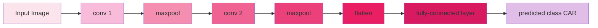

###### Backbone Network Structure

The backbone forms the core feature extraction machinery of a CNN, responsible for transforming raw image data into
increasingly abstract visual representations. This transformation follows a characteristic pattern where spatial
dimensions gradually decrease while feature channel depth increases—a pattern that mirrors the hierarchical nature of
visual perception itself.

The backbone typically consists of multiple stages or blocks, each operating at a different spatial resolution and
feature complexity level. For instance, a ResNet-50 backbone contains five main stages:

**1. Initial stage**: Begins with a 7×7 convolution with stride 2, followed by max pooling, dramatically reducing
spatial dimensions while creating the initial feature representation.

**2. Early stage**: Operates at 1/4 of the input resolution with relatively few channels (64), focusing on low-level
features like edges and textures.

**3. Middle stages**: Progressively reduce resolution while increasing channel depth (128→256), capturing mid-level
features like shapes and parts.

**4. Final stage**: Operates at 1/32 of the input resolution with many channels (2048), representing high-level semantic
concepts.

The transitions between stages typically involve spatial downsampling (via strided convolutions or pooling) coupled with
channel expansion, creating a characteristic pyramid-like structure in the feature hierarchy. Within each stage, modern
backbones employ distinctive block designs that determine how information flows:

**1. Plain blocks** (VGG-style): Simple sequences of convolutions with non-linearities, creating a purely sequential
information flow.

**2. Residual blocks** (ResNet-style): Add identity skip connections that enable direct information flow from earlier to
later layers, helping combat the vanishing gradient problem:

$$
 y = F(x, {W_i}) + x
$$

Where $F(x, {W_i})$ represents the residual mapping to be learned and $x$ is the input to the block.

**3. Dense blocks** (DenseNet-style): Connect each layer to all subsequent layers, creating rich feature reuse:

$$
x_l = H_l([x_0, x_1, ..., x_{l-1}])
$$

Where $[x_0, x_1, ..., x_{l-1}]$ represents the concatenation of all previous feature maps.

**4. Inception blocks**: Process the input in parallel through multiple convolutional paths with different kernel sizes,
then concatenate the results, allowing multi-scale feature extraction within a single layer.

The computational complexity of the backbone typically follows a balanced distribution, where early stages (with large
spatial dimensions) use fewer channels and simple operations, while later stages (with small spatial dimensions) use
more complex operations and deeper channel dimensions. This design principle allows efficient allocation of
computational resources throughout the network.

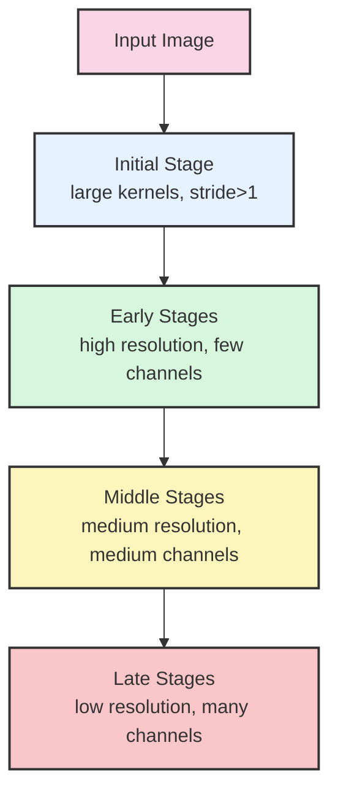

The design of backbone architecture significantly impacts both computational efficiency and representational power. For
instance, a ResNet-50 backbone contains approximately 23 million parameters and requires about 4 billion FLOPs
(floating-point operations) for a single forward pass with a 224×224 input. In contrast, a MobileNetV2 backbone—designed
for efficiency—uses only 3.5 million parameters and 300 million FLOPs for the same input size, albeit with some
reduction in representational capacity.

---

#### Feature Extraction Principles

##### Effectiveness of Backbone

The backbone's effectiveness stems from its adherence to several fundamental principles of visual feature extraction:

**1. Hierarchical representation**: The backbone builds increasingly abstract features through its layered structure.
This hierarchy mirrors the human visual system, where early visual cortex areas process simple features while higher
areas respond to complex objects and scenes.

**2. Locality and spatial awareness**: Through the use of convolutional operations with small kernels (typically 3×3),
the network preserves spatial relationships between features. This locality principle ensures that features remain
spatially coherent throughout the processing pipeline.

**3. Translation equivariance**: Convolutional operations ensure that features are detected regardless of their position
in the image. If a feature shifts position in the input, its representation shifts correspondingly in the feature maps.

**4. Progressive abstraction**: As information flows through the backbone, there's a gradual transition from
spatial-dominant representation (where information is encoded primarily in the spatial arrangement of features) to
channel-dominant representation (where information is encoded in the pattern of channel activations).

**5. Multi-scale processing**: Effective backbones capture information at multiple scales, either explicitly through
parallel paths with different receptive fields (as in Inception networks) or implicitly through the increasing receptive
field size in deeper layers.

<div align="center">
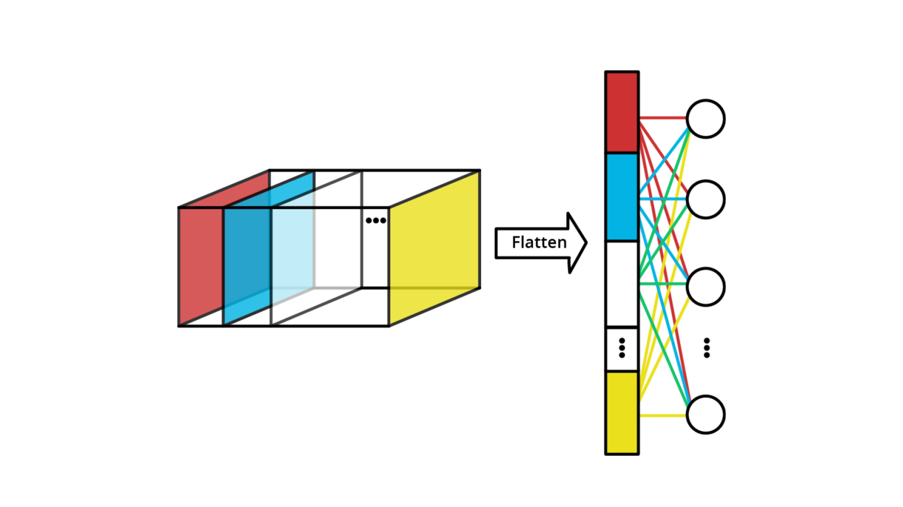
<p align="center">figure: Formation of the feature vector</p>
</div>
The effectiveness of these principles can be visualized by examining network activations at different depths. In early
layers, feature maps show edge-like responses that closely resemble the input image structure. In middle layers, more
complex patterns emerge, often responding to specific textures or shapes. In deep layers, feature maps become more
abstract and semantically meaningful, with individual channels sometimes activating selectively for particular object
categories.

The receptive field—the region in the input image that influences a particular activation—grows progressively through
the backbone:

- In a typical CNN with 3×3 kernels and occasional downsampling, the theoretical receptive field grows linearly with
  depth in terms of layer count, but exponentially in terms of input pixels due to the downsampling operations.
- For instance, after 5 layers of 3×3 convolutions with no downsampling, a neuron "sees" an 11×11 patch of the input.
  Add two 2× downsampling operations, and the effective receptive field expands to cover a 44×44 region in the original
  input.
- Research has shown that the effective receptive field (the input region that actually impacts the activation
  significantly) is often smaller than the theoretical receptive field and follows a Gaussian-like distribution, with
  central pixels having more influence than peripheral ones.

This progressive expansion of the receptive field enables the backbone to capture increasingly complex visual patterns
that span larger portions of the image, a critical capability for recognizing objects and scenes.

##### Neck and Head Components

While the backbone provides rich feature representations, most computer vision tasks require additional components to
transform these features into task-specific outputs. This is where neck and head components come into play. The **neck**
sits between the backbone and task-specific heads, serving as an adaptation and enhancement layer that:

**1. Fuses multi-scale features**: Many advanced architectures use Feature Pyramid Networks (FPN) or similar structures
in the neck to combine features from different backbone levels, creating enhanced representations that preserve both
semantic richness and spatial precision.

**2. Refines representations**: Through additional processing, the neck can enhance features before they reach
task-specific heads. This might involve attention mechanisms that highlight relevant features, context modules that
capture global information, or simply additional convolutional layers that increase representational capacity.

**3. Adapts feature dimensions**: The neck often adjusts channel dimensions to meet the requirements of subsequent head
components, typically reducing the high channel dimensions from the backbone's final stages to more manageable sizes.

For classification tasks, the neck might be as simple as a global pooling operation that collapses spatial dimensions,
creating a fixed-length feature vector regardless of input size. For more complex tasks like detection or segmentation,
elaborate neck structures like FPN are common:

$$
P_l = \text{Conv}(U(P_{l+1}) + \text{Lateral}(C_l))
$$

Where:

- $P_l$ is the feature map at level $l$ in the pyramid
- $U$ is an upsampling operation
- $C_l$ is the corresponding backbone feature map
- $\text{Lateral}$ is a 1×1 convolution that adjusts channel dimensions

This equation captures the core operation in FPN, where higher-level (more semantic but spatially coarse) features are
upsampled and combined with lower-level (less semantic but spatially precise) features, creating enhanced
representations at each resolution level.

##### Head Components

The **head** components are task-specific modules that transform the enhanced features from the neck into final outputs.
Different computer vision tasks require specialized head designs:

**1. Classification head**: Typically a simple structure consisting of one or more fully-connected layers. For a
1000-class classification problem, the final layer would have 1000 output units with a softmax activation.

**2. Object detection head**: Usually consists of two parallel branches—a classification branch that predicts object
categories and a regression branch that predicts bounding box coordinates. In architectures like Faster R-CNN, this
extends to region proposal heads and ROI-based prediction heads.

**3. Segmentation head**: Transforms feature maps into pixel-level predictions, often using transposed convolutions to
upsample features back to the original input resolution for dense prediction.

The distinction between backbone, neck, and head creates a modular architecture that allows components to be mixed and
matched. For instance, a ResNet backbone might be combined with an FPN neck and various heads for different tasks,
creating a flexible architecture family rather than a single fixed network.

<div align="center">
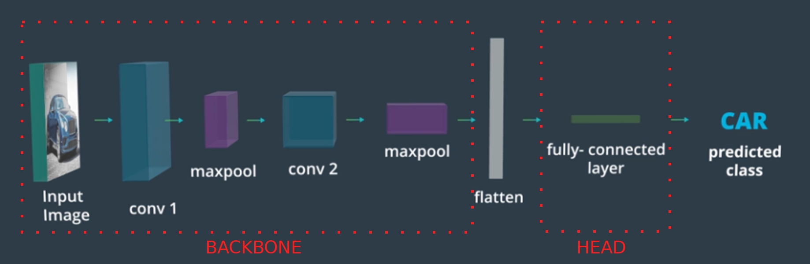
<p align="center">figure:  CNN Architecture Design</p>
</div>
---

##### Channel Progression Strategies

The management of feature channels throughout a CNN represents one of the most critical architectural design choices,
directly impacting both representational capacity and computational efficiency. Modern architectures employ
sophisticated strategies for channel progression that balance these competing concerns. The classic channel progression
pattern involves steady expansion through the network:

**I. Input**: 3 channels (RGB)

**II. Early stages**: 64-128 channels

**III. Middle stages**: 256-512 channels

**IV. Late stages**: 512-2048 channels

This expansion pattern aligns with the increasing abstraction of features—as the network detects more complex patterns,
it needs more channels to represent the growing variety of features. However, naive channel expansion leads to
computational inefficiency, particularly when applied to large spatial dimensions.

##### Why Channels Increase Through CNN Layers

The increasing channel progression serves several fundamental purposes that align with how visual perception works and
how CNNs learn hierarchical features.

###### Reason 1: Increasing Feature Complexity

As we go deeper in the network:

- **Early layers**: Detect simple patterns (edges, corners, basic textures)
- **Middle layers**: Combine simple features into complex shapes, patterns, textures
- **Late layers**: Recognize object parts, full objects, scenes

**More complex patterns require more channels** to represent the growing variety of features the network needs to
distinguish.

###### Reason 2: Spatial vs. Channel Trade-off

CNNs follow a fundamental trade-off pattern:

$$ \text{Spatial Resolution} \downarrow \quad \text{while} \quad \text{Channel Depth} \uparrow $$

**Early Layers:**

- High spatial resolution ($224×224$)
- Few channels ($64$)
- Focus on **where** features are located

**Late Layers:**

- Low spatial resolution ($7×7$)
- Many channels ($2048$)
- Focus on **what** features are present

###### Reason 3: Feature Diversity Explosion

Consider what happens at each stage:

**Stage 1 (64 channels):** Might detect:

- 20 different edge orientations
- 15 different color gradients
- 10 different texture patterns
- 19 other low-level features

**Stage 3 (512 channels):** Might detect:

- 100 different shape combinations
- 150 different texture patterns
- 80 different color/shape relationships
- 182 other mid-level features

The number of **possible combinations** grows exponentially, requiring more channels.

###### Reason 4: Computational Efficiency

This seems counterintuitive, but increasing channels while decreasing spatial dimensions is **computationally
efficient**:

**Example Calculation:**

- Layer 1: $224×224×64 = 3.2M$ activations
- Layer 4: $28×28×512 = 0.4M$ activations

Even with 8× more channels, we have **8× fewer total activations** due to spatial reduction.

###### Reason 5: Information Preservation

As spatial dimensions shrink (due to pooling/striding), we **risk losing information**. Increasing channels compensates
by:

- Encoding spatial information into **channel relationships**
- Preserving feature details that would be lost through downsampling
- Creating **richer representations** at each spatial location

###### Mathematical Perspective

The total "information capacity" can be thought of as:

$$ \text{Information Capacity} \approx \text{Height} × \text{Width} × \text{Channels} $$

By increasing channels as spatial dimensions decrease, we maintain or even increase the total representational capacity.

###### Biological Analogy

This mirrors the **visual cortex hierarchy**:

- **V1 (early)**: Simple cells detect edges, orientations
- **V2 (middle)**: Complex cells detect shapes, textures
- **V4/IT (late)**: Object-selective cells detect specific objects

Each stage needs more **specialized detectors** (analogous to channels) to handle increasing complexity.

###### Practical Example

Imagine recognizing a car:

- **64 channels**: Detect wheels (circles), edges, metal textures
- **256 channels**: Detect wheel-body combinations, door shapes, window patterns
- **512 channels**: Detect "car-like" assemblies of parts
- **2048 channels**: Distinguish between sedan, SUV, truck, specific car models

Each stage requires **more specialized feature detectors** to make finer distinctions.

###### The Bottom Line

Channel progression reflects the **hierarchical nature of visual understanding**: simple features combine into complex
concepts, and representing this complexity requires progressively more specialized feature channels while spatial
precision becomes less critical.

---

##### What is Convolution?

Convolution is a **mathematical operation** that combines two functions to produce a third function. In CNNs, it's the
fundamental operation used to detect patterns in images.

###### Mathematical Definition

For two functions $f$ and $g$, their convolution is:

$$
(f * g)(t) = \int_{-\infty}^{\infty} f(\tau) \cdot g(t - \tau) , d\tau
$$

But in CNNs, we use **discrete convolution** on 2D grids (images).

###### Discrete 2D Convolution for Images

For an image $I$ and a kernel $K$, convolution is:

$$
S(i,j) = \sum_m \sum_n I(i+m, j+n) \cdot K(m,n)
$$

Where:

- $S(i,j)$ is the output at position $(i,j)$
- $I$ is the input image
- $K$ is the convolution kernel (filter)

###### Step-by-Step Process

**1. Place the Kernel:** Position a small matrix (kernel) over a region of the image

**2. Element-wise Multiply:** Multiply each kernel value with the corresponding image pixel

**3. Sum All Products:** Add up all the multiplication results to get one output value

**4. Slide and Repeat:** Move the kernel to the next position and repeat

###### Simple Example

**Image (3×3):**

```
[1  2  3]
[4  5  6]
[7  8  9]
```

**Kernel (2×2):**

```
[1  0]
[0  1]
```

**Convolution Process:**

**Position 1 (top-left):**

```
Image patch:     Kernel:      Calculation:
[1  2]     ×     [1  0]   =   1×1 + 2×0 + 4×0 + 5×1 = 6
[4  5]           [0  1]
```

**Position 2 (top-right):**

```
Image patch:     Kernel:      Calculation:
[2  3]     ×     [1  0]   =   2×1 + 3×0 + 5×0 + 6×1 = 8
[5  6]           [0  1]
```

**Continue for all positions...**

**Final Output (2×2):**

```
[6   8]
[12  14]
```

###### What Convolution Actually Does

**Pattern Detection:** Different kernels detect different patterns:

**Edge Detection Kernel:**

```
[-1  -1  -1]
[ 0   0   0]
[ 1   1   1]
```

Detects horizontal edges

**Blur Kernel:**

```
[1/9  1/9  1/9]
[1/9  1/9  1/9]
[1/9  1/9  1/9]
```

Smooths the image

**Sharpen Kernel:**

```
[ 0  -1   0]
[-1   5  -1]
[ 0  -1   0]
```

Enhances edges

###### Why Use Convolution in CNNs?

**1. Local Pattern Detection:** Kernels look at small local regions to find patterns

**2. Translation Invariance:** The same pattern is detected regardless of where it appears in the image

**3. Parameter Sharing:** One kernel is used across the entire image, reducing the number of parameters

**4. Hierarchical Features:** Stacking convolutions builds complex features from simple ones

###### Key Properties

**1. Spatial Locality:** Only nearby pixels influence each output value

**2. Weight Sharing:** The same kernel weights are used at every position

**3. Feature Maps:** Each kernel produces a feature map showing where its pattern was detected

###### Intuitive Understanding

Think of convolution as **sliding a pattern detector** across an image:

- The kernel defines **what pattern** to look for
- The output shows **where and how strongly** that pattern appears
- Different kernels detect different types of patterns

###### In CNN Context

CNNs use **many different kernels** in each layer:

- Each kernel learns to detect a **specific pattern**
- The collection of all kernels creates a **rich representation** of the image
- Deeper layers detect increasingly **complex patterns** by combining simpler ones

This is why convolution is the core operation in CNNs - it efficiently extracts meaningful features from images while
preserving spatial relationships.

---

##### Understanding the Three Types of Convolutions in Bottleneck Design

Let me break down each convolution type and why this bottleneck strategy is so effective.

###### The Direct Approach (What We're Avoiding)

**Standard 3×3 Convolution:**

- Input: $256$ channels
- Output: $256$ channels
- Kernel size: $3×3$
- **Parameters:** $256 \times 256 \times 3 \times 3 = 589,824$ parameters

This means we have $256$ different $3×3×256$ kernels (one for each output channel).

###### Bottleneck Approach: Three-Stage Process

**Stage 1: 1×1 Convolution (Channel Reduction)**

- Purpose: **Dimensionality reduction**
- Input: $256$ channels
- Output: $64$ channels
- Kernel size: $1×1×256$ (for each output channel)
- **Parameters:** $256 \times 64 \times 1 \times 1 = 16,384$ parameters

**What this does:** Takes all $256$ input channels and creates a **compressed representation** with only $64$ channels.
Think of it as "summarizing" the information.

###### Stage 2: 3×3 Convolution (Spatial Processing)

- Purpose: **Spatial feature extraction**
- Input: $64$ channels (compressed)
- Output: $64$ channels
- Kernel size: $3×3×64$
- **Parameters:** $64 \times 64 \times 3 \times 3 = 36,864$ parameters

**What this does:** Performs the actual spatial pattern detection, but on the **compressed representation** instead of
the full $256$ channels.

###### Stage 3: 1×1 Convolution (Channel Expansion)

- Purpose: **Dimensionality restoration**
- Input: $64$ channels
- Output: $256$ channels
- Kernel size: $1×1×64$
- **Parameters:** $64 \times 256 \times 1 \times 1 = 16,384$ parameters

**What this does:** **Expands** the processed features back to the original channel dimension.

###### Total Parameter Calculation

**Bottleneck Total:**

$$
16,384 + 36,864 + 16,384 = 69,632 \text{ parameters}
$$

**Note:** The document shows $81,920$, which might include bias terms or slightly different dimensions.

###### Why This Works: The Key Insight

**1×1 Convolutions are "Channel Mixers":**

- They **don't look at spatial neighbors** (no spatial pattern detection)
- They **combine information across channels** at each spatial location
- Much **cheaper computationally** than $3×3$ convolutions

**The Strategy:**

1. **Compress:** Mix channels to create a compact representation
2. **Process:** Do expensive spatial processing on the compact version
3. **Expand:** Mix channels again to restore full dimensionality

###### Intuitive Analogy

Think of it like **video compression:**

1. **Compress** the video to smaller size (1×1 reduction)
2. **Edit** the compressed video (3×3 processing)
3. **Decompress** back to full quality (1×1 expansion)

The editing step is much faster on the compressed version, but we still get good final quality.

###### Computational Savings Breakdown

**Direct approach:** All spatial processing happens at full $256$ channels **Bottleneck approach:** Spatial processing
happens at reduced $64$ channels

**Ratio of 3×3 computation:**

$$
\frac{64 \times 64 \times 3 \times 3}{256 \times 256 \times 3 \times 3} = \frac{64^2}{256^2} = \frac{1}{16}
$$

The bottleneck reduces the expensive spatial processing by **16×** while maintaining similar representational power
through the channel mixing operations.

###### Why It Maintains Performance

The key insight is that **most channel interactions don't require spatial processing**. The 1×1 convolutions can
effectively mix channel information, while the 3×3 convolution focuses purely on spatial relationships in the compressed
space.

###### Breaking Down the Parameter Calculation

The calculation $256 \times 256 \times 3 \times 3$ can be confusing. Let me explain where each number comes from.

###### Understanding the Kernel Structure

For a standard convolution with:

- **Input:** $256$ channels
- **Output:** $256$ channels
- **Kernel size:** $3 \times 3$

We need **one separate kernel for each output channel**.

###### Each Individual Kernel

**Single Kernel Dimensions:**

- Spatial size: $3 \times 3$
- Depth: $256$ (must match input channels)
- **Total weights per kernel:** $3 \times 3 \times 256 = 2,304$ weights

###### Why We Need 256 Kernels

Since we want $256$ output channels, we need:

- **Kernel 1:** Produces output channel 1
- **Kernel 2:** Produces output channel 2
- **Kernel 3:** Produces output channel 3
- ...
- **Kernel 256:** Produces output channel 256

###### Total Parameter Calculation

$$
\begin{align}
\text{Total Parameters} &= \text{Number of Kernels} \times \text{Weights per Kernel}\\
&= 256 \times (3 \times 3 \times 256)\\
&= 256 \times 256 \times 3 \times 3\\
&= 589,824 \text{ parameters}
\end{align}
$$

###### Breaking Down the Formula

The $256 \times 256 \times 3 \times 3$ means:

- **First 256:** Number of output channels (= number of kernels needed)
- **Second 256:** Number of input channels (= depth of each kernel)
- **3 × 3:** Spatial dimensions of each kernel

###### Visual Representation

$$
\begin{align}
\text{Kernel 1 (3×3×256)} &\rightarrow \text{Output Channel 1}\\
\text{Kernel 2 (3×3×256)} &\rightarrow \text{Output Channel 2}\\
\text{Kernel 3 (3×3×256)} &\rightarrow \text{Output Channel 3}\\
&\vdots\\
\text{Kernel 256 (3×3×256)} &\rightarrow \text{Output Channel 256}
\end{align}
$$

###### General Formula

For any convolution layer:

$$
\text{Parameters} = C_{out} \times C_{in} \times H_{kernel} \times W_{kernel}
$$

Where:

- $C_{out}$: Number of output channels
- $C_{in}$: Number of input channels
- $H_{kernel}$, $W_{kernel}$: Kernel height and width

###### Why This Is Expensive

Each of the $256$ kernels contains $2,304$ weights, and we need $256$ of them. This creates a massive number of
parameters, which is why bottleneck designs are so valuable for reducing computational cost.

---

##### Advanced CNN Architectures

Advanced architectures employ several strategies to manage channel growth more efficiently:

**1. Bottleneck designs**: Rather than directly mapping from input channels to output channels with 3×3 convolutions,
bottleneck blocks use a sequence of convolutions:

- 1×1 convolution to reduce channels (e.g., 256→64)
- 3×3 convolution with the reduced channels (e.g., 64→64)
- 1×1 convolution to restore or expand channels (e.g., 64→256)

This approach dramatically reduces computation. For instance, transforming from 256 to 256 channels with a 3×3
convolution requires 256×256×3×3 = 589,824 parameters, while the bottleneck approach might use only 256×64 + 64×64×3×3 +
64×256 = 81,920 parameters—approximately an 86% reduction.

**2. Group convolutions**: These divide channels into groups that are processed independently:

$$
Y_j = \sum_{i \in G_j} K_{ij} \ X_i
$$

Where $G_j$ represents the input channels in group $j$. The extreme case—depthwise convolution—uses one group per
channel. Using 32 groups for a 256→256 channel 3×3 convolution reduces parameters from 589,824 to about 73,728—an 87.5%
reduction.

**3. Inverted residuals**: Used in architectures like MobileNetV2, this approach expands channels in the intermediate
layers of a block rather than reducing them:

- 1×1 convolution to expand channels (e.g., 64→384)
- 3×3 depthwise convolution (keeping 384 channels)
- 1×1 convolution to reduce channels (e.g., 384→64)

This creates a "wide" internal representation with few "narrow" connections between blocks, allowing efficient
information flow.

**4. Attention-based channel calibration**: Techniques like Squeeze-and-Excitation (SE) blocks dynamically recalibrate
channel features by explicitly modeling interdependencies between channels:

$$
 \text{SE}(X) = X \odot \sigma(W_2 \delta(W_1 \text{Pool}(X)))
$$

Where $\text{Pool}(X)$ creates a channel-wise descriptor, $W_1$ and $W_2$ are dimensionality-reduction and restoration
weights, $\delta$ is ReLU, $\sigma$ is sigmoid, and $\odot$ represents channel-wise multiplication. This allows the
network to emphasize informative channels and suppress less useful ones adaptively.

**5. Progressive compression**: In architectures like EfficientNet, channel growth follows a compound scaling strategy,
where channel width, network depth, and input resolution are scaled in concert following a principled approach:

$$
 \text{depth} = \alpha^\phi, \text{width} = \beta^\phi, \text{resolution} = \gamma^\phi
$$

Subject to: $\alpha \cdot \beta^2 \cdot \gamma^2 \approx 2$

Where $\phi$ is the compound scaling factor, and $\alpha$, $\beta$, $\gamma$ are constants determined by a small grid
search. This ensures balanced scaling across all dimensions.

The choice of channel progression strategy significantly impacts both efficiency and effectiveness. Networks like
EfficientNet and MobileNetV3, which employ sophisticated channel management techniques, achieve state-of-the-art
performance with dramatically fewer parameters and computations compared to earlier architectures.

In practical terms, modern channel progression strategies optimize for information flow rather than raw channel count.
For instance, creating disentangled feature representations—where individual channels or channel groups capture
independent aspects of the visual information—can be more effective than simply increasing channel numbers.

The theoretical foundation for these approaches recognizes that visual information has an intrinsic dimensionality that
is task-dependent. Rather than arbitrarily increasing channels, modern architectures aim to find the optimal structure
that captures the essential information while minimizing redundancy and computational cost.

By carefully balancing backbone structure, feature extraction principles, neck and head components, and channel
progression strategies, CNN architects can create networks that efficiently transform raw pixel data into task-relevant
representations, enabling the remarkable performance of modern computer vision systems across a wide range of
applications.

---

##### Performance Optimization Techniques

The architecture of a CNN establishes its theoretical capacity, but realizing this potential depends on effectively
training the network. Advanced optimization techniques transform promising architectures into high-performing models by
addressing fundamental challenges in neural network training. These challenges include limited training data, internal
covariate shift, optimization difficulties, and the vast hyperparameter space. Understanding these techniques provides
the foundation for consistently developing models that generalize well beyond their training data.

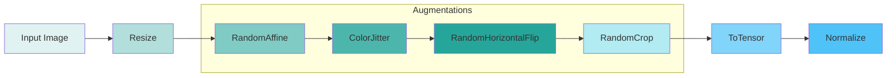

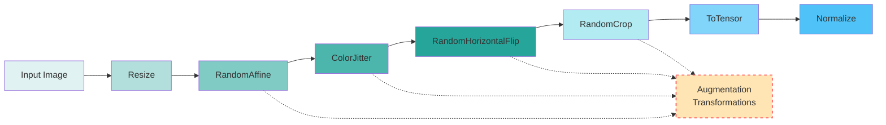

###### Pipeline Explanation

This augmentation pipeline represents a typical training-time data preprocessing sequence where:

1. **Resize**: Standardizes input image dimensions
2. **RandomAffine**: Applies random geometric transformations (rotation, scaling, shearing)
3. **ColorJitter**: Randomly adjusts brightness, contrast, saturation, and hue
4. **RandomHorizontalFlip**: Randomly flips images horizontally with specified probability
5. **RandomCrop**: Extracts random patches from the image
6. **ToTensor**: Converts PIL Image or numpy array to PyTorch tensor
7. **Normalize**: Applies channel-wise normalization using mean and standard deviation

The dashed box indicates the stochastic augmentation operations that introduce controlled randomness during training.

##### Image Augmentation

Neural networks fundamentally learn from examples, but collecting and annotating large datasets is expensive and
time-consuming. Image augmentation addresses this limitation by synthetically expanding the training dataset through
controlled transformations that preserve semantic content while introducing meaningful variations. This approach not
only increases the effective dataset size but also teaches the network invariance to specific transformations.

The theoretical justification for augmentation stems from understanding what constitutes a meaningful transformation for
visual data. An ideal transformation should:

1. Preserve class identity and semantic content
2. Reflect variations that occur naturally in the target domain
3. Create examples that might reasonably appear in real-world scenarios

Consider a classification network learning to recognize dogs. A horizontally flipped dog remains a dog, a slightly
rotated dog remains a dog, and a dog under different lighting conditions remains a dog. By exposing the network to these
variations during training, we teach it that these factors are irrelevant to the classification task, improving its
ability to generalize.

Augmentation techniques can be categorized into several families:

**Geometric transformations** modify the spatial arrangement of pixels while preserving semantic content:

- **Flips**: Horizontal flipping is widely used for natural images (where left-right orientation rarely affects
  semantics), while vertical flipping is generally avoided for objects with strong orientation priors (e.g., faces,
  animals, text).
- **Rotations**: Small rotations (±30°) reflect natural variations in camera angle. The appropriate range depends on the
  task—digits might allow only minor rotations (±15°) since orientation carries meaning, while satellite imagery might
  permit full 360° rotations.
- **Scaling/Zooming**: Randomly scaling images teaches scale invariance. This is typically implemented as random crops
  of a larger image, followed by resizing to the target dimensions. For a 224×224 input network, we might scale an image
  to 256×256, then take a random 224×224 crop.
- **Translations**: Shifting the image within the frame helps the network learn position invariance. This can be
  implemented through padding followed by random cropping.
- **Shearing and elastic deformations**: These create controlled distortions that simulate perspective changes or
  physical deformations, particularly valuable for recognizing objects that may appear in different poses or shapes.

**Appearance transformations** modify color properties and intensity patterns:

- **Color jittering**: Random adjustments to brightness (±30%), contrast (±20%), saturation (±30%), and hue (±10%)
  simulate different lighting conditions and camera settings. The appropriate ranges depend on the task—medical imaging
  may require more conservative adjustments than natural scenes.
- **Color dropping and swapping**: Techniques like color dropping (converting randomly to grayscale) or channel swapping
  (exchanging RGB channels) force the network to rely less on specific color patterns and more on structure.
- **Noise injection**: Adding random noise (Gaussian, salt-and-pepper, etc.) simulates low-quality images or sensor
  artifacts, increasing robustness to image quality variations.
- **Blurring and sharpening**: Applying controlled blur or sharpening simulates different focus conditions and imaging
  quality.

**Advanced augmentation strategies** employ more sophisticated approaches:

- **Cutout/random erasing**: Masking random rectangular regions forces the network to recognize objects from partial
  views and prevents it from over-relying on specific features.

    For an input image $I$ of size $H \times W$, cutout creates a binary mask $M$ where:

    $$
                  M(i,j) = \begin{cases}
                  0 & \text{if } (i,j) \in \text{erased regions} \\
                  1 & \text{otherwise}
                  \end{cases}
    $$

    The augmented image becomes: $I' = I \odot M$

    Select $n$ random centers $(y_k, x_k)$ and create square regions of size $L \times L$ around each center:

    $$
        \text{Region}_k = \{(i,j) : |i - y_k| \leq L/2 \text{ and } |j - x_k| \leq L/2\}
    $$

    By randomly removing rectangular patches, the network learns to focus on multiple discriminative features rather
    than relying on a single prominent region, improving robustness and reducing overfitting.

- **Mixup**: Creates synthetic training examples by linearly interpolating between pairs of images and their labels.

    Given two training samples $(x_i, y_i)$ and $(x_j, y_j)$, mixup generates a virtual sample:

    $$
    \begin{align}
    \tilde{x} &= \lambda x_i + (1-\lambda) x_j \\
    \tilde{y} &= \lambda y_i + (1-\lambda) y_j
    \end{align}
    $$

    Where $\lambda \sim \text{Beta}(\alpha, \alpha)$ and $\alpha$ is a hyperparameter (typically $\alpha = 1$).

    The mixed sample uses a combined loss:

    $$
    \mathcal{L}(\tilde{x}, \tilde{y}) = \lambda \mathcal{L}(f(\tilde{x}), y_i) + (1-\lambda) \mathcal{L}(f(\tilde{x}), y_j)
    $$

    By training on linear combinations of examples, the network learns smoother decision boundaries and becomes more
    robust to adversarial perturbations, as it must handle intermediate representations between classes.

- **CutMix**: Combines aspects of Cutout and Mixup by replacing removed regions with patches from other images.

    Given two samples $(x_A, y_A)$ and $(x_B, y_B)$, CutMix creates a mixed sample by combining spatial regions:

    $$
    \tilde{x} = M \odot x_A + (1-M) \odot x_B
    $$

    Where $M$ is a binary mask defining the cut region. The mixing ratio $\lambda$ is determined by the area of the cut
    region:

    $$
    \lambda = 1 - \frac{\text{Area of cut region}}{\text{Total image area}}
    $$

    For a rectangular cut region centered at $(c_x, c_y)$ with dimensions determined by:

    $$
    \begin{align}
    r_w &= W \sqrt{1-\lambda} \\
    r_h &= H \sqrt{1-\lambda}
    \end{align}
    $$

    **Label Mixing**: The mixed label becomes:

    $$
    \tilde{y} = \lambda y_A + (1-\lambda) y_B
    $$

    **Intuition**: CutMix preserves local spatial information better than Mixup while still providing regularization.
    The network learns to recognize objects even when parts are occluded by other objects.

- **AutoAugment and RandAugment**: These approaches use search algorithms to discover optimal augmentation policies for
  specific datasets.

    **AutoAugment Framework**: Defines an augmentation policy as a sequence of sub-policies:

    $$
                  \text{Policy} = \{(\text{Op}_1, p_1, m_1), (\text{Op}_2, p_2, m_2), \ldots, (\text{Op}_N, p_N, m_N)\}
    $$

    Where each sub-policy consists of:

    - $\text{Op}_i$: transformation operation (rotation, shear, color adjustment, etc.)
    - $p_i$: probability of applying the operation ($0 \leq p_i \leq 1$)
    - $m_i$: magnitude of the transformation ($0 \leq m_i \leq 10$)

    **RandAugment Simplification**: Uses a uniform approach where $N$ operations are randomly selected with fixed
    probability $p = 1$ and variable magnitude $M$:

    $$
                  \text{RandAugment}(I) = \text{Op}_N(\ldots \text{Op}_2(\text{Op}_1(I, M), M) \ldots, M)
    $$

    **Intuition**: Rather than manually designing augmentation strategies, these methods automatically discover
    effective combinations through reinforcement learning (AutoAugment) or random sampling (RandAugment), adapting to
    dataset-specific characteristics.

**Implementation Strategy**: Augmentation typically employs a pipeline approach where multiple transformations are
applied sequentially during data loading.

**Pipeline Composition**: Given a set of transformations $T_1, T_2, \ldots, T_k$, the augmented sample is computed as:

$$
I_{\text{aug}} = T_k(T_{k-1}(\ldots T_2(T_1(I)) \ldots))
$$

**Typical Pipeline Structure**:

1. **Geometric transformations**: Random resize, crop, flip, rotation
2. **Appearance transformations**: Color jitter, brightness/contrast adjustment
3. **Normalization**: Convert to tensor format and standardize pixel values
4. **Advanced techniques**: Apply Cutout, Mixup, or other sophisticated augmentations

**Sequential Application**: Each transformation operates on the output of the previous one, creating a compound
augmentation effect that combines multiple sources of variation in a single training sample.

The effectiveness of augmentation depends on properly matching transformations to the specific task and domain.
Augmentation that introduces unrealistic variations can harm performance rather than improve it. For instance, vertical
flips might help for satellite imagery but confuse models trained on natural scenes where gravity creates strong
orientation priors.

When designing an augmentation strategy, consider:

1. **Domain knowledge**: What variations naturally occur in your target domain?
2. **Invariance properties**: Which transformations should not affect the model's predictions?
3. **Transformation severity**: How extreme can transformations be before they distort semantic content?
4. **Computational cost**: More complex augmentations increase training time—is the performance gain worth it?

Modern practice often combines a standard set of geometric and color transformations with task-specific augmentations.
For instance, medical imaging might use specific transformations that reflect realistic variations in tissue appearance,
while document recognition might emphasize distortions that mimic different scanning conditions.

Empirical results consistently show that well-designed augmentation strategies improve generalization, particularly when
training data is limited. They combat overfitting not just by increasing the effective dataset size but by explicitly
teaching the network which input variations should be ignored, embedding important inductive biases into the learning
process.

---

##### Batch Normalization

Neural networks, particularly deep ones, face a fundamental challenge during training: as parameters in early layers
update, they change the distribution of inputs to subsequent layers, forcing those layers to continuously adapt to
shifting input distributions. This phenomenon, termed "internal covariate shift," can significantly slow training and
cause optimization difficulties. Batch Normalization (BatchNorm) addresses this challenge by normalizing layer inputs
during training, dramatically improving training stability and speed.

The core insight of BatchNorm is to normalize the inputs to each layer, similar to how we normalize the original input
data. Mathematically, for a mini-batch of size m, BatchNorm performs:

1. Calculate batch mean:
    $$
    \mu_B = \frac{1}{m}\sum_{i=1}^{m}x_i
    $$
2. Calculate batch variance:
    $$
    \sigma_B^2 = \frac{1}{m}\sum_{i=1}^{m}(x_i - \mu_B)^2
    $$
3. Normalize:
    $$
    \hat{x}_i = \frac{x_i - \mu_B}{\sqrt{\sigma_B^2 + \epsilon}}
    $$
4. Scale and shift:
    $$
    y_i = \gamma\hat{x}_i + \beta
    $$

Where $\gamma$ and $\beta$ are learnable parameters that allow the network to recover the original representation if
needed. The small constant $\epsilon$ (typically 1e-5) ensures numerical stability.

This process provides several crucial benefits:

1. **Accelerated training**: By reducing internal covariate shift, BatchNorm allows the use of higher learning rates
   without divergence, often reducing training time by an order of magnitude.
2. **Reduced sensitivity to initialization**: BatchNorm makes networks more robust to the choice of weight
   initialization, as it normalizes activations regardless of the initial weight scale.
3. **Implicit regularization**: The stochasticity introduced by using batch statistics (which vary slightly between
   batches) acts as a regularizer, similar to adding noise to the activations, helping prevent overfitting.
4. **Smoother optimization landscape**: Normalization improves the conditioning of the optimization problem, reducing
   pathological curvature in the loss landscape.

BatchNorm is typically inserted immediately after linear transformations and before activation functions.

**Standard Architecture Pattern**: The canonical placement follows the sequence:

$$
\text{Input} \xRightarrow{\text{Linear/Conv}} \text{Pre-activation} \xRightarrow{\text{BatchNorm}} \text{Normalized} \xRightarrow{\text{Activation}} \text{Output}
$$

**Mathematical Flow**: For a convolutional block with BatchNorm:

1. **Linear Transformation**: $z = W * x$ (convolution without bias)
2. **Batch Normalization**: $\hat{z} = \gamma \frac{z - \mu_B}{\sqrt{\sigma_B^2 + \epsilon}} + \beta$
3. **Activation**: $a = \text{ReLU}(\hat{z})$

**Bias Omission**: When BatchNorm follows a linear layer, the bias term is omitted because:

$$
\text{BN}(Wx + b) = \gamma \frac{(Wx + b) - \mu_B}{\sqrt{\sigma_B^2 + \epsilon}} + \beta = \gamma \frac{Wx + (b - \mu_B)}{\sqrt{\sigma_B^2 + \epsilon}} + \beta
$$

Since $(b - \mu_B)$ becomes part of the batch mean calculation, the bias $b$ is effectively absorbed and replaced by the
learnable parameter $\beta$, making explicit bias redundant.

While BatchNorm is conceptually applied to fully-connected layers, for convolutional layers, normalization is performed
per-channel, independently for each spatial position. This preserves the convolutional property where spatial positions
are processed identically:

1. For an input of shape $[N, C, H, W]$, mean and variance are computed over $N\times H\times W$ values for each channel
2. The same normalization is applied to each position in the $H\times W$ feature map

During inference, BatchNorm uses running estimates of the mean and variance collected during training, rather than batch
statistics. This transition requires careful management of the model's training and evaluation modes.

**Training Mode**: Uses current batch statistics for normalization:

$$
\hat{x}_i^{(train)} = \frac{x_i - \mu_B}{\sqrt{\sigma_B^2 + \epsilon}}
$$

Where $\mu_B$ and $\sigma_B^2$ are computed from the current batch.

**Inference Mode**: Uses accumulated running statistics:

$$
\hat{x}_i^{(test)} = \frac{x_i - \mu_{running}}{\sqrt{\sigma_{running}^2 + \epsilon}}
$$

**Running Statistics Update**: During training, running estimates are updated using exponential moving averages:

$$
\begin{align}
\mu_{running} &\leftarrow (1-\alpha)\mu_{running} + \alpha\mu_B \\
\sigma_{running}^2 &\leftarrow (1-\alpha)\sigma_{running}^2 + \alpha\sigma_B^2
\end{align}
$$

Where $\alpha$ is the momentum parameter (typically 0.1).

While extraordinarily effective, BatchNorm has some limitations:

1. **Batch size dependency**: Performance can degrade with very small batch sizes, as the batch statistics become noisy
   estimates of the true distribution.
2. **Memory overhead**: BatchNorm must store intermediate activations during the forward pass for use in
   backpropagation, increasing memory consumption.
3. **Sequential processing challenges**: In scenarios like recurrent neural networks where activations are processed
   sequentially, BatchNorm can be difficult to apply effectively.

Alternative normalization techniques have been developed to address these limitations:

- **Layer Normalization**: Normalizes across all channels for each sample independently, making it batch-size
  independent
- **Instance Normalization**: Normalizes each channel for each sample independently
- **Group Normalization**: A middle ground that normalizes grouped channels for each sample independently

The choice between these normalization techniques depends on the specific architecture and task. BatchNorm remains the
default choice for most CNN architectures due to its proven effectiveness, but alternatives should be considered for
very small batch sizes or specialized architectures.

In practice, BatchNorm has become nearly ubiquitous in modern CNN design. Its ability to stabilize and accelerate
training has enabled the development of much deeper architectures than were previously practical. The empirical success
of BatchNorm makes it one of the most important innovations in deep learning optimization.

---

##### Learning Rate Scheduling

The learning rate—the step size during gradient descent—is perhaps the most critical hyperparameter affecting model
training. A learning rate that is too high causes divergence or oscillation around minima, while one that is too low
results in slow convergence or getting stuck in poor local minima. Learning rate scheduling addresses this challenge by
systematically adjusting the learning rate throughout training.

The theoretical foundation for learning rate scheduling comes from understanding the optimization landscape. At the
beginning of training, when parameters are far from optimal values, larger steps allow faster progress toward promising
regions. As training progresses and parameters approach a minimum, smaller steps enable fine-grained optimization
without overshooting.

<div align="center">
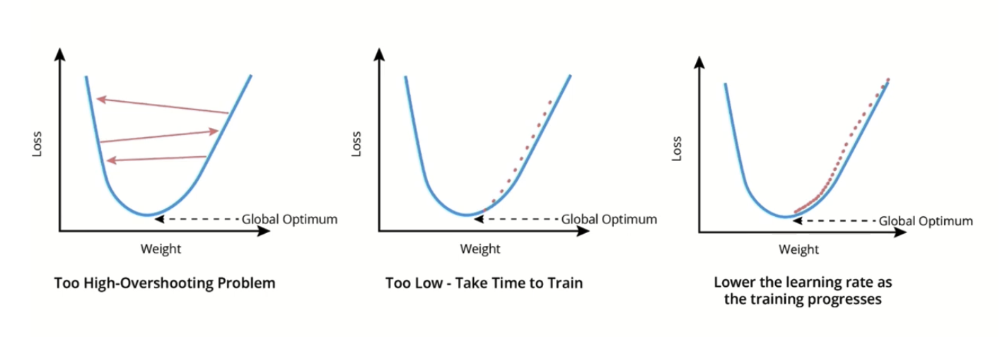
<p align="center">figure:  Learning Rate Scheduler</p>
</div>

The basic learning rate update can be expressed as:

$$
\theta_{t+1} = \theta_t - \eta_t \nabla_\theta L(\theta_t)
$$

Where $\theta_t$ represents the parameters at step $t$, $\nabla_\theta L(\theta_t)$ is the gradient of the loss
function, and $\eta_t$ is the learning rate at step $t$. Learning rate scheduling focuses on defining how $\eta_t$
changes over time. Several standard scheduling approaches have proven effective:

**1. Step decay**: Reduces the learning rate by a factor at predefined epochs.

**Mathematical Formulation**: The learning rate is updated at specific epoch intervals:

$$
\eta_t = \eta_0 \cdot \gamma^{\lfloor t/S \rfloor}
$$

Where:

- $\eta_0$ is the initial learning rate
- $\gamma$ is the decay factor (e.g., 0.1 for 10× reduction)
- $S$ is the step size (epoch interval, e.g., 30 epochs)
- $\lfloor \cdot \rfloor$ is the floor function

**Example**: With $\eta_0 = 0.01$, $\gamma = 0.1$, and $S = 30$:

- Epochs 0-29: $\eta = 0.01$
- Epochs 30-59: $\eta = 0.001$
- Epochs 60-89: $\eta = 0.0001$

This approach is simple and widely used, but the abrupt changes can temporarily disrupt training dynamics, and the
schedule must be manually defined for each training scenario.

**2. Exponential decay**: Continuously decreases the learning rate according to an exponential function:

$$
\eta_t = \eta_0 \cdot \gamma^t
$$

Where $\eta_0$ is the initial learning rate and $\gamma$ is the decay rate (typically between 0.9 and 0.99).

**Characteristics**: This provides a smoother decay than step schedules but may decrease the learning rate too quickly
in some cases. The decay is continuous and proportional to the current learning rate value.

**3. Cosine annealing**: Varies the learning rate according to a cosine function, gradually decreasing it from the
initial value to near zero:

$$
\eta_t = \eta_{min} + \frac{1}{2}(\eta_{max} - \eta_{min})(1 + \cos(\frac{t}{T}\pi))
$$

Where $T$ is the total number of training steps.

**Characteristics**: This produces a smooth decay curve that decreases more slowly initially and more rapidly toward the
end, often yielding better performance than simpler schedules. The cosine shape provides a natural annealing pattern.

**4. Cosine annealing with warm restarts**: Extends cosine annealing by periodically resetting the learning rate to its
initial value, creating cycles of decreasing learning rates.

**Mathematical Formulation**: The learning rate follows cosine annealing within each cycle:

$$
\eta_t = \eta_{min} + \frac{1}{2}(\eta_{max} - \eta_{min})(1 + \cos(\frac{T_{cur}}{T_i}\pi))
$$

Where:

- $T_{cur}$ is the current step within the cycle
- $T_i$ is the length of the current cycle
- Cycle lengths increase: $T_i = T_0 \cdot T_{mult}^i$

**Restart Mechanism**: At the end of each cycle, the learning rate resets to $\eta_{max}$ and a new cosine decay begins.

**Intuition**: This approach helps escape local minima by periodically returning to exploration mode with higher
learning rates, while still benefiting from fine-tuning phases within each cycle.

**5. One-cycle policy**: Follows a specific schedule where the learning rate first increases linearly from a low value
to a maximum value, then decreases toward the end of training.

**Mathematical Formulation**: The schedule consists of three phases:

**Phase 1 (Warmup)**: Linear increase from $\eta_{min}$ to $\eta_{max}$ over fraction $p$ of total steps:

$$
\eta_t = \eta_{min} + \frac{t}{pT}(\eta_{max} - \eta_{min}), \quad 0 \leq t \leq pT
$$

**Phase 2 (Decay)**: Linear decrease from $\eta_{max}$ to $\eta_{min}$ over remaining steps:

$$
\eta_t = \eta_{max} - \frac{t - pT}{(1-p)T}(\eta_{max} - \eta_{min}), \quad pT < t \leq T
$$

Where:

- $T$ is the total number of training steps
- $p$ is the fraction of steps for warmup (typically 0.3)
- $\eta_{max}$ is typically 10× the initial learning rate

**Intuition**: This approach leverages the benefits of both small and large learning rates—starting with a small rate
for stability, increasing to a large rate for fast progress, and then annealing for fine convergence. The initial
increase often helps escape poor local minima early in training.

**6. Reduce on plateau**: Adjusts the learning rate based on validation metrics rather than predefined schedules.

**Mathematical Formulation**: The learning rate is updated when the monitored metric plateaus:

$$
\eta_{t+1} = \begin{cases}
\gamma \cdot \eta_t & \text{if no improvement for } P \text{ epochs} \\
\eta_t & \text{otherwise}
\end{cases}
$$

Where:

- $\gamma$ is the reduction factor (e.g., 0.1 for 10× reduction)
- $P$ is the patience parameter (number of epochs to wait)
- "No improvement" means $|M_t - M_{best}| < \delta$ for validation metric $M$

**Improvement Detection**: For minimization metrics (like loss):

$$
\text{Improvement} = M_{best} - M_t > \delta
$$

For maximization metrics (like accuracy):

$$
\text{Improvement} = M_t - M_{best} > \delta
$$

**Intuition**: This adaptive approach automatically determines when to reduce the learning rate based on actual training
progress, making it less dependent on predefined schedules and more responsive to the specific learning dynamics of the
model.

When designing a learning rate schedule, consider these factors:

1. **Training duration**: Longer training runs benefit from slower decay to allow thorough exploration.
2. **Model complexity**: Deeper models often require more careful scheduling, potentially with warm-up periods.
3. **Dataset size**: Larger datasets permit higher initial learning rates and more gradual decay.
4. **Optimization algorithm**: Adaptive methods like Adam are less sensitive to learning rate scheduling but still
   benefit from well-designed schedules.

In practice, finding the optimal learning rate schedule often involves experimentation. A useful approach is the
learning rate finder technique, which systematically explores learning rate values to identify optimal ranges.

**Learning Rate Range Test**: The method performs an exponential sweep of learning rates during a short training run:

$$
\eta_i = \eta_{\text{min}} \cdot \left(\frac{\eta_{\text{max}}}{\eta_{\text{min}}}\right)^{\frac{i-1}{N-1}}
$$

Where:

- $\eta_i$: Learning rate at iteration $i$
- $\eta_{\text{min}}$: Minimum learning rate (typically $10^{-7}$)
- $\eta_{\text{max}}$: Maximum learning rate (typically $10^1$)
- $N$: Total number of iterations in the test

**Loss Analysis**: The technique records the loss $L_i$ at each learning rate $\eta_i$ and identifies the optimal range
by:

1. **Steepest Descent Region**: Find $\eta^*$ where $\frac{dL}{d\log\eta}$ is most negative
2. **Stability Boundary**: Identify the point where loss begins to diverge exponentially
3. **Optimal Range**: Select $\eta_{\text{optimal}} \approx 0.1 \times \eta^*$ to balance speed and stability

**Mathematical Criterion**: The suggested learning rate minimizes:

$$
\eta_{\text{suggested}} = \arg\min_{\eta} \left| \frac{d^2L}{d(\log\eta)^2} \right|
$$

This corresponds to the steepest part of the loss curve, indicating the learning rate where training progresses most
efficiently without instability.

This approach, popularized by fast.ai, helps identify a suitable maximum learning rate to use within scheduled
approaches like the one-cycle policy.

Combined with modern optimizers like Adam, effective learning rate scheduling can reduce training time by 50% or more
while improving final model performance, making it one of the most impactful optimization techniques available to deep
learning practitioners.

---

##### Hyperparameter Tuning

Neural network performance depends on numerous hyperparameters—design choices that are fixed before training begins.
These include architectural hyperparameters (layer sizes, kernel dimensions), optimization hyperparameters (learning
rate, batch size, weight decay), and regularization hyperparameters (dropout rate, data augmentation strength). Finding
optimal settings for these hyperparameters is a critical but challenging aspect of deep learning.

The hyperparameter optimization process can be formalized as a nested optimization problem:

$$
\theta^* = \underset{\lambda \in \Lambda}{\operatorname{argmax}} , f(\lambda)
$$

Where:

- $\lambda$ represents a hyperparameter configuration
- $\Lambda$ is the space of all possible hyperparameter combinations
- $f(\lambda)$ is a performance metric on a validation set after training with hyperparameters $\lambda$

This formulation highlights why hyperparameter optimization is computationally expensive: evaluating $f(\lambda)$ for a
single configuration requires training the entire network, which may take hours or days for large models.

Several systematic approaches have been developed for navigating this challenging optimization landscape:

**1. Grid search**: Evaluates all combinations from a predefined set of hyperparameter values.

**Mathematical Formulation**: For hyperparameters $\lambda_1, \lambda_2, \ldots, \lambda_k$ with discrete value sets
$V_1, V_2, \ldots, V_k$, grid search evaluates:

$$
\Lambda_{grid} = V_1 \times V_2 \times \cdots \times V_k
$$

**Computational Complexity**: The total number of evaluations is:

$$
|\Lambda_{grid}| = \prod_{i=1}^k |V_i|
$$

**Example**: With learning rates $\{0.001, 0.01, 0.1\}$ and weight decays $\{0.0001, 0.001, 0.01\}$:

- Total combinations: $3 \times 3 = 9$ evaluations
- Adding batch sizes $\{16, 32, 64\}$: $3 \times 3 \times 3 = 27$ evaluations

**Limitations**: This approach is comprehensive but scales poorly due to the combinatorial explosion—adding just one
hyperparameter with 3 values triples the computational cost.

**2. Random search**: Samples hyperparameter combinations randomly from specified distributions.

**Mathematical Formulation**: For each hyperparameter $\lambda_i$, define a probability distribution $P_i$. Random
search generates configurations by sampling:

$$
\lambda_i \sim P_i \quad \text{for } i = 1, 2, \ldots, k
$$

**Fixed Budget**: Evaluate exactly $N$ randomly sampled configurations:

$$
\{\lambda^{(1)}, \lambda^{(2)}, \ldots, \lambda^{(N)}\} \text{ where } \lambda^{(j)} = (\lambda_1^{(j)}, \lambda_2^{(j)}, \ldots, \lambda_k^{(j)})
$$

**Common Distributions**:

- Learning rate: $\log_{10}(\text{lr}) \sim \mathcal{U}(-5, 0)$ (log-uniform between $10^{-5}$ and $1$)
- Weight decay: $\log_{10}(\text{wd}) \sim \mathcal{U}(-6, -2)$ (log-uniform between $10^{-6}$ and $10^{-2}$)
- Dropout rate: $p \sim \mathcal{U}(0.1, 0.5)$ (uniform between 0.1 and 0.5)

Random search often outperforms grid search with the same computational budget, particularly when only a subset of
hyperparameters significantly impacts performance. This is because random search allocates trials more efficiently
across the important dimensions while grid search exhausts resources exploring unimportant dimensions.

**3. Bayesian optimization**: Builds a probabilistic model (typically a Gaussian Process) of the objective function and
uses it to select the most promising hyperparameter combinations to evaluate next.

**Mathematical Framework**: Given observed evaluations $\mathcal{D} = \{(\lambda^{(i)}, f(\lambda^{(i)}))\}_{i=1}^t$,
construct a surrogate model $\mathcal{M}$ that provides:

$$
p(f(\lambda) | \mathcal{D}) \sim \mathcal{N}(\mu(\lambda), \sigma^2(\lambda))
$$

Where:

- $\mu(\lambda)$: Predicted mean performance at configuration $\lambda$
- $\sigma^2(\lambda)$: Predicted uncertainty (variance) at configuration $\lambda$

**Acquisition Function**: Balances exploration vs exploitation using Expected Improvement (EI):

$$
\text{EI}(\lambda) = \sigma(\lambda) \left[ z \cdot \Phi(z) + \phi(z) \right]
$$

Where:

- $z = \frac{\mu(\lambda) - f^*}{\sigma(\lambda)}$
- $f^*$ = best observed value so far
- $\Phi(\cdot)$, $\phi(\cdot)$ = CDF and PDF of standard normal distribution

**Sequential Process**:

1. Initialize with random evaluations to bootstrap the surrogate model
2. At each iteration: $\lambda^{(t+1)} = \arg\max_{\lambda} \text{EI}(\lambda)$
3. Evaluate $f(\lambda^{(t+1)})$ and update $\mathcal{D}$
4. Retrain surrogate model with expanded dataset

By focusing trials on promising regions, Bayesian optimization can find better hyperparameters with fewer evaluations
than random or grid search, making it particularly valuable for computationally expensive models. Libraries like Optuna,
Hyperopt, and scikit-optimize implement production-ready Bayesian optimization.

<div align="center">
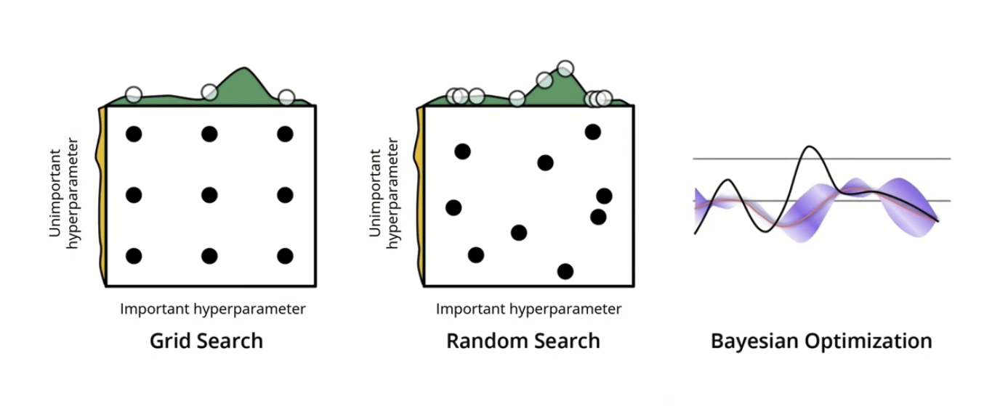
<p align="center">figure: Hyperparameter Tuning Strategies</p>
</div>

**4. Population-based training**: Combines hyperparameter optimization with training, evolving a population of models
simultaneously rather than training separate models with fixed hyperparameters.

**Mathematical Framework**: Maintain a population $\mathcal{P} = \{(\theta_i, \lambda_i, s_i)\}_{i=1}^N$ where:

- $\theta_i$: Model weights for individual $i$
- $\lambda_i$: Hyperparameter configuration for individual $i$
- $s_i$: Performance score for individual $i$

**Evolution Process**: At regular intervals (e.g., every epoch):

1. **Evaluation**: Update scores $s_i = f(\theta_i, \lambda_i)$ based on validation performance

2. **Selection**: Rank population by performance and identify:

    - Elite set: Top $p\%$ performers (typically $p = 20$)
    - Replacement set: Bottom $q\%$ performers (typically $q = 20$)

3. **Reproduction with Mutation**: For each individual in replacement set:
    $$
    \begin{align}
    \text{Parent} &\leftarrow \text{RandomSample}(\text{Elite set}) \\
    \theta_{\text{new}} &\leftarrow \theta_{\text{parent}} \text{ (copy weights)} \\
    \lambda_{\text{new}} &\leftarrow \text{Perturb}(\lambda_{\text{parent}})
    \end{align}
    $$

**Perturbation Strategy**: Common hyperparameter mutations:

- Multiply/divide by factor in $\{0.8, 1.2\}$ for continuous parameters
- Random resample for categorical parameters
- Probability of mutation typically 20-30% per parameter

This approach has shown particular promise for discovering dynamic hyperparameter schedules that would be difficult to
design manually, such as learning rate and regularization strength schedules that adapt throughout training.

When approaching hyperparameter tuning, consider these practical guidelines:

- **Prioritize important hyperparameters**: Not all hyperparameters have equal impact. Learning rate, architecture
  depth/width, and regularization strength typically have the largest effects and should receive the most attention.
- **Use appropriate ranges**: Initialize searches with broad ranges to explore the space, then narrow to promising
  regions:
    - Learning rate: Log scale between 1e-5 and 1.0 (e.g., [1e-5, 1e-4, 1e-3, 1e-2, 1e-1])
    - Weight decay: Log scale between 1e-6 and 1e-2
    - Batch size: Powers of 2 from 16 to 512 (memory permitting)
    - Architecture depth: Linear scale based on model family (e.g., 18, 34, 50, 101 for ResNet)
    - Dropout rate: Linear scale between 0.1 and 0.5
- **Exploit structure**: Hyperparameters often have relationships—for instance, larger batch sizes typically work better
  with higher learning rates. Encoding these relationships in your search strategy can improve efficiency.
- **Early stopping for evaluations**: Use aggressive early stopping during hyperparameter search to terminate
  unpromising configurations quickly, saving computational resources.
- **Track metrics systematically**: Record detailed information about each trial, including validation curves over time,
  not just final performance. This helps identify promising regions and understand the effects of different
  hyperparameters.
- **Cross-validation for small datasets**: For smaller datasets, use k-fold cross-validation to get more reliable
  estimates of hyperparameter performance, reducing the risk of overfitting to a single validation split.

**Modern Practice**: Combines multiple approaches in a hierarchical strategy:

- **Coarse Search**: Use random search with wide ranges to identify promising regions
- **Refinement**: Apply Bayesian optimization within identified regions
- **Final Tuning**: Use population-based training for dynamic schedule discovery

**Practical Implementation**: Modern frameworks like Optuna, Hyperopt, and Weights & Biases provide:

- **Automated hyperparameter suggestion** based on trial history
- **Pruning mechanisms** to terminate unpromising trials early
- **Multi-objective optimization** for balancing accuracy vs efficiency
- **Distributed search** across multiple compute resources

**Study Configuration**: Define the optimization problem as:

$$
\begin{align}
\text{maximize} \quad & f(\lambda) \text{ (validation performance)} \\
\text{subject to} \quad & \lambda \in \Lambda \text{ (feasible hyperparameter space)} \\
& \text{Budget} \leq B \text{ (computational constraints)}
\end{align}
$$

**Trial Management**: Each trial $t$ follows the process:

- Sample $\lambda^{(t)}$ based on historical performance $\{f(\lambda^{(1)}), \ldots, f(\lambda^{(t-1)})\}$
- Train model with $\lambda^{(t)}$ and measure $f(\lambda^{(t)})$
- Update optimization algorithm's internal model
- Apply pruning if intermediate results are unpromising

Effective hyperparameter tuning remains as much art as science, requiring intuition developed through experience along
with systematic approaches. The most efficient practitioners combine domain knowledge, structured search methods, and
careful result analysis to discover configurations that maximize model performance within computational constraints.

The computational expense of hyperparameter tuning has led to growing interest in approaches that transfer knowledge
across tasks. Meta-learning techniques attempt to learn hyperparameter relationships across multiple datasets,
potentially allowing faster tuning on new tasks. Similarly, neural architecture search (NAS) applies optimization
techniques specifically to architectural hyperparameters, automating the discovery of effective network structures.

By combining advanced optimization techniques—augmentation, batch normalization, learning rate scheduling, and
systematic hyperparameter tuning—deep learning practitioners can extract maximum performance from CNN architectures.
These techniques address fundamental challenges in neural network training, transforming theoretical architectural
capacity into practical performance on real-world tasks.

---

#### Model Export and Production Deployment

The journey from research prototype to production deployment represents a critical transition that many deep learning
projects struggle to navigate successfully. Model export—the process of transforming a trained research model into a
form suitable for production environments—bridges this gap by addressing the fundamental differences between development
and deployment contexts. This transition involves not merely copying model weights, but creating a robust,
self-contained system capable of reliable operation in diverse production environments.

The complexity of this transition stems from the inherent differences between research and production contexts. Research
environments prioritize flexibility, experimentation, and rapid iteration, often tolerating inconsistencies in data
processing pipelines or model interfaces. Production environments, conversely, demand reliability, consistency, and
maintainability above all else. A model that achieves state-of-the-art accuracy in research may fail catastrophically in
production due to subtle preprocessing inconsistencies, inadequate error handling, or performance bottlenecks under
load.

##### Preprocessing Integration

One of the most common failure points in CNN deployment occurs when preprocessing steps applied during training are
inconsistently implemented during inference. For image classification models, these preprocessing operations typically
include resizing, cropping or padding, normalization, and color transformations. When these operations are implemented
separately from the model—perhaps in data loading code during training but in application code during deployment—subtle
inconsistencies can emerge that dramatically impact performance.

The mathematical foundation of preprocessing integration involves creating a deterministic transformation pipeline that
converts raw inputs $I_{\text{raw}}$ into model-ready tensors $I_{\text{processed}}$. This transformation must be
identical during both training and inference to maintain model performance.

The preprocessing transformation can be mathematically expressed as a sequence of operations applied to raw input
$I_{\text{raw}}$:

**Stage 1: Pixel Value Scaling**

$$
I_{\text{scaled}}(i,j,c) = \frac{I_{\text{raw}}(i,j,c)}{255.0}
$$

This converts pixel values from the typical $[0, 255]$ integer range to the $[0, 1]$ floating-point range expected by
neural networks. Here, $(i,j)$ represents spatial coordinates and $c$ represents the color channel index.

**Stage 2: Spatial Resizing** (if input dimensions don't match target)

$$
I_{\text{resized}} = \text{Interpolate}(I_{\text{scaled}}, \text{size}=(H_{\text{target}}, W_{\text{target}}))
$$

Uses bilinear interpolation to transform the input to the required spatial dimensions
$(H_{\text{target}}, W_{\text{target}})$. The interpolation function preserves spatial relationships while adjusting
resolution.

**Stage 3: Channel-wise Normalization**

$$
I_{\text{normalized}}(i,j,c) = \frac{I_{\text{resized}}(i,j,c) - \mu_c}{\sigma_c}
$$

Where $\mu_c$ and $\sigma_c$ are the channel-specific mean and standard deviation values. For ImageNet-pretrained
models, these are typically $\boldsymbol{\mu} = [0.485, 0.456, 0.406]$ and $\boldsymbol{\sigma} = [0.229, 0.224, 0.225]$
for RGB channels respectively.

**Stage 4: Model Inference**

$$
\text{Output} = f_{\text{model}}(I_{\text{normalized}})
$$

The complete transformation pipeline becomes:

$$
\text{Output} = f_{\text{model}}\left(\frac{\text{Interpolate}\left(\frac{I_{\text{raw}}}{255.0}\right) - \boldsymbol{\mu}}{\boldsymbol{\sigma}}\right)
$$

##### Practical Example of Preprocessing Integration

Consider a ResNet-50 model trained on ImageNet that expects $224 \times 224$ RGB images. During training, images
undergo:

1. **Resizing**: Random resize and crop to $224 \times 224$
2. **Normalization**: Channel-wise normalization using ImageNet statistics
3. **Data type conversion**: Convert to floating-point tensors

If production deployment implements these steps differently—perhaps using a different interpolation method, applying
normalization in a different order, or using slightly different mean/std values—the model's performance can degrade
significantly despite receiving visually identical inputs.

**Parameter Integration**: By embedding preprocessing parameters ($\boldsymbol{\mu}$, $\boldsymbol{\sigma}$, target
dimensions) as non-trainable components within the model architecture, these values are preserved during export and
remain consistent across different deployment environments.

The solution involves creating a self-contained model that accepts raw inputs and produces final outputs, eliminating
the possibility of preprocessing inconsistencies. This approach offers several crucial advantages:

1. **Consistency guarantee**: Identical preprocessing in training and production
2. **Simplified interface**: Services need only provide raw inputs
3. **Self-documentation**: The model encodes required preprocessing
4. **Performance optimization**: Framework-level optimization of combined operations

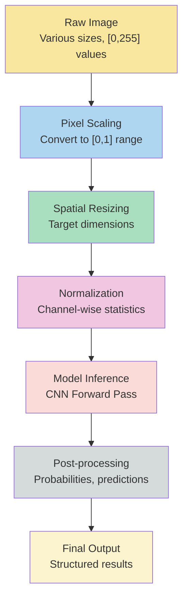

For complex preprocessing that might be difficult to express in the model's native framework, a two-stage approach
maintains benefits while accommodating external preprocessing requirements:

1. Create a standardized intermediate representation
2. Document the interface contract clearly for upstream services

This approach proves particularly critical for specialized domains. Medical imaging often requires complex intensity
normalization algorithms, while natural language processing demands identical tokenization between training and
inference. By packaging these operations with the model, consistency is ensured throughout the model's lifecycle.

---

##### Model Packaging

Once preprocessing is integrated, the next step involves serializing the model into a format suitable for deployment.
Model packaging transforms the trained model from its development format—often dependent on the training framework and
environment—into a production-ready artifact that can be deployed, versioned, and executed across various environments.

Modern deep learning frameworks offer specialized tools for this conversion process, each optimized for different
deployment scenarios and requirements.

###### Framework-Native Formats

Framework-native formats preserve the model in its original framework but in a serialized form optimized for inference
rather than training. These formats maintain full compatibility with the training framework while providing performance
optimizations for production use.

**TorchScript (PyTorch)** provides two distinct conversion approaches:

**Tracing Methodology**: Executes the model with example inputs and records the operations performed. This approach
creates a static computational graph by observing the actual operations during a forward pass. Tracing works excellently
for models with static computation graphs but may not correctly capture control flow that depends on input data.

The tracing process involves providing representative inputs that exercise all code paths the model might encounter
during inference. The resulting traced model contains a fixed computational graph that can be optimized and executed
without the original Python code.

**Scripting Methodology**: Analyzes the Python code directly and converts it to an intermediate representation. This
approach handles dynamic control flow, conditional statements, and loops more effectively than tracing. However,
scripting may not support all Python features or external library calls.

The scripting process examines the model's Python source code and converts supported operations into TorchScript's
intermediate representation. This allows preservation of dynamic behaviors while maintaining deployment independence.

**TensorFlow SavedModel** provides similar functionality for TensorFlow models, creating a language-neutral format that
includes both the computational graph and trained weights. SavedModel serves as TensorFlow's standard export format,
supporting both eager execution and graph execution modes.

###### Framework-Agnostic Formats

Framework-agnostic formats enable model deployment across different frameworks and platforms, providing flexibility in
deployment environments and reducing vendor lock-in.

**Open Neural Network Exchange (ONNX)** has emerged as the primary standard for cross-framework model exchange. ONNX
provides a common representation for neural networks that can be optimized and executed by various runtime environments.

The ONNX export process involves several critical considerations:

**Operator Version Compatibility**: Different ONNX operator sets support different operations. Newer models may require
recent operator sets, while deployment environments might only support older versions.

**Dynamic Shape Support**: Many deployment scenarios require handling variable input dimensions. ONNX supports dynamic
axes that allow batch size or spatial dimension flexibility during runtime.

**Optimization Opportunities**: ONNX models can be optimized through constant folding, operator fusion, and graph
simplification during the export process.

The mathematical representation in ONNX maintains the computational graph structure while providing a standardized
interface for cross-platform deployment.

###### Optimized Deployment Formats

Specialized formats provide optimizations for specific deployment targets, particularly mobile and edge devices where
computational resources are constrained.

**Mobile and Edge Optimizations**:

**TensorFlow Lite** targets mobile and embedded devices, providing significant optimizations for resource-constrained
environments. The conversion process includes graph optimization, weight quantization, and operator fusion to reduce
model size and inference time.

**Core ML** specifically targets iOS devices, integrating with Apple's neural engine for accelerated inference. Core ML
models benefit from hardware-specific optimizations and can leverage specialized processing units.

**ONNX Runtime Mobile** provides cross-platform mobile deployment with optimizations for both iOS and Android platforms.

###### Quantization Techniques

Quantization represents one of the most effective optimization techniques for deployment, reducing model precision from
32-bit floating point to lower precision representations.

**Mathematical Foundation of Quantization**:

For a floating-point weight $w_f$, quantization maps it to an integer representation:

$$
w_q = \text{round}\left(\frac{w_f - z}{s}\right)
$$

Where:

- $w_q$ is the quantized weight (integer)
- $z$ is the zero-point offset
- $s$ is the scaling factor

The scaling factor $s$ is computed as:

$$
s = \frac{w_{\max} - w_{\min}}{2^b - 1}
$$

Where $b$ is the number of bits in the quantized representation (typically 8 for INT8 quantization).

**Benefits of Quantization**:

- **Model Size Reduction**: INT8 quantization reduces model size by approximately 75%
- **Inference Speed**: Integer operations are faster than floating-point operations
- **Memory Efficiency**: Lower memory bandwidth requirements
- **Energy Efficiency**: Reduced power consumption for mobile deployment

**Types of Quantization**:

**Post-Training Quantization**: Applied after training without requiring additional data. This approach is simple to
implement but may result in some accuracy loss.

**Quantization-Aware Training**: Incorporates quantization effects during training, typically preserving model accuracy
better than post-training approaches.

**Dynamic Quantization**: Quantizes weights but keeps activations in floating point, balancing accuracy preservation
with computational benefits.

###### Best Practices for Model Packaging

**Version Management**: Include comprehensive version information in model metadata:

- Model version and timestamp
- Training framework version
- Dataset version and characteristics
- Performance metrics and benchmarks
- Hardware requirements and recommendations

**Comprehensive Documentation**: Document all aspects of model usage:

- Input specifications (dimensions, data types, value ranges)
- Output specifications (format, interpretation, confidence measures)
- Performance characteristics (latency, throughput, accuracy)
- Limitations and known failure modes
- Deployment requirements and dependencies

**Environment Compatibility**: Clearly specify hardware and software requirements:

- Runtime environment specifications
- Hardware acceleration requirements
- Memory and storage requirements
- Network connectivity needs for distributed deployment

**Consistent Preprocessing**: Include preprocessing parameters explicitly in the model or provide detailed documentation
ensuring identical implementation across environments.

These packaging practices create self-contained, well-documented model artifacts that can be reliably deployed and
maintained across diverse production environments, significantly reducing deployment risks and operational complexity.

##### Deployment Considerations

Deploying CNN models in production environments introduces considerations extending far beyond model accuracy.
Performance optimization, scalability planning, monitoring implementation, and integration with existing systems all
influence deployment architecture decisions. These considerations determine whether a model successfully transitions
from research prototype to reliable production system.

###### Deployment Architectures

Production deployment architectures commonly follow several established patterns, each optimized for different use cases
and operational requirements.

**REST API Services** wrap models in HTTP endpoints, making them accessible to web and mobile applications. This pattern
provides a standardized interface that can be consumed by various client applications while centralizing model
management and updates.

The REST API pattern offers several advantages:

- **Standardized Interface**: HTTP-based communication that works across platforms
- **Centralized Management**: Single point for model updates and monitoring
- **Scalability**: Can be deployed behind load balancers for horizontal scaling
- **Language Agnostic**: Clients can be written in any programming language

**Mathematical Model for API Latency**: The total response time $T_{\text{total}}$ for an API request can be decomposed
as:

$$
T_{\text{total}} = T_{\text{network}} + T_{\text{preprocessing}} + T_{\text{inference}} + T_{\text{postprocessing}} + T_{\text{serialization}}
$$

Where each component represents a different phase of request processing. Optimization efforts should focus on the
dominant terms in this equation.

**Batch Processing Systems** handle large volumes of predictions asynchronously, optimizing for throughput rather than
individual request latency. This pattern suits scenarios where immediate results aren't required, such as overnight
processing of large datasets or periodic analysis tasks.

**Batch Processing Efficiency**: The efficiency of batch processing can be quantified as:

$$
\text{Efficiency} = \frac{N \times T_{\text{single}}}{T_{\text{batch}}}
$$

Where $N$ is the batch size, $T_{\text{single}}$ is the time for individual inference, and $T_{\text{batch}}$ is the
time for batch inference. Efficient implementations achieve ratios significantly greater than 1.

**Edge Deployment** embeds models directly into applications for offline use, essential for applications requiring
predictions without internet connectivity or with privacy constraints preventing data transmission to remote servers.

Edge deployment presents unique challenges:

- **Resource Constraints**: Limited computational power and memory
- **Offline Operation**: No network connectivity for model updates
- **Real-time Requirements**: Often need to meet strict latency constraints
- **Power Efficiency**: Battery-powered devices require energy-conscious implementations

**Model-as-a-Service Platforms** provide specialized infrastructure for model deployment, handling concerns like version
management, auto-scaling, and monitoring. These platforms abstract away infrastructure complexity while providing
enterprise-grade reliability and performance.

###### Hardware Considerations

Hardware selection significantly impacts deployment performance, with each option offering distinct trade-offs between
cost, performance, and operational complexity.

**CPU Deployment** offers universal compatibility and predictable performance characteristics. While generally slower
than specialized hardware, CPU deployment provides:

- **Universal Compatibility**: Works on any server or device
- **Predictable Performance**: Well-understood performance characteristics
- **Cost Effectiveness**: Leverages existing infrastructure
- **Debugging Simplicity**: Easier to profile and optimize

**CPU Optimization Strategies**:

- **Instruction Set Utilization**: Leverage SIMD instructions (AVX, SSE)
- **Thread Parallelization**: Utilize multiple CPU cores effectively
- **Memory Optimization**: Optimize memory access patterns for cache efficiency
- **Quantization**: Use INT8 operations for faster computation

**GPU Acceleration** provides substantial speedups for batch processing, particularly effective when processing multiple
images simultaneously. The parallel architecture of GPUs aligns well with CNN computation patterns.

**GPU Performance Model**: GPU throughput can be estimated as:

$$
\text{Throughput}_{\text{GPU}} = \min\left(\frac{\text{Compute Capability}}{\text{FLOPS per Image}}, \frac{\text{Memory Bandwidth}}{\text{Memory per Image}}\right)
$$

This relationship shows that performance is limited by either compute capacity or memory bandwidth, whichever is more
constraining.

**Specialized Hardware** including TPUs, FPGAs, and dedicated inference accelerators may offer optimal performance for
specific models and deployment scenarios.

**TPU Characteristics**:

- **Optimized for Matrix Operations**: Excellent for large matrix multiplications
- **High Throughput**: Designed for batch processing workloads
- **Energy Efficient**: Lower power consumption per operation
- **Framework Integration**: Seamless integration with TensorFlow

**FPGA Advantages**:

- **Customizable Architecture**: Can be optimized for specific model architectures
- **Low Latency**: Minimal software overhead
- **Deterministic Performance**: Consistent timing characteristics
- **Power Efficiency**: Can be very energy efficient when properly optimized

###### Scaling Considerations

Scaling strategies address performance requirements under varying load conditions, ensuring consistent service quality
as demand fluctuates.

**Horizontal Scaling** adds more model serving instances to handle increased traffic. This approach provides linear
scaling capabilities but requires careful orchestration and load balancing.

**Load Balancing Strategies**:

- **Round Robin**: Simple distribution across available instances
- **Least Connections**: Route to instance with fewest active connections
- **Weighted Routing**: Consider instance capabilities and current load
- **Health-Based Routing**: Avoid routing to unhealthy instances

**Batching Strategies** improve throughput by processing multiple requests simultaneously, leveraging the parallel
processing capabilities of modern hardware.

**Optimal Batch Size Calculation**: The optimal batch size $B^*$ balances latency and throughput:

$$
B^* = \arg\min_B \left(\frac{T_{\text{batch}}(B)}{B} + \lambda \cdot T_{\text{batch}}(B)\right)
$$

Where $\lambda$ represents the relative importance of latency versus throughput.

**Dynamic Batching Considerations**:

- **Timeout Mechanisms**: Prevent excessive waiting for batch completion
- **Size Optimization**: Balance batch size against latency requirements
- **Queue Management**: Handle varying request rates effectively
- **Priority Handling**: Support different service level agreements

**Adaptive Scaling** adjusts resources based on current demand patterns, optimizing cost while maintaining performance
requirements.

**Auto-scaling Metrics**:

- **CPU Utilization**: Traditional metric but may not reflect model serving load
- **Request Queue Length**: More directly related to user experience
- **Response Time Percentiles**: Ensures quality of service maintenance
- **Custom Application Metrics**: Model-specific performance indicators

**Scaling Decision Function**: Auto-scaling decisions can be formalized as:

$$
\text{Scale Action} = f(\text{Current Metrics}, \text{Historical Patterns}, \text{Predicted Load})
$$

Effective auto-scaling systems incorporate multiple signals and predict future demand patterns.

###### Model Monitoring

Monitoring ensures reliable operation and early detection of performance degradation, data drift, or system failures.

**Input Distribution Monitoring** tracks the statistical properties of model inputs to detect data drift—changes in the
distribution of production data compared to training data.

**Distribution Drift Detection**: Statistical tests like the Kolmogorov-Smirnov test can quantify distribution changes:

$$
D_{KS} = \sup_x |F_{\text{train}}(x) - F_{\text{prod}}(x)|
$$

Where $F_{\text{train}}$ and $F_{\text{prod}}$ are the cumulative distribution functions for training and production
data respectively.

**Performance Tracking** monitors inference time, resource usage, and system health metrics.

**Key Performance Indicators**:

- **Latency Percentiles**: P50, P95, P99 response times
- **Throughput**: Requests processed per second
- **Resource Utilization**: CPU, memory, GPU usage
- **Error Rates**: Failed predictions or system errors

**Prediction Monitoring** observes the distribution of model outputs to detect concept drift—changes in the underlying
relationships the model learned.

**Output Distribution Analysis**: Monitor prediction entropy and class distribution:

$$
H(P) = -\sum_{i=1}^{N} p_i \log_2(p_i)
$$

Where $H(P)$ is the entropy of the prediction distribution and $p_i$ is the probability of class $i$.

Sudden changes in prediction entropy or significant shifts in class distribution may indicate model degradation or
changing input patterns.

**Alert Thresholds and Response Strategies**:

- **Statistical Significance**: Use statistical tests to determine meaningful changes
- **Trend Analysis**: Detect gradual degradation over time
- **Anomaly Detection**: Identify sudden performance drops
- **Automated Response**: Trigger alerts or automated mitigation strategies

These monitoring systems provide early warning of issues that could impact user experience or business metrics, enabling
proactive maintenance and optimization of deployed models.

---

##### Testing and Validation Strategies

Before deploying a model to production, comprehensive testing ensures reliable performance under real-world conditions.
Effective CNN testing extends beyond simple accuracy metrics to examine model behavior across diverse scenarios, edge
cases, and operational conditions. This systematic approach prevents costly failures and ensures consistent performance
across the model's operational lifetime.

###### Functional Testing

Functional testing verifies that the model produces correct outputs for known inputs, establishing baseline correctness
before addressing performance and reliability concerns.

**Test Case Categories**:

**Golden Test Cases** represent critical examples where correct prediction is essential for business operations. These
typically include:

- High-confidence training examples across all classes
- Manually verified edge cases that the model should handle correctly
- Regulatory or safety-critical examples where errors have significant consequences

**Edge Cases** examine unusual but valid inputs that might challenge the model:

- Images with extreme lighting conditions (very dark or very bright)
- Unusual aspect ratios or resolutions
- Images with multiple objects from different classes
- Borderline cases where human experts might disagree

**Adversarial Examples** test inputs specifically designed to confuse the model:

- Naturally occurring adversarial examples from real-world data
- Synthetic adversarial examples generated using techniques like FGSM or PGD
- Examples that fool the model but appear normal to humans

**Consistency Tests** verify that similar inputs receive similar predictions:

- Images that differ only in minor details (slight rotation, brightness)
- Different crops or scales of the same object
- Sequential frames from video data

---

##### Mathematical Framework for Functional Testing

The functional correctness can be quantified using multiple metrics. For a test set
$\mathcal{T} = \{(x_i, y_i)\}_{i=1}^{N}$, define:

**Accuracy**:

$$
\text{Acc} = \frac{1}{N} \sum_{i=1}^{N} \mathbb{I}[\hat{y}_i = y_i]
$$

**Class-specific Accuracy**:

$$
\text{Acc}_c = \frac{\sum_{i: y_i = c} \mathbb{I}[\hat{y}_i = y_i]}{\sum_{i: y_i = c} 1}
$$

**Confidence Calibration**:

$$
\text{ECE} = \sum_{m=1}^{M} \frac{|B_m|}{N} |\text{acc}(B_m) - \text{conf}(B_m)|
$$

Where $B_m$ represents confidence bins and ECE is the Expected Calibration Error.

###### Performance Testing

Performance testing measures resource usage and response times under various conditions, ensuring the model meets
operational requirements across different deployment scenarios.

**Latency Analysis** examines response times under various conditions:

**Single Request Latency**: Measures end-to-end time for individual predictions, critical for real-time applications.

**Batch Processing Latency**: Analyzes how latency scales with batch size:

$$T_{\text{batch}}(B) = T_{\text{setup}} + B \cdot T_{\text{per\_item}} + T_{\text{overhead}}$$

Where $B$ is batch size, and the relationship helps optimize batch processing strategies.

**Cold Start Latency**: Measures initialization time when the model first loads, important for serverless deployment
scenarios.

**Throughput Analysis** determines maximum sustainable request rates:

**Steady-State Throughput**: Maximum requests per second under continuous load **Burst Throughput**: Short-term peak
capacity before performance degradation **Resource-Constrained Throughput**: Performance under limited CPU, memory, or
GPU resources

**Memory Usage Patterns**:

- **Model Weight Memory**: Static memory for storing model parameters
- **Activation Memory**: Dynamic memory for intermediate computations
- **Batch Processing Memory**: Memory scaling with batch size
- **Peak Memory Usage**: Maximum memory consumption during inference

**Performance Benchmarking Framework**:

$$
\text{Performance Score} = \alpha \cdot \frac{1}{\text{Latency}} + \beta \cdot \text{Throughput} + \gamma \cdot \frac{1}{\text{Memory Usage}}
$$

Where $\alpha$, $\beta$, and $\gamma$ are weights reflecting the relative importance of each metric for the specific
deployment scenario.

###### Stress Testing

Stress testing evaluates model behavior under high load, resource constraints, and adverse conditions, revealing
breaking points and degradation patterns.

**Load Testing Methodology**:

**Gradual Load Increase**: Systematically increase request rate while monitoring performance metrics until degradation
occurs.

**Sustained Load Testing**: Maintain high load levels for extended periods to identify memory leaks, performance drift,
or thermal throttling.

**Spike Testing**: Apply sudden load increases to test system resilience and recovery capabilities.

**Mathematical Model for System Capacity**:

The system response under load can often be modeled using queuing theory. For an M/M/1 queue representing request
processing:

$$
\text{Response Time} = \frac{1}{\mu - \lambda}
$$

Where $\mu$ is the service rate and $\lambda$ is the arrival rate. The system becomes unstable when $\lambda \geq \mu$.

**Resource Constraint Testing**:

- **CPU Throttling**: Test performance when CPU resources are limited
- **Memory Pressure**: Evaluate behavior under memory constraints
- **Network Limitations**: Test with reduced bandwidth or high latency
- **Storage I/O Constraints**: Test with slow or overloaded storage systems

**Failure Mode Analysis**:

- **Graceful Degradation**: Verify the system degrades predictably under stress
- **Error Rate Escalation**: Monitor how error rates increase with load
- **Recovery Characteristics**: Test system recovery after stress removal
- **Resource Leak Detection**: Identify memory or handle leaks under prolonged stress

###### Integration Testing

Integration testing verifies that the model works correctly within the broader application context, ensuring end-to-end
functionality delivers expected user experiences.

**Pipeline Testing** verifies correct data flow through the complete system:

**Data Transformation Verification**: Ensure each processing stage maintains data integrity and applies correct
transformations.

**Error Propagation Testing**: Verify that errors in one component are properly handled and don't cascade through the
system.

**Performance Impact Assessment**: Measure how integration affects overall system performance.

**Interface Contract Testing**:

- **Input Validation**: Verify proper handling of invalid or malformed inputs
- **Output Format Verification**: Ensure outputs match expected schemas and formats
- **Version Compatibility**: Test compatibility between different component versions
- **Backward Compatibility**: Verify new model versions work with existing integration

**End-to-End Workflow Testing**:

For a complete image classification workflow:

$$
\text{Workflow} = \text{Upload} \rightarrow \text{Preprocess} \rightarrow \text{Predict} \rightarrow \text{Postprocess} \rightarrow \text{Store} \rightarrow \text{Notify}
$$

Each transition must be verified to ensure reliable operation.

###### A/B Testing

A/B testing compares different models or configuration settings in production environments, providing empirical evidence
for model improvements while managing deployment risk.

**Statistical Framework for A/B Testing**:

**Hypothesis Testing**: Formulate null hypothesis $H_0: \mu_A = \mu_B$ (no difference between models A and B) versus
alternative hypothesis $H_1: \mu_A \neq \mu_B$.

**Sample Size Calculation**: Determine required sample size for statistical significance:

$$
n = \frac{2(z_{\alpha/2} + z_{\beta})^2 \sigma^2}{\delta^2}
$$

Where $\delta$ is the minimum effect size to detect, $\alpha$ is the significance level, and $\beta$ is the desired
power.

**Traffic Splitting Strategies**:

- **Random Assignment**: Assign users randomly to treatment groups
- **Stratified Assignment**: Ensure balanced assignment across user segments
- **Consistent Assignment**: Ensure users receive consistent experience across sessions

**Metric Selection and Analysis**:

- **Primary Metrics**: Core business metrics (accuracy, user satisfaction)
- **Secondary Metrics**: Supporting metrics (latency, resource usage)
- **Guardrail Metrics**: Metrics that shouldn't degrade (error rates, system stability)

**Statistical Significance Testing**:

For comparing accuracy between models:

$$
t = \frac{\bar{x}_A - \bar{x}_B}{\sqrt{\frac{s_A^2}{n_A} + \frac{s_B^2}{n_B}}}
$$

Where $\bar{x}$ represents sample means, $s^2$ represents sample variances, and $n$ represents sample sizes.

###### Continuous Validation

Continuous validation monitors model performance throughout its operational lifetime, detecting degradation and
triggering maintenance or retraining as needed.

**Automated Validation Pipeline**:

**Scheduled Performance Assessment**: Regular evaluation on held-out validation sets to detect gradual performance
degradation.

**Real-time Performance Monitoring**: Continuous monitoring of key metrics during operation.

**Drift Detection Systems**: Automated detection of data distribution changes that might impact model performance.

**Mathematical Foundation for Drift Detection**:

**Population Stability Index**: Measures distribution shift between training and production data:

$$
\text{PSI} = \sum_{i=1}^{10} (P_{\text{prod},i} - P_{\text{train},i}) \ln\left(\frac{P_{\text{prod},i}}{P_{\text{train},i}}\right)
$$

Where data is binned into deciles and $P$ represents the proportion in each bin.

**Performance Degradation Detection**:

Monitor the trend in accuracy over time using exponential smoothing:

$$
\hat{A}_t = \alpha A_t + (1-\alpha) \hat{A}_{t-1}
$$

Where $\hat{A}_t$ is the smoothed accuracy at time $t$ and $\alpha$ is the smoothing parameter.

**Alert Thresholds and Response Strategies**:

- **Statistical Control Charts**: Use control limits to detect significant deviations
- **Trend Analysis**: Detect gradual degradation using regression analysis
- **Anomaly Detection**: Identify sudden performance drops using statistical tests
- **Automated Response**: Trigger alerts, rollbacks, or retraining pipelines

**Retraining Triggers**:

- **Performance Threshold**: Retrain when accuracy drops below acceptable levels
- **Data Drift Magnitude**: Retrain when input distribution changes significantly
- **Temporal Scheduling**: Regular retraining on fixed schedules
- **Business Logic**: Domain-specific triggers based on external factors

These comprehensive testing and validation strategies create a robust quality assurance framework for deployed CNN
models. By systematically testing functionality, performance, integration, and ongoing validity, organizations ensure
their models deliver reliable, high-quality predictions throughout their operational lifetime. This systematic approach
transforms promising research prototypes into dependable production systems that deliver sustained business value.

The transition from research to production represents a critical phase in the machine learning lifecycle that determines
whether innovative models achieve real-world impact. By thoughtfully addressing preprocessing integration, model
packaging, deployment considerations, and comprehensive testing, practitioners can bridge the gap between promising
research results and robust, production-grade AI systems that deliver sustained value in real-world applications.
