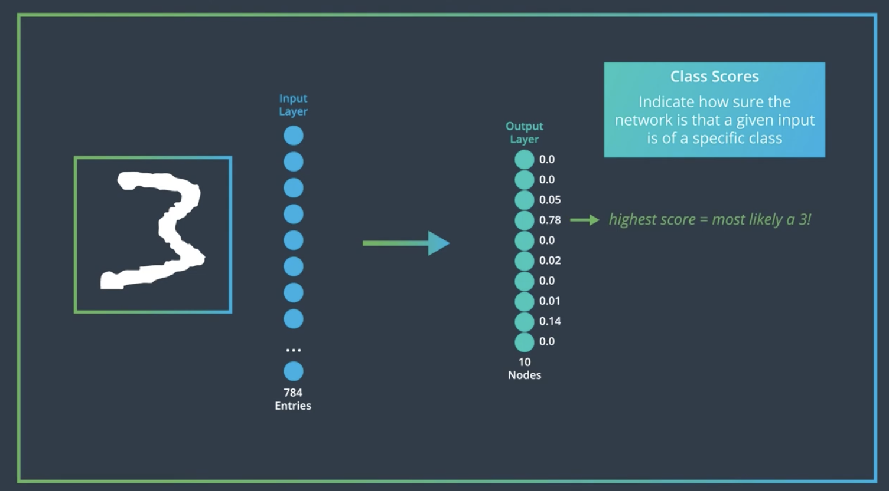
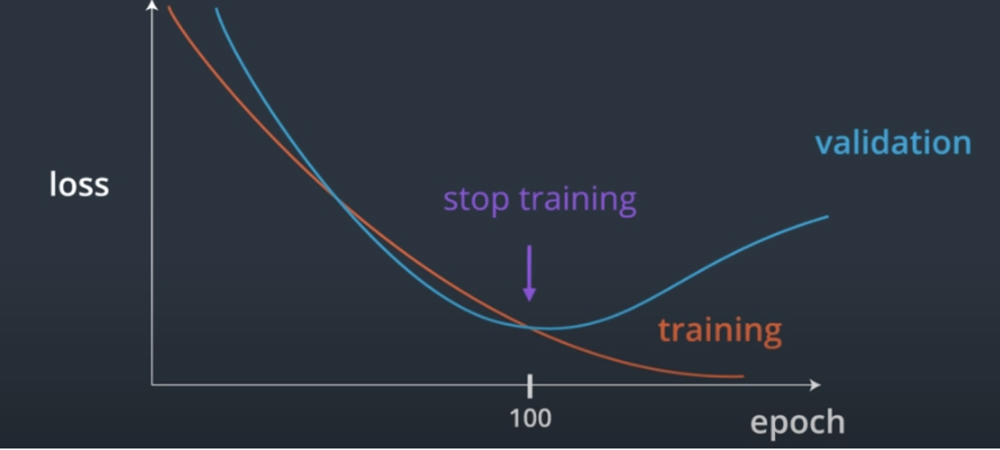
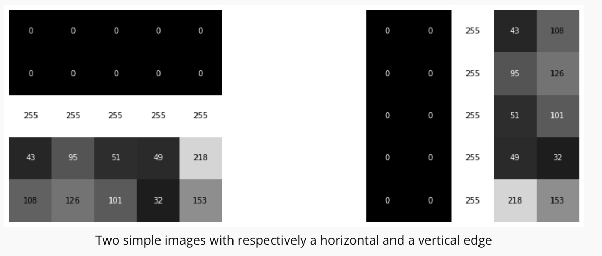

# Convolutional Neural Networks

<br>
<br>

# C-2: CNN Concepts

<br>
<br>

A CNN is a neural network developed specifically for image and video processing. CNNs are used to automate many tasks,
for example:

- Image classification
- Object recognition
- Anomaly detection
- Image captioning

They are widely used across many industries, including medicine, banking, manufacturing, insurance, real-estate,
transportation (self-driving cars), and social networks. CNNs are arguably the main technology responsible for the
Artificial Intelligence renaissance we are witnessing today, with a billion of dollars in revenue generated by their
application.

<p align="center">

</p>
<p align="center">figure: Overview of a Convolutional Neural Network applications</p>

<br>
<br>

CNNs are powerful for image tasks, overcoming MLP limitations. The course covers CNN basics, advanced architectures, and
applications like object detection and segmentation. If you use CNNs to power a real product in a real-world setting,
you are going to interact with several different profiles:

- Data Scientist / Machine Learning Engineer: Responsible for developing the ML pipeline and the model, as well as
  performing all the relevant analytics - for example on data quality and performance measurements.
- Data Engineers: Responsible for the data ingestion pipelines, the quality of the data that the DS/MLE receive, and for
  provisioning the right data at inference time.
- Software Engineers: Responsible for the production environment, both front-end and back-end, as well as for many
  pieces of the MLOps infrastructure. Involve them from the beginning to make sure that the model you are producing can
  fit into the production environment.
- DevOps Engineers: Help in handling the infrastructure, including training servers, various MLOps tools, and other
  infrastructure needed to train and deploy a model.
- Product Managers: Define the right problem to solve, exploit the knowledge of the customers, and define quantifiable
  deliverables and success criteria for the project. The PM also helps in keeping the project on time and on budget.
- Customers: Consumer of the product; we should always consider the customers' and users' perspectives for every
  decision that we make.

<p align="center">

</p>
<p align="center">figure: Pre-process the data</p>

An image is seen by the computer as an array of values, namely, a matrix. The images in the MNIST dataset are 28 x 28
and 8-bit grayscale. This means that the computer represents each one of them as a square matrix of 28 x 28 elements,
where the value in the element of the matrix represents the light intensity with a range of 0 to 255: 0 means pure black
and 255 means pure white.

We already know how to perform classification with neural networks, and in particular with a Multi-Layer Perceptron,
MLP. This network takes as input a grayscale image as a matrix and outputs a vector of scores or a vector of
probabilities ( one for each class). The class corresponding to the maximum of that vector corresponds to the best guess
for the label of the image.

#### Multi-Layer Perceptrons (MLPs)

A Multi-Layer Perceptron (MLP) is a type of feedforward artificial neural network consisting of at least three layers:

- An **input layer** that receives the data
- One or more **hidden layers** that perform computations
- An **output layer** that produces the final result

#### How MLPs Work

##### Input Processing

- For image data, the 2D matrix is flattened into a 1D vector
- Each input neuron represents a single feature (e.g., a pixel value)

##### Forward Propagation

- Data flows from input to output in one direction
- Each neuron applies a weighted sum of inputs plus a bias
- The result is passed through an activation function

##### Activation Functions

- ReLU (Rectified Linear Unit): Outputs the positive part of its input
- Sigmoid: Maps input to a value between 0 and 1
- Tanh: Maps input to a value between -1 and 1

#### Architecture Design

- **Input layer size**: Fixed by the data dimension (e.g., 784 for MNIST)
- **Output layer size**: Fixed by the task (e.g., 10 for digit classification)
- **Hidden layer size**: Often start with the mean between input and output dimensions
- **Number of hidden layers**: Start with 1-2 and increase if needed

#### Training Process

1. **Initialize weights**: Small random values
2. **Forward pass**: Compute predictions
3. **Calculate loss**: Typically cross-entropy for classification
4. **Backward pass**: Compute gradients
5. **Update weights**: Using an optimizer like SGD or Adam

#### Limitations for Image Data

- **Loss of spatial information**: Flattening destroys the 2D structure
- **No translation invariance**: Objects must be seen in all possible positions
- **Parameter inefficiency**: Fully connected layers have many parameters
- **Difficulty with complex patterns**: Struggles to learn hierarchical features

#### When to Use MLPs

- Tabular data
- Simple pattern recognition
- Data without spatial or temporal relationships
- When input features are independent

MLPs provide the foundation for understanding more complex neural networks like CNNs, which address many of these
limitations for image processing tasks.

##### Flattening

Suppose we want to use an MLP to classify our image. The problem is, the network takes a 1d array as input, while we
have images that are 28x28 matrices. The obvious solution is to flatten the matrix, i.e., to stack all the rows of the
matrix in one long 1D vector, as in the image below.

<p align="center">

</p>
<p align="center">figure: flattening of the matrix</p>

<br>
<br>

##### Normalizing Image Inputs

##### Data Normalization

Data normalization is a critical preprocessing step in neural networks that transforms input data to have similar
scales. For image data, this means converting pixel values (typically 0-255) to smaller ranges.

##### Why Normalize Data?

1. **Faster convergence**: When inputs are normalized (close to zero), gradient descent works more efficiently
2. **Improved stability**: Prevents extremely large or small weight updates during training
3. **Better learning**: Helps the network learn the relative importance of features rather than being affected by their
   scales

##### Normalization Methods for Images:

1. **Simple scaling**: Divide pixel values by 255 to get values between 0 and 1
2. **Standardization**: Subtract mean and divide by standard deviation to get:
   $$x_{normalized} = \frac{x - \mu}{\sigma}$$
3. **Approximation method**: Use mean=0.5 and standard deviation=0.5 to center values:
   $$x_{normalized} = \frac{x/255 - 0.5}{0.5}$$

##### Activation Functions

Activation functions introduce non-linearity into neural networks, allowing them to learn complex patterns.

###### Sigmoid Activation Function

- **Mathematical form**: $$\sigma(z) = \frac{1}{1 + e^{-z}}$$

- **Output range**: Between 0 and 1

- Characteristics:

    - S-shaped curve
    - Highest rate of change around z=0
    - Almost flat (saturated) when z is very positive or very negative
    - Derivative: $$\sigma'(z) = \sigma(z)(1 - \sigma(z))$$
    - Maximum derivative of 0.25 at z=0

###### ReLU (Rectified Linear Unit) Activation Function

The purpose of an activation function is to scale the outputs of a layer so that they are consistent, small values. Much
like normalizing input values, this step ensures that our model trains efficiently!

A ReLU activation function stands for _Rectified Linear Unit_ and is one of the most commonly used activation functions
for hidden layers. It is an activation function, simply defined as the positive part of the input, x. So, for an input
image with any negative pixel values, this would turn all those values to 0, black. You may hear this referred to as
_clipping_ the values to zero; meaning that is the lower bound.

<p align="center">

</p>
<p align="center">figure:  ReLU Activation Function</p>

- **Mathematical form**: $$R(z) = \max(0, z)$$
- **Output range**: From 0 to ∞
- Characteristics:

    - Simple piecewise linear function
    - Zero output for negative inputs
    - Linear for positive inputs
    - Derivative: $$R'(z) = \begin{cases} 0 & \text{if } z < 0 \ 1 & \text{if } z > 0 \end{cases}$$
    - Undefined at z=0, but in practice set to 0 or 1

##### Connection Between Normalization and Activation Functions

When we normalize data to be close to zero and initialize weights near zero:

1. The product of weights and inputs results in values near zero: $$z = w \cdot x + b \approx 0$$
2. At z≈0, activation functions have their largest derivatives:
    - For sigmoid: maximum derivative of 0.25
    - For ReLU: abrupt change from 0 to 1
3. This maximizes the effect of gradient descent:
   $$\Delta w = -\eta \frac{\partial L}{\partial w} = -\eta \frac{\partial L}{\partial a} \cdot \frac{\partial a}{\partial z} \cdot \frac{\partial z}{\partial w}$$

Where the middle term $$\frac{\partial a}{\partial z}$$ is the derivative of the activation function, which is largest
near zero.

This is why normalizing inputs to be close to zero allows for faster training and better convergence in neural networks.
Data normalization is an important pre-processing step for neural networks. The activation functions that are normally
used in neural networks (sigmoid, ReLU, ...) have the highest rate of change around 0:

<p align="center">

</p>
<p align="center">figure:  Normalizing Image Inputs</p>

<br>
<br>

This means that their derivative is large for inputs that are not too far from 0. Since we train neural networks with
gradient descent, the training can proceed faster if the weights stay in the vicinity of where the activation function
changes rapidly, i.e., close to 0.

The weights of a neural network are typically initialized with a mean of 0, i.e., some weights are negative and some are
positive, but they are in general between -1 and +1, close to 0. Remember that these weights are multiplied with the
feature values (in this case the pixel values) and then a bias is added on top before the result is fed to the
activation function.

Therefore, if we want the input of the activation function to be somewhere close to 0, we need to start with a number
that is close to zero, because two numbers close to zero multiplied together give another number close to zero. So we
need to take the pixels in the input image, which in the case of a grayscale image have values between 0 and 255, and
renormalize them to be close to zero. The easiest way is to just divide the value by 255, thereby changing the pixel
values to be between 0 and 1. In many cases, we go further than that: we compute the mean and the standard deviation of
all the pixels in the renormalized dataset, then we subtract the mean and divide by the standard deviation for each
image separately. Therefore, our transformed data will contain both negative and positive pixels with mean 0 and
standard deviation 1. Sometimes you'll see an approximation here, where we use a mean and standard deviation of 0.5 to
center the pixel values.

#### Dropout

Dropout is a regularization technique that helps prevent neural networks from overfitting. Here's how it functions:

1. **During training**:
    - Randomly deactivates (or "drops out") a percentage of neurons in a layer
    - If the `Dropout(0.5)`, it means 50% of neurons are randomly disabled each batch
    - Each neuron has a 50% probability of being temporarily removed
2. **Neuron deactivation**:
    - Set the output of dropped neurons to zero
    - The remaining neurons must compensate for the missing ones
    - This forces the network to be more robust and redundant
3. **Scaling mechanism**:
    - Remaining active neurons are scaled up by 1/(1-p) where p is dropout rate
    - With 50% dropout, active neurons' outputs are doubled
    - This keeps the expected sum of activations the same
4. **During inference (testing)**:
    - No neurons are dropped out
    - Instead, all neurons are active but their outputs are scaled down
    - Alternatively, during training the active neurons are scaled up
5. **Benefits**:
    - Prevents co-adaptation (neurons becoming too interdependent)
    - Acts like an ensemble of different networks
    - Reduces overfitting by preventing memorization

Dropout essentially makes the network learn multiple redundant ways to classify each sample, making it more robust and
resistant to overfitting.

<br>
<br>

#### MLP for MNIST Dataset

The input of our MLP must obviously be 28 x 28=784, which corresponds to the dimension of the flattened image. The
output of the MLP must also be obviously a vector with 10 elements (e.g. 0 to 9). The values in this vector are
proportional to the probability that the network assigns to each class. So if the network thinks that it is most likely
that the given image is an 8, then the element in the array corresponding with 8 should be the largest. But what goes
between the input and the output, how many hidden layers, and how many neurons.

<p align="center">

</p>
<p align="center">figure:  A Multi-Layer Perceptron for MNIST</p>

<br>
<br>

<p align="center">

</p>
<p align="center">figure: Visualization of the neural network training process and data flow</p>

<br>
<br>

#### Loss Function

The loss function quantifies how far we are from the ideal state where the network does not make any mistakes and has
perfect confidence in its answers. Depending on the task and other considerations we might pick different loss
functions. For image classification the most typical loss function is the _Categorical Cross-Entropy (CCE)_ loss,
defined as:

$$
\text{CCE} = -\sum_{i=1}^{n_\text{classes}} y_i \log(\hat{p}_i)
$$

Where:

- $n_\text{classes}$ is the number of classes (10 for MNIST digits)
- $y_i$ is the true label (ground truth) as a one-hot encoded vector of length 10
- $\hat{p}_i$ is the predicted probability for class $i$

<br>
<br>

The interpretations of the Loss Function are:

1. The loss quantifies the difference between the predicted probability distribution and the true distribution (one-hot
   encoded ground truth).
2. A perfect prediction would result in a loss of 0, while incorrect predictions increase the loss value.
3. The logarithm heavily penalizes confident misclassifications, encouraging the model to be cautious with its
   predictions.

This loss function is well-suited for our MNIST task because:

1. It naturally handles multi-class problems.
2. It encourages the model to output well-calibrated probabilities.
3. It's differentiable, allowing for effective backpropagation during training.

By minimizing this loss during training, we push our model to make increasingly accurate predictions on the digit
classification task.

<br>
<br>

#### Design of an MLP

When designing an MLP you have a lot of different possibilities, and it is sometimes hard to know where to start.
Unfortunately there are no strict rules, and experimentation is key. However, here are some guidelines to help you get
started with an initial architecture that makes sense, from which you can start experimenting.

The number of inputs _input_dim_ is fixed (in the case of MNIST images for example it is 28 x 28 = 784), so the first
layer must be a fully-connected layer (Linear in PyTorch) with _input_dim_ as input dimension.

Also, the number of outputs is fixed as it is determined by the desired outputs. For a classification problem it is the
number of classes, _n_classes_, and for a regression problem it is 1 (or the number of continuous values to predict). So
the output layer is a Linear layer with _n_classes_ (in case of classification).

What remains to be decided is the number of _hidden layers_ and their _size_. Typically, you want to start from only one
hidden layer, with a number of neurons between the input and the output dimension. Sometimes adding a second hidden
layer helps, and in rare cases you might need to add more than one. But one is a good starting point.

As for the number of neurons in the hidden layers, a decent starting point is usually the mean between the input and the
output dimension. Then you can start experimenting with increasing or decreasing, and observe the performances you get.
If you see overfitting, start by adding regularization (dropout and weight decay) instead of decreasing the number of
neurons, and see if that fixes it. A larger network with a bit of drop-out learns multiple ways to arrive to the right
answer, so it is more robust than a smaller network without dropout. If this doesn't address the overfitting, then
decrease the number of neurons. If you see underfitting, add more neurons. You can start by approximating up to the
closest power of 2. Keep in mind that the number of neurons also depends on the size of your training dataset: a larger
network is more powerful, but it needs more data to avoid overfitting. The Key Points for the MLP Design are:

1. **Input layer size**: Fixed by input data dimensions
2. **Output layer size**: Fixed by classification or regression task requirements
3. **Hidden layers**: Start with one hidden layer as baseline
4. **Hidden layer sizing**: Begin with mean between input and output dimensions
5. **Regularization first**: Add dropout before reducing model size if overfitting
6. **Scale with data**: Larger networks need more training data
7. **Adjust incrementally**: Experiment by gradually changing architecture
8. **Monitor performance**: Use validation data to guide architecture decisions

So let's consider the MNIST classification problem. We have _n_classes_ = 10 and _input_dim_ = 784, so a starting point
for our experimentation could be:

<br>
<br>

```python
import torch
import torch.nn as nn


class MLPModel(nn.Module):

    def __init__(self):
        super().__init__()

        # Create layers. In this case just a standard MLP
        self.model = nn.Sequential(
            # Input layer. The input is obviously 784. For
            # the output (which is the input to the hidden layer)
            # we take the mean between network input and output:
            # (784 + 10) / 2 = 397 which we round to 400
            nn.Linear(784, 400),
            nn.Dropout(0.5),  # Combat overfitting
            nn.ReLU(),
            # Hidden layer
            nn.Linear(400, 400),
            nn.Dropout(0.5),  # Combat overfitting
            nn.ReLU(),
            # Output layer, must receive the output of the
            # hidden layer and return the number of classes
            nn.Linear(400, 10)
        )

    def forward(self, x):
        # nn.Sequential will call the layers
        # in the order they have been inserted
        return self.model(x)
```

This code defines an MLP model for MNIST digit classification. It contains two hidden layers, both with 400 neurons. The
network takes flattened 28×28 pixel images (784 inputs), processes them through the first hidden layer with ReLU
activation and 50% dropout, then through an identical second hidden layer, and finally outputs 10 values corresponding
to digit class scores. The model uses a sequential architecture where data flows linearly through each layer. The
dropout layers help prevent overfitting by randomly deactivating 50% of neurons during training. The forward method
simply passes the input through the sequential model, returning the final output without applying any additional
activation function (allowing it to be used with CrossEntropyLoss which includes softmax internally).

<br>
<br>

#### Sequential vs. Non-Sequential Neural Networks

Sequential and Non-Sequential networks represent different ways to structure neural networks:

##### Sequential Neural Networks

1. **Definition**: Linear stack of layers where output of one layer becomes input to the next
2. **Data flow**: Strictly forward in one direction
3. **Structure**: Simple chain-like arrangement of layers
4. **Implementation**: Often implemented using `nn.Sequential` in PyTorch
5. **Best for**: Straightforward tasks with simple data flow requirements

A sequential neural network is a linear stack of layers where the output of one layer becomes the input to the next
layer. This is the simplest and most common type of neural network architecture. The main characteristics of a
sequential neural network are:

1. Layers are arranged in a straight line.
2. Data flows through the network in a single, forward direction.
3. Easy to conceptualize and implement.

##### Non-Sequential Neural Networks

1. **Definition**: Networks with complex connectivity patterns beyond simple chains
2. **Data flow**: Can branch, merge, skip connections, or have feedback loops
3. **Structure**: Can have multiple inputs/outputs or complex internal connections
4. **Implementation**: Typically requires custom `forward()` method definition
5. Types include:
    - Networks with skip connections (ResNets)
    - Multi-path networks
    - Networks with shared components
    - Graph-based networks

It is absolutely possible, and often necessary, to have neural networks that are not sequential. They are sometimes also
called non-linear neural networks. The types of Non-Sequential Architectures are provided below:

1. Branching Networks: Where the data flow splits and merges.
2. Residual Networks (ResNets): Include skip connections that bypass one or more layers.
3. Recurrent Neural Networks (RNNs): Have feedback loops, allowing information to persist.
4. Graph Neural Networks: Operate on graph-structured data.
5. Multi-Input or Multi-Output Networks: Accept or produce multiple tensors.

##### When to Use Non-Sequential Networks

1. Complex Data Dependencies: When your data has complex relationships that can't be captured by a simple linear flow.
2. Performance Improvement: Techniques like skip connections in ResNets can help with training very deep networks.
3. Task-Specific Requirements: Some tasks inherently require non-sequential processing, like image segmentation or
   machine translation.
4. Multi-Modal Data: When working with multiple types of input data simultaneously.

Non-sequential architectures offer more flexibility and can often capture more complex patterns in data, but they can
also be more challenging to design and train. The key differences of them with the sequential architectures are:

1. **Flexibility**: Non-Sequential offers more design flexibility
2. **Complexity**: Sequential is simpler to implement and understand
3. **Use cases**: Complex tasks often require non-sequential architectures
4. **Implementation complexity**: Sequential can be defined with one container, while non-sequential requires more code

The architecture choice depends on the specific requirements of your task - Sequential is sufficient for many problems,
while complex tasks may benefit from non-sequential designs.

<br>

#### Training Neural Networks

Imagine you're teaching a child to recognize different animals. At first, they make many mistakes, but with each example
you show and correct, they gradually improve. Training a neural network follows a similar pattern. The process begins
with preparing your data, designing a model architecture, and then guiding the model through thousands of examples where
it makes predictions, receives feedback on its errors, and adjusts its understanding accordingly.

This iterative learning cycle is powered by a mathematical process called gradient descent, where the model
systematically adjusts its internal parameters (weights and biases) to minimize the difference between its predictions
and the actual answers. Think of it as the model slowly finding its way down a mountain of errors to reach the valley of
good predictions. Let's explore each component of this fascinating process in detail. The essential components of Neural
Network training are following:

##### Loss Function

The loss function serves as our measure of how wrong the model's predictions are. For classification tasks like
identifying digits or categorizing images, we typically use Cross Entropy Loss. This function has an elegant
mathematical property: it severely penalizes the model when it's confidently wrong, but only mildly when it's slightly
off.

Cross Entropy Loss combines two operations: first, it converts raw model outputs into probabilities using the softmax
function, and then it measures how different these probabilities are from the true labels. In PyTorch, this is
conveniently packaged in `nn.CrossEntropyLoss()`. The lower this number, the better our model is performing.

##### Optimizer

While the loss function tells us how far off we are, the optimizer determines how to adjust the model parameters to
improve. Think of the optimizer as a navigator helping the model traverse the complex landscape of possible parameter
values. Popular optimizers include:

**Stochastic Gradient Descent (SGD)**: The classic approach that moves parameters in the direction that reduces the
loss, scaled by a learning rate. Like taking careful steps down our error mountain.

**Adam**: A more sophisticated navigator that adapts its step size based on recent history, often reaching good
solutions faster. Adam maintains separate learning rates for each parameter and adjusts them based on recent gradients.

When configuring an optimizer, you'll specify which parameters to update (typically all model parameters with
`model.parameters()`), the learning rate (how big each adjustment step should be), and sometimes weight decay (a
technique to prevent overfitting by keeping parameters small).

##### Training Loop

The training loop is where the actual learning happens. For a specified number of epochs (complete passes through the
dataset), we repeatedly:

1. Put the model in training mode with `model.train()` to enable dropout and other training-specific behaviors.
2. For each batch of data:
    - Clear previous gradients with `optimizer.zero_grad()` to start fresh.
    - Perform a forward pass by feeding data through the model: `output = model(data)`.
    - Calculate the loss between the model's output and the true targets.
    - Compute gradients with `loss.backward()`, which determines how each parameter should change.
    - Update parameters with `optimizer.step()`, which applies these changes according to the optimizer's rules.
3. Track the average loss to monitor progress.

This cycle of prediction, error measurement, and adjustment is the essence of how neural networks learn.

##### Validation

After each training epoch, we need to assess how well our model generalizes to data it hasn't seen before. The
validation process:

1. Disables gradient calculation with `with torch.no_grad():` since we're not learning here, just evaluating.

2. Sets the model to evaluation mode with `model.eval()`, which affects layers like Dropout.

3. Runs predictions on the validation data and calculates metrics like loss and accuracy.

4. Compares validation performance to previous epochs.

Validation serves two crucial purposes:

- It tells us how well our model will likely perform on new data.
- It helps detect overfitting, where training performance improves but validation performance worsens, indicating the
  model is memorizing training data rather than learning generalizable patterns.

A useful practice is saving model weights whenever validation performance reaches a new high, ensuring we keep our best
model even if performance later deteriorates. Once we have performed an epoch of training we can evaluate the model
against the validation set to see how it is doing. This is accomplished with the validation loop:

```python
# Tell pytorch to stop computing gradients for the moment
# by using the torch.no_grad() context manager
with torch.no_grad():
    # set the model to evaluation mode
    # This changes the behavior of some layers like
    # Dropout with respect to their behavior during
    # training
    model.eval()

    # Keep track of the validation loss
    valid_loss = 0.0

    # Loop over the batches of validation data
    # (here we have removed the progress bar display that is
    # accomplished using tqdm in the video, for clarity)
    for batch_idx, (data, target) in enumerate(valid_dataloader):
        # 1. forward pass: compute predicted outputs by passing inputs to the model
        output = model(data)

        # 2. calculate the loss
        loss_value = criterion(output, target)

        # Calculate average validation loss
        valid_loss = valid_loss + (
                (1 / (batch_idx + 1)) * (loss_value.data.item() - valid_loss)
        )

    # Print the losses
    print(f"Epoch {epoch + 1}: training loss {train_loss:.5f}, valid loss {valid_loss:.5f}")

```

It is usually a good idea to wrap the validation loop in a function so you can return the validation loss for each
epoch, and you can check whether the current epoch has the lowest loss so far. In that case, you save the weights of the
model. We will see in one of the future exercises how to do that.

##### Testing Phase

Once training is complete, we evaluate the model on a completely unseen test dataset. This process is nearly identical
to validation but serves as the final, unbiased assessment of our model's capabilities.

##### Monitoring and Improving

Visualizing both training and validation losses over time creates learning curves that reveal important patterns:

- If both training and validation losses remain high, the model is underfitting and might need more capacity or training
  time.
- If training loss is much lower than validation loss, the model is overfitting and might need regularization techniques
  like dropout or weight decay.
- The optimal stopping point occurs when validation loss reaches its minimum before rising again.

<p align="center">

</p>
<p align="center">figure: Validation of a Convolutional Neural Network </p>

##### Training Workflow

The entire process forms a cycle:

1. Prepare data with appropriate preprocessing and loading mechanisms.
2. Design a model architecture suited to the problem.
3. Choose appropriate loss functions and optimizers.
4. Train the model while monitoring validation performance.
5. Experiment with different hyperparameters and model adjustments.
6. Select the best model based on validation metrics.
7. Evaluate final performance on test data.
8. If needed, return to step 2 or 3 with new insights.

<p align="center">

</p>
<p align="center">figure:  Training a Neural Network</p>

This methodical approach, while sometimes requiring patience and experimentation, allows us to develop models that can
recognize patterns, make predictions, and solve complex problems across many domains. By understanding each component of
the training process, you gain the ability to diagnose issues, make informed adjustments, and develop increasingly
powerful models for your specific tasks.

<br>
<br>

#### Model Performance

The MNIST dataset is very clean and is one of the few datasets where MLPs and Convolutional Neural Networks perform at a
similar level of accuracy. However, all of the top-scoring architectures for MNIST are CNNs (although their performance
difference compared to MLPs is small). In most cases, CNNs are vastly superior to MLPs, both in terms of accuracy and in
terms of network size when dealing with images.

As we will see, the main reason for the superiority of CNNs is that MLPs have to flatten the input image, and therefore
initially ignore most of the spatial information, which is very important in an image. Also, among other things, they
are not invariant for translation. This means that they need to learn to recognize the same image all over again if we
translate even slightly the objects in it.

CNNs instead don't need to flatten the image and can therefore immediately exploit the spatial structure. As we will
see, through the use of convolution and pooling they also have approximate translation invariance, making them much
better choices for image tasks.

<br>
<br>

#### MLPs vs CNNs Comparison

<br>
<br>

##### MLPs

1. Structure:

    - Consist of fully connected layers
    - Each neuron connected to every neuron in the previous and next layer

2. Input handling:

    - Typically work with 1D input (flattened data)
    - Lose spatial information when dealing with 2D or 3D data

3. Parameter efficiency:

    - Large number of parameters, especially for high-dimensional input
    - Prone to overfitting on image data

4. Feature extraction:

    - Learn global patterns
    - No built-in understanding of spatial hierarchies

5. Invariance:

    - No built-in translation invariance

6. Applications:
    - Suitable for tabular data, simple pattern recognition
    - Less effective for complex spatial data like images

<br>

##### CNNs

1. Structure:

    - Consist of convolutional layers, pooling layers, and fully connected layers
    - Local connectivity in convolutional layers

2. Input handling:

    - Designed to work with grid-like topologies (e.g., 2D images, 3D videos)
    - Preserve spatial information

3. Parameter efficiency:

    - Fewer parameters due to parameter sharing in convolutional layers
    - Better at generalizing for image-like data

4. Feature extraction:

    - Learn local patterns and build up to more complex features
    - Hierarchical feature learning

5. Invariance:

    - Built-in translation invariance due to convolutional operations

6. Applications:
    - Excellent for image-related tasks (classification, segmentation, detection)
    - Effective for any data with spatial or temporal structure

The key differences of the MLPs vs CNNs are:

1. Connectivity: MLPs use full connectivity, while CNNs use local connectivity.
2. Spatial awareness: CNNs preserve and utilize spatial information, MLPs do not.
3. Parameter efficiency: CNNs are more parameter-efficient for image-like data.
4. Feature learning: CNNs learn hierarchical features, MLPs learn global patterns.
5. Invariance: CNNs have built-in translation invariance, MLPs do not.

The use cases of the MLPs vs CNNs are:

- Use MLPs for:

    - Tabular data
    - Simple pattern recognition tasks
    - When input features don't have spatial or temporal relationships

- Use CNNs for:
    - Image processing tasks
    - Data with spatial or temporal structure
    - When you need to preserve and utilize spatial information

<br>
<br>

Convolutional Neural Networks are characterized by locally-connected layers, i.e., layers where neurons are connected to
only a limited numbers of input pixels (instead of all the pixels like in fully-connected layers). Moreover, these
neurons share their weights, which drastically reduces the number of parameters in the network with respect to MLPs. The
idea behind this weight-sharing is that the network should be able to recognize the same pattern anywhere in the image.

CNNs can preserve spatial information, and the key to this capability is called the _Convolution operation_: it makes
the network capable of extracting spatial and color patterns that characterize different objects. CNNs use filters (also
known as _kernels_) to _extract_ the features of an object (for example, edges). By using multiple different filters the
network can learn to recognize complex shapes and objects.

Image filters are a traditional concept in computer vision. They are small matrices that can be used to transform the
input image in specific ways, for example, highlighting edges of objects in the image. An edge of an object is a place
in an image where the intensity changes significantly.

To detect these changes in intensity within an image, you can create specific image filters that look at groups of
pixels and react to alternating patterns of dark/light pixels. These filters produce an output that shows edges of
objects and differing textures. We will see that CNNs can learn the most useful filters needed to, for example, classify
an image. But before doing that, let's look at some specific filters that we can create manually to understand how they
work.

#### Kernel Convolution in CNN

Kernel convolution is a fundamental operation in Convolutional Neural Networks (CNNs) that enables the network to detect
features in images.

##### How Convolution Works

1. _Kernel (Filter)_: A small matrix of weights, typically 3x3 or 5x5.
2. _Sliding Window_: The kernel slides over the input image.
3. _Element-wise Multiplication_: At each position, the kernel is multiplied element-wise with the overlapping image
   patch.
4. _Summation_: The products are summed to produce a single output value.

- Kernel (3x3):
    ```
    [ 0  -1   0]
    [-1   4  -1]
    [ 0  -1   0]
    ```
- Image Patch (3x3):
    ```
    [140 120 120]
    [225 220 205]
    [255 250 230]
    ```
- Calculation: (0*140) + (-1*120) + (0*120) + (-1*225) + (4*220) + (-1*205) + (0*255) + (-1*250) + (0\*230) = 60

The result (60) becomes the value in the output feature map for this position.

##### Edge Handling

When the kernel reaches the edges or corners of the image, special handling is required:

1. _Padding_: Add a border of 0's (black pixels) around the image.
    - Maintains the original image size in the output.
    - Common in practice.
2. _Cropping_: Skip pixels that would require values from beyond the edge.
    - Results in a smaller output image.
    - Loses information at the edges.
3. _Extension_: Extend border pixels as needed.
    - Corner pixels: Extended in 90° wedges.
    - Edge pixels: Extended in lines.
    - Maintains original image size without introducing new values.

<br>
<br>

#### Importance in CNNs

- Convolution allows CNNs to detect local patterns and features.

- Different kernels can detect various features (edges, textures, etc.).

- As the network deepens, it can recognize more complex patterns.

- The kernels' weights are learned during training, allowing the network to automatically discover important features
  for the task at hand.

#### Edge Handling

Kernel convolution relies on centering a pixel and looking at its surrounding neighbors. So, what do you do if there are
no surrounding pixels like on an image corner or edge? Well, there are a number of ways to process the edges, which are
listed below. It’s most common to use padding, cropping, or extension. In extension, the border pixels of an image are
copied and extended far enough to result in a filtered image of the same size as the original image.

1. _Padding_: The image is padded with a border of 0's, black pixels.

2. _Cropping_: Any pixel in the output image which would require values from beyond the edge is skipped. This method can
   result in the output image being smaller then the input image, with the edges having been cropped.

3. _Extension_: The nearest border pixels are conceptually extended as far as necessary to provide values for the
   convolution. Corner pixels are extended in 90° wedges. Other edge pixels are extended in lines.

<p align="center">

</p>
<p align="center">figure:  Kernel Convolution in CNN</p>

<br>
<br>

#### Questions and Answers

##### Q#1: Of the four kernels pictured above, which would be best for finding and enhancing horizontal edges and lines in an image? If needed, use the bottom images and go through the math of applying the filters to those images. Which filter gives you a horizontal line in the output?

The correct answer is **d**. Let's examine why:

Kernel d:

```
-1 -2 -1
 0  0  0
 1  2  1
```

This kernel is designed to detect horizontal edges and lines because:

1. It has a strong horizontal structure.
2. The top row is negative, the middle row is zero, and the bottom row is positive.
3. When this kernel slides over a horizontal edge (dark above, light below), it will produce a strong positive response.

When applied to the horizontal edge image (the bottom-left image in the first figure), this kernel would highlight the
horizontal line between the black and white regions.

##### Q#2: Of the four kernels pictured above, which would be best for finding and enhancing vertical edges and lines in an image? If needed, use the example images as in the previous question.

The correct answer is **b**. Let's examine why:

Kernel b:

```
-1  0  1
-2  0  2
-1  0  1
```

This kernel is designed to detect vertical edges and lines because:

1. It has a strong vertical structure.
2. The left column is negative, the middle column is zero, and the right column is positive.
3. When this kernel slides over a vertical edge (dark on the left, light on the right), it will produce a strong
   positive response.

When applied to the vertical edge image (the bottom-right image in the first figure), this kernel would highlight the
vertical line between the black and white regions. Key points to remember:

1. Edge detection kernels typically have opposite signs on opposite sides of the kernel.
2. The direction of the edge detection (horizontal or vertical) is perpendicular to the direction of the sign change in
   the kernel.
3. These kernels are examples of Sobel filters, which are commonly used for edge detection in image processing and
   computer vision tasks.

By understanding how these kernels operate, you can see how convolutional neural networks can automatically learn to
detect various features in images, starting from simple edges and progressing to more complex patterns in deeper layers.

<p align="center">

</p>
<p align="center">figure: Overview of a Convolutional Neural Network architecture showing various layers and transformations</p>

The two filters we have looked at above are called Sobel filters. They are well-known filters used to isolate edges.

<br>
<br>

#### CNN Advanced Concepts

##### Kernel Convolution

Kernel convolution is the fundamental operation in CNNs that enables feature detection in images. The process is as
following:

1. A small matrix (kernel) slides over the input image
2. Element-wise multiplication of kernel with image patch
3. Sum of products becomes the output for that position

#### Edge Handling

- Padding: Add border of zeros
- Cropping: Skip edge pixels
- Extension: Extend border pixels

##### Types of Kernels

a. Horizontal edge detection:

```
-1 -2 -1
 0  0  0
 1  2  1
```

b. Vertical edge detection:

```
-1  0  1
-2  0  2
-1  0  1
```

<br>

##### Pooling

Pooling compresses information from a layer by summarizing areas of the feature maps. The process is as following:

1. Slide a window over each feature map
2. Compute a summary statistic for each window

Types of poolings are:

- Max Pooling: Takes the maximum value in each window
- Average Pooling: Computes the average of values in each window

Benefits of poolings are:

1. Reduces spatial dimensions of feature maps
2. Introduces translation invariance
3. Reduces computational load for subsequent layers

<br>

### CNN Architecture

A typical CNN block consists of:

1. Convolutional Layer
2. Activation Function (e.g., ReLU)
3. Pooling Layer

#### Concept Abstraction

- Stacking multiple CNN blocks allows the network to learn increasingly complex features
- Early layers detect simple features (edges, textures)
- Deeper layers combine these to detect more complex patterns (shapes, objects)

#### Translation Invariance

- Multiple CNN blocks enable the network to recognize objects regardless of their position in the image
- This is crucial for robust object recognition in various scenarios

#### Image Processing Usage

- CNNs excel at tasks like image classification, object detection, and segmentation
- The combination of convolution and pooling allows for efficient feature learning and dimensionality reduction
- Learned features are often more effective than hand-crafted features

<br>

#### Training Process

1. Forward pass: Apply convolutions and pooling to input image
2. Compare output to ground truth (using a loss function)
3. Backward pass: Compute gradients and update kernel weights
4. Repeat process with many images to optimize kernel weights

By leveraging these concepts, CNNs have revolutionized computer vision tasks, achieving state-of-the-art performance in
numerous applications.

##### Pooling

Pooling is a mechanism often used in CNNs (and in neural networks in general). Pooling compresses information from a
layer by summarizing areas of the feature maps produced in that layer. It works by sliding a window over each feature
map, just like convolution, but instead of applying a kernel we compute a summary statistic (for example the maximum or
the mean). If we take the maximum within each window, then we call this Max Pooling.

<p align="center">

</p>
<p align="center">figure: Pooling operation in a neural network, summarizing feature maps</p>

<br>
<br>

A block consisting of a convolutional layer followed by a max pooling layer (and an activation function) is the typical
building block of a CNN. By combining multiple such blocks, the network learns to extract more and more complex
information from the image. Moreover, combining multiple blocks allows the network to achieve translation invariance,
meaning it will be able to recognize the presence of an object wherever that object is translated within the image.

The _Effective Receptive Field (ERF)_ in Convolutional Neural Networks refers to the area of the input image that
influences a particular neuron in a deeper layer of the network. While the theoretical receptive field might be large,
the effective area that significantly impacts the neuron's output is often smaller and has a Gaussian-like distribution
of influence. Key points:

1. As we go deeper into the network, each neuron indirectly sees a larger portion of the input image.
2. Not all pixels in the theoretical receptive field contribute equally to the neuron's output.
3. Central pixels typically have more influence than those at the edges of the receptive field.
4. The shape of the ERF is often Gaussian-like, with influence decreasing from the center outwards.
5. ERFs evolve during training, potentially becoming more focused or spread out.

<br>
<br>

#### Receptive Fields

The region in the input space that influences a particular CNN feature called the _effective receptive field (ERF)_. It
is a measure of how much a given pixel in the input image influences the output of a given feature map in a CNN. The
differences of the Theoretical vs. Effective Receptive Field are:

- Theoretical: The entire input area that could potentially influence the feature
- Effective: The area that actually has significant influence on the feature

#### Characteristics of Effective Receptive Fields

##### Shape and Distribution

1. Gaussian-like distribution of influence
2. Center pixels have more impact than edge pixels

##### Size

1. Grows larger in deeper layers of the network
2. Affected by kernel size, stride, and network depth

##### Dynamic Nature

1. ERFs evolve during network training
2. Can become more focused or spread out based on the task

<br>
<br>

Methods for calculating the ERF are:

1. Gradient-based approaches
2. Deconvolution techniques

Visualization techniques of the ERF are:

1. Heat maps showing pixel influence
2. Overlays on input images to demonstrate ERF size and shape

#### ERFs Importance in CNN Architecture

##### Feature hierarchies

1. Shallow layers: small ERFs, local features
2. Deep layers: large ERFs, global features

##### Network design considerations

1. Balancing ERF size with computational efficiency
2. Ensuring appropriate ERF growth through the network

##### Object detection and localization

1. ERFs affect the network's ability to capture context
2. Influence on the scale of objects that can be detected

##### Image classification

1. Role in capturing both local and global features
2. Importance for handling different scales of input

<br>
<br>

##### Dilated/Atrous convolutions

1. Technique to increase ERF without increasing parameters
2. Applications in semantic segmentation

##### Attention mechanisms

1. Dynamic adjustment of ERFs
2. Allowing the network to focus on relevant parts of the input

By understanding ERFs, we gain insights into how CNNs process information and how to design more effective architectures
for various computer vision tasks. The concept of receptive field is that a pixel in the feature map of a deep layer is
computed using information that originates from a large area of the input image, although it is mediated by other
layers:

<p align="center">

</p>
<p align="center">figure: Pooling operation in a neural network, summarizing feature maps</p>

<br>
<br>

In practice things are a bit more complicated. When we compute the effective receptive field, instead of considering
just whether the information contained in a given pixel is used or not by a pixel in a deeper layer, we can consider how
many times that pixel is used. In other words, how many times that pixel was part of a convolution that ended up in a
result used by the pixel in the deeper layer. Of course, pixels on the border of the input image are used during fewer
convolutions than pixels in the center of the image. We can take this even further and ask how much a given pixel in the
input image influences the pixel in a feature map deeper in the network. This means, if we change the value of the input
pixel slightly, how much does the pixel in the deep layer change. If we take this into account, we end up with receptive
fields that are more Gaussian-like, instead of flat as we have simplified them in the video, and they also evolve as we
train the network. Visualization of an effective receptive field showing varying pixel influence in a neural network
feature map.

<br>
<br>

<p align="center">

</p>
<p align="center">figure:  CNN Architecture Blueprint</p>

<br>
<br>

<p align="center">

</p>
<p align="center">figure: Pooling operation in a neural network, summarizing feature maps</p>

#### Glossary

_Convolutional Neural Network (CNN)_: A class of Neural Networks featuring local connectivity, weight sharing, and
pooling operations.

_MNIST_: A dataset of handwritten digits of historical importance, commonly used nowadays for tutorials and learning.

_Dataloader_: Allows sequential or random iterations over a dataset or over a subset of a dataset.

_Local connectivity_: In the fully-connected layers present in a Multi-Layer Perceptron the neurons in a layer are
connected to all neurons in the previous layer. Instead, in CNNs, a neuron is connected only to a small portion of
contiguous neurons in the previous layer (or pixels in the input image).

_Filters / Kernels_: Small matrices of numbers, usually normalized to 1, that are applied to the input image during the
convolution operation.

_Convolution_: The operation of sliding a kernel on an image or a feature map to produce a modified output.

_Feature map_: The result of applying a filter on an image or another feature map. One kernel/filter generates one
feature map.

_Pooling_: The operation of sliding a window over the input image or a feature map and applying a function to the
numbers present in that window (for example, taking the maximum).

_Max Pooling_: The operation of sliding a window over the input image or a feature map and applying a maximum function
to the numbers present in that window.

_Sobel filters_: Specific types of filters that can isolate vertical and horizontal edges.

_Effective receptive field (EFR)_: Generally, this is the region in the input image that contributes to the values of a
pixel in a feature map deep in the network. More precisely, the effective receptive field is a matrix superimposed on
the input image, where each element has a value proportional to the importance that a pixel in the input image has in
determining the value of the pixel in the feature map deep in the network.

_Flattening_: The operation of taking an image or a feature map and changing it into a vector (or 1d array).
