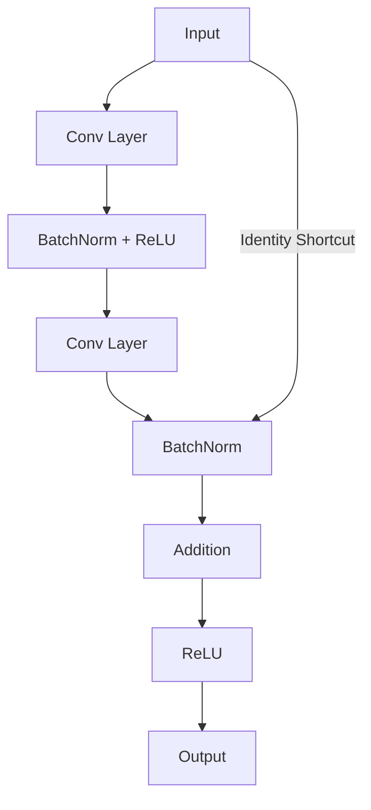
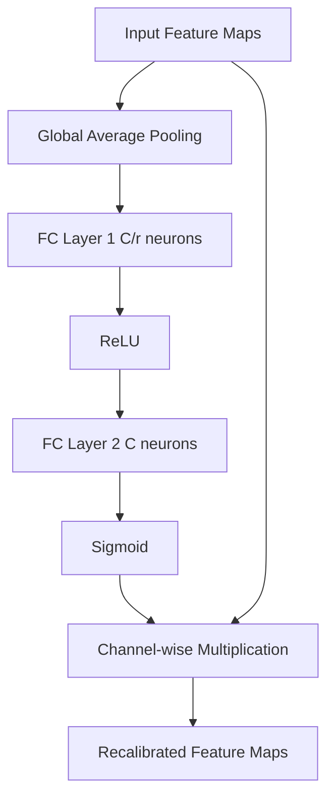
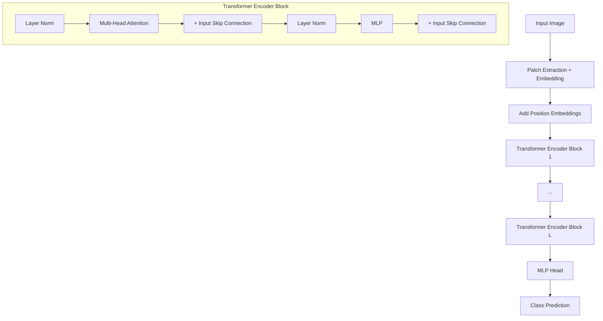
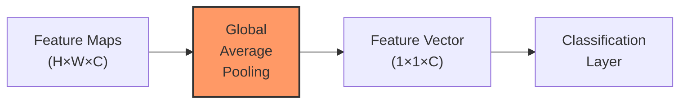
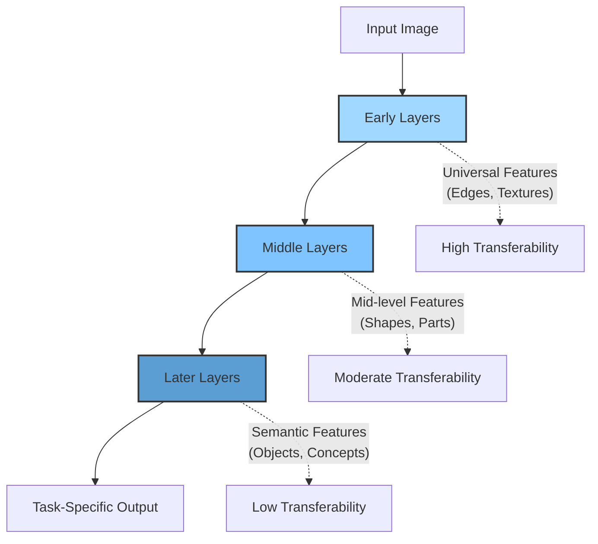
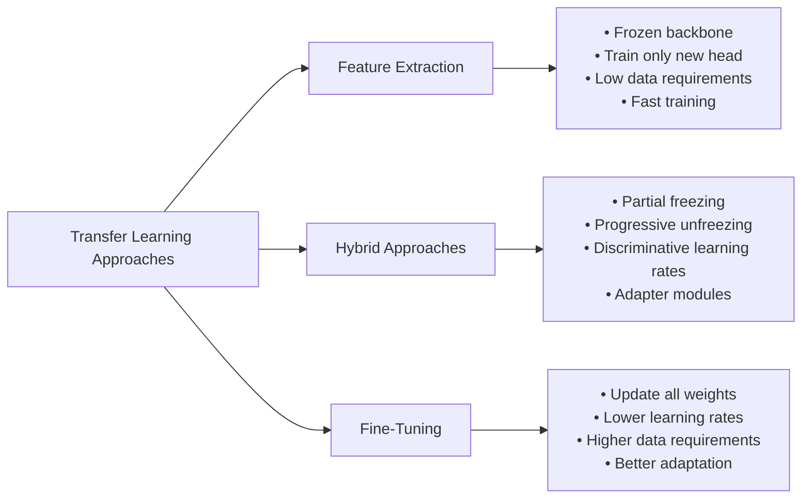
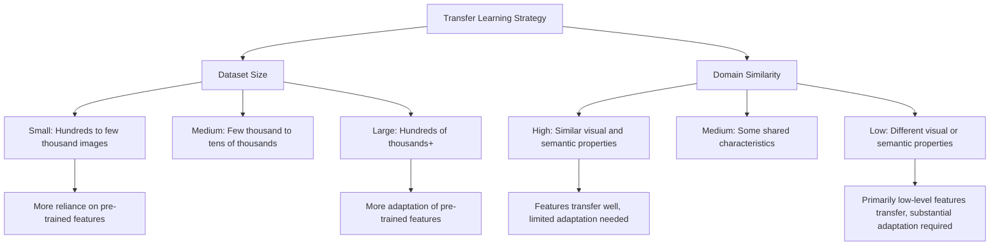

# C-3: Transfer Learning

1. Innovative CNN Architectures

    - AlexNet
    - VGG
    - ResNet (and skip connections)
    - Channel Attention mechanisms
    - Vision Transformers

2. Global Average Pooling

    - Fixed vs. flexible input sizes
    - Advantages over flattening

3. Transfer Learning Fundamentals

    - Core concept and benefits
    - Feature extraction vs. fine-tuning

4. Transfer Learning Strategies

    - Based on dataset size and similarity
    - Four key scenarios and approaches

5. Implementation Techniques

    - Freezing and thawing layers

    - Handling BatchNorm layers

    - Visualizing architectures

#### Innovative CNN Architectures

The evolution of Convolutional Neural Networks (CNNs) represents one of the most significant developments in modern
artificial intelligence. Each major architectural innovation has introduced novel ideas that collectively transformed
computer vision from a challenging research domain into a practical technology powering countless applications.
Understanding these landmark architectures provides crucial insight into the principles that drive modern deep learning
and creates the foundation for effective transfer learning.

##### AlexNet: The Architecture that Changed Everything

AlexNet, introduced by Alex Krizhevsky, Ilya Sutskever, and Geoffrey Hinton in 2012, marked the watershed moment when
deep learning decisively overtook traditional computer vision methods. Its victory in the ImageNet Large Scale Visual
Recognition Challenge, reducing error rates by almost half compared to previous approaches, signaled the beginning of
the deep learning revolution in computer vision.

###### Architectural Innovations

AlexNet's design introduced several key innovations that would become standard in future CNN architectures:

1. **ReLU Activation**: AlexNet popularized the Rectified Linear Unit (ReLU) activation function, replacing traditional
   sigmoid or tanh activations. This simple change dramatically improved training dynamics by addressing the vanishing
   gradient problem:

    $$f(x) = \max(0, x)$$

    The ReLU function allows gradients to flow unimpeded through active neurons, enabling the training of much deeper
    networks than was previously practical.

2. **Deep Structure**: The network featured five convolutional layers followed by three fully-connected layers,
   demonstrating that deeper architectures could achieve significantly better performance when properly designed:

    ```mermaid
    graph LR
       Input[Input 227x227x3] --> Conv1[Conv1 55x55x96]
       Conv1 --> Pool1[Pool1 27x27x96]
       Pool1 --> Conv2[Conv2 27x27x256]
       Conv2 --> Pool2[Pool2 13x13x256]
       Pool2 --> Conv3[Conv3 13x13x384]
       Conv3 --> Conv4[Conv4 13x13x384]
       Conv4 --> Conv5[Conv5 13x13x256]
       Conv5 --> Pool5[Pool5 6x6x256]
       Pool5 --> FC6[FC6 4096]
       FC6 --> FC7[FC7 4096]
       FC7 --> FC8[FC8 1000]
       FC8 --> Output[Softmax Output]
    ```

3. **Dropout Regularization**: AlexNet implemented dropout in the fully-connected layers, randomly deactivating 50% of
   neurons during each training iteration:

    $$y = f(Wx) \cdot \text{mask}$$

    Where mask is a binary vector with each element having a 50% chance of being zero. This technique prevents
    co-adaptation of neurons and significantly reduces overfitting, enabling the network to learn more robust features.

4. **GPU Implementation**: The network was designed specifically for GPU computation, with its convolutional layers
   split across two GPUs (a necessity given the hardware limitations of 2012). This technical approach demonstrated how
   parallel computing could make training large neural networks feasible.

5. **Data Augmentation**: AlexNet employed extensive data augmentation through random crops, horizontal flips, and color
   perturbations. While not an architectural feature per se, this approach became standard practice for training robust
   CNNs.

AlexNet's classical structure—a convolutional feature extractor followed by fully-connected classification
layers—established the template that many subsequent networks would refine. Its success demonstrated that with
sufficient data, computing power, and architectural innovations, neural networks could surpass hand-engineered features
for visual recognition tasks.

##### VGG: The Power of Simplicity and Depth

The Visual Geometry Group (VGG) at Oxford introduced their eponymous architecture in 2014, with VGG16 and VGG19
(containing 16 and 19 layers respectively) demonstrating that architectural simplicity combined with increased depth
could yield excellent results.

###### The Power of Small Filters

VGG's most significant contribution was the exclusive use of small 3×3 convolutional kernels throughout the network,
replacing the larger filters (11×11, 7×7, 5×5) used in previous architectures like AlexNet. This design choice provided
multiple benefits:

1. **Increased Non-linearity**: Stacking multiple 3×3 convolutions introduces more ReLU activations than a single larger
   kernel, increasing the network's representational capacity. For example, two consecutive 3×3 convolutional layers
   have an effective receptive field of 5×5, but with:
    - Fewer parameters: 2 × (3² × C²) versus 5² × C²
    - An additional non-linearity between them
2. **Parameter Efficiency**: Three stacked 3×3 convolutions have the same receptive field as one 7×7 convolution but use
   significantly fewer parameters:
    - Three 3×3 layers: 3 × (3² × C²) = 27C² parameters
    - One 7×7 layer: 7² × C² = 49C² parameters
3. **Architectural Regularization**: The uniform filter size creates an elegant, regular structure that imposes a form
   of architectural constraint, helping the network learn more generalizable features.

###### Network Structure and Design Principles

VGG established several design principles that influenced future architectures:

1. **Systematic Depth Progression**: VGG doubled the number of feature maps whenever the spatial dimensions were halved
   through pooling:

    ```mermaid
    graph LR
       Input[Input 224x224x3] --> Conv1[Conv Block 1: 224x224x64]
       Conv1 --> Pool1[Pool: 112x112x64]
       Pool1 --> Conv2[Conv Block 2: 112x112x128]
       Conv2 --> Pool2[Pool: 56x56x128]
       Pool2 --> Conv3[Conv Block 3: 56x56x256]
       Conv3 --> Pool3[Pool: 28x28x256]
       Pool3 --> Conv4[Conv Block 4: 28x28x512]
       Conv4 --> Pool4[Pool: 14x14x512]
       Pool4 --> Conv5[Conv Block 5: 14x14x512]
       Conv5 --> Pool5[Pool: 7x7x512]
       Pool5 --> FC6[FC6: 4096]
       FC6 --> FC7[FC7: 4096]
       FC7 --> FC8[FC8: 1000]
       FC8 --> Output[Softmax Output]
    ```

2. **Convolutional Blocks**: VGG organized convolutional layers into blocks of 2-3 layers with the same filter size and
   number of channels, followed by max-pooling that reduced spatial dimensions by half.

3. **Clean Information Flow**: The architecture maintains a clear pathway for information flow, with a systematic
   progression from spatial information to channel-rich feature representations.

The primary drawback of VGG was its large parameter count (138 million for VGG16) and computational requirements, with
most parameters concentrated in the first fully-connected layer. Despite this limitation, VGG's architectural clarity
and strong performance made it a popular choice for transfer learning, with its pre-trained weights still widely used as
feature extractors for various computer vision tasks.

VGG demonstrated that with proper architectural design, simply going deeper could substantially improve performance—a
principle that subsequent networks would embrace and extend even further.

##### ResNet: Conquering the Deep Network Training Challenge

Before ResNet (Residual Network), researchers faced a counterintuitive phenomenon: beyond a certain depth, adding more
layers to a network would actually decrease performance, even on the training set. This "degradation problem" suggested
fundamental issues with optimizing very deep networks.

###### The Degradation Problem

Conventional wisdom suggested that deeper networks should theoretically perform at least as well as shallower ones,
since additional layers could simply learn identity mappings if no further transformation was beneficial. However, in
practice, very deep networks were difficult to optimize due to:

1. **Vanishing/exploding gradients**: As gradients flowed backward through many layers, they tended to either vanish or
   explode, making learning unstable.
2. **Optimization difficulties**: The highly non-convex loss landscape of deep networks contained many poor local minima
   that gradient descent could get trapped in.

###### The Residual Learning Breakthrough

Kaiming He and colleagues at Microsoft Research addressed this challenge in 2015 with ResNet, introducing the concept of
residual learning through skip connections. The key insight was elegantly simple: instead of trying to learn a direct
mapping, learn the residual (or difference) between the input and the desired output.

The mathematical formulation of a residual block is:

$$\mathcal{F}(x) = \mathcal{H}(x) - x$$

Rearranged to:

$$\mathcal{H}(x) = \mathcal{F}(x) + x$$

Where:

- $\mathcal{H}(x)$ is the desired underlying mapping
- $\mathcal{F}(x)$ is the residual mapping learned by stacked layers
- $x$ is the identity shortcut connection

In practical implementation, a basic ResNet block consists of two or three convolutional layers with a skip connection
adding the input to the output:



This formulation provides several profound benefits:

1. **Improved Gradient Flow**: During backpropagation, the gradient can flow directly through the skip connections,
   providing a highway for information flow that mitigates the vanishing gradient problem:

    $$\frac{\partial \mathcal{L}}{\partial x} = \frac{\partial \mathcal{L}}{\partial \mathcal{H}} \cdot \left(\frac{\partial \mathcal{F}}{\partial x} + 1\right)$$

    The additive "+1" ensures that gradients don't vanish even through many layers.

2. **Identity Mapping Simplicity**: If the optimal function is close to the identity mapping, the network can easily
   learn to set the residual part to near zero, making optimization easier.

3. **Unprecedented Depth**: ResNet enabled the practical training of networks with hundreds of layers. The original
   paper demonstrated architectures with 34, 50, 101, and even 152 layers, all showing improved performance with
   increased depth.

###### ResNet Architecture Variations

The ResNet family includes several variations:

1. **Basic Block**: Used in ResNet-18 and ResNet-34, containing two 3×3 conv layers with a direct skip connection.

2. **Bottleneck Block**: Used in deeper variants (ResNet-50 and beyond), employing a three-layer pattern of 1×1, 3×3,
   and 1×1 convolutions, where the 1×1 layers reduce and then restore dimensionality, creating a "bottleneck" design
   that reduces computational cost:

    ```
    Input → 1×1 Conv (reduce channels) → 3×3 Conv → 1×1 Conv (restore channels) → Add Input → Output
    ```

3. **Projection Shortcuts**: When dimensions change (either spatial or channel dimensions), the skip connection uses a
   1×1 convolution to match dimensions:

    $$\mathcal{H}(x) = \mathcal{F}(x) + W_s x$$

    Where $W_s$ is a linear projection (1×1 convolution) to match dimensions.

The mathematical elegance of residual connections is matched by their practical impact—they address the degradation
problem so effectively that ResNet-style skip connections have become a standard component in most modern deep neural
networks, enabling effective training of extremely deep architectures.

##### Channel Attention Mechanisms

While convolutional operations excel at extracting local spatial features, they treat all channels (feature maps) with
equal importance. In many cases, certain features are more relevant than others for specific inputs. Channel attention
mechanisms address this limitation by dynamically weighting the importance of different feature maps.

<p align="center">

</p>
<p align="center">figure: Channel Attention (Squeeze-and-excitation, or SE, block)</p>

###### Squeeze-and-Excitation Networks

The Squeeze-and-Excitation (SE) block, introduced in 2018, provides a simple yet effective channel attention mechanism.
The SE block allows the network to perform feature recalibration, through which it can learn to selectively emphasize
informative features and suppress less useful ones.

The mechanism works in two main steps:

1. **Squeeze (Global Information Embedding)**: First, global spatial information is aggregated from each feature map,
   using global average pooling to create a channel descriptor $z \in \mathbb{R}^C$ (a vector with one value per
   channel):

    $$z_c = \frac{1}{H \times W} \sum_{i=1}^{H} \sum_{j=1}^{W} u_c(i,j)$$

    Where $u_c$ represents the $c$-th feature map with height $H$ and width $W$.

2. **Excitation (Adaptive Recalibration)**: The channel descriptor is then passed through a small neural network,
   typically consisting of two fully-connected layers with a bottleneck, producing a set of channel-specific weights:

    $$s = \sigma(W_2 \delta(W_1 z))$$

    Where:

    - $W_1 \in \mathbb{R}^{\frac{C}{r} \times C}$ and $W_2 \in \mathbb{R}^{C \times \frac{C}{r}}$ are learnable
      parameters
    - $\delta$ is the ReLU activation
    - $\sigma$ is the sigmoid activation
    - $r$ is a reduction ratio that determines the bottleneck size (typically 16)

<p align="center">

</p>
<p align="center">figure: Channel Attention (Squeeze-and-excitation, or SE, block)</p>

The resulting weights $s$ are then applied to the original feature maps via channel-wise multiplication, producing
recalibrated features $\tilde{x}$:

$$\tilde{x}_c = s_c \cdot x_c$$



###### Efficiency and Effectiveness

SE blocks are remarkable for their efficiency-to-performance ratio:

1. **Minimal Overhead**: The SE mechanism adds only a small number of parameters (approximately $\frac{2C^2}{r}$ per
   block) and negligible computational cost since it operates on the channel descriptor.
2. **Significant Impact**: Despite their simplicity, SE blocks consistently improve model accuracy across various
   architectures. When integrated into ResNet-50, SE blocks reduced top-5 error on ImageNet from 7.8% to 6.7%, a 14%
   relative improvement.
3. **Architectural Flexibility**: SE blocks can be seamlessly integrated into virtually any CNN architecture by
   attaching them to existing convolutional blocks, making them a versatile enhancement.

###### Attention Insights and Interpretability

Channel attention mechanisms provide insights into how neural networks process information:

1. **Feature Importance Visualization**: The attention weights can be visualized to understand which features the
   network considers important for different inputs.
2. **Adaptive Processing**: The network automatically learns to emphasize different feature maps for different inputs,
   effectively creating input-dependent processing pathways.
3. **Complementarity to Spatial Attention**: Channel attention focuses on "what" is important, complementing spatial
   attention mechanisms that focus on "where" is important.

The success of SE blocks inspired numerous other attention mechanisms in computer vision, including Convolutional Block
Attention Module (CBAM), which combines channel and spatial attention, and various efficient attention designs that have
become standard components in modern architectures like EfficientNet.

##### Vision Transformers: Bringing NLP Innovations to Computer Vision

While CNNs dominated computer vision for nearly a decade, the Vision Transformer (ViT) introduced in 2020 demonstrated
that architectures originally designed for natural language processing could achieve comparable or superior performance
on image tasks, challenging the convolutional paradigm.

###### Reimagining Images as Sequences

The key innovation of Vision Transformers is reimagining an image not as a grid of pixels but as a sequence of patches,
allowing the direct application of transformer architectures originally designed for text:

1. **Patch Embedding**: The input image $x \in \mathbb{R}^{H \times W \times C}$ is divided into $N$ fixed-size patches
   $x_p \in \mathbb{R}^{N \times (P^2 \cdot C)}$, where $(P, P)$ is the patch resolution (typically 16×16 pixels).

2. **Linear Projection**: Each patch is flattened and projected to a D-dimensional embedding space using a trainable
   linear projection:

    $$z_0 = [x_{\text{class}}; x_p^1 E; x_p^2 E; \cdots; x_p^N E] + E_{\text{pos}}$$

    Where:

    - $E \in \mathbb{R}^{(P^2 \cdot C) \times D}$ is the patch embedding projection
    - $x_{\text{class}}$ is a learnable classification token (similar to BERT's [CLS] token)
    - $E_{\text{pos}}$ are learnable position embeddings that provide spatial information

3. **Transformer Encoder**: The resulting sequence of embedded patches is processed by a standard Transformer encoder
   consisting of alternating multihead self-attention (MSA) and MLP blocks:

    $$z'*l = \text{MSA}(\text{LN}(z*{l-1})) + z_{l-1}$$ $$z_l = \text{MLP}(\text{LN}(z'_l)) + z'_l$$

    Where LN is layer normalization, and residual connections are employed around each block.

4. **Classification Head**: The final representation of the classification token is used for image classification:

    $$y = \text{LN}(z_L^0)$$



###### Self-Attention for Visual Processing

The core operation in Transformers is self-attention, which allows each element in the sequence to attend to all other
elements, computing weighted aggregations based on learned affinities.

For a given query $Q$, key $K$, and value $V$ matrices derived from the input, the self-attention operation is:

$$\text{Attention}(Q, K, V) = \text{softmax}\left(\frac{QK^T}{\sqrt{d_k}}\right)V$$

Where $d_k$ is the dimensionality of the key vectors and the scaling factor $\sqrt{d_k}$ prevents extremely small
gradients in the softmax.

This mechanism provides several advantages for visual processing:

1. **Global Receptive Field**: Each patch can directly attend to every other patch, capturing long-range dependencies in
   a single layer. This contrasts with CNNs, which build up receptive fields gradually through many layers of local
   operations.
2. **Dynamic Attention Patterns**: The attention weights are input-dependent, allowing the model to focus on relevant
   parts of the image differently for each example.
3. **Relational Reasoning**: Self-attention naturally models relationships between different image regions, facilitating
   higher-level reasoning about scene composition.

###### Tradeoffs and Hybrid Approaches

While powerful, ViT comes with certain tradeoffs:

1. **Data Efficiency**: ViTs require significantly more training data than CNNs to reach comparable performance, due to
   their lack of inductive biases. Without the built-in assumptions about locality and translation equivariance that
   CNNs possess, Transformers must learn these properties from data.
2. **Computational Complexity**: The self-attention mechanism has quadratic complexity with respect to the number of
   patches, potentially limiting application to high-resolution images.

These limitations have sparked the development of hybrid approaches:

1. **CNN-Transformer Hybrids**: Models like ConvNeXt and CoAtNet incorporate elements from both CNNs and Transformers,
   using convolutional layers for local feature extraction and self-attention for global reasoning.
2. **Efficient Attention Mechanisms**: Variants like Swin Transformer use window-based attention to reduce computational
   complexity, applying self-attention within local windows and using shifted windows to connect across regions.
3. **Hierarchical Designs**: Models like PVT (Pyramid Vision Transformer) adopt a pyramid structure similar to CNNs,
   progressively reducing spatial resolution while increasing feature dimension.

The Vision Transformer represents a fundamental rethinking of image processing architectures, demonstrating that
self-attention can serve as an alternative core operation to convolution. The continued evolution of these architectures
and their hybrids is reshaping the landscape of computer vision, offering new tools and approaches for visual
understanding tasks.

#### Global Average Pooling

Global Average Pooling (GAP) represents a pivotal architectural innovation in convolutional neural networks that
addresses fundamental limitations of traditional CNN designs while dramatically improving network efficiency and
flexibility. This technique has become standard in modern architectures, fundamentally changing how networks transition
from convolutional feature extraction to final classification.

<p align="center">

</p>
<p align="center">figure: Global Average Pooling (GAP) operation reducing feature maps to a single vector</p>

##### The Input Size Constraint in Traditional CNNs

Traditional CNN architectures like AlexNet and VGG face an inherent constraint that limits their flexibility in
practical applications. This constraint emerges from the transition between the convolutional backbone and the
fully-connected classification layers.

###### The Flattening Operation

In classical CNN designs, the transition from convolutional layers to fully-connected layers occurs through a
"flattening" operation:

1. The final convolutional layer produces a three-dimensional tensor of feature maps with dimensions
   $H \times W \times C$, where:
    - $H$ is the height of the feature maps
    - $W$ is the width of the feature maps
    - $C$ is the number of channels (feature maps)
2. The flattening operation transforms this 3D tensor into a 1D vector by concatenating all values:
   $$\text{flatten}(x) = [x_{1,1,1}, x_{1,1,2}, ..., x_{H,W,C}]$$
3. This results in a vector of length $H \times W \times C$, which is then connected to the first fully-connected layer.

###### The Fixed Size Requirement

This flattening approach creates a rigid constraint on input dimensions. Since fully-connected layers operate on
fixed-length vectors, the dimensions of the feature maps just before flattening must be precisely controlled:

- If a network was designed for 224×224 input images, leading to 7×7×512 feature maps before flattening (as in VGG16),
  the flattened vector has exactly 25,088 elements
- A slightly different input size would produce different feature map dimensions, resulting in a vector of different
  length
- This different-length vector would be incompatible with the fixed weights of the fully-connected layer

This creates a fundamental inflexibility in network design. Working backward from this constraint:

1. Fully-connected layers require inputs of fixed length
2. Therefore, feature maps before flattening must have fixed dimensions
3. Since convolutional and pooling operations progressively reduce spatial dimensions in a deterministic way, the input
   image must have a specific size

This limits the network's ability to process images of varying sizes, requiring preprocessing like resizing or cropping
to fit the network's expected input dimensions regardless of the original aspect ratio or resolution.

##### Global Average Pooling: A Flexible Alternative

Global Average Pooling elegantly solves the input size constraint by replacing the flattening operation with a statistic
that is invariant to spatial dimensions.

###### The GAP Operation

The Global Average Pooling operation is remarkably simple. For each feature map in the final convolutional layer, it
computes the average value across all spatial locations:

$$\text{GAP}(F_c) = \frac{1}{H \times W} \sum_{i=1}^{H} \sum_{j=1}^{W} F_c(i,j)$$

Where:

- $F_c$ is the $c$-th feature map
- $H$ and $W$ are the height and width of the feature map
- $F_c(i,j)$ is the value at position $(i,j)$ in feature map $c$

When applied to a tensor with $C$ feature maps, GAP produces a $C$-dimensional vector—one average value per feature map.
This simple operation has profound implications for network architecture.



###### Size Independence

The critical insight is that the output dimension of GAP depends only on the number of feature maps (channels), not
their spatial dimensions:

- Whether the feature maps are 7×7, 8×8, or even variable-sized, GAP always outputs a vector of length $C$
- This property effectively decouples the input image size from the requirements of the fully-connected layers
- The network can now process images of different sizes, as long as they are large enough to pass through all the
  convolutional and pooling layers

For example, a network with 5 max-pooling layers (each reducing dimensions by half) could process any image with
dimensions at least $2^5 = 32$ pixels in each dimension, regardless of the exact size or aspect ratio.

##### Advantages of Global Average Pooling over Flattening

Global Average Pooling offers several significant advantages over traditional flattening, addressing fundamental
limitations while introducing new capabilities.

###### Parameter Efficiency

One of the most dramatic benefits of GAP is the dramatic reduction in model parameters:

1. **Massive Parameter Reduction**: The transition from convolutional layers to fully-connected layers via flattening
   typically introduces the vast majority of a CNN's parameters. For example:
    - In VGG16, flattening 512 feature maps of size 7×7 creates a vector of length 25,088
    - Connecting this to a fully-connected layer with 4,096 neurons requires 25,088 × 4,096 = 102.8 million parameters
    - This single connection contains approximately 75% of VGG16's total parameters
2. **GAP Alternative**: With Global Average Pooling, the same transition requires only $C$ inputs to the fully-connected
   layer:
    - Connecting 512 GAP outputs to 4,096 neurons requires only 512 × 4,096 = 2.1 million parameters
    - This represents a 98% reduction in parameters for this connection

This dramatic parameter reduction has multiple benefits:

- Less memory consumption, enabling deployment on resource-constrained devices
- Reduced computational requirements for both training and inference
- Lower risk of overfitting, especially on smaller datasets
- Faster convergence during training

###### Structural Regularization

Global Average Pooling enforces a unique form of structural regularization that fundamentally changes how the network
represents information:

1. **Feature Map Specialization**: Since each feature map is reduced to a single value, the network is encouraged to
   develop feature maps that each represent a coherent, high-level concept. The spatial average only provides a strong
   signal if the feature map activates consistently for relevant patterns.
2. **Distributed Representation**: The network must distribute its representational capacity efficiently across feature
   maps rather than relying on spatial arrangements that would be lost during averaging.
3. **Forced Abstraction**: GAP forces the network to abstract spatial information into channel-wise features,
   encouraging the development of more semantically meaningful representations.

This structural regularization often leads to more generalizable features and better transfer learning performance, as
the representations become more conceptually organized rather than spatially arranged.

###### Improved Interpretability

Networks with GAP often exhibit enhanced interpretability compared to flattened architectures:

1. **Direct Concept Mapping**: Each value in the GAP output vector can be interpreted as the presence or absence of a
   specific high-level feature, creating a more direct connection between feature maps and final predictions.
2. **Class Activation Mapping**: GAP enables Class Activation Mapping (CAM), a powerful visualization technique that
   highlights regions of the input image that influenced the network's decision. This works because:
    - Each class score is a weighted sum of GAP outputs
    - These weights can be projected back onto the original feature maps
    - The resulting heatmap shows which regions contributed most to the classification
3. **Feature Visualization**: The semantic organization of feature maps facilitates more meaningful visualization of
   what the network has learned, as individual feature maps tend to respond to specific semantic concepts.

###### Architecture Flexibility

GAP introduces significant architectural flexibility that has enabled many modern CNN designs:

1. **Variable Input Sizing**: Networks can process images of various dimensions without architectural changes, making
   them more adaptable to real-world scenarios where image sizes may vary.
2. **Fully Convolutional Networks**: GAP facilitates the creation of fully convolutional networks that can process
   images of any size and produce appropriately sized outputs, critical for tasks like semantic segmentation and object
   detection.
3. **Feature Pyramid Adaptation**: In multi-scale architectures like Feature Pyramid Networks, GAP allows features from
   different scales to be consistently integrated regardless of their spatial dimensions.
4. **Architecture Transferability**: Network architectures become more portable across different tasks and datasets, as
   the core feature extraction pipeline is no longer tied to specific spatial dimensions.

###### Training Stability

GAP often improves training dynamics in several ways:

1. **Reduced Overfitting**: The dramatic reduction in parameters helps prevent overfitting, especially on smaller
   datasets where the large parameter count of flattened architectures might memorize training examples rather than
   learning generalizable patterns.
2. **Gradient Flow**: Without the parameter-heavy fully-connected layers immediately after flattening, gradient flow to
   earlier convolutional layers is often more stable and direct.
3. **Smoother Loss Landscape**: The structural regularization and parameter efficiency often lead to a smoother
   optimization landscape with fewer problematic local minima.

##### Practical Considerations and Tradeoffs

While GAP offers numerous advantages, there are some practical considerations and potential tradeoffs to be aware of:

1. **Information Loss**: GAP discards all spatial information within each feature map. For tasks where the exact
   location of features matters, this could be detrimental. However, modern architectures often compensate by:
    - Using more feature maps to encode location-specific information implicitly
    - Employing additional mechanisms like attention to preserve spatial relationships
    - Creating multi-path architectures where some paths preserve spatial information
2. **Resolution Sensitivity**: Although GAP enables variable-sized inputs, performance may still degrade if input images
   differ significantly from the dimensions used during training. This is because earlier convolutional layers develop
   filters tuned to specific scales and patterns.
3. **Hybrid Approaches**: Some architectures use hybrid approaches to balance the benefits of GAP with the potential
   need for spatial information:
    - Global max pooling for certain features (capturing the most prominent activations)
    - Adaptive pooling that reduces feature maps to a small fixed spatial dimension before flattening
    - Multiple pooling types in parallel branches to capture different statistical properties
4. **Classification-Detection Balance**: For tasks that combine classification with localization (like object
   detection), pure GAP can be suboptimal without additional architectural components to preserve spatial information.

Global Average Pooling represents a key architectural innovation that addressed a fundamental limitation of traditional
CNNs. By enabling flexible input sizes and dramatically reducing parameter count, GAP has become an essential component
in modern network design, allowing more efficient, generalizable, and interpretable models that can better adapt to the
demands of real-world deployment. Its widespread adoption in architectures from ResNet to EfficientNet to Vision
Transformers demonstrates its enduring value in the deep learning toolkit.

#### Transfer Learning Fundamentals

Transfer learning represents a paradigm shift in how we approach machine learning, particularly for deep neural
networks. At its core, transfer learning acknowledges a profound truth about knowledge acquisition: expertise gained in
one domain can accelerate and enhance learning in related domains. This concept mirrors human learning processes—we
rarely learn complex skills from scratch but instead build upon foundations of related knowledge and experience.

##### The Conceptual Foundation of Transfer Learning

Transfer learning leverages pre-trained models—neural networks already trained on large datasets—as starting points for
new tasks. Rather than initializing a neural network with random weights and training from scratch, transfer learning
begins with weights that already encode useful knowledge about visual patterns and features.

###### Knowledge Transfer Across Domains

The efficacy of transfer learning stems from a fundamental observation: many visual tasks, despite surface differences,
rely on similar underlying patterns and features. Consider a network trained on ImageNet, a dataset of over one million
diverse images across 1,000 categories. Such a network develops a rich hierarchy of visual features:

1. Early layers detect universal visual primitives—edges, corners, and color gradients that appear in virtually all
   images regardless of content
2. Middle layers identify more complex patterns—textures, simple shapes, and recurring motifs that have moderate
   generality
3. Deep layers recognize specific objects, scenes, and semantic concepts related to the original training categories

When applied to a new task, this pre-existing feature hierarchy provides a sophisticated starting point, even if the new
task involves different categories or even different types of images. The network has already learned to transform raw
pixels into meaningful visual representations, a complex capability that would otherwise require extensive training to
develop.

###### The Neural Reuse Principle

At the neural level, transfer learning exemplifies the principle of parameter reuse. When a network is trained on a
large, diverse dataset like ImageNet, its millions of parameters organize into patterns that efficiently represent
visual information. This complex parameter arrangement encodes what the network has "learned" about image structure.

Random initialization places these parameters in a disorganized state, requiring extensive training to discover useful
patterns. Pre-trained weights, however, already encode valuable visual knowledge. When applied to a new task:

- If the new task is similar to the original, these parameters already represent useful features, allowing the network
  to perform reasonably well even before additional training
- If the new task differs somewhat, the pre-trained weights still provide a much better starting point than random
  initialization
- Even for dissimilar tasks, the low-level features learned (edges, textures) often remain valuable foundation points

This neural reuse dramatically changes the learning dynamics, effectively providing the network with a visual education
before it even sees the new task data.

##### The Hierarchical Nature of Learned Representations

The effectiveness of transfer learning depends critically on how neural networks internally represent visual
information. Deep neural networks don't process images as flat collections of pixels but instead transform them through
a hierarchical sequence of increasingly abstract representations.

###### Layer-Specific Feature Characteristics

This representational hierarchy exhibits distinct characteristics at different depths:

1. **Early Layers (Close to Input)**
    - Detect low-level features like edges, corners, and simple textures
    - Respond to highly local patterns spanning only a few pixels
    - Show minimal sensitivity to semantic content
    - Exhibit strong similarity across different network architectures and training datasets
    - Provide almost universal visual features applicable to virtually any vision task
2. **Middle Layers**
    - Combine elementary features into more complex patterns like textures, simple shapes, and object parts
    - Develop moderate receptive fields that capture regional information
    - Begin to show some semantic organization but remain primarily geometric/textural
    - Maintain substantial transferability across related visual domains
    - Form a critical bridge between low-level perception and high-level understanding
3. **Later Layers (Close to Output)**
    - Encode high-level semantic concepts closely related to the original training task
    - Possess large receptive fields that integrate information across much of the image
    - Show strong task-specificity that may limit direct transferability
    - Organize information in ways that directly support the original classification task
    - May require substantial adaptation when transferring to dissimilar tasks

This progression creates a spectrum of transferability—universal at early layers, increasingly task-specific at deeper
layers. Understanding this progression informs strategic decisions about which layers to preserve, adapt, or replace
when transferring to new domains.

###### Visualizing Feature Transfer

Research into feature visualization has made this progression concrete by revealing what different layers "see":

- Layer 1 filters might detect simple edges and color transitions
- Layer 5 might recognize textures like fur, wood grain, or water patterns
- Layer 10 might identify object parts like wheels, eyes, or windows
- Final layers correspond to specific object categories from the training dataset

This visualization research confirms that early and middle layers develop representations valuable across diverse visual
tasks, explaining why transfer learning works even between seemingly different domains.



##### Core Benefits of Transfer Learning

Transfer learning offers several compelling advantages that have made it the de facto standard in many computer vision
applications.

###### Reduced Data Requirements

Perhaps the most significant benefit of transfer learning is its dramatic reduction in the amount of task-specific data
needed:

- Training a sophisticated CNN from scratch typically requires millions of labeled examples
- Transfer learning can achieve excellent results with hundreds or even dozens of samples per class
- This data efficiency makes deep learning feasible for domains where large labeled datasets are unavailable or
  prohibitively expensive to create

For example, medical imaging applications often face severe data limitations due to privacy concerns, expert annotation
costs, and rare condition frequencies. Transfer learning has enabled state-of-the-art performance in such domains
despite these constraints.

The mechanism behind this efficiency is that the network doesn't need to learn basic visual processing from scratch—it
already possesses a sophisticated visual system and only needs to adapt it to the specific characteristics of the new
domain.

###### Accelerated Training

Starting with pre-trained weights dramatically reduces the time required to reach optimal performance:

- Networks initialized with pre-trained weights typically converge in a fraction of the epochs required for training
  from random initialization
- This acceleration often translates to training time reductions from weeks to hours or even minutes
- The optimization process begins much closer to a good solution, requiring fewer updates to achieve high performance

This acceleration stems from the network starting in a region of parameter space that already encodes useful visual
knowledge, rather than having to discover this structure from scratch through gradient descent.

###### Improved Generalization

Pre-trained models have already learned robust, generalizable features from diverse data:

- These features often transfer well to new tasks, leading to better performance on test data
- The regularization effect of pre-training helps prevent overfitting, especially when fine-tuning on small datasets
- The diverse examples seen during pre-training help the model develop invariances to common variations like lighting,
  viewpoint, and background

This improved generalization is particularly evident when training data contains biases or limited variation—the
pre-trained features already encode broader visual diversity than might be present in a smaller task-specific dataset.

###### Lowered Computational Requirements

The computational efficiency of transfer learning makes advanced deep learning more accessible:

- Full training of modern architectures can require substantial GPU resources for days or weeks
- Transfer learning can reduce this to hours or even minutes on modest hardware
- This democratizes access to deep learning, making it available to researchers and practitioners with limited
  computational resources

The reduction in computational requirements also enables more extensive experimentation, as multiple model variations
can be explored in the time it would take to train a single model from scratch.

###### Improved Model Performance

Even with abundant data and computational resources, transfer learning often leads to better final performance:

- Pre-trained weights provide a beneficial initialization that helps the network avoid poor local minima
- The features learned on large, diverse datasets often capture nuances that might not be discovered when training
  solely on a smaller task-specific dataset
- The combination of general and specific features often outperforms either approach alone

This performance advantage persists even when scaling to larger task-specific datasets, making transfer learning
valuable across the spectrum from data-poor to data-rich scenarios.

##### Feature Extraction vs. Fine-Tuning

Transfer learning encompasses a spectrum of techniques, with two principal approaches occupying opposite ends: feature
extraction and fine-tuning. Understanding the distinctions between these approaches and when to apply each is crucial
for effective implementation.

###### Feature Extraction: Preserving Pre-Trained Knowledge

Feature extraction treats the pre-trained network as a fixed feature extractor whose weights remain unchanged during
training on the new task:

1. **Implementation Approach**:

    - The pre-trained network's weights remain frozen (unchanged during training)
    - Only the newly added layers (typically the classification head) are trained
    - Gradients do not flow into the pre-trained portion of the network
    - The pre-trained network serves as a sophisticated feature transformer, converting raw images into rich feature
      vectors

2. **Mathematical Formulation**: For an input image $x$, the process can be expressed as:

    $$z = f_{\text{pre}}(x)$$ $$y = g_{\text{new}}(z)$$

    Where:

    - $f_{\text{pre}}$ is the pre-trained network with frozen weights
    - $z$ is the extracted feature vector
    - $g_{\text{new}}$ is the new trainable head
    - $y$ is the output prediction

3. **Appropriate Scenarios**:

    - When the new task is similar to the original pre-training task
    - When training data for the new task is limited (dozens to hundreds of examples)
    - When computational resources are constrained
    - When rapid deployment is prioritized over maximal performance

4. **Advantages**:

    - Extremely fast training (only training a small number of new parameters)
    - Minimal risk of overfitting on small datasets
    - Preservation of carefully learned features from pre-training
    - Suitable for deployment on edge devices with limited computational capabilities

###### Fine-Tuning: Adapting Pre-Trained Knowledge

Fine-tuning adapts the pre-trained network's weights to the new task, allowing the model to modify its internal
representations:

1. **Implementation Approach**:

    - Some or all of the pre-trained weights are updated during training
    - Updates typically use smaller learning rates to prevent catastrophic forgetting
    - Gradients flow through both the new head and the pre-trained backbone
    - The network gradually specializes its feature representations to the new domain

2. **Mathematical Formulation**: For an input image $x$, the process involves joint optimization:

    $$z = f_{\text{adapt}}(x)$$ $$y = g_{\text{new}}(z)$$

    Where both $f_{\text{adapt}}$ (the adapting pre-trained network) and $g_{\text{new}}$ (the new head) are updated
    during training, but potentially with different learning rates:

    $$\theta_{\text{adapt}} \leftarrow \theta_{\text{adapt}} - \alpha_{\text{adapt}} \nabla_{\theta_{\text{adapt}}} \mathcal{L}$$
    $$\theta_{\text{new}} \leftarrow \theta_{\text{new}} - \alpha_{\text{new}} \nabla_{\theta_{\text{new}}} \mathcal{L}$$

    With $\alpha_{\text{adapt}} < \alpha_{\text{new}}$ typically.

3. **Appropriate Scenarios**:

    - When the new task differs somewhat from the pre-training task
    - When sufficient task-specific training data is available (hundreds to thousands of examples)
    - When maximal performance is prioritized over training speed or parameter efficiency
    - When the domain shift between pre-training and target data is substantial

4. **Advantages**:

    - Generally achieves higher final performance by adapting features to the specific task
    - Can overcome domain gaps between pre-training and target datasets
    - Allows the model to discover task-specific features that may not have been relevant in the original task
    - More effectively utilizes larger task-specific datasets

###### The Spectrum of Transfer Approaches

Between pure feature extraction and full fine-tuning lie numerous hybrid strategies that offer different tradeoffs:

1. **Partial Fine-Tuning**:
    - Freeze early layers while fine-tuning later ones
    - This preserves universal features while adapting task-specific features
    - Common approach: freeze first 50-80% of layers, fine-tune the rest
2. **Progressive Fine-Tuning**:
    - Start by training only the new head with all pre-trained layers frozen
    - Gradually unfreeze deeper layers as training progresses
    - This provides more stable optimization and prevents catastrophic forgetting
3. **Discriminative Fine-Tuning**:
    - Apply different learning rates to different layers
    - Typically use lower learning rates for earlier layers, higher rates for later layers
    - This acknowledges the varying transferability of different network levels
4. **Adapter Modules**:
    - Keep the pre-trained backbone frozen
    - Insert small trainable "adapter" modules between original layers
    - This preserves original features while adding task-specific adaptation capacity



###### Decision Factors for Choosing an Approach

The optimal approach depends on several key factors:

1. **Dataset Size**:
    - Small datasets (dozens to hundreds of examples) → Feature extraction or limited fine-tuning
    - Medium datasets (hundreds to thousands) → Hybrid approaches
    - Large datasets (thousands+) → Full fine-tuning
2. **Domain Similarity**:
    - High similarity to pre-training → Feature extraction may be sufficient
    - Moderate similarity → Partial fine-tuning of later layers
    - Low similarity → More extensive fine-tuning or even architecture modifications
3. **Computational Resources**:
    - Limited resources → Feature extraction or limited fine-tuning
    - Abundant resources → Full fine-tuning may be feasible and beneficial
4. **Deployment Constraints**:
    - If model size matters for deployment, feature extraction with a small head may be preferable

The spectrum from feature extraction to fine-tuning offers a range of options for balancing the preservation of
pre-trained knowledge against adaptation to new tasks. Understanding this spectrum allows practitioners to select the
optimal approach for their specific constraints and requirements.

Transfer learning has fundamentally changed how we approach deep learning in practice, making sophisticated visual
recognition accessible in scenarios that were previously impractical due to data or computational limitations. By
building on knowledge extracted from large datasets, transfer learning embodies a core principle of intelligence—the
ability to apply past experience to new situations, making it one of the most practical and widely used techniques in
modern computer vision.

#### Transfer Learning Strategies

Successful application of transfer learning requires a deliberate strategy tailored to your specific circumstances.
Rather than treating transfer learning as a one-size-fits-all technique, practitioners should consider two critical
factors: the size of the target dataset and its similarity to the source dataset. These factors create a decision matrix
that guides how extensively you should modify a pre-trained model to achieve optimal performance on your task.

This strategic framework emerges from extensive empirical research and practical experience across numerous computer
vision applications. By understanding this matrix, you can make informed decisions about which transfer learning
approach will work best for your specific scenario.

##### The Strategic Decision Matrix

Transfer learning strategies can be organized along two critical dimensions that fundamentally influence how knowledge
transfers between tasks: dataset size and domain similarity.

###### Dataset Size: The Resource Spectrum

Dataset size critically influences transfer learning strategy because it determines how much task-specific information
is available to potentially override or refine the pre-trained representations. We can conceptualize dataset size along
a continuum:

**Small datasets** (typically hundreds to a few thousand examples) provide limited task-specific information. With
insufficient examples to learn robust features from scratch, these scenarios benefit most dramatically from transfer
learning but face significant overfitting risks if too many parameters are fine-tuned. Small datasets can only reliably
train a small number of parameters, making them highly dependent on pre-trained knowledge.

**Medium datasets** (several thousand to tens of thousands of examples) provide enough information to potentially refine
pre-trained features but insufficient data to reliably learn complex representations from scratch. These datasets enable
more extensive adaptation of pre-trained models while still benefiting from the initialization they provide.

**Large datasets** (hundreds of thousands or millions of examples) contain enough information to potentially learn
task-specific features independently. However, transfer learning may still accelerate convergence and improve final
performance by providing a better initialization point than random weights.

The boundaries between these categories aren't fixed—they depend on factors like:

- Task complexity (distinguishing between 1,000 similar plant species requires more data than a binary cat/dog
  classifier)
- Image complexity (medical scans may contain more subtle, complex patterns than simple object photos)
- Class balance (imbalanced datasets effectively have even fewer examples of minority classes)
- Quality of annotations (noisy labels reduce the effective information content)

###### Domain Similarity: Bridging Source and Target

Domain similarity measures how closely the target task resembles the source task used for pre-training. This similarity
encompasses multiple dimensions:

**Visual characteristics**: How similar are the low-level image properties? This includes factors like:

- Color distributions (natural photos vs. grayscale medical images)
- Lighting conditions (daytime photography vs. infrared night imaging)
- Perspective (standard photography vs. aerial or microscopic views)
- Texture patterns (natural objects vs. specialized domains like metallurgy)

<p align="center">

</p>
<p align="center">figure: Transfer Learning Strategies</p>

**Semantic content**: Do the images contain similar objects, scenes, or structures? For example:

- Natural images to natural images (high similarity)
- Natural images to medical X-rays (low similarity)
- Outdoor scenes to indoor scenes (moderate similarity)

**Discriminative features**: Are the features that distinguish classes in the source task likely to be relevant for the
target task? For instance:

- The features that distinguish dogs from cats may be somewhat relevant for distinguishing wolves from foxes
- The features that distinguish vehicles from animals may be less relevant for distinguishing between different cell
  types

**Task alignment**: Is the nature of the task similar? For example:

- Classification to classification (high alignment)
- Classification to detection or segmentation (moderate alignment)
- Classification to pose estimation (lower alignment)

Domain similarity exists on a spectrum from highly similar (e.g., transferring from ImageNet to a subset of its classes)
to highly dissimilar (e.g., transferring from natural images to radar data or spectrograms).



##### Strategy 1: Small Dataset, Similar Domain

This scenario represents the ideal case for transfer learning, where you have limited task-specific data but the target
domain closely resembles the source domain. This combination allows you to leverage pre-trained features extensively
with minimal adaptation.

###### Typical Examples

Several practical scenarios fit this pattern:

- Classifying specific bird species using an ImageNet pre-trained model
- Recognizing particular architectural landmarks with a model trained on general outdoor scenes
- Identifying specific product types (e.g., shoe brands) using a model trained on general consumer goods
- Detecting particular plant diseases using a model pretrained on general plant imagery

In each of these cases, the target task involves a specialized subset or close relative of the more general pre-training
domain, and the available labeled data is limited.

###### Recommended Approach: Feature Extraction with Minimal Adaptation

The optimal strategy in this scenario is to focus on feature extraction rather than extensive fine-tuning:

1. **Keep the entire pre-trained backbone frozen**
    - Set all pre-trained layers to non-trainable
    - Preserve the rich feature hierarchy developed during pre-training
    - Prevent overfitting by dramatically reducing the number of trainable parameters
2. **Remove the original classification head**
    - Discard the final layer(s) specific to the original task
    - This removes the components most specialized to the source dataset categories
3. **Add a simple new classification head**
    - Add a minimal structure, typically a single fully-connected layer
    - Match the output neurons to your target classes
    - Consider adding moderate dropout (0.5) before this layer for regularization
4. **Train only this new head**
    - Use an appropriate learning rate for training from scratch (e.g., 0.001 with Adam)
    - Monitor validation performance closely for signs of overfitting
    - Apply early stopping based on validation metrics

This strategy leverages the assumption that the pre-trained feature extractor already captures relevant patterns for
your task. By training only the classification head, you:

- Reduce the risk of overfitting by minimizing trainable parameters
- Preserve the rich feature hierarchy developed during pre-training
- Require minimal computational resources for training

###### Implementation Considerations

When implementing this strategy, several practical considerations can improve results:

**Regularization techniques**:

- Apply dropout before the final layer (typically 0.5 rate)
- Use weight decay in the new classification head
- Implement early stopping based on validation performance

**Data augmentation**:

- Even with small datasets, augmentation creates effective training diversity
- Use domain-appropriate transformations (rotations, flips, color adjustments)
- Consider using stronger augmentation than usual to compensate for limited data

**Model selection**:

- Models with strong performance on ImageNet often make excellent feature extractors
- Consider models specifically known for transfer learning performance
- In this scenario, model efficiency (size, speed) might be prioritized since feature extraction doesn't require
  retraining the backbone

**Feature normalization**:

- Sometimes normalizing the extracted features before classification can improve training stability
- This is particularly helpful when features have significantly different scales

The "small dataset, similar domain" scenario represents transfer learning at its most powerful—allowing sophisticated
models to perform well with minimal task-specific data by leveraging the close relationship between source and target
domains.

##### Strategy 2: Large Dataset, Similar Domain

When working with substantial task-specific data in a domain similar to the pre-training domain, you can more
aggressively adapt the pre-trained features while still benefiting from transfer. This scenario allows for extensive
customization of the pre-trained model to your specific task.

###### Typical Examples

Several practical scenarios fit this pattern:

- Fine-tuning on a large dataset of retail products after pre-training on ImageNet
- Adapting to a comprehensive dataset of aerial imagery after pre-training on natural scenes
- Specializing to a large medical image collection after pre-training on general photography
- Customizing for a substantial dataset of industrial equipment after general object recognition training

In these cases, the visual characteristics share significant similarities with pre-training data, but the substantial
target dataset allows for more extensive adaptation.

###### Recommended Approach: Multi-stage Fine-tuning

The optimal strategy in this scenario is a systematic, multi-stage fine-tuning process:

1. **Phase 1 - Head Adaptation**:
    - Keep the pre-trained backbone completely frozen
    - Add an appropriate classification head for your number of classes
    - Train only this new head for several epochs
    - This initializes the classifier with reasonable weights before joint optimization
    - It establishes a good baseline before more extensive adaptation
2. **Phase 2 - Progressive Unfreezing**:
    - Begin by unfreezing only the final block/layer of the backbone
    - Continue training with a reduced learning rate (typically 10× smaller than for the head)
    - Monitor performance improvements to determine when to proceed
    - Gradually unfreeze earlier blocks, moving from the end toward the beginning
    - This respects the hierarchical nature of features, adapting task-specific features first
3. **Phase 3 - Full Fine-tuning**:
    - Once all desired layers are unfrozen, continue training the entire network
    - Use a small learning rate to prevent catastrophic forgetting
    - Consider using discriminative learning rates (smaller for early layers, larger for later layers)
    - Continue until validation performance plateaus

This multi-stage approach provides several advantages:

- It allows the model to adapt to the specific characteristics of your large dataset
- It preserves the beneficial aspects of pre-training while enabling customization
- The progressive unfreezing provides more stable training dynamics compared to immediate full fine-tuning
- It respects the transferability hierarchy of the network (general to specific)

###### Implementation Considerations

Several practical techniques can enhance this approach:

**Discriminative learning rates**:

- Apply smaller learning rates to early layers (e.g., 1e-5)
- Use progressively larger rates for later layers (e.g., up to 1e-4)
- This reflects the different adaptability needs across the network

**Learning rate scheduling**:

- Use learning rate decay during the full fine-tuning phase
- Consider cyclical learning rates to explore the parameter space more effectively
- Reduce learning rates when validation performance plateaus

**Regularization balancing**:

- With large datasets, aggressive regularization may be less necessary
- However, some weight decay still helps prevent overfitting the specific training examples
- Dropout in the classification head remains valuable (typically 0.2-0.3 for large datasets)

**Momentum preservation**:

- When unfreezing new layers, optimizer statistics (momentum, adaptive learning rates) may need resetting
- Some frameworks handle this automatically, others require explicit management

**Validation-based decisions**:

- Use validation performance to determine when to move from one phase to the next
- If performance gains stall after unfreezing a block, it may be time to unfreeze the next
- If performance decreases after unfreezing, consider reverting and using a smaller learning rate

This strategy allows the model to retain the beneficial aspects of pre-training while adapting to the specific
characteristics of your large dataset. The multi-stage approach provides more stable training dynamics compared to
immediate full fine-tuning, respecting the different transferability characteristics of different network parts.

##### Strategy 3: Small Dataset, Dissimilar Domain

This scenario presents the greatest challenge for deep learning in general and transfer learning specifically. You have
limited task-specific data, and the target domain differs substantially from the pre-training domain. This combination
requires particularly careful application of transfer learning techniques.

###### Typical Examples

Several practical scenarios fit this challenging pattern:

- Classifying a small collection of medical images using natural image pre-training
- Recognizing specific industrial defects with limited examples
- Identifying rare agricultural diseases with few samples
- Analyzing specialized scientific imagery (electron microscopy, spectrograms) with limited labeled data

In these cases, both the visual characteristics and semantic content differ significantly from typical pre-training
datasets, and data collection is constrained.

###### Recommended Approach: Selective Transfer with Strong Regularization

The optimal strategy in this scenario combines multiple techniques to maximize learning from limited data:

1. **Layer Selection and Feature Analysis**:
    - Analyze which pre-trained features might transfer despite domain differences
    - Early convolutional layers (detecting edges, textures, simple patterns) often remain useful
    - Later layers become increasingly domain-specific and may transfer poorly
    - Consider visualizing feature activations on your target data to assess usefulness
2. **Architectural Adaptation**:
    - Keep early convolutional layers frozen (typically the first 50-70%)
    - Replace or reinitialize later layers that encode domain-specific features
    - Add a simple, heavily regularized classification head
    - Consider additional adaptation layers between the frozen backbone and new head
3. **Aggressive Regularization**:
    - Apply strong dropout (0.5-0.7) in the new layers
    - Use substantial weight decay to prevent overfitting
    - Implement early stopping with a relatively low patience
    - Consider ensemble methods to improve robustness
4. **Data Augmentation and Preprocessing**:
    - Employ extensive domain-specific augmentation to artificially expand the dataset
    - Consider specialized preprocessing to make the target domain more similar to the source
    - For grayscale medical images, try using the same channel three times to match RGB inputs
    - Normalize and standardize inputs using statistics from your domain rather than ImageNet
5. **Consider Alternative Approaches**:
    - Explore semi-supervised or self-supervised techniques to leverage unlabeled data
    - Investigate few-shot learning methods designed specifically for limited data
    - Consider traditional computer vision approaches with hand-crafted features as alternatives

###### Implementation Considerations

This challenging scenario requires special attention to several factors:

**Feature selection techniques**:

- Use techniques like Grad-CAM to visualize which pre-trained features activate on your domain
- Consider running feature importance analysis to identify which pre-trained features correlate with your target classes
- Prune features that show minimal activation or correlation with your target task

**Domain adaptation layers**:

- Insert small adaptation networks between frozen pre-trained features and new task-specific layers
- These can help bridge the domain gap while requiring fewer parameters than fine-tuning
- Simple options include 1×1 convolutions or small bottleneck blocks

**External data utilization**:

- Collect and use even unlabeled data from your domain for self-supervised pre-training
- Consider using synthetic data generation if applicable to your domain
- Look for publicly available datasets that might bridge the domain gap

**Monitoring for negative transfer**:

- Regularly compare against simpler baselines to ensure transfer is actually helping
- If performance is worse than training smaller networks from scratch, pre-training may be hurting
- Be prepared to abandon transfer learning if it proves counterproductive

**Dealing with modality differences**:

- For grayscale images, consider using the same channel three times to match RGB inputs
- For non-image data like spectrograms, consider transformations to make them more photo-like
- Pre-process inputs to better match the statistics of natural images when possible

This strategy acknowledges the dual challenges of limited data and domain difference, focusing on preserving general
visual processing capabilities while adapting to the new domain in a highly controlled, regularized manner.

##### Strategy 4: Large Dataset, Dissimilar Domain

When your target domain differs substantially from the pre-training domain but you have ample training data, transfer
learning benefits diminish but may still provide advantages over random initialization. This scenario offers the option
to substantially customize the model architecture while potentially retaining some benefits from pre-training.

###### Typical Examples

Several practical scenarios fit this pattern:

- Training on a large dataset of medical X-rays after pre-training on natural images
- Adapting to satellite imagery after pre-training on consumer photography
- Fine-tuning for document image analysis after pre-training on object recognition
- Working with large datasets of specialized scientific imagery

These cases involve substantial visual and semantic differences from typical pre-training datasets, but data
availability reduces the constraints on adaptation.

###### Recommended Approach: Strategic Pre-training Utilization

With substantial data in a dissimilar domain, you have multiple viable approaches:

1. **Option A - Training from Scratch with Pre-trained Architecture**:
    - Initialize the model with random weights rather than pre-trained weights
    - Use the same architecture that performed well in the source domain
    - This leverages architectural innovations without assuming feature transfer
    - Train normally with appropriate learning rates and optimization techniques
2. **Option B - Partial Transfer with Extensive Adaptation**:
    - Keep only early layers from pre-training (typically just the first few convolutional blocks)
    - Replace or reinitialize middle and later layers
    - Add domain-specific architectural modifications if appropriate
    - Train with a higher learning rate for new/reinitialized layers and lower rate for transferred layers
3. **Option C - Domain-Sequential Pre-training**:
    - If available, use models pre-trained on intermediary domains closer to your target
    - Create a chain of pre-training tasks that gradually bridge from general to specific domains
    - Fine-tune sequentially through this chain to incrementally adapt to your target domain

The decision between these options depends on:

- Exactly how dissimilar the domains are (visual properties, semantic content, task structure)
- How much data is available (large but still limited vs. truly abundant)
- Computational resources available for training
- Whether intermediary domain pre-trained models exist

###### Implementation Considerations

Several practical factors should influence implementation in this scenario:

**Domain analysis**:

- Analyze the specific ways your domain differs from pre-training data
- If differences are primarily semantic but visual patterns are similar, option B may work well
- If basic visual statistics differ dramatically (e.g., medical imagery vs. natural photos), option A may be better

**Layer-specific analysis**:

- Examine how useful each pre-trained layer is for your specific data
- Early convolutional layers detecting edges and textures often transfer surprisingly well
- Deeper layers become increasingly specialized to the source domain

**Architectural adaptation**:

- Consider whether the architecture itself needs modification for your domain
- Medical imagery might benefit from different receptive field sizes than natural images
- Document analysis might benefit from specific architectural patterns for text

**Learning dynamics**:

- With larger datasets in dissimilar domains, training will take longer regardless of initialization
- Monitor early training dynamics to see if pre-trained weights provide a meaningful head start
- Be willing to adjust your strategy based on empirical results

**Specialized architectures**:

- Consider whether domain-specific architectures designed for your target domain might outperform general architectures,
  regardless of pre-training
- Specialized architectures for medical imaging, satellite data, or document analysis may incorporate useful inductive
  biases

With extremely large datasets in dissimilar domains, you might even consider developing custom architectures optimized
for your specific data characteristics rather than adopting architectures developed for ImageNet. The availability of
substantial data provides the flexibility to move beyond strict transfer learning and toward custom solutions that
incorporate domain-specific insights.

##### Beyond the Basic Matrix: Advanced Transfer Techniques

While the four quadrants provide a useful framework, real-world applications often require more nuanced strategies that
combine elements from different approaches or introduce additional techniques.

###### Layerwise Discriminative Fine-Tuning

Rather than making binary freeze/unfreeze decisions, discriminative fine-tuning applies different learning rates to
different layers based on their transferability:

1. Group network layers into sections (typically 3-5 groups from early to late layers)
2. Apply progressively larger learning rates to later groups
3. Typically, use multipliers like 0.1×, 0.3×, and 1× the base learning rate

This approach acknowledges the spectrum of transferability across network depth and allows fine-grained control over
adaptation rates.

###### Feature-Adaptive Normalization

When transferring between dissimilar domains, feature statistics often differ significantly. Feature-adaptive
normalization addresses this:

1. Compute feature statistics (mean, variance) on the target dataset
2. Adjust BatchNorm parameters to match these statistics before fine-tuning
3. This provides a better starting point when visual statistics differ significantly

This technique is particularly helpful for medical, scientific, or industrial imagery that differs substantially from
natural images.

###### Multi-Source Transfer Learning

When a single pre-trained model may not capture all relevant features, multi-source transfer combines knowledge from
multiple pre-trained models:

1. Extract features from multiple pre-trained models (potentially trained on different domains)
2. Combine these features through learnable weights or attention mechanisms
3. Build the new task head on top of this combined representation

This approach is helpful when the target task spans multiple domains or requires diverse feature types.

###### Self-Supervised Adaptation

For domain gaps with limited labeled data, self-supervised learning can bridge the difference:

1. Start with a pre-trained model from a dissimilar domain
2. Perform self-supervised pre-training on unlabeled data from the target domain
3. Finally fine-tune on the limited labeled data

This creates a domain-adapted feature extractor without requiring extensive labeled data in the target domain.

###### Meta-Learning for Transfer

When transfer must work across multiple target domains, meta-learning approaches can help:

1. Train the model explicitly for transferability rather than just task performance
2. Use techniques like MAML (Model-Agnostic Meta-Learning) to find initializations that adapt quickly
3. This creates models specifically designed to transfer well with minimal fine-tuning

These advanced techniques expand the basic transfer learning framework to address more complex scenarios and domain
relationships, creating a richer toolkit for practitioners facing diverse real-world applications.

##### Empirical Validation and Iteration

The effectiveness of any transfer learning strategy should be validated empirically through careful experimentation.
Several key metrics help evaluate transfer success:

1. **Convergence speed**: How quickly does the model reach acceptable performance compared to random initialization?
2. **Final performance**: Does transfer learning improve peak validation accuracy compared to training from scratch?
3. **Sample efficiency**: How does performance vary with different amounts of training data?
4. **Generalization**: Does transfer learning improve performance on holdout test sets, especially under distribution
   shift?

For critical applications, comparing multiple transfer strategies through systematic ablation studies provides valuable
insights into which components of pre-training contribute most to performance on your specific task.

Remember that these strategies provide starting points rather than rigid rules. The optimal approach for your specific
scenario may combine elements from different strategies or introduce domain-specific modifications based on empirical
testing and domain knowledge.

Transfer learning strategies represent practical guidelines that dramatically influence model performance across diverse
applications. By matching your strategy to your specific data characteristics, you can maximize the benefits of
pre-trained knowledge while avoiding pitfalls like overfitting or underfitting. The four quadrant framework offers a
structured approach to this critical decision process, helping practitioners navigate the complex landscape of transfer
learning options.

#### Implementation Techniques

Translating transfer learning theory into effective implementations requires mastery of specific technical details that
directly impact model performance. These practical implementation techniques represent the bridge between conceptual
understanding and successful application, enabling practitioners to precisely control how knowledge transfers between
tasks. By mastering these implementation details, you can significantly enhance the effectiveness of your transfer
learning projects.

##### Freezing and Thawing Layers

The controlled manipulation of which parameters can be updated during training forms the technical foundation of
transfer learning. This process—commonly referred to as "freezing" and "thawing" layers—requires precise control over
the gradient flow through the neural network.

###### The Mechanism Behind Parameter Freezing

When a layer is "frozen," its weights remain constant during backpropagation. Gradients may flow through these layers
during the backward pass (to reach earlier layers), but they don't trigger weight updates for the frozen layer itself.
This selective gradient application allows us to preserve certain features while refining others.

The fundamental mechanism behind freezing involves the `requires_grad` attribute associated with each parameter tensor
in deep learning frameworks. This attribute acts as a switch that tells the automatic differentiation system whether to
compute gradients with respect to that parameter during backpropagation.

For example, in PyTorch, freezing a layer involves setting:

```python
for param in model.layer.parameters():
    param.requires_grad = False
```

While in TensorFlow/Keras, freezing is typically accomplished by:

```python
layer.trainable = False
```

When implemented correctly, freezing ensures that the pre-trained knowledge encoded in certain layers remains intact
while allowing other layers to adapt to the new task.

###### Granularity Options for Selective Freezing

When implementing transfer learning, you have several options for the granularity of freezing:

1. **Full-model freezing**: All pre-trained parameters remain fixed, and only new layers (typically the classification
   head) are trainable. This represents the purest form of feature extraction:

    ```python
    # PyTorch example of full backbone freezing
    for param in pretrained_model.parameters():
        param.requires_grad = False

    # Add new, trainable classification head
    model = nn.Sequential(
        pretrained_model,
        nn.Linear(pretrained_model.fc.in_features, num_classes)
    )
    ```

2. **Block-level freezing**: Networks are often organized in blocks or stages (especially ResNet and similar
   architectures). Freezing entire blocks allows for a more structured approach to transfer:

    ```python
    # Example of block-level freezing in ResNet
    # Freeze early blocks, leave later blocks trainable
    for name, module in resnet.named_children():
        if name in ['conv1', 'bn1', 'layer1', 'layer2']:
            for param in module.parameters():
                param.requires_grad = False
    ```

3. **Layer-type freezing**: Selectively freezing specific types of layers acknowledges that different layer types serve
   different roles:

    ```python
    # Example: Freeze convolutional layers but keep BatchNorm trainable
    for module in model.modules():
        if isinstance(module, nn.Conv2d):
            for param in module.parameters():
                param.requires_grad = False
    ```

4. **Parameter-level freezing**: The most granular approach involves freezing specific parameters based on importance or
   transferability:

    ```python
    # Example: Freeze parameters based on a mask of importance
    for name, param in model.named_parameters():
        if name in important_params_to_freeze:
            param.requires_grad = False
    ```

Most transfer learning applications use either full-model or block-level freezing for simplicity and stability. However,
understanding the full spectrum of options allows for more nuanced implementations when needed.

###### Gradual Unfreezing Technique

Rather than making a binary decision between fully frozen and fully trainable, gradual unfreezing implements a staged
adaptation process that often leads to better transfer performance:

1. Start with the entire pre-trained backbone frozen, training only the new classification head for several epochs until
   convergence:

    ```python
    # Step 1: Freeze all backbone layers
    for param in model.backbone.parameters():
        param.requires_grad = False

    # Train only the classifier
    optimizer = torch.optim.Adam(model.classifier.parameters(), lr=1e-3)
    train_model(model, train_loader, optimizer, epochs=5)
    ```

2. Unfreeze the final block/layer of the pre-trained network, continuing training with a reduced learning rate:

    ```python
    # Step 2: Unfreeze the final block
    for param in model.backbone.layer4.parameters():  # Example for ResNet
        param.requires_grad = True

    # Lower learning rate for fine-tuning
    optimizer = torch.optim.Adam([
        {'params': model.backbone.layer4.parameters(), 'lr': 1e-4},
        {'params': model.classifier.parameters(), 'lr': 1e-3}
    ])
    train_model(model, train_loader, optimizer, epochs=5)
    ```

3. Progressively unfreeze earlier blocks one at a time, training for a few epochs after each unfreezing step:

    ```python
    # Step 3: Unfreeze the next block
    for param in model.backbone.layer3.parameters():
        param.requires_grad = True

    # Update optimizer with new parameters and learning rates
    optimizer = torch.optim.Adam([
        {'params': model.backbone.layer3.parameters(), 'lr': 5e-5},
        {'params': model.backbone.layer4.parameters(), 'lr': 1e-4},
        {'params': model.classifier.parameters(), 'lr': 1e-3}
    ])
    train_model(model, train_loader, optimizer, epochs=5)

    # Continue this pattern for remaining blocks as needed
    ```

This approach follows the principle that later layers contain more task-specific representations that should be adapted
first, while earlier layers contain more general features that should be preserved longer or modified more
conservatively.

The gradual unfreezing technique helps prevent catastrophic forgetting—the phenomenon where aggressive fine-tuning
causes the network to rapidly lose the beneficial features learned during pre-training. The cautious, progressive
adaptation preserves valuable pre-trained knowledge while allowing sufficient task-specific adaptation.

###### Discriminative Learning Rates

Complementing the freezing/thawing process, discriminative learning rates assign different learning rates to different
parts of the network. This technique acknowledges that optimal adaptation varies across network depth.

A typical implementation uses lower learning rates for early layers and progressively higher rates for later layers.
This reflects the understanding that earlier layers contain more general features that require minimal adaptation, while
later layers need more substantial modification:

```python
# Example of discriminative learning rates in PyTorch
optimizer = torch.optim.Adam([
    {'params': model.backbone.conv1.parameters(), 'lr': base_lr / 10},
    {'params': model.backbone.layer1.parameters(), 'lr': base_lr / 8},
    {'params': model.backbone.layer2.parameters(), 'lr': base_lr / 6},
    {'params': model.backbone.layer3.parameters(), 'lr': base_lr / 4},
    {'params': model.backbone.layer4.parameters(), 'lr': base_lr / 2},
    {'params': model.classifier.parameters(), 'lr': base_lr}
])
```

This graduated approach to parameter updates provides a more nuanced alternative to the binary frozen/trainable
distinction, offering finer control over the transfer learning process.

##### Handling BatchNorm Layers

Batch Normalization (BatchNorm) layers present unique challenges in transfer learning because they contain two distinct
types of parameters that must be handled differently.

###### The Dual Nature of BatchNorm Parameters

BatchNorm layers contain two fundamentally different types of parameters:

1. **Learnable parameters**: Scale (γ) and shift (β) factors that are updated through gradient descent like normal
   weights:
    - These determine how feature maps are transformed after normalization
    - They're updated via backpropagation during training
2. **Running statistics**: Mean and variance estimates accumulated during training:
    - These are not updated through gradient descent
    - Instead, they're updated via exponential moving averages during training
    - During inference, these fixed statistics are used for normalization

When freezing BatchNorm layers, you must decide how to handle both components, and this decision significantly impacts
transfer performance.

###### BatchNorm Freezing Options

There are three main approaches to handling BatchNorm layers during transfer learning:

1. **Parameter freezing only**:

    - Set `requires_grad = False` for γ and β parameters
    - Running statistics continue to update during fine-tuning
    - This allows the layer to adapt to the target data distribution while keeping transformation parameters fixed

    ```python
    # Freeze only BatchNorm parameters but allow statistics to update
    for module in model.modules():
        if isinstance(module, nn.BatchNorm2d):
            module.weight.requires_grad = False  # gamma
            module.bias.requires_grad = False    # beta
            # Note: Running stats will still update by default
    ```

2. **Complete freezing**:

    - Set `requires_grad = False` for parameters
    - Also set the layer to evaluation mode to prevent statistics updates:

    ```python
    # Completely freeze BatchNorm (params and statistics)
    for module in model.modules():
        if isinstance(module, nn.BatchNorm2d):
            module.weight.requires_grad = False
            module.bias.requires_grad = False
            module.track_running_stats = False  # Prevent statistics updates
            # Or in some frameworks:
            module.eval()  # Set to evaluation mode
    ```

3. **Statistics adaptation only**:

    - Keep γ and β parameters frozen
    - Allow running statistics to update
    - Explicitly put BatchNorm layers in training mode even if other layers are frozen

    ```python
    # Allow statistics to adapt while keeping parameters frozen
    for module in model.modules():
        if isinstance(module, nn.BatchNorm2d):
            module.weight.requires_grad = False
            module.bias.requires_grad = False
            module.track_running_stats = True
            module.train()  # Ensure it's in training mode to update statistics
    ```

###### Choosing the Right BatchNorm Strategy

The optimal approach depends on data similarity between source and target domains:

1. **When domains are similar** (natural images → natural images):
    - Complete freezing often works better
    - The pre-trained statistics already match the target domain distribution
    - Freezing prevents unstable updates with small batch sizes
2. **When domains differ significantly** (natural images → medical images):
    - Allowing statistics to update while keeping parameters frozen provides a good compromise
    - This adapts to the new data distribution while preserving transformation behavior
    - Particularly important when image statistics differ dramatically (grayscale vs. RGB, etc.)
3. **Layer-dependent approaches**:
    - BatchNorm layers in early network stages typically benefit from more conservative freezing
    - Those in later stages may benefit from allowing at least statistics updates

The impact of BatchNorm handling is often underestimated but can dramatically affect transfer learning performance,
especially when domain shift is significant.

###### Implementation Pitfalls

Several common pitfalls can undermine proper BatchNorm handling:

1. **Mode confusion**: Calling `model.eval()` before inference but forgetting that this prevents statistics updates
   during training:
    - Solution: Carefully manage training/evaluation modes for specific modules
2. **Framework differences**: Different deep learning frameworks handle BatchNorm freezing differently:
    - PyTorch separates parameter gradients from statistics updates
    - TensorFlow/Keras ties them together with the `trainable` property
    - Solution: Understand your framework's specific behavior
3. **Mixed precision issues**: When using mixed precision training, BatchNorm statistics should usually be kept in full
   precision:
    - Solution: Check your framework's mixed precision implementation details
4. **Small batch size problems**: When fine-tuning with small batches, BatchNorm statistics can become unstable:
    - Solution: Consider using larger batches, freezing statistics, or using alternatives like Group Normalization

Proper handling of BatchNorm layers represents one of the most technical but impactful aspects of transfer learning
implementation.

##### Custom Heads for Different Transfer Scenarios

The design of the new classification head significantly impacts transfer learning effectiveness. While the standard
approach simply replaces the final fully-connected layer, more sophisticated head designs can improve performance.

###### Basic Head Designs

Different transfer scenarios call for different head architectures:

1. **For small, similar datasets**: A simple head with minimal parameters helps prevent overfitting:

    ```python
    new_head = nn.Sequential(
        nn.Dropout(0.5),  # Strong regularization for small datasets
        nn.Linear(backbone.feature_dim, num_classes)
    )
    ```

2. **For larger or more dissimilar datasets**: More complex heads can better adapt the pre-trained features:

    ```python
    new_head = nn.Sequential(
        nn.Linear(backbone.feature_dim, 512),
        nn.BatchNorm1d(512),
        nn.ReLU(),
        nn.Dropout(0.3),
        nn.Linear(512, 256),
        nn.BatchNorm1d(256),
        nn.ReLU(),
        nn.Dropout(0.3),
        nn.Linear(256, num_classes)
    )
    ```

3. **For significant domain shifts**: Adaptation layers help bridge domain differences:

    ```python
    domain_adaptation_head = nn.Sequential(
        nn.Conv2d(backbone.out_channels, backbone.out_channels, kernel_size=1),
        nn.BatchNorm2d(backbone.out_channels),
        nn.ReLU(),
        nn.AdaptiveAvgPool2d(1),
        nn.Flatten(),
        nn.Linear(backbone.out_channels, num_classes)
    )
    ```

The head design should balance expressive power against overfitting risk, with complexity scaling roughly with dataset
size and domain difference.

###### Effective Head Initialization

Proper initialization of new head layers is crucial for stable training:

1. **For simple linear heads**: Standard initializations work well, but scale careful:

    ```python
    # Kaiming initialization for linear layer
    nn.init.kaiming_normal_(model.classifier.weight, mode='fan_out')
    nn.init.zeros_(model.classifier.bias)
    ```

2. **For deeper heads**: Progressive size reduction helps maintain stable gradients:

    ```python
    # Bottleneck structure that progressively reduces dimensions
    feature_dim = backbone.feature_dim
    new_head = nn.Sequential(
        nn.Linear(feature_dim, feature_dim // 2),
        nn.ReLU(),
        nn.Linear(feature_dim // 2, feature_dim // 4),
        nn.ReLU(),
        nn.Linear(feature_dim // 4, num_classes)
    )
    ```

3. **For domain adaptation**: Sometimes preserving the scale of pre-trained features helps:

    ```python
    # Initialize adaptation layer to approximate identity function
    adaptation_layer = nn.Conv2d(channels, channels, kernel_size=1)
    nn.init.dirac_(adaptation_layer.weight)  # Initialize close to identity
    nn.init.zeros_(adaptation_layer.bias)
    ```

Proper head design and initialization create the critical bridge between pre-trained features and new task requirements.

##### Architectural Visualization for Transfer Learning

Understanding the precise architecture of pre-trained models is crucial for effective transfer learning implementation.
Visualization tools provide invaluable insights for making informed decisions about layer freezing, head design, and
architectural modification.

###### The Value of Architecture Visualization

Network visualization serves several key purposes in transfer learning:

1. **Layer identification**: Determining exact layer names or indices for selective freezing and replacement:

    ```python
    # Get all named modules to identify freezing targets
    for name, module in model.named_modules():
        print(f"{name}: {type(module).__name__}")
    ```

2. **Structural understanding**: Identifying architectural blocks for structured transfer approaches:

    ```python
    # Extract the structure of a complex model
    def print_model_structure(model, indent=0):
        for name, child in model.named_children():
            print(' ' * indent + f"└─ {name}: {type(child).__name__}")
            if list(child.children()):
                print_model_structure(child, indent + 4)
    ```

3. **Bottleneck discovery**: Locating bottleneck representations that might serve as optimal transfer points

4. **Connection mapping**: Understanding skip connections and complex topologies that affect gradient flow

Modern visualization techniques go beyond simple layer listings to provide interactive explorations of model
architecture, revealing tensor shapes, parameter counts, and connectivity patterns.

###### Practical Visualization Techniques

Several techniques help visualize and understand model architectures:

1. **Layer-by-layer summary**: Framework-specific functions that show each layer with its output shape and parameter
   count:

    ```python
    # PyTorch example with torchinfo
    from torchinfo import summary
    summary(model, input_size=(1, 3, 224, 224), depth=4)
    ```

2. **Interactive graph visualization**: Tools that generate interactive network graphs:

    ```python
    # Example with Netron
    import netron
    netron.start(model_path)
    ```

3. **Manual architecture mapping**: Custom tracing through the network to understand forward passes:

    ```python
    # Record activation shapes throughout the network
    activations = {}
    def hook_fn(name):
        def hook(module, input, output):
            activations[name] = output.shape
        return hook

    # Attach hooks to all modules
    for name, module in model.named_modules():
        module.register_forward_hook(hook_fn(name))

    # Run a forward pass
    model(torch.randn(1, 3, 224, 224))

    # Print activation shapes
    for name, shape in activations.items():
        print(f"{name}: {shape}")
    ```

4. **Computational graph visualization**: Some frameworks offer direct visualization of computational graphs:

    ```python
    # PyTorch example with tensorboard
    from torch.utils.tensorboard import SummaryWriter
    writer = SummaryWriter('runs/model_architecture')
    writer.add_graph(model, torch.randn(1, 3, 224, 224))
    writer.close()
    ```

These visualizations guide critical transfer learning decisions, such as where to "cut" the pre-trained network, which
layers to group for staged unfreezing, and how to design compatible new heads.

###### Architecture-Specific Insights

Different architecture families have specific characteristics to understand for transfer learning:

1. **ResNet family**:
    - Each "layer" contains multiple residual blocks
    - Earlier layers extract generic features (edges, textures)
    - Layer4 contains the most task-specific features
    - The network head consists of global average pooling followed by a fully-connected layer
2. **Vision Transformers**:
    - Attention blocks operate more globally than convolutions
    - Earlier transformer blocks still capture more generic patterns
    - The CLS token embedding from the final block is used for classification
    - Positional embeddings may require adjustment for different image sizes
3. **EfficientNet/MobileNet**:
    - These architectures use inverted bottlenecks and depthwise separable convolutions
    - The parameter efficiency makes them good candidates for full fine-tuning
    - The final classification layers typically use global average pooling and a 1×1 convolution

Understanding these architecture-specific details helps optimize transfer learning for each model family.

###### Parameter and Computational Analysis

Beyond basic architecture, analyzing parameter count and computational cost informs efficient transfer:

1. **Layer-wise parameter counts**: Identify which layers contain most parameters:

    ```python
    # Count parameters per layer
    for name, parameter in model.named_parameters():
        print(f"{name}: {parameter.numel()} parameters")
    ```

2. **FLOP (floating-point operation) analysis**: Understand computational requirements:

    ```python
    # Example with fvcore
    from fvcore.nn import FlopCountAnalysis
    flops = FlopCountAnalysis(model, torch.randn(1, 3, 224, 224))
    print(f"Total FLOPs: {flops.total()}")
    ```

3. **Memory consumption analysis**: Estimate memory requirements during forward/backward passes:

    ```python
    # Simple estimation of memory requirements
    def count_model_memory(model):
        param_size = 0
        for param in model.parameters():
            param_size += param.nelement() * param.element_size()
        buffer_size = 0
        for buffer in model.buffers():
            buffer_size += buffer.nelement() * buffer.element_size()
        return param_size + buffer_size
    ```

These analyses help identify computational bottlenecks and guide decisions about layer freezing for maximum efficiency.

##### Monitoring and Debugging Transfer Learning

Effective implementation requires careful monitoring of the transfer learning process. Several key metrics and
techniques help diagnose and address issues that may arise.

###### Layer-Wise Gradient Analysis

Monitoring gradient magnitudes across different network depths reveals which parts of the network are adapting most
actively:

```python
# Gradient magnitude monitoring
gradient_magnitudes = {}

def hook_fn(name):
    def hook(grad):
        gradient_magnitudes[name] = torch.norm(grad).item()
        return grad
    return hook

# Register hooks for parameter gradients
for name, param in model.named_parameters():
    if param.requires_grad:
        param.register_hook(hook_fn(name))

# After backward pass, analyze gradient magnitudes
for name, magnitude in gradient_magnitudes.items():
    print(f"{name}: {magnitude}")
```

Large discrepancies in gradient magnitudes often indicate potential issues:

- Vanishing gradients in early layers may suggest learning rate adjustments are needed
- Exploding gradients may indicate instability requiring gradient clipping
- Consistently near-zero gradients in certain layers may indicate they're not contributing effectively

###### Feature Activation Visualization

Visualizing activations before and during fine-tuning highlights how representations evolve during transfer:

```python
# Extract and visualize feature maps
def get_feature_maps(model, layer_name, input_tensor):
    feature_maps = {}

    def hook_fn(name):
        def hook(module, input, output):
            feature_maps[name] = output.detach()
        return hook

    # Register the hook
    for name, module in model.named_modules():
        if name == layer_name:
            handle = module.register_forward_hook(hook_fn(name))

    # Forward pass
    model(input_tensor)

    # Remove the hook
    handle.remove()

    return feature_maps[layer_name]
```

Comparing activation patterns before and after fine-tuning helps understand:

- Whether pre-trained features are being preserved or dramatically altered
- If the network develops new activation patterns for domain-specific features
- Whether frozen layers are producing useful features for the new domain

###### Learning Curves by Layer Group

Tracking loss reduction attributable to different network sections helps determine whether adaptation is occurring as
intended:

```python
# Train with separate parameter groups and track losses
optimizer = torch.optim.Adam([
    {'params': model.backbone.layer1.parameters(), 'name': 'layer1'},
    {'params': model.backbone.layer2.parameters(), 'name': 'layer2'},
    {'params': model.backbone.layer3.parameters(), 'name': 'layer3'},
    {'params': model.backbone.layer4.parameters(), 'name': 'layer4'},
    {'params': model.classifier.parameters(), 'name': 'classifier'}
])

# During backward pass
optimizer.zero_grad()
loss.backward()

# Track gradient norms before optimization step
for group in optimizer.param_groups:
    grad_norm = 0
    for p in group['params']:
        if p.grad is not None:
            grad_norm += p.grad.norm(2).item() ** 2
    group['grad_norm'] = grad_norm ** 0.5
    print(f"Group {group['name']}: gradient norm = {group['grad_norm']}")

optimizer.step()
```

This analysis helps identify:

- Which layers are actively learning vs. barely changing
- Whether certain frozen components are creating bottlenecks
- If some layers learn quickly and then stabilize while others continue adapting

###### Systematic Debugging Approaches

When unexpected performance issues arise, several systematic approaches can help:

1. **Temporary unfreezing**: Unfreeze suspect layers to determine if they're limiting performance:

    ```python
    # Temporarily unfreeze a layer to check impact
    for param in model.suspect_layer.parameters():
        param.requires_grad = True

    # Train for a few iterations and evaluate
    ```

2. **Feature correlation analysis**: Measure correlation between features and target classes:

    ```python
    # Extract features and calculate correlation with targets
    features = []
    labels = []

    # Extract features
    for images, targets in dataloader:
        batch_features = model.extract_features(images)
        features.append(batch_features)
        labels.append(targets)

    features = torch.cat(features)
    labels = torch.cat(labels)

    # One-hot encode labels
    one_hot_labels = F.one_hot(labels, num_classes)

    # Calculate correlation
    correlation = torch.corrcoef(
        torch.cat([features, one_hot_labels], dim=1).T
    )

    # Analyze feature-class correlations
    feature_class_corr = correlation[:features.shape[1], features.shape[1]:]
    ```

3. **Visual debugging with Class Activation Maps**: Visualize where the model is focusing:

    ```python
    # Simple GradCAM implementation
    def grad_cam(model, image, target_class):
        # Set model to eval mode
        model.eval()

        # Forward pass
        x = image.unsqueeze(0)
        x.requires_grad_()

        # Get the convolutional layer output
        conv_output = None
        def save_output(module, input, output):
            nonlocal conv_output
            conv_output = output

        # Register hook to get final conv layer output
        final_conv_layer = model.backbone.layer4  # Example for ResNet
        hook_handle = final_conv_layer.register_forward_hook(save_output)

        # Get model output
        output = model(x)

        # Clean up
        hook_handle.remove()

        # Get the gradient of the target class with respect to the output of the final conv layer
        model.zero_grad()
        output[0, target_class].backward()

        # Get the gradients
        gradients = x.grad

        # Pool the gradients across the channels
        pooled_gradients = torch.mean(gradients, dim=[0, 2, 3])

        # Weight the channels by corresponding gradients
        for i in range(conv_output.shape[1]):
            conv_output[:, i, :, :] *= pooled_gradients[i]

        # Average the channels and create heatmap
        heatmap = torch.mean(conv_output, dim=1).squeeze()

        # ReLU on top of the heatmap
        heatmap = F.relu(heatmap)

        # Normalize
        heatmap /= torch.max(heatmap)

        return heatmap.detach().cpu().numpy()
    ```

These monitoring and debugging techniques help ensure that the theoretical transfer learning strategy is being
effectively implemented in practice, providing insights into the internal dynamics of the model during transfer.

Mastering these implementation techniques transforms transfer learning from a conceptual framework into a practical
methodology. By skillfully controlling gradient flow, managing BatchNorm behavior, visualizing architectures, and
monitoring the adaptation process, practitioners can fully leverage the power of pre-trained models while tailoring them
precisely to new tasks. These technical details, while sometimes overlooked, often mean the difference between mediocre
and exceptional transfer learning results.
