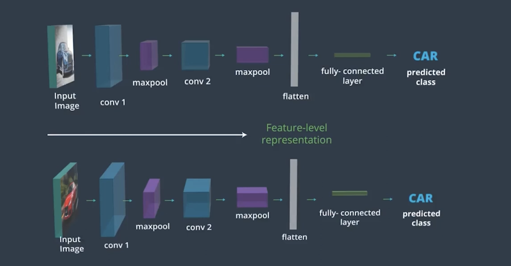
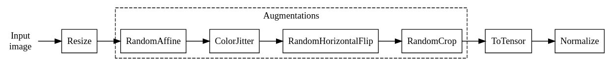
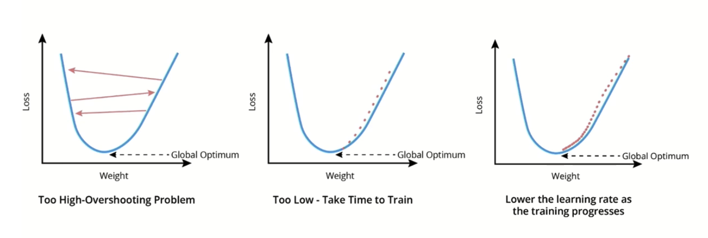

# C-3: CNNs in Depth

<br>
<br>

Apply all of the basic layers that make up a CNN Put all these layers together to build a CNN from the ground up Improve
the performance of your CNN network Export a model for production

<br>
<p align="center">

</p>
<p align="center">figure: Visualization of color filters and their application in CNNs</p>

### Convolution on Color Images

The kernel that was a matrix of k x k numbers for grayscale images, becomes now a 3d filter of k x k x n channels:

<br>
<p align="center">

</p>
<p align="center">figure: Animation showing the convolution process on a color image with multiple channels</p>

#### Multiple Convolutional Layers

In a CNN with more than one layer, the $n_k$ filters in the first convolutional layer will operate on the input image
with 1 or 3 channels (RGB) and generate $n_k$ output feature maps. So in the case of an RGB image the filters in the
first convolutional layer will have a shape of kernel_size x kernel_size x 3. If we have 64 filters we will then have 64
output feature maps. Then, the second convolutional layer will operate on an input with 64 "channels" and therefore use
filters that will be kernel_size x kernel_size x 64. Suppose we use 128 filters. Then the output of the second
convolutional layer will have a depth of 128, so the filters of the third convolutional layer will be kernel_size x
kernel_size x 128, and so on. For this reason, it is common to use the term "channels" also to indicate the feature maps
of convolutional layers: a convolutional layer that takes feature maps with a depth of 64 and outputs 128 feature maps
is said to have 64 channels as input and 128 as outputs.

<br>
<br>

#### Convolutional Layer Parameters

Let's see how we can compute the number of parameters in a convolutional layer, $n_p$. Let's define some quantities:

- $n_k$: number of filters in the convolutional layer
- k: height and width of the convolutional kernel
- c: number of feature maps produced by the previous layer (or number of channels in input image)

There are $k$ times $k$ times $c$ weights per filter plus one bias per filter, so $ck^2 + 1$ parameters. The
convolutional
layer is composed of $n_k$ filters, so the total number of parameters in the convolutional layer is:

$n_p = n_k(ck^2 + 1)$.

Convolutional Layers in PyTorch is provided below:

```python
from torch import nn

conv1 = nn.Conv2d(in_channels, out_channels, kernel_size)
dropout1 = nn.Dropout2d(p=0.2)
relu1 = nn.ReLU()

result = relu1(dropout1(conv1(x)))
```

You must pass the following arguments:

1. _in_channels_: The number of input feature maps (also called channels). If this is the first layer, this is
   equivalent
   to the number of channels in the input image, i.e., 1 for grayscale images, or 3 for color images (RGB). Otherwise,
   it is equal to the output channels of the previous convolutional layer.

2. _out_channels_: The number of output feature maps (channels), i.e. the number of filtered "images" that will be
   produced by the layer. This corresponds to the unique convolutional kernels that will be applied to an input, because
   each kernel produces one feature map/channel. Determining this number is an important decision to make when designing
   CNNs, just like deciding on the number of neurons is an important decision for an MLP.

3. _kernel_size_: Number specifying both the height and width of the (square) convolutional kernel.

We can also use _nn.Sequential_, which stacks together the layers we give as argument so they can be used as if they
were
one. For example, we can build a convolutional block as:

```python
conv_block = nn.Sequential(
    nn.Conv2d(in_channels, out_channels, kernel_size),
    nn.ReLU(),
    nn.Dropout2d(p=0.2)
)
```

#### Stride and Padding in CNN

##### Introduction to Stride and Padding

- Stride: The amount by which the filter slides over the image.
- Padding: Expanding the size of an image by adding pixels at its border.

##### Stride

- Default stride is 1 (move filter one pixel at a time).
- Larger strides reduce the spatial dimensions of the output.
- Example: Stride of 2 makes the convolutional layer about half the width and height of the image.

##### Padding

- Used to control the spatial dimensions of the output.
- Helps to apply the filter to border pixels.
- Types of padding in PyTorch:
    - Zero padding (default)
    - Reflect padding
    - Replicate padding
    - Circular padding

##### Formula for Output Size

The relationship between input size (i), kernel size (k), stride (s), padding (p), and output size (o) is given by:

$o = \left[\frac{i + 2p - k}{s}\right] + 1$

Certainly. Let's break down the formula for calculating the output size of a convolutional layer:

$o = \left[\frac{i + 2p - k}{s}\right] + 1$

Where:

- $o$ is the output size (height or width)
- $i$ is the input size (height or width)
- $p$ is the padding size
- $k$ is the kernel (filter) size
- $s$ is the stride
- $[...]$ denotes the floor function (rounding down to the nearest integer)

Explanation of each part:

1. $(i + 2p)$: This represents the effective input size after padding. We add padding to both sides, so it's multiplied
   by 2.

2. $(i + 2p - k)$: This calculates how many times the kernel can fit into the padded input. We subtract $k$ because the
   kernel needs to fit entirely within the input.

3. $\frac{i + 2p - k}{s}$: Dividing by the stride determines how many steps the kernel can take across the input. Larger
   strides result in smaller output sizes.

4. $[...]$: The floor function ensures we get an integer result, as we can't have fractional output sizes.

5. $+ 1$: This accounts for the initial position of the kernel. Even if the kernel can't slide at all, we still get one
   output.

This formula is crucial for designing CNN architectures, as it allows you to predict the output size of each layer and
ensure that the dimensions are compatible throughout the network. When we want to implement using the PyTorch, the
following needs to be considered:

- Use _nn.Conv2d_ for 2D convolutions.
- Can specify padding as a number or use "same" or "valid".
- Example: _nn.Conv2d(1, 16, kernel_size=3, padding=1, stride=1)_

<br>
<br>

The Key Takeaways:

- Stride and padding are crucial for controlling the spatial dimensions of CNN layers.
- Larger strides reduce spatial dimensions, while padding can help maintain them.
- The choice of padding strategy can affect the network's performance and should be considered during architecture
  design.

#### Practice Questions

##### Q#1: Let's consider an input image of size 6x6, and a kernel 3x3. What would be the output size if we use no padding and stride 1?

Answer: The output size would be 4x4. Explanation: Using the formula with i=6, k=3, p=0, s=1:
$o = \left[\frac{6 + 2(0) - 3}{1}\right] + 1 = 4$

##### Q#2: Let's consider again an input image of size 6x6, and a kernel 3x3. What padding do we need if we want to get

an output size equal to the input size (6x6)? Assume a stride of 1.

Answer: We need a padding of 1.

Explanation: We want o=6, and we know i=6, k=3, s=1. Solving for p:

$6 = \left[\frac{6 + 2p - 3}{1}\right] + 1$
$5 = 3 + 2p$
$p = 1$

##### Q#3: Use the formula we just provided to compute the expected output size for a convolution with kernel size 8x8,

padding 3, and stride 2, applied on an image with an input size of 32x32.

Answer: The output size would be 14x14.
Explanation: Using the formula with i=32, k=8, p=3, s=2:
$o = \left[\frac{32 + 2(3) - 8}{2}\right] + 1 = \left[\frac{30}{2}\right] + 1 = 15 + 1 = 16$

<br>
<br>

#### Average Pooling

This works similarly to the Max Pooling layer, but instead of taking the maximum for each window, we take the mean
average of all the values in the window. This is the process of average pooling on a 4x4 multicolored grid divided into
four sections. Each section's average value is calculated and represented in a smaller 2x2 grid, with each block
displaying the computed average from the corresponding section.

Average Pooling is not typically used for image classification problems because Max Pooling is better at noticing the
most important details about edges and other features in an image, but you may see average pooling used in applications
for which smoothing an image is preferable.

Sometimes, Average Pooling and Max Pooling are used together to extract both the maximum activation and the average
activation.

#### Max Pooling Layers

To create a pooling layer in PyTorch, you must first import the necessary module:

```python
from torch import nn

nn.MaxPool2d(kernel_size, stride)
```

You must pass the following arguments:

1. _kernel_size:_ The size of the max pooling window. The layer will roll a window of this size over the input feature
   map and select the maximum value for each window.

2. _stride:_ The stride for the operation. By default, the stride is of the same size as the kernel (i.e., kernel_size).

<br>
<br>

#### CNN Terminology

| Definition                                                                                      | Term        |
|-------------------------------------------------------------------------------------------------|-------------|
| Size of the side of the convolutional kernel                                                    | kernel size |
| Size of the window considered during pooling                                                    | window size |
| Step size of the convolutional kernel or of the pooling window when moving over the input image | stride      |
| Border to add to an input image before the convolution operation is performed                   | padding     |

Note:

- The term '_input size_' refers to the dimensions of the input image or feature map, not included in the matching
  exercise.
- '_Stride_' is a crucial parameter that determines how the kernel or pooling window moves across the input.
- '_Padding_' is used to control the spatial dimensions of the output, often to maintain the input size after
  convolution.

##### Q#1: Let's consider a convolutional layer with in_channels=3, out_channels=16, kernel_size=5 and padding=2. How many parameters does the layer have?

Answer: 1216

Explanation: To calculate the number of parameters in a convolutional layer, we use the formula:
(kernel*size * kernel*size * in_channels + 1) \* out_channels

In this case:
(5 _ 5 _ 3 + 1) _ 16 = (75 + 1) _ 16 = 76 \* 16 = 1216

The +1 in the formula accounts for the bias term for each output channel.

##### Q#2: Consider the following convolutional block:

```python
nn.Conv2d(3, 16, padding=1),
nn.ReLU(),
nn.Dropout2d(0.2)
```

If we want to add another convolutional layer after this one, which one of the following options is going to work?

Answer: nn.Conv2d(16, 32, padding=1)

Explanation:

The output of the first convolutional layer has 16 channels (out_channels=16). Therefore, the next convolutional layer
must have in_channels=16 to match this output. The correct option is the one that has 16 as its first parameter in
Conv2d, which represents the in_channels. Since the output of the previous layer has 16 channels (feature maps), the
input dimension of this layer must match that.

##### Q#3: Consider the following layer:

nn.MaxPool2d(2, 2)

What would be the result after applying this layer to the given 4x4 image?

Answer: 6, 8, 3, 4

Explanation:
MaxPool2d(2, 2) applies max pooling with a 2x2 window and a stride of 2. This means it will divide the input into 2x2
non-overlapping windows and take the maximum value from each window.

For the given 4x4 image:
[1 0 2 3]
[4 6 6 8]
[3 1 1 0]
[1 2 2 4]

Applying max pooling:

- Top-left 2x2: max(1,0,4,6) = 6
- Top-right 2x2: max(2,3,6,8) = 8
- Bottom-left 2x2: max(3,1,1,2) = 3
- Bottom-right 2x2: max(1,0,2,4) = 4

Resulting in a 2x2 output: [6 8; 3 4] Max Pooling selects the maximum in each window

<br>
<br>

#### CNN Structure

In a typical CNN there are several convolutional layers intertwined with Max Pooling layers. The convolutional layers
have more and more feature maps as you go deeper into the network, but the size of each feature map gets smaller and
smaller thanks to the Max Pooling layer.

This kind of structure goes hand in hand with the intuition we have developed in another lesson: as the signal goes
deeper into the network, more and more details are dropped, and the content of the image is "abstracted." In other
words, while the initial layers focus on the constituents of the objects (edges, textures, and so on), the deeper layers
represent and recognize more abstract concepts such as shapes and entire objects.

The convolution part of a CNN is implemented in PyTorch by using the _nn.Conv2d_ layer for convolution and the
_nn.MaxPool2d_ layer for max pooling. Stacking different blocks of convolution followed by pooling constitutes the
typical
structure of a simple CNN. Typically the sizes of the feature maps shrink as you go deeper into the network, while the
channel count (i.e., the number of feature maps and filters) increases going deeper into the network, as shown below.

<br>
<p align="center">

</p>
<p align="center">figure: A detailed structure of a typical CNN</p>

The backbone is made of convolutional and pooling layers, and has the task of extracting information from the image.
After the backbone there is a flattening layer that takes the output feature maps of the previous convolutional layer
and flattens them out in a 1d vector: for each feature map the rows are stacked together in a 1d vector, then all the 1d
vectors are stacked together to form a long 1d vector called a _feature vector_ or _embedding_. This process is
illustrated
by the following image:

<br>
<p align="center">

</p>
<p align="center">figure: Flattening of feature maps into a 1d vector</p>

<br>
<p align="center">

</p>
<p align="center">figure: Formation of the feature vector</p>

#### Convolutional Block in PyTorch

The typical sequence convolution -> pooling -> activation (with optional dropout) can be written in PyTorch like this:

```python
self.conv1 = nn.Conv2d(3, 16, 3, padding=1),
self.pool = nn.MaxPool2d(2, 2),
self.relu1 = nn.ReLU()
self.drop1 = nn.Dropout2d(0.2)
```

Of course with the _nn.Sequential_ equivalent:

```python
self.conv_block = nn.Sequential(
    nn.Conv2d(3, 16, 3, padding=1),
    nn.MaxPool2d(2, 2),
    nn.ReLU(),
    nn.Dropout2d(0.2)
)
```

#### CNN using PyTorch

Let's now bring everything together and write our first CNN in PyTorch. We are going to have 3 convolutional blocks plus
a head with a simple MLP.

```python
import torch
import torch.nn as nn


class MyCNN(nn.Module):

    def __init__(self, n_classes):
        super().__init__()

        # Create layers. In this case just a standard MLP
        self.model = nn.Sequential(
            # First conv + maxpool + relu
            nn.Conv2d(3, 16, 3, padding=1),
            nn.MaxPool2d(2, 2),
            nn.ReLU(),
            nn.Dropout2d(0.2),

            # Second conv + maxpool + relu
            nn.Conv2d(16, 32, 3, padding=1),
            nn.MaxPool2d(2, 2),
            nn.ReLU(),
            nn.Dropout2d(0.2),

            # Third conv + maxpool + relu
            nn.Conv2d(32, 64, 3, padding=1),
            nn.MaxPool2d(2, 2),
            nn.ReLU(),
            nn.Dropout2d(0.2),

            # Flatten feature maps
            nn.Flatten(),

            # Fully connected layers. This assumes
            # that the input image was 32x32
            nn.Linear(1024, 128),
            nn.ReLU(),
            nn.Dropout(0.5),
            nn.Linear(128, n_classes)
        )

    def forward(self, x):
        # nn.Sequential will call the layers
        # in the order they have been inserted
        return self.model(x)
```

<br>
<br>

Let's analyze what is going on in the Sequential call. We have a series of 3 convolutional parts constituted of a
convolutional layer, a max pooling operation that halves the input shape, and then a ReLU activation:

```python
nn.Conv2d(3, 16, 3, padding=1),
nn.MaxPool2d(2, 2),
nn.ReLU()
```

We can also optionally insert a _nn.Dropout2d_ layer for regularization. We repeat this structure 3 times, varying the
number of feature maps in the sequence 16 -> 32 -> 64. As we go deep, in other words, we are working with feature maps
with a smaller height and width (because we keep applying max pooling) but with a higher channel count. This is very
typical and helps the network with abstracting concepts.

Then, we have a Flatten layer that flattens our 64 feature maps (coming from the last conv layer before the flattening)
into one long vector. Assuming that the input is 32x32, this vector will contain 1024 (4x4x64) numbers. Finally, we have
an MLP made of fully-connected layers that combines all the information extracted by the convolutional part and outputs
one number for each class (logits). We first compress the 1024-long array into an embedding of 128 numbers, and then
from there to the number of classes we have. Since we have used the nn.Sequential class, the forward method is extremely
simple, and it is just calling that Sequential instance.

### Questions and Answers

##### Q#1: What are the functions of the typical sections of a CNN?

_Answer_:

- _Backbone_: Extract features from an image
- _Flatten_: Flatten the feature maps producing the feature vector
- _Head_: Uses the feature vector to determine the final output

_Explanation_: These three sections represent the typical structure of a CNN. The backbone extracts features, the
flatten
layer converts 2D feature maps to a 1D vector, and the head uses this vector for final classification or regression.

##### Q#2: What are the layers contained in a typical convolutional block in the backbone?

_Answer_:

First layer in a block: _nn.Conv2d_
Second layer in a block: _nn.MaxPooling_
Third layer in a block: _nn.ReLU_

_Explanation_: A typical convolutional block often consists of a convolutional layer (_Conv2d_) to extract features,
followed by an activation function (_ReLU_) to introduce non-linearity, and then a pooling layer (MaxPooling) to reduce
spatial dimensions.

##### Q#3: Let's consider an image that is (3, 224, 224), i.e., an RGB image (3 channels) with height and width both equal to

**224**. If we push it through the network, what is the shape of the output?

_Answer_: (32, 55, 55)

_Explanation_: The network consists of two convolutional layers with MaxPooling. The first conv layer maintains the
spatial dimensions (224x224) but changes channels to 16. The first MaxPool reduces it to 112x112. The second conv layer
changes channels to 32 and maintains 112x112, then the final MaxPool reduces it to 55x55. So the final output shape is (
32, 55, 55). In order the shapes are:

```python
nn.Conv2d(3, 16, kernel_size=3, padding=1),  # out shape: (16, 224, 224)
nn.MaxPool2d(2, 2),  # (16, 112, 112)
nn.ReLU(),  # (16, 112, 112)

nn.Conv2d(16, 32, kernel_size=3, padding=0),  # (32, 110, 110) [note that padding=0]
nn.MaxPool2d(2, 2),  # (32, 55, 55)
nn.ReLU()  # (32, 55, 55)
```

##### Q#4: Consider the same network as in Question 3, but with an additional nn.Flatten() layer at the end. What is the shape of the output?

_Answer_: 96800 (32 x 55 x 55 = 96800)

_Explanation_: The output from the previous convolutional layers is (32, 55, 55). The Flatten() layer will convert this
3D
tensor into a 1D vector. The total number of elements is 32 _ 55 _ 55 = 96800.

##### Q#5: What should be the value of

_feature_vector_dim_ in the first linear layer? In other words, what is the dimension of **the
** feature vector that is fed to the head? Also, how many classes does this classifier handle?

_Answer_: feature_vector_dim = 96800, n_classes = 100

The dimension of the input to the first linear layer is the output of the flatten operation, which is equal to 32
feature maps times 55 x 55. Also, the number of classes is 100 as determined by the output dimension of the last linear
layer.

_Explanation_: The feature vector dimension should match the flattened output from the convolutional layers, which is 32
*55*55 = 96800. The final linear layer outputs 100 dimensions, indicating this network classifies into 100 classes.

##### Q#6: Consider this CNN (note that is slightly different from the previous ones):

_Answer_: These statements are true.

- There are 2 convolutional layers plus an MLP with one hidden layer, one input layer and one output layer.
- This network can handle images that are 28 by 28 in size.
- There are 100 classes.

_Explanation_: The network has two **Conv2d** layers, forming the convolutional part. The MLP part consists of three
Linear
layers (input, hidden, output). The network can handle 224x224 images as designed, but it can also handle 28x28 images
because the convolutional layers don't have a fixed input size. The final layer outputs 100 dimensions, indicating 100
classes.

<br>
<br>

#### Optimizing the Performance of Our Network

Now that we have seen how to train a simple CNN, let’s dive deeper and see how we can improve on the performance of our
network with some widely-adopted tricks.

1. _Image augmentation_: The basic idea of image augmentation is the following: if you want your network to be
   insensitive
   to changes such as rotation, translation, and dilation, you can use the same input image and rotate it, translate it,
   and scale it and ask the network not to change its prediction! In practice, this is achieved by applying random
   transformations to the input images before they are fed to the network.

2. Image Augmentation Using Transformations

3. Batch Normalization

<br>
<br>

A typical training augmentation pipeline is represented in this diagram:

<br>
<p align="center">

</p>
<p align="center">figure: A typical training augmentation pipeline</p>

<br>
<br>

```python
import torchvision.transforms as T

train_transforms = T.Compose(
    [
        # The size here depends on your application. Here let's use 256x256
        T.Resize(256),
        # Let's apply random affine transformations (rotation, translation, shear)
        # (don't overdo here!)
        T.RandomAffine(scale=(0.9, 1.1), translate=(0.1, 0.1), degrees=10),
        # Color modifications. Here I exaggerate to show the effect
        T.ColorJitter(brightness=0.5, contrast=0.5, saturation=0.5, hue=0.5),
        # Apply an horizontal flip with 50% probability (i.e., if you pass
        # 100 images through around half of them will undergo the flipping)
        T.RandomHorizontalFlip(0.5),
        # Finally take a 224x224 random part of the image
        T.RandomCrop(224, padding_mode="reflect", pad_if_needed=True),  # -
        T.ToTensor(),
        T.Normalize((0.5, 0.5, 0.5), (0.5, 0.5, 0.5)),
    ]
)
```

<br>
<br>

#### Transformation Pipelines

<br>

During validation and test you typically do not want to apply image augmentation (which is needed for training). Hence,
this is a typical transform pipeline for validation and test that can be paired with the pipeline above:

```python
testval_transforms = T.Compose(
    [
        # The size here depends on your application. Here let's use 256x256
        T.Resize(256),
        # Let's take the central 224x224 part of the image
        T.CenterCrop(224),
        T.ToTensor(),
        T.Normalize((0.5, 0.5, 0.5), (0.5, 0.5, 0.5)),
    ]
)
```

The resize and crop should be the same as applied during training for best performance and the normalization should be
the same between training and inference (validation and test)

#### AutoAugment Transforms

There is a special class of transforms defined in torchvision, referred to as _AutoAugment_. These classes implement
augmentation policies that have been optimized in a data-driven way, by performing large-scale experiments on datasets
such as ImageNet and testing many different recipes, to find the augmentation policy giving the best result. It is then
proven that these policies provide good performances also on datasets different from what they were designed for.

For example, one such auto-transform is called _RandAugment_ and it is widely used. It is particularly interesting
because
it parametrizes the strength of the augmentations with one single parameter that can be varied to easily find the amount
of augmentations that provides the best results. This is how to use it:

<br>

```python
T.RandAugment(num_ops, magnitude)
```

The main parameters are:

1. _num_ops_: the number of random transformations applied. Defaut: 2
2. _magnitude_: the strength of the augmentations. The larger the value, the more diverse and extreme the augmentations
   will become.

<br>
<br>

#### Batch Normalization

The second modern trick that paves the way for enhancing the performance of a network is called *Batch Normalization*, or
BatchNorm. It does not usually improve the performances per say, but it allows for much easier training and a much
smaller dependence on the network initialization, so in practice it makes our experimentation much easier, and allows us
to more easily find the optimal solution.

Just as we normalize the input image before feeding it to the network, we would like to keep the feature maps
normalized, since they are the output of one layer and the input to the next layer. In particular, we want to prevent
them to vary wildly during training, because this would require large adjustments of the subsequent layers. *BatchNorm*
normalizes the activations and keep them much more stable during training, making the training more stable and the
convergence faster.

In order to do this, during training BatchNorm needs the mean and the variance for the activations for each mini-batch.
This means that the batch size cannot be too small or the estimates for mean and variance will be inaccurate. During
training, the BatchNorm layer also keeps a running average of the mean and the variance, to be used during inference.

During inference, we don't have mini-batches. Therefore, the layer uses the mean and the variance computed during
training (the running averages). This means that BatchNorm behaves differently during training and during inference. The
behavior changes when we set the model to training mode (using *model.train()*) or to validation mode (*model.eval()*).

<br>
<br>

Just as we normalize the input image before feeding it to the network, we would like to keep the feature maps
normalized, since they are the output of one layer and the input to the next layer. In particular, we want to prevent
them to vary wildly during training, because this would require large adjustments of the subsequent layers. BatchNorm
normalizes the activations and keep them much more stable during training, making the training more stable and the
convergence faster.

In order to do this, during training BatchNorm needs the mean and the variance for the activations for each mini-batch.
This means that the batch size cannot be too small or the estimates for mean and variance will be inaccurate. During
training, the BatchNorm layer also keeps a running average of the mean and the variance, to be used during inference.

During inference we don't have mini-batches. Therefore, the layer uses the mean and the variance computed during
training (the running averages). This means that BatchNorm behaves differently during training and during inference. The
behavior changes when we set the model to training mode (using *model.train()*) or to validation mode (*model.eval()*). Batch Normalization is a technique used to improve the training of Convolutional Neural Networks (CNNs) by standardizing
the inputs to each layer.

$x \leftarrow \frac{x - \mu_x}{\sigma_x} \gamma + \beta$

Where:

- $x$: activations (values in the feature maps)
- $\mu_x$: mean of the activations
- $\sigma_x$: standard deviation of the activations
- $\gamma$: learnable scaling parameter
- $\beta$: learnable shifting parameter

The key components are:

1. *Normalization*: $(x - \mu_x) / \sigma_x$
    - Centers the activations around zero
    - Scales them to have unit variance

2. *Learnable Parameters*: $\gamma$ and $\beta$
    - Allow the network to undo normalization if needed
    - Provide flexibility in learning optimal activation distributions

##### BatchNorm Benefits

1. Reduces internal covariate shift
2. Allows higher learning rates, accelerating training
3. Acts as a form of regularization
4. Reduces the dependence on careful initialization

Please, mind the following important items:

- Applied after the linear transformation but before the activation function
- Uses *mini-batch* statistics during training
- Uses population statistics during inference

- Batch size affects the stability of BatchNorm
- May require adjustments in very small batch sizes or online learning scenarios

Batch Normalization standardizes layer inputs, significantly improving training speed and stability in deep neural
networks, especially CNNs.

<br>
<br>

##### Pros and Cons of BatchNorm


| Pros                                                         | Cons                                                         |
| ------------------------------------------------------------ | ------------------------------------------------------------ |
| Easily Added to Most Architectures                           | Breaks with Small Batch Size (Mean and std dev become too noisy) |
| Faster Training (Larger learning rate, fewer epochs)         | Cumbersome (Difference between train and inference)          |
| Reduce Sensitivity to Initialization                         | Slow (Added computation at inference time)                   |
| Small Regularization Effect (Introduces a bit of noise through batch statistics) |                                                              |

<br>

##### BatchNorm for Convolutional Layers

BatchNorm can be used very easily in PyTorch as part of the convolutional block by adding the *nn.BatchNorm2d* layer just
after the convolution:

```python
self.conv1 = nn.Sequential(
  nn.Conv2d(3, 16, kernel_size=3, padding=1),
  nn.BatchNorm2d(16),
  nn.MaxPool2d(2, 2),
  nn.ReLU(),
  nn.Dropout2d(0.2)
)
```

<br>
<br>

The only parameter is the number of input feature maps, which of course must be equal to the output channels of the
convolutional layer immediately before it. NOTE: It is important to use BatchNorm before DropOut. The latter drops some
connections only at training time, so placing it before BatchNorm would cause the distribution seen by BatchNorm to be
different between training and inference.

##### BatchNorm for Dense Layers

We can add BatchNorm to MLPs very easily by using nn.BatchNorm1d:

```python
self.mlp = nn.Sequential(
  nn.Linear(1024, 500),
  nn.BatchNorm1d(500),
  nn.ReLU(),
  nn.Dropout(0.5)
)
```

#### Hyperparameters Optimization


```
argmax{M(argmin L(W|H))}
   H      W
```

Where:
- H is defined as the set of hyperparameters
- M is defined as the metric of interest
- W represents the weights of the model
- L represents the loss function

This formula describes a bi-level optimization problem where:

1. Inner optimization: `argmin L(W|H)`
   W
   - This finds the optimal weights W that minimize the loss function L, given some fixed hyperparameters H

2. Outer optimization: `argmax M(...)`
   H
   - This finds the optimal hyperparameters H that maximize some metric M when evaluated on the model with optimized weights

This type of formula is commonly used in hyperparameter optimization or meta-learning scenarios, where you want to:
1. Train a model (inner optimization)
2. Evaluate its performance using some metric
3. Use that information to find the best hyperparameters (outer optimization)


<br>
<p align="center">

</p>
<p align="center">figure: Hyperparameter Tuning</p>

<br>

<p align="center">

</p>
<p align="center">figure: Hyperparameter Tuning</p>

<br>
<br>

##### Parameter

1. Internal to the model
2. May vary during training
3. Examples: Weights and biases of a network

##### Hyperparameter

1. External to the model
2. Fixed during training
3. Examples: Learning rate, number of layers, activation layers

##### Experiment

1. A specific training run with a fixed set of hyperparameters
2. Practitioners typically perform many experiments varying the hyperparameters. Each experiment produces one or more
   metrics that can be used to select the best-performing set of hyperparameters (see the next section).

<br>
<br>

#### Optimizing Hyperparameters Strategies

##### Grid search

1. Divide the parameter space in a regular grid
2. Execute one experiment for each point in the grid
3. Simple, but wasteful

##### Random search

1. Divide the parameter space in a random grid
2. Execute one experiment for each point in the grid
3. Much more efficient sampling of the hyperparameter space with respect to grid search

##### Bayesian Optimization

1. Algorithm for searching the hyperparameter space using a Gaussian Process model
2. Efficiently samples the hyperparameter space using minimal experiments

#### Hyperparameters Optimization

Optimizing hyperparameters can be confusing at the beginning, so we provide you with some rules of thumb about the
actions that typically matter the most. They are described in order of importance below. They are not strict rules, but
should help you get started:

1. *Design parameters*: When you are designing an architecture from scratch, the number of hidden layers, as well as the
   layers parameters (number of filters, width and so on) are going to be important.

2. *Learning rate*: Once the architecture is fixed, this is typically the most important parameter to optimize. The next
   video will focus on this.

3. *Batch size*: This is typically the most influential hyperparameter after the learning rate. A good starting point,
   especially if you are using BatchNorm, is to use the maximum batch size that fits in the GPU you are using. Then you
   vary that value and see if that improves the performances.

4. *Regularization*: Once you optimized the learning rate and batch size, you can focus on the regularization,
   especially
   if you are seeing signs of overfitting or underfitting.

5. *Optimizers*: Finally, you can also fiddle with the other parameters of the optimizers. Depending on the optimizers,
   these vary. Refer to the documentation and the relevant papers linked there to discover what these parameters are.

The learning rate is one of the most important hyperparameters. However, knowing what the optimal value is, or even what
a good range is, can be challenging. One useful tool to discover a good starting point for the learning rate is the
so-called "learning rate finder." It scans different values of the learning rate, and computes the loss obtained by
doing a forward pass of a mini-batch using that learning rate. Then, we can plot the loss vs. the learning rate and
obtain a plot similar to this:

<br>
<p align="center">

</p>
<p align="center">figure: Learning Rate Finder</p>

<br>
<br>

#### Learning Rate Schedulers

In many cases we want to vary the learning rate as the training progresses. At the beginning of the training we want to
make pretty large steps because we are very far from the optimum. However, as we approach the minimum of the loss, we
need to make sure we do not jump over the minimum.

For this reason, it is often a good idea to use a learning rate scheduler, i.e., a class that changes the learning rate
as the training progresses. There are several possible learning rate schedulers. You can find the available ones in the
PyTorch learning rate schedulers documentation. One of the simplest one is the StepLR scheduler. It reduces the learning
rate by a specific factor every n epochs. It can be used as follows:

```python
from torch.optim.lr_scheduler import StepLR

scheduler = StepLR(optimizer, step_size=5, gamma=0.5)

# Training loop
for ...
    ...
    # Update the weights
    optimizer.step()

    # Update the learning rate in the
    # optimizer according to the schedule
    scheduler.step()
```

<br>
<br>

#### Tracking Experiments

When you are performing hyperparameter optimization and other changes it is very important that you track all of your
experiments. This way you will know which hyperparameters have given you which results, and you will be able to repeat
those experiments, choose the best one, understand what works and what doesn't, and what you need to explore further.
You will also be able to present all your results to other people. You can of course use spreadsheets for this, or even
pen and paper, but there are definitely much better ways! Enter experiment tracking tools. There are many of them out
there, and they all work in similar ways. Let's consider mlflow, which is free and open source.

Tracking an experiment is easy in mlflow. You first start by creating a run. A run is a unit of execution that will
contain your results. Think of it as one row in a hypothetical spreadsheet, where the columns are the things you want to
track ( accuracy, validation loss, ...). A run can be created like this:

```python
with mlflow.start_run():
```

Once you have created the run, you can use mlflow.log_param to log a parameter (i.e., one of the hyperparameters for
example) and mlflow.log_metric to log a result (for example the final accuracy of your model). For example, let's assume
that our only hyperparameters are the learning rate and the batch size. We can track their values as well as the results
obtained when using those values like this:

```python
import mlflow

with mlflow.start_run():
    ...
    train and validate...

    # Track values for hyperparameters
mlflow.log_param("learning_rate", learning_rate)
mlflow.log_param("batch_size", batch_size)

# Track results obtained with those values
mlflow.log_metric("val_loss", val_loss)
mlflow.log_metric("val_accuracy", val_accuracy)

# Track artifacts (i.e. files produced by our experiment)
# For example, we can save the weights for the epoch with the
# lowest validation loss
mlflow.log_artifact("best_valid.pt")
```

<br>
<br>

If we do this for all of our experiments, then mlflow will allow us to easily study the results and understand what
works and what doesn't. But you can also look at the results in a notebook by doing:

```
runs = mlflow.search_runs()
```

We barely scratched the surface about what a tracking tool like mlflow can do for you. For example, they track the code
that runs in your experiment so you can reproduce it even if you changed the code in the meantime. If you are looking to
apply what you are learning in this course in a professional environment, have a good look at tracking tools and how
they can benefit you.

##### Q#1: Which of the following are hyperparameters and which are parameters?

Answer:

- Learning rate: Hyper-parameter
- Weights: Parameter
- Biases: Parameter
- Number of layers: Hyper-parameter
- Size of the kernel in a convolutional layer: Hyper-parameter
- Alpha and beta in a BatchNorm layer: Parameter

Explanation: Hyperparameters are set before training and control the learning process, while parameters are learned
during training. Learning rate, number of layers, and kernel size are set before training, making them hyperparameters.
Weights, biases, and BatchNorm parameters (alpha and beta) are learned during training, making them parameters.

##### Q#2: What are some techniques to improve the performance of a CNN? (maybe more than one answer)

Answer: All options are correct techniques to improve CNN performance.

- Image augmentations
- Hyperparameter tuning
- Use a learning rate scheduler

Explanation: These are all valid techniques to enhance CNN performance. Image augmentation increases dataset variety,
hyperparameter tuning optimizes model settings, tracking experiments helps in identifying best practices, larger
networks can capture more complex patterns, longer training allows for better convergence, and learning rate schedulers
can help in finding optimal learning rates during training.

##### Q#3: What is the role of the BatchNorm layer in modern CNNs? Select all that apply.

Answer:

- Standardize the activations of a layer to prevent covariate shift
- Allow for faster training and larger learning rates
- Makes the layers more independent of each other, making the work of the optimizer much easier

Explanation: BatchNorm standardizes layer activations, which helps prevent covariate shift. This standardization allows
for faster training and the use of larger learning rates. It also makes layers more independent, simplifying the
optimizes job. These effects collectively contribute to improving the network's accuracy. The option "Decrease the
input size by 2" is incorrect as BatchNorm doesn't change input dimensions.

##### Q#4: Which one is a sensible choice for the learning rate:

Answer: 0.005 (5e-3)

Explanation: Looking at the learning rate vs loss graph, we see that the lowest point of the loss curve corresponds to a
learning rate of about 10^-2 to 10^-1. The option 0.005 (5e-3) is closest to this optimal range. 0.1 is too high (loss
increases), and 0.00001 (1e-5) is too low (loss plateaus).

##### Q#5: Please rank the hyperparameters in order of importance

Answer: The exact ranking can vary, but a common order of importance would be:

1. Architecture design (number of layers, kernel size for convolution...)
2. Learning rate
3. Batch size
4. Regularization (Dropout, weight decay...)

Explanation: Architecture design is typically most crucial as it determines the model's capacity. Learning rate is next
as it greatly affects training dynamics. Regularization techniques help prevent overfitting. Batch size, while
important, often has less impact compared to the others. However, the relative importance can vary depending on the
specific problem and dataset.

<br>
<br>

#### Weight Initialization

Weight initialization is a procedure that happens only once, before we start training our neural network. Stochastic
Gradient Descent and other similar algorithms for minimization are iterative in nature. They start from some values for
the
parameters that are being optimized and they change those parameters to achieve the minimum in the objective function (
the loss).
These "initial values" for the parameters are set through weight initialization.

Before the introduction of BatchNorm, weight initialization was really key to obtaining robust performances. In this
previous era, a good weight initialization strategy could make the difference between an outstanding model and one that
could not
train at all. These days networks are much more forgiving. However, a good weight initialization can speed up your
training
and also give you a bit of additional performance.

In general, weights are initialized with random numbers close but not equal to zero, not too big but not too small
either. This makes the gradient of the weights in the initial phases of training neither too big nor too small, which
promotes
fast training and good performances. Failing to initialize the weights well could result in vanishing or exploding
gradients, and the training would slow down or stop altogether.

Exporting a model for production means packaging your model in a stand-alone format that can be transferred and used to
perform inference in a production environment, such as an API or a website. Remember that the images need some
preprocessing before being fed to the CNN. For example, typically you need to resize, center crop, and normalize the
image with a transform pipeline similar to this:

```python
testval_transforms = T.Compose(
    [
        # The size here depends on your application. Here let's use 256x256
        T.Resize(256),
        # Let's take the central 224x224 part of the image
        T.CenterCrop(224),
        T.ToTensor(),
        T.Normalize((0.5, 0.5, 0.5), (0.5, 0.5, 0.5)),
    ]
)
```

Obviously, if you do not do these operations in production the performance of your model is going to suffer greatly. The
best course of action is to make these transformations part of your standalone package instead of re-implementing them
in the production environment. Let's see how. We need to wrap our model in a wrapper class that is going to take care of
applying the transformations and then run the transformed image through the CNN. If we trained with the
nn.CrossEntropyLoss as the loss function, we also need to apply a softmax function to the output of the model so that
the output of the wrapper will be probabilities and not merely scores. Let's see an example of such a wrapper class:

```python
import torch
from torchvision import datasets
import torchvision.transforms as T
from __future__ import annotations


class Predictor(nn.Module):

    def __init__(
            self,
            model: nn.Module,
            class_names: list[str],
            mean: torch.Tensor,
            std: torch.Tensor
    ):
        super().__init__()

        self.model = model.eval()
        self.class_names = class_names

        self.transforms = nn.Sequential(
            T.Resize([256, ]),
            T.CenterCrop(224),
            T.ConvertImageDtype(torch.float),
            T.Normalize(mean.tolist(), std.tolist())
        )

    def forward(self, x: torch.Tensor) -> torch.Tensor:
        with torch.no_grad():
            # 1. apply transforms
            x = self.transforms(x)  # =
            # 2. get the logits
            x = self.model(x)  # =
            # 3. apply softmax
            #    HINT: remmeber to apply softmax across dim=1
            x = F.softmax(x, dim=1)  # =

            return x
```

#### The Constructor

Let's first look at the constructor **init**: we first set the model to eval mode, and we also save the class names.
This will be useful in production: the wrapper will return the probability for each class, so if we take the maximum of
that
probability and take the corresponding element from the class_names list, we can return the winning label. Then we have
this:

```
self.transforms = nn.Sequential(
            T.Resize([256, ]),  # We use single int value inside a list due to torchscript type restrictions
            T.CenterCrop(224),
            T.ConvertImageDtype(torch.float),
            T.Normalize(mean.tolist(), std.tolist())
        )
```

<br>
<br>

This defines the transformations we want to apply. It looks very similar to the transform validation pipeline, with a
few important differences:

1. We do not use nn.Compose but nn.Sequential. Indeed the former is not supported by torch.script (the export
   functionality
   of PyTorch).
2. In Resize the size specification must be a tuple or a list, and not a scalar as we were able to do during training.
3. There is no ToTensor. Instead, we use T.ConvertImageDtype. Indeed, in this context the input to the forward method is
   going to be already a Tensor

<br>
<br>

#### Forward Method

Let's now look at the forward method:

```python
def forward(self, x: torch.Tensor) -> torch.Tensor:
    with torch.no_grad():
        # 1. apply transforms
        x = self.transforms(x)  # =
        # 2. get the logits
        x = self.model(x)  # =
        # 3. apply softmax
        #    HINT: remmeber to apply softmax across dim=1
        x = F.softmax(x, dim=1)  # =

        return x
```

We declare we are not going to need gradients with the torch.no_grad context manager. Then, as promised, we first apply
the transforms, then we pass the result through the model, and finally we apply the softmax function to transform the
scores into probabilities. We can now create an instance of our Predictor wrapper and save it to file using
**torch.script**:

<br>

```python
predictor = Predictor(model, class_names, mean, std).cpu()

# Export using torch.jit.script
scripted_predictor = torch.jit.script(predictor)
scripted_predictor.save("standalone_model.pt")
```

Note that we move the Predictor instance to the CPU before exporting it. When reloading the model, the model will be
loaded on the device it was taken from. So if we want to do inference on the CPU, we need to first move the model there.
In
many cases CPUs are enough for inference, and they are much cheaper than GPUs. We then use torch.jit.script which
converts our wrapped model into an intermediate format that can be saved to disk ( which we do immediately after). Now,
in a different process or a different computer altogether, we can do:

```python
import torch

predictor_reloaded = torch.jit.load("standalone_model.pt")
```

This will recreate our wrapped model. We can then use it as follows:

```python
from PIL import Image
import torch
import torchvision
import torchvision.transforms as T

# Reload the model
learn_inf = torch.jit.load("standalone_model.pt")

# Read an image and transform it to tensor to simulate what would
# happen in production
img = Image.open("static_images/test/09.Golden_Gate_Bridge/190f3bae17c32c37.jpg")
# We use .unsqueeze because the model expects a batch, so this
# creates a batch of 1 element
pil_to_tensor = T.ToTensor()(img).unsqueeze_(0)

# Perform inference and get the softmax vector
softmax = predictor_reloaded(pil_to_tensor).squeeze()
# Get index of the winning label
max_idx = softmax.argmax()
# Print winning label using the class_names attribute of the
# model wrapper
print(f"Prediction: {learn_inf.class_names[max_idx]}")
```

<br>
<br>

## Glossary

*Stride*: Amount by which a filter slides over an image.

*Padding*: Adding pixels at the border of an image in order to increase the width and/or the height to the desired
size. These new pixels can be filled with a constant value (typically zero) or with other strategies based on the
content of
the original image.

*Average Pooling*: The operation of sliding a window over the input image or a feature map and finding the mean
average of the numbers present in that window.

*Backbone*: The initial part of a CNN, usually comprised of convolutional layers and pooling layers (and optionally
BatchNorm and DropOut layers). It usually ends with a flattening of the last feature maps in a vector.

*Head*: Takes the output of the backbone (usually a flattened vector) and uses it to perform the classification. It is
usually a Multi-Layer Perceptron or a similar achitecture mainly constituted of fully-connected layers.

*Feature Vector*: The output of a typical CNN backbone. It is an array containing the features extracted by the
backbone, flattened into a 1d array (a vector).

*Embedding*: An alternative name for the Feature Vector.

*Image augmentation*: Artificially creates variations on the training images by applying one or more transformations.
It makes the model more robust and less prone to overfitting

*Batch Normalization*: A layer that normalizes the activations coming from a layer to decouple layers
from each other during training. It makes training deep neural network easier and faster.

*Learning Rate Scheduler*: A method for changing the learning rate as the training progresses.

*Transformation*: A single operation that is applied to an image, usually during image augmentation. For example,
transformations can produce rotations, translations, color changes and so on.

*Weight Initialization*: A process that sets initial values for the parameters of a network.

