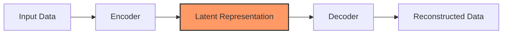
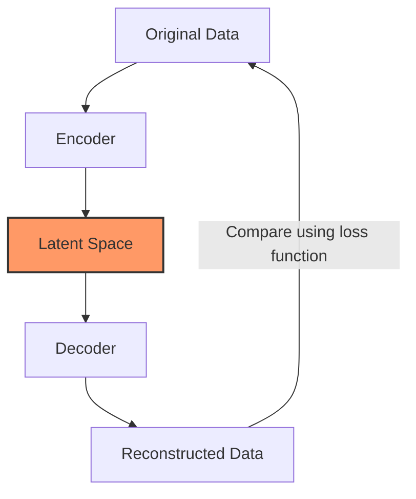
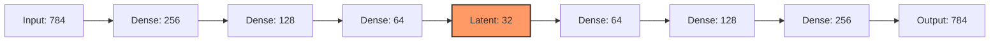
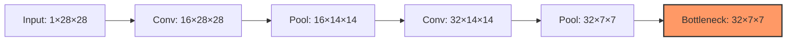
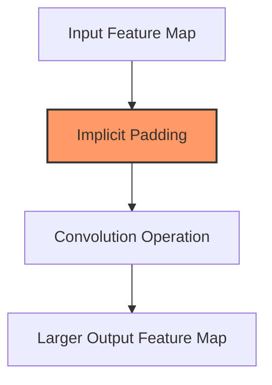
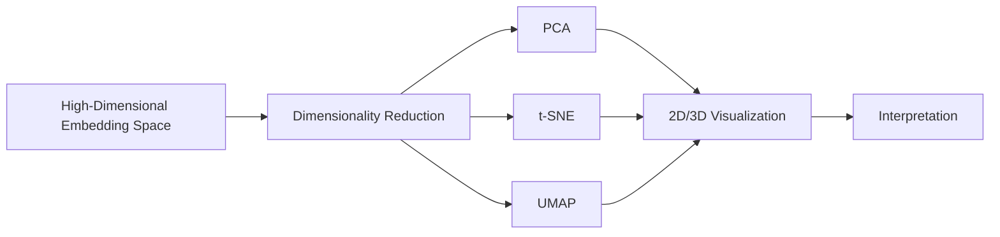

# C-4: Autoencoders

 
 

1. **Autoencoder Fundamentals**

   - Architecture and components
   - Unsupervised learning aspect
   - Loss functions (MSE)

2. **Linear Autoencoders**

   - Basic structure
   - Implementation considerations

3. **Convolutional Autoencoders**

   - CNN-based architectures
   - Upsampling techniques
   - Transposed convolutions

4. **Autoencoder Applications**

   - Anomaly detection
   - Denoising
   - Image reconstruction
   - Compression

5. **Embedding Space Analysis**

   - Visualization of learned representations

   - Limitations of standard autoencoders

   - Introduction to generative variants (VAEs)

# C-4: Autoencoders

#### Autoencoder Fundamentals

Autoencoders represent a specialized neural network architecture designed to learn efficient data representations through unsupervised learning. Unlike traditional neural networks focused on classification or regression tasks, autoencoders aim to reconstruct their own inputs after passing them through a constrained bottleneck, forcing the network to learn the most salient features of the data.

##### Core Architecture and Components

The autoencoder architecture consists of three fundamental components:

###### Encoder

The encoder transforms the high-dimensional input data into a lower-dimensional representation. Mathematically, the encoder implements a function $f$ that maps input $x$ to a latent representation $z$:

$$z = f(x)$$

The encoder typically consists of one or more layers that progressively reduce dimensionality, extracting increasingly abstract features along the way. For image data, these layers might be fully-connected or convolutional, depending on the specific architecture.

###### Latent Representation (Bottleneck)

The bottleneck layer represents the compressed information produced by the encoder. This latent representation forms the heart of the autoencoder, with a dimensionality significantly smaller than the input:

$$z \in \mathbb{R}^d \text{ where } d \ll \text{dim}(x)$$

The dimensionality of this latent space controls the degree of compression and strongly influences what the network learns:

- Small latent dimensions force the network to capture only the most essential features
- Larger latent spaces can preserve more detail but may risk simply memorizing the input

###### Decoder

The decoder attempts to reconstruct the original input from the compressed latent representation. The decoder implements a function $g$ that maps the latent representation $z$ back to a reconstruction $\hat{x}$:

$$\hat{x} = g(z)$$

Structurally, the decoder mirrors the encoder in reverse, progressively expanding the latent representation back to the original input dimensions. This symmetry creates the characteristic "hourglass" shape of autoencoder architectures.

##### Unsupervised Learning Paradigm

A defining characteristic of autoencoders is their self-supervised nature, which allows them to learn meaningful representations without requiring labeled data.

###### Self-Supervision Mechanism

Autoencoders generate their own supervisory signal by comparing their output (the reconstruction) to their input (the original data). The network learns to identify and preserve the most important features of the data by attempting to recreate the input from a compressed representation.

This self-supervision distinguishes autoencoders from traditional supervised approaches:

- Supervised learning: Learns mappings from inputs to separate predefined labels
- Autoencoder learning: Learns mappings from inputs back to those same inputs through a constrained bottleneck

The objective function is typically formulated as minimizing the difference between the input $x$ and its reconstruction $\hat{x}$:

$$\mathcal{L}(x, \hat{x}) = \mathcal{L}(x, g(f(x)))$$

###### Information Prioritization

The bottleneck in the architecture forces the network to prioritize which aspects of the input data are most important to preserve. This constraint drives the discovery of efficient representations that capture the underlying structure and patterns in the data.

Through this process, autoencoders often learn semantically meaningful features without explicit guidance—for example, separating digits by their natural visual similarities in handwritten digit datasets, despite never being told which images belong to which digit classes.

##### Loss Functions for Reconstruction

The training objective for autoencoders involves minimizing the difference between the original input and its reconstruction. Several loss functions can serve this purpose, with Mean Squared Error (MSE) being the most common.

###### Mean Squared Error

MSE measures the average squared difference between corresponding elements in the input and reconstruction. For a vector input $x$ with $n$ dimensions, the MSE is calculated as:

$$\text{MSE}(x, \hat{x}) = \frac{1}{n} \sum_{i=1}^{n} (x_i - \hat{x}_i)^2$$

For image data with dimensions $h \times w$, the MSE becomes:

$$\text{MSE}(x, \hat{x}) = \frac{1}{h \times w} \sum_{i=1}^{h} \sum_{j=1}^{w} (x_{ij} - \hat{x}_{ij})^2$$

This loss function encourages the network to minimize the average element-wise error across the entire input, treating each position as equally important.

###### Binary Cross-Entropy

For data normalized to the range [0,1], such as grayscale images, binary cross-entropy often provides better results:

$$\text{BCE}(x, \hat{x}) = -\frac{1}{n} \sum_{i=1}^{n} \left[ x_i \log(\hat{x}_i) + (1 - x_i) \log(1 - \hat{x}_i) \right]$$

This loss function is particularly effective when the reconstructed values represent probabilities, as with sigmoid activation in the final layer.

###### Alternative Loss Functions

Other loss functions may be more appropriate depending on the data and application:

- L1 Loss (Mean Absolute Error): $\frac{1}{n} \sum_{i=1}^{n} |x_i - \hat{x}_i|$, which is less sensitive to outliers
- Structural Similarity Index (SSIM): Focuses on perceptual similarity rather than pixel-wise differences
- Perceptual losses: Based on feature activations in pretrained networks, better aligned with human perception

The choice of loss function significantly impacts what features the autoencoder prioritizes during reconstruction, ultimately determining what kind of information is preserved in the latent space.

##### Balancing Reconstruction and Compression

The fundamental tension in autoencoder design lies in balancing reconstruction quality against meaningful compression. A perfect reconstruction might simply memorize the training data without learning useful representations, while excessive compression might lose important information.

This balance is controlled through several factors:

1. The dimensionality of the latent space
2. The capacity (number of layers and neurons) of the encoder and decoder networks
3. Additional regularization techniques such as weight decay or dropout
4. Advanced regularization specific to autoencoders, such as sparse activation penalties

The training process can be expressed as finding the encoder and decoder functions that minimize:

$$\min_{f,g} \mathcal{L}(x, g(f(x))) + \lambda \cdot \mathcal{R}(f,g)$$

Where $\mathcal{R}(f,g)$ represents regularization terms and $\lambda$ controls their importance relative to reconstruction quality.

Finding the right balance allows autoencoders to discover representations that capture the underlying data manifold rather than memorizing individual examples—a critical distinction that enables their use in anomaly detection, denoising, and generative modeling applications.

#### Linear Autoencoders

Linear autoencoders represent the simplest form of the autoencoder architecture, using fully-connected (dense) layers to compress and reconstruct data. While lacking the spatial awareness of their convolutional counterparts, linear autoencoders provide an excellent starting point for understanding the core principles of representation learning and can be effective tools for dimensionality reduction and feature extraction in many practical applications.

##### Basic Structure

Linear autoencoders maintain the encoder-bottleneck-decoder pattern but implement this structure using exclusively fully-connected neural network layers, requiring all input data to be flattened into vectors regardless of their original dimensionality or structure.

###### Encoder Architecture

The encoder component consists of a series of fully-connected layers that progressively reduce dimensionality. For image data, the process begins with flattening the multi-dimensional input into a one-dimensional vector. For example, a 28×28 grayscale image would become a 784-dimensional vector before processing.

The encoder then applies a sequence of linear transformations with non-linear activations:

$$h_1 = \sigma(W_1 x + b_1)$$ $$h_2 = \sigma(W_2 h_1 + b_2)$$ $$\vdots$$ $$z = \sigma_z(W_n h_{n-1} + b_n)$$

Where:

- $x \in \mathbb{R}^d$ is the flattened input vector
- $W_i$ and $b_i$ are the weight matrix and bias vector for layer $i$
- $\sigma$ represents a non-linear activation function (typically ReLU)
- $\sigma_z$ is the activation function for the latent layer (often linear)
- $z \in \mathbb{R}^k$ is the final latent representation, where $k \ll d$

Each successive layer typically decreases in width, creating a funnel-like structure that compresses information into the latent space.

###### Latent Representation

The bottleneck layer represents the culmination of the encoding process—a low-dimensional representation of the input data. The dimensionality of this layer is a critical hyperparameter that determines the degree of compression:

- Too small: The network cannot capture sufficient information to reconstruct the input
- Too large: The network might simply learn to copy the input rather than extract meaningful features

For tasks like anomaly detection or noise reduction, substantial compression ratios (e.g., reducing 784 dimensions to 32 or fewer) often work well, forcing the network to learn the most salient features.

###### Decoder Architecture

The decoder mirrors the encoder architecture in reverse, with progressively wider fully-connected layers that expand the latent representation back to the original input dimensions:

$$h_{n+1} = \sigma(W_{n+1} z + b_{n+1})$$ $$h_{n+2} = \sigma(W_{n+2} h_{n+1} + b_{n+2})$$ $$\vdots$$ $$\hat{x} = \sigma_{out}(W_{2n} h_{2n-1} + b_{2n})$$

The final activation function $\sigma_{out}$ is chosen based on the input data range:

- Sigmoid for data normalized to [0,1]
- Tanh for data normalized to [-1,1]
- Linear for unbounded data

After reconstruction, the output vector $\hat{x}$ can be reshaped back to the original dimensions if needed (e.g., from a 784-dimensional vector back to a 28×28 image).

###### Mathematical Perspective

From a mathematical standpoint, a linear autoencoder with linear activations and a single hidden layer actually performs Principal Component Analysis (PCA). The weight matrices of such an autoencoder learn a projection onto the principal components of the data, effectively solving:

$$\min_{W_1, W_2} ||X - W_2 W_1 X||_F^2$$

Where $W_1$ projects from the input space to the latent space, and $W_2$ projects back. When trained, the rows of $W_1$ correspond to the principal components of the data.

Adding non-linearities through activation functions extends this capability beyond PCA, allowing the autoencoder to learn more complex, non-linear mappings between the input and latent spaces.

##### Implementation Considerations

Successfully implementing linear autoencoders requires careful attention to several key factors that significantly impact performance and usefulness.

###### Data Preprocessing

Data normalization is crucial for linear autoencoders, as fully-connected layers are particularly sensitive to input scales:

- Normalize all features to similar ranges (typically [0,1] or [-1,1]) using min-max scaling: $$x_{norm} = \frac{x - x_{min}}{x_{max} - x_{min}}$$
- For non-image data, consider standardization (zero mean, unit variance): $$x_{stand} = \frac{x - \mu}{\sigma}$$
- For images, simple division by 255 often suffices for initial normalization

Proper normalization ensures that the network doesn't prioritize high-magnitude features simply because of their scale rather than their importance.

###### Network Architecture Design

The architecture of a linear autoencoder requires careful consideration:

- **Layer sizing**: A typical pattern reduces dimensions by factors of 2 or 4 between layers (e.g., 784 → 256 → 64 → 16)
- **Symmetry**: Matching encoder and decoder layer sizes often produces better results
- **Depth**: Deeper networks can learn more complex features but require more data and are harder to train
- **Activation functions**: ReLU activations work well for hidden layers, but the final layer should match the data range

The latent layer size represents the most critical architectural decision, determining the compression ratio and influencing what features the network will learn.

###### Regularization Techniques

Various regularization approaches can improve the quality of learned representations:

- **Weight regularization**: L1 or L2 penalties on weights help prevent overfitting: $$L_{reg} = L_{recon} + \lambda \sum_i ||W_i||*1 \text{ or } L*{reg} = L_{recon} + \lambda \sum_i ||W_i||_2^2$$
- **Dropout**: Randomly disabling neurons during training improves robustness
- **Sparse activations**: Encouraging sparsity in the latent representation can lead to more interpretable features: $$L_{sparse} = L_{recon} + \lambda \sum_j |z_j|$$
- **Activity regularization**: Constraining the magnitude of latent activations prevents excessive values

For anomaly detection applications, mild overfitting to normal data patterns can actually be beneficial, so regularization should be applied judiciously.

###### Training Strategies

Effective training of linear autoencoders requires attention to several factors:

- **Batch size**: Larger batches (64-256) often provide more stable gradients
- **Learning rate**: Start with a moderately small learning rate (e.g., 1e-3) and reduce if training becomes unstable
- **Early stopping**: Monitor validation reconstruction error and stop when it plateaus
- **Optimizer selection**: Adam optimizer usually works well for autoencoder training

A typical training loop involves:

1. Forward pass through the encoder and decoder
2. Calculate reconstruction loss (typically MSE)
3. Compute gradients and update weights
4. Monitor validation loss to prevent overfitting

###### Dimensionality Selection

Choosing the appropriate dimensionality for the latent space requires balancing compression against reconstruction quality:

- **For visualization**: Start with very low dimensions (2-3) to enable direct plotting
- **For practical applications**: Use the elbow method—plot reconstruction error against latent dimension and look for diminishing returns
- **For anomaly detection**: Tighter bottlenecks often improve sensitivity to anomalies

The optimal dimensionality depends on the intrinsic complexity of your data—simpler datasets can be compressed more aggressively than complex ones with minimal loss of information.

###### Evaluation Metrics

Beyond simple reconstruction error, several metrics help evaluate autoencoder performance:

- **Mean Squared Error (MSE)**: $\frac{1}{n}\sum_{i=1}^{n}(x_i - \hat{x}_i)^2$
- **Structural Similarity Index (SSIM)**: Measures perceptual similarity for images
- **Latent space metrics**: Measures of clustering or separation in the latent space
- **Downstream task performance**: How well the learned representations perform in classification, clustering, or anomaly detection

For generative applications, visual inspection of reconstructions often provides valuable qualitative feedback that complements quantitative metrics.

###### Practical Applications

Despite their simplicity, linear autoencoders excel in several scenarios:

- **Dimensionality reduction**: As an alternative to PCA with potential for non-linear mappings
- **Feature extraction**: Learning useful representations for downstream tasks
- **Anomaly detection**: Identifying unusual patterns through reconstruction error
- **Noise reduction**: Removing noise by projecting data through the bottleneck

Their relatively low computational requirements make them particularly valuable when processing power is limited or when dealing with high-dimensional but naturally vectorized data like tabular datasets or pre-computed feature vectors.

By understanding these implementation considerations, practitioners can effectively leverage linear autoencoders as valuable tools across a range of machine learning applications, from simple data compression to sophisticated anomaly detection systems.

#### Convolutional Autoencoders

Convolutional autoencoders represent a powerful adaptation of the autoencoder architecture specifically designed for processing image data and other grid-like structures. By leveraging convolutional neural network (CNN) principles, these specialized autoencoders maintain spatial relationships throughout the encoding and decoding process, leading to significantly better performance on visual data compared to their linear counterparts.

##### CNN-Based Architectures

Convolutional autoencoders preserve the encoder-bottleneck-decoder structure of standard autoencoders but implement this pattern using operations specifically designed for grid-like data such as images.

###### Convolutional Encoder

The encoder component in a convolutional autoencoder uses convolutional layers rather than fully-connected layers, preserving spatial information as the network processes the image:

1. Input images remain in their natural multi-dimensional format (e.g., height × width × channels)
2. Convolutional layers extract hierarchical features while maintaining spatial relationships
3. Pooling operations (typically max pooling) progressively reduce spatial dimensions
4. Channel depth typically increases deeper into the network, compensating for reduced spatial dimensions

Mathematically, each convolutional layer applies the following operation:

$$h^{(l+1)} = \sigma(W^{(l)} * h^{(l)} + b^{(l)})$$

Where:

- $h^{(l)}$ represents the feature maps at layer $l$
- $W^{(l)}$ represents the convolutional kernels
- $*$ denotes the convolution operation
- $b^{(l)}$ is the bias term
- $\sigma$ is a non-linear activation function (typically ReLU)

A typical convolutional encoder progression might transform an input image as follows:

- Input: 1×28×28 (channels × height × width)
- After first conv+pool block: 16×14×14
- After second conv+pool block: 32×7×7

This creates a spatially-aware compressed representation consisting of 32 feature maps of 7×7 pixels each.

###### Bottleneck Representation

Unlike linear autoencoders, the bottleneck in convolutional autoencoders typically maintains a multi-dimensional tensor structure:

$$z \in \mathbb{R}^{C \times H \times W}$$

Where:

- $C$ is the number of feature maps (channels)
- $H$ and $W$ are the height and width of each feature map

This spatial bottleneck allows the network to maintain positional information even in the compressed state. The compression occurs through:

1. Reduction in spatial dimensions (H, W) via pooling or strided convolutions
2. Information density increase through greater channel depth

The bottleneck's structure preserves the spatial arrangement of features, making reconstruction more accurate for images and other data with inherent spatial structure.

###### Decoder Structure

The decoder mirrors the encoder architecture in reverse, replacing downsampling operations with upsampling techniques:

1. The encoder progressively reduces spatial dimensions while increasing channel depth
2. The bottleneck forms the narrowest point of information flow
3. The decoder progressively increases spatial dimensions while decreasing channel depth

This symmetry creates an hourglass-like structure that allows for efficient encoding and decoding while maintaining spatial information throughout the entire network.

##### Upsampling Techniques

A critical challenge in convolutional autoencoders is reversing the downsampling that occurs during encoding. Several upsampling approaches address this challenge, each with distinct characteristics.

###### Nearest Neighbor Upsampling

The simplest upsampling technique duplicates each pixel to expand spatial dimensions:

1. Each pixel value in the input is replicated across a 2×2 (or larger) block in the output
2. This creates a blocky, pixelated initial result with no learnable parameters
3. A subsequent convolutional layer smooths the result and adds detail

Mathematically, for an upsampling factor of 2:

$$h_{out}(2i, 2j) = h_{out}(2i+1, 2j) = h_{out}(2i, 2j+1) = h_{out}(2i+1, 2j+1) = h_{in}(i, j)$$

This operation increases spatial dimensions while preserving the original information, albeit in a blocky initial form.

###### Bilinear Upsampling

Bilinear upsampling uses linear interpolation between existing pixels to create smoother enlarged feature maps:

1. New pixel values are calculated as weighted averages of nearby pixels
2. Results in smoother transitions than nearest neighbor approaches
3. Still contains no learnable parameters

For example, a pixel at position (i+0.5, j+0.5) in the output would be calculated as:

$$h_{out}(i+0.5, j+0.5) = \frac{1}{4}[h_{in}(i,j) + h_{in}(i+1,j) + h_{in}(i,j+1) + h_{in}(i+1,j+1)]$$

This method provides better initial upsampling quality but still relies on subsequent convolutional layers to add detail and refine the interpolated values.

###### Bed of Nails Upsampling

This approach inserts original pixels at regular intervals while filling the remainder with zeros:

1. Original pixels are placed at regular intervals (e.g., every other position)
2. Remaining positions are filled with zeros
3. Creates a sparse representation that preserves original information without interpolation

For an upsampling factor of 2:

$$h_{out}(2i, 2j) = h_{in}(i, j)$$ $$h_{out}(2i+1, 2j) = h_{out}(2i, 2j+1) = h_{out}(2i+1, 2j+1) = 0$$

The resulting "bed of nails" pattern requires subsequent convolutions to fill in the gaps and create coherent feature maps.

##### Transposed Convolutions

For more sophisticated upsampling, convolutional autoencoders often employ transposed convolutions (sometimes called deconvolutions), which provide a learnable approach to increasing spatial dimensions.

###### Mathematical Formulation

Transposed convolutions effectively reverse the spatial transformation of a standard convolution, mapping from a smaller input to a larger output. The output size of a transposed convolution can be calculated as:

$$\text{output size} = \text{stride} \times (\text{input size} - 1) + \text{kernel size} - 2 \times \text{padding}$$

For example, with a 3×3 kernel, stride of 2, and no padding, a transposed convolution approximately doubles the spatial dimensions of its input.

###### Forward Pass Operation

The transposed convolution operation can be understood through the following steps:

1. The input tensor is implicitly padded with zeros between its elements (as determined by the stride)
2. A standard convolution kernel is applied to this expanded input
3. The network learns to fill in optimal values through backpropagation

Mathematically, for a 1D example with stride 2 and kernel size 3, an input [a, b] might be expanded to [a, 0, b, 0], then convolved with a kernel [w1, w2, w3] to produce:

$$[a \times w1, a \times w2 + b \times w1, a \times w3 + b \times w2, b \times w3]$$

This learnable upsampling allows the network to recover detailed patterns rather than relying solely on simple interpolation.

###### Relationship to Pooling Operations

Transposed convolutions with stride 2 and kernel size 2 effectively reverse the dimensional reduction caused by 2×2 pooling operations:

- If max pooling in the encoder reduces dimensions by half, a transposed convolution with stride 2 restores the original dimensions
- This relationship makes transposed convolutions natural counterparts to pooling layers in symmetric architectures

For each pooling layer in the encoder, a corresponding transposed convolution in the decoder helps recover the original dimensions.

###### Checkerboard Artifacts

Despite their effectiveness, transposed convolutions often produce undesirable checkerboard patterns in reconstructed images:

1. These artifacts arise from uneven overlap of the transposed convolution kernel
2. Certain output pixels receive contributions from more input pixels than others
3. This creates a regular pattern of stronger and weaker activations

The severity of these artifacts increases with larger strides and can significantly impact reconstruction quality. To visualize this issue: with a stride of 2, some output positions receive contributions from multiple overlapping kernel applications, while others receive fewer.

##### Modern Upsampling Best Practices

To address the limitations of pure transposed convolutions, modern convolutional autoencoder designs often employ alternative approaches that provide better reconstruction quality.

###### Separate Upsampling and Convolution

This two-step process has become the preferred approach for many applications:

1. First, apply a non-learnable upsampling (nearest neighbor or bilinear)
2. Follow with a standard convolution to refine the upsampled feature maps

This separation is implemented as:

$$h_{intermediate} = \text{Upsample}(h_{in})$$ $$h_{out} = \text{Conv2D}(h_{intermediate})$$

This combination achieves learnable upsampling while avoiding many checkerboard artifacts, producing smoother reconstructions with more consistent detail.

###### Sub-Pixel Convolution (Pixel Shuffle)

This technique, popularized in super-resolution applications:

1. Uses standard convolutions to produce feature maps with increased channel count
2. Reorganizes these channels into increased spatial dimensions
3. Avoids checkerboard artifacts while maintaining fully learnable behavior

Mathematically, for an upsampling factor of r, the operation reshapes an input tensor of shape $C \times H \times W$ to $\frac{C}{r^2} \times rH \times rW$:

$$I_{out}(c, rh+i, rw+j) = I_{in}(r^2c + ri + j, h, w)$$

where $0 \leq i,j < r$

This reshuffling of pixels provides smooth upsampling without the overlapping issues of transposed convolutions.

###### Skip Connections

Beyond upsampling techniques, many modern convolutional autoencoders incorporate skip connections between corresponding encoder and decoder layers:

1. Feature maps from encoder layers are concatenated or added to corresponding decoder layers
2. These connections help preserve high-resolution details that might otherwise be lost during compression
3. The network learns to combine low-level features from the encoder with high-level features from the decoder

This U-Net inspired approach significantly improves reconstruction quality, especially for fine details and textures:

$$h_{decoder_l} = \text{Upsample}(h_{decoder_l-1}) + h_{encoder_k}$$

where layer $k$ in the encoder corresponds positionally to layer $l$ in the decoder.

##### Practical Architectural Considerations

Successful convolutional autoencoder implementations typically address several key design considerations for optimal performance.

###### Layer Sizing and Progression

Effective architectures typically follow consistent patterns in how dimensions change through the network:

1. Channel depth typically increases by factors of 2 as spatial dimensions decrease (e.g., 1→16→32→64)
2. Spatial dimensions decrease by factors of 2 through pooling or strided convolutions
3. The decoder reverses this pattern, decreasing channels while increasing spatial dimensions

This systematic progression helps maintain information flow throughout the network while balancing computational requirements.

###### Activation Functions

Proper activation function selection impacts performance significantly:

1. ReLU activations are commonly used in hidden layers to introduce non-linearity without vanishing gradient issues
2. Batch normalization often follows convolutional layers to stabilize training
3. The final layer typically uses sigmoid activation for images normalized to [0,1] or tanh for [-1,1]

The final activation function should match the normalization range of the input data to ensure proper reconstruction.

###### Kernel Size Selection

Kernel size impacts the receptive field and detail capture capabilities:

1. Smaller kernels (3×3) are generally preferred for efficiency and have become standard
2. Deeper networks with multiple small kernels provide large receptive fields while maintaining parameter efficiency
3. Occasional larger kernels (5×5 or 7×7) may be used for initial layers to capture broader patterns

The receptive field grows throughout the encoder, allowing later layers to incorporate context from increasingly large regions of the original image.

###### Regularization Techniques

Several regularization approaches help convolutional autoencoders learn more robust representations:

1. Dropout is sometimes applied between convolutional layers, though less commonly than in fully-connected networks
2. Weight decay (L2 regularization) helps prevent overfitting
3. Spatial dropout (dropping entire feature maps) can be more effective than standard dropout for convolutional layers

The appropriate level of regularization depends on the specific application and dataset size—stronger regularization for smaller datasets, lighter regularization for larger ones.

Convolutional autoencoders combine the representation learning power of autoencoders with the spatial awareness of CNNs, creating powerful models for image processing tasks. By understanding the architectural components, upsampling techniques, and practical implementation considerations, practitioners can effectively leverage these models for applications ranging from image denoising to feature learning to anomaly detection.

#### Autoencoder Applications

Autoencoders have evolved from simple dimensionality reduction tools into versatile frameworks with applications spanning numerous domains. Their ability to learn compact, meaningful representations without supervision makes them particularly valuable for tasks where labeled data is scarce or unavailable. This section explores four major application areas where autoencoders have demonstrated significant practical utility.

##### Anomaly Detection

Anomaly detection represents one of the most powerful and widespread applications of autoencoders, leveraging their ability to learn the underlying structure of normal data patterns.

###### Reconstruction Error as Anomaly Signal

The fundamental principle behind autoencoder-based anomaly detection is elegantly simple: an autoencoder trained exclusively on normal examples will struggle to accurately reconstruct anomalous inputs. This discrepancy creates a natural scoring mechanism for identifying outliers or unusual patterns.

When trained on normal data, the autoencoder learns to efficiently compress and reconstruct patterns that appear frequently in the training set. The network essentially learns a manifold that represents normal behavior or appearance. When presented with an anomalous sample—one that deviates from this learned manifold—the reconstruction process produces errors because the autoencoder hasn't learned how to represent these unusual patterns efficiently.

The reconstruction error thus serves as an anomaly score, with higher values indicating greater likelihood of anomaly. Mathematically, this score is typically calculated using Mean Squared Error between the input and its reconstruction:

$$\text{Anomaly Score}(x) = \frac{1}{n} \sum_{i=1}^{n} (x_i - \hat{x}_i)^2$$

For image data, this error can be computed pixel-wise and then averaged across the entire image, or even analyzed spatially to identify which regions contributed most to the anomaly detection.

###### Detection Process Implementation

A complete anomaly detection system using autoencoders involves several key steps:

1. **Training phase**: The autoencoder is trained exclusively on normal samples to minimize reconstruction error
2. **Threshold determination**: After training, a validation set containing some labeled anomalies helps establish an appropriate threshold that separates normal from anomalous
3. **Detection phase**: New samples are passed through the trained autoencoder, and their reconstruction errors are compared against the established threshold

The bottleneck size critically influences detection sensitivity—tighter bottlenecks increase sensitivity to small deviations but may also increase false positives. Finding the optimal balance requires experimentation with different architectures and validation with known anomalies.

###### Real-World Applications

Autoencoder-based anomaly detection has proven valuable across diverse domains:

1. **Manufacturing**: Detecting defects in products by identifying unusual visual patterns in quality control images. For example, an autoencoder trained on images of normal circuit boards can detect soldering defects or component misalignments through elevated reconstruction errors in those specific regions.
2. **Network security**: Identifying unusual network traffic patterns indicative of intrusions or attacks. By learning normal network flow characteristics, autoencoders can flag suspicious activities that deviate from expected patterns, even detecting previously unseen attack vectors.
3. **Medical imaging**: Highlighting abnormal structures in medical scans that might indicate pathology. For instance, autoencoders trained on healthy brain MRIs can help identify regions of abnormality in new scans by examining spatial reconstruction error patterns.
4. **Financial fraud detection**: Recognizing unusual transaction patterns that may indicate fraudulent activity. By learning the characteristics of legitimate transactions, autoencoders can flag unusual behavior patterns for further investigation.

The unsupervised nature of this approach makes it particularly valuable when labeled anomaly examples are scarce or when new types of anomalies continually emerge—a common situation in cybersecurity and fraud detection.

##### Denoising

Denoising autoencoders represent a specialized variant designed to recover clean signals from corrupted inputs, creating powerful tools for image restoration and signal processing.

###### Training Methodology

The denoising autoencoder follows a specific training approach that differs from standard autoencoders:

1. Start with clean, uncorrupted samples from the target domain
2. Apply synthetic noise to create corrupted versions of these samples
3. Train the autoencoder to map from corrupted inputs to clean targets
4. The loss function compares reconstructions to the original clean samples, not to the noisy inputs

This training methodology forces the network to learn underlying data patterns that are robust to various types of corruption. Rather than simply learning an identity function, the network must learn to separate the essential signal from the noise—a process that often results in more robust and meaningful internal representations.

Mathematically, the denoising autoencoder training objective can be expressed as:

$$\min_{f,g} \mathbb{E}*{x \sim p*{data}, \tilde{x} \sim N(x)} [||x - g(f(\tilde{x}))||^2]$$

Where $\tilde{x}$ represents the noisy version of the clean sample $x$, and $N(x)$ refers to the noise process applied to $x$.

###### Noise Types and Robustness

Different noise types prepare the network for different real-world scenarios:

1. **Gaussian noise**: Adding random perturbations drawn from a Gaussian distribution models sensor noise and environmental interference. This is the most common noise type and helps the network learn to smooth out random variations while preserving structural information.
2. **Salt-and-pepper noise**: Randomly setting pixels to minimum or maximum values simulates transmission errors and dead pixels. Denoising autoencoders learn to identify these outlier pixels and replace them with values consistent with surrounding content.
3. **Structured noise**: Domain-specific corruptions like medical imaging artifacts or text overlays create more challenging recovery tasks. These require the network to learn more sophisticated reconstruction strategies based on deeper contextual understanding.
4. **Missing data**: Randomly masking regions trains the network for inpainting capabilities. This forces the autoencoder to predict content for completely missing regions based on surrounding context, a more challenging task than merely cleaning up noisy data.

Training with multiple noise types at varying intensities creates more robust models capable of generalizing to unseen corruption patterns. A common approach is to gradually increase noise levels during training, allowing the network to progressively learn more difficult denoising tasks.

###### Architectural Considerations

Effective denoising requires specialized architectural designs:

1. **Skip connections**: Direct pathways between corresponding encoder and decoder layers help preserve high-frequency details that might otherwise be lost in the bottleneck. These connections allow the network to focus on learning the noise pattern rather than having to encode all image information through the bottleneck.
2. **Deeper networks**: Multiple layers in both encoder and decoder provide greater capacity to distinguish signal from noise through hierarchical feature extraction. Each layer can learn to address different aspects or scales of the noise pattern.
3. **Less aggressive bottlenecks**: Denoising often benefits from less compression than other applications, as too much information reduction might eliminate details needed for accurate reconstruction. The bottleneck should be tight enough to force noise removal but wide enough to preserve important structural details.

Convolutional architectures typically outperform linear ones for image denoising due to their ability to leverage spatial context when identifying and removing noise patterns. The receptive field of deeper layers allows the network to consider wider image regions when determining whether a particular pattern represents signal or noise.

##### Image Reconstruction and Inpainting

Autoencoders excel at reconstructing missing or corrupted image regions by leveraging learned patterns from undamaged areas, making them valuable tools for restoration and content completion tasks.

###### Masked Input Training

Inpainting capabilities are developed through specialized training where portions of input images are deliberately masked out:

1. Images are artificially masked with various patterns (random regions, structured patterns, or text overlays)
2. The autoencoder learns to reconstruct the original content behind these masks
3. The network leverages surrounding context to infer appropriate content for missing regions

During training, the loss function focuses only on the reconstruction accuracy of the masked regions, as reproducing visible areas is trivial. This can be expressed as:

$$L(x, \hat{x}, M) = \frac{1}{||M||*1} \sum*{i,j} M_{i,j} \cdot (x_{i,j} - \hat{x}_{i,j})^2$$

Where $M$ is a binary mask with 1s indicating masked regions and 0s indicating visible regions, and $||M||_1$ represents the number of masked pixels.

The most effective training regimens progressively increase masking difficulty, starting with small masked regions and gradually introducing larger and more complex patterns. This curriculum learning approach helps the network gradually build up its contextual understanding capabilities.

###### Context Utilization Mechanisms

Successful inpainting relies on sophisticated context utilization mechanisms:

1. **Local context**: The encoder captures patterns and relationships from immediately surrounding pixels, learning continuity of edges, textures, and colors. This allows for seamless blending of reconstructed regions with visible areas.
2. **Global context**: Deeper layers in the encoder develop a broader understanding of image structure, enabling the network to make inferences based on the overall image composition. For example, when inpainting a face, the network might leverage symmetry to reconstruct a missing eye based on the visible one.
3. **Semantic understanding**: Through extensive training, the network develops an implicit understanding of common objects and their structures. This allows it to reconstruct plausible content even when substantial portions are missing based on learned priors about how objects typically appear.

The decoder applies these learned contextual relationships to generate reconstructed content that is both locally consistent with surrounding pixels and globally coherent with the overall image structure.

###### Applications Beyond Photography

While commonly associated with photo restoration, inpainting applications extend far beyond conventional photography:

1. **Medical imaging**: Completing partial scans or removing artifacts from medical images can improve diagnostic quality. For example, autoencoders can reconstruct obscured regions in CT scans or remove motion artifacts from MRI images.
2. **Video processing**: Removing unwanted objects or restoring damaged frames in video sequences by leveraging temporal consistency across frames. This enables "content-aware" video editing where removed objects are replaced with plausible background content.
3. **Document restoration**: Reconstructing damaged or partially illegible historical texts by learning patterns from legible portions. This can help recover information from degraded documents that might otherwise be lost.
4. **Satellite imagery**: Filling gaps in coverage or removing cloud obstruction from satellite images by learning landscape patterns and continuity. This helps create more complete geographical datasets even when some regions are obscured.

Each domain benefits from domain-specific training to capture the unique patterns and constraints of that visual space. A model trained on natural images may perform poorly on medical scans, as the underlying pattern distributions differ significantly.

##### Data Compression

Autoencoders provide neural network-based approaches to data compression, offering advantages over traditional methods for certain specialized applications.

###### Lossy Compression Framework

Autoencoders implement lossy compression through their encoding-decoding process:

1. The encoder serves as the compression algorithm, mapping input data to the compact latent representation
2. The latent representation serves as the compressed form, typically requiring significantly less storage
3. The decoder functions as the decompression algorithm, reconstructing the original data

The compression ratio is determined by the ratio between input dimensions and latent dimensions. For example, an image of size 256×256×3 (196,608 values) compressed to a latent vector of size 512 would achieve a compression ratio of approximately 384:1.

The fidelity of this reconstruction determines the quality of the compression. Unlike traditional compression algorithms that typically apply the same transformation to all images, neural compression can adapt to specific data distributions, potentially achieving better compression for specialized domains.

###### Rate-Distortion Tradeoff

A fundamental challenge in autoencoder compression involves balancing compression rate against reconstruction quality:

1. **Rate**: The size of the latent representation (smaller = higher compression)
2. **Distortion**: The error between original and reconstructed data (lower = higher quality)

This tradeoff can be explicitly controlled by varying the bottleneck dimensionality or incorporating the tradeoff directly into the loss function:

$$L = \text{Reconstruction Error} + \lambda \cdot \text{Latent Size}$$

Where $\lambda$ controls the relative importance of compression versus reconstruction quality. Higher values of $\lambda$ encourage smaller latent representations at the cost of reconstruction accuracy.

More sophisticated approaches might employ variable-rate compression, where the network adjusts the compression ratio dynamically based on image content complexity. Regions with more detail might receive more capacity in the latent representation than simpler regions.

###### Practical Implementation Considerations

Implementing effective neural compression requires addressing several practical challenges:

1. **Quantization**: For practical storage, floating-point latent values must be quantized to integers, introducing additional loss. Training with quantization-aware techniques helps mitigate this effect.
2. **Entropy coding**: After quantization, entropy coding techniques like Huffman coding or arithmetic coding can further compress the latent representation by exploiting statistical redundancies.
3. **Progressive transmission**: Autoencoders can be designed to support progressive reconstruction, where initial data transmission provides a low-quality preview that improves as more data arrives.
4. **Computational requirements**: Unlike traditional codecs, neural decompression requires running neural network inference, which may be computationally expensive for resource-constrained devices.

###### Comparison with Traditional Methods

Autoencoder compression offers distinct characteristics compared to traditional algorithms:

1. **Domain adaptability**: Neural compression can adapt to specific data distributions (medical images, satellite imagery, artwork), potentially achieving better compression for specialized content where traditional algorithms aren't optimized.
2. **Perceptual optimization**: By incorporating perceptual loss functions, autoencoders can optimize for human visual perception rather than pixel-wise accuracy, preserving subjective quality at higher compression ratios.
3. **Resolution independence**: Models can be trained to handle variable resolutions with consistent quality characteristics, unlike some traditional methods that work best at specific resolutions.
4. **Feature preservation**: Autoencoders can be trained to prioritize preservation of specific features important for downstream tasks, like preserving text legibility in document compression.

While generally not competitive with specialized algorithms like JPEG and PNG for general-purpose compression in terms of rate-distortion performance and computational efficiency, autoencoders shine for domain-specific applications. For example, medical image compression where preserving diagnostic features is more important than visual fidelity, or artwork compression where preserving stylistic elements takes precedence.

Through these diverse applications, autoencoders demonstrate remarkable versatility beyond simple dimensionality reduction. By tailoring the architecture, training procedure, and optimization objectives to specific tasks, autoencoders become powerful tools for solving complex problems across computer vision, signal processing, and data compression domains. As neural network research continues to advance, these applications will likely expand into new territories and achieve even better performance in existing domains.

#### Embedding Space Analysis

The latent space (or embedding space) of an autoencoder represents the compressed information at the network's bottleneck—a lower-dimensional representation that captures the essential characteristics of the input data. Understanding this space, its properties, and how it organizes information provides profound insights into what the autoencoder has learned and how it represents data internally. This analysis not only helps us interpret autoencoder behavior but also reveals limitations that motivate more sophisticated generative variants.

##### Visualization of Learned Representations

Visualizing the embedding space helps us understand how autoencoders organize information and what patterns they discover without explicit supervision.

###### Dimensionality Reduction for Visualization

Since embedding spaces typically contain many dimensions (often tens or hundreds), direct visualization requires techniques to project this high-dimensional space into two or three dimensions that humans can perceive:

1. **Principal Component Analysis (PCA)**: This linear technique projects data onto axes of maximum variance, revealing the directions of greatest variation in the latent space. Mathematically, PCA finds orthogonal directions $v_1, v_2, ..., v_n$ that maximize:

   $$v_i = \arg\max_{||v||=1} \mathbb{E}_{z \sim p(z)}[(z \cdot v)^2]$$

   Subject to $v_i \perp v_j$ for all $j < i$. For visualization, we typically plot points using only the first two or three principal components.

2. **t-SNE (t-Distributed Stochastic Neighbor Embedding)**: This non-linear technique focuses on preserving local similarities, making it especially good at revealing clusters. It minimizes the divergence between two distributions: one measuring pairwise similarities in the original space, and another measuring similarities in the embedding:

   $$\min_Y \sum_i \sum_j p_{ij} \log \frac{p_{ij}}{q_{ij}}$$

   Where $p_{ij}$ represents the similarity of points $i$ and $j$ in the high-dimensional space, and $q_{ij}$ represents their similarity in the low-dimensional projection.

3. **UMAP (Uniform Manifold Approximation and Projection)**: This more recent approach balances local and global structure preservation, often producing more meaningful visualizations that maintain both cluster separation and relative distances:

   $$\min_Y \sum_{i,j} [p_{ij} \log(\frac{p_{ij}}{q_{ij}}) + (1 - p_{ij})\log(\frac{1 - p_{ij}}{1 - q_{ij}})]$$

   UMAP often preserves more of the global structure than t-SNE while still highlighting local clusters effectively.

Each of these techniques reveals different aspects of the embedding space structure. PCA shows directions of maximum variance but might miss non-linear relationships, while t-SNE excels at revealing clusters but might distort global relationships. UMAP often provides a good balance between these extremes.

###### Cluster Analysis in Embedding Space

When visualizing embeddings from datasets with known classes (like MNIST digits), we often observe that similar categories naturally cluster together, despite the autoencoder never receiving class label information during training:

1. **Unsupervised clustering**: Similar inputs tend to be encoded to nearby points in the latent space, creating natural clusters that often correspond to semantic categories. For example, in MNIST digit embeddings, we might see ten distinct clusters corresponding to the ten digit classes.
2. **Semantic organization**: The relative positioning of these clusters often reveals semantic relationships. Visually similar classes (like '3', '5', and '8') frequently appear closer to each other than to dissimilar classes (like '1' or '7').
3. **Intra-class variation**: Within each cluster, the arrangement of points often reflects meaningful variations within the class. For handwritten digits, this might represent different writing styles, slants, or thicknesses.

This emergent organization demonstrates that autoencoders capture meaningful semantic features despite being trained only on reconstruction. By analyzing these clusters, we can gain insights into how the model understands similarities and differences in the data.

###### Feature Direction Analysis

Beyond simple clustering, the embedding space often contains interpretable directions that correspond to meaningful data variations:

1. **Linear traversals**: By identifying directions in the embedding space and systematically varying values along those directions, we can observe how specific features change in the reconstructed outputs. For instance, moving along one direction might gradually change the thickness of handwritten digits, while another direction might control their slant.

2. **Principal directions**: PCA on the embedding space can reveal the most significant variation directions. The first principal component represents the direction of maximum variance, often corresponding to a dominant feature variation in the data.

3. **Feature manipulation**: Once meaningful directions are identified, we can manipulate specific attributes of the input by adding or subtracting vectors in the latent space:

   $$z_{modified} = z_{original} + \alpha \cdot v_{attribute}$$

   Where $v_{attribute}$ is a vector representing the direction of a specific attribute variation, and $\alpha$ controls the magnitude of the change.

Understanding these feature directions provides insights into what information the autoencoder prioritizes and how it organizes different aspects of the data in its internal representation.

###### Interpolation Studies

Interpolation between points in the latent space reveals how the autoencoder transitions between different inputs:

1. Linear interpolation between two points $z_1$ and $z_2$ can be computed as:

   $$z_{\text{interp}}(t) = (1-t) \cdot z_1 + t \cdot z_2, \quad \text{for } t \in [0,1]$$

2. By decoding a sequence of interpolated points, we can visualize the autoencoder's understanding of the transition between two input examples.

3. Smooth, semantically meaningful transitions suggest the model has learned a continuous representation where nearby points in latent space correspond to similar outputs.

These interpolation studies help assess whether the autoencoder has captured a smooth manifold of the data or whether it has merely memorized individual training examples without understanding the underlying structure.

##### Limitations of Standard Autoencoders

While powerful for representation learning, standard autoencoders exhibit several important limitations that restrict their usefulness for certain applications, particularly generation and interpolation.

###### Discontinuous Latent Space

One of the most significant limitations of standard autoencoders is that they create discontinuous or "hole-filled" latent spaces:

1. **Training objective focus**: Standard autoencoders are trained solely to map training examples to latent codes that enable accurate reconstruction. There is no constraint on what happens in regions of the latent space that don't correspond to training examples.
2. **Sparse coverage**: This leads to a latent space where only certain regions (those corresponding to training examples) are meaningful, while other regions may produce unrealistic or incoherent outputs when decoded.
3. **Poor generalization to unseen points**: When sampling from arbitrary points in this discontinuous space, reconstructions often produce unrealistic or incoherent outputs, limiting generation capabilities.

This discontinuity arises because standard autoencoders don't explicitly learn the data manifold—they only learn how to compress and decompress individual examples efficiently.

###### Non-Uniform Distribution

The distribution of encoded data points in the latent space typically exhibits highly non-uniform characteristics:

1. **Clustered representations**: Data tends to cluster in certain regions of the latent space, leaving large areas empty or sparsely populated.
2. **Density variation**: The density of encoded points varies drastically across different regions of the space, reflecting the distribution of the training data.
3. **Sampling problems**: Random sampling from this space will frequently land in low-density regions that produce poor reconstructions, making standard autoencoders unsuitable for generation tasks.

This non-uniformity reflects the autoencoder's focus on reconstruction rather than on creating a well-structured latent space suitable for sampling.

###### Interpolation Issues

When interpolating between two points in the embedding space, standard autoencoders often produce unexpected or unrealistic results:

1. **Path through unpopulated regions**: The straight-line interpolation between two encoded points may pass through regions of the latent space that don't correspond to any realistic data points.
2. **Quality degradation**: This often results in reconstructions that degrade in quality midway through the interpolation, with blurry or implausible outputs.
3. **Semantic discontinuities**: Rather than smooth semantic transitions, interpolation might produce abrupt changes or nonsensical intermediate states.

A classic example of this issue occurs when interpolating between images of two different digits, where the midpoint might not resemble any valid digit, rather than showing a smooth transition between the shapes.

###### Limited Generative Capabilities

Due to these latent space characteristics, standard autoencoders cannot function effectively as generative models:

1. **No sampling mechanism**: They lack a principled way to generate novel samples that resemble the training distribution.
2. **No probability model**: They don't model the probability distribution of the training data, only mappings between inputs and latent codes.
3. **No control over latent distribution**: There's no constraint forcing the latent codes to follow any particular distribution that would facilitate sampling.

These limitations arise because standard autoencoders are trained solely to minimize reconstruction error, without constraints on the structure or distribution of the latent space itself.

##### Introduction to Generative Variants (VAEs)

Variational Autoencoders (VAEs) address the limitations of standard autoencoders by explicitly designing a well-structured latent space, turning autoencoders into true generative models.

###### The Probabilistic Framework

VAEs reframe autoencoding in probabilistic terms, fundamentally changing how the latent space is structured:

1. **Probabilistic encoding**: Instead of encoding an input to a single point, VAEs encode inputs to probability distributions in latent space, typically Gaussian:

   $$q_\phi(z|x) = \mathcal{N}(z; \mu_\phi(x), \sigma_\phi^2(x))$$

   Where $\mu_\phi(x)$ and $\sigma_\phi^2(x)$ are the outputs of the encoder network parametrized by $\phi$.

2. **Distribution parameters**: The encoder outputs parameters (mean and variance) of a distribution rather than a single point, introducing controlled uncertainty into the encoding process.

3. **Sampling-based decoding**: During training, the actual latent code is sampled from this distribution before being passed to the decoder:

   $$z \sim q_\phi(z|x)$$ $$\hat{x} = g_\theta(z)$$

   Where $g_\theta$ is the decoder network parametrized by $\theta$.

This probabilistic approach fundamentally changes what the autoencoder learns and how its latent space is organized, enabling true generative capabilities.

###### The Regularization Term

The key innovation in VAEs is the addition of a regularization term to the loss function that constrains the distribution of encodings:

$$\mathcal{L}(\phi, \theta; x) = \underbrace{\mathbb{E}*{z \sim q*\phi(z|x)}[\log p_\theta(x|z)]}*{\text{Reconstruction term}} - \underbrace{D*{KL}(q_\phi(z|x) | p(z))}_{\text{Regularization term}}$$

Where:

- The first term is the reconstruction quality (how well the model reconstructs the input after encoding and decoding)
- The second term is the Kullback-Leibler divergence between the encoder's distribution $q_\phi(z|x)$ and a prior distribution $p(z)$, typically a standard normal distribution $\mathcal{N}(0,I)$

This regularization term forces the encoder to distribute codes across the latent space in a manner resembling the prior distribution, addressing the non-uniformity problem of standard autoencoders. It can be interpreted as:

1. Encouraging encodings to be close to the prior distribution
2. Adding noise to the latent codes in a controlled manner
3. Preventing the model from simply memorizing the training data

###### Benefits for Generation

The regularized latent space of VAEs offers several advantages that enable powerful generative capabilities:

1. **Continuity**: Points near each other in the latent space decode to similar outputs because the encoding distributions overlap, creating a smooth manifold rather than isolated points.

2. **Completeness**: Almost any point sampled from the prior distribution $p(z)$ decodes to a realistic sample, as the regularization term ensures that the latent space is populated everywhere.

3. **Meaningful interpolation**: Moving along straight lines in the latent space creates semantically smooth transitions between different types of data, without the quality degradation seen in standard autoencoders.

4. **Generative sampling**: We can generate novel samples by simply sampling from the prior distribution $p(z)$ and decoding:

   $$z \sim \mathcal{N}(0, I)$$ $$\hat{x} = g_\theta(z)$$

These properties make VAEs true generative models, capable of producing new examples beyond those seen during training.

###### The Reparameterization Trick

A critical technical innovation that enables VAE training is the reparameterization trick, which allows gradients to flow through the sampling operation:

1. **Sampling problem**: Naively sampling from the encoder's distribution would block gradient flow during backpropagation.

2. **Reparameterization solution**: The sampling operation is reformulated as a deterministic transformation of a fixed random variable:

   $$z = \mu_\phi(x) + \sigma_\phi(x) \odot \epsilon, \quad \text{where } \epsilon \sim \mathcal{N}(0,I)$$

   Where $\odot$ represents element-wise multiplication.

3. **Gradient flow**: This allows gradients to flow from the decoder through the latent space to the encoder parameters, making end-to-end training possible.

This trick is essential for training VAEs with standard backpropagation techniques, enabling the model to learn both good reconstructions and a well-structured latent space simultaneously.

###### Balancing Reconstruction and Regularization

A practical challenge in VAE training involves balancing the two components of the loss function:

1. **Reconstruction-regularization tradeoff**: Stronger regularization produces a more uniform latent space but typically reduces reconstruction quality, while prioritizing reconstruction can lead to poor generative properties.

2. **β-VAE**: A common approach to control this tradeoff introduces a weighting parameter:

   $$\mathcal{L}*{\beta}(\phi, \theta; x) = \mathbb{E}*{z \sim q_\phi(z|x)}[\log p_\theta(x|z)] - \beta \cdot D_{KL}(q_\phi(z|x) | p(z))$$

   Where $\beta > 0$ controls the importance of the regularization term relative to reconstruction quality.

3. **Annealing strategies**: Some implementations gradually increase $\beta$ during training, allowing the model to first focus on good reconstructions before enforcing latent space structure.

This balance determines whether the VAE will produce high-quality but less diverse samples (low regularization) or more diverse but potentially lower-quality samples (high regularization).

###### Advanced VAE Variants

Beyond the basic VAE, several extensions address specific limitations or enhance capabilities:

1. **Conditional VAEs (CVAEs)**: Incorporate class information or other conditioning variables to control the generation process:

   $$q_\phi(z|x,c) \text{ and } p_\theta(x|z,c)$$

   Where $c$ represents conditioning information. This allows generating samples with specific attributes.

2. **VQ-VAEs (Vector Quantized VAEs)**: Use discrete rather than continuous latent variables by quantizing the latent space to a fixed codebook:

   $$z_q = \text{argmin}_{e_j \in \text{codebook}} ||z_e - e_j||^2$$

   This often produces sharper reconstructions than standard VAEs.

3. **β-TCVAE (Total Correlation VAE)**: Decomposes the KL divergence term to separately control different aspects of the latent space, promoting more disentangled representations:

   $$D_{KL} = I(x;z) + D_{KL}(q(z) | \prod_j q(z_j)) + \sum_j D_{KL}(q(z_j) | p(z_j))$$

4. **Flow-based VAEs**: Incorporate normalizing flows to allow more expressive latent distributions beyond simple Gaussians:

   $$z_0 \sim q_\phi(z_0|x), \quad z_K = f_K \circ f_{K-1} \circ \cdots \circ f_1(z_0)$$

   Where each $f_i$ is an invertible transformation.

These variants further enhance the generative capabilities of autoencoder-based models, enabling more controlled generation, higher-quality outputs, or better-structured latent spaces.

###### Connections to Other Generative Models

VAEs represent one approach within the broader landscape of deep generative models:

1. **GANs vs. VAEs**: While Generative Adversarial Networks often produce sharper images, VAEs offer more stable training, explicit likelihood estimation, and more interpretable latent spaces.
2. **Diffusion Models**: More recent approaches like diffusion models gradually add and then remove noise, producing state-of-the-art generation quality. They can be viewed as implementing a different approach to navigating the tradeoff between reconstruction quality and latent space structure.
3. **Flow Models**: These models use sequences of invertible transformations to map between data and a simple prior distribution, offering exact likelihood computation but often requiring more complex architectures than VAEs.
4. **Hybrid Approaches**: Many modern generative systems combine elements from multiple approaches, such as VAE-GANs that use adversarial training to improve VAE sample quality.

Understanding these connections helps contextualize VAEs within the broader field of generative modeling and informs choices about which approach might be most suitable for a given application.

The evolution from standard autoencoders to VAEs represents a critical advancement in generative modeling, transforming autoencoders from primarily reconstruction-focused models to powerful generative architectures. By imposing structure on the latent space through probabilistic formulations and appropriate regularization, VAEs address the key limitations of standard autoencoders while maintaining their representation learning strengths. This combination of qualities makes VAEs a cornerstone technique in modern generative modeling, with applications ranging from image generation to molecular design to music composition.

