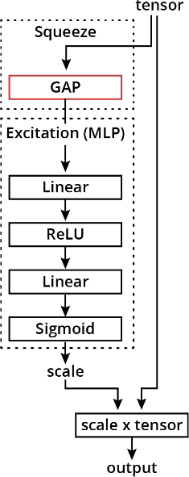

# C-4: Transfer Learning

<br>
<br>

#### Innovative CNN Architectures

##### The Evolution of CNN Design

Convolutional Neural Networks have undergone remarkable evolution since their introduction, with each major architecture
introducing novel ideas that have collectively transformed the field of computer vision. Understanding these landmark
architectures provides insight into the fundamental principles that drive modern deep learning design.

##### AlexNet

AlexNet represents the watershed moment when deep learning decisively overtook traditional computer vision approaches.
Created by Alex Krizhevsky, Ilya Sutskever, and Geoffrey Hinton in 2012, this architecture won the ImageNet competition
by a stunning margin, reducing error rates by almost half compared to previous methods.

AlexNet's key innovations included:

1. The first major CNN to utilize ReLU (Rectified Linear Unit) activation functions instead of the traditional sigmoid
   or tanh functions. This simple change dramatically improved training speed by addressing the vanishing gradient
   problem that had plagued deeper networks.
2. Implementation of Dropout as a regularization technique, randomly deactivating neurons during training to prevent
   co-adaptation and reduce overfitting. This allowed the network to learn more robust features.
3. A deep structure with five convolutional layers followed by three fully-connected layers, demonstrating that deeper
   architectures could achieve significantly better performance when properly designed and trained.
4. GPU implementation that made training such large networks feasible, leveraging the parallel processing capabilities
   of graphics hardware.

AlexNet's classical CNN structure—convolutional backbone followed by flattening and a fully-connected head—established
the template that many subsequent networks would follow and refine.

##### VGG

Developed by the Visual Geometry Group at Oxford, the VGG architecture (particularly VGG16 and VGG19 with 16 and 19
layers respectively) demonstrated that architectural simplicity combined with increased depth could yield excellent
results.

VGG's most significant contribution was the exclusive use of small 3×3 convolutional kernels throughout the network,
replacing the larger filters (11×11, 7×7, 5×5) used in previous architectures like AlexNet. This design choice provided
multiple benefits:

1. Stacking multiple 3×3 convolutions achieves the same effective receptive field as larger kernels (e.g., three 3×3
   layers have the same receptive field as one 7×7 layer) but with fewer parameters and more non-linearities.
2. The uniform filter size created an elegant, regular structure that was easier to analyze and modify.
3. The deeper architecture enabled more complex feature hierarchies to develop.

VGG also established a pattern of systematically doubling the number of feature maps while halving spatial dimensions
through pooling, creating a clean transition from spatial information to channel-rich feature representations. This
approach—decreasing spatial dimensions while increasing feature depth—has become a standard design principle in modern
CNNs.

##### ResNet

Prior to ResNet (Residual Network), researchers observed a counterintuitive phenomenon: beyond a certain point, adding
more layers to a network would actually decrease performance, even on the training set. This "degradation problem"
suggested a fundamental issue with optimizing very deep networks.

Kaiming He and colleagues at Microsoft Research addressed this problem in 2015 with the revolutionary ResNet
architecture, which introduced skip connections (or residual connections). The mathematical formulation of a residual
block is elegantly simple:

$$H(x) = F(x) + x$$

Where:

- $H(x)$ is the desired underlying mapping
- $F(x)$ is the residual mapping to be learned by a few stacked layers
- $x$ is the identity shortcut connection

This formulation provides a profound insight: instead of directly learning a desired mapping $H(x)$, the network learns
the residual $F(x) = H(x) - x$. If the optimal function is close to the identity, the network can easily learn to set
$F(x) ≈ 0$, making $H(x) ≈ x$.

The benefits of this approach are significant:

1. **Gradient flow**: During backpropagation, gradients can flow directly through the skip connections, mitigating the
   vanishing gradient problem in very deep networks.
2. **Ease of optimization**: The residual formulation makes it easier for the network to learn identity mappings when
   needed, helping optimization converge to better solutions.
3. **Unprecedented depth**: ResNet enabled the practical training of networks with hundreds of layers, far deeper than
   previously possible.

The mathematical elegance of the residual connection is matched by its practical impact—it addresses the degradation
problem so effectively that ResNet and its variants remain among the most widely used architectures even years after
their introduction.

##### Channel Attention Mechanisms

While convolutional operations excel at extracting local spatial features, they treat all channels (feature maps) with
equal importance. In many cases, certain features are more relevant than others for specific inputs. Channel attention
mechanisms address this limitation by dynamically weighting the importance of different feature maps.

The Squeeze-and-Excitation (SE) block, introduced in 2018, is a particularly effective channel attention mechanism. It
works in two steps:

1. **Squeeze**: Global information is aggregated from each feature map, typically using global average pooling to create
   a channel descriptor (a vector with one value per channel).
2. **Excitation**: The channel descriptor is passed through a small neural network (usually two fully-connected layers
   with a bottleneck), producing a set of channel-specific weights.

These weights are then applied to the original feature maps, emphasizing important channels and suppressing less
relevant ones. Mathematically, if we have a feature tensor $\mathbf{X}$ with $C$ channels, the SE block computes:

$$\mathbf{Y} = \mathbf{X} \cdot \sigma(W_2 \cdot \delta(W_1 \cdot \text{GAP}(\mathbf{X})))$$

Where:

- $\text{GAP}$ is global average pooling
- $W_1$ and $W_2$ are learnable weight matrices
- $\delta$ is typically ReLU activation
- $\sigma$ is typically sigmoid activation

Channel attention mechanisms have proven remarkably effective at improving model accuracy with minimal computational
overhead, making them a standard component in many modern architectures like EfficientNet.

##### Vision Transformers

While CNNs dominated computer vision for nearly a decade, the Vision Transformer (ViT) introduced in 2020 demonstrated
that architectures originally designed for natural language processing could achieve comparable or superior performance
on image tasks.

The key innovation of Vision Transformers is replacing convolution operations with self-attention mechanisms. The
process works as follows:

1. An image is divided into fixed-size patches (typically 16×16 pixels)
2. Each patch is linearly projected to create a patch embedding
3. Position embeddings are added to retain spatial information
4. The resulting sequence of embeddings is processed by a standard Transformer encoder

The self-attention mechanism allows each part of the image to directly interact with every other part, regardless of
spatial distance. This contrasts with CNNs, which build long-range dependencies gradually through many layers of local
operations.

The mathematical formulation of self-attention for a set of queries $Q$, keys $K$, and values $V$ is:

$$\text{Attention}(Q, K, V) = \text{softmax}\left(\frac{QK^T}{\sqrt{d_k}}\right)V$$

Where $d_k$ is the dimension of the key vectors.

Vision Transformers excel at capturing global context but require significantly more training data than CNNs to reach
comparable performance. This is because they lack the inductive biases that CNNs inherently possess—namely local
connectivity and translation equivariance. Without these built-in assumptions about the nature of images, Transformers
must learn these properties from data.

Despite their data hunger, Vision Transformers have demonstrated state-of-the-art performance on many computer vision
benchmarks, particularly when trained on very large datasets. They have also proven remarkably effective for multi-modal
tasks that combine vision with other domains like language.

##### The Architectural Landscape Today

Modern computer vision now encompasses a spectrum of architectural approaches:

1. **Pure CNN architectures** like EfficientNet continue to dominate many real-world applications, particularly where
   computational efficiency is critical or training data is limited.
2. **Hybrid architectures** like ConvNeXt and CoAtNet incorporate insights from both CNNs and Transformers, combining
   convolutional operations with self-attention mechanisms to get the best of both worlds.
3. **Pure Transformer architectures** like ViT and Swin Transformer push the boundaries of what's possible with
   sufficient data and computational resources, particularly excelling at tasks requiring global understanding.

This diverse ecosystem enables practitioners to select architectures that best match their specific constraints
regarding data availability, computational resources, and performance requirements.

The history of CNN architecture development illustrates a fundamental principle of deep learning progress: successive
innovations build upon and refine previous breakthroughs, creating an evolutionary path where each new architecture
addresses limitations of its predecessors while retaining their strengths.

#### Global Average Pooling

##### The Input Size Constraint

Traditional CNN architectures typically consist of two main components: a convolutional backbone that extracts features,
followed by fully-connected (FC) layers that make predictions based on these features. This design creates an inherent
constraint that isn't immediately obvious but has significant practical implications.

The issue arises at the transition between these components. Convolutional layers are inherently flexible regarding
input dimensions—they apply the same operations regardless of the spatial dimensions of their input. However,
fully-connected layers require a fixed-size input vector. This creates a fundamental tension in network design.

In classical CNN architectures like AlexNet and VGG, this transition happens through a "flattening" operation. If we
have feature maps of dimensions H×W with C channels, flattening transforms them into a single vector of length H×W×C.
This flattened vector then feeds into the fully-connected layers.

The constraint becomes clear: since FC layers expect inputs of a specific size, the flattened vector must have a fixed
length. This means the feature maps just before flattening must have specific spatial dimensions. Working backward
through the network, this ultimately constrains the input image size.

For example, if a network was designed for 224×224 input images, it cannot easily process 256×256 or 192×192 images
without architectural modifications. This rigidity presents practical challenges when deploying models in real-world
scenarios where image dimensions might vary.

##### Global Average Pooling

Global Average Pooling (GAP) was introduced as an elegant solution to this constraint. The operation is remarkably
simple: for each feature map, compute the average of all its spatial locations, producing a single value.
Mathematically, for a feature map F of size H×W, the GAP operation computes:

$$\text{GAP}(F) = \frac{1}{H \times W} \sum_{i=1}^{H} \sum_{j=1}^{W} F_{i,j}$$

When applied to a tensor with C feature maps, GAP produces a C-dimensional vector—one average value per feature map.

This simple operation has profound implications for network architecture. The key insight is that the output dimension
of GAP depends only on the number of feature maps (channels), not their spatial dimensions. Whether the feature maps are
7×7, 14×14, or even variable-sized, GAP always outputs a vector of length C.

This property effectively decouples the input image size from the requirements of the fully-connected layers. The
network can now process images of different sizes, as long as they are large enough to pass through all the
convolutional and pooling layers without dimensions reducing to zero.

<p align="center">

</p>
<p align="center">figure: Global Average Pooling (GAP) operation reducing feature maps to a single vector</p>

##### Advantages Over Flattening

Global Average Pooling offers several significant advantages over traditional flattening:

1. **Input Size Flexibility**: As discussed, GAP allows networks to process images of various dimensions without
   architectural changes. This is particularly valuable in real-world applications where image sizes may vary.
2. **Parameter Efficiency**: The transition from convolutional to fully-connected layers via flattening typically
   introduces a large number of parameters. For example, flattening 512 feature maps of size 7×7 creates a vector of
   length 25,088, which, when connected to a layer with just 1,000 neurons, requires over 25 million parameters. GAP
   reduces this to just 512,000 parameters—a 98% reduction.
3. **Structural Regularization**: GAP enforces a form of structural regularization by requiring the network to develop
   more meaningful feature maps. Since each feature map is reduced to a single value, the network learns to make each
   channel represent a coherent, high-level concept rather than encoding spatial information that will be discarded.
4. **Interpretability**: Networks with GAP often exhibit improved interpretability. Each value in the GAP output can be
   roughly interpreted as the presence or absence of a specific high-level feature, creating a more direct connection
   between feature maps and final predictions.
5. **Reduced Overfitting**: The dramatic reduction in parameters helps prevent overfitting, especially on smaller
   datasets where the large parameter count of flattened architectures might memorize training examples rather than
   learning generalizable patterns.

##### The Architectural Impact

The introduction of Global Average Pooling has influenced modern CNN architecture in fundamental ways:

1. **Network-in-Network and Beyond**: First popularized in the Network-in-Network architecture, GAP has become a
   standard component in numerous influential designs, including GoogLeNet (Inception), ResNet, and virtually all modern
   architectures.
2. **CAM Visualization**: GAP enables Class Activation Mapping (CAM), a powerful visualization technique that highlights
   regions of the input image that influenced the network's decision. This works because GAP maintains a direct
   connection between specific feature maps and class predictions.
3. **Fully Convolutional Networks**: GAP facilitates the creation of fully convolutional networks that can process
   images of any size and produce appropriately sized outputs, critical for tasks like semantic segmentation and object
   detection.

##### Practical Considerations

While GAP offers numerous advantages, there are practical considerations to keep in mind:

1. **Information Loss**: GAP discards all spatial information within each feature map. For tasks where the exact
   location of features matters, this could be detrimental. However, modern architectures often compensate by using more
   feature maps to encode location-specific information implicitly.
2. **Training Dynamics**: Networks with GAP sometimes exhibit different training dynamics compared to those with
   flattening, occasionally requiring more careful initialization or learning rate scheduling.
3. **Resolution Sensitivity**: Although GAP enables variable-sized inputs, performance may still degrade if input images
   differ significantly from the dimensions used during training. This is because earlier convolutional layers develop
   filters tuned to specific scales and patterns.
4. **Hybrid Approaches**: Some architectures use hybrid approaches, such as global max pooling for certain features or
   adaptive pooling that reduces feature maps to a small fixed spatial dimension before flattening.

Global Average Pooling represents a key architectural innovation that addressed a fundamental limitation of traditional
CNNs. By enabling flexible input sizes and dramatically reducing parameter count, GAP has become an essential component
in modern network design, allowing more efficient, generalizable, and interpretable models that can better adapt to the
demands of real-world deployment.

<br>
<br>

#### Channel Attention

The concept of attention is a very important concept in modern neural networks. It is a simple idea: the network should
learn to boost some information that is helpful for a given example, and decrease the importance of information that is
not useful for that example. There are several forms of attention, but, the two important ones are:

- Squeeze
- Excitation

<p align="center">

</p>
<p align="center">figure: Channel Attention (Squeeze-and-excitation, or SE, block)</p>

<br>
<br>

The term "channel" can refer to the channels in the input image (3 channels if RGB) but also to the number of feature
maps are output from a layer.

Channel attention is a mechanism that a network can use to learn to pay more attention (i.e., to boost) feature maps
that are useful for a specific example, and pay less attention to the others. This is accomplished by adding a
subnetwork that given the feature maps/channels assigns a scale to each input feature map. The feature maps with the
largest scale are boosted:

<br>

<p align="center">

</p>
<p align="center">figure: Channel Attention (Squeeze-and-excitation, or SE, block)</p>

<br>
<br>

#### Computer Vision Transformers

Vision Transformers have been recently introduced, and are becoming more and more important for computer vision. They
contain another form of attention, called self attention.

Transformers are a family of neural networks originally developed for Natural Language Processing (NLP) applications.
They are very good at modeling sequences, such as words in a sentence. They have been extended to deal with images by
transforming images to sequences. In short, the image is divided in patches, the patches are transformed into embedded
representations, and these representations are fed to a Transformer that treats them as a sequence.

Transformers are characterized by the self-attention mechanism. Just like channel attention allows the network to learn
to focus more on some channels, self attention allows the network to learn how to pay attention to the relationship
between different words in a sentence or parts of an image. While CNNs build large Effective Receptive Fields by using
many layers, vision Transformers show large receptive fields earlier and more consistently throughout the network.

<br>
<br>

Vision Transformers have state-of-the-art performances in many academic computer vision tasks. CNNs are, however, still
by far the most widely-used models for real-world computer vision applications.

Transformers are very powerful but they need a lot more data than CNNs, and they are typically slower and more
computationally expensive. CNNs are more data-efficient because they are built around two baked-in assumptions: _local_
_connectivity_, which dictates that pixels close to each other are related (by using small kernels); and _weight
sharing_, which dictates that different portions of an image must be processed identically (by sliding the same
convolutional kernel across the entire image). Transformers are much more general, and they do not impose these
assumptions. Therefore, they are more adaptable, but need more data to learn these characteristics of many images. There
are also architectures that are hybrids of CNNs and Transformers, which try to create the best combination of both,
aiming to be data-efficient but more powerful than pure CNNs. The modele categories are provided below:

1. _Pure CNN architectures_: They are still widely used for the majority of real-world applications. Examples:
   EfficientNet V2
2. _ConvNeXt_
3. _Pure Vision Transformers_: They are currently widely used in academic environments and in large-scale real-world
   applications. Examples: ViT, Swin V2, Hybrid architectures that mix elements of CNNs with elements of Transformers.
   Example: CoatNet

Transformers are now becoming even more important because they form the basis for multi-modal models - models that deal
with, for example, image and text simultaneously. Examples of these are Open AI's CLIP and Google's ImageGen.

#### Transfer Learning

<br>

Transfer learning is a technique that allows us to re-use what a network has learned on one dataset to learn about a
different dataset. While training from scratch requires large datasets and a lot of resources, transfer learning can be
applied successfully on much smaller datasets without the need for large computational resources.

A normal CNN extracts more and more abstract features the deeper you go in the network. This means that the initial
layers, which extract _elementary features_ such as _edges_ and _colors_, are probably pretty general and can be applied
similarly on many different datasets. Instead, the last layers (especially the fully-connected layers) are highly
specialized in the task they have been trained on.

Accordingly, in transfer learning we keep the initial layers (that are pretty universal) unchanged or almost unchanged,
while we change the _last layers_ that must be _specialized by task_. How many layers we keep or modify slightly, and
how many layers we change dramatically or even replace, depends on how similar our dataset is to the original dataset
and on how much data we have. So essentially the transfer-learning workflow consists of taking a pre-trained model,
freezing some of the initial layers and freeing or substituting some late layers, then training on our dataset.

#### Pre-Trained Model

You can find the list of all models supported by torchvision in the official documentation. Then you can load models by
name. For example, let's load a resnet architecture:

```python
import torchvision.models
model = torchvision.models.resnet18(pretrained=True)
```

The _pretrained=True_ option indicates that we want the weights obtained after training on ImageNet or some other
dataset. If we set pretrained=False we get the model initialized with the default initialization, ready to be trained
from scratch.

#### Freezing and Thawing

A frozen parameter is a parameter that is not allowed to vary during training. In other words, backpropagation will
ignore that parameter and won't change its value nor compute the gradient of the loss with respect to that parameter. In
PyTorch you can freeze all the parameters of a network using the following code:

```python
for param in model.parameters():
    param.requires_grad = False
```

Similarly, you can also freeze the parameters of a single layer. For example, say that this layer is called fc, then:

```python
for param in model.fc.parameters():
  param.requires_grad = False
```

You can instead thaw parameters that are frozen by setting requires_grad to True.

#### BatchNorm

The BatchNorm layer is a special case: it has _two_ parameters (_gamma_ and _beta_), but it also has two buffers that
are used to accumulate the mean and standard deviation of the dataset during training. If you only use
_requires_grad=False_ then you are only fixing gamma and beta. The statistics about the dataset are still accumulated.
Sometimes fixing those as well can help the performance, but not always. Experimentation, as usual, is key.

If we want to also freeze the statistics accumulated we need to put the entire layer in evaluation mode by using eval as
_model.bn.eval()_ (instead of _requires_grad=False_).

Note that this is different than using _model.eval()_ (which would put the entire model in evaluation mode). You can
invert this operation by putting the BatchNorm layer back into training mode: model.bn.train().

When doing transfer learning, in many cases you need to know the layout of the architecture you are using so you can
decide what to freeze or not to freeze. In particular, you often need either the name or the position of a specific
layer in the network. As usual, we do not encourage the use of _print(model)_ as the output there does NOT necessarily
correspond to the execution path coded in the forward method. Instead, use the documentation of the model or export the
model and visualize it with Netron as explained in the next subsection.

<br>
<br>

#### Visualizing an Architecture

_Netron_ is a web app, so you do not need to install anything locally. First we need to export the model:

```python
# Fake image needed for torch.jit.trace
# (adjust the size of the image from 224x224 to what the
# network expects if needed)
random_image = torch.rand((1, 3, 224, 224))

scripted = torch.jit.trace(model, random_image)
torch.jit.save(scripted, "my_network.pt")
```

Then we can go to _Netron_ and load this file. Once the architecture has been loaded, press Crtl+U to visualize the name
of each layer. Transfer learning involves taking a pre-trained neural network trained on a source dataset (for example,
Imagenet) and adapting it to a new, different dataset, typically a custom dataset for a specific problem.

There are different types of transfer learning and different strategies that you can use depending on:

- The size of your dataset
- How similar your dataset is to the original dataset that the network was trained on (e.g., ImageNet)

We can schematize the different possibilities like this:

<p align="center">

</p>
<p align="center">figure: Transfer Learning Strategies</p>

<br>
<br>

#### Dataset

##### Size

It is difficult to define what a small dataset or a large dataset is exactly. However, for a typical classification
example, a small dataset is in the range of 1000-10,000 images. A large dataset can have 100,000 images or more. These
boundaries also change significantly depending on the size of the model you are using. A dataset that is large for a
ResNet18 model (a ResNet with 18 layers) could be small for a ResNet150 architecture (a ResNet with 150 layers). The
latter has many more parameters and a much larger capacity so it needs more data. In general, the larger the model, the
more data it needs.

##### Similarity

Similarly, it is sometimes difficult to judge whether a target dataset is similar to the source dataset. For example, if
the source dataset is Imagenet and the target dataset is of natural images, then the two datasets are pretty similar.
However, if the target is medical images then the datasets are fairly dissimilar. However, it must be noted that CNNs
look at images differently than we do, so sometimes datasets that look different to us are sufficiently similar for the
model, and vice versa. It is important to experiment and verify our assumptions.

#### Strategies for Dataset Size

##### Small Target Dataset, Similar to the Source

This is a typical case, and the case where transfer learning really shines. We can use the pre-trained part of the
network to extract meaningful feature vectors and use them to classify our images.

In practice, we take the head of the network, and we substitute it with one or more new fully-connected layers (with the
usual _BatchNorm_ and _ReLU_ layers in-between). Remember that the head of the network is the final part of the network,
made typically by an MLP or similar, after the convolution part. It takes the output of the feature extractor part (also
called backbone) and uses it to determine the class of the image (in the case of image classification). In some
architectures like ResNet the head is just one layer (the last layer); in other architectures it is more complicated,
encompassing the last few layers. Of course, the last of these layers needs to have as many output nodes as classes in
our problem (or one number in case of regression).

Then we train, keeping all the layers fixed except for the layer(s) we have just added. For example, let's say we have
1000 images (a small dataset) and a classification task with 10 classes. This is what we could do:

<br>
<br>

```python
import torch.nn as nn
import torchvision.models

## Get a pre-trained model from torchvision, for example
## ResNet18
model = torchvision.models.resnet18(pretrained=True)

## Let's freeze all the parameters in the pre-trained
## network
for param in model.parameters():
    param.requires_grad = False

## Through Netron.app we have discovered that the last layer is called
## "fc" (for "fully-connected"). Let's find out how many input features
## it has
input_features = model.fc.in_features
## We have 10 classes
n_classes = 10
## Let's substitute the existing fully-connected last layer with our
## own (this will have all its parameters free to vary)
model.fc = nn.Linear(input_features, n_classes)
## or we can use a more complicated head (this might or might not
## lead to improved performances depending on the case)
model.fc = nn.Sequential(
    nn.BatchNorm1d(input_features),
    nn.Linear(input_features, input_features * 2),
    nn.ReLU(),
    nn.BatchNorm1d(input_features * 2),
    nn.Dropout(0.5),
    nn.Linear(input_features * 2, n_classes)
)
```

<br>
<br>

Now we can train our model as usual. You might want to start by executing the learning rate finder we have seen in our
previous exercises and train for a few epochs. Depending on the size of your dataset, you might reach good performances
rather quickly. It is likely that you will have to train for much less time than you would if you were to train from
scratch. Be careful with overfitting and do not overtrain! If needed, also add more image augmentations, weight decay,
and other regularization techniques.

<br>

##### Large Dataset, Similar to the Original

If we have more data and/or the task is not very similar to the task that the network was originally trained to solve,
then we are going to get better performances by fine-tuning the entire network. We start by performing the same
procedure as the previous case: we remove the existing head, we freeze everything, and we add our own head, then we
train for a few epochs. Typically, 1 or 2 epochs are sufficient.

We then free all the layers, and we train until convergence (until the validation loss stops decreasing). We need to be
very careful to use a conservative learning rate, to avoid destroying what the network has learned during the original
task. A good choice is typically a value between 2 and 10 times smaller than the learning rate we used to train the
head. As usual, experimentation is typically needed to find the best learning rate for this phase.

A more advanced technique that works well in practice is to use a different learning rate for every layer(opens in a new
tab). You start with using the maximum learning rate for the last layer and you gradually decrease the learning rate for
layers deeper into the network until you reach the minimum for the first convolutional layer.

<br>

##### Large Dataset, Different than the Original

In this situation, fine-tuning does not give us better performance or faster training. We are better off just training
from scratch. We can still take advantage of good architectures that performed well on ImageNet, since they are likely
to work well on our dataset as well. We can just use them without pre-trained weights, for example:

```python
import torch.nn as nn
import torchvision.models

## Get a pre-trained model from torchvision, for example
## ResNet18
model = torchvision.models.resnet18(pretrained=False)
```

<br>
<br>

##### Small Dataset, Very Different than Original

This is the hardest situation - Gather more data or use semi-supervised learning. If you have tried fine-tuning just the
head, and it did not perform well enough, and fine-tuning more layers resulted in overfitting, you probably need to
either collect more data or look into starting from scratch and use semi-supervised learning Other situations When it is
not clear whether you are in any of the situations described above, you can take approaches that are in-between.

For example, when you have a dataset that is not very small but not very large either, you might get good performances
by fine-tuning not only the head, but also a few of the last convolutional layers or blocks. Indeed, these layers encode
high-level concepts such as "squares," "triangles," or textures, and therefore can improve by being fine-tuned or even
trained from scratch on your data. Just free those layers along with the new head and train those, while keeping the
rest fixed. Depending once again on the size of your data and the similarity with the original dataset, you can
fine-tune these layers or reset them and train them from scratch. As usual, it takes a bit of experimentation to find
the best solution.

<br>

When performing fine-tuning (or training with a predefined architecture), we cannot avoid mentioning the fantastic
PyTorch Image Models (timm) library. It contains hundreds of models, many with pre-trained weights, and it keeps getting
updated with the very latest architectures from the research community. It is very easy to use it for transfer learning.
It is an alternative to torchvision that contains many more pretrained models. First let's install it with:

```
pip install timm
```

Then we can get a pre-trained model with a custom head just by doing:

```
n_classes = 196
model = timm.create_model("convnext_small", pretrained=True, num_classes=n_classes)
```

We can now choose to freeze some or all the layers except the last one, depending on the size of our dataset and its
characteristics, and apply the techniques we discussed before. Note that you do not need to know the details of the
architecture to be able to make a new head for it, as timm does that for you.

#### Questions and Answers

##### Q#1: Consider the following scenario: you have a dataset of around 5000 labeled images of dogs, and you want to classify the different breeds. What is the best strategy to build a model for this dataset?

Answer: Select a pre-made architecture and start from the weights that have been obtained after training it on ImageNet,
then fine-tune the classification head.

Explanation:

- This is the best approach because:
    1. The dataset is relatively small (5000 images)
    2. Dog breed classification is similar to tasks in ImageNet
    3. Pre-trained weights on ImageNet already contain useful features for animal/dog recognition
    4. Fine-tuning just the classification head is computationally efficient and helps prevent overfitting
    5. Transfer learning from ImageNet is particularly effective for animal classification tasks

##### Q#2: When doing transfer learning, we can consider different strategies based on the dataset size as well as its similarity with the original dataset the architecture was trained on. Can you match the different use cases with the

correct strategy?

| Transfer Learning Strategy                  | Use Case                        |
| ------------------------------------------- | ------------------------------- |
| Train from scratch                          | Big dataset, dissimilar         |
| Fine-tune just the head                     | Small dataset, similar          |
| Fine-tune the head, then fine-tune the rest | Large dataset, somewhat similar |
| Collect more data                           | Small dataset, very dissimilar  |

## Explanation:

1. **Train from scratch**

    - When: Big dataset + Dissimilar domain
    - Why: With large amounts of data that's very different from the pre-trained domain, it's better to learn features
      specific to your task
    - Example: Using ImageNet-trained model for medical imaging with millions of samples

2. **Fine-tune just the head**

    - When: Small dataset + Similar domain
    - Why: Pre-trained features are already relevant, and limited data means we should avoid overfitting
    - Example: Using ImageNet model for pet classification with few thousand images

3. **Fine-tune head, then rest**

    - When: Large dataset + Somewhat similar domain
    - Why: Enough data to fine-tune more layers, but pre-trained features still provide good starting point
    - Example: Using ImageNet model for satellite imagery with substantial data

4. **Collect more data**
    - When: Small dataset + Very dissimilar domain
    - Why: Neither training from scratch (too little data) nor transfer learning (too different) would work well
    - Example: Using ImageNet model for radar images with only hundreds of samples

This strategy matrix helps in deciding the best approach based on two key factors:

2. Dataset size (Small vs. Large)
3. Domain similarity to pre-trained dataset (Similar vs. Dissimilar)

The choice of strategy significantly impacts model performance and training efficiency.

Explanation for each case:

- Small dataset, very dissimilar: Even with dissimilar data, when the dataset is small, it's better to keep most
  pre-trained weights to avoid overfitting, only adjusting the head.
- Small dataset, similar: Perfect case for transfer learning with minimal fine-tuning. The pre-trained features are
  already relevant, and the small dataset size suggests minimal adaptation.
- Large dataset, somewhat similar: With more data, we can afford to fine-tune more layers. The two-step approach (head
  first, then rest) helps maintain stable training.
- Big dataset, dissimilar: With a large dataset that's very different from the original, it's better to train from
  scratch as the pre-trained features might not be relevant and we have enough data to learn good features.

#### ### Visualizing CNNs

<p align="center">

</p>
<p align="center">figure: Visualizing CNNs</p>
