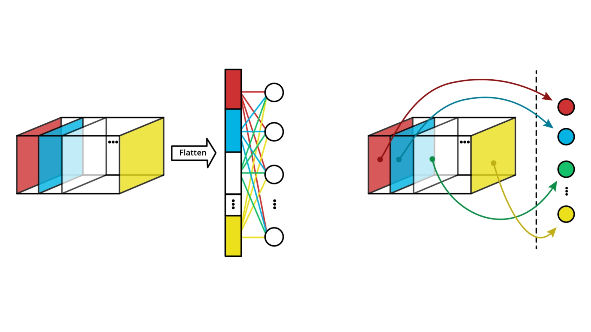
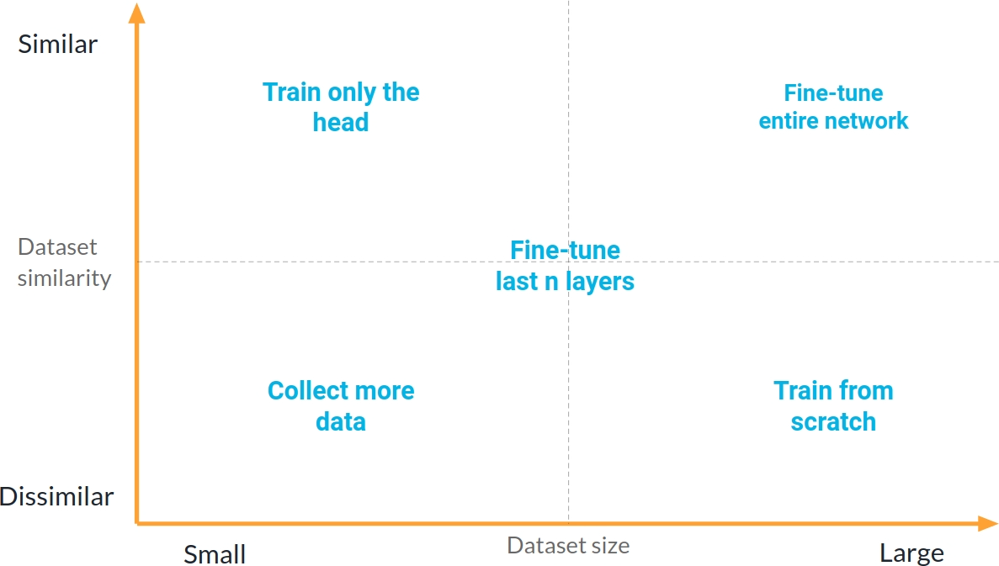

# C-4: Transfer Learning

 
 

1. **Innovative CNN Architectures**

    - AlexNet
    - VGG
    - ResNet (and skip connections)
    - Channel Attention mechanisms
    - Vision Transformers

2. **Global Average Pooling**

    - Fixed vs. flexible input sizes
    - Advantages over flattening

3. **Transfer Learning Fundamentals**

    - Core concept and benefits
    - Feature extraction vs. fine-tuning

4. **Transfer Learning Strategies**

    - Based on dataset size and similarity
    - Four key scenarios and approaches

5. **Implementation Techniques**

    - Freezing and thawing layers

    - Handling BatchNorm layers

    - Visualizing architectures

#### Innovative CNN Architectures

##### The Evolution of CNN Design

Convolutional Neural Networks have undergone remarkable evolution since their introduction, with each major architecture
introducing novel ideas that have collectively transformed the field of computer vision. Understanding these landmark
architectures provides insight into the fundamental principles that drive modern deep learning design.

##### AlexNet

AlexNet represents the watershed moment when deep learning decisively overtook traditional computer vision approaches.
Created by Alex Krizhevsky, Ilya Sutskever, and Geoffrey Hinton in 2012, this architecture won the ImageNet competition
by a stunning margin, reducing error rates by almost half compared to previous methods.

AlexNet's key innovations included:

1. The first major CNN to utilize ReLU (Rectified Linear Unit) activation functions instead of the traditional sigmoid
   or tanh functions. This simple change dramatically improved training speed by addressing the vanishing gradient
   problem that had plagued deeper networks.
2. Implementation of Dropout as a regularization technique, randomly deactivating neurons during training to prevent
   co-adaptation and reduce overfitting. This allowed the network to learn more robust features.
3. A deep structure with five convolutional layers followed by three fully-connected layers, demonstrating that deeper
   architectures could achieve significantly better performance when properly designed and trained.
4. GPU implementation that made training such large networks feasible, leveraging the parallel processing capabilities
   of graphics hardware.

AlexNet's classical CNN structure—convolutional backbone followed by flattening and a fully-connected head—established
the template that many subsequent networks would follow and refine.

##### VGG

Developed by the Visual Geometry Group at Oxford, the VGG architecture (particularly VGG16 and VGG19 with 16 and 19
layers respectively) demonstrated that architectural simplicity combined with increased depth could yield excellent
results.

VGG's most significant contribution was the exclusive use of small 3×3 convolutional kernels throughout the network,
replacing the larger filters (11×11, 7×7, 5×5) used in previous architectures like AlexNet. This design choice provided
multiple benefits:

1. Stacking multiple 3×3 convolutions achieves the same effective receptive field as larger kernels (e.g., three 3×3
   layers have the same receptive field as one 7×7 layer) but with fewer parameters and more non-linearities.
2. The uniform filter size created an elegant, regular structure that was easier to analyze and modify.
3. The deeper architecture enabled more complex feature hierarchies to develop.

VGG also established a pattern of systematically doubling the number of feature maps while halving spatial dimensions
through pooling, creating a clean transition from spatial information to channel-rich feature representations. This
approach—decreasing spatial dimensions while increasing feature depth—has become a standard design principle in modern
CNNs.

##### ResNet

Prior to ResNet (Residual Network), researchers observed a counterintuitive phenomenon: beyond a certain point, adding
more layers to a network would actually decrease performance, even on the training set. This "degradation problem"
suggested a fundamental issue with optimizing very deep networks.

Kaiming He and colleagues at Microsoft Research addressed this problem in 2015 with the revolutionary ResNet
architecture, which introduced skip connections (or residual connections). The mathematical formulation of a residual
block is elegantly simple:

$$H(x) = F(x) + x$$

Where:

- $H(x)$ is the desired underlying mapping
- $F(x)$ is the residual mapping to be learned by a few stacked layers
- $x$ is the identity shortcut connection

This formulation provides a profound insight: instead of directly learning a desired mapping $H(x)$, the network learns
the residual $F(x) = H(x) - x$. If the optimal function is close to the identity, the network can easily learn to set
$F(x) ≈ 0$, making $H(x) ≈ x$.

The benefits of this approach are significant:

1. **Gradient flow**: During backpropagation, gradients can flow directly through the skip connections, mitigating the
   vanishing gradient problem in very deep networks.
2. **Ease of optimization**: The residual formulation makes it easier for the network to learn identity mappings when
   needed, helping optimization converge to better solutions.
3. **Unprecedented depth**: ResNet enabled the practical training of networks with hundreds of layers, far deeper than
   previously possible.

The mathematical elegance of the residual connection is matched by its practical impact—it addresses the degradation
problem so effectively that ResNet and its variants remain among the most widely used architectures even years after
their introduction.

##### Channel Attention Mechanisms

While convolutional operations excel at extracting local spatial features, they treat all channels (feature maps) with
equal importance. In many cases, certain features are more relevant than others for specific inputs. Channel attention
mechanisms address this limitation by dynamically weighting the importance of different feature maps.

figure: Channel Attention (Squeeze-and-excitation, or SE, block)

The Squeeze-and-Excitation (SE) block, introduced in 2018, is a particularly effective channel attention mechanism. It
works in two steps:

1. **Squeeze**: Global information is aggregated from each feature map, typically using global average pooling to create
   a channel descriptor (a vector with one value per channel).
2. **Excitation**: The channel descriptor is passed through a small neural network (usually two fully-connected layers
   with a bottleneck), producing a set of channel-specific weights.

These weights are then applied to the original feature maps, emphasizing important channels and suppressing less
relevant ones. Mathematically, if we have a feature tensor $\mathbf{X}$ with $C$ channels, the SE block computes:

$$\mathbf{Y} = \mathbf{X} \cdot \sigma(W_2 \cdot \delta(W_1 \cdot \text{GAP}(\mathbf{X})))$$

Where:

- $\text{GAP}$ is global average pooling
- $W_1$ and $W_2$ are learnable weight matrices
- $\delta$ is typically ReLU activation
- $\sigma$ is typically sigmoid activation

figure: Channel Attention (Squeeze-and-excitation, or SE, block)

Channel attention mechanisms have proven remarkably effective at improving model accuracy with minimal computational
overhead, making them a standard component in many modern architectures like EfficientNet.

##### Vision Transformers

While CNNs dominated computer vision for nearly a decade, the Vision Transformer (ViT) introduced in 2020 demonstrated
that architectures originally designed for natural language processing could achieve comparable or superior performance
on image tasks.

The key innovation of Vision Transformers is replacing convolution operations with self-attention mechanisms. The
process works as follows:

1. An image is divided into fixed-size patches (typically 16×16 pixels)
2. Each patch is linearly projected to create a patch embedding
3. Position embeddings are added to retain spatial information
4. The resulting sequence of embeddings is processed by a standard Transformer encoder

The self-attention mechanism allows each part of the image to directly interact with every other part, regardless of
spatial distance. This contrasts with CNNs, which build long-range dependencies gradually through many layers of local
operations.

The mathematical formulation of self-attention for a set of queries $Q$, keys $K$, and values $V$ is:

$$\text{Attention}(Q, K, V) = \text{softmax}\left(\frac{QK^T}{\sqrt{d_k}}\right)V$$

Where $d_k$ is the dimension of the key vectors.

Vision Transformers excel at capturing global context but require significantly more training data than CNNs to reach
comparable performance. This is because they lack the inductive biases that CNNs inherently possess—namely local
connectivity and translation equivariance. Without these built-in assumptions about the nature of images, Transformers
must learn these properties from data.

Despite their data hunger, Vision Transformers have demonstrated state-of-the-art performance on many computer vision
benchmarks, particularly when trained on very large datasets. They have also proven remarkably effective for multi-modal
tasks that combine vision with other domains like language.

##### The Architectural Landscape Today

Modern computer vision now encompasses a spectrum of architectural approaches:

1. **Pure CNN architectures** like EfficientNet continue to dominate many real-world applications, particularly where
   computational efficiency is critical or training data is limited.
2. **Hybrid architectures** like ConvNeXt and CoAtNet incorporate insights from both CNNs and Transformers, combining
   convolutional operations with self-attention mechanisms to get the best of both worlds.
3. **Pure Transformer architectures** like ViT and Swin Transformer push the boundaries of what's possible with
   sufficient data and computational resources, particularly excelling at tasks requiring global understanding.

This diverse ecosystem enables practitioners to select architectures that best match their specific constraints
regarding data availability, computational resources, and performance requirements.

The history of CNN architecture development illustrates a fundamental principle of deep learning progress: successive
innovations build upon and refine previous breakthroughs, creating an evolutionary path where each new architecture
addresses limitations of its predecessors while retaining their strengths.

#### Global Average Pooling

##### The Input Size Constraint

Traditional CNN architectures typically consist of two main components: a convolutional backbone that extracts features,
followed by fully-connected (FC) layers that make predictions based on these features. This design creates an inherent
constraint that isn't immediately obvious but has significant practical implications.

The issue arises at the transition between these components. Convolutional layers are inherently flexible regarding
input dimensions—they apply the same operations regardless of the spatial dimensions of their input. However,
fully-connected layers require a fixed-size input vector. This creates a fundamental tension in network design.

In classical CNN architectures like AlexNet and VGG, this transition happens through a "flattening" operation. If we
have feature maps of dimensions H×W with C channels, flattening transforms them into a single vector of length H×W×C.
This flattened vector then feeds into the fully-connected layers.

The constraint becomes clear: since FC layers expect inputs of a specific size, the flattened vector must have a fixed
length. This means the feature maps just before flattening must have specific spatial dimensions. Working backward
through the network, this ultimately constrains the input image size.

For example, if a network was designed for 224×224 input images, it cannot easily process 256×256 or 192×192 images
without architectural modifications. This rigidity presents practical challenges when deploying models in real-world
scenarios where image dimensions might vary.

##### Global Average Pooling

Global Average Pooling (GAP) was introduced as an elegant solution to this constraint. The operation is remarkably
simple: for each feature map, compute the average of all its spatial locations, producing a single value.
Mathematically, for a feature map F of size H×W, the GAP operation computes:

$$\text{GAP}(F) = \frac{1}{H \times W} \sum_{i=1}^{H} \sum_{j=1}^{W} F_{i,j}$$

When applied to a tensor with C feature maps, GAP produces a C-dimensional vector—one average value per feature map.

This simple operation has profound implications for network architecture. The key insight is that the output dimension
of GAP depends only on the number of feature maps (channels), not their spatial dimensions. Whether the feature maps are
7×7, 14×14, or even variable-sized, GAP always outputs a vector of length C.

This property effectively decouples the input image size from the requirements of the fully-connected layers. The
network can now process images of different sizes, as long as they are large enough to pass through all the
convolutional and pooling layers without dimensions reducing to zero.

figure: Global Average Pooling (GAP) operation reducing feature maps to a single vector

##### Advantages Over Flattening

Global Average Pooling offers several significant advantages over traditional flattening:

1. **Input Size Flexibility**: As discussed, GAP allows networks to process images of various dimensions without
   architectural changes. This is particularly valuable in real-world applications where image sizes may vary.
2. **Parameter Efficiency**: The transition from convolutional to fully-connected layers via flattening typically
   introduces a large number of parameters. For example, flattening 512 feature maps of size 7×7 creates a vector of
   length 25,088, which, when connected to a layer with just 1,000 neurons, requires over 25 million parameters. GAP
   reduces this to just 512,000 parameters—a 98% reduction.
3. **Structural Regularization**: GAP enforces a form of structural regularization by requiring the network to develop
   more meaningful feature maps. Since each feature map is reduced to a single value, the network learns to make each
   channel represent a coherent, high-level concept rather than encoding spatial information that will be discarded.
4. **Interpretability**: Networks with GAP often exhibit improved interpretability. Each value in the GAP output can be
   roughly interpreted as the presence or absence of a specific high-level feature, creating a more direct connection
   between feature maps and final predictions.
5. **Reduced Overfitting**: The dramatic reduction in parameters helps prevent overfitting, especially on smaller
   datasets where the large parameter count of flattened architectures might memorize training examples rather than
   learning generalizable patterns.

##### The Architectural Impact

The introduction of Global Average Pooling has influenced modern CNN architecture in fundamental ways:

1. **Network-in-Network and Beyond**: First popularized in the Network-in-Network architecture, GAP has become a
   standard component in numerous influential designs, including GoogLeNet (Inception), ResNet, and virtually all modern
   architectures.
2. **CAM Visualization**: GAP enables Class Activation Mapping (CAM), a powerful visualization technique that highlights
   regions of the input image that influenced the network's decision. This works because GAP maintains a direct
   connection between specific feature maps and class predictions.
3. **Fully Convolutional Networks**: GAP facilitates the creation of fully convolutional networks that can process
   images of any size and produce appropriately sized outputs, critical for tasks like semantic segmentation and object
   detection.

##### Practical Considerations

While GAP offers numerous advantages, there are practical considerations to keep in mind:

1. **Information Loss**: GAP discards all spatial information within each feature map. For tasks where the exact
   location of features matters, this could be detrimental. However, modern architectures often compensate by using more
   feature maps to encode location-specific information implicitly.
2. **Training Dynamics**: Networks with GAP sometimes exhibit different training dynamics compared to those with
   flattening, occasionally requiring more careful initialization or learning rate scheduling.
3. **Resolution Sensitivity**: Although GAP enables variable-sized inputs, performance may still degrade if input images
   differ significantly from the dimensions used during training. This is because earlier convolutional layers develop
   filters tuned to specific scales and patterns.
4. **Hybrid Approaches**: Some architectures use hybrid approaches, such as global max pooling for certain features or
   adaptive pooling that reduces feature maps to a small fixed spatial dimension before flattening.

Global Average Pooling represents a key architectural innovation that addressed a fundamental limitation of traditional
CNNs. By enabling flexible input sizes and dramatically reducing parameter count, GAP has become an essential component
in modern network design, allowing more efficient, generalizable, and interpretable models that can better adapt to the
demands of real-world deployment.

 
 

#### Transfer Learning Fundamentals

##### The Conceptual Foundation of Transfer Learning

Transfer learning represents a paradigm shift in how we approach deep learning. Rather than always starting from
scratch, transfer learning acknowledges a profound insight: knowledge gained while solving one problem can accelerate
learning in related domains. This concept mirrors human cognition—someone who knows how to ride a bicycle can learn to
ride a motorcycle more quickly, transferring balance skills and coordination while adapting to the new context.

In the realm of neural networks, transfer learning leverages pre-trained models—networks already trained on large
datasets—as starting points for new tasks. This approach has transformed practical applications of deep learning, making
sophisticated models accessible even with limited data and computational resources.

Consider a network trained on ImageNet, a dataset of over a million diverse images across 1,000 categories. Such a
network has developed a rich hierarchy of visual features: early layers detect edges and textures, middle layers
identify shapes and patterns, and deeper layers recognize complex objects and scenes. Transfer learning allows us to
harness this pre-existing feature hierarchy instead of building it anew.

##### The Hierarchical Nature of Learned Representations

The effectiveness of transfer learning stems from a key characteristic of deep neural networks: hierarchical feature
learning. As information flows through a CNN, representations transform from generic to specific:

1. **Early layers** (close to the input) learn universal visual features like edges, corners, and color blobs—patterns
   common to nearly all images regardless of content. These representations are highly transferable across visual tasks.
2. **Middle layers** combine these elementary features into more complex patterns like textures, simple shapes, and
   recurring motifs. These mid-level features remain fairly general but begin to specialize.
3. **Later layers** (close to the output) encode highly task-specific representations—combinations of features that
   directly correlate with target classes in the original training task.

This progression from general to specific features provides the theoretical foundation for transfer learning strategies.
The early and middle layers have learned generalizable visual primitives valuable for many tasks, while later layers may
need adaptation for new objectives.

Research has consistently demonstrated that features learned on large-scale image classification tasks transfer
remarkably well to diverse visual problems, from medical imaging to satellite photography, despite substantial
differences in image characteristics. This surprising transferability suggests that CNNs discover fundamental visual
processing principles with broad applicability.

##### Core Benefits of Transfer Learning

Transfer learning offers several compelling advantages that have made it the de facto standard in many computer vision
applications:

1. **Reduced data requirements**: Perhaps the most significant benefit, transfer learning can reduce the amount of
   task-specific data needed by orders of magnitude. While training a sophisticated CNN from scratch might require
   millions of labeled examples, transfer learning can achieve excellent results with hundreds or even dozens of samples
   per class.
2. **Accelerated training**: Starting with pre-trained weights dramatically reduces convergence time. Models often reach
   peak performance in a fraction of the epochs required for training from random initialization.
3. **Improved generalization**: Pre-trained models have already learned robust, generalizable features from diverse
   data. This often translates to better performance on new tasks, especially when training data is limited or contains
   biases.
4. **Lowered computational demands**: Full training of modern architectures can require substantial GPU resources for
   days or weeks. Transfer learning can reduce this to hours or even minutes on modest hardware.
5. **Regularization effect**: Pre-trained weights act as an implicit regularizer, providing a beneficial initialization
   that helps the network avoid overfitting on small datasets.

These benefits collectively democratize advanced deep learning, making state-of-the-art approaches accessible to
researchers and practitioners with limited resources.

##### Feature Extraction vs. Fine-Tuning

Transfer learning encompasses a spectrum of techniques, with two principal approaches occupying opposite ends:

1. **Feature extraction** treats the pre-trained network as a fixed feature extractor. In this approach:
    - The pre-trained network's weights remain frozen (unchanged during training)
    - Only the newly added layers (typically the classification head) are trained
    - The pre-trained network serves as a sophisticated feature transformer, converting raw images into rich feature
      vectors
    - This approach is computationally efficient and works well when the new task is similar to the original
2. **Fine-tuning** adapts the pre-trained network's weights to the new task. In this approach:
    - Some or all of the pre-trained weights are updated during training
    - Updates typically use smaller learning rates to prevent catastrophic forgetting
    - The network gradually specializes its feature representations to the new domain
    - This approach potentially achieves higher performance but requires more data and computational resources

Between these extremes lie numerous hybrid strategies, such as:

- Freezing early layers while fine-tuning later ones
- Gradually unfreezing layers during training (progressive fine-tuning)
- Applying different learning rates to different layers (discriminative fine-tuning)

The optimal approach depends on several factors, including dataset size, similarity to the pre-training domain, and
computational constraints.

##### The Neural Mechanism of Transfer

To understand why transfer learning works, we must consider what happens at the parameter level. When a network is
trained on a large dataset like ImageNet, its millions of parameters organize into patterns that efficiently represent
visual information. This complex parameter arrangement encodes what the network has "learned" about image structure.

Random initialization places these parameters in a disorganized state, requiring extensive training to discover useful
patterns. Pre-trained weights, however, already encode valuable visual knowledge. When applied to a new task:

1. If the new task is similar to the original, these parameters already represent useful features, allowing the network
   to perform reasonably well even before additional training.
2. If the new task differs somewhat, the pre-trained weights still provide a much better starting point than random
   initialization. The optimization process begins much closer to a good solution, requiring fewer updates to achieve
   high performance.
3. Even for dissimilar tasks, the low-level features learned (edges, textures) often remain valuable, providing a better
   foundation than starting from scratch.

The effectiveness of transfer learning suggests that many visual tasks share underlying structure that neural networks
can leverage, despite surface differences in the specific objects or scenes involved.

##### The Source Task Matters

The choice of pre-training task significantly influences transfer learning effectiveness. Several factors determine how
well knowledge transfers:

1. **Task similarity**: Knowledge transfers most effectively between related tasks. Models pre-trained on natural image
   classification typically transfer well to other natural image tasks but may transfer poorly to medical imaging or
   satellite photography.
2. **Dataset scale and diversity**: Models trained on larger, more diverse datasets generally transfer better. This
   explains the dominance of ImageNet pre-training—its scale and variety create broadly applicable feature
   representations.
3. **Architectural compatibility**: The architecture must support both the source and target tasks. Transfer works best
   when the input modality (RGB images, grayscale, etc.) and basic processing requirements align.
4. **Feature granularity**: Different tasks require different levels of feature granularity. Object detection needs both
   fine-grained features for localization and semantic features for classification, while scene recognition may
   prioritize global features.

Research continues to explore how to quantify task similarity and predict transfer learning effectiveness, potentially
enabling more targeted pre-training for specific application domains.

##### Beyond Classification Pre-training

While most transfer learning applications use networks pre-trained on classification tasks, recent research has explored
alternative pre-training objectives that may transfer more effectively to certain downstream tasks:

1. **Self-supervised learning** trains networks on objectives that don't require explicit labels, such as colorizing
   grayscale images, predicting rotations, or solving jigsaw puzzles. These approaches can leverage vast amounts of
   unlabeled data and sometimes transfer better than supervised pre-training.
2. **Contrastive learning** trains networks to map similar images to similar embeddings while pushing dissimilar images
   apart. Methods like SimCLR and MoCo have shown remarkable transfer performance.
3. **Multi-task pre-training** simultaneously trains networks on several related tasks, creating representations that
   generalize better across domains.
4. **Foundation models** like CLIP jointly train on image and text data, creating versatile representations that
   transfer well to numerous downstream tasks without fine-tuning.

These advanced approaches are expanding the boundaries of transfer learning, creating more versatile, generalizable
representations that can adapt to diverse tasks with minimal additional training.

Transfer learning has fundamentally changed how we approach deep learning in practice, making sophisticated visual
recognition accessible in scenarios that were previously impractical due to data or computational limitations. By
building on knowledge extracted from large datasets, transfer learning embodies a core principle of intelligence—the
ability to apply past experience to new situations.

#### Transfer Learning Strategies

##### The Strategic Decision Matrix

Successful application of transfer learning requires a deliberate strategy based on two critical factors: the size of
your target dataset and its similarity to the source dataset. These factors form a decision matrix that guides how
extensively you should modify a pre-trained model to achieve optimal performance on your task.

This strategic framework is not merely theoretical—it emerges from extensive empirical research and practical experience
across numerous computer vision applications. Understanding this matrix empowers you to make informed decisions rather
than applying transfer learning as a one-size-fits-all technique.

##### Dataset Size: The Spectrum from Small to Large

Dataset size critically influences transfer learning strategy because it determines how much task-specific information
is available to potentially override or refine the pre-trained representations. We can conceptualize dataset size along
a continuum:

**Small datasets** (typically hundreds to a few thousand images) provide limited task-specific information. With
insufficient examples to learn robust features from scratch, these scenarios benefit most dramatically from transfer
learning but face significant overfitting risks if too many parameters are fine-tuned.

**Medium datasets** (several thousand to tens of thousands of images) provide enough information to potentially refine
pre-trained features but insufficient data to reliably learn complex representations from scratch.

**Large datasets** (hundreds of thousands to millions of images) contain enough information to potentially learn
task-specific features from scratch, though transfer learning may still accelerate convergence and improve final
performance.

The boundaries between these categories aren't fixed—they depend on factors like task complexity, image complexity, and
class balance. A "small" dataset for a 1000-class problem might be considered "medium" for a binary classification task.

##### Domain Similarity: Bridging Source and Target

Domain similarity measures how closely the target task resembles the source task used for pre-training. This similarity
encompasses multiple dimensions:

**Visual characteristics**: How similar are the low-level image properties (lighting, perspective, color distribution,
texture patterns)?

**Semantic content**: Do the images contain similar objects, scenes, or structures?

**Discriminative features**: Are the features that distinguish classes in the source task likely to be relevant for the
target task?

**Task alignment**: Is the nature of the task similar (e.g., classification vs. detection vs. segmentation)?

Domain similarity exists along a spectrum from highly similar (e.g., transferring from ImageNet to a subset of its
classes) to highly dissimilar (e.g., transferring from natural images to medical X-rays or radar data).

Assessing domain similarity requires judgment and domain knowledge, but as a general principle, tasks involving natural
images tend to transfer well from ImageNet-trained models, while specialized imaging domains (medical, satellite,
microscopy, etc.) often present greater transfer challenges.

figure: Transfer Learning Strategies

##### Strategy 1: Small Dataset, Similar Domain

This scenario represents the ideal case for transfer learning, where we have limited data but the target domain closely
resembles the source domain. Examples include:

- Classifying specific bird species using an ImageNet pre-trained model
- Recognizing particular landmarks with a model trained on general outdoor scenes
- Identifying specific product types using a model trained on consumer goods

**Recommended approach**: Focus on feature extraction rather than extensive fine-tuning:

1. Keep most of the pre-trained network frozen (unchangeable during training)
2. Remove the original classification head (final layer or layers)
3. Add a new classification head matched to your target classes
4. Train only this new head while keeping the pre-trained backbone frozen

This strategy leverages the assumption that the pre-trained feature extractor already captures relevant patterns for
your task. By training only the classification head, you:

- Reduce the risk of overfitting by minimizing trainable parameters
- Preserve the rich feature hierarchy developed during pre-training
- Require minimal computational resources for training

With particularly small datasets (dozens to hundreds of examples), consider adding stronger regularization to the new
classification head through techniques like dropout or weight decay.

##### Strategy 2: Large Dataset, Similar Domain

When working with substantial task-specific data in a domain similar to the pre-training domain, you can more
aggressively adapt the pre-trained features while still benefiting from the transfer. Examples include:

- Fine-tuning on a large dataset of retail products after pre-training on ImageNet
- Adapting to a comprehensive dataset of aerial imagery after pre-training on natural scenes
- Specializing to a large medical image collection after pre-training on general photography

**Recommended approach**: Use a two-phase fine-tuning process:

1. **Phase 1 - Head adaptation**:
    - Freeze the pre-trained backbone
    - Train only the new classification head for a few epochs
    - This initializes the classifier with reasonable weights before joint optimization
2. **Phase 2 - Full fine-tuning**:
    - Unfreeze the entire network (or most layers)
    - Continue training with a reduced learning rate
    - The lower learning rate prevents catastrophic forgetting of useful pre-trained features

This strategy allows the model to retain the beneficial aspects of pre-training while adapting to the specific
characteristics of your large dataset. The two-phase approach provides more stable training dynamics compared to
immediate full fine-tuning.

With particularly large datasets, consider using discriminative learning rates—smaller rates for early layers and
progressively larger rates for later layers—to preserve low-level features while allowing more substantial adaptation of
task-specific higher-level representations.

##### Strategy 3: Large Dataset, Dissimilar Domain

When your target domain differs substantially from the pre-training domain but you have ample training data, transfer
learning benefits diminish but may still provide advantages over random initialization. Examples include:

- Training on a large dataset of medical X-rays after pre-training on natural images
- Adapting to satellite imagery after pre-training on consumer photography
- Fine-tuning for document image analysis after pre-training on object recognition

**Recommended approach**: Consider either training from scratch or using a hybrid approach:

1. **Option A - Training from scratch**:
    - Initialize the model with random weights
    - Use the same architecture that performed well in the source domain
    - Train normally with appropriate learning rates and optimization techniques
2. **Option B - Hybrid approach**:
    - Keep early layers from pre-training (edge detectors and texture filters often transfer well)
    - Replace or reinitialize later layers that encode more domain-specific features
    - Train with a higher learning rate than used in similar-domain transfer

The decision between these options depends on just how dissimilar the domains are. When the visual characteristics
differ dramatically (e.g., grayscale medical scans vs. color photography), training from scratch often performs better.
When some visual properties remain consistent despite semantic differences, the hybrid approach may offer advantages.

With extremely large datasets in dissimilar domains, you might even consider developing a custom architecture optimized
for your specific data characteristics rather than adopting architectures developed for ImageNet.

##### Strategy 4: Small Dataset, Dissimilar Domain

This scenario presents the greatest challenge for deep learning in general and transfer learning specifically. Examples
include:

- Classifying a small collection of medical images using natural image pre-training
- Recognizing specific industrial defects with limited examples
- Identifying rare agricultural diseases with few samples

**Recommended approach**: This demanding scenario requires combining multiple techniques:

1. **Primary strategy - Data acquisition**:
    - If possible, collect more labeled data as this remains the most reliable solution
    - Consider data augmentation, synthetic data generation, or semi-supervised approaches
2. **If additional data is unavailable**:
    - Freeze most of the network, especially early layers
    - Add a new, relatively simple classification head to avoid overfitting
    - Apply strong regularization techniques (dropout, weight decay, early stopping)
    - Consider using feature selection to identify which pre-trained features transfer best

In this challenging scenario, performance may remain limited despite best efforts. Consider whether traditional computer
vision approaches with hand-crafted features might outperform deep learning given the extreme data constraints.

For medical, scientific, or industrial applications with small, specialized datasets, transfer learning from models
pre-trained on domain-specific data (rather than ImageNet) often yields better results when such pre-trained models are
available.

##### Beyond the Basic Matrix: Nuanced Approaches

While the four quadrants provide a useful framework, real-world applications often require more nuanced strategies.
Several advanced techniques can be applied across these scenarios:

**Progressive unfreezing**: Rather than making a binary freeze/unfreeze decision, gradually unfreeze layers from top to
bottom during training, allowing the network to adapt in stages.

**Layer-specific learning rates**: Apply lower learning rates to early layers and higher rates to later layers,
reflecting their different transferability characteristics.

**Mixed precision training**: Use varying degrees of adaptation for different network components based on their
transferability to the target domain.

**Cross-domain pre-training chains**: For highly specialized domains, construct a chain of pre-training tasks that
gradually bridge from general to specific domains.

These refinements allow practitioners to tailor their transfer learning approach to the specific characteristics of
their data and task requirements.

##### Empirical Validation

The effectiveness of any transfer learning strategy should be validated empirically through careful experimentation.
Several key metrics help evaluate transfer success:

1. **Convergence speed**: How quickly does the model reach acceptable performance compared to random initialization?
2. **Final performance**: Does transfer learning improve peak validation accuracy compared to training from scratch?
3. **Sample efficiency**: How does performance vary with different amounts of training data?
4. **Generalization**: Does transfer learning improve performance on holdout test sets, especially under distribution
   shift?

For critical applications, comparing multiple transfer strategies through systematic ablation studies provides valuable
insights into which components of pre-training contribute most to performance on your specific task.

Transfer learning strategies are not merely theoretical constructs but practical guidelines that dramatically influence
model performance across diverse applications. By matching your strategy to your specific data characteristics, you can
maximize the benefits of pre-trained knowledge while avoiding pitfalls like overfitting or underfitting.

#### Implementation Techniques for Transfer Learning

##### Mastering Layer Freezing and Thawing

The controlled manipulation of which parameters can be updated during training forms the technical foundation of
transfer learning. This process—commonly referred to as "freezing" and "thawing" layers—requires precise control over
the gradient flow through the neural network.

When a layer is "frozen," its weights remain constant during backpropagation. Gradients may flow through these layers
during the backward pass, but they don't trigger weight updates. This selective gradient application allows us to
preserve certain features while refining others.

The fundamental mechanism behind freezing involves the `requires_grad` attribute associated with each parameter tensor
in deep learning frameworks. This attribute acts as a switch that tells the automatic differentiation system whether to
compute gradients with respect to that parameter during backpropagation.

When implementing transfer learning, we have several granularity options for freezing:

1. **Full-model freezing**: All pre-trained parameters remain fixed, and only new layers (typically the classification
   head) are trainable. This represents the purest form of feature extraction.
2. **Block-level freezing**: Networks are often organized in blocks or stages (especially ResNet and similar
   architectures). Freezing entire blocks allows for a more structured approach to transfer, typically freezing earlier
   blocks while training later ones.
3. **Layer-type freezing**: Selectively freezing specific types of layers (e.g., keeping convolutional layers fixed
   while allowing batch normalization layers to adapt). This approach acknowledges that different layer types serve
   different roles in the network.
4. **Parameter-level freezing**: The most granular approach involves freezing specific parameters based on their
   importance or transferability, identified through pruning or other analysis techniques.

Most transfer learning applications use either full-model or block-level freezing for simplicity and stability. However,
advanced techniques like gradual unfreezing can deliver superior results in challenging transfer scenarios.

##### The Gradual Unfreezing Technique

Rather than making a binary decision between fully frozen and fully trainable, gradual unfreezing implements a staged
adaptation process:

1. Start with the entire pre-trained backbone frozen, training only the new classification head for several epochs until
   convergence.
2. Unfreeze the final block/layer of the pre-trained network, continuing training with a reduced learning rate.
3. Progressively unfreeze earlier blocks one at a time, training for a few epochs after each unfreezing step.

This approach follows the principle that later layers contain more task-specific representations that should be adapted
first, while earlier layers contain more general features that should be preserved longer or modified more
conservatively.

Gradual unfreezing helps prevent catastrophic forgetting—the phenomenon where aggressive fine-tuning causes the network
to rapidly lose the beneficial features learned during pre-training. The cautious, progressive adaptation preserves
valuable pre-trained knowledge while allowing sufficient task-specific adaptation.

##### Discriminative Learning Rates

Complementing the freezing/thawing process, discriminative learning rates assign different learning rates to different
parts of the network. This technique acknowledges that optimal adaptation varies across network depth.

A typical implementation uses lower learning rates for early layers and progressively higher rates for later layers.
This reflects the understanding that earlier layers contain more general features that require minimal adaptation, while
later layers need more substantial modification to transition from the source to the target task.

When implemented using layer groups, a common approach might use:

- 1/10th of the base learning rate for early convolutional blocks
- 1/3rd of the base learning rate for middle blocks
- The full base learning rate for final blocks and new layers

This graduated approach to parameter updates provides a more nuanced alternative to the binary frozen/trainable
distinction, offering finer control over the transfer learning process.

##### The Special Case of Batch Normalization Layers

Batch Normalization (BatchNorm) layers present unique challenges in transfer learning because they contain two distinct
types of parameters:

1. **Learnable parameters**: Scale ($\gamma$) and shift ($\beta$) factors that are updated through gradient descent like
   normal weights.
2. **Running statistics**: Mean and variance estimates accumulated during training that are not updated through gradient
   descent but through exponential moving averages.

When freezing BatchNorm layers, we must decide how to handle both components:

**Option 1: Parameter freezing only**

- Set `requires_grad = False` for $\gamma$ and $\beta$ parameters
- Running statistics continue to update during fine-tuning
- This allows the layer to adapt to the target data distribution while keeping transformation parameters fixed

**Option 2: Complete freezing**

- Set `requires_grad = False` for parameters
- Also set the layer to evaluation mode to prevent statistics updates
- This preserves both transformation parameters and distribution statistics from pre-training

The optimal approach depends on data similarity. When source and target domains have similar statistical distributions,
complete freezing often works better. When distributions differ significantly, allowing statistics to update while
keeping parameters frozen provides a good compromise between adaptation and stability.

BatchNorm layers in early network stages typically benefit from more conservative freezing (complete freezing), while
those in later stages may benefit from allowing at least statistics updates to adapt to the target domain's
characteristics.

##### Custom Heads for Different Transfer Scenarios

The design of the new classification head significantly impacts transfer learning effectiveness. While the standard
approach simply replaces the final fully-connected layer, more sophisticated head designs can improve performance:

**For small, similar datasets**: A simple head with minimal parameters helps prevent overfitting:

- Single fully-connected layer mapping features to classes
- Possibly with dropout for regularization

**For larger or more dissimilar datasets**: More complex heads can better adapt the pre-trained features:

- Multiple fully-connected layers with non-linearities
- Batch normalization between layers
- Dropout with appropriate rates based on dataset size
- Potential bottleneck structures to reduce parameter count

The head design should balance expressive power against overfitting risk, with complexity scaling roughly with dataset
size.

##### Architectural Visualization for Transfer Learning

Understanding the precise architecture of pre-trained models is crucial for effective transfer learning implementation.
While documentation provides general information, detailed architectural visualization tools provide invaluable insights
for making informed decisions.

Network visualization serves several key purposes in transfer learning:

1. **Layer identification**: Determining exact layer names or indices for selective freezing and replacement
2. **Structural understanding**: Identifying architectural blocks for structured transfer approaches
3. **Bottleneck discovery**: Locating bottleneck representations that might serve as optimal transfer points
4. **Connection mapping**: Understanding skip connections and complex topologies that affect gradient flow

Modern visualization techniques go beyond simple layer listings to provide interactive explorations of model
architecture, revealing:

- Tensor shapes throughout the network
- Parameter counts per layer and block
- Connectivity patterns, especially in complex architectures
- Computational bottlenecks

These visualizations guide critical transfer learning decisions, such as:

- Where to "cut" the pre-trained network when applying feature extraction
- Which layers group logically into blocks for staged unfreezing
- How to design compatible new heads that match the expected input dimensions

By combining architectural understanding with strategic freezing and thawing techniques, practitioners can implement
transfer learning approaches precisely tailored to their specific datasets and tasks.

##### Monitoring and Debugging Transfer Learning

Effective implementation requires careful monitoring of the transfer learning process. Several key metrics provide
insights into transfer effectiveness:

1. **Layer-wise gradient magnitudes**: Monitoring gradient norms across different network depths reveals which parts of
   the network are adapting most actively, helping identify potential issues with freezing strategies.
2. **Feature activation patterns**: Visualizing activations before and during fine-tuning highlights how representations
   evolve during transfer, indicating whether pre-trained features are being preserved or dramatically altered.
3. **Learning curves by layer group**: Tracking loss reduction attributable to different network sections helps
   determine whether adaptation is occurring as intended or if certain frozen components are creating bottlenecks.

When unexpected performance issues arise, systematic debugging approaches include:

- Temporarily unfreezing suspect layers to determine if they're limiting performance
- Examining BatchNorm statistics from source and target domains to identify distribution shifts
- Visualizing class activation maps before and after fine-tuning to ensure the network focuses on relevant image regions

These monitoring and debugging techniques help ensure that the theoretical transfer learning strategy is being
effectively implemented in practice.

##### Weight Initialization for New Layers

While pre-trained layers use weights from the source task, new layers (particularly in the classification head) require
initialization. The choice of initialization strategy affects both training stability and final performance:

1. **Standard initialization schemes** (e.g., Kaiming, Xavier) work well for most transfer scenarios, as they're
   designed to create good starting points for gradient descent.
2. **Scaled initialization** sometimes proves beneficial when connecting to pre-trained layers, using smaller initial
   weights to prevent large gradient updates that might disrupt transferred features.
3. **Metadata-informed initialization** can leverage class relationships when available. For example, if the target
   classes are a subset of the source classes, initializing new layer weights based on the corresponding original
   weights can accelerate convergence.

The initialization of new layers represents the bridge between pre-trained knowledge and task-specific adaptation,
making it a critical yet often overlooked aspect of transfer learning implementation.

Mastering these implementation techniques transforms transfer learning from a conceptual framework into a practical
methodology. By skillfully controlling gradient flow, managing BatchNorm behavior, visualizing architectures, and
monitoring the adaptation process, practitioners can fully leverage the power of pre-trained models while tailoring them
precisely to new tasks.
