# C-4: Autoencoders

1. Autoencoder Fundamentals
    - Architecture and Components
    - Unsupervised Learning Principles
    - Reconstruction Loss Functions
    - Encoder-Decoder Structure
2. Linear Autoencoders
    - Basic Architecture Design
    - Implementation Considerations
    - Data Normalization Requirements
    - Training Strategies
3. Convolutional Autoencoders
    - CNN-Based Architectures
    - Upsampling Techniques
    - Transposed Convolutions
    - Spatial Information Preservation
4. Autoencoder Applications
    - Anomaly Detection Methods
    - Image Denoising
    - Data Compression
    - Feature Learning
5. Embedding Space Analysis
    - Latent Representation Visualization
    - Interpolation Studies
    - Limitations of Standard Autoencoders
    - Introduction to Variational Autoencoders
6. Advanced Autoencoder Variants
    - Denoising Autoencoders
    - Sparse Autoencoders
    - Contractive Autoencoders
    - Generative Applications

---

##### Unsupervised Learning: Discovering Hidden Patterns in Data

Unsupervised learning represents one of the most fascinating and challenging areas of machine learning, where algorithms
must discover patterns, structures, and relationships in data without any external guidance or labeled examples. Unlike
supervised learning, where we provide the "right answers," unsupervised learning algorithms must act as data detectives,
finding meaningful insights from raw, unlabeled information.

###### What is Unsupervised Learning?

**Definition**: Unsupervised learning is a type of machine learning that finds hidden patterns or intrinsic structures
in input data without using labeled examples or external supervision.

**The Core Challenge**: Given only input data $X = \{x_1, x_2, ..., x_n\}$, discover meaningful patterns, relationships,
or structures without knowing what we're looking for in advance.

**Mathematical Formulation**: Unlike supervised learning which learns $f: X \rightarrow Y$, unsupervised learning
discovers functions like:

- $f: X \rightarrow Z$ (dimensionality reduction)
- $f: X \rightarrow \{C_1, C_2, ..., C_k\}$ (clustering)
- $f: X \rightarrow P(X)$ (density estimation)

###### Supervised vs. Unsupervised Learning: A Clear Comparison


**Supervised Learning Example:**

- **Input**: Email messages
- **Labels**: "Spam" or "Not Spam" (provided by humans)
- **Goal**: Learn to classify new emails as spam or not spam
- **Training Data**: 10,000 emails with human-provided labels

**Unsupervised Learning Example:**

- **Input**: Same email messages
- **Labels**: None available
- **Goal**: Discover natural groupings or patterns in emails
- **Training Data**: 10,000 emails with no labels whatsoever

---

##### Major Types of Unsupervised Learning

###### 1. Clustering: Finding Natural Groups

**Objective**: Partition data into groups (clusters) where items within each group are more similar to each other than
to items in other groups.

**Mathematical Formulation**: Find partition $C = \{C_1, C_2, ..., C_k\}$ such that:

$$
\min \sum_{i=1}^{k} \sum_{x \in C_i} ||x - \mu_i||^2
$$

where $\mu_i$ is the centroid of cluster $C_i$.

**Concrete Example - Customer Segmentation:**

**Data**: Customer purchase behavior **Data**: Customer purchase behavior

$$
\begin{align}
\text{Customer}_1 &: [\text{Age}=25, \text{Income}=\$40k, \frac{\text{Monthly Purchases}}{\text{Hours Spent Shopping}}=5] \\
\text{Customer}_2 &: [\text{Age}=55, \text{Income}=\$80k, \frac{\text{Monthly Purchases}}{\text{Hours Spent Shopping}}=2] \\
\text{Customer}_3 &: [\text{Age}=23, \text{Income}=\$35k, \frac{\text{Monthly Purchases}}{\text{Hours Spent Shopping}}=6] \\
\text{Customer}_4 &: [\text{Age}=52, \text{Income}=\$75k, \frac{\text{Monthly Purchases}}{\text{Hours Spent Shopping}}=2] \\
&\vdots
\end{align}
$$

**Discovered Clusters** (without being told these categories exist):

- **Cluster 1**: Young, lower income, frequent buyers
- **Cluster 2**: Older, higher income, occasional buyers

**Why This Is Valuable**: Marketing teams can target each group differently without having to manually categorize
customers.

###### 2. Dimensionality Reduction: Finding Essential Features

**Objective**: Represent high-dimensional data in fewer dimensions while preserving important information.

**Mathematical Formulation**: Find mapping $f: \mathbb{R}^n \rightarrow \mathbb{R}^k$ where $k \ll n$ such that
important data properties are preserved.

**Concrete Example - Principal Component Analysis (PCA):**

**Original Data**: Student performance across 10 subjects

$$
\begin{align}
\text{Student}_1 &: [\text{Math}=85, \text{Physics}=82, \text{Chemistry}=80, \text{Biology}=70, ...] \\
\text{Student}_2 &: [\text{Math}=92, \text{Physics}=90, \text{Chemistry}=88, \text{Biology}=75, ...] \\
&\vdots
\end{align}
$$

**Discovered Pattern**: Two main factors explain most variation:

- **Component 1**: "STEM ability" (Math, Physics, Chemistry load highly)
- **Component 2**: "Life Sciences ability" (Biology, Geography load highly)

**Reduced Representation**: Instead of 10 numbers per student, use 2 numbers:

$$
\begin{align}
\text{Student}_1 &: [\text{STEM Score}=0.85, \text{LifeSci Score}=0.32] \\
\text{Student}_2 &: [\text{STEM Score}=0.92, \text{LifeSci Score}=0.41] \\
&\vdots
\end{align}
$$

###### 3. Density Estimation: Understanding Data Distribution

**Objective**: Learn the probability distribution that generated the observed data.

**Mathematical Formulation**: Estimate $P(x)$ from samples $\{x_1, x_2, ..., x_n\}$ drawn from unknown distribution.

**Example**: Learning the distribution of heights in a population to identify unusually tall or short individuals.

###### Detailed Numerical Example: K-Means Clustering

Let's walk through a complete unsupervised learning example with actual numbers.

**Problem**: Group customers based on their shopping behavior (without knowing what groups should exist).

**Data**: 6 customers with 2 features each

$$
\begin{align}
\text{Customer}_A &: [\text{Hours Spent Shopping}=2, \text{Items Purchased}=5] \\
\text{Customer}_B &: [\text{Hours Spent Shopping}=3, \text{Items Purchased}=8] \\
\text{Customer}_C &: [\text{Hours Spent Shopping}=8, \text{Items Purchased}=15] \\
\text{Customer}_D &: [\text{Hours Spent Shopping}=9, \text{Items Purchased}=18] \\
\text{Customer}_E &: [\text{Hours Spent Shopping}=1, \text{Items Purchased}=3] \\
\text{Customer}_F &: [\text{Hours Spent Shopping}=7, \text{Items Purchased}=12] \\
\end{align}
$$

**Step 1**: Initialize cluster centers randomly

$$
\begin{align}
\text{Cluster}_1 &: [\text{Hours Spent Shopping}=4, \text{Items Purchased}=7] \\
\text{Cluster}_2 &: [\text{Hours Spent Shopping}=6, \text{Items Purchased}=14]
\end{align}
$$

**Step 2**: Assign each customer to nearest cluster center

**Distance Calculations** (using Euclidean distance):

- Customer A [2,5] to Cluster 1 [4,7]: $\sqrt{(2-4)^2 + (5-7)^2} = \sqrt{8} = 2.83$
- Customer A [2,5] to Cluster 2 [6,14]: $\sqrt{(2-6)^2 + (5-14)^2} = \sqrt{97} = 9.85$
- Customer A assigned to Cluster 1 (closer)

**All Assignments**:

$$
\begin{align}
\text{Cluster}_1 &: [\text{Customers A[2,5], B[3,8], E[1,3]}] \\
\text{Cluster}_2 &: [\text{Customers C[8,15], D[9,18], F[7,12]}]
\end{align}
$$

**Step 3**: Update cluster centers to average of assigned points

$$
\begin{align}
\text{Cluster}_1 &: [\frac{2+3+1}{3}, \frac{5+8+3}{3}] = [2, 5.33] \\
\text{Cluster}_2 &: [\frac{8+9+7}{3}, \frac{15+18+12}{3}] = [8, 15]
\end{align}
$$

**Step 4**: Repeat until convergence

**Final Result**: Two discovered customer groups:

- **Group 1**: Light shoppers (low hours, few items)
- **Group 2**: Heavy shoppers (high hours, many items)

**Business Insight**: Without being told these categories existed, the algorithm discovered natural customer segments
that can inform marketing strategies.

###### Visual Understanding of Unsupervised Learning


###### Challenges and Limitations of Unsupervised Learning

**1. No Ground Truth for Validation**

- **Problem**: How do you know if the discovered patterns are meaningful?
- **Example**: Algorithm finds 5 customer clusters, but are they actually useful for business?

**2. Subjective Interpretation**

- **Problem**: The same data can reveal different patterns depending on the algorithm and parameters
- **Example**: K-means with K=3 finds 3 groups, K=5 finds 5 groups - which is "correct"?

**3. Difficulty Measuring Success**

- **Problem**: Unlike supervised learning (accuracy, F1-score), unsupervised learning lacks clear success metrics
- **Solution**: Often requires domain expertise to evaluate discovered patterns

**4. High Sensitivity to Parameters**

- **Problem**: Small changes in algorithm parameters can dramatically change results
- **Example**: Changing distance metric in clustering can completely reorganize the groups

###### Real-World Applications of Unsupervised Learning

**1. Market Research and Customer Segmentation**

- Discover customer groups for targeted marketing
- Identify new market opportunities
- Understand purchasing patterns

**2. Fraud Detection and Anomaly Detection**

- Learn normal behavior patterns
- Identify unusual activities that deviate from the norm
- No need for examples of fraud (which are rare and evolving)

**3. Data Exploration and Preprocessing**

- Understand data structure before applying supervised methods
- Identify redundant features
- Discover data quality issues

**4. Scientific Discovery**

- Find patterns in genomic data
- Discover astronomical object categories
- Identify disease subtypes from symptoms

**5. Recommendation Systems**

- Group users by preferences
- Identify item categories
- Discover latent factors in user-item interactions

---

##### Connection to Autoencoders: The Perfect Bridge

Now we can see why **autoencoders represent a perfect example of unsupervised learning**:

**Autoencoders Embody Unsupervised Learning Principles:**

1. **No Labels Required**: Autoencoders learn from raw data without any external labels or supervision
2. **Pattern Discovery**: They automatically discover the most important features needed to represent data
3. **Dimensionality Reduction**: The bottleneck forces extraction of essential information
4. **Self-Supervision**: The learning signal comes from the data itself (reconstruction quality)
5. **Hidden Structure**: They reveal latent representations that often correspond to meaningful categories

**Mathematical Connection**:

- **Unsupervised Goal**: Discover function $f: X \rightarrow Z$ that reveals data structure
- **Autoencoder Goal**: Learn encoder $f: X \rightarrow Z$ and decoder $g: Z \rightarrow X$ such that
  $g(f(x)) \approx x$

**Why Autoencoders Are Special**: Unlike traditional unsupervised methods that focus on one aspect (clustering OR
dimensionality reduction OR density estimation), autoencoders combine multiple unsupervised learning objectives:

- **Dimensionality Reduction**: The encoder compresses data
- **Pattern Discovery**: The bottleneck reveals essential features
- **Generative Modeling**: The decoder can create new data
- **Anomaly Detection**: Reconstruction error identifies outliers

**The Autoencoder Advantage**:

$$
\begin{align}
\text{Traditional Approach:} \quad &\text{Raw Data} \rightarrow \text{Single Unsupervised Method} \rightarrow \text{One Type of Insight} \\
\text{Autoencoder Approach:} \quad &\text{Raw Data} \rightarrow \text{Encoder-Decoder Architecture} \rightarrow \text{Multiple Insights Simultaneously}
\end{align}
$$

This makes autoencoders incredibly versatile tools for unsupervised learning, capable of addressing multiple discovery
objectives within a single, elegant neural network architecture. They represent the evolution of unsupervised learning
from simple pattern detection to sophisticated representation learning that can power everything from data compression
to generative modeling to anomaly detection.

The beauty of autoencoders lies in their simplicity: by forcing a network to reconstruct its input through a compressed
bottleneck, we create a system that must discover the essential patterns in data - exactly what unsupervised learning
aims to achieve.

---

##### Autoencoder Fundamentals

Autoencoders represent a specialized neural network architecture designed to learn efficient data representations
through unsupervised learning. Unlike traditional neural networks focused on classification or regression tasks,
autoencoders aim to reconstruct their own inputs after passing them through a constrained bottleneck, forcing the
network to learn the most salient features of the data.

###### Understanding Autoencoders: The Core Concept Explained

Let me break down this fundamental concept of autoencoders in a clearer, more intuitive way.

###### What Makes Autoencoders "Specialized"?

**Traditional Neural Networks:**

- Learn to map inputs to different outputs (e.g., image → "cat" or "dog")
- Require labeled data: you tell the network what the correct answer should be
- Goal: Transform input into a completely different representation (classification label, predicted value)

**Autoencoders:**

- Learn to map inputs back to themselves (image → compressed representation → same image)
- Don't need labeled data: the input IS the target output
- Goal: Learn to recreate the input as accurately as possible through a compressed bottleneck

###### The "Constrained Bottleneck" - The Key Innovation

Imagine you're trying to describe a complex painting to someone over the phone, but you only have 10 words to use. You'd
be forced to capture only the most essential elements - the main subject, dominant colors, overall mood. This is exactly
what the bottleneck does.

**Without a bottleneck:**

- Network could simply learn to copy input to output perfectly
- No compression, no learning of important features
- Like having unlimited words to describe the painting - you'd just describe every tiny detail

**With a constrained bottleneck:**

- Network must compress all input information into a much smaller representation
- Forces the network to "decide" what's most important to preserve
- Like being limited to 10 words - you must capture only the essence

###### Mathematical Perspective

The autoencoder learns two functions:

- **Encoder**:
    $$
    f: \mathbb{R}^n \rightarrow \mathbb{R}^k
    $$

where $k \ll n$

- **Decoder**:
    $$
    g: \mathbb{R}^k \rightarrow \mathbb{R}^n
    $$

The bottleneck constraint is $k \ll n$ (much smaller dimension).

The network minimizes:

$$
\mathcal{L}(x, g(f(x)))
$$

where $x$ is the input.

###### The Symbol $\mathcal{L}$ Explained

The symbol $\mathcal{L}$ is a **calligraphic (or script) capital L** that represents a **Loss Function** in machine
learning and mathematics.

###### What It Means

In the context $\mathcal{L}(x, g(f(x)))$:

- $\mathcal{L}$ = **Loss Function** (measures how "bad" or incorrect something is)
- $x$ = Original input
- $g(f(x))$ = Reconstructed output (input → encoder → decoder → output)
- The loss function measures the difference between the original input and the reconstructed output

###### Common Loss Function Notation

**$\mathcal{L}$** is the standard mathematical symbol for loss functions, just like:

- $\mathcal{N}$ represents Normal distribution
- $\mathcal{D}$ represents a dataset
- $\mathcal{X}$ represents input space
- $\mathcal{Y}$ represents output space

###### LaTeX Code

To write this symbol in LaTeX - $\mathcal{L}$

###### Examples of What $\mathcal{L}$ Could Be

**Mean Squared Error:**

$$
\mathcal{L}(x, \hat{x}) = \frac{1}{n}\sum_{i=1}^{n}(x_i - \hat{x}_i)^2
$$

**Binary Cross-Entropy:**

$$
\mathcal{L}(x, \hat{x}) = -\sum_{i=1}^{n}[x_i \log(\hat{x}_i) + (1-x_i)\log(1-\hat{x}_i)]
$$

So in the autoencoder context, $\mathcal{L}(x, g(f(x)))$ means "measure how different the original input $x$ is from the
reconstructed output $g(f(x))$" - and the network tries to minimize this difference.

###### Concrete Example: Image Compression

**Input**: A 28×28 grayscale image (784 numbers) **Bottleneck**: 32 numbers **Challenge**: Represent all the visual
information in just 32 numbers!

**What the network learns to preserve:**

- Overall shape and structure
- Key edges and boundaries
- Essential patterns and textures

**What gets discarded:**

- Fine details and noise
- Redundant information
- Less important variations

###### Why This Forces Learning of "Salient Features"

**The Information Bottleneck Principle:** When you force information through a narrow bottleneck, only the most
essential patterns survive. The network automatically learns:

1. **Redundancy removal**: Similar pixels get compressed together
2. **Pattern recognition**: Recurring shapes and structures are prioritized
3. **Hierarchy of importance**: Critical features are preserved over minor details
4. **Efficient encoding**: The most compact way to represent the data

###### Self-Supervision Mechanism

**Traditional Supervised Learning:**

$$
\begin{align}
&\text{Input: [Image of cat]} \rightarrow \text{Network} \rightarrow \text{Output: [Label: "cat"]} \\
&\text{Supervision: Human tells network the correct label}
\end{align}
$$

**Autoencoder Self-Supervision:**

$$
\begin{align}
&\text{Input: [Image of cat]} \rightarrow \text{Encoder} \rightarrow \text{[Compressed]} \rightarrow \text{Decoder} \rightarrow \text{[Reconstructed cat image]} \\
&\text{Supervision: Network compares its output to its own input}
\end{align}
$$

The brilliant insight is that the input itself provides the supervisory signal. The network doesn't need external
labels - it learns by trying to perfectly recreate what it receives.

###### Why This Works for Representation Learning

**The Compression Forces Abstraction:**

- To recreate complex inputs from simple representations, the network must learn abstract concepts
- These abstract concepts often correspond to meaningful features humans would recognize
- The network discovers structure in the data without being told what to look for

**Example with Handwritten Digits:**

- Network learns to distinguish curves vs. straight lines (to recreate 0 vs. 1)
- Discovers loop closures (to recreate 8, 6, 9)
- Identifies symmetries and proportions
- All without ever being told these are "digits" or what each digit means

###### The "Unsupervised" Aspect Explained

**No External Labels Needed:**

- You don't need to tell the network "this is a cat" or "this is digit 7"
- The network discovers patterns and structures inherently present in the data
- It learns what makes images similar or different based purely on their pixel patterns

**Self-Discovery of Structure:**

- Clusters similar inputs together in the bottleneck space
- Separates dissimilar inputs
- Often discovers the same categories humans would recognize, but purely from data patterns

###### Practical Analogy: Learning a Language Through Translation

Imagine learning a foreign language by:

1. Taking sentences in that language
2. Translating them into a very limited "internal language" with only 50 words
3. Then trying to translate back to the original language perfectly

To succeed, you'd be forced to:

- Learn the most essential concepts that appear across many sentences
- Develop an efficient internal representation
- Understand the underlying structure and patterns of the language

This is essentially what autoencoders do with data - they develop an efficient "internal language" for representing the
essential aspects of their inputs.

###### Why Autoencoders Are Powerful

**Automatic Feature Discovery:**

- No need for human experts to define what features are important
- Network discovers relevant patterns automatically
- Often finds patterns humans might miss

**Dimensionality Reduction with Semantics:**

- Unlike PCA which finds linear relationships, autoencoders can learn complex non-linear patterns
- The compressed representation often has semantic meaning
- Similar inputs cluster together in meaningful ways

**Flexibility:**

- Can be adapted to many types of data (images, text, audio, tabular)
- Architecture can be customized for different domains
- Can be trained on unlabeled data, which is often more abundant

The key insight is that by forcing a network to perfectly reconstruct its inputs through a compressed bottleneck, we
create a system that must learn the most essential and generalizable features of the data - without ever telling it what
those features should be.

---

##### Core Architecture and Components

###### 1. Encoder: The Compression Engine

The encoder is like a **data compression algorithm** that takes high-dimensional input and squeezes it into a much
smaller representation.

- **Purpose**: Transform complex input data into a compact, essential representation
- **Mathematical Function**: $z = f(x)$ where $f$ is the encoder function
- **Key Characteristic**: **Dimensionality Reduction** - outputs are much smaller than inputs

**How it works:**

- Takes the original input (e.g., a 784-pixel image)
- Passes it through layers that progressively get smaller
- Each layer learns to extract more abstract, essential features
- Final output is the compressed "essence" of the input

###### 2. Latent Representation (Bottleneck): The Compressed Knowledge

This is the **heart of the autoencoder** - the compressed representation that contains the most important information
about the input.

**Purpose**: Store the essential information needed to reconstruct the input **Mathematical Constraint**:
$z \in \mathbb{R}^d$ where $d \ll \text{dim}(x)$ (much smaller dimension) **Key Characteristic**: **Information
Bottleneck** - forces the network to learn what's truly important

**Why it's called "bottleneck":**

- Like the narrow neck of a bottle, information must squeeze through this tight space
- Only the most essential information can "fit through"
- This constraint forces intelligent compression

###### 3. Decoder: The Reconstruction Engine

The decoder is like a **data decompression algorithm** that takes the compact representation and tries to rebuild the
original input.

**Purpose**: Reconstruct the original input from the compressed representation **Mathematical Function**:
$\hat{x} = g(z)$ where $g$ is the decoder function **Key Characteristic**: **Dimensionality Expansion** - outputs are
much larger than inputs

**How it works:**

- Takes the small latent representation
- Passes it through layers that progressively get larger
- Each layer adds more detail and complexity
- Final output attempts to match the original input

###### Improved Architecture Diagram

```mermaid
graph LR
    A["Input Data<br/>High Dimension<br/>(e.g., 784 pixels)"] --> B["Encoder<br/>Compression<br/>Layers"]
    B --> C["Latent Representation<br/>Low Dimension<br/>(e.g., 32 features)"]
    C --> D["Decoder<br/>Reconstruction<br/>Layers"]
    D --> E["Reconstructed Data<br/>High Dimension<br/>(e.g., 784 pixels)"]

    F["Information Flow"]
    G["Dimensionality: <br>Large → Small → Large"]
    H["Purpose: <br>Compress → <br>Store → <br>Reconstruct"]

    style A fill:#E3F2FD
    style B fill:#E1F5FE
    style C fill:#B3E5FC,stroke:#333,stroke-width:3px
    style D fill:#81D4FA
    style E fill:#4FC3F7
    style F fill:#29B6F6
    style G fill:#03A9F4
    style H fill:#039BE5
```



###### Detailed Numerical Example: Handwritten Digit Compression

Let me walk through a concrete example with actual numbers to make this crystal clear.

###### Input Data

- **Task**: Compress and reconstruct handwritten digit images
- **Input**: 28×28 grayscale image of digit "7"
- **Input Dimensions**: 784 pixels (28 × 28 = 784)
- **Input Values**: Each pixel has a value from 0 (black) to 1 (white)

**Sample Input Vector** (first 10 pixels):

$$
x = [0.0, 0.0, 0.0, 0.2, 0.8, 0.9, 0.7, 0.1, 0.0, 0.0, ...]
$$

###### These Numbers Represent Grayscale Pixel Intensities

Each number represents how bright or dark that specific pixel is in the image.

###### The Grayscale Scale

- **0.0 = Complete Black** (no light)
- **1.0 = Complete White** (full brightness)
- **Numbers in between = Different shades of gray**

###### Breaking Down the Example

Let me show you what each number in our example means:

$$
x = [0.0, 0.0, 0.0, 0.2, 0.8, 0.9, 0.7, 0.1, 0.0, 0.0, ...]
$$

**Pixel by pixel:**

- `0.0` = **Black pixel** (background)
- `0.0` = **Black pixel** (background)
- `0.0` = **Black pixel** (background)
- `0.2` = **Dark gray pixel** (maybe edge of the digit)
- `0.8` = **Light gray pixel** (main stroke of the digit)
- `0.9` = **Very light gray pixel** (bright part of the stroke)
- `0.7` = **Medium-light gray pixel** (another part of the stroke)
- `0.1` = **Very dark gray pixel** (fading edge)
- `0.0` = **Black pixel** (background)
- `0.0` = **Black pixel** (background)

###### Visual Representation

If we could see these first 10 pixels in a row, they might look like:

```
█ █ █ ▓ ░ . ░ ▓ █ █
│ │ │ │ │ │ │ │ │ │
│ │ │ │ │ │ │ │ │ └── 0.0 (black)
│ │ │ │ │ │ │ │ └──── 0.0 (black)
│ │ │ │ │ │ │ └────── 0.1 (very dark gray)
│ │ │ │ │ │ └──────── 0.7 (light gray)
│ │ │ │ │ └────────── 0.9 (very light gray)
│ │ │ │ └──────────── 0.8 (light gray)
│ │ │ └────────────── 0.2 (dark gray)
│ │ └──────────────── 0.0 (black)
│ └────────────────── 0.0 (black)
└──────────────────── 0.0 (black)

Legend:
█ = Black (0.0)
▓ = Dark gray (0.1-0.3)
░ = Medium gray (0.4-0.6)
. = Light gray (0.7-1.0)
```

###### Complete Image Understanding

**For a 28×28 digit image:**

- **Total pixels**: 28 × 28 = 784 pixels
- **Each pixel**: One number from 0.0 to 1.0
- **Black background**: Most pixels are 0.0 (black)
- **White/gray strokes**: The actual digit strokes have values > 0.0

**Example digit "7" might have:**

- **Background pixels**: 0.0 (black) - about 600+ pixels
- **Stroke pixels**: 0.3 to 1.0 (various grays to white) - about 100-150 pixels
- **Edge pixels**: 0.1 to 0.3 (dark gray, anti-aliasing) - about 30-50 pixels

###### Why This Numeric Representation?

**Computer Vision Standard:**

- Computers can't see "colors" - they only understand numbers
- 0.0 to 1.0 is a normalized scale (sometimes 0-255 is used instead)
- Makes mathematical operations easier
- Standardized input for neural networks

**From Image to Numbers:**

```
Original Image → Scan pixel by pixel → Convert brightness → Array of numbers
    📷             Row by row          0.0 = black         [0.0, 0.1, 0.8, ...]
                   Top to bottom       1.0 = white
```

Each number represents how bright that pixel is, creating a complete numerical description of the grayscale image that
the neural network can process mathematically.

**Total Length**: 784 numbers

###### Step 1: Encoder Processing

**Layer 1**: Dense layer 784 → 256

- Input: 784 numbers
- Weights: 784 × 256 matrix
- Output: 256 numbers
- **Purpose**: Extract basic features (edges, simple patterns)

**Layer 2**: Dense layer 256 → 128

- Input: 256 numbers
- Output: 128 numbers
- **Purpose**: Combine basic features into more complex patterns

**Layer 3**: Dense layer 128 → 32

- Input: 128 numbers
- Output: 32 numbers (this is our latent representation!)
- **Purpose**: Extract the most essential features

**Mathematical Process**:

$$
\begin{align}
z_1 &= \text{ReLU}(W_1 \cdot x + b_1) \quad \text{[784 → 256]} \\
z_2 &= \text{ReLU}(W_2 \cdot z_1 + b_2) \quad \text{[256 → 128]} \\
z &= \text{ReLU}(W_3 \cdot z_2 + b_3) \quad \text{[128 → 32]}
\end{align}
$$

###### Step 2: Latent Representation (Bottleneck)

**The Compressed Essence**:

$$
z = [0.2, 0.0, 0.8, 0.1, 0.9, 0.0, 0.3, 0.7, ..., 0.4] \quad \text{(32 numbers)}
$$

**What these 32 numbers might represent** (learned automatically):

- $z[0]$: Presence of vertical lines
- $z[1]$: Presence of horizontal lines
- $z[2]$: Presence of diagonal strokes
- $z[3]$: Overall brightness
- $z[4]$: Curvature features
- ... and so on

**Compression Ratio**: $\frac{784}{32} = 24.5:1$ compression!

###### Step 3: Decoder Processing

**Layer 4**: Dense layer 32 → 128

- Input: 32 numbers (latent representation)
- Output: 128 numbers
- **Purpose**: Begin expanding the compressed information

**Layer 5**: Dense layer 128 → 256

- Input: 128 numbers
- Output: 256 numbers
- **Purpose**: Add more detail and structure

**Layer 6**: Dense layer 256 → 784

- Input: 256 numbers
- Output: 784 numbers (same size as original!)
- **Purpose**: Reconstruct full image detail

**Mathematical Process**:

$$
\begin{align}
h_1 &= \text{ReLU}(W_4 \cdot z + b_4) \quad \text{[32 → 128]} \\
h_2 &= \text{ReLU}(W_5 \cdot h_1 + b_5) \quad \text{[128 → 256]} \\
\hat{x} &= \text{Sigmoid}(W_6 \cdot h_2 + b_6) \quad \text{[256 → 784]}
\end{align}
$$

###### Step 4: Reconstructed Output

**Reconstructed Image**:

$$
\hat{x} = [0.0, 0.0, 0.1, 0.2, 0.8, 0.9, 0.6, 0.1, 0.0, 0.0, ...]
$$

**Total Length**: 784 numbers (same as input)

###### Architecture Summary with Numbers

```mermaid
graph LR
    A["Input Image<br/>784 pixels<br/>[0.0, 0.0, 0.2, 0.8, ...]"] --> B["Layer 1<br/>784 → 256"]
    B --> C["Layer 2<br/>256 → 128"]
    C --> D["Latent Space<br/>32 features<br/>[0.2, 0.8, 0.1, ...]"]
    D --> E["Layer 4<br/>32 → 128"]
    E --> F["Layer 5<br/>128 → 256"]
    F --> G["Output Image<br/>784 pixels<br/>[0.0, 0.1, 0.2, 0.8, ...]"]

    style A fill:#E1F5FE
    style D fill:#4FC3F7,stroke:#333,stroke-width:3px
    style G fill:#B0E0E6
```



###### The Learning Process

**Loss Calculation**:

$$
\mathcal{L} = \frac{1}{784}\sum_{i=1}^{784}(x_i - \hat{x}_i)^2
$$

**Example Loss Calculation**:

- Original pixel 1: $x_1 = 0.8$
- Reconstructed pixel 1: $\hat{x}_1 = 0.7$
- Error for pixel 1: $(0.8 - 0.7)^2 = 0.01$
- Average this across all 784 pixels

**Training Goal**: Minimize this loss by adjusting all the weight matrices ($W_1, W_2, ..., W_6$) so that
$\hat{x} \approx x$

###### Why This Architecture Works

**The Genius of the Bottleneck**:

- **784 → 32**: Impossible to store every pixel detail
- **Force to generalize**: Network must learn "digit-ness" - what makes a 7 look like a 7
- **32 → 784**: Must reconstruct from these essential features
- **Result**: The 32 latent features capture the essence of handwritten digits

**What the Network Learns**:

- Stroke patterns that appear in digits
- Spatial relationships between parts
- Common variations in handwriting
- How to combine simple features into complex digit shapes

This three-component architecture - **Encoder** (compress) → **Latent Representation** (store essence) → **Decoder**
(reconstruct) - forces the network to discover the most important patterns in data without any supervision.

---

###### Unsupervised Learning Paradigm: Self-Teaching Networks

A defining characteristic of autoencoders is their **self-supervised nature** - they learn meaningful patterns without
needing human-labeled examples or external supervision.

###### Self-Supervision Mechanism: Learning Without Labels

Unlike traditional neural networks that need a teacher to tell them the "right answer," autoencoders create their own
learning signal in a brilliantly simple way.

**How Self-Supervision Works:**

1. **Input**: Feed the network some data (e.g., an image of a digit)
2. **Challenge**: Force it to recreate that exact same data after compression
3. **Learning Signal**: Compare the recreation to the original
4. **Improvement**: Adjust the network to make better recreations

**The Genius of This Approach:**

- **No human labeling needed**: You don't need to tell the network "this is a 7" or "this is a cat"
- **The data teaches itself**: The input image IS the correct answer
- **Automatic quality measurement**: Reconstruction error shows how well it learned

###### Comparison: Traditional vs. Autoencoder Learning

**Traditional Supervised Learning:**

$$
\begin{align}
\text{Human:} &\quad \text{``This image is a cat''} \\
\text{Network:} &\quad \text{Learns Input} \rightarrow \text{``cat'' label} \\
\text{Requires:} &\quad \text{Thousands of images with human-provided labels}
\end{align}
$$

**Autoencoder Self-Supervised Learning:**

$$
\begin{align}
\text{Network to itself:} &\quad \text{``Can I recreate this image perfectly after compressing it?''} \\
\text{Network:} &\quad \text{Learns Input} \rightarrow \text{Compressed} \rightarrow \text{Reconstructed Input} \\
\text{Requires:} &\quad \text{Just the raw images, no labels needed!}
\end{align}
$$

**Mathematical Formulation:**

- **Supervised**: Learn function $h: x \rightarrow y$ where $y$ is external label
- **Autoencoder**: Learn function $g(f(x)) \approx x$ where input = target

###### The Self-Teaching Process

**The Training Conversation (Network talking to itself):**

1. **Network**: "I'll try to compress this image into 32 numbers and rebuild it"
2. **Result**: Rebuilt image is blurry and missing details
3. **Network**: "That's not good enough - the loss is high!"
4. **Adjustment**: Network changes its weights to compress better
5. **Repeat**: Try again with the same image until reconstruction improves

**Loss Function as Self-Evaluation:**

$$
\mathcal{L}(x, \hat{x}) = \mathcal{L}(x, g(f(x)))
$$

This loss function is the network's way of asking: _"How different is my reconstruction from the original?"_

- **High loss**: "I'm doing poorly, need to improve"
- **Low loss**: "I'm recreating the input well!"

###### Information Prioritization: The Forced Intelligence

The bottleneck creates an **intelligent constraint** that forces the network to make smart decisions about what's
important.

**The Bottleneck Forces Smart Choices:**

- **Too much information**: 784 pixel values in original image
- **Limited storage**: Only 32 numbers in bottleneck
- **Forced decision**: "What are the 32 most important things to remember?"

**What the Network Learns to Prioritize:**

- **Essential shapes**: "This digit has a vertical line and a horizontal line at top"
- **Key features**: "There's a loop here and a straight edge there"
- **Important patterns**: "The stroke width is consistent throughout"
- **Structural relationships**: "These lines connect at this angle"

**What Gets Discarded:**

- **Minor noise**: Small random variations in pixels
- **Redundant information**: Similar pixels that can be grouped together
- **Less critical details**: Tiny variations that don't affect overall shape

###### Emergent Semantic Understanding

Here's the remarkable part: **without ever being told what digits are**, autoencoders often discover meaningful
categories!

**Example with Handwritten Digits:**

- **Network discovers**: "Images with loops tend to cluster together" (0, 6, 8, 9)
- **Network learns**: "Images with straight lines are different" (1, 7)
- **Network realizes**: "Some shapes are more similar than others" (3 and 8 both have curves)

**This happens because:**

1. **Similar inputs** require similar compression strategies
2. **The bottleneck** forces similar things to be encoded similarly
3. **Reconstruction pressure** ensures the encoding captures what matters
4. **Natural clustering** emerges based on visual similarity


###### Why This Is Revolutionary

**Traditional Approach Problems:**

- Need expensive human labeling
- Limited to categories humans define
- Might miss patterns humans don't notice
- Requires knowing what you're looking for in advance

**Autoencoder Advantages:**

- **No labeling cost**: Works with raw, unlabeled data
- **Discovers hidden patterns**: Finds structures humans might miss
- **Flexible discovery**: Not limited to predefined categories
- **Scales easily**: Can process vast amounts of unlabeled data

**Real-World Impact:**

- **Medical imaging**: Discovers disease patterns without diagnoses
- **Manufacturing**: Detects defect types without examples
- **Network security**: Learns normal behavior patterns automatically
- **Data exploration**: Reveals hidden structure in complex datasets

The beauty of autoencoders lies in this self-teaching ability - they turn the abundance of unlabeled data (which is
everywhere) into a learning opportunity, discovering meaningful patterns through the simple but powerful constraint of
perfect reconstruction through compression.

---

##### Loss Functions for Reconstruction

The training objective for autoencoders involves minimizing the difference between the original input and its
reconstruction. Several loss functions can serve this purpose, with Mean Squared Error (MSE) being the most common.

###### Mean Squared Error

MSE measures the average squared difference between corresponding elements in the input and reconstruction. For a vector
input $x$ with $n$ dimensions, the MSE is calculated as:

$$
\text{MSE}(x, \hat{x}) = \frac{1}{n} \sum_{i=1}^{n} (x_i - \hat{x}_i)^2
$$

For image data with dimensions $h \times w$, the MSE becomes:

$$
\text{MSE}(x, \hat{x}) = \frac{1}{h \times w} \sum_{i=1}^{h} \sum_{j=1}^{w} (x_{ij} - \hat{x}_{ij})^2
$$

This loss function encourages the network to minimize the average element-wise error across the entire input, treating
each position as equally important.

###### Binary Cross-Entropy

For data normalized to the range [0,1], such as grayscale images, binary cross-entropy often provides better results:

$$
\text{BCE}(x, \hat{x}) = -\frac{1}{n} \sum_{i=1}^{n} \left[ x_i \log(\hat{x}_i) + (1 - x_i) \log(1 - \hat{x}_i) \right]
$$

This loss function is particularly effective when the reconstructed values represent probabilities, as with sigmoid
activation in the final layer.

###### Alternative Loss Functions

Other loss functions may be more appropriate depending on the data and application:

- L1 Loss (Mean Absolute Error): $\frac{1}{n} \sum_{i=1}^{n} |x_i - \hat{x}_i|$, which is less sensitive to outliers
- Structural Similarity Index (SSIM): Focuses on perceptual similarity rather than pixel-wise differences
- Perceptual losses: Based on feature activations in pretrained networks, better aligned with human perception

The choice of loss function significantly impacts what features the autoencoder prioritizes during reconstruction,
ultimately determining what kind of information is preserved in the latent space.

##### Balancing Reconstruction and Compression

The fundamental tension in autoencoder design lies in balancing reconstruction quality against meaningful compression. A
perfect reconstruction might simply memorize the training data without learning useful representations, while excessive
compression might lose important information.

This balance is controlled through several factors:

1. The dimensionality of the latent space
2. The capacity (number of layers and neurons) of the encoder and decoder networks
3. Additional regularization techniques such as weight decay or dropout
4. Advanced regularization specific to autoencoders, such as sparse activation penalties

The training process can be expressed as finding the encoder and decoder functions that minimize:

$$
\min_{f,g} \mathcal{L}(x, g(f(x))) + \lambda \cdot \mathcal{R}(f,g)
$$

Where $\mathcal{R}(f,g)$ represents regularization terms and $\lambda$ controls their importance relative to
reconstruction quality.

Finding the right balance allows autoencoders to discover representations that capture the underlying data manifold
rather than memorizing individual examples—a critical distinction that enables their use in anomaly detection,
denoising, and generative modeling applications.

---

##### Linear Autoencoders

Linear autoencoders represent the simplest form of the autoencoder architecture, using fully-connected (dense) layers to
compress and reconstruct data. While lacking the spatial awareness of their convolutional counterparts, linear
autoencoders provide an excellent starting point for understanding the core principles of representation learning and
can be effective tools for dimensionality reduction and feature extraction in many practical applications.

**Basic Structure**

Linear autoencoders maintain the encoder-bottleneck-decoder pattern but implement this structure using exclusively
fully-connected neural network layers, requiring all input data to be flattened into vectors regardless of their
original dimensionality or structure.

**1. Encoder Architecture**

The encoder component consists of a series of fully-connected layers that progressively reduce dimensionality. For image
data, the process begins with flattening the multi-dimensional input into a one-dimensional vector. For example, a 28×28
grayscale image would become a 784-dimensional vector before processing.

The encoder then applies a sequence of linear transformations with non-linear activations:

$$
\begin{align}
h_1 &= \sigma(W_1 x + b_1) \\
h_2 &= \sigma(W_2 h_1 + b_2) \\
&\vdots \\
z &= \sigma_z(W_n h_{n-1} + b_n)
\end{align}
$$

Where:

- $x \in \mathbb{R}^d$ is the flattened input vector
- $W_i$ and $b_i$ are the weight matrix and bias vector for layer $i$
- $\sigma$ represents a non-linear activation function (typically ReLU)
- $\sigma_z$ is the activation function for the latent layer (often linear)
- $z \in \mathbb{R}^k$ is the final latent representation, where $k \ll d$

Each successive layer typically decreases in width, creating a funnel-like structure that compresses information into
the latent space.


**2. Latent Representation**

The bottleneck layer represents the culmination of the encoding process—a low-dimensional representation of the input
data. The dimensionality of this layer is a critical hyperparameter that determines the degree of compression:

- Too small: The network cannot capture sufficient information to reconstruct the input
- Too large: The network might simply learn to copy the input rather than extract meaningful features

For tasks like anomaly detection or noise reduction, substantial compression ratios (e.g., reducing 784 dimensions to 32
or fewer) often work well, forcing the network to learn the most salient features.

**3. Decoder Architecture**

The decoder mirrors the encoder architecture in reverse, with progressively wider fully-connected layers that expand the
latent representation back to the original input dimensions:

$$
\begin{align}
h_{n+1} &= \sigma(W_{n+1} z + b_{n+1}) \\
h_{n+2} &= \sigma(W_{n+2} h_{n+1} + b_{n+2}) \\
&\vdots \\
\hat{x} &= \sigma_{out}(W_{2n} h_{2n-1} + b_{2n})
\end{align}
$$

The final activation function $\sigma_{out}$ is chosen based on the input data range:

- Sigmoid for data normalized to [0,1]
- Tanh for data normalized to [-1,1]
- Linear for unbounded data

After reconstruction, the output vector $\hat{x}$ can be reshaped back to the original dimensions if needed (e.g., from
a 784-dimensional vector back to a 28×28 image).

---

##### Decoder Architecture: Understanding the Mathematical Structure

Let's explain this decoder architecture in detail, particularly why we start from $n+1$ and what each component
represents.

###### Understanding the Indexing System

The key to understanding this notation is recognizing that it describes a **complete autoencoder** with both encoder and
decoder components.

**Complete Architecture Overview:**

- **Encoder layers**: $1, 2, 3, ..., n$ (where layer $n$ is the bottleneck)
- **Decoder layers**: $n+1, n+2, n+3, ..., 2n$ (where layer $2n$ is the output)

**Why Start from $n+1$?** The indexing continues from where the encoder left off:

- **Layer $n$**: Final encoder layer (produces latent representation $z$)
- **Layer $n+1$**: First decoder layer (takes $z$ as input)
- **Layer $n+2$**: Second decoder layer
- **Layer $2n$**: Final decoder layer (produces reconstruction $\hat{x}$)

This creates a **symmetric architecture** with $n$ encoder layers and $n$ decoder layers, totaling $2n$ layers.

###### What is Layer $n$?

**Layer $n$ is the LAST ENCODER LAYER, not the latent representation itself.**

The latent representation $z$ is the **OUTPUT** of layer $n$, not a separate layer.

###### Corrected Architecture Understanding

```mermaid
graph LR
    A["Input x"] --> B["Layer 1<br/>(Encoder)"]
    B --> C["Layer 2<br/>(Encoder)"]
    C --> D["Layer n<br/>(Final Encoder)"]
    D --> E["z<br/>(Latent Rep)<br/>Not a layer!"]
    E --> F["Layer n+1<br/>(First Decoder)"]
    F --> G["Layer n+2<br/>(Decoder)"]
    G --> H["Layer 2n<br/>(Final Decoder)"]
    H --> I["Output x̂"]

    style A fill:#F1F8E9
style B fill:#DCEDC8
style C fill:#C5E1A5
style D fill:#AED581
style E fill:#9CCC65, stroke:#333,stroke-width:3px
style F fill:#8BC34A
style G fill:#7CB342
style H fill:#CDDC39
```



###### Mathematical Clarification

**Encoder Process:**

$$
\begin{align}
h_1 &= \sigma(W_1 x + b_1) \\
h_2 &= \sigma(W_2 h_1 + b_2) \\
\vdots \\
h_n &= \sigma(W_n h_{n-1} + b_n) \quad \leftarrow \text{This is layer } n \\
z &= h_n \quad \leftarrow \text{Latent representation (output of layer } n\text{)}
\end{align}
$$

**Decoder Process:**

$$
\begin{align}
h_{n+1} &= \sigma(W_{n+1} z + b_{n+1}) \quad \leftarrow \text{First decoder layer} \\
h_{n+2} &= \sigma(W_{n+2} h_{n+1} + b_{n+2}) \\
\vdots \\
\hat{x} &= \sigma_{out}(W_{2n} h_{2n-1} + b_{2n}) \quad \leftarrow \text{Final decoder layer}
\end{align}
$$

###### Concrete Example with Numbers

**6-Layer Autoencoder:**

- **Total layers**: 6 (so $2n = 6$, meaning $n = 3$)
- **Encoder layers**: 3 layers (layers 1, 2, 3)
- **Decoder layers**: 3 layers (layers 4, 5, 6)

**Structure:**

$$
\begin{align}
\text{Layer 1 (Encoder):} \quad &x \in \mathbb{R}^{784} \rightarrow h_1 \in \mathbb{R}^{256} \\
\text{Layer 2 (Encoder):} \quad &h_1 \in \mathbb{R}^{256} \rightarrow h_2 \in \mathbb{R}^{128} \\
\text{Layer 3 (Encoder):} \quad &h_2 \in \mathbb{R}^{128} \rightarrow h_3 \in \mathbb{R}^{32} \quad \leftarrow \text{This is layer } n \\
\text{Latent representation:} \quad &z = h_3 \in \mathbb{R}^{32} \quad \leftarrow \text{Output of layer } n \\
\text{Layer 4 (Decoder):} \quad &z \in \mathbb{R}^{32} \rightarrow h_4 \in \mathbb{R}^{128} \quad \leftarrow \text{This is layer } n+1 = 4 \\
\text{Layer 5 (Decoder):} \quad &h_4 \in \mathbb{R}^{128} \rightarrow h_5 \in \mathbb{R}^{256} \quad \leftarrow \text{This is layer } n+2 = 5 \\
\text{Layer 6 (Decoder):} \quad &h_5 \in \mathbb{R}^{256} \rightarrow \hat{x} \in \mathbb{R}^{784} \quad \leftarrow \text{This is layer } 2n = 6
\end{align}
$$

###### The Key Distinction

**Layer $n$ (Final Encoder Layer):**

- Has weights $W_n$ and bias $b_n$
- Performs computation: $h_n = \sigma(W_n h_{n-1} + b_n)$
- Is an actual neural network layer with parameters

**Latent Representation $z$:**

- Is the **output** of layer $n$: $z = h_n$
- Has no weights or biases of its own
- Is not a "layer" in the computational sense
- Is the **bottleneck** - the compressed representation

###### Corrected Statement

**Original (potentially confusing):**

> "This creates a symmetric architecture with $n$ encoder layers and $n$ decoder layers, totaling $2n$ layers."

**Corrected and Clarified:**

> "This creates a symmetric architecture with $n$ encoder layers and $n$ decoder layers, totaling $2n$ layers. The
> latent representation $z$ is the output of the final encoder layer (layer $n$) and serves as the input to the first
> decoder layer (layer $n+1$). The latent representation itself is not counted as a separate layer."

###### Visual Representation of Layer Counting

```
Layers:     1    2    3         4    5    6
           ┌─┐  ┌─┐  ┌─┐       ┌─┐  ┌─┐  ┌─┐
Input →    │E│→ │E│→ │E│→  z  →│D│→ │D│→ │D│ → Output
           └─┘  └─┘  └─┘       └─┘  └─┘  └─┘

Encoder: Layers 1, 2, 3 (n = 3 layers)
Latent: z (output of layer 3, not a separate layer)
Decoder: Layers 4, 5, 6 (n = 3 layers)
Total: 2n = 6 layers
```

###### Why This Matters

**For Implementation:**

- You create $2n$ actual layers with weights and biases
- The latent representation is just a tensor that passes between encoder and decoder
- No separate "latent layer" needs to be implemented

**For Understanding:**

- Layer $n$ performs the final compression computation
- The latent representation $z$ is the **result** of that computation
- Layer $n+1$ takes $z$ as input and begins the reconstruction process

**Mathematical Consistency:**

- We have exactly $2n$ sets of parameters: $(W_1, b_1), (W_2, b_2), ..., (W_{2n}, b_{2n})$
- The latent representation $z$ is an intermediate result, not a separate parameter set

So to directly answer your question: **No, layer $n$ is not the latent representation. Layer $n$ is the final encoder
layer that produces the latent representation $z$ as its output.**

###### Detailed Breakdown of Each Component

###### Layer $n+1$: First Decoder Layer

$$
h_{n+1} = \sigma(W_{n+1} z + b_{n+1})
$$

**Components:**

- **Input**: $z$ (latent representation from encoder)
- **Weights**: $W_{n+1} \in \mathbb{R}^{d_{\text{latent}} \times d_{n+1}}$
- **Bias**: $b_{n+1} \in \mathbb{R}^{d_{n+1}}$
- **Activation**: $\sigma$ (typically ReLU)
- **Output**: $h_{n+1}$ (first expanded representation)

**Purpose**: Begin expanding the compressed latent representation back toward the original input dimensions.

###### Layer $n+2$: Second Decoder Layer

$$
h_{n+2} = \sigma(W_{n+2} h_{n+1} + b_{n+2})
$$

**Components:**

- **Input**: $h_{n+1}$ (output from previous decoder layer)
- **Weights**: $W_{n+2} \in \mathbb{R}^{d_{n+1} \times d_{n+2}}$
- **Bias**: $b_{n+2} \in \mathbb{R}^{d_{n+2}}$
- **Activation**: $\sigma$ (typically ReLU)
- **Output**: $h_{n+2}$ (further expanded representation)

**Purpose**: Continue the expansion process, adding more detail and complexity to the representation.

###### Final Layer $2n$: Output Reconstruction

$$
\hat{x} = \sigma_{out}(W_{2n} h_{2n-1} + b_{2n})
$$

**Components:**

- **Input**: $h_{2n-1}$ (output from second-to-last decoder layer)
- **Weights**: $W_{2n} \in \mathbb{R}^{d_{2n-1} \times d_{\text{input}}}$
- **Bias**: $b_{2n} \in \mathbb{R}^{d_{\text{input}}}$
- **Activation**: $\sigma_{out}$ (output-specific activation)
- **Output**: $\hat{x}$ (reconstructed input)

**Purpose**: Produce the final reconstruction that should match the original input $x$.

###### Concrete Numerical Example

Let me illustrate with a specific 6-layer autoencoder (3 encoder + 3 decoder):

**Architecture Design:**

- **Input dimension**: 784 (28×28 image)
- **Layer 1** (Encoder): 784 → 256
- **Layer 2** (Encoder): 256 → 128
- **Layer 3** (Encoder/Bottleneck): 128 → 32 (this is $z$)
- **Layer 4** (Decoder): 32 → 128 (this is $n+1 = 3+1 = 4$)
- **Layer 5** (Decoder): 128 → 256 (this is $n+2 = 3+2 = 5$)
- **Layer 6** (Decoder): 256 → 784 (this is $2n = 2×3 = 6$)

**Mathematical Representation:**

**Encoder (Layers 1-3):**

$$
\begin{align}
h_1 &= \sigma(W_1 x + b_1) \quad \text{[784 → 256]} \\ \\
h_2 &= \sigma(W_2 h_1 + b_2) \quad \text{[256 → 128]} \\ \\
z &= h_3 = \sigma(W_3 h_2 + b_3) \quad \text{[128 → 32]} \\
\end{align}
$$

**Decoder (Layers 4-6):**

$$
\begin{align}
h_4 &= \sigma(W_4 z + b_4) \quad \text{[32 → 128]} \quad \leftarrow \text{This is } h_{n+1} \\ \\
h_5 &= \sigma(W_5 h_4 + b_5) \quad \text{[128 → 256]} \quad \leftarrow \text{This is } h_{n+2} \\ \\
\hat{x} &= \sigma_{out}(W_6 h_5 + b_6) \quad \text{[256 → 784]} \quad \leftarrow \text{This is the final layer}
\end{align}
$$

###### Understanding the Symmetry


###### Why This Indexing System Makes Sense

**1. Complete Network Perspective:** The notation views the autoencoder as a single network with $2n$ layers total,
where:

- Layers $1$ through $n$: Encoder
- Layers $n+1$ through $2n$: Decoder

**2. Symmetric Design:** This indexing emphasizes the symmetric nature:

- **Mirror relationship**: Layer $(n+1)$ mirrors layer $(n-1)$, layer $(n+2)$ mirrors layer $(n-2)$, etc.
- **Balanced architecture**: Equal number of encoder and decoder layers

**3. Mathematical Consistency:** Using continuous indexing from $1$ to $2n$ provides a consistent mathematical framework
for describing the entire network.

###### Activation Functions: $\sigma$ vs $\sigma_{out}$

**Hidden Layer Activations ($\sigma$):**

- **Typically ReLU**: $\sigma(x) = \max(0, x)$
- **Purpose**: Introduce non-linearity while allowing gradients to flow
- **Applied to**: All decoder layers except the final output layer

**Output Layer Activation ($\sigma_{out}$):**

- Depends on data range:

- **Sigmoid**: $\sigma_{out}(x) = \frac{1}{1 + e^{-x}}$ for data in $[0,1]$
- **Tanh**: $\sigma_{out}(x) = \tanh(x)$ for data in $[-1,1]$
- **Linear**: $\sigma_{out}(x) = x$ for unbounded data
- **Purpose**: Ensure output matches the input data range

###### Weight Matrix Dimensions

For each decoder layer, the weight matrix dimensions are crucial:

**Layer $n+1$:**

$$
W_{n+1} \in \mathbb{R}^{d_{\text{latent}} \times d_{n+1}}
$$

- **Rows**: Dimension of latent space (input to this layer)
- **Columns**: Dimension of first decoder layer (output of this layer)

**Layer $n+2$:**

$$
W_{n+2} \in \mathbb{R}^{d_{n+1} \times d_{n+2}}
$$

- **Rows**: Dimension of previous layer (input)
- **Columns**: Dimension of current layer (output)

**Final Layer $2n$:**

$$
W_{2n} \in \mathbb{R}^{d_{2n-1} \times d_{\text{input}}}
$$

- **Rows**: Dimension of second-to-last layer
- **Columns**: Original input dimension

###### The Information Flow Process

**Step-by-Step Information Transformation:**

1. **Latent Input**: $z \in \mathbb{R}^{32}$ (compressed representation)
2. **First Expansion**: $h_{n+1} \in \mathbb{R}^{128}$ (4× increase in dimensions)
3. **Second Expansion**: $h_{n+2} \in \mathbb{R}^{256}$ (2× increase)
4. **Final Reconstruction**: $\hat{x} \in \mathbb{R}^{784}$ (~3× increase to match input)

Each layer progressively adds more detail and spatial resolution to the reconstruction.

###### Training Process

**Forward Pass:**

1. Encoder compresses $x$ to $z$
2. Decoder expands $z$ back to $\hat{x}$
3. Loss computed: $\mathcal{L} = ||x - \hat{x}||^2$

**Backward Pass:**

1. Gradients flow from loss back through decoder layers $2n, 2n-1, ..., n+1$
2. Continue through bottleneck to encoder layers $n, n-1, ..., 1$
3. All weights $W_1, W_2, ..., W_{2n}$ get updated

This indexing system provides a clean, mathematical way to describe the complete autoencoder architecture, emphasizing
both its symmetric structure and its role as a unified network that compresses and then reconstructs information.

###### Mathematical Perspective

From a mathematical standpoint, a linear autoencoder with linear activations and a single hidden layer actually performs
Principal Component Analysis (PCA). The weight matrices of such an autoencoder learn a projection onto the principal
components of the data, effectively solving:

$$
\min_{W_1, W_2} ||X - W_2 W_1 X||_F^2
$$

Where $W_1$ projects from the input space to the latent space, and $W_2$ projects back. When trained, the rows of $W_1$
correspond to the principal components of the data.

Adding non-linearities through activation functions extends this capability beyond PCA, allowing the autoencoder to
learn more complex, non-linear mappings between the input and latent spaces.

---

##### Implementation Considerations

Successfully implementing linear autoencoders requires careful attention to several key factors that significantly
impact performance and usefulness.

###### Data Preprocessing

Data normalization is crucial for linear autoencoders, as fully-connected layers are particularly sensitive to input
scales:

- Normalize all features to similar ranges (typically [0,1] or [-1,1]) using min-max scaling:
    $$
    \large x_{norm} = \frac{x - x_{min}}{x_{max} - x_{min}}
    $$
- For non-image data, consider standardization (zero mean, unit variance):
    $$
    \large  x_{stand} = \frac{x - \mu}{\sigma}
    $$
- For images, simple division by 255 often suffices for initial normalization

Proper normalization ensures that the network doesn't prioritize high-magnitude features simply because of their scale
rather than their importance.

###### Network Architecture Design

The architecture of a linear autoencoder requires careful consideration:

- **Layer sizing**: A typical pattern reduces dimensions by factors of 2 or 4 between layers (e.g., 784 → 256 → 64 → 16)
- **Symmetry**: Matching encoder and decoder layer sizes often produces better results
- **Depth**: Deeper networks can learn more complex features but require more data and are harder to train
- **Activation functions**: ReLU activations work well for hidden layers, but the final layer should match the data
  range

The latent layer size represents the most critical architectural decision, determining the compression ratio and
influencing what features the network will learn.

###### Regularization Techniques

Various regularization approaches can improve the quality of learned representations:

- **Weight regularization**: L1 or L2 penalties on weights help prevent overfitting:
    $$
    L_{reg} = L_{recon} + \lambda \sum_i ||W_i||*1 \text{ or } L*{reg} = L_{recon} + \lambda \sum_i ||W_i||_2^2
    $$
- **Dropout**: Randomly disabling neurons during training improves robustness
- **Sparse activations**: Encouraging sparsity in the latent representation can lead to more interpretable features:

$$
L_{sparse} = L_{recon} + \lambda \sum_j |z_j|
$$

- **Activity regularization**: Constraining the magnitude of latent activations prevents excessive values

For anomaly detection applications, mild overfitting to normal data patterns can actually be beneficial, so
regularization should be applied judiciously.

###### Training Strategies

Effective training of linear autoencoders requires attention to several factors:

- **Batch size**: Larger batches (64-256) often provide more stable gradients
- **Learning rate**: Start with a moderately small learning rate (e.g., 1e-3) and reduce if training becomes unstable
- **Early stopping**: Monitor validation reconstruction error and stop when it plateaus
- **Optimizer selection**: Adam optimizer usually works well for autoencoder training

A typical training loop involves:

1. Forward pass through the encoder and decoder
2. Calculate reconstruction loss (typically MSE)
3. Compute gradients and update weights
4. Monitor validation loss to prevent overfitting

###### Dimensionality Selection

Choosing the appropriate dimensionality for the latent space requires balancing compression against reconstruction
quality:

- **For visualization**: Start with very low dimensions (2-3) to enable direct plotting
- **For practical applications**: Use the elbow method—plot reconstruction error against latent dimension and look for
  diminishing returns
- **For anomaly detection**: Tighter bottlenecks often improve sensitivity to anomalies

The optimal dimensionality depends on the intrinsic complexity of your data—simpler datasets can be compressed more
aggressively than complex ones with minimal loss of information.

###### Evaluation Metrics

Beyond simple reconstruction error, several metrics help evaluate autoencoder performance:

- **Mean Squared Error (MSE)**: $\frac{1}{n}\sum_{i=1}^{n}(x_i - \hat{x}_i)^2$
- **Structural Similarity Index (SSIM)**: Measures perceptual similarity for images
- **Latent space metrics**: Measures of clustering or separation in the latent space
- **Downstream task performance**: How well the learned representations perform in classification, clustering, or
  anomaly detection

For generative applications, visual inspection of reconstructions often provides valuable qualitative feedback that
complements quantitative metrics.

###### Practical Applications

Despite their simplicity, linear autoencoders excel in several scenarios:

- **Dimensionality reduction**: As an alternative to PCA with potential for non-linear mappings
- **Feature extraction**: Learning useful representations for downstream tasks
- **Anomaly detection**: Identifying unusual patterns through reconstruction error
- **Noise reduction**: Removing noise by projecting data through the bottleneck

Their relatively low computational requirements make them particularly valuable when processing power is limited or when
dealing with high-dimensional but naturally vectorized data like tabular datasets or pre-computed feature vectors.

By understanding these implementation considerations, practitioners can effectively leverage linear autoencoders as
valuable tools across a range of machine learning applications, from simple data compression to sophisticated anomaly
detection systems.

---

##### Convolutional Autoencoders

Convolutional autoencoders represent a powerful adaptation of the autoencoder architecture specifically designed for
processing image data and other grid-like structures. By leveraging convolutional neural network (CNN) principles, these
specialized autoencoders maintain spatial relationships throughout the encoding and decoding process, leading to
significantly better performance on visual data compared to their linear counterparts.

##### CNN-Based Architectures

Convolutional autoencoders preserve the $encoder-bottleneck-decoder$ structure of standard autoencoders but implement
this pattern using operations specifically designed for grid-like data such as images.

###### Convolutional Encoder

The encoder component in a convolutional autoencoder uses convolutional layers rather than fully-connected layers,
preserving spatial information as the network processes the image:

1. Input images remain in their natural multi-dimensional format (e.g., height × width × channels)
2. Convolutional layers extract hierarchical features while maintaining spatial relationships
3. Pooling operations (typically max pooling) progressively reduce spatial dimensions
4. Channel depth typically increases deeper into the network, compensating for reduced spatial dimensions

Mathematically, each convolutional layer applies the following operation:

$$
h^{(l+1)} = \sigma(W^{(l)} \cdot h^{(l)} + b^{(l)})
$$

Where:

- $h^{(l)}$ represents the feature maps at layer $l$
- $W^{(l)}$ represents the convolutional kernels
- $*$ denotes the convolution operation
- $b^{(l)}$ is the bias term
- $\sigma$ is a non-linear activation function (typically ReLU)

A typical convolutional encoder progression might transform an input image as follows:

- Input: 1×28×28 (channels × height × width)
- After first conv+pool block: 16×14×14
- After second conv+pool block: 32×7×7

This creates a spatially-aware compressed representation consisting of 32 feature maps of 7×7 pixels each.

```mermaid
graph LR
    A[Input: 1×28×28] --> B[Conv: 16×28×28]
    B --> C[Pool: 16×14×14]
    C --> D[Conv: 32×14×14]
    D --> E[Pool: 32×7×7]
    E --> F[Bottleneck: 32×7×7]

    style A fill:#F1F8E9
style B fill:#DCEDC8
style C fill:#C5E1A5
style D fill:#AED581
style E fill:#9CCC65
style F fill:#8BC34A,stroke:#333,stroke-width:2px

```



###### Bottleneck Representation

Unlike linear autoencoders, the bottleneck in convolutional autoencoders typically maintains a multi-dimensional tensor
structure:

$$
z \in \mathbb{R}^{C \times H \times W}
$$

Where:

- $C$ is the number of feature maps (channels)
- $H$ and $W$ are the height and width of each feature map

This spatial bottleneck allows the network to maintain positional information even in the compressed state. The
compression occurs through:

1. Reduction in spatial dimensions (H, W) via pooling or strided convolutions
2. Information density increase through greater channel depth

The bottleneck's structure preserves the spatial arrangement of features, making reconstruction more accurate for images
and other data with inherent spatial structure.

###### Decoder Structure

The decoder mirrors the encoder architecture in reverse, replacing downsampling operations with upsampling techniques:

1. The encoder progressively reduces spatial dimensions while increasing channel depth
2. The bottleneck forms the narrowest point of information flow
3. The decoder progressively increases spatial dimensions while decreasing channel depth

This symmetry creates an hourglass-like structure that allows for efficient encoding and decoding while maintaining
spatial information throughout the entire network.

---

##### Upsampling Techniques

A critical challenge in convolutional autoencoders is reversing the downsampling that occurs during encoding. Several
upsampling approaches address this challenge, each with distinct characteristics.

###### Nearest Neighbor Upsampling

The simplest upsampling technique duplicates each pixel to expand spatial dimensions:

1. Each pixel value in the input is replicated across a 2×2 (or larger) block in the output
2. This creates a blocky, pixelated initial result with no learnable parameters
3. A subsequent convolutional layer smooths the result and adds detail

Mathematically, for an upsampling factor of 2:

$$
h_{out}(2i, 2j) = h_{out}(2i+1, 2j) = h_{out}(2i, 2j+1) = h_{out}(2i+1, 2j+1) = h_{in}(i, j)
$$

This operation increases spatial dimensions while preserving the original information, albeit in a blocky initial form.

###### Bilinear Upsampling

Bilinear upsampling uses linear interpolation between existing pixels to create smoother enlarged feature maps:

1. New pixel values are calculated as weighted averages of nearby pixels
2. Results in smoother transitions than nearest neighbor approaches
3. Still contains no learnable parameters

For example, a pixel at position (i+0.5, j+0.5) in the output would be calculated as:

$$
h_{out}(i+0.5, j+0.5) = \frac{1}{4}[h_{in}(i,j) + h_{in}(i+1,j) + h_{in}(i,j+1) + h_{in}(i+1,j+1)]
$$

This method provides better initial upsampling quality but still relies on subsequent convolutional layers to add detail
and refine the interpolated values.

###### Bed of Nails Upsampling

This approach inserts original pixels at regular intervals while filling the remainder with zeros:

1. Original pixels are placed at regular intervals (e.g., every other position)
2. Remaining positions are filled with zeros
3. Creates a sparse representation that preserves original information without interpolation

For an upsampling factor of 2:

$$
\begin{align}
&h_{out}(2i, 2j) = h_{in}(i, j) \\ \\
&h_{out}(2i+1, 2j) = h_{out}(2i, 2j+1) = h_{out}(2i+1, 2j+1) = 0
\end{align}
$$

The resulting "bed of nails" pattern requires subsequent convolutions to fill in the gaps and create coherent feature
maps.

---

##### Transposed Convolutions

For more sophisticated upsampling, convolutional autoencoders often employ transposed convolutions (sometimes called
deconvolutions), which provide a learnable approach to increasing spatial dimensions.

###### Mathematical Formulation

Transposed convolutions effectively reverse the spatial transformation of a standard convolution, mapping from a smaller
input to a larger output. The output size of a transposed convolution can be calculated as:

$$
\text{output size} = \text{stride} \times (\text{input size} - 1) + \text{kernel size} - 2 \times \text{padding}
$$

For example, with a 3×3 kernel, stride of 2, and no padding, a transposed convolution approximately doubles the spatial
dimensions of its input.

###### Forward Pass Operation

The transposed convolution operation can be understood through the following steps:

1. The input tensor is implicitly padded with zeros between its elements (as determined by the stride)
2. A standard convolution kernel is applied to this expanded input
3. The network learns to fill in optimal values through backpropagation

Mathematically, for a 1D example with stride 2 and kernel size 3, an input [a, b] might be expanded to [a, 0, b, 0],
then convolved with a kernel [w1, w2, w3] to produce:

$$
[a \times w1, a \times w2 + b \times w1, a \times w3 + b \times w2, b \times w3]
$$

This learnable upsampling allows the network to recover detailed patterns rather than relying solely on simple
interpolation.


###### Relationship to Pooling Operations

Transposed convolutions with stride 2 and kernel size 2 effectively reverse the dimensional reduction caused by 2×2
pooling operations:

- If max pooling in the encoder reduces dimensions by half, a transposed convolution with stride 2 restores the original
  dimensions
- This relationship makes transposed convolutions natural counterparts to pooling layers in symmetric architectures

For each pooling layer in the encoder, a corresponding transposed convolution in the decoder helps recover the original
dimensions.

###### Checkerboard Artifacts

Despite their effectiveness, transposed convolutions often produce undesirable checkerboard patterns in reconstructed
images:

1. These artifacts arise from uneven overlap of the transposed convolution kernel
2. Certain output pixels receive contributions from more input pixels than others
3. This creates a regular pattern of stronger and weaker activations

The severity of these artifacts increases with larger strides and can significantly impact reconstruction quality. To
visualize this issue: with a stride of 2, some output positions receive contributions from multiple overlapping kernel
applications, while others receive fewer.

###### Modern Upsampling Best Practices

To address the limitations of pure transposed convolutions, modern convolutional autoencoder designs often employ
alternative approaches that provide better reconstruction quality.

###### Separate Upsampling and Convolution

This two-step process has become the preferred approach for many applications:

1. First, apply a non-learnable upsampling (nearest neighbor or bilinear)
2. Follow with a standard convolution to refine the upsampled feature maps

This separation is implemented as:

$$
\begin{align}
&h_{intermediate} = \text{Upsample}(h_{in}) \\ \\
&h_{out} = \text{Conv2D}(h_{intermediate})
\end{align}
$$

This combination achieves learnable upsampling while avoiding many checkerboard artifacts, producing smoother
reconstructions with more consistent detail.

###### Sub-Pixel Convolution (Pixel Shuffle)

This technique, popularized in super-resolution applications:

1. Uses standard convolutions to produce feature maps with increased channel count
2. Reorganizes these channels into increased spatial dimensions
3. Avoids checkerboard artifacts while maintaining fully learnable behavior

Mathematically, for an upsampling factor of r, the operation reshapes an input tensor of shape $C \times H \times W$ to
$\frac{C}{r^2} \times rH \times rW$:

$$
I_{out}(c, rh+i, rw+j) = I_{in}(r^2c + ri + j, h, w)
$$

where $0 \leq i,j < r$

This reshuffling of pixels provides smooth upsampling without the overlapping issues of transposed convolutions.

###### Skip Connections

Beyond upsampling techniques, many modern convolutional autoencoders incorporate skip connections between corresponding
encoder and decoder layers:

1. Feature maps from encoder layers are concatenated or added to corresponding decoder layers
2. These connections help preserve high-resolution details that might otherwise be lost during compression
3. The network learns to combine low-level features from the encoder with high-level features from the decoder

##### Understanding Skip Connection Equation in Autoencoders

This U-Net inspired approach significantly improves reconstruction quality, especially for fine details and textures::

$$
h_{\text{decoder}_l} = \text{Upsample}(h_{\text{decoder}_{l-1}}) + h_{\text{encoder}_k}
$$

###### The Core Concept

**Skip connections create direct pathways** that bypass the bottleneck, allowing high-resolution information from the
encoder to directly reach the decoder.

**Mathematical Interpretation:**

- The decoder output combines TWO information sources
- **Processed information**: $\text{Upsample}(h_{\text{decoder}_{l-1}})$ - information that passed through the
  bottleneck
- **Direct information**: $h_{\text{encoder}_k}$ - information that skipped the bottleneck

###### Why This Equation Solves a Fundamental Problem

**Standard Autoencoder Problem:** All information must squeeze through the narrow bottleneck, causing loss of fine
details.

**Skip Connection Solution:** The equation mathematically combines:

1. **Global context** (from bottleneck processing)
2. **Local details** (from direct encoder connection)

**Mathematical Benefit:** $$h_{\text{decoder}_l} = \text{Global Context} + \text{Local Details}$$

This preserves both coarse-grained patterns and fine-grained textures.

###### Layer Correspondence Mathematics

**For symmetric architectures:** The correspondence between encoder layer $k$ and decoder layer $l$ follows:
$$k = 2n - l$$

**Example with 6-layer autoencoder ($n=3$):**

- Decoder layer 4: Skip from encoder layer $k = 6-4 = 2$
- Decoder layer 5: Skip from encoder layer $k = 6-5 = 1$

###### Dimension Requirements

**Critical Mathematical Constraint:** For the addition operation to be valid:

$$
\dim(h_{\text{encoder}_k}) = \dim(\text{Upsample}(h_{\text{decoder}_{l-1}}))
$$

Both tensors must have identical spatial dimensions and channel dimensions.

###### Information Flow Analysis

**Gradient Flow Enhancement:** Skip connections provide direct gradient pathways:

$$
\frac{\partial \mathcal{L}}{\partial h_{\text{encoder}_k}} = \frac{\partial \mathcal{L}}{\partial h_{\text{decoder}_l}}
$$

The gradient flows directly without degradation through multiple layers.

**Information Preservation:** The mathematical formulation ensures that high-frequency details are preserved:

- Low-frequency information: Processed through bottleneck
- High-frequency information: Preserved through skip connection
- Combined result: Complete information spectrum

This equation elegantly solves the information bottleneck problem by mathematically combining processed global context
with preserved local details.

---

##### Practical Architectural Considerations

Successful convolutional autoencoder implementations typically address several key design considerations for optimal
performance.

###### Layer Sizing and Progression

Effective architectures typically follow consistent patterns in how dimensions change through the network:

1. Channel depth typically increases by factors of 2 as spatial dimensions decrease (e.g., 1→16→32→64)
2. Spatial dimensions decrease by factors of 2 through pooling or strided convolutions
3. The decoder reverses this pattern, decreasing channels while increasing spatial dimensions

This systematic progression helps maintain information flow throughout the network while balancing computational
requirements.

###### Activation Functions

Proper activation function selection impacts performance significantly:

1. ReLU activations are commonly used in hidden layers to introduce non-linearity without vanishing gradient issues
2. Batch normalization often follows convolutional layers to stabilize training
3. The final layer typically uses sigmoid activation for images normalized to [0,1] or tanh for [-1,1]

The final activation function should match the normalization range of the input data to ensure proper reconstruction.

###### Kernel Size Selection

Kernel size impacts the receptive field and detail capture capabilities:

1. Smaller kernels (3×3) are generally preferred for efficiency and have become standard
2. Deeper networks with multiple small kernels provide large receptive fields while maintaining parameter efficiency
3. Occasional larger kernels (5×5 or 7×7) may be used for initial layers to capture broader patterns

The receptive field grows throughout the encoder, allowing later layers to incorporate context from increasingly large
regions of the original image.

###### Regularization Techniques

Several regularization approaches help convolutional autoencoders learn more robust representations:

1. Dropout is sometimes applied between convolutional layers, though less commonly than in fully-connected networks
2. Weight decay (L2 regularization) helps prevent overfitting
3. Spatial dropout (dropping entire feature maps) can be more effective than standard dropout for convolutional layers

The appropriate level of regularization depends on the specific application and dataset size—stronger regularization for
smaller datasets, lighter regularization for larger ones.

Convolutional autoencoders combine the representation learning power of autoencoders with the spatial awareness of CNNs,
creating powerful models for image processing tasks. By understanding the architectural components, upsampling
techniques, and practical implementation considerations, practitioners can effectively leverage these models for
applications ranging from image denoising to feature learning to anomaly detection.

---

#### Autoencoder Applications

Autoencoders have evolved from simple dimensionality reduction tools into versatile frameworks with applications
spanning numerous domains. Their ability to learn compact, meaningful representations without supervision makes them
particularly valuable for tasks where labeled data is scarce or unavailable. This section explores four major
application areas where autoencoders have demonstrated significant practical utility.

###### Anomaly Detection

Anomaly detection represents one of the most powerful and widespread applications of autoencoders, leveraging their
ability to learn the underlying structure of normal data patterns.

###### Reconstruction Error as Anomaly Signal

The fundamental principle behind autoencoder-based anomaly detection is elegantly simple: an autoencoder trained
exclusively on normal examples will struggle to accurately reconstruct anomalous inputs. This discrepancy creates a
natural scoring mechanism for identifying outliers or unusual patterns.

When trained on normal data, the autoencoder learns to efficiently compress and reconstruct patterns that appear
frequently in the training set. The network essentially learns a manifold that represents normal behavior or appearance.
When presented with an anomalous sample—one that deviates from this learned manifold—the reconstruction process produces
errors because the autoencoder hasn't learned how to represent these unusual patterns efficiently.

The reconstruction error thus serves as an anomaly score, with higher values indicating greater likelihood of anomaly.
Mathematically, this score is typically calculated using Mean Squared Error between the input and its reconstruction:

$$
\text{Anomaly Score}(x) = \frac{1}{n} \sum_{i=1}^{n} (x_i - \hat{x}_i)^2
$$

For image data, this error can be computed pixel-wise and then averaged across the entire image, or even analyzed
spatially to identify which regions contributed most to the anomaly detection.

###### Detection Process Implementation

A complete anomaly detection system using autoencoders involves several key steps:

1. **Training phase**: The autoencoder is trained exclusively on normal samples to minimize reconstruction error
2. **Threshold determination**: After training, a validation set containing some labeled anomalies helps establish an
   appropriate threshold that separates normal from anomalous
3. **Detection phase**: New samples are passed through the trained autoencoder, and their reconstruction errors are
   compared against the established threshold

The bottleneck size critically influences detection sensitivity—tighter bottlenecks increase sensitivity to small
deviations but may also increase false positives. Finding the optimal balance requires experimentation with different
architectures and validation with known anomalies.

###### Real-World Applications

Autoencoder-based anomaly detection has proven valuable across diverse domains:

1. **Manufacturing**: Detecting defects in products by identifying unusual visual patterns in quality control images.
   For example, an autoencoder trained on images of normal circuit boards can detect soldering defects or component
   misalignments through elevated reconstruction errors in those specific regions.
2. **Network security**: Identifying unusual network traffic patterns indicative of intrusions or attacks. By learning
   normal network flow characteristics, autoencoders can flag suspicious activities that deviate from expected patterns,
   even detecting previously unseen attack vectors.
3. **Medical imaging**: Highlighting abnormal structures in medical scans that might indicate pathology. For instance,
   autoencoders trained on healthy brain MRIs can help identify regions of abnormality in new scans by examining spatial
   reconstruction error patterns.
4. **Financial fraud detection**: Recognizing unusual transaction patterns that may indicate fraudulent activity. By
   learning the characteristics of legitimate transactions, autoencoders can flag unusual behavior patterns for further
   investigation.

The unsupervised nature of this approach makes it particularly valuable when labeled anomaly examples are scarce or when
new types of anomalies continually emerge—a common situation in cybersecurity and fraud detection.

##### Denoising

Denoising autoencoders represent a specialized variant designed to recover clean signals from corrupted inputs, creating
powerful tools for image restoration and signal processing.

###### Training Methodology

The denoising autoencoder follows a specific training approach that differs from standard autoencoders:

1. Start with clean, uncorrupted samples from the target domain
2. Apply synthetic noise to create corrupted versions of these samples
3. Train the autoencoder to map from corrupted inputs to clean targets
4. The loss function compares reconstructions to the original clean samples, not to the noisy inputs

This training methodology forces the network to learn underlying data patterns that are robust to various types of
corruption. Rather than simply learning an identity function, the network must learn to separate the essential signal
from the noise—a process that often results in more robust and meaningful internal representations.

Mathematically, the denoising autoencoder training objective can be expressed as:

$$
\min_{f,g} \mathbb{E}_{x \sim p*{data}, \tilde{x} \sim N(x)} [||x - g(f(\tilde{x}))||^2]
$$

Where $\tilde{x}$ represents the noisy version of the clean sample $x$, and $N(x)$ refers to the noise process applied
to $x$.

<div align="center">

<p align="center">figure: Denoising Autoencoder architecture showing the process of noise removal</p>
</div>

###### Noise Types and Robustness

Different noise types prepare the network for different real-world scenarios:

1. **Gaussian noise**: Adding random perturbations drawn from a Gaussian distribution models sensor noise and
   environmental interference. This is the most common noise type and helps the network learn to smooth out random
   variations while preserving structural information.
2. **Salt-and-pepper noise**: Randomly setting pixels to minimum or maximum values simulates transmission errors and
   dead pixels. Denoising autoencoders learn to identify these outlier pixels and replace them with values consistent
   with surrounding content.
3. **Structured noise**: Domain-specific corruptions like medical imaging artifacts or text overlays create more
   challenging recovery tasks. These require the network to learn more sophisticated reconstruction strategies based on
   deeper contextual understanding.
4. **Missing data**: Randomly masking regions trains the network for inpainting capabilities. This forces the
   autoencoder to predict content for completely missing regions based on surrounding context, a more challenging task
   than merely cleaning up noisy data.

Training with multiple noise types at varying intensities creates more robust models capable of generalizing to unseen
corruption patterns. A common approach is to gradually increase noise levels during training, allowing the network to
progressively learn more difficult denoising tasks.

###### Architectural Considerations

Effective denoising requires specialized architectural designs:

1. **Skip connections**: Direct pathways between corresponding encoder and decoder layers help preserve high-frequency
   details that might otherwise be lost in the bottleneck. These connections allow the network to focus on learning the
   noise pattern rather than having to encode all image information through the bottleneck.
2. **Deeper networks**: Multiple layers in both encoder and decoder provide greater capacity to distinguish signal from
   noise through hierarchical feature extraction. Each layer can learn to address different aspects or scales of the
   noise pattern.
3. **Less aggressive bottlenecks**: Denoising often benefits from less compression than other applications, as too much
   information reduction might eliminate details needed for accurate reconstruction. The bottleneck should be tight
   enough to force noise removal but wide enough to preserve important structural details.

Convolutional architectures typically outperform linear ones for image denoising due to their ability to leverage
spatial context when identifying and removing noise patterns. The receptive field of deeper layers allows the network to
consider wider image regions when determining whether a particular pattern represents signal or noise.

---

##### Image Reconstruction and Inpainting

Autoencoders excel at reconstructing missing or corrupted image regions by leveraging learned patterns from undamaged
areas, making them valuable tools for restoration and content completion tasks.

###### Masked Input Training

Inpainting capabilities are developed through specialized training where portions of input images are deliberately
masked out:

- Images are artificially masked with various patterns (random regions, structured patterns, or text overlays)
- The autoencoder learns to reconstruct the original content behind these masks
- The network leverages surrounding context to infer appropriate content for missing regions

During training, the loss function focuses only on the reconstruction accuracy of the masked regions, as reproducing
visible areas is trivial. This can be expressed as:

$$
L(x, \hat{x}, M) = \frac{1}{||M||_1} \sum*{i,j} M_{i,j} \cdot (x_{i,j} - \hat{x}_{i,j})^2
$$

Where $M$ is a binary mask with 1s indicating masked regions and 0s indicating visible regions, and $||M||_1$ represents
the number of masked pixels.

The most effective training regimens progressively increase masking difficulty, starting with small masked regions and
gradually introducing larger and more complex patterns. This curriculum learning approach helps the network gradually
build up its contextual understanding capabilities.

###### Context Utilization Mechanisms

Successful inpainting relies on sophisticated context utilization mechanisms:

1. **Local context**: The encoder captures patterns and relationships from immediately surrounding pixels, learning
   continuity of edges, textures, and colors. This allows for seamless blending of reconstructed regions with visible
   areas.
2. **Global context**: Deeper layers in the encoder develop a broader understanding of image structure, enabling the
   network to make inferences based on the overall image composition. For example, when inpainting a face, the network
   might leverage symmetry to reconstruct a missing eye based on the visible one.
3. **Semantic understanding**: Through extensive training, the network develops an implicit understanding of common
   objects and their structures. This allows it to reconstruct plausible content even when substantial portions are
   missing based on learned priors about how objects typically appear.

The decoder applies these learned contextual relationships to generate reconstructed content that is both locally
consistent with surrounding pixels and globally coherent with the overall image structure.

###### Applications Beyond Photography

While commonly associated with photo restoration, inpainting applications extend far beyond conventional photography:

1. **Medical imaging**: Completing partial scans or removing artifacts from medical images can improve diagnostic
   quality. For example, autoencoders can reconstruct obscured regions in CT scans or remove motion artifacts from MRI
   images.
2. **Video processing**: Removing unwanted objects or restoring damaged frames in video sequences by leveraging temporal
   consistency across frames. This enables "content-aware" video editing where removed objects are replaced with
   plausible background content.
3. **Document restoration**: Reconstructing damaged or partially illegible historical texts by learning patterns from
   legible portions. This can help recover information from degraded documents that might otherwise be lost.
4. **Satellite imagery**: Filling gaps in coverage or removing cloud obstruction from satellite images by learning
   landscape patterns and continuity. This helps create more complete geographical datasets even when some regions are
   obscured.

Each domain benefits from domain-specific training to capture the unique patterns and constraints of that visual space.
A model trained on natural images may perform poorly on medical scans, as the underlying pattern distributions differ
significantly.

##### Data Compression

Autoencoders provide neural network-based approaches to data compression, offering advantages over traditional methods
for certain specialized applications.

###### Lossy Compression Framework

Autoencoders implement lossy compression through their encoding-decoding process:

1. The encoder serves as the compression algorithm, mapping input data to the compact latent representation
2. The latent representation serves as the compressed form, typically requiring significantly less storage
3. The decoder functions as the decompression algorithm, reconstructing the original data

The compression ratio is determined by the ratio between input dimensions and latent dimensions. For example, an image
of size 256×256×3 (196,608 values) compressed to a latent vector of size 512 would achieve a compression ratio of
approximately 384:1.

The fidelity of this reconstruction determines the quality of the compression. Unlike traditional compression algorithms
that typically apply the same transformation to all images, neural compression can adapt to specific data distributions,
potentially achieving better compression for specialized domains.

###### Rate-Distortion Tradeoff

A fundamental challenge in autoencoder compression involves balancing compression rate against reconstruction quality:

1. **Rate**: The size of the latent representation (smaller = higher compression)
2. **Distortion**: The error between original and reconstructed data (lower = higher quality)

This tradeoff can be explicitly controlled by varying the bottleneck dimensionality or incorporating the tradeoff
directly into the loss function:

$$
L = \text{Reconstruction Error} + \lambda \cdot \text{Latent Size}
$$

Where $\lambda$ controls the relative importance of compression versus reconstruction quality. Higher values of
$\lambda$ encourage smaller latent representations at the cost of reconstruction accuracy.

More sophisticated approaches might employ variable-rate compression, where the network adjusts the compression ratio
dynamically based on image content complexity. Regions with more detail might receive more capacity in the latent
representation than simpler regions.

###### Practical Implementation Considerations

Implementing effective neural compression requires addressing several practical challenges:

1. **Quantization**: For practical storage, floating-point latent values must be quantized to integers, introducing
   additional loss. Training with quantization-aware techniques helps mitigate this effect.
2. **Entropy coding**: After quantization, entropy coding techniques like Huffman coding or arithmetic coding can
   further compress the latent representation by exploiting statistical redundancies.
3. **Progressive transmission**: Autoencoders can be designed to support progressive reconstruction, where initial data
   transmission provides a low-quality preview that improves as more data arrives.
4. **Computational requirements**: Unlike traditional codecs, neural decompression requires running neural network
   inference, which may be computationally expensive for resource-constrained devices.

###### Comparison with Traditional Methods

Autoencoder compression offers distinct characteristics compared to traditional algorithms:

1. **Domain adaptability**: Neural compression can adapt to specific data distributions (medical images, satellite
   imagery, artwork), potentially achieving better compression for specialized content where traditional algorithms
   aren't optimized.
2. **Perceptual optimization**: By incorporating perceptual loss functions, autoencoders can optimize for human visual
   perception rather than pixel-wise accuracy, preserving subjective quality at higher compression ratios.
3. **Resolution independence**: Models can be trained to handle variable resolutions with consistent quality
   characteristics, unlike some traditional methods that work best at specific resolutions.
4. **Feature preservation**: Autoencoders can be trained to prioritize preservation of specific features important for
   downstream tasks, like preserving text legibility in document compression.

While generally not competitive with specialized algorithms like JPEG and PNG for general-purpose compression in terms
of rate-distortion performance and computational efficiency, autoencoders shine for domain-specific applications. For
example, medical image compression where preserving diagnostic features is more important than visual fidelity, or
artwork compression where preserving stylistic elements takes precedence.

Through these diverse applications, autoencoders demonstrate remarkable versatility beyond simple dimensionality
reduction. By tailoring the architecture, training procedure, and optimization objectives to specific tasks,
autoencoders become powerful tools for solving complex problems across computer vision, signal processing, and data
compression domains. As neural network research continues to advance, these applications will likely expand into new
territories and achieve even better performance in existing domains.

#### Embedding Space Analysis

The latent space (or embedding space) of an autoencoder represents the compressed information at the network's
bottleneck—a lower-dimensional representation that captures the essential characteristics of the input data.
Understanding this space, its properties, and how it organizes information provides profound insights into what the
autoencoder has learned and how it represents data internally. This analysis not only helps us interpret autoencoder
behavior but also reveals limitations that motivate more sophisticated generative variants.

##### Visualization of Learned Representations

Visualizing the embedding space helps us understand how autoencoders organize information and what patterns they
discover without explicit supervision.

###### Dimensionality Reduction for Visualization

Since embedding spaces typically contain many dimensions (often tens or hundreds), direct visualization requires
techniques to project this high-dimensional space into two or three dimensions that humans can perceive:

1. **Principal Component Analysis (PCA)**: This linear technique projects data onto axes of maximum variance, revealing
   the directions of greatest variation in the latent space. Mathematically, PCA finds orthogonal directions
   $v_1, v_2, ..., v_n$ that maximize:

$$
v_i = \arg\max_{||v||=1} \mathbb{E}_{z \sim p(z)}[(z \cdot v)^2]
$$

Subject to $v_i \perp v_j$ for all $j < i$. For visualization, we typically plot points using only the first two or
three principal components.

2. **t-SNE (t-Distributed Stochastic Neighbor Embedding)**: This non-linear technique focuses on preserving local
   similarities, making it especially good at revealing clusters. It minimizes the divergence between two distributions:
   one measuring pairwise similarities in the original space, and another measuring similarities in the embedding:

$$
\min_Y \sum_i \sum_j p_{ij} \log \frac{p_{ij}}{q_{ij}}
$$

Where $p_{ij}$ represents the similarity of points $i$ and $j$ in the high-dimensional space, and $q_{ij}$ represents
their similarity in the low-dimensional projection.

3. **UMAP (Uniform Manifold Approximation and Projection)**: This more recent approach balances local and global
   structure preservation, often producing more meaningful visualizations that maintain both cluster separation and
   relative distances:

$$
\min_Y \sum_{i,j} [p_{ij} \log(\frac{p_{ij}}{q_{ij}}) + (1 - p_{ij})\log(\frac{1 - p_{ij}}{1 - q_{ij}})]
$$

UMAP often preserves more of the global structure than t-SNE while still highlighting local clusters effectively.

Each of these techniques reveals different aspects of the embedding space structure. PCA shows directions of maximum
variance but might miss non-linear relationships, while t-SNE excels at revealing clusters but might distort global
relationships. UMAP often provides a good balance between these extremes.


###### Cluster Analysis in Embedding Space

When visualizing embeddings from datasets with known classes (like MNIST digits), we often observe that similar
categories naturally cluster together, despite the autoencoder never receiving class label information during training:

1. **Unsupervised clustering**: Similar inputs tend to be encoded to nearby points in the latent space, creating natural
   clusters that often correspond to semantic categories. For example, in MNIST digit embeddings, we might see ten
   distinct clusters corresponding to the ten digit classes.
2. **Semantic organization**: The relative positioning of these clusters often reveals semantic relationships. Visually
   similar classes (like '3', '5', and '8') frequently appear closer to each other than to dissimilar classes (like '1'
   or '7').
3. **Intra-class variation**: Within each cluster, the arrangement of points often reflects meaningful variations within
   the class. For handwritten digits, this might represent different writing styles, slants, or thicknesses.

This emergent organization demonstrates that autoencoders capture meaningful semantic features despite being trained
only on reconstruction. By analyzing these clusters, we can gain insights into how the model understands similarities
and differences in the data.

###### Feature Direction Analysis

Beyond simple clustering, the embedding space often contains interpretable directions that correspond to meaningful data
variations:

1. **Linear traversals**: By identifying directions in the embedding space and systematically varying values along those
   directions, we can observe how specific features change in the reconstructed outputs. For instance, moving along one
   direction might gradually change the thickness of handwritten digits, while another direction might control their
   slant.

2. **Principal directions**: PCA on the embedding space can reveal the most significant variation directions. The first
   principal component represents the direction of maximum variance, often corresponding to a dominant feature variation
   in the data.

3. **Feature manipulation**: Once meaningful directions are identified, we can manipulate specific attributes of the
   input by adding or subtracting vectors in the latent space:

$$
z_{modified} = z_{original} + \alpha \cdot v_{attribute}
$$

Where $v_{attribute}$ is a vector representing the direction of a specific attribute variation, and $\alpha$ controls
the magnitude of the change.

Understanding these feature directions provides insights into what information the autoencoder prioritizes and how it
organizes different aspects of the data in its internal representation.

###### Interpolation Studies

Interpolation between points in the latent space reveals how the autoencoder transitions between different inputs:

1. Linear interpolation between two points $z_1$ and $z_2$ can be computed as:

$$
z_{\text{interp}}(t) = (1-t) \cdot z_1 + t \cdot z_2, \quad \text{for } t \in [0,1]
$$

2. By decoding a sequence of interpolated points, we can visualize the autoencoder's understanding of the transition
   between two input examples.

3. Smooth, semantically meaningful transitions suggest the model has learned a continuous representation where nearby
   points in latent space correspond to similar outputs.

These interpolation studies help assess whether the autoencoder has captured a smooth manifold of the data or whether it
has merely memorized individual training examples without understanding the underlying structure.

##### Limitations of Standard Autoencoders

While powerful for representation learning, standard autoencoders exhibit several important limitations that restrict
their usefulness for certain applications, particularly generation and interpolation.

###### Discontinuous Latent Space

One of the most significant limitations of standard autoencoders is that they create discontinuous or "hole-filled"
latent spaces:

**1. Training objective focus**: Standard autoencoders are trained solely to map training examples to latent codes that
enable accurate reconstruction. There is no constraint on what happens in regions of the latent space that don't
correspond to training examples.

**2. Sparse coverage**: This leads to a latent space where only certain regions (those corresponding to training
examples) are meaningful, while other regions may produce unrealistic or incoherent outputs when decoded.

**3. Poor generalization to unseen points**: When sampling from arbitrary points in this discontinuous space,
reconstructions often produce unrealistic or incoherent outputs, limiting generation capabilities.

This discontinuity arises because standard autoencoders don't explicitly learn the data manifold—they only learn how to
compress and decompress individual examples efficiently.

###### Non-Uniform Distribution

The distribution of encoded data points in the latent space typically exhibits highly non-uniform characteristics:

**1. Clustered representations**: Data tends to cluster in certain regions of the latent space, leaving large areas
empty or sparsely populated.

**2. Density variation**: The density of encoded points varies drastically across different regions of the space,
reflecting the distribution of the training data.

**3. Sampling problems**: Random sampling from this space will frequently land in low-density regions that produce poor
reconstructions, making standard autoencoders unsuitable for generation tasks.

This non-uniformity reflects the autoencoder's focus on reconstruction rather than on creating a well-structured latent
space suitable for sampling.

###### Interpolation Issues

When interpolating between two points in the embedding space, standard autoencoders often produce unexpected or
unrealistic results:

**1. Path through unpopulated regions**: The straight-line interpolation between two encoded points may pass through
regions of the latent space that don't correspond to any realistic data points.

**2. Quality degradation**: This often results in reconstructions that degrade in quality midway through the
interpolation, with blurry or implausible outputs.

**3. Semantic discontinuities**: Rather than smooth semantic transitions, interpolation might produce abrupt changes or
nonsensical intermediate states.

A classic example of this issue occurs when interpolating between images of two different digits, where the midpoint
might not resemble any valid digit, rather than showing a smooth transition between the shapes.

###### Limited Generative Capabilities

Due to these latent space characteristics, standard autoencoders cannot function effectively as generative models:

**1. No sampling mechanism**: They lack a principled way to generate novel samples that resemble the training
distribution.

**2. No probability model**: They don't model the probability distribution of the training data, only mappings between
inputs and latent codes.

**3. No control over latent distribution**: There's no constraint forcing the latent codes to follow any particular
distribution that would facilitate sampling.

These limitations arise because standard autoencoders are trained solely to minimize reconstruction error, without
constraints on the structure or distribution of the latent space itself.

##### Introduction to Generative Variants (VAEs)

Variational Autoencoders (VAEs) address the limitations of standard autoencoders by explicitly designing a
well-structured latent space, turning autoencoders into true generative models.

###### The Probabilistic Framework

VAEs reframe autoencoding in probabilistic terms, fundamentally changing how the latent space is structured:

**1. Probabilistic encoding**: Instead of encoding an input to a single point, VAEs encode inputs to probability
distributions in latent space, typically Gaussian:

$$
q_\phi(z|x) = \mathcal{N}(z; \mu_\phi(x), \sigma_\phi^2(x))
$$

Where $\mu_\phi(x)$ and $\sigma_\phi^2(x)$ are the outputs of the encoder network parametrized by $\phi$.

**2. Distribution parameters**: The encoder outputs parameters (mean and variance) of a distribution rather than a
single point, introducing controlled uncertainty into the encoding process.

**3. Sampling-based decoding**: During training, the actual latent code is sampled from this distribution before being
passed to the decoder:

$$z \sim q_\phi(z|x)$$ $$\hat{x} = g_\theta(z)$$

Where $g_\theta$ is the decoder network parametrized by $\theta$.

This probabilistic approach fundamentally changes what the autoencoder learns and how its latent space is organized,
enabling true generative capabilities.

###### The Regularization Term

The key innovation in VAEs is the addition of a regularization term to the loss function that constrains the
distribution of encodings:

$$\mathcal{L}(\phi, \theta; x) = \underbrace{\mathbb{E}*{z \sim q*\phi(z|x)}[\log p_\theta(x|z)]}*{\text{Reconstruction term}} - \underbrace{D*{KL}(q_\phi(z|x) | p(z))}_{\text{Regularization term}}$$

Where:

- The first term is the reconstruction quality (how well the model reconstructs the input after encoding and decoding)
- The second term is the Kullback-Leibler divergence between the encoder's distribution $q_\phi(z|x)$ and a prior
  distribution $p(z)$, typically a standard normal distribution $\mathcal{N}(0,I)$

This regularization term forces the encoder to distribute codes across the latent space in a manner resembling the prior
distribution, addressing the non-uniformity problem of standard autoencoders. It can be interpreted as:

1. Encouraging encodings to be close to the prior distribution
2. Adding noise to the latent codes in a controlled manner
3. Preventing the model from simply memorizing the training data

###### Benefits for Generation

The regularized latent space of VAEs offers several advantages that enable powerful generative capabilities:

**1. Continuity**: Points near each other in the latent space decode to similar outputs because the encoding
distributions overlap, creating a smooth manifold rather than isolated points.

**2. Completeness**: Almost any point sampled from the prior distribution $p(z)$ decodes to a realistic sample, as the
regularization term ensures that the latent space is populated everywhere.

**3. Meaningful interpolation**: Moving along straight lines in the latent space creates semantically smooth transitions
between different types of data, without the quality degradation seen in standard autoencoders.

**4. Generative sampling**: We can generate novel samples by simply sampling from the prior distribution $p(z)$ and
decoding:

$$
\begin{align}
p(z) &= \mathcal{N}(0, I) \\
z &\sim p(z) \\
\hat{x} &= g_\theta(z)
\end{align}
$$

These properties make VAEs true generative models, capable of producing new examples beyond those seen during training.

###### The Reparameterization Trick

A critical technical innovation that enables VAE training is the reparameterization trick, which allows gradients to
flow through the sampling operation:

**1. Sampling problem**: Naively sampling from the encoder's distribution would block gradient flow during
backpropagation.

**2. Reparameterization solution**: The sampling operation is reformulated as a deterministic transformation of a fixed
random variable:

$$
\begin{align}
z &= \mu_\phi(x) + \sigma_\phi(x) \odot \epsilon, \quad \text{where } \epsilon \sim \mathcal{N}(0,I) \\
\odot &\text{ represents element-wise multiplication}
\end{align}
$$

**3. Gradient flow**: This allows gradients to flow from the decoder through the latent space to the encoder parameters,
making end-to-end training possible.

This trick is essential for training VAEs with standard backpropagation techniques, enabling the model to learn both
good reconstructions and a well-structured latent space simultaneously.

###### Balancing Reconstruction and Regularization

A practical challenge in VAE training involves balancing the two components of the loss function:

**1. Reconstruction-regularization tradeoff**: Stronger regularization produces a more uniform latent space but
typically reduces reconstruction quality, while prioritizing reconstruction can lead to poor generative properties.

**2. β-VAE**: A common approach to control this tradeoff introduces a weighting parameter:

$$
\mathcal{L}*{\beta}(\phi, \theta; x) = \mathbb{E}*{z \sim q_\phi(z|x)}[\log p_\theta(x|z)] - \beta \cdot D_{KL}(q_\phi(z|x) | p(z))
$$

Where $\beta > 0$ controls the importance of the regularization term relative to reconstruction quality.

**3. Annealing strategies**: Some implementations gradually increase $\beta$ during training, allowing the model to
first focus on good reconstructions before enforcing latent space structure.

This balance determines whether the VAE will produce high-quality but less diverse samples (low regularization) or more
diverse but potentially lower-quality samples (high regularization).

###### Advanced VAE Variants

Beyond the basic VAE, several extensions address specific limitations or enhance capabilities:

**1. Conditional VAEs (CVAEs)**: Incorporate class information or other conditioning variables to control the generation
process:

$$
q_\phi(z|x,c) \text{ and } p_\theta(x|z,c)
$$

Where $c$ represents conditioning information. This allows generating samples with specific attributes.

**2. VQ-VAEs (Vector Quantized VAEs)**: Use discrete rather than continuous latent variables by quantizing the latent
space to a fixed codebook:

$$
z_q = \text{argmin}_{e_j \in \text{codebook}} ||z_e - e_j||^2
$$

This often produces sharper reconstructions than standard VAEs.

**3. β-TCVAE (Total Correlation VAE)**: Decomposes the KL divergence term to separately control different aspects of the
latent space, promoting more disentangled representations:

$$
D_{KL} = I(x;z) + D_{KL}(q(z) | \prod_j q(z_j)) + \sum_j D_{KL}(q(z_j) | p(z_j))
$$

**4. Flow-based VAEs**: Incorporate normalizing flows to allow more expressive latent distributions beyond simple
Gaussians:

$$
z_0 \sim q_\phi(z_0|x), \quad z_K = f_K \circ f_{K-1} \circ \cdots \circ f_1(z_0)
$$

Where each $f_i$ is an invertible transformation.

These variants further enhance the generative capabilities of autoencoder-based models, enabling more controlled
generation, higher-quality outputs, or better-structured latent spaces.

###### Connections to Other Generative Models

VAEs represent one approach within the broader landscape of deep generative models:

**1. GANs vs. VAEs**: While Generative Adversarial Networks often produce sharper images, VAEs offer more stable
training, explicit likelihood estimation, and more interpretable latent spaces.

**2. Diffusion Models**: More recent approaches like diffusion models gradually add and then remove noise, producing
state-of-the-art generation quality. They can be viewed as implementing a different approach to navigating the tradeoff
between reconstruction quality and latent space structure.

**3. Flow Models**: These models use sequences of invertible transformations to map between data and a simple prior
distribution, offering exact likelihood computation but often requiring more complex architectures than VAEs.

**4. Hybrid Approaches**: Many modern generative systems combine elements from multiple approaches, such as VAE-GANs
that use adversarial training to improve VAE sample quality.

Understanding these connections helps contextualize VAEs within the broader field of generative modeling and informs
choices about which approach might be most suitable for a given application.

The evolution from standard autoencoders to VAEs represents a critical advancement in generative modeling, transforming
autoencoders from primarily reconstruction-focused models to powerful generative architectures. By imposing structure on
the latent space through probabilistic formulations and appropriate regularization, VAEs address the key limitations of
standard autoencoders while maintaining their representation learning strengths. This combination of qualities makes
VAEs a cornerstone technique in modern generative modeling, with applications ranging from image generation to molecular
design to music composition.
