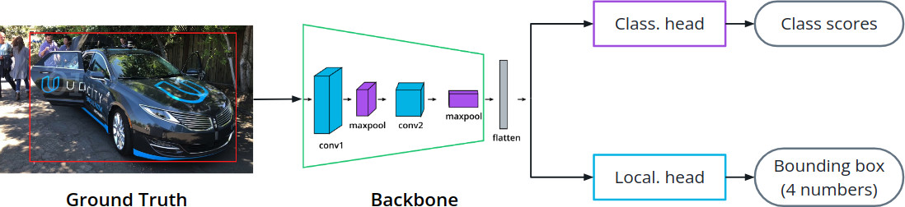
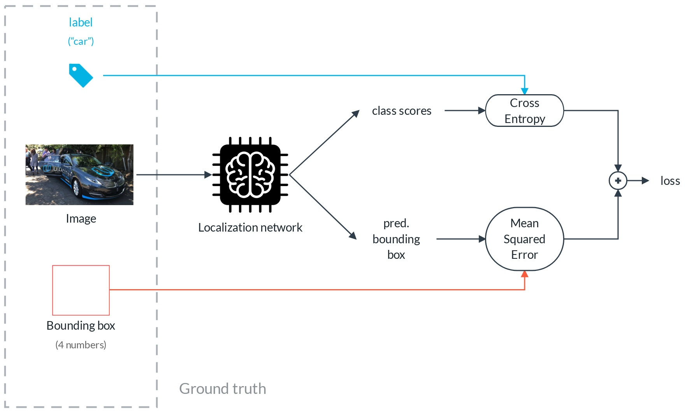
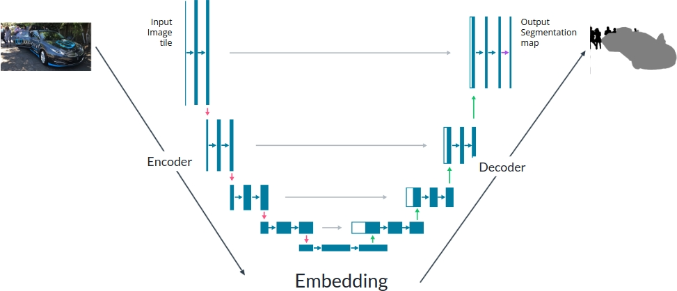

# C-5: Object Detection and Segmentation

1. Computer Vision Task Hierarchy
    - Image classification vs. localization vs. detection vs. segmentation
2. Object Localization
    - Multi-head architecture
    - Loss functions
    - Bounding box representations
3. Object Detection Fundamentals
    - One-stage vs. two-stage detection
    - Anchor-based approaches
    - RetinaNet architecture
    - Feature Pyramid Networks
    - Focal Loss
4. Object Detection Evaluation
    - Precision and Recall
    - Intersection over Union (IoU)
    - Mean Average Precision (mAP)
    - Mean Average Recall (mAR)
5. Semantic Segmentation
    - UNet architecture
    - Skip connections
    - Dice Loss

#### Computer Vision Task Hierarchy

Computer vision encompasses a spectrum of increasingly complex tasks, each building upon the capabilities of simpler
ones while adding new dimensions of spatial understanding. This hierarchy forms a progression from basic image-level
classification to detailed pixel-wise comprehension, with each level requiring more sophisticated architectural
approaches and presenting unique challenges.

##### Image Classification

At the foundation of computer vision lies image classification—the task of assigning one or more labels to an entire
image based on its visual content. This represents the most basic form of image understanding.

###### Key Characteristics

In image classification, the model answers a fundamental question: "What is in this image?" The output is a set of class
probabilities or scores indicating the likelihood that the image contains instances of different categories. For
example, an image might be classified as containing a "dog" with 95% confidence and a "cat" with 2% confidence.

The architectural approach typically involves:

- A convolutional neural network backbone that extracts hierarchical features
- A global pooling layer that aggregates spatial information
- One or more fully connected layers that map these features to class scores

Classification networks learn to identify patterns that distinguish different categories, regardless of where these
patterns appear in the image. This spatial invariance is both a strength—allowing the network to recognize objects
regardless of their position—and a limitation, as it discards potentially valuable location information.

###### Limitations

While powerful, image classification has significant limitations:

- It provides no spatial information about object locations
- It cannot differentiate between multiple instances of the same class
- It struggles with images containing multiple distinct objects
- It gives no information about object shapes or boundaries

For example, a classification model might correctly identify that an image contains both a cat and a dog, but cannot
tell you where each animal is located or how many of each are present. These limitations motivate the progression to
more spatially-aware vision tasks.

##### Object Localization

Object localization extends classification by not only identifying what is in an image but also where the primary object
is located. It bridges the gap between image-level and object-level understanding.

###### Key Characteristics

In object localization, the model answers both "what" and "where" questions but focuses solely on the most prominent
object in the image. The output includes:

- A class label (or class probabilities)
- A bounding box defined by four coordinates that enclose the object

This task usually employs a multi-head architecture where:

- One head handles classification (identical to image classification)
- A parallel head predicts the bounding box coordinates

figure: Multi-head architecture for object localization showing backbone and two heads

The mathematical formulation for the bounding box prediction typically takes one of two forms:

1. **Corner format**: $[x_{min}, y_{min}, x_{max}, y_{max}]$ specifying the top-left and bottom-right corners
2. **Center format**: $[x_{center}, y_{center}, width, height]$ specifying the center point and dimensions

The loss function combines classification loss (typically cross-entropy) with a regression loss for bounding box
prediction (such as mean squared error or smooth L1 loss):

$$L_{total} = L_{classification} + \lambda \cdot L_{localization}$$

Where $\lambda$ balances the importance of the two tasks.

###### Limitations

While more spatially aware than classification, object localization still has constraints:

- It typically handles only a single dominant object per image
- It cannot address scenes with multiple objects of interest
- It provides only a rectangular approximation of the object's location, not its exact shape

These limitations become apparent in complex scenes. For example, a localization model might identify and locate the
most prominent dog in an image containing multiple dogs, but would ignore the others entirely.

##### Object Detection

Object detection represents a significant leap in complexity by identifying and localizing all objects of interest
within an image, regardless of their number or class.

###### Key Characteristics

In object detection, the model must simultaneously:

- Identify all instances of objects from known classes
- Predict accurate bounding boxes for each instance
- Handle variable numbers of objects across different images

The output consists of a list of detected objects, each with:

- A class label
- A confidence score
- A bounding box

Object detection architectures generally fall into two categories:

1. **Two-stage detectors** like R-CNN variants that first propose regions of interest, then classify them
2. **One-stage detectors** like YOLO and RetinaNet that predict classes and bounding boxes in a single forward pass

Both approaches must address the challenge of predicting objects at different scales and aspect ratios, typically
through techniques like:

- Anchor boxes (predefined boxes of different shapes)
- Feature pyramid networks (multi-scale feature representations)
- Non-maximum suppression (removing redundant detections)

The mathematical representation of detection outputs is more complex than previous tasks. For an image with $n$ detected
objects, the output would be:

$${(c_1, s_1, b_1), (c_2, s_2, b_2), ..., (c_n, s_n, b_n)}$$

Where for each detection $i$:

- $c_i$ is the class label
- $s_i$ is the confidence score
- $b_i$ is the bounding box coordinates

###### Limitations

While powerful, object detection still has constraints:

- It provides only rectangular bounding boxes, not precise object shapes
- It cannot distinguish between touching or overlapping instances of the same class
- It operates at the object level rather than the pixel level

For example, when people stand close together in a crowd, detection models might struggle to separate individuals
accurately, as their bounding boxes will overlap significantly.

##### Semantic Segmentation

Semantic segmentation elevates vision understanding to the pixel level by classifying every pixel in an image according
to the object or region it belongs to.

###### Key Characteristics

In semantic segmentation, the model creates a dense, pixel-wise classification map where:

- Each pixel is assigned to exactly one class
- The output has the same spatial dimensions as the input image
- The prediction preserves the exact shape and boundaries of objects

Mathematically, for an image of height $H$ and width $W$ with $C$ possible classes, the output is a tensor of shape
$H \times W$ where each element takes a value in ${1, 2, ..., C}$ representing the predicted class for that pixel.

The typical architecture follows an encoder-decoder structure:

- The encoder progressively reduces spatial dimensions while increasing feature depth
- The decoder recovers spatial information while reducing feature depth
- Skip connections often link corresponding encoder and decoder levels to preserve fine details

Common architectures include U-Net, FCN (Fully Convolutional Networks), and DeepLab variants.

###### Limitations

While offering pixel-perfect classification, semantic segmentation cannot distinguish between separate instances of the
same class—all "person" pixels are labeled identically, regardless of whether they belong to one person or many.

This limitation is particularly evident in crowd scenes, where semantic segmentation would correctly identify all
"person" pixels but would not separate different individuals from each other.

##### Instance Segmentation

At the apex of the computer vision task hierarchy, instance segmentation combines the instance-awareness of object
detection with the pixel-precision of semantic segmentation.

###### Key Characteristics

Instance segmentation requires the model to:

- Identify each individual object instance
- Classify each instance according to its class
- Precisely delineate the pixels belonging to each instance

This allows separate treatment of distinct objects from the same class—identifying not just "three people" but "person
1, person 2, and person 3," each with their exact pixel mask.

Mathematically, the output for an image with $n$ objects is:

$${(c_1, s_1, m_1), (c_2, s_2, m_2), ..., (c_n, s_n, m_n)}$$

Where for each instance $i$:

- $c_i$ is the class label
- $s_i$ is the confidence score
- $m_i$ is a binary mask of shape $H \times W$ where 1 indicates pixels belonging to the instance

Popular architectures include:

- Mask R-CNN, which extends Faster R-CNN with a parallel branch for mask prediction
- YOLACT, which combines one-stage detection with prototype masks

Instance segmentation represents the most complete form of scene understanding among these tasks, offering both what and
where information at the finest possible granularity.

##### Progression of Complexity

The hierarchy of computer vision tasks represents a progression along multiple dimensions:

1. **Spatial granularity**: From image-level (classification) to object-level (detection) to pixel-level (segmentation)
2. **Output complexity**: From simple class labels to multiple coordinates to dense pixel maps
3. **Instance awareness**: From class-only to individual object instances
4. **Computational demands**: Increasing computational requirements at each level

This progression mirrors how humans process visual information—first recognizing what we're looking at broadly, then
identifying specific objects, and finally understanding precise boundaries and relationships between elements.

Understanding this hierarchy helps in selecting the appropriate technique for a given application based on the required
level of detail and available computational resources. For example:

- Photo organization might need only classification to sort images by content
- Autonomous vehicles require detection to identify and locate road users
- Medical image analysis often needs segmentation to precisely delineate anatomical structures

Each level in this hierarchy builds upon the previous one, with advances in foundational tasks like classification often
translating to improvements across the entire spectrum of computer vision capabilities.

#### Object Localization

Object localization represents a crucial step beyond basic image classification, adding spatial awareness to neural
networks by teaching them not only what is in an image but precisely where the primary object is located. This spatial
dimension transforms networks from simple categorizers into systems that can begin to understand the physical layout of
scenes.

##### Multi-Head Architecture

The multi-head architecture forms the foundation of object localization, enabling networks to simultaneously solve
classification and localization tasks through a shared understanding of the image.

###### Shared Feature Extraction

At the core of localization models is a shared feature extraction backbone that serves both classification and
localization tasks:

1. The backbone typically consists of a standard convolutional neural network architecture like ResNet, EfficientNet, or
   VGG that has been pre-trained on large image datasets.
2. This backbone processes the input image through multiple convolutional layers, gradually transforming raw pixels into
   increasingly abstract feature representations.
3. Early layers capture low-level features like edges and textures, while deeper layers develop representations of
   higher-level concepts like object parts.
4. Critically, these deeper representations retain some degree of spatial information—they "remember" where features
   appear in the image, unlike the fully-connected layers in pure classification networks.

The shared backbone allows the network to develop a unified understanding of image content that can inform both what is
present and where it's located, creating computational efficiency and promoting feature reuse.

###### Classification Head

Branching from the shared backbone, the classification head determines the object category:

1. The classification head typically begins with global average pooling, which collapses the spatial dimensions of
   feature maps into a single feature vector.

2. This vector then passes through one or more fully-connected layers, gradually mapping the abstract features to class
   probabilities.

3. The final layer applies a softmax activation to produce a probability distribution across object classes:

    $$P(c_i|I) = \frac{e^{z_i}}{\sum_{j=1}^{C} e^{z_j}}$$

    Where $z_i$ is the logit for class $i$ and $C$ is the total number of classes.

This head operates almost identically to the final layers in a standard classification network, focusing purely on the
"what" question without regard to location.

###### Localization Head

In parallel with the classification head, the localization head specializes in determining the object's spatial
position:

1. Unlike the classification head, the localization head must preserve spatial information, either by:
    - Avoiding global pooling entirely and maintaining feature map dimensions
    - Using fully-connected layers but with fewer flattening operations
    - Employing convolutional layers that maintain spatial awareness
2. The head terminates in a regression layer with typically four neurons corresponding to the bounding box coordinates.
3. These coordinates may use various formats (discussed further in the bounding box representations section), but all
   encode the spatial extent of the object.

The localization head learns to translate the abstract feature representations from the backbone into concrete spatial
coordinates within the original image space. This translation requires the network to develop a sense of scale,
proportion, and spatial relationships.

figure: Sliding window approach for object detection

###### Forward Pass Operation

During inference, the object localization network processes images through a streamlined flow:

1. The input image passes through the shared backbone, generating feature maps that contain both semantic and spatial
   information.
2. These feature maps simultaneously feed into both the classification and localization heads.
3. The classification head produces a vector of class probabilities, typically selecting the highest-scoring class as
   the prediction.
4. The localization head generates the four bounding box coordinates that enclose the primary object.
5. The final output combines these results: a class label with associated confidence score and a bounding box specifying
   where the object appears in the image.

This parallel processing allows the network to answer both "what" and "where" questions in a single forward pass,
delivering much richer information than classification alone.

##### Loss Functions

Training an object localization network requires carefully designed loss functions that can simultaneously optimize both
the classification accuracy and the spatial precision of bounding boxes.

###### Combined Loss Formulation

The overall training objective for object localization typically takes the form of a weighted sum combining
classification and localization components:

$$\mathcal{L}*{total} = \mathcal{L}*{cls} + \lambda \cdot \mathcal{L}_{loc}$$

Where:

- $\mathcal{L}_{cls}$ represents the classification loss
- $\mathcal{L}_{loc}$ represents the localization (bounding box regression) loss
- $\lambda$ is a weighting hyperparameter that balances the relative importance of these components

This multi-task learning approach allows joint optimization of both capabilities while controlling their relative
influence on network updates during training.

###### Classification Loss

For the classification component, cross-entropy loss (or negative log-likelihood) is the standard choice:

$$\mathcal{L}*{cls} = -\sum*{i=1}^{C} y_i \log(\hat{y}_i)$$

Where:

- $y_i$ is 1 if $i$ is the correct class and 0 otherwise (one-hot encoding)
- $\hat{y}_i$ is the predicted probability for class $i$
- $C$ is the number of classes

For a single image with one true class $c$, this simplifies to:

$$\mathcal{L}_{cls} = -\log(\hat{y}_c)$$

This loss penalizes the network when it assigns low probability to the correct class, encouraging confident and accurate
classifications. The logarithmic scale ensures that even small improvements in already high probabilities continue to
reduce the loss, pushing toward extremely confident predictions for clear cases.

###### Localization Loss

For bounding box regression, several loss functions are commonly used, each with distinct properties:

1. **Mean Squared Error (MSE)** is the simplest approach:

    $$\mathcal{L}*{loc} = \frac{1}{4}\sum*{i=1}^{4}(b_i - \hat{b}_i)^2$$

    Where $b_i$ represents the ground truth coordinates and $\hat{b}_i$ represents the predicted coordinates.

    MSE penalizes all coordinate errors equally, with the squared term causing large errors to be penalized
    disproportionately more than small ones.

2. **Smooth L1 Loss** (or Huber Loss) combines the best properties of L1 and L2 norms:

    $$\mathcal{L}_{smooth_L1}(x) = \begin{cases} 0.5x^2 & \text{if } |x| < 1 \ |x| - 0.5 & \text{otherwise} \end{cases}$$

    Where $x = b_i - \hat{b}_i$ for each coordinate.

    This loss behaves like MSE for small errors (providing stable gradients near the minimum) but like absolute error
    for large errors (being more robust to outliers and preventing exploding gradients).

3. **IoU Loss** directly optimizes the Intersection over Union metric:

    $$\mathcal{L}_{IoU} = 1 - \frac{|B \cap \hat{B}|}{|B \cup \hat{B}|}$$

    Where $B$ is the ground truth box and $\hat{B}$ is the predicted box.

    Unlike coordinate-based losses, IoU loss is scale-invariant and directly optimizes the evaluation metric used to
    assess localization quality.

The choice of localization loss significantly impacts the model's behavior, with coordinate-based losses like MSE being
simpler to implement but geometric losses like IoU often producing better localization results.

###### Loss Balancing

The hyperparameter $\lambda$ in the combined loss plays a crucial role in training dynamics:

1. If $\lambda$ is too small, the network might excel at classification but produce poor bounding boxes, as the
   localization component contributes little to the overall gradient.
2. If $\lambda$ is too large, localization accuracy might improve at the expense of classification performance,
   potentially resulting in precisely localized but incorrectly identified objects.
3. The optimal value depends on several factors:
    - The relative scales of the raw losses
    - The relative difficulty of the classification and localization tasks
    - The specific application priorities

In practice, values between 1 and 10 serve as common starting points, with careful tuning based on validation
performance. Some implementations dynamically adjust this weight during training, starting with a focus on
classification and gradually increasing the importance of localization.

###### Handling Missing Annotations

In some datasets, not all images contain bounding box annotations. To handle this scenario, the loss function must be
modified:

$$\mathcal{L}*{total} = \mathcal{L}*{cls} + \lambda \cdot \mathbf{1}*{has_box} \cdot \mathcal{L}*{loc}$$

Where $\mathbf{1}_{has_box}$ is an indicator function that equals 1 when the image has a bounding box annotation and 0
otherwise. This formulation allows the network to learn from all available data, even when only partial annotations are
available.

##### Bounding Box Representations

The way bounding boxes are represented significantly impacts both network training and prediction quality, with
different formats offering distinct advantages for different contexts.

###### Coordinate Formats

Two primary formats exist for representing rectangular bounding boxes:

1. **Corner format** specifies the top-left and bottom-right corners of the box:
   $$[x_{min}, y_{min}, x_{max}, y_{max}]$$

    This format directly describes the box boundaries in absolute pixel coordinates. It's intuitive for visualization
    and implementation of operations like intersection calculations, but it can be sensitive to scale and less natural
    for regression.

2. **Center format** specifies the center point, width, and height of the box:
   $$[x_{center}, y_{center}, width, height]$$

    This parameterization focuses on the box's central point and dimensions rather than its extremities. It often
    provides more stable gradients during training, as the center of an object typically varies less than its boundaries
    when the object moves slightly.

Each format has advantages in different contexts, with center format generally preferred for regression tasks due to its
better learning dynamics and more natural modeling of object position.

###### Coordinate Normalization

Raw pixel coordinates can cause training instability due to their potentially large and variable ranges across different
image sizes. To address this, coordinates are typically normalized:

1. **Image-relative normalization** divides all coordinates by the image dimensions:
   $$\left[\frac{x}{W}, \frac{y}{H}, \frac{w}{W}, \frac{h}{H}\right]$$

    Where $W$ and $H$ are the width and height of the image.

    This transforms all coordinates to the range [0,1], making the representation invariant to image size and improving
    numeric stability during training.

2. **Feature map normalization** expresses coordinates relative to the feature map from which they're predicted:
   $$\left[\frac{x}{W_{feat}}, \frac{y}{H_{feat}}, \frac{w}{W_{feat}}, \frac{h}{H_{feat}}\right]$$

    This is particularly relevant in fully convolutional networks where predictions are made at the feature map level.

Normalization ensures that coordinate values remain within a reasonable and consistent range regardless of image
dimensions, improving both training stability and generalization across different image sizes.

###### Parameterized Regression Targets

Rather than directly predicting absolute coordinates, more sophisticated localization systems often predict transforms
relative to reference points or boxes:

1. **Grid cell-relative coordinates**: In grid-based approaches like YOLO, predictions are made relative to the grid
   cell position: $$[t_x, t_y, t_w, t_h]$$

    Where $t_x$ and $t_y$ are offsets from the grid cell top-left corner (often normalized to [0,1] within the cell),
    and $t_w$ and $t_h$ are scaling factors relative to the image size.

2. **Anchor-relative coordinates**: In anchor-based systems, predictions are made as transforms to pre-defined anchor
   boxes: $$[t_x, t_y, t_w, t_h]$$

    These transforms are applied to convert the anchor box $(x_a, y_a, w_a, h_a)$ to the predicted box:
    $$x = x_a + t_x \cdot w_a$$ $$y = y_a + t_y \cdot h_a$$ $$w = w_a \cdot e^{t_w}$$ $$h = h_a \cdot e^{t_h}$$

    The exponential function for width and height ensures that predictions remain positive regardless of the transform
    values.

These parameterized approaches simplify the regression problem by making predictions relative to meaningful reference
points, often improving training stability and accuracy.

###### Box Encoding and Decoding

The process of converting between different box representations is a critical component of localization systems:

1. **Encoding** transforms ground truth boxes into the target format expected by the network during training. For
   anchor-based systems, this involves calculating the transforms needed to convert anchors into ground truth boxes.
2. **Decoding** applies predicted transforms to reference points or boxes to obtain the final predicted bounding boxes
   during inference.

These operations must be carefully implemented with matching inverse relationships to ensure consistency between
training and inference. Many object localization failures can be traced to mismatches in these encoding/decoding
operations.

###### Boundary Constraints

Practical implementations often include constraints on box predictions to ensure they remain valid:

1. **Coordinate clamping**: Ensuring that $x_{min} < x_{max}$ and $y_{min} < y_{max}$ by applying min/max operations
2. **Boundary clamping**: Ensuring that coordinates remain within image boundaries (0 to image width/height)
3. **Minimum size enforcement**: Preventing predictions of extremely small boxes that might be unstable

These constraints can be applied both during training (affecting gradient computation) and during inference (ensuring
valid final outputs).

Object localization serves as both a practical capability in its own right and a foundational component for more complex
vision tasks like object detection. By understanding the multi-head architecture, loss function design, and bounding box
representation options, we gain insight into how deep learning bridges the gap between recognizing objects and
understanding their spatial presence in the visual world. The techniques developed for object localization provide the
critical building blocks upon which more advanced spatial reasoning tasks are constructed.

#### Object Detection Fundamentals

Object detection extends localization by identifying and localizing multiple objects of potentially different classes
within a single image. This capability forms the foundation for numerous real-world applications from autonomous driving
to medical imaging, retail analytics, and surveillance systems. Understanding the core principles, architectures, and
training approaches of object detection reveals how deep learning models can effectively process complex visual scenes
with multiple subjects of interest.

##### One-Stage vs. Two-Stage Detection

The object detection landscape is primarily divided into two architectural paradigms, each representing fundamentally
different approaches to the detection process.

###### Two-Stage Detection Framework

Two-stage detectors decompose the detection problem into sequential steps, first identifying regions that might contain
objects and then classifying those regions:

1. **Region Proposal Generation** (First Stage):

    This initial stage scans the image to identify potential object locations regardless of their class:

    - Traditional methods used classical computer vision techniques like selective search or edge box algorithms to
      generate proposals
    - Modern approaches like Region Proposal Networks (RPNs) use learned convolutional filters to propose regions
    - This stage typically generates 1,000-2,000 region proposals per image
    - Each proposal is a rectangular region that potentially contains an object

    The key insight is that region proposal separates the "where" question (are there objects here?) from the "what"
    question (what objects are they?), allowing each stage to specialize in its task.

2. **Classification and Refinement** (Second Stage):

    The second stage processes each proposal to determine its content and precise location:

    - Feature extraction from each proposal using ROI (Region of Interest) pooling or ROI Align
    - Classification of region contents (including a "background" class)
    - Refinement of the bounding box coordinates for more precise localization
    - In advanced models, additional tasks like instance mask prediction

    By focusing only on promising regions, this stage can apply more sophisticated analysis to each candidate area.

This family includes influential architectures like R-CNN (Regions with CNN features), Fast R-CNN, Faster R-CNN, and
Mask R-CNN, each representing evolutionary improvements to the two-stage paradigm.

The mathematical formulation for a two-stage detector can be expressed as:

1. Region proposals: ${R_1, R_2, ..., R_n} = f_{prop}(I)$
2. Classification and refinement: $(c_i, b_i) = f_{class}(R_i, I)$ for each proposal $R_i$

Where $I$ is the input image, $R_i$ are region proposals, $c_i$ are class predictions, and $b_i$ are refined bounding
boxes.

###### One-Stage Detection Framework

One-stage detectors tackle classification and localization simultaneously in a single forward pass, directly predicting
object locations and classes without a separate proposal stage:

1. They divide the image into a grid or use predefined anchor points distributed across the image
2. For each grid cell or anchor, they simultaneously predict:
    - Class probabilities (including background)
    - Bounding box coordinates or offsets from predefined anchors
    - Confidence scores indicating object presence

The key insight of one-stage detectors is that the region proposal step can be eliminated by densely sampling possible
object locations and directly classifying each potential location.

Mathematically, one-stage detectors can be expressed as:

${(c_1, b_1, s_1), (c_2, b_2, s_2), ..., (c_m, b_m, s_m)} = f_{detect}(I)$

Where $c_i$ are class predictions, $b_i$ are bounding boxes, and $s_i$ are confidence scores for each of the $m$
potential object locations examined by the detector.

Popular one-stage detectors include YOLO (You Only Look Once), SSD (Single Shot MultiBox Detector), and RetinaNet.

###### Comparative Analysis

Each approach offers distinct advantages and limitations that make them suitable for different applications:

**Two-Stage Strengths**:

- Generally higher detection accuracy, especially for small objects
- More flexible region processing allowing specialized analysis of each region
- Better handling of object overlaps and complex scenes
- Typically achieves higher maximum accuracy on benchmark datasets

**Two-Stage Limitations**:

- Slower inference speed due to sequential processing of regions
- More complex architecture and training process
- Higher computational and memory requirements
- Often too slow for real-time applications

**One-Stage Strengths**:

- Significantly faster inference speeds, often suitable for real-time applications
- Simpler architectural design with fewer components
- End-to-end training without intermediate steps
- More suitable for edge devices and mobile applications

**One-Stage Limitations**:

- Historically lower accuracy, especially before innovations like Focal Loss
- Class imbalance challenges with excessive background examples
- Less effective at detecting small objects and dense clusters of objects
- Fixed grid or anchor design may not optimally capture all object configurations

The evolution of both paradigms has led to a convergence in recent years, with one-stage detectors approaching the
accuracy of two-stage detectors while maintaining their speed advantage. The choice between paradigms now often involves
more nuanced consideration of specific application requirements.

##### Anchor-Based Approaches

Anchors serve as reference bounding boxes that enable detectors to handle objects of varying scales and aspect ratios
efficiently. This approach revolutionized object detection by providing a structured way to predict objects of different
shapes and sizes.

###### Anchor Fundamentals

Anchors are predefined bounding boxes with specific:

- Positions across the image (typically arranged in a regular grid)
- Scales (sizes relative to the image or feature map)
- Aspect ratios (height-to-width proportions)

They function as spatial "hypotheses" or "priors" from which the network predicts adjustments, rather than predicting
box coordinates from scratch. This dramatically simplifies the regression problem and stabilizes training.

For example, instead of predicting that a person is located at coordinates [100, 200, 150, 400], the network might
predict that "the anchor at position (10, 20) should be shifted slightly right and made taller to fit this person."

###### Anchor Generation Process

The process for generating a comprehensive set of anchors typically involves:

1. **Grid Definition**: The input image or feature maps are divided into a regular grid (e.g., 8×8, 16×16, or 32×32
   cells depending on the model)
2. **Anchor Placement**: Anchors are centered at each grid cell or at regularly spaced positions across the feature maps
3. **Scale Variation**: Multiple scales are used at each position to capture objects of different sizes:
    - Small scales for detecting small objects (e.g., 32×32 pixels)
    - Medium scales for average-sized objects (e.g., 96×96 pixels)
    - Large scales for big objects (e.g., 288×288 pixels)
4. **Aspect Ratio Variation**: Different height-width ratios accommodate various object shapes:
    - Square (1:1) for objects like faces or traffic signs
    - Landscape (e.g., 1:2) for horizontally extended objects like cars or trains
    - Portrait (e.g., 2:1) for vertically extended objects like pedestrians

A typical configuration might include 3 scales and 3 aspect ratios, resulting in 9 anchors per grid position. For a
feature map of size 50×50, this would create 22,500 anchors in total, densely covering possible object locations, sizes,
and shapes.

###### Prediction Mechanism

For each anchor, the network predicts:

1. **Classification scores**: Probabilities for each object class plus background
    - $p(c|A_i)$ for each class $c$ and anchor $A_i$
2. **Bounding box refinements**: Offsets that transform the anchor into a precise object boundary
    - Typically parameterized as transforms $(t_x, t_y, t_w, t_h)$ relative to the anchor

The transformation from anchor to predicted box typically follows:

$$x = x_a + w_a \cdot t_x$$ $$y = y_a + h_a \cdot t_y$$ $$w = w_a \cdot e^{t_w}$$ $$h = h_a \cdot e^{t_h}$$

Where $(x_a, y_a, w_a, h_a)$ are anchor parameters and $(t_x, t_y, t_w, t_h)$ are predicted transformations.

This parameterization ensures that:

- Center shifts are scaled relative to the anchor size (larger anchors can have larger absolute shifts)
- Width/height adjustments use exponential functions to ensure positive values
- The network can focus on learning relatively small adjustments rather than absolute coordinates

###### Training Assignment

During training, anchors must be assigned to ground truth objects to create training targets:

1. **Positive assignment**: Anchors with high Intersection over Union (IoU) with a ground truth box (typically IoU >
   0.7) become positive examples
    - These anchors are assigned the class of the overlapping ground truth
    - They receive regression targets to transform them to match the ground truth box exactly
2. **Negative assignment**: Anchors with low IoU to all ground truth boxes (typically IoU < 0.3) become negative
   (background) examples
    - These anchors are assigned to the background class
    - They receive no regression targets
3. **Ignored anchors**: Anchors in the ambiguous middle range (e.g., 0.3 < IoU < 0.7) are typically ignored during
   training
    - Neither classification nor regression loss is computed for these anchors

This assignment process creates the training targets for both classification and regression, effectively translating the
human-annotated boxes into the network's anchor-based prediction space.

###### Anchor Design Impact

The design of the anchor set significantly influences detector performance:

1. **Coverage**: Anchors must adequately cover the possible space of object sizes and shapes in the dataset
    - Too few anchors or poorly chosen sizes/ratios may miss objects with unusual shapes
    - Statistical analysis of the training set is often used to select anchor parameters
2. **Efficiency**: More anchors increase computational cost and memory requirements
    - Too many anchors also increase training difficulty due to extreme class imbalance
    - Finding the minimum set that provides good coverage is important
3. **Scale distribution**: Different feature map levels typically use different anchor scales
    - Deeper (more abstract) feature maps with larger receptive fields handle larger anchors
    - Shallower feature maps with higher resolution handle smaller anchors

Modern approaches often use dataset analysis to determine optimal anchor configurations, sometimes dynamically adjusting
anchors based on dataset statistics rather than using fixed configurations.

##### RetinaNet Architecture

RetinaNet represents a breakthrough one-stage detector that combines architectural innovations with a novel loss
function to achieve state-of-the-art performance. Introduced in 2017 by Lin et al., it demonstrated that one-stage
detectors could match or exceed the accuracy of two-stage detectors while maintaining their speed advantage.

figure: RetinaNet architecture combining FPN with focal loss for object detection

###### Architectural Overview

RetinaNet follows a clear architectural structure with three main components:

1. **Backbone Network**: Typically ResNet with Feature Pyramid Network integration
    - Extracts features at multiple scales from the input image
    - Provides rich, multi-scale feature representations
2. **Classification Subnet**: Predicts class probabilities for each anchor
    - Operates on each level of the feature pyramid
    - Shares weights across all pyramid levels
3. **Box Regression Subnet**: Predicts bounding box refinements for each anchor
    - Parallels the classification subnet structure
    - Also shares weights across pyramid levels

This design maintains the speed advantages of one-stage detectors while addressing their historical accuracy limitations
through better feature extraction and the novel Focal Loss function.

###### Backbone: ResNet with FPN

The backbone of RetinaNet consists of:

1. **ResNet**: Usually ResNet-50 or ResNet-101 for deeper feature extraction
    - The residual connections help train deeper networks effectively
    - Pre-training on ImageNet provides general visual feature extraction capabilities
2. **Feature Pyramid Network**: Built on top of ResNet to create multi-scale features
    - Combines high-resolution features with semantically strong features
    - Creates a pyramid of feature maps at different scales
    - Enables effective detection of objects at vastly different sizes

The backbone produces a set of feature maps {P₃, P₄, P₅, P₆, P₇}, where:

- P₃ has the highest resolution (1/8 of input) but simpler features
- P₇ has the lowest resolution (1/128 of input) but the most semantic features
- Each level has a fixed channel dimension (typically 256)

###### Classification Subnet

The classification subnet processes each level of the feature pyramid to predict object classes:

1. Structure:
    - Four 3×3 convolutional layers with 256 filters each, followed by ReLU activations
    - Shared weights across all pyramid levels
    - A final 3×3 convolutional layer with K·A filters, where:
        - K is the number of classes
        - A is the number of anchors per location
2. Output:
    - For each spatial location at each pyramid level, produces K·A values
    - These values are reshaped and processed with sigmoid activation to get per-class probabilities
    - Unlike softmax classification, sigmoid enables multi-label detection (objects can belong to multiple classes)

The shared weights across pyramid levels ensure consistent feature interpretation regardless of scale, while the
convolutional structure maintains spatial awareness throughout the subnet.

###### Box Regression Subnet

The box regression subnet mirrors the classification subnet's structure to predict bounding box coordinates:

1. Structure:
    - Four 3×3 convolutional layers with 256 filters each, followed by ReLU activations
    - Shared weights across all pyramid levels
    - A final 3×3 convolutional layer with 4·A filters (4 coordinates for each anchor)
2. Output:
    - For each spatial location at each pyramid level, produces 4·A values
    - These values represent the transforms (tx, ty, tw, th) to apply to the corresponding anchors
    - No activation function is applied, allowing unbounded regression outputs

Like the classification subnet, the regression subnet maintains spatial awareness and consistent feature interpretation
across scales.

###### Anchor Assignment Strategy

RetinaNet uses a scale-dependent anchor assignment strategy:

1. Each pyramid level is responsible for detecting objects of a specific scale range:
    - P₃ handles small objects
    - P₄ handles medium-small objects
    - P₅ handles medium objects
    - P₆ handles medium-large objects
    - P₇ handles large objects
2. Anchors are assigned to pyramid levels based on their scale:
    - Base anchor sizes increase by a factor of 2 between consecutive levels (32, 64, 128, 256, 512)
    - Each level uses 3 aspect ratios: 1:2, 1:1, and 2:1
    - 3 octave scales are applied at each level: 2⁰, 2¹/³, and 2²/³
    - This creates 9 anchors per feature location (3 ratios × 3 scales)

This assignment strategy ensures that objects are detected at the appropriate feature level where they have the most
suitable resolution and feature semantics.

###### Inference Process

During inference, RetinaNet follows these steps:

1. Process the input image through the backbone network to generate multi-scale feature maps
2. Apply the classification and regression subnets to each level of the feature pyramid
3. For each of the ~100,000 anchor boxes:
    - Compute class probabilities using the classification subnet outputs
    - Apply predicted transforms to the anchor box
4. Filter detections using:
    - Confidence thresholding (typically 0.05) to remove low-confidence predictions
    - Non-maximum suppression (NMS) to remove duplicate detections
5. Return the top-N scoring detections after filtering (typically N=100)

This process efficiently identifies and localizes multiple objects across a range of scales in a single forward pass.

##### Feature Pyramid Networks

Feature Pyramid Networks (FPN) provide a structured approach to multi-scale feature extraction, addressing the
fundamental challenge of detecting objects across different scales—from tiny to massive—within the same image.

###### The Scale Challenge in Object Detection

Before FPN, object detectors struggled with multi-scale detection in several ways:

1. **Image Pyramid Approach**: Running the detector on multiple rescaled versions of the input image
    - Effective but extremely computationally expensive
    - Requires multiple forward passes and significantly increases inference time
    - Memory inefficient, especially for large images
2. **Single Feature Map Approach**: Using only the final feature map from a CNN
    - Efficient but struggles with small objects due to limited resolution
    - Large objects might exceed the receptive field size
3. **Feature Hierarchy Approach**: Using different layers from the CNN backbone directly
    - More efficient than image pyramids
    - Limited by semantic gaps between shallow and deep features
    - Lower layers had fine resolution but weak semantics; higher layers had strong semantics but poor resolution

figure: Feature Pyramid Network (FPN) architecture for multi-scale feature extraction

FPN solves these challenges by creating a hierarchy of feature maps that each have both strong semantics and appropriate
resolution.

###### FPN Architecture

FPN combines the best aspects of previous approaches through a two-pathway structure:

1. **Bottom-up Pathway**: The traditional CNN forward pass
    - Progressively reduces spatial dimensions through pooling or strided convolutions
    - Increases semantic information through deeper layers
    - Creates a hierarchy of feature maps at different scales (typically labeled C₂ through C₅ in a ResNet backbone)
2. **Top-down Pathway**: Upsampling of higher-level features
    - Starts from the semantically strongest features at the top (C₅)
    - Progressively upsamples to recover spatial resolution
    - Creates feature maps matching the scales of the bottom-up pathway (labeled P₅ through P₂)
3. **Lateral Connections**: Connect corresponding levels between pathways
    - Feature maps from the bottom-up pathway are combined with upsampled features
    - Typically implemented as 1×1 convolutions followed by element-wise addition
    - Enriches upsampled features with spatial information from earlier layers

The mathematical formulation for creating the FPN feature maps is:

$$P_i = \text{Conv}*{1\times1}(C_i) + \text{Upsample}(P*{i+1})$$

Where:

- $C_i$ is the feature map from level $i$ of the bottom-up pathway
- $P_i$ is the corresponding output feature map of the FPN
- $\text{Conv}_{1\times1}$ is a 1×1 convolutional layer that adjusts channel dimensions
- $\text{Upsample}$ is typically nearest-neighbor upsampling by a factor of 2

###### Feature Map Properties

The combined process generates a set of feature maps {P₂, P₃, P₄, P₅} with the following characteristics:

1. **Uniform Semantics**: Each level contains strong semantic information, regardless of resolution
    - This is achieved by the top-down flow of semantically rich features
2. **Uniform Channel Dimensions**: Each level has the same channel dimension (typically 256)
    - This creates consistency across levels and simplifies subsequent processing
3. **Multi-scale Representation**: Each level has a spatial resolution corresponding to its hierarchy level
    - Typically P₂ is 1/4 scale, P₃ is 1/8 scale, P₄ is 1/16 scale, and P₅ is 1/32 scale
    - This provides appropriate resolution for detecting objects of corresponding sizes
4. **Enriched Features**: Each level contains both high-level semantic information and appropriate spatial detail
    - High-level information flows top-down
    - Spatial detail is injected through lateral connections

These properties make the resulting feature maps ideal for detecting objects at their corresponding scales.

###### Implementation Details

A typical FPN implementation includes these specific steps:

1. **Backbone Feature Selection**: Choose feature maps from different stages of the backbone network
    - For ResNet, these are typically the outputs of each residual stage (conv2 through conv5, labeled C₂ through C₅)
    - Each successive map has half the spatial dimensions of the previous one
2. **Lateral Connections**: Apply 1×1 convolutions to each backbone feature map
    - This adjusts channel dimensions to a common value (typically 256)
    - It also learns to select the most relevant features from each level
3. **Top-down Processing**: Starting from the highest level (smallest spatial dimensions):
    - Upsample the higher-level feature map (typically using nearest-neighbor upsampling by a factor of 2)
    - Add the upsampled map to the laterally-connected feature map at the current level
    - Continue this process down through all levels
4. **Final Adjustments**: Apply 3×3 convolutions to each merged feature map
    - This reduces aliasing effects from upsampling
    - It also integrates information from both pathways more effectively
5. **Extra Levels (Optional)**: For detecting very large objects, additional levels can be created
    - P₆ can be created by applying a stride-2 convolution to P₅
    - P₇ can be created by applying ReLU followed by another stride-2 convolution

This implementation creates a feature pyramid that effectively captures multi-scale information with relatively low
computational overhead.

###### Benefits in Object Detection

FPN provides several key benefits that have made it a standard component in modern detectors:

1. **Scale Invariance**: Objects of different sizes can be detected with similar accuracy
    - Small objects are detected using high-resolution features (e.g., P₂ or P₃)
    - Large objects are detected using features with larger receptive fields (e.g., P₄ or P₅)
2. **Computational Efficiency**: Achieves multi-scale detection without the cost of image pyramids
    - A single forward pass produces features at all scales
    - Much more efficient than processing multiple scaled versions of the input
3. **Feature Quality**: Each level combines the advantages of deep and shallow features
    - Deep semantic information from higher levels
    - Precise spatial information from lower levels
4. **Training Stability**: The lateral connections create shorter paths for gradient flow
    - This improves backpropagation to early layers
    - Results in more stable training dynamics

These benefits have made FPN a cornerstone technology in modern object detection, used not only in RetinaNet but adapted
for numerous other architectures.

##### Focal Loss

Focal Loss addresses a fundamental challenge in one-stage object detection: the extreme class imbalance between
foreground (object) and background examples during training.

###### Class Imbalance Problem

One-stage detectors face a severe imbalance challenge that two-stage detectors avoid through their region proposal
mechanism:

1. **Scale of Imbalance**: They typically evaluate 100,000+ candidate locations per image
    - Only a tiny fraction of these contain objects (often <100)
    - The vast majority (>99.9%) are easy-to-classify background examples
2. **Training Impact**: This creates several problems:
    - Easy negative examples dominate the gradient during training
    - The loss from the rare positive examples is overwhelmed
    - The network can achieve high accuracy by simply predicting "background" for everything
    - Training becomes inefficient as most updates come from easy examples
3. **Traditional Solutions**: Before Focal Loss, detectors used techniques like:
    - Hard negative mining (explicitly selecting difficult negatives)
    - Balanced sampling (using equal numbers of positive and negative examples)
    - These approaches were complex to implement and computationally inefficient

figure: Focal Loss function for addressing class imbalance in object detection

Focal Loss provides an elegant solution by automatically down-weighting easy examples, allowing the network to focus on
difficult cases.

###### Cross-Entropy Limitations

To understand Focal Loss, we must first identify the limitations of standard cross-entropy loss in imbalanced detection
scenarios.

For binary classification (object vs. background), the standard cross-entropy loss is:

$$\text{CE}(p, y) = -y \log(p) - (1-y) \log(1-p)$$

Where:

- $y \in {0, 1}$ is the ground truth class (1 for object, 0 for background)
- $p \in [0, 1]$ is the model's estimated probability for the object class

For a well-classified example (high $p$ for positive examples, low $p$ for negative examples), this loss still assigns
non-negligible values. For instance:

- A background example correctly classified with 99.9% confidence ($p = 0.001$ when $y = 0$) still contributes
  $-\log(0.999) \approx 0.001$ to the loss
- With 100,000 such "easy" background examples, their collective contribution overwhelms the loss from the few object
  examples

This causes the network to focus on the sheer quantity of easy background examples rather than learning from the
important but rare object examples.

###### Focal Loss Formulation

Focal Loss modifies cross-entropy by adding a modulating factor that reduces the contribution of well-classified
examples:

$$\text{FL}(p_t) = -(1-p_t)^\gamma \log(p_t)$$

Where:

- $p_t$ is $p$ for positive examples ($y=1$) and $1-p$ for negative examples ($y=0$)
- $\gamma \geq 0$ is the focusing parameter that adjusts the rate at which easy examples are down-weighted

This can be written in terms of the model's output probability $p$ and the ground truth $y$ as:

$$\text{FL}(p, y) = \begin{cases} -(1-p)^\gamma \log(p) & \text{if } y = 1 \ -p^\gamma \log(1-p) & \text{if } y = 0 \end{cases}$$

This formulation has several key properties:

1. **Modulation Effect**: When an example is misclassified and $p_t$ is small, the modulating factor $(1-p_t)^\gamma$ is
   close to 1 and the loss is unaffected

2. **Down-weighting**: As $p_t$ increases (the example becomes easier to classify), the modulating factor decreases,
   reducing the contribution to the loss

3. Adjustable Focus

    : The parameter $\gamma$ controls how quickly easy examples are down-weighted:

    - When $\gamma = 0$, Focal Loss is equivalent to standard cross-entropy
    - As $\gamma$ increases, the effect of the modulating factor increases

The intuition is that easy examples (those with high $p_t$) contribute much less to the loss, allowing the model to
focus training on hard, misclassified examples.

###### Balanced Variant

In practice, an alpha-balanced version is often used to further address class imbalance:

$$\text{FL}(p_t) = -\alpha_t (1-p_t)^\gamma \log(p_t)$$

Where $\alpha_t$ is a weighting factor that can be set inversely proportional to class frequency:

- $\alpha$ for the positive (object) class
- $1-\alpha$ for the negative (background) class

Typical values include:

- $\gamma = 2$ for the focusing parameter
- $\alpha = 0.25$ for positive examples, giving them 3× more weight than negative examples

These settings effectively balance the contribution of positive and negative examples while focusing training on hard
examples of both classes.

###### Effect on Training Dynamics

Focal Loss transforms training dynamics in several ways:

1. **Focus on Hard Examples**: The modulating factor naturally focuses training on examples that the model currently
   misclassifies or finds difficult
    - This creates an automatic curriculum, with the model first learning easy patterns and progressively focusing on
      harder ones
2. **Addressing Class Imbalance**: By reducing the contribution of easy background examples, Focal Loss prevents them
   from overwhelming the loss from foreground examples
    - This allows training with all examples without needing to subsample the data
3. **Eliminating Complex Sampling**: It removes the need for hard negative mining or similar sampling strategies
    - The entire dataset can be used without manual example selection
4. **Dense Anchor Training**: It allows the use of a dense set of anchors without sampling or reweighting
    - This improves coverage of potential object locations and sizes

In practical terms, this makes training both simpler and more effective—the network automatically focuses its learning
capacity on the examples from which it has the most to learn.

###### Implementation and Practical Considerations

When implementing Focal Loss, several practical considerations improve performance:

1. **Initialization**: Special initialization is often used to prevent instability at the start of training
    - The final classification layer bias is initialized to give low initial predictions (e.g., $p \approx 0.01$)
    - This ensures that all examples are initially treated as hard examples
2. **Multi-class Extension**: For multi-class detection, Focal Loss is applied independently to each class
    - Binary cross-entropy is used for each class rather than softmax cross-entropy
    - This allows objects to belong to multiple classes if needed
3. **Hyperparameter Selection**: The focusing parameter $\gamma$ significantly impacts performance
    - Values between 0.5 and 5 are commonly explored
    - $\gamma = 2$ provides a good balance in most cases
    - Larger values focus more aggressively on hard examples but can lead to training instability
4. **Integration with Other Losses**: Focal Loss is applied to the classification component, while other losses (e.g.,
   smooth L1) are used for bounding box regression
    - The overall loss is a weighted sum of these components

By addressing the class imbalance problem directly in the loss function, Focal Loss enables one-stage detectors like
RetinaNet to achieve accuracy competitive with two-stage detectors while maintaining their speed advantage. This
innovation helped bridge the performance gap between the two detection paradigms and has been adapted for numerous
applications beyond object detection where class imbalance is a challenge.

#### Object Detection Evaluation

Evaluating object detection models requires specialized metrics that assess both localization accuracy and
classification performance simultaneously. Unlike simpler tasks like image classification where accuracy suffices,
object detection evaluation must account for the spatial component of predictions, handle multiple objects per image,
and address the confidence-based nature of modern detectors. A robust evaluation framework helps researchers and
practitioners compare different detection approaches objectively and identify areas for improvement.

##### Precision and Recall Fundamentals

Precision and recall form the foundational metrics for evaluating object detection performance, adapted from their
origins in information retrieval and binary classification to address the spatial aspects of detection.

###### Defining Detection Outcomes

In object detection, each prediction must be classified as correct or incorrect based on both class and location. This
creates four possible outcomes for each predicted box:

1. **True Positive (TP)**: A detection that correctly identifies an object with sufficient spatial overlap with the
   ground truth box. This means both the class prediction is correct and the predicted bounding box overlaps
   substantially with the ground truth box.
2. **False Positive (FP)**: A detection that is incorrect for one of two reasons:
    - It identifies the wrong object class
    - It identifies an object where none exists or with insufficient overlap with any ground truth
3. **False Negative (FN)**: A ground truth object that the detector fails to identify – either because no detection was
   proposed for that object or because the detections had incorrect class labels or insufficient overlap.
4. **True Negative (TN)**: Correctly not detecting an object where none exists. This category is rarely used in object
   detection evaluation because the number of possible negative regions in an image is essentially infinite.

Unlike in classification, determining whether a detection is correct requires spatial analysis through Intersection over
Union (IoU) thresholds, as well as class verification. A detection is typically considered a true positive only if:

- Its predicted class matches the ground truth class
- Its IoU with the ground truth box exceeds a threshold (commonly 0.5)

###### Precision Calculation

Precision measures the accuracy of positive predictions, answering: "Of all the objects the model detected, what
fraction were actually correct?"

$$\text{Precision} = \frac{\text{TP}}{\text{TP} + \text{FP}}$$

High precision indicates that when the model predicts an object, it's likely to be correct—the model makes few false
alarms. A precision of 0.8 means that 80% of the objects detected by the model were correct detections, while 20% were
incorrect.

Precision is particularly important in applications where false positives are costly or disruptive, such as security
systems, autonomous driving, or medical diagnostics.

###### Recall Calculation

Recall measures the completeness of positive predictions, answering: "Of all the actual objects in the images, what
fraction did the model detect?"

$$\text{Recall} = \frac{\text{TP}}{\text{TP} + \text{FN}}$$

High recall indicates that the model finds most of the actual objects—it misses few ground truth instances. A recall of
0.7 means that the model detected 70% of the objects present in the images, while missing 30%.

Recall is crucial in applications where missing objects is particularly problematic, such as detecting tumors in medical
imaging, identifying obstacles in autonomous navigation, or finding defects in manufacturing quality control.

###### The Precision-Recall Tradeoff

Precision and recall typically exhibit an inverse relationship, creating a fundamental tradeoff in detector performance.
This tradeoff occurs because:

1. **Confidence Threshold Effect**:
    - Increasing the detection confidence threshold (accepting only high-confidence detections):
        - Improves precision (fewer false positives)
        - Reduces recall (more missed detections)
    - Decreasing the detection confidence threshold (accepting more lower-confidence detections):
        - Reduces precision (more false positives)
        - Improves recall (fewer missed detections)
2. **Detector Design Choices**:
    - More aggressive detectors that propose many potential objects may achieve higher recall but lower precision
    - More conservative detectors that only propose objects with strong evidence may achieve higher precision but lower
      recall

This tradeoff is visualized through precision-recall curves, which plot precision against recall at various confidence
thresholds. The curve typically shows precision starting high at low recall values (when only the most confident
detections are considered) and declining as recall increases (as lower-confidence detections are included).

###### Application-Specific Considerations

Different applications prioritize these metrics differently:

1. **Safety-critical systems** (autonomous driving, medical diagnostics):
    - May prioritize recall to ensure no important objects are missed
    - False negatives (missing a pedestrian or tumor) could have severe consequences
    - Might accept some false positives as the cost of ensuring high recall
2. **User-facing applications** (photo organization, content filtering):
    - May prioritize precision to avoid annoying false positives
    - False positives (incorrectly flagging content) could harm user experience
    - Might accept some false negatives to ensure high precision
3. **Balanced applications** (surveillance, retail analytics):
    - May seek an optimal balance through F1-score or other combined metrics
    - F1-score is the harmonic mean of precision and recall:
      $F1 = \frac{2 \times \text{Precision} \times \text{Recall}}{\text{Precision} + \text{Recall}}$

Understanding this tradeoff helps practitioners select appropriate operating points (confidence thresholds) for their
specific use cases, sometimes even choosing different thresholds for different object classes based on their relative
importance.

##### Intersection over Union (IoU)

Intersection over Union provides the spatial evaluation component unique to object detection, offering a principled way
to quantify how well predicted bounding boxes align with ground truth. This metric is central to determining whether a
detection should be considered correct.

###### Definition and Calculation

IoU quantifies the overlap between two bounding boxes as the ratio of their intersection area to their union area:

$$\text{IoU} = \frac{\text{Area of Intersection}}{\text{Area of Union}}$$

For two rectangular boxes $A$ and $B$, the calculation proceeds as follows:

1. Calculate the coordinates of the intersection rectangle:
    - $x_{intersection_min} = \max(A_{x_min}, B_{x_min})$
    - $y_{intersection_min} = \max(A_{y_min}, B_{y_min})$
    - $x_{intersection_max} = \min(A_{x_max}, B_{x_max})$
    - $y_{intersection_max} = \min(A_{y_max}, B_{y_max})$
2. Calculate the area of intersection:
    - If $x_{intersection_min} > x_{intersection_max}$ or $y_{intersection_min} > y_{intersection_max}$, the boxes don't
      overlap and the intersection is 0
    - Otherwise:
      $\text{Intersection} = (x_{intersection_max} - x_{intersection_min}) \times (y_{intersection_max} - y_{intersection_min})$
3. Calculate the areas of both boxes:
    - $\text{Area}*A = (A*{x_max} - A_{x_min}) \times (A_{y_max} - A_{y_min})$
    - $\text{Area}*B = (B*{x_max} - B_{x_min}) \times (B_{y_max} - B_{y_min})$
4. Calculate the area of union:
    - $\text{Union} = \text{Area}_A + \text{Area}_B - \text{Intersection}$
5. Compute IoU:
    - $\text{IoU} = \frac{\text{Intersection}}{\text{Union}}$

figure: Example of bird detection showing bounding box and IoU calculation

The resulting value ranges from 0 (no overlap) to 1 (perfect overlap, identical boxes). For example, if two boxes
overlap completely in half their area, the IoU would be 0.5.

This mathematical formulation quantifies our intuition about what makes a "good" bounding box prediction – one that
tightly covers the ground truth object with minimal excess area.

###### IoU Thresholds

In object detection evaluation, an IoU threshold determines when a detection is considered a match to a ground truth
object:

1. **Standard threshold**: The most common threshold is 0.5, meaning boxes must overlap by at least 50% to be considered
   a match. This value balances the need for reasonable spatial accuracy without being overly strict.
2. **Strict evaluation**: More stringent evaluations use higher thresholds like 0.75 or 0.9 to demand more precise
   localization. These higher thresholds reward detectors that produce very accurate bounding boxes.
3. **Multi-threshold evaluation**: Modern evaluation protocols often report metrics at multiple IoU thresholds or
   average across a range of thresholds (as in COCO evaluation). This provides a more complete picture of detector
   performance across different localization accuracy requirements.

The choice of threshold significantly impacts reported performance metrics. For example, a detector might achieve 80%
average precision at IoU=0.5 but only 45% at IoU=0.75, indicating that while it's good at approximately localizing
objects, it struggles with precise boundary delineation.

###### Matching Process

In images with multiple objects, determining which predictions match which ground truths requires a careful process:

1. **Sort by confidence**: Detections are first sorted by their confidence scores, from highest to lowest.
2. **Greedy matching**: Starting with the highest-confidence detection:
    - Calculate IoU with all unmatched ground truth objects of the same class
    - If any IoU exceeds the threshold, match this detection to the ground truth with the highest IoU
    - Once a ground truth is matched, it cannot be matched again
3. **Categorize remaining detections**: After the matching process:
    - Matched detections become true positives
    - Unmatched detections become false positives
    - Unmatched ground truths become false negatives

This process ensures that each ground truth object is matched with at most one detection (typically the one with highest
confidence that meets the IoU threshold), preventing multiple-counting of successful detections.

Consider a simple example: an image contains two cars. The detector predicts three boxes: two with high confidence that
match the cars well (IoU > 0.7) and one with lower confidence that partially overlaps with one of the cars (IoU = 0.3).
Using an IoU threshold of 0.5, the matching process would:

1. Match the highest-confidence detection to its corresponding car (true positive)
2. Match the second-highest-confidence detection to the other car (true positive)
3. Categorize the third detection as a false positive (insufficient overlap)

This results in 2 true positives, 1 false positive, and 0 false negatives – giving a precision of 2/3 ≈ 0.67 and a
recall of 2/2 = 1.0 for this image.

###### IoU Limitations and Extensions

While effective, standard IoU has limitations that have motivated the development of more sophisticated metrics:

1. **Insensitivity to shape**: IoU treats all spatial misalignments equally, regardless of direction. For certain
   objects where orientation matters (like pedestrians), this can be suboptimal.
2. **No penalty for non-overlapping boxes**: When boxes don't overlap at all, IoU is always 0, regardless of how far
   apart they are. This provides no gradient for improvement during training.
3. **Scale sensitivity**: Small absolute errors in tiny object detection result in much larger IoU penalties than
   similar absolute errors in large objects.

These limitations have led to several extensions:

1. **Generalized IoU (GIoU)**: $$\text{GIoU} = \text{IoU} - \frac{|\text{C} \setminus (A \cup B)|}{|\text{C}|}$$

    Where C is the smallest convex shape (typically a rectangle) that encloses both boxes. This adds a penalty for the
    empty space between non-overlapping boxes.

2. **Distance IoU (DIoU)**: $$\text{DIoU} = \text{IoU} - \frac{\rho^2(b_A, b_B)}{c^2}$$

    Where $\rho$ is the Euclidean distance between box centers and $c$ is the diagonal length of the smallest enclosing
    box. This incorporates the distance between box centers.

3. **Complete IoU (CIoU)**: $$\text{CIoU} = \text{IoU} - \frac{\rho^2(b_A, b_B)}{c^2} - \alpha v$$

    Where $\alpha$ is a positive trade-off parameter and $v$ measures aspect ratio similarity. This accounts for
    overlap, distance, and aspect ratio simultaneously.

These refined metrics provide more nuanced evaluation of localization quality and often serve as better loss functions
during training.

##### Mean Average Precision (mAP)

Mean Average Precision (mAP) serves as the primary summary metric for object detection performance, addressing both the
precision-recall tradeoff and multiclass evaluation challenges. This comprehensive metric has become the standard for
comparing detection systems across academic research and practical applications.

###### Average Precision Calculation

Average Precision (AP) computes the area under the precision-recall curve for a specific class. This curve is generated
by varying the confidence threshold from highest to lowest and recording precision and recall at each point.

The formal definition involves these steps:

1. **Generate detection data**:

    - For all images in the evaluation set, run the detector and collect all detections with their confidence scores
    - Determine which detections are true positives and which are false positives based on IoU matching with ground
      truth

2. **Sort by confidence**:

    - Sort all detections by decreasing confidence score

3. **Compute precision-recall points**:

    - For each detection in the sorted list (moving from highest to lowest confidence):
        - If the detection is a true positive, recall increases
        - Calculate precision and recall at this threshold
        - This creates a series of precision-recall pairs that form the curve

4. **Apply interpolation** to smooth the curve:

    - Standard interpolation replaces each precision value with the maximum precision for any recall value greater than
      or equal to the current one:

        $$p_{\text{interp}}(r) = \max_{r' \geq r} p(r')$$

    - This addresses the zigzag pattern common in raw precision-recall curves

5. **Calculate the area** under this interpolated curve:

    $$\text{AP} = \sum_{i=1}^{n} (r_{i+1} - r_i) \times p_{\text{interp}}(r_{i+1})$$

    Where $r_i$ are the recall values and $p_{\text{interp}}$ is the interpolated precision.

This approach essentially measures the detector's ability to balance precision and recall across all possible confidence
thresholds for a given class.

###### Interpolation Methods

Different detection benchmarks use varying interpolation approaches, leading to some variation in reported AP values:

1. **Pascal VOC (2007)**: Uses 11-point interpolation, sampling recall at [0, 0.1, ..., 1.0]
    - AP is the average of precision at these 11 recall levels
    - Simpler to compute but less precise than all-points interpolation
2. **Pascal VOC (2010-2012)**: Uses all-points interpolation
    - Computes the exact area under the interpolated precision-recall curve
    - More accurate representation of detector performance
3. **COCO**: Uses 101-point interpolation, sampling recall at [0, 0.01, 0.02, ..., 1.0]
    - Very close approximation to all-points interpolation with standardized computation

These differences in calculation methods can lead to variations in reported numbers, which is why it's important to
compare AP values only within the same evaluation protocol.

To understand interpolation, consider a simple example: if a detector's raw precision values at recall levels [0.1, 0.2,
0.3, 0.4, 0.5] are [0.95, 0.9, 0.93, 0.85, 0.8], the interpolated precision at recall 0.3 would be max(0.93, 0.85, 0.8)
= 0.93, not just the raw 0.93. This creates a smoother, non-decreasing precision curve as recall increases.

###### Mean AP Across Classes

The mean Average Precision (mAP) extends AP to multiclass detection scenarios by averaging across all classes:

$$\text{mAP} = \frac{1}{N} \sum_{c=1}^{N} \text{AP}_c$$

Where:

- $N$ is the number of classes
- $\text{AP}_c$ is the Average Precision for class $c$

This averaging ensures that each class contributes equally to the final metric, regardless of its frequency in the
dataset. This prevents common classes from dominating the evaluation score and ensures that detectors must perform well
across all classes to achieve a high mAP.

For example, if a detector achieves AP values of [0.85, 0.7, 0.9, 0.6, 0.75] across five classes, its mAP would be
(0.85 + 0.7 + 0.9 + 0.6 + 0.75)/5 = 0.76 or 76%.

###### IoU Variations in mAP

Modern object detection challenges report mAP across multiple IoU thresholds to provide a more complete picture of
localization quality:

1. **mAP@0.5**: Uses a single IoU threshold of 0.5 (traditional Pascal VOC metric)
    - Less stringent on localization accuracy
    - Places more emphasis on classification performance
    - Easier to achieve high scores
2. **mAP@0.75**: Uses a more stringent IoU threshold of 0.75
    - Demands much more precise localization
    - Typically much lower than mAP@0.5
    - Better distinguishes detectors with excellent boundary precision
3. **mAP@[.5:.95]**: Averages mAP over multiple IoU thresholds from 0.5 to 0.95 in steps of 0.05 (COCO primary metric)
    - Provides a single number that balances loose and strict localization requirements
    - Calculated as: $\text{mAP@[.5:.95]} = \frac{1}{10} \sum_{t \in {0.5, 0.55, ..., 0.95}} \text{mAP@}t$
    - Rewards detectors that produce highly accurate bounding boxes across multiple precision levels

This range of metrics helps evaluate both the detector's ability to find objects (looser thresholds) and its precision
in localizing them (stricter thresholds).

To illustrate: a detector might achieve 80% mAP@0.5 but only a 30% mAP@0.75 and a 40% mAP@[.5:.95]. This suggests it's
quite good at finding objects but struggles with precise boundary localization.

###### Interpreting mAP

When analyzing mAP values, several key perspectives help with interpretation:

1. **Absolute performance**: Higher values indicate better overall detection performance
    - COCO mAP@[.5:.95] above 40% generally indicates strong performance
    - Pascal VOC mAP@0.5 above 80% represents excellent performance on that dataset
2. **Localization precision**: Gaps between mAP@0.5 and mAP@0.75 reveal localization precision
    - A small gap indicates precise bounding box predictions
    - A large gap suggests the detector finds objects but doesn't localize them precisely
3. **Class-specific AP**: Examining per-class AP highlights strengths and weaknesses
    - Low AP for specific classes identifies opportunities for improvement
    - Understanding which classes are challenging helps guide development efforts
4. **Consistency**: Consistent performance across different IoU thresholds indicates robustness
    - Stable AP across thresholds suggests reliable boundary prediction

When comparing different models, it's essential to use the same mAP definition, as variations in calculation can
significantly affect reported numbers. For example, comparing a mAP@0.5 value from one paper to a mAP@[.5:.95] value
from another would be misleading since the latter is typically much lower due to its stricter criteria.

##### Mean Average Recall (mAR)

While less commonly used as a primary metric, Mean Average Recall (mAR) provides valuable complementary information
about a detector's ability to find objects. It focuses specifically on the recall dimension, helping assess whether a
detector is missing objects regardless of its confidence calibration.

###### Average Recall Calculation

Average Recall (AR) measures the recall averaged over a range of IoU thresholds:

$$\text{AR} = \frac{2}{0.95 - 0.5} \int_{0.5}^{0.95} \text{Recall(IoU)} , d\text{IoU}$$

In practice, this integral is approximated by sampling at discrete IoU thresholds:

$$\text{AR} = \frac{1}{10}\sum_{t \in {0.5, 0.55, ..., 0.95}} \text{Recall@}t$$

The factor of 2/(0.95-0.5) = 2/0.45 ≈ 4.44 in the continuous version normalizes the result to [0,1], accounting for the
integration range of [0.5,0.95] rather than [0,1]. The discrete approximation with 10 thresholds implicitly includes
this normalization.

This averaging across IoU thresholds provides a more comprehensive assessment of recall performance than using any
single threshold, rewarding detectors that maintain good recall even at high IoU requirements.

###### AR Variations

AR is often computed with various constraints to evaluate recall performance under different operational scenarios:

1. **AR@k**: Maximum of k detections per image

    - AR@1: Recall when only the single highest-confidence detection is kept
    - AR@10: Recall when up to 10 detections are kept
    - AR@100: Recall when up to 100 detections are kept

    These constrained versions assess how well the detector performs when limited to a fixed budget of detections, which
    is relevant for applications with computational or attention constraints.

2. **AR-small/medium/large**: AR for objects of different size categories

    - AR-small: Objects with area < 32² pixels
    - AR-medium: Objects with area between 32² and 96² pixels
    - AR-large: Objects with area > 96² pixels

    These size-specific metrics help identify whether a detector struggles particularly with objects of certain scales,
    which can guide architecture improvements.

For example, a detector might achieve AR@100 values of [0.4, 0.6, 0.8] for small, medium, and large objects
respectively, indicating that it struggles most with small object detection – a common challenge in many systems.

###### Mean AR Across Classes

Similar to mAP, mean Average Recall (mAR) averages AR across all classes:

$$\text{mAR} = \frac{1}{N} \sum_{c=1}^{N} \text{AR}_c$$

Where:

- $N$ is the number of classes
- $\text{AR}_c$ is the Average Recall for class $c$

This averaging ensures that recall performance is evaluated equally across all classes, preventing common classes from
dominating the metric.

###### AR as a Complementary Metric

mAR serves several valuable roles in comprehensive evaluation when used alongside mAP:

1. **Detector potential**: It indicates a detector's theoretical maximum performance if its confidence ranking were
   perfect. A detector with high mAR but lower mAP has the ability to find objects but ranks them suboptimally.
2. **Performance diagnosis**: Comparing mAP and mAR helps identify whether performance limitations stem from:
    - Poor localization (low mAR at high IoU thresholds)
    - Poor confidence estimation (large gap between mAP and mAR at the same detection limit)
    - Missing detections entirely (low mAR even at loose thresholds)
3. **Application suitability**: High mAR is particularly valuable for applications where finding all instances is
   critical, regardless of confidence. For example, in medical imaging or safety systems, missing no objects may be more
   important than confidence calibration.
4. **Two-stage detector assessment**: In two-stage detectors, mAR of the region proposal network indicates how
   completely the first stage captures objects before classification occurs.

For instance, if a detector achieves 60% mAP@[.5:.95] but 85% mAR@100, this suggests that the detector finds most
objects (high recall) but either misclassifies some or ranks them with suboptimal confidence scores. This diagnosis
helps direct improvement efforts toward confidence calibration rather than object localization.

The combination of mAP and mAR provides a more complete picture than either metric alone, helping researchers and
practitioners understand detector performance across multiple dimensions.

##### Practical Evaluation Considerations

Beyond the core metrics, several practical considerations affect meaningful object detection evaluation in real-world
scenarios and research contexts.

###### Benchmark Standards

Major object detection benchmarks have established standard evaluation protocols that enable fair comparison across
different methods:

1. **PASCAL VOC**:
    - Pioneered mAP@0.5 evaluation for 20 common object classes
    - Classic benchmark still used for comparison with older methods
    - Contains approximately 20,000 annotated objects across 11,000 images
2. **COCO (Common Objects in Context)**:
    - Expanded to 80 classes with more sophisticated metrics
    - Primary metric is mAP@[.5:.95]
    - Also reports mAP@.5, mAP@.75, and mAP for small/medium/large objects
    - Contains over 200,000 images with more than 500,000 object instances
    - More challenging due to greater object density and scale variation
3. **Open Images**:
    - Features hierarchical class relationships (e.g., "vehicle" contains "car")
    - Includes instance segmentation evaluation alongside detection
    - Contains approximately 9 million images with 16 million bounding boxes
    - Includes group-of annotations for areas with many small instances

Following these established protocols enables fair comparison with published methods. When evaluating detectors, it's
crucial to specify which benchmark and metric definition is being used to avoid misleading comparisons.

###### Scale-Specific Evaluation

Object scale significantly impacts detection difficulty, leading to scale-stratified evaluation in modern benchmarks:

1. **Small objects**: Area < 32² pixels
    - Challenging due to limited information and features
    - Often reported separately as mAP-small
2. **Medium objects**: 32² to 96² pixels
    - Moderate difficulty with reasonable feature representation
    - Reported as mAP-medium
3. **Large objects**: Area > 96² pixels
    - Generally easiest to detect due to rich feature content
    - Reported as mAP-large

Reporting performance by scale category helps identify specific strengths and weaknesses of different detection
approaches. For example, methods using feature pyramids often show stronger performance on small objects compared to
single-scale approaches.

A detector might achieve mAP values of [0.2, 0.5, 0.7] for small, medium, and large objects respectively. This
scale-specific performance breakdown is much more informative than a single aggregate score, highlighting where
improvement efforts should focus.

###### Efficiency Metrics

Comprehensive evaluation should consider computational efficiency alongside accuracy:

1. **Inference speed**:
    - Frames per second (FPS) on standardized hardware
    - Milliseconds per image (ms/image)
    - Batch processing throughput
2. **Model size**:
    - Parameter count (millions of parameters)
    - Memory footprint during inference (MB or GB)
    - Storage requirements for deployed models
3. **Hardware requirements**:
    - GPU/CPU memory needs
    - Computational complexity (FLOPs)
    - Power consumption (relevant for mobile/edge devices)
4. **Latency statistics**:
    - Average latency
    - 95th percentile latency (important for real-time applications)
    - Latency variance

These efficiency metrics often determine a detector's suitability for real-world deployment beyond its accuracy. For
time-sensitive applications, a slightly less accurate but much faster detector might be preferable to a more accurate
but slower one.

###### Error Analysis

Breaking down detection errors provides valuable insights for targeted improvements:

1. **Classification errors**: Correct localization but wrong class
    - Indicates semantic confusion between visually similar classes
    - Can be addressed through improved feature extraction or classification heads
2. **Localization errors**: Correct class but insufficient IoU
    - Shows the detector identified the right object but struggled with precise boundaries
    - Often improved through better regression heads or IoU-based training objectives
3. **Duplicate detection errors**: Multiple detections of the same object
    - Suggests non-maximum suppression issues
    - Can be addressed through improved NMS algorithms or learned NMS approaches
4. **Background errors**: False positives in background regions
    - Indicates confusion between object-like background patterns and actual objects
    - Often requires hard negative mining or improved training data
5. **Missed detection errors**: False negatives (objects not detected at all)
    - May indicate issues with anchor design, feature extraction, or scale handling
    - Particularly important to analyze for safety-critical applications

Modern analysis tools like COCO's error diagnosis or TIDE (Task-Independent Detection Error analysis) can automatically
categorize errors into these types, providing structured insights into detector weaknesses.

For instance, such analysis might reveal that 60% of a detector's errors are localization errors, 25% are classification
errors, and 15% are missed detections, suggesting that improving bounding box regression should be prioritized over
classification refinement.

###### Cross-Dataset Evaluation

Evaluating detectors across multiple datasets provides insight into generalization capabilities:

1. **Training and testing on the same dataset** (standard practice) measures in-distribution performance
2. **Training on one dataset and testing on another** (cross-dataset evaluation) measures generalization to new visual
   domains
3. **Domain shift analysis** quantifies performance degradation when moving between domains, such as:
    - Synthetic to real-world images
    - Web images to industrial environments
    - Clear weather to adverse conditions

Cross-dataset performance often reveals overfitting to particular dataset characteristics and helps develop more robust
detectors for real-world deployment.

Thorough evaluation using precision, recall, IoU, mAP, and mAR provides a comprehensive assessment of object detection
performance. These metrics collectively capture a detector's ability to accurately locate objects, classify them
correctly, and maintain high confidence in its predictions. By understanding these evaluation approaches, practitioners
can both select appropriate models for their applications and systematically improve detection performance through
targeted enhancements to address specific error types.

#### Semantic Segmentation

Semantic segmentation represents the pinnacle of dense prediction tasks in computer vision, assigning a class label to
every pixel in an image. Unlike object detection which surrounds objects with bounding boxes, semantic segmentation
provides precise object boundaries and can identify amorphous regions like sky, road, or vegetation. This pixel-perfect
understanding enables numerous applications from autonomous driving to medical image analysis, where exact boundaries
matter critically.

##### UNet Architecture

The UNet architecture has emerged as one of the most influential and widely-adopted frameworks for semantic
segmentation, particularly in medical imaging but increasingly across diverse domains. First introduced by Ronneberger
et al. in 2015, UNet's elegant design addresses the fundamental challenges of preserving both fine spatial details and
high-level semantic information.

###### Architectural Overview

UNet's distinctive U-shaped architecture consists of three major components that work together to transform an input
image into a pixel-wise classification map:

1. **Contracting Path (Encoder)**: A series of convolutional blocks followed by downsampling operations that
   progressively reduce spatial dimensions while increasing feature depth. This path extracts increasingly abstract
   representations as it goes deeper.
2. **Bottleneck**: The lowest resolution section connecting the contracting and expansive paths, containing the most
   abstract representations with the broadest contextual field.
3. **Expansive Path (Decoder)**: A series of upsampling operations followed by convolutional blocks that progressively
   increase spatial dimensions while decreasing feature depth, gradually restoring spatial resolution while maintaining
   semantic information.

figure: UNet architecture for semantic segmentation with encoder-decoder structure

This symmetric design creates a U-shaped profile when visualized, giving the architecture its name. The symmetry between
the encoder and decoder creates natural points for the skip connections that are crucial to the architecture's success.

The fundamental insight of UNet is that segmentation requires both contextual understanding (what objects are present,
handled by deeper layers) and precise localization (exactly where object boundaries lie, handled by shallower layers).
By creating pathways for information to flow between corresponding levels of the encoder and decoder, UNet elegantly
solves this dual requirement.

###### Contracting Path Details

The encoder follows a classic CNN pattern while carefully preserving information that will be needed later:

1. Each level consists of two or more 3×3 convolutional layers followed by ReLU activations. These layers extract
   features while maintaining spatial dimensions within each level.
2. Feature maps double in number at each downsampling step (e.g., 64→128→256→512), increasing the representational
   capacity as spatial dimensions decrease.
3. Downsampling occurs via 2×2 max pooling operations with stride 2, halving the spatial dimensions in both height and
   width.
4. Importantly, before each downsampling step, the feature maps are stored for later use by the corresponding decoder
   level through skip connections.

Mathematically, each block in the contracting path can be expressed as:

$$f_{i+1} = \text{MaxPool}(\text{ReLU}(\text{Conv}(\text{ReLU}(\text{Conv}(f_i)))))$$

Where $f_i$ represents the feature maps at level $i$.

This contracting process extracts increasingly abstract features while reducing spatial dimensions, effectively
compressing the image information into deep, semantically rich representations. The deepest layer—the bottleneck—has the
smallest spatial dimensions but the richest feature representation per position.

###### Expansive Path Details

The decoder mirrors the encoder but works in reverse to recover spatial resolution while maintaining semantic
understanding:

1. Each level begins with an upsampling operation, typically implemented as either:
    - A transposed convolution (sometimes called "deconvolution")
    - A simple upsampling followed by a standard convolution (which has become more common in modern implementations)
2. After upsampling, the feature maps are concatenated with the corresponding encoder feature maps via skip connections.
   This critical step brings in spatial details that were preserved in the encoder path.
3. Following concatenation, two or more 3×3 convolutional layers with ReLU activations integrate and refine the combined
   features.
4. Feature maps halve in number at each upsampling step (e.g., 512→256→128→64), gradually reducing the channel
   dimensionality as spatial resolution increases.

Each block in the expansive path can be represented as:

$$g_i = \text{ReLU}(\text{Conv}(\text{ReLU}(\text{Conv}(\text{Concat}(\text{Upsample}(g_{i+1}), f_i)))))$$

Where $g_i$ represents the feature maps at level $i$ of the decoder, and $f_i$ represents the corresponding
skip-connected feature maps from the encoder.

This expansive process gradually recovers spatial resolution while integrating both high-level semantic information
(from the deeper layers) and low-level spatial details (from the skip connections). The result is a feature map that
maintains both semantic understanding and precise spatial localization.

###### Final Classification Layer

The network concludes with a 1×1 convolutional layer that maps the feature channels to the number of target classes:

1. For binary segmentation (e.g., object vs. background), a single output channel with sigmoid activation produces a
   probability map between 0 and 1.
2. For multi-class segmentation, C output channels (where C is the number of classes) with softmax activation produce a
   probability distribution across classes for each pixel:

$$p(c|x,y) = \frac{e^{z_c(x,y)}}{\sum_{k=1}^{C} e^{z_k(x,y)}}$$

Where $z_c(x,y)$ is the logit for class $c$ at pixel position $(x,y)$.

The final output has the same spatial dimensions as the input image, with each pixel assigned either a single
probability value (binary case) or a vector of class probabilities (multi-class case). During inference, each pixel is
typically assigned to the class with the highest probability.

###### Implementation and Training Considerations

Several practical considerations influence UNet implementation and training:

1. **Feature map channels**: The original UNet used [64, 128, 256, 512, 1024] channels across levels, but this can be
   adjusted based on computational resources and dataset complexity.
2. **Depth of the network**: The standard UNet has 4 downsampling steps, but this can be increased for very large images
   or decreased for small images or limited resources.
3. **Batch normalization**: Modern implementations often add batch normalization after each convolution for more stable
   training, though this wasn't in the original architecture.
4. **Padding strategy**: The original UNet used unpadded convolutions (leading to output smaller than input), but most
   modern implementations use padded convolutions to maintain spatial dimensions within each level.
5. **Data augmentation**: Given medical imaging datasets are often small, aggressive data augmentation (rotation,
   scaling, elastic deformations) is crucial for good performance.

The UNet architecture has proven remarkably effective across diverse segmentation tasks well beyond its original medical
imaging focus, demonstrating the power of its fundamental design principles: symmetrical encoder-decoder structure,
progressive feature abstraction and recovery, and critically, the skip connections that preserve and reintegrate spatial
details.

##### Skip Connections

Skip connections represent the key innovation in UNet, enabling precise localization while preserving contextual
information. Their elegant implementation addresses what would otherwise be a fundamental trade-off in segmentation
architectures.

###### The Localization Challenge

A fundamental challenge in segmentation architectures is balancing two competing needs that seem to be in direct
opposition:

1. **Context understanding**: Effective segmentation requires understanding what objects are present and their
   relationships—information that requires large receptive fields and deep networks. This contextual understanding is
   typically achieved through downsampling, which allows later layers to "see" more of the image but loses precise
   spatial information.
2. **Precise localization**: At the same time, segmentation demands pixel-perfect boundary delineation—information that
   requires high-resolution feature maps with fine spatial detail. This spatial precision is best preserved in early
   layers before downsampling occurs.

Without skip connections, a pure encoder-decoder architecture faces an inherent dilemma: the bottleneck must somehow
compress both semantic meaning and precise spatial details into the same limited representation. The decoder then
struggles to recover the exact spatial details that were lost during encoding, resulting in segmentation maps with
correct semantic labels but blurry, imprecise boundaries.

This challenge is particularly evident in medical imaging applications like tumor segmentation, where a single-pixel
difference in the boundary can have significant clinical implications.

###### Skip Connection Mechanism

UNet's skip connections directly link corresponding layers between the contracting and expansive paths, creating
highways for spatial information to bypass the bottleneck:

1. During the encoding process, feature maps from each level are stored before downsampling occurs. These maps contain
   detailed spatial information that hasn't yet been compromised by further downsampling.
2. As the decoder processes data at each level, the stored feature maps from the corresponding encoder level are
   concatenated with the upsampled feature maps from the deeper decoder level.
3. This concatenation occurs along the channel dimension, effectively combining features at the same resolution but from
   different depths of the network:

$$F_{decoder,i} = \text{concat}(F_{encoder,i}, \text{upsampled}(F_{decoder,i+1}))$$

Where $F_{encoder,i}$ represents features from level $i$ of the encoder, and $F_{decoder,i+1}$ represents features from
the deeper level of the decoder.

These skip connections form information bridges across the architecture, allowing high-resolution details to flow
directly from encoder to decoder while bypassing the bottleneck. This creates multiple paths for information flow, some
passing through all layers and others taking shortcuts.

###### Implementation Details

In practical UNet implementations, skip connections involve several specific steps:

1. **Feature storage**: During the forward pass through the encoder, feature maps from each level are stored in memory
   before applying max pooling.
2. **Channel concatenation**: After each upsampling step in the decoder, the stored features from the corresponding
   encoder level are concatenated channel-wise with the upsampled features.
3. **Dimension handling**: The concatenation doubles the number of feature channels at each decoder level, which the
   subsequent convolutions process and typically reduce to the standard channel count for that level.
4. **Spatial alignment**: If the encoder uses unpadded convolutions (as in the original UNet), careful cropping is
   required to ensure that encoder and decoder features have matching spatial dimensions before concatenation.

The concatenation operation preserves all information from both paths rather than using addition or other merging
operations. This allows the subsequent convolutional layers to learn how to best combine information from both sources.

###### Benefits of Skip Connections

Skip connections provide several critical advantages that explain the remarkable success of UNet and its derivatives:

1. **Detail preservation**: Fine spatial details lost during downsampling can be recovered during upsampling by directly
   accessing the high-resolution features from the encoder path. This leads to much sharper boundaries in the final
   segmentation.
2. **Gradient flow**: Direct paths from later to earlier layers improve gradient flow during training, helping to
   mitigate the vanishing gradient problem. This allows training deeper networks more effectively.
3. **Feature reuse**: Early low-level features (edges, textures, etc.) remain directly accessible to later layers,
   preventing the decoder from having to "reinvent" these features from the abstract bottleneck representations.
4. **Multi-scale awareness**: The network can leverage information from multiple scales simultaneously, allowing it to
   make decisions based on both fine details and broader context.
5. **Training stability**: The improved gradient flow and direct access to earlier features typically leads to faster
   convergence and more stable training dynamics.

These benefits collectively enable UNet to produce segmentations with sharp, accurate boundaries—a critical requirement
for applications like medical imaging where precision directly impacts diagnostic accuracy or treatment planning.

###### Variations in Skip Connection Design

Since UNet's introduction, researchers have explored various modifications to the basic skip connection design to
further improve performance:

1. **Feature selection**: Applying attention mechanisms to selectively emphasize important features from the encoder
   before passing them to the decoder. This helps the decoder focus on the most relevant spatial information.
2. **Residual skip connections**: Incorporating residual connections within each level in addition to the between-level
   skip connections. This further improves gradient flow and enables training even deeper networks.
3. **Dense skip connections**: Connecting each decoder level to all previous encoder levels, not just the corresponding
   one. This provides access to multi-scale features at each decoder stage but increases computational requirements.
4. **Feature transformation**: Applying additional convolutions to encoder features before concatenation to make them
   more compatible with decoder features. This helps address the "semantic gap" between features at the same resolution
   but different network depths.
5. **Gated skip connections**: Using learned gates to control how much information flows through each skip connection,
   allowing the network to adaptively determine how much to rely on local details versus global context.

These variations retain the core concept while addressing specific limitations or enhancing particular aspects of the
original design. The continued evolution of skip connection implementations demonstrates their fundamental importance to
semantic segmentation architectures.

Skip connections exemplify a broader principle in deep learning: sometimes the most powerful architectural innovations
come not from adding complexity, but from creating more direct pathways for information and gradient flow. Their elegant
simplicity and effectiveness have influenced network design well beyond segmentation, appearing in various forms across
many modern architectures.

##### Dice Loss

The Dice Loss function addresses key challenges in segmentation training, particularly for imbalanced class
distributions common in medical and natural images. By directly optimizing the overlap between predicted and ground
truth segmentations, it produces more accurate boundaries even for small or rare structures.

###### Class Imbalance Problem

Semantic segmentation often faces extreme class imbalance that poses significant training challenges:

1. **Spatial imbalance**: In many segmentation tasks, the foreground class of interest might occupy a tiny fraction of
   the image. For example:
    - In medical images, pathological regions like tumors might occupy <1% of the image
    - In autonomous driving, rare classes like pedestrians may appear in only a small portion of frames
    - In satellite imagery, objects of interest could be minuscule compared to the background
2. **Training impact**: With standard losses like cross-entropy, this imbalance creates several problems:
    - The loss becomes dominated by the majority class (typically background)
    - Gradients primarily optimize background prediction accuracy
    - The network might achieve high overall accuracy by simply predicting everything as background
    - The model fails to learn meaningful features for the minority class
3. **Standard solutions and limitations**:
    - Class weighting helps but requires careful tuning
    - Patch-based training focusing on regions with minority classes adds complexity
    - Oversampling regions with rare classes can bias the model

This imbalance can lead models to predict only the dominant class, achieving high pixel-wise accuracy but failing
entirely on the critical minority regions that are often the primary objects of interest.

###### Dice Coefficient Fundamentals

The Dice coefficient (also known as the F1 score for binary cases) measures overlap between two sets, making it ideal
for evaluating segmentation quality:

$$\text{Dice} = \frac{2|X \cap Y|}{|X| + |Y|}$$

Where:

- $X$ and $Y$ are the two sets (predicted and ground truth segmentation)
- $|X|$ denotes the size of set $X$ (number of elements)
- $|X \cap Y|$ denotes the size of the intersection between $X$ and $Y$

For binary segmentation masks, this can be written as:

$$\text{Dice} = \frac{2\sum_{i=1}^{N} y_i \hat{y}*i}{\sum*{i=1}^{N} y_i + \sum_{i=1}^{N} \hat{y}_i}$$

Where:

- $y_i$ is the ground truth label for pixel $i$ (0 or 1)
- $\hat{y}_i$ is the binary prediction for pixel $i$ (0 or 1)
- $N$ is the total number of pixels

This coefficient ranges from 0 (no overlap) to 1 (perfect overlap). Critically, it remains meaningful even with extreme
class imbalance, as it measures relative overlap rather than absolute pixel-wise accuracy.

For example, in a 512×512 image where a tumor occupies just 100 pixels, correctly classifying all background would give
99.96% accuracy but a Dice score of 0 if the tumor is missed. This makes Dice coefficient much more informative for
evaluating segmentation of small structures.

###### Soft Dice Coefficient

To make the Dice coefficient differentiable for neural network training, a "soft" version is used that works with
probability predictions rather than hard binary masks:

$$\text{Dice}*{\text{soft}} = \frac{2\sum*{i=1}^{N} p_i g_i}{\sum_{i=1}^{N} p_i^2 + \sum_{i=1}^{N} g_i^2}$$

Where:

- $p_i$ is the predicted probability for pixel $i$ (typically between 0 and 1)
- $g_i$ is the ground truth for pixel $i$ (typically 0 or 1)

Some implementations use a simpler version:

$$\text{Dice}*{\text{soft}} = \frac{2\sum*{i=1}^{N} p_i g_i}{\sum_{i=1}^{N} p_i + \sum_{i=1}^{N} g_i}$$

This soft version accepts probability predictions directly from the network (after sigmoid or softmax activation)
without requiring thresholding, making it suitable as a differentiable loss function.

###### Dice Loss Formulation

The Dice Loss is simply defined as one minus the Dice coefficient:

$$\text{Dice}*{\text{loss}} = 1 - \text{Dice}*{\text{soft}}$$

This creates a loss function with several important properties:

1. It equals 0 for perfect prediction (complete overlap)
2. It approaches 1 for poor prediction (no overlap)
3. It can be directly minimized with gradient-based optimization
4. It inherently addresses class imbalance without explicit weighting

The fundamental advantage of Dice loss is that it directly optimizes for the overlap metric we care about in
segmentation, rather than optimizing pixel-wise classification accuracy which can be misleading with imbalanced classes.

###### Relationship to F1 Score

The Dice coefficient can be interpreted in terms of precision and recall, which provides intuition about why it works
well for imbalanced segmentation tasks:

$$\text{Dice} = \frac{2 \times \text{Precision} \times \text{Recall}}{\text{Precision} + \text{Recall}} = \text{F1 Score}$$

Where:

- Precision = TP / (TP + FP) (what fraction of predicted positives are correct)
- Recall = TP / (TP + FN) (what fraction of actual positives are correctly predicted)
- TP = True Positives, FP = False Positives, FN = False Negatives

This can be rewritten as:

$$\text{Dice} = \frac{2 \times \text{TP}}{2 \times \text{TP} + \text{FP} + \text{FN}}$$

This connection explains why Dice loss naturally balances precision and recall, encouraging the model to avoid both
false positives and false negatives equally. Unlike metrics like accuracy which can be misleading with imbalanced
classes, Dice score remains meaningful regardless of class distribution.

###### Implementation Considerations

When implementing Dice Loss, several practical considerations improve stability and performance:

1. **Smoothing factor**: Adding a small ε to both numerator and denominator prevents division by zero and stabilizes
   gradients, especially early in training when predictions might be nearly random:

$$\text{Dice}*{\text{loss}} = 1 - \frac{2\sum*{i=1}^{N} p_i g_i + \epsilon}{\sum_{i=1}^{N} p_i + \sum_{i=1}^{N} g_i + \epsilon}$$

Typical values for ε range from 1e-5 to 1e-7, balancing numerical stability against loss distortion.

1. **Multi-class adaptation**: For multiple classes, the Dice loss is typically calculated separately for each class and
   then averaged:

$$\text{Dice}*{\text{multi}} = 1 - \frac{1}{C}\sum*{c=1}^{C}\text{Dice}_{c}$$

Where C is the number of classes. Another approach for multi-class segmentation is to use a weighted average based on
class prevalence or importance.

1. **Squaring modification**: Some implementations square the terms in the denominator to maintain closer similarity to
   the original Sørensen–Dice coefficient definition:

$$\text{Dice}*{\text{loss}} = 1 - \frac{2\sum*{i=1}^{N} p_i g_i + \epsilon}{\sum_{i=1}^{N} p_i^2 + \sum_{i=1}^{N} g_i^2 + \epsilon}$$

1. Background handling

    : For multi-class segmentation, the background class can either be:

    - Included as a separate class in the Dice calculation
    - Excluded from the Dice calculation to focus only on foreground classes
    - Given a different weight to balance its influence

The choice depends on the specific application and class distribution.

###### Dice Loss Advantages

In comparison to standard cross-entropy loss, Dice loss offers several significant benefits for segmentation tasks:

1. **Class balance**: Inherently addresses class imbalance without requiring explicit class weighting, making it
   particularly valuable for medical image segmentation where regions of interest are often small.
2. **Boundary emphasis**: Naturally emphasizes boundary regions where precision/recall metrics are most affected. This
   leads to sharper, more accurate boundaries in the final segmentation.
3. **Direct optimization**: Optimizes the same metric that's often used for evaluation, creating better alignment
   between training objectives and evaluation criteria.
4. **Scale invariance**: Not affected by the absolute number of pixels in each class, making it suitable for datasets
   with varying image sizes or object scales.
5. **Intuitive interpretation**: The Dice score is easy to interpret as a measure of overlap, ranging from 0 to 1, which
   helps in communicating model performance to non-technical stakeholders.

These advantages make Dice loss particularly well-suited for medical image segmentation, where precise delineation of
small structures is often critical for diagnosis or treatment planning.

###### Dice Loss Limitations

Despite its advantages, Dice loss has some limitations that practitioners should be aware of:

1. **Training instability**: It can be unstable early in training when predictions are nearly random, requiring careful
   initialization and potentially curriculum learning approaches.
2. **Small structure sensitivity**: It may struggle with very small structures where even slight misalignments
   drastically affect the Dice coefficient. In these cases, a single-pixel shift could significantly impact the loss.
3. **No spatial context**: It doesn't account for spatial relationships between misclassified pixels, treating all
   errors equally regardless of their proximity to the correct boundary.
4. **Class-wise calculation**: For multi-class segmentation, calculating Dice separately for each class and then
   averaging can sometimes lead to optimization challenges if some classes are consistently easier than others.

These limitations have led to hybrid approaches that combine Dice loss with other objectives like cross-entropy, getting
the best of both worlds:

$$L = \alpha \cdot L_{Dice} + (1-\alpha) \cdot L_{CE}$$

Where α controls the balance between the losses (typically between 0.5 and 0.8). The cross-entropy component helps with
training stability and provides pixel-wise supervision, while the Dice component ensures good boundary delineation and
handles class imbalance.

The combination of UNet architecture with skip connections and Dice loss has revolutionized semantic segmentation,
particularly in medical imaging but increasingly across domains. This approach effectively balances the competing
requirements of contextual understanding and precise localization, while training reliably even with imbalanced class
distributions. These innovations have enabled the application of semantic segmentation to critical real-world problems
where pixel-perfect boundary delineation directly impacts decision-making and outcomes.
