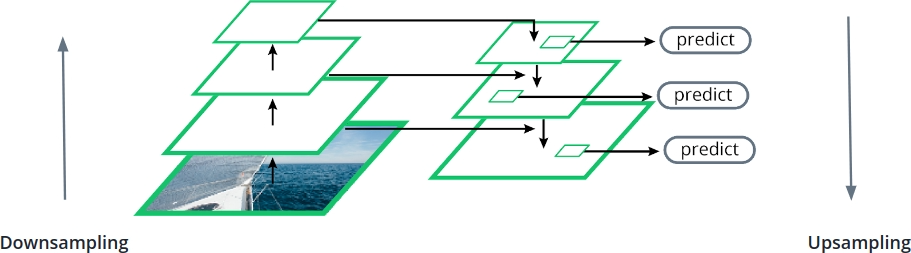

# C-6: Object Detection and Segmentation

<br>
<br>

1. **Computer Vision Task Hierarchy**
    - Image classification vs. localization vs. detection vs. segmentation
2. **Object Localization**
    - Multi-head architecture
    - Loss functions
    - Bounding box representations
3. **Object Detection Fundamentals**
    - One-stage vs. two-stage detection
    - Anchor-based approaches
    - RetinaNet architecture
    - Feature Pyramid Networks
    - Focal Loss
4. **Object Detection Evaluation**
    - Precision and Recall
    - Intersection over Union (IoU)
    - Mean Average Precision (mAP)
    - Mean Average Recall (mAR)
5. **Semantic Segmentation**
    - UNet architecture
    - Skip connections
    - Dice Loss

#### Computer Vision Task Hierarchy

Computer vision encompasses a spectrum of increasingly complex tasks, each building upon the capabilities of simpler
ones while adding new dimensions of spatial understanding. This hierarchy of tasks forms a progression from basic
image-level understanding to detailed pixel-wise comprehension, with each level requiring more sophisticated
architectural approaches and presenting unique challenges.

##### Image Classification

At the foundation of computer vision lies image classification—the task of assigning one or more labels to an entire
image based on its visual content. This represents the most basic form of image understanding.

###### Key Characteristics

In image classification, the model answers a fundamental question: "What is in this image?" The output is a set of class
probabilities or scores indicating the likelihood that the image contains instances of different categories. For
example, an image might be classified as containing a "dog" with 95% confidence and a "cat" with 2% confidence.

The architectural approach typically involves:

- A convolutional neural network backbone that extracts hierarchical features
- A global pooling layer that aggregates spatial information
- One or more fully connected layers that map these features to class scores

###### Limitations

While powerful, image classification has significant limitations:

- It provides no spatial information about object locations
- It cannot differentiate between multiple instances of the same class
- It struggles with images containing multiple distinct objects

These limitations motivate the progression to more spatially-aware vision tasks.

##### Object Localization

Object localization extends classification by not only identifying what is in an image but also where the primary object
is located. It bridges the gap between image-level and object-level understanding.

###### Key Characteristics

In object localization, the model answers both "what" and "where" questions but focuses solely on the most prominent
object in the image. The output includes:

- A class label (or class probabilities)
- A bounding box defined by four coordinates that enclose the object

This task usually employs a multi-head architecture where:

- One head handles classification (identical to image classification)
- A parallel head predicts the bounding box coordinates

The loss function combines classification loss (typically cross-entropy) with a regression loss for bounding box
prediction (such as mean squared error or smooth L1 loss).

###### Limitations

While more spatially aware than classification, object localization still has constraints:

- It typically handles only a single dominant object per image
- It cannot address scenes with multiple objects of interest
- It provides only a rectangular approximation of the object's location, not its exact shape

##### Object Detection

Object detection represents a significant leap in complexity by identifying and localizing all objects of interest
within an image, regardless of their number or class.

###### Key Characteristics

In object detection, the model must simultaneously:

- Identify all instances of objects from known classes
- Predict accurate bounding boxes for each instance
- Handle variable numbers of objects across different images

The output consists of a list of detected objects, each with:

- A class label
- A confidence score
- A bounding box

Object detection architectures generally fall into two categories:

- Two-stage detectors like R-CNN variants that first propose regions of interest, then classify them
- One-stage detectors like YOLO and RetinaNet that predict classes and bounding boxes in a single forward pass

Both approaches must address the challenge of predicting objects at different scales and aspect ratios, typically
through techniques like:

- Anchor boxes (predefined boxes of different shapes)
- Feature pyramid networks (multi-scale feature representations)
- Non-maximum suppression (removing redundant detections)

###### Limitations

While powerful, object detection still has constraints:

- It provides only rectangular bounding boxes, not precise object shapes
- It cannot distinguish between touching or overlapping instances of the same class
- It operates at the object level rather than the pixel level

##### Semantic Segmentation

Semantic segmentation elevates vision understanding to the pixel level by classifying every pixel in an image according
to the object or region it belongs to.

###### Key Characteristics

In semantic segmentation, the model creates a dense, pixel-wise classification map where:

- Each pixel is assigned to exactly one class
- The output has the same spatial dimensions as the input image
- The prediction preserves the exact shape and boundaries of objects

The typical architecture follows an encoder-decoder structure:

- The encoder progressively reduces spatial dimensions while increasing feature depth
- The decoder recovers spatial information while reducing feature depth
- Skip connections often link corresponding encoder and decoder levels to preserve fine details

Common architectures include U-Net, FCN (Fully Convolutional Networks), and DeepLab variants.

###### Limitations

While offering pixel-perfect classification, semantic segmentation cannot distinguish between separate instances of the
same class—all "person" pixels are labeled identically, regardless of whether they belong to one person or many.

##### Instance Segmentation

At the apex of the computer vision task hierarchy, instance segmentation combines the instance-awareness of object
detection with the pixel-precision of semantic segmentation.

###### Key Characteristics

Instance segmentation requires the model to:

- Identify each individual object instance
- Classify each instance according to its class
- Precisely delineate the pixels belonging to each instance

This allows separate treatment of distinct objects from the same class—identifying not just "three people" but "person
1, person 2, and person 3," each with their exact pixel mask.

Popular architectures include:

- Mask R-CNN, which extends Faster R-CNN with a parallel branch for mask prediction
- YOLACT, which combines one-stage detection with prototype masks

Instance segmentation represents the most complete form of scene understanding among these tasks, offering both what and
where information at the finest possible granularity.

##### Progression of Complexity

The hierarchy of computer vision tasks represents a progression along multiple dimensions:

1. **Spatial granularity**: From image-level (classification) to object-level (detection) to pixel-level (segmentation)
2. **Output complexity**: From simple class labels to multiple coordinates to dense pixel maps
3. **Instance awareness**: From class-only to individual object instances
4. **Computational demands**: Increasing computational requirements at each level

Understanding this hierarchy helps in selecting the appropriate technique for a given application based on the required
level of detail and available computational resources. It also illustrates how advances in computer vision have
progressively enabled machines to perceive images with increasingly human-like understanding—from merely recognizing
content to precisely locating and delineating objects in complex scenes.

<userStyle>Claude aims to give clear, thorough explanations that help the human deeply understand complex topics. Claude
approaches questions like a teacher would, breaking down ideas into easier parts and building up to harder concepts. It
uses comparisons, examples, and step-by-step explanations to improve understanding. Claude keeps a patient and
encouraging tone, trying to spot and address possible points of confusion before they arise. Claude may ask thinking
questions or suggest mental exercises to get the human more involved in learning. Claude gives background info when it
helps create a fuller picture of the topic. It might sometimes branch into related topics if they help build a complete
understanding of the subject. When writing code or other technical content, Claude adds helpful comments to explain the
thinking behind important steps. Claude always writes prose and in full sentences, especially for reports, documents,
explanations, and question answering. Claude can use bullets only if the user asks specifically for a list.</userStyle>

#### Object Localization

Object localization extends basic image classification by not only identifying what appears in an image but also
precisely where it is located. This spatial awareness represents a fundamental step toward more comprehensive scene
understanding, bridging the gap between simple classification and the more complex tasks of detection and segmentation.

##### Multi-Head Architecture

Object localization employs a distinctive multi-head neural network design that elegantly handles the dual tasks of
classification and spatial localization.

###### Shared Backbone

The foundation of an object localization network is a shared feature extraction backbone, typically a convolutional
neural network such as ResNet, EfficientNet, or VGG. This backbone serves a critical role:

1. It processes the raw input image through multiple convolutional layers
2. It progressively extracts increasingly abstract visual features
3. It creates rich feature representations that contain both semantic and spatial information

The backbone's ability to preserve some degree of spatial information while extracting meaningful features makes it
ideal for the dual requirements of localization and classification.

###### Classification Head

Branching from the shared backbone, the classification head focuses exclusively on determining the object's category:

1. It typically consists of one or more fully-connected layers
2. It often includes global pooling to aggregate spatial information
3. It terminates in a layer with neurons corresponding to possible classes
4. It produces a vector of class scores or probabilities

This head functions almost identically to the final layers in a standard classification network but shares its initial
feature extraction with the localization task.

###### Localization Head

In parallel with the classification head, the localization head specializes in predicting the object's spatial extent:

1. It consists of one or more fully-connected layers
2. It maintains access to the spatial information in the backbone's features
3. It terminates in a layer with typically four neurons
4. It outputs coordinates defining the object's bounding box

The localization head learns to map the spatial patterns in the feature maps to precise coordinate predictions,
essentially translating abstract representations back into image-space coordinates.

###### Forward Pass Flow

During inference, the object localization network processes an image through a streamlined flow:

1. The input image passes through the shared backbone, generating feature maps
2. These feature maps simultaneously feed into both the classification and localization heads
3. The classification head produces class probabilities
4. The localization head generates bounding box coordinates
5. The network returns both outputs as a combined result

This parallel processing allows efficient computation of both "what" and "where" information in a single forward pass.

##### Loss Functions

Training an object localization network requires careful consideration of how to quantify errors in both classification
and bounding box prediction.

###### Combined Loss Formulation

The overall loss function for object localization typically takes the form of a weighted sum:

$$L = L_{cls} + \alpha \cdot L_{loc}$$

Where:

- $L_{cls}$ represents the classification loss
- $L_{loc}$ represents the localization loss
- $\alpha$ is a weighting hyperparameter that balances the two components

This formulation allows joint optimization of both tasks while controlling their relative importance.

###### Classification Loss

For the classification component, cross-entropy loss is the standard choice:

$$L_{cls} = -\log(\hat{p}_y)$$

Where $\hat{p}_y$ is the predicted probability for the true class $y$.

This loss penalizes the network when it assigns low probability to the correct class, encouraging confident and accurate
classification.

###### Localization Loss

For bounding box regression, mean squared error (MSE) is commonly used:

$$L_{loc} = \frac{1}{4}\sum_{i=1}^{4}(b_i - \hat{b}_i)^2$$

Where:

- $b_i$ represents the four ground truth bounding box coordinates
- $\hat{b}_i$ represents the corresponding predicted coordinates

This loss measures the squared difference between predicted and actual coordinates, penalizing spatial inaccuracy.

###### Loss Balancing

The hyperparameter $\alpha$ plays a crucial role in training dynamics:

1. If $\alpha$ is too small, the network might excel at classification but produce poor bounding boxes
2. If $\alpha$ is too large, bounding box prediction might improve at the expense of classification accuracy
3. The optimal value depends on the relative scales of the losses and the dataset characteristics

Finding the right balance often requires experimentation, though values between 0.5 and 5 serve as common starting
points.

###### Advanced Loss Variants

Beyond basic MSE, several specialized losses have been developed for bounding box regression:

1. **Smooth L1 Loss**: Combines the stability of L2 loss for small errors with the robustness of L1 loss for large
   errors
2. **IoU Loss**: Directly optimizes the Intersection over Union metric
3. **GIoU/DIoU/CIoU Losses**: Refinements that address limitations of the basic IoU loss

These advanced losses often provide better convergence and more accurate localization.

##### Bounding Box Representations

The way bounding boxes are represented significantly impacts network training and prediction quality.

###### Coordinate Formats

Two primary formats exist for representing bounding boxes:

1. **Corner format**: Specifies the top-left and bottom-right corners $$[x_{min}, y_{min}, x_{max}, y_{max}]$$

    This format directly describes the box boundaries but can be sensitive to scale.

2. **Center format**: Specifies the center point, width, and height $$[x_{center}, y_{center}, width, height]$$

    This format often provides more stable gradients during training.

Each format has advantages in different contexts, with center format generally preferred for regression tasks.

###### Coordinate Normalization

Raw pixel coordinates can cause training instability due to their potentially large range. To address this, coordinates
are typically normalized:

1. **Image-relative normalization**: All coordinates are divided by image dimensions, resulting in values between 0 and
   1 $$[x/W, y/H, w/W, h/H]$$
2. **Feature map normalization**: Coordinates are expressed relative to the feature map from which they're predicted

Normalization ensures that coordinate values stay within a reasonable range regardless of image size, improving training
stability.

###### Anchor-Based Prediction

Advanced localization systems often predict bounding boxes as offsets from predefined reference boxes called anchors:

1. Instead of direct coordinates, the network predicts transformation parameters
2. These parameters are applied to canonical anchor boxes to produce final predictions
3. This approach simplifies the regression problem, especially for multiple objects

For a center format box with anchor $(x_a, y_a, w_a, h_a)$, the network might predict offsets $(t_x, t_y, t_w, t_h)$
that are transformed:

$$x = x_a + t_x \cdot w_a$$ $$y = y_a + t_y \cdot h_a$$ $$w = w_a \cdot e^{t_w}$$ $$h = h_a \cdot e^{t_h}$$

This parameterization ensures that predictions stay reasonably close to realistic object proportions.

###### Regression Targets

During training, ground truth boxes must be converted to regression targets compatible with the network's output format:

1. For direct coordinate prediction, this might involve simple normalization
2. For anchor-based approaches, targets are the transform parameters that would convert anchors to ground truth boxes

Proper target generation is crucial for effective training, as it translates the human-annotated boxes into the
mathematical space in which the network operates.

Object localization serves as both a valuable capability in its own right and a foundational component of more complex
vision tasks like object detection. By understanding the multi-head architecture, loss function design, and bounding box
representation, we gain insight into how deep learning bridges the gap between recognizing objects and understanding
their spatial presence in the visual world.

––––––––––––––––––––––––––––––––––––––––––––––––––––––––––––––––––––––––––––––––––––––––––––––––

In this lesson we will focus on object localization, object detection and semantic segmentation. In this lesson we are
going to look at a core set of concepts and solutions that will help you get started on these fascinating topics, with
no intention of being complete. In particular we are going to focus on two workhorse architectures for object detection
and semantic segmentation, respectively: _RetinaNet_ and _UNet._ The core computer vision tasks and their objectives
are:

| Task                  | Objective                                                                                             |
| --------------------- | :---------------------------------------------------------------------------------------------------- |
| Image classification  | Assign one or more labels to an image                                                                 |
| Object localization   | Assign a label to most prominent object, define a box around that object                              |
| Object detection      | Assign a label and define a box for all objects in an image                                           |
| Semantic segmentation | Determine the class of each _pixel_ in the image                                                      |
| Instance segmentation | Determine the class of each _pixel_ in the image distinguishing different instances of the same class |

Image classification is the simplest task, providing only image-level labels and object localization and detection
involve both classification and spatial information (bounding boxes). The segmentation tasks operate at the pixel
level - semantic segmentation treats all instances of a class the same and Instance segmentation differentiates between
individual instances of the same class.

#### Object Localization

Object localization combines classification with spatial information, identifying both what an object is and where it is
located in an image. It has multi-head architecture with components:

1. _Backbone_: Shared feature extractor
2. _Classification Head_: Class prediction
3. _Localization Head_: Bounding box prediction

The Python implementation is provided below:

```python
class MultiHead(nn.Module):
    def __init__(self):
        super().__init__()
        self.backbone = nn.Sequential(...)  # Feature extraction
        self.class_head = nn.Sequential(...)  # Classification
        self.loc_head = nn.Sequential(...)  # Localization

    def forward(self, x):
        x = self.backbone(x)
        class_scores = self.class_head(x)
        bounding_box = self.loc_head(x)
        return class_scores, bounding_box
```

<br>
<br>

#### Loss Function

$L = CE(\hat{p}) + \alpha MSE(b, \hat{b})$

Where :

- $L$ is the total loss
- $CE(\hat{p})$ is Cross-Entropy loss for classification
- $MSE(b, \hat{b})$ is Mean Squared Error for bounding box
- $\alpha$ is a scaling hyperparameter

<br>

The expanded form is below:

$L = -\log \hat{p} + \alpha \sum_{i=1}^{4} (b_i - \hat{b_i})^2$

Where:

- $\hat{p}$ is predicted class probability

- $b_i$ are true bounding box coordinates

- $\hat{b_i}$ are predicted bounding box coordinates

- Sum is over 4 bounding box coordinates

The Key Considerations are:

1. _Loss Balancing:_

    - $\alpha$ balances classification and localization losses
    - Different scales may require different $\alpha$ values

2. _Bounding Box Format:_

    - Four coordinates required: $(x_{min}, y_{min}, x_{max}, y_{max})$ or
    - Center format: $(x_{center}, y_{center}, width, height)$

3. _Performance Metrics:_
    - Classification accuracy
    - Bounding box IoU (Intersection over Union)
    - Combined performance metrics

This multi-head approach allows simultaneous optimization of both classification and localization tasks through a
unified loss function, making it effective for object localization tasks.

<br>

#### Object Localization

Object Localization and Bounding Boxes Object localization is the task of assigning a label and determining the bounding
box of an object of interest in an image. A bounding box is a rectangular box that completely encloses the object, whose
sides are parallel to the sides of the image. The architecture of an object localization network is similar to the
architecture of a classification network, but we add one more head (the localization head) on top of the existing
classification head:

<p align="center">

</p>
<p align="center">figure: Multi-head architecture for object localization showing backbone and two heads</p>

A multi-head model is a CNN where we have a backbone as typical for CNNs, but more than one head. For example, for
object localization this could look like:

```python
from torch import nn


class MultiHead(nn.Module):
    def __init__(self):
        super().__init__()
        # Backbone: this can be a custom network, or a
        # pre-trained network such as a resnet50 where the
        # original classification head has been removed. It computes
        # an embedding for the input image
        self.backbone = nn.Sequential(..., nn.Flatten())

        # Classification head: an MLP or some other neural network
        # ending with a fully-connected layer with an output vector
        # of size n_classes
        self.class_head = nn.Sequential(..., nn.Linear(out_feature, n_classes))

        # Localization head: an MLP or some other neural network
        # ending with a fully-connected layer with an output vector
        # of size 4 (the numbers defining the bounding box)
        self.loc_head = nn.Sequential(..., nn.Linear(out_feature, 4))

    def forward(self, x):
        x = self.backbone(x)

        class_scores = self.class_head(x)
        bounding_box = self.loc_head(x)

        return class_scores, bounding_box
```

#### Loss in a Multi-Head Model

An object localization network, with its two heads, is an example of a multi-head network. Multi-head models provide
multiple outputs that are in general paired with multiple inputs. For example, in the case of object localization, we
have 3 inputs as ground truth: the image, the label of the object ("car") and the bounding box for that object (4
numbers defining a bounding box). The object localization network processes the image through the backbone, then the two
heads provide two outputs.

The class scores, that need to be compared with the input label - predicted bounding box, that needs to be compared with
the input bounding box. The comparison between the input and predicted labels is made using the usual Cross-entropy
loss, while the comparison between the input and the predicted bounding boxes is made using, for example, the mean
squared error loss. The two losses are then summed to provide the total loss L.

<p align="center">

</p>
<p align="center">figure: Sliding window approach for object detection</p>

Since the two losses might be on different scales, we typically add a hyperparameter α to rescale one of the two:

$L = CE(\hat{p}) + \alpha MSE(b, \hat{b})$

Where:

$L$ is the total loss $CE(\hat{p})$ is the Cross-Entropy loss for classification $MSE(b, \hat{b})$ is the Mean Squared
Error for bounding box prediction $\alpha$ is a hyperparameter to balance the two losses. The Expanded Loss Formula is:

$L = -\log \hat{p} + \alpha \sum_{i=1}^{4} (b_i - \hat{b_i})^2$

Where:

- $\hat{p}$ is the predicted class probability
- $b_i$ are the true bounding box coordinates
- $\hat{b_i}$ are the predicted bounding box coordinates

<br>
<br>

#### Object Detection

The task of object detection consists of detecting and localizing all the instances of the objects of interest.
Different images of course can have a different number of objects of interest: for example an image could have one car,
zero cars, or many cars. The same images could also have one person, zero people or many people. In each one of these
cases, we need the network to output one vector of class scores plus 4 numbers to define the bounding box for each
object.

It is clear that a network with the same structure as the object localization network would not work, because we would
need a variable number of heads depending on the content of the image. One way would be to slide a window over the
image, from the upper left corner to the lower right corner, and for each location of the image we run a normal object
localization network. This sliding window approach works to a certain extent, but is not optimal because different
objects can have different sizes and aspect ratios. Thus, a window with a fixed size won't fit well all objects of all
sizes. For example, let's consider cars: depending on how close or far they are, their size in the image will be
different. Also, depending on whether we are seeing the back or the front, or the side of the car, the aspect ratio of
the box bounding the object would be pretty different. This becomes even more extreme if we consider objects from
different classes, for example cars and people: Nowadays there are two approaches to solving the problem of handling a
variable number of objects, and of their different aspect ratios and scales:

1. _One-stage object detection:_ We consider a fixed number of windows with different scales and aspect ratios, centered
   at fixed locations (anchors). The output of the network then has a fixed size. The localization head will output a
   vector with a size of 4 times the number of anchors, while the classification head will output a vector with a size
   equal to the number of anchors multiplied by the number of classes.

2. _Two-stage object detection:_ In the first stage, an algorithm or a neural network proposes a fixed number of windows
   in the image. These are the places in the image with the highest likelihood of containing objects. Then, the second
   stage considers those and applies object localization, returning for each place the class scores and the bounding
   box.

In practice, the difference between the two is that while the first type has fixed anchors (fixed windows in fixed
places), the second one optimizes the windows based on the content of the image. In this lesson we are only going to
treat one-stage object detection.

#### One-Stage Object Detection

The RetinaNet network is an example of a one-stage object detection algorithm. Like many similar algorithms, it uses
anchors to detect objects at different locations in the image, with different scales and aspect ratios. Anchors are
windows with different sizes and different aspect ratios, placed in the center of cells defined by a grid on the image:

We divide the image with a regular grid. Then for each grid cell we consider a certain number of windows with different
aspect ratios and different sizes. We then "anchor" the windows in the center of each cell. If we have 4 windows and 45
cells, then we have 180 anchors.

We run a localization network considering the content of each anchor. If the class scores for a particular class are
high for an anchor, then we consider that object detected for that anchor, and we take the bounding box returned by the
network as the localization of that object. This tends to return duplicated objects, so we post-process the output with
an algorithm like Non Maximum Suppression

#### Feature Pyramid Networks

RetinaNet uses a special backbone called Feature Pyramid Network, FPNs. The Feature Pyramid Network is an architecture
that extracts multi-level, semantically-rich feature maps from an image:

<p align="center">

</p>
<p align="center">figure: Feature Pyramid Network (FPN) architecture for multi-scale feature extraction</p>

A regular CNN backbone of convolution, pooling, and other typical CNN layers is used to extract multiple feature maps
from the original image (downsampling path). The last feature map contains the most semantic-rich representation, which
is also the least detailed because of the multiple pooling. So, we copy that to the upsampling path and run object
detection with anchors on that. Then, we upsample it and sum it to the feature map from the same level in the
downsampling path. This means we are mixing the high-level, abstract information from the feature map in the upsampling
path to the more detailed view from the downsampling path. We then run object detection on the result. We repeat this
operation several times (3 times in total in this diagram). This is how RetinaNet uses the Feature Pyramid Network:

<p align="center">

</p>
<p align="center">figure: RetinaNet architecture combining FPN with focal loss for object detection</p>

RetinaNet conducts object classification and localization by independently employing anchors at each Feature Pyramid
level. The diagram above illustrates that the classification subnet and the box regression subnet pass through four
convolutional layers with 256 filters. Subsequently, they undergo convolutional layers with KA and 4A filters for the
classification and localization, respectively.

#### Focal Loss

The third innovative feature of RetinaNet is the so-called Focal Loss. When using a lot of anchors on multiple feature
maps, RetinaNet encounters a significant class balance problem: most of the tens of thousands of anchors used in a
typical RetinaNet will not contain objects. The crop of the image corresponding to these anchors will normally be pretty
easy to classify as background. So the network will very quickly become fairly confident on the background. The normal
cross-entropy loss assigns a low but non-negligible loss even to well-classified examples. For example, let's look at
the blue curve here:

<p align="center">

</p>
<p align="center">figure: Focal Loss function for addressing class imbalance in object detection</p>

Here we are considering for simplicity a binary classification problem. Let's consider an example having a positive
label. If our network has a confidence on the positive label of 0.8, it means it is classifying this example pretty
well.

it is assigning the right label, with a good confidence of 0.8. However, the loss for this example is still around 0.5.
Let's now consider a different positive example, where the network is assigning a probability for the positive class of
0.1. This is a False Negative, and the loss accordingly is pretty high (around 4). Let's now assume that we have 10
examples where the network is correct and has a confidence of 0.8 (and loss of 0.5), and one example where the network
is wrong and has a loss of 4. The ten examples will have a cumulative loss of 0.5 x 10 = 5, which is larger than 4. In
other words, the cumulative loss of the examples that are already classified well is going to dominate over the loss of
the example that is classified wrong. This means that the backpropagation will try to make the network more confident on
the 10 examples it is already classifying well, instead of trying to fix the one example where the network is wrong.
This has catastrophic consequences for networks like RetinaNet, where there are usually tens of thousands of easy
background anchors for each anchor containing an object.

The Focal Loss adds a factor in front of the normal cross-entropy loss to dampen the loss due to examples that are
already well-classified so that they do not dominate. This factor introduces a hyperparameter γ: the larger γ, the more
the loss of well-classified examples is suppressed. Summarizing, RetinaNet is characterized by three key features:

1. Anchors
2. Feature Pyramid Networks
3. Focal loss

<br>
<br>

#### Object Detection Metrics

##### Precision

Precision is the ratio of correctly predicted positive observations to the total predicted positive observations. It
measures the accuracy of positive predictions and focus on quality of positive predictions. Of all the items we
predicted as positive, what fraction were actually positive is precision and defined as:

$Precision = \frac{True \space Positives}{True \space Positives + False \space Positives}$

In a spam email detection system:

- Precision = (Correctly identified spam emails) / (Total emails identified as spam)
- High precision means low false alarm rate

##### Recall

Recall is the ratio of correctly predicted positive observations to all actual positive observations. Of all the actual
positive items, what fraction did we predict correctly is recall. It measures completeness of positive predictions and
focus on coverage of positive cases. The recall is defined as:

$Recall = \frac{True \space Positives}{True \space Positives + False \space Negatives}$

In a disease detection system:

- Recall = (Correctly identified sick patients) / (Total actually sick patients)
- High recall means few missed positive cases

The trade-off between precision and recall are:

- Often inverse relationship between precision and recall
- Improving one typically decreases the other
- Balance depends on application needs

The choice between optimizing for precision vs. recall depends on the relative costs of false positives vs. false
negatives in your specific application.

##### True Positives (TP)

- Cases where model predicted YES, and actual was YES
- Example: Predicted cancer when cancer was present
- Formula contribution: Correctly identified positive cases

##### True Negatives (TN)

- Cases where model predicted NO, and actual was NO
- Example: Predicted no cancer when cancer was absent
- Formula contribution: Correctly identified negative cases

##### False Positives (FP) - Type I Error

- Cases where model predicted YES, but actual was NO
- Example: Predicted cancer when cancer was absent
- Also known as "False Alarm" or "Type I Error"

##### False Negatives (FN) - Type II Error

- Cases where model predicted NO, but actual was YES
- Example: Predicted no cancer when cancer was present
- Also known as "Miss" or "Type II Error"

##### Confusion Matrix

A Confusion Matrix is a performance evaluation tool in machine learning that shows the actual vs. predicted
classifications in a tabular format. For binary classification, it's typically a 2x2 matrix showing:

True Positives (TP): Correctly predicted positive cases True Negatives (TN): Correctly predicted negative cases False
Positives (FP): Incorrectly predicted positive cases (Type I error) False Negatives (FN): Incorrectly predicted negative
cases (Type II error)

From these values, we can calculate important metrics:

**Accuracy** = (TP + TN) / (TP + TN + FP + FN) **Precision** = TP / (TP + FP) **Recall** = TP / (TP + FN) **F1 Score** =
2 × (Precision × Recall) / (Precision + Recall)

Here's how a typical confusion matrix looks:

|                   | Predicted Positive   | Predicted Negative   |
| ----------------- | -------------------- | -------------------- |
| Actually Positive | True Positives (TP)  | False Negatives (FN) |
| Actually Negative | False Positives (FP) | True Negatives (TN)  |

This tool is particularly valuable because it gives a complete picture of model performance, revealing not just overall
accuracy but also specific types of errors the model makes. This can be crucial in applications where certain types of
errors are more costly than others, like medical diagnosis or fraud detection.

##### Precision (Positive Predictive Value)

$Precision = \frac{TP}{TP + FP}$

- Focus on prediction quality
- "When we predict positive, how often are we right?"

##### Recall (Sensitivity)

$Recall = \frac{TP}{TP + FN}$

- Focus on finding all positives
- "What proportion of actual positives do we catch?"

##### Specificity

$Specificity = \frac{TN}{TN + FP}$

- Focus on negative case identification
- "What proportion of actual negatives do we identify?"

##### Accuracy

$Accuracy = \frac{TP + TN}{TP + TN + FP + FN}$

- Overall correctness
- "What proportion of all predictions are correct?"

##### F1 Score

$F1 = 2 \times \frac{Precision \times Recall}{Precision + Recall}$

- Harmonic mean of precision and recall

- Single score balancing both metrics

The improving metrics between precision and recall are:

1. _To Improve Precision:_

    - Increase prediction threshold
    - Reduce false positives
    - More conservative predictions

2. _To Improve Recall:_
    - Lower prediction threshold
    - Reduce false negatives
    - More liberal predictions

#### Impact on Model Evaluation

##### High Stakes Scenarios

- Medical Diagnosis:
    - FN could mean missing a disease
    - FP could mean unnecessary treatment
- Fraud Detection:
    - FN means missing fraud
    - FP means flagging legitimate transactions

##### Cost Considerations

- FP Cost vs FN Cost
- Business Impact
- Resource Allocation

#### Improving Different Metrics

##### To Reduce False Positives

- Increase prediction threshold
- More conservative model
- Better feature selection

##### To Reduce False Negatives

- Lower prediction threshold
- More sensitive model
- Additional relevant features

##### Balance Considerations

- Domain-specific requirements
- Cost-benefit analysis
- Regulatory requirements

#### Intersection over Union (IoU)

The IoU is a measure of how much two boxes (or other polygons) coincide. As the name suggests, it is the ratio between
the area of the intersection, or overlap, and the area of the union of the two boxes or polygons: IoU is a fundamental
concept useful in many domains, and is a key metric for the evaluation of object detection algorithms.

<p align="center">

</p>
<p align="center">figure: Example of bird detection showing bounding box and IoU calculation</p>

<br>
<br>

#### Mean Average Precision

Mean Average Precision (mAP) conveys a measurement of precision averaged over the different object classes.

$mAR = \frac{\sum_{i=1}^{K} AR_i}{K}$

This appears to be the formula for mean Average Recall (mAR), where:

- $mAR$ is the mean Average Recall
- $\sum_{i=1}^{K}$ represents the summation from i=1 to K
- $AR_i$ represents the Average Recall for the i-th class/category
- $K$ is the total number of classes/categories

The formula calculates the mean of Average Recall values across K different classes or categories by summing up all AR
values and dividing by K.

Let’s say we have a number of classes. We consider all the binary classification problems obtained by considering each
class in turn as positive and all the others as negative. For each one of these binary sub-problems, we start by drawing
the _precision-recall curve_ that is obtained by measuring precision and recall for different confidence level
thresholds, while keeping the IoU threshold fixed (for example at 0.5). The confidence level is the classification
confidence level, i.e., the maximum of the softmax probabilities coming out of the classification head. For example, we
set the confidence threshold to 0.9 and measure precision and recall, then we change the threshold to say 0.89 and
measure precision and recall, and so on, until we get to a threshold of 0.1. This constitutes our precision-recall
curve:

We then interpolate the precision and recall curve we just obtained by using a monotonically-decreasing interpolation
curve, and we take the area under the curve. This represents the so-called Average Precision (AP) for this class:

We repeat this procedure for all classes, then we take the average of the different APs and call that mean Average
Precision, or mAP. A related metric is called mean Average Recall (mAR). Similarly to the mAP, we split our problem into
a number of binary classification problems. For each class, we compute the recall curve obtained by varying this time
the IoU threshold from 0.5 to 1. We can now consider the integral of the curve. Since we integrate between 0.5 and 1,
and Recall is a quantity bounded between 0 and 1, the integral would be bounded between 0 and 0.5. We therefore multiply
by 2 to make it a quantity bounded between 0 and 1. Twice the area under the recall curve represents the so-called
Average Recall (AR) for this class and We then take the average of the AR over the different classes, to define the mean
Average Recall, or mAR.

#### Questions and Answers

##### Q#1: What are the components of a CNN-based object localization model? (Select all that apply)

Answer: Three components apply:

- A CNN backbone
- A classification head
- A localization head

Explanation: A CNN-based object localization model consists of three main components:

1. CNN backbone: Extracts features from the input image
2. Classification head: Determines what the object is
3. Localization head: Predicts the bounding box coordinates The self-attention head is not a standard component of
   object localization models.

##### Q#2: Match the two types of object detection algorithms with their definition.

Answer:

- One-stage object detection: The algorithm considers all at once a fixed number of windows with different scales and
  aspect ratios
- Two-stage object detection: First some regions are proposed, then objects are detected and localized in each one

One-stage and two-stage object detection algorithms follow different approaches to solving the same problem: how to
detect objects at different scales and at different locations in an image.

Explanation: These represent two main approaches to object detection:

- One-stage detectors (like YOLO) process the entire image in a single pass
- Two-stage detectors (like R-CNN) first propose regions of interest, then classify and refine them

##### Q#3: What are the main components of RetinaNet?

Answer:

- A Feature Pyramid Network
- A classification head
- A localization head
- A large numbers of anchors

Explanation: RetinaNet combines these components to achieve effective object detection:

1. CNN backbone extracts features
2. FPN creates multi-scale feature representations
3. Classification head for object class prediction
4. Localization head for bounding box prediction
5. Multiple anchors at different scales for better detection

##### Q#4: Match each concept with its proper description.

| Metric                       | Description                                       |
| ---------------------------- | ------------------------------------------------- |
| Average Precision (AP)       | Area under the precision-recall curve             |
| Mean Average Precision (mAP) | Average over all classes of the Average Precision |
| Average Recall (AR)          | Area under the recall vs IoU curve                |
| Mean Average Recall (mAR)    | Average over all classes of the Average Recall    |

Additional Notes:

- AP measures performance for a single class
- mAP measures overall model performance across all classes
- AR evaluates the model's ability to detect objects at different IoU thresholds
- mAR provides a holistic view of recall performance across all classes

Formulas:

- mAP = $\frac{1}{K}\sum_{i=1}^{K} AP_i$ where K is number of classes
- mAR = $\frac{1}{K}\sum_{i=1}^{K} AR_i$ where K is number of classes

These metrics are crucial for evaluating object detection models and comparing different approaches.

Answer:

- Area under the precision-recall curve → Average Precision
- Area under the recall vs IoU curve → Average Recall
- Average over all classes of the Average Precision → Mean Average Precision (mAP)
- Average over all classes of the Average Recall → Mean Average Recall (mAR)

Explanation: These metrics are used to evaluate object detection models:

- Average Precision (AP) measures the area under the precision-recall curve for each class
- Average Recall (AR) measures the area under the recall-IoU curve for each class
- mAP averages the AP across all classes
- mAR averages the AR across all classes The formula for mAR was previously shown: $mAR = \frac{\sum_{i=1}^{K} AR_i}{K}$

#### Image Segmentation

The task of semantic segmentation consists of classifying each pixel of an image to determine to which class it belongs.
Another technique of image segmentation We have briefly mentioned previously, but are not going to discuss further here,
another technique of image segmentation called _instance segmentation_.

##### UNet Semantic Segmentation

The UNet is a specific architecture for semantic segmentation. It has the structure of a standard autoencoder, with an
encoder that takes the input image and encodes it through a series of convolutional and pooling layers into a
low-dimensional representation.

Then the decoder architecture starts from the same representation and constructs the output mask by using transposed
convolutions. However, the UNet adds skip connections between the feature maps at the same level in the encoder and in
the decoder, as shown below:

<p align="center">

</p>
<p align="center">figure: UNet architecture for semantic segmentation with encoder-decoder structure</p>

In the decoder, the feature map coming from the decoder path is concatenated along the channel dimension with the
feature map coming from the encoder path. This means that the next transposed convolution layer has access to
information with high semantic content coming from the previous decoder layer, along with information with high detail
coming from the encoder path. The final segmentation mask is then a lot more detailed than what you would obtain with a
simple encoder-decoder architecture without skip connections between the encoder and the decoder.

<br>
<br>

##### The Dice Loss

There are a few different losses that one can use for semantic segmentation. One loss that tend to work well in practice
is called Dice loss, named after Lee Raymond Dice, who published it in 1945. Here is how Dice loss is calculated:

$\text{Dice loss} = 1 - \frac{2\sum_{i=1}^{n_{\text{pix}}} p_iy_i}{\sum_{i=1}^{n_{\text{pix}}}(p_i + y_i)}$

Where:

- $p_i$ represents the i-th pixel in the prediction mask
- $y_i$ represents the i-th pixel in the ground truth mask
- $n_{\text{pix}}$ is the total number of pixels in the image
- $\sum_{i=1}^{n_{\text{pix}}}$ indicates summation over all pixels

<br>
<br>

The Dice loss derives from the F1 score, which is the geometric mean of precision and recall. Consequently, the Dice
loss tends to balance precision and recall at the pixel level.

Key Points:

1. Used primarily in semantic segmentation tasks
2. Based on F1 score principles
3. Balances precision and recall
4. Particularly effective for pixel-level predictions

This loss function is especially useful in segmentation tasks where we need to compare predicted masks with ground truth
masks at the pixel level. We will use the implementation of UNet provided by the wonderful open-source library
segmentation_models for PyTorch. The library also implements the Dice loss. This is how you can define a UNet using this
library:

<br>
<br>

##### Derivation of the Dice Loss

Let's start with how we compute $TP$:

$TP = \sum_{i=1}^{n_{\text{pix}}} p_iy_i$

Since $y_i$ is either 0 or 1, the sum over all pixels is equivalent to the sum of the $p_i$ limited to pixels where
$y_i$ is equal to 1. The higher the $p_i$ is for this subset, the more the network is confident that the positive pixels
are indeed positive, the higher the "continuous" TP value will be. For the denominator of $F_1$ expression:

$2TP + FN + FP = \sum_{i=1}^{n_{\text{pix}}} p_i + \sum_{i=1}^{n_{\text{pix}}} y_i = \sum_{i=1}^{n_{\text{pix}}}(p_i +
y_i)$

The "continuous" version of the $F_1$ score - called the Dice coefficient - is:

$\text{Dice coeff} = F_1 = \frac{2\sum_{i=1}^{n_{\text{pix}}} p_iy_i}{\sum_{i=1}^{n_{\text{pix}}}(p_i + y_i)} = \frac{2TP}{2TP + FN + FP}$

Where:

- $TP$ represents True Positives
- $FN$ represents False Negatives
- $FP$ represents False Positives

Properties:

- Maximum when predicted probabilities $p_i$ are 1 for all pixels where $y_i = 1$ in ground truth
- Both numerator and denominator equal $2n_{\text{pix}}$ for perfect performance
- Perfect performance gives coefficient of 1

Finally, the Dice loss is defined as:

$\text{Dice loss} = 1 - F_1$

<br>

This forms the foundation for deriving the Dice Loss, which is essentially $1 - F_1$ when applied at the pixel level in
image segmentation tasks. The relationship to the previous Dice Loss formula can be understood when:

- True Positives correspond to matching pixels ($p_iy_i$)
- The denominator accounts for all predictions ($p_i$) and ground truth ($y_i$) pixels

This representation helps understand why Dice Loss is effective for semantic segmentation tasks, as it directly derives
from the F1 score's balanced treatment of precision and recall. Let's consider for simplicity the binary classification
problem, and let's imagine we want to segment a car in an image. In semantic segmentation we can define the True
Positives (TP), the False Negatives (FN), and the False Positives (FP) as illustrated by the following diagram, where
the gray mask is the ground truth mask for the car and the blue mask is the prediction from the model:

Here $p_i$ represents the class probability coming from the network, while $y_i$ is the ground truth. While the $p_i$
will be numbers between 0 and 1, the $y_i$ are either 0 (for the background class) or 1 for the foreground class.

Variables explained:

- $p_i$: Network output probabilities (continuous values between 0 and 1)
- $y_i$: Ground truth labels (binary values: 0 or 1)
    - 0: Background class
    - 1: Foreground class

<br>
<br>

Key points:

- Loss decreases as performance improves
- Equals 0 only with perfect network output
- Derived from $F_1$ score principles
- Suitable for gradient-based optimization
- Effective for semantic segmentation tasks

This loss function provides a continuous, differentiable measure that can effectively train segmentation models while
balancing precision and recall.
