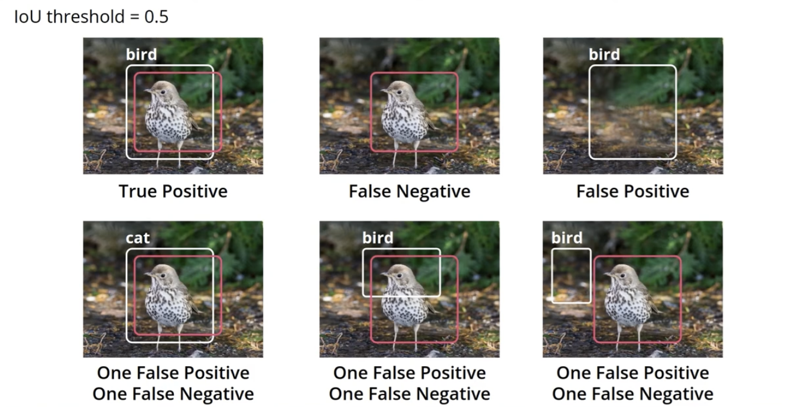

# C-6: Object Detection and Segmentation

<br>
<br>

In this lesson we will focus on object localization, object detection and semantic segmentation. In this lesson we are going to look at a core set of concepts and solutions that will help you get started on these fascinating topics, with no intention of being complete. In particular we are going to focus on two workhorse architectures for object detection and semantic segmentation, respectively: *RetinaNet* and *UNet.* The core computer vision tasks and their objectives are:

| Task                  | Objective                                                    |
| --------------------- | :----------------------------------------------------------- |
| Image classification  | Assign one or more labels to an image                        |
| Object localization   | Assign a label to most prominent object, define a box around that object |
| Object detection      | Assign a label and define a box for all objects in an image  |
| Semantic segmentation | Determine the class of each _pixel_ in the image             |
| Instance segmentation | Determine the class of each _pixel_ in the image distinguishing different instances of the same class |

Image classification is the simplest task, providing only image-level labels and object localization and detection involve both classification and spatial information (bounding boxes). The segmentation tasks operate at the pixel level - semantic segmentation treats all instances of a class the same and Instance segmentation differentiates between individual instances of the same class.


#### Object Localization

Object localization combines classification with spatial information, identifying both what an object is and where it is
located in an image. It has multi-head architecture with components: 

1. *Backbone*: Shared feature extractor
2. *Classification Head*: Class prediction
3. *Localization Head*: Bounding box prediction


The Python implementation is provided below:


```python
class MultiHead(nn.Module):
    def __init__(self):
        super().__init__()
        self.backbone = nn.Sequential(...)  # Feature extraction
        self.class_head = nn.Sequential(...)  # Classification
        self.loc_head = nn.Sequential(...)  # Localization

    def forward(self, x):
        x = self.backbone(x)
        class_scores = self.class_head(x)
        bounding_box = self.loc_head(x)
        return class_scores, bounding_box
```

<br>
<br>

#### Loss Function

$L = CE(\hat{p}) + \alpha MSE(b, \hat{b})$

Where :

- $L$ is the total loss
- $CE(\hat{p})$ is Cross-Entropy loss for classification
- $MSE(b, \hat{b})$ is Mean Squared Error for bounding box
- $\alpha$ is a scaling hyperparameter

<br>

The expanded form is below:

$L = -\log \hat{p} + \alpha \sum_{i=1}^{4} (b_i - \hat{b_i})^2$

Where:

- $\hat{p}$ is predicted class probability

- $b_i$ are true bounding box coordinates

- $\hat{b_i}$ are predicted bounding box coordinates

- Sum is over 4 bounding box coordinates

  

The Key Considerations are: 

1. *Loss Balancing:*
    - $\alpha$ balances classification and localization losses
    - Different scales may require different $\alpha$ values
    
2. *Bounding Box Format:*
    - Four coordinates required: $(x_{min}, y_{min}, x_{max}, y_{max})$ or
    - Center format: $(x_{center}, y_{center}, width, height)$
    
3. *Performance Metrics:*
    - Classification accuracy
    - Bounding box IoU (Intersection over Union)
    - Combined performance metrics

This multi-head approach allows simultaneous optimization of both classification and localization tasks through a
unified loss function, making it effective for object localization tasks.

<br>

#### Object Localization

Object Localization and Bounding Boxes Object localization is the task of assigning a label and determining the bounding
box of an object of interest in an image. A bounding box is a rectangular box that completely encloses the object, whose
sides are parallel to the sides of the image. The architecture of an object localization network is similar to the architecture of a classification network, but we add one more head (the localization head) on top of the existing classification head:


<p align="center">

</p>
<p align="center">figure: Multi-head architecture for object localization showing backbone and two heads</p>


A multi-head model is a CNN where we have a backbone as typical for CNNs, but more than one head. For example, for
object localization this could look like:

```python
from torch import nn

class MultiHead(nn.Module):
    def __init__(self):
        super().__init__()
        # Backbone: this can be a custom network, or a
        # pre-trained network such as a resnet50 where the
        # original classification head has been removed. It computes
        # an embedding for the input image
        self.backbone = nn.Sequential(..., nn.Flatten())

        # Classification head: an MLP or some other neural network
        # ending with a fully-connected layer with an output vector
        # of size n_classes
        self.class_head = nn.Sequential(..., nn.Linear(out_feature, n_classes))

        # Localization head: an MLP or some other neural network
        # ending with a fully-connected layer with an output vector
        # of size 4 (the numbers defining the bounding box)
        self.loc_head = nn.Sequential(..., nn.Linear(out_feature, 4))

    def forward(self, x):
        x = self.backbone(x)

        class_scores = self.class_head(x)
        bounding_box = self.loc_head(x)

        return class_scores, bounding_box
```


#### Loss in a Multi-Head Model

An object localization network, with its two heads, is an example of a multi-head network. Multi-head models provide
multiple outputs that are in general paired with multiple inputs. For example, in the case of object localization, we
have 3 inputs as ground truth: the image, the label of the object ("car") and the bounding box for that object (4
numbers defining a bounding box). The object localization network processes the image through the backbone, then the two
heads provide two outputs:

The class scores, that need to be compared with the input label The predicted bounding box, that needs to be compared
with the input bounding box. The comparison between the input and predicted labels is made using the usual Cross-entropy
loss, while the comparison between the input and the predicted bounding boxes is made using, for example, the mean
squared error loss. The two losses are then summed to provide the total loss L.


<p align="center">

</p>
<p align="center">figure: Sliding window approach for object detection</p>

Since the two losses might be on different scales, we typically add a hyperparameter α to rescale one of the two:

$L = CE(\hat{p}) + \alpha MSE(b, \hat{b})$

Where:

$L$ is the total loss $CE(\hat{p})$ is the Cross-Entropy loss for classification $MSE(b, \hat{b})$ is the Mean Squared
Error for bounding box prediction $\alpha$ is a hyperparameter to balance the two losses. The Expanded Loss Formula is:

$L = -\log \hat{p} + \alpha \sum_{i=1}^{4} (b_i - \hat{b_i})^2$

Where:

- $\hat{p}$ is the predicted class probability 
- $b_i$ are the true bounding box coordinates 
- $\hat{b_i}$ are the predicted
  bounding box coordinates

The sum is over the 4 coordinates of the bounding box. This is an example of a training loop for a multi-head model with multiple losses (in this case, cross-entropy and mean squared error):

```python
class_loss = nn.CrossEntropyLoss()
loc_loss = nn.MSELoss()
alpha = 0.5

for images, labels in train_data_loader:
    ...

    # Get predictions
    class_scores, bounding_box = model(images)

    # Compute sum of the losses
    loss = class_loss(class_scores) + alpha * loc_loss(bounding_box)

    # Backpropagation
    loss.backward()

    optimizer.step()

```

<br>
<br>

#### Object Detection

The task of object detection consists of detecting and localizing all the instances of the objects of interest.

Different images of course can have a different number of objects of interest: for example an image could have one car,
zero cars, or many cars. The same images could also have one person, zero people or many people. In each one of these
cases, we need the network to output one vector of class scores plus 4 numbers to define the bounding box for each
object.

It is clear that a network with the same structure as the object localization network would not work, because we would
need a variable number of heads depending on the content of the image. One way would be to slide a window over the
image, from the upper left corner to the lower right corner, and for each location of the image we run a normal object
localization network. This sliding window approach works to a certain extent, but is not optimal because different
objects can have different sizes and aspect ratios. Thus, a window with a fixed size won't fit well all objects of all
sizes. For example, let's consider cars: depending on how close or far they are, their size in the image will be
different. Also, depending on whether we are seeing the back or the front, or the side of the car, the aspect ratio of
the box bounding the object would be pretty different. This becomes even more extreme if we consider objects from
different classes, for example cars and people: Nowadays there are two approaches to solving the problem of handling a
variable number of objects, and of their different aspect ratios and scales:

1. One-stage object detection We consider a fixed number of windows with different scales and aspect ratios, centered at
   fixed locations (anchors). The output of the network then has a fixed size. The localization head will output a
   vector with a size of 4 times the number of anchors, while the classification head will output a vector with a size
   equal to the number of anchors multiplied by the number of classes.

2. Two-stage object detection In the first stage, an algorithm or a neural network proposes a fixed number of windows in
   the image. These are the places in the image with the highest likelihood of containing objects. Then, the second
   stage considers those and applies object localization, returning for each place the class scores and the bounding
   box.

In practice, the difference between the two is that while the first type has fixed anchors (fixed windows in fixed
places), the second one optimizes the windows based on the content of the image. In this lesson we are only going to
treat one-stage object detection.

#### One-Stage Object Detection: RetinaNet

The RetinaNet network is an example of a one-stage object detection algorithm. Like many similar algorithms, it uses
anchors to detect objects at different locations in the image, with different scales and aspect ratios. Anchors are
windows with different sizes and different aspect ratios, placed in the center of cells defined by a grid on the image:

We divide the image with a regular grid. Then for each grid cell we consider a certain number of windows with different
aspect ratios and different sizes. We then "anchor" the windows in the center of each cell. If we have 4 windows and 45
cells, then we have 180 anchors.

We run a localization network considering the content of each anchor. If the class scores for a particular class are
high for an anchor, then we consider that object detected for that anchor, and we take the bounding box returned by the
network as the localization of that object. This tends to return duplicated objects, so we post-process the output with
an algorithm like Non Maximum Suppression

#### Feature Pyramid Networks (FPNs)

RetinaNet uses a special backbone called Feature Pyramid Network. The Feature Pyramid Network is an architecture that
extracts multi-level, semantically-rich feature maps from an image:

<p align="center">

</p>
<p align="center">figure: Feature Pyramid Network (FPN) architecture for multi-scale feature extraction</p>

A regular CNN backbone of convolution, pooling, and other typical CNN layers is used to extract multiple feature maps
from the original image (downsampling path). The last feature map contains the most semantic-rich representation, which
is also the least detailed because of the multiple pooling. So, we copy that to the upsampling path and run object
detection with anchors on that. Then, we upsample it and sum it to the feature map from the same level in the
downsampling path. This means we are mixing the high-level, abstract information from the feature map in the upsampling
path to the more detailed view from the downsampling path. We then run object detection on the result. We repeat this
operation several times (3 times in total in this diagram). This is how RetinaNet uses the Feature Pyramid Network:

<p align="center">

</p>
<p align="center">figure: RetinaNet architecture combining FPN with focal loss for object detection</p>

RetinaNet conducts object classification and localization by independently employing anchors at each Feature Pyramid
level. The diagram above illustrates that the classification subnet and the box regression subnet pass through four
convolutional layers with 256 filters. Subsequently, they undergo convolutional layers with KA and 4A filters for the
classification and localization, respectively.

#### Focal Loss

The third innovative feature of RetinaNet is the so-called Focal Loss.

<p align="center">

</p>
<p align="center">figure: Focal Loss function for addressing class imbalance in object detection</p>

When using a lot of anchors on multiple feature maps, RetinaNet encounters a significant class balance problem: most of
the tens of thousands of anchors used in a typical RetinaNet will not contain objects. The crop of the image
corresponding to these anchors will normally be pretty easy to classify as background. So the network will very quickly
become fairly confident on the background. The normal cross-entropy loss assigns a low but non-negligible loss even to
well-classified examples. For example, let's look at the blue curve here:

Here we are considering for simplicity a binary classification problem. Let's consider an example having a positive
label. If our network has a confidence on the positive label of 0.8, it means it is classifying this example pretty
well:

it is assigning the right label, with a good confidence of 0.8. However, the loss for this example is still around 0.5.
Let's now consider a different positive example, where the network is assigning a probability for the positive class of
0.1. This is a False Negative, and the loss accordingly is pretty high (around 4). Let's now assume that we have 10
examples where the network is correct and has a confidence of 0.8 (and loss of 0.5), and one example where the network
is wrong and has a loss of 4. The ten examples will have a cumulative loss of 0.5 x 10 = 5, which is larger than 4. In
other words, the cumulative loss of the examples that are already classified well is going to dominate over the loss of
the example that is classified wrong. This means that the backpropagation will try to make the network more confident on
the 10 examples it is already classifying well, instead of trying to fix the one example where the network is wrong.
This has catastrophic consequences for networks like RetinaNet, where there are usually tens of thousands of easy
background anchors for each anchor containing an object.

The Focal Loss adds a factor in front of the normal cross-entropy loss to dampen the loss due to examples that are
already well-classified so that they do not dominate. This factor introduces a hyperparameter γ: the larger γ, the more
the loss of well-classified examples is suppressed.

Summarizing, RetinaNet is characterized by three key features:

1. Anchors
2. Feature Pyramid Networks
3. Focal loss

<br>
<br>

#### Object Detection Metrics

##### Precision

"Precision is the ratio of correctly predicted positive observations to the total predicted positive observations."

$Precision = \frac{True \space Positives}{True \space Positives + False \space Positives}$

The charactaristics of the precisions are:

- "Of all the items we predicted as positive, what fraction were actually positive?"
- Measures the accuracy of positive predictions
- Focus on **quality** of positive predictions

In a spam email detection system:

- Precision = (Correctly identified spam emails) / (Total emails identified as spam)
- High precision means low false alarm rate

##### Recall

"Recall is the ratio of correctly predicted positive observations to all actual positive observations."

$Recall = \frac{True \space Positives}{True \space Positives + False \space Negatives}$

The charactaristics of the recall are:

- "Of all the actual positive items, what fraction did we predict correctly?"
- Measures completeness of positive predictions
- Focus on **coverage** of positive cases

In a disease detection system:

- Recall = (Correctly identified sick patients) / (Total actually sick patients)
- High recall means few missed positive cases

##### Trade-off

- Often inverse relationship between precision and recall
- Improving one typically decreases the other
- Balance depends on application needs

Remember: The choice between optimizing for precision vs. recall depends on the relative costs of false positives vs.
false negatives in your specific application.

### Related Metrics

##### F1 Score

$F1 = 2 \times \frac{Precision \times Recall}{Precision + Recall}$

- Harmonic mean of precision and recall
- Single score balancing both metrics

##### Accuracy

$Accuracy = \frac{True \space Positives + True \space Negatives}{Total \space Samples}$

##### Specificity

$Specificity = \frac{True \space Negatives}{True \space Negatives + False \space Positives}$


The Trade-offs are:

1. *Precision-Recall Trade-off*:
    - Increasing precision often decreases recall
    - Adjusting threshold affects both metrics
    - Visualized with Precision-Recall curve
    
2. *Examples*:
    - Medical Testing: High recall preferred (don't miss diseases)
    - Spam Detection: High precision preferred (don't block legitimate emails)

#### Applications

1. *Binary Classification:*
    - Direct application of metrics
    - Single threshold determines predictions
    
2. *Multi-class Classification*:
    - Calculated per class (one-vs-all)
    - Macro/micro averaging for overall metrics
    
3. *Object Detection*:
    - IoU (Intersection over Union) threshold determines TP/FP
    - Average Precision (AP) across different IoU thresholds

#### Improving Metrics

1. *To Improve Precision:*
    - Increase prediction threshold
    - Reduce false positives
    - More conservative predictions
    
2. *To Improve Recall:*
    - Lower prediction threshold
    - Reduce false negatives
    - More liberal predictions

This understanding of precision and recall is crucial for:

- Model evaluation
- Model selection
- Threshold optimization
- Application-specific tuning

#### Classification Metrics and Confusion Matrix

##### True Positives (TP)

- Cases where model predicted YES, and actual was YES
- Example: Predicted cancer when cancer was present
- Formula contribution: Correctly identified positive cases

##### True Negatives (TN)

- Cases where model predicted NO, and actual was NO
- Example: Predicted no cancer when cancer was absent
- Formula contribution: Correctly identified negative cases

##### False Positives (FP) - Type I Error

- Cases where model predicted YES, but actual was NO
- Example: Predicted cancer when cancer was absent
- Also known as "False Alarm" or "Type I Error"

##### False Negatives (FN) - Type II Error

- Cases where model predicted NO, but actual was YES
- Example: Predicted no cancer when cancer was present
- Also known as "Miss" or "Type II Error"

### Confusion Matrix

|                   | Predicted Positive   | Predicted Negative   |
| ----------------- | -------------------- | -------------------- |
| Actually Positive | True Positives (TP)  | False Negatives (FN) |
| Actually Negative | False Positives (FP) | True Negatives (TN)  |

#### Key Metrics Derived

##### Precision (Positive Predictive Value)

$Precision = \frac{TP}{TP + FP}$

- Focus on prediction quality
- "When we predict positive, how often are we right?"

##### Recall (Sensitivity)

$Recall = \frac{TP}{TP + FN}$

- Focus on finding all positives
- "What proportion of actual positives do we catch?"

##### Specificity

$Specificity = \frac{TN}{TN + FP}$

- Focus on negative case identification
- "What proportion of actual negatives do we identify?"

##### Accuracy

$Accuracy = \frac{TP + TN}{TP + TN + FP + FN}$

- Overall correctness
- "What proportion of all predictions are correct?"

#### Impact on Model Evaluation

##### High Stakes Scenarios

- Medical Diagnosis:
    - FN could mean missing a disease
    - FP could mean unnecessary treatment
- Fraud Detection:
    - FN means missing fraud
    - FP means flagging legitimate transactions

##### Cost Considerations

- FP Cost vs FN Cost
- Business Impact
- Resource Allocation

#### Improving Different Metrics

##### To Reduce False Positives

- Increase prediction threshold
- More conservative model
- Better feature selection

##### To Reduce False Negatives

- Lower prediction threshold
- More sensitive model
- Additional relevant features

##### Balance Considerations

- Domain-specific requirements
- Cost-benefit analysis
- Regulatory requirements


#### Intersection over Union (IoU)

The IoU is a measure of how much two boxes (or other polygons) coincide. As the name suggests, it is the ratio between
the area of the intersection, or overlap, and the area of the union of the two boxes or polygons: IoU is a fundamental
concept useful in many domains, and is a key metric for the evaluation of object detection algorithms.

<p align="center">

</p>
<p align="center">figure: Example of bird detection showing bounding box and IoU calculation</p>

<br>
<br>

#### Mean Average Precision (mAP)

Mean Average Precision (mAP) conveys a measurement of precision averaged over the different object classes.

$mAR = \frac{\sum_{i=1}^{K} AR_i}{K}$

This appears to be the formula for mean Average Recall (mAR), where:

- $mAR$ is the mean Average Recall
- $\sum_{i=1}^{K}$ represents the summation from i=1 to K
- $AR_i$ represents the Average Recall for the i-th class/category
- $K$ is the total number of classes/categories

The formula calculates the mean of Average Recall values across K different classes or categories by summing up all AR
values and dividing by K.

Let’s say we have a number of classes. We consider all the binary classification problems obtained by considering each
class in turn as positive and all the others as negative. For each one of these binary sub-problems, we start by drawing
the precision-recall curve that is obtained by measuring precision and recall for different confidence level thresholds,
while keeping the IoU threshold fixed (for example at 0.5). The confidence level is the classification confidence level,
i.e., the maximum of the softmax probabilities coming out of the classification head. For example, we set the confidence
threshold to 0.9 and measure precision and recall, then we change the threshold to say 0.89 and measure precision and
recall, and so on, until we get to a threshold of 0.1. This constitutes our precision-recall curve:

We then interpolate the precision and recall curve we just obtained by using a monotonically-decreasing interpolation
curve, and we take the area under the curve. This represents the so-called Average Precision (AP) for this class:

We repeat this procedure for all classes, then we take the average of the different APs and call that mean Average
Precision, or mAP. A related metric is called mean Average Recall (mAR). Similarly to the mAP, we split our problem into
a number of binary classification problems. For each class, we compute the recall curve obtained by varying this time
the IoU threshold from 0.5 to 1. We can now consider the integral of the curve. Since we integrate between 0.5 and 1,
and Recall is a quantity bounded between 0 and 1, the integral would be bounded between 0 and 0.5. We therefore multiply
by 2 to make it a quantity bounded between 0 and 1. Twice the area under the recall curve represents the so-called
Average Recall (AR) for this class and We then take the average of the AR over the different classes, to define the mean Average Recall, or mAR.


#### Questions and Answers


##### Q#1: What are the components of a CNN-based object localization model? (Select all that apply)

Answer: Three components apply:

- A CNN backbone
- A classification head
- A localization head

Explanation: A CNN-based object localization model consists of three main components:

1. CNN backbone: Extracts features from the input image
2. Classification head: Determines what the object is
3. Localization head: Predicts the bounding box coordinates The self-attention head is not a standard component of
   object localization models.

##### Q#2: Match the two types of object detection algorithms with their definition.

Answer:

- One-stage object detection: The algorithm considers all at once a fixed number of windows with different scales and
  aspect ratios
- Two-stage object detection: First some regions are proposed, then objects are detected and localized in each one

One-stage and two-stage object detection algorithms follow different approaches to solving the same problem: how to
detect objects at different scales and at different locations in an image.

Explanation: These represent two main approaches to object detection:

- One-stage detectors (like YOLO) process the entire image in a single pass
- Two-stage detectors (like R-CNN) first propose regions of interest, then classify and refine them

##### Q#3: What are the main components of RetinaNet?

Answer:

- A Feature Pyramid Network
- A classification head
- A localization head
- A large numbers of anchors

Explanation: RetinaNet combines these components to achieve effective object detection:

1. CNN backbone extracts features
2. FPN creates multi-scale feature representations
3. Classification head for object class prediction
4. Localization head for bounding box prediction
5. Multiple anchors at different scales for better detection

##### Q#4: Match each concept with its proper description.

| Metric                       | Description                                       |
| ---------------------------- | ------------------------------------------------- |
| Average Precision (AP)       | Area under the precision-recall curve             |
| Mean Average Precision (mAP) | Average over all classes of the Average Precision |
| Average Recall (AR)          | Area under the recall vs IoU curve                |
| Mean Average Recall (mAR)    | Average over all classes of the Average Recall    |

Additional Notes:

- AP measures performance for a single class
- mAP measures overall model performance across all classes
- AR evaluates the model's ability to detect objects at different IoU thresholds
- mAR provides a holistic view of recall performance across all classes

Formulas:

- mAP = $\frac{1}{K}\sum_{i=1}^{K} AP_i$ where K is number of classes
- mAR = $\frac{1}{K}\sum_{i=1}^{K} AR_i$ where K is number of classes

These metrics are crucial for evaluating object detection models and comparing different approaches.

Answer:

- Area under the precision-recall curve → Average Precision
- Area under the recall vs IoU curve → Average Recall
- Average over all classes of the Average Precision → Mean Average Precision (mAP)
- Average over all classes of the Average Recall → Mean Average Recall (mAR)

Explanation: These metrics are used to evaluate object detection models:

- Average Precision (AP) measures the area under the precision-recall curve for each class
- Average Recall (AR) measures the area under the recall-IoU curve for each class
- mAP averages the AP across all classes
- mAR averages the AR across all classes The formula for mAR was previously shown: $mAR = \frac{\sum_{i=1}^{K} AR_i}{K}$


#### Image Segmentation

The task of semantic segmentation consists of classifying each pixel of an image to determine to which class it belongs.
For example, if we want to distinguish between people, cars, and background, the output looks like this:

We have briefly mentioned previously, but are not going to discuss further here, another technique of image segmentation
called instance segmentation. But if you are interested in researching it, you can find more information about it in the
article on instance segmentation with PyTorch and Mask R-CNN at DebuggerCafe.

##### UNet Semantic Segmentation

The UNet is a specific architecture for semantic segmentation. It has the structure of a standard autoencoder, with an
encoder that takes the input image and encodes it through a series of convolutional and pooling layers into a
low-dimensional representation.

Then the decoder architecture starts from the same representation and constructs the output mask by using transposed
convolutions. However, the UNet adds skip connections between the feature maps at the same level in the encoder and in
the decoder, as shown below:

<p align="center">

</p>
<p align="center">figure: UNet architecture for semantic segmentation with encoder-decoder structure</p>

In the decoder, the feature map coming from the decoder path is concatenated along the channel dimension with the
feature map coming from the encoder path. This means that the next transposed convolution layer has access to
information with high semantic content coming from the previous decoder layer, along with information with high detail
coming from the encoder path. The final segmentation mask is then a lot more detailed than what you would obtain with a
simple encoder-decoder architecture without skip connections between the encoder and the decoder.

<br>
<br>

##### The Dice Loss

There are a few different losses that one can use for semantic segmentation. One loss that tend to work well in practice
is called Dice loss, named after Lee Raymond Dice, who published it in 1945. Here is how Dice loss is calculated:

$\text{Dice loss} = 1 - \frac{2\sum_{i=1}^{n_{\text{pix}}} p_iy_i}{\sum_{i=1}^{n_{\text{pix}}}(p_i + y_i)}$

Where:

- $p_i$ represents the i-th pixel in the prediction mask
- $y_i$ represents the i-th pixel in the ground truth mask
- $n_{\text{pix}}$ is the total number of pixels in the image
- $\sum_{i=1}^{n_{\text{pix}}}$ indicates summation over all pixels

<br>
<br>

The Dice loss derives from the F1 score, which is the geometric mean of precision and recall. Consequently, the Dice
loss tends to balance precision and recall at the pixel level.

Key Points:

1. Used primarily in semantic segmentation tasks
2. Based on F1 score principles
3. Balances precision and recall
4. Particularly effective for pixel-level predictions
5. Named after Lee Raymond Dice (1945)

This loss function is especially useful in segmentation tasks where we need to compare predicted masks with ground truth
masks at the pixel level. We will use the implementation of UNet provided by the wonderful open-source library segmentation_models for PyTorch. The library also implements the Dice loss. This is how you can define a UNet using this library:

<br>
<br>

```python
import segmentation_models_pytorch as smp

# Binary segmentation?
binary = True
n_classes = 1

model = smp.Unet(
        encoder_name='resnet50',
        encoder_weights='imagenet',
        in_channels=3,
        # +1 is for the background
        classes=n_classes if binary else n_classes + 1)
```

The Dice loss is simply:

```
loss = smp.losses.DiceLoss(smp.losses.BINARY_MODE, from_logits=True)
```

<br>
<br>

##### Derivation of the Dice Loss

We start from the formula of the F1 score:

$F_1 = \frac{2TP}{2TP + FN + FP}$

<br>

Where:

- $TP$ represents True Positives
- $FN$ represents False Negatives
- $FP$ represents False Positives

This forms the foundation for deriving the Dice Loss, which is essentially $1 - F_1$ when applied at the pixel level in
image segmentation tasks.

The relationship to the previous Dice Loss formula can be understood when:

- True Positives correspond to matching pixels ($p_iy_i$)
- The denominator accounts for all predictions ($p_i$) and ground truth ($y_i$) pixels

This representation helps understand why Dice Loss is effective for semantic segmentation tasks, as it directly derives
from the F1 score's balanced treatment of precision and recall. Let's consider for simplicity the binary classification
problem, and let's imagine we want to segment a car in an image. In semantic segmentation we can define the True
Positives (TP), the False Negatives (FN), and the False Positives (FP) as illustrated by the following diagram, where
the gray mask is the ground truth mask for the car and the blue mask is the prediction from the model:

Here $p_i$ represents the class probability coming from the network, while $y_i$ is the ground truth. While the $p_i$
will be numbers between 0 and 1, the $y_i$ are either 0 (for the background class) or 1 for the foreground class.

Variables explained:

- $p_i$: Network output probabilities (continuous values between 0 and 1)
- $y_i$: Ground truth labels (binary values: 0 or 1)
    - 0: Background class
    - 1: Foreground class

##### Derivation of the Dice Loss

Let's start with how we compute $TP$:

$TP = \sum_{i=1}^{n_{\text{pix}}} p_iy_i$

Since $y_i$ is either 0 or 1, the sum over all pixels is equivalent to the sum of the $p_i$ limited to pixels where
$y_i$ is equal to 1. The higher the $p_i$ is for this subset, the more the network is confident that the positive pixels
are indeed positive, the higher the "continuous" TP value will be. For the denominator of $F_1$ expression:

$2TP + FN + FP = \sum_{i=1}^{n_{\text{pix}}} p_i + \sum_{i=1}^{n_{\text{pix}}} y_i = \sum_{i=1}^{n_{\text{pix}}}(p_i +
y_i)$

The "continuous" version of the $F_1$ score - called the Dice coefficient - is:

$\text{Dice coeff} = \frac{2\sum_{i=1}^{n_{\text{pix}}} p_iy_i}{\sum_{i=1}^{n_{\text{pix}}}(p_i + y_i)}$

Properties:

- Maximum when predicted probabilities $p_i$ are 1 for all pixels where $y_i = 1$ in ground truth
- Both numerator and denominator equal $2n_{\text{pix}}$ for perfect performance
- Perfect performance gives coefficient of 1

Finally, the Dice loss is defined as:

$\text{Dice loss} = 1 - \frac{2\sum_{i=1}^{n_{\text{pix}}} p_iy_i}{\sum_{i=1}^{n_{\text{pix}}}(p_i + y_i)}$

<br>
<br>

Key points:

- Loss decreases as performance improves
- Equals 0 only with perfect network output
- Derived from $F_1$ score principles
- Suitable for gradient-based optimization
- Effective for semantic segmentation tasks

This loss function provides a continuous, differentiable measure that can effectively train segmentation models while
balancing precision and recall.

<br>
<br>


#### Questions and Answers 


##### Q#1: Computer vision tasks and their descriptions:

Answer:

| Task                                                                                   | Description           |
| -------------------------------------------------------------------------------------- | --------------------- |
| Assign one or more labels to an entire image                                           | Image classification  |
| Determine if an image contains an object, and localize it with a bounding box          | Object localization   |
| Localize all relevant objects in an image with bounding boxes                          | Object detection      |
| Classify every pixel as belonging to classes of objects or the background              | Semantic segmentation |
| Classify every pixel as belonging to different instances of classes, or the background | Instance segmentation |

The tasks of image localization, object detection, semantic segmentation and instance segmentation are all standard
computer vision tasks beyond image classification

Would you like me to do the same format for the other answers as well?

##### Q#2: Ground truth inputs needed for different tasks:

Answer:

- Image classification: Image label(s)
- Object localization: Object label, bounding box of the object of interest
- Object detection: Object labels, bounding boxes of all objects of interest
- Binary semantic segmentation: Semantic mask with foreground and background
- Multi-class semantic segmentation: Semantic masks for all classes (including background)

##### Q#3: Outputs provided by models for different tasks:

Answer:

- Image classification: Class scores for the image
- Object localization: Class scores for the relevant object in the image and one bounding box
- Object detection: Label and bounding box for each relevant object in the image
- Binary semantic segmentation: Mask where values are between 0 and 1 and represent the probability of each pixel to be
  foreground
- Multi-class semantic segmentation: Mask with k channels, where value p_k in channel k is the class score for the pixel
  for class k

##### Q#4: Characteristics of a UNet architecture:

Answer: All options apply:

- An encoder-decoder structure
- Lateral skip connections, connecting feature maps in the downsampling path to feature maps in the upsampling path

##### Q#5: Main characteristics of the Dice Loss:

Answer: Three characteristics apply:

- It derives from the expression of the F1 score
- It produces results that tend to balance precision and recall
- A network with perfect performance will have a Dice Loss of 0

The explanation for each choice:

- Derives from F1 score: This is true, as shown in the derivation
- Balances precision and recall: This is a key property inherited from its F1 score origins
- Perfect performance gives 0 loss: This is true by design of the loss function
- Not a general image classification loss: It's specifically designed for segmentation tasks
- Not derived from accuracy: It's derived from F1 score instead

<br>
<br>


#### Glossary


*Object localization*: The task of determining if an image contains an object, and localize it with a bounding box.

*Bounding box*: A rectangular box that completely encloses a given object in an image, whose sides are parallel to the
sides of the image.

*Multi-head model*: A CNN where we have one backbone but more than one head.

*Object detection*: The task of localizing using a bounding box every object of interest in an image.

*Anchors*: Windows with different sizes and different aspect ratios, placed in the center of cells defined by a grid
on an image.

*Feature Pyramid Network (FPN)*: An architecture that extracts multi-level, semantically-rich feature maps from an
image.

*Focal Loss*: A modification of the Cross-Entropy Loss, **by **including a factor in front of the CE Loss to dampen
the loss due to examples that are already well-classified, so they do not dominate.

*Mean Average Recall (mAR)*: A metric for object detection algorithms. It is obtained by computing the Average Recall
for each class of objects, as twice the integral of the Recall vs IoU curve, and then by averaging the Average Recall
for each class.

*Mean Average Precision (mAP)*: A metric for object detection algorithms. It is obtained by computing the Average
Precision(AP) for each class. The AP is computed by integrating an interpolation of the Precision-Recall curve. The mAP
is the mean average of the AP over the classes.

*Intersection over Union (IoU)*: The ratio between the area of the intersection, or overlap, and the area of the union
of two boxes or polygons. Used to measure how much two boxes coincide.

*Semantic segmentation*: The task of assigning a class to each pixel in an image.

*Dice loss*: A useful measure of loss for semantic segmentation derived from the F1 score, which is the geometric mean
of precision and recall. The Dice loss tends to balance precision and recall at the pixel level.
