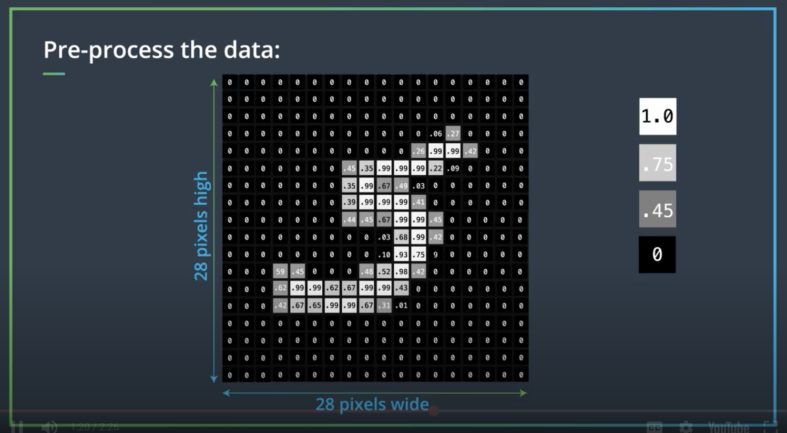
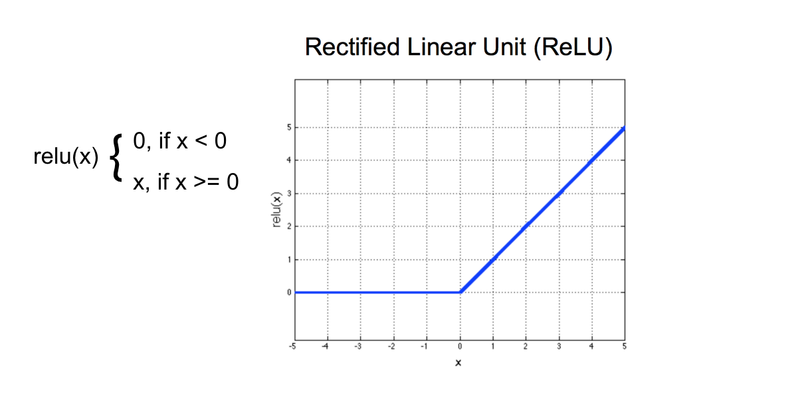
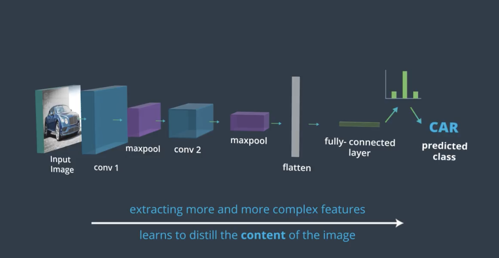
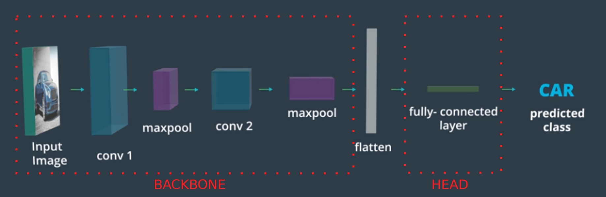

# Convolutional Neural Networks

<br>
<br>

# C-2: CNN Concepts

<br>
<br>

1. Fundamentals of Convolutional Neural Networks
    - CNN Concepts and Architecture
    - Kernel Convolution
    - Weight Sharing and Feature Extraction
2. Comparative Neural Network Architectures
    - Multi-Layer Perceptrons (MLPs) vs Convolutional Neural Networks
    - Structural Differences and Design Principles
3. Advanced CNN Concepts
    - Receptive Fields
    - Pooling Techniques
    - Edge Handling and Image Processing
4. Neural Network Training Process
    - Loss Functions
    - Optimizers
    - Training and Validation Loops
    - CNN-Specific Training Considerations
5. Feature Learning and Hierarchical Representation
    - Layer-by-Layer Feature Extraction
    - From Simple to Complex Feature Detection
6. Practical Implementation and Best Practices
    - Model Design Guidelines
    - Regularization Techniques
    - Performance Monitoring and Improvement

Convolutional Neural Networks are characterized by locally-connected layers, i.e., layers where neurons are connected to
only a limited numbers of input pixels (instead of all the pixels like in fully-connected layers). Moreover, these
neurons share their weights, which drastically reduces the number of parameters in the network with respect to MLPs. The
idea behind this weight-sharing is that the network should be able to recognize the same pattern anywhere in the image.

CNNs can preserve spatial information, and the key to this capability is called the _Convolution operation_: it makes
the network capable of extracting spatial and color patterns that characterize different objects. CNNs use filters (also
known as _kernels_) to _extract_ the features of an object (for example, edges). By using multiple different filters the
network can learn to recognize complex shapes and objects.

Image filters are a traditional concept in computer vision. They are small matrices that can be used to transform the
input image in specific ways, for example, highlighting edges of objects in the image. An edge of an object is a place
in an image where the intensity changes significantly.

To detect these changes in intensity within an image, you can create specific image filters that look at groups of
pixels and react to alternating patterns of dark/light pixels. These filters produce an output that shows edges of
objects and differing textures. We will see that CNNs can learn the most useful filters needed to, for example, classify
an image. But before doing that, let's look at some specific filters that we can create manually to understand how they
work. CNN is developed specifically for image and video processing.

<p align="center">

</p>
<p align="center">figure:  CNN Architecture Blueprint</p>

##### CNN Architecture

A typical CNN block consists of:

1. Convolutional Layer
2. Activation Function (e.g., ReLU)
3. Pooling Layer

##### Concept Abstraction

- Stacking multiple CNN blocks allows the network to learn increasingly complex features
- Early layers detect simple features (edges, textures)
- Deeper layers combine these to detect more complex patterns (shapes, objects)

##### Translation Invariance

- Multiple CNN blocks enable the network to recognize objects regardless of their position in the image
- This is crucial for robust object recognition in various scenarios

##### Image Processing Usage

- CNNs excel at tasks like image classification, object detection, and segmentation
- The combination of convolution and pooling allows for efficient feature learning and dimensionality reduction
- Learned features are often more effective than hand-crafted features

CNNs are used to automate many tasks, for example:

- Image classification
- Object recognition
- Anomaly detection
- Image captioning

They are widely used across many industries, including medicine, banking, manufacturing, insurance, real-estate,
transportation (self-driving cars), and social networks. CNNs are arguably the main technology responsible for the
Artificial Intelligence renaissance we are witnessing today, with a billion of dollars in revenue generated by their
application.

<p align="center">

</p>
<p align="center">figure: Overview of a Convolutional Neural Network applications</p>

<br>
<br>

CNNs are powerful for image tasks, overcoming MLP limitations. The course covers CNN basics, advanced architectures, and
applications like object detection and segmentation. If you use CNNs to power a real product in a real-world setting,
you are going to interact with several different profiles:

- Data Scientist / Machine Learning Engineer: Responsible for developing the ML pipeline and the model, as well as
  performing all the relevant analytics - for example on data quality and performance measurements.
- Data Engineers: Responsible for the data ingestion pipelines, the quality of the data that the DS/MLE receive, and for
  provisioning the right data at inference time.
- Software Engineers: Responsible for the production environment, both front-end and back-end, as well as for many
  pieces of the MLOps infrastructure. Involve them from the beginning to make sure that the model you are producing can
  fit into the production environment.
- DevOps Engineers: Help in handling the infrastructure, including training servers, various MLOps tools, and other
  infrastructure needed to train and deploy a model.
- Product Managers: Define the right problem to solve, exploit the knowledge of the customers, and define quantifiable
  deliverables and success criteria for the project. The PM also helps in keeping the project on time and on budget.
- Customers: Consumer of the product; we should always consider the customers' and users' perspectives for every
  decision that we make.

<p align="center">

</p>
<p align="center">figure: Pre-process the data</p>

An image is seen by the computer as an array of values, namely, a matrix. The images in the MNIST dataset are 28 x 28
and 8-bit grayscale. This means that the computer represents each one of them as a square matrix of 28 x 28 elements,
where the value in the element of the matrix represents the light intensity with a range of 0 to 255: 0 means pure black
and 255 means pure white.

We already know how to perform classification with neural networks, and in particular with a Multi-Layer Perceptron,
MLP. This network takes as input a grayscale image as a matrix and outputs a vector of scores or a vector of
probabilities ( one for each class). The class corresponding to the maximum of that vector corresponds to the best guess
for the label of the image.

#### Multi-Layer Perceptrons (MLPs)

A Multi-Layer Perceptron (MLP) is a type of feedforward artificial neural network consisting of at least three layers:

- An **input layer** that receives the data
- One or more **hidden layers** that perform computations
- An **output layer** that produces the final result

#### How MLPs Work

##### Input Processing

- For image data, the 2D matrix is flattened into a 1D vector
- Each input neuron represents a single feature (e.g., a pixel value)

##### Forward Propagation

- Data flows from input to output in one direction
- Each neuron applies a weighted sum of inputs plus a bias
- The result is passed through an activation function

##### Activation Functions

- ReLU (Rectified Linear Unit): Outputs the positive part of its input
- Sigmoid: Maps input to a value between 0 and 1
- Tanh: Maps input to a value between -1 and 1

#### Architecture Design

- **Input layer size**: Fixed by the data dimension (e.g., 784 for MNIST)
- **Output layer size**: Fixed by the task (e.g., 10 for digit classification)
- **Hidden layer size**: Often start with the mean between input and output dimensions
- **Number of hidden layers**: Start with 1-2 and increase if needed

#### Training Process

1. **Initialize weights**: Small random values
2. **Forward pass**: Compute predictions
3. **Calculate loss**: Typically cross-entropy for classification
4. **Backward pass**: Compute gradients
5. **Update weights**: Using an optimizer like SGD or Adam

#### Limitations for Image Data

- **Loss of spatial information**: Flattening destroys the 2D structure
- **No translation invariance**: Objects must be seen in all possible positions
- **Parameter inefficiency**: Fully connected layers have many parameters
- **Difficulty with complex patterns**: Struggles to learn hierarchical features

#### When to Use MLPs

- Tabular data
- Simple pattern recognition
- Data without spatial or temporal relationships
- When input features are independent

MLPs provide the foundation for understanding more complex neural networks like CNNs, which address many of these
limitations for image processing tasks.

##### Flattening

Suppose we want to use an MLP to classify our image. The problem is, the network takes a 1d array as input, while we
have images that are 28x28 matrices. The obvious solution is to flatten the matrix, i.e., to stack all the rows of the
matrix in one long 1D vector, as in the image below.

<p align="center">

</p>
<p align="center">figure: flattening of the matrix</p>

<br>
<br>

##### Normalizing Image Inputs

##### Data Normalization

Data normalization is a critical preprocessing step in neural networks that transforms input data to have similar
scales. For image data, this means converting pixel values (typically 0-255) to smaller ranges.

##### Why Normalize Data?

1. **Faster convergence**: When inputs are normalized (close to zero), gradient descent works more efficiently
2. **Improved stability**: Prevents extremely large or small weight updates during training
3. **Better learning**: Helps the network learn the relative importance of features rather than being affected by their
   scales

##### Normalization Methods for Images:

1. **Simple scaling**: Divide pixel values by 255 to get values between 0 and 1
2. **Standardization**: Subtract mean and divide by standard deviation to get:
   $$x_{normalized} = \frac{x - \mu}{\sigma}$$
3. **Approximation method**: Use mean=0.5 and standard deviation=0.5 to center values:
   $$x_{normalized} = \frac{x/255 - 0.5}{0.5}$$

##### Activation Functions

Activation functions introduce non-linearity into neural networks, allowing them to learn complex patterns.

###### Sigmoid Activation Function

- **Mathematical form**: $$\sigma(z) = \frac{1}{1 + e^{-z}}$$

- **Output range**: Between 0 and 1

- Characteristics:

    - S-shaped curve
    - Highest rate of change around z=0
    - Almost flat (saturated) when z is very positive or very negative
    - Derivative: $$\sigma'(z) = \sigma(z)(1 - \sigma(z))$$
    - Maximum derivative of 0.25 at z=0

###### ReLU (Rectified Linear Unit) Activation Function

The purpose of an activation function is to scale the outputs of a layer so that they are consistent, small values. Much
like normalizing input values, this step ensures that our model trains efficiently!

A ReLU activation function stands for _Rectified Linear Unit_ and is one of the most commonly used activation functions
for hidden layers. It is an activation function, simply defined as the positive part of the input, x. So, for an input
image with any negative pixel values, this would turn all those values to 0, black. You may hear this referred to as
_clipping_ the values to zero; meaning that is the lower bound.

<p align="center">

</p>
<p align="center">figure:  ReLU Activation Function</p>

- **Mathematical form**: $$R(z) = \max(0, z)$$
- **Output range**: From 0 to ∞
- Characteristics:

    - Simple piecewise linear function
    - Zero output for negative inputs
    - Linear for positive inputs
    - Derivative: $$R'(z) = \begin{cases} 0 & \text{if } z < 0 \ 1 & \text{if } z > 0 \end{cases}$$
    - Undefined at z=0, but in practice set to 0 or 1

##### Connection Between Normalization and Activation Functions

When we normalize data to be close to zero and initialize weights near zero:

1. The product of weights and inputs results in values near zero: $$z = w \cdot x + b \approx 0$$
2. At z≈0, activation functions have their largest derivatives:
    - For sigmoid: maximum derivative of 0.25
    - For ReLU: abrupt change from 0 to 1
3. This maximizes the effect of gradient descent:
   $$\Delta w = -\eta \frac{\partial L}{\partial w} = -\eta \frac{\partial L}{\partial a} \cdot \frac{\partial a}{\partial z} \cdot \frac{\partial z}{\partial w}$$

Where the middle term $$\frac{\partial a}{\partial z}$$ is the derivative of the activation function, which is largest
near zero.

This is why normalizing inputs to be close to zero allows for faster training and better convergence in neural networks.
Data normalization is an important pre-processing step for neural networks. The activation functions that are normally
used in neural networks (sigmoid, ReLU, ...) have the highest rate of change around 0:

<p align="center">

</p>
<p align="center">figure:  Normalizing Image Inputs</p>

<br>
<br>

This means that their derivative is large for inputs that are not too far from 0. Since we train neural networks with
gradient descent, the training can proceed faster if the weights stay in the vicinity of where the activation function
changes rapidly, i.e., close to 0.

The weights of a neural network are typically initialized with a mean of 0, i.e., some weights are negative and some are
positive, but they are in general between -1 and +1, close to 0. Remember that these weights are multiplied with the
feature values (in this case the pixel values) and then a bias is added on top before the result is fed to the
activation function.

Therefore, if we want the input of the activation function to be somewhere close to 0, we need to start with a number
that is close to zero, because two numbers close to zero multiplied together give another number close to zero. So we
need to take the pixels in the input image, which in the case of a grayscale image have values between 0 and 255, and
renormalize them to be close to zero. The easiest way is to just divide the value by 255, thereby changing the pixel
values to be between 0 and 1. In many cases, we go further than that: we compute the mean and the standard deviation of
all the pixels in the renormalized dataset, then we subtract the mean and divide by the standard deviation for each
image separately. Therefore, our transformed data will contain both negative and positive pixels with mean 0 and
standard deviation 1. Sometimes you'll see an approximation here, where we use a mean and standard deviation of 0.5 to
center the pixel values.

#### Dropout

Dropout is a regularization technique that helps prevent neural networks from overfitting. Here's how it functions:

1. **During training**:
    - Randomly deactivates (or "drops out") a percentage of neurons in a layer
    - If the `Dropout(0.5)`, it means 50% of neurons are randomly disabled each batch
    - Each neuron has a 50% probability of being temporarily removed
2. **Neuron deactivation**:
    - Set the output of dropped neurons to zero
    - The remaining neurons must compensate for the missing ones
    - This forces the network to be more robust and redundant
3. **Scaling mechanism**:
    - Remaining active neurons are scaled up by 1/(1-p) where p is dropout rate
    - With 50% dropout, active neurons' outputs are doubled
    - This keeps the expected sum of activations the same
4. **During inference (testing)**:
    - No neurons are dropped out
    - Instead, all neurons are active but their outputs are scaled down
    - Alternatively, during training the active neurons are scaled up
5. **Benefits**:
    - Prevents co-adaptation (neurons becoming too interdependent)
    - Acts like an ensemble of different networks
    - Reduces overfitting by preventing memorization

Dropout essentially makes the network learn multiple redundant ways to classify each sample, making it more robust and
resistant to overfitting.

<br>
<br>

#### MLP for MNIST Dataset

The input of our MLP must obviously be 28 x 28=784, which corresponds to the dimension of the flattened image. The
output of the MLP must also be obviously a vector with 10 elements (e.g. 0 to 9). The values in this vector are
proportional to the probability that the network assigns to each class. So if the network thinks that it is most likely
that the given image is an 8, then the element in the array corresponding with 8 should be the largest. But what goes
between the input and the output, how many hidden layers, and how many neurons.

<p align="center">

</p>
<p align="center">figure:  A Multi-Layer Perceptron for MNIST</p>

<br>
<br>

<p align="center">

</p>
<p align="center">figure: Visualization of the neural network training process and data flow</p>

<br>
<br>

#### Loss Function

The loss function quantifies how far we are from the ideal state where the network does not make any mistakes and has
perfect confidence in its answers. Depending on the task and other considerations we might pick different loss
functions. For image classification the most typical loss function is the _Categorical Cross-Entropy (CCE)_ loss,
defined as:

$$
\text{CCE} = -\sum_{i=1}^{n_\text{classes}} y_i \log(\hat{p}_i)
$$

Where:

- $n_\text{classes}$ is the number of classes (10 for MNIST digits)
- $y_i$ is the true label (ground truth) as a one-hot encoded vector of length 10
- $\hat{p}_i$ is the predicted probability for class $i$

<br>
<br>

The interpretations of the Loss Function are:

1. The loss quantifies the difference between the predicted probability distribution and the true distribution (one-hot
   encoded ground truth).
2. A perfect prediction would result in a loss of 0, while incorrect predictions increase the loss value.
3. The logarithm heavily penalizes confident misclassifications, encouraging the model to be cautious with its
   predictions.

This loss function is well-suited for our MNIST task because:

1. It naturally handles multi-class problems.
2. It encourages the model to output well-calibrated probabilities.
3. It's differentiable, allowing for effective backpropagation during training.

By minimizing this loss during training, we push our model to make increasingly accurate predictions on the digit
classification task.

<br>
<br>

#### Design of an MLP

When designing an MLP you have a lot of different possibilities, and it is sometimes hard to know where to start.
Unfortunately there are no strict rules, and experimentation is key. However, here are some guidelines to help you get
started with an initial architecture that makes sense, from which you can start experimenting.

The number of inputs _input_dim_ is fixed (in the case of MNIST images for example it is 28 x 28 = 784), so the first
layer must be a fully-connected layer (Linear in PyTorch) with _input_dim_ as input dimension.

Also, the number of outputs is fixed as it is determined by the desired outputs. For a classification problem it is the
number of classes, _n_classes_, and for a regression problem it is 1 (or the number of continuous values to predict). So
the output layer is a Linear layer with _n_classes_ (in case of classification).

What remains to be decided is the number of _hidden layers_ and their _size_. Typically, you want to start from only one
hidden layer, with a number of neurons between the input and the output dimension. Sometimes adding a second hidden
layer helps, and in rare cases you might need to add more than one. But one is a good starting point.

As for the number of neurons in the hidden layers, a decent starting point is usually the mean between the input and the
output dimension. Then you can start experimenting with increasing or decreasing, and observe the performances you get.
If you see overfitting, start by adding regularization (dropout and weight decay) instead of decreasing the number of
neurons, and see if that fixes it. A larger network with a bit of drop-out learns multiple ways to arrive to the right
answer, so it is more robust than a smaller network without dropout. If this doesn't address the overfitting, then
decrease the number of neurons. If you see underfitting, add more neurons. You can start by approximating up to the
closest power of 2. Keep in mind that the number of neurons also depends on the size of your training dataset: a larger
network is more powerful, but it needs more data to avoid overfitting. The Key Points for the MLP Design are:

1. **Input layer size**: Fixed by input data dimensions
2. **Output layer size**: Fixed by classification or regression task requirements
3. **Hidden layers**: Start with one hidden layer as baseline
4. **Hidden layer sizing**: Begin with mean between input and output dimensions
5. **Regularization first**: Add dropout before reducing model size if overfitting
6. **Scale with data**: Larger networks need more training data
7. **Adjust incrementally**: Experiment by gradually changing architecture
8. **Monitor performance**: Use validation data to guide architecture decisions

So let's consider the MNIST classification problem. We have _n_classes_ = 10 and _input_dim_ = 784, so a starting point
for our experimentation could be:

<br>
<br>

```python
import torch
import torch.nn as nn


class MLPModel(nn.Module):

    def __init__(self):
        super().__init__()

        # Create layers. In this case just a standard MLP
        self.model = nn.Sequential(
            # Input layer. The input is obviously 784. For
            # the output (which is the input to the hidden layer)
            # we take the mean between network input and output:
            # (784 + 10) / 2 = 397 which we round to 400
            nn.Linear(784, 400),
            nn.Dropout(0.5),  # Combat overfitting
            nn.ReLU(),
            # Hidden layer
            nn.Linear(400, 400),
            nn.Dropout(0.5),  # Combat overfitting
            nn.ReLU(),
            # Output layer, must receive the output of the
            # hidden layer and return the number of classes
            nn.Linear(400, 10)
        )

    def forward(self, x):
        # nn.Sequential will call the layers
        # in the order they have been inserted
        return self.model(x)
```

This code defines an MLP model for MNIST digit classification. It contains two hidden layers, both with 400 neurons. The
network takes flattened 28×28 pixel images (784 inputs), processes them through the first hidden layer with ReLU
activation and 50% dropout, then through an identical second hidden layer, and finally outputs 10 values corresponding
to digit class scores. The model uses a sequential architecture where data flows linearly through each layer. The
dropout layers help prevent overfitting by randomly deactivating 50% of neurons during training. The forward method
simply passes the input through the sequential model, returning the final output without applying any additional
activation function (allowing it to be used with CrossEntropyLoss which includes softmax internally).

<br>
<br>

#### Sequential vs. Non-Sequential Neural Networks

Sequential and Non-Sequential networks represent different ways to structure neural networks:

##### Sequential Neural Networks

1. **Definition**: Linear stack of layers where output of one layer becomes input to the next
2. **Data flow**: Strictly forward in one direction
3. **Structure**: Simple chain-like arrangement of layers
4. **Implementation**: Often implemented using `nn.Sequential` in PyTorch
5. **Best for**: Straightforward tasks with simple data flow requirements

A sequential neural network is a linear stack of layers where the output of one layer becomes the input to the next
layer. This is the simplest and most common type of neural network architecture. The main characteristics of a
sequential neural network are:

1. Layers are arranged in a straight line.
2. Data flows through the network in a single, forward direction.
3. Easy to conceptualize and implement.

##### Non-Sequential Neural Networks

1. **Definition**: Networks with complex connectivity patterns beyond simple chains
2. **Data flow**: Can branch, merge, skip connections, or have feedback loops
3. **Structure**: Can have multiple inputs/outputs or complex internal connections
4. **Implementation**: Typically requires custom `forward()` method definition
5. Types include:
    - Networks with skip connections (ResNets)
    - Multi-path networks
    - Networks with shared components
    - Graph-based networks

It is absolutely possible, and often necessary, to have neural networks that are not sequential. They are sometimes also
called non-linear neural networks. The types of Non-Sequential Architectures are provided below:

1. Branching Networks: Where the data flow splits and merges.
2. Residual Networks (ResNets): Include skip connections that bypass one or more layers.
3. Recurrent Neural Networks (RNNs): Have feedback loops, allowing information to persist.
4. Graph Neural Networks: Operate on graph-structured data.
5. Multi-Input or Multi-Output Networks: Accept or produce multiple tensors.

##### When to Use Non-Sequential Networks

1. Complex Data Dependencies: When your data has complex relationships that can't be captured by a simple linear flow.
2. Performance Improvement: Techniques like skip connections in ResNets can help with training very deep networks.
3. Task-Specific Requirements: Some tasks inherently require non-sequential processing, like image segmentation or
   machine translation.
4. Multi-Modal Data: When working with multiple types of input data simultaneously.

Non-sequential architectures offer more flexibility and can often capture more complex patterns in data, but they can
also be more challenging to design and train. The key differences of them with the sequential architectures are:

1. **Flexibility**: Non-Sequential offers more design flexibility
2. **Complexity**: Sequential is simpler to implement and understand
3. **Use cases**: Complex tasks often require non-sequential architectures
4. **Implementation complexity**: Sequential can be defined with one container, while non-sequential requires more code

The architecture choice depends on the specific requirements of your task - Sequential is sufficient for many problems,
while complex tasks may benefit from non-sequential designs.

#### Advanced CNN Concepts

##### Kernel Convolution

Kernel convolution is the fundamental mathematical operation that allows Convolutional Neural Networks to detect
features in images. Think of it as a spotlight that systematically moves across an image, focusing on small regions at a
time to detect patterns like edges, textures, and shapes. This operation is what gives CNNs their remarkable ability to
understand visual content.

At its core, kernel convolution involves sliding a small matrix of weights (the kernel or filter) over an input image
and performing element-wise multiplication followed by summation at each position. This creates a new image called a
feature map that highlights specific patterns detected by that particular kernel. It’s a fundamental operation in
Convolutional Neural Networks (CNNs) that enables the network to detect features in images. It works as:

1. Kernel (Filter): A small matrix of weights, typically 3x3 or 5x5 as below:

    ```shell
    	[ 0  -1   0]
    	[-1   4  -1]
    	[ 0  -1   0]
    ```

2. Sliding Window: The kernel slides over the input image.

3. Element-wise Multiplication: At each position, the kernel is multiplied element-wise with the overlapping image
   patch.

4. Summation: The products are summed to produce a single output value.

The convolution operation proceeds as follows:

1. Align the kernel with the image patch
2. Multiply each kernel value with its corresponding image pixel
3. Sum all the resulting products

Say, an mage Patch (3x3) is:

```shell
	[140 120 120]
	[225 220 205]
	[255 250 230]
```

The value in the output feature map for this position will be:

```shell
(0*140) + (-1*120) + (0*120) + (-1*225) + (4*220) + (-1*205) + (0*255) + (-1*250) + (0*230) = 60
```

This output value (60) becomes the value in the corresponding position of the output feature map. The kernel then shifts
by a predefined stride (typically 1 pixel) and repeats this process for the next position, eventually covering the
entire image.

###### Why Kernel Convolution Matters

Kernel convolution offers several critical advantages for image processing:

1. **Parameter efficiency**: By sharing the same kernel weights across the entire image, CNNs dramatically reduce the
   number of parameters compared to fully-connected networks.
2. **Spatial hierarchy**: As convolutions are stacked in deeper layers, the network builds a hierarchical
   representation, capturing increasingly complex features from edges to textures to object parts.
3. **Translation invariance**: The same kernel can detect a pattern regardless of where it appears in the image, making
   CNNs naturally robust to object position variations.
4. **Preserving spatial relationships**: Unlike MLPs that flatten images, convolution preserves the spatial arrangement
   of pixels, allowing the network to understand the 2D structure of images.

##### Common Kernel Types and Their Functions

Kernels (or filters) in CNNs act as feature detectors that highlight specific patterns in images. Different kernels are
designed to respond to different visual elements. Understanding these kernels helps us grasp how CNNs "see" images.

###### Edge Detection Kernels

Edge detection kernels identify boundaries between different regions in an image—places where pixel intensity changes
significantly.

The Sobel horizontal edge detector:

```shell
[-1 -2 -1]
[ 0  0  0]
[ 1  2  1]
```

This kernel responds strongly to horizontal edges. The top row has negative weights and the bottom row has positive
weights, creating a strong response when there's a transition from dark (above) to light (below). The middle row of
zeros acts as a "neutral zone" between the detecting regions. The central coefficients (-2, 2) have stronger weights to
emphasize the center of the detection.

The Sobel vertical edge detector:

```shell
[-1  0  1]
[-2  0  2]
[-1  0  1]
```

This kernel detects vertical edges using the same principle, but rotated 90 degrees. The left column has negative
weights and the right column has positive weights, creating a strong response at vertical transitions from dark (left)
to light (right).

###### Other Important Kernel Types

Beyond edge detection, CNNs use various other kernels:

**Sharpening kernel:**

```shell
[ 0 -1  0]
[-1  5 -1]
[ 0 -1  0]
```

This kernel enhances details by amplifying the difference between a pixel and its neighbors.

**Gaussian blur kernel:**

```shell
1/16 * [1 2 1]
       [2 4 2]
       [1 2 1]
```

This reduces noise and detail by averaging neighboring pixels, giving more weight to the central pixels.

**Emboss kernel:**

```shell
[-2 -1  0]
[-1  1  1]
[ 0  1  2]
```

This creates a 3D effect by highlighting edges with shadow and light.

##### Learning Kernels in CNNs

The true power of CNNs comes from their ability to learn the most effective kernels automatically through
backpropagation. While we can manually design kernels like those above, CNNs discover optimal filters for their specific
tasks:

1. Early CNN layers tend to learn kernels similar to edge detectors
2. Middle layers combine these edges to detect shapes and textures
3. Deeper layers learn highly specialized filters that respond to complex objects

This hierarchical learning allows CNNs to build increasingly sophisticated representations from simple building blocks.

##### Edge Handling

When applying convolution, we encounter a practical problem: what happens when the kernel extends beyond the image
boundaries? This is the edge handling problem, and how we solve it significantly impacts our feature maps. The Common
Edge Handling Techniques are:

###### Padding

The most common approach is padding, where we add extra pixels around the image border before applying convolution. With
zero-padding, we add zeros (black pixels) around the edges:

```shell
000000000
0XXXXXXX0
0XXXXXXX0
0XXXXXXX0
000000000
```

Zero-padding offers two main benefits:

- It preserves the original image dimensions in the output feature map
- It gives equal importance to pixels throughout the image, including those at the edges

Without padding, the output feature map would shrink with each convolution layer, eventually losing significant
information about the image boundaries.

###### Cropping

Another approach is to simply avoid placing the kernel where it would extend beyond the image boundary. This results in
a smaller output feature map:

- An n×n image convolved with a k×k kernel (without padding) will produce an output of size (n-k+1)×(n-k+1)
- This approach discards edge information but ensures that all convolution operations use only valid image data

###### Extension

Sometimes we extend the border pixels outward rather than adding zeros:

- Corner pixels extend diagonally in 90° wedges
- Edge pixels extend in straight lines
- This maintains the original image size while avoiding the artificial boundary created by zero-padding

###### Choosing the Right Edge Handling Method

The choice of edge handling technique depends on several factors:

- **Zero-padding** is most common in modern architectures, especially when preserving dimensional information is
  important
- **Cropping** might be preferred when edge artifacts are a concern
- **Extension** can be useful when edge information is particularly important for the task

Understanding both kernel convolution and edge handling provides the foundation for grasping how CNNs process and learn
from images. These operations allow CNNs to systematically extract features while maintaining the spatial relationships
that make visual data meaningful.

##### Pooling

Pooling is a dimension reduction technique that compresses feature maps while retaining their most important
information. Think of pooling as creating a lower-resolution summary of the detected features, similar to how you might
squint at an image to see its essential structure without fine details.

It’s is a mechanism often used in CNNs (and in neural networks in general). Pooling compresses information from a layer
by summarizing areas of the feature maps produced in that layer. It works by sliding a window over each feature map,
just like convolution, but instead of applying a kernel we compute a summary statistic (for example the maximum or the
mean). If we take the maximum within each window, then we call this Max Pooling.

A block consisting of a convolutional layer followed by a max pooling layer (and an activation function) is the typical
building block of a CNN. By combining multiple such blocks, the network learns to extract more and more complex
information from the image. Moreover, combining multiple blocks allows the network to achieve translation invariance,
meaning it will be able to recognize the presence of an object wherever that object is translated within the image.

###### How Pooling Works

The pooling operation involves:

1. Defining a window size (typically 2×2)

2. Moving this window across the feature map in strides (usually 2, meaning non-overlapping windows)

3. Computing a summary statistic for each window

4. Creating a new, smaller feature map from these statistics

<p align="center">

</p>
<p align="center">figure: Pooling operation in a neural network, summarizing feature maps</p>

###### Types of Pooling

###### Max Pooling

Max pooling keeps the maximum value from each window. For example, with a 2×2 window:

```shell
| 3  7 |    →    | 9 |
| 4  9 |
```

Max pooling is the most common type because it preserves the strongest feature activations—essentially keeping the "most
important" signals. It's particularly effective for features like edges where the maximum response indicates the
presence of that feature.

###### Average Pooling

Average pooling computes the mean of all values in the window:

```shell
| 3  7 |    →    | 5.75 |
| 4  9 |
```

Average pooling creates a smoother representation that considers all activations in the region. It's sometimes preferred
for:

- Background or texture information where the overall pattern matters more than peak values
- Later layers where feature maps represent higher-level concepts

###### Global Pooling

Global pooling applies the pooling operation across the entire feature map, reducing each map to a single value:

- Global Max Pooling: Keeps the maximum value from the entire feature map
- Global Average Pooling: Computes the average of all values in the feature map

Global pooling is often used in the final layers of a CNN to create a fixed-length feature vector regardless of input
size.

###### Why Pooling Matters

Pooling provides several critical benefits to CNN architectures:

###### Spatial Dimension Reduction

By reducing feature map dimensions (typically by 75% with 2×2 pooling), pooling:

- Decreases computational requirements
- Reduces memory consumption
- Allows deeper networks with the same computational budget

###### Translation Invariance

Pooling creates a form of positional tolerance—features are detected regardless of their exact location. For example,
max pooling will detect an edge whether it appears in the top-left or bottom-right of the pooling window.

###### Preventing Overfitting

By reducing the spatial resolution, pooling forces the network to focus on larger patterns rather than memorizing
pixel-exact details, which helps prevent overfitting to the training data.

Understanding how different kernel types extract various features and how pooling operations condense this information
is essential for mastering the inner workings of CNNs. These operations work together to transform raw pixel data into
increasingly abstract and meaningful representations that enable powerful image understanding.

<p align="center">

</p>
<p align="center">figure: Pooling operation in a neural network, summarizing feature maps</p>

##### Receptive Fields

The receptive field concept is fundamental to understanding how CNNs process visual information. Imagine looking through
a small window at a large mural - the receptive field represents how much of the original mural each neuron in the
network can "see."

In simple terms, a receptive field is the region in the input image that affects a particular neuron in any given layer
of the CNN. This concept helps explain how CNNs build a hierarchical understanding of images, from simple edges to
complex objects. There are 2 types of Receptive Fields:

###### Theoretical Receptive Field

The theoretical receptive field refers to the entire input area that could mathematically influence a neuron's output.
It represents the maximum possible region of influence based on the network architecture.

For example, in a network with two 3×3 convolutional layers, a neuron in the second layer theoretically has access to a
5×5 region of the input (each neuron in the first layer sees 3×3 pixels, and the second-layer neuron combines
information from 3×3 first-layer neurons).

###### Effective Receptive Field (ERF)

The effective receptive field is the area that actually has significant influence on a neuron's output in practice. This
is typically smaller than the theoretical receptive field and has a non-uniform distribution of influence.

Think of it like a spotlight with a bright center that fades toward the edges. Pixels at the center of the ERF have much
stronger influence on the neuron's activation than pixels at the periphery, creating a Gaussian-like distribution of
influence.

##### Key Characteristics

###### Shape and Distribution

The ERF typically has a Gaussian-like distribution of influence. This means:

- Central pixels contribute most strongly to the neuron's output
- Influence gradually diminishes toward the edges of the receptive field
- This non-uniform distribution helps the network focus on the most relevant parts of the image

###### Size Evolution Through Layers

As we move deeper into the network:

- The receptive field grows progressively larger
- Early layers capture local features (edges, textures) with small receptive fields
- Middle layers capture patterns and parts with medium-sized receptive fields
- Deep layers capture complex objects and global context with large receptive fields

This hierarchical structure allows CNNs to build understanding from small details to complete objects.

###### Factors Affecting Receptive Field Size

Several network design choices directly impact receptive field size:

- Larger kernel sizes increase the receptive field more rapidly
- Strides greater than 1 expand the receptive field while reducing spatial dimensions
- Pooling layers effectively increase the receptive field by summarizing information
- Network depth adds more layers, each expanding the cumulative receptive field

###### Dynamic Nature During Training

Interestingly, effective receptive fields are not static but evolve during training:

- Early in training, the network may use information from a broader area
- As training progresses, the ERF often becomes more focused on the most discriminative regions
- This evolution reflects the network learning which input regions are most informative for the task

##### Measuring and Visualizing Receptive Fields

Researchers have developed several techniques to analyze receptive fields:

###### Gradient-Based Approaches

These methods backpropagate gradients from a specific neuron to the input image, revealing which input pixels most
strongly affect that neuron's activation.

###### Deconvolution Techniques

By reversing the flow of information through the network, deconvolution can reconstruct the input patterns that trigger
specific neurons.

##### Visualization Methods

- Heat maps showing the influence distribution of input pixels
- Overlaying ERF boundaries on input images to demonstrate coverage
- Analyzing how changes to specific input regions affect deep layer activations

##### Importance in CNN Architecture Design

Understanding receptive fields has profound implications for designing effective CNN architectures:

###### Feature Hierarchy Design

- Shallow layers need small receptive fields to capture local details
- Deep layers need large receptive fields to understand global context
- Balancing these needs is crucial for tasks like object detection

###### Computational Efficiency

- Larger receptive fields generally require more computation
- Architectural choices like dilated convolutions can increase receptive field size without proportional increases in
  computation

###### Scale Sensitivity

- For tasks involving objects of different sizes, appropriate receptive field sizes are crucial
- Too small: the network can't "see" large objects entirely
- Too large: the network may struggle with fine details

##### Advanced Techniques for Receptive Field Manipulation

###### Dilated (Atrous) Convolutions

This technique inserts "holes" in the convolutional kernel, allowing it to cover a larger input area without increasing
the number of parameters.

For example, a 3×3 kernel with a dilation rate of 2 would have the same number of parameters as a regular 3×3 kernel,
but would cover a 5×5 input area.

###### Attention Mechanisms

These allow the network to dynamically adjust which parts of the input it "attends to" based on the content:

- The network can effectively expand or contract its focus area
- This creates adaptive receptive fields that can zoom in on relevant details or zoom out for context

By understanding receptive fields, we gain deeper insights into how CNNs transform pixel-level information into
meaningful visual understanding. This knowledge guides the development of more effective network architectures tailored
to specific computer vision tasks.

#### MLP vs CNN: Architecture Comparison

##### Multi-Layer Perceptrons (MLPs)

###### Structure and Connectivity

MLPs consist of fully connected layers where each neuron connects to every neuron in adjacent layers. This complete
connectivity creates a dense network that treats all inputs with equal importance, regardless of their spatial
relationships.

###### Input Processing

MLPs require 1D input vectors, necessitating the flattening of structured data like images. When a 28×28 image is
flattened into a 784-element vector, the spatial relationships between adjacent pixels are lost. The network has no
inherent understanding that pixels near each other in the original image should be processed together.

###### Parameter Efficiency

Due to their full connectivity, MLPs require an enormous number of parameters for high-dimensional inputs. A single
hidden layer with 100 neurons processing a flattened 784-pixel image would need 78,400 weights plus biases. This
parameter inefficiency makes MLPs prone to overfitting, especially with limited training data.

###### Feature Learning Approach

MLPs learn global patterns across the entire input vector without any built-in hierarchical structure. They must learn
relationships between distant pixels from scratch, making it difficult to capture the spatial patterns crucial for image
understanding.

###### Invariance Properties

MLPs have no built-in mechanisms for handling translation, rotation, or scaling of patterns. To recognize the same
object in different positions, the network must essentially learn each position as a separate case, drastically
increasing the required training data.

###### Ideal Applications

MLPs excel with tabular data where features have no inherent spatial or sequential relationship. They work well for
tasks like:

- Financial data analysis
- Customer behavior prediction
- Simple pattern recognition in fixed-format data

##### Convolutional Neural Networks (CNNs)

###### Structure and Connectivity

CNNs use specialized layers with local connectivity patterns. Convolutional layers connect neurons to only a small
region of the previous layer, and pooling layers summarize local information. This architecture aligns perfectly with
the structure of visual data.

###### Input Processing

CNNs maintain the original dimensional structure of the input data (2D for images, 3D for videos). This preservation of
spatial topology allows the network to process related pixels together and build an understanding of spatial
relationships.

###### Parameter Efficiency

Through weight sharing, CNNs dramatically reduce parameter count. A single 3×3 convolutional filter applied across an
entire image uses just 9 weights (plus a bias), yet can detect a specific feature anywhere in the image. This efficiency
improves generalization and reduces overfitting.

###### Feature Learning Approach

CNNs naturally build hierarchical representations:

- Early layers detect simple features like edges and textures
- Middle layers combine these to form parts and motifs
- Deep layers assemble complete objects and scenes

This hierarchy mirrors the organization of the visual cortex in biological systems.

###### Invariance Properties

CNNs have built-in mechanisms for translation invariance through their sliding filter design and pooling operations.
This means they can recognize patterns regardless of where they appear in the image, significantly improving
generalization from limited examples.

###### Ideal Applications

CNNs excel at tasks involving data with spatial or temporal structure:

- Image classification and segmentation
- Object detection and localization
- Video analysis
- Even non-visual data that can be represented in grid-like formats (e.g., audio spectrograms)

##### Key Architectural Differences

The fundamental differences between MLPs and CNNs highlight why each is suited to different types of problems:

1. **Spatial awareness**: CNNs preserve and leverage spatial relationships that MLPs discard
2. **Parameter sharing**: CNNs reuse the same weights across different image locations, while MLPs assign unique weights
   to each input-neuron connection
3. **Hierarchical processing**: CNNs naturally build features from simple to complex, while MLPs must learn global
   patterns directly
4. **Built-in invariances**: CNNs handle translation and, to some extent, minor deformations automatically
5. **Computational efficiency**: CNNs require fewer parameters and less training data to achieve good performance on
   spatial data

##### Choosing Between MLP and CNN

The decision between using an MLP or CNN should be guided by the nature of your data and task:

**Choose MLPs when**:

- Your data has no inherent spatial or sequential structure
- Features are independent and equally important
- The input dimensionality is relatively low
- Interpretability of individual feature importance is needed

**Choose CNNs when**:

- Working with images, videos, or grid-structured data
- Spatial relationships between input features matter
- You need to detect patterns regardless of their exact position
- The same pattern appears multiple times across your input

Understanding these architectural differences allows you to select the appropriate neural network type for your specific
machine learning challenge, leveraging the unique strengths of each design.

#### Training Neural Networks

Imagine you're teaching a child to recognize different animals. At first, they make many mistakes, but with each example
you show and correct, they gradually improve. Training a neural network follows a similar pattern. The process begins
with preparing your data, designing a model architecture, and then guiding the model through thousands of examples where
it makes predictions, receives feedback on its errors, and adjusts its understanding accordingly.

This iterative learning cycle is powered by a mathematical process called gradient descent, where the model
systematically adjusts its internal parameters (weights and biases) to minimize the difference between its predictions
and the actual answers. Think of it as the model slowly finding its way down a mountain of errors to reach the valley of
good predictions. Let's explore each component of this fascinating process in detail. The essential components of Neural
Network training are following:

##### Loss Function

The loss function serves as our measure of how wrong the model's predictions are. For classification tasks like
identifying digits or categorizing images, we typically use Cross Entropy Loss. This function has an elegant
mathematical property: it severely penalizes the model when it's confidently wrong, but only mildly when it's slightly
off.

Cross Entropy Loss combines two operations: first, it converts raw model outputs into probabilities using the softmax
function, and then it measures how different these probabilities are from the true labels. In PyTorch, this is
conveniently packaged in `nn.CrossEntropyLoss()`. The lower this number, the better our model is performing.

##### Optimizer

While the loss function tells us how far off we are, the optimizer determines how to adjust the model parameters to
improve. Think of the optimizer as a navigator helping the model traverse the complex landscape of possible parameter
values. Popular optimizers include:

**Stochastic Gradient Descent (SGD)**: The classic approach that moves parameters in the direction that reduces the
loss, scaled by a learning rate. Like taking careful steps down our error mountain.

**Adam**: A more sophisticated navigator that adapts its step size based on recent history, often reaching good
solutions faster. Adam maintains separate learning rates for each parameter and adjusts them based on recent gradients.

When configuring an optimizer, you'll specify which parameters to update (typically all model parameters with
`model.parameters()`), the learning rate (how big each adjustment step should be), and sometimes weight decay (a
technique to prevent overfitting by keeping parameters small).

##### Training Loop

The training loop is where the actual learning happens. For a specified number of epochs (complete passes through the
dataset), we repeatedly:

1. Put the model in training mode with `model.train()` to enable dropout and other training-specific behaviors.
2. For each batch of data:
    - Clear previous gradients with `optimizer.zero_grad()` to start fresh.
    - Perform a forward pass by feeding data through the model: `output = model(data)`.
    - Calculate the loss between the model's output and the true targets.
    - Compute gradients with `loss.backward()`, which determines how each parameter should change.
    - Update parameters with `optimizer.step()`, which applies these changes according to the optimizer's rules.
3. Track the average loss to monitor progress.

This cycle of prediction, error measurement, and adjustment is the essence of how neural networks learn.

##### Validation

After each training epoch, we need to assess how well our model generalizes to data it hasn't seen before. The
validation process:

1. Disables gradient calculation with `with torch.no_grad():` since we're not learning here, just evaluating.

2. Sets the model to evaluation mode with `model.eval()`, which affects layers like Dropout.

3. Runs predictions on the validation data and calculates metrics like loss and accuracy.

4. Compares validation performance to previous epochs.

Validation serves two crucial purposes:

- It tells us how well our model will likely perform on new data.
- It helps detect overfitting, where training performance improves but validation performance worsens, indicating the
  model is memorizing training data rather than learning generalizable patterns.

A useful practice is saving model weights whenever validation performance reaches a new high, ensuring we keep our best
model even if performance later deteriorates. Once we have performed an epoch of training we can evaluate the model
against the validation set to see how it is doing. This is accomplished with the validation loop:

```python
# Tell pytorch to stop computing gradients for the moment
# by using the torch.no_grad() context manager
with torch.no_grad():
    # set the model to evaluation mode
    # This changes the behavior of some layers like
    # Dropout with respect to their behavior during
    # training
    model.eval()

    # Keep track of the validation loss
    valid_loss = 0.0

    # Loop over the batches of validation data
    # (here we have removed the progress bar display that is
    # accomplished using tqdm in the video, for clarity)
    for batch_idx, (data, target) in enumerate(valid_dataloader):
        # 1. forward pass: compute predicted outputs by passing inputs to the model
        output = model(data)

        # 2. calculate the loss
        loss_value = criterion(output, target)

        # Calculate average validation loss
        valid_loss = valid_loss + (
                (1 / (batch_idx + 1)) * (loss_value.data.item() - valid_loss)
        )

    # Print the losses
    print(f"Epoch {epoch + 1}: training loss {train_loss:.5f}, valid loss {valid_loss:.5f}")

```

It is usually a good idea to wrap the validation loop in a function so you can return the validation loss for each
epoch, and you can check whether the current epoch has the lowest loss so far. In that case, you save the weights of the
model. We will see in one of the future exercises how to do that.

##### Testing Phase

Once training is complete, we evaluate the model on a completely unseen test dataset. This process is nearly identical
to validation but serves as the final, unbiased assessment of our model's capabilities.

##### Monitoring and Improving

Visualizing both training and validation losses over time creates learning curves that reveal important patterns:

- If both training and validation losses remain high, the model is underfitting and might need more capacity or training
  time.
- If training loss is much lower than validation loss, the model is overfitting and might need regularization techniques
  like dropout or weight decay.
- The optimal stopping point occurs when validation loss reaches its minimum before rising again.

<p align="center">

</p>
<p align="center">figure: Validation of a Convolutional Neural Network </p>

##### Training Workflow

The entire process forms a cycle:

1. Prepare data with appropriate preprocessing and loading mechanisms.
2. Design a model architecture suited to the problem.
3. Choose appropriate loss functions and optimizers.
4. Train the model while monitoring validation performance.
5. Experiment with different hyperparameters and model adjustments.
6. Select the best model based on validation metrics.
7. Evaluate final performance on test data.
8. If needed, return to step 2 or 3 with new insights.

<p align="center">

</p>
<p align="center">figure:  Training a Neural Network</p>

This methodical approach, while sometimes requiring patience and experimentation, allows us to develop models that can
recognize patterns, make predictions, and solve complex problems across many domains. By understanding each component of
the training process, you gain the ability to diagnose issues, make informed adjustments, and develop increasingly
powerful models for your specific tasks.

#### CNN-Specific Training Process

While the general training framework applies to all neural networks, Convolutional Neural Networks have unique
characteristics that make their training process distinct from MLPs. The CNN training process leverages the network's
specialized architecture to efficiently learn visual patterns through weight sharing and spatial relationships.

##### Forward Pass: Hierarchical Feature Extraction

In a CNN, the forward pass is substantially different from an MLP because it maintains the spatial structure of the
input:

1. **Convolution layers** apply learned filters across the image, creating feature maps that highlight specific
   patterns:
    - Each filter slides across the entire image, sharing weights at every position
    - This weight sharing dramatically reduces parameters compared to MLPs
    - Early layers detect simple features (edges, textures), while deeper layers capture complex patterns
2. **Activation functions** (typically ReLU) introduce non-linearity:
    - Applied to each element in the feature maps
    - Helps the network model complex relationships
3. **Pooling operations** reduce spatial dimensions:
    - Summarize information from neighboring pixels
    - Create translation invariance (patterns recognized regardless of exact position)
    - Reduce computational load for deeper layers
4. **Fully-connected layers** at the end interpret the extracted features:
    - Convert spatial feature maps to class probabilities
    - Often preceded by a flattening operation

Unlike MLPs which process flattened inputs, CNNs preserve spatial relationships throughout most of the network, allowing
them to learn position-aware features efficiently.

##### Loss Calculation: Similar But Different Context

The loss calculation uses the same mathematical functions as MLPs (typically cross-entropy for classification), but in
CNNs, the loss reflects how well the network has learned to:

- Detect relevant visual features using its filters
- Combine these features into meaningful spatial patterns
- Transform these patterns into correct classification decisions

The context of what's being measured is different—CNNs are evaluated on their ability to identify spatial patterns
rather than abstract relationships between flattened features.

##### Backward Pass: Gradient Flow Through Spatial Operations

The backpropagation in CNNs has unique characteristics:

1. **Gradients flow through spatial operations**:
    - Error gradients must be distributed through pooling layers (e.g., max pooling only updates the neuron that
      provided the maximum value)
    - Convolution gradients involve correlation operations between error signals and feature maps
2. **Filter weight updates**:
    - Each filter receives gradient contributions from every position where it was applied
    - This means a single weight update aggregates error information from multiple image regions
    - The weight sharing mechanism ensures that filters learn to detect patterns regardless of position
3. **Different learning dynamics**:
    - Early layers typically learn more slowly than later layers
    - Lower layers may require careful initialization or normalization techniques to train effectively

##### Iterative Optimization: Scale and Efficiency Considerations

The iterative process in CNNs requires special considerations:

1. **Computational efficiency**:
    - CNNs typically process larger volumes of data (high-resolution images)
    - Training often requires GPU acceleration due to the parallel nature of convolution operations
    - Batch sizes may need adjustment based on available memory
2. **Data augmentation importance**:
    - CNNs benefit significantly from image transformations (rotations, flips, crops)
    - These augmentations help the network learn position, scale, and orientation invariance
3. **Specialized regularization techniques**:
    - Dropout is applied differently (often after pooling or fully-connected layers)
    - Batch normalization is particularly effective in CNNs to stabilize training
4. **Transfer learning advantages**:
    - CNN training often starts with pre-trained weights (e.g., from ImageNet)
    - Early convolutional layers can be frozen while later layers are fine-tuned for new tasks

#### Key Differences from Standard Training

The CNN training process differs from general neural network training in several important ways:

1. **Spatial awareness**: Throughout training, CNNs maintain and leverage the 2D structure of image data, unlike MLPs
2. **Parameter efficiency**: CNNs typically have far fewer parameters to train than equivalent MLPs due to weight
   sharing
3. **Feature visualization**: CNN training can be monitored by visualizing learned filters and feature activations,
   providing insights not available with MLPs
4. **Hierarchical learning**: CNNs naturally build a hierarchy of features from simple to complex, making the training
   process more interpretable
5. **Scale considerations**: CNN training often deals with much larger input dimensions and therefore requires more
   attention to memory and computational efficiency

By leveraging these specialized aspects of the CNN architecture during training, these networks have revolutionized
computer vision tasks, achieving breakthrough performance in image classification, object detection, segmentation, and
many other applications where understanding spatial relationships is crucial.

# C-3: CNNs in Depth

<br>
<br>

1. Convolution on Color Images
    - Multi-Channel Image Processing
    - 3D Kernel Techniques
    - Feature Map Generation
2. Stride and Padding Strategies
    - Dimensional Control Techniques
    - Convolution Parameter Management
    - Spatial Information Preservation
3. Advanced Pooling Techniques
    - Max Pooling
    - Average Pooling
    - Global Pooling Methods
    - Dimensional Reduction Strategies
4. CNN Architecture Design
    - Backbone Network Structure
    - Feature Extraction Principles
    - Neck and Head Components
    - Channel Progression Strategies
5. Performance Optimization Techniques
    - Image Augmentation
    - Batch Normalization
    - Learning Rate Scheduling
    - Hyperparameter Tuning
6. Model Export and Production Deployment
    - Preprocessing Integration
    - Model Packaging
    - Deployment Considerations
    - Testing and Validation Strategies

#### Convolution on Color Images and Multiple Channels

When working with grayscale images, convolution is relatively straightforward - our kernels are 2D matrices that slide
across a 2D input image. However, color images introduce an additional dimension that fundamentally changes how
convolution works.

A color image typically has three channels (Red, Green, Blue), making it a 3D volume rather than a 2D matrix. For an RGB
image with dimensions 224×224, we actually have a 224×224×3 volume of data. This third dimension requires us to adapt
our convolutional approach.

The dimension of 224×224 is not a requirement for all CNNs but is actually a common input size used in many popular CNN
architectures. There's nothing inherently special about this specific dimension, and I should clarify that point.

The 224×224 size became a standard for several historical and practical reasons:

1. **ImageNet legacy**: Many influential CNN architectures (like VGG, ResNet, and AlexNet variants) were designed for
   the ImageNet competition, which standardized on 224×224 inputs. This created a ripple effect where subsequent models
   adopted the same dimensions for compatibility and comparison.
2. **Compromise between detail and computation**: This size provides enough detail to recognize complex objects while
   remaining computationally manageable, especially in the early days of deep learning when GPU memory was more limited.
3. **Divisibility properties**: 224 is divisible by several powers of 2 (224 = 7 × 32), which is convenient after
   multiple pooling operations that typically reduce dimensions by factors of 2.
4. **Transfer learning convenience**: Since many pre-trained models expect this input size, it became a de facto
   standard to simplify transfer learning workflows.

Images can actually be any dimension for CNN processing. Some architectures use 256×256, 299×299 (Inception), 384×384,
or even larger dimensions like 512×512 for high-resolution tasks. Modern fully convolutional networks can even handle
arbitrary input sizes.

<p align="center">

</p>
<p align="center">figure:  Convolution on Color Images and Multiple Channels</p>

##### 3D Kernels for 3D Inputs

In color image convolution, our kernel expands from a simple $k \times k$ matrix to a
$k \times k \times n_{\text{channels}}$ volume, where $n_{\text{channels}}$ matches the number of channels in the input
(typically 3 for RGB images). Each channel in the input has its own corresponding filter weights in the kernel.

When this 3D kernel is applied to a color image, the operation happens simultaneously across all channels. For each
position of the kernel:

1. We perform element-wise multiplication between each channel of the kernel and the corresponding channel of the image
   patch
2. We sum all these multiplications together (across all three channels)
3. The result is a single value in the output feature map

This process ensures that the convolution can detect patterns that involve relationships between color channels - for
example, a particular combination of red, green, and blue values that signifies a specific texture or feature.

##### Multiple Feature Maps

The power of CNNs comes from their ability to learn many different patterns simultaneously. To achieve this, we don't
use just one 3D kernel - we use multiple kernels (often 16, 32, 64, or more). Each kernel produces its own feature map,
focusing on different aspects of the input image.

If we have an RGB input image and apply 64 different 3D kernels, we'll get 64 feature maps as output. These feature maps
collectively form the output of the convolutional layer, creating a new 3D volume of data that serves as input to the
next layer.

##### Stacking Convolutional Layers

In a multi-layer CNN, the number of channels typically increases as we go deeper into the network:

1. **First convolutional layer**: Takes in the original image (3 channels for RGB) and produces n₁ feature maps
   (e.g., 64)
2. **Second convolutional layer**: Takes in the previous layer's output (64 channels) and produces n₂ feature maps
   (e.g., 128)
3. **Third convolutional layer**: Takes in the previous layer's output (128 channels) and produces n₃ feature maps
   (e.g., 256)

This progression reflects a fundamental aspect of CNN design: as we go deeper, we increase the channel count
(representing more abstract features) while reducing the spatial dimensions (through pooling or strided convolutions).

##### Parameter Calculation for Color Convolutions

Understanding the number of parameters in a convolutional layer helps us gauge model complexity. For a layer with:

- n_k filters (producing n_k feature maps)
- kernel size k×k
- c input channels

The total number of parameters is: $$n_p = n_k(c \cdot k^2 + 1)$$

The term c·k² represents the weights in each 3D filter, and the +1 accounts for the bias term for each filter.

For example, a convolutional layer with 64 filters, each sized 3×3, operating on an RGB image (3 channels) would have:
$$n_p = 64 \cdot (3 \cdot 3^2 + 1) = 64 \cdot (27 + 1) = 64 \cdot 28 = 1,792$$ parameters.

This is remarkably efficient compared to a fully connected layer handling the same image data, which would require
millions of parameters.

##### Visualizing the Process

Imagine an RGB image as a stack of three 2D matrices (one for each color channel). When we apply a 3D convolutional
kernel, it's like having three separate 2D kernels - one for each channel. Each kernel interacts with its corresponding
channel, and then the results are summed to produce a single value in the output feature map.

This process repeats as the kernel slides across the entire image, and it happens in parallel for every filter in the
layer. The result is a set of feature maps that highlight different aspects of the input image, from simple edges in
early layers to complex patterns in deeper layers.

##### The Channel Terminology

In CNN discussions, the term "channels" has dual meaning:

1. The color channels of the input image (RGB)
2. The feature maps produced by convolutional layers

This shared terminology reinforces the conceptual similarity: both represent different "aspects" or "views" of the
visual information. As we progress through a CNN, the interpretation evolves from color channels to increasingly
abstract feature channels, but the mathematical treatment remains consistent.

Understanding this channel-based processing is key to grasping how CNNs transform simple pixel data into sophisticated
visual understanding.

#### Stride and Padding

When designing Convolutional Neural Networks, we often need precise control over how the spatial dimensions (height and
width) change from layer to layer. Stride and padding are two fundamental parameters that give us this control, allowing
us to build networks with specific architectural characteristics.

##### Stride

Stride determines how far the convolutional kernel moves after each application. Think of stride as the "step size" of
the kernel as it slides across the input.

With a stride of 1 (the default), the kernel shifts by just one pixel at a time, creating an overlap between adjacent
applications. This produces an output feature map that's only slightly smaller than the input (reduced by kernel size -
1).

When we increase the stride to 2, the kernel jumps two pixels at a time, effectively skipping every other position. This
reduces the spatial dimensions of the output by approximately half. A stride of 3 would reduce dimensions by
approximately two-thirds, and so on.

Stride serves two important purposes in CNN design:

1. **Dimensional reduction**: Large strides allow us to reduce spatial dimensions without requiring pooling layers,
   making the network more computationally efficient
2. **Field of view control**: Larger strides effectively increase the receptive field size relative to the output size,
   allowing deeper layers to "see" more of the original input

##### Padding

Padding involves adding extra pixels around the border of an input image or feature map before applying convolution.
These added pixels form a "frame" around the original data.

Without padding, each convolution operation reduces the spatial dimensions of the feature maps. After several
convolutional layers, the feature maps can become too small, losing important information, especially at the edges.

Padding addresses this issue by preserving spatial dimensions and ensuring that pixels at the edges receive equal
attention in the convolution process.

###### Types of Padding

While the most common padding approach is zero-padding (adding zeros around the borders), several other strategies
exist:

1. **Zero padding**: All added border pixels are set to zero
2. **Reflect padding**: Border pixels mirror the nearest actual pixels (like a reflection)
3. **Replicate padding**: Border pixels copy the values of the nearest actual pixels
4. **Circular padding**: Pixels from the opposite side of the image wrap around to form the padding

Each approach has its strengths, but zero padding is most common due to its simplicity and effectiveness. The choice may
depend on the nature of your data and the specific patterns you're trying to detect.

###### The Output Size Formula

To calculate the exact output dimensions after convolution, we use this formula:

$$o = \left\lfloor\frac{i + 2p - k}{s}\right\rfloor + 1$$

Where:

- $o$ is the output size (height or width)
- $i$ is the input size (height or width)
- $p$ is the padding size
- $k$ is the kernel size
- $s$ is the stride
- $\lfloor...\rfloor$ represents the floor function (rounding down)

This formula helps us predict exactly how our architectural choices will affect feature map dimensions throughout the
network.

###### Common Padding Strategies

Two common padding approaches have emerged in CNN architecture design:

1. **Valid padding** (no padding): The kernel is only applied where it completely fits within the input. This always
   results in a smaller output.
2. **Same padding**: Padding is added so that the output dimensions match the input dimensions (when using stride=1).
   The amount of padding needed is calculated as: $$p = \frac{k - 1}{2}$$ This works perfectly when the kernel size is
   odd (3×3, 5×5, etc.), which is why odd-sized kernels are preferred in most CNN architectures.

###### Practical Examples

Let's explore how different combinations of stride and padding affect output dimensions:

**Example 1**: Input: 32×32, Kernel: 3×3, Stride: 1, Padding: 0

- Output: $\lfloor\frac{32 + 2(0) - 3}{1}\rfloor + 1 = 30$
- Result: 30×30 feature map (edges reduced)

**Example 2**: Input: 32×32, Kernel: 3×3, Stride: 1, Padding: 1

- Output: $\lfloor\frac{32 + 2(1) - 3}{1}\rfloor + 1 = 32$
- Result: 32×32 feature map (spatial dimensions preserved)

**Example 3**: Input: 32×32, Kernel: 3×3, Stride: 2, Padding: 1

- Output: $\lfloor\frac{32 + 2(1) - 3}{2}\rfloor + 1 = 16$
- Result: 16×16 feature map (halved dimensions)

##### Architectural Implications

The choices of stride and padding significantly impact network architecture and behavior:

1. **Networks without padding** tend to rapidly reduce spatial dimensions, potentially losing important edge information
   and limiting depth
2. **Networks with padding** can maintain spatial dimensions longer, allowing for deeper architectures and better
   preservation of edge features
3. **Strided convolutions** can replace pooling layers for downsampling, potentially learning more optimal ways to
   reduce dimensions

Modern CNN architectures typically use padding to maintain spatial information in early layers and carefully chosen
strides to gradually reduce dimensions in a controlled manner throughout the network.

###### Advanced Pooling Techniques

Pooling layers serve as dimensional reduction mechanisms within Convolutional Neural Networks, systematically condensing
the spatial information while preserving the most important features. Unlike convolutional layers that learn to extract
features, pooling operations follow fixed mathematical rules to summarize information.

Think of pooling as creating a lower-resolution version of each feature map - we're essentially saying, "We don't need
pixel-perfect detail; we just need to know if this feature exists in this general area." This information compression
provides several benefits crucial to CNN performance.

###### Max Pooling

Max pooling, the most widely used pooling technique, operates by taking the maximum value within each window. For
instance, with a 2×2 window, we examine four values and keep only the largest one:

```shell
| 3  7 |
| 4  9 |   →   | 9 |
```

This approach is particularly effective for feature detection because it preserves the strongest activation in each
region. If a certain feature (like an edge or texture) appears anywhere within the pooling window, its signal passes
through. This creates a form of translational invariance - the exact position of the feature within the window becomes
less important.

In practical terms, max pooling emphasizes the presence of features rather than their precise locations, allowing the
network to recognize objects even when they appear in slightly different positions within the image.

###### Average Pooling

Average pooling computes the mean of all values within each window. Using the same 2×2 example:

```shell
| 3  7 |
| 4  9 |   →   | 5.75 |
```

Unlike max pooling which focuses on the strongest activations, average pooling considers all values equally. This makes
it well-suited for capturing background textures, overall color patterns, or any feature where the collective response
matters more than individual peak activations.

Average pooling tends to produce smoother, more blended feature maps. While less common as a general-purpose pooling
method, it finds important applications in:

1. Later network stages where feature maps represent higher-level concepts
2. Global context modeling where overall patterns are more important than individual details
3. Networks focused on texture analysis or style transfer

###### Global Pooling

Global pooling extends the pooling concept to cover the entire feature map, reducing each map to a single value. The two
main variants are:

1. **Global Max Pooling**: Takes the maximum value from the entire feature map
2. **Global Average Pooling**: Computes the average of all values in the feature map

This technique has become increasingly popular in modern architectures as a replacement for flattening layers, offering
several advantages:

1. **Parameter efficiency**: Eliminates the need for large fully-connected layers
2. **Input size flexibility**: Networks can accept variable-sized input images
3. **Regularization effect**: Reduces overfitting by forcing the network to focus on global patterns
4. **Interpretability**: Each value directly corresponds to the presence of a specific high-level feature

Global Average Pooling (GAP) has become particularly important in classification networks like ResNet, where it serves
as the final feature extraction step before classification.

###### Specialized Pooling Variations

Beyond the standard techniques, several specialized pooling methods have emerged for specific applications:

1. **Spatial Pyramid Pooling**: Performs pooling at multiple scales and concatenates the results, allowing the network
   to capture features at different levels of detail
2. **Fractional Max Pooling**: Uses non-integer ratios for downsampling, enabling finer control over dimension reduction
3. **Mixed Pooling**: Combines max and average pooling, often with a learnable weighting parameter to determine their
   relative importance
4. **Stochastic Pooling**: Randomly selects values within each pooling window based on their magnitude, introducing a
   form of regularization

###### Benefits of Pooling

Beyond its feature extraction capabilities, pooling dramatically reduces computational requirements in several ways:

1. **Dimensionality reduction**: A 2×2 pool with stride 2 reduces feature map area by 75%, correspondingly reducing
   computation in subsequent layers
2. **Memory efficiency**: Smaller feature maps require less memory storage during training and inference
3. **Receptive field expansion**: Each neuron in post-pooling layers effectively "sees" a larger portion of the original
   input

This efficiency allows networks to go deeper with the same computational budget, enabling more complex feature
hierarchies.

##### Pooling vs. Strided Convolutions

In recent years, some architectures have begun replacing pooling layers with strided convolutions, where the convolution
operation itself handles downsampling. This approach has some theoretical advantages:

1. The downsampling becomes learnable rather than following a fixed rule
2. The network can potentially discover more optimal ways to condense information
3. Architectural simplicity from using fewer types of layers

However, traditional pooling remains prevalent because of its simplicity, computational efficiency, and the useful
inductive bias it introduces into the network. Many state-of-the-art architectures continue to use pooling layers,
particularly max pooling, demonstrating their enduring value in CNN design.

##### Implementation Considerations

When implementing pooling in deep learning frameworks, several parameters require attention:

1. **Window size**: Typically 2×2 for gradual dimension reduction
2. **Stride**: Usually matches the window size for non-overlapping pooling
3. **Padding**: Rarely used with pooling layers but available for special cases

By understanding the various pooling techniques and their implications, you can make informed architectural decisions
that balance feature preservation, computational efficiency, and the specific requirements of your computer vision task.

#### CNN Architecture Design

Modern CNN architectures typically follow a three-part design pattern, each serving a distinct purpose in the visual
information processing pipeline:

1. **Backbone**: The feature extraction network that processes raw image data
2. **Neck**: The transition region that transforms feature maps into a suitable representation
3. **Head**: The task-specific component that produces final outputs

Understanding this modular structure helps conceptualize how CNNs transform pixel data into meaningful outputs through a
progressive hierarchy of representations.

<p align="center">

</p>
<p align="center">figure:  CNN Architecture Design</p>

##### Backbone

The backbone consists of multiple convolutional blocks arranged in a carefully designed sequence. As information flows
through the backbone, two opposing trends occur simultaneously:

1. **Decreasing spatial dimensions**: Feature maps become progressively smaller
2. **Increasing channel depth**: The number of feature maps increases

This spatial-to-channel transformation reflects a fundamental principle of visual processing: as we progress deeper, we
trade spatial precision for semantic richness. Early layers detect simple local patterns like edges and textures, while
deeper layers represent increasingly abstract concepts like shapes, parts, and entire objects.

A typical progression of feature map dimensions might be:

- Input: $224 \times 224 \times 3$ (RGB image)
- After first block: $112 \times 112 \times 64$
- After second block: $56 \times 56 \times 128$
- After third block: $28 \times 28 \times 256$
- After fourth block: $14 \times 14 \times 512$
- After fifth block: $7 \times 7 \times 512$

This dimensional transformation creates a feature hierarchy that captures multi-scale patterns in the input image.

###### Spatial Dimension Reduction

The spatial dimensions (the first two numbers in each line) follow a consistent halving pattern:

- 224 → 112 → 56 → 28 → 14 → 7

This reduction typically happens through either:

- **Pooling layers**: Usually 2×2 max pooling with stride 2, which reduces both height and width by half
- **Strided convolutions**: Convolutions with stride 2 that similarly reduce dimensions by half

Each reduction step effectively compresses the spatial information, forcing the network to encode increasingly abstract
representations. At each level, the network sacrifices spatial precision for higher-level feature representation.

This systematic reduction follows powers of 2, starting from 224 and dividing by 2 five times to reach 7 (224 → 112 → 56
→ 28 → 14 → 7). This is why input dimensions that are multiples of powers of 2 are convenient in CNN design—they divide
evenly through multiple downsampling operations.

###### Channel Depth Expansion

The channel dimension (the third number) follows a pattern of growth:

- 3 → 64 → 128 → 256 → 512 → 512

This progression shows:

1. A large initial expansion from 3 (RGB) to 64 channels
2. Doubling at each subsequent block (64 → 128 → 256 → 512)
3. Maintaining the same number (512) at the final block rather than continuing to 1024

This channel expansion allows the network to represent increasingly complex features. While early layers with fewer
channels might detect simple patterns like edges and textures, later layers with hundreds of channels can represent
complex object parts and their relationships.

The decision to keep 512 channels in the final block rather than expanding to 1024 is likely a practical design choice
to manage computational complexity, as doubling to 1024 would significantly increase the parameter count and memory
requirements.

###### The Spatial-Channel Tradeoff

This opposing trend—decreasing spatial dimensions while increasing channel depth—represents a fundamental transformation
in how information is encoded:

- **Input**: Information is primarily encoded spatially (pixel locations in the 224×224 grid)
- **Output**: Information is primarily encoded in channel relationships (which of the 512 features are activated)

This transformation converts spatial patterns into feature activations, essentially changing the representation from
"where" to "what." This is analogous to how the human visual system processes information, beginning with spatial
detection in the retina and ending with object recognition in higher visual cortices.

###### Computational Considerations

This dimensional progression also serves computational efficiency:

- Each time the spatial dimensions are halved, the number of positions to process decreases by 75% (to 1/4 of the
  previous layer)
- This reduction allows the network to increase channel depth without exponential growth in computation

To illustrate, let's calculate the number of values in each feature map:

- Input: 224 × 224 × 3 = 150,528 values
- First block: 112 × 112 × 64 = 802,816 values (increase due to channel expansion)
- Second block: 56 × 56 × 128 = 401,408 values
- Third block: 28 × 28 × 256 = 200,704 values
- Fourth block: 14 × 14 × 512 = 100,352 values
- Fifth block: 7 × 7 × 512 = 25,088 values

Notice how despite the increase in channels, the total number of values decreases in later blocks, making the network
computationally manageable even as it represents more complex features. This carefully balanced tradeoff between spatial
detail and feature richness is a cornerstone of effective CNN architecture design.

###### Convolutional Blocks

The backbone consists of repeating convolutional blocks, each typically containing:

1. **Convolutional layer(s)**: Extract features while preserving spatial structure
2. **Activation function**: Introduces non-linearity, typically ReLU
3. **Pooling or strided convolution**: Reduces spatial dimensions
4. **Normalization**: Stabilizes training, often BatchNorm
5. **Regularization**: Prevents overfitting, often Dropout

These components work together to extract increasingly complex features while managing the computational complexity
through dimensionality reduction.

The specific arrangement of these components varies across different architectures:

- **VGG-style blocks**: Simple sequences of convolution-ReLU pairs followed by pooling
- **ResNet-style blocks**: Include skip connections to facilitate gradient flow
- **Inception-style blocks**: Parallel convolutions with different kernel sizes

<p align="center">

</p>
<p align="center">figure: Formation of the feature vector</p>

##### Neck

After the backbone extracts hierarchical features, the neck transforms these spatial feature maps into a form suitable
for the final task. In classification networks, this typically involves:

1. **Global pooling**: Reduces each feature map to a single value, creating a fixed-length feature vector regardless of
   input size
2. **Flattening**: Converts multi-dimensional feature maps into a one-dimensional vector

The resulting vector, often called an "embedding" or "feature vector," serves as a compact representation of the entire
image. For a network with 512 final feature maps, this creates a 512-dimensional embedding that captures the essence of
the image content.

##### Head

The head takes the embedding from the neck and produces the final output for the specific task:

1. **Classification head**: Typically a single fully-connected layer that maps the embedding to class scores
2. **Regression head**: Produces continuous values for tasks like bounding box prediction
3. **Segmentation head**: Expands the representation back to pixel-level predictions

For a standard classification task with 1000 classes, the head might consist of a single fully-connected layer
transforming the 512-dimensional embedding into 1000 class scores.

<p align="center">

</p>
<p align="center">figure:  CNN Architecture Design</p>

##### Channel Progression Strategy

One of the most important architectural decisions is how to manage the progression of channels (feature maps) through
the network. The standard approach follows a doubling pattern:

- Early layers: 64 → 128 channels
- Middle layers: 128 → 256 channels
- Deep layers: 256 → 512 → 512 channels

This exponential growth in channel count allows the network to represent increasingly complex patterns, but comes with a
computational cost. The designer must balance representational capacity against computational efficiency.

##### Receptive Field Considerations

Every position in a feature map has a corresponding "receptive field" in the original image—the region that influences
its value. As we progress deeper:

1. **Receptive field size increases**: Early layers see small patches, deep layers see large regions
2. **Effective receptive field is Gaussian-shaped**: Central pixels influence outputs more than peripheral ones

For effective object recognition, the receptive field in the final layers should be large enough to "see" entire
objects. This requirement influences decisions about network depth, kernel sizes, and pooling strategies.

##### Parameter Efficiency Techniques

Modern CNN design emphasizes parameter efficiency to reduce overfitting and computational requirements:

1. **Factorized convolutions**: Replacing $3 \times 3$ convolutions with sequences of $1 \times 3$ and $3 \times 1$
   convolutions
2. **Bottleneck layers**: Using $1 \times 1$ convolutions to reduce channels before expensive $3 \times 3$ operations
3. **Depthwise separable convolutions**: Splitting standard convolutions into depthwise and pointwise operations
4. **Group convolutions**: Dividing channels into groups that operate independently

These techniques allow deeper and wider networks while keeping parameter counts manageable.

##### Resolution Downsampling Strategy

The spatial resolution reduction throughout the network affects both computational efficiency and feature quality:

1. **Early aggressive downsampling**: Reduces computation but may lose fine details
2. **Gradual downsampling**: Preserves more spatial information but requires more computation
3. **Late downsampling**: Maintains high resolution deeper into the network for detail-sensitive tasks

Most classification networks use a balanced approach with regular downsampling (typically after each major block), while
segmentation networks often preserve higher resolutions throughout.

##### Skip Connections

Deep CNNs benefit from skip connections that allow information to bypass one or more layers:

1. **Identity shortcuts** (ResNet-style): Add feature maps from earlier layers to later layers
2. **Feature concatenation** (DenseNet-style): Concatenate feature maps from multiple layers

These connections mitigate the vanishing gradient problem, enabling the training of much deeper networks by providing
gradient highways during backpropagation.

##### Architecture Adaptation Principles

When adapting CNN architectures for specific tasks, several principles guide the modifications:

1. **Problem complexity ↔ Model capacity**: More complex visual tasks require more parameters
2. **Image resolution ↔ Network depth**: Higher resolution inputs often benefit from deeper networks
3. **Detail sensitivity ↔ Downsampling strategy**: Detail-critical tasks need more conservative downsampling
4. **Dataset size ↔ Regularization**: Smaller datasets require stronger regularization to prevent overfitting

By understanding these relationships, you can make informed decisions when designing custom CNN architectures for
specific computer vision tasks.

The art of CNN architecture design lies in finding the right balance between representational power, computational
efficiency, and trainability for your specific application domain.

#### Performance Optimization Techniques

##### Image Augmentation

Image augmentation artificially expands the training dataset by creating modified versions of existing images. Rather
than simply increasing data volume, augmentation teaches the network to be invariant to specific
transformations—recognizing that a cat remains a cat whether it's slightly rotated, cropped, or has altered brightness.

Augmentation works by applying random transformations to training images each time they're fed to the network. This
introduces beneficial variability that prevents the network from memorizing specific pixel patterns. Instead, it must
learn robust features that persist across different image variations.

Effective augmentation strategies include:

1. **Geometric transformations**: Rotations, translations, scaling, flipping, and shearing modify the spatial
   arrangement while preserving content. These teach positional invariance, helping the network recognize objects
   regardless of their exact placement or orientation.

2. **Color manipulations**: Adjustments to brightness, contrast, saturation, and hue teach the network to recognize
   objects under different lighting conditions and color variations. This is particularly valuable for models deployed
   in real-world environments with unpredictable lighting.

3. **Occlusion and noise**: Randomly masking image regions or adding noise forces the network to rely on multiple
   features rather than single distinctive elements. This builds redundancy into the feature detection process.

<p align="center">

</p>
<p align="center">figure: A typical training augmentation pipeline</p>

The strength of augmentation should match the natural variability in target domain. For instance, horizontal flips are
appropriate for natural images but might be detrimental for digit recognition where orientation carries meaning.

Modern augmentation techniques include programmable policies like AutoAugment and RandAugment, which use machine
learning to discover optimal augmentation strategies for specific datasets. These approaches outperform hand-designed
augmentation pipelines by systematically exploring the space of possible transformations.

##### Batch Normalization

Batch Normalization addresses a fundamental problem in deep neural networks called internal covariate shift—the
phenomenon where the distribution of each layer's inputs changes during training as parameters of previous layers
change.

The core insight of BatchNorm is to normalize the inputs to each layer, similar to how we normalize the original input
data. For each feature map, BatchNorm:

1. Calculates the mean ($\mu$) and variance ($\sigma^2$) across the batch dimension
2. Normalizes values using the formula: $\hat{x} = \frac{x - \mu}{\sqrt{\sigma^2 + \epsilon}}$
3. Applies a learnable scale ($\gamma$) and shift ($\beta$): $y = \gamma\hat{x} + \beta$

This normalization offers several profound benefits:

1. **Acceleration of training**: Networks with BatchNorm can train several times faster due to their ability to use
   higher learning rates without diverging.
2. **Reduced sensitivity to initialization**: Initial weight values become less critical, as BatchNorm corrects poor
   initialization by normalizing activations.
3. **Regularization effect**: The batch statistics introduce noise during training, providing a mild regularization
   effect similar to Dropout.
4. **Deeper network viability**: BatchNorm helps mitigate vanishing and exploding gradients, enabling the training of
   much deeper architectures.

During inference, BatchNorm uses running averages of means and variances collected during training rather than computing
batch statistics. This fundamental difference in behavior between training and inference modes necessitates the careful
use of model.train() and model.eval() modes.

BatchNorm is typically inserted immediately after convolutional or fully-connected layers and before activation
functions. This placement ensures that the normalized values are transformed by the non-linearity, preserving the
network's representational power.

##### Learning Rate Scheduling

The learning rate—the step size during gradient descent—is perhaps the most important hyperparameter in neural network
training. Learning rate scheduling acknowledges that a single fixed rate is suboptimal throughout the entire training
process.

Effective scheduling follows a fundamental principle: higher learning rates early in training for rapid exploration,
lower rates later for fine-tuned convergence. Without scheduling, we face a dilemma—a high learning rate may prevent
convergence to the optimum, while a low rate makes training painfully slow.

<p align="center">

</p>
<p align="center">figure:  Learning Rate Scheduler</p>

Common scheduling strategies include:

1. **Step decay**: Reduces the learning rate by a factor (often 0.1) at predetermined epochs. This creates distinct
   training phases, allowing rapid progress initially followed by refined optimization.
2. **Exponential decay**: Continuously decreases the learning rate according to an exponential function, providing a
   smoother transition from exploration to exploitation.
3. **Cosine annealing**: Follows a cosine curve from the initial learning rate to a minimum value, potentially with
   periodic restarts that temporarily increase the rate. This approach combines steady refinement with occasional
   exploration of new regions in the parameter space.
4. **One-cycle policy**: Starts with a low learning rate, increases it to a maximum value midway through training, then
   decreases it again, often following a cosine schedule. This approach has shown remarkable effectiveness by allowing
   the network to escape poor local minima.

Learning rate scheduling can be combined with adaptive optimization methods like Adam, which adjust learning rates
per-parameter based on gradient history. This combination often yields faster convergence and better final performance
than either approach alone.

##### Hyperparameter Tuning

While neural networks learn their internal parameters (weights and biases) automatically, hyperparameters—the settings
that control the learning process itself—must be determined before training begins. Finding optimal hyperparameters is
crucial for maximizing model performance.

The hyperparameter optimization equation is written in a nested form that represents a two-level optimization process:

$$\underset{H}{\arg\max} , M\left(\underset{W}{\arg\min} , L(W|H)\right)$$

Where:

- $H$ represents hyperparameters
- $W$ represents model weights
- $L$ is the loss function
- $M$ is the performance metric

This equation describes the hyperparameter tuning process as two nested optimization problems:

###### The Inner Optimization Problem

$$\underset{W}{\arg\min} , L(W|H)$$

This part represents the standard neural network training process:

- Given fixed hyperparameters $H$ (like learning rate, batch size, etc.)
- Find the weights $W$ that minimize the loss function $L$
- This is what happens during normal training with gradient descent

###### The Outer Optimization Problem

$$\underset{H}{\arg\max} , M(...)$$

This part represents the hyperparameter search:

- Find the hyperparameters $H$ that maximize some performance metric $M$
- The performance metric is evaluated on the model after it has been trained with those hyperparameters

In plain language: find the hyperparameters $H$ that maximize performance metric $M$, where the weights $W$ are those
that minimize the loss function $L$ given hyperparameters $H$.

It's a sequential process:

1. Choose some hyperparameters $H$
2. Train a model using those hyperparameters until convergence (the inner optimization)
3. Evaluate the trained model's performance using metric $M$
4. Repeat with different hyperparameters to find the ones that yield the best final performance

This is why hyperparameter tuning is computationally expensive - each evaluation of a hyperparameter set requires a
complete training run of the neural network.

Effective hyperparameter tuning strategies include:

1. **Grid search**: Exhaustively evaluates all combinations from predefined sets of hyperparameter values. While
   thorough, this approach suffers from the "curse of dimensionality"—as the number of hyperparameters increases, the
   search space explodes exponentially.
2. **Random search**: Samples hyperparameter combinations randomly from specified distributions. Surprisingly, this
   often outperforms grid search by exploring the space more efficiently, particularly when only a subset of
   hyperparameters significantly impact performance.
3. **Bayesian optimization**: Builds a probabilistic model of the objective function (model performance) and uses it to
   select the most promising hyperparameter combinations to evaluate next. This approach balances exploration of
   uncertain regions with exploitation of promising areas.
4. **Population-based training**: Evolves a population of models in parallel, periodically replacing poorly performing
   models with mutated versions of better performers. This evolutionary approach jointly optimizes hyperparameters and
   weights, potentially discovering dynamic schedules that would be difficult to design manually.

<p align="center">

</p>
<p align="center">figure: Hyperparameter Tuning Strategies</p>

For CNN optimization, focus on these hyperparameters in rough order of importance:

1. Learning rate and schedule
2. Batch size
3. Regularization strength (weight decay, dropout rate)
4. Architecture-specific parameters (number of filters, layers)
5. Optimizer-specific parameters (momentum, beta values)

Tracking experiments with tools like MLflow or Weights & Biases is essential for managing the hyperparameter
optimization process, allowing you to compare results across multiple runs and identify promising directions for further
exploration.

By systematically applying these optimization techniques—image augmentation, batch normalization, learning rate
scheduling, and hyperparameter tuning—you can significantly improve CNN performance beyond what's possible with
architectural design alone.

#### Model Export for Production

##### The Training-Deployment Gap

Creating an effective CNN model represents only half the journey toward a functioning AI solution. The transition from a
research environment to production deployment introduces a critical phase often overlooked by beginners: model export.
This process requires careful consideration of various factors that ensure your model performs consistently in
real-world applications.

During development, models exist within a controlled experimental environment with convenient access to preprocessing
functions, data transformations, and evaluation metrics. Production environments, however, present different
constraints—computational resources may be limited, dependencies must be minimal, and operations need to be reproducible
across different platforms.

##### Preprocessing Integration

One of the most common pitfalls when deploying models occurs when preprocessing steps applied during training are
overlooked during inference. For CNN models trained on images, these preprocessing steps typically include:

1. **Resizing**: Standardizing image dimensions to match what the model expects
2. **Cropping**: Focusing on the central or most relevant portion of the image
3. **Normalization**: Scaling pixel values to the same statistical distribution used during training

Failing to apply identical preprocessing steps in production leads to a phenomenon called "data distribution
shift"—where inference inputs differ systematically from training inputs, often resulting in dramatically reduced
performance.

Rather than relying on external preprocessing code that might change or be implemented inconsistently, best practice
involves incorporating these transformations directly into the exported model. This creates a self-contained package
that accepts raw images and produces final predictions, ensuring consistency across environments.

##### Output Transformation

Most classification CNNs trained with cross-entropy loss produce raw logits (unnormalized scores) during training.
However, applications typically require probabilities that sum to 1.0, representing the model's confidence in each class
prediction.

The softmax function transforms raw logits into a probability distribution:

$$P(y_i|x) = \frac{e^{z_i}}{\sum_{j=1}^{K} e^{z_j}}$$

Where:

- $z_i$ represents the raw logit score for class i
- $P(y_i|x)$ is the probability of class i given input x
- $K$ is the total number of classes

Including this softmax operation in the model's forward path during export ensures that downstream applications receive
properly formatted probabilities without needing to implement the transformation themselves.

##### Model Packaging

Modern deep learning frameworks offer specialized tools for converting research models into production-ready formats.
These tools typically:

1. **Trace execution paths**: Capture the computational graph and parameter values
2. **Optimize operations**: Fuse operations where possible for better performance
3. **Remove training-specific components**: Discard dropout layers, gradient computation, and other training-only
   elements
4. **Serialize to disk**: Create portable file formats that can be loaded in different environments

In PyTorch, this process is handled by TorchScript, which provides two conversion methods:

1. **Tracing**: Runs an example input through the model and records operations
2. **Scripting**: Analyzes the Python code directly and converts it to an intermediate representation

The resulting serialized model contains not only the model parameters but also the entire computational graph, making it
completely self-contained and independent of the original code.

##### Device Management

Neural network operations can be executed on different hardware devices, primarily CPUs and GPUs. During training, GPUs
are preferred for their parallel processing capabilities. However, production environments may have different
requirements:

1. **Edge devices**: Mobile phones, IoT devices, and other constrained hardware may only support CPU inference
2. **Cloud deployments**: Server-side models might leverage powerful GPUs or specialized hardware like TPUs
3. **Hybrid approaches**: Some operations may run more efficiently on CPUs while others benefit from GPU acceleration

The export process must account for these considerations by either:

- Specifying the target device during export
- Creating device-agnostic models that can be moved to the appropriate hardware at load time

Most frameworks allow explicit device placement by moving the model to the desired device (CPU or GPU) before export.
This ensures compatibility with the target deployment environment.

##### Versioning and Reproducibility

Models evolve over time through retraining, fine-tuning, and architecture modifications. Production environments must
manage this evolution carefully to ensure consistent performance and backward compatibility. Key considerations include:

1. **Model versioning**: Uniquely identifying each production model version
2. **Input/output contract**: Clearly documenting expected input formats and output interpretations
3. **Performance baselines**: Establishing accuracy, latency, and resource usage expectations

Metadata embedded within the exported model should capture this information, typically including:

- Model version identifier
- Training dataset details
- Preprocessing specifications
- Expected input dimensions
- Class labels or output interpretations
- Performance metrics on validation data

This metadata supports proper version management and enables automated testing to verify that new deployments meet
performance requirements.

##### Deployment Considerations

The final exported model must integrate smoothly into broader production systems. Several architectural patterns have
emerged for deploying deep learning models:

1. **REST API endpoints**: Wrapping models in HTTP services for web and mobile applications
2. **Message queue consumers**: Processing asynchronous requests from queue-based systems
3. **Embedded deployment**: Integrating directly into applications for edge computing
4. **Batch processing**: Running inference on large datasets periodically

Each pattern presents unique requirements for model packaging. REST APIs need fast loading times and low latency, while
batch processing prioritizes throughput. The export process should optimize for the intended deployment pattern.

##### Testing and Validation

Before releasing a model to production, comprehensive testing must verify:

1. **Functional correctness**: The model produces expected outputs for known inputs
2. **Performance consistency**: Accuracy metrics match those observed during training
3. **Resource consumption**: Memory usage, inference time, and computational load remain within acceptable bounds
4. **Error handling**: The model gracefully handles edge cases and malformed inputs

Testing should be performed on the exported model artifact itself—not the research code—to ensure that the serialization
process preserved all critical functionality. This testing often includes a small set of "golden" test cases with known
expected outputs to verify consistency across deployments.

##### Conclusion

Model export bridges the gap between experimental success and practical application. By properly packaging preprocessing
steps, computational graphs, and output transformations into a self-contained artifact, deep learning practitioners can
ensure that their CNNs perform consistently in production environments. This crucial step transforms promising research
into reliable, deployable artificial intelligence solutions.

# C-4: Transfer Learning

<br>
<br>

1. **Innovative CNN Architectures**

    - AlexNet
    - VGG
    - ResNet (and skip connections)
    - Channel Attention mechanisms
    - Vision Transformers

2. **Global Average Pooling**

    - Fixed vs. flexible input sizes
    - Advantages over flattening

3. **Transfer Learning Fundamentals**

    - Core concept and benefits
    - Feature extraction vs. fine-tuning

4. **Transfer Learning Strategies**

    - Based on dataset size and similarity
    - Four key scenarios and approaches

5. **Implementation Techniques**

    - Freezing and thawing layers

    - Handling BatchNorm layers

    - Visualizing architectures

#### Innovative CNN Architectures

##### The Evolution of CNN Design

Convolutional Neural Networks have undergone remarkable evolution since their introduction, with each major architecture
introducing novel ideas that have collectively transformed the field of computer vision. Understanding these landmark
architectures provides insight into the fundamental principles that drive modern deep learning design.

##### AlexNet

AlexNet represents the watershed moment when deep learning decisively overtook traditional computer vision approaches.
Created by Alex Krizhevsky, Ilya Sutskever, and Geoffrey Hinton in 2012, this architecture won the ImageNet competition
by a stunning margin, reducing error rates by almost half compared to previous methods.

AlexNet's key innovations included:

1. The first major CNN to utilize ReLU (Rectified Linear Unit) activation functions instead of the traditional sigmoid
   or tanh functions. This simple change dramatically improved training speed by addressing the vanishing gradient
   problem that had plagued deeper networks.
2. Implementation of Dropout as a regularization technique, randomly deactivating neurons during training to prevent
   co-adaptation and reduce overfitting. This allowed the network to learn more robust features.
3. A deep structure with five convolutional layers followed by three fully-connected layers, demonstrating that deeper
   architectures could achieve significantly better performance when properly designed and trained.
4. GPU implementation that made training such large networks feasible, leveraging the parallel processing capabilities
   of graphics hardware.

AlexNet's classical CNN structure—convolutional backbone followed by flattening and a fully-connected head—established
the template that many subsequent networks would follow and refine.

##### VGG

Developed by the Visual Geometry Group at Oxford, the VGG architecture (particularly VGG16 and VGG19 with 16 and 19
layers respectively) demonstrated that architectural simplicity combined with increased depth could yield excellent
results.

VGG's most significant contribution was the exclusive use of small 3×3 convolutional kernels throughout the network,
replacing the larger filters (11×11, 7×7, 5×5) used in previous architectures like AlexNet. This design choice provided
multiple benefits:

1. Stacking multiple 3×3 convolutions achieves the same effective receptive field as larger kernels (e.g., three 3×3
   layers have the same receptive field as one 7×7 layer) but with fewer parameters and more non-linearities.
2. The uniform filter size created an elegant, regular structure that was easier to analyze and modify.
3. The deeper architecture enabled more complex feature hierarchies to develop.

VGG also established a pattern of systematically doubling the number of feature maps while halving spatial dimensions
through pooling, creating a clean transition from spatial information to channel-rich feature representations. This
approach—decreasing spatial dimensions while increasing feature depth—has become a standard design principle in modern
CNNs.

##### ResNet

Prior to ResNet (Residual Network), researchers observed a counterintuitive phenomenon: beyond a certain point, adding
more layers to a network would actually decrease performance, even on the training set. This "degradation problem"
suggested a fundamental issue with optimizing very deep networks.

Kaiming He and colleagues at Microsoft Research addressed this problem in 2015 with the revolutionary ResNet
architecture, which introduced skip connections (or residual connections). The mathematical formulation of a residual
block is elegantly simple:

$$H(x) = F(x) + x$$

Where:

- $H(x)$ is the desired underlying mapping
- $F(x)$ is the residual mapping to be learned by a few stacked layers
- $x$ is the identity shortcut connection

This formulation provides a profound insight: instead of directly learning a desired mapping $H(x)$, the network learns
the residual $F(x) = H(x) - x$. If the optimal function is close to the identity, the network can easily learn to set
$F(x) ≈ 0$, making $H(x) ≈ x$.

The benefits of this approach are significant:

1. **Gradient flow**: During backpropagation, gradients can flow directly through the skip connections, mitigating the
   vanishing gradient problem in very deep networks.
2. **Ease of optimization**: The residual formulation makes it easier for the network to learn identity mappings when
   needed, helping optimization converge to better solutions.
3. **Unprecedented depth**: ResNet enabled the practical training of networks with hundreds of layers, far deeper than
   previously possible.

The mathematical elegance of the residual connection is matched by its practical impact—it addresses the degradation
problem so effectively that ResNet and its variants remain among the most widely used architectures even years after
their introduction.

##### Channel Attention Mechanisms

While convolutional operations excel at extracting local spatial features, they treat all channels (feature maps) with
equal importance. In many cases, certain features are more relevant than others for specific inputs. Channel attention
mechanisms address this limitation by dynamically weighting the importance of different feature maps.

<p align="center">

</p>
<p align="center">figure: Channel Attention (Squeeze-and-excitation, or SE, block)</p>

The Squeeze-and-Excitation (SE) block, introduced in 2018, is a particularly effective channel attention mechanism. It
works in two steps:

1. **Squeeze**: Global information is aggregated from each feature map, typically using global average pooling to create
   a channel descriptor (a vector with one value per channel).
2. **Excitation**: The channel descriptor is passed through a small neural network (usually two fully-connected layers
   with a bottleneck), producing a set of channel-specific weights.

These weights are then applied to the original feature maps, emphasizing important channels and suppressing less
relevant ones. Mathematically, if we have a feature tensor $\mathbf{X}$ with $C$ channels, the SE block computes:

$$\mathbf{Y} = \mathbf{X} \cdot \sigma(W_2 \cdot \delta(W_1 \cdot \text{GAP}(\mathbf{X})))$$

Where:

- $\text{GAP}$ is global average pooling
- $W_1$ and $W_2$ are learnable weight matrices
- $\delta$ is typically ReLU activation
- $\sigma$ is typically sigmoid activation

<p align="center">

</p>
<p align="center">figure: Channel Attention (Squeeze-and-excitation, or SE, block)</p>

Channel attention mechanisms have proven remarkably effective at improving model accuracy with minimal computational
overhead, making them a standard component in many modern architectures like EfficientNet.

##### Vision Transformers

While CNNs dominated computer vision for nearly a decade, the Vision Transformer (ViT) introduced in 2020 demonstrated
that architectures originally designed for natural language processing could achieve comparable or superior performance
on image tasks.

The key innovation of Vision Transformers is replacing convolution operations with self-attention mechanisms. The
process works as follows:

1. An image is divided into fixed-size patches (typically 16×16 pixels)
2. Each patch is linearly projected to create a patch embedding
3. Position embeddings are added to retain spatial information
4. The resulting sequence of embeddings is processed by a standard Transformer encoder

The self-attention mechanism allows each part of the image to directly interact with every other part, regardless of
spatial distance. This contrasts with CNNs, which build long-range dependencies gradually through many layers of local
operations.

The mathematical formulation of self-attention for a set of queries $Q$, keys $K$, and values $V$ is:

$$\text{Attention}(Q, K, V) = \text{softmax}\left(\frac{QK^T}{\sqrt{d_k}}\right)V$$

Where $d_k$ is the dimension of the key vectors.

Vision Transformers excel at capturing global context but require significantly more training data than CNNs to reach
comparable performance. This is because they lack the inductive biases that CNNs inherently possess—namely local
connectivity and translation equivariance. Without these built-in assumptions about the nature of images, Transformers
must learn these properties from data.

Despite their data hunger, Vision Transformers have demonstrated state-of-the-art performance on many computer vision
benchmarks, particularly when trained on very large datasets. They have also proven remarkably effective for multi-modal
tasks that combine vision with other domains like language.

##### The Architectural Landscape Today

Modern computer vision now encompasses a spectrum of architectural approaches:

1. **Pure CNN architectures** like EfficientNet continue to dominate many real-world applications, particularly where
   computational efficiency is critical or training data is limited.
2. **Hybrid architectures** like ConvNeXt and CoAtNet incorporate insights from both CNNs and Transformers, combining
   convolutional operations with self-attention mechanisms to get the best of both worlds.
3. **Pure Transformer architectures** like ViT and Swin Transformer push the boundaries of what's possible with
   sufficient data and computational resources, particularly excelling at tasks requiring global understanding.

This diverse ecosystem enables practitioners to select architectures that best match their specific constraints
regarding data availability, computational resources, and performance requirements.

The history of CNN architecture development illustrates a fundamental principle of deep learning progress: successive
innovations build upon and refine previous breakthroughs, creating an evolutionary path where each new architecture
addresses limitations of its predecessors while retaining their strengths.

#### Global Average Pooling

##### The Input Size Constraint

Traditional CNN architectures typically consist of two main components: a convolutional backbone that extracts features,
followed by fully-connected (FC) layers that make predictions based on these features. This design creates an inherent
constraint that isn't immediately obvious but has significant practical implications.

The issue arises at the transition between these components. Convolutional layers are inherently flexible regarding
input dimensions—they apply the same operations regardless of the spatial dimensions of their input. However,
fully-connected layers require a fixed-size input vector. This creates a fundamental tension in network design.

In classical CNN architectures like AlexNet and VGG, this transition happens through a "flattening" operation. If we
have feature maps of dimensions H×W with C channels, flattening transforms them into a single vector of length H×W×C.
This flattened vector then feeds into the fully-connected layers.

The constraint becomes clear: since FC layers expect inputs of a specific size, the flattened vector must have a fixed
length. This means the feature maps just before flattening must have specific spatial dimensions. Working backward
through the network, this ultimately constrains the input image size.

For example, if a network was designed for 224×224 input images, it cannot easily process 256×256 or 192×192 images
without architectural modifications. This rigidity presents practical challenges when deploying models in real-world
scenarios where image dimensions might vary.

##### Global Average Pooling

Global Average Pooling (GAP) was introduced as an elegant solution to this constraint. The operation is remarkably
simple: for each feature map, compute the average of all its spatial locations, producing a single value.
Mathematically, for a feature map F of size H×W, the GAP operation computes:

$$\text{GAP}(F) = \frac{1}{H \times W} \sum_{i=1}^{H} \sum_{j=1}^{W} F_{i,j}$$

When applied to a tensor with C feature maps, GAP produces a C-dimensional vector—one average value per feature map.

This simple operation has profound implications for network architecture. The key insight is that the output dimension
of GAP depends only on the number of feature maps (channels), not their spatial dimensions. Whether the feature maps are
7×7, 14×14, or even variable-sized, GAP always outputs a vector of length C.

This property effectively decouples the input image size from the requirements of the fully-connected layers. The
network can now process images of different sizes, as long as they are large enough to pass through all the
convolutional and pooling layers without dimensions reducing to zero.

<p align="center">

</p>
<p align="center">figure: Global Average Pooling (GAP) operation reducing feature maps to a single vector</p>

##### Advantages Over Flattening

Global Average Pooling offers several significant advantages over traditional flattening:

1. **Input Size Flexibility**: As discussed, GAP allows networks to process images of various dimensions without
   architectural changes. This is particularly valuable in real-world applications where image sizes may vary.
2. **Parameter Efficiency**: The transition from convolutional to fully-connected layers via flattening typically
   introduces a large number of parameters. For example, flattening 512 feature maps of size 7×7 creates a vector of
   length 25,088, which, when connected to a layer with just 1,000 neurons, requires over 25 million parameters. GAP
   reduces this to just 512,000 parameters—a 98% reduction.
3. **Structural Regularization**: GAP enforces a form of structural regularization by requiring the network to develop
   more meaningful feature maps. Since each feature map is reduced to a single value, the network learns to make each
   channel represent a coherent, high-level concept rather than encoding spatial information that will be discarded.
4. **Interpretability**: Networks with GAP often exhibit improved interpretability. Each value in the GAP output can be
   roughly interpreted as the presence or absence of a specific high-level feature, creating a more direct connection
   between feature maps and final predictions.
5. **Reduced Overfitting**: The dramatic reduction in parameters helps prevent overfitting, especially on smaller
   datasets where the large parameter count of flattened architectures might memorize training examples rather than
   learning generalizable patterns.

##### The Architectural Impact

The introduction of Global Average Pooling has influenced modern CNN architecture in fundamental ways:

1. **Network-in-Network and Beyond**: First popularized in the Network-in-Network architecture, GAP has become a
   standard component in numerous influential designs, including GoogLeNet (Inception), ResNet, and virtually all modern
   architectures.
2. **CAM Visualization**: GAP enables Class Activation Mapping (CAM), a powerful visualization technique that highlights
   regions of the input image that influenced the network's decision. This works because GAP maintains a direct
   connection between specific feature maps and class predictions.
3. **Fully Convolutional Networks**: GAP facilitates the creation of fully convolutional networks that can process
   images of any size and produce appropriately sized outputs, critical for tasks like semantic segmentation and object
   detection.

##### Practical Considerations

While GAP offers numerous advantages, there are practical considerations to keep in mind:

1. **Information Loss**: GAP discards all spatial information within each feature map. For tasks where the exact
   location of features matters, this could be detrimental. However, modern architectures often compensate by using more
   feature maps to encode location-specific information implicitly.
2. **Training Dynamics**: Networks with GAP sometimes exhibit different training dynamics compared to those with
   flattening, occasionally requiring more careful initialization or learning rate scheduling.
3. **Resolution Sensitivity**: Although GAP enables variable-sized inputs, performance may still degrade if input images
   differ significantly from the dimensions used during training. This is because earlier convolutional layers develop
   filters tuned to specific scales and patterns.
4. **Hybrid Approaches**: Some architectures use hybrid approaches, such as global max pooling for certain features or
   adaptive pooling that reduces feature maps to a small fixed spatial dimension before flattening.

Global Average Pooling represents a key architectural innovation that addressed a fundamental limitation of traditional
CNNs. By enabling flexible input sizes and dramatically reducing parameter count, GAP has become an essential component
in modern network design, allowing more efficient, generalizable, and interpretable models that can better adapt to the
demands of real-world deployment.

<br>
<br>

#### Transfer Learning Fundamentals

##### The Conceptual Foundation of Transfer Learning

Transfer learning represents a paradigm shift in how we approach deep learning. Rather than always starting from
scratch, transfer learning acknowledges a profound insight: knowledge gained while solving one problem can accelerate
learning in related domains. This concept mirrors human cognition—someone who knows how to ride a bicycle can learn to
ride a motorcycle more quickly, transferring balance skills and coordination while adapting to the new context.

In the realm of neural networks, transfer learning leverages pre-trained models—networks already trained on large
datasets—as starting points for new tasks. This approach has transformed practical applications of deep learning, making
sophisticated models accessible even with limited data and computational resources.

Consider a network trained on ImageNet, a dataset of over a million diverse images across 1,000 categories. Such a
network has developed a rich hierarchy of visual features: early layers detect edges and textures, middle layers
identify shapes and patterns, and deeper layers recognize complex objects and scenes. Transfer learning allows us to
harness this pre-existing feature hierarchy instead of building it anew.

##### The Hierarchical Nature of Learned Representations

The effectiveness of transfer learning stems from a key characteristic of deep neural networks: hierarchical feature
learning. As information flows through a CNN, representations transform from generic to specific:

1. **Early layers** (close to the input) learn universal visual features like edges, corners, and color blobs—patterns
   common to nearly all images regardless of content. These representations are highly transferable across visual tasks.
2. **Middle layers** combine these elementary features into more complex patterns like textures, simple shapes, and
   recurring motifs. These mid-level features remain fairly general but begin to specialize.
3. **Later layers** (close to the output) encode highly task-specific representations—combinations of features that
   directly correlate with target classes in the original training task.

This progression from general to specific features provides the theoretical foundation for transfer learning strategies.
The early and middle layers have learned generalizable visual primitives valuable for many tasks, while later layers may
need adaptation for new objectives.

Research has consistently demonstrated that features learned on large-scale image classification tasks transfer
remarkably well to diverse visual problems, from medical imaging to satellite photography, despite substantial
differences in image characteristics. This surprising transferability suggests that CNNs discover fundamental visual
processing principles with broad applicability.

##### Core Benefits of Transfer Learning

Transfer learning offers several compelling advantages that have made it the de facto standard in many computer vision
applications:

1. **Reduced data requirements**: Perhaps the most significant benefit, transfer learning can reduce the amount of
   task-specific data needed by orders of magnitude. While training a sophisticated CNN from scratch might require
   millions of labeled examples, transfer learning can achieve excellent results with hundreds or even dozens of samples
   per class.
2. **Accelerated training**: Starting with pre-trained weights dramatically reduces convergence time. Models often reach
   peak performance in a fraction of the epochs required for training from random initialization.
3. **Improved generalization**: Pre-trained models have already learned robust, generalizable features from diverse
   data. This often translates to better performance on new tasks, especially when training data is limited or contains
   biases.
4. **Lowered computational demands**: Full training of modern architectures can require substantial GPU resources for
   days or weeks. Transfer learning can reduce this to hours or even minutes on modest hardware.
5. **Regularization effect**: Pre-trained weights act as an implicit regularizer, providing a beneficial initialization
   that helps the network avoid overfitting on small datasets.

These benefits collectively democratize advanced deep learning, making state-of-the-art approaches accessible to
researchers and practitioners with limited resources.

##### Feature Extraction vs. Fine-Tuning

Transfer learning encompasses a spectrum of techniques, with two principal approaches occupying opposite ends:

1. **Feature extraction** treats the pre-trained network as a fixed feature extractor. In this approach:
    - The pre-trained network's weights remain frozen (unchanged during training)
    - Only the newly added layers (typically the classification head) are trained
    - The pre-trained network serves as a sophisticated feature transformer, converting raw images into rich feature
      vectors
    - This approach is computationally efficient and works well when the new task is similar to the original
2. **Fine-tuning** adapts the pre-trained network's weights to the new task. In this approach:
    - Some or all of the pre-trained weights are updated during training
    - Updates typically use smaller learning rates to prevent catastrophic forgetting
    - The network gradually specializes its feature representations to the new domain
    - This approach potentially achieves higher performance but requires more data and computational resources

Between these extremes lie numerous hybrid strategies, such as:

- Freezing early layers while fine-tuning later ones
- Gradually unfreezing layers during training (progressive fine-tuning)
- Applying different learning rates to different layers (discriminative fine-tuning)

The optimal approach depends on several factors, including dataset size, similarity to the pre-training domain, and
computational constraints.

##### The Neural Mechanism of Transfer

To understand why transfer learning works, we must consider what happens at the parameter level. When a network is
trained on a large dataset like ImageNet, its millions of parameters organize into patterns that efficiently represent
visual information. This complex parameter arrangement encodes what the network has "learned" about image structure.

Random initialization places these parameters in a disorganized state, requiring extensive training to discover useful
patterns. Pre-trained weights, however, already encode valuable visual knowledge. When applied to a new task:

1. If the new task is similar to the original, these parameters already represent useful features, allowing the network
   to perform reasonably well even before additional training.
2. If the new task differs somewhat, the pre-trained weights still provide a much better starting point than random
   initialization. The optimization process begins much closer to a good solution, requiring fewer updates to achieve
   high performance.
3. Even for dissimilar tasks, the low-level features learned (edges, textures) often remain valuable, providing a better
   foundation than starting from scratch.

The effectiveness of transfer learning suggests that many visual tasks share underlying structure that neural networks
can leverage, despite surface differences in the specific objects or scenes involved.

##### The Source Task Matters

The choice of pre-training task significantly influences transfer learning effectiveness. Several factors determine how
well knowledge transfers:

1. **Task similarity**: Knowledge transfers most effectively between related tasks. Models pre-trained on natural image
   classification typically transfer well to other natural image tasks but may transfer poorly to medical imaging or
   satellite photography.
2. **Dataset scale and diversity**: Models trained on larger, more diverse datasets generally transfer better. This
   explains the dominance of ImageNet pre-training—its scale and variety create broadly applicable feature
   representations.
3. **Architectural compatibility**: The architecture must support both the source and target tasks. Transfer works best
   when the input modality (RGB images, grayscale, etc.) and basic processing requirements align.
4. **Feature granularity**: Different tasks require different levels of feature granularity. Object detection needs both
   fine-grained features for localization and semantic features for classification, while scene recognition may
   prioritize global features.

Research continues to explore how to quantify task similarity and predict transfer learning effectiveness, potentially
enabling more targeted pre-training for specific application domains.

##### Beyond Classification Pre-training

While most transfer learning applications use networks pre-trained on classification tasks, recent research has explored
alternative pre-training objectives that may transfer more effectively to certain downstream tasks:

1. **Self-supervised learning** trains networks on objectives that don't require explicit labels, such as colorizing
   grayscale images, predicting rotations, or solving jigsaw puzzles. These approaches can leverage vast amounts of
   unlabeled data and sometimes transfer better than supervised pre-training.
2. **Contrastive learning** trains networks to map similar images to similar embeddings while pushing dissimilar images
   apart. Methods like SimCLR and MoCo have shown remarkable transfer performance.
3. **Multi-task pre-training** simultaneously trains networks on several related tasks, creating representations that
   generalize better across domains.
4. **Foundation models** like CLIP jointly train on image and text data, creating versatile representations that
   transfer well to numerous downstream tasks without fine-tuning.

These advanced approaches are expanding the boundaries of transfer learning, creating more versatile, generalizable
representations that can adapt to diverse tasks with minimal additional training.

Transfer learning has fundamentally changed how we approach deep learning in practice, making sophisticated visual
recognition accessible in scenarios that were previously impractical due to data or computational limitations. By
building on knowledge extracted from large datasets, transfer learning embodies a core principle of intelligence—the
ability to apply past experience to new situations.

#### Transfer Learning Strategies

##### The Strategic Decision Matrix

Successful application of transfer learning requires a deliberate strategy based on two critical factors: the size of
your target dataset and its similarity to the source dataset. These factors form a decision matrix that guides how
extensively you should modify a pre-trained model to achieve optimal performance on your task.

This strategic framework is not merely theoretical—it emerges from extensive empirical research and practical experience
across numerous computer vision applications. Understanding this matrix empowers you to make informed decisions rather
than applying transfer learning as a one-size-fits-all technique.

##### Dataset Size: The Spectrum from Small to Large

Dataset size critically influences transfer learning strategy because it determines how much task-specific information
is available to potentially override or refine the pre-trained representations. We can conceptualize dataset size along
a continuum:

**Small datasets** (typically hundreds to a few thousand images) provide limited task-specific information. With
insufficient examples to learn robust features from scratch, these scenarios benefit most dramatically from transfer
learning but face significant overfitting risks if too many parameters are fine-tuned.

**Medium datasets** (several thousand to tens of thousands of images) provide enough information to potentially refine
pre-trained features but insufficient data to reliably learn complex representations from scratch.

**Large datasets** (hundreds of thousands to millions of images) contain enough information to potentially learn
task-specific features from scratch, though transfer learning may still accelerate convergence and improve final
performance.

The boundaries between these categories aren't fixed—they depend on factors like task complexity, image complexity, and
class balance. A "small" dataset for a 1000-class problem might be considered "medium" for a binary classification task.

##### Domain Similarity: Bridging Source and Target

Domain similarity measures how closely the target task resembles the source task used for pre-training. This similarity
encompasses multiple dimensions:

**Visual characteristics**: How similar are the low-level image properties (lighting, perspective, color distribution,
texture patterns)?

**Semantic content**: Do the images contain similar objects, scenes, or structures?

**Discriminative features**: Are the features that distinguish classes in the source task likely to be relevant for the
target task?

**Task alignment**: Is the nature of the task similar (e.g., classification vs. detection vs. segmentation)?

Domain similarity exists along a spectrum from highly similar (e.g., transferring from ImageNet to a subset of its
classes) to highly dissimilar (e.g., transferring from natural images to medical X-rays or radar data).

Assessing domain similarity requires judgment and domain knowledge, but as a general principle, tasks involving natural
images tend to transfer well from ImageNet-trained models, while specialized imaging domains (medical, satellite,
microscopy, etc.) often present greater transfer challenges.

<p align="center">

</p>
<p align="center">figure: Transfer Learning Strategies</p>

##### Strategy 1: Small Dataset, Similar Domain

This scenario represents the ideal case for transfer learning, where we have limited data but the target domain closely
resembles the source domain. Examples include:

- Classifying specific bird species using an ImageNet pre-trained model
- Recognizing particular landmarks with a model trained on general outdoor scenes
- Identifying specific product types using a model trained on consumer goods

**Recommended approach**: Focus on feature extraction rather than extensive fine-tuning:

1. Keep most of the pre-trained network frozen (unchangeable during training)
2. Remove the original classification head (final layer or layers)
3. Add a new classification head matched to your target classes
4. Train only this new head while keeping the pre-trained backbone frozen

This strategy leverages the assumption that the pre-trained feature extractor already captures relevant patterns for
your task. By training only the classification head, you:

- Reduce the risk of overfitting by minimizing trainable parameters
- Preserve the rich feature hierarchy developed during pre-training
- Require minimal computational resources for training

With particularly small datasets (dozens to hundreds of examples), consider adding stronger regularization to the new
classification head through techniques like dropout or weight decay.

##### Strategy 2: Large Dataset, Similar Domain

When working with substantial task-specific data in a domain similar to the pre-training domain, you can more
aggressively adapt the pre-trained features while still benefiting from the transfer. Examples include:

- Fine-tuning on a large dataset of retail products after pre-training on ImageNet
- Adapting to a comprehensive dataset of aerial imagery after pre-training on natural scenes
- Specializing to a large medical image collection after pre-training on general photography

**Recommended approach**: Use a two-phase fine-tuning process:

1. **Phase 1 - Head adaptation**:
    - Freeze the pre-trained backbone
    - Train only the new classification head for a few epochs
    - This initializes the classifier with reasonable weights before joint optimization
2. **Phase 2 - Full fine-tuning**:
    - Unfreeze the entire network (or most layers)
    - Continue training with a reduced learning rate
    - The lower learning rate prevents catastrophic forgetting of useful pre-trained features

This strategy allows the model to retain the beneficial aspects of pre-training while adapting to the specific
characteristics of your large dataset. The two-phase approach provides more stable training dynamics compared to
immediate full fine-tuning.

With particularly large datasets, consider using discriminative learning rates—smaller rates for early layers and
progressively larger rates for later layers—to preserve low-level features while allowing more substantial adaptation of
task-specific higher-level representations.

##### Strategy 3: Large Dataset, Dissimilar Domain

When your target domain differs substantially from the pre-training domain but you have ample training data, transfer
learning benefits diminish but may still provide advantages over random initialization. Examples include:

- Training on a large dataset of medical X-rays after pre-training on natural images
- Adapting to satellite imagery after pre-training on consumer photography
- Fine-tuning for document image analysis after pre-training on object recognition

**Recommended approach**: Consider either training from scratch or using a hybrid approach:

1. **Option A - Training from scratch**:
    - Initialize the model with random weights
    - Use the same architecture that performed well in the source domain
    - Train normally with appropriate learning rates and optimization techniques
2. **Option B - Hybrid approach**:
    - Keep early layers from pre-training (edge detectors and texture filters often transfer well)
    - Replace or reinitialize later layers that encode more domain-specific features
    - Train with a higher learning rate than used in similar-domain transfer

The decision between these options depends on just how dissimilar the domains are. When the visual characteristics
differ dramatically (e.g., grayscale medical scans vs. color photography), training from scratch often performs better.
When some visual properties remain consistent despite semantic differences, the hybrid approach may offer advantages.

With extremely large datasets in dissimilar domains, you might even consider developing a custom architecture optimized
for your specific data characteristics rather than adopting architectures developed for ImageNet.

##### Strategy 4: Small Dataset, Dissimilar Domain

This scenario presents the greatest challenge for deep learning in general and transfer learning specifically. Examples
include:

- Classifying a small collection of medical images using natural image pre-training
- Recognizing specific industrial defects with limited examples
- Identifying rare agricultural diseases with few samples

**Recommended approach**: This demanding scenario requires combining multiple techniques:

1. **Primary strategy - Data acquisition**:
    - If possible, collect more labeled data as this remains the most reliable solution
    - Consider data augmentation, synthetic data generation, or semi-supervised approaches
2. **If additional data is unavailable**:
    - Freeze most of the network, especially early layers
    - Add a new, relatively simple classification head to avoid overfitting
    - Apply strong regularization techniques (dropout, weight decay, early stopping)
    - Consider using feature selection to identify which pre-trained features transfer best

In this challenging scenario, performance may remain limited despite best efforts. Consider whether traditional computer
vision approaches with hand-crafted features might outperform deep learning given the extreme data constraints.

For medical, scientific, or industrial applications with small, specialized datasets, transfer learning from models
pre-trained on domain-specific data (rather than ImageNet) often yields better results when such pre-trained models are
available.

##### Beyond the Basic Matrix: Nuanced Approaches

While the four quadrants provide a useful framework, real-world applications often require more nuanced strategies.
Several advanced techniques can be applied across these scenarios:

**Progressive unfreezing**: Rather than making a binary freeze/unfreeze decision, gradually unfreeze layers from top to
bottom during training, allowing the network to adapt in stages.

**Layer-specific learning rates**: Apply lower learning rates to early layers and higher rates to later layers,
reflecting their different transferability characteristics.

**Mixed precision training**: Use varying degrees of adaptation for different network components based on their
transferability to the target domain.

**Cross-domain pre-training chains**: For highly specialized domains, construct a chain of pre-training tasks that
gradually bridge from general to specific domains.

These refinements allow practitioners to tailor their transfer learning approach to the specific characteristics of
their data and task requirements.

##### Empirical Validation

The effectiveness of any transfer learning strategy should be validated empirically through careful experimentation.
Several key metrics help evaluate transfer success:

1. **Convergence speed**: How quickly does the model reach acceptable performance compared to random initialization?
2. **Final performance**: Does transfer learning improve peak validation accuracy compared to training from scratch?
3. **Sample efficiency**: How does performance vary with different amounts of training data?
4. **Generalization**: Does transfer learning improve performance on holdout test sets, especially under distribution
   shift?

For critical applications, comparing multiple transfer strategies through systematic ablation studies provides valuable
insights into which components of pre-training contribute most to performance on your specific task.

Transfer learning strategies are not merely theoretical constructs but practical guidelines that dramatically influence
model performance across diverse applications. By matching your strategy to your specific data characteristics, you can
maximize the benefits of pre-trained knowledge while avoiding pitfalls like overfitting or underfitting.

#### Implementation Techniques for Transfer Learning

##### Mastering Layer Freezing and Thawing

The controlled manipulation of which parameters can be updated during training forms the technical foundation of
transfer learning. This process—commonly referred to as "freezing" and "thawing" layers—requires precise control over
the gradient flow through the neural network.

When a layer is "frozen," its weights remain constant during backpropagation. Gradients may flow through these layers
during the backward pass, but they don't trigger weight updates. This selective gradient application allows us to
preserve certain features while refining others.

The fundamental mechanism behind freezing involves the `requires_grad` attribute associated with each parameter tensor
in deep learning frameworks. This attribute acts as a switch that tells the automatic differentiation system whether to
compute gradients with respect to that parameter during backpropagation.

When implementing transfer learning, we have several granularity options for freezing:

1. **Full-model freezing**: All pre-trained parameters remain fixed, and only new layers (typically the classification
   head) are trainable. This represents the purest form of feature extraction.
2. **Block-level freezing**: Networks are often organized in blocks or stages (especially ResNet and similar
   architectures). Freezing entire blocks allows for a more structured approach to transfer, typically freezing earlier
   blocks while training later ones.
3. **Layer-type freezing**: Selectively freezing specific types of layers (e.g., keeping convolutional layers fixed
   while allowing batch normalization layers to adapt). This approach acknowledges that different layer types serve
   different roles in the network.
4. **Parameter-level freezing**: The most granular approach involves freezing specific parameters based on their
   importance or transferability, identified through pruning or other analysis techniques.

Most transfer learning applications use either full-model or block-level freezing for simplicity and stability. However,
advanced techniques like gradual unfreezing can deliver superior results in challenging transfer scenarios.

##### The Gradual Unfreezing Technique

Rather than making a binary decision between fully frozen and fully trainable, gradual unfreezing implements a staged
adaptation process:

1. Start with the entire pre-trained backbone frozen, training only the new classification head for several epochs until
   convergence.
2. Unfreeze the final block/layer of the pre-trained network, continuing training with a reduced learning rate.
3. Progressively unfreeze earlier blocks one at a time, training for a few epochs after each unfreezing step.

This approach follows the principle that later layers contain more task-specific representations that should be adapted
first, while earlier layers contain more general features that should be preserved longer or modified more
conservatively.

Gradual unfreezing helps prevent catastrophic forgetting—the phenomenon where aggressive fine-tuning causes the network
to rapidly lose the beneficial features learned during pre-training. The cautious, progressive adaptation preserves
valuable pre-trained knowledge while allowing sufficient task-specific adaptation.

##### Discriminative Learning Rates

Complementing the freezing/thawing process, discriminative learning rates assign different learning rates to different
parts of the network. This technique acknowledges that optimal adaptation varies across network depth.

A typical implementation uses lower learning rates for early layers and progressively higher rates for later layers.
This reflects the understanding that earlier layers contain more general features that require minimal adaptation, while
later layers need more substantial modification to transition from the source to the target task.

When implemented using layer groups, a common approach might use:

- 1/10th of the base learning rate for early convolutional blocks
- 1/3rd of the base learning rate for middle blocks
- The full base learning rate for final blocks and new layers

This graduated approach to parameter updates provides a more nuanced alternative to the binary frozen/trainable
distinction, offering finer control over the transfer learning process.

##### The Special Case of Batch Normalization Layers

Batch Normalization (BatchNorm) layers present unique challenges in transfer learning because they contain two distinct
types of parameters:

1. **Learnable parameters**: Scale ($\gamma$) and shift ($\beta$) factors that are updated through gradient descent like
   normal weights.
2. **Running statistics**: Mean and variance estimates accumulated during training that are not updated through gradient
   descent but through exponential moving averages.

When freezing BatchNorm layers, we must decide how to handle both components:

**Option 1: Parameter freezing only**

- Set `requires_grad = False` for $\gamma$ and $\beta$ parameters
- Running statistics continue to update during fine-tuning
- This allows the layer to adapt to the target data distribution while keeping transformation parameters fixed

**Option 2: Complete freezing**

- Set `requires_grad = False` for parameters
- Also set the layer to evaluation mode to prevent statistics updates
- This preserves both transformation parameters and distribution statistics from pre-training

The optimal approach depends on data similarity. When source and target domains have similar statistical distributions,
complete freezing often works better. When distributions differ significantly, allowing statistics to update while
keeping parameters frozen provides a good compromise between adaptation and stability.

BatchNorm layers in early network stages typically benefit from more conservative freezing (complete freezing), while
those in later stages may benefit from allowing at least statistics updates to adapt to the target domain's
characteristics.

##### Custom Heads for Different Transfer Scenarios

The design of the new classification head significantly impacts transfer learning effectiveness. While the standard
approach simply replaces the final fully-connected layer, more sophisticated head designs can improve performance:

**For small, similar datasets**: A simple head with minimal parameters helps prevent overfitting:

- Single fully-connected layer mapping features to classes
- Possibly with dropout for regularization

**For larger or more dissimilar datasets**: More complex heads can better adapt the pre-trained features:

- Multiple fully-connected layers with non-linearities
- Batch normalization between layers
- Dropout with appropriate rates based on dataset size
- Potential bottleneck structures to reduce parameter count

The head design should balance expressive power against overfitting risk, with complexity scaling roughly with dataset
size.

##### Architectural Visualization for Transfer Learning

Understanding the precise architecture of pre-trained models is crucial for effective transfer learning implementation.
While documentation provides general information, detailed architectural visualization tools provide invaluable insights
for making informed decisions.

Network visualization serves several key purposes in transfer learning:

1. **Layer identification**: Determining exact layer names or indices for selective freezing and replacement
2. **Structural understanding**: Identifying architectural blocks for structured transfer approaches
3. **Bottleneck discovery**: Locating bottleneck representations that might serve as optimal transfer points
4. **Connection mapping**: Understanding skip connections and complex topologies that affect gradient flow

Modern visualization techniques go beyond simple layer listings to provide interactive explorations of model
architecture, revealing:

- Tensor shapes throughout the network
- Parameter counts per layer and block
- Connectivity patterns, especially in complex architectures
- Computational bottlenecks

These visualizations guide critical transfer learning decisions, such as:

- Where to "cut" the pre-trained network when applying feature extraction
- Which layers group logically into blocks for staged unfreezing
- How to design compatible new heads that match the expected input dimensions

By combining architectural understanding with strategic freezing and thawing techniques, practitioners can implement
transfer learning approaches precisely tailored to their specific datasets and tasks.

##### Monitoring and Debugging Transfer Learning

Effective implementation requires careful monitoring of the transfer learning process. Several key metrics provide
insights into transfer effectiveness:

1. **Layer-wise gradient magnitudes**: Monitoring gradient norms across different network depths reveals which parts of
   the network are adapting most actively, helping identify potential issues with freezing strategies.
2. **Feature activation patterns**: Visualizing activations before and during fine-tuning highlights how representations
   evolve during transfer, indicating whether pre-trained features are being preserved or dramatically altered.
3. **Learning curves by layer group**: Tracking loss reduction attributable to different network sections helps
   determine whether adaptation is occurring as intended or if certain frozen components are creating bottlenecks.

When unexpected performance issues arise, systematic debugging approaches include:

- Temporarily unfreezing suspect layers to determine if they're limiting performance
- Examining BatchNorm statistics from source and target domains to identify distribution shifts
- Visualizing class activation maps before and after fine-tuning to ensure the network focuses on relevant image regions

These monitoring and debugging techniques help ensure that the theoretical transfer learning strategy is being
effectively implemented in practice.

##### Weight Initialization for New Layers

While pre-trained layers use weights from the source task, new layers (particularly in the classification head) require
initialization. The choice of initialization strategy affects both training stability and final performance:

1. **Standard initialization schemes** (e.g., Kaiming, Xavier) work well for most transfer scenarios, as they're
   designed to create good starting points for gradient descent.
2. **Scaled initialization** sometimes proves beneficial when connecting to pre-trained layers, using smaller initial
   weights to prevent large gradient updates that might disrupt transferred features.
3. **Metadata-informed initialization** can leverage class relationships when available. For example, if the target
   classes are a subset of the source classes, initializing new layer weights based on the corresponding original
   weights can accelerate convergence.

The initialization of new layers represents the bridge between pre-trained knowledge and task-specific adaptation,
making it a critical yet often overlooked aspect of transfer learning implementation.

Mastering these implementation techniques transforms transfer learning from a conceptual framework into a practical
methodology. By skillfully controlling gradient flow, managing BatchNorm behavior, visualizing architectures, and
monitoring the adaptation process, practitioners can fully leverage the power of pre-trained models while tailoring them
precisely to new tasks.

# C-5: Autoencoders

<br>
<br>

1. **Autoencoder Fundamentals**

    - Architecture and components
    - Unsupervised learning aspect
    - Loss functions (MSE)

2. **Linear Autoencoders**

    - Basic structure
    - Implementation considerations

3. **Convolutional Autoencoders**

    - CNN-based architectures
    - Upsampling techniques
    - Transposed convolutions

4. **Autoencoder Applications**

    - Anomaly detection
    - Denoising
    - Image reconstruction
    - Compression

5. **Embedding Space Analysis**

    - Visualization of learned representations

    - Limitations of standard autoencoders

    - Introduction to generative variants (VAEs)

#### Autoencoder Fundamentals

Autoencoders represent a specialized neural network architecture that learns to encode data into a compressed
representation and then decode it back to the original form. Unlike standard neural networks for classification or
regression, autoencoders are trained to reconstruct their own inputs, creating a powerful framework for unsupervised
learning and representation discovery.

##### Core Architecture Components

The autoencoder architecture consists of three fundamental components that work together to compress and reconstruct
data:

###### Encoder

The encoder transforms the high-dimensional input data into a lower-dimensional representation. For images, this
typically involves progressively reducing spatial dimensions while extracting meaningful features. The encoder can be
thought of as a function $f$ that maps an input $x$ to a latent representation $z$:

$$z = f(x)$$

In practice, the encoder often resembles the backbone of classification networks—convolutional layers for images or
dense layers for vectorized data—but critically, it terminates in a bottleneck layer rather than classification outputs.

###### Latent Representation (Embedding)

The compressed information produced by the encoder, often called the embedding or latent representation, forms the
bottleneck of the autoencoder. This representation captures the essential features of the input in a much smaller
dimensional space. The dimensionality of this space significantly influences what the autoencoder learns:

- Very small embeddings force the network to learn only the most essential features
- Larger embeddings allow more detail to be preserved but risk memorizing rather than generalizing

This latent space can be analyzed to understand data structure, identify clusters, or generate new samples by
interpolating between existing points.

###### Decoder

The decoder attempts to reconstruct the original input from the compressed latent representation. It performs the
inverse mapping of the encoder, progressively expanding the latent representation back to the original input dimensions.
Mathematically, the decoder implements a function $g$ that maps the latent representation $z$ back to a reconstruction
$\hat{x}$:

$$\hat{x} = g(z)$$

The decoder architecture typically mirrors the encoder in reverse, with upsampling operations replacing downsampling
ones.

##### Unsupervised Learning Paradigm

A defining characteristic of autoencoders is their self-supervised nature—they learn meaningful representations without
requiring labeled data. This makes them particularly valuable when labeled data is scarce or expensive to obtain.

###### Self-Supervised Training Signal

The training signal for autoencoders comes from comparing the network's output to its own input. The network learns to
identify and preserve the most important features of the data by attempting to recreate the input from a compressed
representation. This self-supervision distinguishes autoencoders from traditional supervised approaches:

- Supervised learning: Learns mappings from inputs to predefined labels
- Unsupervised autoencoder learning: Learns mappings from inputs back to those same inputs through a constrained
  bottleneck

###### Information Prioritization

The bottleneck in the architecture forces the network to prioritize which aspects of the input data are most important
to preserve. This constraint drives the discovery of efficient representations that capture the underlying structure and
patterns in the data.

Through this process, autoencoders often learn semantically meaningful features without explicit guidance—separating
digits by their natural visual similarities in handwritten digit datasets, for example, despite never being told which
images belong to which digit classes.

##### Loss Functions for Reconstruction

The training objective for autoencoders involves minimizing the difference between the original input and its
reconstruction. Several loss functions can serve this purpose, with Mean Squared Error (MSE) being the most common.

###### Mean Squared Error

MSE measures the average squared difference between corresponding elements in the input and reconstruction. For image
data with dimensions $n_{\text{rows}} \times n_{\text{cols}}$, the MSE is calculated as:

$$\text{MSE} = \frac{1}{n_{\text{rows}}n_{\text{cols}}} \sum_{i=1}^{n_{\text{rows}}} \sum_{j=1}^{n_{\text{cols}}} (x_{ij} - \hat{x}_{ij})^2$$

Where:

- $x_{ij}$ represents the pixel value at position $(i,j)$ in the original image
- $\hat{x}_{ij}$ represents the corresponding pixel in the reconstructed image

This loss function encourages the network to minimize the average pixel-wise error across the entire image, treating
each pixel position as equally important.

###### Alternative Loss Functions

While MSE is most common, other loss functions may be more appropriate depending on the data and application:

- Binary Cross-Entropy: Often used when input values are binary or normalized between 0 and 1
- L1 Loss (Mean Absolute Error): Less sensitive to outliers than MSE, sometimes preferred for robust training
- Perceptual Losses: Based on feature activations in pretrained networks, better aligned with human perception for image
  data

The choice of loss function significantly impacts what features the autoencoder prioritizes during reconstruction,
ultimately determining what kind of information is preserved in the latent space.

##### Balancing Reconstruction and Compression

The fundamental tension in autoencoder design lies in balancing reconstruction quality against meaningful compression. A
perfect reconstruction might simply memorize the training data without learning useful representations, while excessive
compression might lose important information.

This balance is controlled through:

1. The dimensionality of the latent space
2. The capacity of the encoder and decoder networks
3. Additional regularization techniques that encourage useful properties in the latent space

Finding the right balance allows autoencoders to discover representations that capture the underlying data manifold
rather than memorizing individual examples—a critical distinction that enables their use in anomaly detection,
denoising, and generative modeling applications.

By understanding these fundamental aspects of autoencoders, we lay the groundwork for exploring more sophisticated
variants and applications, from convolutional architectures to variational formulations that enable true generative
modeling.

#### Linear Autoencoders

Linear autoencoders represent the simplest form of autoencoder architecture, using fully-connected (dense) layers rather
than convolutional operations to compress and reconstruct data. While they lack the spatial awareness of their
convolutional counterparts, linear autoencoders provide an excellent starting point for understanding the core
principles of representation learning and serve as effective tools for dimensionality reduction and anomaly detection in
many practical scenarios.

##### Basic Architectural Structure

The linear autoencoder follows the standard encoder-bottleneck-decoder pattern but implements this pattern using only
fully-connected layers. This architecture requires all input data to be flattened into vectors, regardless of their
original structure.

###### Encoder Design

The encoder typically consists of one or more fully-connected layers that progressively reduce dimensionality. For image
data, the process begins with flattening the 2D or 3D input into a 1D vector. For example, a 28×28 grayscale image
becomes a 784-dimensional vector.

The encoder then applies a series of linear transformations, each followed by non-linear activations:

$$h_1 = \sigma(W_1 x + b_1)$$ $$h_2 = \sigma(W_2 h_1 + b_2)$$ $$\vdots$$ $$z = \sigma(W_n h_{n-1} + b_n)$$

Where:

- $x$ is the flattened input
- $W_i$ and $b_i$ are the weight matrix and bias vector for layer $i$
- $\sigma$ is a non-linear activation function, commonly ReLU
- $z$ is the final latent representation

Each successive layer typically decreases in width, creating a funnel-like structure that compresses information into
the latent space.

###### Latent Representation

The bottleneck layer represents the culmination of the encoding process—a low-dimensional representation of the input
data. The dimensionality of this layer is a critical hyperparameter that determines the degree of compression:

- Too small: The network cannot capture sufficient information to reconstruct the input
- Too large: The network might learn to copy the input rather than extract meaningful features

For tasks like anomaly detection or noise reduction, a substantial compression ratio (e.g., reducing 784 dimensions to
32 or fewer) often works well, forcing the network to learn the most salient features.

###### Decoder Architecture

The decoder mirrors the encoder in reverse, with progressively wider fully-connected layers that expand the latent
representation back to the original input dimensions:

$$h_{n+1} = \sigma(W_{n+1} z + b_{n+1})$$ $$h_{n+2} = \sigma(W_{n+2} h_{n+1} + b_{n+2})$$ $$\vdots$$
$$\hat{x} = \sigma_{out}(W_{2n} h_{2n-1} + b_{2n})$$

The final activation function $\sigma_{out}$ is chosen based on the input data range:

- Sigmoid for data normalized to [0,1]
- Tanh for data normalized to [-1,1]
- Linear for unbounded data

After reconstruction, the output can be reshaped back to the original dimensions if needed (e.g., from a 784-dimensional
vector back to a 28×28 image).

##### Implementation Considerations

Successfully implementing linear autoencoders requires careful attention to several key considerations that
significantly impact performance and usefulness.

###### Normalization and Preprocessing

Data normalization is crucial for linear autoencoders, as fully-connected layers are particularly sensitive to input
scales:

- Normalize all features to similar ranges (typically [0,1] or [-1,1])
- Consider standardization (zero mean, unit variance) for non-image data
- For images, simple division by 255 often suffices for initial normalization

Proper normalization ensures that the network doesn't prioritize high-magnitude features simply because of their scale
rather than their importance.

###### Dimensionality Selection

Choosing the appropriate dimensionality for the latent space requires balancing compression against reconstruction
quality:

- For exploratory analysis: Start with a very low dimension (2-3) to enable direct visualization
- For practical applications: Use the elbow method—plot reconstruction error against latent dimension and look for the
  point where adding more dimensions yields diminishing returns
- For anomaly detection: Tighter bottlenecks often improve sensitivity to anomalies

The optimal dimensionality depends on the intrinsic complexity of your data—simpler datasets can be compressed more
aggressively than complex ones.

###### Activation Functions

The choice of activation functions significantly impacts the network's behavior:

- ReLU activations work well for hidden layers, introducing non-linearity without vanishing gradient issues
- BatchNormalization after linear layers but before activation functions can stabilize training
- The final layer's activation should match your data range (sigmoid for [0,1], tanh for [-1,1])

Avoiding activations in the latent layer itself sometimes improves performance, allowing the network to use the full
range of values rather than constraining them.

###### Regularization Techniques

Various regularization approaches can improve the quality of learned representations:

- L1/L2 weight regularization encourages simpler models less prone to overfitting
- Dropout between fully-connected layers adds robustness
- Activity regularization on the latent space can enforce desired properties like sparsity

For anomaly detection applications, mild overfitting to normal data patterns can actually be beneficial, so
regularization should be applied judiciously.

###### Training Strategies

Effective training of linear autoencoders requires attention to several factors:

- Batch size: Larger batches often provide more stable gradients
- Learning rate: Start with a moderately small learning rate (e.g., 1e-3) and reduce if training becomes unstable
- Early stopping: Monitor validation reconstruction error and stop when it plateaus
- Loss function: MSE works well for most applications, but binary cross-entropy may be better for binary or normalized
  image data

For large datasets, consider using a learning rate scheduler that reduces the rate as training progresses.

###### Limitations and When to Use

Linear autoencoders have important limitations to consider:

- Loss of spatial information: Flattening destroys the spatial relationships in image data
- Inefficiency with high-dimensional inputs: Fully-connected layers require many parameters
- Limited capacity to capture complex patterns: May underperform on highly structured data

Despite these limitations, linear autoencoders excel in several scenarios:

- When working with naturally vectorized data (tabular data, text embeddings)
- As baseline models to establish performance benchmarks
- For quick exploration of data structure and potential clusters
- When computational resources are limited and a simple model is preferred

Understanding these implementation considerations enables practitioners to effectively employ linear autoencoders as
valuable tools for dimensionality reduction, feature learning, and anomaly detection across a wide range of
applications.

#### Convolutional Autoencoders

Convolutional autoencoders represent a powerful adaptation of the autoencoder architecture that leverages convolutional
neural network (CNN) principles to process image data more effectively. By preserving spatial relationships throughout
the encoding and decoding process, these specialized networks achieve significantly better reconstruction quality and
learn more meaningful representations compared to their linear counterparts.

##### CNN-Based Architectural Design

Convolutional autoencoders maintain the encoder-bottleneck-decoder structure but implement this pattern using operations
specifically designed for grid-like data such as images.

###### Convolutional Encoder

The encoder component replaces fully-connected layers with convolutional operations, preserving spatial information as
the network processes the image:

1. Input images remain in their natural 2D or 3D format, eliminating the need for flattening
2. Convolutional layers extract hierarchical features while maintaining spatial relationships
3. Pooling operations (typically max pooling) reduce spatial dimensions
4. Channel depth typically increases deeper into the network, compensating for reduced spatial dimensions

This design mimics standard CNN classification architectures but terminates in a bottleneck rather than classification
layers. The final encoded representation is often still arranged as a set of feature maps rather than a 1D vector,
preserving spatial structure even in the compressed form.

A typical convolutional encoder progression might look like:

- Input: 1×28×28 (channels × height × width)
- After first conv+pool block: 16×14×14
- After second conv+pool block: 32×7×7

Here, the latent representation consists of 32 feature maps of 7×7 pixels each, providing a spatially-aware compressed
representation.

###### Bottleneck Representation

Unlike linear autoencoders, the bottleneck in convolutional autoencoders typically preserves the tensor structure of
feature maps:

$$z \in \mathbb{R}^{C \times H \times W}$$

Where:

- $C$ is the number of feature maps (channels)
- $H$ and $W$ are the height and width of each feature map

This spatial bottleneck allows the network to maintain positional information even in the compressed state. For
applications requiring a vector representation, global pooling operations can be applied to this tensor.

###### Decoder Structure and Symmetry

The decoder mirrors the encoder architecture but replaces downsampling operations with upsampling techniques. This
symmetry creates a hourglass-like structure:

1. The encoder progressively reduces spatial dimensions while increasing channel depth
2. The bottleneck forms the narrowest point of information flow
3. The decoder progressively increases spatial dimensions while decreasing channel depth

Maintaining symmetry between encoder and decoder layers often produces better results, as corresponding layers can learn
complementary transformation pairs.

##### Upsampling Techniques

A critical challenge in convolutional autoencoders is reversing the downsampling that occurs during encoding. Several
upsampling approaches address this challenge, each with distinct characteristics.

###### Nearest Neighbor Upsampling

The simplest upsampling technique duplicates each pixel to expand spatial dimensions:

1. Each pixel in the input is replicated across a 2×2 (or larger) block in the output
2. This creates a blocky, pixelated result with no learnable parameters
3. Often combined with a subsequent convolutional layer to smooth the result

While conceptually simple, this approach can be effective when followed by learned convolutions that refine the expanded
feature maps.

###### Bilinear Upsampling

Bilinear upsampling uses linear interpolation between existing pixels to create smoother enlarged feature maps:

1. New pixel values are calculated as weighted averages of nearby pixels
2. Results in smoother transitions than nearest neighbor approaches
3. Still contains no learnable parameters

This method provides better initial upsampling quality but relies on subsequent convolutional layers to add detail and
adjust the interpolated values.

###### Bed of Nails Upsampling

This approach inserts pixels at regular intervals while filling the remainder with zeros:

1. Original pixels are placed at regular intervals (e.g., every other position)
2. Remaining positions are filled with zeros
3. Creates a sparse representation that preserves original information without interpolation

The resulting "bed of nails" pattern requires subsequent convolutions to fill in the gaps and create coherent feature
maps.

###### Learnable Upsampling with Transposed Convolutions

For more sophisticated upsampling, convolutional autoencoders often employ transposed convolutions, which learn optimal
upsampling patterns.

##### Transposed Convolutions Explained

Transposed convolutions (sometimes called deconvolutions) provide a learnable approach to upsampling that can recover
fine details lost during encoding.

###### Mathematical Formulation

While standard convolutions map from a larger input to a smaller output, transposed convolutions do the reverse:

$$\text{output size} = \text{stride} \times (\text{input size} - 1) + \text{kernel size} - 2 \times \text{padding}$$

For example, with a 2×2 kernel, stride of 2, and no padding, a transposed convolution doubles the spatial dimensions of
its input.

###### Forward Pass Operation

The transposed convolution operation works through a clever reversal of the standard convolution process:

1. The input tensor is implicitly padded with zeros between its elements (as determined by the stride)
2. A standard convolution kernel is applied to this expanded input
3. The operation learns to fill in optimal values through backpropagation

This learnable upsampling allows the network to recover detailed patterns rather than relying solely on simple
interpolation.

###### Relationship to Pooling Operations

Transposed convolutions with stride 2 and kernel size 2 effectively reverse the dimensional reduction caused by 2×2
pooling operations:

- If max pooling in the encoder reduces dimensions by half, a transposed convolution with stride 2 restores the original
  dimensions
- This relationship makes transposed convolutions natural counterparts to pooling layers in symmetric architectures

For each pooling layer in the encoder, a corresponding transposed convolution in the decoder helps recover the original
dimensions.

###### Checkerboard Artifacts

Despite their effectiveness, transposed convolutions often produce undesirable checkerboard patterns in reconstructed
images:

1. These artifacts arise from uneven overlap of the transposed convolution kernel
2. Certain output pixels receive contributions from more input pixels than others
3. This creates a regular pattern of stronger and weaker activations

To mitigate these artifacts, modern implementations often use alternative upsampling approaches.

##### Modern Upsampling Best Practices

Contemporary convolutional autoencoder designs often replace pure transposed convolutions with combined approaches:

###### Upsample + Convolution

This two-step process has become the preferred approach for many applications:

1. First, apply a non-learnable upsampling (nearest neighbor or bilinear)
2. Follow with a standard convolution to refine the upsampled feature maps

This combination achieves learnable upsampling while avoiding many checkerboard artifacts, producing smoother
reconstructions.

###### Sub-Pixel Convolution

Also known as pixel shuffle, this technique:

1. Uses standard convolutions to produce feature maps with increased channels
2. Reorganizes these channels into increased spatial dimensions
3. Avoids checkerboard artifacts while maintaining fully learnable behavior

For example, to double spatial dimensions, the network produces four times the number of feature maps, which are then
rearranged into twice the height and width.

###### Adaptive Pooling Approaches

Some architectures leverage adaptive pooling and its inverse:

1. Adaptive pooling in the encoder creates fixed-size feature maps regardless of input dimensions
2. The decoder learns to reconstruct from these fixed representations to the original dimensions
3. This enables handling variable-sized inputs while maintaining architectural consistency

This approach adds flexibility to convolutional autoencoders, allowing them to process images of different sizes.

##### Practical Architectural Patterns

Successful convolutional autoencoder implementations typically follow certain established patterns for optimal
performance.

###### U-Net Inspired Designs

Many convolutional autoencoders adapt principles from the U-Net architecture:

1. Skip connections between corresponding encoder and decoder layers
2. These connections help preserve high-resolution details that might otherwise be lost during compression
3. Gradual reduction and expansion of spatial dimensions with increasing and decreasing channel counts

These design elements help maintain fine details in the reconstruction while still benefiting from the compressed
representation.

###### Bottleneck Design Considerations

The bottleneck representation can take several forms depending on the application:

1. Spatial bottleneck: Maintains a grid structure with reduced dimensions (e.g., 32×7×7)
2. Vector bottleneck: Applies global pooling to create a 1D representation
3. Hierarchical bottleneck: Uses pyramid pooling to capture information at multiple scales

The choice depends on whether spatial information is crucial for the downstream task or if a more abstract
representation is preferred.

###### Activation Functions and Normalization

Practical implementations typically include:

1. ReLU activations in both encoder and decoder hidden layers
2. Batch normalization after convolutional layers to stabilize training
3. Task-appropriate final activation (sigmoid for normalized images, tanh for centered data)

These choices help maintain stable gradients throughout the deep network while ensuring appropriate output ranges.

Convolutional autoencoders combine the representation learning power of autoencoders with the spatial awareness of CNNs,
creating powerful models for image processing tasks. By understanding the architectural components, upsampling
techniques, and practical implementation considerations, practitioners can effectively leverage these models for
applications ranging from denoising to anomaly detection to unsupervised feature learning.

#### Autoencoder Applications

Autoencoders have emerged as remarkably versatile neural network architectures with applications spanning numerous
domains. Their ability to learn compact representations without supervision makes them valuable tools for a wide range
of practical tasks beyond simple data compression. Understanding these applications reveals the full potential of
autoencoder architectures and guides implementation choices for specific use cases.

##### Anomaly Detection

Anomaly detection represents one of the most powerful and widespread applications of autoencoders, leveraging their
ability to learn the underlying structure of normal data.

###### Reconstruction Error as Anomaly Signal

The fundamental principle behind autoencoder-based anomaly detection is elegantly simple: an autoencoder trained
exclusively on normal samples will struggle to accurately reconstruct anomalous inputs. This creates a natural scoring
mechanism:

1. The autoencoder learns to compress and reconstruct normal patterns efficiently
2. When presented with an anomalous sample, the unfamiliar patterns result in higher reconstruction error
3. This reconstruction error serves as an anomaly score, with higher values indicating greater likelihood of anomaly

The mathematical formulation typically uses Mean Squared Error between the input and its reconstruction:

$$\text{Anomaly Score}(x) = \frac{1}{n} \sum_{i=1}^{n} (x_i - \hat{x}_i)^2$$

Where higher scores indicate potential anomalies.

###### Implementation Considerations

Effective anomaly detection systems require careful design choices:

1. **Training data selection**: Use only normal samples for training to ensure the autoencoder specializes in normal
   patterns
2. **Bottleneck dimensionality**: A sufficiently restrictive bottleneck forces the network to learn essential patterns
   rather than simply copying inputs
3. **Threshold selection**: Determining the reconstruction error threshold that separates normal from anomalous requires
   careful calibration, often using a validation set with known anomalies

The bottleneck size critically influences detection sensitivity—tighter bottlenecks increase sensitivity to small
deviations but may also increase false positives.

###### Domain Applications

Autoencoder anomaly detection has proven effective across diverse domains:

1. **Manufacturing**: Detecting defective products by identifying unusual visual patterns
2. **Network security**: Identifying unusual network traffic patterns indicative of intrusions
3. **Medical imaging**: Highlighting abnormal structures in medical scans
4. **Predictive maintenance**: Recognizing unusual sensor readings before equipment failure

The unsupervised nature of this approach makes it particularly valuable when labeled anomaly examples are scarce or when
new types of anomalies continually emerge.

##### Denoising Applications

Denoising autoencoders represent a specialized variant designed to recover clean signals from corrupted inputs, creating
powerful tools for image restoration and signal processing.

###### Training Methodology

The denoising autoencoder follows a specific training approach:

1. Start with clean, uncorrupted samples
2. Apply synthetic noise to create corrupted versions
3. Train the autoencoder to map from corrupted inputs to clean targets
4. The loss function compares reconstructions to original clean samples, not to noisy inputs

This process forces the network to learn underlying data patterns robust to various types of corruption.

<p align="center">

</p>
<p align="center">figure: Denoising Autoencoder architecture showing the process of noise removal</p>

###### Noise Types and Robustness

Different noise types prepare the network for different real-world scenarios:

1. **Gaussian noise**: Random perturbations modeling sensor noise and environmental interference
2. **Salt-and-pepper noise**: Random black and white pixels simulating transmission errors
3. **Structured noise**: Domain-specific corruptions like medical imaging artifacts
4. **Missing data**: Randomly masked regions training the network for inpainting capabilities

Training with multiple noise types creates more robust models capable of generalizing to unseen corruption patterns.

###### Architectural Considerations

Effective denoising requires careful architectural design:

1. **Skip connections**: Direct pathways between encoder and decoder help preserve high-frequency details that might
   otherwise be lost in the bottleneck
2. **Deeper networks**: Multiple layers in both encoder and decoder provide greater capacity to distinguish signal from
   noise
3. **Larger latent spaces**: Denoising often benefits from less aggressive compression than other applications

Convolutional architectures typically outperform linear ones for image denoising due to their ability to leverage
spatial context when identifying and removing noise patterns.

##### Image Reconstruction and Inpainting

Autoencoders excel at reconstructing missing or corrupted image regions by leveraging learned patterns from undamaged
areas.

###### Masked Input Training

Inpainting capabilities are developed through specialized training:

1. Images are artificially masked with various patterns (random regions, structured patterns, or text overlays)
2. The autoencoder learns to reconstruct the original content behind these masks
3. The network leverages surrounding context to infer appropriate content for missing regions

The most effective training regimens progressively increase masking difficulty, starting with small masked regions and
gradually introducing larger and more complex patterns.

###### Context Utilization

Successful inpainting relies on effective context utilization:

1. The encoder captures patterns and relationships from visible portions
2. The latent representation encodes these patterns in a generalized form
3. The decoder applies these learned patterns to reconstruct missing regions consistent with surrounding content

This process enables surprisingly accurate reconstruction of complex structures like faces, buildings, or natural
scenes, even when substantial portions are missing.

###### Applications Beyond Photography

While commonly associated with photo restoration, inpainting applications extend to:

1. **Medical imaging**: Completing partial scans or removing artifacts
2. **Video processing**: Removing unwanted objects or restoring damaged frames
3. **Document restoration**: Reconstructing damaged historical texts
4. **Satellite imagery**: Filling gaps in coverage or removing cloud obstruction

Each domain benefits from domain-specific training to capture the unique patterns and constraints of that visual space.

##### Data Compression

Autoencoders provide neural network-based approaches to data compression, offering advantages over traditional methods
for certain applications.

###### Lossy Compression Framework

Autoencoders implement lossy compression through the encoding-decoding process:

1. The encoder serves as the compression algorithm, mapping input data to the compact latent representation
2. The latent representation serves as the compressed form, typically requiring significantly less storage
3. The decoder functions as the decompression algorithm, reconstructing the original data
4. The fidelity of this reconstruction determines the quality of the compression

The compression ratio is determined by the ratio between input dimensions and latent dimensions, with higher ratios
resulting in greater compression but increased information loss.

###### Rate-Distortion Tradeoff

A fundamental challenge in autoencoder compression involves balancing compression rate against reconstruction quality:

1. **Rate**: The size of the latent representation (smaller = higher compression)
2. **Distortion**: The error between original and reconstructed data (lower = higher quality)

This tradeoff can be explicitly controlled by varying the bottleneck dimensionality or incorporating the tradeoff
directly into the loss function:

$$L = \text{Reconstruction Error} + \lambda \cdot \text{Latent Size}$$

Where $\lambda$ controls the relative importance of compression versus reconstruction quality.

###### Comparison with Traditional Methods

Autoencoder compression offers distinct characteristics compared to traditional algorithms:

1. **Adaptability**: Neural compression adapts to specific data distributions, potentially achieving better compression
   for specialized domains
2. **Computational asymmetry**: Encoding (compression) requires forward pass through the encoder, while decoding
   requires full network inference, creating asymmetric computational requirements
3. **Resolution independence**: Models can be trained to handle variable resolutions with consistent quality
   characteristics

While generally not competitive with specialized algorithms like JPEG for general-purpose compression, autoencoders
shine for domain-specific applications where traditional algorithms aren't optimized for the particular data
distribution.

##### Specialized Variants for Specific Applications

Beyond standard implementations, specialized autoencoder variants address particular application requirements.

###### Contractive Autoencoders

Designed for robust feature extraction, contractive autoencoders add a regularization term that penalizes sensitivity to
input variations:

$$L = \text{Reconstruction Error} + \lambda | \nabla_x f(x) |_F^2$$

This encourages the learned representation to be insensitive to small perturbations, improving robustness for downstream
classification or clustering tasks.

###### Sparse Autoencoders

Particularly useful for feature discovery, sparse autoencoders encourage latent representations where most values are
zero:

$$L = \text{Reconstruction Error} + \lambda \sum_{i} |h_i|$$

This sparsity constraint forces the network to discover the most salient features, often resulting in more interpretable
representations and better performance in transfer learning scenarios.

###### Adversarial Autoencoders

Combining autoencoder principles with adversarial training, these models integrate a discriminator network to ensure the
latent space follows a specific distribution:

1. The autoencoder learns to reconstruct inputs while generating latent codes
2. A discriminator learns to distinguish between generated latent codes and samples from a target distribution
3. The encoder trains to fool the discriminator, pushing latent codes toward the target distribution

This approach enables more controlled generation capabilities and smoother latent spaces compared to standard
autoencoders.

Understanding these various applications illustrates how the seemingly simple autoencoder concept extends far beyond
basic dimensionality reduction. By tailoring the architecture, training procedure, and optimization objectives to
specific tasks, autoencoders become powerful tools for solving complex problems across computer vision, signal
processing, and anomaly detection domains.

#### Embedding Space Analysis

The latent space or embedding space of an autoencoder represents perhaps its most valuable aspect, offering insights
into data structure and enabling numerous downstream applications. This compressed representation encapsulates the
essential characteristics of the input data, with each dimension potentially corresponding to meaningful features
learned without explicit supervision. Understanding this space, its properties, and its limitations provides crucial
insights into how autoencoders function and how they can be improved.

##### Visualization of Learned Representations

Visualizing the embedding space helps us understand what the autoencoder has learned and how it organizes information in
its compressed representation.

###### Dimensionality Reduction for Visualization

Since embedding spaces typically have many dimensions (often tens or hundreds), direct visualization requires
dimensionality reduction techniques:

1. **Principal Component Analysis (PCA)**: Projects data onto axes of maximum variance, offering a linear visualization
   of the most significant dimensions
2. **t-SNE (t-Distributed Stochastic Neighbor Embedding)**: Preserves local similarities, creating visualizations that
   highlight clusters and local structure
3. **UMAP (Uniform Manifold Approximation and Projection)**: Balances local and global structure preservation, often
   producing more interpretable visualizations than t-SNE

These techniques compress the high-dimensional embedding space into 2D or 3D representations that reveal relationships
between encoded data points.

###### Cluster Analysis in Embedding Space

When applied to datasets with known classes (like MNIST digits), embedding space visualizations often reveal meaningful
structure:

1. Similar classes naturally cluster together without explicit supervision
2. Visually similar classes (like 3, 5, and 8) appear closer to each other than to dissimilar classes
3. Variations within classes form smooth trajectories or subregions

This emergent organization demonstrates that autoencoders learn meaningful semantic features despite being trained only
on reconstruction, without knowledge of class labels.

###### Feature Direction Analysis

Beyond simple clustering, the embedding space often contains interpretable directions that correspond to meaningful data
variations:

1. By identifying directions in the embedding space and varying values along those directions, we can observe systematic
   changes in reconstructed outputs
2. These directions might correspond to attributes like rotation, stroke width, or style in handwritten digits
3. Some dimensions may encode multiple related features, creating entangled representations

Understanding these feature directions helps explain how the autoencoder compresses information and what aspects of the
data it prioritizes during reconstruction.

##### Limitations of Standard Autoencoders

While powerful, standard autoencoders exhibit several limitations that impact their usefulness for certain applications,
particularly generation and interpolation.

###### Discontinuous Latent Space

One of the most significant limitations of standard autoencoders is the discontinuity of their embedding space:

1. Standard autoencoders learn to map specific input examples to specific points in the latent space
2. They do not constrain the overall structure or distribution of the latent space
3. This results in "holes" or regions that don't correspond to meaningful data

When sampling from arbitrary points in this discontinuous space, reconstructions can produce unrealistic or incoherent
outputs, limiting generation capabilities.

###### Non-Uniform Distribution

The distribution of encoded data points in the latent space typically exhibits highly non-uniform characteristics:

1. Data clusters in certain regions, leaving large areas of the space empty
2. The density varies drastically across different regions
3. Random sampling from this space will frequently land in low-density regions that produce poor reconstructions

This non-uniformity makes standard autoencoders poor generative models, as random sampling rarely produces realistic
outputs.

###### Interpolation Issues

When interpolating between two points in the embedding space, standard autoencoders often produce unexpected results:

1. The interpolated trajectory may pass through low-density regions with poor reconstruction quality
2. Transitions between points might not be smooth or semantically meaningful
3. Midpoints between valid encodings can produce blurry or nonsensical reconstructions

These interpolation problems arise because standard autoencoders don't explicitly learn the manifold structure of the
data—they only learn to reproduce specific training examples.

###### Limited Generative Capabilities

Due to these latent space characteristics, standard autoencoders cannot function effectively as generative models:

1. They cannot reliably generate novel, realistic samples
2. They struggle with structured interpolation between examples
3. They don't model the probability distribution of the training data

These limitations arise because standard autoencoders are trained solely to minimize reconstruction error, without
constraints on the structure of the latent space itself.

##### Introduction to Generative Variants (VAEs)

Variational Autoencoders (VAEs) address the limitations of standard autoencoders by enforcing a specific structure on
the latent space, enabling true generative capabilities.

###### The Probabilistic Framework

VAEs reframe autoencoding in probabilistic terms:

1. Instead of encoding an input to a single point, VAEs encode inputs to probability distributions (typically Gaussian)
2. Each input maps to a mean vector and a variance vector that define a distribution in latent space
3. The actual latent code is sampled from this distribution during training
4. This sampling introduces controlled randomness that helps create a more continuous latent space

This probabilistic approach fundamentally changes what the autoencoder learns and how its latent space is organized.

###### The Regularization Term

The key innovation in VAEs is the addition of a regularization term to the loss function:

$$L = \text{Reconstruction Error} + D_{KL}(q(z|x) | p(z))$$

Where:

- $q(z|x)$ is the encoder's distribution for input $x$
- $p(z)$ is a prior distribution, typically a standard normal distribution $\mathcal{N}(0,I)$
- $D_{KL}$ is the Kullback-Leibler divergence, measuring the difference between distributions

This regularization term forces the encoder to distribute codes across the latent space in a manner resembling the prior
distribution, addressing the non-uniformity problem of standard autoencoders.

###### Benefits for Generation

The regularized latent space of VAEs offers several advantages for generative tasks:

1. **Continuity**: Points near each other in the latent space decode to similar outputs
2. **Completeness**: Almost any point in the latent space decodes to a realistic sample
3. **Meaningful interpolation**: Moving along straight lines in the latent space creates semantically smooth transitions
4. **Random sampling**: Drawing random points from the prior distribution produces realistic novel samples

These properties make VAEs true generative models, capable of producing new examples beyond those seen during training.

###### The Reparameterization Trick

A technical innovation that enables VAE training is the reparameterization trick:

1. Direct sampling from the encoder's distribution would block gradient flow during backpropagation
2. The reparameterization trick reformulates sampling as a deterministic transformation of a fixed random variable
3. This allows gradients to flow through the sampling operation
4. The encoder produces mean ($\mu$) and log-variance ($\log \sigma^2$) parameters

The sampling operation is rewritten as:

$$z = \mu + \sigma \odot \epsilon$$

Where $\epsilon \sim \mathcal{N}(0,I)$ is an auxiliary noise variable and $\odot$ represents element-wise
multiplication.

###### Balancing Reconstruction and Regularization

A practical challenge in VAE training involves balancing the two components of the loss function:

1. Stronger regularization produces a more uniform latent space but typically reduces reconstruction quality
2. Prioritizing reconstruction can lead to "posterior collapse" where the model ignores the regularization
3. Various techniques like KL annealing and $\beta$-VAE adjust this balance throughout training

This tradeoff between reconstruction quality and latent space structure represents a fundamental consideration in VAE
design.

###### Extensions and Variants

Beyond basic VAEs, several extensions address specific limitations:

1. **Conditional VAEs**: Incorporate class information to control the generation process
2. **VQ-VAEs**: Use discrete rather than continuous latent variables for sharper reconstructions
3. **Flow-based models**: Incorporate normalizing flows for more expressive latent distributions
4. **Adversarial Autoencoders**: Use adversarial training to enforce desired latent distributions

These variants further enhance the generative capabilities of autoencoder-based models, enabling more controlled and
higher-quality generation.

The evolution from standard autoencoders to VAEs represents a critical advancement in generative modeling, transforming
autoencoders from primarily reconstruction-focused models to powerful generative architectures capable of producing
novel, realistic samples. By understanding the limitations of standard embedding spaces and how VAEs address these
limitations, practitioners can select the appropriate autoencoder variant for their specific application needs.

# C-6: Object Detection and Segmentation

<br>
<br>

1. **Computer Vision Task Hierarchy**
    - Image classification vs. localization vs. detection vs. segmentation
2. **Object Localization**
    - Multi-head architecture
    - Loss functions
    - Bounding box representations
3. **Object Detection Fundamentals**
    - One-stage vs. two-stage detection
    - Anchor-based approaches
    - RetinaNet architecture
    - Feature Pyramid Networks
    - Focal Loss
4. **Object Detection Evaluation**
    - Precision and Recall
    - Intersection over Union (IoU)
    - Mean Average Precision (mAP)
    - Mean Average Recall (mAR)
5. **Semantic Segmentation**
    - UNet architecture
    - Skip connections
    - Dice Loss

#### Computer Vision Task Hierarchy

Computer vision encompasses a spectrum of increasingly complex tasks, each building upon the capabilities of simpler
ones while adding new dimensions of spatial understanding. This hierarchy of tasks forms a progression from basic
image-level understanding to detailed pixel-wise comprehension, with each level requiring more sophisticated
architectural approaches and presenting unique challenges.

##### Image Classification

At the foundation of computer vision lies image classification—the task of assigning one or more labels to an entire
image based on its visual content. This represents the most basic form of image understanding.

###### Key Characteristics

In image classification, the model answers a fundamental question: "What is in this image?" The output is a set of class
probabilities or scores indicating the likelihood that the image contains instances of different categories. For
example, an image might be classified as containing a "dog" with 95% confidence and a "cat" with 2% confidence.

The architectural approach typically involves:

- A convolutional neural network backbone that extracts hierarchical features
- A global pooling layer that aggregates spatial information
- One or more fully connected layers that map these features to class scores

###### Limitations

While powerful, image classification has significant limitations:

- It provides no spatial information about object locations
- It cannot differentiate between multiple instances of the same class
- It struggles with images containing multiple distinct objects

These limitations motivate the progression to more spatially-aware vision tasks.

##### Object Localization

Object localization extends classification by not only identifying what is in an image but also where the primary object
is located. It bridges the gap between image-level and object-level understanding.

###### Key Characteristics

In object localization, the model answers both "what" and "where" questions but focuses solely on the most prominent
object in the image. The output includes:

- A class label (or class probabilities)
- A bounding box defined by four coordinates that enclose the object

This task usually employs a multi-head architecture where:

- One head handles classification (identical to image classification)
- A parallel head predicts the bounding box coordinates

The loss function combines classification loss (typically cross-entropy) with a regression loss for bounding box
prediction (such as mean squared error or smooth L1 loss).

###### Limitations

While more spatially aware than classification, object localization still has constraints:

- It typically handles only a single dominant object per image
- It cannot address scenes with multiple objects of interest
- It provides only a rectangular approximation of the object's location, not its exact shape

##### Object Detection

Object detection represents a significant leap in complexity by identifying and localizing all objects of interest
within an image, regardless of their number or class.

###### Key Characteristics

In object detection, the model must simultaneously:

- Identify all instances of objects from known classes
- Predict accurate bounding boxes for each instance
- Handle variable numbers of objects across different images

The output consists of a list of detected objects, each with:

- A class label
- A confidence score
- A bounding box

Object detection architectures generally fall into two categories:

- Two-stage detectors like R-CNN variants that first propose regions of interest, then classify them
- One-stage detectors like YOLO and RetinaNet that predict classes and bounding boxes in a single forward pass

Both approaches must address the challenge of predicting objects at different scales and aspect ratios, typically
through techniques like:

- Anchor boxes (predefined boxes of different shapes)
- Feature pyramid networks (multi-scale feature representations)
- Non-maximum suppression (removing redundant detections)

###### Limitations

While powerful, object detection still has constraints:

- It provides only rectangular bounding boxes, not precise object shapes
- It cannot distinguish between touching or overlapping instances of the same class
- It operates at the object level rather than the pixel level

##### Semantic Segmentation

Semantic segmentation elevates vision understanding to the pixel level by classifying every pixel in an image according
to the object or region it belongs to.

###### Key Characteristics

In semantic segmentation, the model creates a dense, pixel-wise classification map where:

- Each pixel is assigned to exactly one class
- The output has the same spatial dimensions as the input image
- The prediction preserves the exact shape and boundaries of objects

The typical architecture follows an encoder-decoder structure:

- The encoder progressively reduces spatial dimensions while increasing feature depth
- The decoder recovers spatial information while reducing feature depth
- Skip connections often link corresponding encoder and decoder levels to preserve fine details

Common architectures include U-Net, FCN (Fully Convolutional Networks), and DeepLab variants.

###### Limitations

While offering pixel-perfect classification, semantic segmentation cannot distinguish between separate instances of the
same class—all "person" pixels are labeled identically, regardless of whether they belong to one person or many.

##### Instance Segmentation

At the apex of the computer vision task hierarchy, instance segmentation combines the instance-awareness of object
detection with the pixel-precision of semantic segmentation.

###### Key Characteristics

Instance segmentation requires the model to:

- Identify each individual object instance
- Classify each instance according to its class
- Precisely delineate the pixels belonging to each instance

This allows separate treatment of distinct objects from the same class—identifying not just "three people" but "person
1, person 2, and person 3," each with their exact pixel mask.

Popular architectures include:

- Mask R-CNN, which extends Faster R-CNN with a parallel branch for mask prediction
- YOLACT, which combines one-stage detection with prototype masks

Instance segmentation represents the most complete form of scene understanding among these tasks, offering both what and
where information at the finest possible granularity.

##### Progression of Complexity

The hierarchy of computer vision tasks represents a progression along multiple dimensions:

1. **Spatial granularity**: From image-level (classification) to object-level (detection) to pixel-level (segmentation)
2. **Output complexity**: From simple class labels to multiple coordinates to dense pixel maps
3. **Instance awareness**: From class-only to individual object instances
4. **Computational demands**: Increasing computational requirements at each level

Understanding this hierarchy helps in selecting the appropriate technique for a given application based on the required
level of detail and available computational resources. It also illustrates how advances in computer vision have
progressively enabled machines to perceive images with increasingly human-like understanding—from merely recognizing
content to precisely locating and delineating objects in complex scenes.

#### Object Localization

Object localization extends basic image classification by not only identifying what appears in an image but also
precisely where it is located. This spatial awareness represents a fundamental step toward more comprehensive scene
understanding, bridging the gap between simple classification and the more complex tasks of detection and segmentation.

<p align="center">

</p>
<p align="center">figure: Multi-head architecture for object localization showing backbone and two heads</p>

##### Multi-Head Architecture

Object localization employs a distinctive multi-head neural network design that elegantly handles the dual tasks of
classification and spatial localization.

###### Shared Backbone

The foundation of an object localization network is a shared feature extraction backbone, typically a convolutional
neural network such as ResNet, EfficientNet, or VGG. This backbone serves a critical role:

1. It processes the raw input image through multiple convolutional layers
2. It progressively extracts increasingly abstract visual features
3. It creates rich feature representations that contain both semantic and spatial information

The backbone's ability to preserve some degree of spatial information while extracting meaningful features makes it
ideal for the dual requirements of localization and classification.

###### Classification Head

Branching from the shared backbone, the classification head focuses exclusively on determining the object's category:

1. It typically consists of one or more fully-connected layers
2. It often includes global pooling to aggregate spatial information
3. It terminates in a layer with neurons corresponding to possible classes
4. It produces a vector of class scores or probabilities

This head functions almost identically to the final layers in a standard classification network but shares its initial
feature extraction with the localization task.

###### Localization Head

In parallel with the classification head, the localization head specializes in predicting the object's spatial extent:

1. It consists of one or more fully-connected layers
2. It maintains access to the spatial information in the backbone's features
3. It terminates in a layer with typically four neurons
4. It outputs coordinates defining the object's bounding box

The localization head learns to map the spatial patterns in the feature maps to precise coordinate predictions,
essentially translating abstract representations back into image-space coordinates.

<p align="center">

</p>
<p align="center">figure: Sliding window approach for object detection</p>

###### Forward Pass Flow

During inference, the object localization network processes an image through a streamlined flow:

1. The input image passes through the shared backbone, generating feature maps
2. These feature maps simultaneously feed into both the classification and localization heads
3. The classification head produces class probabilities
4. The localization head generates bounding box coordinates
5. The network returns both outputs as a combined result

This parallel processing allows efficient computation of both "what" and "where" information in a single forward pass.

##### Loss Functions

Training an object localization network requires careful consideration of how to quantify errors in both classification
and bounding box prediction.

###### Combined Loss Formulation

The overall loss function for object localization typically takes the form of a weighted sum:

$$L = L_{cls} + \alpha \cdot L_{loc}$$

Where:

- $L_{cls}$ represents the classification loss
- $L_{loc}$ represents the localization loss
- $\alpha$ is a weighting hyperparameter that balances the two components

This formulation allows joint optimization of both tasks while controlling their relative importance.

###### Classification Loss

For the classification component, cross-entropy loss is the standard choice:

$$L_{cls} = -\log(\hat{p}_y)$$

Where $\hat{p}_y$ is the predicted probability for the true class $y$.

This loss penalizes the network when it assigns low probability to the correct class, encouraging confident and accurate
classification.

###### Localization Loss

For bounding box regression, mean squared error (MSE) is commonly used:

$$L_{loc} = \frac{1}{4}\sum_{i=1}^{4}(b_i - \hat{b}_i)^2$$

Where:

- $b_i$ represents the four ground truth bounding box coordinates
- $\hat{b}_i$ represents the corresponding predicted coordinates

This loss measures the squared difference between predicted and actual coordinates, penalizing spatial inaccuracy.

###### Loss Balancing

The hyperparameter $\alpha$ plays a crucial role in training dynamics:

1. If $\alpha$ is too small, the network might excel at classification but produce poor bounding boxes
2. If $\alpha$ is too large, bounding box prediction might improve at the expense of classification accuracy
3. The optimal value depends on the relative scales of the losses and the dataset characteristics

Finding the right balance often requires experimentation, though values between 0.5 and 5 serve as common starting
points.

###### Advanced Loss Variants

Beyond basic MSE, several specialized losses have been developed for bounding box regression:

1. **Smooth L1 Loss**: Combines the stability of L2 loss for small errors with the robustness of L1 loss for large
   errors
2. **IoU Loss**: Directly optimizes the Intersection over Union metric
3. **GIoU/DIoU/CIoU Losses**: Refinements that address limitations of the basic IoU loss

These advanced losses often provide better convergence and more accurate localization.

##### Bounding Box Representations

The way bounding boxes are represented significantly impacts network training and prediction quality.

###### Coordinate Formats

Two primary formats exist for representing bounding boxes:

1. **Corner format**: Specifies the top-left and bottom-right corners $$[x_{min}, y_{min}, x_{max}, y_{max}]$$

    This format directly describes the box boundaries but can be sensitive to scale.

2. **Center format**: Specifies the center point, width, and height $$[x_{center}, y_{center}, width, height]$$

    This format often provides more stable gradients during training.

Each format has advantages in different contexts, with center format generally preferred for regression tasks.

###### Coordinate Normalization

Raw pixel coordinates can cause training instability due to their potentially large range. To address this, coordinates
are typically normalized:

1. **Image-relative normalization**: All coordinates are divided by image dimensions, resulting in values between 0 and
   1 $$[x/W, y/H, w/W, h/H]$$
2. **Feature map normalization**: Coordinates are expressed relative to the feature map from which they're predicted

Normalization ensures that coordinate values stay within a reasonable range regardless of image size, improving training
stability.

###### Anchor-Based Prediction

Advanced localization systems often predict bounding boxes as offsets from predefined reference boxes called anchors:

1. Instead of direct coordinates, the network predicts transformation parameters
2. These parameters are applied to canonical anchor boxes to produce final predictions
3. This approach simplifies the regression problem, especially for multiple objects

For a center format box with anchor $(x_a, y_a, w_a, h_a)$, the network might predict offsets $(t_x, t_y, t_w, t_h)$
that are transformed:

$$x = x_a + t_x \cdot w_a$$ $$y = y_a + t_y \cdot h_a$$ $$w = w_a \cdot e^{t_w}$$ $$h = h_a \cdot e^{t_h}$$

This parameterization ensures that predictions stay reasonably close to realistic object proportions.

###### Regression Targets

During training, ground truth boxes must be converted to regression targets compatible with the network's output format:

1. For direct coordinate prediction, this might involve simple normalization
2. For anchor-based approaches, targets are the transform parameters that would convert anchors to ground truth boxes

Proper target generation is crucial for effective training, as it translates the human-annotated boxes into the
mathematical space in which the network operates.

Object localization serves as both a valuable capability in its own right and a foundational component of more complex
vision tasks like object detection. By understanding the multi-head architecture, loss function design, and bounding box
representation, we gain insight into how deep learning bridges the gap between recognizing objects and understanding
their spatial presence in the visual world.

#### Object Detection Fundamentals

Object detection extends beyond simple localization by identifying and localizing multiple objects of potentially
different classes within a single image. This capability forms the foundation for numerous applications from autonomous
driving to medical imaging. Understanding the core principles and architectures of object detection reveals how deep
learning models can effectively process complex visual scenes with multiple subjects of interest.

##### One-Stage vs. Two-Stage Detection

The object detection landscape is primarily divided into two architectural paradigms, each with distinct approaches to
the detection process.

###### Two-Stage Detection Framework

Two-stage detectors decompose the detection problem into sequential steps:

1. **Region Proposal**: The first stage generates candidate regions that might contain objects
    - Traditional methods used selective search or edge box algorithms
    - Modern approaches like Region Proposal Networks (RPNs) learn to propose regions
    - Typically generates 1,000-2,000 region proposals per image
2. **Classification and Refinement**: The second stage processes each proposal
    - Extracts features from each region using ROI pooling or similar techniques
    - Classifies the region contents (including a "background" class)
    - Refines the bounding box coordinates for better localization
    - May add additional tasks like mask prediction (in Mask R-CNN)

This family includes influential architectures like R-CNN, Fast R-CNN, Faster R-CNN, and Mask R-CNN, each representing
evolutionary improvements to the two-stage paradigm.

###### One-Stage Detection Framework

One-stage detectors tackle classification and localization simultaneously in a single forward pass:

1. They divide the image into a grid or use predefined anchor points
2. For each grid cell or anchor, they predict:
    - Class probabilities (including background)
    - Bounding box coordinates or offsets
    - Confidence scores indicating object presence
3. They process the entire image in a single network pass without intermediate region selection

Popular one-stage detectors include YOLO (You Only Look Once), SSD (Single Shot MultiBox Detector), and RetinaNet.

###### Comparative Analysis

Each approach offers distinct advantages and limitations:

**Two-Stage Strengths**:

- Generally higher detection accuracy, especially for small objects
- More flexible region processing
- Better handling of object overlaps

**Two-Stage Limitations**:

- Slower inference speed due to sequential processing
- More complex architecture and training process
- Higher computational requirements

**One-Stage Strengths**:

- Faster inference speeds, often suitable for real-time applications
- Simpler architectural design
- End-to-end training without intermediate steps

**One-Stage Limitations**:

- Historically lower accuracy (though gap has narrowed with advances like RetinaNet)
- Class imbalance challenges with background vs. foreground examples
- Fixed grid or anchor design may not optimally fit all object shapes

The choice between paradigms often involves balancing speed requirements against accuracy needs for specific
applications.

##### Anchor-Based Approaches

Anchors serve as reference boxes that enable detectors to handle objects of varying scales and aspect ratios
efficiently.

###### Anchor Fundamentals

Anchors are predefined bounding boxes with specific:

- Positions across the image
- Scales (sizes)
- Aspect ratios (height-to-width proportions)

They function as spatial hypotheses from which the network predicts adjustments, rather than predicting box coordinates
from scratch.

###### Anchor Generation Process

The process for generating an anchor set typically involves:

1. **Grid Definition**: The input image or feature maps are divided into a grid
2. **Anchor Placement**: Anchors are centered at each grid cell or regularly spaced positions
3. **Scale Variation**: Multiple scales are used at each position to capture objects of different sizes
4. **Aspect Ratio Variation**: Different height-width ratios accommodate various object shapes

A typical configuration might include 3 scales and 3 aspect ratios, resulting in 9 anchors per grid position.

###### Prediction Mechanism

For each anchor, the network predicts:

1. **Classification scores**: Probabilities for each object class plus background
2. **Bounding box refinements**: Offsets that transform the anchor into a precise object boundary

The transformation from anchor to predicted box typically follows:

$$x = x_a + w_a \cdot t_x$$ $$y = y_a + h_a \cdot t_y$$ $$w = w_a \cdot e^{t_w}$$ $$h = h_a \cdot e^{t_h}$$

Where $(x_a, y_a, w_a, h_a)$ are anchor parameters and $(t_x, t_y, t_w, t_h)$ are predicted transformations.

###### Training Considerations

During training, anchors are assigned to ground truth objects based on Intersection over Union (IoU):

- Anchors with high IoU to a ground truth box become positive examples
- Anchors with low IoU to all ground truth boxes become negative (background) examples
- Anchors in between are typically ignored during training

This assignment process creates the training targets for both classification and regression.

###### Anchor Design Impact

The design of the anchor set significantly influences detector performance:

- Too few anchors may miss objects with unusual shapes
- Too many anchors increase computational cost and can destabilize training
- Appropriate anchor distribution across scales is critical for detecting both large and small objects

Modern approaches often use dataset analysis to determine optimal anchor configurations.

##### RetinaNet Architecture

RetinaNet represents a breakthrough one-stage detector that combines architectural innovations with a novel loss
function to achieve state-of-the-art performance.

###### Architectural Overview

RetinaNet follows a clear architectural structure:

1. **Backbone**: Typically ResNet with Feature Pyramid Network integration
2. **Classification Subnet**: Predicts class probabilities for each anchor
3. **Box Regression Subnet**: Predicts bounding box refinements for each anchor

This design maintains the speed advantages of one-stage detectors while addressing their historical accuracy
limitations.

<p align="center">

</p>
<p align="center">figure: RetinaNet architecture combining FPN with focal loss for object detection</p>

###### Classification Subnet

The classification subnet processes each level of the feature pyramid:

1. Four 3×3 convolutional layers with 256 filters, each followed by ReLU
2. A final 3×3 convolutional layer with $K \cdot A$ filters, where:
    - $K$ is the number of classes
    - $A$ is the number of anchors per location

This subnet is applied to each pyramid level with shared weights, producing class predictions for all anchors.

###### Box Regression Subnet

The box regression subnet mirrors the classification subnet's structure:

1. Four 3×3 convolutional layers with 256 filters, each followed by ReLU
2. A final 3×3 convolutional layer with $4 \cdot A$ filters (4 coordinates for each anchor)

Like the classification subnet, its weights are shared across pyramid levels for consistent feature interpretation.

###### Multi-Scale Detection

RetinaNet predicts objects at multiple scales through its feature pyramid integration:

- Larger objects are detected in higher pyramid levels (with larger receptive fields)
- Smaller objects are detected in lower pyramid levels (with finer spatial resolution)
- Anchors of different scales are assigned to appropriate pyramid levels

This multi-scale approach enables effective detection across a wide range of object sizes.

##### Feature Pyramid Networks

Feature Pyramid Networks (FPN) provide a structured approach to multi-scale feature extraction, addressing the challenge
of detecting objects across different scales.

###### Traditional Feature Pyramids

Before FPN, multi-scale detection typically used one of two approaches:

1. **Image pyramid**: Running the detector on multiple rescaled versions of the input image
    - Effective but computationally expensive
    - Requires multiple forward passes
2. **Feature hierarchy**: Using different layers from the CNN backbone
    - Efficient but limited by semantic gaps between shallow and deep features
    - Lower layers had fine resolution but weak semantics

###### FPN Architecture

FPN combines the best aspects of both approaches through a two-pathway structure:

1. **Bottom-up pathway**: The traditional CNN forward pass
    - Progressively reduces spatial dimensions
    - Increases semantic information
    - Creates a hierarchy of feature maps at different scales
2. **Top-down pathway**: Upsampling of higher-level features
    - Starts from the semantically strongest features at the top
    - Progressively upsamples to recover spatial resolution
    - Creates feature maps matching the scales of the bottom-up pathway
3. **Lateral connections**: Connect corresponding levels between pathways
    - Feature maps from the bottom-up pathway are combined with upsampled features
    - Typically implemented as 1×1 convolutions followed by addition
    - Enriches upsampled features with spatial information from earlier layers

<p align="center">

</p>
<p align="center">figure: Feature Pyramid Network (FPN) architecture for multi-scale feature extraction</p>

###### Feature Map Generation

The combined process generates a set of feature maps ${P_i}$ with the following characteristics:

1. Each level has the same channel dimension (typically 256)
2. Each level has a spatial resolution corresponding to its hierarchy level
3. Each level contains both high-level semantic information and appropriate spatial detail

These properties make the resulting feature maps ideal for detecting objects at their corresponding scales.

###### Implementation Details

A typical FPN implementation includes:

1. Selection of backbone feature maps from different stages (often C2, C3, C4, C5 in ResNet)
2. 1×1 convolutions on these maps to create lateral connections
3. Upsampling of higher-level features, typically using nearest-neighbor interpolation
4. Element-wise addition of lateral and upsampled features
5. 3×3 convolutions to create the final feature maps, reducing aliasing effects

The resulting feature pyramid provides strong multi-scale features with relatively low computational overhead.

##### Focal Loss

Focal Loss addresses a fundamental challenge in one-stage object detection: the extreme class imbalance between
foreground and background examples.

###### Class Imbalance Problem

One-stage detectors face a severe imbalance challenge:

1. They typically evaluate 100,000+ candidate locations per image
2. Only a tiny fraction of these contain objects (often <100)
3. The vast majority are easy-to-classify background examples
4. This imbalance can overwhelm the loss from rare positive examples

Standard cross-entropy loss gives equal weight to all examples, allowing easy negatives to dominate the gradient and
destabilize training.

<p align="center">

</p>
<p align="center">figure: Focal Loss function for addressing class imbalance in object detection</p>

###### Cross-Entropy Limitations

For a binary classification problem, the standard cross-entropy loss is:

$$\text{CE}(p, y) = -y \log(p) - (1-y) \log(1-p)$$

Where:

- $y \in {0, 1}$ is the ground truth class
- $p \in [0, 1]$ is the model's estimated probability for class 1

For well-classified examples (high $p$ for positive examples, low $p$ for negative examples), this loss still assigns
non-negligible values, allowing easy examples to dominate during training.

###### Focal Loss Formulation

Focal Loss modifies cross-entropy by adding a modulating factor:

$$\text{FL}(p_t) = -(1-p_t)^\gamma \log(p_t)$$

Where:

- $p_t$ is $p$ for positive examples ($y=1$) and $1-p$ for negative examples ($y=0$)
- $\gamma \geq 0$ is the focusing parameter that adjusts the rate at which easy examples are downweighted

This formulation has several key properties:

1. When $\gamma = 0$, Focal Loss is equivalent to standard cross-entropy
2. As $\gamma$ increases, the relative loss for well-classified examples is reduced
3. For hard examples where $p_t$ is small, the loss remains largely unchanged
4. For easy examples where $p_t$ is close to 1, the loss is significantly down-weighted

###### Effect on Training Dynamics

Focal Loss transforms training dynamics in several ways:

1. It effectively focuses training on hard examples that the model struggles with
2. It prevents easy background examples from overwhelming the loss
3. It eliminates the need for hard negative mining or similar sampling strategies
4. It allows the use of a dense set of anchors without sampling or reweighting

###### Implementation Details

In practice, an alpha-balanced version is often used:

$$\text{FL}(p_t) = -\alpha_t (1-p_t)^\gamma \log(p_t)$$

Where $\alpha_t$ is a weighting factor that can further address class imbalance.

Typical values include:

- $\gamma = 2$ for the focusing parameter
- $\alpha = 0.25$ for positive examples, $1-\alpha$ for negative examples

These settings effectively balance the contribution of positive and negative examples while focusing on hard examples.

The combination of anchor-based approaches, Feature Pyramid Networks, and Focal Loss in RetinaNet exemplifies how modern
object detection architectures address the fundamental challenges of localizing and classifying multiple objects across
varying scales, positions, and classes—all while maintaining computational efficiency. These innovations have
collectively transformed object detection from a challenging research problem into a practical technology deployed
across numerous real-world applications.

#### Object Detection Evaluation

Evaluating object detection models requires specialized metrics that assess both localization accuracy and
classification performance. Unlike simpler tasks like image classification where accuracy suffices, object detection
evaluation must account for the spatial component of predictions and handle the complexities of multiple objects per
image. A robust evaluation framework helps researchers and practitioners compare different detection approaches
objectively and identify areas for improvement.

##### Precision and Recall Fundamentals

Precision and recall form the foundational metrics for evaluating object detection performance, adapted from their
origins in information retrieval and binary classification.

###### Defining Detection Outcomes

In object detection, the four possible outcomes for each predicted box are:

1. **True Positive (TP)**: A detection that correctly identifies an object with sufficient overlap with the ground truth
   box
2. **False Positive (FP)**: A detection that either identifies the wrong object class or identifies an object where none
   exists
3. **False Negative (FN)**: A ground truth object that the detector fails to identify
4. **True Negative (TN)**: Correctly not detecting an object where none exists (rarely used in object detection
   evaluation)

Unlike in classification, determining whether a detection is correct requires spatial analysis through Intersection over
Union (IoU) thresholds, as well as class verification.

###### Precision Calculation

Precision measures the accuracy of positive predictions, answering: "Of all the objects the model detected, what
fraction were actually correct?"

$$\text{Precision} = \frac{\text{TP}}{\text{TP} + \text{FP}}$$

High precision indicates that when the model predicts an object, it's likely to be correct—the model makes few false
alarms.

###### Recall Calculation

Recall measures the completeness of positive predictions, answering: "Of all the actual objects in the images, what
fraction did the model detect?"

$$\text{Recall} = \frac{\text{TP}}{\text{TP} + \text{FN}}$$

High recall indicates that the model finds most of the actual objects—it misses few ground truth instances.

###### The Precision-Recall Tradeoff

Precision and recall typically exhibit an inverse relationship:

1. Increasing detection confidence threshold:
    - Improves precision (fewer false positives)
    - Reduces recall (more missed detections)
2. Decreasing detection confidence threshold:
    - Reduces precision (more false positives)
    - Improves recall (fewer missed detections)

This tradeoff is visualized through precision-recall curves, which plot precision against recall at various confidence
thresholds.

###### Application-Specific Considerations

Different applications prioritize these metrics differently:

1. **Safety-critical systems** (automated driving): May prioritize recall to ensure no objects are missed
2. **User-facing applications** (photo organization): May prioritize precision to avoid annoying false positives
3. **Balanced applications** (surveillance): May seek an optimal balance through F1-score or other combined metrics

Understanding this tradeoff helps practitioners select appropriate operating points for their specific use cases.

##### Intersection over Union (IoU)

Intersection over Union provides the spatial evaluation component unique to object detection, measuring how well
predicted bounding boxes align with ground truth.

###### Definition and Calculation

IoU quantifies the overlap between two bounding boxes as the ratio of their intersection area to their union area:

$$\text{IoU} = \frac{\text{Area of Intersection}}{\text{Area of Union}}$$

For two rectangular boxes $A$ and $B$:

1. Calculate intersection:
   $I = \max(0, \min(A_{x2}, B_{x2}) - \max(A_{x1}, B_{x1})) \times \max(0, \min(A_{y2}, B_{y2}) - \max(A_{y1}, B_{y1}))$
2. Calculate areas: $A_{area} = (A_{x2} - A_{x1}) \times (A_{y2} - A_{y1})$ and
   $B_{area} = (B_{x2} - B_{x1}) \times (B_{y2} - B_{y1})$
3. Calculate union: $U = A_{area} + B_{area} - I$
4. Compute IoU: $\text{IoU} = I / U$

The resulting value ranges from 0 (no overlap) to 1 (perfect overlap).

<p align="center">

</p>
<p align="center">figure: Example of bird detection showing bounding box and IoU calculation</p>

###### IoU Thresholds

In object detection evaluation, an IoU threshold determines when a detection is considered a match to a ground truth
object:

1. A common threshold is 0.5, meaning boxes must overlap by at least 50% to be considered a match
2. More stringent evaluations use higher thresholds like 0.75 or 0.9
3. Modern evaluation protocols often report metrics at multiple IoU thresholds

The choice of threshold significantly impacts reported performance metrics—higher thresholds demand more precise
localization.

###### Matching Process

In images with multiple objects, determining matches involves:

1. Sorting detections by confidence score
2. Processing detections from highest to lowest confidence
3. Assigning each detection to at most one ground truth based on IoU
4. Once a ground truth is matched, it cannot be matched again

This process ensures that each ground truth object is matched with at most one detection, typically the one with highest
confidence that meets the IoU threshold.

###### IoU Limitations and Extensions

While effective, standard IoU has limitations:

1. It treats all spatial misalignments equally, regardless of direction
2. It doesn't account for the distance between non-overlapping boxes
3. It's sensitive to small errors for tiny objects

These limitations have motivated extensions like:

1. **Generalized IoU (GIoU)**: Accounts for the enclosing box of both prediction and ground truth
2. **Distance IoU (DIoU)**: Incorporates the distance between box centers
3. **Complete IoU (CIoU)**: Adds consideration of aspect ratio similarity

These refined metrics can provide more nuanced evaluation of localization quality.

##### Mean Average Precision (mAP)

Mean Average Precision serves as the primary summary metric for object detection performance, addressing both the
precision-recall tradeoff and multiclass evaluation.

###### Average Precision Calculation

Average Precision (AP) computes the area under the precision-recall curve for a specific class:

1. Generate the precision-recall curve by varying the confidence threshold
2. Apply interpolation to smooth the curve (addressing zigzag patterns)
3. Calculate the area under this interpolated curve

Mathematically, this is approximated as:

$$\text{AP} = \sum_{i} (r_{i+1} - r_i) \times p_{\text{interp}}(r_{i+1})$$

Where $p_{\text{interp}}(r)$ is the interpolated precision at recall level $r$.

###### Interpolation Methods

Different detection benchmarks use varying interpolation approaches:

1. **Pascal VOC (2007)**: Uses 11-point interpolation, sampling recall at [0, 0.1, ..., 1.0]
2. **Pascal VOC (2010-2012)**: Uses all points interpolation
3. **COCO**: Uses 101-point interpolation, sampling recall more densely

Modern implementations typically use all-point interpolation for greater precision.

###### Mean AP Across Classes

The mean Average Precision (mAP) extends AP to multiclass detection scenarios:

$$\text{mAP} = \frac{1}{N} \sum_{c=1}^{N} \text{AP}_c$$

Where:

- $N$ is the number of classes
- $\text{AP}_c$ is the Average Precision for class $c$

This averaging ensures that each class contributes equally to the final metric, regardless of its frequency in the
dataset.

###### IoU Variations in mAP

Modern object detection challenges report mAP across multiple IoU thresholds:

1. **mAP@0.5**: Uses a single IoU threshold of 0.5 (traditional Pascal VOC metric)
2. **mAP@0.75**: Uses a more stringent IoU threshold of 0.75
3. **mAP@[.5:.95]**: Averages mAP over multiple IoU thresholds from 0.5 to 0.95 in steps of 0.05 (COCO primary metric)

The last approach rewards detectors that produce highly accurate bounding boxes while still accounting for reasonable
localization.

###### Interpreting mAP

When analyzing mAP values:

1. Higher values indicate better overall detection performance
2. Gaps between mAP@0.5 and mAP@0.75 reveal localization precision
3. Class-specific AP highlights per-class performance variations
4. Compare different models using the same mAP definition, as variations in calculation can significantly affect
   reported numbers

A comprehensive evaluation often reports both overall mAP and class-specific AP to provide a complete performance
picture.

##### Mean Average Recall (mAR)

While less commonly used as a primary metric, Mean Average Recall provides valuable complementary information about a
detector's ability to find objects.

###### Average Recall Calculation

Average Recall (AR) measures the recall averaged over a range of IoU thresholds:

$$\text{AR} = \frac{2}{0.5} \int_{0.5}^{1.0} \text{Recall(IoU)} , d\text{IoU}$$

In practice, this integral is approximated by sampling at discrete IoU thresholds.

The factor of 2 normalizes the result to [0,1], since the integration range is [0.5,1.0] rather than [0,1].

###### AR Variations

AR is often computed with various constraints:

1. **AR@k**: Maximum of k detections per image (e.g., AR@1, AR@10, AR@100)
2. **AR-small/medium/large**: AR for objects of different size categories

These variations help evaluate recall performance under different operational constraints or for objects of different
scales.

###### Mean AR Across Classes

Similar to mAP, mean Average Recall (mAR) averages AR across all classes:

$$\text{mAR} = \frac{1}{N} \sum_{c=1}^{N} \text{AR}_c$$

Where:

- $N$ is the number of classes
- $\text{AR}_c$ is the Average Recall for class $c$

###### AR as a Complementary Metric

mAR serves several valuable roles in comprehensive evaluation:

1. It indicates a detector's theoretical maximum performance if its confidence ranking were perfect
2. It helps identify whether performance limitations stem from poor localization or poor confidence estimation
3. It's particularly valuable for applications where finding all instances is critical, regardless of confidence

The combination of mAP and mAR provides a more complete picture than either metric alone.

##### Practical Evaluation Considerations

Beyond the core metrics, several practical considerations affect meaningful object detection evaluation.

###### Benchmark Standards

Major object detection benchmarks have established standard evaluation protocols:

1. **PASCAL VOC**: Pioneered mAP@0.5 evaluation for 20 common object classes
2. **COCO**: Expanded to 80 classes with more sophisticated metrics including mAP@[.5:.95]
3. **Open Images**: Features hierarchical class relationships and instance segmentation evaluation

Following these established protocols enables fair comparison with published methods.

###### Scale-Specific Evaluation

Object scale significantly impacts detection difficulty, leading to scale-stratified evaluation:

1. **Small objects**: Area < 32² pixels
2. **Medium objects**: 32² to 96² pixels
3. **Large objects**: Area > 96² pixels

Reporting performance by scale category helps identify specific strengths and weaknesses of different detection
approaches.

###### Other Important Factors

Comprehensive evaluation should consider:

1. **Inference speed**: Often measured in frames per second (FPS) or milliseconds per image
2. **Model size**: Parameter count and memory requirements
3. **Hardware requirements**: GPU memory needs and computational complexity
4. **Edge cases**: Performance under occlusion, unusual viewpoints, or poor lighting

These practical considerations often determine a detector's suitability for real-world deployment beyond benchmark
performance.

###### Error Analysis

Breaking down detection errors provides valuable insights:

1. **Classification errors**: Correct localization but wrong class
2. **Localization errors**: Correct class but insufficient IoU
3. **Duplicate detection errors**: Multiple detections of the same object
4. **Background errors**: False positives in background regions
5. **Missed detection errors**: False negatives

Identifying the dominant error types helps guide focused improvement efforts.

Thorough evaluation using precision, recall, IoU, mAP, and mAR provides a comprehensive assessment of object detection
performance. These metrics collectively capture a detector's ability to accurately locate objects, classify them
correctly, and maintain high confidence in its predictions. By understanding these evaluation approaches, practitioners
can both select appropriate models for their applications and systematically improve detection performance.

#### Semantic Segmentation

Semantic segmentation represents the pinnacle of dense prediction tasks in computer vision, assigning a class label to
every pixel in an image. Unlike object detection which surrounds objects with bounding boxes, semantic segmentation
provides precise object boundaries and can identify amorphous regions like sky, road, or vegetation. This pixel-perfect
understanding enables applications from autonomous driving to medical image analysis, where exact boundaries matter
critically.

##### UNet Architecture

The UNet architecture has emerged as one of the most influential and widely-adopted frameworks for semantic
segmentation, particularly in medical imaging but increasingly across diverse domains.

###### Architectural Overview

UNet's distinctive U-shaped architecture consists of three major components:

1. **Contracting Path (Encoder)**: A series of convolutional blocks followed by downsampling operations that
   progressively reduce spatial dimensions while increasing feature depth.
2. **Bottleneck**: The lowest resolution section connecting the contracting and expansive paths, containing the most
   abstract representations.
3. **Expansive Path (Decoder)**: A series of upsampling operations followed by convolutional blocks that progressively
   increase spatial dimensions while decreasing feature depth.

This symmetric design creates a U-shaped profile when visualized, giving the architecture its name.

<p align="center">

</p>
<p align="center">figure: UNet architecture for semantic segmentation with encoder-decoder structure</p>

###### Contracting Path Details

The encoder follows a typical CNN pattern:

1. Each level consists of two or more 3×3 convolutional layers followed by non-linear activations (typically ReLU)
2. Feature maps double in number at each downsampling step (e.g., 64→128→256→512)
3. Downsampling occurs via 2×2 max pooling operations with stride 2, halving the spatial dimensions
4. The progressive reduction in resolution creates a hierarchical feature representation

This contracting process extracts increasingly abstract features while reducing spatial dimensions, effectively
compressing the image information.

###### Expansive Path Details

The decoder mirrors the encoder but works in reverse:

1. Each level begins with an upsampling operation (transposed convolution or interpolation followed by convolution)
2. Upsampled features are combined with corresponding encoder features via skip connections
3. After feature combination, two or more 3×3 convolutional layers with non-linear activations refine the features
4. Feature maps halve in number at each upsampling step (e.g., 512→256→128→64)

This expansive process gradually recovers spatial resolution while incorporating both high-level semantic information
and low-level spatial details.

###### Final Classification Layer

The network concludes with a 1×1 convolutional layer that maps the feature channels to the number of classes:

1. For binary segmentation, a single output channel with sigmoid activation
2. For multi-class segmentation, C output channels (where C is the number of classes) with softmax activation

This final layer makes the per-pixel classification decision based on the rich feature representation built through the
network.

##### Skip Connections

Skip connections represent the key innovation in UNet, enabling precise localization while preserving contextual
information.

###### The Localization Challenge

A fundamental challenge in segmentation architectures is balancing two competing needs:

1. **Context understanding**: Requires large receptive fields and deep networks, typically achieved through downsampling
2. **Precise localization**: Requires high-resolution feature maps to delineate exact boundaries

Without skip connections, upsampling alone struggles to recover the precise spatial details lost during downsampling,
resulting in coarse segmentation boundaries.

###### Skip Connection Mechanism

UNet's skip connections directly link corresponding layers between the contracting and expansive paths:

1. Feature maps from an encoder level are copied and concatenated with the upsampled feature maps in the corresponding
   decoder level
2. The concatenation occurs along the channel dimension, effectively combining features at the same resolution
3. This creates a composite feature map that contains both semantic context from deeper layers and spatial detail from
   earlier layers

These connections form information bridges across the architecture, allowing high-resolution details to flow directly to
the decoder.

###### Implementation Details

In practical UNet implementations, skip connections involve:

1. Storing feature maps from each encoder level before max pooling
2. After each upsampling step in the decoder, concatenating these stored features with the upsampled ones
3. Adjusting channel dimensions in the subsequent convolutions to process the expanded feature set

The concatenation operation preserves all information from both paths rather than using addition or other merging
operations.

###### Benefits of Skip Connections

Skip connections provide several critical advantages:

1. **Detail preservation**: Fine details lost during downsampling can be recovered during upsampling
2. **Gradient flow**: Direct paths from later to earlier layers improve gradient flow during training
3. **Feature reuse**: Early low-level features (edges, textures) remain directly accessible to later layers
4. **Multi-scale awareness**: The network can leverage information from multiple scales simultaneously

These benefits collectively enable UNet to produce segmentations with sharp, accurate boundaries—a critical requirement
for applications like medical imaging where precision directly impacts diagnostic accuracy.

###### Variations in Skip Connection Design

Since UNet's introduction, various skip connection designs have emerged:

1. **Feature selection**: Applying attention mechanisms to selectively emphasize important features
2. **Residual skip connections**: Adding residual connections within each level for improved gradient flow
3. **Dense skip connections**: Connecting each decoder level to all previous encoder levels
4. **Feature transformation**: Applying additional convolutions to encoder features before concatenation

These variations retain the core concept while addressing specific limitations or enhancing particular aspects of the
original design.

##### Dice Loss

The Dice Loss function addresses key challenges in segmentation training, particularly for imbalanced class
distributions common in medical and natural images.

###### Class Imbalance Problem

Semantic segmentation often faces extreme class imbalance:

1. In medical images, pathological regions might occupy <1% of the image
2. In natural scenes, certain classes (e.g., rare objects) may appear infrequently
3. With standard losses like cross-entropy, majority classes can dominate the gradient

This imbalance can lead models to predict only the dominant class, achieving high accuracy but failing on the critical
minority regions.

###### Dice Coefficient Fundamentals

The Dice coefficient (also known as the F1 score for binary cases) measures overlap between two sets:

$$\text{Dice} = \frac{2|X \cap Y|}{|X| + |Y|}$$

Where:

- X and Y are the two sets (predicted and ground truth segmentation)
- |X| denotes the size of set X
- |X ∩ Y| denotes the size of the intersection between X and Y

This coefficient ranges from 0 (no overlap) to 1 (perfect overlap).

###### Soft Dice Coefficient

To make the Dice coefficient differentiable for neural network training, a "soft" version is used:

$$\text{Dice}*{\text{soft}} = \frac{2\sum*{i=1}^{N} p_i g_i}{\sum_{i=1}^{N} p_i + \sum_{i=1}^{N} g_i}$$

Where:

- $p_i$ is the predicted probability for pixel i
- $g_i$ is the ground truth for pixel i (typically 0 or 1)
- N is the total number of pixels

This soft version accepts probability predictions rather than requiring hard binary decisions.

###### Dice Loss Formulation

The Dice Loss is simply defined as:

$$\text{Dice}*{\text{loss}} = 1 - \text{Dice}*{\text{soft}}$$

This creates a loss function that:

1. Equals 0 for perfect prediction
2. Approaches 1 for poor prediction
3. Can be used directly with gradient-based optimization

###### Relationship to F1 Score

The Dice coefficient can be interpreted in terms of precision and recall:

$$\text{Dice} = \frac{2 \times \text{Precision} \times \text{Recall}}{\text{Precision} + \text{Recall}} = \frac{2 \times \text{TP}}{2 \times \text{TP} + \text{FP} + \text{FN}}$$

Where:

- TP = True Positives
- FP = False Positives
- FN = False Negatives

This connection explains why Dice loss naturally balances precision and recall, unlike metrics like accuracy which can
be misleading with imbalanced classes.

###### Implementation Considerations

When implementing Dice Loss, several practical considerations improve stability:

1. **Smoothing factor**: Adding a small ε to both numerator and denominator prevents division by zero and stabilizes
   gradients:

$$\text{Dice}*{\text{loss}} = 1 - \frac{2\sum*{i=1}^{N} p_i g_i + \epsilon}{\sum_{i=1}^{N} p_i + \sum_{i=1}^{N} g_i + \epsilon}$$

1. **Multi-class adaptation**: For multiple classes, the Dice loss is typically calculated per class and then averaged:

$$\text{Dice}*{\text{multi}} = 1 - \frac{1}{C}\sum*{c=1}^{C}\text{Dice}_{c}$$

1. **Weighting strategies**: Classes can be weighted differently to further address imbalance

###### Dice Loss Advantages

In comparison to standard cross-entropy loss, Dice loss offers several benefits:

1. **Class balance**: Inherently addresses class imbalance without explicit class weighting
2. **Boundary emphasis**: Naturally emphasizes boundary regions where precision/recall metrics are most affected
3. **Direct optimization**: Optimizes the same metric that's often used for evaluation
4. **Scale invariance**: Not affected by the absolute number of pixels in each class

These advantages make Dice loss particularly well-suited for medical image segmentation, where precise delineation of
small structures is often critical.

###### Dice Loss Limitations

Despite its advantages, Dice loss has some limitations:

1. It can be unstable early in training when predictions are nearly random
2. It may struggle with very small structures where even slight misalignments drastically affect the coefficient
3. It doesn't account for spatial relationships between misclassified pixels

These limitations have led to hybrid approaches that combine Dice loss with cross-entropy or other loss functions.

The combination of UNet architecture with skip connections and Dice loss has revolutionized semantic segmentation,
particularly in medical imaging but increasingly across domains. This approach effectively balances the competing
requirements of contextual understanding and precise localization, while training reliably even with imbalanced class
distributions. Understanding these components provides insight into not just how semantic segmentation works, but why
certain architectural choices prove so effective for pixel-wise prediction tasks.
