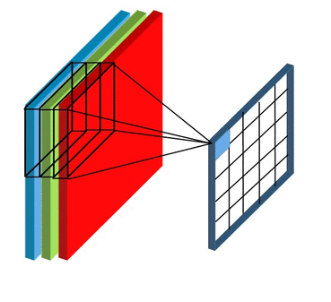
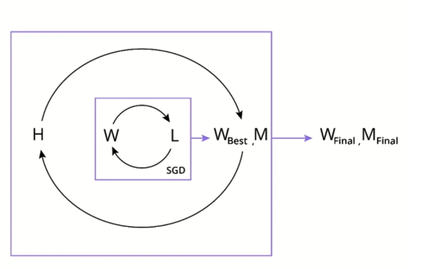
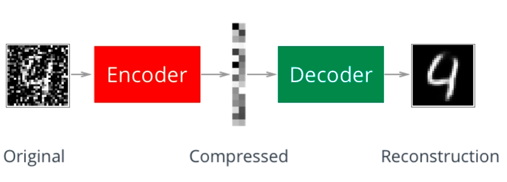

# CNN CONCEPTS 

### Course: CS231n Convolutional Neural Networks for Visual Recognition | Stanford University

1. Introduction to CNNs and basic concepts

* Use Multi-Layer Perceptrons (MLPs) for image classification
* Understand the limitations of MLPs for images and how CNNs overcome them
* Learn basic concepts of CNNs and what makes them so powerful for image tasks

2. CNNs in more depth

* Learn all the basic layers that make up a CNN
* Put all the basic layers together to build a CNN from scratch
* Classify images using CNNs
* Use various methods to improve CNN performance
* Export models for production

3. Transfer learning

* Understand key innovative CNN architectures
* Implement transfer learning using a pre-trained network to classify different sets of images
* Fine-tune a pre-trained network on a new dataset

4. Autoencoders

* Explain the functionality of autoencoders for data compression, image denoising, and dimensionality reduction
* Build a simple autoencoder out of linear layers to perform anomaly detection
* Build CNN autoencoders to perform anomaly detection and image denoising

5. Object detection and segmentation

* Describe object detection, object localization, and image segmentation.
* Train and evaluate a one-stage object detection model to detect multiple objects in an image.
* Train and evaluate a semantic segmentation model to classify every pixel of an image.


## Flattening

Suppose we want to use an MLP to classify our image. The problem is, the network takes a 1d array as input, while we have 
images that are 28x28 matrices. The obvious solution is to flatten the matrix, i.e., to stack all the rows of the matrix 
in one long 1D vector, as in the image below.


## Loss Function

The loss function quantifies how far we are from the ideal state where the network does not make any mistakes and has 
perfect confidence in its answers.

Depending on the task and other considerations we might pick different loss functions. For image classification the most 
typical loss function is the Categorical Cross-Entropy (CCE) loss, defined as:


Definition
The CCE loss is defined as:
$$
\text{CCE} = -\sum_{i=1}^{n_\text{classes}} y_i \log(\hat{p}_i)
$$

Where:

$n_\text{classes}$ is the number of classes (10 for MNIST digits)
<br>
$y_i$ is the true label (ground truth) as a one-hot encoded vector
<br>
$\hat{p}_i$ is the predicted probability for class $i$

where:

1. The sum is taken over the classes (10 in our case)
2. yi is the ground truth, i.e., a one-hot encoded vector(opens in a new tab) of length 10
3. pi is the probability predicted by the network


# Loss Function: Categorical Cross-Entropy (CCE)

In our MNIST digit classification task, we use the Categorical Cross-Entropy (CCE) loss function. This choice is typical for multi-class classification problems where each sample belongs to exactly one class.

## Definition

The CCE loss is defined as:

$$
\text{CCE} = -\sum_{i=1}^{n_\text{classes}} y_i \log(\hat{p}_i)
$$

Where:
- $n_\text{classes}$ is the number of classes (10 for MNIST digits)
- $y_i$ is the true label (ground truth) as a one-hot encoded vector
- $\hat{p}_i$ is the predicted probability for class $i$


<br>

## Interpretation

1. The loss quantifies the difference between the predicted probability distribution and the true distribution (one-hot encoded ground truth).
2. A perfect prediction would result in a loss of 0, while incorrect predictions increase the loss value.
3. The logarithm heavily penalizes confident misclassifications, encouraging the model to be cautious with its predictions.

## Implementation in PyTorch

In PyTorch, we use `nn.CrossEntropyLoss()`, which combines a softmax activation and the CCE loss in one operation, improving numerical stability.

```textmate
criterion = nn.CrossEntropyLoss()
```

This loss function is well-suited for our MNIST task because:
1. It naturally handles multi-class problems.
2. It encourages the model to output well-calibrated probabilities.
3. It's differentiable, allowing for effective backpropagation during training.

By minimizing this loss during training, we push our model to make increasingly accurate predictions on the digit classification task.


<br>

# Sequential Neural Networks and Alternatives

## Sequential Neural Networks

A sequential neural network is a linear stack of layers where the output of one layer becomes the input to the next layer. This is the simplest and most common type of neural network architecture.

### Characteristics:
1. Layers are arranged in a straight line.
2. Data flows through the network in a single, forward direction.
3. Easy to conceptualize and implement.

### Example in PyTorch:


```textmate
import torch.nn as nn

model = nn.Sequential(
    nn.Linear(784, 128),
    nn.ReLU(),
    nn.Linear(128, 64),
    nn.ReLU(),
    nn.Linear(64, 10)
)
```

## Non-Sequential Neural Networks

It is absolutely possible, and often necessary, to have neural networks that are not sequential. These are sometimes called non-sequential or non-linear neural networks.

### Types of Non-Sequential Architectures:

1. **Branching Networks**: Where the data flow splits and merges.
2. **Residual Networks (ResNets)**: Include skip connections that bypass one or more layers.
3. **Recurrent Neural Networks (RNNs)**: Have feedback loops, allowing information to persist.
4. **Graph Neural Networks**: Operate on graph-structured data.
5. **Multi-Input or Multi-Output Networks**: Accept or produce multiple tensors.

### Example of a Non-Sequential Network in PyTorch:

```textmate
class NonSequentialNet(nn.Module):
    def __init__(self):
        super().__init__()
        self.conv1 = nn.Conv2d(1, 20, 5)
        self.conv2 = nn.Conv2d(20, 50, 5)
        self.fc1 = nn.Linear(800, 500)
        self.fc2 = nn.Linear(500, 10)

    def forward(self, x):
        x = F.relu(self.conv1(x))
        x = F.max_pool2d(x, 2, 2)
        x = F.relu(self.conv2(x))
        x = F.max_pool2d(x, 2, 2)
        x = x.view(-1, 800)
        x = F.relu(self.fc1(x))
        x = self.fc2(x)
        return F.log_softmax(x, dim=1)
```

## When to Use Non-Sequential Networks

1. **Complex Data Dependencies**: When your data has complex relationships that can't be captured by a simple linear flow.
2. **Performance Improvement**: Techniques like skip connections in ResNets can help with training very deep networks.
3. **Task-Specific Requirements**: Some tasks inherently require non-sequential processing, like image segmentation or machine translation.
4. **Multi-Modal Data**: When working with multiple types of input data simultaneously.

Non-sequential architectures offer more flexibility and can often capture more complex patterns in data, but they can also be more challenging to design and train.


ReLU Activation Function


The purpose of an activation function is to scale the outputs of a layer so that they are consistent, small values. Much 
like normalizing input values, this step ensures that our model trains efficiently!

A ReLU activation function stands for "Rectified Linear Unit" and is one of the most commonly used activation functions 
for hidden layers. It is an activation function, simply defined as the positive part of the input, x. So, for an input 
image with any negative pixel values, this would turn all those values to 0, black. You may hear this referred to as 
"clipping" the values to zero; meaning that is the lower bound.


## Design of an MLP (Multi-Layer Perceptron)


When designing an MLP you have a lot of different possibilities, and it is sometimes hard to know where to start. Unfortunately 
there are no strict rules, and experimentation is key. However, here are some guidelines to help you get started with an initial 
architecture that makes sense, from which you can start experimenting.

The number of inputs input_dim is fixed (in the case of MNIST images for example it is 28 x 28 = 784), so the first layer 
must be a fully-connected layer (Linear in PyTorch) with input_dim as input dimension.

Also the number of outputs is fixed (it is determined by the desired outputs). For a classification problem it is the number 
of classes n_classes, and for a regression problem it is 1 (or the number of continuous values to predict). So the output 
layer is a Linear layer with n_classes (in case of classification).

What remains to be decided is the number of hidden layers and their size. Typically you want to start from only one hidden 
layer, with a number of neurons between the input and the output dimension. Sometimes adding a second hidden layer helps, 
and in rare cases you might need to add more than one. But one is a good starting point.

As for the number of neurons in the hidden layers, a decent starting point is usually the mean between the input and the 
output dimension. Then you can start experimenting with increasing or decreasing, and observe the performances you get. 
If you see overfitting(opens in a new tab), start by adding regularization (dropout(opens in a new tab) and weight decay) 
instead of decreasing the number of neurons, and see if that fixes it. A larger network with a bit of drop-out learns 
multiple ways to arrive to the right answer, so it is more robust than a smaller network without dropout. If this doesn't 
address the overfitting, then decrease the number of neurons. If you see underfitting(opens in a new tab), add more neurons. 
You can start by approximating up to the closest power of 2. Keep in mind that the number of neurons also depends on the 
size of your training dataset: a larger network is more powerful but it needs more data to avoid overfitting.


```textmate
import torch
import torch.nn as nn

class MyModel(nn.Module):

  def __init__(self):

    super().__init__()

    # Create layers. In this case just a standard MLP
    self.model = nn.Sequential(
      # Input layer. The input is obviously 784. For
      # the output (which is the input to the hidden layer)
      # we take the mean between network input and output:
      # (784 + 10) / 2 = 397 which we round to 400
      nn.Linear(784, 400),
      nn.Dropout(0.5),  # Combat overfitting
      nn.ReLU(),
      # Hidden layer
      nn.Linear(400, 400),
      nn.Dropout(0.5),  # Combat overfitting
      nn.ReLU(),
      # Output layer, must receive the output of the
      # hidden layer and return the number of classes
      nn.Linear(400, 10)
    )

  def forward(self, x):

    # nn.Sequential will call the layers 
    # in the order they have been inserted
    return self.model(x)
```

<br>

# Training a Neural Network in PyTorch

## 1. Loss Function
- Specifies what the optimizer will minimize
- For classification tasks, use Cross Entropy Loss
- In PyTorch: `nn.CrossEntropyLoss()`
- Combines softmax and negative log likelihood loss

## 2. Optimizer
- Changes network parameters to minimize loss
- Specify which parameters to modify: typically `model.parameters()`
- Set learning rate and other parameters (e.g., weight decay)
- Common optimizers: SGD, Adam
- Example: `torch.optim.Adam(model.parameters(), lr=0.01, weight_decay=0)`

## 3. Training Loop
1. Set number of epochs
2. Set model to training mode: `model.train()`
3. For each epoch:
   a. Loop through batches in training data loader
   b. Clear gradients: `optimizer.zero_grad()`
   c. Forward pass: `output = model(data)`
   d. Calculate loss: `loss = criterion(output, target)`
   e. Backward pass: `loss.backward()`
   f. Optimize: `optimizer.step()`
   g. Update running loss

## 4. Important Notes
- CrossEntropyLoss applies softmax internally
- Model output should be unnormalized class scores, not probabilities
- Alternative: Use `F.log_softmax()` in model's forward method and `nn.NLLLoss()`
- Consider adding softmax to model's forward method for inference after training

## 5. Monitoring Progress
- Use tqdm for progress bars during training
- Calculate and print average loss per epoch

## 6. Validation
- Perform validation after each training epoch
- Set model to evaluation mode for validation: `model.eval()`

Remember: The goal is to minimize the loss function by adjusting the model's parameters through multiple epochs of training.


## Model Validation


Validation Set: Takeaways

We create a validation set to:

1. Measure how well a model generalizes, during training
2. Tell us when to stop training a model; when the validation loss stops decreasing (and especially when the validation loss 
starts increasing and the training loss is still decreasing) we should stop training. It is actually more practical to train 
for a longer time than we should, but save the weights of the model at the minimum of the validation set, and then just throw 
away the epochs after the validation loss minimum.


<br>


<br>


### Validation Loop

Once we have performed an epoch of training we can evaluate the model against the validation set to see how it is doing. 
This is accomplished with the validation loop:


```textmate
# Tell pytorch to stop computing gradients for the moment
# by using the torch.no_grad() context manager
with torch.no_grad():

  # set the model to evaluation mode
  # This changes the behavior of some layers like
  # Dropout with respect to their behavior during
  # training
  model.eval()

  # Keep track of the validation loss
  valid_loss = 0.0

  # Loop over the batches of validation data
  # (here we have removed the progress bar display that is
  # accomplished using tqdm in the video, for clarity)
  for batch_idx, (data, target) in enumerate(valid_dataloader):

    # 1. forward pass: compute predicted outputs by passing inputs to the model
    output = model(data)

    # 2. calculate the loss
    loss_value = criterion(output, target)

    # Calculate average validation loss
    valid_loss = valid_loss + (
      (1 / (batch_idx + 1)) * (loss_value.data.item() - valid_loss)
    )

  # Print the losses 
  print(f"Epoch {epoch+1}: training loss {train_loss:.5f}, valid loss {valid_loss:.5f}")

```

It is usually a good idea to wrap the validation loop in a function so you can return the validation loss for each epoch, 
and you can check whether the current epoch has the lowest loss so far. In that case, you save the weights of the model. 
We will see in one of the future exercises how to do that.


### The Test Loop

The test loop is identical to the validation loop, but we of course iterate over the test dataloader instead of the validation 
dataloader.


To visually summarize what we have discussed so far, here is a typical workflow for an image classification task:

<br>


<br>


Typical Workflow for an image classification task:

1. DataLoaders with preprocessing: The process starts with data loaders that include preprocessing steps for the images.

2. Visualize: The preprocessed data is visualized to understand the input.

3. Model Definition: A neural network model is defined based on the task requirements.

4. Define Loss: The loss function is defined, typically using cross-entropy for classification tasks.

5. Define Optimizer: An optimizer is chosen, usually Adam or SGD (Stochastic Gradient Descent).

6. Train: The model is trained using the defined loss and optimizer. Training continues until the validation loss starts 
   increasing, indicating potential overfitting.

7. Experiment: This is an iterative process where the model design and parameters are adjusted based on the training results.

8. Select Best Model: After multiple experiments, the best performing model is selected.

9. Evaluate on Test Data: The chosen model is then evaluated on a separate test dataset to assess its generalization 
   performance.


This workflow is cyclical, with the "Experiment" step potentially leading back to adjusting the model definition, loss 
function, or optimizer. The goal is to iterate and improve until a satisfactory model is achieved, which is then finally 
tested on unseen data.


### Classifier Performance (MLP and CNN)


The MNIST dataset is very clean and is one of the few datasets where MLPs and Convolutional Neural Networks perform at a 
similar level of accuracy. However, all of the top-scoring architectures for MNIST(opens in a new tab) are CNNs (although 
their performance difference compared to MLPs is small).

In most cases, CNNs are vastly superior to MLPs, both in terms of accuracy and in terms of network size when dealing with 
images.

As we will see, the main reason for the superiority of CNNs is that MLPs have to flatten the input image, and therefore 
initially ignore most of the spatial information, which is very important in an image. Also, among other things, they are 
not invariant for translation. This means that they need to learn to recognize the same image all over again if we translate 
even slightly the objects in it.

CNNs instead don't need to flatten the image and can therefore immediately exploit the spatial structure. As we will see, 
through the use of convolution and pooling they also have approximate translation invariance, making them much better 
choices for image tasks.


# Multilayer Perceptrons (MLPs) vs Convolutional Neural Networks (CNNs)

## Multilayer Perceptrons (MLPs)

1. Structure:
   - Consist of fully connected layers
   - Each neuron connected to every neuron in the previous and next layer

2. Input handling:
   - Typically work with 1D input (flattened data)
   - Lose spatial information when dealing with 2D or 3D data

3. Parameter efficiency:
   - Large number of parameters, especially for high-dimensional input
   - Prone to overfitting on image data

4. Feature extraction:
   - Learn global patterns
   - No built-in understanding of spatial hierarchies

5. Invariance:
   - No built-in translation invariance

6. Applications:
   - Suitable for tabular data, simple pattern recognition
   - Less effective for complex spatial data like images

## Convolutional Neural Networks (CNNs)

1. Structure:
   - Consist of convolutional layers, pooling layers, and fully connected layers
   - Local connectivity in convolutional layers

2. Input handling:
   - Designed to work with grid-like topologies (e.g., 2D images, 3D videos)
   - Preserve spatial information

3. Parameter efficiency:
   - Fewer parameters due to parameter sharing in convolutional layers
   - Better at generalizing for image-like data

4. Feature extraction:
   - Learn local patterns and build up to more complex features
   - Hierarchical feature learning

5. Invariance:
   - Built-in translation invariance due to convolutional operations

6. Applications:
   - Excellent for image-related tasks (classification, segmentation, detection)
   - Effective for any data with spatial or temporal structure

## Key Differences

1. Connectivity: MLPs use full connectivity, while CNNs use local connectivity.
2. Spatial awareness: CNNs preserve and utilize spatial information, MLPs do not.
3. Parameter efficiency: CNNs are more parameter-efficient for image-like data.
4. Feature learning: CNNs learn hierarchical features, MLPs learn global patterns.
5. Invariance: CNNs have built-in translation invariance, MLPs do not.

## When to Use

- Use MLPs for:
  - Tabular data
  - Simple pattern recognition tasks
  - When input features don't have spatial or temporal relationships

- Use CNNs for:
  - Image processing tasks
  - Data with spatial or temporal structure
  - When you need to preserve and utilize spatial information


### Locally-Connected Layers


Convolutional Neural Networks are characterized by locally-connected layers, i.e., layers where neurons are connected to 
only a limited numbers of input pixels (instead of all the pixels like in fully-connected layers). Moreover, these neurons 
share their weights, which drastically reduces the number of parameters in the network with respect to MLPs. The idea behind 
this weight-sharing is that the network should be able to recognize the same pattern anywhere in the image.


### The Convolution Operation

CNNs can preserve spatial information, and the key to this capability is called the Convolution operation: it makes the 
network capable of extracting spatial and color patterns that characterize different objects.

CNNs use filters (also known as "kernels") to "extract" the features of an object (for example, edges). By using multiple 
different filters the network can learn to recognize complex shapes and objects.


### Image Filters

Image filters are a traditional concept in computer vision. They are small matrices that can be used to transform the input 
image in specific ways, for example, highlighting edges of objects in the image.

An edge of an object is a place in an image where the intensity changes significantly.

To detect these changes in intensity within an image, you can create specific image filters that look at groups of pixels 
and react to alternating patterns of dark/light pixels. These filters produce an output that shows edges of objects and 
differing textures.

We will see that CNNs can learn the most useful filters needed to, for example, classify an image. But before doing that, 
let's look at some specific filters that we can create manually to understand how they work.


# Kernel Convolution in Convolutional Neural Networks

Kernel convolution is a fundamental operation in Convolutional Neural Networks (CNNs) that enables the network to detect features in images.

## How Convolution Works

1. **Kernel (Filter)**: A small matrix of weights, typically 3x3 or 5x5.
2. **Sliding Window**: The kernel slides over the input image.
3. **Element-wise Multiplication**: At each position, the kernel is multiplied element-wise with the overlapping image patch.
4. **Summation**: The products are summed to produce a single output value.

## Example (based on the image):

- Kernel (3x3):
  ```
  [ 0  -1   0]
  [-1   4  -1]
  [ 0  -1   0]
  ```
- Image Patch (3x3):
  ```
  [140 120 120]
  [225 220 205]
  [255 250 230]
  ```
- Calculation:
  (0*140) + (-1*120) + (0*120) +
  (-1*225) + (4*220) + (-1*205) +
  (0*255) + (-1*250) + (0*230) = 60

The result (60) becomes the value in the output feature map for this position.

## Edge Handling

When the kernel reaches the edges or corners of the image, special handling is required:

1. **Padding**: Add a border of 0's (black pixels) around the image.
   - Maintains the original image size in the output.
   - Common in practice.

2. **Cropping**: Skip pixels that would require values from beyond the edge.
   - Results in a smaller output image.
   - Loses information at the edges.

3. **Extension**: Extend border pixels as needed.
   - Corner pixels: Extended in 90° wedges.
   - Edge pixels: Extended in lines.
   - Maintains original image size without introducing new values.

## Importance in CNNs

- Convolution allows CNNs to detect local patterns and features.
- Different kernels can detect various features (edges, textures, etc.).
- As the network deepens, it can recognize more complex patterns.
- The kernels' weights are learned during training, allowing the network to automatically discover important features for the task at hand.


### Edge Handling

Kernel convolution relies on centering a pixel and looking at its surrounding neighbors. So, what do you do if there are 
no surrounding pixels like on an image corner or edge? Well, there are a number of ways to process the edges, which are 
listed below. It’s most common to use padding, cropping, or extension. In extension, the border pixels of an image are 
copied and extended far enough to result in a filtered image of the same size as the original image.

1. Padding - The image is padded with a border of 0's, black pixels.

2. Cropping - Any pixel in the output image which would require values from beyond the edge is skipped. This method can result 
in the output image being smaller then the input image, with the edges having been cropped.

3. Extension - The nearest border pixels are conceptually extended as far as necessary to provide values for the convolution. 
Corner pixels are extended in 90° wedges. Other edge pixels are extended in lines.

<br>


<br>


#### Question 1:

Of the four kernels pictured above, which would be best for finding and enhancing horizontal edges and lines in an image?
If needed, use the bottom images and go through the math of applying the filters to those images. Which filter gives you a 
horizontal line in the output?

The correct answer is d. Let's examine why:

Kernel d:
```
-1 -2 -1
 0  0  0
 1  2  1
```

This kernel is designed to detect horizontal edges and lines because:

1. It has a strong horizontal structure.
2. The top row is negative, the middle row is zero, and the bottom row is positive.
3. When this kernel slides over a horizontal edge (dark above, light below), it will produce a strong positive response.

When applied to the horizontal edge image (the bottom-left image in the first figure), this kernel would highlight the horizontal line between the black and white regions.


####  Question 2:
Of the four kernels pictured above, which would be best for finding and enhancing vertical edges and lines in an image?
If needed, use the example images as in the previous question.

The correct answer is b. Let's examine why:

Kernel b:
```
-1  0  1
-2  0  2
-1  0  1
```

This kernel is designed to detect vertical edges and lines because:

1. It has a strong vertical structure.
2. The left column is negative, the middle column is zero, and the right column is positive.
3. When this kernel slides over a vertical edge (dark on the left, light on the right), it will produce a strong positive response.

When applied to the vertical edge image (the bottom-right image in the first figure), this kernel would highlight the vertical line between the black and white regions.

Key points to remember:
1. Edge detection kernels typically have opposite signs on opposite sides of the kernel.
2. The direction of the edge detection (horizontal or vertical) is perpendicular to the direction of the sign change in the kernel.
3. These kernels are examples of Sobel filters, which are commonly used for edge detection in image processing and computer vision tasks.

By understanding how these kernels operate, you can see how convolutional neural networks can automatically learn to detect various features in images, starting from simple edges and progressing to more complex patterns in deeper layers.

<br>


<br>

The two filters we have looked at above are called Sobel filters. They are well-known filters used to isolate edges.


# Convolutional Neural Networks (CNNs) - Advanced Concepts

## 1. Kernel Convolution

Kernel convolution is the fundamental operation in CNNs that enables feature detection in images.

### Process:
1. A small matrix (kernel) slides over the input image
2. Element-wise multiplication of kernel with image patch
3. Sum of products becomes the output for that position

### Edge Handling:
- Padding: Add border of zeros
- Cropping: Skip edge pixels
- Extension: Extend border pixels

### Types of Kernels:
a. Horizontal edge detection:


```textmate
-1 -2 -1
 0  0  0
 1  2  1
```

b. Vertical edge detection:

```textmate
-1  0  1
-2  0  2
-1  0  1
```

## 2. Pooling

Pooling compresses information from a layer by summarizing areas of the feature maps.

### Process:
1. Slide a window over each feature map
2. Compute a summary statistic for each window

### Types:
- Max Pooling: Takes the maximum value in each window
- Average Pooling: Computes the average of values in each window

### Benefits:
1. Reduces spatial dimensions of feature maps
2. Introduces translation invariance
3. Reduces computational load for subsequent layers

## 3. CNN Architecture

A typical CNN block consists of:
1. Convolutional Layer
2. Activation Function (e.g., ReLU)
3. Pooling Layer

### Concept Abstraction:
- Stacking multiple CNN blocks allows the network to learn increasingly complex features
- Early layers detect simple features (edges, textures)
- Deeper layers combine these to detect more complex patterns (shapes, objects)

### Translation Invariance:
- Multiple CNN blocks enable the network to recognize objects regardless of their position in the image
- This is crucial for robust object recognition in various scenarios

## 4. Importance in Image Processing

- CNNs excel at tasks like image classification, object detection, and segmentation
- The combination of convolution and pooling allows for efficient feature learning and dimensionality reduction
- Learned features are often more effective than hand-crafted features

## 5. Training Process

1. Forward pass: Apply convolutions and pooling to input image
2. Compare output to ground truth (using a loss function)
3. Backward pass: Compute gradients and update kernel weights
4. Repeat process with many images to optimize kernel weights

By leveraging these concepts, CNNs have revolutionized computer vision tasks, achieving state-of-the-art performance in 
numerous applications.

### Pooling

Pooling is a mechanism often used in CNNs (and in neural networks in general). Pooling compresses information from a layer 
by summarizing areas of the feature maps produced in that layer. It works by sliding a window over each feature map, just 
like convolution, but instead of applying a kernel we compute a summary statistic (for example the maximum or the mean). 
If we take the maximum within each window, then we call this Max Pooling.

<br>


<br>


### Concept Abstraction and Translation Variance


A block consisting of a convolutional layer followed by a max pooling layer (and an activation function) is the typical 
building block of a CNN.

By combining multiple such blocks, the network learns to extract more and more complex information from the image.

Moreover, combining multiple blocks allows the network to achieve translation invariance, meaning it will be able to 
recognize the presence of an object wherever that object is translated within the image.


### Effective Receptive Fields in CNNs


The Effective Receptive Field (ERF) in Convolutional Neural Networks refers to the area of the input image that influences 
a particular neuron in a deeper layer of the network. While the theoretical receptive field might be large, the effective 
area that significantly impacts the neuron's output is often smaller and has a Gaussian-like distribution of influence.


Key points:

1. As we go deeper into the network, each neuron indirectly sees a larger portion of the input image.
2. Not all pixels in the theoretical receptive field contribute equally to the neuron's output.
3. Central pixels typically have more influence than those at the edges of the receptive field.
4. The shape of the ERF is often Gaussian-like, with influence decreasing from the center outwards.
5. ERFs evolve during training, potentially becoming more focused or spread out.


## I. Introduction to Receptive Fields

A. Definition: The region in the input space that influences a particular CNN feature.

B. Theoretical vs. Effective Receptive Field
   1. Theoretical: The entire input area that could potentially influence the feature
   2. Effective: The area that actually has significant influence on the feature

## II. Characteristics of Effective Receptive Fields

A. Shape and Distribution
   1. Gaussian-like distribution of influence
   2. Center pixels have more impact than edge pixels

B. Size
   1. Grows larger in deeper layers of the network
   2. Affected by kernel size, stride, and network depth

C. Dynamic Nature
   1. ERFs evolve during network training
   2. Can become more focused or spread out based on the task

## III. Calculation and Visualization

A. Methods for calculating ERF
   1. Gradient-based approaches
   2. Deconvolution techniques

B. Visualization techniques
   1. Heat maps showing pixel influence
   2. Overlays on input images to demonstrate ERF size and shape

## IV. Importance in CNN Architecture

A. Feature hierarchies
   1. Shallow layers: small ERFs, local features
   2. Deep layers: large ERFs, global features

B. Network design considerations
   1. Balancing ERF size with computational efficiency
   2. Ensuring appropriate ERF growth through the network

## V. Impact on CNN Performance

A. Object detection and localization
   1. ERFs affect the network's ability to capture context
   2. Influence on the scale of objects that can be detected

B. Image classification
   1. Role in capturing both local and global features
   2. Importance for handling different scales of input

## VI. Advanced Concepts

A. Dilated/Atrous convolutions
   1. Technique to increase ERF without increasing parameters
   2. Applications in semantic segmentation

B. Attention mechanisms
   1. Dynamic adjustment of ERFs
   2. Allowing the network to focus on relevant parts of the input


By understanding Effective Receptive Fields, we gain insights into how CNNs process information and how to design more 
effective architectures for various computer vision tasks.


The concept of receptive field is that a pixel in the feature map of a deep layer is computed using information that originates 
from a large area of the input image, although it is mediated by other layers:

<br>


<br>


In practice things are a bit more complicated. When we compute the effective receptive field, instead of considering just 
whether the information contained in a given pixel is used or not by a pixel in a deeper layer, we can consider how many 
times that pixel is used. In other words, how many times that pixel was part of a convolution that ended up in a result 
used by the pixel in the deeper layer. Of course, pixels on the border of the input image are used during fewer convolutions 
than pixels in the center of the image. We can take this even further and ask how much a given pixel in the input image 
influences the pixel in a feature map deeper in the network. This means, if we change the value of the input pixel slightly, 
how much does the pixel in the deep layer change. If we take this into account, we end up with receptive fields that are more 
Gaussian-like, instead of flat as we have simplified them in the video, and they also evolve as we train the network. Visualization 
of an effective receptive field showing varying pixel influence in a neural network feature map. 


### CNN Architecture Blueprint


<br>


<br>


### Glossary

CNN: Convolutional Neural Networks. A class of Neural Networks featuring local connectivity, weight sharing, and pooling operations.

MNIST: A dataset of handwritten digits of historical importance, commonly used nowadays for tutorials and learning.

Dataloader: Allows sequential or random iterations over a dataset or over a subset of a dataset.

Local connectivity: In the fully-connected layers present in a Multi-Layer Perceptron the neurons in a layer are connected to all neurons in the previous layer. Instead, in CNNs, a neuron is connected only to a small portion of contiguous neurons in the previous layer (or pixels in the input image).

Filters / Kernels: Small matrices of numbers, usually normalized to 1, that are applied to the input image during the convolution operation.

Convolution: The operation of sliding a kernel on an image or a feature map to produce a modified output.

Feature map: The result of applying a filter on an image or another feature map. One kernel/filter generates one feature map.

Pooling: The operation of sliding a window over the input image or a feature map and applying a function to the numbers present in that window (for example, taking the maximum).

Max Pooling: The operation of sliding a window over the input image or a feature map and applying a maximum function to the numbers present in that window.

Sobel filters: Specific types of filters that can isolate vertical and horizontal edges.

Effective receptive field (EFR): Generally, this is the region in the input image that contributes to the values of a pixel in a feature map deep in the network. More precisely, the effective receptive field is a matrix superimposed on the input image, where each element has a value proportional to the importance that a pixel in the input image has in determining the value of the pixel in the feature map deep in the network.

Flattening: The operation of taking an image or a feature map and changing it into a vector (or 1d array).


<br>


<br>


Lesson Summary

Reviewed how to use MLPs for image classification
Learned of the limitations that MLPs have when it comes to image classification, and how CNNs overcome those limitations
Learned the basic concepts of CNNs, and what makes them great at image tasks


# CNN IN DEPTH 


Lesson Overview

Apply all of the basic layers that make up a CNN
Put all these layers together to build a CNN from the ground up
Improve the performance of your CNN network
Export a model for production


<br>


<br>


### Convolution on Color Images

The kernel that was a matrix of k x k numbers for grayscale images, becomes now a 3d filter of k x k x n channels:


<br>



<br>


# Multiple Convolutional Layers

In a CNN with more than one layer, the $n_k$ filters in the first convolutional layer will operate on the input image 
with 1 or 3 channels (RGB) and generate $n_k$ output feature maps. So in the case of an RGB image the filters in the 
first convolutional layer will have a shape of kernel_size x kernel_size x 3. If we have 64 filters we will then have 
64 output feature maps. Then, the second convolutional layer will operate on an input with 64 "channels" and therefore 
use filters that will be kernel_size x kernel_size x 64. Suppose we use 128 filters. Then the output of the second 
convolutional layer will have a depth of 128, so the filters of the third convolutional layer will be kernel_size x 
kernel_size x 128, and so on. For this reason, it is common to use the term "channels" also to indicate the feature maps 
of convolutional layers: a convolutional layer that takes feature maps with a depth of 64 and outputs 128 feature maps is 
said to have 64 channels as input and 128 as outputs.

# Number of Parameters in a Convolutional Layer

Let's see how we can compute the number of parameters in a convolutional layer, $n_p$.

Let's define some quantities:

- $n_k$: number of filters in the convolutional layer
- k: height and width of the convolutional kernel
- c: number of feature maps produced by the previous layer (or number of channels in input image)


There are $k$ times $k$ times $c$ weights per filter plus one bias per filter, so $ck^2 + 1$ parameters. The convolutional 
layer is composed of $n_k$ filters, so the total number of parameters in the convolutional layer is:

$n_p = n_k(ck^2 + 1)$.


### Convolutional Layers in PyTorch

```textmate
from torch import nn

conv1 = nn.Conv2d(in_channels, out_channels, kernel_size)
dropout1 = nn.Dropout2d(p=0.2)
relu1 = nn.ReLU()

result = relu1(dropout1(conv1(x)))
```

You must pass the following arguments:

1. in_channels - The number of input feature maps (also called channels). If this is the first layer, this is equivalent to the number of channels in the input image, i.e., 1 for grayscale images, or 3 for color images (RGB). Otherwise, it is equal to the output channels of the previous convolutional layer.
2. out_channels - The number of output feature maps (channels), i.e. the number of filtered "images" that will be produced by the layer. This corresponds to the unique convolutional kernels that will be applied to an input, because each kernel produces one feature map/channel. Determining this number is an important decision to make when designing CNNs, just like deciding on the number of neurons is an important decision for an MLP.
3. kernel_size - Number specifying both the height and width of the (square) convolutional kernel.


We can also use nn.Sequential, which stacks together the layers we give as argument so they can be used as if they were 
one. For example we can build a convolutional block as:


```textmate
conv_block = nn.Sequential(
  nn.Conv2d(in_channels, out_channels, kernel_size),
  nn.ReLU(),
  nn.Dropout2d(p=0.2)
)
```


# Stride and Padding in Convolutional Neural Networks

## 1. Introduction to Stride and Padding

- Stride: The amount by which the filter slides over the image.
- Padding: Expanding the size of an image by adding pixels at its border.

## 2. Stride

- Default stride is 1 (move filter one pixel at a time).
- Larger strides reduce the spatial dimensions of the output.
- Example: Stride of 2 makes the convolutional layer about half the width and height of the image.

## 3. Padding

- Used to control the spatial dimensions of the output.
- Helps to apply the filter to border pixels.
- Types of padding in PyTorch:
  - Zero padding (default)
  - Reflect padding
  - Replicate padding
  - Circular padding

## 4. Formula for Output Size

The relationship between input size (i), kernel size (k), stride (s), padding (p), and output size (o) is given by:

$o = \left[\frac{i + 2p - k}{s}\right] + 1$


Certainly. Let's break down the formula for calculating the output size of a convolutional layer:

$o = \left[\frac{i + 2p - k}{s}\right] + 1$

Where:
- $o$ is the output size (height or width)
- $i$ is the input size (height or width)
- $p$ is the padding size
- $k$ is the kernel (filter) size
- $s$ is the stride
- $[...]$ denotes the floor function (rounding down to the nearest integer)

Explanation of each part:

1. $(i + 2p)$: This represents the effective input size after padding. We add padding to both sides, so it's multiplied by 2.

2. $(i + 2p - k)$: This calculates how many times the kernel can fit into the padded input. We subtract $k$ because the 
   kernel needs to fit entirely within the input.

3. $\frac{i + 2p - k}{s}$: Dividing by the stride determines how many steps the kernel can take across the input. Larger 
   strides result in smaller output sizes.

4. $[...]$: The floor function ensures we get an integer result, as we can't have fractional output sizes.

5. $+ 1$: This accounts for the initial position of the kernel. Even if the kernel can't slide at all, we still get one 
   output.

This formula is crucial for designing CNN architectures, as it allows you to predict the output size of each layer and ensure 
that the dimensions are compatible throughout the network.


## 5. PyTorch Implementation

- Use `nn.Conv2d` for 2D convolutions.
- Can specify padding as a number or use "same" or "valid".
- Example: `nn.Conv2d(1, 16, kernel_size=3, padding=1, stride=1)`

## 6. Practice Questions

Question 1:
Let's consider an input image of size 6x6, and a kernel 3x3. What would be the output size if we use no padding and stride 1?

Answer: The output size would be 4x4.
Explanation: Using the formula with i=6, k=3, p=0, s=1:
$o = \left[\frac{6 + 2(0) - 3}{1}\right] + 1 = 4$

Question 2:
Let's consider again an input image of size 6x6, and a kernel 3x3. What padding do we need if we want to get an output size 
equal to the input size (6x6)? Assume a stride of 1.

Answer: We need a padding of 1.
Explanation: We want o=6, and we know i=6, k=3, s=1. Solving for p:
$6 = \left[\frac{6 + 2p - 3}{1}\right] + 1$
$5 = 3 + 2p$
$p = 1$

Question 3:
Use the formula we just provided to compute the expected output size for a convolution with kernel size 8x8, padding 3, 
and stride 2, applied on an image with an input size of 32x32.

Answer: The output size would be 14x14.
Explanation: Using the formula with i=32, k=8, p=3, s=2:
$o = \left[\frac{32 + 2(3) - 8}{2}\right] + 1 = \left[\frac{30}{2}\right] + 1 = 15 + 1 = 16$

## 7. Key Takeaways

- Stride and padding are crucial for controlling the spatial dimensions of CNN layers.
- Larger strides reduce spatial dimensions, while padding can help maintain them.
- The choice of padding strategy can affect the network's performance and should be considered during architecture design.


### Average Pooling


This works similarly to the Max Pooling layer, but instead of taking the maximum for each window, we take the mean average 
of all the values in the window.

The process of average pooling on a 4x4 multicolored grid divided into four sections. Each section's average value is calculated 
and represented in a smaller 2x2 grid, with each block displaying the computed average from the corresponding section. 

Average Pooling is not typically used for image classification problems because Max Pooling is better at noticing the most 
important details about edges and other features in an image, but you may see average pooling used in applications for which 
smoothing an image is preferable.

Sometimes, Average Pooling and Max Pooling are used together to extract both the maximum activation and the average activation.


### Max Pooling Layers in PyTorch

To create a pooling layer in PyTorch, you must first import the necessary module:

```textmate
from torch import nn
nn.MaxPool2d(kernel_size, stride)
```

You must pass the following arguments:

1. kernel_size - The size of the max pooling window. The layer will roll a window of this size over the input feature map 
   and select the maximum value for each window.
2. stride - The stride for the operation. By default the stride is of the same size as the kernel (i.e., kernel_size).


# CNN Terminology

| Definition | Term |
|------------|------|
| Size of the side of the convolutional kernel | kernel size |
| Size of the window considered during pooling | window size |
| Step size of the convolutional kernel or of the pooling window when moving over the input image | stride |
| Border to add to an input image before the convolution operation is performed | padding |

Note:
- The term 'input size' refers to the dimensions of the input image or feature map, not included in the matching exercise.
- 'Stride' is a crucial parameter that determines how the kernel or pooling window moves across the input.
- 'Padding' is used to control the spatial dimensions of the output, often to maintain the input size after convolution.


Question 2 of 4:
Let's consider a convolutional layer with in_channels=3, out_channels=16, kernel_size=5 and padding=2. How many parameters does the layer have?

Answer: 1216

Explanation:
To calculate the number of parameters in a convolutional layer, we use the formula:
(kernel_size * kernel_size * in_channels + 1) * out_channels

In this case:
(5 * 5 * 3 + 1) * 16 = (75 + 1) * 16 = 76 * 16 = 1216

The +1 in the formula accounts for the bias term for each output channel.

Question 3 of 4:
Consider the following convolutional block:
nn.Conv2d(3, 16, padding=1),
nn.ReLU(),
nn.Dropout2d(0.2)

If we want to add another convolutional layer after this one, which one of the following options is going to work?

Answer: nn.Conv2d(16, 32, padding=1)

Explanation:

The output of the first convolutional layer has 16 channels (out_channels=16). Therefore, the next convolutional layer 
must have in_channels=16 to match this output. The correct option is the one that has 16 as its first parameter in Conv2d, 
which represents the in_channels. Since the output of the previous layer has 16 channels (feature maps), the input dimension 
of this layer must match that.


Question 4 of 4:
Consider the following layer:
nn.MaxPool2d(2, 2)

What would be the result after applying this layer to the given 4x4 image?

Answer: 6, 8, 3, 4

Explanation:
MaxPool2d(2, 2) applies max pooling with a 2x2 window and a stride of 2. This means it will divide the input into 2x2 non-overlapping windows and take the maximum value from each window.

For the given 4x4 image:
[1 0 2 3]
[4 6 6 8]
[3 1 1 0]
[1 2 2 4]

Applying max pooling:
- Top-left 2x2: max(1,0,4,6) = 6
- Top-right 2x2: max(2,3,6,8) = 8
- Bottom-left 2x2: max(3,1,1,2) = 3
- Bottom-right 2x2: max(1,0,2,4) = 4

Resulting in a 2x2 output: [6 8; 3 4] Max Pooling selects the maximum in each window


### Structure of a Typical CNN


In a typical CNN there are several convolutional layers intertwined with Max Pooling layers. The convolutional layers have 
more and more feature maps as you go deeper into the network, but the size of each feature map gets smaller and smaller 
thanks to the Max Pooling layer.

This kind of structure goes hand in hand with the intuition we have developed in another lesson: as the signal goes deeper 
into the network, more and more details are dropped, and the content of the image is "abstracted." In other words, while 
the initial layers focus on the constituents of the objects (edges, textures, and so on), the deeper layers represent and 
recognize more abstract concepts such as shapes and entire objects.


The convolution part of a CNN is implemented in PyTorch by using the nn.Conv2d layer for convolution and the nn.MaxPool2d 
layer for max pooling. Stacking different blocks of convolution followed by pooling constitutes the typical structure of a 
simple CNN. Typically the sizes of the feature maps shrink as you go deeper into the network, while the channel count (i.e., 
the number of feature maps and filters) increases going deeper into the network, as shown below.


<br>


<br>


The backbone is made of convolutional and pooling layers, and has the task of extracting information from the image.

After the backbone there is a flattening layer that takes the output feature maps of the previous convolutional layer and 
flattens them out in a 1d vector: for each feature map the rows are stacked together in a 1d vector, then all the 1d vectors 
are stacked together to form a long 1d vector called a feature vector or embedding. This process is illustrated by the 
following image:


<br>


<br>


<br>


<br>


### The Typical Convolutional Block

The typical sequence convolution -> pooling -> activation (with optional dropout) can be written in PyTorch like this:

```textmate
self.conv1 = nn.Conv2d(3, 16, 3, padding=1),
self.pool = nn.MaxPool2d(2, 2),
self.relu1 = nn.ReLU()
self.drop1 = nn.Dropout2d(0.2)
```

(or of course with the nn.Sequential equivalent:

```textmate
self.conv_block = nn.Sequential(
  nn.Conv2d(3, 16, 3, padding=1),
  nn.MaxPool2d(2, 2),
  nn.ReLU(),
  nn.Dropout2d(0.2)
)
```


### A Simple CNN in PyTorch

Let's now bring everything together and write our first CNN in PyTorch. We are going to have 3 convolutional blocks plus 
a head with a simple MLP.


```textmate
import torch
import torch.nn as nn

class MyCNN(nn.Module):

  def __init__(self, n_classes):

    super().__init__()

    # Create layers. In this case just a standard MLP
    self.model = nn.Sequential(
      # First conv + maxpool + relu
      nn.Conv2d(3, 16, 3, padding=1),
      nn.MaxPool2d(2, 2),
      nn.ReLU(),
      nn.Dropout2d(0.2),

      # Second conv + maxpool + relu
      nn.Conv2d(16, 32, 3, padding=1),
      nn.MaxPool2d(2, 2),
      nn.ReLU(),
      nn.Dropout2d(0.2),

      # Third conv + maxpool + relu
      nn.Conv2d(32, 64, 3, padding=1),
      nn.MaxPool2d(2, 2),
      nn.ReLU(),
      nn.Dropout2d(0.2),

      # Flatten feature maps
      nn.Flatten(),

      # Fully connected layers. This assumes
      # that the input image was 32x32
      nn.Linear(1024, 128),
      nn.ReLU(),
      nn.Dropout(0.5),
      nn.Linear(128, n_classes)
    )

  def forward(self, x):

    # nn.Sequential will call the layers 
    # in the order they have been inserted
    return self.model(x)
```


Let's analyze what is going on in the Sequential call. We have a series of 3 convolutional parts constituted of a convolutional 
layer, a max pooling operation that halves the input shape, and then a ReLU activation:

```textmate
nn.Conv2d(3, 16, 3, padding=1),
nn.MaxPool2d(2, 2),
nn.ReLU()
```


We can also optionally insert a nn.Dropout2d layer for regularization. We repeat this structure 3 times, varying the number 
of feature maps in the sequence 16 -> 32 -> 64. As we go deep, in other words, we are working with feature maps with a smaller 
height and width (because we keep applying max pooling) but with a higher channel count. This is very typical and helps the 
network with abstracting concepts.

Then, we have a Flatten layer that flattens our 64 feature maps (coming from the last conv layer before the flattening) 
into one long vector. Assuming that the input is 32x32, this vector will contain 1024 (4x4x64) numbers.

Finally, we have an MLP made of fully-connected layers that combines all the information extracted by the convolutional 
part and outputs one number for each class (logits). We first compress the 1024-long array into an embedding of 128 numbers, 
and then from there to the number of classes we have. Since we have used the nn.Sequential class, the forward method is 
extremely simple and it is just calling that Sequential instance.


### Questions and Answers 


Question 1 of 6:
What are the functions of the typical sections of a CNN?

Answer:
- Backbone: Extract features from an image
- Flatten: Flatten the feature maps producing the feature vector
- Head: Uses the feature vector to determine the final output

Explanation: These three sections represent the typical structure of a CNN. The backbone extracts features, the flatten 
layer converts 2D feature maps to a 1D vector, and the head uses this vector for final classification or regression.

Question 2 of 6:
What are the layers contained in a typical convolutional block in the backbone?

Answer:
First layer in a block: nn.Conv2d
Second layer in a block: nn.MaxPooling
Third layer in a block: nn.ReLU

Explanation: A typical convolutional block often consists of a convolutional layer (Conv2d) to extract features, followed 
by an activation function (ReLU) to introduce non-linearity, and then a pooling layer (MaxPooling) to reduce spatial 
dimensions.

Question 3 of 6:
Let's consider an image that is (3, 224, 224), i.e., an RGB image (3 channels) with height and width both equal to 224. 
If we push it through the network, what is the shape of the output?

Answer: (32, 55, 55)

Explanation: The network consists of two convolutional layers with MaxPooling. The first conv layer maintains the spatial 
dimensions (224x224) but changes channels to 16. The first MaxPool reduces it to 112x112. The second conv layer changes 
channels to 32 and maintains 112x112, then the final MaxPool reduces it to 55x55. So the final output shape is (32, 55, 55).
In order the shapes are:

```textmate
nn.Conv2d(3, 16, kernel_size=3, padding=1),  # out shape: (16, 224, 224)
nn.MaxPool2d(2, 2), # (16, 112, 112)
nn.ReLU(),  # (16, 112, 112)
    
nn.Conv2d(16, 32, kernel_size=3, padding=0), # (32, 110, 110) [note that padding=0]
nn.MaxPool2d(2, 2),  # (32, 55, 55)
nn.ReLU() # (32, 55, 55)
```


Question 4 of 6:
Consider the same network as in Question 3, but with an additional nn.Flatten() layer at the end. What is the shape of the output?

Answer: 96800 (32 x 55 x 55 = 96800)

Explanation: The output from the previous convolutional layers is (32, 55, 55). The Flatten() layer will convert this 3D 
tensor into a 1D vector. The total number of elements is 32 * 55 * 55 = 96800.

Question 5 of 6:
What should be the value of feature_vector_dim in the first linear layer? In other words, what is the dimension of the 
feature vector that is fed to the head? Also, how many classes does this classifier handle?

Answer: feature_vector_dim = 96800, n_classes = 100

The dimension of the input to the first linear layer is the output of the flatten operation, which is equal to 32 feature 
maps times 55 x 55. Also the number of classes is 100 as determined by the output dimension of the last linear layer.

Explanation: The feature vector dimension should match the flattened output from the convolutional layers, which is 
32*55*55 = 96800. The final linear layer outputs 100 dimensions, indicating this network classifies into 100 classes.

Question 6 of 6:
Consider this CNN (note that is slightly different than the previous ones):

Answer: These statements are true.
- There are 2 convolutional layers plus an MLP with one hidden layer, one input layer and one output layer.
- This network can handle images that are 28 by 28 in size.
- There are 100 classes.

Explanation: The network has two Conv2d layers, forming the convolutional part. The MLP part consists of three Linear layers 
(input, hidden, output). The network can handle 224x224 images as designed, but it can also handle 28x28 images because the 
convolutional layers don't have a fixed input size. The final layer outputs 100 dimensions, indicating 100 classes.


### Optimizing the Performance of Our Network

Now that we have seen how to train a simple CNN, let’s dive deeper and see how we can improve on the performance of our 
network with some widely-adopted tricks.

1. Image augmentation: The basic idea of image augmentation is the following: if you want your network to be insensitive 
   to changes such as rotation, translation, and dilation, you can use the same input image and rotate it, translate it, 
   and scale it and ask the network not to change its prediction! In practice, this is achieved by applying random transformations 
   to the input images before they are fed to the network.
2. Image Augmentation Using Transformations
3. Batch Normalization


Augmentation Pipelines

A typical training augmentation pipeline is represented in this diagram.

<br>


<br>


```textmate
import torchvision.transforms as T

train_transforms = T.Compose(
    [
        # The size here depends on your application. Here let's use 256x256
        T.Resize(256),
        # Let's apply random affine transformations (rotation, translation, shear)
        # (don't overdo here!)
        T.RandomAffine(scale=(0.9, 1.1), translate=(0.1, 0.1), degrees=10),
        # Color modifications. Here I exaggerate to show the effect 
        T.ColorJitter(brightness=0.5, contrast=0.5, saturation=0.5, hue=0.5),
        # Apply an horizontal flip with 50% probability (i.e., if you pass
        # 100 images through around half of them will undergo the flipping)
        T.RandomHorizontalFlip(0.5),
        # Finally take a 224x224 random part of the image
        T.RandomCrop(224, padding_mode="reflect", pad_if_needed=True),  # -
        T.ToTensor(),
        T.Normalize((0.5, 0.5, 0.5), (0.5, 0.5, 0.5)),
    ]
)
```


Transformation Pipelines for Validation and Test

During validation and test you typically do not want to apply image augmentation (which is needed for training). Hence, 
this is a typical transform pipeline for validation and test that can be paired with the pipeline above:

```textmate
testval_transforms = T.Compose(
    [
        # The size here depends on your application. Here let's use 256x256
        T.Resize(256),
        # Let's take the central 224x224 part of the image
        T.CenterCrop(224),
        T.ToTensor(),
        T.Normalize((0.5, 0.5, 0.5), (0.5, 0.5, 0.5)),
    ]
)
```

Note that of course:

The resize and crop should be the same as applied during training for best performance
The normalization should be the same between training and inference (validation and test)

### AutoAugment Transforms

There is a special class of transforms defined in torchvision, referred to as AutoAugment(opens in a new tab). These classes 
implements augmentation policies that have been optimized in a data-driven way, by performing large-scale experiments on 
datasets such as ImageNet and testing many different recipes, to find the augmentation policy giving the best result. It 
is then proven that these policies provide good performances also on datasets different from what they were designed for.

For example, one such auto-transform is called RandAugment and it is widely used. It is particularly interesting because 
it parametrizes the strength of the augmentations with one single parameter that can be varied to easily find the amount 
of augmentations that provides the best results. This is how to use it:


```textmate
T.RandAugment(num_ops, magnitude)
```

The main parameters are:

1. num_ops: the number of random transformations applied. Defaut: 2
2. magnitude: the strength of the augmentations. The larger the value, the more diverse and extreme the augmentations will 
   become.


# Batch Normalization in CNNs

## Introduction

Batch Normalization is a technique used to improve the training of Convolutional Neural Networks (CNNs) by standardizing 
the inputs to each layer.

## The BatchNorm Equation

$x \leftarrow \frac{x - \mu_x}{\sigma_x} \gamma + \beta$

Where:
- $x$: activations (values in the feature maps)
- $\mu_x$: mean of the activations
- $\sigma_x$: standard deviation of the activations
- $\gamma$: learnable scaling parameter
- $\beta$: learnable shifting parameter

## Key Components

1. **Normalization**: $(x - \mu_x) / \sigma_x$
   - Centers the activations around zero
   - Scales them to have unit variance

2. **Learnable Parameters**: $\gamma$ and $\beta$
   - Allow the network to undo normalization if needed
   - Provide flexibility in learning optimal activation distributions

## Benefits of BatchNorm

1. Reduces internal covariate shift
2. Allows higher learning rates, accelerating training
3. Acts as a form of regularization
4. Reduces the dependence on careful initialization

## Implementation Notes

- Applied after the linear transformation but before the activation function
- Uses mini-batch statistics during training
- Uses population statistics during inference

## Considerations

- Batch size affects the stability of BatchNorm
- May require adjustments in very small batch sizes or online learning scenarios

## Conclusion

Batch Normalization standardizes layer inputs, significantly improving training speed and stability in deep neural networks, 
especially CNNs.


### Batch Normalization

The second modern trick that paves the way for enhancing the performance of a network is called Batch Normalization, or 
BatchNorm. It does not usually improve the performances per se, but it allows for much easier training and a much smaller 
dependence on the network initialization, so in practice it makes our experimentation much easier, and allows us to more 
easily find the optimal solution.


Just as we normalize the input image before feeding it to the network, we would like to keep the feature maps normalized, 
since they are the output of one layer and the input to the next layer. In particular, we want to prevent them to vary 
wildly during training, because this would require large adjustments of the subsequent layers. Enter BatchNorm. BatchNorm 
normalizes the activations and keep them much more stable during training, making the training more stable and the convergence 
faster.

In order to do this, during training BatchNorm needs the mean and the variance for the activations for each mini-batch. 
This means that the batch size cannot be too small or the estimates for mean and variance will be inaccurate. During training, 
the BatchNorm layer also keeps a running average of the mean and the variance, to be used during inference.

During inference we don't have mini-batches. Therefore, the layer uses the mean and the variance computed during training 
(the running averages).

This means that BatchNorm behaves differently during training and during inference. The behavior changes when we set the 
model to training mode (using model.train()) or to validation mode (model.eval()).


### How BatchNorm Works

Just as we normalize the input image before feeding it to the network, we would like to keep the feature maps normalized, 
since they are the output of one layer and the input to the next layer. In particular, we want to prevent them to vary 
wildly during training, because this would require large adjustments of the subsequent layers. Enter BatchNorm. BatchNorm 
normalizes the activations and keep them much more stable during training, making the training more stable and the convergence 
faster.

In order to do this, during training BatchNorm needs the mean and the variance for the activations for each mini-batch. 
This means that the batch size cannot be too small or the estimates for mean and variance will be inaccurate. During training, 
the BatchNorm layer also keeps a running average of the mean and the variance, to be used during inference.

During inference we don't have mini-batches. Therefore, the layer uses the mean and the variance computed during training 
(the running averages). This means that BatchNorm behaves differently during training and during inference. The behavior 
changes when we set the model to training mode (using model.train()) or to validation mode (model.eval()).


<br>


<br>


### BatchNorm for Convolutional Layers

BatchNorm can be used very easily in PyTorch as part of the convolutional block by adding the nn.BatchNorm2d layer just 
after the convolution:


```textmate
self.conv1 = nn.Sequential(
  nn.Conv2d(3, 16, kernel_size=3, padding=1),
  nn.BatchNorm2d(16),
  nn.MaxPool2d(2, 2),
  nn.ReLU(),
  nn.Dropout2d(0.2)
)
```


The only parameter is the number of input feature maps, which of course must be equal to the output channels of the convolutional 
layer immediately before it. NOTE: It is important to use BatchNorm before DropOut. The latter drops some connections only at 
training time, so placing it before BatchNorm would cause the distribution seen by BatchNorm to be different between training 
and inference.

### BatchNorm for Dense Layers

We can add BatchNorm to MLPs very easily by using nn.BatchNorm1d:

```textmate
self.mlp = nn.Sequential(
  nn.Linear(1024, 500),
  nn.BatchNorm1d(500),
  nn.ReLU(),
  nn.Dropout(0.5)
)
```


### Optimizing the Performance of Our Network


<br>



<br>

<br>


<br>


Important Terms in Optimizing Performance

Parameter

1. Internal to the model
2. May vary during training
3. Examples: Weights and biases of a network


Hyperparameter

1. External to the model
2. Fixed during training
3. Examples: Learning rate, number of layers, activation layers


Experiment

1. A specific training run with a fixed set of hyperparameters
2. Practitioners typically perform many experiments varying the hyperparameters. Each experiment produces one or more 
   metrics that can be used to select the best-performing set of hyperparameters (see the next section).


### Strategies for Optimizing Hyperparameters

Grid search
1. Divide the parameter space in a regular grid
2. Execute one experiment for each point in the grid
3. Simple, but wasteful

Random search

1. Divide the parameter space in a random grid
2. Execute one experiment for each point in the grid
3. Much more efficient sampling of the hyperparameter space with respect to grid search

Bayesian Optimization
Algorithm for searching the hyperparameter space using a Gaussian Process model
Efficiently samples the hyperparameter space using minimal experiments


Summary: Most Important Hyperparameters


Optimizing hyperparameters can be confusing at the beginning, so we provide you with some rules of thumb about the actions 
that typically matter the most. They are described in order of importance below. These are not strict rules, but should 
help you get started:

1. Design parameters: When you are designing an architecture from scratch, the number of hidden layers, as well as the layers 
   parameters (number of filters, width and so on) are going to be important.

2. Learning rate: Once the architecture is fixed, this is typically the most important parameter to optimize. The next video 
   will focus on this.

3. Batch size: This is typically the most influential hyperparameter after the learning rate. A good starting point, especially 
   if you are using BatchNorm, is to use the maximum batch size that fits in the GPU you are using. Then you vary that value and 
   see if that improves the performances.

4. Regularization: Once you optimized the learning rate and batch size, you can focus on the regularization, especially 
   if you are seeing signs of overfitting or underfitting.

5. Optimizers: Finally, you can also fiddle with the other parameters of the optimizers. Depending on the optimizers, these 
   vary. Refer to the documentation and the relevant papers linked there to discover what these parameters are.


### Summary: Optimizing Learning Rate

The learning rate is one of the most important hyperparameters. However, knowing what the optimal value is, or even what 
a good range is, can be challenging.

One useful tool to discover a good starting point for the learning rate is the so-called "learning rate finder." It scans 
different values of the learning rate, and computes the loss obtained by doing a forward pass of a mini-batch using that 
learning rate. Then, we can plot the loss vs. the learning rate and obtain a plot similar to this:


<br>


<br>


### Learning Rate Schedulers

In many cases we want to vary the learning rate as the training progresses. At the beginning of the training we want to 
make pretty large steps because we are very far from the optimum. However, as we approach the minimum of the loss, we 
need to make sure we do not jump over the minimum.

For this reason, it is often a good idea to use a learning rate scheduler, i.e., a class that changes the learning rate as 
the training progresses.

There are several possible learning rate schedulers. You can find the available ones in the PyTorch learning rate schedulers 
documentation(opens in a new tab).

One of the simplest one is the StepLR scheduler. It reduces the learning rate by a specific factor every n epochs. It can 
be used as follows:


```textmate
from torch.optim.lr_scheduler import StepLR

scheduler = StepLR(optimizer, step_size=5, gamma=0.5)

# Training loop
for ... 
    ...
    # Update the weights
    optimizer.step()

    # Update the learning rate in the
    # optimizer according to the schedule
    scheduler.step()
```


### Tracking Your Experiments

When you are performing hyperparameter optimization and other changes it is very important that you track all of your experiments. 
This way you will know which hyperparameters have given you which results, and you will be able to repeat those experiments, choose 
the best one, understand what works and what doesn't, and what you need to explore further. You will also be able to present all 
your results to other people.

You can of course use spreadsheets for this, or even pen and paper, but there are definitely much better ways!

Enter experiment tracking tools. There are many of them out there, and they all work in similar ways. Let's consider mlflow(opens 
in a new tab), which is free and open source.

Tracking an experiment is easy in mlflow. You first start by creating a run. A run is a unit of execution that will contain 
your results. Think of it as one row in a hypothetical spreadsheet, where the columns are the things you want to track (accuracy, 
validation loss, ...). A run can be created like this:

```textmate
with mlflow.start_run():
  ... your code here ...
```

Once you have created the run, you can use mlflow.log_param to log a parameter (i.e., one of the hyperparameters for example) 
and mlflow.log_metric to log a result (for example the final accuracy of your model). For example, let's assume that our only 
hyperparameters are the learning rate and the batch size. We can track their values as well as the results obtained when using 
those values like this:


```textmate
import mlflow

with mlflow.start_run():

        ... train and validate ...

    # Track values for hyperparameters    
    mlflow.log_param("learning_rate", learning_rate)
    mlflow.log_param("batch_size", batch_size)

    # Track results obtained with those values
    mlflow.log_metric("val_loss", val_loss)
    mlflow.log_metric("val_accuracy", val_accuracy)

    # Track artifacts (i.e. files produced by our experiment)
    # For example, we can save the weights for the epoch with the
    # lowest validation loss
    mlflow.log_artifact("best_valid.pt")
```


If we do this for all of our experiments, then mlflow will allow us to easily study the results and understand what works 
and what doesn't. It provides a UI that looks like this:

But you can also look at the results in a notebook by doing:

```textmate
runs = mlflow.search_runs()
```

runs is a pandas DataFrame that you can use to look at your results.

We barely scratched the surface about what a tracking tool like mlflow can do for you. For example, they track the code 
that runs in your experiment so you can reproduce it even if you changed the code in the meantime. If you are looking to 
apply what you are learning in this course in a professional environment, have a good look at tracking tools and how they 
can benefit you.


Question 1 of 5:
Which of the following are hyperparameters and which are parameters?

Answer:
- Learning rate: Hyper-parameter
- Weights: Parameter
- Biases: Parameter
- Number of layers: Hyper-parameter
- Size of the kernel in a convolutional layer: Hyper-parameter
- Alpha and beta in a BatchNorm layer: Parameter

Explanation: Hyperparameters are set before training and control the learning process, while parameters are learned during training. Learning rate, number of layers, and kernel size are set before training, making them hyperparameters. Weights, biases, and BatchNorm parameters (alpha and beta) are learned during training, making them parameters.

Question 2 of 5:
What are some techniques to improve the performance of a CNN? (may be more than one answer)

Answer: All options are correct techniques to improve CNN performance.
- Image augmentations
- Hyperparameter tuning
- Use a learning rate scheduler

Explanation: These are all valid techniques to enhance CNN performance. Image augmentation increases dataset variety, hyperparameter tuning optimizes model settings, tracking experiments helps in identifying best practices, larger networks can capture more complex patterns, longer training allows for better convergence, and learning rate schedulers can help in finding optimal learning rates during training.

Question 3 of 5:
What is the role of the BatchNorm layer in modern CNNs? Select all that apply.

Answer:
- Standardize the activations of a layer to prevent covariate shift
- Allow for faster training and larger learning rates
- Makes the layers more independent from each other, making the work of the optimizer much easier

Explanation: BatchNorm standardizes layer activations, which helps prevent covariate shift. This standardization allows for faster training and the use of larger learning rates. It also makes layers more independent, simplifying the optimizer's job. These effects collectively contribute to improving the network's accuracy. The option "Decrease the input size by 2" is incorrect as BatchNorm doesn't change input dimensions.

Question 4 of 5:
Which one is a sensible choice for the learning rate:

Answer: 0.005 (5e-3)

Explanation: Looking at the learning rate vs loss graph, we see that the lowest point of the loss curve corresponds to a learning rate of about 10^-2 to 10^-1. The option 0.005 (5e-3) is closest to this optimal range. 0.1 is too high (loss increases), and 0.00001 (1e-5) is too low (loss plateaus).

Question 5 of 5:
Please rank the hyperparameters in order of importance

Answer: The exact ranking can vary, but a common order of importance would be:
1. Architecture design (number of layers, kernel size for convolution...)
2. Learning rate
3. Batch size
4. Regularization (Dropout, weight decay...)

Explanation: Architecture design is typically most crucial as it determines the model's capacity. Learning rate is next as it greatly affects training dynamics. Regularization techniques help prevent overfitting. Batch size, while important, often has less impact compared to the others. However, the relative importance can vary depending on the specific problem and dataset.


### Weight Initialization

Weight initialization is a procedure that happens only once, before we start training our neural network. Stochastic Gradient 
Descent and other similar algorithms for minimization are iterative in nature. They start from some values for the parameters 
that are being optimized and they change those parameters to achieve the minimum in the objective function (the loss).

These "initial values" for the parameters are set through weight initialization.

Before the introduction of BatchNorm, weight initialization was really key to obtaining robust performances. In this previous 
era, a good weight initialization strategy could make the difference between an outstanding model and one that could not train 
at all. These days networks are much more forgiving. However, a good weight initialization can speed up your training and also 
give you a bit of additional performance.

In general, weights are initialized with random numbers close but not equal to zero, not too big but not too small either. 
This makes the gradient of the weights in the initial phases of training neither too big nor too small, which promotes fast 
training and good performances. Failing to initialize the weights well could result in vanishing or exploding gradients(opens 
in a new tab), and the training would slow down or stop altogether.


Wrap Your Model for Inference

Exporting a model for production means packaging your model in a stand-alone format that can be transferred and used to 
perform inference in a production environment, such as an API or a website.

Production-Ready Preprocessing

Remember that the images need some preprocessing before being fed to the CNN. For example, typically you need to resize, 
center crop, and normalize the image with a transform pipeline similar to this:


```textmate
testval_transforms = T.Compose(
    [
        # The size here depends on your application. Here let's use 256x256
        T.Resize(256),
        # Let's take the central 224x224 part of the image
        T.CenterCrop(224),
        T.ToTensor(),
        T.Normalize((0.5, 0.5, 0.5), (0.5, 0.5, 0.5)),
    ]
)
```


Obviously, if you do not do these operations in production the performance of your model is going to suffer greatly. The 
best course of action is to make these transformations part of your standalone package instead of re-implementing them in 
the production environment. Let's see how.

We need to wrap our model in a wrapper class that is going to take care of applying the transformations and then run the 
transformed image through the CNN. If we trained with the nn.CrossEntropyLoss as the loss function, we also need to apply 
a softmax function to the output of the model so that the output of the wrapper will be probabilities and not merely scores.

Let's see an example of such a wrapper class:

```textmate
import torch
from torchvision import datasets
import torchvision.transforms as T
from __future__ import annotations

class Predictor(nn.Module):

    def __init__(
      self, 
      model: nn.Module, 
      class_names: list[str], 
      mean: torch.Tensor, 
      std: torch.Tensor
    ):

        super().__init__()

        self.model = model.eval()
        self.class_names = class_names

        self.transforms = nn.Sequential(
            T.Resize([256, ]),
            T.CenterCrop(224),
            T.ConvertImageDtype(torch.float),
            T.Normalize(mean.tolist(), std.tolist())
        )

    def forward(self, x: torch.Tensor) -> torch.Tensor:
        with torch.no_grad():
            # 1. apply transforms
            x = self.transforms(x)  # =
            # 2. get the logits
            x = self.model(x)  # =
            # 3. apply softmax
            #    HINT: remmeber to apply softmax across dim=1
            x = F.softmax(x, dim=1)  # =

            return x
```

The Constructor

Let's first look at the constructor __init__: we first set the model to eval mode, and we also save the class names. This 
will be useful in production: the wrapper will return the probability for each class, so if we take the maximum of that 
probability and take the corresponding element from the class_names list, we can return the winning label.

Then we have this:

```textmate
self.transforms = nn.Sequential(
            T.Resize([256, ]),  # We use single int value inside a list due to torchscript type restrictions
            T.CenterCrop(224),
            T.ConvertImageDtype(torch.float),
            T.Normalize(mean.tolist(), std.tolist())
        )
```


This defines the transformations we want to apply. It looks very similar to the transform validation pipeline, with a few 
important differences:

1. We do not use nn.Compose but nn.Sequential. Indeed the former is not supported by torch.script (the export functionality 
   of PyTorch).
2. In Resize the size specification must be a tuple or a list, and not a scalar as we were able to do during training.
3. There is no ToTensor. Instead, we use T.ConvertImageDtype. Indeed, in this context the input to the forward method is 
   going to be already a Tensor


The forward Method

Let's now look at the forward method:

```textmate
def forward(self, x: torch.Tensor) -> torch.Tensor:
        with torch.no_grad():
            # 1. apply transforms
            x = self.transforms(x)  # =
            # 2. get the logits
            x = self.model(x)  # =
            # 3. apply softmax
            #    HINT: remmeber to apply softmax across dim=1
            x = F.softmax(x, dim=1)  # =

            return x
```

We declare we are not going to need gradients with the torch.no_grad context manager. Then, as promised, we first apply 
the transforms, then we pass the result through the model, and finally we apply the softmax function to transform the scores 
into probabilities.


Export Using torchscript

We can now create an instance of our Predictor wrapper and save it to file using torch.script:


```textmate
predictor = Predictor(model, class_names, mean, std).cpu()

# Export using torch.jit.script
scripted_predictor = torch.jit.script(predictor)
scripted_predictor.save("standalone_model.pt")
```

Note that we move the Predictor instance to the CPU before exporting it. When reloading the model, the model will be loaded 
on the device it was taken from. So if we want to do inference on the CPU, we need to first move the model there. In many 
cases CPUs are enough for inference, and they are much cheaper than GPUs.

We then use torch.jit.script which converts our wrapped model into an intermediate format that can be saved to disk (which 
we do immediately after).

Now, in a different process or a different computer altogether, we can do:


```textmate
import torch

predictor_reloaded = torch.jit.load("standalone_model.pt")
```

This will recreate our wrapped model. We can then use it as follows:

```textmate
from PIL import Image
import torch
import torchvision
import torchvision.transforms as T

# Reload the model
learn_inf = torch.jit.load("standalone_model.pt")

# Read an image and transform it to tensor to simulate what would
# happen in production
img = Image.open("static_images/test/09.Golden_Gate_Bridge/190f3bae17c32c37.jpg")
# We use .unsqueeze because the model expects a batch, so this
# creates a batch of 1 element
pil_to_tensor = T.ToTensor()(img).unsqueeze_(0)

# Perform inference and get the softmax vector
softmax = predictor_reloaded(pil_to_tensor).squeeze()
# Get index of the winning label
max_idx = softmax.argmax()
# Print winning label using the class_names attribute of the 
# model wrapper
print(f"Prediction: {learn_inf.class_names[max_idx]}")
```


### Glossary


Stride: Amount by which a filter slides over an image.

Padding: Adding pixels at the border of an image in order to increase the width and/or the height to the desired size. 
These new pixels can be filled with a constant value (typically zero) or with other strategies based on the content of 
the original image.

Average Pooling: The operation of sliding a window over the input image or a feature map and finding the mean average of 
the numbers present in that window.

Backbone: The initial part of a CNN, usually comprised of convolutional layers and pooling layers (and optionally BatchNorm 
and DropOut layers). It usually ends with a flattening of the last feature maps in a vector.

Head: Takes the output of the backbone (usually a flattened vector) and uses it to perform the classification. It is usually 
a Multi-Layer Perceptron or a similar achitecture mainly constituted of fully-connected layers.

Feature Vector: The output of a typical CNN backbone. It is an array containing the features extracted by the backbone, 
flattened into a 1d array (a vector).

Embedding An alternative name for the Feature Vector.

Image augmentation: Artificially creates variations on the training images by applying one or more transformations. It 
makes the model more robust and less prone to overfitting

Batch Normalization (BatchNorm): A layer that renormalizes the activations coming from a layer to decouple layers from 
each other during training. It makes training deep neural network easier and faster.

Learning rate scheduler: A method for changing the learning rate as the training progresses.

Transformation: A single operation that is applied to an image, usually during image augmentation. For example, transformations 
can produce rotations, translations, color changes and so on.

Weight initialization: A process that sets initial values for the parameters of a network.


### Introduction to Transfer Learning


### Innovative CNN Architectures

### AlexNet, VGG and an Introduction to ResNet


### AlexNet

The first CNN architecture to use the ReLU activation function. AlexNet also used DropOut to prevent overfitting. It has 
the structure of a classical CNN, with a backbone made of convolution and Max Pooling followed by a flattening and a 
Multi-Layer Perceptron.


### VGG

This architecture was designed by the Visual Geometry Group at Oxford. There are two versions, VGG16 and VGG19, with 16 and 
19 layers respectively. The designers pioneered the use of many 3 by 3 convolutions instead of fewer larger kernels (for 
example, the first layer of AlexNet uses a 11 by 11 convolution). Most CNNs up to today still use the same strategy. Apart 
from that, VGG has an elegant and regular architecture made of convolutional layers followed by Max Pooling layers. The 
height and width of the feature maps decreases as we go deeper into the network, thanks to the Max Pooling layers, but the 
number of feature maps increases. The backbone is then followed by a flattening operation and a regular head made of a 
Multi-Layer Perceptron.


# ResNet (Residual Networks)

## I. Introduction to ResNet

ResNet (Residual Network) is a groundbreaking CNN architecture that introduced skip connections to solve the degradation 
problem in deep networks.

## II. The Degradation Problem

Traditional deep networks faced two major issues:
1. Performance degradation with increasing depth
2. Vanishing gradient problem

## III. Skip Connections

The fundamental innovation of ResNet is the skip connection, which can be expressed as:

$H(x) = F(x) + x$

Where:
- $H(x)$ is the desired underlying mapping
- $F(x)$ is the residual mapping to be learned
- $x$ is the identity mapping (skip connection)

## IV. Mathematical Framework

### 1. Residual Block Formula
$y = F(x, \{W_i\}) + x$

Where:
- $y$ is the output
- $F(x, \{W_i\})$ represents residual mapping
- $\{W_i\}$ are the weights
- $x$ is the identity shortcut connection

### 2. Dimension Matching
When dimensions don't match:
$y = F(x, \{W_i\}) + W_sx$

Where $W_s$ is a linear projection to match dimensions

## V. Identity Mapping

The network can easily learn the identity function by setting:
$F(x, \{W_i\}) = 0$

This results in:
$H(x) = 0 + x = x$

## VI. Implementation in PyTorch

```textmate
class ResidualBlock(nn.Module):
    def __init__(self, in_channels, out_channels, stride=1):
        super(ResidualBlock, self).__init__()
        self.conv1 = nn.Conv2d(in_channels, out_channels, 
                              kernel_size=3, stride=stride, padding=1)
        self.bn1 = nn.BatchNorm2d(out_channels)
        self.conv2 = nn.Conv2d(out_channels, out_channels, 
                              kernel_size=3, stride=1, padding=1)
        self.bn2 = nn.BatchNorm2d(out_channels)
        
        # Skip connection with dimension matching if needed
        self.shortcut = nn.Sequential()
        if stride != 1 or in_channels != out_channels:
            self.shortcut = nn.Sequential(
                nn.Conv2d(in_channels, out_channels, 
                         kernel_size=1, stride=stride),
                nn.BatchNorm2d(out_channels)
            )

    def forward(self, x):
        residual = x
        out = F.relu(self.bn1(self.conv1(x)))
        out = self.bn2(self.conv2(out))
        out += self.shortcut(residual)
        out = F.relu(out)
        return out
```

## VII. Advantages

1. Solves vanishing gradient problem
2. Enables training of very deep networks (100+ layers)
3. Better gradient flow through the network
4. Easier optimization
5. Improved performance without adding significant parameters

## VIII. Key Benefits

1. Computational efficiency:
   - $\frac{\partial \mathcal{L}}{\partial x} = \frac{\partial \mathcal{L}}{\partial H} \cdot (1 + \frac{\partial F}{\partial x})$

2. Training stability:
   - Gradient can always flow through identity connection
   - Easier backpropagation

## IX. Practical Considerations

1. Building blocks typically contain:
   - Two 3×3 conv layers
   - BatchNorm after each conv layer
   - ReLU activation
   - Skip connection

2. Common architectures:
   - ResNet-18
   - ResNet-34
   - ResNet-50
   - ResNet-101
   - ResNet-152

This architecture has become a fundamental building block in modern deep learning, enabling the development of much deeper 
and more powerful networks.


### ResNet (Udacity Note)

ResNet is a very important architecture that introduced a fundamental innovation: the skip connection.

Before ResNet, deep learning models could not go very deep in terms of number of layers. Indeed, after a certain point, 
going deeper was hurting performances instead of helping them.

This pointed to problems in the optimization algorithm, because a deeper network should have at worst an identical performance 
to a shallower network. Indeed, the optimizer could transform the additional layers into the identity function and recover 
the shallower network exactly.

The fact that this does not happen means that the optimizer has a hard time transforming the last layers in the identity 
function, and so it converges to a suboptimal solution that makes the second network WORSE than the first. This is largely 
due to the so-called vanishing gradient(opens in a new tab) problem.

How does ResNet solve this problem? By starting very close to the identity function, using the skip connection:

In the ResNet block we have two convolutional layers with a ReLU in the middle. The output of these two layers is summed 
to the input tensor x and then another ReLU is applied on the result.

This means that the central part comprising the two layers with the ReLU in the middle is learning the residual, from which 
comes the name Residual Network, or ResNet for short.

It is easy to see how this block can become the identity function: it is sufficient to put the weights of the kernel of 
the first or the second convolutional layer to zero (or very close to zero). This will produce a feature map after the 
two convolutional layers where each pixel is zero. This is then summed to x, which means our block behaves as the identity 
function because H(x) = x.

With this simple trick we can now go very deep (up to hundreds of layers) and increase significantly the performance of the 
network.

We can implement the ResNet block in PyTorch as follows:


```textmate
class ResidualBlock(nn.Module):
    def __init__(self, inp, out1, out2):
        super().__init__()

        self.conv_block = nn.Sequential(
            nn.Conv2d(inp, out1, 3),
            nn.ReLU(),
            nn.Conv2d(out1, out2, 3)
        )
        self.relu = nn.ReLU()

    def forward(self, x):
        # F(x)
        F = self.conv_block(x)
        # IMPORTANT BIT: we sum the result of the
        # convolutions to the input image
        H = F + x
        # Now we apply ReLU and return
        return self.relu(H)
```

### Fixed Input Size and Global Average Pooling (GAP)

Size of the Input Image for CNNs

A classic CNN has a first section comprised of several layers of convolutions and pooling, followed by a flattening and 
then one or more fully-connected layers.

Convolutional and pooling layers can handle any input size (they will just produce outputs of different size depending on 
the input size). However, fully-connected layers can only work with an input array of a specific size. Therefore, the vector 
produced by the flattening operation must have a specific number of elements, because it feeds into the fully-connected 
layers.

Let's call this number of elements H. This means that the feature maps that are being flattened must have a specific size, 
so that n_channels x height x width = H. Since the height and width of the last feature maps are determined by the size of 
the input image, as it flows through the convolutional and the pooling layers, this constraint on the vector produced by 
the flattening operation translates to a constraint on the size of the input image. Therefore, for CNNs using flattening 
layers, the input size must be decided a priori when designing the architecture.

### Global Average Pooling (GAP) Layer

We can now introduce a new pooling layer that is widely used in modern CNNs. This type of pooling is equivalent to average 
pooling, but the average is taken over the entire feature map. It is equivalent to an Average Pooling Layer with the window 
size equal to the input size.

This layer becomes very interesting because it can be used in place of the flattening operation at the end of the convolutional 
part of a CNN. Instead of taking the last feature maps and flattening them into a long vector, we take the average of each 
feature map and place them in a much shorter vector:


<br>


<br>


This drastically reduces the dimensionality of the resulting vector, from n_channels x height x width to just n_channels. 
But also, more importantly, it makes the network adaptable to any input size! Let's see how.

If we use the GAP layer instead of flattening, we are going to obtain a vector of constant size independent of the size 
of the input image, because the size of the vector after the GAP layer is given by the number of feature maps in the last 
convolutional layer, and it is not influenced by their height and width. Therefore, the input image can have any size 
because this will not influence the number of feature maps, but only their height and width.

Note however that a network with GAP trained on a certain image size will not respond well to drastically different image 
sizes, even though it will output a result. So effectively the input size became a tunable parameter that can be changed 
without affecting the architecture of the CNN. Many modern architectures adopt the GAP layer.


## Attention

The concept of attention is a very important concept in modern neural networks. It is a simple idea: the network should 
learn to boost some information that is helpful for a given example, and decrease the importance of information that is 
not useful for that example.

There are several forms of attention. Let's look at two important ones.

#### Channel Attention: Squeeze and Excitation


<br>


<br>

The term "channel" can refer to the channels in the input image (3 channels if RGB) but also to the number of feature maps 
are output from a layer.

Channel attention is a mechanism that a network can use to learn to pay more attention (i.e., to boost) feature maps that 
are useful for a specific example, and pay less attention to the others.

This is accomplished by adding a sub-network that given the feature maps/channels assigns a scale to each input feature map. 
The feature maps with the largest scale are boosted:


<br>


<br>


### Brief Introduction to Transformers in Computer Vision

Vision Transformers have been recently introduced, and are becoming more and more important for computer vision. They contain 
another form of attention, called self attention.


### Brief Notes on Vision Transformers

Transformers are a family of neural networks originally developed for Natural Language Processing (NLP) applications. They 
are very good at modeling sequences, such as words in a sentence. They have been extended to deal with images by transforming 
images to sequences. In short, the image is divided in patches, the patches are transformed into embedded representations, 
and these representations are fed to a Transformer that treats them as a sequence.

Transformers are characterized by the self-attention mechanism. Just like channel attention allows the network to learn to 
focus more on some channels, self attention allows the network to learn how to pay attention to the relationship between 
different words in a sentence or parts of an image.

While CNNs build large Effective Receptive Fields by using many layers, vision Transformers show large receptive fields 
earlier and more consistently throughout the network.


### State of the Art Computer Vision Models

Vision Transformers have state-of-the-art performances in many academic computer vision tasks. CNNs are, however, still by 
far the most widely-used models for real-world computer vision applications.

Transformers are very powerful but they need a lot more data than CNNs, and they are typically slower and more computationally 
expensive. CNNs are more data-efficient because they are built around two baked-in assumptions: local connectivity, which 
dictates that pixels close to each other are related (by using small kernels); and weight sharing, which dictates that 
different portions of an image must be processed identically (by sliding the same convolutional kernel across the entire 
image). Transformers are much more general, and they do not impose these assumptions. Therefore, they are more adaptable, 
but need more data to learn these characteristics of many images.

There are also architectures that are hybrids of CNNs and Transformers, which try to create the best combination of both, 
aiming to be data-efficient but more powerful than pure CNNs.

Summarizing, there are currently 3 categories of computer vision models:

Pure CNN architectures - still widely used for the majority of real-world applications. Examples: EfficientNet V2(opens 
in a new tab), ConvNeXt(opens in a new tab) Pure Vision Transformers - currently widely used in academic environments and 
in large-scale real-world applications. Examples: ViT(opens in a new tab), Swin V2(opens in a new tab) Hybrid architectures 
that mix elements of CNNs with elements of Transformers. Example: CoatNet(opens in a new tab) As a final note, Transformers 
are now becoming even more important because they form the basis for multi-modal models - models that deal with, for example, 
image and text simultaneously. Examples of these are Open AI's CLIP(opens in a new tab) and Google's ImageGen(opens in a new tab).


Question 1 of 3:
Match the architecture with its main innovation/characteristic.
- Vision Transformers, AlexNet, ResNet, EfficientNet, VGG

Answer:
- AlexNet: First CNN to win ImageNet
- VGG: Small conv. kernels, increase channel count while decreasing height and width
- ResNet: Skip connection
- EfficientNet: Squeeze-and-excitation block (aka channel attention)
- Vision Transformers: Self-attention

Explanation:
- AlexNet (2012) was groundbreaking as the first CNN to win the ImageNet competition, marking the beginning of deep learning 
  dominance in computer vision.
- VGG popularized using small (3x3) convolutional kernels in deep architectures while progressively increasing channels 
  and decreasing spatial dimensions.
- ResNet introduced skip connections to solve the degradation problem in very deep networks.
- EfficientNet utilized squeeze-and-excitation blocks for channel attention, improving efficiency.
- Vision Transformers brought self-attention mechanisms from NLP to computer vision.

Question 2 of 3:
What is the role of the skip connection during a forward pass?

Answer: Makes it possible for a layer to easily learn the identity function, and forces the layer to learn the residuals 
with respect to the input image.

Explanation:
Skip connections allow the network to bypass layers by adding the input directly to the layer's output. This makes it 
easier for the network to learn the identity mapping when needed, as it only needs to learn the residual (difference) 
between the input and desired output. This helps solve the degradation problem in deep networks and allows for better 
gradient flow during training.

Question 3 of 3:
Match each attention type with its definition.

Answer:
- Self-attention: Learns the relationship of each patch of the image with every other patch
- Squeeze-and-excitation: Computes a scale factor for each input feature map and then multiply each feature map by its 
  scale factor, boosting important feature maps

Explanation:
- Self-attention allows each part of the input to interact with all other parts, enabling global context understanding. 
  Used extensively in Vision Transformers.
- Squeeze-and-excitation learns to weight different channels/feature maps based on their importance, effectively implementing 
  channel-wise attention. This helps the network focus on the most relevant features for the task at hand.


### Transfer Learning


Transfer learning is a technique that allows us to re-use what a network has learned on one dataset to learn about a 
different dataset. While training from scratch requires large datasets and a lot of resources, transfer learning can be 
applied successfully on much smaller datasets without the need for large computational resources.


A normal CNN extracts more and more abstract features the deeper you go in the network. This means that the initial layers, 
which extract elementary features such as edges and colors, are probably pretty general and can be applied similarly on many 
different datasets. Instead, the last layers (especially the fully-connected layers) are highly specialized in the task 
they have been trained on.

Accordingly, in transfer learning we keep the initial layers (that are pretty universal) unchanged or almost unchanged, 
while we change the last layers that must be specialized by task.

How many layers we keep or modify slightly, and how many layers we change dramatically or even replace, depends on how 
similar our dataset is to the original dataset and on how much data we have.

So essentially the transfer-learning workflow consists of taking a pre-trained model, freezing some of the initial layers 
and freeing or substituting some late layers, then training on our dataset.

Getting a Pre-Trained Model with torchvision
You can find the list of all models supported by torchvision in the official documentation(opens in a new tab) (note that 
new models are added with each new version, so check that the list you are consulting is appropriate for the version of 
PyTorch you are using). Then you can load models by name. For example, let's load a resnet architecture:

import torchvision.models

model = torchvision.models.resnet18(pretrained=True)
The pretrained=True option indicates that we want the weights obtained after training on ImageNet or some other dataset. 
If we set pretrained=False we get the model initialized with the default initialization, ready to be trained from scratch.

Freezing and Thawing Layers and Parameters
A frozen parameter is a parameter that is not allowed to vary during training. In other words, backpropagation will ignore 
that parameter and won't change its value nor compute the gradient of the loss with respect to that parameter.

In PyTorch you can freeze all the parameters of a network using the following code:

```textmate
for param in model.parameters():
    param.requires_grad = False
```


Similarly, you can also freeze the parameters of a single layer. For example, say that this layer is called fc, then:

```textmate
for param in model.fc.parameters():
  param.requires_grad = False
```


You can instead thaw parameters that are frozen by setting requires_grad to True.

### BatchNorm

The BatchNorm layer is a special case: it has two parameters (gamma and beta), but it also has two buffers that are used 
to accumulate the mean and standard deviation of the dataset during training. If you only use requires_grad=False then 
you are only fixing gamma and beta. The statistics about the dataset are still accumulated. Sometimes fixing those as 
well can help the performance, but not always. Experimentation, as usual, is key.

If we want to also freeze the statistics accumulated we need to put the entire layer in evaluation mode by using eval 
(instead of requires_grad=False for its parameters):

```textmate
model.bn.eval()
```

Note that this is different than using model.eval() (which would put the entire model in evaluation mode). You can invert 
this operation by putting the BatchNorm layer back into training mode: model.bn.train().

Understanding the Architecture We Are Using
When doing transfer learning, in many cases you need to know the layout of the architecture you are using so you can decide 
what to freeze or not to freeze. In particular, you often need either the name or the position of a specific layer in the 
network.

As usual, we do not encourage the use of print(model) as the output there does NOT necessarily correspond to the execution 
path coded in the forward method. Instead, use the documentation of the model or export the model and visualize it with 
Netron(opens in a new tab) as explained in the next subsection.

Visualizing an Architecture with Netron
Netron is a web app, so you do not need to install anything locally. First we need to export the model:


```textmate
# Fake image needed for torch.jit.trace
# (adjust the size of the image from 224x224 to what the
# network expects if needed)
random_image = torch.rand((1, 3, 224, 224))

scripted = torch.jit.trace(model, random_image)
torch.jit.save(scripted, "my_network.pt")
```

Then we can go to Netron(opens in a new tab) and load this file. Once the architecture has been loaded, press Crtl+U to 
visualize the name of each layer. For example, this is the last part of a ResNet architecture:


Transfer learning involves taking a pre-trained neural network trained on a source dataset (for example, Imagenet) and adapting it to a new, different dataset, typically a custom dataset for a specific problem.

There are different types of transfer learning and different strategies that you can use depending on:

The size of your dataset
How similar your dataset is to the original dataset that the network was trained on (e.g., ImageNet)
We can schematize the different possibilities like this:


<br>


<br>


Dataset Size
It is difficult to define what a small dataset or a large dataset is exactly. However, for a typical classification example, a small dataset is in the range of 1000-10,000 images. A large dataset can have 100,000 images or more. These boundaries also change significantly depending on the size of the model you are using. A dataset that is large for a ResNet18 model (a ResNet with 18 layers) could be small for a ResNet150 architecture (a ResNet with 150 layers). The latter has many more parameters and a much larger capacity so it needs more data. In general, the larger the model, the more data it needs.

Dataset Similarity
Similarly, it is sometimes difficult to judge whether a target dataset is similar to the source dataset. For example, if the source dataset is Imagenet and the target dataset is of natural images, then the two datasets are pretty similar. However, if the target is medical images then the datasets are fairly dissimilar. However, it must be noted that CNNs look at images differently than we do, so sometimes datasets that look different to us are sufficiently similar for the model, and vice-versa. It is important to experiment and verify our assumptions.

Size of Dataset: What to Do
Small target dataset, similar to the source dataset: Train the head
This is a typical case, and the case where transfer learning really shines. We can use the pre-trained part of the network to extract meaningful feature vectors and use them to classify our images.

In practice we take the head of the network and we substitute it with one or more new fully-connected layers (with the usual BatchNorm and ReLU layers in-between). Remember that the head of the network is the final part of the network, made typically by an MLP or similar, after the convolution part. It takes the output of the feature extractor part (also called backbone) and uses it to determine the class of the image (in the case of image classification). In some architectures like ResNet the head is just one layer (the last layer); in other architectures it is more complicated, encompassing the last few layers. Of course, the last of these layers needs to have as many output nodes as classes in our problem (or one number in case of regression).

Then we train, keeping all the layers fixed except for the layer(s) we have just added.

For example, let's say we have 1000 images (a small dataset) and a classification task with 10 classes. This is what we could do:


```textmate
import torch.nn as nn
import torchvision.models

## Get a pre-trained model from torchvision, for example
## ResNet18
model = torchvision.models.resnet18(pretrained=True)

## Let's freeze all the parameters in the pre-trained
## network
for param in model.parameters():
    param.requires_grad = False

## Through Netron.app we have discovered that the last layer is called
## "fc" (for "fully-connected"). Let's find out how many input features
## it has
input_features = model.fc.in_features
## We have 10 classes
n_classes = 10
## Let's substitute the existing fully-connected last layer with our
## own (this will have all its parameters free to vary)
model.fc = nn.Linear(input_features, n_classes)
## or we can use a more complicated head (this might or might not
## lead to improved performances depending on the case)
model.fc = nn.Sequential(
    nn.BatchNorm1d(input_features),
    nn.Linear(input_features, input_features * 2),
    nn.ReLU(),
    nn.BatchNorm1d(input_features * 2),
    nn.Dropout(0.5),
    nn.Linear(input_features * 2, n_classes)
)
```

Now we can train our model as usual. You might want to start by executing the learning rate finder we have seen in our 
previous exercises and train for a few epochs. Depending on the size of your dataset, you might reach good performances 
rather quickly. It is likely that you will have to train for much less time than you would if you were to train from 
scratch. Be careful with overfitting and do not overtrain! If needed, also add more image augmentations, weight decay, 
and other regularization techniques.

Large dataset, at least somewhat similar to the original dataset: Fine-tune the entire network
If we have more data and/or the task is not very similar to the task that the network was originally trained to solve, 
then we are going to get better performances by fine-tuning the entire network.

We start by performing the same procedure as the previous case: we remove the existing head, we freeze everything and we 
add our own head, then we train for a few epochs. Typically 1 or 2 epochs are sufficient.

We then free all the layers and we train until convergence (until the validation loss stops decreasing). We need to be very 
careful to use a conservative learning rate, to avoid destroying what the network has learned during the original task. 
A good choice is typically a value between 2 and 10 times smaller than the learning rate we used to train the head. As 
usual, experimentation is typically needed to find the best learning rate for this phase.

A more advanced technique that works well in practice is to use a different learning rate for every layer(opens in a new 
tab). You start with using the maximum learning rate for the last layer and you gradually decrease the learning rate for 
layers deeper into the network until you reach the minimum for the first convolutional layer.

Large dataset, very different than the original dataset: Train from scratch

In this situation, fine-tuning does not give us better performance or faster training. We are better off just training 
from scratch. We can still take advantage of good architectures that performed well on ImageNet, since they are likely 
to work well on our dataset as well. We can just use them without pre-trained weights, for example:


```textmate
import torch.nn as nn
import torchvision.models

## Get a pre-trained model from torchvision, for example
## ResNet18
model = torchvision.models.resnet18(pretrained=False)
```


Small dataset, very different than the original dataset: Gather more data or use semi-supervised learning
This is the hardest situation. If you have tried fine-tuning just the head and it did not perform well enough, and fine-tuning 
more layers resulted in overfitting, you probably need to either collect more data or look into starting from scratch and 
use semi-supervised learning(opens in a new tab)


Other situations
When it is not clear whether you are in any of the situations described above, you can take approaches that are in-between.

For example, when you have a dataset that is not very small but not very large either, you might get good performances 
by fine-tuning not only the head, but also a few of the last convolutional layers or blocks. Indeed, these layers encode 
high-level concepts such as "squares," "triangles," or textures, and therefore can improve by being fine-tuned or even 
trained from scratch on your data. Just free those layers along with the new head and train those, while keeping the rest 
fixed. Depending once again on the size of your data and the similarity with the original dataset, you can fine-tune these 
layers or reset them and train them from scratch. As usual, it takes a bit of experimentation to find the best solution.

### TIMM: A Very Useful Library for Fine-Tuning

When performing fine-tuning (or training with a predefined architecture), we cannot avoid mentioning the fantastic PyTorch 
Image Models (timm) library(opens in a new tab). It contains hundreds of models, many with pre-trained weights, and it keeps 
getting updated with the very latest architectures from the research community. It is very easy to use it for transfer learning. 
It is an alternative to torchvision that contains many more pretrained models.

First let's install it with:

```textmate
pip install timm
```

Then we can get a pre-trained model with a custom head just by doing:

```textmate
n_classes = 196
model = timm.create_model("convnext_small", pretrained=True, num_classes=n_classes)
```

The library already builds a head for you, so you do not need to build one explicitly.

We can now choose to freeze some or all the layers except the last one, depending on the size of our dataset and its 
characteristics, and apply the techniques we discussed before. Note that you do not need to know the details of the 
architecture to be able to make a new head for it, as timm does that for you.


Question 1 of 2:
Consider the following scenario: you have a dataset of around 5000 labeled images of dogs, and you want to classify the 
different breeds. What is the best strategy to build a model for this dataset?

Answer: Select a pre-made architecture and start from the weights that have been obtained after training it on ImageNet, 
then fine-tune the classification head.

Explanation:
- This is the best approach because:
  1. The dataset is relatively small (5000 images)
  2. Dog breed classification is similar to tasks in ImageNet
  3. Pre-trained weights on ImageNet already contain useful features for animal/dog recognition
  4. Fine-tuning just the classification head is computationally efficient and helps prevent overfitting
  5. Transfer learning from ImageNet is particularly effective for animal classification tasks


Question 2 of 2:

When doing transfer learning, we can consider different strategies based on the dataset size as well as its similarity with 
the original dataset the architecture was trained on. Can you match the different use cases with the correct strategy?

| Transfer Learning Strategy | Use Case |
|--------------------------|-----------|
| Train from scratch | Big dataset, dissimilar |
| Fine-tune just the head | Small dataset, similar |
| Fine-tune the head, then fine-tune the rest | Large dataset, somewhat similar |
| Collect more data | Small dataset, very dissimilar |

## Explanation:

1. **Train from scratch**
   - When: Big dataset + Dissimilar domain
   - Why: With large amounts of data that's very different from the pre-trained domain, it's better to learn features specific to your task
   - Example: Using ImageNet-trained model for medical imaging with millions of samples

2. **Fine-tune just the head**
   - When: Small dataset + Similar domain
   - Why: Pre-trained features are already relevant, and limited data means we should avoid overfitting
   - Example: Using ImageNet model for pet classification with few thousand images

3. **Fine-tune head, then rest**
   - When: Large dataset + Somewhat similar domain
   - Why: Enough data to fine-tune more layers, but pre-trained features still provide good starting point
   - Example: Using ImageNet model for satellite imagery with substantial data

4. **Collect more data**
   - When: Small dataset + Very dissimilar domain
   - Why: Neither training from scratch (too little data) nor transfer learning (too different) would work well
   - Example: Using ImageNet model for radar images with only hundreds of samples

    
This strategy matrix helps in deciding the best approach based on two key factors:
2. Dataset size (Small vs. Large)
2. Domain similarity to pre-trained dataset (Similar vs. Dissimilar)


The choice of strategy significantly impacts model performance and training efficiency.

Explanation for each case:

- Small dataset, very dissimilar: Even with dissimilar data, when the dataset is small, it's better to keep most pre-trained 
  weights to avoid overfitting, only adjusting the head.
- Small dataset, similar: Perfect case for transfer learning with minimal fine-tuning. The pre-trained features are already 
  relevant, and the small dataset size suggests minimal adaptation.
- Large dataset, somewhat similar: With more data, we can afford to fine-tune more layers. The two-step approach (head first, 
  then rest) helps maintain stable training.
- Big dataset, dissimilar: With a large dataset that's very different from the original, it's better to train from scratch 
  as the pre-trained features might not be relevant and we have enough data to learn good features.


### Visualizing CNNs 

<br>


<br>


#### Course: CS231n Convolutional Neural Networks for Visual Recognition | Stanford University 

### Glossary

Skip connection: An innovation of ResNet, this is a path in a network allowing it to jump a layer if needed.

Global Average Pooling (GAP) layer: A type of pooling equivalent to Average Pooling, but with the average taken over the 
entire feature map. It is equivalent to an Average Pooling layer with the window size equal to the input size.

Channel Attention (Squeeze-and-excitation, or SE, block): A little network-in-network that allows the model to pay more 
attention to some feature maps that are more useful than others to classify a specific image.

Self Attention: A mechanism alternative to convolution+pooling and characteristic of the Transformers architecture. It 
allows the model to directly learn the relationship between different parts of the image and use it to solve the task at 
hand (e.g., image classification).

Transfer learning: A set of techniques that allow to re-use what a network has learned from a dataset on a different dataset. 
It allows us to get very good performances much more quickly, and on smaller datasets, than training from scratch.

Frozen parameter: A parameter that is not allowed to vary during training.


# Introduction to Autoencoders


Autoencoders are a very interesting neural network architecture that can be used for different applications directly (anomaly 
detection, denoising, ...), and it is also widely used in larger and modern architectures for other tasks (object detection, 
image segmentation).

More advanced versions of autoencoders, such as variational autoencoders, can also be used as generative models, i.e., they 
can learn representations of data and use that representation to generate new realistic images.


In this lesson, you will learn:

1. About linear and CNN-based autoencoders
2. How to design and train a linear autoencoder for anomaly detection
3. How to design and train a CNN autoencoder for anomaly detection
4. How to apply autoencoders for image denoising
5. About autoencoders and generative models


When studying CNNs for image classification or regression we have seen that the network is essentially composed of two parts: 
a backbone that extracts features from the image, and a Multi-Layer Perceptron or similar that uses those features to decide 
which class the image belongs to. In-between the two we have a flattening operation (or a Global Average Pooling layer) that 
takes the last feature maps coming out of the backbone and transforms them into a 1d array, which is a feature vector.


CNN Structure Image Description
The image shows a flowchart starting with an input image of a blue car, progressing through layers labeled "conv 1," "maxpool," 
"conv 2," "maxpool," followed by "flatten," and ending with a "fully-connected layer" leading to a final output labeled "predicted 
class." The flowchart visually describes how the CNN processes and classifies the input image.

What are Autoencoders?
Autoencoders have a similar backbone (called encoder in this context) that produces a feature vector (called embedding in this 
context). However, they substitute the fully-connected layers (the head) with a decoder stage whose scope is to reconstruct 
the input image starting from the embeddings:


This can appear pointless at first glance, but it is actually very useful in many contexts.

Uses of Autoencoders
We can use autoencoders to:

1. Compress data
2. Denoise data
3. Find outliers (do anomaly detection) in a dataset
4. Do inpainting (i.e., reconstruct missing areas of an image or a vector)
5. With some modifications, we can use autoencoders as generative models - models capable of generating new images

Autoencoders are also the basis for a whole field of research concerned with metric learning, which is learning representations 
of images that can be useful in downstream tasks.


Unsupervised vs. Supervised Learning
By looking closer at the structure and the tasks we have just described, you can see that autoencoders do not use the 
information on the label of the image at all. They are only concerned with the image itself, not with its label. The 
tasks that autoencoders address are examples of unsupervised learning, where the algorithm can learn from a dataset 
without any label. Another example of unsupervised learning that you might be familiar with is clustering.

CNNs for image classification are instead an example of supervised learning, where the network learns to distinguish 
between classes by learning from a labeled dataset.

The Loss of Autoencoders
The autoencoder is concerned with encoding the input to a compressed representation, and then re-constructing the original 
image from the compressed representation. The signal to train the network comes from the differences between the input and 
the output of the autoencoder.

For example, let's consider an autoencoder for images. We compare the input image to the output image and we want them to 
be as similar as possible.

What is the right loss for this task?

We have different possibilities, but the most common one is the Mean Squared Error (MSE) loss. It just considers the square 
of the difference between each pixel in the input image and the corresponding pixel in the output image, so minimizing this 
loss is equivalent to minimizing the difference of each pixel in the input with the corresponding pixel in the output. In 
practice, this is given by the formula:

### 1. Mean Squared Error (MSE) Formula
$MSE = \frac{1}{n_{\text{rows}}n_{\text{cols}}} \sum_{i=1}^{n_{\text{rows}}} \sum_{j=1}^{n_{\text{cols}}} (x_{ij} - \hat{x}_{ij})^2$

Where:
- $n_{\text{rows}}$ is the number of rows in the image
- $n_{\text{cols}}$ is the number of columns in the image
- $x_{ij}$ is the pixel value at position (i,j) in the input image
- $\hat{x}_{ij}$ is the pixel value at position (i,j) in the output image
- $\sum_{i=1}^{n_{\text{rows}}} \sum_{j=1}^{n_{\text{cols}}}$ represents summation over all pixels

The MSE loss provides a measure of the average squared difference between corresponding pixels in the input and reconstructed 
images, commonly used in image-related tasks like autoencoders and image generation.


You will get a chance in the exercise upcoming to try out this code on your own!

In this first look we have built the simplest autoencoder, which is made up of two linear layers:


```textmate
class Autoencoder(nn.Module):

    def __init__(self, encoding_dim):
        super(Autoencoder, self).__init__()
        ## encoder ##
        self.encoder = nn.Sequential(
            nn.Linear(28*28, encoding_dim),
            nn.ReLU(),
            nn.BatchNorm1d(encoding_dim)
        )

        ## decoder ##
        self.decoder = nn.Sequential(
            nn.Linear(encoding_dim, 28*28),
            nn.Sigmoid()
        )

        self.auto_encoder = nn.Sequential(
            nn.Flatten(),
            self.encoder,
            self.decoder
        )

    def forward(self, x):
        # define feedforward behavior 
        # and scale the *output* layer with a sigmoid activation function

        encoded = self.auto_encoder(x)

        # Reshape the output as an image
        # remember that the shape should be (batch_size, channel_count, height, width)
        return encoded.reshape((x.shape[0], 1, 28, 28))
```

We have trained it using the Mean Squared Error (MSE) loss. Of course, we did not use the labels, since anomaly detection 
with autoencoders is an unsupervised task.


Question 1 of 4:
Below are the parts of an autoencoder. Can you match each of them with the correct description?

Answer:
- Encoder: Takes the input image and compresses it into a compact representation (embedding)
- Embedding: A 1d vector that encodes the information contained in the input image
- Decoder: Takes the embedding vector and generates a new image

Explanation: An autoencoder consists of these three main components working together to compress and reconstruct data. The encoder compresses the input into a lower-dimensional embedding, and the decoder attempts to reconstruct the original input from this embedding.

Question 2 of 4:
What are autoencoders used for? (Select all that apply)

Answer: All options are valid uses:
- Image inpainting (reconstruct missing areas)
- Anomaly detection
- Denoising data

Explanation: Autoencoders are versatile and can be used for multiple purposes:
1. Image inpainting: Can learn to fill in missing parts of images
2. Image classification: The learned embeddings can be used as features
3. Image segmentation: Can learn meaningful image representations
4. Anomaly detection: Can detect abnormal patterns by reconstruction error
5. Denoising: Can learn to output clean versions of noisy inputs

Question 3 of 4:
What is unsupervised learning?

Answer: It means learning without the need for labels

Explanation: Unsupervised learning is a type of machine learning where the algorithm learns patterns from data without explicit labels or supervision. In the context of autoencoders, they learn to reconstruct their input without needing any external labels, making them an unsupervised learning technique.

Question 4 of 4:
When using the Mean Squared Error loss in an autoencoder, what are we comparing?

Answer: The input image and the output image

Explanation: In autoencoders, MSE loss measures the pixel-wise difference between the input image and its reconstruction (output image). This encourages the network to learn to reconstruct its inputs as accurately as possible, despite going through a compressed embedding. The formula is:
$MSE = \frac{1}{n_{\text{rows}}n_{\text{cols}}} \sum_{i=1}^{n_{\text{rows}}} \sum_{j=1}^{n_{\text{cols}}} (x_{ij} - \hat{x}_{ij})^2$
where $x_{ij}$ is the input pixel and $\hat{x}_{ij}$ is the reconstructed pixel.


We have seen how to use linear layers to create an autoencoder. Since we are working on images, it is natural to use convolution 
instead of just linear layers. Convolution allows us to keep spatial information and get a much more powerful representation of 
the content of an image.

However, this poses a problem: while the encoder section can be just the backbone of a standard CNN, what about the decoder part? 
Yes, we could flatten the output of the backbone and then use linear layers to decode. But there are also other ways to upsample a 
compact representation into a full-resolution image. For example, we can use a Transposed Convolutional Layer, which can learn how 
to best upsample an image. We'll see how that works on the next page.


### Learnable Upsampling


We have seen how to use linear layers to create an autoencoder. Since we are working on images, it is natural to use convolution 
instead of just linear layers. Convolution allows us to keep spatial information and get a much more powerful representation of 
the content of an image.

However, this poses a problem: while the encoder section can be just the backbone of a standard CNN, what about the decoder part? 
Yes, we could flatten the output of the backbone and then use linear layers to decode. But there are also other ways to upsample 
a compact representation into a full-resolution image. For example, we can use a Transposed Convolutional Layer, which can learn 
how to best upsample an image. We'll see how that works on the next page.


### Transposed Convolutions

The Transposed Convolution can perform an upsampling of the input with learned weights. In particular, a Transposed Convolution 
with a 2 x 2 filter and a stride of 2 will double the size of the input image.

Whereas a Max Pooling operation with a 2 x 2 window and a stride of 2 reduces the input size by half, a Transposed Convolution 
with a 2 x 2 filter and a stride of 2 will double the input size.

Let's consider an autoencoder with two Max Pooling layers in the encoder, both having a 2 x 2 window and a stride of 2. If 
we want the network to output an image with the same size as the input, we need to counteract the two Max Pooling layers 
in the encoder with two Transposed Convolution layers with a 2 x 2 filter and a stride of 2 in the decoder. This will give 
us back an output with the same size as the input.


### Transposed Convolutions in PyTorch

Transposed Convolutions in PyTorch
You can generate a Transposed Convolution Layer in PyTorch with:

```textmate
unpool = nn.ConvTranspose2d(input_ch, output_ch, kernel_size, stride=2)
```

See the full documentation on ConvTranspose2d(opens in a new tab) for more details.

For example, we can generate a Transposed Convolution Layer that doubles the size of an input grayscale image and generates 
16 feature maps as follows:

```textmate
unpool = nn.ConvTranspose2d(1, 16, 2, stride=2)
```


### Alternative to a Transposed Convolution

The Transposed Convolutions tend to produce checkerboard artifacts in the output of the networks as detailed in this Distill 
article(opens in a new tab). Therefore, nowadays many practitioners replace them with a nearest-neighbor upsampling operation 
followed by a convolution operation. The convolution makes the image produced by the nearest-neighbors smoother. For example, 
we can replace this Transposed Convolution:

```textmate
unpool = nn.ConvTranspose2d(1, 16, 2, stride=2)
```

with:

```textmate
unpool = nn.Sequential(
    nn.Upsample(scale_factor = 2, mode='nearest'),
    nn.Conv2d(1, 16, kernel_size=3, stride=1, padding=1)
)
```

The simplest autoencoder using CNNs can be constructed with a convolutional layer followed by Max Pooling, and then an 
unpooling operation (such as a Transposed Convolution) that brings the image back to its original size:


```textmate
class Autoencoder(nn.Module):
    def __init__(self, encoding_dim):
        super(Autoencoder, self).__init__()

        ## encoder ##
        self.encoder = nn.Sequential(
            nn.Conv2d(1, 3, 3, padding=1),
            nn.ReLU(),
            nn.MaxPool2d(2, 2)
        )

        ## decoder ##
        self.decoder = nn.Sequential(
            # Undo the Max Pooling
            nn.ConvTranspose2d(3, 1, 2, stride=2),
            nn.Sigmoid()
        )

        self.auto_encoder = nn.Sequential(
            self.encoder,
            self.decoder
        )

    def forward(self, x):
        # define feedforward behavior 
        # and scale the *output* layer with a sigmoid activation function

        return self.auto_encoder(x)
```

Of course, this autoencoder is not very performant. Typically you want to compress the information much more with a deeper 
encoder, and then uncompress it with a deeper decoder. This is what you are going to do in the next exercise.

In real-life situations, you can also use an already-existing architecture like a ResNet to extract the features (just 
remember to remove the final linear layers, i.e., the head and only keep the backbone). Of course, your decoder needs to 
then start from the embedding built by the architecture to get back to the dimension of the input image.


Question 1 of 3:
Below are some of the concepts we just discussed. Can you match each of them with the correct description?

Answer:
- Upsampling: Resizing an image to increase its size
- Max Pooling: A layer that rolls a window over an image, and takes the maximum pixel value for each window
- Transposed Convolution: A layer that intelligently upsample an image, by using a learnable convolutional kernel
- Nearest Neighbors upsampling: An upsampling technique that copies the value from the nearest pixel

Explanation: Each of these concepts plays a different role in neural networks:
1. Upsampling is the general concept of increasing image dimensions
2. Max Pooling is used for downsampling and feature extraction
3. Transposed Convolution (also called deconvolution) is a learnable upsampling method
4. Nearest Neighbors is a simple upsampling method that copies values


Question 2 of 3:

How many Transposed Convolutional layers with a kernel size of 2 and a stride of 2 do we need to upsample the result of 
the encoder back to the input shape?

```textmate
encoder = nn.Sequential(
            nn.Conv2d(1, 32, 3, padding=1),
            nn.ReLU(),
            nn.MaxPool2d(2, 2),
            nn.Conv2d(32, 32, 3, padding=1),
            nn.ReLU(),
            nn.MaxPool2d(2, 2)
 )
```

Answer: Two, The Transposed Convolution can be thought as the "inverse" of a 2 x 2 Max Pooling operation, in the sense that 
while MaxPool2d(2, 2) halves the size of the input, a Transposed Convolution with a kernel size of 2 and a stride of 2 doubles 
the input size. So if there are 2 Max Pooling operations, we need two Transposed Convolution operations.

Explanation:
Looking at the encoder architecture:
1. First MaxPool2d(2, 2) reduces dimensions by 2
2. Second MaxPool2d(2, 2) reduces dimensions by 2 again
Total reduction: 4x (2 * 2)
Therefore, we need two Transposed Convolutional layers to reverse this reduction and restore the original dimensions.

Question 3 of 3:

You are training an autoencoder on RGB images that are 256 pixels high and 256 pixels wide. Your autoencoder has the following 
architecture for the encoder part:

```textmate
encoder = nn.Sequential(
        nn.Conv2d(3, 32, 3, padding=1),
        nn.ReLU(),
        nn.MaxPool2d(2, 2),
        nn.Conv2d(32, 32, 3, padding=1),
        nn.ReLU(),
        nn.MaxPool2d(2, 2)
 )
```

What is the shape of the embedding, i.e., of the vector computed with encoder(x), if 'x' is a batch of 64 input images?

Answer: (64, 32, 64, 64)

We have two Max Pooling layers, and the convolutional layers are using a kernel size of 3 and a padding of 1 so they do 
not affect the shape. If we start with a shape of (64, 3, 256, 256), corresponding to 64 images with 3 channels and a 
height and a width of 256, then we halve the image size after each Max Pooling layer. So 256 / 2 / 2 = 64.

Explanation:
Let's trace the dimensions through the encoder:
1. Input: (64, 3, 256, 256) [batch_size, channels, height, width]
2. After first Conv2d: (64, 32, 256, 256) [changes channels to 32]
3. After first MaxPool2d: (64, 32, 128, 128) [halves spatial dimensions]
4. After second Conv2d: (64, 32, 128, 128) [maintains channels at 32]
5. After second MaxPool2d: (64, 32, 64, 64) [halves spatial dimensions again]

Therefore, the final embedding shape is (64, 32, 64, 64).


### Denoising

We call denoising the task of removing noise from an image by reconstructing a denoised image.

This is a task that convolutional autoencoders are well-suited for.

<br>



<br>


How Do We Train a Denoising Autoencoder?

In order to train a denoising autoencoder we need to have access to the denoised version of the images. The easiest way 
to do this is to build a training dataset by taking clean images and adding noise to them. Then we will feed the image 
with the added noise into the autoencoder, and ask it to reconstruct the denoised (original) version.

It is very important that we then compute the loss by comparing the input uncorrupted image (without noise) and the output 
of the network. DO NOT use the noisy version when computing the loss, otherwise your network will not learn!

Why Does it Work?

Let's consider an autoencoder trained on a noisy version of the MNIST dataset. During training, the autoencoder sees many 
examples of all the numbers. Each number has noisy pixels in different places. Hence, even though each number is corrupted 
by noise, the autoencoder can piece together a good representation for each number by learning different pieces from different 
examples. Here the convolutional structure helps a lot, because after a few layers the convolution smooths out a lot of the 
noise in a blurry but useful image of the number. This is also why generally you need to go quite deep with CNN autoencoders 
if you want to use them for denoising.


Question 1 of 2:

If the tensor `images` represents a batch of uncorrupted images, and `noisy_images` represents a batch of images where we 
added noise, which is the correct application of the loss? (Assume that `outputs` is a batch of outputs from the autoencoder, 
and `loss = nn.MSELoss()`.)

Answer: `loss(images, outputs)`. You have to compare the output of the network with the uncorrupted images.

Explanation:
In a denoising autoencoder:
1. The input is the noisy image (`noisy_images`)
2. The output is the network's attempt to reconstruct the clean image
3. We want to compare this reconstruction (`outputs`) with the original clean images (`images`)
4. Therefore, we calculate loss between the network's output and the original clean images

The goal is to train the network to remove noise, so we compare its output to the original clean image, not to the noisy 
input or any other combination.

Question 2 of 2:
What are the operations that are involved in training a denoising autoencoder? (check all that apply)

Answer: All options apply:
1. Loop over each batch in the training data loader
2. Add noise to the images in the batch
3. Compute the prediction from the network, i.e., the reconstructed images
4. Compare the reconstructed images with the input (uncorrupted) images using a loss like nn.MSELoss
5. Perform backpropagation

Explanation:
The training process for a denoising autoencoder involves all these steps in sequence:
1. First, we need to iterate through our training data in batches
2. For each batch, we create a noisy version of the images (this is what makes it a "denoising" autoencoder)
3. We pass the noisy images through the network to get reconstructed images
4. We compare these reconstructions with the original clean images using MSE loss
5. Finally, we use backpropagation to update the network's weights to minimize this loss


This complete process allows the autoencoder to learn how to remove noise from images by trying to reconstruct clean versions 
from noisy inputs.


As we have seen, an autoencoder has an encoder part that compresses the input into a vector (embedding) and a decoder part 
that takes the embedding and tries to regenerate the input.

Let's look closer at the embeddings for the MNIST dataset. Even though we did not use the labels for training the autoencoder, 
we can use them for visualization purposes and see if the embedding that the encoder has learned separates well the various 
classes. After all, if the encoder has learned the latent characteristics that distinguish a 3 from a 1 or a 8 from a 7, 
then the embedding space should reflect this structure.

Let's consider the CNN autoencoder we presented as a solution to the Convolutional Encoder exercise of this lesson. It has 
a latent space (where the embeddings live) of 32 feature maps each 7 x 7 pixels. This corresponds to 1568 numbers. Of course 
we cannot visualize a space with 1568 dimensions, so we are going to use the UMAP(opens in a new tab) dimensionality reduction 
technique to visualize it in 2d:


Here the different colors correspond to the different classes in the MNIST dataset (the different digits). To make things 
easier, I annotated each cluster with the label of the most common class in the cluster.

It is indeed clear that images representing similar numbers are clustered together. Not only are most of the points belonging 
to the same class close to each other, but also numbers that are visually similar to each other (like 3, 8 and 5) are close 
in the latent space.

Looking at this we could ask: what happens if we generate an embedding vector close to one of these clusters, and run it 
through the decoder? We should be able to generate new numbers! This is indeed the case. If we take a few points in the 
embedding space and run them through the decoder, we obtain images such as:


We have just generated new MNIST images!

However, if we repeat this exercise enough we soon realize that things don't look so great. The embedding space of an autoencoder 
is discontinuous: you can take an embedding of a 3, modify it just a tiny bit and end up with a completely different number, or 
even something that does not resemble a number at all. Why? Because in our training we use a loss that does not enforce any 
particular structure in the embedding space, so the network finds the one that happens to solve our problem best, without 
considering any constraints regarding the structure of the space.

In more formal terms we can say that the autoencoder learns a mapping between our images and the embedding space. It does 
not learn the distribution of the data in the embedding space.

This problem can be solved by other algorithms, for example the so-called Variational Autoencoders (VAEs). They learn to 
project our points in an embedding space that has much more structure than a simple autoencoder. VAEs are proper generative 
models, in that they learn to represent the distribution of the dataset and therefore their embedding space is much more 
regular and more suited for data generation.

A deeper dive into VAEs goes beyond the scope of this class, but you can find more information here(opens in a new tab). 
With what you learned in this lesson you should be able to learn VAEs in a breeze!


### Glossary


Autoencoder: A neural network architecture consisting of an encoder part, which takes an input and compresses it into a 
low-dimensional embedding vector, and a decoder part, which takes the embedding and tries to reconstruct the input image 
from it.

Transposed Convolution: A special type of convolution that can be used to intelligently upsample an image or a feature map

Denoising: The task of taking an image corrupted by noise and generating a version of the image where the noise has been 
removed.

Variational autoencoder (VAE): An extension of the idea of autoencoders that transforms them into proper generative models.


# Introduction to Object Detection and Segmentation

In this lesson we will focus on object localization, object detection and semantic segmentation. These topics could easily 
fill an entire class. In this lesson we are going to look at a core set of concepts and solutions that will help you get 
started on these fascinating topics, with no intention of being complete.

In particular we are going to focus on two workhorse architectures for object detection and semantic segmentation, respectively: 
RetinaNet and UNet.

# Computer Vision Tasks and Their Objectives

| Image ID | Task | Objective |
|----------|------|-----------|
| a | Image classification | Assign one or more labels to an image |
| b | Object localization | Assign a label to most prominent object, define a box around that object |
| c | Object detection | Assign a label and define a box for **all** objects in an image |
| d | Semantic segmentation | Determine the class of each *pixel* in the image |
| e | Instance segmentation | Determine the class of each *pixel* in the image distinguishing different instances of the same class |

Notes:
- Image classification is the simplest task, providing only image-level labels
- Object localization and detection involve both classification and spatial information (bounding boxes)
- Segmentation tasks operate at the pixel level:
  - Semantic segmentation treats all instances of a class the same
  - Instance segmentation differentiates between individual instances of the same class
- Complexity and computational requirements generally increase from tasks a to e


Lesson Outline
In this lesson, you will learn how to:

1. Define object localization and object detection
2. Describe one-stage object detection, and study in particular the RetinaNet architecture
3. Describe and define some common metrics to evaluate object detection models
4. Train and evaluate a RetinaNet model on a custom dataset
5. Define the task of image segmentation
6. Describe a semantic segmentation architecture called UNet
7. Train and evaluate a UNet model on a custom dataset


# Object Localization

## I. Introduction
Object localization combines classification with spatial information, identifying both what an object is and where it is located in an image.

## II. Multi-Head Architecture

### Components:
1. **Backbone**: Shared feature extractor
2. **Classification Head**: Class prediction
3. **Localization Head**: Bounding box prediction


```textmate
class MultiHead(nn.Module):
    def __init__(self):
        super().__init__()
        self.backbone = nn.Sequential(...)  # Feature extraction
        self.class_head = nn.Sequential(...)  # Classification
        self.loc_head = nn.Sequential(...)  # Localization

    def forward(self, x):
        x = self.backbone(x)
        class_scores = self.class_head(x)
        bounding_box = self.loc_head(x)
        return class_scores, bounding_box
```

## III. Loss Function

### 1. Combined Loss Formula
$L = CE(\hat{p}) + \alpha MSE(b, \hat{b})$

Where:
- $L$ is the total loss
- $CE(\hat{p})$ is Cross-Entropy loss for classification
- $MSE(b, \hat{b})$ is Mean Squared Error for bounding box
- $\alpha$ is a scaling hyperparameter

### 2. Expanded Form
$L = -\log \hat{p} + \alpha \sum_{i=1}^{4} (b_i - \hat{b_i})^2$

Where:
- $\hat{p}$ is predicted class probability
- $b_i$ are true bounding box coordinates
- $\hat{b_i}$ are predicted bounding box coordinates
- Sum is over 4 bounding box coordinates

## IV. Implementation

### 1. Loss Components

```textmate
class_loss = nn.CrossEntropyLoss()
loc_loss = nn.MSELoss()
alpha = 0.5  # Hyperparameter
```

### 2. Training Loop

```textmate
for images, labels in train_loader:
    # Forward pass
    class_scores, bounding_box = model(images)
    
    # Compute combined loss
    loss = class_loss(class_scores) + alpha * loc_loss(bounding_box)
    
    # Backpropagation
    loss.backward()
    optimizer.step()
```

## V. Key Considerations

1. **Loss Balancing**:
   - $\alpha$ balances classification and localization losses
   - Different scales may require different $\alpha$ values

2. **Bounding Box Format**:
   - Four coordinates required: $(x_{min}, y_{min}, x_{max}, y_{max})$ or
   - Center format: $(x_{center}, y_{center}, width, height)$

3. **Performance Metrics**:
   - Classification accuracy
   - Bounding box IoU (Intersection over Union)
   - Combined performance metrics

This multi-head approach allows simultaneous optimization of both classification and localization tasks through a unified 
loss function, making it effective for object localization tasks.

### Object Localization


Object Localization and Bounding Boxes
Object localization is the task of assigning a label and determining the bounding box of an object of interest in an image.

A bounding box is a rectangular box that completely encloses the object, whose sides are parallel to the sides of the image.


There are different ways of describing a bounding box, but they all require 4 numbers. These are some examples:


Note in these images above that x_min, y_min is in the upper left. Images in deep learning are usually indexed as matrices, 
starting from the upper left. So if an image is 100 x 100, then (0,0) is the point in the upper left, and (99,99) is the 
point in the lower right.

Architecture of Object Localization Networks
The architecture of an object localization network is similar to the architecture of a classification network, but we add 
one more head (the localization head) on top of the existing classification head:

<br>


<br>

A Multi-Head Model in PyTorch
A multi-head model is a CNN where we have a backbone as typical for CNNs, but more than one head. For example, for object localization this could look like:

from torch import nn

```textmate
class MultiHead(nn.Module):
    def __init__(self):
        super().__init__()
        # Backbone: this can be a custom network, or a
        # pre-trained network such as a resnet50 where the
        # original classification head has been removed. It computes
        # an embedding for the input image
        self.backbone = nn.Sequential(..., nn.Flatten())

        # Classification head: an MLP or some other neural network
        # ending with a fully-connected layer with an output vector
        # of size n_classes
        self.class_head = nn.Sequential(..., nn.Linear(out_feature, n_classes))

        # Localization head: an MLP or some other neural network
        # ending with a fully-connected layer with an output vector
        # of size 4 (the numbers defining the bounding box)
        self.loc_head = nn.Sequential(..., nn.Linear(out_feature, 4))

    def forward(self, x):
        x = self.backbone(x)

        class_scores = self.class_head(x)
        bounding_box = self.loc_head(x)

        return class_scores, bounding_box
```

### Loss in a Multi-Head Model


An object localization network, with its two heads, is an example of a multi-head network. Multi-head models provide multiple outputs that are in general paired with multiple inputs.

For example, in the case of object localization, we have 3 inputs as ground truth: the image, the label of the object ("car") and the bounding box for that object (4 numbers defining a bounding box). The object localization network processes the image through the backbone, then the two heads provide two outputs:

The class scores, that need to be compared with the input label
The predicted bounding box, that needs to be compared with the input bounding box.
The comparison between the input and predicted labels is made using the usual Cross-entropy loss, while the comparison between the input and the predicted bounding boxes is made using, for example, the mean squared error loss. The two losses are then summed to provide the total loss L.

<br>


<br>

Since the two losses might be on different scales, we typically add a hyperparameter α to rescale one of the two:

$L = CE(\hat{p}) + \alpha MSE(b, \hat{b})$
Where:

$L$ is the total loss
$CE(\hat{p})$ is the Cross-Entropy loss for classification
$MSE(b, \hat{b})$ is the Mean Squared Error for bounding box prediction
$\alpha$ is a hyperparameter to balance the two losses


Expanded Loss Formula

$L = -\log \hat{p} + \alpha \sum_{i=1}^{4} (b_i - \hat{b_i})^2$
Where:

$\hat{p}$ is the predicted class probability
$b_i$ are the true bounding box coordinates
$\hat{b_i}$ are the predicted bounding box coordinates
The sum is over the 4 coordinates of the bounding box


Multiple Losses in PyTorch
This is an example of a training loop for a multi-head model with multiple losses (in this case, cross-entropy and mean squared error):

```textmate
class_loss = nn.CrossEntropyLoss()
loc_loss = nn.MSELoss()
alpha = 0.5

...
for images, labels in train_data_loader:
    ...

    # Get predictions
    class_scores, bounding_box = model(images)

    # Compute sum of the losses
    loss = class_loss(class_scores) + alpha * loc_loss(bounding_box)

    # Backpropagation
    loss.backward()

    optimizer.step()

```


### Object Detection

The task of object detection consists of detecting and localizing all the instances of the objects of interest.

Different images of course can have a different number of objects of interest: for example an image could have one car, 
zero cars, or many cars. The same images could also have one person, zero people or many people. In each one of these 
cases, we need the network to output one vector of class scores plus 4 numbers to define the bounding box for each object. 
How do we build a network with a variable number of outputs?

It is clear that a network with the same structure as the object localization network would not work, because we would 
need a variable number of heads depending on the content of the image.

One way would be to slide a window over the image, from the upper left corner to the lower right corner, and for each 
location of the image we run a normal object localization network. This sliding window approach works to a certain extent, 
but is not optimal because different objects can have different sizes and aspect ratios. Thus, a window with a fixed 
size won't fit well all objects of all sizes. For example, let's consider cars: depending on how close or far they are, 
their size in the image will be different. Also, depending on whether we are seeing the back or the front, or the side of 
the car, the aspect ratio of the box bounding the object would be pretty different. This becomes even more extreme if we 
consider objects from different classes, for example cars and people:


Nowadays there are two approaches to solving the problem of handling a variable number of objects, and of their different 
aspect ratios and scales:

1) One-stage object detection
We consider a fixed number of windows with different scales and aspect ratios, centered at fixed locations (anchors). The 
output of the network then has a fixed size. The localization head will output a vector with a size of 4 times the number 
of anchors, while the classification head will output a vector with a size equal to the number of anchors multiplied by the 
number of classes.

2) Two-stage object detection
In the first stage, an algorithm or a neural network proposes a fixed number of windows in the image. These are the places 
in the image with the highest likelihood of containing objects. Then, the second stage considers those and applies object 
localization, returning for each place the class scores and the bounding box.

In practice, the difference between the two is that while the first type has fixed anchors (fixed windows in fixed places), 
the second one optimizes the windows based on the content of the image.

In this lesson we are only going to treat one-stage object detection.


### One-Stage Object Detection: RetinaNet


The RetinaNet network is an example of a one-stage object detection algorithm. Like many similar algorithms, it uses anchors 
to detect objects at different locations in the image, with different scales and aspect ratios.

Anchors are windows with different sizes and different aspect ratios, placed in the center of cells defined by a grid on 
the image:

We divide the image with a regular grid. Then for each grid cell we consider a certain number of windows with different 
aspect ratios and different sizes. We then "anchor" the windows in the center of each cell. If we have 4 windows and 45 
cells, then we have 180 anchors.

We run a localization network considering the content of each anchor. If the class scores for a particular class are high 
for an anchor, then we consider that object detected for that anchor, and we take the bounding box returned by the network 
as the localization of that object.


This tends to return duplicated objects, so we post-process the output with an algorithm like Non Maximum Suppression


### Feature Pyramid Networks (FPNs)

RetinaNet uses a special backbone called Feature Pyramid Network.

The Feature Pyramid Network(opens in a new tab) is an architecture that extracts multi-level, semantically-rich feature 
maps from an image:


<br>


<br>


A regular CNN backbone of convolution, pooling, and other typical CNN layers is used to extract multiple feature maps from 
the original image (downsampling path). The last feature map contains the most semantic-rich representation, which is also 
the least detailed because of the multiple pooling. So, we copy that to the upsampling path and run object detection with 
anchors on that. Then, we upsample it and sum it to the feature map from the same level in the downsampling path. This means 
we are mixing the high-level, abstract information from the feature map in the upsampling path to the more detailed view from 
the downsampling path. We then run object detection on the result. We repeat this operation several times (3 times in total in 
this diagram). This is how RetinaNet uses the Feature Pyramid Network:


<br>


<br>

RetinaNet conducts object classification and localization by independently employing anchors at each Feature Pyramid level. 
The diagram above illustrates that the classification subnet and the box regression subnet pass through four convolutional 
layers with 256 filters. Subsequently, they undergo convolutional layers with KA and 4A filters for the classification and 
localization, respectively.

Focal Loss
The third innovative feature of RetinaNet is the so-called Focal Loss.

<br>


<br>


When using a lot of anchors on multiple feature maps, RetinaNet encounters a significant class balance problem: most of 
the tens of thousands of anchors used in a typical RetinaNet will not contain objects. The crop of the image corresponding 
to these anchors will normally be pretty easy to classify as background. So the network will very quickly become fairly 
confident on the background. The normal cross-entropy loss assigns a low but non-negligible loss even to well-classified 
examples. For example, let's look at the blue curve here:


Here we are considering for simplicity a binary classification problem. Let's consider an example having a positive label. 
If our network has a confidence on the positive label of 0.8, it means it is classifying this example pretty well: it is 
assigning the right label, with a good confidence of 0.8. However, the loss for this example is still around 0.5. Let's 
now consider a different positive example, where the network is assigning a probability for the positive class of 0.1. 
This is a False Negative, and the loss accordingly is pretty high (around 4). Let's now assume that we have 10 examples 
where the network is correct and has a confidence of 0.8 (and loss of 0.5), and one example where the network is wrong and 
has a loss of 4. The ten examples will have a cumulative loss of 0.5 x 10 = 5, which is larger than 4. In other words, the 
cumulative loss of the examples that are already classified well is going to dominate over the loss of the example that is 
classified wrong. This means that the backpropagation will try to make the network more confident on the 10 examples it is 
already classifying well, instead of trying to fix the one example where the network is wrong. This has catastrophic consequences 
for networks like RetinaNet, where there are usually tens of thousands of easy background anchors for each anchor containing 
an object.

The Focal Loss adds a factor in front of the normal cross-entropy loss to dampen the loss due to examples that are already 
well-classified so that they do not dominate. This factor introduces a hyperparameter γ: the larger γ, the more the loss 
of well-classified examples is suppressed.

RetinaNet Summary
Summarizing, RetinaNet is characterized by three key features:

1. Anchors
2. Feature Pyramid Networks
3. Focal loss


### Object Detection Metrics


### Precision and Recall Definitions in Machine Learning

## I. Precision
### Definition
"Precision is the ratio of correctly predicted positive observations to the total predicted positive observations."

### Formula
$Precision = \frac{True \space Positives}{True \space Positives + False \space Positives}$

### Interpretation
- "Of all the items we predicted as positive, what fraction were actually positive?"
- Measures the accuracy of positive predictions
- Focus on **quality** of positive predictions

### Example
In a spam email detection system:
- Precision = (Correctly identified spam emails) / (Total emails identified as spam)
- High precision means low false alarm rate

## II. Recall
### Definition
"Recall is the ratio of correctly predicted positive observations to all actual positive observations."

### Formula
$Recall = \frac{True \space Positives}{True \space Positives + False \space Negatives}$

### Interpretation
- "Of all the actual positive items, what fraction did we predict correctly?"
- Measures completeness of positive predictions
- Focus on **coverage** of positive cases

### Example
In a disease detection system:
- Recall = (Correctly identified sick patients) / (Total actually sick patients)
- High recall means few missed positive cases

## III. Relationship

### Trade-off
- Often inverse relationship between precision and recall
- Improving one typically decreases the other
- Balance depends on application needs

### F1 Score
$F1 = 2 \times \frac{Precision \times Recall}{Precision + Recall}$
- Harmonic mean of precision and recall
- Single score balancing both metrics

## IV. Use Cases

### High Precision Priority
- Spam Detection
- Content Recommendation
- Product Quality Control

### High Recall Priority
- Medical Diagnosis
- Fraud Detection
- Security Threats
- Criminal Investigation

Remember: The choice between optimizing for precision vs. recall depends on the relative costs of false positives vs. false 
negatives in your specific application.

## I. Basic Definitions

### Precision
$Precision = \frac{True \space Positives}{True \space Positives + False \space Positives}$
- Measures accuracy of positive predictions
- "How many of our positive predictions were correct?"

### Recall (Sensitivity)
$Recall = \frac{True \space Positives}{True \space Positives + False \space Negatives}$
- Measures ability to find all positive cases
- "How many of the actual positives did we find?"

## II. Confusion Matrix Components

|               | Predicted Positive | Predicted Negative |
|---------------|-------------------|-------------------|
| Actually Positive | True Positives (TP) | False Negatives (FN) |
| Actually Negative | False Positives (FP) | True Negatives (TN) |

## III. Related Metrics

### 1. F1 Score
$F1 = 2 \times \frac{Precision \times Recall}{Precision + Recall}$
- Harmonic mean of precision and recall
- Balances both metrics

### 2. Accuracy
$Accuracy = \frac{True \space Positives + True \space Negatives}{Total \space Samples}$

### 3. Specificity
$Specificity = \frac{True \space Negatives}{True \space Negatives + False \space Positives}$

## IV. Trade-offs

1. **Precision-Recall Trade-off**:
   - Increasing precision often decreases recall
   - Adjusting threshold affects both metrics
   - Visualized with Precision-Recall curve

2. **Examples**:
   - Medical Testing: High recall preferred (don't miss diseases)
   - Spam Detection: High precision preferred (don't block legitimate emails)

## V. Applications

1. **Binary Classification**:
   - Direct application of metrics
   - Single threshold determines predictions

2. **Multi-class Classification**:
   - Calculated per class (one-vs-all)
   - Macro/micro averaging for overall metrics

3. **Object Detection**:
   - IoU (Intersection over Union) threshold determines TP/FP
   - Average Precision (AP) across different IoU thresholds

## VI. Improving Metrics

1. **To Improve Precision**:
   - Increase prediction threshold
   - Reduce false positives
   - More conservative predictions

2. **To Improve Recall**:
   - Lower prediction threshold
   - Reduce false negatives
   - More liberal predictions

This understanding of precision and recall is crucial for:
- Model evaluation
- Model selection
- Threshold optimization
- Application-specific tuning


# Lecture Note: Classification Metrics and Confusion Matrix

## I. Fundamental Concepts

### 1. True Positives (TP)
- Cases where model predicted YES, and actual was YES
- Example: Predicted cancer when cancer was present
- Formula contribution: Correctly identified positive cases

### 2. True Negatives (TN)
- Cases where model predicted NO, and actual was NO
- Example: Predicted no cancer when cancer was absent
- Formula contribution: Correctly identified negative cases

### 3. False Positives (FP) - Type I Error
- Cases where model predicted YES, but actual was NO
- Example: Predicted cancer when cancer was absent
- Also known as "False Alarm" or "Type I Error"

### 4. False Negatives (FN) - Type II Error
- Cases where model predicted NO, but actual was YES
- Example: Predicted no cancer when cancer was present
- Also known as "Miss" or "Type II Error"

## II. Confusion Matrix

|               | Predicted Positive | Predicted Negative |
|---------------|-------------------|-------------------|
| Actually Positive | True Positives (TP) | False Negatives (FN) |
| Actually Negative | False Positives (FP) | True Negatives (TN) |

## III. Key Metrics Derived

### 1. Precision (Positive Predictive Value)
$Precision = \frac{TP}{TP + FP}$
- Focus on prediction quality
- "When we predict positive, how often are we right?"

### 2. Recall (Sensitivity)
$Recall = \frac{TP}{TP + FN}$
- Focus on finding all positives
- "What proportion of actual positives do we catch?"

### 3. Specificity
$Specificity = \frac{TN}{TN + FP}$
- Focus on negative case identification
- "What proportion of actual negatives do we identify?"

### 4. Accuracy
$Accuracy = \frac{TP + TN}{TP + TN + FP + FN}$
- Overall correctness
- "What proportion of all predictions are correct?"

## IV. Impact on Model Evaluation

### 1. High Stakes Scenarios
- Medical Diagnosis:
  - FN could mean missing a disease
  - FP could mean unnecessary treatment
- Fraud Detection:
  - FN means missing fraud
  - FP means flagging legitimate transactions

### 2. Cost Considerations
- FP Cost vs FN Cost
- Business Impact
- Resource Allocation

## V. Improving Different Metrics

### 1. To Reduce False Positives
- Increase prediction threshold
- More conservative model
- Better feature selection

### 2. To Reduce False Negatives
- Lower prediction threshold
- More sensitive model
- Additional relevant features

### 3. Balance Considerations
- Domain-specific requirements
- Cost-benefit analysis
- Regulatory requirements

## VI. Real-world Applications

### 1. Medical Testing
- FN: Missing a disease (critical)
- FP: Unnecessary further testing

### 2. Spam Detection
- FN: Spam in inbox
- FP: Important email in spam folder

### 3. Security Systems
- FN: Missing a threat
- FP: False alarms

Understanding these basic components is crucial for:
- Model evaluation
- Performance optimization
- Application-specific tuning
- Cost-sensitive learning
- Risk assessment


Intersection over Union (IoU)


The IoU is a measure of how much two boxes (or other polygons) coincide. As the name suggests, it is the ratio between the 
area of the intersection, or overlap, and the area of the union of the two boxes or polygons:

IoU is a fundamental concept useful in many domains, and is a key metric for the evaluation of object detection algorithms.


<br>


<br>


### Mean Average Precision (mAP)

Mean Average Precision (mAP) conveys a measurement of precision averaged over the different object classes.

$mAR = \frac{\sum_{i=1}^{K} AR_i}{K}$

This appears to be the formula for mean Average Recall (mAR), where:
- $mAR$ is the mean Average Recall
- $\sum_{i=1}^{K}$ represents the summation from i=1 to K
- $AR_i$ represents the Average Recall for the i-th class/category
- $K$ is the total number of classes/categories

The formula calculates the mean of Average Recall values across K different classes or categories by summing up all AR 
values and dividing by K.

Let’s say we have a number of classes. We consider all the binary classification problems obtained by considering each 
class in turn as positive and all the others as negative.

For each one of these binary sub-problems, we start by drawing the precision-recall curve that is obtained by measuring 
precision and recall for different confidence level thresholds, while keeping the IoU threshold fixed (for example at 0.5). 
The confidence level is the classification confidence level, i.e., the maximum of the softmax probabilities coming out of 
the classification head. For example, we set the confidence threshold to 0.9 and measure precision and recall, then we 
change the threshold to say 0.89 and measure precision and recall, and so on, until we get to a threshold of 0.1. This 
constitutes our precision-recall curve:


We then interpolate the precision and recall curve we just obtained by using a monotonically-decreasing interpolation curve, 
and we take the area under the curve. This represents the so-called Average Precision (AP) for this class:


We repeat this procedure for all classes, then we take the average of the different APs and call that mean Average Precision, 
or mAP. A related metric is called mean Average Recall (mAR). Similarly to the mAP, we split our problem into a number of 
binary classification problems. For each class, we compute the recall curve obtained by varying this time the IoU threshold 
from 0.5 to 1. We can now consider the integral of the curve. Since we integrate between 0.5 and 1, and Recall is a quantity 
bounded between 0 and 1, the integral would be bounded between 0 and 0.5. We therefore multiply by 2 to make it a quantity 
bounded between 0 and 1. Twice the area under the recall curve represents the so-called Average Recall (AR) for this class:


We then take the average of the AR over the different classes, to define the mean Average Recall, or mAR.


Question 1 of 4:
What are the components of a CNN-based object localization model? (Select all that apply.)

Answer: Three components apply:
- A CNN backbone
- A classification head
- A localization head

Explanation:
A CNN-based object localization model consists of three main components:
1. CNN backbone: Extracts features from the input image
2. Classification head: Determines what the object is
3. Localization head: Predicts the bounding box coordinates
The self-attention head is not a standard component of object localization models.

Question 2 of 4:
Match the two types of object detection algorithms with their definition.

Answer:
- One-stage object detection: The algorithm considers all at once a fixed number of windows with different scales and aspect ratios
- Two-stage object detection: First some regions are proposed, then objects are detected and localized in each one


One-stage and two-stage object detection algorithms follow different approaches to solving the same problem: how to detect 
objects at different scales and at different locations in an image.


Explanation:
These represent two main approaches to object detection:
- One-stage detectors (like YOLO) process the entire image in a single pass
- Two-stage detectors (like R-CNN) first propose regions of interest, then classify and refine them


Question 3 of 4:
What are the main components of RetinaNet?

Answer:
- A Feature Pyramid Network
- A classification head
- A localization head
- A large numbers of anchors

Explanation:
RetinaNet combines these components to achieve effective object detection:
1. CNN backbone extracts features
2. FPN creates multi-scale feature representations
3. Classification head for object class prediction
4. Localization head for bounding box prediction
5. Multiple anchors at different scales for better detection

Question 4 of 4:
Match each concept with its proper description.


# Evaluation Metrics in Object Detection

| Metric | Description |
|--------|-------------|
| Average Precision (AP) | Area under the precision-recall curve |
| Mean Average Precision (mAP) | Average over all classes of the Average Precision |
| Average Recall (AR) | Area under the recall vs IoU curve |
| Mean Average Recall (mAR) | Average over all classes of the Average Recall |

Additional Notes:
- AP measures performance for a single class
- mAP measures overall model performance across all classes
- AR evaluates the model's ability to detect objects at different IoU thresholds
- mAR provides a holistic view of recall performance across all classes

Formulas:
- mAP = $\frac{1}{K}\sum_{i=1}^{K} AP_i$ where K is number of classes
- mAR = $\frac{1}{K}\sum_{i=1}^{K} AR_i$ where K is number of classes

These metrics are crucial for evaluating object detection models and comparing different approaches.


Answer:
- Area under the precision-recall curve → Average Precision
- Area under the recall vs IoU curve → Average Recall
- Average over all classes of the Average Precision → Mean Average Precision (mAP)
- Average over all classes of the Average Recall → Mean Average Recall (mAR)

Explanation:
These metrics are used to evaluate object detection models:
- Average Precision (AP) measures the area under the precision-recall curve for each class
- Average Recall (AR) measures the area under the recall-IoU curve for each class
- mAP averages the AP across all classes
- mAR averages the AR across all classes
The formula for mAR was previously shown: $mAR = \frac{\sum_{i=1}^{K} AR_i}{K}$


### Image Segmentation


The task of semantic segmentation consists of classifying each pixel of an image to determine to which class it belongs. 
For example, if we want to distinguish between people, cars, and background, the output looks like this:

We have briefly mentioned previously, but are not going to discuss further here, another technique of image segmentation 
called instance segmentation. But if you are interested in researching it, you can find more information about it in the 
article on instance segmentation with PyTorch and Mask R-CNN at DebuggerCafe. 


### Semantic Segmentation: UNet


The UNet is a specific architecture for semantic segmentation. It has the structure of a standard autoencoder, with an 
encoder that takes the input image and encodes it through a series of convolutional and pooling layers into a low-dimensional 
representation.

Then the decoder architecture starts from the same representation and constructs the output mask by using transposed convolutions. 
However, the UNet adds skip connections between the feature maps at the same level in the encoder and in the decoder, as shown below:

<br>


<br>

In the decoder, the feature map coming from the decoder path is concatenated along the channel dimension with the feature 
map coming from the encoder path. This means that the next transposed convolution layer has access to information with 
high semantic content coming from the previous decoder layer, along with information with high detail coming from the 
encoder path. The final segmentation mask is then a lot more detailed than what you would obtain with a simple encoder-decoder 
architecture without skip connections between the encoder and the decoder.


# The Dice Loss

There are a few different losses that one can use for semantic segmentation. One loss that tend to work well in practice is 
called Dice loss, named after Lee Raymond Dice, who published it in 1945. Here is how Dice loss is calculated:

$\text{Dice loss} = 1 - \frac{2\sum_{i=1}^{n_{\text{pix}}} p_iy_i}{\sum_{i=1}^{n_{\text{pix}}}(p_i + y_i)}$

Where:
- $p_i$ represents the i-th pixel in the prediction mask
- $y_i$ represents the i-th pixel in the ground truth mask
- $n_{\text{pix}}$ is the total number of pixels in the image
- $\sum_{i=1}^{n_{\text{pix}}}$ indicates summation over all pixels

The Dice loss derives from the F1 score, which is the geometric mean of precision and recall. Consequently, the Dice loss 
tends to balance precision and recall at the pixel level.

Key Points:
1. Used primarily in semantic segmentation tasks
2. Based on F1 score principles
3. Balances precision and recall
4. Particularly effective for pixel-level predictions
5. Named after Lee Raymond Dice (1945)

This loss function is especially useful in segmentation tasks where we need to compare predicted masks with ground truth 
masks at the pixel level.


UNet in PyTorch

We will use the implementation of UNet provided by the wonderful open-source library segmentation_models for PyTorch(opens 
in a new tab). The library also implements the Dice loss.

This is how you can define a UNet using this library:


```textmate
import segmentation_models_pytorch as smp

# Binary segmentation?
binary = True
n_classes = 1

model = smp.Unet(
        encoder_name='resnet50',
        encoder_weights='imagenet',
        in_channels=3,
        # +1 is for the background
        classes=n_classes if binary else n_classes + 1)
```

The Dice loss is simply:

```textmate
loss = smp.losses.DiceLoss(smp.losses.BINARY_MODE, from_logits=True)
```

# Derivation of the Dice Loss (optional, for those who are interested)

We start from the formula of the F1 score:

$F_1 = \frac{2TP}{2TP + FN + FP}$

Where:
- $TP$ represents True Positives
- $FN$ represents False Negatives
- $FP$ represents False Positives

This forms the foundation for deriving the Dice Loss, which is essentially $1 - F_1$ when applied at the pixel level in 
image segmentation tasks.

The relationship to the previous Dice Loss formula can be understood when:
- True Positives correspond to matching pixels ($p_iy_i$)
- The denominator accounts for all predictions ($p_i$) and ground truth ($y_i$) pixels

This representation helps understand why Dice Loss is effective for semantic segmentation tasks, as it directly derives 
from the F1 score's balanced treatment of precision and recall.


Let's consider for simplicity the binary classification problem, and let's imagine we want to segment a car in an image. 
In semantic segmentation we can define the True Positives (TP), the False Negatives (FN), and the False Positives (FP) as 
illustrated by the following diagram, where the gray mask is the ground truth mask for the car and the blue mask is the 
prediction from the model (a bad model in this case, but we use this example to make the illustration easier):


Here's the OCR text with LaTeX formatting for mathematical symbols:

Here $p_i$ represents the class probability coming from the network, while $y_i$ is the ground truth. While the $p_i$ will 
be numbers between 0 and 1, the $y_i$ are either 0 (for the background class) or 1 for the foreground class.

Variables explained:
- $p_i$: Network output probabilities (continuous values between 0 and 1)
- $y_i$: Ground truth labels (binary values: 0 or 1)
  - 0: Background class
  - 1: Foreground class

# Derivation of the Dice Loss

Let's start with how we compute $TP$:
$TP = \sum_{i=1}^{n_{\text{pix}}} p_iy_i$

Since $y_i$ is either 0 or 1, the sum over all pixels is equivalent to the sum of the $p_i$ limited to pixels where $y_i$ 
is equal to 1. The higher the $p_i$ is for this subset, the more the network is confident that the positive pixels are 
indeed positive, the higher the "continuous" TP value will be.

For the denominator of $F_1$ expression:
$2TP + FN + FP = \sum_{i=1}^{n_{\text{pix}}} p_i + \sum_{i=1}^{n_{\text{pix}}} y_i = \sum_{i=1}^{n_{\text{pix}}}(p_i + y_i)$

The "continuous" version of the $F_1$ score - called the Dice coefficient - is:

$\text{Dice coeff} = \frac{2\sum_{i=1}^{n_{\text{pix}}} p_iy_i}{\sum_{i=1}^{n_{\text{pix}}}(p_i + y_i)}$

Properties:
- Maximum when predicted probabilities $p_i$ are 1 for all pixels where $y_i = 1$ in ground truth
- Both numerator and denominator equal $2n_{\text{pix}}$ for perfect performance
- Perfect performance gives coefficient of 1

Finally, the Dice loss is defined as:

$\text{Dice loss} = 1 - \frac{2\sum_{i=1}^{n_{\text{pix}}} p_iy_i}{\sum_{i=1}^{n_{\text{pix}}}(p_i + y_i)}$

Key points:
- Loss decreases as performance improves
- Equals 0 only with perfect network output
- Derived from $F_1$ score principles
- Suitable for gradient-based optimization
- Effective for semantic segmentation tasks

This loss function provides a continuous, differentiable measure that can effectively train segmentation models while 
balancing precision and recall.


Question 1 of 5:
Computer vision tasks and their descriptions:

Answer:
- Image classification: Assign one or more labels to an entire image
- Object localization: Determine if an image contains an object, and localize it with a bounding box
- Object detection: Localize all relevant objects in an image with bounding boxes
- Semantic segmentation: Classify every pixel as belonging to classes of objects or the background
- Instance segmentation: Classify every pixel as belonging to different instances of classes, or the background

Question 2 of 5:
Ground truth inputs needed for different tasks:

Answer:
- Image classification: Image label(s)
- Object localization: Object label, bounding box of the object of interest
- Object detection: Object labels, bounding boxes of all objects of interest
- Binary semantic segmentation: Semantic mask with foreground and background
- Multi-class semantic segmentation: Semantic masks for all classes (including background)

Question 3 of 5:
Outputs provided by models for different tasks:

Answer:
- Image classification: Class scores for the image
- Object localization: Class scores for the relevant object in the image and one bounding box
- Object detection: Label and bounding box for each relevant object in the image
- Binary semantic segmentation: Mask where values are between 0 and 1 and represent the probability of each pixel to be foreground
- Multi-class semantic segmentation: Mask with k channels, where value p_k in channel k is the class score for the pixel for class k

Question 4 of 5:
Characteristics of a UNet architecture:

Answer: 
All options apply:
- An encoder-decoder structure
- Global Average Pooling
- Self-attention layers
- Lateral skip connections, connecting feature maps in the downsampling path to feature maps in the upsampling path

Question 5 of 5:
Main characteristics of the Dice Loss:

Answer:
Three characteristics apply:
- It derives from the expression of the F1 score
- It produces results that tend to balance precision and recall
- A network with perfect performance will have a Dice Loss of 0

The explanation for each choice:
- Derives from F1 score: This is true, as shown in the derivation
- Balances precision and recall: This is a key property inherited from its F1 score origins
- Perfect performance gives 0 loss: This is true by design of the loss function
- Not a general image classification loss: It's specifically designed for segmentation tasks
- Not derived from accuracy: It's derived from F1 score instead


–––––––––––––––––––––––––––––––––––––––––––––––––––––––––––––––––––––––––––––––––––––––––––––––––––––––––––––––––––––––––––––––––

<br>


<br>

### Transformers 

–––––––––––––––––––––––––––––––––––––––––––––––––––––––––––––––––––––––––––––––––––––––––––––––––––––––––––––––––––––––––––––––––
## Project Overview

Welcome to the Convolutional Neural Networks (CNN) project!
In this project, you will learn how to build a pipeline to process real-world, user-supplied images and to put your model into an app.
Given an image, your app will predict the most likely locations where the image was taken.

By completing this lab, you demonstrate your understanding of the challenges involved in piecing together a series of models designed to perform various tasks in a data processing pipeline. 

Each model has its strengths and weaknesses, and engineering a real-world application often involves solving many problems without a perfect answer.

### Why We're Here

Photo sharing and photo storage services like to have location data for each photo that is uploaded. With the location data, these services can build advanced features, such as automatic suggestion of relevant tags or automatic photo organization, which help provide a compelling user experience. Although a photo's location can often be obtained by looking at the photo's metadata, many photos uploaded to these services will not have location metadata available. This can happen when, for example, the camera capturing the picture does not have GPS or if a photo's metadata is scrubbed due to privacy concerns.

If no location metadata for an image is available, one way to infer the location is to detect and classify a discernable landmark in the image. Given the large number of landmarks across the world and the immense volume of images that are uploaded to photo sharing services, using human judgement to classify these landmarks would not be feasible.

In this project, you will take the first steps towards addressing this problem by building a CNN-powered app to automatically predict the location of the image based on any landmarks depicted in the image. At the end of this project, your app will accept any user-supplied image as input and suggest the top k most relevant landmarks from 50 possible landmarks from across the world.


## Project Instructions

### Getting started

You have two choices for completing this project. You can work locally on your machine (NVIDIA GPU highly recommended), or you can work in the provided Udacity workspace that you can find in your classroom.

#### Setting up in the Udacity Project Workspace
You can find the Udacity Project Workspace in your Udacity classroom, in the Project section.

1. Start the workspace by clicking on `Project Workspace` in the left menu in the page
2. When prompted on whether you want a GPU or not, please ANSWER YES (the GPU is going to make everything several times faster)

The environment is already setup for you, including the starter code, so you can jump right into building the project!

#### Setting up locally

This setup requires a bit of familiarity with creating a working deep learning environment. While things should work out of the box, in case of problems you might have to do operations on your system (like installing new NVIDIA drivers) that are not covered in the class. Please do this if you are at least a bit familiar with these subjects, otherwise please consider using the provided Udacity workspace that you find in the classroom.

1. Open a terminal and clone the repository, then navigate to the downloaded folder:
	
	```	
		git clone https://github.com/udacity/cd1821-CNN-project-starter.git
		cd cd1821-CNN-project-starter
	```
    
2. Create a new conda environment with python 3.7.6:

    ```
        conda create --name udacity_cnn_project -y python=3.7.6
        conda activate udacity_cnn_project
    ```
    
    NOTE: you will have to execute `conda activate udacity_cnn_project` for every new terminal session.
    
3. Install the requirements of the project:

    ```
        pip install -r requirements.txt
    ```

4. Install and open Jupyter lab:
	
	```
        pip install jupyterlab
		jupyter lab
	```

### Developing your project

Now that you have a working environment, execute the following steps:

>**Note:** Complete the following notebooks in order, do not move to the next step if you didn't complete the previous one.

1. Open the `cnn_from_scratch.ipynb` notebook and follow the instructions there
2. Open `transfer_learning.ipynb` and follow the instructions
3. Open `app.ipynb` and follow the instructions there

## Evaluation

Your project will be reviewed by a Udacity reviewer against the CNN project rubric.  Review this rubric thoroughly and self-evaluate your project before submission.  All criteria found in the rubric must meet specifications for you to pass.

## Project Submission

Your submission should consist of the github link to your repository.  Your repository should contain:
- The `landmark.ipynb` file with fully functional code, all code cells executed and displaying output, and all questions answered.
- An HTML or PDF export of the project notebook with the name `report.html` or `report.pdf`.

Please do __NOT__ include any of the project data sets provided in the `landmark_images/` folder.

### Ready to submit your project?

Click on the "Submit Project" button in the classroom and follow the instructions to submit!

## Dataset Info

The landmark images are a subset of the Google Landmarks Dataset v2.
