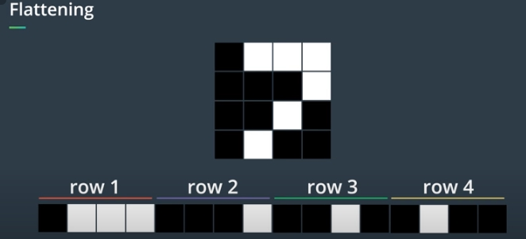
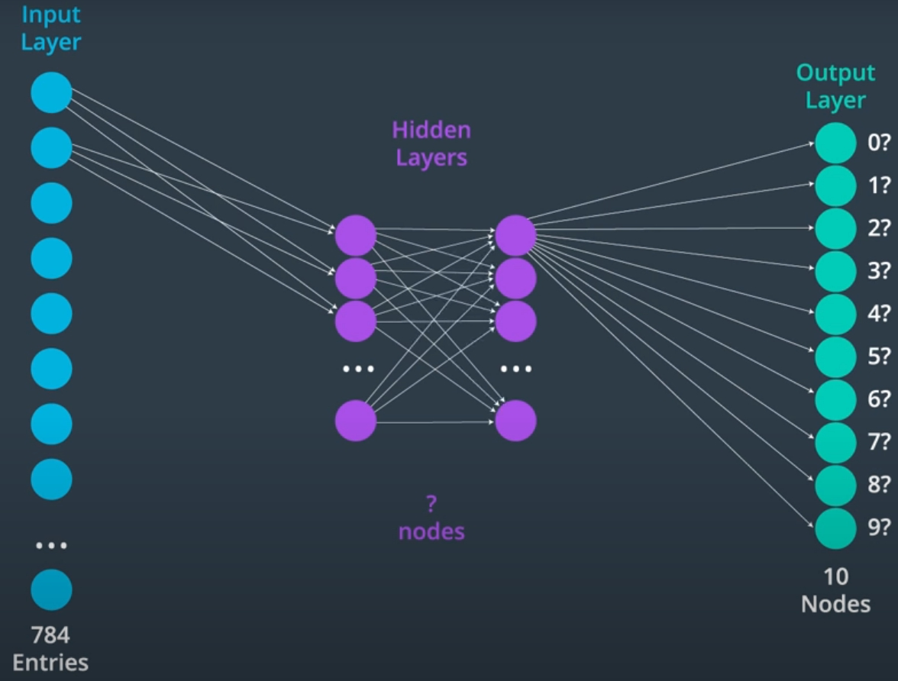
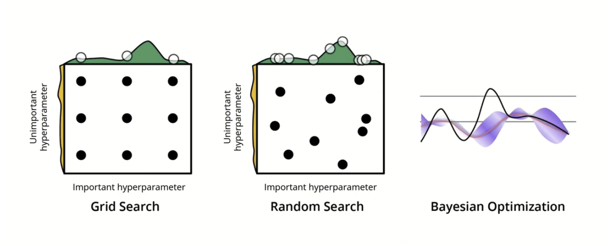
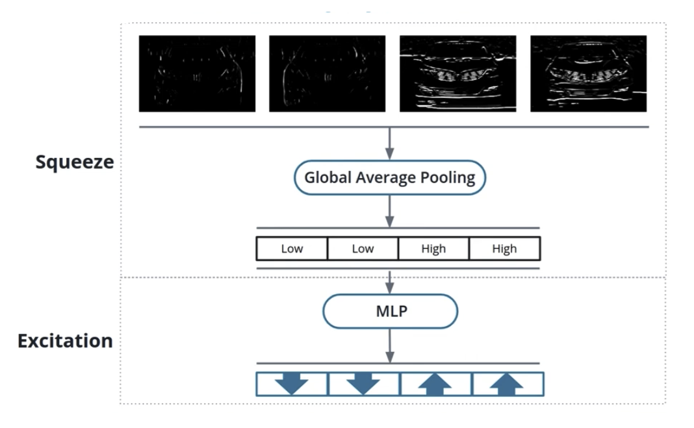

# S-2: Convolutional Neural Networks (CNNs)

# C-1: Fundamentals of Convolutional Neural Networks

1. Introduction to Convolutional Neural Networks
    - CNN Concepts and Architecture
    - Kernel Convolution
    - Weight Sharing and Feature Extraction
2. Comparative Neural Network Architectures
    - Multi-Layer Perceptrons (MLPs) vs Convolutional Neural Networks
    - Structural Differences and Design Principles
3. Advanced CNN Concepts
    - Receptive Fields
    - Pooling Techniques
    - Edge Handling and Image Processing
4. Neural Network Training Process
    - Loss Functions
    - Optimizers
    - Training and Validation Loops
    - CNN-Specific Training Considerations
5. Feature Learning and Hierarchical Representation
    - Layer-by-Layer Feature Extraction
    - From Simple to Complex Feature Detection
6. Practical Implementation and Best Practices
    - Model Design Guidelines
    - Regularization Techniques
    - Performance Monitoring and Improvement

#### Introduction to Convolutional Neural Networks

##### CNN Concepts and Architecture

Convolutional Neural Networks (CNNs) represent one of the most transformative innovations in artificial intelligence.
Unlike traditional neural networks, CNNs are specifically designed to process data with grid-like topology, such as
images. To understand why they're revolutionary, let's explore their core principles.

At their heart, CNNs are neural networks that use a mathematical operation called **convolution** instead of general
matrix multiplication in at least one of their layers. This seemingly simple change unleashes remarkable capabilities
for processing visual information.

Imagine looking at a photograph. When you recognize a face, you're not analyzing the entire image at once—your visual
system focuses on specific features (eyes, nose, mouth) and their spatial relationships. CNNs work similarly, examining
small regions of an image at a time and gradually building up an understanding of the whole.

<p align="center">

</p>
<p align="center">figure:  CNN Architecture Blueprint</p>

##### The Biological Inspiration

CNNs draw inspiration from the organization of the animal visual cortex, where individual neurons respond to stimuli
only in a restricted region of the visual field known as the receptive field. These fields overlap to cover the entire
visual area, creating a powerful system for processing visual information.

The biological inspiration for Convolutional Neural Networks comes from groundbreaking neuroscience research that
revealed how our visual system processes information. This connection between biology and artificial neural networks
helps explain why CNNs are so effective for computer vision tasks.

###### The Visual Cortex Structure

In the 1950s and 1960s, neuroscientists David Hubel and Torsten Wiesel conducted pioneering experiments studying how
cats' visual systems process information. They discovered that individual neurons in the visual cortex respond
selectively to specific patterns of light in particular regions of the visual field.

Each neuron has what's called a "receptive field" - a limited area of the visual field that it monitors. When an
appropriate stimulus appears in this receptive field, the neuron activates. What's fascinating is that different neurons
respond to different features:

- Some neurons fire when they detect vertical edges
- Others respond to horizontal edges
- Some activate when they see motion in particular directions
- Others react to specific colors or textures

###### The Visual Cortex: Your Brain's Image Processor

The visual cortex is a specialized region of the brain's cerebral cortex devoted to processing visual information.
Located in the occipital lobe at the back of the brain, it's essentially your brain's image processing center.

When light enters your eyes, it strikes the retina, where specialized cells called photoreceptors (rods and cones)
convert light energy into electrical signals. These signals travel along the optic nerve to the thalamus (specifically a
region called the lateral geniculate nucleus) and then continue to the primary visual cortex, also known as V1 or the
striate cortex.

The visual cortex isn't a single uniform structure but consists of multiple specialized areas, each handling different
aspects of vision:

- **V1 (Primary Visual Cortex)**: The first stop for visual information, where basic features like oriented edges,
  brightness contrasts, and motion are detected.
- **V2**: Processes more complex visual features like orientation, spatial frequency, and color.
- **V3**: Involved in processing dynamic form information.
- **V4**: Specializes in processing color, orientation, spatial frequency, and object recognition.
- **V5/MT (Middle Temporal)**: Specializes in motion perception.

What makes the visual cortex remarkable is its hierarchical organization. Visual processing begins with simple feature
detection in V1 (like detecting edges at specific orientations) and progresses through higher visual areas where these
simple features are combined into increasingly complex representations.

This is why convolutional neural networks mimic this structure - they start with simple edge detection in early layers
and build up to complex object recognition in deeper layers, similar to how your visual cortex processes what you see.

The visual cortex exemplifies the brain's principle of specialized processing regions working together to create our
seamless visual experience of the world. Despite making up only a portion of the brain, it contains hundreds of millions
of neurons working in parallel to process the rich visual information we encounter every moment.

When neuroscientists talk about "receptive fields" in the visual cortex, they're referring to the specific region of the
visual field that, when stimulated, activates a particular neuron. This discovery was revolutionary because it showed
how the brain breaks down complex visual scenes into manageable components processed by dedicated neural circuits.

###### Hierarchical Organization

The visual cortex is organized in a hierarchical fashion, with information processing occurring in stages:

1. Simple cells respond to basic features like oriented edges within their receptive fields
2. Complex cells combine inputs from multiple simple cells, detecting similar features but with some position invariance
3. Higher-level neurons integrate information from many complex cells to recognize increasingly sophisticated patterns

This hierarchical structure allows the visual system to build up recognition from simple components to complex objects.

###### The Overlap Principle

The part about "fields overlap to cover the entire visual area" is crucial. Individual neurons don't process the entire
visual field; each has its own restricted area of vision. But these receptive fields overlap extensively, creating a
complete representation of the visual field through their collective activity.

This overlapping arrangement provides several advantages:

- Redundancy: Multiple neurons monitor each region, providing resilience
- Distributed processing: Visual information is processed in parallel across many neurons
- Spatial relationships: The system inherently preserves spatial relationships between features

###### How CNNs Mirror This Biology

Convolutional Neural Networks directly implement these biological principles:

1. **Convolutional filters** mimic the receptive fields of individual neurons, each examining a small region of the
   input
2. **Shared weights** in CNN filters reflect how the same feature detector (like an edge detector) is applied across the
   entire visual field
3. **Hierarchical structure** with multiple layers parallels how visual information is processed from simple to complex
   in the brain
4. **Pooling operations** create position invariance similar to complex cells
5. **Increasing feature depth** in deeper layers mirrors how the brain builds more abstract representations as
   information moves through the visual pathway

When a CNN applies convolutional filters across an image, it's performing an operation remarkably similar to how your
visual cortex processes what you see. Each filter detects specific features, and as information flows through deeper
layers, these features combine to form increasingly complex representations - from edges to textures to object parts to
complete objects.

This biological inspiration doesn't mean CNNs work exactly like the brain, but the shared architectural principles help
explain why CNNs excel at visual tasks. Nature developed this architecture through evolution, and we've adapted similar
principles in our artificial systems, creating one of the most successful examples of biologically-inspired artificial
intelligence.

In a CNN, artificial neurons connect only to a small region of the layer before it, mimicking this biological structure.
This constrained connectivity is one of the key architectural differences between CNNs and traditional fully-connected
networks.

##### Architectural Components

A typical CNN architecture consists of several distinctive layers stacked together:


1. **Convolutional layers**: Apply learned filters to input images, extracting features like edges, textures, and
   patterns.
2. **Activation functions**: Introduce non-linearity to the network, typically using ReLU (Rectified Linear Unit) to
   transform feature maps.
3. **Pooling layers**: Reduce the spatial dimensions of the data, making the network less sensitive to slight
   translations in the input.
4. **Fully connected layers**: Connect every neuron to all neurons in the previous layer, combining the learned features
   for final classification.

What makes CNNs truly remarkable is their ability to automatically learn relevant features from data. The early layers
typically detect simple features like edges and color gradients, while deeper layers combine these into increasingly
complex patterns—eventually recognizing entire objects.

<p align="center">

</p>
<p align="center">figure: Overview of a Convolutional Neural Network applications</p>

##### Weight Sharing: The Efficiency Breakthrough

One of the most important innovations in CNNs is **weight sharing**. In a traditional neural network, each connection
between neurons has its own weight parameter. In contrast, CNNs use the same weights for multiple connections,
dramatically reducing the number of parameters.

This design choice reflects a profound insight about images: if a feature (like an edge) is useful to detect in one part
of the image, it's likely useful everywhere. A single filter that detects horizontal edges should work anywhere in the
image—whether it's in the top left corner or bottom right.

Through weight sharing, CNNs achieve two critical advantages:

- Dramatic reduction in parameters (improving efficiency and reducing overfitting)
- Translation invariance (recognizing objects regardless of where they appear in the image)

The power of CNNs comes from this elegant combination of biologically-inspired architecture, hierarchical feature
learning, and parameter efficiency through weight sharing. This design has made CNNs the backbone of modern computer
vision systems, enabling everything from facial recognition to autonomous driving.

<p align="center">

</p>
<p align="center">figure: Pre-process the data</p>

##### Kernel Convolution

The heart of a CNN is the convolution operation—a mathematical procedure that transforms an input image using a small
matrix called a kernel (or filter). This operation is what gives CNNs their unique ability to extract meaningful spatial
features from images.

###### The Convolution Operation: A Step-by-Step Guide

Let's demystify convolution with a concrete example. Imagine we have a grayscale image represented as a matrix of pixel
values, and we want to detect edges using a specific filter.

1. **The input image**: A grid of pixel values (typically ranging from 0 to 255 for grayscale images).
2. **The kernel**: A small matrix of weights (often 3×3 or 5×5) designed to detect specific features.
3. **The convolution process**: The kernel slides across the image, performing element-wise multiplication and summation
   at each position.

Consider this simple 5×5 input image and a 3×3 edge-detection kernel:

Input Image:

```
[10  20  15  25  30]
[40  50  60  32  18]
[25  33  45  60  80]
[15  20  30  40  50]
[40  30  25  15  10]
```

Edge-detection kernel:

```
[-1  -1  -1]
[-1   8  -1]
[-1  -1  -1]
```

To compute the first value in our output feature map, we place the kernel over the top-left 3×3 region of the image:

```
[10  20  15]   [-1  -1  -1]
[40  50  60] × [-1   8  -1]
[25  33  45]   [-1  -1  -1]
```

We multiply corresponding elements and sum the results:
$(10 \times -1) + (20 \times -1) + (15 \times -1) + (40 \times -1) + (50 \times 8) + (60 \times -1) + (25 \times -1) + (33 \times -1) + (45 \times -1)$

$= -10 - 20 - 15 - 40 + 400 - 60 - 25 - 33 - 45$

$= 400 - 248 = 152$

This value (152) becomes the first element in our output feature map. We then slide the kernel one position to the right
and repeat the process, continuing until we've covered the entire image.

###### The Mathematics of Convolution

Formally, the 2D convolution operation can be expressed as:

$$S(i, j) = \sum_{m} \sum_{n} I(i+m, j+n) \cdot K(m, n)$$

Where:

- $S(i, j)$ is the output value at position $(i, j)$
- $I$ is the input image
- $K$ is the kernel
- $m, n$ are the indices for the kernel dimensions

This operation produces a feature map that highlights specific patterns in the input image, depending on the kernel
values.

###### Types of Kernels and Their Effects

Different kernels detect different features. Here are some common examples:

1. **Edge detection kernels**: Highlight boundaries between regions of different intensities.

    ```
    [-1  -1  -1]
    [-1   8  -1]
    [-1  -1  -1]
    ```

2. **Horizontal edge detection**:

    ```
    [-1  -2  -1]
    [ 0   0   0]
    [ 1   2   1]
    ```

3. **Vertical edge detection**:

    ```
    [-1   0   1]
    [-2   0   2]
    [-1   0   1]
    ```

4. **Gaussian blur**: Reduces noise and detail.

    ```
    [1/16  1/8  1/16]
    [1/8   1/4  1/8 ]
    [1/16  1/8  1/16]
    ```

5. **Sharpening kernel**: Enhances details and edges.

    ```
    [ 0  -1   0]
    [-1   5  -1]
    [ 0  -1   0]
    ```

The beauty of CNNs is that they learn these kernels automatically during training. Starting from randomly initialized
values, the network adjusts the kernel weights through backpropagation to extract the most useful features for the
specific task.

##### Initial Kernel Values vs. Learned Kernels

When a CNN is first created, its convolutional kernels are not initialized with these nicely structured patterns like
edge detectors or blurring filters. Instead, they typically start with random values drawn from specific probability
distributions (like normal distributions or uniform distributions with small values).

For example, a 3×3 kernel might be initialized with random values like:

```
[ 0.02  -0.15   0.08]
[-0.11   0.05  -0.03]
[ 0.09  -0.07   0.01]
```

###### The Learning Process

The transformation from random noise to meaningful filters happens through the training process:

1. **Forward Pass**: The network uses its current kernels (initially random) to make predictions
2. **Loss Calculation**: The difference between predictions and actual labels is measured
3. **Backpropagation**: The gradient of the loss with respect to each kernel value is calculated
4. **Weight Update**: Each kernel value is adjusted slightly to reduce the loss

This process repeats thousands or millions of times across many training examples. Gradually, the kernels evolve from
random values into patterns that are useful for the specific task the network is solving.

The remarkable thing is that CNNs consistently learn kernels resembling those hand-designed filters (edge detectors,
etc.) without being explicitly programmed to do so. This happens because:

1. **Natural image statistics**: Real-world images have certain statistical properties - edges are extremely common and
   informative features in natural images
2. **Task requirements**: For tasks like object recognition, detecting edges and basic shapes is fundamentally useful
3. **Gradient descent optimization**: The learning process naturally finds patterns that minimize error in the
   prediction task

After sufficient training, if you visualize the kernels in the first layer of a CNN, you'll often see that some have
evolved into vertical edge detectors, some into horizontal edge detectors, some into diagonal detectors, and so on.

Think of it like natural selection. The network starts with random "mutations" (kernel values). Those that happen to be
somewhat useful for the task (even if just slightly better than random) get reinforced through training. Over many
iterations, these initially barely-useful kernels evolve into highly specialized feature detectors.

For instance, if a kernel happens to have slightly higher values on the left and slightly lower values on the right by
random chance, it might weakly detect vertical edges. During training, if detecting vertical edges helps reduce the
error, backpropagation will strengthen this pattern, gradually transforming it into a proper vertical edge detector
like:

```shell
[-1   0   1]
[-2   0   2]
[-1   0   1]
```

This emergence of structured patterns from random initialization is one of the most fascinating aspects of deep
learning - the network discovers useful features rather than being explicitly programmed with them.

###### The Collective Training Process

All kernels in a convolutional layer train simultaneously, not separately or independently. This is an important aspect
of how CNNs learn to detect different features from the same input. When you have N kernels in a convolutional layer,
they all go through the training process together in each iteration.

###### Specialization Through Training

What's fascinating is that even though all kernels start randomly and train simultaneously with the same inputs and loss
function, they naturally evolve to detect different features. This happens because:

1. **Random initialization**: Each kernel starts with different random values
2. **Gradient updates**: These different starting points lead to different update trajectories
3. **Feature complementarity**: The network benefits most when kernels specialize in detecting different features rather
   than all detecting the same thing

For example, one kernel might evolve to detect horizontal edges, another vertical edges, another diagonal edges, and so
on - not because we told them to, but because this specialization collectively minimizes the loss.

###### What If One Kernel Is "Properly Trained" Earlier?

In neural network training:

1. Different kernels learn at different rates because of their random initialization and the specific features they
   happen to start detecting
2. However, training doesn't stop for individual kernels that have "converged" - all weights continue to be updated as
   long as training continues
3. A well-trained kernel might see smaller gradient updates over time if it's already doing a good job, but updates
   don't completely stop for just some kernels

The network optimizes all parameters together to minimize the overall loss. If one kernel is perfectly detecting
horizontal edges but the network still makes errors, the training process will continue adjusting all kernels to further
reduce those errors.

Think of it like a team of 5 spotters all looking at the same scene but each tasked with finding different things.
Initially, they're all just randomly scanning. As they receive feedback, they gradually specialize - one becomes expert
at spotting birds, another at spotting cars, another at spotting people, and so on.

Even if the bird-spotter becomes perfect at their job, the team as a whole isn't perfect until everyone is good at their
specialized task. Training continues until the collective performance reaches the desired level.

This ability for kernels to naturally specialize and detect complementary features is one of the most powerful aspects
of convolutional neural networks and explains why they're so effective at visual recognition tasks.

###### Padding and Stride: Controlling Spatial Dimensions

When applying convolution, two important parameters affect the output dimensions:

1. **Padding**: Adding extra pixels (typically zeros) around the border of the input image. This allows the kernel to be
   centered on border pixels and helps maintain the spatial dimensions of the feature map.
2. **Stride**: The number of pixels by which the kernel shifts at each step. A larger stride reduces the output
   dimensions.

Without padding, a convolution operation reduces the output dimensions. For an $n \times n$ input image and a
$k \times k$ kernel, the output dimensions become $(n-k+1) \times (n-k+1)$.

With padding $p$ and stride $s$, the output dimensions are:

$$\text{output size} = \lfloor \frac{n + 2p - k}{s} + 1 \rfloor$$

Convolution with appropriate padding and stride enables CNNs to control spatial information flow and create hierarchical
representations of visual data—a crucial capability that makes them so effective for image analysis tasks.

###### Weight Sharing and Feature Extraction

Weight sharing represents one of the most ingenious innovations in Convolutional Neural Networks, dramatically reducing
parameters while preserving the network's ability to detect features anywhere in an image. To truly understand its
significance, we need to explore the concept in depth and see how it enables effective feature extraction.

###### The Principle of Weight Sharing

In traditional neural networks (like MLPs), each connection between neurons has a unique weight. This means that for a
fully connected layer connecting $n$ input neurons to $m$ output neurons, we need $n \times m$ weight parameters—a
number that grows extremely large for high-dimensional inputs like images.

CNNs take a fundamentally different approach. Rather than learning separate weights for each spatial position, a CNN
uses the same set of weights (the kernel) across the entire input. This is based on a powerful insight: the patterns we
want to detect (like edges, textures, or shapes) should be recognized regardless of where they appear in the image.

The weight-sharing mechanism works as follows:

1. A single kernel (e.g., a 3×3 matrix of weights) is defined.
2. This same kernel slides across all spatial positions in the input.
3. The patterns detected by this kernel are recorded in the corresponding positions of the output feature map.

Let's quantify the parameter efficiency gained through weight sharing. Consider processing a 224×224 image:

- **Without weight sharing** (fully connected approach): Each output neuron would connect to all 50,176 input pixels,
  requiring millions of parameters for just one layer.
- **With weight sharing** (convolutional approach): A 3×3 kernel has only 9 weights (plus a bias term), regardless of
  input size. Even with 64 different kernels, we need just 640 parameters (64 × (9+1)).

This represents a reduction in parameters by several orders of magnitude!

###### From Pixels to Features: The Extraction Process

Weight sharing does much more than reduce parameters—it fundamentally changes how the network processes visual
information. Let's explore how CNNs transform raw pixel data into meaningful features:

1. **Low-level feature extraction**: The first convolutional layer typically learns simple patterns like edges, lines,
   and color gradients. Each kernel specializes in detecting different basic visual elements.
2. **Mid-level feature composition**: Subsequent layers combine these basic elements into more complex patterns—corners,
   textures, and simple shapes. They achieve this by applying convolutions to the feature maps from previous layers.
3. **High-level feature abstraction**: Deeper layers detect increasingly complex and abstract features—object parts,
   distinctive textures, and eventually whole objects.


This hierarchical feature extraction mirrors how our own visual system processes information—building complex
understanding from simple components.

###### Translation Invariance: An Emergent Property

Perhaps the most powerful consequence of weight sharing is translation invariance—the network's ability to recognize
patterns regardless of their position in the image. This property emerges naturally because:

1. The same kernel scans the entire image, detecting its specific pattern wherever it appears.
2. Pooling operations (which we'll cover in a later section) further enhance position invariance by summarizing features
   across local regions.

Translation invariance is crucial for real-world applications. Consider face recognition—we want our system to identify
a face whether it appears in the center, corner, or any other position in the image. Weight sharing gives CNNs this
capability without requiring multiple examples of the same face in different positions.

###### Learning Features Automatically

One of the most remarkable aspects of CNNs is that they learn which features to extract through the training process—the
kernels are not hand-designed but optimized based on the specific task.

During training:

1. Kernels start with random weights.
2. As the network processes training examples, backpropagation adjusts these weights.
3. Gradually, kernels evolve to detect the most useful features for the task.

This automatic feature learning stands in stark contrast to traditional computer vision approaches, which often relied
on hand-crafted feature extractors. CNNs discover which features matter most for a given problem, often finding patterns
that human designers might miss.

Weight sharing and the resulting feature extraction process give CNNs their extraordinary capabilities in visual
understanding tasks. By dramatically reducing parameters while preserving the ability to detect position-invariant
features, CNNs achieve both computational efficiency and remarkable accuracy—a combination that has revolutionized
computer vision and many other fields.

##### Understanding Kernel Configuration in CNNs

When designing a convolutional neural network, programmer need to specify the number of kernels (also called filters)
for each convolutional layer. This is a critical architectural decision that you make before training begins. In most
deep learning frameworks, you specify the number of kernels when defining your network architecture. For example, in
PyTorch:

```python
# Creating a convolutional layer with 64 kernels
# Each kernel is 3x3 and operates on input with 3 channels
conv_layer = nn.Conv2d(in_channels=3, out_channels=64, kernel_size=3, padding=1)
```

In this code, `out_channels=64` defines that this layer will have 64 different kernels. Each kernel will produce one
feature map in the output, so the output of this layer will have 64 channels.

###### How to Choose the Number of Kernels

Deciding how many kernels to use involves balancing several considerations:

1. **Representational capacity**: More kernels can learn more diverse features, increasing the network's capacity to
   recognize complex patterns.
2. **Computational efficiency**: More kernels require more computation during both training and inference.
3. **Risk of overfitting**: Too many kernels might lead to overfitting, especially with limited training data.
4. **Task complexity**: More complex tasks (like recognizing thousands of object categories) generally benefit from more
   kernels.

A common pattern in CNN design is to increase the number of kernels as you go deeper into the network. For example:

- First layer: 32-64 kernels
- Second layer: 64-128 kernels
- Third layer: 128-256 kernels

This approach reflects how visual information is processed: early layers detect simple, general features (edges,
textures) while deeper layers combine these into more complex, specific features (object parts, patterns).

###### What the Network Decides vs. What You Decide

It's important to distinguish between what aspects of the CNN are predefined and what aspects are learned:

**You decide (before training):**

- How many convolutional layers to use
- How many kernels in each layer
- The size of each kernel (3×3, 5×5, etc.)
- The stride and padding settings
- The overall network architecture

**The network learns (during training):**

- The actual weight values within each kernel
- Which specific features each kernel will detect
- How to combine these features for the task at hand

The CNN learns "which features to extract" in the sense that it learns the optimal values for each kernel, but it does
so within the architectural constraints you've defined, including how many different feature detectors (kernels) it has
available at each layer.

###### Automatic Architecture Search

An advanced approach is Neural Architecture Search (NAS), where algorithms automatically determine the optimal number of
kernels and other architectural choices. However, this is computationally expensive and not yet standard practice for
most applications. In typical scenarios, the number of kernels remains a hyperparameter that you, as the network
designer, need to specify.

This balance between human-defined architecture and automatically learned features is what makes deep learning so
powerful—we provide the learning framework, and the network discovers the optimal feature detectors within that
framework.

##### How CNN Kernels Specialize: The Magic of Automatic Feature Learning

If you decide to use $n$ kernels (say, $n=3$) in a convolutional layer, the neural network indeed determines what type
of features each kernel will detect through the training process. This automatic specialization is one of the most
fascinating aspects of neural networks.

Let's walk through what typically happens with 3 kernels in an early convolutional layer:

When training begins, all three kernels contain random values. As training progresses, each kernel gradually adjusts its
weights to detect patterns that help minimize the overall error. Because they start from different random
initializations, they typically evolve to detect different features.

For example, after sufficient training, your three kernels might specialize like this:

1. **Kernel 1** might evolve to detect vertical edges in the image
2. **Kernel 2** might specialize in detecting horizontal edges
3. **Kernel 3** might learn to identify diagonal features or corners

The network determines this specialization entirely on its own, based on what features are most useful for the specific
task you're training it for. Imagine we're training a network to recognize handwritten digits. Your three kernels might
evolve in this way:

**Initial state (random):**

```shell
Kernel 1:               Kernel 2:               Kernel 3:
[ 0.12 -0.08  0.05]     [-0.11  0.09  0.02]     [ 0.03 -0.07  0.14]
[-0.01  0.07 -0.03]     [ 0.06 -0.12  0.08]     [-0.09  0.01 -0.02]
[ 0.09 -0.04  0.11]     [ 0.03  0.05 -0.09]     [ 0.10  0.05 -0.08]
```

**After training (specialized):**

```shell
Kernel 1:               Kernel 2:               Kernel 3:
[-0.92 -0.04 -0.97]     [-1.12 -1.87 -1.03]     [-0.81  0.12  0.79]
[-0.11  0.08 -0.08]     [ 0.09  0.11  0.08]     [-1.09  0.23  1.01]
[ 0.95  0.05  0.92]     [ 1.05  1.91  1.08]     [-0.83  0.14  0.86]
```

Now Kernel 1 detects vertical edges, Kernel 2 detects horizontal edges, and Kernel 3 detects diagonal edges (in this
case, a 45-degree edge).

This automatic specialization is crucial because:

1. The network discovers the most informative features for your specific dataset and task, rather than using generic
   features a human might design.
2. Different kernels learn complementary features, maximizing the information extracted from the input.
3. As you go deeper in the network, later convolutional layers combine these basic features to detect increasingly
   complex patterns—from edges to textures to object parts to complete objects.

###### The Trade-off of Using Only 3 Kernels

With only 3 kernels, your network has a limited "vocabulary" of features it can detect. While 3 kernels might be
sufficient for very simple tasks, most real-world applications use more:

- Simple tasks might use 16-32 kernels in early layers
- Complex image recognition might use 64-256 kernels per layer

The more kernels you have, the richer the feature representation your network can learn. With more kernels, the network
might detect edges at more angles, different textures, color transitions, and various other visual patterns.

The beautiful part is that regardless of whether you choose 3 or 300 kernels, the fundamental process remains the same:
the network determines what features each kernel should detect based on what helps solve the task at hand most
effectively.

#### Comparative Neural Network Architectures

##### Multi-Layer Perceptrons (MLPs) vs Convolutional Neural Networks

Fully understanding CNNs requires appreciating how they differ from their predecessors. The Multi-Layer Perceptron (MLP)
represents the classical neural network architecture—a foundation upon which more specialized designs like CNNs were
built. By comparing these architectures, we can better understand the revolutionary innovations that make CNNs so
effective for visual tasks.

###### The Classical Approach: Multi-Layer Perceptrons

MLPs are the traditional workhorses of neural networks, characterized by fully-connected layers where every neuron
connects to every neuron in adjacent layers. This architecture makes them flexible general-purpose learners, but it
comes with significant limitations when applied to image data.

The basic structure of an MLP includes:

1. **Input layer**: Receives the raw data (flattened, in the case of images)
2. **Hidden layers**: One or more layers that transform the input through weighted connections
3. **Output layer**: Produces the final prediction or classification

For image processing, the MLP approach requires flattening a 2D image into a 1D vector, immediately discarding the
spatial relationships between pixels. Consider a modest 28×28 grayscale image (like those in the MNIST
dataset)—flattening transforms it into a 784-element vector where adjacent pixels in the original image may be far apart
in the vector representation.


This flattening process creates several fundamental problems:

1. **Loss of spatial information**: The network has no built-in understanding that adjacent pixels in the original image
   are related.
2. **Parameter explosion**: A single fully connected layer from a flattened 28×28 image to 100 hidden neurons requires
   78,400 weights (784×100)—and this is for a tiny image! Modern high-resolution images would require millions of
   parameters.
3. **No position invariance**: An MLP must separately learn to recognize patterns in different positions, requiring
   enormous amounts of training data to achieve robustness.
4. **Overfitting tendency**: The massive number of parameters makes MLPs prone to memorizing training examples rather
   than generalizing.

Despite these limitations, MLPs can learn to classify images with reasonable accuracy given enough data and careful
regularization. However, they're fundamentally inefficient for the task, requiring far more parameters and training
examples than necessary.

###### The CNN Revolution: A Specialized Architecture for Visual Data

CNNs address the limitations of MLPs through an architecture specifically designed for grid-like data such as images.
Instead of treating each pixel as an independent input feature, CNNs preserve and exploit the spatial relationships
between pixels.

The fundamental innovations of CNNs include:

1. **Local connectivity**: Each neuron connects only to a small region of the previous layer, mirroring how visual
   processing works in biological systems.
2. **Weight sharing**: The same set of weights (kernels) is applied across the entire image, dramatically reducing
   parameters while enabling position-invariant feature detection.
3. **Hierarchical feature extraction**: Through stacked convolutional layers, the network automatically builds a
   hierarchy from simple features (edges, textures) to complex patterns (objects, scenes).


This specialized architecture creates several advantages for image processing:

1. **Preservation of spatial relationships**: Convolution operations maintain the spatial topology of the input data.
2. **Parameter efficiency**: Through weight sharing, a CNN can use the same small set of weights to detect a feature
   anywhere in the image.
3. **Translation invariance**: The network naturally recognizes patterns regardless of their position, especially when
   combined with pooling operations.
4. **Improved generalization**: With fewer parameters and built-in inductive biases for image data, CNNs generalize
   better from limited examples.

###### Structural Differences and Design Principles

The architectural differences between MLPs and CNNs reflect deeper design principles and tradeoffs in neural network
design. Understanding these principles helps explain why CNNs excel at visual tasks while MLPs remain valuable for other
applications.

#### Fundamental Design Differences

Let's examine the key structural distinctions between these architectures:

| Aspect               | Multi-Layer Perceptron                          | Convolutional Neural Network                      |
| -------------------- | ----------------------------------------------- | ------------------------------------------------- |
| Basic unit           | Fully connected layer                           | Convolutional layer + pooling                     |
| Input representation | Flattened (1D vector)                           | Original dimensional structure preserved          |
| Connectivity pattern | Global (each neuron connects to all inputs)     | Local (each neuron connects to a small region)    |
| Parameter sharing    | None (unique weight for each connection)        | Extensive (same kernel weights used throughout)   |
| Spatial awareness    | None (spatial relationships lost in flattening) | Strong (preserves and exploits spatial structure) |
| Parameter count      | Very high (grows quickly with input size)       | Relatively low (independent of input size)        |

These structural differences have profound implications for how each network learns and processes information.

###### Inductive Biases and Domain Knowledge

Both architectures embody different inductive biases—assumptions built into the model design that guide learning:

1. **MLP inductive biases**:
    - All input features are potentially equally important
    - No special relationship exists between features based on their order or arrangement
    - Complex patterns might depend on combinations of any input features
2. **CNN inductive biases**:
    - Nearby pixels are more strongly related than distant ones
    - The same visual patterns can appear anywhere in the image
    - Visual information has a hierarchical structure from simple to complex

These biases explain why CNNs excel at image tasks while MLPs may perform better on tabular data where feature
relationships don't follow spatial patterns.

###### Computational Efficiency Considerations

The architectural differences also create significant computational efficiency gaps:

1. **Memory requirements**:
    - MLPs: Store unique weights for every connection (millions for modest image sizes)
    - CNNs: Store only kernel weights (typically thousands regardless of image size)
2. **Computational complexity**:
    - MLPs: O(n²) where n is the number of neurons per layer
    - CNNs: O(k²·n) where k is the kernel size (much more efficient for large inputs)
3. **Scaling with input size**:
    - MLPs: Parameters grow quadratically with input dimensions
    - CNNs: Parameters remain constant regardless of input dimensions

This efficiency advantage allows CNNs to process high-resolution images that would be computationally intractable for
MLPs.

###### Hybrid Approaches: Combining the Best of Both Worlds

Modern neural network designs often combine elements from both architectures:

1. **CNN feature extractors with MLP classifiers**: Many CNN architectures use convolutional layers for feature
   extraction, followed by fully connected layers for final classification.
2. **Global average pooling**: Instead of flattening and using fully connected layers, some modern CNNs use global
   average pooling to reduce feature maps directly to class scores, further reducing parameters.
3. **Attention mechanisms**: These add flexible, content-dependent connectivity to traditional CNN architectures,
   allowing the network to focus on the most relevant parts of an image.


###### Flattening Process

The flattening process is a crucial transition point in a convolutional neural network's architecture, bridging the
convolutional layers that process spatial data with the fully connected layers that make final classifications. Let me
explain what this process involves and why it's necessary.

Flattening is exactly what it sounds like - taking a multi-dimensional array and "flattening" it into a one-dimensional
vector. In the context of CNNs, this typically means converting the 3D output from convolutional and pooling layers
(which has dimensions of height × width × channels) into a 1D array of numbers. Let's walk through a concrete example to
illustrate the flattening process:

Imagine after several convolutional and pooling layers, your network has produced feature maps with dimensions 4×4×8
(height × width × channels). This means you have 8 feature maps, each 4×4 in size.

The flattening operation would transform this 3D tensor with 128 values (4×4×8) into a 1D vector with 128 elements, by
simply arranging all the values in a single line. The conversion happens by taking each value from the 3D tensor and
placing them sequentially in the 1D vector.

In pseudocode, this might look like:

```python
flat_vector = []
for channel in range(8):
    for row in range(4):
        for col in range(4):
            flat_vector.append(feature_maps[row][col][channel])
```

The order of traversal (whether you go through channels first or spatial dimensions first) doesn't matter as long as
you're consistent, since the network will learn based on whatever order you choose.

<p align="center">

</p>
<p align="center">figure: flattening of the matrix</p>

Flattening is necessary because:

1. **Architecture transition**: Convolutional layers operate on 2D spatial grids to preserve spatial relationships,
   while fully connected layers require 1D inputs.
2. **Global information integration**: After extracting local features through convolution, the network needs to combine
   this information globally for tasks like classification.
3. **Fixed-size input requirement**: Fully connected layers require a fixed-size input, and flattening ensures this
   regardless of the original image dimensions (assuming consistent feature map sizes).

###### The Information Cost of Flattening

While flattening is necessary for traditional CNN architectures, it does have a significant drawback: it loses all
spatial information about where features are located relative to each other. After flattening, the fully connected
layers no longer "know" if two activations were adjacent or far apart in the original feature maps.

This is why many modern architectures (like Fully Convolutional Networks for segmentation) avoid flattening when spatial
information needs to be preserved. Instead, they use techniques like global average pooling or 1×1 convolutions to
reduce dimensions while maintaining spatial awareness. In practice, implementing flattening is straightforward:

In PyTorch:

```python
# Assuming x is your feature maps with shape [batch_size, channels, height, width]
x = x.view(x.size(0), -1)  # Reshape to [batch_size, channels*height*width]
```

In TensorFlow/Keras:

```python
# As a layer in a model
flatten_layer = Flatten()
x = flatten_layer(x)

# Or directly
x = tf.reshape(x, [x.shape[0], -1])
```

In a typical CNN architecture flow, the flattenig operation comes after the Pooling as described below:

1. **Input image** enters the network
2. **Convolutional layers** extract features while preserving spatial information
3. **Pooling layers** reduce spatial dimensions while retaining important features
4. **Flattening operation** converts the 3D feature maps to a 1D vector
5. **Fully connected layers** combine these features for classification
6. **Output layer** produces the final prediction

Flattening marks the transition from the feature extraction portion of the network (convolutional layers) to the
classification portion (fully connected layers). It's the point where the network stops caring about "where" features
appear and focuses instead on "what" features are present.

Understanding this transition helps explain the fundamental design philosophy of CNNs: use convolutional layers to
extract spatially-aware features, then use fully connected layers to combine these features for making decisions about
the input as a whole.

###### When to Use Each Architecture

Understanding the strengths and weaknesses of each architecture helps in selecting the right tool for specific tasks:

**Use MLPs when**:

- Working with tabular or unstructured data
- Input features have no inherent spatial or sequential relationship
- Interpretability of individual feature importance is needed
- Working with small input dimensions

**Use CNNs when**:

- Processing image or grid-structured data
- Spatial relationships between input features are significant
- Translation invariance is desired
- Dealing with high-dimensional inputs

The comparison between MLPs and CNNs illustrates a broader principle in deep learning: architectural specialization
matters. By designing network architectures that incorporate domain-specific inductive biases, we can create more
efficient models that learn more effectively from limited data.

This understanding of architectural differences not only helps us choose the right model for a given task but also
inspires the development of new architectures tailored to specific problem domains—continuing the evolution of neural
network design beyond both MLPs and CNNs.

#### Advanced CNN Concepts

##### Receptive Fields

The concept of receptive fields is fundamental to understanding how CNNs build increasingly complex representations of
visual data. Think of a receptive field as the portion of the input image that can influence a particular neuron's
activation. This concept helps us understand why deeper networks can recognize more complex patterns and how information
flows through a CNN.

###### The Window to the World: Understanding Receptive Fields

Imagine looking at a large mural through a series of increasingly larger windows. Through a tiny peephole, you might
only see a small patch of color. Through a slightly larger window, you might recognize simple patterns or shapes.
Through an even larger window, you might identify objects or scenes. This analogy captures the essence of receptive
fields in CNNs.

In a CNN, each neuron "sees" only a portion of the input from the previous layer. As we progress through deeper layers
of the network, neurons incorporate information from increasingly larger regions of the original input image:

1. **Layer 1 neurons**: May see only a small 3×3 patch of the input image, enough to detect simple edges or color
   gradients.
2. **Layer 2 neurons**: Combine information from multiple Layer 1 neurons, allowing them to see a larger area of the
   original image (perhaps 5×5 or 7×7 pixels), enough to detect corners or textures.
3. **Layer 3 neurons**: Build on Layer 2 outputs, expanding their view even further, potentially recognizing simple
   shapes or object parts.

This hierarchical expansion of receptive fields enables the network to progress from detecting simple features to
recognizing complex objects. But how exactly does this expansion happen?

###### Calculating the Receptive Field Size

The receptive field size grows systematically as we move through network layers. For a network with convolutional layers
using kernels of size $k$ with stride $s$ and no dilation, we can calculate the receptive field size $r_l$ at layer $l$
using:

$$r_l = r_{l-1} + (k_l - 1) \times \prod_{i=1}^{l-1} s_i$$

Where $r_0 = 1$ (a single pixel at the input).

Let's work through a concrete example:

- Layer 1: 3×3 kernel, stride 1 → receptive field = 3×3
- Layer 2: 3×3 kernel, stride 1 → receptive field = 5×5
- Layer 3: 3×3 kernel, stride 1 → receptive field = 7×7

If we introduce a stride of 2 at Layer 2:

- Layer 1: 3×3 kernel, stride 1 → receptive field = 3×3
- Layer 2: 3×3 kernel, stride 2 → receptive field = 7×7
- Layer 3: 3×3 kernel, stride 1 → receptive field = 11×11

Notice how the receptive field grows more quickly with increased stride. This explains why architectures often use
larger strides or pooling layers to efficiently increase receptive field size without adding too many layers.

##### Understanding Receptive Field Calculations in CNNs

The receptive field of a neuron in a CNN refers to the portion of the input image that can influence that neuron's
activation. Understanding how the receptive field grows as we go deeper into the network is crucial for designing
effective architectures. Let me walk you through exactly how these calculations work.

###### Basic Principles

When calculating receptive fields, we need to consider:

1. **Kernel size**: How many input pixels/features each neuron looks at directly
2. **Stride**: How many pixels/features we skip when sliding the kernel
3. **Cumulative effect**: How these factors compound through multiple layers

###### First Example: All Stride-1 Layers

Let's analyze the first example with all stride-1 layers:

###### Layer 1 (First layer directly seeing the input image)

- Kernel size: 3×3
- Each neuron in Layer 1 looks at a 3×3 region of the original image
- **Receptive field: 3×3**

###### Layer 2

- Kernel size: 3×3
- Each neuron in Layer 2 looks at a 3×3 region of Layer 1's feature maps
- But each of those Layer 1 neurons already has a 3×3 receptive field on the input
- When we calculate how far this reaches in the original input, we get: 3 + (3-1) = 5
- **Receptive field: 5×5**

To understand why it's 5×5, imagine the 3×3 kernel in Layer 2 positioned over feature maps from Layer 1:

- The center neuron sees 1 pixel in the original input through Layer 1's center neuron
- The kernel extends 1 pixel in each direction from center (for a 3×3 kernel)
- Each step in Layer 1 already corresponds to 1 pixel in the input (with stride 1)
- So the kernel reaches 2 more pixels in each direction: 3 + 2 = 5

###### Layer 3

- Kernel size: 3×3
- Each neuron in Layer 3 looks at a 3×3 region of Layer 2's feature maps
- Each Layer 2 neuron already has a 5×5 receptive field
- Following the same logic: 5 + (3-1) = 7
- **Receptive field: 7×7**

###### Second Example: With Stride-2 in Layer 2

Now let's analyze what happens when we introduce a stride of 2 in the second layer:

###### Layer 1

- Kernel size: 3×3, stride 1
- **Receptive field: 3×3** (same as before)

###### Layer 2

- Kernel size: 3×3, stride 2
- With stride 2, each step in Layer 2 corresponds to 2 pixels in Layer 1
- The kernel size is still 3×3, but those 3 positions now cover 5 positions in Layer 1 (because of stride 2)
- So the calculation becomes: 3 + (3-1) × 2 = 3 + 4 = 7
- **Receptive field: 7×7**

The key insight: With stride 2, the effective reach of the kernel doubles. Each 1-unit step in Layer 2 corresponds to a
2-unit step in Layer 1's feature maps.

###### Layer 3

- Kernel size: 3×3, stride 1
- Each neuron in Layer 3 looks at a 3×3 region of Layer 2's feature maps
- Each Layer 2 neuron already has a 7×7 receptive field
- The stride from Layer 2 compounds: each 1-unit step in Layer 3 corresponds to 2-unit steps in Layer 1
- So the calculation becomes: 7 + (3-1) × 2 = 7 + 4 = 11
- **Receptive field: 11×11**

###### The General Formula

To calculate the receptive field size at any layer, we can use this formula:

r*l = r*(l-1) + (k_l - 1) × prod(s_i from i=1 to l-1)

Where:

- r_l is the receptive field size at layer l
- k_l is the kernel size at layer l
- s_i is the stride at layer i
- prod() means the product (multiplication) of all values

This formula captures how each layer's kernel size and the accumulated effect of all previous strides contribute to the
final receptive field.

Understanding receptive fields helps us design networks that can "see" enough of the input to solve our task:

- For detecting small, local features (textures), small receptive fields may be sufficient
- For recognizing entire objects, the receptive field should be large enough to encompass the object
- For scene understanding, very large receptive fields are needed

The examples show how introducing larger strides early in the network efficiently increases the receptive field size
without adding many layers. This is why many architectures use strided convolutions or pooling layers - they help the
network quickly gain a wider view of the input.

Let me explain the receptive field calculation more clearly, focusing on why Layer 2 has a 5×5 receptive field.

When we talk about a receptive field of 5×5, we're saying that each neuron in Layer 2 is influenced by a 5×5 area of the
original input image. Let's break this down step by step:

###### Layer 1: Building the Foundation

In Layer 1, we have a 3×3 kernel. Each neuron in Layer 1's output directly looks at a 3×3 patch of the input image. This
is straightforward - the receptive field equals the kernel size.

###### Layer 2: Expanding the View

Now for Layer 2. Each neuron in Layer 2 applies a 3×3 kernel to Layer 1's output. This means each Layer 2 neuron
directly connects to a 3×3 area of Layer 1's feature map.

But here's the key insight: each of those Layer 1 neurons already has its own receptive field on the original input.
When we stack layers, the receptive fields compound.

Let me illustrate with a concrete example:

Imagine we have a 7×7 input image. Let's label the pixels from (0,0) to (6,6):

```shell
(0,0) (0,1) (0,2) (0,3) (0,4) (0,5) (0,6)
(1,0) (1,1) (1,2) (1,3) (1,4) (1,5) (1,6)
(2,0) (2,1) (2,2) (2,3) (2,4) (2,5) (2,6)
(3,0) (3,1) (3,2) (3,3) (3,4) (3,5) (3,6)
(4,0) (4,1) (4,2) (4,3) (4,4) (4,5) (4,6)
(5,0) (5,1) (5,2) (5,3) (5,4) (5,5) (5,6)
(6,0) (6,1) (6,2) (6,3) (6,4) (6,5) (6,6)
```

Now, consider a neuron in Layer 1 that looks at the central 3×3 area:

```
      (1,1) (1,2) (1,3)
      (2,1) (2,2) (2,3)
      (3,1) (3,2) (3,3)
```

This Layer 1 neuron has a receptive field of 3×3, centered at position (2,2) in the input.

Now, in Layer 2, let's consider a neuron that looks at a 3×3 area of Layer 1's output, centered on the neuron we just
described. This Layer 2 neuron connects to:

1. The central Layer 1 neuron (which sees input pixels centered at (2,2))
2. The Layer 1 neuron to the left (which sees input pixels centered at (2,1))
3. The Layer 1 neuron to the right (which sees input pixels centered at (2,3))
4. The Layer 1 neuron above (which sees input pixels centered at (1,2))
5. The Layer 1 neuron below (which sees input pixels centered at (3,2))
6. The Layer 1 neurons at the four corners (seeing input pixels centered at (1,1), (1,3), (3,1), and (3,3))

Let's visualize what happens with the left-most Layer 1 neuron in this collection. It's centered at input position (2,1)
and looks at:

```
      (1,0) (1,1) (1,2)
      (2,0) (2,1) (2,2)
      (3,0) (3,1) (3,2)
```

Now, the right-most Layer 1 neuron is centered at (2,3) and looks at:

```
      (1,2) (1,3) (1,4)
      (2,2) (2,3) (2,4)
      (3,2) (3,3) (3,4)
```

When we consider all nine Layer 1 neurons that connect to our Layer 2 neuron, they collectively see:

```
(1,0) (1,1) (1,2) (1,3) (1,4)
(2,0) (2,1) (2,2) (2,3) (2,4)
(3,0) (3,1) (3,2) (3,3) (3,4)
```

This is a 3×5 region. Similarly, when we consider the vertical span, we get a 5×3 region. Combining these, our Layer 2
neuron has a receptive field of 5×5 on the original input.

The formula 3 + (3-1) = 5 calculates this size:

- The first '3' is the receptive field size from the previous layer
- The '(3-1)' is the kernel size minus 1, which represents how many extra pixels we add to each side of the receptive
  field
- So we get 3 (original size) + 2 (expansion) = 5

This is why, when we stack 3×3 convolutional layers with stride 1, the receptive field grows by 2 in each direction with
each layer, giving us the sequence 3×3 → 5×5 → 7×7 → 9×9, and so on.

###### Theoretical vs. Effective Receptive Fields

In practice, not all pixels within a neuron's theoretical receptive field contribute equally to its activation. Research
has shown that the effective receptive field (ERF) is often much smaller than the theoretical one and follows a
Gaussian-like distribution:

- Central pixels have the strongest influence
- Influence diminishes toward the edges of the receptive field
- This center-weighted influence creates a "spotlight" effect

This non-uniform influence explains why some CNNs struggle with long-range dependencies despite having large theoretical
receptive fields. It also explains why techniques like dilated convolutions, which spread out kernel connections, can be
effective for tasks requiring broader context.

###### The Role of Receptive Fields in CNN Design

Understanding receptive fields has profound implications for network architecture design:

1. **Task-appropriate receptive fields**: Different visual tasks require different receptive field sizes:
    - Texture classification might need only small receptive fields
    - Object detection needs medium-sized fields to capture whole objects
    - Scene understanding requires large fields to capture relationships between objects
2. **Receptive field engineering**: Techniques to strategically increase receptive field size include:
    - Stacking more convolutional layers (gradual growth)
    - Using larger kernels (faster growth but more parameters)
    - Increasing stride or using pooling (efficient growth)
    - Using dilated convolutions (exponential growth without loss of resolution)
3. **Global context integration**: For tasks requiring whole-image understanding, techniques to achieve near-global
   receptive fields include:
    - Global pooling operations
    - Attention mechanisms
    - Skip connections between distant layers

Understanding receptive fields helps explain how CNNs transition from local pattern recognition to global scene
understanding. This concept ties directly to the next topic—pooling—which is one of the primary mechanisms for expanding
receptive fields efficiently.

##### Pooling Techniques

Pooling operations serve as dimensional reduction mechanisms in CNNs, compressing spatial information while preserving
essential features. Think of pooling as creating a lower-resolution summary of the detected features, similar to how you
might squint at an image to see its essential structure without the fine details.

###### The Purpose and Mechanics of Pooling

Pooling operates by dividing feature maps into non-overlapping regions and computing a summary statistic for each
region. This process:

1. Reduces the spatial dimensions of feature maps
2. Creates a form of translation invariance
3. Decreases computational load for subsequent layers
4. Helps prevent overfitting by reducing parameters

The pooling operation slides a window (typically 2×2) across feature maps, usually with a stride equal to the window
size to ensure non-overlapping regions. For each window position, it computes a single value according to the pooling
type.

<p align="center">

</p>
<p align="center">figure: Pooling operation in a neural network, summarizing feature maps</p>

###### Max Pooling: Preserving Strong Activations

Max pooling, the most commonly used pooling technique, selects the maximum value from each window:

```
Feature map region:   Max pooling result:
[ 3  7 ]
[ 4  9 ]       →         9
```

Max pooling effectively asks: "Was this feature detected strongly anywhere in this region?" By preserving the strongest
activation, max pooling:

1. Retains the most salient feature detections
2. Creates robustness to small translations and distortions
3. Emphasizes the presence rather than the exact location of features

This approach works particularly well for features like edges and distinctive textures where the maximum response
indicates the presence of that feature.

<p align="center">

</p>
<p align="center">figure: Pooling operation in a neural network, summarizing feature maps</p>

###### Average Pooling: Capturing Overall Patterns

Average pooling computes the mean of all values in the window:

```
Feature map region:   Average pooling result:
[ 3  7 ]
[ 4  9 ]       →       5.75
```

Average pooling effectively asks: "What's the overall activation level in this region?" This approach:

1. Captures the general intensity of feature activations
2. Smooths feature representations, reducing noise
3. Better preserves background and texture information

Average pooling can be preferable when the overall pattern or texture is more important than specific feature detection,
such as in some texture classification tasks or in deeper layers where features represent higher-level concepts.

###### Global Pooling: From Spatial Maps to Feature Vectors

Global pooling applies the pooling operation across the entire feature map, reducing each map to a single value:

1. **Global Max Pooling**: Reports the maximum activation for each feature map
2. **Global Average Pooling**: Computes the average activation across each entire feature map

Global pooling is particularly useful in the final layers of a CNN to:

1. Convert feature maps of any size into fixed-length feature vectors
2. Greatly reduce parameters compared to fully connected layers
3. Enforce a form of spatial translation invariance
4. Act as a structural regularizer, preventing overfitting

Many modern architectures use global average pooling followed by a single fully connected layer, replacing the multiple
fully connected layers used in earlier CNN designs.

###### Adaptive Pooling: Handling Variable Input Sizes

Adaptive pooling adjusts the kernel size and stride dynamically to produce output feature maps of a predefined size,
regardless of input dimensions:

```python
# PyTorch example: pool to a fixed 7×7 output regardless of input size
adaptive_pool = nn.AdaptiveMaxPool2d((7, 7))
```

This technique is valuable for:

1. Processing images of different resolutions
2. Transfer learning between datasets with different dimensions
3. Creating architectures that can handle variable-sized inputs

###### Fractional Pooling and Stochastic Pooling

More specialized pooling variants include:

1. **Fractional Max Pooling**: Uses non-integer pool sizes (e.g., reducing dimensions by a factor of 1.5 instead of 2)
2. **Stochastic Pooling**: Randomly selects values from each region with probability proportional to their activation

These techniques can introduce controlled forms of regularization and help the network develop more robust feature
representations.

###### The Pooling Controversy: To Pool or Not to Pool?

Despite their benefits, pooling operations are not without controversy. Some modern architectures reduce or eliminate
pooling in favor of:

1. **Strided convolutions**: Using increased stride in convolutional layers to reduce dimensions
2. **Attention mechanisms**: Learning which spatial locations to emphasize rather than using fixed pooling rules
3. **Dense prediction networks**: Preserving spatial resolution for tasks like segmentation

The decision to use pooling involves balancing several factors:

- Computational efficiency benefits from dimension reduction
- Translation invariance advantages for classification tasks
- Potential loss of precise spatial information for localization tasks

Understanding these tradeoffs helps architects design networks appropriately for specific tasks—using aggressive pooling
for classification but minimal pooling for segmentation or detection.

###### Edge Handling and Image Processing

The edges of images present unique challenges for CNNs. When a convolution kernel overlaps the image boundary, we need a
strategy to handle the "missing" pixels that would fall outside the image. These strategies, collectively known as
padding or edge handling techniques, significantly impact feature extraction, especially near image boundaries.

###### The Edge Problem in Convolution

Consider applying a 3×3 convolution kernel to the corner of an image. The kernel would extend beyond the image
boundaries, creating an undefined operation. There are several ways to resolve this issue, each with different
implications for feature detection.

```
Image corner:         3×3 kernel positioned at corner:
[P  P  ...]            [?  ?  ?]
[P  P  ...]    →       [?  K  K]
[...     ]             [?  K  K]
```

Where P represents pixel values, K represents the kernel overlapping the image, and ? represents undefined values that
need to be resolved through edge handling.

###### Zero Padding: The Standard Approach

Zero padding is the most common technique, adding a border of zeros around the input image:

```
Original image:         Image with zero padding:
[P  P  P]               [0  0  0  0  0]
[P  P  P]      →        [0  P  P  P  0]
[P  P  P]               [0  P  P  P  0]
                        [0  P  P  P  0]
                        [0  0  0  0  0]
```

Zero padding offers several advantages:

1. **Preserves spatial dimensions**: With appropriate padding (typically $\frac{k-1}{2}$ for a $k \times k$ kernel), the
   output feature map maintains the same dimensions as the input, preventing spatial information loss.
2. **Implementation simplicity**: Zero padding is straightforward to implement and computationally efficient.
3. **Border emphasis**: Zeros create high contrast with actual image content, potentially emphasizing boundaries.

However, zero padding also has drawbacks:

1. **Artificial boundary artifacts**: The sharp transition between zeros and image content can create artificial edge
   features that don't exist in the original image.
2. **Boundary information distortion**: Features near boundaries receive less context from actual image content,
   potentially reducing detection accuracy.

###### Alternative Padding Strategies

Several other padding techniques address the limitations of zero padding:

1. **Reflection padding**: Reflects the image content across the boundary:

    ```
    Original image:      Image with reflection padding:
    [P1 P2 P3]           [P2 P1 P1 P2 P3]
    [P4 P5 P6]    →      [P5 P4 P4 P5 P6]
    [P7 P8 P9]           [P8 P7 P7 P8 P9]
    ```

    This creates more natural transitions at boundaries and preserves texture continuity.

2. **Replication padding**: Extends the border pixels outward:

    ```
    Original image:      Image with replication padding:
    [P1 P2 P3]           [P1 P1 P1 P2 P3]
    [P4 P5 P6]    →      [P1 P1 P1 P2 P3]
    [P7 P8 P9]           [P4 P4 P4 P5 P6]
    ```

    This eliminates artificial edges but may overemphasize actual border content.

3. **Circular padding**: Wraps the image around toroidally:

    ```
    Original image:      Image with circular padding:
    [P1 P2 P3]           [P9 P7 P8 P9 P7]
    [P4 P5 P6]    →      [P3 P1 P2 P3 P1]
    [P7 P8 P9]           [P6 P4 P5 P6 P4]
    ```

    This assumes the image has a periodic structure, which works well for textures but may create discontinuities for
    natural images.

###### Valid vs. Same Padding Conventions

Two common padding conventions have emerged in deep learning frameworks:

1. **Valid padding**: No padding is applied, and the output feature map shrinks with each convolution:
    - For an $n \times n$ input and $k \times k$ kernel, the output is $(n-k+1) \times (n-k+1)$
    - Ensures all convolution operations use only valid image data
    - Avoids any artificial padding-induced features
    - May lead to excessive dimension reduction in deep networks
2. **Same padding**: Padding is added to ensure output dimensions match input dimensions:
    - For a kernel of size $k$, padding of $\frac{k-1}{2}$ is added on each side
    - Maintains spatial dimensions throughout the network
    - Allows for deeper networks without excessive dimension reduction
    - Most commonly implemented as zero padding, though other strategies can be used

###### The Impact of Padding on Feature Maps

The choice of padding strategy affects feature detection in several ways:

1. **Boundary detection**: Zero padding tends to create artificial edge responses at image boundaries, which may be
   undesirable for accurate boundary detection.
2. **Feature consistency**: Reflection and replication padding provide more consistent feature detection near boundaries
   by extending actual image content.
3. **Spatial dimensions**: Valid padding progressively reduces feature map size, which could benefit memory-constrained
   applications but risks losing important boundary information.
4. **Network depth**: Same padding enables deeper networks without excessive dimension reduction, allowing for more
   complex feature hierarchies.
5. **Translation equivariance**: With proper padding, CNNs maintain better translation equivariance, meaning features
   are detected similarly regardless of their position in the image.

###### Dilated Convolutions: Another Approach to Context

Dilated (or atrous) convolutions offer an alternative way to handle spatial context without relying heavily on padding:

1. They insert "holes" in the convolution kernel, spreading out the receptive field without increasing parameters.

2. A 3×3 kernel with dilation rate 2 has the same number of parameters as a standard 3×3 kernel but covers a 5×5 area:

    ```
    Standard 3×3 kernel:    3×3 kernel with dilation rate 2:
    [K K K]                 [K · K · K]
    [K K K]       vs.       [· · · · ·]
    [K K K]                 [K · K · K]
                            [· · · · ·]
                            [K · K · K]
    ```

3. This approach efficiently increases receptive field size without proportionally increasing padding requirements or
   losing resolution through pooling.

Understanding edge handling techniques is essential for designing effective CNN architectures, especially for
applications where boundary information is critical (like segmentation or edge detection) or where maintaining spatial
dimensions throughout the network is important for dense predictions.

By combining appropriate padding strategies with an understanding of receptive fields and pooling operations, CNN
architects can control how spatial information flows through the network, balancing the tradeoffs between feature
detection accuracy, computational efficiency, and spatial precision.

###### MLP for MNIST Dataset

The input of our MLP must obviously be 28 x 28=784, which corresponds to the dimension of the flattened image. The
output of the MLP must also be obviously a vector with 10 elements (e.g. 0 to 9). The values in this vector are
proportional to the probability that the network assigns to each class. So if the network thinks that it is most likely
that the given image is an 8, then the element in the array corresponding with 8 should be the largest. But what goes
between the input and the output, how many hidden layers, and how many neurons.

<p align="center">

</p>
<p align="center">figure:  A Multi-Layer Perceptron for MNIST</p>

<p align="center">

</p>
<p align="center">figure: Visualization of the neural network training process and data flow</p>

#### Neural Network Training Process

##### Loss Functions

Training a neural network is fundamentally about optimization—finding the set of weights and biases that minimize some
measure of error. The loss function quantifies this error, acting as the compass that guides our network toward better
performance. Think of it as the score that tells us how far we are from our destination.

##### The Role of Loss Functions

When we train a neural network, we're essentially asking: "How wrong are our current predictions?" Loss functions answer
this question by converting the difference between predictions and ground truth into a single number. This
quantification is critical because:

1. It gives us a clear optimization target
2. It allows us to compute gradients for backpropagation
3. It encodes our definition of "good performance" for the specific task

Different tasks require different loss functions because the nature of "being wrong" varies across problems. Let's
explore the most common loss functions for CNNs and understand when to use each one.

<p align="center">

</p>
<p align="center">figure: Validation of a Convolutional Neural Network </p>

##### Cross-Entropy Loss: The Classification Workhorse

For image classification tasks—the most common CNN application—Cross-Entropy Loss reigns supreme. It measures the
difference between two probability distributions: the predicted class probabilities and the actual class distribution
(usually a one-hot encoded vector).

The mathematical formula for Cross-Entropy Loss is:

$$\text{CE} = -\sum_{i=1}^{C} y_i \log(\hat{y}_i)$$

Where:

- $C$ is the number of classes
- $y_i$ is the ground truth (1 for the correct class, 0 for others in one-hot encoding)
- $\hat{y}_i$ is the predicted probability for class $i$

For a single example with one true class, this simplifies to:

$$\text{CE} = -\log(\hat{y}_{\text{true}})$$

This formula has a beautiful property: it severely punishes confident misclassifications. If the network assigns a
probability of 0.1 to the correct class, the loss is $-\log(0.1) \approx 2.3$. If it assigns 0.01, the loss jumps to
$-\log(0.01) \approx 4.6$—a much larger penalty for being more confidently wrong.

In PyTorch, this is typically implemented as:

```python
criterion = nn.CrossEntropyLoss()
loss = criterion(model_outputs, targets)
```

This implementation combines two operations:

1. Applying the softmax function to convert raw model outputs into probabilities
2. Computing the cross-entropy between these probabilities and the targets

##### Mean Squared Error: For Regression Tasks

While classification tasks dominate CNN applications, some tasks require predicting continuous values—such as bounding
box coordinates in object detection or pixel values in image generation. For these regression tasks, Mean Squared Error
(MSE) is commonly used:

$$\text{MSE} = \frac{1}{n} \sum_{i=1}^{n} (y_i - \hat{y}_i)^2$$

Where:

- $n$ is the number of output values
- $y_i$ is the true value
- $\hat{y}_i$ is the predicted value

MSE penalizes larger errors more heavily due to the squaring operation, making it particularly sensitive to outliers.
This can be desirable when large deviations are especially problematic.

In PyTorch:

```python
criterion = nn.MSELoss()
loss = criterion(predictions, targets)
```

##### Task-Specific Loss Functions

Beyond these general-purpose loss functions, certain CNN applications require specialized loss formulations:

1. **Object Detection**: Combines classification loss (for object category) with regression loss (for bounding box
   coordinates), often with additional terms for objectness scores.
2. **Segmentation Loss**: Uses functions like Dice Loss or IoU (Intersection over Union) Loss that measure overlap
   between predicted and ground truth segmentation masks.
3. **Generative Model Loss**: May use perceptual losses that compare feature representations rather than raw pixel
   values, better capturing human perception of image similarity.

The key insight is that loss functions encode our task-specific definition of success. Choosing the right loss function
is as important as choosing the right architecture.

##### Combining Multiple Loss Terms

Complex tasks often benefit from compound loss functions that balance multiple objectives:

$$\text{Total Loss} = \alpha \cdot \text{Loss}_1 + \beta \cdot \text{Loss}_2 + \gamma \cdot \text{Loss}_3 + ...$$

For example, an image reconstruction network might use:

- MSE for pixel-level accuracy
- Perceptual loss for natural-looking details
- Adversarial loss to ensure realistic outputs

The weighting coefficients ($\alpha$, $\beta$, $\gamma$) become important hyperparameters that balance these competing
objectives.

##### Loss Function Considerations

When selecting a loss function, consider:

1. **Task alignment**: Does the loss function actually measure what you care about?
2. **Numerical stability**: Some loss formulations can cause gradient explosion or vanishing gradient issues
3. **Training dynamics**: Different losses create different optimization landscapes, affecting convergence
4. **Imbalanced data handling**: Some losses better handle class imbalance (like Focal Loss for object detection)

The loss function is not just a mathematical detail—it fundamentally shapes what your network learns and how it
performs. Careful selection and possibly customization of loss functions often separates good models from great ones.

##### Optimizers

If loss functions tell us how wrong our predictions are, optimizers determine how we adjust our model to become less
wrong. Optimizers are the algorithms that update the weights and biases of our neural network based on the gradients
computed during backpropagation. They're like the navigation system that determines how to move toward our destination
based on the compass reading (loss function).

###### The Optimization Challenge

Training deep neural networks is a complex optimization problem because:

1. The loss landscape is high-dimensional, non-convex, and filled with saddle points
2. Different layers may require different learning rates for effective training
3. The stochastic nature of mini-batch training creates noisy gradient estimates
4. Networks risk getting trapped in poor local minima or plateaus

Various optimizers have been developed to address these challenges, each with different approaches to determining the
step size and direction during weight updates.

###### Stochastic Gradient Descent (SGD)

The simplest optimizer is Stochastic Gradient Descent, which updates weights by moving in the opposite direction of the
gradient, scaled by a learning rate:

$$w_{t+1} = w_t - \eta \nabla L(w_t)$$

Where:

- $w_t$ represents the weights at time step $t$
- $\eta$ is the learning rate
- $\nabla L(w_t)$ is the gradient of the loss with respect to the weights

SGD is straightforward but has limitations:

- It's sensitive to the learning rate choice
- It treats all parameters equally
- It can oscillate in ravines (areas where the surface curves more steeply in one dimension than in another)
- It can get stuck in local minima or saddle points

In PyTorch:

```python
optimizer = torch.optim.SGD(model.parameters(), lr=0.01)
```

###### SGD with Momentum

To address some of SGD's limitations, momentum adds a memory term that accumulates past gradient directions, helping to:

- Accelerate convergence
- Dampen oscillations
- Power through shallow local minima and plateaus

The update rule becomes: $$v_{t+1} = \gamma v_t + \eta \nabla L(w_t)$$ $$w_{t+1} = w_t - v_{t+1}$$

Where $v_t$ is the velocity vector and $\gamma$ is the momentum coefficient (typically 0.9).

Think of momentum as a ball rolling down a hill. It builds up speed in consistent directions and maintains some velocity
even when encountering small uphill sections.

In PyTorch:

```python
optimizer = torch.optim.SGD(model.parameters(), lr=0.01, momentum=0.9)
```

##### Adaptive Learning Rate Methods

More sophisticated optimizers adapt the learning rate for each parameter based on historical gradient information:

###### AdaGrad

AdaGrad accumulates squared gradients and divides the learning rate by the square root of this sum, causing the learning
rate to decrease over time, especially for frequently updated parameters:

$$w_{t+1} = w_t - \frac{\eta}{\sqrt{G_t + \epsilon}} \odot \nabla L(w_t)$$

Where $G_t$ is the sum of squared gradients up to time $t$, and $\epsilon$ is a small constant for numerical stability.

This approach works well for sparse data but can cause premature stopping of learning for deep networks as the
accumulated gradient squares grow large.

###### RMSProp

RMSProp modifies AdaGrad by using an exponentially weighted moving average of squared gradients instead of a simple sum:

$$G_t = \beta G_{t-1} + (1-\beta)(\nabla L(w_t))^2$$
$$w_{t+1} = w_t - \frac{\eta}{\sqrt{G_t + \epsilon}} \odot \nabla L(w_t)$$

This prevents the learning rate from decreasing too rapidly, allowing continued learning even in deep networks.

###### Adam: The Current Standard

Adam (Adaptive Moment Estimation) combines momentum with adaptive learning rates, maintaining both:

- A moving average of gradients (first moment)
- A moving average of squared gradients (second moment)

$$m_t = \beta_1 m_{t-1} + (1-\beta_1)\nabla L(w_t)$$ $$v_t = \beta_2 v_{t-1} + (1-\beta_2)(\nabla L(w_t))^2$$

With bias correction: $$\hat{m}_t = \frac{m_t}{1-\beta_1^t}$$ $$\hat{v}_t = \frac{v_t}{1-\beta_2^t}$$

And the weight update: $$w_{t+1} = w_t - \frac{\eta \hat{m}_t}{\sqrt{\hat{v}_t} + \epsilon}$$

Adam offers several advantages:

- Combines the benefits of momentum and adaptive learning rates
- Performs well across a wide range of problems
- Requires less learning rate tuning
- Works well with sparse gradients and non-stationary objectives

In PyTorch:

```python
optimizer = torch.optim.Adam(model.parameters(), lr=0.001, betas=(0.9, 0.999))
```

Adam has become the default optimizer for many deep learning tasks, including CNN training, due to its robustness and
consistent performance.

##### Learning Rate Scheduling

Beyond the choice of optimizer, carefully managing the learning rate throughout training can significantly improve
performance:

1. **Step decay**: Reduce the learning rate by a factor after a set number of epochs

    ```python
    scheduler = torch.optim.lr_scheduler.StepLR(optimizer, step_size=30, gamma=0.1)
    ```

2. **Exponential decay**: Continuously decrease the learning rate exponentially

    ```python
    scheduler = torch.optim.lr_scheduler.ExponentialLR(optimizer, gamma=0.95)
    ```

3. **Cosine annealing**: Decrease the learning rate following a cosine curve, potentially with restarts

    ```python
    scheduler = torch.optim.lr_scheduler.CosineAnnealingLR(optimizer, T_max=100)
    ```

4. **Reduce on plateau**: Decrease the learning rate when the validation metric stops improving

    ```python
    scheduler = torch.optim.lr_scheduler.ReduceLROnPlateau(optimizer, 'min', patience=10)
    ```

Learning rate scheduling helps the optimizer transition from exploration (larger learning rates) to exploitation
(smaller learning rates) as training progresses.

##### Optimizer Selection Guidelines

While Adam is a good default choice, the optimal optimizer depends on your specific task:

1. **SGD with momentum**: Often achieves better generalization for image classification tasks given sufficient training
   time
2. **Adam**: Converges faster and works better for tasks with sparse gradients or noisy data
3. **RMSProp**: Useful for recurrent neural networks and some reinforcement learning tasks
4. **AdamW**: A variant of Adam that properly implements weight decay, often improving generalization

The interplay between optimizer, learning rate schedule, batch size, and model architecture creates a complex design
space. Empirical testing remains crucial for finding the optimal configuration for your specific task.

##### Training and Validation Loops

The training and validation loops form the rhythmic heartbeat of the neural network learning process. While conceptually
simple—"train, then validate, repeat"—implementing these loops effectively requires careful attention to several
details. Let's walk through the anatomy of these critical processes.

###### The Training Loop: Where Learning Happens

The training loop is where your model actually learns, iteratively updating its parameters based on batches of training
data. A well-implemented training loop follows this pattern:

```python
def train_epoch(model, train_loader, optimizer, criterion, device):
    model.train()  # Set model to training mode
    running_loss = 0.0
    correct = 0
    total = 0

    for batch_idx, (data, targets) in enumerate(train_loader):
        # Move data to the appropriate device (CPU/GPU)
        data, targets = data.to(device), targets.to(device)

        # Zero the parameter gradients
        optimizer.zero_grad()

        # Forward pass
        outputs = model(data)

        # Calculate loss
        loss = criterion(outputs, targets)

        # Backward pass
        loss.backward()

        # Update weights
        optimizer.step()

        # Track statistics
        running_loss += loss.item()
        _, predicted = outputs.max(1)
        total += targets.size(0)
        correct += predicted.eq(targets).sum().item()

        # Optional: learning rate scheduler step
        # scheduler.step()

    # Calculate epoch statistics
    epoch_loss = running_loss / len(train_loader)
    epoch_acc = 100. * correct / total

    return epoch_loss, epoch_acc
```

Let's dissect the key elements of this training loop:

1. **Setting training mode** with `model.train()`: This enables training-specific behaviors like dropout and batch
   normalization's use of batch statistics.
2. **Batch processing**: Instead of processing the entire dataset at once, we use mini-batches that balance
   computational efficiency with gradient noise levels.
3. **Gradient reset** with `optimizer.zero_grad()`: This prevents gradient accumulation from previous batches, ensuring
   each update reflects only the current batch's contribution.
4. **Forward pass**: The model processes the input data, generating predictions.
5. **Loss calculation**: The loss function quantifies the error between predictions and ground truth.
6. **Backward pass** with `loss.backward()`: This computes gradients of the loss with respect to all trainable
   parameters using the chain rule.
7. **Weight update** with `optimizer.step()`: The optimizer applies the computed gradients to update model parameters
   according to its specific update rule.
8. **Statistics tracking**: Collecting metrics like loss and accuracy helps monitor training progress.

The entire process typically repeats for multiple epochs (complete passes through the training dataset) to allow the
model to converge to good parameters.

##### The Validation Loop: Measuring Generalization

After each training epoch, we evaluate the model on a separate validation dataset to assess its generalization ability.
The validation loop is similar to the training loop but with critical differences:

```python
def validate(model, val_loader, criterion, device):
    model.eval()  # Set model to evaluation mode
    val_loss = 0.0
    correct = 0
    total = 0

    with torch.no_grad():  # Disable gradient calculation
        for data, targets in val_loader:
            data, targets = data.to(device), targets.to(device)

            # Forward pass
            outputs = model(data)

            # Calculate loss
            loss = criterion(outputs, targets)

            # Track statistics
            val_loss += loss.item()
            _, predicted = outputs.max(1)
            total += targets.size(0)
            correct += predicted.eq(targets).sum().item()

    # Calculate validation statistics
    val_loss = val_loss / len(val_loader)
    val_acc = 100. * correct / total

    return val_loss, val_acc
```

The key differences in the validation loop include:

1. **Evaluation mode** with `model.eval()`: This disables training-specific behaviors like dropout and uses running
   statistics for batch normalization instead of batch statistics.
2. **Gradient deactivation** with `torch.no_grad()`: Since we're not updating weights during validation, we disable
   gradient tracking to save memory and computation.
3. **No optimizer step**: The model parameters remain unchanged during validation.

These differences ensure that validation accurately reflects how the model would perform on unseen data.

##### The Full Training Process

Combining the training and validation loops into a complete training process:

```python
def train_model(model, train_loader, val_loader, optimizer, criterion, device, num_epochs=100, patience=10):
    best_val_loss = float('inf')
    epochs_without_improvement = 0

    for epoch in range(num_epochs):
        # Training phase
        train_loss, train_acc = train_epoch(model, train_loader, optimizer, criterion, device)

        # Validation phase
        val_loss, val_acc = validate(model, val_loader, criterion, device)

        # Print epoch results
        print(f'Epoch {epoch+1}/{num_epochs}:')
        print(f'Train Loss: {train_loss:.4f}, Train Acc: {train_acc:.2f}%')
        print(f'Val Loss: {val_loss:.4f}, Val Acc: {val_acc:.2f}%')

        # Optional: learning rate scheduler step
        # scheduler.step(val_loss)  # For ReduceLROnPlateau

        # Check for improvement
        if val_loss < best_val_loss:
            best_val_loss = val_loss
            epochs_without_improvement = 0
            # Save the model
            torch.save(model.state_dict(), 'best_model.pth')
            print("Saved best model!")
        else:
            epochs_without_improvement += 1

        # Early stopping
        if epochs_without_improvement >= patience:
            print(f'Early stopping after {epoch+1} epochs')
            break

    # Load the best model
    model.load_state_dict(torch.load('best_model.pth'))
    return model
```

This complete process incorporates several best practices:

1. **Model checkpointing**: Saving the model whenever validation performance improves ensures we retain the best
   version.
2. **Early stopping**: Halting training when validation performance stops improving for a specified number of epochs
   prevents overfitting and saves computation.
3. **Progress tracking**: Regular reporting of metrics helps identify problems early.
4. **Learning rate scheduling**: Although optional, adjusting the learning rate based on validation performance can help
   navigate difficult loss landscapes.

##### Training Dynamics to Monitor

Beyond simply recording loss and accuracy, watching for specific patterns in training dynamics can provide insights into
model behavior:

1. **Training vs. validation gap**: A large gap suggests overfitting, while a small gap with high error suggests
   underfitting.
2. **Learning plateaus**: Extended periods without improvement may indicate the need for learning rate adjustment.
3. **Loss spikes**: Sudden increases in loss might signal numerical instability, requiring gradient clipping or learning
   rate reduction.
4. **Oscillations**: Regular fluctuations in validation metrics might suggest the learning rate is too high or the batch
   size too small.

Visualizing these metrics through tools like TensorBoard can make patterns more apparent and guide decisions about
hyperparameter adjustments.

The training and validation loops represent the core machinery of deep learning. While the basic structure remains
consistent across models, the attention to details like mode switching, gradient handling, and progress monitoring
separates robust implementations from fragile ones.

##### CNN-Specific Training Considerations

Training Convolutional Neural Networks effectively requires understanding several unique aspects that distinguish them
from other neural network architectures. These considerations can significantly impact training efficiency, convergence
speed, and final model performance.

##### Data Augmentation: Essential for CNNs

Data augmentation is particularly important for CNNs because visual data naturally exhibits certain invariances that we
want our models to learn. By artificially expanding our training dataset through transformations, we help CNNs develop
robustness to variations that would occur in real-world scenarios.

Common image augmentations for CNN training include:

1. **Geometric transformations**:
    - Random crops and resizing
    - Horizontal and vertical flips
    - Rotations (typically small angles)
    - Translations
    - Perspective changes
2. **Appearance transformations**:
    - Color jittering (brightness, contrast, saturation adjustments)
    - Noise addition
    - Blur or sharpening
    - Random erasing or cutout (masking random image regions)

The key to effective augmentation is preserving the semantic content while varying the presentation. For example,
flipping a cat image horizontally still shows a cat, but extreme rotations might make recognition unnatural.

In PyTorch, data augmentation is typically implemented in the data loader:

```python
transform_train = transforms.Compose([
    transforms.RandomResizedCrop(224),
    transforms.RandomHorizontalFlip(),
    transforms.ColorJitter(brightness=0.2, contrast=0.2, saturation=0.2),
    transforms.ToTensor(),
    transforms.Normalize([0.485, 0.456, 0.406], [0.229, 0.224, 0.225])
])

train_dataset = torchvision.datasets.ImageFolder(train_dir, transform=transform_train)
```

Strong augmentation can sometimes compensate for limited training data, allowing CNNs to generalize better despite
smaller datasets.

##### Batch Normalization: Stabilizing CNN Training

Batch Normalization is particularly beneficial for deep CNNs, addressing the internal covariate shift problem where the
distribution of layer inputs changes during training as parameters of previous layers change.

When using Batch Normalization in CNNs:

1. Apply it immediately after convolutional layers and before activation functions:

    ```python
    self.conv = nn.Sequential(
        nn.Conv2d(in_channels, out_channels, kernel_size=3, padding=1),
        nn.BatchNorm2d(out_channels),
        nn.ReLU()
    )
    ```

2. Remember that it has different behavior during training vs. inference:

    - During training, it normalizes using batch statistics
    - During inference, it uses running statistics accumulated during training
    - This is why setting the correct model mode with `model.train()` and `model.eval()` is critical

3. Batch Normalization often allows for higher learning rates, accelerating convergence

4. It adds a small computational overhead but generally provides benefits that far outweigh the cost

5. For very small batch sizes, consider alternatives like Layer Normalization or Group Normalization

Batch Normalization has become almost standard in CNN architectures, and its proper use can significantly smooth the
training process.

<p align="center">

</p>
<p align="center">figure:  Training a Neural Network</p>

##### Weight Initialization Strategies

Proper weight initialization is crucial for CNNs, especially for deeper architectures:

1. **Xavier/Glorot initialization**: Designed to maintain variance across layers, it's suitable for networks with linear
   or tanh activations:

    ```python
    nn.init.xavier_uniform_(layer.weight)
    ```

2. **He/Kaiming initialization**: Specifically designed for ReLU activations, accounting for the non-linearity's effect
   on variance:

    ```python
    nn.init.kaiming_normal_(layer.weight, mode='fan_out', nonlinearity='relu')
    ```

3. **Layer-specific considerations**:

    - Convolutional layers benefit from fan-out mode (accounting for multiple output connections)
    - Fully connected layers often use fan-in mode
    - Bias terms are typically initialized to small constants or zeros

Modern deep learning frameworks often apply appropriate initialization by default, but for custom layers or particularly
deep networks, explicit initialization may be necessary.

##### Transfer Learning: Leveraging Pre-trained CNNs

CNNs are particularly amenable to transfer learning due to the hierarchical nature of visual feature learning:

1. **Feature extraction**: Using a pre-trained CNN backbone while replacing and retraining only the final classification
   layers:

    ```python
    model = torchvision.models.resnet50(pretrained=True)

    # Freeze backbone layers
    for param in model.parameters():
        param.requires_grad = False

    # Replace classifier
    in_features = model.fc.in_features
    model.fc = nn.Linear(in_features, num_classes)
    ```

2. **Fine-tuning**: Starting with pre-trained weights but allowing all or selected layers to be updated:

    ```python
    model = torchvision.models.resnet50(pretrained=True)

    # Fine-tune only the last few layers
    for name, param in model.named_parameters():
        if "layer4" in name or "fc" in name:
            param.requires_grad = True
        else:
            param.requires_grad = False
    ```

3. **Progressive unfreezing**: Starting by training only the final layers, then gradually unfreezing earlier layers:

    ```python
    # First phase: train only classifier
    for param in model.parameters():
        param.requires_grad = False
    model.fc.requires_grad = True

    # Train for a few epochs...

    # Second phase: unfreeze more layers
    for param in model.layer4.parameters():
        param.requires_grad = True

    # Train for more epochs...
    ```

Transfer learning is particularly effective for CNNs because early layers tend to learn general-purpose visual features
(edges, textures) that are useful across many tasks, while later layers learn more task-specific features.

##### Learning Rate Selection for CNNs

CNNs often benefit from careful learning rate management:

1. **Learning rate warmup**: Gradually increasing the learning rate from a small value during the first few epochs:

    ```python
    scheduler = torch.optim.lr_scheduler.OneCycleLR(
        optimizer,
        max_lr=0.01,
        steps_per_epoch=len(train_loader),
        epochs=num_epochs,
        pct_start=0.1  # Spend 10% of training time warming up
    )
    ```

2. **Layer-specific learning rates**: Using different learning rates for different parts of the network:

    ```python
    optimizer = torch.optim.SGD([
        {'params': model.backbone.parameters(), 'lr': 0.001},
        {'params': model.classifier.parameters(), 'lr': 0.01}
    ], momentum=0.9)
    ```

3. **Learning rate finders**: Automated techniques to identify optimal learning rates:

    ```python
    from torch_lr_finder import LRFinder

    lr_finder = LRFinder(model, optimizer, criterion)
    lr_finder.range_test(train_loader, end_lr=10, num_iter=100)
    lr_finder.plot()  # Visualize to find optimal LR
    ```

Finding the right learning rate is particularly important for CNNs because they can have widely varying gradient
magnitudes across layers due to their hierarchical structure.

##### GPU Memory Management

CNNs are computationally intensive, and effective GPU memory management is crucial for training larger models:

1. **Batch size optimization**: Finding the largest batch size that fits in memory:

    ```python
    # Start with a large batch size and reduce until it fits
    batch_size = 128
    while batch_size > 1:
        try:
            # Attempt training with current batch size
            # ...
            break  # If successful, exit the loop
        except RuntimeError as e:
            if "out of memory" in str(e):
                batch_size //= 2
                print(f"Reducing batch size to {batch_size}")
            else:
                raise e
    ```

2. **Gradient accumulation**: Simulating larger batch sizes by accumulating gradients across multiple forward-backward
   passes:

    ```python
    virtual_batch_size = 256
    actual_batch_size = 64
    accumulation_steps = virtual_batch_size // actual_batch_size

    for i, (data, target) in enumerate(train_loader):
        output = model(data)
        loss = criterion(output, target) / accumulation_steps  # Scale loss
        loss.backward()

        if (i + 1) % accumulation_steps == 0:
            optimizer.step()
            optimizer.zero_grad()
    ```

3. **Mixed precision training**: Using lower precision (FP16) where possible to reduce memory usage and speed up
   computation:

    ```python
    from torch.cuda.amp import autocast, GradScaler

    scaler = GradScaler()

    for data, target in train_loader:
        with autocast():
            output = model(data)
            loss = criterion(output, target)

        scaler.scale(loss).backward()
        scaler.step(optimizer)
        scaler.update()
        optimizer.zero_grad()
    ```

Effective memory management is especially important for CNNs with high-resolution inputs or deep architectures, as both
input size and layer depth contribute to memory consumption.

##### Monitoring and Debugging CNN Training

CNNs benefit from specialized monitoring techniques:

1. **Feature map visualization**: Periodically visualizing activations to ensure the network is learning meaningful
   representations:

    ```python
    def visualize_feature_maps(model, sample_input):
        # Register a hook to capture activations
        activations = {}
        def hook_fn(module, input, output):
            activations[module] = output.detach()

        hooks = []
        for name, module in model.named_modules():
            if isinstance(module, nn.Conv2d):
                hooks.append(module.register_forward_hook(hook_fn))

        # Forward pass
        with torch.no_grad():
            model(sample_input)

        # Remove hooks
        for hook in hooks:
            hook.remove()

        # Plot activations
        for module, activation in activations.items():
            plot_feature_maps(activation)
    ```

2. **Gradient flow analysis**: Checking whether gradients are flowing properly through the network:

    ```python
    for name, param in model.named_parameters():
        if param.requires_grad:
            print(f"{name}: grad norm {param.grad.norm().item()}")
    ```

3. **Weight distribution tracking**: Monitoring how weight distributions evolve during training:

    ```python
    for name, param in model.named_parameters():
        if 'weight' in name:
            writer.add_histogram(f'{name}', param.clone().cpu().data.numpy(), epoch)
    ```

These monitoring techniques can help identify common CNN training issues like vanishing gradients, dead ReLU units, or
feature collapse.

Training CNNs effectively requires attention to these specific considerations. By applying these techniques
appropriately, you can train more robust models, achieve faster convergence, and ultimately develop CNNs that better
generalize to real-world visual recognition tasks.

#### Feature Learning and Hierarchical Representation

##### Layer-by-Layer Feature Extraction

One of the most remarkable aspects of Convolutional Neural Networks is their ability to automatically learn increasingly
complex features as information flows through the network. This hierarchical feature learning is not explicitly
programmed but emerges naturally from the network's architecture and training process. Understanding this progressive
feature extraction helps us appreciate why CNNs have revolutionized computer vision.

##### The Visual Hierarchy: Nature's Blueprint

The hierarchical feature learning in CNNs mirrors the organization of the visual cortex in mammalian brains.
Neuroscience research, particularly the work of Hubel and Wiesel in the 1960s, revealed that visual processing occurs in
stages:

1. Simple cells in the primary visual cortex (V1) respond to basic features like oriented edges
2. Complex cells combine these responses to detect more elaborate patterns
3. Higher visual areas progressively integrate information to recognize objects and scenes

CNNs implement a similar hierarchical processing strategy through their layered architecture. Each layer transforms the
representation from the previous layer, gradually building more abstract and task-relevant features.

###### Early Layers: Edge and Texture Detection

In the initial convolutional layers of a CNN, the network learns to detect the most fundamental visual elements: edges,
colors, and simple textures. Let's examine what happens in these early layers - the filters in the first convolutional
layer typically respond to:

- Edge detectors at various orientations (horizontal, vertical, diagonal)
- Color blobs and contrasts
- Simple gradients and transitions

These first-layer filters bear a striking resemblance to Gabor filters and other classic computer vision operators,
despite being learned entirely from data. This convergence suggests these features represent fundamental building blocks
of visual perception.

When visualizing the learned filters from early layers, we typically see:

```
Horizontal edge filter:    Vertical edge filter:     Diagonal edge filter:
[-1 -1 -1]                 [-1  0  1]                [-1 -1  0]
[ 0  0  0]                 [-1  0  1]                [-1  0  1]
[ 1  1  1]                 [-1  0  1]                [ 0  1  1]
```

The activation maps from these early layers highlight basic structural elements in the image—the outline of objects,
textural patterns, and color regions. These are low-level features that appear in virtually any image, regardless of its
semantic content.

###### Middle Layers: Combining Patterns into Parts

As we progress deeper into the network, the middle layers combine the elementary features from earlier layers into more
complex patterns:

1. **Corner and junction detectors**: Combinations of edge detectors that respond to where edges meet
2. **Texture detectors**: Patterns that capture repeated elements like fabric textures, grass, water, or skin
3. **Simple shape detectors**: Arrangements that respond to circles, rectangles, or other geometric forms

These mid-level features are less interpretable by direct visualization but can be understood by examining which input
patterns maximally activate them. They represent an intermediate level of abstraction—no longer just edges, but not yet
complete objects.

The receptive field of neurons in these middle layers encompasses larger portions of the input image, allowing them to
detect patterns that span multiple elementary features. This expansion of the receptive field is crucial for building
more complex representations.

Consider how middle-layer features might detect a simple shape:

1. Low-level features detect the edges of the shape
2. Middle-layer features recognize the arrangement of those edges into a specific configuration
3. This combination creates detectors for common visual elements like circles, squares, or more complex patterns

###### Deep Layers: Object Parts and Complete Concepts

In the deepest convolutional layers, the network learns highly specialized feature detectors that respond to specific
object parts and eventually whole objects:

1. **Object part detectors**: Features that activate in response to:
    - Faces and facial features (eyes, noses, mouths)
    - Vehicle parts (wheels, windows)
    - Animal features (paws, ears, tails)
    - Architectural elements (doors, windows, roofs)
2. **Scene elements**: Features that capture typical components of scenes like:
    - Sky regions
    - Ground textures
    - Horizon lines
    - Water bodies

As we approach the final layers, features become increasingly abstract and task-specific. The exact nature of these
features depends heavily on the dataset the CNN was trained on. A network trained on face recognition will develop
different high-level features than one trained on urban scenes or medical imaging.

The deepest layers have very large receptive fields, potentially covering the entire input image. This allows them to
detect patterns that depend on global relationships across the image, not just local features.

##### Visualization Techniques: Seeing What CNNs Learn

Several techniques have been developed to visualize and understand the features learned at different layers:

1. **Direct filter visualization**: For early layers, we can directly visualize the filter weights as small images,
   revealing edge and texture detectors.

2. **Activation maximization**: Generate or modify images to maximize the activation of specific neurons, revealing what
   patterns they detect:

    ```python
    def activation_maximization(model, layer_index, filter_index, iterations=30):
        # Create a random image
        image = torch.randn(1, 3, 224, 224, requires_grad=True, device='cuda')

        # Extract the target layer
        target_layer = list(model.children())[layer_index]

        optimizer = torch.optim.Adam([image], lr=0.1)

        for _ in range(iterations):
            optimizer.zero_grad()

            # Forward pass to get activations
            activations = image
            for i in range(layer_index + 1):
                activations = list(model.children())[i](activations)

            # Target is to maximize the specific filter activation
            loss = -torch.mean(activations[0, filter_index])

            # Backward pass
            loss.backward()
            optimizer.step()

        # Normalize image for visualization
        return normalize_image(image.detach())
    ```

3. **Feature map visualization**: Display the activation maps produced by different layers when processing an input
   image, showing what features the network detects:

    ```python
    def visualize_feature_maps(model, image, layer_index):
        # Register a hook to capture activations
        activations = []
        def hook(module, input, output):
            activations.append(output)

        # Attach the hook to the target layer
        target_layer = list(model.children())[layer_index]
        hook_handle = target_layer.register_forward_hook(hook)

        # Forward pass
        model(image)

        # Remove the hook
        hook_handle.remove()

        # Return the captured activations
        return activations[0]  # First item because the hook adds one entry
    ```

4. **t-SNE or UMAP visualization**: Reduce the high-dimensional feature representations to 2D or 3D for visualization,
   revealing how different classes or concepts are arranged in feature space.

These visualization techniques have been instrumental in demystifying how CNNs work, showing that they learn meaningful
hierarchical representations rather than operating as black boxes.

##### Progressive Feature Integration: The Information Flow

The hierarchical feature extraction in CNNs follows a pattern of progressive integration and abstraction:


At each stage:

1. The layer receives activations representing features from the previous layer
2. It combines these features in various ways through its learned filters
3. It produces new activation maps representing more complex features
4. These are passed to the next layer, continuing the progression

This cascading process transforms the raw pixel data into increasingly abstract and task-relevant representations,
culminating in features that directly support the network's ultimate goal, such as classification or detection.

##### Emergent Properties of Hierarchical Learning

The layer-by-layer feature extraction in CNNs leads to several emergent properties that make these networks particularly
effective:

1. **Translation invariance**: As features become more abstract in deeper layers, their precise spatial location becomes
   less important, naturally leading to position invariance.
2. **Deformation robustness**: Higher-level features capture the essential characteristics of objects while being
   increasingly tolerant to small deformations or variations.
3. **Compositional understanding**: The network learns to recognize objects as compositions of parts, which themselves
   are compositions of simpler patterns, mirroring how humans understand visual scenes.
4. **Disentangled representations**: In well-trained networks, different feature maps often respond to semantically
   meaningful and distinct aspects of the input.

These properties emerge naturally from the hierarchical architecture and the training process, without being explicitly
programmed. They help explain why CNNs generalize well to novel images and why they've been so successful across diverse
computer vision tasks.

##### From Simple to Complex Feature Detection

The progression from simple to complex feature detection is not just a theoretical property of CNNs—it has profound
practical implications for how these networks function and how we can optimize them for different tasks. Let's explore
this progression in greater depth, examining both the mechanisms that enable it and its consequences for network design
and performance.

##### The Building Blocks: How Simple Features Combine

The transformation from simple to complex features occurs through specific mechanisms within the CNN architecture:

1. **Spatial combination**: Convolutional layers combine features that occur in spatial proximity. This spatial
   relationship is preserved throughout the network, allowing the detection of patterns based on the relative
   positioning of simpler features.
2. **Channel combination**: Each convolutional layer typically increases the number of channels (feature maps), allowing
   the network to represent more complex feature combinations. A single filter in a deeper layer combines information
   across multiple feature maps from the previous layer.
3. **Non-linear transformations**: Activation functions like ReLU introduce non-linearity, enabling the network to learn
   more than just linear combinations of features. This non-linearity is essential for representing complex patterns.
4. **Expanding receptive fields**: As information flows through the network, the receptive field of each neuron grows,
   allowing it to detect patterns that span larger portions of the input image.

<p align="center">

</p>
<p align="center">figure:  ReLU Activation Function</p>

Let's examine how these mechanisms work together to build increasingly complex representations by tracing the detection
of a specific feature—say, a human eye—through a CNN:

1. In early layers, simple edge detectors identify the contours of the eye, eyelids, and surrounding structures
2. Middle layers combine these edges to detect more complex shapes like the circular iris, almond-shaped eye outline,
   and eyebrow curves
3. Higher layers integrate these shapes with texture information to identify the eye as a complete structure
4. The deepest layers place this eye in context with other facial features to recognize a face

This progression from edges to complete objects emerges through the combined effect of the network's architecture and
the patterns in the training data.

<p align="center">

</p>
<p align="center">figure:  Normalizing Image Inputs</p>

##### Visualizing the Feature Hierarchy

Research teams at Google, MIT, and other institutions have developed techniques to visualize what different layers in a
CNN "see." These visualizations dramatically illustrate the progression from simple to complex features. Here's what
these studies typically reveal about feature complexity at different depths:

**Layer 1 (immediate after input)**:

- Simple oriented edges
- Color blobs
- Basic textures

**Layers 2-3**:

- Corners and junctions
- More complex textures
- Simple recurring patterns
- Curved edges

**Layers 4-6**:

- Simple object parts
- Texture combinations
- Distinctive patterns like grids, spirals, or repeating structures
- Shape elements with characteristic textures

**Layers 7+**:

- Complex object parts (eyes, wheels, doors)
- Distinctive object textures (fur, feathers, fabric)
- Scene elements (sky, water, foliage)
- Almost complete objects from specific viewpoints

**Final layers**:

- Complete objects
- Scene configurations
- Combinations of objects in context

The specificity of features also increases with depth. Early layers contain general-purpose features useful for almost
any visual task, while deeper layers develop features highly specialized for the specific task the network was trained
on.

##### Network Depth and Feature Complexity

The relationship between network depth and feature complexity raises an important question: Why do we need deep
networks? Why not just use a single layer with very complex filters?

The answer lies in both computational efficiency and statistical learning theory:

1. **Hierarchical efficiency**: Learning complex patterns directly from pixels would require enormous amounts of
   training data and parameters. By building features hierarchically, the network can:
    - Reuse simple components across many complex features
    - Require exponentially fewer examples to learn
    - Achieve better generalization to unseen examples
2. **Compositional representation**: The world itself has a compositional structure—objects are made of parts, which are
   made of simpler shapes, which are defined by edges and textures. A hierarchical network naturally mirrors this
   compositional reality.
3. **Optimization advantages**: Training very deep networks can be challenging, but it's often easier than training
   shallow networks to recognize complex patterns directly. The hierarchical structure provides useful inductive biases
   that guide learning.

To illustrate, consider the problem of recognizing handwritten digits. A single-layer network would need to learn
separate templates for each possible variation of each digit. A deep network, however, can:

- Learn basic stroke patterns in early layers
- Combine these into digit parts in middle layers
- Assemble the parts into complete digits in later layers

This compositional approach requires far fewer parameters and examples to achieve good performance.

##### Transfer Learning and Feature Reusability

The progression from general to specific features has important implications for transfer learning—the practice of
reusing networks trained on one task for another task:

1. **Early layers are most transferable**: The low-level features learned in early layers (edges, textures) are useful
   for almost any visual task. These layers can be transferred with minimal adaptation.
2. **Middle layers show moderate transferability**: Features like corners, simple shapes, and texture combinations
   transfer reasonably well between related tasks.
3. **Deep layers are task-specific**: The most complex features are specialized for the original task and may need
   significant adaptation for new tasks.

This pattern suggests strategies for effective transfer learning:

```python
def create_transfer_learning_model(base_model, num_classes, transfer_strategy='feature_extraction'):
    # Freeze all layers initially
    for param in base_model.parameters():
        param.requires_grad = False

    if transfer_strategy == 'feature_extraction':
        # Replace only the final classification layer
        in_features = base_model.fc.in_features
        base_model.fc = nn.Linear(in_features, num_classes)

    elif transfer_strategy == 'fine_tuning':
        # Replace the classification layer
        in_features = base_model.fc.in_features
        base_model.fc = nn.Linear(in_features, num_classes)

        # Unfreeze deeper layers for fine-tuning
        for name, param in base_model.named_parameters():
            if "layer4" in name or "layer3" in name:
                param.requires_grad = True

    elif transfer_strategy == 'progressive_unfreezing':
        # Replace the classification layer
        in_features = base_model.fc.in_features
        base_model.fc = nn.Linear(in_features, num_classes)

        # We'll unfreeze layers progressively during training
        # Starting with only the classification layer unfrozen

    return base_model
```

The effectiveness of transfer learning demonstrates that CNNs learn generalizable visual representations that capture
fundamental aspects of visual perception, not just task-specific shortcuts.

##### Feature Complexity and Dataset Size

The hierarchical nature of CNN feature learning has important implications for training with different dataset sizes:

1. **Small datasets**: With limited data, networks may only reliably learn lower-level features. Transfer learning
   becomes critical, as pre-trained early and middle layers provide a strong foundation.
2. **Medium datasets**: With moderate data, networks can learn reliable mid-level features but may struggle with the
   most complex patterns. Fine-tuning pre-trained models often works best.
3. **Large datasets**: With abundant data, networks can learn the full hierarchy of features from scratch, potentially
   developing specialized representations optimized for the specific task.

This relationship explains why CNNs trained on small datasets often struggle with complex recognition tasks—they simply
don't have enough examples to learn reliable high-level features.

##### Adversarial Examples and Feature Brittleness

The hierarchical feature learning in CNNs also helps explain the phenomenon of adversarial examples—inputs with small,
carefully crafted perturbations that cause the network to misclassify with high confidence:

1. The progression from simple to complex features creates a multi-stage recognition process
2. Adversarial perturbations exploit this hierarchy by creating patterns that activate incorrect higher-level features
3. These perturbations can be imperceptible to humans because they operate on the network's learned feature space, not
   perceptual space

Understanding the feature hierarchy helps in developing more robust models by encouraging features that align better
with human visual perception.

##### Architectural Innovations to Enhance Feature Learning

Several architectural innovations have been developed specifically to enhance the network's ability to build complex
features from simple ones:

1. **Skip connections (ResNet)**: Allow information to bypass layers, helping deeper networks train effectively and
   enabling more complex feature combinations.
2. **Inception modules**: Compute features at multiple scales simultaneously, allowing the network to capture patterns
   of varying complexity within a single layer.
3. **Attention mechanisms**: Enable the network to dynamically focus on the most relevant features for a specific input,
   creating context-dependent feature importance.
4. **Dense connections (DenseNet)**: Connect each layer to every previous layer, providing direct paths for feature
   reuse and combination.

These innovations all share a common goal: enhancing the network's ability to build and combine features effectively
across different levels of abstraction.

The progression from simple to complex feature detection is not just an interesting theoretical property—it's the
fundamental mechanism by which CNNs achieve their remarkable performance. By understanding this progression, we gain
insights into network design, training strategies, and the inherent capabilities and limitations of convolutional
architectures. This understanding guides both practical applications and ongoing research to develop even more powerful
visual recognition systems.

#### Practical Implementation and Best Practices

##### Model Design Guidelines

Designing effective CNN architectures requires balancing multiple considerations: performance, computational efficiency,
available data, and the specific requirements of your task. While deep learning is often considered more art than
science, certain principles have emerged from years of research and practice that can guide your CNN design process.

##### Architectural Design Principles

When designing a CNN architecture from scratch or adapting an existing one, consider these fundamental principles:

**Start simple, then grow complexity**. Begin with a minimal viable architecture and gradually add complexity only when
needed. A simple model that works is better than a complex one that's difficult to train or debug. Start with a few
convolutional layers followed by pooling and a simple classifier, then expand based on validation performance.

For example, a reasonable starting architecture for many image classification tasks might look like:

```python
class SimpleCNN(nn.Module):
    def __init__(self, num_classes=10):
        super(SimpleCNN, self).__init__()
        # Start with standard convolutional blocks
        self.features = nn.Sequential(
            # Block 1
            nn.Conv2d(3, 32, kernel_size=3, padding=1),
            nn.BatchNorm2d(32),
            nn.ReLU(inplace=True),
            nn.MaxPool2d(kernel_size=2, stride=2),

            # Block 2
            nn.Conv2d(32, 64, kernel_size=3, padding=1),
            nn.BatchNorm2d(64),
            nn.ReLU(inplace=True),
            nn.MaxPool2d(kernel_size=2, stride=2),

            # Block 3
            nn.Conv2d(64, 128, kernel_size=3, padding=1),
            nn.BatchNorm2d(128),
            nn.ReLU(inplace=True),
            nn.MaxPool2d(kernel_size=2, stride=2),
        )

        # Adaptive pooling ensures the model works with various input sizes
        self.avgpool = nn.AdaptiveAvgPool2d((1, 1))

        # Simple classifier
        self.classifier = nn.Sequential(
            nn.Linear(128, num_classes)
        )

    def forward(self, x):
        x = self.features(x)
        x = self.avgpool(x)
        x = torch.flatten(x, 1)
        x = self.classifier(x)
        return x
```

**Design with the data in mind**. Your architecture should be proportional to the amount and complexity of your training
data:

1. For small datasets (thousands of images), use shallow networks with strong regularization or leverage transfer
   learning from pre-trained models.
2. For medium datasets (tens of thousands), consider deeper networks with moderate regularization.
3. For large datasets (hundreds of thousands or millions), deep architectures with many parameters can learn
   effectively, though efficiency still matters.

**Balance depth and width**. Depth (number of layers) allows the network to learn more complex features, while width
(number of filters per layer) provides capacity to represent diverse features at each level of abstraction:

1. Too shallow: The network cannot learn sufficiently complex features
2. Too narrow: The network lacks capacity to represent diverse features
3. Too deep/wide: The network may overfit or be computationally inefficient

Modern research suggests that increasing depth typically yields better returns than increasing width, but both
dimensions matter.

**Consider the receptive field requirements**. Different tasks require different receptive field sizes:

1. Texture classification might need only small receptive fields
2. Object classification typically requires medium-sized fields
3. Scene understanding or semantic segmentation needs large receptive fields

You can increase receptive field size through:

- Deeper networks (gradual growth)
- Larger kernels (faster growth but more parameters)
- Pooling or strided convolutions (efficient dimension reduction)
- Dilated convolutions (expanded receptive field without resolution loss)

**Plan feature resolution carefully**. Downsampling through pooling or strided convolutions reduces spatial dimensions
while increasing the number of channels. This trades spatial resolution for feature richness. Consider:

1. How much spatial detail your task requires
2. The input image size and the desired output size
3. Computational constraints

For tasks requiring precise spatial localization (like segmentation), consider architectures that preserve resolution,
such as U-Net's encoder-decoder structure with skip connections.

##### Building Blocks and Patterns

Several standard building blocks have emerged in CNN design. Understanding these patterns helps you construct effective
architectures:

**The standard convolutional block**. The most common building block consists of:

1. Convolution
2. Batch normalization
3. Activation function (typically ReLU)
4. (Optionally) Pooling or dropout

```python
def conv_block(in_channels, out_channels, pool=False):
    layers = [
        nn.Conv2d(in_channels, out_channels, kernel_size=3, padding=1),
        nn.BatchNorm2d(out_channels),
        nn.ReLU(inplace=True)
    ]
    if pool:
        layers.append(nn.MaxPool2d(2))
    return nn.Sequential(*layers)
```

**Residual blocks**. Introduced by ResNet, these blocks add the input to the output of convolutional layers, creating
"skip connections" that help gradient flow in deep networks:

```python
class ResidualBlock(nn.Module):
    def __init__(self, in_channels, out_channels, stride=1):
        super(ResidualBlock, self).__init__()
        self.conv1 = nn.Conv2d(in_channels, out_channels, kernel_size=3,
                               stride=stride, padding=1, bias=False)
        self.bn1 = nn.BatchNorm2d(out_channels)
        self.relu = nn.ReLU(inplace=True)
        self.conv2 = nn.Conv2d(out_channels, out_channels, kernel_size=3,
                               stride=1, padding=1, bias=False)
        self.bn2 = nn.BatchNorm2d(out_channels)

        # Skip connection with projection if needed
        self.shortcut = nn.Sequential()
        if stride != 1 or in_channels != out_channels:
            self.shortcut = nn.Sequential(
                nn.Conv2d(in_channels, out_channels, kernel_size=1,
                          stride=stride, bias=False),
                nn.BatchNorm2d(out_channels)
            )

    def forward(self, x):
        residual = x
        out = self.relu(self.bn1(self.conv1(x)))
        out = self.bn2(self.conv2(out))
        out += self.shortcut(residual)
        out = self.relu(out)
        return out
```

**Bottleneck blocks**. These reduce computational complexity by using 1×1 convolutions to decrease channel dimensions
before applying 3×3 convolutions, then expanding channels again:

```python
class BottleneckBlock(nn.Module):
    expansion = 4

    def __init__(self, in_channels, out_channels, stride=1):
        super(BottleneckBlock, self).__init__()
        self.conv1 = nn.Conv2d(in_channels, out_channels, kernel_size=1, bias=False)
        self.bn1 = nn.BatchNorm2d(out_channels)
        self.conv2 = nn.Conv2d(out_channels, out_channels, kernel_size=3,
                               stride=stride, padding=1, bias=False)
        self.bn2 = nn.BatchNorm2d(out_channels)
        self.conv3 = nn.Conv2d(out_channels, out_channels * self.expansion,
                               kernel_size=1, bias=False)
        self.bn3 = nn.BatchNorm2d(out_channels * self.expansion)
        self.relu = nn.ReLU(inplace=True)

        # Skip connection
        self.shortcut = nn.Sequential()
        if stride != 1 or in_channels != out_channels * self.expansion:
            self.shortcut = nn.Sequential(
                nn.Conv2d(in_channels, out_channels * self.expansion,
                          kernel_size=1, stride=stride, bias=False),
                nn.BatchNorm2d(out_channels * self.expansion)
            )

    def forward(self, x):
        residual = x

        out = self.relu(self.bn1(self.conv1(x)))
        out = self.relu(self.bn2(self.conv2(out)))
        out = self.bn3(self.conv3(out))

        out += self.shortcut(residual)
        out = self.relu(out)

        return out
```

**Depthwise separable convolutions**. These decompose standard convolutions into depthwise and pointwise operations,
drastically reducing parameters while maintaining performance:

```python
class DepthwiseSeparableConv(nn.Module):
    def __init__(self, in_channels, out_channels, stride=1):
        super(DepthwiseSeparableConv, self).__init__()
        self.depthwise = nn.Conv2d(in_channels, in_channels, kernel_size=3,
                                  stride=stride, padding=1, groups=in_channels, bias=False)
        self.pointwise = nn.Conv2d(in_channels, out_channels, kernel_size=1, bias=False)
        self.bn1 = nn.BatchNorm2d(in_channels)
        self.bn2 = nn.BatchNorm2d(out_channels)
        self.relu = nn.ReLU(inplace=True)

    def forward(self, x):
        x = self.relu(self.bn1(self.depthwise(x)))
        x = self.relu(self.bn2(self.pointwise(x)))
        return x
```

##### CNN Design Patterns by Task

Different computer vision tasks benefit from specific architectural patterns:

**Image classification**:

- Progressive downsampling to reduce spatial dimensions
- Increasing channel depth to represent more complex features
- Global pooling followed by fully connected layers for classification
- Example architectures: ResNet, EfficientNet, MobileNet

**Object detection**:

- Feature pyramid networks to handle objects at different scales
- Region proposal networks or single-shot detectors
- Multiple output heads for classification and localization
- Example architectures: Faster R-CNN, YOLO, SSD

**Semantic segmentation**:

- Encoder-decoder structure to recover spatial resolution
- Skip connections between corresponding encoder-decoder layers
- Dilated convolutions to increase receptive field without losing resolution
- Example architectures: U-Net, DeepLab, FCN

**Image generation/translation**:

- Encoder-decoder or fully convolutional architectures
- Skip connections to preserve spatial details
- Adversarial training components for realistic outputs
- Example architectures: GAN variants, Pix2Pix, CycleGAN

##### Practical Considerations and Constraints

Beyond theoretical principles, practical constraints often shape architecture design:

**Memory limitations**. GPU memory constraints may require architectural compromises:

1. Batch size reduction (with gradient accumulation if needed)
2. Mixed precision training to reduce memory footprint
3. Model parallelism for very large networks
4. Efficient architectures with bottleneck designs or depthwise separable convolutions

**Inference speed requirements**. For real-time applications:

1. Prefer wider, shallower networks over very deep ones
2. Use group convolutions or depthwise separable convolutions
3. Consider quantization for deployment
4. Explore architecture search techniques to optimize the speed-accuracy tradeoff

**Energy and compute constraints**. For mobile or edge deployment:

1. Use architectures specifically designed for efficiency (MobileNet, EfficientNet)
2. Consider model compression techniques (pruning, quantization, knowledge distillation)
3. Benchmark on target hardware, not just in development environments

**Project timeframe**. Consider the development time available:

1. For rapid prototyping, use transfer learning from pre-trained models
2. For longer projects, consider custom architectures or neural architecture search
3. Balance innovation with reliability—novel architectures have higher development risk

##### Designing for Robustness

The best CNN architectures are not just accurate but robust to real-world challenges:

**Data distribution shifts**. Design networks that handle variations between training and deployment data:

1. Use extensive data augmentation during training
2. Add regularization techniques to prevent overfitting to training-specific features
3. Consider self-supervised pre-training to learn more general representations

**Adversarial robustness**. Make networks resistant to adversarial attacks:

1. Consider larger kernels which provide some natural robustness
2. Use adversarial training techniques during development
3. Add feature denoising blocks in deeper layers

**Calibration**. Ensure prediction confidence matches actual accuracy:

1. Add proper temperature scaling to softmax outputs
2. Use ensembling techniques to improve uncertainty estimates
3. Consider Bayesian neural network approaches for uncertainty quantification

Remember that architecture design is an iterative process. Start simple, measure performance on validation data, and
incrementally refine your design based on empirical results rather than theoretical speculation. The best architectures
balance performance, efficiency, and practical constraints for the specific application at hand.

##### Regularization Techniques

Neural networks, particularly deep CNNs with millions of parameters, have tremendous capacity to memorize training data.
This can lead to overfitting—where the model performs well on training data but fails to generalize to new examples.
Regularization techniques help prevent this problem by constraining the model's capacity or introducing beneficial noise
during training. Let's explore the most effective regularization strategies for CNNs.

###### The Core Challenge: Generalization vs. Memorization

Before diving into specific techniques, it's important to understand the fundamental challenge: we want our model to
learn generalizable patterns from the data, not simply memorize the training examples. Signs that a model is overfitting
include:

1. A growing gap between training and validation performance
2. Perfect or near-perfect training accuracy with significantly lower validation accuracy
3. Increasing validation loss while training loss continues to decrease

Regularization techniques address this by effectively reducing the model's capacity to memorize specific examples while
preserving its ability to learn meaningful patterns. Let's explore these techniques from simplest to most sophisticated.

###### L1 and L2 Weight Regularization

Weight regularization adds a penalty to the loss function based on the magnitude of the weights. This encourages the
network to use smaller weights, effectively reducing model complexity:

**L2 regularization** (weight decay) penalizes the squared magnitude of weights:

$$L_{regularized} = L_{original} + \lambda \sum_{w} w^2$$

This is implemented in PyTorch through the `weight_decay` parameter in optimizers:

```python
optimizer = torch.optim.Adam(model.parameters(), lr=0.001, weight_decay=1e-4)
```

L2 regularization has a smoothing effect on the learned function, pushing weights toward zero but rarely making them
exactly zero.

**L1 regularization** penalizes the absolute magnitude of weights:

$$L_{regularized} = L_{original} + \lambda \sum_{w} |w|$$

This tends to produce sparse solutions, with many weights exactly zero, effectively performing feature selection:

```python
# Custom implementation of L1 regularization in PyTorch
l1_lambda = 1e-5
l1_norm = sum(p.abs().sum() for p in model.parameters())
loss = criterion(outputs, targets) + l1_lambda * l1_norm
```

Often, a combination of L1 and L2 regularization (called Elastic Net) provides the best results, combining sparsity with
smoothness.

###### Dropout: Simulating Ensemble Learning

Dropout is perhaps the most widely used regularization technique for neural networks. During training, it randomly
deactivates a fraction of neurons in each layer, forcing the network to learn redundant representations and not rely too
heavily on any single neuron:

```python
class ConvBlockWithDropout(nn.Module):
    def __init__(self, in_channels, out_channels, dropout_rate=0.2):
        super(ConvBlockWithDropout, self).__init__()
        self.conv = nn.Conv2d(in_channels, out_channels, kernel_size=3, padding=1)
        self.bn = nn.BatchNorm2d(out_channels)
        self.relu = nn.ReLU(inplace=True)
        self.dropout = nn.Dropout2d(p=dropout_rate)

    def forward(self, x):
        x = self.conv(x)
        x = self.bn(x)
        x = self.relu(x)
        x = self.dropout(x)
        return x
```

For CNNs, spatial dropout (or Dropout2d) is often more effective than standard dropout, as it drops entire feature maps
rather than individual neurons, preserving spatial coherence:

```python
# Regular dropout (less effective for CNNs)
self.dropout = nn.Dropout(p=0.5)

# Spatial dropout (more effective for CNNs)
self.dropout = nn.Dropout2d(p=0.2)
```

Dropout has several important implementation details:

1. During inference, all neurons are active, but their outputs are scaled by the keep probability (1-dropout_rate)
2. Dropout is typically applied after activation functions
3. Dropout rates are typically higher for fully connected layers (0.5) than convolutional layers (0.1-0.3)
4. Using dropout with batch normalization requires careful ordering (typically Conv → BatchNorm → ReLU → Dropout)

Conceptually, dropout approximates training an ensemble of many different network architectures, as each training batch
effectively uses a different subset of neurons. At test time, the scaled activations approximate an average prediction
from this implicit ensemble.

###### Batch Normalization: Implicit Regularization

Batch normalization was initially developed to address internal covariate shift (the changing distribution of layer
inputs during training), but it also provides significant regularization benefits:

```python
# Standard convolutional block with batch normalization
def conv_bn_block(in_channels, out_channels):
    return nn.Sequential(
        nn.Conv2d(in_channels, out_channels, kernel_size=3, padding=1),
        nn.BatchNorm2d(out_channels),
        nn.ReLU(inplace=True)
    )
```

Batch normalization regularizes in several ways:

1. It adds noise to the training process through the batch statistics
2. It reduces the network's sensitivity to weight initialization
3. It allows higher learning rates, enabling better exploration of the parameter space

The regularization effect depends on batch size—smaller batches introduce more noise, potentially increasing the
regularization effect but also making training less stable. For very small batches, consider alternatives like Layer
Normalization or Group Normalization.

###### Data Augmentation: The Most Effective Regularizer

For image tasks, data augmentation is often the most powerful regularization technique available. By randomly
transforming training images, we effectively expand the dataset and teach the network to be invariant to these
transformations:

```python
# Common data augmentation pipeline for training
train_transform = transforms.Compose([
    transforms.RandomResizedCrop(224),
    transforms.RandomHorizontalFlip(),
    transforms.ColorJitter(brightness=0.2, contrast=0.2, saturation=0.2, hue=0.1),
    transforms.RandomRotation(15),
    transforms.RandomAffine(degrees=0, translate=(0.1, 0.1)),
    transforms.ToTensor(),
    transforms.Normalize([0.485, 0.456, 0.406], [0.229, 0.224, 0.225])
])

# Minimal augmentation for validation/testing
test_transform = transforms.Compose([
    transforms.Resize(256),
    transforms.CenterCrop(224),
    transforms.ToTensor(),
    transforms.Normalize([0.485, 0.456, 0.406], [0.229, 0.224, 0.225])
])
```

Effective augmentation strategies depend on the task and dataset:

1. For general image classification:
    - Random crops and resizing
    - Horizontal flips (if orientation doesn't matter)
    - Color jittering (brightness, contrast, saturation, hue)
    - Slight rotations and shearing
2. For object detection:
    - All of the above, plus:
    - Random scaling
    - Careful handling of bounding box coordinates
3. For medical imaging:
    - Domain-specific transformations that preserve diagnostic features
    - Often more limited color adjustments
    - Elastic deformations to simulate anatomical variations

Advanced augmentation techniques include:

**Cutout/Random Erasing**: Randomly masking rectangular regions of the image to force the network to rely on global
context rather than specific local features:

```python
class RandomErasing(object):
    def __init__(self, p=0.5, scale=(0.02, 0.33), ratio=(0.3, 3.3)):
        self.p = p
        self.scale = scale
        self.ratio = ratio

    def __call__(self, img):
        if random.random() > self.p:
            return img

        # Calculate erasing region
        img_h, img_w = img.shape[1:]
        area = img_h * img_w

        for _ in range(10):
            erase_area = random.uniform(self.scale[0], self.scale[1]) * area
            aspect_ratio = random.uniform(self.ratio[0], self.ratio[1])

            h = int(round(math.sqrt(erase_area * aspect_ratio)))
            w = int(round(math.sqrt(erase_area / aspect_ratio)))

            if h < img_h and w < img_w:
                i = random.randint(0, img_h - h)
                j = random.randint(0, img_w - w)
                img[:, i:i+h, j:j+w] = 0
                return img

        return img
```

**MixUp**: Linearly interpolating between pairs of images and their labels, creating synthetic training examples:

```python
def mixup_data(x, y, alpha=0.2):
    '''Compute the mixup data'''
    if alpha > 0:
        lam = np.random.beta(alpha, alpha)
    else:
        lam = 1

    batch_size = x.size()[0]
    index = torch.randperm(batch_size).to(x.device)

    mixed_x = lam * x + (1 - lam) * x[index, :]
    y_a, y_b = y, y[index]
    return mixed_x, y_a, y_b, lam

def mixup_criterion(criterion, pred, y_a, y_b, lam):
    return lam * criterion(pred, y_a) + (1 - lam) * criterion(pred, y_b)
```

**CutMix**: Combining MixUp and Cutout by replacing rectangular regions with patches from other images:

```python
def cutmix_data(x, y, alpha=1.0):
    if alpha > 0:
        lam = np.random.beta(alpha, alpha)
    else:
        lam = 1

    batch_size = x.size()[0]
    index = torch.randperm(batch_size).to(x.device)

    # Generate random bounding box
    w, h = x.size()[2:]
    cut_rat = np.sqrt(1. - lam)
    cut_w = np.int(w * cut_rat)
    cut_h = np.int(h * cut_rat)

    cx = np.random.randint(w)
    cy = np.random.randint(h)

    bbx1 = np.clip(cx - cut_w // 2, 0, w)
    bby1 = np.clip(cy - cut_h // 2, 0, h)
    bbx2 = np.clip(cx + cut_w // 2, 0, w)
    bby2 = np.clip(cy + cut_h // 2, 0, h)

    # Copy and paste regions
    x_copy = x.clone()
    x_copy[:, :, bbx1:bbx2, bby1:bby2] = x[index, :, bbx1:bbx2, bby1:bby2]

    # Adjust lambda to match pixel ratio
    lam = 1 - ((bbx2 - bbx1) * (bby2 - bby1) / (w * h))

    return x_copy, y, y[index], lam
```

**AutoAugment and RandAugment**: Learned augmentation policies that automatically determine the best combination of
transformations for a specific dataset.

Data augmentation provides a powerful form of regularization because it directly addresses the root cause of
overfitting: limited training data. By synthetically expanding the dataset with meaningful variations, we teach the
network what changes matter and what changes don't, improving generalization.

##### Advanced Regularization Techniques

Several more sophisticated regularization approaches have shown promise in recent research:

**Label Smoothing**: Instead of using hard one-hot encoded targets, label smoothing distributes a small amount of
probability mass to non-target classes, preventing the model from becoming too confident:

```python
def cross_entropy_with_label_smoothing(outputs, targets, smoothing=0.1):
    n_classes = outputs.size(1)

    # Create smooth targets
    targets_one_hot = torch.zeros_like(outputs).scatter_(1, targets.unsqueeze(1), 1)
    targets_smooth = targets_one_hot * (1 - smoothing) + smoothing / n_classes

    # Apply log softmax
    log_probs = F.log_softmax(outputs, dim=1)

    # Calculate loss
    loss = -(targets_smooth * log_probs).sum(dim=1).mean()
    return loss
```

Label smoothing prevents the network from becoming overly confident and improves generalization, particularly for tasks
with potentially noisy labels.

**Stochastic Depth**: Randomly skipping layers during training to create an implicit ensemble of networks with different
depths:

```python
class StochasticResidualBlock(nn.Module):
    def __init__(self, in_channels, out_channels, survival_prob=0.8):
        super(StochasticResidualBlock, self).__init__()
        self.survival_prob = survival_prob
        self.conv1 = nn.Conv2d(in_channels, out_channels, kernel_size=3, padding=1)
        self.bn1 = nn.BatchNorm2d(out_channels)
        self.relu = nn.ReLU(inplace=True)
        self.conv2 = nn.Conv2d(out_channels, out_channels, kernel_size=3, padding=1)
        self.bn2 = nn.BatchNorm2d(out_channels)

        # Skip connection
        self.shortcut = nn.Sequential()
        if in_channels != out_channels:
            self.shortcut = nn.Sequential(
                nn.Conv2d(in_channels, out_channels, kernel_size=1),
                nn.BatchNorm2d(out_channels)
            )

    def forward(self, x):
        if not self.training or torch.rand(1).item() < self.survival_prob:
            residual = x

            out = self.relu(self.bn1(self.conv1(x)))
            out = self.bn2(self.conv2(out))

            out = out + self.shortcut(residual)
            out = self.relu(out)

            # Scale during training
            if self.training:
                out = out / self.survival_prob

            return out
        else:
            return self.shortcut(x) if isinstance(self.shortcut, nn.Sequential) else x
```

Stochastic depth works especially well for very deep networks, effectively training many networks of different depths
simultaneously.

**Sharpness-Aware Minimization (SAM)**: Seeking parameters that lie in flat regions of the loss landscape, which tend to
generalize better:

```python
class SAM(torch.optim.Optimizer):
    def __init__(self, params, base_optimizer, rho=0.05, **kwargs):
        defaults = dict(rho=rho, **kwargs)
        super(SAM, self).__init__(params, defaults)

        self.base_optimizer = base_optimizer(self.param_groups, **kwargs)
        self.param_groups = self.base_optimizer.param_groups

    @torch.no_grad()
    def first_step(self, zero_grad=False):
        grad_norm = self._grad_norm()
        for group in self.param_groups:
            scale = group["rho"] / (grad_norm + 1e-12)

            for p in group["params"]:
                if p.grad is None: continue
                e_w = p.grad * scale.to(p)
                p.add_(e_w)  # Climb to the local maximum (sharpest point)
                self.state[p]["e_w"] = e_w

        if zero_grad: self.zero_grad()

    @torch.no_grad()
    def second_step(self, zero_grad=False):
        for group in self.param_groups:
            for p in group["params"]:
                if p.grad is None or "e_w" not in self.state[p]: continue
                p.sub_(self.state[p]["e_w"])  # Return to original point and update

        self.base_optimizer.step()  # Update weights using base optimizer

        if zero_grad: self.zero_grad()

    @torch.no_grad()
    def step(self, closure=None):
        assert closure is not None, "SAM requires closure, please provide it"

        # Evaluate function at current parameters
        closure()

        # First step: perturb weights with gradient
        self.first_step(zero_grad=True)

        # Second step: compute gradient at perturbed weights and update
        closure()
        self.second_step()
```

SAM requires two forward and backward passes per update but often results in better generalization, particularly for
tasks with limited data or noisy labels.

##### Combining Regularization Techniques

Regularization techniques often work well in combination, but not all combinations are equally effective. Here are some
guidelines for combining regularization methods:

1. **Data augmentation + weight decay** is a powerful and universally applicable combination.
2. **Batch normalization + dropout** requires careful implementation—apply dropout after batch normalization to prevent
   distorting batch statistics.
3. **Label smoothing + mixup** both modify labels and can be combined for stronger regularization, though the effects
   may overlap.
4. **Stochastic depth + weight decay** work well together for very deep networks.

The optimal combination depends on several factors:

- Dataset size (smaller datasets need stronger regularization)
- Model capacity (larger models need stronger regularization)
- Signal-to-noise ratio in your data (noisier data benefits from techniques like label smoothing)
- Available computation (more expensive regularization like SAM may not be practical for all projects)

The key is to start with well-established combinations and systematically evaluate performance on validation data,
rather than applying every possible regularization technique simultaneously.

##### Choosing the Right Regularization Strength

The strength of regularization (whether dropout rate, weight decay coefficient, or augmentation intensity) creates a
tradeoff between underfitting and overfitting. Too much regularization prevents the model from learning the training
data, while too little allows memorization rather than generalization.

Some practical guidelines for tuning regularization strength:

1. **Start conservative**: Begin with standard values (e.g., 0.0001 for weight decay, 0.2-0.5 for dropout) and adjust
   based on validation performance.
2. **Scale with model size**: Larger models typically need stronger regularization.
3. **Scale with dataset size**: Smaller datasets typically need stronger regularization.
4. **Monitor the gap**: The difference between training and validation performance indicates whether you're overfitting
   (large gap) or underfitting (small gap with poor performance).
5. **Use grid search or Bayesian optimization** for systematic hyperparameter tuning when resources permit.

Remember that regularization is just one component of preventing overfitting. A principled approach also includes:

- Collecting more training data when possible
- Selecting appropriate model complexity for your task
- Using early stopping to prevent overfitting during training
- Employing cross-validation to ensure robust evaluation

By combining appropriate regularization techniques with these broader best practices, you can train CNNs that not only
perform well on your training data but generalize effectively to new, unseen examples—the ultimate goal of machine
learning.

##### Performance Monitoring and Improvement

Developing effective CNN models is an iterative process that requires systematic monitoring, analysis, and refinement.
Beyond simply tracking accuracy or loss, a comprehensive performance monitoring strategy helps you understand what's
working, what isn't, and how to improve your model. Let's explore the tools and techniques that can guide you toward
better CNN performance.

###### Essential Metrics Beyond Accuracy

While accuracy is intuitive, it often provides an incomplete picture of model performance, especially for imbalanced
datasets or tasks with varying costs for different types of errors. Consider these metrics for a more complete
evaluation:

**Classification Tasks**:

1. **Precision, Recall, and F1-Score**: These metrics provide a more nuanced view of classification performance:

    ```python
    from sklearn.metrics import classification_report, confusion_matrix

    def evaluate_model(model, dataloader, device):
        model.eval()
        all_preds = []
        all_targets = []

        with torch.no_grad():
            for inputs, targets in dataloader:
                inputs, targets = inputs.to(device), targets.to(device)
                outputs = model(inputs)
                _, preds = torch.max(outputs, 1)

                all_preds.extend(preds.cpu().numpy())
                all_targets.extend(targets.cpu().numpy())

        # Generate comprehensive performance report
        print(classification_report(all_targets, all_preds))

        # Visualize confusion matrix
        cm = confusion_matrix(all_targets, all_preds)
        plot_confusion_matrix(cm, dataloader.dataset.classes)
    ```

2. **Area Under ROC Curve (AUC)**: Measures the model's ability to discriminate between classes across various threshold
   settings:

    ```python
    from sklearn.metrics import roc_curve, auc
    import numpy as np

    def compute_auc(model, dataloader, device):
        model.eval()
        all_probs = []
        all_targets = []

        with torch.no_grad():
            for inputs, targets in dataloader:
                inputs, targets = inputs.to(device), targets.to(device)
                outputs = model(inputs)
                probs = torch.nn.functional.softmax(outputs, dim=1)

                all_probs.append(probs.cpu().numpy())
                all_targets.append(targets.cpu().numpy())

        all_probs = np.concatenate(all_probs)
        all_targets = np.concatenate(all_targets)

        # For binary classification
        fpr, tpr, _ = roc_curve(all_targets, all_probs[:, 1])
        roc_auc = auc(fpr, tpr)

        return roc_auc, fpr, tpr
    ```

**Segmentation Tasks**:

1. **Intersection over Union (IoU)**: Measures the overlap between predicted and ground truth segmentation masks:

    ```python
    def iou_score(outputs, targets):
        smooth = 1e-6

        outputs = outputs.squeeze(1)  # BATCH x 1 x H x W => BATCH x H x W

        intersection = (outputs & targets).float().sum((1, 2))  # Will be zero if Truth=0 or Prediction=0
        union = (outputs | targets).float().sum((1, 2))         # Will be zero if both are 0

        iou = (intersection + smooth) / (union + smooth)

        return iou.mean()
    ```

2. **Dice Coefficient**: Similar to IoU but gives more weight to true positives:

    ```python
    def dice_coefficient(outputs, targets):
        smooth = 1e-6

        outputs = outputs.squeeze(1)

        intersection = (outputs * targets).sum((1, 2))
        union = outputs.sum((1, 2)) + targets.sum((1, 2))

        dice = (2. * intersection + smooth) / (union + smooth)

        return dice.mean()
    ```

**Object Detection Tasks**:

1. **Mean Average Precision (mAP)**: The standard metric for object detection, measuring precision across different
   confidence thresholds:

    ```python
    # This is a simplified example - full object detection evaluation is more complex
    def calculate_map(pred_boxes, pred_labels, pred_scores, true_boxes, true_labels, iou_threshold=0.5):
        average_precisions = []

        # Calculate AP for each class
        for c in range(num_classes):
            # Extract predictions and ground truth for this class
            # Calculate precision-recall curve
            # Calculate area under precision-recall curve (AP)
            # Add to list of APs

        # Return mean of APs across classes
        return sum(average_precisions) / len(average_precisions)
    ```

###### Effective Visualization Tools

Visual inspection can provide insights that numeric metrics alone may miss:

**Training Dynamics Visualization**:

1. **Learning curves**: Plot training and validation metrics over time to identify overfitting/underfitting:

    ```python
    def plot_learning_curves(train_losses, val_losses, train_accs, val_accs):
        epochs = range(1, len(train_losses) + 1)

        plt.figure(figsize=(12, 5))

        plt.subplot(1, 2, 1)
        plt.plot(epochs, train_losses, 'b-', label='Training Loss')
        plt.plot(epochs, val_losses, 'r-', label='Validation Loss')
        plt.title('Training and Validation Loss')
        plt.xlabel('Epochs')
        plt.ylabel('Loss')
        plt.legend()

        plt.subplot(1, 2, 2)
        plt.plot(epochs, train_accs, 'b-', label='Training Accuracy')
        plt.plot(epochs, val_accs, 'r-', label='Validation Accuracy')
        plt.title('Training and Validation Accuracy')
        plt.xlabel('Epochs')
        plt.ylabel('Accuracy')
        plt.legend()

        plt.tight_layout()
        plt.show()
    ```

2. **Gradient flow visualization**: Monitor the distribution of gradients during training to detect vanishing/exploding
   gradients:

    ```python
    def plot_grad_flow(named_parameters):
        ave_grads = []
        layers = []

        for n, p in named_parameters:
            if(p.requires_grad) and ("bias" not in n) and p.grad is not None:
                layers.append(n)
                ave_grads.append(p.grad.abs().mean().item())

        plt.figure(figsize=(12, 6))
        plt.bar(np.arange(len(ave_grads)), ave_grads, alpha=0.5, lw=1, fc='b')
        plt.hlines(0, 0, len(ave_grads)+1, lw=2, color="k")
        plt.xticks(range(0, len(ave_grads), 1), layers, rotation="vertical")
        plt.xlim(left=0, right=len(ave_grads))
        plt.ylim(bottom=0, top=max(ave_grads) if len(ave_grads) > 0 else 1)
        plt.xlabel("Layers")
        plt.ylabel("Average Gradient")
        plt.title("Gradient Flow")
        plt.tight_layout()
        plt.show()
    ```

**Network Introspection Visualization**:

1. **Filter visualization**: Display the learned filters to understand what patterns the network detects:

    ```python
    def visualize_filters(model, layer_idx=0, single_channel=True, collated=False):
        # Extract convolutional layers
        conv_layers = [module for module in model.modules() if isinstance(module, nn.Conv2d)]

        # Get the selected layer
        layer = conv_layers[layer_idx]

        # Get filters
        filters = layer.weight.data.cpu().numpy()

        if collated:
            # Collate all filters into a single image
            n_filters = filters.shape[0]
            ix = 1

            plt.figure(figsize=(12, 12))
            for i in range(n_filters):
                f = filters[i, :, :, :]

                # Plot single channel or filter mean
                if single_channel:
                    f = f[0, :, :]
                else:
                    f = np.mean(f, axis=0)

                ax = plt.subplot(int(np.sqrt(n_filters)) + 1, int(np.sqrt(n_filters)) + 1, ix)
                ax.set_xticks([])
                ax.set_yticks([])
                plt.imshow(f, cmap='viridis')
                ix += 1

            plt.show()
        else:
            # Return filters for custom visualization
            return filters
    ```

2. **Activation maps**: Visualize the model's attention across the input image:

    ```python
    def visualize_activation_maps(model, image, target_layer):
        # Register a hook to get activations
        activations = None

        def hook_fn(module, input, output):
            nonlocal activations
            activations = output.detach().cpu()

        # Register the hook
        handle = target_layer.register_forward_hook(hook_fn)

        # Forward pass
        output = model(image.unsqueeze(0))

        # Remove the hook
        handle.remove()

        # Get class activation map
        pred_class = output.argmax(dim=1).item()

        # Create class activation heatmap
        weights = model.fc.weight.data[pred_class].cpu().numpy()
        cam = np.zeros(activations.shape[2:], dtype=np.float32)

        for i, w in enumerate(weights):
            cam += w * activations[0, i].numpy()

        cam = np.maximum(cam, 0)
        cam = (cam - cam.min()) / (cam.max() - cam.min())
        cam = np.uint8(255 * cam)

        # Resize CAM to input size
        input_image = image.permute(1, 2, 0).cpu().numpy()
        input_image = (input_image - input_image.min()) / (input_image.max() - input_image.min())

        plt.figure(figsize=(10, 5))
        plt.subplot(1, 2, 1)
        plt.imshow(input_image)
        plt.title('Original Image')
        plt.axis('off')

        plt.subplot(1, 2, 2)
        plt.imshow(input_image)
        plt.imshow(cam, alpha=0.5, cmap='jet')
        plt.title('Activation Map')
        plt.axis('off')

        plt.tight_layout()
        plt.show()
    ```

3. **t-SNE visualization**: Visualize high-dimensional feature representations in 2D space to understand class
   separation:

    ```python
    from sklearn.manifold import TSNE

    def visualize_tsne(model, dataloader, device, layer=-1):
        # Extract features from the specified layer
        features = []
        labels = []

        def hook_fn(module, input, output):
            features.append(output.cpu().numpy())

        # Register the hook
        if layer == -1:  # Last layer before classification
            # For this example, assuming a model with a .features attribute
            target_layer = model.features[-1]
        else:
            # You'd need to adapt this to your specific model structure
            target_layer = list(model.modules())[layer]

        handle = target_layer.register_forward_hook(hook_fn)

        # Extract features
        model.eval()
        with torch.no_grad():
            for inputs, targets in dataloader:
                inputs = inputs.to(device)
                _ = model(inputs)
                labels.append(targets.numpy())

        # Remove the hook
        handle.remove()

        # Concatenate features and labels
        features = np.vstack(features)
        labels = np.concatenate(labels)

        # Reshape features if necessary (e.g., for conv layers)
        if len(features.shape) > 2:
            features = features.reshape(features.shape[0], -1)

        # Apply t-SNE
        tsne = TSNE(n_components=2, random_state=42)
        features_tsne = tsne.fit_transform(features)

        # Plot
        plt.figure(figsize=(10, 8))
        scatter = plt.scatter(features_tsne[:, 0], features_tsne[:, 1],
                              c=labels, cmap='viridis', alpha=0.5)
        plt.colorbar(scatter, label='Class')
        plt.title('t-SNE Visualization of Features')
        plt.xlabel('t-SNE Dimension 1')
        plt.ylabel('t-SNE Dimension 2')
        plt.grid(True)
        plt.show()
    ```

**Error Analysis Visualization**:

1. **Confusion matrix visualization**: Identify patterns in classification errors:

    ```python
    def plot_confusion_matrix(cm, classes, normalize=False, title='Confusion matrix', cmap=plt.cm.Blues):
        if normalize:
            cm = cm.astype('float') / cm.sum(axis=1)[:, np.newaxis]

        plt.figure(figsize=(10, 8))
        plt.imshow(cm, interpolation='nearest', cmap=cmap)
        plt.title(title)
        plt.colorbar()
        tick_marks = np.arange(len(classes))
        plt.xticks(tick_marks, classes, rotation=45)
        plt.yticks(tick_marks, classes)

        fmt = '.2f' if normalize else 'd'
        thresh = cm.max() / 2.
        for i, j in itertools.product(range(cm.shape[0]), range(cm.shape[1])):
            plt.text(j, i, format(cm[i, j], fmt),
                     horizontalalignment="center",
                     color="white" if cm[i, j] > thresh else "black")

        plt.tight_layout()
        plt.ylabel('True label')
        plt.xlabel('Predicted label')
        plt.show()
    ```

2. **Misclassified examples display**: Examine the specific instances where the model fails:

    ```python
    def show_misclassified_examples(model, dataloader, device, num_images=25):
        model.eval()
        misclassified_images = []
        misclassified_labels = []
        misclassified_preds = []

        with torch.no_grad():
            for inputs, targets in dataloader:
                inputs, targets = inputs.to(device), targets.to(device)
                outputs = model(inputs)
                _, preds = torch.max(outputs, 1)

                # Find misclassified examples
                incorrect_mask = preds != targets
                if incorrect_mask.sum() > 0:
                    misclassified_images.append(inputs[incorrect_mask].cpu())
                    misclassified_labels.append(targets[incorrect_mask].cpu())
                    misclassified_preds.append(preds[incorrect_mask].cpu())

                if len(torch.cat(misclassified_images)) >= num_images:
                    break

        # Concatenate all found examples
        misclassified_images = torch.cat(misclassified_images)[:num_images]
        misclassified_labels = torch.cat(misclassified_labels)[:num_images]
        misclassified_preds = torch.cat(misclassified_preds)[:num_images]

        # Show images
        fig = plt.figure(figsize=(15, 15))
        for i in range(min(len(misclassified_images), 25)):
            ax = fig.add_subplot(5, 5, i+1, xticks=[], yticks=[])
            # Denormalize and convert to displayable format
            img = misclassified_images[i].permute(1, 2, 0).numpy()
            img = (img - img.min()) / (img.max() - img.min())

            ax.imshow(img)
            ax.set_title(f'True: {dataloader.dataset.classes[misclassified_labels[i]]}\nPred: {dataloader.dataset.classes[misclassified_preds[i]]}',
                        color='red')

        plt.tight_layout()
        plt.show()
    ```

##### Systematic Performance Improvement Strategies

Armed with detailed monitoring information, you can apply targeted strategies to improve your model:

**Architecture Refinement**:

1. **Systematic complexity adjustments**: Add or remove layers based on underfitting/overfitting signals:

    ```python
    # If underfitting (high training and validation loss)
    def increase_model_capacity(model):
        # Example for a ResNet-like architecture
        # 1. Add more filters to existing layers
        model.layer1[0].conv1 = nn.Conv2d(64, 128, kernel_size=3, padding=1)  # Double filters

        # 2. Add more layers
        model.layer3.append(copy.deepcopy(model.layer3[0]))  # Add another block

        # 3. Replace simple blocks with more complex ones
        # E.g., replace standard convolution with bottleneck blocks

        return model

    # If overfitting (low training loss, high validation loss)
    def reduce_model_capacity(model):
        # 1. Remove layers or blocks
        model.layer4 = model.layer4[:-1]  # Remove last block of layer4

        # 2. Reduce filter count
        # 3. Add regularization (covered in the regularization section)

        return model
    ```

2. **Receptive field adjustments**: Modify the architecture based on error analysis:

    ```python
    # If the model misses global context
    def increase_receptive_field(model):
        # Replace some layers with dilated convolutions
        model.layer3[0].conv1 = nn.Conv2d(256, 256, kernel_size=3,
                                          padding=2, dilation=2)

        # Add attention mechanisms to capture long-range dependencies
        # Add global pooling branches

        return model

    # If the model misses fine details
    def preserve_spatial_resolution(model):
        # Reduce stride in early layers
        model.layer1[0].conv1 = nn.Conv2d(64, 64, kernel_size=3,
                                          stride=1, padding=1)

        # Use skip connections to preserve detail
        # Add upsampling paths

        return model
    ```

**Training Process Optimization**:

1. **Learning rate refinement**: Use learning rate finders or step-wise schedules based on validation plateaus:

    ```python
    # Learning rate finder
    from torch_lr_finder import LRFinder

    def find_optimal_lr(model, train_loader, optimizer, criterion):
        lr_finder = LRFinder(model, optimizer, criterion)
        lr_finder.range_test(train_loader, end_lr=10, num_iter=100)
        lr_finder.plot()  # Visualize

        # Find the point with steepest negative gradient
        suggested_lr = lr_finder.suggestion()
        print(f"Suggested Learning Rate: {suggested_lr}")

        return suggested_lr

    # Implement learning rate scheduling
    def get_scheduler(optimizer, patience=5, factor=0.1):
        return torch.optim.lr_scheduler.ReduceLROnPlateau(
            optimizer, mode='min', factor=factor, patience=patience,
            verbose=True, threshold=0.0001
        )
    ```

2. **Batch size optimization**: Find the optimal batch size for your hardware and dataset:

    ```python
    def find_optimal_batch_size(model, train_dataset, initial_batch_size=512):
        """Find the largest batch size that fits in memory"""
        batch_size = initial_batch_size

        while batch_size > 1:
            try:
                # Create a loader with current batch size
                loader = DataLoader(train_dataset, batch_size=batch_size,
                                    num_workers=4, pin_memory=True)

                # Try a forward and backward pass
                model.train()
                inputs, targets = next(iter(loader))
                inputs = inputs.to('cuda')
                targets = targets.to('cuda')

                outputs = model(inputs)
                loss = F.cross_entropy(outputs, targets)
                loss.backward()

                # If we reach here, batch size fits in memory
                return batch_size

            except RuntimeError as e:
                # Out of memory error
                if "out of memory" in str(e):
                    batch_size //= 2
                    torch.cuda.empty_cache()
                    print(f"Reducing batch size to {batch_size}")
                else:
                    # Some other error
                    raise e

        return 1  # Minimum batch size
    ```

3. **Mixed precision training**: Use FP16 to speed up training and allow larger batches:

    ```python
    from torch.cuda.amp import autocast, GradScaler

    def train_with_mixed_precision(model, train_loader, optimizer, criterion, epochs=10):
        scaler = GradScaler()

        for epoch in range(epochs):
            model.train()
            running_loss = 0.0

            for inputs, targets in train_loader:
                inputs, targets = inputs.cuda(), targets.cuda()

                optimizer.zero_grad()

                # Forward pass with mixed precision
                with autocast():
                    outputs = model(inputs)
                    loss = criterion(outputs, targets)

                # Backward pass with gradient scaling
                scaler.scale(loss).backward()
                scaler.step(optimizer)
                scaler.update()

                running_loss += loss.item()

            print(f"Epoch {epoch+1}, Loss: {running_loss/len(train_loader)}")
    ```

**Data Quality Improvements**:

1. **Class imbalance handling**: Apply techniques based on confusion matrix analysis:

    ```python
    # Based on confusion matrix, identify underrepresented classes

    # Option 1: Class weighting
    def get_class_weights(dataset):
        targets = [target for _, target in dataset]
        class_counts = np.bincount(targets)

        # Compute inverse frequency weights
        class_weights = 1. / class_counts
        class_weights = class_weights / class_weights.sum() * len(class_weights)

        return torch.tensor(class_weights, dtype=torch.float)

    # Use weighted loss
    class_weights = get_class_weights(train_dataset).to(device)
    criterion = nn.CrossEntropyLoss(weight=class_weights)

    # Option 2: Oversampling minority classes
    from torch.utils.data.sampler import WeightedRandomSampler

    def create_balanced_sampler(dataset):
        targets = [target for _, target in dataset]
        class_counts = np.bincount(targets)

        # Weight for each sample
        weight = 1. / class_counts[targets]

        # Create sampler
        sampler = WeightedRandomSampler(weight, len(weight))
        return sampler

    # Use in DataLoader
    train_loader = DataLoader(
        train_dataset,
        batch_size=32,
        sampler=create_balanced_sampler(train_dataset)
    )
    ```

2. **Focused data augmentation**: Use error analysis to guide augmentation strategies:

    ```python
    # If model struggles with rotated objects
    rotation_transform = transforms.RandomRotation(45)

    # If model struggles with scale variations
    scale_transform = transforms.RandomResizedCrop(224, scale=(0.5, 1.0))

    # If model struggles with lighting variations
    lighting_transform = transforms.ColorJitter(brightness=0.5, contrast=0.5)

    # Combine transforms based on error analysis
    custom_transforms = transforms.Compose([
        transforms.RandomApply([rotation_transform], p=0.5),
        transforms.RandomApply([scale_transform], p=0.3),
        transforms.RandomApply([lighting_transform], p=0.7),
        transforms.ToTensor(),
        transforms.Normalize([0.485, 0.456, 0.406], [0.229, 0.224, 0.225])
    ])
    ```

3. **Dataset cleaning**: Identify and address mislabeled examples:

    ```python
    def find_potential_mislabeled_examples(model, dataloader, device):
        model.eval()
        potential_mislabeled = []

        with torch.no_grad():
            for batch_idx, (inputs, targets) in enumerate(dataloader):
                inputs, targets = inputs.to(device), targets.to(device)
                outputs = model(inputs)

                # Get predicted probabilities
                probs = F.softmax(outputs, dim=1)

                # Get top predicted class and its probability
                max_probs, preds = probs.max(1)

                # Find examples with high confidence incorrect predictions
                # These might be mislabeled
                mislabeled_mask = (preds != targets) & (max_probs > 0.95)

                if mislabeled_mask.sum() > 0:
                    # Store indices, images, targets, predictions
                    for idx in torch.nonzero(mislabeled_mask).squeeze():
                        potential_mislabeled.append({
                            'batch_idx': batch_idx,
                            'sample_idx': idx.item(),
                            'image': inputs[idx].cpu(),
                            'target': targets[idx].item(),
                            'pred': preds[idx].item(),
                            'confidence': max_probs[idx].item()
                        })

        return potential_mislabeled

    # Visualize and verify potentially mislabeled examples
    def review_mislabeled_examples(potential_mislabeled, class_names):
        for i, example in enumerate(potential_mislabeled[:20]):  # Review top 20
            plt.figure(figsize=(6, 6))
            img = example['image'].permute(1, 2, 0).numpy()
            img = (img - img.min()) / (img.max() - img.min())
            plt.imshow(img)
            plt.title(f"Target: {class_names[example['target']]}\n"
                      f"Prediction: {class_names[example['pred']]} "
                      f"(Conf: {example['confidence']:.2f})")
            plt.axis('off')
            plt.show()
    ```

**Ensemble Methods**:

Ensembling multiple models often provides a significant performance boost:

1. **Model averaging**: Combine predictions from multiple models trained with different initializations:

    ```python
    def ensemble_prediction(models, dataloader, device):
        all_predictions = []
        all_targets = []

        # For each model, get predictions
        for model in models:
            model.eval()
            model_predictions = []

            with torch.no_grad():
                for inputs, targets in dataloader:
                    inputs = inputs.to(device)
                    outputs = model(inputs)
                    probs = F.softmax(outputs, dim=1)
                    model_predictions.append(probs.cpu().numpy())

                    # Only store targets once
                    if len(all_predictions) == 0:
                        all_targets.append(targets.numpy())

            all_predictions.append(np.concatenate(model_predictions))

        # Average predictions from all models
        ensemble_predictions = np.mean(np.array(all_predictions), axis=0)
        all_targets = np.concatenate(all_targets)

        # Get class predictions
        ensemble_classes = np.argmax(ensemble_predictions, axis=1)

        # Calculate accuracy
        accuracy = (ensemble_classes == all_targets).mean()
        print(f"Ensemble Accuracy: {accuracy:.4f}")

        return ensemble_predictions, all_targets
    ```

2. **Snapshot ensembles**: Combine models from different points in the training process:

    ```python
    def train_snapshot_ensemble(model, train_loader, val_loader, criterion,
                               epochs=100, snapshots=5, device='cuda'):
        snapshot_models = []
        optimizer = torch.optim.SGD(model.parameters(), lr=0.1, momentum=0.9)

        # Cosine annealing scheduler
        T_max = epochs // snapshots
        scheduler = torch.optim.lr_scheduler.CosineAnnealingLR(optimizer, T_max)

        model = model.to(device)

        for epoch in range(epochs):
            # Training
            model.train()
            for inputs, targets in train_loader:
                inputs, targets = inputs.to(device), targets.to(device)

                optimizer.zero_grad()
                outputs = model(inputs)
                loss = criterion(outputs, targets)
                loss.backward()
                optimizer.step()

            # Step the scheduler
            scheduler.step()

            # After each cycle, save a snapshot
            if (epoch + 1) % T_max == 0:
                # Evaluate model
                val_acc = evaluate(model, val_loader, device)
                print(f"Snapshot {len(snapshot_models)+1}, Epoch {epoch+1}, Validation Acc: {val_acc:.4f}")

                # Save snapshot
                snapshot_models.append(copy.deepcopy(model))

        return snapshot_models
    ```

3. **Diverse ensemble creation**: Train models with different architectures or training schemes:

    ```python
    def create_diverse_ensemble():
        models = []

        # Different architectures
        models.append(create_resnet50(num_classes))
        models.append(create_efficientnet_b0(num_classes))
        models.append(create_mobilenet_v2(num_classes))

        # Different initialization
        for _ in range(2):
            model = create_resnet50(num_classes)
            # Use different initialization
            for m in model.modules():
                if isinstance(m, nn.Conv2d):
                    nn.init.kaiming_normal_(m.weight, mode='fan_out', nonlinearity='relu')
            models.append(model)

        # Different regularization
        model = create_resnet50(num_classes)
        # Apply stronger dropout
        for m in model.modules():
            if isinstance(m, nn.Dropout):
                m.p = 0.7
        models.append(model)

        return models
    ```

##### Continuous Improvement Workflow

Developing effective CNNs is an iterative process. Here's a systematic workflow for continuous improvement:

1. **Establish a baseline**: Start with a simple model and standard training procedure
2. **Comprehensive evaluation**: Apply multiple metrics and visualizations to understand performance
3. **Error analysis**: Identify patterns in mistakes and weaknesses
4. **Targeted improvements**: Make specific changes based on analysis
5. **Controlled experimentation**: Implement changes one at a time with proper validation
6. **Documentation**: Keep track of what works and what doesn't for future reference

By following this systematic approach and leveraging the monitoring and improvement techniques described above, you can
progressively enhance your CNN models to achieve higher performance, better generalization, and more robust behavior in
real-world applications.

Remember that model improvement is often not about finding a single magic solution, but rather about combining multiple
incremental enhancements that collectively lead to significant performance gains. Patience, attention to detail, and
systematic experimentation are key to success in CNN development.

# C-2: CNNs in Depth

1. Convolution on Color Images
    - Multi-Channel Image Processing
    - 3D Kernel Techniques
    - Feature Map Generation
2. Stride and Padding Strategies
    - Dimensional Control Techniques
    - Convolution Parameter Management
    - Spatial Information Preservation
3. Advanced Pooling Techniques
    - Max Pooling
    - Average Pooling
    - Global Pooling Methods
    - Dimensional Reduction Strategies
4. CNN Architecture Design
    - Backbone Network Structure
    - Feature Extraction Principles
    - Neck and Head Components
    - Channel Progression Strategies
5. Performance Optimization Techniques
    - Image Augmentation
    - Batch Normalization
    - Learning Rate Scheduling
    - Hyperparameter Tuning
6. Model Export and Production Deployment
    - Preprocessing Integration
    - Model Packaging
    - Deployment Considerations
    - Testing and Validation Strategies

#### Convolution on Color Images

When working with grayscale images, convolution operates on a single 2D matrix of pixel intensities. However, color
images introduce an additional dimension that fundamentally transforms the convolution operation. Understanding this
extension to multi-channel inputs is essential for mastering how modern CNNs process real-world images.

##### Multi-Channel Image Processing

Color images typically consist of three channels—Red, Green, and Blue (RGB)—each representing the intensity of that
particular color component across the image. What appears as a single image to the human eye is mathematically
represented as a 3D tensor with dimensions height × width × channels.

For instance, a standard 224×224 RGB image is represented as a tensor of shape 224×224×3, containing 150,528 values in
total. This three-dimensional structure requires us to adapt the convolution operation accordingly.

The key insight is that convolution must now operate across all input channels simultaneously. Rather than sliding a 2D
filter across a 2D image, we slide a 3D filter (often called a kernel) across the 3D input volume. This preserves the
spatial relationships while incorporating information from all color channels.

The mathematical formulation for multi-channel convolution extends the standard 2D convolution as follows:

$$S(i, j) = \sum_{m=0}^{k_h-1} \sum_{n=0}^{k_w-1} \sum_{c=0}^{C_{in}-1} I(i+m, j+n, c) \cdot K(m, n, c)$$

Where:

- $S(i, j)$ represents the output value at position $(i, j)$ in a single output feature map
- $I$ is the input 3D volume with $C_{in}$ channels
- $K$ is the 3D convolution kernel
- $k_h$ and $k_w$ are the height and width of the kernel
- $m$, $n$, and $c$ are the indices for the kernel dimensions and input channels

This formulation highlights an important characteristic of multi-channel convolution: the kernel must have the same
depth (number of channels) as the input. For an RGB image with 3 channels, each kernel must also have 3 channels.

<p align="center">

</p>
<p align="center">figure:  Convolution on Color Images and Multiple Channels</p>

##### 3D Kernel Techniques

The extension from 2D to 3D kernels represents more than just an additional dimension—it enables the network to detect
patterns that span across color channels, capturing correlations between color components that are crucial for
understanding images.

A 3D kernel for processing RGB images typically has dimensions $k_h \times k_w \times 3$, where $k_h$ and $k_w$
represent the spatial dimensions of the kernel (commonly 3×3, 5×5, etc.). Each kernel produces a single output feature
map by integrating information across all input channels.

Consider a 3×3×3 kernel operating on an RGB image. This kernel contains 27 weight parameters (plus a bias term), each
learning to respond to specific color and spatial patterns. For example:

- One weight might learn to detect edges where red transitions to green
- Another might identify regions with high blue intensity surrounded by low blue
- Others might detect specific color gradients that signify particular textures

Let's walk through a concrete example of how a single value in an output feature map is calculated:

For an input patch from an RGB image:

Red channel:

```
[120 150 130]
[100 140 160]
[110 120 150]
```

Green channel:

```
[ 50  70  90]
[ 60  80 100]
[ 70  90 110]
```

Blue channel:

```
[ 30  20  40]
[ 50  40  30]
[ 60  50  40]
```

And a 3×3×3 kernel with weights:

Red channel:

```
[ 0.1  0.2  0.1]
[ 0.0  0.3  0.0]
[-0.1  0.0 -0.1]
```

Green channel:

```
[-0.1  0.0 -0.1]
[ 0.2  0.3  0.2]
[-0.1  0.0 -0.1]
```

Blue channel:

```
[-0.2 -0.1 -0.2]
[-0.1  0.4 -0.1]
[-0.2 -0.1 -0.2]
```

The output value is calculated as:

$$\begin{align*} \text{Output} &= \sum_{c=0}^{2} \sum_{i=0}^{2} \sum_{j=0}^{2} \text{Input}(i,j,c) \cdot \text{Kernel}(i,j,c)\\ &= (120 \cdot 0.1 + 150 \cdot 0.2 + ... + 40 \cdot -0.2)\\ &= 12 + 30 + 13 + ... + (-8)\\ &= 86.5 \end{align*}$$

This single calculation represents one position in one output feature map. The process repeats as the kernel slides
across the entire input volume, creating a complete 2D feature map.

What's particularly powerful about 3D kernels is that they can learn cross-channel correlations—relationships between
different color components that often signify important visual phenomena. For instance, certain combinations of RGB
values might indicate skin tones, vegetation, or sky, and 3D kernels can learn to detect these specific color patterns.


##### Feature Map Generation

While a single 3D kernel produces one 2D feature map, modern CNNs typically employ multiple kernels in each layer (often
32, 64, 128, or more). Each kernel detects different patterns, generating a separate feature map, and collectively these
feature maps form a new 3D volume that serves as input to the next layer.

For a convolutional layer with $n$ kernels operating on an RGB input image, the output will be a volume with dimensions:

$$\text{output\_height} \times \text{output\_width} \times n$$

Where output_height and output_width depend on the input dimensions, kernel size, stride, and padding (which we'll
explore in the next section).

This transformation—from a 3-channel input to an n-channel output—represents a fundamental shift in how information is
encoded. The original RGB channels represent color information at each spatial location, but the output feature maps
represent detected patterns or features. The network has begun the process of abstraction, moving from raw pixel data
toward meaningful feature representations.

As an example, for a 224×224×3 RGB image processed by a convolutional layer with 64 filters of size 3×3×3, the output
would be a volume of size 222×222×64 (assuming no padding and stride 1). The spatial dimensions slightly decrease due to
the convolution operation, but the channel depth increases significantly.

Each position in this output volume has 64 values, representing the activation of 64 different feature detectors at that
spatial location. Some might respond to horizontal edges, others to vertical edges, others to specific colors or
textures. Collectively, they provide a rich, multi-dimensional representation of the visual content.

As we stack additional convolutional layers, the feature maps undergo further transformation:

1. **First layer**: Detects simple features like edges and color gradients (low-level features)
2. **Middle layers**: Combines these simple features into more complex patterns like textures and shapes (mid-level
   features)
3. **Deep layers**: Assembles complex features into object parts and eventually whole objects (high-level features)

The parameter count for a convolutional layer with 3D kernels can be calculated as:

$$\text{Parameters} = n \times (k_h \times k_w \times c_{in} + 1)$$

Where:

- $n$ is the number of kernels (output feature maps)
- $k_h$ and $k_w$ are the kernel's spatial dimensions
- $c_{in}$ is the number of input channels
- The +1 accounts for the bias term for each kernel

For example, a layer with 64 kernels of size 3×3 operating on an RGB input (3 channels) would have:
$$64 \times (3 \times 3 \times 3 + 1) = 64 \times 28 = 1,792$$ parameters.

This efficiency in parameter count—achieving rich feature extraction with relatively few parameters—is one of the key
advantages of convolutional layers compared to fully connected layers, especially for image data where spatial
relationships are critical.

Through multi-channel convolution operations with 3D kernels, CNNs transform raw pixel data into increasingly abstract
and task-relevant feature representations—the foundation upon which their remarkable visual recognition capabilities are
built.

#### Stride and Padding Strategies

When designing convolutional neural networks, precise control over spatial dimensions throughout the network becomes
critical. Two fundamental parameters—stride and padding—provide this control, acting as the primary mechanisms for
managing how information flows through the network's spatial hierarchy. Together, they allow architects to balance
feature extraction, computational efficiency, and spatial information preservation.

##### Dimensional Control Techniques

At its core, convolution involves sliding a kernel across an input feature map. How far the kernel moves after each
application is determined by the stride parameter. The relationship between input and output dimensions follows a
precise mathematical formula:

$$\text{Output size} = \left\lfloor\frac{\text{Input size} + 2 \times \text{Padding} - \text{Kernel size}}{\text{Stride}}\right\rfloor + 1$$

This formula applies to both height and width dimensions independently. Let's consider how different stride values
affect the output dimensions, assuming no padding for now.

With a stride of 1, the kernel moves one pixel at a time after each application, creating substantial overlap between
receptive fields. This yields the densest possible feature extraction but maintains almost the original spatial
dimensions (reduced only by kernel size - 1).

For example, applying a 3×3 kernel with stride 1 to a 7×7 input produces a 5×5 output:

$$\left\lfloor\frac{7 + 0 - 3}{1}\right\rfloor + 1 = \lfloor 4 \rfloor + 1 = 5$$

When we increase the stride to 2, the kernel skips every other position, effectively downsampling the feature map by
approximately half. The same 3×3 kernel with stride 2 on a 7×7 input produces a 3×3 output:

$$\left\lfloor\frac{7 + 0 - 3}{2}\right\rfloor + 1 = \lfloor 2 \rfloor + 1 = 3$$

Strided convolutions serve two essential purposes in CNN architecture:

1. **Dimensional reduction**: They provide a learnable alternative to pooling layers for downsampling feature maps,
   potentially preserving more information while reducing spatial dimensions.
2. **Computational efficiency**: By processing fewer spatial positions, strided convolutions reduce the computational
   load, allowing deeper networks with the same computational budget.

The stride parameter also affects the receptive field—the area in the input that influences a single output element.
With larger strides, the effective receptive field grows more quickly across layers, allowing deeper layers to "see"
more of the original input with fewer convolutions.

##### Convolution Parameter Management

Beyond stride, padding plays an equally important role in managing spatial information flow. Without padding, every
convolution operation reduces the spatial dimensions of the feature maps, causing two significant issues:

1. **Information loss**: Pixels at the edges participate in fewer convolutions than central pixels, creating an unwanted
   bias toward central content.
2. **Dimensional constraints**: Each layer reduces dimensions, limiting how deep the network can be before feature maps
   become too small.

Padding addresses these issues by adding extra border pixels around the input feature map. The most common approach is
zero-padding—surrounding the feature map with zeros. While simple, this approach has proven remarkably effective.

The amount of padding directly affects the output dimensions. By adding padding equal to
$\frac{\text{kernel size} - 1}{2}$ on each side, we can maintain the same spatial dimensions after convolution (when
using stride 1). This is often called "same" padding because the output size equals the input size.

For example, adding a padding of 1 to our previous example with a 3×3 kernel and stride 1:

$$\left\lfloor\frac{7 + 2 \times 1 - 3}{1}\right\rfloor + 1 = \lfloor 6 \rfloor + 1 = 7$$

This maintains the original 7×7 dimensions.

Beyond zero-padding, several alternative padding strategies exist, each with distinct properties:

1. **Reflection padding**: Border pixels mirror the nearest actual pixels, creating a reflection effect. This preserves
   texture continuity at the boundaries.
2. **Replication padding**: Border pixels copy the values of the nearest edge pixels. This extends edge features without
   creating new borders.
3. **Circular padding**: Pixels from the opposite side of the feature map wrap around to form the padding, treating the
   image as a topological torus. This is particularly useful for data with periodic structures.

Here's a visual comparison of these padding strategies on a small 4×4 feature map (letters represent pixel values):

Original feature map:

```
A B C D
E F G H
I J K L
M N O P
```

Zero padding (1 pixel):

```
0 0 0 0 0 0
0 A B C D 0
0 E F G H 0
0 I J K L 0
0 M N O P 0
0 0 0 0 0 0
```

Reflection padding (1 pixel):

```
F E F G H G
B A B C D C
F E F G H G
J I J K L K
N M N O P O
J I J K L K
```

Replication padding (1 pixel):

```
A A A B C D D D
A A A B C D D D
E E E F G H H H
I I I J K L L L
M M M N O P P P
M M M N O P P P
```

Circular padding (1 pixel):

```
P M N O P M
D A B C D A
H E F G H E
L I J K L I
P M N O P M
D A B C D A
```

The choice of padding strategy should align with the natural properties of your data. For instance, reflection padding
works well for natural images, while circular padding suits periodic data like textures.


##### Spatial Information Preservation

One of the most critical architectural decisions in CNN design is how to manage spatial information throughout the
network. Aggressive downsampling reduces computational requirements but may discard important spatial details.
Conversely, preserving high resolution throughout the network increases computational demands substantially.

Two dominant design patterns have emerged for managing this tradeoff:

1. **Encoder-only networks** (typical for classification): These progressively reduce spatial dimensions while
   increasing channel depth, transforming spatial information into channel-wise feature representations. Information
   flows from spatially-dominant (high resolution, few channels) to channel-dominant (low resolution, many channels)
   representations.
2. **Encoder-decoder networks** (typical for segmentation): These first reduce dimensions (encoder) then recover them
   (decoder), creating an hourglass-shaped architecture. Skip connections often bridge the encoder and decoder to
   preserve spatial details that would otherwise be lost.

The choice between these patterns depends on the task. Classification primarily requires understanding what is present
in an image, while segmentation and detection require both what and where information.

Advanced techniques for spatial information preservation include:

1. **Dilated (atrous) convolutions**: These expand the receptive field without downsampling by inserting "holes" in the
   convolution kernel. For example, a 3×3 kernel with a dilation rate of 2 covers a 5×5 area while using only 9
   parameters:

    ```
    Standard 3×3 kernel:    Dilated kernel (rate=2):

    X X X                   X . X . X
    X X X                   . . . . .
    X X X                   X . X . X
                            . . . . .
                            X . X . X
    ```

    This allows deeper layers to access broader spatial context without reducing resolution, making dilated convolutions
    particularly valuable for segmentation tasks.

2. **Fractional strides/transposed convolutions**: These "upsampling convolutions" allow the network to learn how to
   increase spatial dimensions. While standard convolutions map from many input pixels to one output pixel, transposed
   convolutions map from one input to many outputs, effectively reversing the spatial reduction of standard
   convolutions.

Let's examine the effects of different stride and padding combinations on a concrete example. Suppose we have a 32×32
input feature map and a 3×3 convolution kernel. The following table shows how different combinations affect the output
dimensions:

| Padding | Stride | Output Size | Effect                                  |
| ------- | ------ | ----------- | --------------------------------------- |
| 0       | 1      | 30×30       | Mild reduction, dense extraction        |
| 1       | 1      | 32×32       | Maintained dimensions, dense extraction |
| 0       | 2      | 15×15       | Significant downsampling                |
| 1       | 2      | 16×16       | Exact halving of dimensions             |
| 2       | 1      | 34×34       | Spatial expansion (rare)                |
| 1       | 3      | 11×11       | Aggressive downsampling                 |

Modern CNN architectures typically adopt specific patterns for stride and padding:

1. **Early layers**: Often use stride 1 with padding to maintain resolution, focusing on extracting low-level features
   without spatial reduction.
2. **Intermediate layers**: Strategically placed strided convolutions (stride 2) perform downsampling at key points in
   the network, often between major blocks.
3. **Deep layers**: Continue with stride 1 and appropriate padding to maintain the reduced resolution while extracting
   high-level features.

For instance, ResNet architectures typically downsample the spatial dimensions by a factor of 2 (using either strided
convolutions or pooling) at specific transition points, while maintaining resolution within each residual block.

The impact of these spatial management strategies extends beyond just dimensions. They fundamentally affect:

1. **Computational efficiency**: Each 2× reduction in both height and width reduces computation by approximately 75% for
   subsequent layers.
2. **Feature hierarchy**: Downsampling encourages the network to focus on increasingly abstract features as spatial
   resolution decreases.
3. **Receptive field growth**: Each downsampling operation effectively multiplies the receptive field size of all
   subsequent layers.

By carefully balancing stride, padding, and network depth, CNN architects can create networks that efficiently transform
raw pixel data into meaningful hierarchical representations while preserving the spatial information necessary for the
task at hand.

#### Advanced Pooling Techniques

Pooling operations serve as a critical component in convolutional neural networks, providing an elegant solution to
multiple architectural challenges. While convolution layers detect features through learned weight patterns, pooling
layers implement fixed, deterministic operations that summarize spatial information. This fundamental difference gives
pooling its distinctive role in modern CNN architectures.

##### Max Pooling

Max pooling, the most widely implemented pooling technique, operates on a simple yet powerful principle: within each
local region, preserve only the strongest activation while discarding all others. The operation applies a sliding window
(typically 2×2) across the input feature map and selects the maximum value within each window position.

Consider a concrete example with a 4×4 feature map and a 2×2 max pooling operation:

```
Feature map:                 After 2×2 max pooling:

| 3.1  0.5  2.3  1.7 |       | 8.2  7.4 |
| 8.2  2.1  7.4  0.9 |  →    | 5.1  9.3 |
| 1.8  5.1  4.0  3.5 |
| 3.7  2.5  9.3  1.2 |
```

This operation reduces the spatial dimensions by half in both height and width while preserving the strongest
activations. The biological intuition behind max pooling relates to how visual systems process information—we're more
sensitive to the presence of a feature than to its exact location within a small region.

Max pooling provides several significant benefits:

1. **Translational invariance**: The exact position of a feature within the pooling window becomes less important,
   helping the network recognize patterns regardless of slight positional shifts. For example, an edge feature will be
   preserved whether it appears at the top or bottom of the pooling window.
2. **Noise suppression**: By selecting the strongest signal, max pooling naturally filters out weaker activations that
   might represent noise rather than meaningful features.
3. **Feature distillation**: The operation effectively asks: "Is this feature present anywhere in this local region?"
   rather than "Where exactly is this feature?" This distillation keeps the most salient information while reducing
   dimensionality.
4. **Computational efficiency**: Reducing spatial dimensions decreases the computational load for all subsequent layers.
   A 2×2 pooling with stride 2 reduces the feature map area by 75%, correspondingly reducing computation in later
   layers.

The statistical effect of max pooling is to transform the distribution of activations by selecting local maxima. This
tends to create sparser, more peaked distributions in subsequent layers, which can help with feature discrimination.

##### Average Pooling

Average pooling takes a fundamentally different approach to summarization: instead of selecting the strongest
activation, it computes the mean of all values within each window. Using our previous example:

```
Feature map:                 After 2×2 average pooling:

| 3.1  0.5  2.3  1.7 |       | 3.48  3.08 |
| 8.2  2.1  7.4  0.9 |  →    | 3.28  4.50 |
| 1.8  5.1  4.0  3.5 |
| 3.7  2.5  9.3  1.2 |
```

The average for the top-left window is (3.1 + 0.5 + 8.2 + 2.1) / 4 = 3.48, and so on for each window position.

While less commonly used than max pooling in general architectures, average pooling offers distinct advantages in
specific scenarios:

1. **Texture representation**: Average pooling captures the overall activation pattern across a region, making it
   particularly effective for texture analysis where collective statistics matter more than individual peak responses.
2. **Background modeling**: Areas with uniform or gradually changing patterns are better represented by averages than by
   maximum values, making average pooling valuable for capturing background contexts.
3. **Signal smoothing**: The averaging operation provides a natural smoothing effect that can help reduce high-frequency
   variations and noise, though at the cost of potentially dulling strong feature responses.
4. **Gradient stability**: During backpropagation, average pooling distributes gradients to all elements in the pooling
   window, potentially creating more stable gradient flow compared to max pooling, which routes gradients only through
   the maximum element.

The statistical effect of average pooling is to make the activation distributions more Gaussian-like, following the
central limit theorem. This contrasts with max pooling's tendency to create more peaked, non-Gaussian distributions.

At a theoretical level, the choice between max and average pooling reflects a fundamental question: Is the presence of a
feature (max) or its average intensity (mean) more important for the task at hand? Most image classification tasks
benefit from presence detection, explaining max pooling's dominance, but tasks involving texture discrimination or
overall intensity patterns may benefit from average pooling.

##### Global Pooling Methods

Global pooling extends the pooling concept to its logical extreme by applying the pooling operation across the entire
spatial dimensions of each feature map. Rather than producing a spatially reduced feature map, global pooling collapses
each feature map into a single value, creating a vector with length equal to the number of input feature maps.

The two primary variants of global pooling follow naturally from local pooling:

1. **Global Max Pooling (GMP)**: Extracts the maximum value from each entire feature map:

    ```
    Feature map (8×8):        After Global Max Pooling:

    | 1.2  3.4  ...  2.1 |
    | 5.6  2.3  ...  1.5 |
    | ...  ...  ...  ... |    →  9.7
    | 8.2  9.7  ...  3.3 |
    | 2.5  4.6  ...  5.9 |
    ```

    This produces a single value that represents the strongest activation of that feature anywhere in the input.

2. **Global Average Pooling (GAP)**: Computes the mean across the entire feature map:

    ```
    Feature map (8×8):        After Global Average Pooling:

    | 1.2  3.4  ...  2.1 |
    | 5.6  2.3  ...  1.5 |
    | ...  ...  ...  ... |    →  4.35
    | 8.2  9.7  ...  3.3 |
    | 2.5  4.6  ...  5.9 |
    ```

    This produces a value representing the average activation level of that feature across the input.

Global pooling, particularly Global Average Pooling, has become increasingly important in modern architectures for
several compelling reasons:

1. **Parameter reduction**: Traditional architectures often flattened the final convolutional feature maps and connected
   them to fully-connected layers, creating millions of parameters. Global pooling eliminates this parameter explosion
   by reducing each feature map to a single value before classification.
2. **Spatial invariance**: By collapsing spatial dimensions completely, global pooling achieves full spatial
   invariance—the network becomes entirely insensitive to where features appear, focusing solely on their presence or
   average intensity.
3. **Variable input handling**: Networks with global pooling can process inputs of various spatial dimensions since the
   pooling operation always produces a fixed-length output regardless of input size.
4. **Interpretability**: Each value in the global pooling output directly corresponds to the presence or average
   intensity of a specific high-level feature, creating a more interpretable representation than flattened feature maps.

In networks like ResNet, NIN (Network in Network), and GoogLeNet, Global Average Pooling has replaced the traditional
fully-connected layers at the network's end, reducing parameters while improving generalization. For example, in a
ResNet with 2048 final feature maps of size 7×7, replacing the flattened representation (2048×7×7 = 100,352 values) with
GAP (2048 values) dramatically reduces the parameter count in the final classification layer.

The choice between GMP and GAP again reflects the question of whether peak response or average activation better
represents the relevant features for the task. GAP has become more common in modern architectures, partly due to its
regularization effect and more stable training dynamics.


##### Dimensional Reduction Strategies

Beyond standard pooling operations, several specialized pooling variants and alternative dimensional reduction
strategies have emerged to address specific challenges:

1. **Mixed Pooling**: This approach takes a weighted combination of max and average pooling:

    $$\text{MixedPool}(x) = \alpha \cdot \max(x) + (1-\alpha) \cdot \text{avg}(x)$$

    where $\alpha$ is a learnable parameter or a fixed hyperparameter between 0 and 1. This allows the network to blend
    the benefits of both pooling types, sometimes providing better performance than either method alone.

2. **Stochastic Pooling**: Instead of deterministically selecting the maximum, stochastic pooling randomly selects a
   value from the pooling region with probability proportional to the activation value:

    $$P(x_i \text{ is selected}) = \frac{x_i}{\sum_j x_j}$$

    This introduces a form of regularization during training (sampling different values each time) while approximating
    max pooling during inference. This helps prevent overfitting by injecting beneficial noise into the pooling
    operation.

3. **Spatial Pyramid Pooling**: Rather than applying a single pooling operation, spatial pyramid pooling divides the
   feature map into increasingly fine sub-regions and pools each region separately. For example, a three-level pyramid
   might:

    - Pool the entire feature map (1×1 grid)
    - Pool each quadrant (2×2 grid)
    - Pool each 1/16th section (4×4 grid)

    The pooled values are then concatenated, creating a fixed-length vector regardless of input dimensions. This
    approach captures information at multiple spatial scales simultaneously.

4. **Fractional Max Pooling**: This technique uses non-integer pooling window sizes to achieve more granular
   downsampling ratios. For instance, rather than halving dimensions with a 2×2 pool, fractional pooling might reduce
   dimensions by a factor of 1.5, allowing finer control over the spatial dimension reduction throughout the network.

5. **Lp Pooling**: This generalization of pooling operations uses the p-norm:

    $$\text{LpPool}(x) = \left( \sum_i |x_i|^p \right)^{1/p}$$

    When p=1, this becomes average pooling (scaled by the window size). As p→∞, it approaches max pooling. Using
    intermediate values like p=2 (corresponding to Euclidean norm) provides behavior between these extremes.

6. **Adaptive Pooling**: Rather than specifying the pooling window size, adaptive pooling specifies the desired output
   dimensions, automatically computing the appropriate window size and stride:

    ```python
    # PyTorch example: adaptive pooling to fixed 7×7 output size
    adaptive_pool = nn.AdaptiveMaxPool2d((7, 7))
    # Works with any input size
    ```

    This technique is particularly valuable for handling variable-sized inputs or for creating architectures that can be
    applied to different resolution images.

7. **Strided Convolutions as Pooling Alternatives**: Many modern architectures use strided convolutions (convolutions
   with stride ≥ 2) in place of traditional pooling operations. This approach treats downsampling as a learnable
   operation rather than a fixed function, potentially preserving more information during dimensionality reduction.

The theoretical advantages of learnable downsampling have led some architectures (like All-Convolutional Networks) to
replace pooling entirely with strided convolutions. However, the inductive bias provided by pooling
operations—particularly their built-in invariance properties—continues to make them valuable in many architectures.

When selecting a dimensional reduction strategy, consider these factors:

1. **Information preservation**: How much detail needs to be preserved? Max pooling retains strong activations but
   discards subtler patterns; average pooling preserves overall intensity but may dilute strong signals.
2. **Computational efficiency**: How much dimensionality reduction is appropriate? Aggressive pooling (larger windows or
   strides) reduces computation but may discard valuable information.
3. **Translation invariance**: How important is position invariance? Larger pooling windows increase invariance to
   positional shifts but reduce spatial precision.
4. **Network depth**: How does pooling interact with overall architecture? Deeper networks typically require more
   aggressive pooling to manage computational complexity in later layers.

In practice, most successful CNN architectures use a combination of techniques—typically max pooling for early
dimensionality reduction followed by global average pooling at the network's end. This hybrid approach leverages the
distinct advantages of different pooling methods at appropriate stages in the feature hierarchy.

The choice of pooling strategy directly impacts how spatial information flows through the network, making it a critical
architectural decision that shapes both computational efficiency and representational capabilities. As with many deep
learning design choices, the optimal strategy depends on the specific requirements of the task at hand and the
computational constraints of the deployment environment.

#### CNN Architecture Design

Modern CNN architectures can be conceptualized as sophisticated information processing pipelines, transforming raw pixel
data into meaningful representations through a carefully orchestrated sequence of operations. Rather than viewing CNNs
as monolithic structures, it is more illuminating to understand them as modular systems with distinct functional
components. This modular perspective not only clarifies how CNNs work but also guides the development of new
architectures tailored to specific tasks.

<p align="center">

</p>
<p align="center">figure:  CNN Architecture Design</p>

##### Backbone Network Structure

The backbone forms the core feature extraction machinery of a CNN, responsible for transforming raw image data into
increasingly abstract visual representations. This transformation follows a characteristic pattern where spatial
dimensions gradually decrease while feature channel depth increases—a pattern that mirrors the hierarchical nature of
visual perception itself.

The backbone typically consists of multiple stages or blocks, each operating at a different spatial resolution and
feature complexity level. For instance, a ResNet-50 backbone contains five main stages:

1. **Initial stage**: Begins with a 7×7 convolution with stride 2, followed by max pooling, dramatically reducing
   spatial dimensions while creating the initial feature representation.
2. **Early stage**: Operates at 1/4 of the input resolution with relatively few channels (64), focusing on low-level
   features like edges and textures.
3. **Middle stages**: Progressively reduce resolution while increasing channel depth (128→256), capturing mid-level
   features like shapes and parts.
4. **Final stage**: Operates at 1/32 of the input resolution with many channels (2048), representing high-level semantic
   concepts.

The transitions between stages typically involve spatial downsampling (via strided convolutions or pooling) coupled with
channel expansion, creating a characteristic pyramid-like structure in the feature hierarchy.

Within each stage, modern backbones employ distinctive block designs that determine how information flows:

1. **Plain blocks** (VGG-style): Simple sequences of convolutions with non-linearities, creating a purely sequential
   information flow.

2. **Residual blocks** (ResNet-style): Add identity skip connections that enable direct information flow from earlier to
   later layers, helping combat the vanishing gradient problem:

    $$y = F(x, {W_i}) + x$$

    Where $F(x, {W_i})$ represents the residual mapping to be learned and $x$ is the input to the block.

3. **Dense blocks** (DenseNet-style): Connect each layer to all subsequent layers, creating rich feature reuse:

    $$x_l = H_l([x_0, x_1, ..., x_{l-1}])$$

    Where $[x_0, x_1, ..., x_{l-1}]$ represents the concatenation of all previous feature maps.

4. **Inception blocks**: Process the input in parallel through multiple convolutional paths with different kernel sizes,
   then concatenate the results, allowing multi-scale feature extraction within a single layer.

The computational complexity of the backbone typically follows a balanced distribution, where early stages (with large
spatial dimensions) use fewer channels and simple operations, while later stages (with small spatial dimensions) use
more complex operations and deeper channel dimensions. This design principle allows efficient allocation of
computational resources throughout the network.


The design of backbone architecture significantly impacts both computational efficiency and representational power. For
instance, a ResNet-50 backbone contains approximately 23 million parameters and requires about 4 billion FLOPs
(floating-point operations) for a single forward pass with a 224×224 input. In contrast, a MobileNetV2 backbone—designed
for efficiency—uses only 3.5 million parameters and 300 million FLOPs for the same input size, albeit with some
reduction in representational capacity.

##### Feature Extraction Principles

The backbone's effectiveness stems from its adherence to several fundamental principles of visual feature extraction:

1. **Hierarchical representation**: The backbone builds increasingly abstract features through its layered structure.
   This hierarchy mirrors the human visual system, where early visual cortex areas process simple features while higher
   areas respond to complex objects and scenes.
2. **Locality and spatial awareness**: Through the use of convolutional operations with small kernels (typically 3×3),
   the network preserves spatial relationships between features. This locality principle ensures that features remain
   spatially coherent throughout the processing pipeline.
3. **Translation equivariance**: Convolutional operations ensure that features are detected regardless of their position
   in the image. If a feature shifts position in the input, its representation shifts correspondingly in the feature
   maps.
4. **Progressive abstraction**: As information flows through the backbone, there's a gradual transition from
   spatial-dominant representation (where information is encoded primarily in the spatial arrangement of features) to
   channel-dominant representation (where information is encoded in the pattern of channel activations).
5. **Multi-scale processing**: Effective backbones capture information at multiple scales, either explicitly through
   parallel paths with different receptive fields (as in Inception networks) or implicitly through the increasing
   receptive field size in deeper layers.

<p align="center">

</p>
<p align="center">figure: Formation of the feature vector</p>

The effectiveness of these principles can be visualized by examining network activations at different depths. In early
layers, feature maps show edge-like responses that closely resemble the input image structure. In middle layers, more
complex patterns emerge, often responding to specific textures or shapes. In deep layers, feature maps become more
abstract and semantically meaningful, with individual channels sometimes activating selectively for particular object
categories.

The receptive field—the region in the input image that influences a particular activation—grows progressively through
the backbone:

- In a typical CNN with 3×3 kernels and occasional downsampling, the theoretical receptive field grows linearly with
  depth in terms of layer count, but exponentially in terms of input pixels due to the downsampling operations.
- For instance, after 5 layers of 3×3 convolutions with no downsampling, a neuron "sees" an 11×11 patch of the input.
  Add two 2× downsampling operations, and the effective receptive field expands to cover a 44×44 region in the original
  input.
- Research has shown that the effective receptive field (the input region that actually impacts the activation
  significantly) is often smaller than the theoretical receptive field and follows a Gaussian-like distribution, with
  central pixels having more influence than peripheral ones.

This progressive expansion of the receptive field enables the backbone to capture increasingly complex visual patterns
that span larger portions of the image, a critical capability for recognizing objects and scenes.

##### Neck and Head Components

While the backbone provides rich feature representations, most computer vision tasks require additional components to
transform these features into task-specific outputs. This is where neck and head components come into play.

The **neck** sits between the backbone and task-specific heads, serving as an adaptation and enhancement layer that:

1. **Fuses multi-scale features**: Many advanced architectures use Feature Pyramid Networks (FPN) or similar structures
   in the neck to combine features from different backbone levels, creating enhanced representations that preserve both
   semantic richness and spatial precision.
2. **Refines representations**: Through additional processing, the neck can enhance features before they reach
   task-specific heads. This might involve attention mechanisms that highlight relevant features, context modules that
   capture global information, or simply additional convolutional layers that increase representational capacity.
3. **Adapts feature dimensions**: The neck often adjusts channel dimensions to meet the requirements of subsequent head
   components, typically reducing the high channel dimensions from the backbone's final stages to more manageable sizes.

For classification tasks, the neck might be as simple as a global pooling operation that collapses spatial dimensions,
creating a fixed-length feature vector regardless of input size. For more complex tasks like detection or segmentation,
elaborate neck structures like FPN are common:

$$P_l = \text{Conv}(U(P_{l+1}) + \text{Lateral}(C_l))$$

Where:

- $P_l$ is the feature map at level $l$ in the pyramid
- $U$ is an upsampling operation
- $C_l$ is the corresponding backbone feature map
- $\text{Lateral}$ is a 1×1 convolution that adjusts channel dimensions

This equation captures the core operation in FPN, where higher-level (more semantic but spatially coarse) features are
upsampled and combined with lower-level (less semantic but spatially precise) features, creating enhanced
representations at each resolution level.

The **head** components are task-specific modules that transform the enhanced features from the neck into final outputs.
Different computer vision tasks require specialized head designs:

1. **Classification head**: Typically a simple structure consisting of one or more fully-connected layers. For a
   1000-class classification problem, the final layer would have 1000 output units with a softmax activation.
2. **Object detection head**: Usually consists of two parallel branches—a classification branch that predicts object
   categories and a regression branch that predicts bounding box coordinates. In architectures like Faster R-CNN, this
   extends to region proposal heads and ROI-based prediction heads.
3. **Segmentation head**: Transforms feature maps into pixel-level predictions, often using transposed convolutions to
   upsample features back to the original input resolution for dense prediction.

The distinction between backbone, neck, and head creates a modular architecture that allows components to be mixed and
matched. For instance, a ResNet backbone might be combined with an FPN neck and various heads for different tasks,
creating a flexible architecture family rather than a single fixed network.

<p align="center">

</p>
<p align="center">figure:  CNN Architecture Design</p>

##### Channel Progression Strategies

The management of feature channels throughout a CNN represents one of the most critical architectural design choices,
directly impacting both representational capacity and computational efficiency. Modern architectures employ
sophisticated strategies for channel progression that balance these competing concerns.

The classic channel progression pattern involves steady expansion through the network:

1. **Input**: 3 channels (RGB)
2. **Early stages**: 64-128 channels
3. **Middle stages**: 256-512 channels
4. **Late stages**: 512-2048 channels

This expansion pattern aligns with the increasing abstraction of features—as the network detects more complex patterns,
it needs more channels to represent the growing variety of features. However, naive channel expansion leads to
computational inefficiency, particularly when applied to large spatial dimensions.

Advanced architectures employ several strategies to manage channel growth more efficiently:

1. **Bottleneck designs**: Rather than directly mapping from input channels to output channels with 3×3 convolutions,
   bottleneck blocks use a sequence of convolutions:

    - 1×1 convolution to reduce channels (e.g., 256→64)
    - 3×3 convolution with the reduced channels (e.g., 64→64)
    - 1×1 convolution to restore or expand channels (e.g., 64→256)

    This approach dramatically reduces computation. For instance, transforming from 256 to 256 channels with a 3×3
    convolution requires 256×256×3×3 = 589,824 parameters, while the bottleneck approach might use only 256×64 +
    64×64×3×3 + 64×256 = 81,920 parameters—approximately an 86% reduction.

2. **Group convolutions**: These divide channels into groups that are processed independently:

    $$Y_j = \sum_{i \in G_j} K_{ij} * X_i$$

    Where $G_j$ represents the input channels in group $j$. The extreme case—depthwise convolution—uses one group per
    channel. Using 32 groups for a 256→256 channel 3×3 convolution reduces parameters from 589,824 to about 73,728—an
    87.5% reduction.

3. **Inverted residuals**: Used in architectures like MobileNetV2, this approach expands channels in the intermediate
   layers of a block rather than reducing them:

    - 1×1 convolution to expand channels (e.g., 64→384)
    - 3×3 depthwise convolution (keeping 384 channels)
    - 1×1 convolution to reduce channels (e.g., 384→64)

    This creates a "wide" internal representation with few "narrow" connections between blocks, allowing efficient
    information flow.

4. **Attention-based channel calibration**: Techniques like Squeeze-and-Excitation (SE) blocks dynamically recalibrate
   channel features by explicitly modeling interdependencies between channels:

    $$\text{SE}(X) = X \odot \sigma(W_2 \delta(W_1 \text{Pool}(X)))$$

    Where $\text{Pool}(X)$ creates a channel-wise descriptor, $W_1$ and $W_2$ are dimensionality-reduction and
    restoration weights, $\delta$ is ReLU, $\sigma$ is sigmoid, and $\odot$ represents channel-wise multiplication. This
    allows the network to emphasize informative channels and suppress less useful ones adaptively.

5. **Progressive compression**: In architectures like EfficientNet, channel growth follows a compound scaling strategy,
   where channel width, network depth, and input resolution are scaled in concert following a principled approach:

    $$\text{depth} = \alpha^\phi, \text{width} = \beta^\phi, \text{resolution} = \gamma^\phi$$

    Subject to: $\alpha \cdot \beta^2 \cdot \gamma^2 \approx 2$

    Where $\phi$ is the compound scaling factor, and $\alpha$, $\beta$, $\gamma$ are constants determined by a small
    grid search. This ensures balanced scaling across all dimensions.

The choice of channel progression strategy significantly impacts both efficiency and effectiveness. Networks like
EfficientNet and MobileNetV3, which employ sophisticated channel management techniques, achieve state-of-the-art
performance with dramatically fewer parameters and computations compared to earlier architectures.

In practical terms, modern channel progression strategies optimize for information flow rather than raw channel count.
For instance, creating disentangled feature representations—where individual channels or channel groups capture
independent aspects of the visual information—can be more effective than simply increasing channel numbers.

The theoretical foundation for these approaches recognizes that visual information has an intrinsic dimensionality that
is task-dependent. Rather than arbitrarily increasing channels, modern architectures aim to find the optimal structure
that captures the essential information while minimizing redundancy and computational cost.

By carefully balancing backbone structure, feature extraction principles, neck and head components, and channel
progression strategies, CNN architects can create networks that efficiently transform raw pixel data into task-relevant
representations, enabling the remarkable performance of modern computer vision systems across a wide range of
applications.

#### Performance Optimization Techniques

The architecture of a CNN establishes its theoretical capacity, but realizing this potential depends on effectively
training the network. Advanced optimization techniques transform promising architectures into high-performing models by
addressing fundamental challenges in neural network training. These challenges include limited training data, internal
covariate shift, optimization difficulties, and the vast hyperparameter space. Understanding these techniques provides
the foundation for consistently developing models that generalize well beyond their training data.

<p align="center">

</p>
<p align="center">figure: A typical training augmentation pipeline</p>

##### Image Augmentation

Neural networks fundamentally learn from examples, but collecting and annotating large datasets is expensive and
time-consuming. Image augmentation addresses this limitation by synthetically expanding the training dataset through
controlled transformations that preserve semantic content while introducing meaningful variations. This approach not
only increases the effective dataset size but also teaches the network invariance to specific transformations.

The theoretical justification for augmentation stems from understanding what constitutes a meaningful transformation for
visual data. An ideal transformation should:

1. Preserve class identity and semantic content
2. Reflect variations that occur naturally in the target domain
3. Create examples that might reasonably appear in real-world scenarios

Consider a classification network learning to recognize dogs. A horizontally flipped dog remains a dog, a slightly
rotated dog remains a dog, and a dog under different lighting conditions remains a dog. By exposing the network to these
variations during training, we teach it that these factors are irrelevant to the classification task, improving its
ability to generalize.

Augmentation techniques can be categorized into several families:

**Geometric transformations** modify the spatial arrangement of pixels while preserving semantic content:

- **Flips**: Horizontal flipping is widely used for natural images (where left-right orientation rarely affects
  semantics), while vertical flipping is generally avoided for objects with strong orientation priors (e.g., faces,
  animals, text).
- **Rotations**: Small rotations (±30°) reflect natural variations in camera angle. The appropriate range depends on the
  task—digits might allow only minor rotations (±15°) since orientation carries meaning, while satellite imagery might
  permit full 360° rotations.
- **Scaling/Zooming**: Randomly scaling images teaches scale invariance. This is typically implemented as random crops
  of a larger image, followed by resizing to the target dimensions. For a 224×224 input network, we might scale an image
  to 256×256, then take a random 224×224 crop.
- **Translations**: Shifting the image within the frame helps the network learn position invariance. This can be
  implemented through padding followed by random cropping.
- **Shearing and elastic deformations**: These create controlled distortions that simulate perspective changes or
  physical deformations, particularly valuable for recognizing objects that may appear in different poses or shapes.

**Appearance transformations** modify color properties and intensity patterns:

- **Color jittering**: Random adjustments to brightness (±30%), contrast (±20%), saturation (±30%), and hue (±10%)
  simulate different lighting conditions and camera settings. The appropriate ranges depend on the task—medical imaging
  may require more conservative adjustments than natural scenes.
- **Color dropping and swapping**: Techniques like color dropping (converting randomly to grayscale) or channel swapping
  (exchanging RGB channels) force the network to rely less on specific color patterns and more on structure.
- **Noise injection**: Adding random noise (Gaussian, salt-and-pepper, etc.) simulates low-quality images or sensor
  artifacts, increasing robustness to image quality variations.
- **Blurring and sharpening**: Applying controlled blur or sharpening simulates different focus conditions and imaging
  quality.

**Advanced augmentation strategies** employ more sophisticated approaches:

- **Cutout/random erasing**: Masking random rectangular regions forces the network to recognize objects from partial
  views and prevents it from over-relying on specific features:

    ```python
    def cutout(image, n_holes=1, length=16):
        h, w = image.shape[0], image.shape[1]
        mask = np.ones((h, w), np.float32)

        for n in range(n_holes):
            y = np.random.randint(h)
            x = np.random.randint(w)

            y1 = np.clip(y - length // 2, 0, h)
            y2 = np.clip(y + length // 2, 0, h)
            x1 = np.clip(x - length // 2, 0, w)
            x2 = np.clip(x + length // 2, 0, w)

            mask[y1:y2, x1:x2] = 0.0

        mask = torch.from_numpy(mask)
        mask = mask.expand_as(image)
        image = image * mask

        return image
    ```

- **Mixup**: Creates synthetic training examples by linearly interpolating between pairs of images and their labels:

    ```python
    def mixup_data(x, y, alpha=1.0):
        '''Creates mixed examples'''
        if alpha > 0:
            lam = np.random.beta(alpha, alpha)
        else:
            lam = 1

        batch_size = x.size()[0]
        index = torch.randperm(batch_size)

        mixed_x = lam * x + (1 - lam) * x[index, :]
        y_a, y_b = y, y[index]

        return mixed_x, y_a, y_b, lam

    def mixup_criterion(criterion, pred, y_a, y_b, lam):
        '''Calculates mixup loss'''
        return lam * criterion(pred, y_a) + (1 - lam) * criterion(pred, y_b)
    ```

    Mixup encourages the network to behave linearly between training examples, improving generalization and robustness
    against adversarial examples.

- **CutMix**: Combines aspects of Cutout and Mixup by replacing removed regions with patches from other images:

    ```python
    def cutmix_data(x, y, alpha=1.0):
        if alpha > 0:
            lam = np.random.beta(alpha, alpha)
        else:
            lam = 1

        batch_size = x.size()[0]
        index = torch.randperm(batch_size)

        W, H = x.size()[2], x.size()[3]
        cut_ratio = np.sqrt(1. - lam)
        cut_w = np.int(W * cut_ratio)
        cut_h = np.int(H * cut_ratio)

        # Random position
        cx = np.random.randint(W)
        cy = np.random.randint(H)

        # Calculate boundaries
        bbx1 = np.clip(cx - cut_w // 2, 0, W)
        bby1 = np.clip(cy - cut_h // 2, 0, H)
        bbx2 = np.clip(cx + cut_w // 2, 0, W)
        bby2 = np.clip(cy + cut_h // 2, 0, H)

        # Replace region
        x_mix = x.clone()
        x_mix[:, :, bbx1:bbx2, bby1:bby2] = x[index, :, bbx1:bbx2, bby1:bby2]

        # Adjust lambda to match region area
        lam = 1 - ((bbx2 - bbx1) * (bby2 - bby1) / (W * H))

        return x_mix, y, y[index], lam
    ```

- **AutoAugment and RandAugment**: These approaches use search algorithms to discover optimal augmentation policies for
  specific datasets:

    ```python
    def rand_augment(image, n_ops=2, magnitude=9):
        '''Apply n_ops random augmentations with specified magnitude'''
        augmentations = [
            auto_contrast, equalize, invert,  # Pixel-level ops
            rotate, posterize, solarize, shear_x, shear_y,  # Geometric ops
            color, contrast, brightness, sharpness  # Color ops
        ]

        for _ in range(n_ops):
            op = random.choice(augmentations)
            m = random.randint(1, magnitude)  # Magnitude between 1 and 9
            image = op(image, m)

        return image
    ```

The implementation of augmentation typically employs a pipeline approach, where multiple transformations are applied in
sequence during data loading:

```python
train_transform = transforms.Compose([
    transforms.RandomResizedCrop(224),
    transforms.RandomHorizontalFlip(),
    transforms.RandomRotation(15),
    transforms.ColorJitter(brightness=0.2, contrast=0.2, saturation=0.2),
    transforms.ToTensor(),
    transforms.Normalize([0.485, 0.456, 0.406], [0.229, 0.224, 0.225])
])

train_dataset = torchvision.datasets.ImageFolder(
    root='./data/train',
    transform=train_transform
)
```

The effectiveness of augmentation depends on properly matching transformations to the specific task and domain.
Augmentation that introduces unrealistic variations can harm performance rather than improve it. For instance, vertical
flips might help for satellite imagery but confuse models trained on natural scenes where gravity creates strong
orientation priors.

When designing an augmentation strategy, consider:

1. **Domain knowledge**: What variations naturally occur in your target domain?
2. **Invariance properties**: Which transformations should not affect the model's predictions?
3. **Transformation severity**: How extreme can transformations be before they distort semantic content?
4. **Computational cost**: More complex augmentations increase training time—is the performance gain worth it?

Modern practice often combines a standard set of geometric and color transformations with task-specific augmentations.
For instance, medical imaging might use specific transformations that reflect realistic variations in tissue appearance,
while document recognition might emphasize distortions that mimic different scanning conditions.

Empirical results consistently show that well-designed augmentation strategies improve generalization, particularly when
training data is limited. They combat overfitting not just by increasing the effective dataset size but by explicitly
teaching the network which input variations should be ignored, embedding important inductive biases into the learning
process.

##### Batch Normalization

Neural networks, particularly deep ones, face a fundamental challenge during training: as parameters in early layers
update, they change the distribution of inputs to subsequent layers, forcing those layers to continuously adapt to
shifting input distributions. This phenomenon, termed "internal covariate shift," can significantly slow training and
cause optimization difficulties. Batch Normalization (BatchNorm) addresses this challenge by normalizing layer inputs
during training, dramatically improving training stability and speed.

The core insight of BatchNorm is to normalize the inputs to each layer, similar to how we normalize the original input
data. Mathematically, for a mini-batch of size m, BatchNorm performs:

1. Calculate batch mean: $\mu_B = \frac{1}{m}\sum_{i=1}^{m}x_i$
2. Calculate batch variance: $\sigma_B^2 = \frac{1}{m}\sum_{i=1}^{m}(x_i - \mu_B)^2$
3. Normalize: $\hat{x}_i = \frac{x_i - \mu_B}{\sqrt{\sigma_B^2 + \epsilon}}$
4. Scale and shift: $y_i = \gamma\hat{x}_i + \beta$

Where $\gamma$ and $\beta$ are learnable parameters that allow the network to recover the original representation if
needed. The small constant $\epsilon$ (typically 1e-5) ensures numerical stability.

This process provides several crucial benefits:

1. **Accelerated training**: By reducing internal covariate shift, BatchNorm allows the use of higher learning rates
   without divergence, often reducing training time by an order of magnitude.
2. **Reduced sensitivity to initialization**: BatchNorm makes networks more robust to the choice of weight
   initialization, as it normalizes activations regardless of the initial weight scale.
3. **Implicit regularization**: The stochasticity introduced by using batch statistics (which vary slightly between
   batches) acts as a regularizer, similar to adding noise to the activations, helping prevent overfitting.
4. **Smoother optimization landscape**: Normalization improves the conditioning of the optimization problem, reducing
   pathological curvature in the loss landscape.

BatchNorm is typically inserted immediately after fully connected or convolutional layers and before activation
functions:

```python
class ConvBatchNormBlock(nn.Module):
    def __init__(self, in_channels, out_channels, kernel_size=3, stride=1, padding=1):
        super(ConvBatchNormBlock, self).__init__()
        self.conv = nn.Conv2d(
            in_channels, out_channels, kernel_size=kernel_size,
            stride=stride, padding=padding, bias=False  # Bias is unnecessary before BatchNorm
        )
        self.bn = nn.BatchNorm2d(out_channels)
        self.relu = nn.ReLU(inplace=True)

    def forward(self, x):
        x = self.conv(x)
        x = self.bn(x)
        x = self.relu(x)
        return x
```

Note that when BatchNorm is used, the bias term in the preceding layer is typically omitted since it would be canceled
by the normalization process.

While BatchNorm is conceptually applied to fully-connected layers, for convolutional layers, normalization is performed
per-channel, independently for each spatial position. This preserves the convolutional property where spatial positions
are processed identically:

1. For an input of shape [N, C, H, W], mean and variance are computed over N×H×W values for each channel
2. The same normalization is applied to each position in the H×W feature map

During inference, BatchNorm uses running estimates of the mean and variance collected during training, rather than batch
statistics. This transition from batch statistics to running statistics requires careful management of the model's
training and evaluation modes:

```python
# During training
model.train()
# BatchNorm uses batch statistics

# During inference
model.eval()
# BatchNorm uses running statistics
```

While extraordinarily effective, BatchNorm has some limitations:

1. **Batch size dependency**: Performance can degrade with very small batch sizes, as the batch statistics become noisy
   estimates of the true distribution.
2. **Memory overhead**: BatchNorm must store intermediate activations during the forward pass for use in
   backpropagation, increasing memory consumption.
3. **Sequential processing challenges**: In scenarios like recurrent neural networks where activations are processed
   sequentially, BatchNorm can be difficult to apply effectively.

Alternative normalization techniques have been developed to address these limitations:

- **Layer Normalization**: Normalizes across all channels for each sample independently, making it batch-size
  independent
- **Instance Normalization**: Normalizes each channel for each sample independently
- **Group Normalization**: A middle ground that normalizes grouped channels for each sample independently

The choice between these normalization techniques depends on the specific architecture and task. BatchNorm remains the
default choice for most CNN architectures due to its proven effectiveness, but alternatives should be considered for
very small batch sizes or specialized architectures.

In practice, BatchNorm has become nearly ubiquitous in modern CNN design. Its ability to stabilize and accelerate
training has enabled the development of much deeper architectures than were previously practical. The empirical success
of BatchNorm makes it one of the most important innovations in deep learning optimization.

##### Learning Rate Scheduling

The learning rate—the step size during gradient descent—is perhaps the most critical hyperparameter affecting model
training. A learning rate that is too high causes divergence or oscillation around minima, while one that is too low
results in slow convergence or getting stuck in poor local minima. Learning rate scheduling addresses this challenge by
systematically adjusting the learning rate throughout training.

The theoretical foundation for learning rate scheduling comes from understanding the optimization landscape. At the
beginning of training, when parameters are far from optimal values, larger steps allow faster progress toward promising
regions. As training progresses and parameters approach a minimum, smaller steps enable fine-grained optimization
without overshooting.

<p align="center">

</p>
<p align="center">figure:  Learning Rate Scheduler</p>

The basic learning rate update can be expressed as:

$$\theta_{t+1} = \theta_t - \eta_t \nabla_\theta L(\theta_t)$$

Where $\theta_t$ represents the parameters at step $t$, $\nabla_\theta L(\theta_t)$ is the gradient of the loss
function, and $\eta_t$ is the learning rate at step $t$. Learning rate scheduling focuses on defining how $\eta_t$
changes over time.

Several standard scheduling approaches have proven effective:

**Step decay** reduces the learning rate by a factor at predefined epochs. For instance, dividing the learning rate by
10 every 30 epochs:

```python
step_scheduler = torch.optim.lr_scheduler.StepLR(
    optimizer, step_size=30, gamma=0.1
)

# Usage during training
for epoch in range(num_epochs):
    train_one_epoch(...)
    step_scheduler.step()
```

This approach is simple and widely used, but the abrupt changes can temporarily disrupt training dynamics, and the
schedule must be manually defined for each training scenario.

**Exponential decay** continuously decreases the learning rate according to an exponential function:

$$\eta_t = \eta_0 \cdot \gamma^t$$

Where $\eta_0$ is the initial learning rate and $\gamma$ is the decay rate (typically between 0.9 and 0.99):

```python
exp_scheduler = torch.optim.lr_scheduler.ExponentialLR(
    optimizer, gamma=0.97
)
```

This provides a smoother decay than step schedules but may decrease the learning rate too quickly in some cases.

**Cosine annealing** varies the learning rate according to a cosine function, gradually decreasing it from the initial
value to near zero:

$$\eta_t = \eta_{min} + \frac{1}{2}(\eta_{max} - \eta_{min})(1 + \cos(\frac{t}{T}\pi))$$

Where $T$ is the total number of training steps:

```python
cosine_scheduler = torch.optim.lr_scheduler.CosineAnnealingLR(
    optimizer, T_max=num_epochs, eta_min=0
)
```

This produces a smooth decay curve that decreases more slowly initially and more rapidly toward the end, often yielding
better performance than simpler schedules.

**Cosine annealing with warm restarts** extends cosine annealing by periodically resetting the learning rate to its
initial value, creating cycles of decreasing learning rates:

```python
cosine_restart_scheduler = torch.optim.lr_scheduler.CosineAnnealingWarmRestarts(
    optimizer, T_0=10, T_mult=2
)
```

Where $T_0$ is the first cycle length and $T_mult$ is a factor that increases subsequent cycle lengths. This approach
helps escape local minima by periodically returning to exploration mode with higher learning rates.

**One-cycle policy** follows a specific schedule where the learning rate first increases linearly from a low value to a
maximum value (typically 10× the initial rate), then decreases, first linearly and then more sharply toward the end of
training:

```python
onecycle_scheduler = torch.optim.lr_scheduler.OneCycleLR(
    optimizer, max_lr=0.01, total_steps=len(train_loader) * num_epochs,
    pct_start=0.3  # Spend 30% of training in the increasing phase
)

# Note: This scheduler should be stepped after every batch
for epoch in range(num_epochs):
    for batch in train_loader:
        train_batch(...)
        onecycle_scheduler.step()
```

This approach leverage the benefits of both small and large learning rates—starting with a small rate to warm up,
increasing to a large rate for fast progress, and then annealing to a small rate for fine convergence. The initial
increase often helps escape poor local minima early in training.

**Reduce on plateau** adjusts the learning rate based on validation metrics rather than predefined schedules. When the
monitored metric stops improving for a specified number of epochs, the learning rate is reduced:

```python
plateau_scheduler = torch.optim.lr_scheduler.ReduceLROnPlateau(
    optimizer, mode='min', factor=0.1, patience=10,
    min_lr=1e-6, verbose=True
)

# Usage during training
for epoch in range(num_epochs):
    train_loss = train_one_epoch(...)
    val_loss = validate(...)
    plateau_scheduler.step(val_loss)  # Learning rate depends on validation performance
```

This adaptive approach automatically determines when to reduce the learning rate based on actual training progress,
making it less dependent on predefined schedules.

When designing a learning rate schedule, consider these factors:

1. **Training duration**: Longer training runs benefit from slower decay to allow thorough exploration.
2. **Model complexity**: Deeper models often require more careful scheduling, potentially with warm-up periods.
3. **Dataset size**: Larger datasets permit higher initial learning rates and more gradual decay.
4. **Optimization algorithm**: Adaptive methods like Adam are less sensitive to learning rate scheduling but still
   benefit from well-designed schedules.

In practice, finding the optimal learning rate schedule often involves experimentation. A useful approach is the
learning rate finder technique, which runs a brief training session with exponentially increasing learning rates to
identify the range where the loss decreases most rapidly:

```python
from torch_lr_finder import LRFinder

model = ResNet50(num_classes=1000)
optimizer = torch.optim.SGD(model.parameters(), lr=1e-7, momentum=0.9)
criterion = nn.CrossEntropyLoss()

lr_finder = LRFinder(model, optimizer, criterion, device="cuda")
lr_finder.range_test(train_loader, end_lr=10, num_iter=100)
lr_finder.plot()  # Visualize the learning rate vs. loss curve

optimal_lr = lr_finder.suggestion()
print(f"Suggested Learning Rate: {optimal_lr}")
```

This approach, popularized by fast.ai, helps identify a suitable maximum learning rate to use within scheduled
approaches like the one-cycle policy.

Combined with modern optimizers like Adam, effective learning rate scheduling can reduce training time by 50% or more
while improving final model performance, making it one of the most impactful optimization techniques available to deep
learning practitioners.

##### Hyperparameter Tuning

Neural network performance depends on numerous hyperparameters—design choices that are fixed before training begins.
These include architectural hyperparameters (layer sizes, kernel dimensions), optimization hyperparameters (learning
rate, batch size, weight decay), and regularization hyperparameters (dropout rate, data augmentation strength). Finding
optimal settings for these hyperparameters is a critical but challenging aspect of deep learning.

The hyperparameter optimization process can be formalized as a nested optimization problem:

$$\theta^* = \underset{\lambda \in \Lambda}{\operatorname{argmax}} , f(\lambda)$$

Where:

- $\lambda$ represents a hyperparameter configuration
- $\Lambda$ is the space of all possible hyperparameter combinations
- $f(\lambda)$ is a performance metric on a validation set after training with hyperparameters $\lambda$

This formulation highlights why hyperparameter optimization is computationally expensive: evaluating $f(\lambda)$ for a
single configuration requires training the entire network, which may take hours or days for large models.

Several systematic approaches have been developed for navigating this challenging optimization landscape:

**Grid search** evaluates all combinations from a predefined set of hyperparameter values. For instance, with learning
rates [0.001, 0.01, 0.1] and weight decays [0.0001, 0.001, 0.01], grid search would evaluate all 9 combinations. This
approach is comprehensive but scales poorly with the number of hyperparameters due to the combinatorial explosion—adding
just one hyperparameter with 3 values triples the computational cost.

```python
def grid_search(model_class, param_grid, X_train, y_train, X_val, y_val):
    best_score = 0
    best_params = None

    # Generate all combinations of parameters
    param_combinations = list(product(*param_grid.values()))
    param_names = list(param_grid.keys())

    for params in param_combinations:
        # Create parameter dictionary
        current_params = dict(zip(param_names, params))
        print(f"Evaluating {current_params}")

        # Initialize and train model with current parameters
        model = model_class(**current_params)
        model.train(X_train, y_train)

        # Evaluate on validation data
        score = model.evaluate(X_val, y_val)

        # Update best parameters if needed
        if score > best_score:
            best_score = score
            best_params = current_params

    return best_params, best_score
```

**Random search** samples hyperparameter combinations randomly from specified distributions. Rather than trying all
combinations, it evaluates a fixed number of randomly selected configurations:

```python
def random_search(model_class, param_distributions, num_samples, X_train, y_train, X_val, y_val):
    best_score = 0
    best_params = None

    for i in range(num_samples):
        # Sample random parameters
        current_params = {
            name: sample_from_distribution(dist)
            for name, dist in param_distributions.items()
        }
        print(f"Evaluating {current_params}")

        # Initialize and train model with current parameters
        model = model_class(**current_params)
        model.train(X_train, y_train)

        # Evaluate on validation data
        score = model.evaluate(X_val, y_val)

        # Update best parameters if needed
        if score > best_score:
            best_score = score
            best_params = current_params

    return best_params, best_score
```

Random search often outperforms grid search with the same computational budget, particularly when only a subset of
hyperparameters significantly impacts performance. This is because random search allocates trials more efficiently
across the important dimensions while grid search exhausts resources exploring unimportant dimensions.

**Bayesian optimization** builds a probabilistic model (typically a Gaussian Process) of the objective function and uses
it to select the most promising hyperparameter combinations to evaluate next. This approach balances exploration (trying
uncertain configurations) with exploitation (refining promising regions):

```python
def bayesian_optimization(model_class, param_space, max_evals, X_train, y_train, X_val, y_val):
    # Initialize the surrogate model (Gaussian Process)
    surrogate = GaussianProcessRegressor()

    # Initial random points to bootstrap the surrogate model
    X_observed = sample_random_points(param_space, n=5)
    y_observed = []

    for params in X_observed:
        model = model_class(**params)
        model.train(X_train, y_train)
        score = model.evaluate(X_val, y_val)
        y_observed.append(score)

    for i in range(max_evals - 5):
        # Update surrogate model with observed data
        surrogate.fit(X_observed, y_observed)

        # Find next point to evaluate using acquisition function
        next_params = maximize_acquisition_function(surrogate, param_space, X_observed)

        # Evaluate the actual function at the suggested point
        model = model_class(**next_params)
        model.train(X_train, y_train)
        score = model.evaluate(X_val, y_val)

        # Update observed data
        X_observed.append(next_params)
        y_observed.append(score)

    # Return best observed parameters
    best_idx = np.argmax(y_observed)
    return X_observed[best_idx], y_observed[best_idx]
```

By focusing trials on promising regions, Bayesian optimization can find better hyperparameters with fewer evaluations
than random or grid search, making it particularly valuable for computationally expensive models. Libraries like Optuna,
Hyperopt, and scikit-optimize implement production-ready Bayesian optimization.

<p align="center">

</p>
<p align="center">figure: Hyperparameter Tuning Strategies</p>

**Population-based training** combines hyperparameter optimization with training. Instead of training separate models
with fixed hyperparameters, it evolves a population of models, periodically replacing poorly performing models with
modified copies of better ones:

```python
def population_based_training(model_class, init_param_ranges, pop_size, steps):
    # Initialize population
    population = []
    for i in range(pop_size):
        params = {k: np.random.uniform(v[0], v[1]) for k, v in init_param_ranges.items()}
        model = model_class(**params)
        population.append({"model": model, "params": params, "score": 0})

    for step in range(steps):
        # Train each model for an epoch
        for member in population:
            member["model"].train_one_epoch()
            member["score"] = member["model"].evaluate()

        # Sort population by score
        population.sort(key=lambda x: x["score"], reverse=True)

        # Replace bottom 20% with modified versions of top 20%
        for i in range(int(0.8 * pop_size), pop_size):
            # Copy a top model
            source_idx = np.random.randint(0, int(0.2 * pop_size))
            source_model = population[source_idx]["model"]
            source_params = population[source_idx]["params"].copy()

            # Perturb the hyperparameters
            perturbed_params = perturb_params(source_params)

            # Create new model with copied weights but perturbed hyperparameters
            new_model = model_class(**perturbed_params)
            new_model.load_weights_from(source_model)

            # Replace the old model
            population[i] = {"model": new_model, "params": perturbed_params, "score": 0}

    # Return best model and its parameters
    population.sort(key=lambda x: x["score"], reverse=True)
    return population[0]["model"], population[0]["params"]
```

This approach has shown particular promise for discovering dynamic hyperparameter schedules that would be difficult to
design manually, such as learning rate and regularization strength schedules that adapt throughout training.

When approaching hyperparameter tuning, consider these practical guidelines:

1. **Prioritize important hyperparameters**: Not all hyperparameters have equal impact. Learning rate, architecture
   depth/width, and regularization strength typically have the largest effects and should receive the most attention.
2. **Use appropriate ranges**: Initialize searches with broad ranges to explore the space, then narrow to promising
   regions:
    - Learning rate: Log scale between 1e-5 and 1.0 (e.g., [1e-5, 1e-4, 1e-3, 1e-2, 1e-1])
    - Weight decay: Log scale between 1e-6 and 1e-2
    - Batch size: Powers of 2 from 16 to 512 (memory permitting)
    - Architecture depth: Linear scale based on model family (e.g., 18, 34, 50, 101 for ResNet)
    - Dropout rate: Linear scale between 0.1 and 0.5
3. **Exploit structure**: Hyperparameters often have relationships—for instance, larger batch sizes typically work
   better with higher learning rates. Encoding these relationships in your search strategy can improve efficiency.
4. **Early stopping for evaluations**: Use aggressive early stopping during hyperparameter search to terminate
   unpromising configurations quickly, saving computational resources.
5. **Track metrics systematically**: Record detailed information about each trial, including validation curves over
   time, not just final performance. This helps identify promising regions and understand the effects of different
   hyperparameters.
6. **Cross-validation for small datasets**: For smaller datasets, use k-fold cross-validation to get more reliable
   estimates of hyperparameter performance, reducing the risk of overfitting to a single validation split.

Modern hyperparameter tuning practice often combines these approaches, starting with broad random search to identify
promising regions, followed by Bayesian optimization to refine the best configurations. Libraries and frameworks have
emerged to streamline this process:

```python
import optuna

def objective(trial):
    # Define hyperparameters to optimize
    lr = trial.suggest_loguniform('lr', 1e-5, 1e-1)
    weight_decay = trial.suggest_loguniform('weight_decay', 1e-6, 1e-2)
    dropout = trial.suggest_uniform('dropout', 0.1, 0.5)
    batch_size = trial.suggest_categorical('batch_size', [16, 32, 64, 128, 256])

    # Create and train model
    model = CNN(dropout=dropout)
    optimizer = torch.optim.Adam(model.parameters(), lr=lr, weight_decay=weight_decay)
    train_loader = DataLoader(train_dataset, batch_size=batch_size, shuffle=True)

    # Train for fixed epochs
    for epoch in range(NUM_EPOCHS):
        train_one_epoch(model, optimizer, train_loader)

    # Evaluate on validation data
    val_accuracy = evaluate(model, val_loader)

    return val_accuracy

# Create a study object and optimize
study = optuna.create_study(direction='maximize')
study.optimize(objective, n_trials=100)

# Get best parameters
best_params = study.best_params
print(f"Best parameters: {best_params}")
```

Effective hyperparameter tuning remains as much art as science, requiring intuition developed through experience along
with systematic approaches. The most efficient practitioners combine domain knowledge, structured search methods, and
careful result analysis to discover configurations that maximize model performance within computational constraints.

The computational expense of hyperparameter tuning has led to growing interest in approaches that transfer knowledge
across tasks. Meta-learning techniques attempt to learn hyperparameter relationships across multiple datasets,
potentially allowing faster tuning on new tasks. Similarly, neural architecture search (NAS) applies optimization
techniques specifically to architectural hyperparameters, automating the discovery of effective network structures.

By combining advanced optimization techniques—augmentation, batch normalization, learning rate scheduling, and
systematic hyperparameter tuning—deep learning practitioners can extract maximum performance from CNN architectures.
These techniques address fundamental challenges in neural network training, transforming theoretical architectural
capacity into practical performance on real-world tasks.

##### Model Export and Production Deployment

The journey from research prototype to production deployment represents a critical transition that many deep learning
projects struggle to navigate successfully. Model export—the process of transforming a trained research model into a
form suitable for production environments—bridges this gap by addressing the fundamental differences between development
and deployment contexts.

###### Preprocessing Integration

One of the most common failure points in CNN deployment occurs when preprocessing steps applied during training are
inconsistently implemented during inference. For image classification models, these preprocessing operations typically
include:

1. **Resizing**: Converting input images to the dimensions expected by the model
2. **Cropping or padding**: Ensuring consistent aspect ratios
3. **Normalization**: Scaling pixel values to match the distribution used during training
4. **Color transformations**: Converting between color spaces or channel ordering

When these operations are implemented separately from the model—perhaps in data loading code during training but in
application code during deployment—subtle inconsistencies can emerge that dramatically impact performance.

The solution is to incorporate preprocessing directly into the exported model, creating a self-contained package that
accepts raw inputs and produces final outputs:

```python
class ModelWithPreprocessing(nn.Module):
    def __init__(self, base_model, input_size=(224, 224),
                 mean=[0.485, 0.456, 0.406], std=[0.229, 0.224, 0.225]):
        super(ModelWithPreprocessing, self).__init__()
        self.input_size = input_size
        self.register_buffer('mean', torch.tensor(mean).view(1, 3, 1, 1))
        self.register_buffer('std', torch.tensor(std).view(1, 3, 1, 1))
        self.model = base_model

    def forward(self, x):
        # Input: raw image tensor with values in [0, 255]
        x = x / 255.0  # Scale to [0, 1]

        # Resize if needed (can be done outside the model for efficiency)
        if x.shape[-2:] != self.input_size:
            x = F.interpolate(x, size=self.input_size, mode='bilinear', align_corners=False)

        # Normalize
        x = (x - self.mean) / self.std

        # Forward through the base model
        return self.model(x)
```

By registering preprocessing parameters (like normalization means and standard deviations) as buffers rather than
parameters, they're included in the model state but not updated during training. This approach ensures these values are
preserved during model export and deployment.

For more complex preprocessing pipelines, techniques like TorchScript or ONNX allow the capture of arbitrary
preprocessing code as part of the computational graph:

```python
# Define model with preprocessing
model_with_preprocessing = ModelWithPreprocessing(trained_model)

# Export with preprocessing included
scripted_model = torch.jit.script(model_with_preprocessing)
scripted_model.save("production_model.pt")
```

For post-processing operations like converting model outputs to probabilities or applying thresholds, the same principle
applies—include these operations in the exported model to create a truly self-contained package:

```python
class ModelWithProcessing(nn.Module):
    def __init__(self, base_model):
        super(ModelWithProcessing, self).__init__()
        self.model = base_model

    def forward(self, x):
        # Forward through base model
        logits = self.model(x)

        # Apply softmax to convert to probabilities
        probabilities = F.softmax(logits, dim=1)

        # Get predicted class and confidence
        confidence, predicted_class = torch.max(probabilities, dim=1)

        # Return structured output
        return {
            "class_id": predicted_class,
            "confidence": confidence,
            "probabilities": probabilities
        }
```

This approach creates a clean contract between the model and the surrounding application, minimizing the risk of
implementation inconsistencies between environments.

###### Model Packaging

Once all necessary processing is integrated into the model, the next step is serializing the model into a format
suitable for deployment. Modern deep learning frameworks offer specialized tools for this purpose:

**TorchScript** (PyTorch) provides two conversion methods:

1. **Tracing**: Runs example inputs through the model and records operations:

    ```python
    # Provide an example input
    example_input = torch.randn(1, 3, 224, 224)

    # Trace the model
    traced_model = torch.jit.trace(model, example_input)

    # Save the traced model
    traced_model.save("traced_model.pt")
    ```

    Tracing works well for models with static control flow but may not capture dynamic behaviors like conditional
    statements.

2. **Scripting**: Analyzes the Python code directly and converts it to an intermediate representation:

    ```python
    # Script the model
    scripted_model = torch.jit.script(model)

    # Save the scripted model
    scripted_model.save("scripted_model.pt")
    ```

    Scripting handles dynamic control flow but may not support all Python features or external library calls.

The resulting serialized model contains both the model parameters and the computational graph, making it completely
self-contained and independent of the original code.

**ONNX** (Open Neural Network Exchange) provides a framework-independent format for model exchange:

```python
# Export to ONNX format
torch.onnx.export(
    model,                  # Model being exported
    example_input,          # Example input for tracing
    "model.onnx",           # Output file
    export_params=True,     # Export model parameters
    opset_version=11,       # ONNX version
    input_names=["input"],  # Names for inputs
    output_names=["output"] # Names for outputs
)
```

ONNX models can be deployed using various runtime environments, including ONNX Runtime, TensorRT, and OpenVINO, allowing
flexible deployment across different platforms.

**TensorFlow SavedModel** provides similar capabilities for TensorFlow models:

```python
# Export TensorFlow model
tf.saved_model.save(model, "saved_model_dir")
```

For mobile and edge deployment, specialized formats offer additional optimizations:

- **TensorFlow Lite** for mobile and edge devices:

    ```python
    # Convert to TensorFlow Lite
    converter = tf.lite.TFLiteConverter.from_saved_model("saved_model_dir")
    tflite_model = converter.convert()

    # Save the model
    with open("model.tflite", "wb") as f:
        f.write(tflite_model)
    ```

- **CoreML** for iOS devices:

    ```python
    # Using coremltools to convert
    import coremltools as ct

    # Convert to CoreML
    mlmodel = ct.convert(
        "model.onnx",
        source="onnx",
        minimum_deployment_target=ct.target.iOS14
    )

    # Save the model
    mlmodel.save("model.mlmodel")
    ```

These specialized formats often support quantization—reducing the precision of model weights and activations from 32-bit
floating point to 16-bit floating point or even 8-bit integers. Quantization dramatically reduces model size and
inference time with minimal accuracy impact:

```python
# Quantize TensorFlow Lite model
converter = tf.lite.TFLiteConverter.from_saved_model("saved_model_dir")
converter.optimizations = [tf.lite.Optimize.DEFAULT]  # Enable quantization
quantized_model = converter.convert()
```

For PyTorch, quantization can be applied before export:

```python
# Apply dynamic quantization
quantized_model = torch.quantization.quantize_dynamic(
    model, {nn.Linear, nn.Conv2d}, dtype=torch.qint8
)

# Export the quantized model
scripted_quantized_model = torch.jit.script(quantized_model)
scripted_quantized_model.save("quantized_model.pt")
```

###### Deployment Considerations

The exported model must integrate smoothly into broader production systems. Several architectural patterns have emerged
for deploying deep learning models:

**REST API deployment** wraps models in HTTP services for web and mobile applications:

```python
from flask import Flask, request, jsonify
import torch
from PIL import Image
import io

app = Flask(__name__)

# Load the model once at startup
model = torch.jit.load("production_model.pt")
model.eval()

@app.route("/predict", methods=["POST"])
def predict():
    # Get the image from request
    image_bytes = request.files["image"].read()
    image = Image.open(io.BytesIO(image_bytes))

    # Convert to tensor
    image_tensor = transform_image(image).unsqueeze(0)

    # Make prediction
    with torch.no_grad():
        outputs = model(image_tensor)

    # Process outputs
    probabilities = outputs["probabilities"][0].tolist()
    predicted_class = outputs["class_id"].item()
    confidence = outputs["confidence"].item()

    # Return prediction
    return jsonify({
        "class_id": predicted_class,
        "class_name": class_names[predicted_class],
        "confidence": confidence,
        "probabilities": probabilities
    })

if __name__ == "__main__":
    app.run(host="0.0.0.0", port=5000)
```

More sophisticated deployments might use frameworks like FastAPI or TensorFlow Serving, which offer additional features
like input validation, automatic API documentation, and scalable serving.

**Batch processing** systems handle large volumes of predictions asynchronously:

```python
def batch_predict(model_path, input_dir, output_dir, batch_size=32):
    # Load model
    model = torch.jit.load(model_path)
    model.eval()

    # Get all image files
    image_paths = [os.path.join(input_dir, f) for f in os.listdir(input_dir)
                  if f.endswith((".jpg", ".png", ".jpeg"))]

    # Process in batches
    for i in range(0, len(image_paths), batch_size):
        batch_paths = image_paths[i:i+batch_size]

        # Load and preprocess images
        batch_tensors = []
        for path in batch_paths:
            image = Image.open(path)
            tensor = transform_image(image)
            batch_tensors.append(tensor)

        # Create batch tensor
        batch = torch.stack(batch_tensors)

        # Make predictions
        with torch.no_grad():
            batch_outputs = model(batch)

        # Save results
        for j, path in enumerate(batch_paths):
            output_path = os.path.join(output_dir, os.path.basename(path) + ".json")
            with open(output_path, "w") as f:
                json.dump({
                    "image_path": path,
                    "prediction": batch_outputs["class_id"][j].item(),
                    "confidence": batch_outputs["confidence"][j].item()
                }, f)
```

**Embedded deployment** integrates models directly into applications for edge computing:

```java
// Android example using TensorFlow Lite
public class ImageClassifier {
    private MappedByteBuffer tfliteModel;
    private Interpreter tflite;

    public ImageClassifier(Context context) throws IOException {
        // Load model from assets
        AssetFileDescriptor fileDescriptor = context.getAssets().openFd("model.tflite");
        FileInputStream inputStream = new FileInputStream(fileDescriptor.getFileDescriptor());
        FileChannel fileChannel = inputStream.getChannel();
        long startOffset = fileDescriptor.getStartOffset();
        long declaredLength = fileDescriptor.getDeclaredLength();
        tfliteModel = fileChannel.map(FileChannel.MapMode.READ_ONLY, startOffset, declaredLength);

        // Initialize interpreter
        tflite = new Interpreter(tfliteModel);
    }

    public float[] classifyImage(Bitmap bitmap) {
        // Resize the bitmap to model input size
        Bitmap resizedBitmap = Bitmap.createScaledBitmap(bitmap, INPUT_WIDTH, INPUT_HEIGHT, true);

        // Convert bitmap to float array
        int[] pixels = new int[INPUT_WIDTH * INPUT_HEIGHT];
        resizedBitmap.getPixels(pixels, 0, resizedBitmap.getWidth(), 0, 0,
                                 resizedBitmap.getWidth(), resizedBitmap.getHeight());

        float[][][][] input = new float[1][INPUT_HEIGHT][INPUT_WIDTH][3];
        for (int y = 0; y < INPUT_HEIGHT; y++) {
            for (int x = 0; x < INPUT_WIDTH; x++) {
                int pixel = pixels[y * INPUT_WIDTH + x];
                // Normalize and reorder channels (RGB to model's expected order)
                input[0][y][x][0] = (((pixel >> 16) & 0xFF) - mean[0]) / std[0];
                input[0][y][x][1] = (((pixel >> 8) & 0xFF) - mean[1]) / std[1];
                input[0][y][x][2] = ((pixel & 0xFF) - mean[2]) / std[2];
            }
        }

        // Output buffer
        float[][] output = new float[1][NUM_CLASSES];

        // Run model
        tflite.run(input, output);

        return output[0];
    }
}
```

Each deployment pattern presents unique requirements for model packaging and optimization:

1. **API deployments** prioritize low latency and high throughput, often benefiting from GPU acceleration and batching
   strategies.
2. **Batch processing** focuses on throughput over latency, making efficient use of available computational resources.
3. **Embedded deployments** require small model size and efficient computation, making quantization and architecture
   optimization critical.

Regardless of the deployment pattern, monitoring is essential for ensuring model performance in production. Key metrics
to track include:

- Prediction latency (response time)
- Throughput (predictions per second)
- System resource usage (CPU, memory, GPU)
- Prediction distribution (to detect concept drift)
- Error rates and failure modes

###### Testing and Validation Strategies

Before deploying a model to production, comprehensive testing ensures that it will perform as expected in real-world
conditions. Effective testing strategies include:

**Functional testing** verifies that the model produces expected outputs for known inputs:

```python
def test_model_correctness(model_path, test_cases):
    """Test that model produces expected outputs for test cases."""
    model = torch.jit.load(model_path)
    model.eval()

    for test_case in test_cases:
        input_tensor = test_case["input"]
        expected_class = test_case["expected_class"]

        with torch.no_grad():
            output = model(input_tensor.unsqueeze(0))

        predicted_class = output["class_id"].item()

        assert predicted_class == expected_class, \
            f"Expected class {expected_class}, got {predicted_class}"
```

**Performance testing** measures resource usage and response times under various conditions:

```python
def test_model_performance(model_path, batch_sizes=[1, 4, 16, 32], iterations=100):
    """Measure inference performance across different batch sizes."""
    model = torch.jit.load(model_path)
    model.eval()

    results = {}

    for batch_size in batch_sizes:
        # Create random input batch
        batch = torch.randn(batch_size, 3, 224, 224)

        # Warm-up runs
        for _ in range(10):
            with torch.no_grad():
                _ = model(batch)

        # Timed runs
        start_time = time.time()
        for _ in range(iterations):
            with torch.no_grad():
                _ = model(batch)
        end_time = time.time()

        # Calculate metrics
        total_time = end_time - start_time
        average_time = total_time / iterations
        images_per_second = batch_size * iterations / total_time

        results[batch_size] = {
            "average_time": average_time,
            "images_per_second": images_per_second
        }

    return results
```

**Integration testing** verifies that the model works correctly within the broader application context:

```python
def test_api_integration():
    """Test the model API integration."""
    # Prepare test image
    test_image = Image.open("test_image.jpg")
    buffer = io.BytesIO()
    test_image.save(buffer, format="JPEG")
    buffer.seek(0)

    # Make API request
    response = requests.post(
        "http://localhost:5000/predict",
        files={"image": ("test_image.jpg", buffer, "image/jpeg")}
    )

    # Check response
    assert response.status_code == 200, f"Expected status 200, got {response.status_code}"

    data = response.json()
    assert "class_id" in data, "Response missing 'class_id'"
    assert "confidence" in data, "Response missing 'confidence'"
    assert data["class_id"] == EXPECTED_CLASS, \
        f"Expected class {EXPECTED_CLASS}, got {data['class_id']}"
```

**Stress testing** evaluates model behavior under high load:

```python
def stress_test_api(num_concurrent=50, total_requests=1000):
    """Test API performance under concurrent load."""
    test_image = open("test_image.jpg", "rb").read()

    # Define worker function
    def worker(request_id):
        files = {"image": ("image.jpg", test_image, "image/jpeg")}
        start_time = time.time()
        response = requests.post("http://localhost:5000/predict", files=files)
        end_time = time.time()

        return {
            "request_id": request_id,
            "status_code": response.status_code,
            "response_time": end_time - start_time
        }

    # Create thread pool
    with concurrent.futures.ThreadPoolExecutor(max_workers=num_concurrent) as executor:
        futures = [executor.submit(worker, i) for i in range(total_requests)]
        results = [future.result() for future in concurrent.futures.as_completed(futures)]

    # Analyze results
    status_counts = Counter(r["status_code"] for r in results)
    response_times = [r["response_time"] for r in results]

    return {
        "total_requests": len(results),
        "status_counts": dict(status_counts),
        "min_time": min(response_times),
        "max_time": max(response_times),
        "avg_time": sum(response_times) / len(response_times),
        "p95_time": sorted(response_times)[int(len(response_times) * 0.95)]
    }
```

**Data distribution testing** ensures the model performs well across different input distributions:

```python
def test_data_distribution_robustness(model_path, dataset_paths):
    """Test model performance across different data distributions."""
    model = torch.jit.load(model_path)
    model.eval()

    results = {}

    for dataset_name, dataset_path in dataset_paths.items():
        # Load dataset
        dataset = ImageFolder(
            dataset_path,
            transform=transforms.Compose([
                transforms.Resize(256),
                transforms.CenterCrop(224),
                transforms.ToTensor(),
                transforms.Normalize([0.485, 0.456, 0.406], [0.229, 0.224, 0.225])
            ])
        )
        dataloader = DataLoader(dataset, batch_size=32)

        # Evaluate
        correct = 0
        total = 0

        with torch.no_grad():
            for inputs, targets in dataloader:
                outputs = model(inputs)
                predicted = outputs["class_id"]
                correct += (predicted == targets).sum().item()
                total += targets.size(0)

        accuracy = correct / total
        results[dataset_name] = accuracy

    return results
```

These testing strategies help ensure that the deployed model not only performs accurately but also meets the operational
requirements of the production environment.

The transition from research prototype to production system represents a critical phase in the machine learning
lifecycle. By carefully addressing preprocessing integration, model packaging, deployment considerations, and
comprehensive testing, practitioners can bridge the gap between promising research results and reliable,
production-grade AI systems that deliver value in real-world applications.

#### Model Export and Production Deployment

The transition from a successful CNN in a research environment to a reliable system in production represents one of the
most challenging phases in the machine learning lifecycle. While developing an accurate model is a significant
achievement, deploying that model requires addressing an entirely different set of challenges related to software
engineering, system architecture, and operational considerations. Understanding this transition process is essential for
delivering real-world value from deep learning research.

##### Preprocessing Integration

Machine learning models operate within a pipeline where raw inputs undergo a series of transformations before prediction
and where model outputs often require post-processing. In research environments, these transformations typically exist
as separate code components. However, this separation creates a significant risk in production: preprocessing
inconsistencies.

Consider a CNN trained on images that were resized to 224×224 pixels, normalized using specific mean and standard
deviation values, and perhaps processed with channel reordering (RGB to BGR or vice versa). If the production system
implements these preprocessing steps differently—even slightly—performance can degrade dramatically. What makes this
particularly dangerous is that the model might still produce outputs without obvious errors, making the problem
difficult to detect.

The solution is to incorporate preprocessing directly into the exported model, creating what's often called a "full
prediction pipeline" where raw inputs enter and final predictions exit:

```python
class DeploymentReadyCNN(nn.Module):
    def __init__(self, base_model, input_size=(224, 224),
                 mean=[0.485, 0.456, 0.406], std=[0.229, 0.224, 0.225]):
        super(DeploymentReadyCNN, self).__init__()
        self.input_size = input_size
        # Register normalization parameters as buffers to include them in the saved model
        # Using view to reshape for broadcasting during normalization
        self.register_buffer('mean', torch.tensor(mean).view(1, 3, 1, 1))
        self.register_buffer('std', torch.tensor(std).view(1, 3, 1, 1))
        self.model = base_model

    def forward(self, x):
        # Handle inputs in range [0, 255] (common in production)
        if x.max() > 1.0:
            x = x / 255.0

        # Resize if necessary
        if x.shape[-2:] != self.input_size:
            x = F.interpolate(
                x,
                size=self.input_size,
                mode='bilinear',
                align_corners=False
            )

        # Apply normalization
        x = (x - self.mean) / self.std

        # Forward through the base model
        logits = self.model(x)

        # Add post-processing (probabilities, class predictions)
        probabilities = F.softmax(logits, dim=1)
        predicted_class = torch.argmax(probabilities, dim=1)

        return {
            'logits': logits,
            'probabilities': probabilities,
            'predicted_class': predicted_class
        }
```

This approach offers several crucial advantages:

1. **Consistency guarantee**: The same preprocessing is applied in both training and production, eliminating drift
   between environments.
2. **Simplified interface**: Services using the model need only provide raw inputs rather than correctly implementing
   complex preprocessing.
3. **Self-documentation**: The model itself encodes the required preprocessing, making it clearer what transformations
   are needed.
4. **Performance optimization**: Many frameworks can optimize the combined preprocessing and inference operations when
   they're part of the same computational graph.

Preprocessing integration becomes even more critical for specialized domains. Consider medical imaging, where intensity
normalization might involve complex algorithms, or natural language processing, where tokenization must be identical
between training and inference. By packaging these operations with the model, we ensure consistency throughout the
model's lifecycle.

For particularly complex preprocessing that might be difficult to express in the model's native framework, consider
using a two-stage approach:

1. Create a standardized intermediate representation (e.g., 224×224 RGB tensors with values in [0,1])
2. Document this contract clearly for upstream services

This approach maintains most benefits while accommodating preprocessing that may need to happen outside the model
framework.

##### Model Packaging

Once preprocessing is integrated, the next step is packaging the model for deployment. Model packaging transforms the
trained model from its development format (often dependent on the training framework and environment) into a
production-ready artifact that can be deployed, versioned, and executed in various environments.

Modern deep learning frameworks offer specialized tools for this conversion process:

**Framework-Native Formats** preserve the model in its original framework but in a serialized form optimized for
inference rather than training:

In PyTorch, TorchScript provides two conversion approaches:

1. **Tracing**: Executes the model with example inputs and records the operations performed:

    ```python
    def export_traced_model(model, example_input, export_path):
        # Ensure model is in evaluation mode
        model.eval()

        # Generate a traced version of the model
        traced_model = torch.jit.trace(model, example_input)

        # Save the traced model
        traced_model.save(export_path)

        return traced_model
    ```

    Tracing works well for models with static computation graphs but may not correctly capture control flow that depends
    on the input data.

2. **Scripting**: Analyzes the Python code directly and converts it to TorchScript:

    ```python
    def export_scripted_model(model, export_path):
        # Ensure model is in evaluation mode
        model.eval()

        # Generate a scripted version of the model
        scripted_model = torch.jit.script(model)

        # Save the scripted model
        scripted_model.save(export_path)

        return scripted_model
    ```

    Scripting handles dynamic control flow but may not support all Python features or external library calls.

In TensorFlow, SavedModel provides similar functionality:

```python
def export_tensorflow_model(model, export_dir):
    # Export the model
    tf.saved_model.save(model, export_dir)

    # The model can be loaded with:
    # loaded_model = tf.saved_model.load(export_dir)

    return export_dir
```

**Framework-Agnostic Formats** allow models to be deployed across different frameworks and platforms:

ONNX (Open Neural Network Exchange) has emerged as the primary standard for cross-framework model exchange:

```python
def export_to_onnx(model, example_input, export_path, input_names=None, output_names=None):
    # Default names if not provided
    if input_names is None:
        input_names = ['input']
    if output_names is None:
        output_names = ['output']

    # Ensure model is in evaluation mode
    model.eval()

    # Export to ONNX format
    torch.onnx.export(
        model,
        example_input,
        export_path,
        export_params=True,
        opset_version=13,  # Use appropriate version for your operators
        do_constant_folding=True,  # Optimize the model by folding constants
        input_names=input_names,
        output_names=output_names,
        dynamic_axes={'input': {0: 'batch_size'},  # Variable batch size
                     'output': {0: 'batch_size'}}
    )

    # Verify the exported model
    import onnx
    onnx_model = onnx.load(export_path)
    onnx.checker.check_model(onnx_model)

    return export_path
```

ONNX models can be deployed using various runtime environments, including ONNX Runtime, TensorRT, and OpenVINO,
providing flexibility in deployment platforms.

**Optimized Deployment Formats** are specialized for specific deployment targets:

For mobile and edge deployment, formats like TensorFlow Lite, CoreML (iOS), and ONNX Runtime Mobile provide
optimizations specific to resource-constrained environments:

```python
def export_to_tflite(model, export_path, quantize=False):
    # Assuming model is a TensorFlow model or SavedModel directory
    converter = tf.lite.TFLiteConverter.from_saved_model(model)

    if quantize:
        # Enable quantization for smaller model size and faster inference
        converter.optimizations = [tf.lite.Optimize.DEFAULT]
        # Optional: specify representative dataset for quantization calibration
        # converter.representative_dataset = representative_dataset_gen

    # Convert the model
    tflite_model = converter.convert()

    # Save the model to file
    with open(export_path, 'wb') as f:
        f.write(tflite_model)

    return export_path
```

Many of these formats support quantization—reducing the precision of model weights and activations:

```python
def quantize_torch_model(model, backend='fbgemm'):
    """Quantize a PyTorch model for CPU inference."""
    # Set the backend for quantization (use 'qnnpack' for ARM)
    torch.backends.quantized.engine = backend

    # Create a quantization configuration
    qconfig = torch.quantization.get_default_qconfig(backend)

    # Prepare the model for quantization
    model_prepared = torch.quantization.prepare(model.eval(), inplace=False)

    # Calibrate with sample data (we'd need a data loader here)
    # for inputs, _ in calibration_data_loader:
    #     model_prepared(inputs)

    # Convert to quantized model
    quantized_model = torch.quantization.convert(model_prepared, inplace=False)

    return quantized_model
```

The quantization process typically reduces model size by 75% (converting 32-bit floating point to 8-bit integers) with
minimal accuracy loss, making it particularly valuable for edge deployment.

When packaging models for production, several best practices should be followed:

1. **Version management**: Include version information in model metadata and file naming:

    ```python
    def add_model_metadata(model_path, metadata):
        """Add metadata to a saved PyTorch model."""
        # Load the model
        model = torch.jit.load(model_path)

        # Add metadata
        for key, value in metadata.items():
            model._set_attribute(key, value)

        # Save the model with metadata
        model.save(model_path)

    # Example usage
    metadata = {
        'version': '1.2.3',
        'trained_on': '2023-07-15',
        'framework_version': torch.__version__,
        'accuracy': 0.95,
        'input_shape': [1, 3, 224, 224],
        'preprocessing': 'Resize to 224x224, normalize with mean=[0.485, 0.456, 0.406], std=[0.229, 0.224, 0.225]'
    }
    add_model_metadata('model_v1.2.3.pt', metadata)
    ```

2. **Comprehensive documentation**: Document expected inputs, outputs, performance characteristics, and limitations:

    ```
    Model: ResNet50 Image Classifier
    Version: 1.2.3
    ----------------------------------------
    Input Specification:
    - RGB images with values in range [0, 255]
    - Any size (will be resized internally)
    - Batch dimension supported (variable)

    Output Specification:
    - Dictionary with keys: 'logits', 'probabilities', 'predicted_class'
    - 'logits': Raw model outputs (shape: [batch_size, 1000])
    - 'probabilities': Softmax probabilities (shape: [batch_size, 1000])
    - 'predicted_class': Predicted class indices (shape: [batch_size])

    Performance Characteristics:
    - Top-1 Accuracy: 76.5% (ImageNet validation)
    - Top-5 Accuracy: 93.1% (ImageNet validation)
    - Inference time: 15ms on V100 GPU, 150ms on Intel Xeon CPU
    - Model size: 98MB (FP32), 25MB (INT8 quantized)

    Limitations:
    - May perform poorly on out-of-distribution images
    - Not optimized for fine-grained classification tasks
    - Validation performed only on natural images
    ```

3. **Environment compatibility**: Clearly specify hardware and software requirements:

    ```
    Deployment Requirements:
    - CUDA 11.0+ for GPU acceleration
    - 4GB+ RAM for batch processing
    - TensorRT 8.0+ for optimized inference
    - Python 3.8+ with ONNX Runtime 1.10+ for CPU deployment
    ```

4. **Consistent preprocessing**: Include preprocessing parameters explicitly in the model or documentation.

By following these packaging best practices, you create a self-contained, well-documented model artifact that can be
reliably deployed and maintained across environments.

##### Deployment Considerations

Deploying CNN models in production environments introduces considerations beyond model accuracy. Performance,
scalability, monitoring, and integration with existing systems all influence deployment architecture decisions.

**Deployment Architectures** commonly fall into several patterns:

1. **REST API services** wrap models in HTTP endpoints, making them accessible to web and mobile applications:

    ```python
    # Using FastAPI for a more production-ready service than Flask
    from fastapi import FastAPI, File, UploadFile, HTTPException
    from fastapi.responses import JSONResponse
    import torch
    import io
    from PIL import Image
    import numpy as np
    import time
    import logging

    app = FastAPI(title="Image Classification Service")

    # Configure logging
    logging.basicConfig(level=logging.INFO)
    logger = logging.getLogger(__name__)

    # Load model at startup
    MODEL_PATH = "model_v1.2.3.pt"

    try:
        model = torch.jit.load(MODEL_PATH)
        model.eval()
        logger.info(f"Model loaded successfully from {MODEL_PATH}")
    except Exception as e:
        logger.error(f"Failed to load model: {e}")
        model = None

    @app.post("/predict")
    async def predict(file: UploadFile = File(...)):
        if model is None:
            raise HTTPException(status_code=503, detail="Model not available")

        # Measure request processing time
        start_time = time.time()

        # Read and validate image
        try:
            contents = await file.read()
            image = Image.open(io.BytesIO(contents))

            # Convert to tensor
            image_tensor = torch.tensor(np.array(image)).float()
            # Reorder dimensions from HWC to CHW format
            if len(image_tensor.shape) == 3:
                image_tensor = image_tensor.permute(2, 0, 1)
            # Add batch dimension
            image_tensor = image_tensor.unsqueeze(0)

        except Exception as e:
            logger.error(f"Error processing image: {e}")
            raise HTTPException(status_code=400, detail="Invalid image format")

        # Make prediction
        try:
            with torch.no_grad():
                result = model(image_tensor)

            # Extract results (assuming dictionary output)
            class_id = result["predicted_class"].item()
            probability = result["probabilities"][0, class_id].item()

            # Basic response
            prediction = {
                "class_id": class_id,
                "class_name": CLASSES[class_id] if class_id < len(CLASSES) else "Unknown",
                "confidence": round(probability, 4),
                "processing_time": round(time.time() - start_time, 3)
            }

            # Log request details
            logger.info(f"Prediction: {class_id}, Confidence: {probability:.4f}, Time: {prediction['processing_time']}s")

            return JSONResponse(content=prediction)

        except Exception as e:
            logger.error(f"Prediction error: {e}")
            raise HTTPException(status_code=500, detail="Prediction failed")
    ```

    This pattern is ideal for applications requiring real-time predictions with moderate throughput requirements. For
    higher scale, this service might be deployed behind a load balancer with multiple replicas.

2. **Batch processing systems** handle bulk predictions for offline use cases:

    ```python
    def batch_inference_job(model_path, input_path, output_path, batch_size=32):
        """Process a large dataset of images in batches."""
        # Load model
        model = torch.jit.load(model_path)
        model.eval()
        device = torch.device("cuda" if torch.cuda.is_available() else "cpu")
        model = model.to(device)

        # Create dataset from input directory
        dataset = ImageFolder(
            input_path,
            transform=transforms.Compose([
                transforms.ToTensor(),
            ])
        )

        dataloader = DataLoader(
            dataset,
            batch_size=batch_size,
            num_workers=4,
            pin_memory=True
        )

        # Prepare output directory
        os.makedirs(output_path, exist_ok=True)

        # Process batches
        results = []
        total_time = 0

        for batch_idx, (inputs, _) in enumerate(dataloader):
            inputs = inputs.to(device)

            # Measure inference time
            start_time = time.time()

            with torch.no_grad():
                outputs = model(inputs)

            batch_time = time.time() - start_time
            total_time += batch_time

            # Store results
            batch_results = {
                "batch_idx": batch_idx,
                "batch_size": inputs.size(0),
                "predictions": outputs["predicted_class"].cpu().numpy().tolist(),
                "probabilities": [
                    outputs["probabilities"][i, outputs["predicted_class"][i]].item()
                    for i in range(inputs.size(0))
                ],
                "batch_time": batch_time
            }

            results.append(batch_results)

            # Log progress
            if batch_idx % 10 == 0:
                print(f"Processed {batch_idx * batch_size + len(inputs)}/{len(dataset)} images")

        # Save all results
        with open(os.path.join(output_path, "predictions.json"), "w") as f:
            json.dump({
                "results": results,
                "total_time": total_time,
                "images_per_second": len(dataset) / total_time,
                "model_path": model_path,
                "timestamp": datetime.now().isoformat()
            }, f, indent=2)

        return os.path.join(output_path, "predictions.json")
    ```

    This pattern suits scenarios where immediate results aren't required, such as overnight processing of large
    datasets, content moderation queues, or periodic analysis tasks.

3. **Edge deployment** embeds models directly into applications for offline use:

    ```java
    // Android example with TensorFlow Lite
    public class ImageClassifier {
        private static final int INPUT_SIZE = 224;
        private final Context context;
        private Interpreter tflite;
        private final int[] imageShape = new int[]{1, INPUT_SIZE, INPUT_SIZE, 3};
        private final int[] outputShape;
        private final String[] labels;

        public ImageClassifier(Context context) throws IOException {
            this.context = context;

            // Load model from assets
            MappedByteBuffer model = loadModelFile();
            tflite = new Interpreter(model);

            // Get output shape (number of classes)
            outputShape = tflite.getOutputTensor(0).shape();

            // Load labels
            labels = loadLabels();
        }

        private MappedByteBuffer loadModelFile() throws IOException {
            AssetFileDescriptor fileDescriptor = context.getAssets().openFd("model.tflite");
            FileInputStream inputStream = new FileInputStream(fileDescriptor.getFileDescriptor());
            FileChannel fileChannel = inputStream.getChannel();
            long startOffset = fileDescriptor.getStartOffset();
            long declaredLength = fileDescriptor.getDeclaredLength();
            return fileChannel.map(FileChannel.MapMode.READ_ONLY, startOffset, declaredLength);
        }

        private String[] loadLabels() throws IOException {
            List<String> labelList = new ArrayList<>();
            BufferedReader reader = new BufferedReader(
                new InputStreamReader(context.getAssets().open("labels.txt")));
            String line;
            while ((line = reader.readLine()) != null) {
                labelList.add(line);
            }
            reader.close();
            return labelList.toArray(new String[0]);
        }

        public Classification classify(Bitmap bitmap) {
            bitmap = preprocessImage(bitmap);

            // Allocate output buffer
            float[][] output = new float[1][outputShape[1]];

            // Run inference
            tflite.run(bitmapToFloatBuffer(bitmap), output);

            // Process results
            return getTopPrediction(output[0]);
        }

        private Bitmap preprocessImage(Bitmap bitmap) {
            // Resize to expected dimensions
            if (bitmap.getWidth() != INPUT_SIZE || bitmap.getHeight() != INPUT_SIZE) {
                bitmap = Bitmap.createScaledBitmap(bitmap, INPUT_SIZE, INPUT_SIZE, true);
            }
            return bitmap;
        }

        private ByteBuffer bitmapToFloatBuffer(Bitmap bitmap) {
            ByteBuffer buffer = ByteBuffer.allocateDirect(
                4 * imageShape[0] * imageShape[1] * imageShape[2] * imageShape[3]);
            buffer.order(ByteOrder.nativeOrder());

            int[] pixels = new int[imageShape[1] * imageShape[2]];
            bitmap.getPixels(pixels, 0, bitmap.getWidth(), 0, 0, bitmap.getWidth(), bitmap.getHeight());

            for (int i = 0; i < imageShape[1]; ++i) {
                for (int j = 0; j < imageShape[2]; ++j) {
                    int pixel = pixels[i * imageShape[2] + j];

                    // Normalize pixel values to [-1,1] or [0,1] based on your model
                    buffer.putFloat((((pixel >> 16) & 0xFF) - 127.5f) / 127.5f);
                    buffer.putFloat((((pixel >> 8) & 0xFF) - 127.5f) / 127.5f);
                    buffer.putFloat(((pixel & 0xFF) - 127.5f) / 127.5f);
                }
            }
            return buffer;
        }

        private Classification getTopPrediction(float[] probabilities) {
            // Find highest confidence class
            int maxIndex = 0;
            float maxProb = 0;

            for (int i = 0; i < probabilities.length; i++) {
                if (probabilities[i] > maxProb) {
                    maxProb = probabilities[i];
                    maxIndex = i;
                }
            }

            return new Classification(
                maxIndex,
                maxIndex < labels.length ? labels[maxIndex] : "Unknown",
                maxProb
            );
        }

        // Classification result class
        public static class Classification {
            private final int id;
            private final String label;
            private final float confidence;

            public Classification(int id, String label, float confidence) {
                this.id = id;
                this.label = label;
                this.confidence = confidence;
            }

            // Getters...
        }
    }
    ```

    This pattern is essential for applications requiring predictions without internet connectivity or with privacy
    constraints that prevent sending data to remote servers.

4. **Model-as-a-service platforms** provide specialized infrastructure for model deployment:

    ```python
    # Using TensorFlow Serving with a REST client
    def deploy_to_tf_serving(saved_model_dir, model_name, version=1):
        """Deploy a SavedModel to TF Serving."""
        # Create version directory
        version_dir = os.path.join(saved_model_dir, str(version))
        os.makedirs(version_dir, exist_ok=True)

        # Copy model to versioned directory
        # (In practice, you would directly save to this location)
        shutil.copytree(saved_model_dir, version_dir)

        # TF Serving configuration
        config = """
        model_config_list {
          config {
            name: "%s"
            base_path: "%s"
            model_platform: "tensorflow"
            model_version_policy {
              specific {
                versions: %d
              }
            }
          }
        }
        """ % (model_name, saved_model_dir, version)

        # Write config file
        with open("models.config", "w") as f:
            f.write(config)

        print(f"Model {model_name} v{version} prepared for TF Serving")
        print("Start server with:")
        print(f"docker run -p 8501:8501 -v {os.path.abspath(saved_model_dir)}:/models/{model_name} " +
              f"-v {os.path.abspath('models.config')}:/models/models.config " +
              f"tensorflow/serving --model_config_file=/models/models.config")
    ```

    This approach leverages specialized systems optimized for serving machine learning models at scale, handling
    concerns like version management, scaling, and monitoring.

**Hardware Considerations** significantly impact deployment performance:

1. **CPU deployment** offers universal compatibility but lower performance:

    ```python
    def optimize_for_cpu(model):
        """Optimize a PyTorch model for CPU inference."""
        # Use Intel MKL optimization if available
        torch.set_num_threads(multiprocessing.cpu_count())

        # Fuse operations when possible
        model = torch.quantization.fuse_modules(model, [['conv', 'bn', 'relu']])

        # Optional: quantize for further speedup
        # (requires additional steps - see quantize_torch_model function)

        return model
    ```

2. **GPU acceleration** provides substantial speedups for batch processing:

    ```python
    def optimize_for_gpu(model):
        """Optimize a PyTorch model for GPU inference."""
        # Move model to GPU
        device = torch.device("cuda")
        model = model.to(device)

        # Optional: Convert to TensorRT for NVIDIA GPUs
        # (requires tensorrt library)
        try:
            import torch_tensorrt

            # TensorRT optimization with dynamic batch size
            optimized_model = torch_tensorrt.compile(
                model,
                inputs=[
                    torch_tensorrt.Input(
                        min_shape=[1, 3, 224, 224],
                        opt_shape=[8, 3, 224, 224],
                        max_shape=[32, 3, 224, 224]
                    )
                ],
                enabled_precisions={torch.float16}  # Use FP16 for faster inference
            )
            return optimized_model
        except ImportError:
            print("TensorRT optimization not available")
            return model
    ```

3. **Specialized hardware** like TPUs or inference accelerators may offer the best performance for specific models:

    ```python
    def optimize_for_tpu(model):
        """Prepare a model for TPU inference (Google Cloud TPU example)."""
        # For PyTorch XLA (TPU support)
        import torch_xla.core.xla_model as xm

        # Get TPU device
        device = xm.xla_device()

        # Move model to TPU
        model = model.to(device)

        # Optimize model for TPU
        # (Specific optimizations depend on model architecture)

        return model
    ```

**Scaling Considerations** address performance under varying load:

1. **Horizontal scaling** adds more model serving instances to handle increased traffic:

    ```python
    # Docker Compose example for scaling a model service
    # docker-compose.yml
    """
    version: '3'
    services:
      model-service:
        build: .
        ports:
          - "8000"
        deploy:
          replicas: 3
          resources:
            limits:
              cpus: '1'
              memory: 4G
        environment:
          - MODEL_PATH=/app/models/model_v1.pt
        volumes:
          - ./models:/app/models

      nginx:
        image: nginx:latest
        ports:
          - "80:80"
        volumes:
          - ./nginx.conf:/etc/nginx/nginx.conf
        depends_on:
          - model-service
    """

    # nginx.conf (load balancer)
    """
    events {
        worker_connections 1024;
    }

    http {
        upstream model_servers {
            least_conn;
            server model-service:8000;
            server model-service:8000;
            server model-service:8000;
        }

        server {
            listen 80;

            location / {
                proxy_pass http://model_servers;
                proxy_set_header X-Real-IP $remote_addr;
            }
        }
    }
    """
    ```

2. **Batching strategies** improve throughput by processing multiple requests simultaneously:

    ```python
    class BatchingModelServer:
        def __init__(self, model_path, batch_size=16, max_wait_time=0.1):
            self.model = torch.jit.load(model_path)
            self.model.eval()
            self.device = torch.device("cuda" if torch.cuda.is_available() else "cpu")
            self.model = self.model.to(self.device)

            self.batch_size = batch_size
            self.max_wait_time = max_wait_time

            # Request queue
            self.request_queue = queue.Queue()

            # Response dictionaries
            self.responses = {}
            self.response_ready = {}
            self.response_cv = threading.Condition()

            # Start batch processing thread
            self.batch_thread = threading.Thread(target=self._batch_processor)
            self.batch_thread.daemon = True
            self.batch_thread.start()

        def _batch_processor(self):
            """Process batches of requests."""
            while True:
                batch = []
                request_ids = []

                # Collect batch
                try:
                    # Wait for first request
                    request_id, input_tensor = self.request_queue.get(block=True)
                    batch.append(input_tensor)
                    request_ids.append(request_id)

                    # Set batch collection deadline
                    deadline = time.time() + self.max_wait_time

                    # Collect more requests until batch is full or timeout
                    while len(batch) < self.batch_size and time.time() < deadline:
                        try:
                            request_id, input_tensor = self.request_queue.get(block=False)
                            batch.append(input_tensor)
                            request_ids.append(request_id)
                        except queue.Empty:
                            time.sleep(0.001)  # Small sleep to prevent CPU spin

                except Exception as e:
                    print(f"Error collecting batch: {e}")
                    continue

                # Process batch
                try:
                    if batch:
                        # Create batch tensor
                        batch_tensor = torch.stack(batch).to(self.device)

                        # Process batch
                        with torch.no_grad():
                            batch_output = self.model(batch_tensor)

                        # Distribute results
                        with self.response_cv:
                            for i, request_id in enumerate(request_ids):
                                self.responses[request_id] = {
                                    "predicted_class": batch_output["predicted_class"][i].item(),
                                    "probability": batch_output["probabilities"][i, batch_output["predicted_class"][i]].item()
                                }
                                self.response_ready[request_id] = True
                            self.response_cv.notify_all()

                except Exception as e:
                    print(f"Error processing batch: {e}")
                    # Set error response for all requests in the batch
                    with self.response_cv:
                           for request_id in request_ids:
                               self.responses[request_id] = {"error": str(e)}
                               self.response_ready[request_id] = True
                           self.response_cv.notify_all()

         def predict(self, input_tensor):
             """Submit prediction request and wait for result."""
             # Generate unique request ID
             request_id = str(uuid.uuid4())

             # Register response placeholder
             with self.response_cv:
                 self.response_ready[request_id] = False

             # Submit to queue
             self.request_queue.put((request_id, input_tensor))

             # Wait for response
             with self.response_cv:
                 while not self.response_ready.get(request_id, False):
                     self.response_cv.wait(timeout=1.0)

                 response = self.responses.pop(request_id, {"error": "Request timed out"})
                 del self.response_ready[request_id]

             return response
    ```

3. **Adaptive scaling** adjusts resources based on current demand:

    ```python
    # Kubernetes Horizontal Pod Autoscaler example
    """
    apiVersion: autoscaling/v2
    kind: HorizontalPodAutoscaler
    metadata:
    name: model-service-hpa
    spec:
    scaleTargetRef:
        apiVersion: apps/v1
        kind: Deployment
        name: model-service
    minReplicas: 2
    maxReplicas: 10
    metrics:
    - type: Resource
        resource:
        name: cpu
        target:
            type: Utilization
            averageUtilization: 70
    - type: Resource
        resource:
        name: memory
        target:
            type: Utilization
            averageUtilization: 80
    behavior:
        scaleUp:
        stabilizationWindowSeconds: 60
        scaleDown:
        stabilizationWindowSeconds: 300
    """
    ```

**Model Monitoring** is essential for maintaining performance in production:

1. **Input monitoring** tracks the distribution of model inputs to detect data drift:

```python
def monitor_input_distribution(input_tensor, distribution_tracker):
    """Track input distribution for drift detection."""
    # Calculate basic statistics
    with torch.no_grad():
        channel_means = input_tensor.mean(dim=[0, 2, 3]).cpu().numpy()
        channel_stds = input_tensor.std(dim=[0, 2, 3]).cpu().numpy()

    # Update running statistics
    distribution_tracker.update({
        'timestamp': time.time(),
        'batch_size': input_tensor.size(0),
        'channel_means': channel_means.tolist(),
        'channel_stds': channel_stds.tolist()
    })

    # Check for drift from baseline
    drift_detected = distribution_tracker.check_for_drift()
    if drift_detected:
        logger.warning("Input distribution drift detected!")
        # Trigger alert or model retraining
```

2. **Performance tracking** monitors inference time and resource usage:

```python
def track_inference_performance(start_time, batch_size, performance_metrics):
    """Track inference performance metrics."""
    inference_time = time.time() - start_time

    # Update metrics
    performance_metrics.update({
        'timestamp': time.time(),
        'inference_time': inference_time,
        'batch_size': batch_size,
        'images_per_second': batch_size / inference_time,
        'memory_usage': get_process_memory_usage()
    })

    # Check if performance is degrading
    if performance_metrics.is_degrading():
        logger.warning("Inference performance degradation detected!")
        # Investigate or scale resources
```

3. **Prediction monitoring** observes the distribution of model outputs:

```python
def monitor_prediction_distribution(predictions, prediction_tracker):
    """Track prediction distribution for concept drift."""
    # Calculate prediction statistics
    class_counts = Counter(predictions)
    entropy = -sum((count/len(predictions)) * math.log2(count/len(predictions))
                   for count in class_counts.values())

    # Update tracking
    prediction_tracker.update({
        'timestamp': time.time(),
        'total_predictions': len(predictions),
        'class_distribution': dict(class_counts),
        'entropy': entropy
    })

    # Check for significant changes in prediction distribution
    if prediction_tracker.distribution_shifted():
        logger.warning("Prediction distribution shift detected!")
        # Trigger investigation
```

These monitoring systems help detect issues like data drift, where the distribution of production data differs from
training data, or concept drift, where the underlying relationships in the data change over time.

##### Testing and Validation Strategies

Before deploying a model to production, comprehensive testing ensures that it performs reliably under real-world
conditions. Effective CNN testing goes beyond simple accuracy metrics to examine the model's behavior across diverse
scenarios, edge cases, and operational conditions.

**Functional Testing** verifies that the model produces correct outputs for known inputs:

```python
def functional_test_suite(model_path, test_cases_path):
    """Run comprehensive functional tests on a model."""
    # Load model
    model = load_model(model_path)

    # Load test cases
    with open(test_cases_path, 'r') as f:
        test_cases = json.load(f)

    # Run tests
    results = {
        'passed': 0,
        'failed': 0,
        'errors': []
    }

    for test_case in test_cases:
        try:
            # Load input image
            input_path = test_case['input_path']
            expected_class = test_case['expected_class']

            # Preprocess
            input_tensor = preprocess_image(input_path)

            # Make prediction
            prediction = model(input_tensor)
            predicted_class = prediction['predicted_class'].item()

            # Check result
            if predicted_class == expected_class:
                results['passed'] += 1
            else:
                results['failed'] += 1
                results['errors'].append({
                    'test_case': test_case['name'],
                    'input': input_path,
                    'expected': expected_class,
                    'predicted': predicted_class,
                    'confidence': prediction['probabilities'][0, predicted_class].item()
                })

        except Exception as e:
            results['failed'] += 1
            results['errors'].append({
                'test_case': test_case['name'],
                'input': input_path,
                'error': str(e)
            })

    # Generate report
    success_rate = results['passed'] / (results['passed'] + results['failed'])
    results['success_rate'] = success_rate

    return results
```

Functional tests should include various categories of test cases:

1. **Golden test cases**: Critical examples where correct prediction is essential
2. **Edge cases**: Unusual but valid inputs that might challenge the model
3. **Adversarial examples**: Inputs specifically designed to confuse the model
4. **Consistency tests**: Similar inputs that should receive similar predictions

**Performance Testing** measures resource usage and response times under various conditions:

```python
def performance_benchmark(model_path, batch_sizes=[1, 4, 16, 32, 64], iterations=100):
    """Benchmark model performance across different batch sizes."""
    # Load model
    model = load_model(model_path)
    device = get_optimal_device()
    model = model.to(device)

    results = {}

    for batch_size in batch_sizes:
        print(f"Testing batch size: {batch_size}")

        # Create random input batch
        input_batch = torch.randn(batch_size, 3, 224, 224, device=device)

        # Warm-up runs (to ensure GPU is at steady state)
        for _ in range(10):
            with torch.no_grad():
                _ = model(input_batch)

        # Timed runs
        latencies = []
        memory_usages = []

        for i in range(iterations):
            # Record memory before
            if device.type == 'cuda':
                torch.cuda.reset_peak_memory_stats(device)
                mem_before = torch.cuda.max_memory_allocated(device)

            # Timed inference
            start_time = time.time()
            with torch.no_grad():
                _ = model(input_batch)
            latency = time.time() - start_time
            latencies.append(latency)

            # Record memory after
            if device.type == 'cuda':
                mem_after = torch.cuda.max_memory_allocated(device)
                memory_usages.append(mem_after - mem_before)

            # Progress indicator
            if (i + 1) % 20 == 0:
                print(f"  Completed {i + 1}/{iterations} iterations")

        # Calculate statistics
        avg_latency = sum(latencies) / len(latencies)
        p95_latency = sorted(latencies)[int(0.95 * len(latencies))]
        throughput = batch_size / avg_latency

        results[batch_size] = {
            'average_latency': avg_latency,
            'p95_latency': p95_latency,
            'throughput': throughput,
            'images_per_second': throughput,
            'memory_usage': sum(memory_usages) / len(memory_usages) if memory_usages else None
        }

    return results
```

Performance tests should examine:

1. **Latency**: Time from input to output, especially p95 and p99 percentiles
2. **Throughput**: Number of predictions per second under sustained load
3. **Memory usage**: RAM and VRAM consumption during inference
4. **Scaling behavior**: How performance changes with batch size or concurrent requests

**Stress Testing** evaluates model behavior under high load or resource constraints:

```python
def stress_test(model_path, endpoint_url, concurrent_clients=50, test_duration=300):
    """Test model service under heavy load."""
    # Generate test images
    test_images = generate_test_images(100)  # Generate 100 different test images

    # Define client behavior
    def client_worker(client_id, results_queue):
        client_results = {
            'total_requests': 0,
            'successful_requests': 0,
            'failed_requests': 0,
            'latencies': []
        }

        start_time = time.time()
        end_time = start_time + test_duration

        while time.time() < end_time:
            # Select random test image
            test_image = random.choice(test_images)

            try:
                # Send request
                request_start = time.time()
                response = requests.post(
                    endpoint_url,
                    files={'image': ('image.jpg', test_image, 'image/jpeg')}
                )
                request_latency = time.time() - request_start

                # Record result
                client_results['total_requests'] += 1
                client_results['latencies'].append(request_latency)

                if response.status_code == 200:
                    client_results['successful_requests'] += 1
                else:
                    client_results['failed_requests'] += 1

            except Exception as e:
                client_results['total_requests'] += 1
                client_results['failed_requests'] += 1

        # Send results back
        results_queue.put(client_results)

    # Start client threads
    results_queue = queue.Queue()
    threads = []

    for i in range(concurrent_clients):
        thread = threading.Thread(target=client_worker, args=(i, results_queue))
        thread.daemon = True
        threads.append(thread)
        thread.start()

    # Wait for all threads to complete
    for thread in threads:
        thread.join()

    # Collect results
    all_results = []
    while not results_queue.empty():
        all_results.append(results_queue.get())

    # Aggregate results
    aggregated = {
        'total_requests': sum(r['total_requests'] for r in all_results),
        'successful_requests': sum(r['successful_requests'] for r in all_results),
        'failed_requests': sum(r['failed_requests'] for r in all_results),
        'all_latencies': [l for r in all_results for l in r['latencies']]
    }

    # Calculate statistics
    if aggregated['all_latencies']:
        latencies = sorted(aggregated['all_latencies'])
        aggregated['avg_latency'] = sum(latencies) / len(latencies)
        aggregated['p50_latency'] = latencies[int(0.5 * len(latencies))]
        aggregated['p95_latency'] = latencies[int(0.95 * len(latencies))]
        aggregated['p99_latency'] = latencies[int(0.99 * len(latencies))]
        aggregated['min_latency'] = min(latencies)
        aggregated['max_latency'] = max(latencies)

    aggregated['success_rate'] = (aggregated['successful_requests'] /
                                 aggregated['total_requests']
                                 if aggregated['total_requests'] > 0 else 0)
    aggregated['requests_per_second'] = aggregated['total_requests'] / test_duration

    return aggregated
```

Stress tests should evaluate:

1. **Breaking point**: Maximum load before failures occur
2. **Degradation pattern**: How performance degrades under increasing load
3. **Recovery behavior**: How the system recovers after stress is removed
4. **Resource limits**: Performance under constrained CPU, memory, or network conditions

**Integration Testing** verifies that the model works correctly within the broader application context:

```python
def test_end_to_end_pipeline(input_image_path, expected_final_output):
    """Test the entire pipeline from input image to application outcome."""
    # 1. Preprocessing stage
    try:
        raw_image = Image.open(input_image_path)
        preprocessed_image = preprocess_for_model(raw_image)
    except Exception as e:
        return {
            'stage': 'preprocessing',
            'status': 'failed',
            'error': str(e)
        }

    # 2. Model inference
    try:
        model_output = model_service_client.predict(preprocessed_image)
    except Exception as e:
        return {
            'stage': 'model_inference',
            'status': 'failed',
            'error': str(e)
        }

    # 3. Post-processing
    try:
        application_result = post_process_prediction(model_output)
    except Exception as e:
        return {
            'stage': 'post_processing',
            'status': 'failed',
            'error': str(e)
        }

    # 4. Verification
    if application_result == expected_final_output:
        return {
            'status': 'passed',
            'actual_output': application_result
        }
    else:
        return {
            'status': 'failed',
            'expected': expected_final_output,
            'actual': application_result,
            'stage': 'verification'
        }
```

Integration tests ensure that:

1. Data flows correctly between system components
2. Error handling works across component boundaries
3. End-to-end functionality delivers the expected user experience
4. Performance bottlenecks in the integrated system are identified

**A/B Testing** compares different models or configuration settings in production:

```python
def configure_ab_test(model_a_path, model_b_path, traffic_split=0.5):
    """Configure an A/B test between two models."""
    # Load models
    model_a = load_model(model_a_path)
    model_b = load_model(model_b_path)

    # Set up routing based on traffic split
    def route_request(request_id):
        """Determine which model to use for a given request."""
        # Hash the request ID for consistent assignment
        hash_value = int(hashlib.md5(request_id.encode()).hexdigest(), 16)
        normalized_hash = hash_value / (2**128 - 1)  # Normalize to [0,1]

        if normalized_hash < traffic_split:
            return 'A', model_a
        else:
            return 'B', model_b

    def predict_with_tracking(request_id, input_tensor):
        """Make prediction and track metrics for the selected model."""
        # Route to appropriate model
        model_version, model = route_request(request_id)

        # Record start time
        start_time = time.time()

        # Make prediction
        with torch.no_grad():
            output = model(input_tensor)

        # Record metrics
        latency = time.time() - start_time
        track_ab_test_metrics(request_id, model_version, {
            'latency': latency,
            'predicted_class': output['predicted_class'].item(),
            'confidence': output['probabilities'][0, output['predicted_class']].item()
        })

        return {
            'model_version': model_version,
            'prediction': output,
            'latency': latency
        }

    return predict_with_tracking
```

A/B testing allows for:

1. Empirical comparison of model variants with real users
2. Gradual rollout of new models to manage risk
3. Measurement of business metrics beyond just model accuracy
4. Statistical validation of improvements before full deployment

**Continuous Validation** monitors model performance throughout its lifecycle:

```python
def setup_continuous_validation(model_path, validation_dataset_path, schedule='daily'):
    """Configure ongoing validation of deployed model."""
    # Load validation dataset
    validation_dataset = load_validation_dataset(validation_dataset_path)

    # Define validation function
    def validate_model():
        """Run validation and record results."""
        # Load current model
        model = load_model(model_path)

        # Initialize metrics
        metrics = {
            'accuracy': 0,
            'precision': 0,
            'recall': 0,
            'f1_score': 0,
            'class_accuracies': {},
            'confusion_matrix': None,
            'timestamp': time.time()
        }

        # Run validation
        all_targets = []
        all_predictions = []

        for inputs, targets in validation_dataset:
            with torch.no_grad():
                outputs = model(inputs)

            predictions = outputs['predicted_class']
            all_targets.extend(targets.tolist())
            all_predictions.extend(predictions.tolist())

        # Calculate metrics
        metrics['accuracy'] = accuracy_score(all_targets, all_predictions)
        metrics['precision'] = precision_score(all_targets, all_predictions, average='weighted')
        metrics['recall'] = recall_score(all_targets, all_predictions, average='weighted')
        metrics['f1_score'] = f1_score(all_targets, all_predictions, average='weighted')
        metrics['confusion_matrix'] = confusion_matrix(all_targets, all_predictions).tolist()

        # Calculate per-class metrics
        for class_id in set(all_targets):
            class_targets = [1 if t == class_id else 0 for t in all_targets]
            class_preds = [1 if p == class_id else 0 for p in all_predictions]
            metrics['class_accuracies'][class_id] = accuracy_score(class_targets, class_preds)

        # Store results
        store_validation_results(metrics)

        # Check for performance degradation
        previous_results = get_previous_validation_results()
        if previous_results and metrics['accuracy'] < 0.95 * previous_results['accuracy']:
            send_alert("Model performance degradation detected!")

        return metrics

    # Schedule regular validation
    if schedule == 'daily':
        # Schedule daily run (using system-specific scheduler)
        schedule_daily_task('model_validation', validate_model)

    # Return function for manual runs
    return validate_model
```

Continuous validation ensures that:

1. Model performance doesn't degrade over time
2. New data patterns are correctly handled
3. System changes don't negatively impact model behavior
4. Retraining or model updates are triggered when needed

These testing and validation strategies collectively create a comprehensive quality assurance framework for deployed CNN
models. By systematically testing functionality, performance, integration, and ongoing validity, organizations can
ensure their models deliver reliable, high-quality predictions in production environments.

The transition from research to production represents a critical phase in the machine learning lifecycle. By
thoughtfully addressing preprocessing integration, model packaging, deployment considerations, and comprehensive
testing, practitioners can bridge the gap between promising research prototypes and robust, production-grade AI systems
that deliver sustained value in real-world applications.

# C-3: Transfer Learning

1. Innovative CNN Architectures

    - AlexNet
    - VGG
    - ResNet (and skip connections)
    - Channel Attention mechanisms
    - Vision Transformers

2. Global Average Pooling

    - Fixed vs. flexible input sizes
    - Advantages over flattening

3. Transfer Learning Fundamentals

    - Core concept and benefits
    - Feature extraction vs. fine-tuning

4. Transfer Learning Strategies

    - Based on dataset size and similarity
    - Four key scenarios and approaches

5. Implementation Techniques

    - Freezing and thawing layers

    - Handling BatchNorm layers

    - Visualizing architectures

#### Innovative CNN Architectures

The evolution of Convolutional Neural Networks (CNNs) represents one of the most significant developments in modern
artificial intelligence. Each major architectural innovation has introduced novel ideas that collectively transformed
computer vision from a challenging research domain into a practical technology powering countless applications.
Understanding these landmark architectures provides crucial insight into the principles that drive modern deep learning
and creates the foundation for effective transfer learning.

##### AlexNet: The Architecture that Changed Everything

AlexNet, introduced by Alex Krizhevsky, Ilya Sutskever, and Geoffrey Hinton in 2012, marked the watershed moment when
deep learning decisively overtook traditional computer vision methods. Its victory in the ImageNet Large Scale Visual
Recognition Challenge, reducing error rates by almost half compared to previous approaches, signaled the beginning of
the deep learning revolution in computer vision.

###### Architectural Innovations

AlexNet's design introduced several key innovations that would become standard in future CNN architectures:

1. **ReLU Activation**: AlexNet popularized the Rectified Linear Unit (ReLU) activation function, replacing traditional
   sigmoid or tanh activations. This simple change dramatically improved training dynamics by addressing the vanishing
   gradient problem:

    $$f(x) = \max(0, x)$$

    The ReLU function allows gradients to flow unimpeded through active neurons, enabling the training of much deeper
    networks than was previously practical.

2. **Deep Structure**: The network featured five convolutional layers followed by three fully-connected layers,
   demonstrating that deeper architectures could achieve significantly better performance when properly designed:

    ```mermaid
    graph LR
       Input[Input 227x227x3] --> Conv1[Conv1 55x55x96]
       Conv1 --> Pool1[Pool1 27x27x96]
       Pool1 --> Conv2[Conv2 27x27x256]
       Conv2 --> Pool2[Pool2 13x13x256]
       Pool2 --> Conv3[Conv3 13x13x384]
       Conv3 --> Conv4[Conv4 13x13x384]
       Conv4 --> Conv5[Conv5 13x13x256]
       Conv5 --> Pool5[Pool5 6x6x256]
       Pool5 --> FC6[FC6 4096]
       FC6 --> FC7[FC7 4096]
       FC7 --> FC8[FC8 1000]
       FC8 --> Output[Softmax Output]
    ```

3. **Dropout Regularization**: AlexNet implemented dropout in the fully-connected layers, randomly deactivating 50% of
   neurons during each training iteration:

    $$y = f(Wx) \cdot \text{mask}$$

    Where mask is a binary vector with each element having a 50% chance of being zero. This technique prevents
    co-adaptation of neurons and significantly reduces overfitting, enabling the network to learn more robust features.

4. **GPU Implementation**: The network was designed specifically for GPU computation, with its convolutional layers
   split across two GPUs (a necessity given the hardware limitations of 2012). This technical approach demonstrated how
   parallel computing could make training large neural networks feasible.

5. **Data Augmentation**: AlexNet employed extensive data augmentation through random crops, horizontal flips, and color
   perturbations. While not an architectural feature per se, this approach became standard practice for training robust
   CNNs.

AlexNet's classical structure—a convolutional feature extractor followed by fully-connected classification
layers—established the template that many subsequent networks would refine. Its success demonstrated that with
sufficient data, computing power, and architectural innovations, neural networks could surpass hand-engineered features
for visual recognition tasks.

##### VGG: The Power of Simplicity and Depth

The Visual Geometry Group (VGG) at Oxford introduced their eponymous architecture in 2014, with VGG16 and VGG19
(containing 16 and 19 layers respectively) demonstrating that architectural simplicity combined with increased depth
could yield excellent results.

###### The Power of Small Filters

VGG's most significant contribution was the exclusive use of small 3×3 convolutional kernels throughout the network,
replacing the larger filters (11×11, 7×7, 5×5) used in previous architectures like AlexNet. This design choice provided
multiple benefits:

1. **Increased Non-linearity**: Stacking multiple 3×3 convolutions introduces more ReLU activations than a single larger
   kernel, increasing the network's representational capacity. For example, two consecutive 3×3 convolutional layers
   have an effective receptive field of 5×5, but with:
    - Fewer parameters: 2 × (3² × C²) versus 5² × C²
    - An additional non-linearity between them
2. **Parameter Efficiency**: Three stacked 3×3 convolutions have the same receptive field as one 7×7 convolution but use
   significantly fewer parameters:
    - Three 3×3 layers: 3 × (3² × C²) = 27C² parameters
    - One 7×7 layer: 7² × C² = 49C² parameters
3. **Architectural Regularization**: The uniform filter size creates an elegant, regular structure that imposes a form
   of architectural constraint, helping the network learn more generalizable features.

###### Network Structure and Design Principles

VGG established several design principles that influenced future architectures:

1. **Systematic Depth Progression**: VGG doubled the number of feature maps whenever the spatial dimensions were halved
   through pooling:

    ```mermaid
    graph LR
       Input[Input 224x224x3] --> Conv1[Conv Block 1: 224x224x64]
       Conv1 --> Pool1[Pool: 112x112x64]
       Pool1 --> Conv2[Conv Block 2: 112x112x128]
       Conv2 --> Pool2[Pool: 56x56x128]
       Pool2 --> Conv3[Conv Block 3: 56x56x256]
       Conv3 --> Pool3[Pool: 28x28x256]
       Pool3 --> Conv4[Conv Block 4: 28x28x512]
       Conv4 --> Pool4[Pool: 14x14x512]
       Pool4 --> Conv5[Conv Block 5: 14x14x512]
       Conv5 --> Pool5[Pool: 7x7x512]
       Pool5 --> FC6[FC6: 4096]
       FC6 --> FC7[FC7: 4096]
       FC7 --> FC8[FC8: 1000]
       FC8 --> Output[Softmax Output]
    ```

2. **Convolutional Blocks**: VGG organized convolutional layers into blocks of 2-3 layers with the same filter size and
   number of channels, followed by max-pooling that reduced spatial dimensions by half.

3. **Clean Information Flow**: The architecture maintains a clear pathway for information flow, with a systematic
   progression from spatial information to channel-rich feature representations.

The primary drawback of VGG was its large parameter count (138 million for VGG16) and computational requirements, with
most parameters concentrated in the first fully-connected layer. Despite this limitation, VGG's architectural clarity
and strong performance made it a popular choice for transfer learning, with its pre-trained weights still widely used as
feature extractors for various computer vision tasks.

VGG demonstrated that with proper architectural design, simply going deeper could substantially improve performance—a
principle that subsequent networks would embrace and extend even further.

##### ResNet: Conquering the Deep Network Training Challenge

Before ResNet (Residual Network), researchers faced a counterintuitive phenomenon: beyond a certain depth, adding more
layers to a network would actually decrease performance, even on the training set. This "degradation problem" suggested
fundamental issues with optimizing very deep networks.

###### The Degradation Problem

Conventional wisdom suggested that deeper networks should theoretically perform at least as well as shallower ones,
since additional layers could simply learn identity mappings if no further transformation was beneficial. However, in
practice, very deep networks were difficult to optimize due to:

1. **Vanishing/exploding gradients**: As gradients flowed backward through many layers, they tended to either vanish or
   explode, making learning unstable.
2. **Optimization difficulties**: The highly non-convex loss landscape of deep networks contained many poor local minima
   that gradient descent could get trapped in.

###### The Residual Learning Breakthrough

Kaiming He and colleagues at Microsoft Research addressed this challenge in 2015 with ResNet, introducing the concept of
residual learning through skip connections. The key insight was elegantly simple: instead of trying to learn a direct
mapping, learn the residual (or difference) between the input and the desired output.

The mathematical formulation of a residual block is:

$$\mathcal{F}(x) = \mathcal{H}(x) - x$$

Rearranged to:

$$\mathcal{H}(x) = \mathcal{F}(x) + x$$

Where:

- $\mathcal{H}(x)$ is the desired underlying mapping
- $\mathcal{F}(x)$ is the residual mapping learned by stacked layers
- $x$ is the identity shortcut connection

In practical implementation, a basic ResNet block consists of two or three convolutional layers with a skip connection
adding the input to the output:


This formulation provides several profound benefits:

1. **Improved Gradient Flow**: During backpropagation, the gradient can flow directly through the skip connections,
   providing a highway for information flow that mitigates the vanishing gradient problem:

    $$\frac{\partial \mathcal{L}}{\partial x} = \frac{\partial \mathcal{L}}{\partial \mathcal{H}} \cdot \left(\frac{\partial \mathcal{F}}{\partial x} + 1\right)$$

    The additive "+1" ensures that gradients don't vanish even through many layers.

2. **Identity Mapping Simplicity**: If the optimal function is close to the identity mapping, the network can easily
   learn to set the residual part to near zero, making optimization easier.

3. **Unprecedented Depth**: ResNet enabled the practical training of networks with hundreds of layers. The original
   paper demonstrated architectures with 34, 50, 101, and even 152 layers, all showing improved performance with
   increased depth.

###### ResNet Architecture Variations

The ResNet family includes several variations:

1. **Basic Block**: Used in ResNet-18 and ResNet-34, containing two 3×3 conv layers with a direct skip connection.

2. **Bottleneck Block**: Used in deeper variants (ResNet-50 and beyond), employing a three-layer pattern of 1×1, 3×3,
   and 1×1 convolutions, where the 1×1 layers reduce and then restore dimensionality, creating a "bottleneck" design
   that reduces computational cost:

    ```
    Input → 1×1 Conv (reduce channels) → 3×3 Conv → 1×1 Conv (restore channels) → Add Input → Output
    ```

3. **Projection Shortcuts**: When dimensions change (either spatial or channel dimensions), the skip connection uses a
   1×1 convolution to match dimensions:

    $$\mathcal{H}(x) = \mathcal{F}(x) + W_s x$$

    Where $W_s$ is a linear projection (1×1 convolution) to match dimensions.

The mathematical elegance of residual connections is matched by their practical impact—they address the degradation
problem so effectively that ResNet-style skip connections have become a standard component in most modern deep neural
networks, enabling effective training of extremely deep architectures.

##### Channel Attention Mechanisms

While convolutional operations excel at extracting local spatial features, they treat all channels (feature maps) with
equal importance. In many cases, certain features are more relevant than others for specific inputs. Channel attention
mechanisms address this limitation by dynamically weighting the importance of different feature maps.

<p align="center">

</p>
<p align="center">figure: Channel Attention (Squeeze-and-excitation, or SE, block)</p>

###### Squeeze-and-Excitation Networks

The Squeeze-and-Excitation (SE) block, introduced in 2018, provides a simple yet effective channel attention mechanism.
The SE block allows the network to perform feature recalibration, through which it can learn to selectively emphasize
informative features and suppress less useful ones.

The mechanism works in two main steps:

1. **Squeeze (Global Information Embedding)**: First, global spatial information is aggregated from each feature map,
   using global average pooling to create a channel descriptor $z \in \mathbb{R}^C$ (a vector with one value per
   channel):

    $$z_c = \frac{1}{H \times W} \sum_{i=1}^{H} \sum_{j=1}^{W} u_c(i,j)$$

    Where $u_c$ represents the $c$-th feature map with height $H$ and width $W$.

2. **Excitation (Adaptive Recalibration)**: The channel descriptor is then passed through a small neural network,
   typically consisting of two fully-connected layers with a bottleneck, producing a set of channel-specific weights:

    $$s = \sigma(W_2 \delta(W_1 z))$$

    Where:

    - $W_1 \in \mathbb{R}^{\frac{C}{r} \times C}$ and $W_2 \in \mathbb{R}^{C \times \frac{C}{r}}$ are learnable
      parameters
    - $\delta$ is the ReLU activation
    - $\sigma$ is the sigmoid activation
    - $r$ is a reduction ratio that determines the bottleneck size (typically 16)

<p align="center">

</p>
<p align="center">figure: Channel Attention (Squeeze-and-excitation, or SE, block)</p>

The resulting weights $s$ are then applied to the original feature maps via channel-wise multiplication, producing
recalibrated features $\tilde{x}$:

$$\tilde{x}_c = s_c \cdot x_c$$


###### Efficiency and Effectiveness

SE blocks are remarkable for their efficiency-to-performance ratio:

1. **Minimal Overhead**: The SE mechanism adds only a small number of parameters (approximately $\frac{2C^2}{r}$ per
   block) and negligible computational cost since it operates on the channel descriptor.
2. **Significant Impact**: Despite their simplicity, SE blocks consistently improve model accuracy across various
   architectures. When integrated into ResNet-50, SE blocks reduced top-5 error on ImageNet from 7.8% to 6.7%, a 14%
   relative improvement.
3. **Architectural Flexibility**: SE blocks can be seamlessly integrated into virtually any CNN architecture by
   attaching them to existing convolutional blocks, making them a versatile enhancement.

###### Attention Insights and Interpretability

Channel attention mechanisms provide insights into how neural networks process information:

1. **Feature Importance Visualization**: The attention weights can be visualized to understand which features the
   network considers important for different inputs.
2. **Adaptive Processing**: The network automatically learns to emphasize different feature maps for different inputs,
   effectively creating input-dependent processing pathways.
3. **Complementarity to Spatial Attention**: Channel attention focuses on "what" is important, complementing spatial
   attention mechanisms that focus on "where" is important.

The success of SE blocks inspired numerous other attention mechanisms in computer vision, including Convolutional Block
Attention Module (CBAM), which combines channel and spatial attention, and various efficient attention designs that have
become standard components in modern architectures like EfficientNet.

##### Vision Transformers: Bringing NLP Innovations to Computer Vision

While CNNs dominated computer vision for nearly a decade, the Vision Transformer (ViT) introduced in 2020 demonstrated
that architectures originally designed for natural language processing could achieve comparable or superior performance
on image tasks, challenging the convolutional paradigm.

###### Reimagining Images as Sequences

The key innovation of Vision Transformers is reimagining an image not as a grid of pixels but as a sequence of patches,
allowing the direct application of transformer architectures originally designed for text:

1. **Patch Embedding**: The input image $x \in \mathbb{R}^{H \times W \times C}$ is divided into $N$ fixed-size patches
   $x_p \in \mathbb{R}^{N \times (P^2 \cdot C)}$, where $(P, P)$ is the patch resolution (typically 16×16 pixels).

2. **Linear Projection**: Each patch is flattened and projected to a D-dimensional embedding space using a trainable
   linear projection:

    $$z_0 = [x_{\text{class}}; x_p^1 E; x_p^2 E; \cdots; x_p^N E] + E_{\text{pos}}$$

    Where:

    - $E \in \mathbb{R}^{(P^2 \cdot C) \times D}$ is the patch embedding projection
    - $x_{\text{class}}$ is a learnable classification token (similar to BERT's [CLS] token)
    - $E_{\text{pos}}$ are learnable position embeddings that provide spatial information

3. **Transformer Encoder**: The resulting sequence of embedded patches is processed by a standard Transformer encoder
   consisting of alternating multihead self-attention (MSA) and MLP blocks:

    $$z'*l = \text{MSA}(\text{LN}(z*{l-1})) + z_{l-1}$$ $$z_l = \text{MLP}(\text{LN}(z'_l)) + z'_l$$

    Where LN is layer normalization, and residual connections are employed around each block.

4. **Classification Head**: The final representation of the classification token is used for image classification:

    $$y = \text{LN}(z_L^0)$$


###### Self-Attention for Visual Processing

The core operation in Transformers is self-attention, which allows each element in the sequence to attend to all other
elements, computing weighted aggregations based on learned affinities.

For a given query $Q$, key $K$, and value $V$ matrices derived from the input, the self-attention operation is:

$$\text{Attention}(Q, K, V) = \text{softmax}\left(\frac{QK^T}{\sqrt{d_k}}\right)V$$

Where $d_k$ is the dimensionality of the key vectors and the scaling factor $\sqrt{d_k}$ prevents extremely small
gradients in the softmax.

This mechanism provides several advantages for visual processing:

1. **Global Receptive Field**: Each patch can directly attend to every other patch, capturing long-range dependencies in
   a single layer. This contrasts with CNNs, which build up receptive fields gradually through many layers of local
   operations.
2. **Dynamic Attention Patterns**: The attention weights are input-dependent, allowing the model to focus on relevant
   parts of the image differently for each example.
3. **Relational Reasoning**: Self-attention naturally models relationships between different image regions, facilitating
   higher-level reasoning about scene composition.

###### Tradeoffs and Hybrid Approaches

While powerful, ViT comes with certain tradeoffs:

1. **Data Efficiency**: ViTs require significantly more training data than CNNs to reach comparable performance, due to
   their lack of inductive biases. Without the built-in assumptions about locality and translation equivariance that
   CNNs possess, Transformers must learn these properties from data.
2. **Computational Complexity**: The self-attention mechanism has quadratic complexity with respect to the number of
   patches, potentially limiting application to high-resolution images.

These limitations have sparked the development of hybrid approaches:

1. **CNN-Transformer Hybrids**: Models like ConvNeXt and CoAtNet incorporate elements from both CNNs and Transformers,
   using convolutional layers for local feature extraction and self-attention for global reasoning.
2. **Efficient Attention Mechanisms**: Variants like Swin Transformer use window-based attention to reduce computational
   complexity, applying self-attention within local windows and using shifted windows to connect across regions.
3. **Hierarchical Designs**: Models like PVT (Pyramid Vision Transformer) adopt a pyramid structure similar to CNNs,
   progressively reducing spatial resolution while increasing feature dimension.

The Vision Transformer represents a fundamental rethinking of image processing architectures, demonstrating that
self-attention can serve as an alternative core operation to convolution. The continued evolution of these architectures
and their hybrids is reshaping the landscape of computer vision, offering new tools and approaches for visual
understanding tasks.

#### Global Average Pooling

Global Average Pooling (GAP) represents a pivotal architectural innovation in convolutional neural networks that
addresses fundamental limitations of traditional CNN designs while dramatically improving network efficiency and
flexibility. This technique has become standard in modern architectures, fundamentally changing how networks transition
from convolutional feature extraction to final classification.

<p align="center">

</p>
<p align="center">figure: Global Average Pooling (GAP) operation reducing feature maps to a single vector</p>

##### The Input Size Constraint in Traditional CNNs

Traditional CNN architectures like AlexNet and VGG face an inherent constraint that limits their flexibility in
practical applications. This constraint emerges from the transition between the convolutional backbone and the
fully-connected classification layers.

###### The Flattening Operation

In classical CNN designs, the transition from convolutional layers to fully-connected layers occurs through a
"flattening" operation:

1. The final convolutional layer produces a three-dimensional tensor of feature maps with dimensions
   $H \times W \times C$, where:
    - $H$ is the height of the feature maps
    - $W$ is the width of the feature maps
    - $C$ is the number of channels (feature maps)
2. The flattening operation transforms this 3D tensor into a 1D vector by concatenating all values:
   $$\text{flatten}(x) = [x_{1,1,1}, x_{1,1,2}, ..., x_{H,W,C}]$$
3. This results in a vector of length $H \times W \times C$, which is then connected to the first fully-connected layer.

###### The Fixed Size Requirement

This flattening approach creates a rigid constraint on input dimensions. Since fully-connected layers operate on
fixed-length vectors, the dimensions of the feature maps just before flattening must be precisely controlled:

- If a network was designed for 224×224 input images, leading to 7×7×512 feature maps before flattening (as in VGG16),
  the flattened vector has exactly 25,088 elements
- A slightly different input size would produce different feature map dimensions, resulting in a vector of different
  length
- This different-length vector would be incompatible with the fixed weights of the fully-connected layer

This creates a fundamental inflexibility in network design. Working backward from this constraint:

1. Fully-connected layers require inputs of fixed length
2. Therefore, feature maps before flattening must have fixed dimensions
3. Since convolutional and pooling operations progressively reduce spatial dimensions in a deterministic way, the input
   image must have a specific size

This limits the network's ability to process images of varying sizes, requiring preprocessing like resizing or cropping
to fit the network's expected input dimensions regardless of the original aspect ratio or resolution.

##### Global Average Pooling: A Flexible Alternative

Global Average Pooling elegantly solves the input size constraint by replacing the flattening operation with a statistic
that is invariant to spatial dimensions.

###### The GAP Operation

The Global Average Pooling operation is remarkably simple. For each feature map in the final convolutional layer, it
computes the average value across all spatial locations:

$$\text{GAP}(F_c) = \frac{1}{H \times W} \sum_{i=1}^{H} \sum_{j=1}^{W} F_c(i,j)$$

Where:

- $F_c$ is the $c$-th feature map
- $H$ and $W$ are the height and width of the feature map
- $F_c(i,j)$ is the value at position $(i,j)$ in feature map $c$

When applied to a tensor with $C$ feature maps, GAP produces a $C$-dimensional vector—one average value per feature map.
This simple operation has profound implications for network architecture.


###### Size Independence

The critical insight is that the output dimension of GAP depends only on the number of feature maps (channels), not
their spatial dimensions:

- Whether the feature maps are 7×7, 8×8, or even variable-sized, GAP always outputs a vector of length $C$
- This property effectively decouples the input image size from the requirements of the fully-connected layers
- The network can now process images of different sizes, as long as they are large enough to pass through all the
  convolutional and pooling layers

For example, a network with 5 max-pooling layers (each reducing dimensions by half) could process any image with
dimensions at least $2^5 = 32$ pixels in each dimension, regardless of the exact size or aspect ratio.

##### Advantages of Global Average Pooling over Flattening

Global Average Pooling offers several significant advantages over traditional flattening, addressing fundamental
limitations while introducing new capabilities.

###### Parameter Efficiency

One of the most dramatic benefits of GAP is the dramatic reduction in model parameters:

1. **Massive Parameter Reduction**: The transition from convolutional layers to fully-connected layers via flattening
   typically introduces the vast majority of a CNN's parameters. For example:
    - In VGG16, flattening 512 feature maps of size 7×7 creates a vector of length 25,088
    - Connecting this to a fully-connected layer with 4,096 neurons requires 25,088 × 4,096 = 102.8 million parameters
    - This single connection contains approximately 75% of VGG16's total parameters
2. **GAP Alternative**: With Global Average Pooling, the same transition requires only $C$ inputs to the fully-connected
   layer:
    - Connecting 512 GAP outputs to 4,096 neurons requires only 512 × 4,096 = 2.1 million parameters
    - This represents a 98% reduction in parameters for this connection

This dramatic parameter reduction has multiple benefits:

- Less memory consumption, enabling deployment on resource-constrained devices
- Reduced computational requirements for both training and inference
- Lower risk of overfitting, especially on smaller datasets
- Faster convergence during training

###### Structural Regularization

Global Average Pooling enforces a unique form of structural regularization that fundamentally changes how the network
represents information:

1. **Feature Map Specialization**: Since each feature map is reduced to a single value, the network is encouraged to
   develop feature maps that each represent a coherent, high-level concept. The spatial average only provides a strong
   signal if the feature map activates consistently for relevant patterns.
2. **Distributed Representation**: The network must distribute its representational capacity efficiently across feature
   maps rather than relying on spatial arrangements that would be lost during averaging.
3. **Forced Abstraction**: GAP forces the network to abstract spatial information into channel-wise features,
   encouraging the development of more semantically meaningful representations.

This structural regularization often leads to more generalizable features and better transfer learning performance, as
the representations become more conceptually organized rather than spatially arranged.

###### Improved Interpretability

Networks with GAP often exhibit enhanced interpretability compared to flattened architectures:

1. **Direct Concept Mapping**: Each value in the GAP output vector can be interpreted as the presence or absence of a
   specific high-level feature, creating a more direct connection between feature maps and final predictions.
2. **Class Activation Mapping**: GAP enables Class Activation Mapping (CAM), a powerful visualization technique that
   highlights regions of the input image that influenced the network's decision. This works because:
    - Each class score is a weighted sum of GAP outputs
    - These weights can be projected back onto the original feature maps
    - The resulting heatmap shows which regions contributed most to the classification
3. **Feature Visualization**: The semantic organization of feature maps facilitates more meaningful visualization of
   what the network has learned, as individual feature maps tend to respond to specific semantic concepts.

###### Architecture Flexibility

GAP introduces significant architectural flexibility that has enabled many modern CNN designs:

1. **Variable Input Sizing**: Networks can process images of various dimensions without architectural changes, making
   them more adaptable to real-world scenarios where image sizes may vary.
2. **Fully Convolutional Networks**: GAP facilitates the creation of fully convolutional networks that can process
   images of any size and produce appropriately sized outputs, critical for tasks like semantic segmentation and object
   detection.
3. **Feature Pyramid Adaptation**: In multi-scale architectures like Feature Pyramid Networks, GAP allows features from
   different scales to be consistently integrated regardless of their spatial dimensions.
4. **Architecture Transferability**: Network architectures become more portable across different tasks and datasets, as
   the core feature extraction pipeline is no longer tied to specific spatial dimensions.

###### Training Stability

GAP often improves training dynamics in several ways:

1. **Reduced Overfitting**: The dramatic reduction in parameters helps prevent overfitting, especially on smaller
   datasets where the large parameter count of flattened architectures might memorize training examples rather than
   learning generalizable patterns.
2. **Gradient Flow**: Without the parameter-heavy fully-connected layers immediately after flattening, gradient flow to
   earlier convolutional layers is often more stable and direct.
3. **Smoother Loss Landscape**: The structural regularization and parameter efficiency often lead to a smoother
   optimization landscape with fewer problematic local minima.

##### Practical Considerations and Tradeoffs

While GAP offers numerous advantages, there are some practical considerations and potential tradeoffs to be aware of:

1. **Information Loss**: GAP discards all spatial information within each feature map. For tasks where the exact
   location of features matters, this could be detrimental. However, modern architectures often compensate by:
    - Using more feature maps to encode location-specific information implicitly
    - Employing additional mechanisms like attention to preserve spatial relationships
    - Creating multi-path architectures where some paths preserve spatial information
2. **Resolution Sensitivity**: Although GAP enables variable-sized inputs, performance may still degrade if input images
   differ significantly from the dimensions used during training. This is because earlier convolutional layers develop
   filters tuned to specific scales and patterns.
3. **Hybrid Approaches**: Some architectures use hybrid approaches to balance the benefits of GAP with the potential
   need for spatial information:
    - Global max pooling for certain features (capturing the most prominent activations)
    - Adaptive pooling that reduces feature maps to a small fixed spatial dimension before flattening
    - Multiple pooling types in parallel branches to capture different statistical properties
4. **Classification-Detection Balance**: For tasks that combine classification with localization (like object
   detection), pure GAP can be suboptimal without additional architectural components to preserve spatial information.

Global Average Pooling represents a key architectural innovation that addressed a fundamental limitation of traditional
CNNs. By enabling flexible input sizes and dramatically reducing parameter count, GAP has become an essential component
in modern network design, allowing more efficient, generalizable, and interpretable models that can better adapt to the
demands of real-world deployment. Its widespread adoption in architectures from ResNet to EfficientNet to Vision
Transformers demonstrates its enduring value in the deep learning toolkit.

#### Transfer Learning Fundamentals

Transfer learning represents a paradigm shift in how we approach machine learning, particularly for deep neural
networks. At its core, transfer learning acknowledges a profound truth about knowledge acquisition: expertise gained in
one domain can accelerate and enhance learning in related domains. This concept mirrors human learning processes—we
rarely learn complex skills from scratch but instead build upon foundations of related knowledge and experience.

##### The Conceptual Foundation of Transfer Learning

Transfer learning leverages pre-trained models—neural networks already trained on large datasets—as starting points for
new tasks. Rather than initializing a neural network with random weights and training from scratch, transfer learning
begins with weights that already encode useful knowledge about visual patterns and features.

###### Knowledge Transfer Across Domains

The efficacy of transfer learning stems from a fundamental observation: many visual tasks, despite surface differences,
rely on similar underlying patterns and features. Consider a network trained on ImageNet, a dataset of over one million
diverse images across 1,000 categories. Such a network develops a rich hierarchy of visual features:

1. Early layers detect universal visual primitives—edges, corners, and color gradients that appear in virtually all
   images regardless of content
2. Middle layers identify more complex patterns—textures, simple shapes, and recurring motifs that have moderate
   generality
3. Deep layers recognize specific objects, scenes, and semantic concepts related to the original training categories

When applied to a new task, this pre-existing feature hierarchy provides a sophisticated starting point, even if the new
task involves different categories or even different types of images. The network has already learned to transform raw
pixels into meaningful visual representations, a complex capability that would otherwise require extensive training to
develop.

###### The Neural Reuse Principle

At the neural level, transfer learning exemplifies the principle of parameter reuse. When a network is trained on a
large, diverse dataset like ImageNet, its millions of parameters organize into patterns that efficiently represent
visual information. This complex parameter arrangement encodes what the network has "learned" about image structure.

Random initialization places these parameters in a disorganized state, requiring extensive training to discover useful
patterns. Pre-trained weights, however, already encode valuable visual knowledge. When applied to a new task:

- If the new task is similar to the original, these parameters already represent useful features, allowing the network
  to perform reasonably well even before additional training
- If the new task differs somewhat, the pre-trained weights still provide a much better starting point than random
  initialization
- Even for dissimilar tasks, the low-level features learned (edges, textures) often remain valuable foundation points

This neural reuse dramatically changes the learning dynamics, effectively providing the network with a visual education
before it even sees the new task data.

##### The Hierarchical Nature of Learned Representations

The effectiveness of transfer learning depends critically on how neural networks internally represent visual
information. Deep neural networks don't process images as flat collections of pixels but instead transform them through
a hierarchical sequence of increasingly abstract representations.

###### Layer-Specific Feature Characteristics

This representational hierarchy exhibits distinct characteristics at different depths:

1. **Early Layers (Close to Input)**
    - Detect low-level features like edges, corners, and simple textures
    - Respond to highly local patterns spanning only a few pixels
    - Show minimal sensitivity to semantic content
    - Exhibit strong similarity across different network architectures and training datasets
    - Provide almost universal visual features applicable to virtually any vision task
2. **Middle Layers**
    - Combine elementary features into more complex patterns like textures, simple shapes, and object parts
    - Develop moderate receptive fields that capture regional information
    - Begin to show some semantic organization but remain primarily geometric/textural
    - Maintain substantial transferability across related visual domains
    - Form a critical bridge between low-level perception and high-level understanding
3. **Later Layers (Close to Output)**
    - Encode high-level semantic concepts closely related to the original training task
    - Possess large receptive fields that integrate information across much of the image
    - Show strong task-specificity that may limit direct transferability
    - Organize information in ways that directly support the original classification task
    - May require substantial adaptation when transferring to dissimilar tasks

This progression creates a spectrum of transferability—universal at early layers, increasingly task-specific at deeper
layers. Understanding this progression informs strategic decisions about which layers to preserve, adapt, or replace
when transferring to new domains.

###### Visualizing Feature Transfer

Research into feature visualization has made this progression concrete by revealing what different layers "see":

- Layer 1 filters might detect simple edges and color transitions
- Layer 5 might recognize textures like fur, wood grain, or water patterns
- Layer 10 might identify object parts like wheels, eyes, or windows
- Final layers correspond to specific object categories from the training dataset

This visualization research confirms that early and middle layers develop representations valuable across diverse visual
tasks, explaining why transfer learning works even between seemingly different domains.


##### Core Benefits of Transfer Learning

Transfer learning offers several compelling advantages that have made it the de facto standard in many computer vision
applications.

###### Reduced Data Requirements

Perhaps the most significant benefit of transfer learning is its dramatic reduction in the amount of task-specific data
needed:

- Training a sophisticated CNN from scratch typically requires millions of labeled examples
- Transfer learning can achieve excellent results with hundreds or even dozens of samples per class
- This data efficiency makes deep learning feasible for domains where large labeled datasets are unavailable or
  prohibitively expensive to create

For example, medical imaging applications often face severe data limitations due to privacy concerns, expert annotation
costs, and rare condition frequencies. Transfer learning has enabled state-of-the-art performance in such domains
despite these constraints.

The mechanism behind this efficiency is that the network doesn't need to learn basic visual processing from scratch—it
already possesses a sophisticated visual system and only needs to adapt it to the specific characteristics of the new
domain.

###### Accelerated Training

Starting with pre-trained weights dramatically reduces the time required to reach optimal performance:

- Networks initialized with pre-trained weights typically converge in a fraction of the epochs required for training
  from random initialization
- This acceleration often translates to training time reductions from weeks to hours or even minutes
- The optimization process begins much closer to a good solution, requiring fewer updates to achieve high performance

This acceleration stems from the network starting in a region of parameter space that already encodes useful visual
knowledge, rather than having to discover this structure from scratch through gradient descent.

###### Improved Generalization

Pre-trained models have already learned robust, generalizable features from diverse data:

- These features often transfer well to new tasks, leading to better performance on test data
- The regularization effect of pre-training helps prevent overfitting, especially when fine-tuning on small datasets
- The diverse examples seen during pre-training help the model develop invariances to common variations like lighting,
  viewpoint, and background

This improved generalization is particularly evident when training data contains biases or limited variation—the
pre-trained features already encode broader visual diversity than might be present in a smaller task-specific dataset.

###### Lowered Computational Requirements

The computational efficiency of transfer learning makes advanced deep learning more accessible:

- Full training of modern architectures can require substantial GPU resources for days or weeks
- Transfer learning can reduce this to hours or even minutes on modest hardware
- This democratizes access to deep learning, making it available to researchers and practitioners with limited
  computational resources

The reduction in computational requirements also enables more extensive experimentation, as multiple model variations
can be explored in the time it would take to train a single model from scratch.

###### Improved Model Performance

Even with abundant data and computational resources, transfer learning often leads to better final performance:

- Pre-trained weights provide a beneficial initialization that helps the network avoid poor local minima
- The features learned on large, diverse datasets often capture nuances that might not be discovered when training
  solely on a smaller task-specific dataset
- The combination of general and specific features often outperforms either approach alone

This performance advantage persists even when scaling to larger task-specific datasets, making transfer learning
valuable across the spectrum from data-poor to data-rich scenarios.

##### Feature Extraction vs. Fine-Tuning

Transfer learning encompasses a spectrum of techniques, with two principal approaches occupying opposite ends: feature
extraction and fine-tuning. Understanding the distinctions between these approaches and when to apply each is crucial
for effective implementation.

###### Feature Extraction: Preserving Pre-Trained Knowledge

Feature extraction treats the pre-trained network as a fixed feature extractor whose weights remain unchanged during
training on the new task:

1. **Implementation Approach**:

    - The pre-trained network's weights remain frozen (unchanged during training)
    - Only the newly added layers (typically the classification head) are trained
    - Gradients do not flow into the pre-trained portion of the network
    - The pre-trained network serves as a sophisticated feature transformer, converting raw images into rich feature
      vectors

2. **Mathematical Formulation**: For an input image $x$, the process can be expressed as:

    $$z = f_{\text{pre}}(x)$$ $$y = g_{\text{new}}(z)$$

    Where:

    - $f_{\text{pre}}$ is the pre-trained network with frozen weights
    - $z$ is the extracted feature vector
    - $g_{\text{new}}$ is the new trainable head
    - $y$ is the output prediction

3. **Appropriate Scenarios**:

    - When the new task is similar to the original pre-training task
    - When training data for the new task is limited (dozens to hundreds of examples)
    - When computational resources are constrained
    - When rapid deployment is prioritized over maximal performance

4. **Advantages**:

    - Extremely fast training (only training a small number of new parameters)
    - Minimal risk of overfitting on small datasets
    - Preservation of carefully learned features from pre-training
    - Suitable for deployment on edge devices with limited computational capabilities

###### Fine-Tuning: Adapting Pre-Trained Knowledge

Fine-tuning adapts the pre-trained network's weights to the new task, allowing the model to modify its internal
representations:

1. **Implementation Approach**:

    - Some or all of the pre-trained weights are updated during training
    - Updates typically use smaller learning rates to prevent catastrophic forgetting
    - Gradients flow through both the new head and the pre-trained backbone
    - The network gradually specializes its feature representations to the new domain

2. **Mathematical Formulation**: For an input image $x$, the process involves joint optimization:

    $$z = f_{\text{adapt}}(x)$$ $$y = g_{\text{new}}(z)$$

    Where both $f_{\text{adapt}}$ (the adapting pre-trained network) and $g_{\text{new}}$ (the new head) are updated
    during training, but potentially with different learning rates:

    $$\theta_{\text{adapt}} \leftarrow \theta_{\text{adapt}} - \alpha_{\text{adapt}} \nabla_{\theta_{\text{adapt}}} \mathcal{L}$$
    $$\theta_{\text{new}} \leftarrow \theta_{\text{new}} - \alpha_{\text{new}} \nabla_{\theta_{\text{new}}} \mathcal{L}$$

    With $\alpha_{\text{adapt}} < \alpha_{\text{new}}$ typically.

3. **Appropriate Scenarios**:

    - When the new task differs somewhat from the pre-training task
    - When sufficient task-specific training data is available (hundreds to thousands of examples)
    - When maximal performance is prioritized over training speed or parameter efficiency
    - When the domain shift between pre-training and target data is substantial

4. **Advantages**:

    - Generally achieves higher final performance by adapting features to the specific task
    - Can overcome domain gaps between pre-training and target datasets
    - Allows the model to discover task-specific features that may not have been relevant in the original task
    - More effectively utilizes larger task-specific datasets

###### The Spectrum of Transfer Approaches

Between pure feature extraction and full fine-tuning lie numerous hybrid strategies that offer different tradeoffs:

1. **Partial Fine-Tuning**:
    - Freeze early layers while fine-tuning later ones
    - This preserves universal features while adapting task-specific features
    - Common approach: freeze first 50-80% of layers, fine-tune the rest
2. **Progressive Fine-Tuning**:
    - Start by training only the new head with all pre-trained layers frozen
    - Gradually unfreeze deeper layers as training progresses
    - This provides more stable optimization and prevents catastrophic forgetting
3. **Discriminative Fine-Tuning**:
    - Apply different learning rates to different layers
    - Typically use lower learning rates for earlier layers, higher rates for later layers
    - This acknowledges the varying transferability of different network levels
4. **Adapter Modules**:
    - Keep the pre-trained backbone frozen
    - Insert small trainable "adapter" modules between original layers
    - This preserves original features while adding task-specific adaptation capacity


###### Decision Factors for Choosing an Approach

The optimal approach depends on several key factors:

1. **Dataset Size**:
    - Small datasets (dozens to hundreds of examples) → Feature extraction or limited fine-tuning
    - Medium datasets (hundreds to thousands) → Hybrid approaches
    - Large datasets (thousands+) → Full fine-tuning
2. **Domain Similarity**:
    - High similarity to pre-training → Feature extraction may be sufficient
    - Moderate similarity → Partial fine-tuning of later layers
    - Low similarity → More extensive fine-tuning or even architecture modifications
3. **Computational Resources**:
    - Limited resources → Feature extraction or limited fine-tuning
    - Abundant resources → Full fine-tuning may be feasible and beneficial
4. **Deployment Constraints**:
    - If model size matters for deployment, feature extraction with a small head may be preferable

The spectrum from feature extraction to fine-tuning offers a range of options for balancing the preservation of
pre-trained knowledge against adaptation to new tasks. Understanding this spectrum allows practitioners to select the
optimal approach for their specific constraints and requirements.

Transfer learning has fundamentally changed how we approach deep learning in practice, making sophisticated visual
recognition accessible in scenarios that were previously impractical due to data or computational limitations. By
building on knowledge extracted from large datasets, transfer learning embodies a core principle of intelligence—the
ability to apply past experience to new situations, making it one of the most practical and widely used techniques in
modern computer vision.

#### Transfer Learning Strategies

Successful application of transfer learning requires a deliberate strategy tailored to your specific circumstances.
Rather than treating transfer learning as a one-size-fits-all technique, practitioners should consider two critical
factors: the size of the target dataset and its similarity to the source dataset. These factors create a decision matrix
that guides how extensively you should modify a pre-trained model to achieve optimal performance on your task.

This strategic framework emerges from extensive empirical research and practical experience across numerous computer
vision applications. By understanding this matrix, you can make informed decisions about which transfer learning
approach will work best for your specific scenario.

##### The Strategic Decision Matrix

Transfer learning strategies can be organized along two critical dimensions that fundamentally influence how knowledge
transfers between tasks: dataset size and domain similarity.

###### Dataset Size: The Resource Spectrum

Dataset size critically influences transfer learning strategy because it determines how much task-specific information
is available to potentially override or refine the pre-trained representations. We can conceptualize dataset size along
a continuum:

**Small datasets** (typically hundreds to a few thousand examples) provide limited task-specific information. With
insufficient examples to learn robust features from scratch, these scenarios benefit most dramatically from transfer
learning but face significant overfitting risks if too many parameters are fine-tuned. Small datasets can only reliably
train a small number of parameters, making them highly dependent on pre-trained knowledge.

**Medium datasets** (several thousand to tens of thousands of examples) provide enough information to potentially refine
pre-trained features but insufficient data to reliably learn complex representations from scratch. These datasets enable
more extensive adaptation of pre-trained models while still benefiting from the initialization they provide.

**Large datasets** (hundreds of thousands or millions of examples) contain enough information to potentially learn
task-specific features independently. However, transfer learning may still accelerate convergence and improve final
performance by providing a better initialization point than random weights.

The boundaries between these categories aren't fixed—they depend on factors like:

- Task complexity (distinguishing between 1,000 similar plant species requires more data than a binary cat/dog
  classifier)
- Image complexity (medical scans may contain more subtle, complex patterns than simple object photos)
- Class balance (imbalanced datasets effectively have even fewer examples of minority classes)
- Quality of annotations (noisy labels reduce the effective information content)

###### Domain Similarity: Bridging Source and Target

Domain similarity measures how closely the target task resembles the source task used for pre-training. This similarity
encompasses multiple dimensions:

**Visual characteristics**: How similar are the low-level image properties? This includes factors like:

- Color distributions (natural photos vs. grayscale medical images)
- Lighting conditions (daytime photography vs. infrared night imaging)
- Perspective (standard photography vs. aerial or microscopic views)
- Texture patterns (natural objects vs. specialized domains like metallurgy)

<p align="center">

</p>
<p align="center">figure: Transfer Learning Strategies</p>

**Semantic content**: Do the images contain similar objects, scenes, or structures? For example:

- Natural images to natural images (high similarity)
- Natural images to medical X-rays (low similarity)
- Outdoor scenes to indoor scenes (moderate similarity)

**Discriminative features**: Are the features that distinguish classes in the source task likely to be relevant for the
target task? For instance:

- The features that distinguish dogs from cats may be somewhat relevant for distinguishing wolves from foxes
- The features that distinguish vehicles from animals may be less relevant for distinguishing between different cell
  types

**Task alignment**: Is the nature of the task similar? For example:

- Classification to classification (high alignment)
- Classification to detection or segmentation (moderate alignment)
- Classification to pose estimation (lower alignment)

Domain similarity exists on a spectrum from highly similar (e.g., transferring from ImageNet to a subset of its classes)
to highly dissimilar (e.g., transferring from natural images to radar data or spectrograms).


##### Strategy 1: Small Dataset, Similar Domain

This scenario represents the ideal case for transfer learning, where you have limited task-specific data but the target
domain closely resembles the source domain. This combination allows you to leverage pre-trained features extensively
with minimal adaptation.

###### Typical Examples

Several practical scenarios fit this pattern:

- Classifying specific bird species using an ImageNet pre-trained model
- Recognizing particular architectural landmarks with a model trained on general outdoor scenes
- Identifying specific product types (e.g., shoe brands) using a model trained on general consumer goods
- Detecting particular plant diseases using a model pretrained on general plant imagery

In each of these cases, the target task involves a specialized subset or close relative of the more general pre-training
domain, and the available labeled data is limited.

###### Recommended Approach: Feature Extraction with Minimal Adaptation

The optimal strategy in this scenario is to focus on feature extraction rather than extensive fine-tuning:

1. **Keep the entire pre-trained backbone frozen**
    - Set all pre-trained layers to non-trainable
    - Preserve the rich feature hierarchy developed during pre-training
    - Prevent overfitting by dramatically reducing the number of trainable parameters
2. **Remove the original classification head**
    - Discard the final layer(s) specific to the original task
    - This removes the components most specialized to the source dataset categories
3. **Add a simple new classification head**
    - Add a minimal structure, typically a single fully-connected layer
    - Match the output neurons to your target classes
    - Consider adding moderate dropout (0.5) before this layer for regularization
4. **Train only this new head**
    - Use an appropriate learning rate for training from scratch (e.g., 0.001 with Adam)
    - Monitor validation performance closely for signs of overfitting
    - Apply early stopping based on validation metrics

This strategy leverages the assumption that the pre-trained feature extractor already captures relevant patterns for
your task. By training only the classification head, you:

- Reduce the risk of overfitting by minimizing trainable parameters
- Preserve the rich feature hierarchy developed during pre-training
- Require minimal computational resources for training

###### Implementation Considerations

When implementing this strategy, several practical considerations can improve results:

**Regularization techniques**:

- Apply dropout before the final layer (typically 0.5 rate)
- Use weight decay in the new classification head
- Implement early stopping based on validation performance

**Data augmentation**:

- Even with small datasets, augmentation creates effective training diversity
- Use domain-appropriate transformations (rotations, flips, color adjustments)
- Consider using stronger augmentation than usual to compensate for limited data

**Model selection**:

- Models with strong performance on ImageNet often make excellent feature extractors
- Consider models specifically known for transfer learning performance
- In this scenario, model efficiency (size, speed) might be prioritized since feature extraction doesn't require
  retraining the backbone

**Feature normalization**:

- Sometimes normalizing the extracted features before classification can improve training stability
- This is particularly helpful when features have significantly different scales

The "small dataset, similar domain" scenario represents transfer learning at its most powerful—allowing sophisticated
models to perform well with minimal task-specific data by leveraging the close relationship between source and target
domains.

##### Strategy 2: Large Dataset, Similar Domain

When working with substantial task-specific data in a domain similar to the pre-training domain, you can more
aggressively adapt the pre-trained features while still benefiting from transfer. This scenario allows for extensive
customization of the pre-trained model to your specific task.

###### Typical Examples

Several practical scenarios fit this pattern:

- Fine-tuning on a large dataset of retail products after pre-training on ImageNet
- Adapting to a comprehensive dataset of aerial imagery after pre-training on natural scenes
- Specializing to a large medical image collection after pre-training on general photography
- Customizing for a substantial dataset of industrial equipment after general object recognition training

In these cases, the visual characteristics share significant similarities with pre-training data, but the substantial
target dataset allows for more extensive adaptation.

###### Recommended Approach: Multi-stage Fine-tuning

The optimal strategy in this scenario is a systematic, multi-stage fine-tuning process:

1. **Phase 1 - Head Adaptation**:
    - Keep the pre-trained backbone completely frozen
    - Add an appropriate classification head for your number of classes
    - Train only this new head for several epochs
    - This initializes the classifier with reasonable weights before joint optimization
    - It establishes a good baseline before more extensive adaptation
2. **Phase 2 - Progressive Unfreezing**:
    - Begin by unfreezing only the final block/layer of the backbone
    - Continue training with a reduced learning rate (typically 10× smaller than for the head)
    - Monitor performance improvements to determine when to proceed
    - Gradually unfreeze earlier blocks, moving from the end toward the beginning
    - This respects the hierarchical nature of features, adapting task-specific features first
3. **Phase 3 - Full Fine-tuning**:
    - Once all desired layers are unfrozen, continue training the entire network
    - Use a small learning rate to prevent catastrophic forgetting
    - Consider using discriminative learning rates (smaller for early layers, larger for later layers)
    - Continue until validation performance plateaus

This multi-stage approach provides several advantages:

- It allows the model to adapt to the specific characteristics of your large dataset
- It preserves the beneficial aspects of pre-training while enabling customization
- The progressive unfreezing provides more stable training dynamics compared to immediate full fine-tuning
- It respects the transferability hierarchy of the network (general to specific)

###### Implementation Considerations

Several practical techniques can enhance this approach:

**Discriminative learning rates**:

- Apply smaller learning rates to early layers (e.g., 1e-5)
- Use progressively larger rates for later layers (e.g., up to 1e-4)
- This reflects the different adaptability needs across the network

**Learning rate scheduling**:

- Use learning rate decay during the full fine-tuning phase
- Consider cyclical learning rates to explore the parameter space more effectively
- Reduce learning rates when validation performance plateaus

**Regularization balancing**:

- With large datasets, aggressive regularization may be less necessary
- However, some weight decay still helps prevent overfitting the specific training examples
- Dropout in the classification head remains valuable (typically 0.2-0.3 for large datasets)

**Momentum preservation**:

- When unfreezing new layers, optimizer statistics (momentum, adaptive learning rates) may need resetting
- Some frameworks handle this automatically, others require explicit management

**Validation-based decisions**:

- Use validation performance to determine when to move from one phase to the next
- If performance gains stall after unfreezing a block, it may be time to unfreeze the next
- If performance decreases after unfreezing, consider reverting and using a smaller learning rate

This strategy allows the model to retain the beneficial aspects of pre-training while adapting to the specific
characteristics of your large dataset. The multi-stage approach provides more stable training dynamics compared to
immediate full fine-tuning, respecting the different transferability characteristics of different network parts.

##### Strategy 3: Small Dataset, Dissimilar Domain

This scenario presents the greatest challenge for deep learning in general and transfer learning specifically. You have
limited task-specific data, and the target domain differs substantially from the pre-training domain. This combination
requires particularly careful application of transfer learning techniques.

###### Typical Examples

Several practical scenarios fit this challenging pattern:

- Classifying a small collection of medical images using natural image pre-training
- Recognizing specific industrial defects with limited examples
- Identifying rare agricultural diseases with few samples
- Analyzing specialized scientific imagery (electron microscopy, spectrograms) with limited labeled data

In these cases, both the visual characteristics and semantic content differ significantly from typical pre-training
datasets, and data collection is constrained.

###### Recommended Approach: Selective Transfer with Strong Regularization

The optimal strategy in this scenario combines multiple techniques to maximize learning from limited data:

1. **Layer Selection and Feature Analysis**:
    - Analyze which pre-trained features might transfer despite domain differences
    - Early convolutional layers (detecting edges, textures, simple patterns) often remain useful
    - Later layers become increasingly domain-specific and may transfer poorly
    - Consider visualizing feature activations on your target data to assess usefulness
2. **Architectural Adaptation**:
    - Keep early convolutional layers frozen (typically the first 50-70%)
    - Replace or reinitialize later layers that encode domain-specific features
    - Add a simple, heavily regularized classification head
    - Consider additional adaptation layers between the frozen backbone and new head
3. **Aggressive Regularization**:
    - Apply strong dropout (0.5-0.7) in the new layers
    - Use substantial weight decay to prevent overfitting
    - Implement early stopping with a relatively low patience
    - Consider ensemble methods to improve robustness
4. **Data Augmentation and Preprocessing**:
    - Employ extensive domain-specific augmentation to artificially expand the dataset
    - Consider specialized preprocessing to make the target domain more similar to the source
    - For grayscale medical images, try using the same channel three times to match RGB inputs
    - Normalize and standardize inputs using statistics from your domain rather than ImageNet
5. **Consider Alternative Approaches**:
    - Explore semi-supervised or self-supervised techniques to leverage unlabeled data
    - Investigate few-shot learning methods designed specifically for limited data
    - Consider traditional computer vision approaches with hand-crafted features as alternatives

###### Implementation Considerations

This challenging scenario requires special attention to several factors:

**Feature selection techniques**:

- Use techniques like Grad-CAM to visualize which pre-trained features activate on your domain
- Consider running feature importance analysis to identify which pre-trained features correlate with your target classes
- Prune features that show minimal activation or correlation with your target task

**Domain adaptation layers**:

- Insert small adaptation networks between frozen pre-trained features and new task-specific layers
- These can help bridge the domain gap while requiring fewer parameters than fine-tuning
- Simple options include 1×1 convolutions or small bottleneck blocks

**External data utilization**:

- Collect and use even unlabeled data from your domain for self-supervised pre-training
- Consider using synthetic data generation if applicable to your domain
- Look for publicly available datasets that might bridge the domain gap

**Monitoring for negative transfer**:

- Regularly compare against simpler baselines to ensure transfer is actually helping
- If performance is worse than training smaller networks from scratch, pre-training may be hurting
- Be prepared to abandon transfer learning if it proves counterproductive

**Dealing with modality differences**:

- For grayscale images, consider using the same channel three times to match RGB inputs
- For non-image data like spectrograms, consider transformations to make them more photo-like
- Pre-process inputs to better match the statistics of natural images when possible

This strategy acknowledges the dual challenges of limited data and domain difference, focusing on preserving general
visual processing capabilities while adapting to the new domain in a highly controlled, regularized manner.

##### Strategy 4: Large Dataset, Dissimilar Domain

When your target domain differs substantially from the pre-training domain but you have ample training data, transfer
learning benefits diminish but may still provide advantages over random initialization. This scenario offers the option
to substantially customize the model architecture while potentially retaining some benefits from pre-training.

###### Typical Examples

Several practical scenarios fit this pattern:

- Training on a large dataset of medical X-rays after pre-training on natural images
- Adapting to satellite imagery after pre-training on consumer photography
- Fine-tuning for document image analysis after pre-training on object recognition
- Working with large datasets of specialized scientific imagery

These cases involve substantial visual and semantic differences from typical pre-training datasets, but data
availability reduces the constraints on adaptation.

###### Recommended Approach: Strategic Pre-training Utilization

With substantial data in a dissimilar domain, you have multiple viable approaches:

1. **Option A - Training from Scratch with Pre-trained Architecture**:
    - Initialize the model with random weights rather than pre-trained weights
    - Use the same architecture that performed well in the source domain
    - This leverages architectural innovations without assuming feature transfer
    - Train normally with appropriate learning rates and optimization techniques
2. **Option B - Partial Transfer with Extensive Adaptation**:
    - Keep only early layers from pre-training (typically just the first few convolutional blocks)
    - Replace or reinitialize middle and later layers
    - Add domain-specific architectural modifications if appropriate
    - Train with a higher learning rate for new/reinitialized layers and lower rate for transferred layers
3. **Option C - Domain-Sequential Pre-training**:
    - If available, use models pre-trained on intermediary domains closer to your target
    - Create a chain of pre-training tasks that gradually bridge from general to specific domains
    - Fine-tune sequentially through this chain to incrementally adapt to your target domain

The decision between these options depends on:

- Exactly how dissimilar the domains are (visual properties, semantic content, task structure)
- How much data is available (large but still limited vs. truly abundant)
- Computational resources available for training
- Whether intermediary domain pre-trained models exist

###### Implementation Considerations

Several practical factors should influence implementation in this scenario:

**Domain analysis**:

- Analyze the specific ways your domain differs from pre-training data
- If differences are primarily semantic but visual patterns are similar, option B may work well
- If basic visual statistics differ dramatically (e.g., medical imagery vs. natural photos), option A may be better

**Layer-specific analysis**:

- Examine how useful each pre-trained layer is for your specific data
- Early convolutional layers detecting edges and textures often transfer surprisingly well
- Deeper layers become increasingly specialized to the source domain

**Architectural adaptation**:

- Consider whether the architecture itself needs modification for your domain
- Medical imagery might benefit from different receptive field sizes than natural images
- Document analysis might benefit from specific architectural patterns for text

**Learning dynamics**:

- With larger datasets in dissimilar domains, training will take longer regardless of initialization
- Monitor early training dynamics to see if pre-trained weights provide a meaningful head start
- Be willing to adjust your strategy based on empirical results

**Specialized architectures**:

- Consider whether domain-specific architectures designed for your target domain might outperform general architectures,
  regardless of pre-training
- Specialized architectures for medical imaging, satellite data, or document analysis may incorporate useful inductive
  biases

With extremely large datasets in dissimilar domains, you might even consider developing custom architectures optimized
for your specific data characteristics rather than adopting architectures developed for ImageNet. The availability of
substantial data provides the flexibility to move beyond strict transfer learning and toward custom solutions that
incorporate domain-specific insights.

##### Beyond the Basic Matrix: Advanced Transfer Techniques

While the four quadrants provide a useful framework, real-world applications often require more nuanced strategies that
combine elements from different approaches or introduce additional techniques.

###### Layerwise Discriminative Fine-Tuning

Rather than making binary freeze/unfreeze decisions, discriminative fine-tuning applies different learning rates to
different layers based on their transferability:

1. Group network layers into sections (typically 3-5 groups from early to late layers)
2. Apply progressively larger learning rates to later groups
3. Typically, use multipliers like 0.1×, 0.3×, and 1× the base learning rate

This approach acknowledges the spectrum of transferability across network depth and allows fine-grained control over
adaptation rates.

###### Feature-Adaptive Normalization

When transferring between dissimilar domains, feature statistics often differ significantly. Feature-adaptive
normalization addresses this:

1. Compute feature statistics (mean, variance) on the target dataset
2. Adjust BatchNorm parameters to match these statistics before fine-tuning
3. This provides a better starting point when visual statistics differ significantly

This technique is particularly helpful for medical, scientific, or industrial imagery that differs substantially from
natural images.

###### Multi-Source Transfer Learning

When a single pre-trained model may not capture all relevant features, multi-source transfer combines knowledge from
multiple pre-trained models:

1. Extract features from multiple pre-trained models (potentially trained on different domains)
2. Combine these features through learnable weights or attention mechanisms
3. Build the new task head on top of this combined representation

This approach is helpful when the target task spans multiple domains or requires diverse feature types.

###### Self-Supervised Adaptation

For domain gaps with limited labeled data, self-supervised learning can bridge the difference:

1. Start with a pre-trained model from a dissimilar domain
2. Perform self-supervised pre-training on unlabeled data from the target domain
3. Finally fine-tune on the limited labeled data

This creates a domain-adapted feature extractor without requiring extensive labeled data in the target domain.

###### Meta-Learning for Transfer

When transfer must work across multiple target domains, meta-learning approaches can help:

1. Train the model explicitly for transferability rather than just task performance
2. Use techniques like MAML (Model-Agnostic Meta-Learning) to find initializations that adapt quickly
3. This creates models specifically designed to transfer well with minimal fine-tuning

These advanced techniques expand the basic transfer learning framework to address more complex scenarios and domain
relationships, creating a richer toolkit for practitioners facing diverse real-world applications.

##### Empirical Validation and Iteration

The effectiveness of any transfer learning strategy should be validated empirically through careful experimentation.
Several key metrics help evaluate transfer success:

1. **Convergence speed**: How quickly does the model reach acceptable performance compared to random initialization?
2. **Final performance**: Does transfer learning improve peak validation accuracy compared to training from scratch?
3. **Sample efficiency**: How does performance vary with different amounts of training data?
4. **Generalization**: Does transfer learning improve performance on holdout test sets, especially under distribution
   shift?

For critical applications, comparing multiple transfer strategies through systematic ablation studies provides valuable
insights into which components of pre-training contribute most to performance on your specific task.

Remember that these strategies provide starting points rather than rigid rules. The optimal approach for your specific
scenario may combine elements from different strategies or introduce domain-specific modifications based on empirical
testing and domain knowledge.

Transfer learning strategies represent practical guidelines that dramatically influence model performance across diverse
applications. By matching your strategy to your specific data characteristics, you can maximize the benefits of
pre-trained knowledge while avoiding pitfalls like overfitting or underfitting. The four quadrant framework offers a
structured approach to this critical decision process, helping practitioners navigate the complex landscape of transfer
learning options.

#### Implementation Techniques

Translating transfer learning theory into effective implementations requires mastery of specific technical details that
directly impact model performance. These practical implementation techniques represent the bridge between conceptual
understanding and successful application, enabling practitioners to precisely control how knowledge transfers between
tasks. By mastering these implementation details, you can significantly enhance the effectiveness of your transfer
learning projects.

##### Freezing and Thawing Layers

The controlled manipulation of which parameters can be updated during training forms the technical foundation of
transfer learning. This process—commonly referred to as "freezing" and "thawing" layers—requires precise control over
the gradient flow through the neural network.

###### The Mechanism Behind Parameter Freezing

When a layer is "frozen," its weights remain constant during backpropagation. Gradients may flow through these layers
during the backward pass (to reach earlier layers), but they don't trigger weight updates for the frozen layer itself.
This selective gradient application allows us to preserve certain features while refining others.

The fundamental mechanism behind freezing involves the `requires_grad` attribute associated with each parameter tensor
in deep learning frameworks. This attribute acts as a switch that tells the automatic differentiation system whether to
compute gradients with respect to that parameter during backpropagation.

For example, in PyTorch, freezing a layer involves setting:

```python
for param in model.layer.parameters():
    param.requires_grad = False
```

While in TensorFlow/Keras, freezing is typically accomplished by:

```python
layer.trainable = False
```

When implemented correctly, freezing ensures that the pre-trained knowledge encoded in certain layers remains intact
while allowing other layers to adapt to the new task.

###### Granularity Options for Selective Freezing

When implementing transfer learning, you have several options for the granularity of freezing:

1. **Full-model freezing**: All pre-trained parameters remain fixed, and only new layers (typically the classification
   head) are trainable. This represents the purest form of feature extraction:

    ```python
    # PyTorch example of full backbone freezing
    for param in pretrained_model.parameters():
        param.requires_grad = False

    # Add new, trainable classification head
    model = nn.Sequential(
        pretrained_model,
        nn.Linear(pretrained_model.fc.in_features, num_classes)
    )
    ```

2. **Block-level freezing**: Networks are often organized in blocks or stages (especially ResNet and similar
   architectures). Freezing entire blocks allows for a more structured approach to transfer:

    ```python
    # Example of block-level freezing in ResNet
    # Freeze early blocks, leave later blocks trainable
    for name, module in resnet.named_children():
        if name in ['conv1', 'bn1', 'layer1', 'layer2']:
            for param in module.parameters():
                param.requires_grad = False
    ```

3. **Layer-type freezing**: Selectively freezing specific types of layers acknowledges that different layer types serve
   different roles:

    ```python
    # Example: Freeze convolutional layers but keep BatchNorm trainable
    for module in model.modules():
        if isinstance(module, nn.Conv2d):
            for param in module.parameters():
                param.requires_grad = False
    ```

4. **Parameter-level freezing**: The most granular approach involves freezing specific parameters based on importance or
   transferability:

    ```python
    # Example: Freeze parameters based on a mask of importance
    for name, param in model.named_parameters():
        if name in important_params_to_freeze:
            param.requires_grad = False
    ```

Most transfer learning applications use either full-model or block-level freezing for simplicity and stability. However,
understanding the full spectrum of options allows for more nuanced implementations when needed.

###### Gradual Unfreezing Technique

Rather than making a binary decision between fully frozen and fully trainable, gradual unfreezing implements a staged
adaptation process that often leads to better transfer performance:

1. Start with the entire pre-trained backbone frozen, training only the new classification head for several epochs until
   convergence:

    ```python
    # Step 1: Freeze all backbone layers
    for param in model.backbone.parameters():
        param.requires_grad = False

    # Train only the classifier
    optimizer = torch.optim.Adam(model.classifier.parameters(), lr=1e-3)
    train_model(model, train_loader, optimizer, epochs=5)
    ```

2. Unfreeze the final block/layer of the pre-trained network, continuing training with a reduced learning rate:

    ```python
    # Step 2: Unfreeze the final block
    for param in model.backbone.layer4.parameters():  # Example for ResNet
        param.requires_grad = True

    # Lower learning rate for fine-tuning
    optimizer = torch.optim.Adam([
        {'params': model.backbone.layer4.parameters(), 'lr': 1e-4},
        {'params': model.classifier.parameters(), 'lr': 1e-3}
    ])
    train_model(model, train_loader, optimizer, epochs=5)
    ```

3. Progressively unfreeze earlier blocks one at a time, training for a few epochs after each unfreezing step:

    ```python
    # Step 3: Unfreeze the next block
    for param in model.backbone.layer3.parameters():
        param.requires_grad = True

    # Update optimizer with new parameters and learning rates
    optimizer = torch.optim.Adam([
        {'params': model.backbone.layer3.parameters(), 'lr': 5e-5},
        {'params': model.backbone.layer4.parameters(), 'lr': 1e-4},
        {'params': model.classifier.parameters(), 'lr': 1e-3}
    ])
    train_model(model, train_loader, optimizer, epochs=5)

    # Continue this pattern for remaining blocks as needed
    ```

This approach follows the principle that later layers contain more task-specific representations that should be adapted
first, while earlier layers contain more general features that should be preserved longer or modified more
conservatively.

The gradual unfreezing technique helps prevent catastrophic forgetting—the phenomenon where aggressive fine-tuning
causes the network to rapidly lose the beneficial features learned during pre-training. The cautious, progressive
adaptation preserves valuable pre-trained knowledge while allowing sufficient task-specific adaptation.

###### Discriminative Learning Rates

Complementing the freezing/thawing process, discriminative learning rates assign different learning rates to different
parts of the network. This technique acknowledges that optimal adaptation varies across network depth.

A typical implementation uses lower learning rates for early layers and progressively higher rates for later layers.
This reflects the understanding that earlier layers contain more general features that require minimal adaptation, while
later layers need more substantial modification:

```python
# Example of discriminative learning rates in PyTorch
optimizer = torch.optim.Adam([
    {'params': model.backbone.conv1.parameters(), 'lr': base_lr / 10},
    {'params': model.backbone.layer1.parameters(), 'lr': base_lr / 8},
    {'params': model.backbone.layer2.parameters(), 'lr': base_lr / 6},
    {'params': model.backbone.layer3.parameters(), 'lr': base_lr / 4},
    {'params': model.backbone.layer4.parameters(), 'lr': base_lr / 2},
    {'params': model.classifier.parameters(), 'lr': base_lr}
])
```

This graduated approach to parameter updates provides a more nuanced alternative to the binary frozen/trainable
distinction, offering finer control over the transfer learning process.

##### Handling BatchNorm Layers

Batch Normalization (BatchNorm) layers present unique challenges in transfer learning because they contain two distinct
types of parameters that must be handled differently.

###### The Dual Nature of BatchNorm Parameters

BatchNorm layers contain two fundamentally different types of parameters:

1. **Learnable parameters**: Scale (γ) and shift (β) factors that are updated through gradient descent like normal
   weights:
    - These determine how feature maps are transformed after normalization
    - They're updated via backpropagation during training
2. **Running statistics**: Mean and variance estimates accumulated during training:
    - These are not updated through gradient descent
    - Instead, they're updated via exponential moving averages during training
    - During inference, these fixed statistics are used for normalization

When freezing BatchNorm layers, you must decide how to handle both components, and this decision significantly impacts
transfer performance.

###### BatchNorm Freezing Options

There are three main approaches to handling BatchNorm layers during transfer learning:

1. **Parameter freezing only**:

    - Set `requires_grad = False` for γ and β parameters
    - Running statistics continue to update during fine-tuning
    - This allows the layer to adapt to the target data distribution while keeping transformation parameters fixed

    ```python
    # Freeze only BatchNorm parameters but allow statistics to update
    for module in model.modules():
        if isinstance(module, nn.BatchNorm2d):
            module.weight.requires_grad = False  # gamma
            module.bias.requires_grad = False    # beta
            # Note: Running stats will still update by default
    ```

2. **Complete freezing**:

    - Set `requires_grad = False` for parameters
    - Also set the layer to evaluation mode to prevent statistics updates:

    ```python
    # Completely freeze BatchNorm (params and statistics)
    for module in model.modules():
        if isinstance(module, nn.BatchNorm2d):
            module.weight.requires_grad = False
            module.bias.requires_grad = False
            module.track_running_stats = False  # Prevent statistics updates
            # Or in some frameworks:
            module.eval()  # Set to evaluation mode
    ```

3. **Statistics adaptation only**:

    - Keep γ and β parameters frozen
    - Allow running statistics to update
    - Explicitly put BatchNorm layers in training mode even if other layers are frozen

    ```python
    # Allow statistics to adapt while keeping parameters frozen
    for module in model.modules():
        if isinstance(module, nn.BatchNorm2d):
            module.weight.requires_grad = False
            module.bias.requires_grad = False
            module.track_running_stats = True
            module.train()  # Ensure it's in training mode to update statistics
    ```

###### Choosing the Right BatchNorm Strategy

The optimal approach depends on data similarity between source and target domains:

1. **When domains are similar** (natural images → natural images):
    - Complete freezing often works better
    - The pre-trained statistics already match the target domain distribution
    - Freezing prevents unstable updates with small batch sizes
2. **When domains differ significantly** (natural images → medical images):
    - Allowing statistics to update while keeping parameters frozen provides a good compromise
    - This adapts to the new data distribution while preserving transformation behavior
    - Particularly important when image statistics differ dramatically (grayscale vs. RGB, etc.)
3. **Layer-dependent approaches**:
    - BatchNorm layers in early network stages typically benefit from more conservative freezing
    - Those in later stages may benefit from allowing at least statistics updates

The impact of BatchNorm handling is often underestimated but can dramatically affect transfer learning performance,
especially when domain shift is significant.

###### Implementation Pitfalls

Several common pitfalls can undermine proper BatchNorm handling:

1. **Mode confusion**: Calling `model.eval()` before inference but forgetting that this prevents statistics updates
   during training:
    - Solution: Carefully manage training/evaluation modes for specific modules
2. **Framework differences**: Different deep learning frameworks handle BatchNorm freezing differently:
    - PyTorch separates parameter gradients from statistics updates
    - TensorFlow/Keras ties them together with the `trainable` property
    - Solution: Understand your framework's specific behavior
3. **Mixed precision issues**: When using mixed precision training, BatchNorm statistics should usually be kept in full
   precision:
    - Solution: Check your framework's mixed precision implementation details
4. **Small batch size problems**: When fine-tuning with small batches, BatchNorm statistics can become unstable:
    - Solution: Consider using larger batches, freezing statistics, or using alternatives like Group Normalization

Proper handling of BatchNorm layers represents one of the most technical but impactful aspects of transfer learning
implementation.

##### Custom Heads for Different Transfer Scenarios

The design of the new classification head significantly impacts transfer learning effectiveness. While the standard
approach simply replaces the final fully-connected layer, more sophisticated head designs can improve performance.

###### Basic Head Designs

Different transfer scenarios call for different head architectures:

1. **For small, similar datasets**: A simple head with minimal parameters helps prevent overfitting:

    ```python
    new_head = nn.Sequential(
        nn.Dropout(0.5),  # Strong regularization for small datasets
        nn.Linear(backbone.feature_dim, num_classes)
    )
    ```

2. **For larger or more dissimilar datasets**: More complex heads can better adapt the pre-trained features:

    ```python
    new_head = nn.Sequential(
        nn.Linear(backbone.feature_dim, 512),
        nn.BatchNorm1d(512),
        nn.ReLU(),
        nn.Dropout(0.3),
        nn.Linear(512, 256),
        nn.BatchNorm1d(256),
        nn.ReLU(),
        nn.Dropout(0.3),
        nn.Linear(256, num_classes)
    )
    ```

3. **For significant domain shifts**: Adaptation layers help bridge domain differences:

    ```python
    domain_adaptation_head = nn.Sequential(
        nn.Conv2d(backbone.out_channels, backbone.out_channels, kernel_size=1),
        nn.BatchNorm2d(backbone.out_channels),
        nn.ReLU(),
        nn.AdaptiveAvgPool2d(1),
        nn.Flatten(),
        nn.Linear(backbone.out_channels, num_classes)
    )
    ```

The head design should balance expressive power against overfitting risk, with complexity scaling roughly with dataset
size and domain difference.

###### Effective Head Initialization

Proper initialization of new head layers is crucial for stable training:

1. **For simple linear heads**: Standard initializations work well, but scale careful:

    ```python
    # Kaiming initialization for linear layer
    nn.init.kaiming_normal_(model.classifier.weight, mode='fan_out')
    nn.init.zeros_(model.classifier.bias)
    ```

2. **For deeper heads**: Progressive size reduction helps maintain stable gradients:

    ```python
    # Bottleneck structure that progressively reduces dimensions
    feature_dim = backbone.feature_dim
    new_head = nn.Sequential(
        nn.Linear(feature_dim, feature_dim // 2),
        nn.ReLU(),
        nn.Linear(feature_dim // 2, feature_dim // 4),
        nn.ReLU(),
        nn.Linear(feature_dim // 4, num_classes)
    )
    ```

3. **For domain adaptation**: Sometimes preserving the scale of pre-trained features helps:

    ```python
    # Initialize adaptation layer to approximate identity function
    adaptation_layer = nn.Conv2d(channels, channels, kernel_size=1)
    nn.init.dirac_(adaptation_layer.weight)  # Initialize close to identity
    nn.init.zeros_(adaptation_layer.bias)
    ```

Proper head design and initialization create the critical bridge between pre-trained features and new task requirements.

##### Architectural Visualization for Transfer Learning

Understanding the precise architecture of pre-trained models is crucial for effective transfer learning implementation.
Visualization tools provide invaluable insights for making informed decisions about layer freezing, head design, and
architectural modification.

###### The Value of Architecture Visualization

Network visualization serves several key purposes in transfer learning:

1. **Layer identification**: Determining exact layer names or indices for selective freezing and replacement:

    ```python
    # Get all named modules to identify freezing targets
    for name, module in model.named_modules():
        print(f"{name}: {type(module).__name__}")
    ```

2. **Structural understanding**: Identifying architectural blocks for structured transfer approaches:

    ```python
    # Extract the structure of a complex model
    def print_model_structure(model, indent=0):
        for name, child in model.named_children():
            print(' ' * indent + f"└─ {name}: {type(child).__name__}")
            if list(child.children()):
                print_model_structure(child, indent + 4)
    ```

3. **Bottleneck discovery**: Locating bottleneck representations that might serve as optimal transfer points

4. **Connection mapping**: Understanding skip connections and complex topologies that affect gradient flow

Modern visualization techniques go beyond simple layer listings to provide interactive explorations of model
architecture, revealing tensor shapes, parameter counts, and connectivity patterns.

###### Practical Visualization Techniques

Several techniques help visualize and understand model architectures:

1. **Layer-by-layer summary**: Framework-specific functions that show each layer with its output shape and parameter
   count:

    ```python
    # PyTorch example with torchinfo
    from torchinfo import summary
    summary(model, input_size=(1, 3, 224, 224), depth=4)
    ```

2. **Interactive graph visualization**: Tools that generate interactive network graphs:

    ```python
    # Example with Netron
    import netron
    netron.start(model_path)
    ```

3. **Manual architecture mapping**: Custom tracing through the network to understand forward passes:

    ```python
    # Record activation shapes throughout the network
    activations = {}
    def hook_fn(name):
        def hook(module, input, output):
            activations[name] = output.shape
        return hook

    # Attach hooks to all modules
    for name, module in model.named_modules():
        module.register_forward_hook(hook_fn(name))

    # Run a forward pass
    model(torch.randn(1, 3, 224, 224))

    # Print activation shapes
    for name, shape in activations.items():
        print(f"{name}: {shape}")
    ```

4. **Computational graph visualization**: Some frameworks offer direct visualization of computational graphs:

    ```python
    # PyTorch example with tensorboard
    from torch.utils.tensorboard import SummaryWriter
    writer = SummaryWriter('runs/model_architecture')
    writer.add_graph(model, torch.randn(1, 3, 224, 224))
    writer.close()
    ```

These visualizations guide critical transfer learning decisions, such as where to "cut" the pre-trained network, which
layers to group for staged unfreezing, and how to design compatible new heads.

###### Architecture-Specific Insights

Different architecture families have specific characteristics to understand for transfer learning:

1. **ResNet family**:
    - Each "layer" contains multiple residual blocks
    - Earlier layers extract generic features (edges, textures)
    - Layer4 contains the most task-specific features
    - The network head consists of global average pooling followed by a fully-connected layer
2. **Vision Transformers**:
    - Attention blocks operate more globally than convolutions
    - Earlier transformer blocks still capture more generic patterns
    - The CLS token embedding from the final block is used for classification
    - Positional embeddings may require adjustment for different image sizes
3. **EfficientNet/MobileNet**:
    - These architectures use inverted bottlenecks and depthwise separable convolutions
    - The parameter efficiency makes them good candidates for full fine-tuning
    - The final classification layers typically use global average pooling and a 1×1 convolution

Understanding these architecture-specific details helps optimize transfer learning for each model family.

###### Parameter and Computational Analysis

Beyond basic architecture, analyzing parameter count and computational cost informs efficient transfer:

1. **Layer-wise parameter counts**: Identify which layers contain most parameters:

    ```python
    # Count parameters per layer
    for name, parameter in model.named_parameters():
        print(f"{name}: {parameter.numel()} parameters")
    ```

2. **FLOP (floating-point operation) analysis**: Understand computational requirements:

    ```python
    # Example with fvcore
    from fvcore.nn import FlopCountAnalysis
    flops = FlopCountAnalysis(model, torch.randn(1, 3, 224, 224))
    print(f"Total FLOPs: {flops.total()}")
    ```

3. **Memory consumption analysis**: Estimate memory requirements during forward/backward passes:

    ```python
    # Simple estimation of memory requirements
    def count_model_memory(model):
        param_size = 0
        for param in model.parameters():
            param_size += param.nelement() * param.element_size()
        buffer_size = 0
        for buffer in model.buffers():
            buffer_size += buffer.nelement() * buffer.element_size()
        return param_size + buffer_size
    ```

These analyses help identify computational bottlenecks and guide decisions about layer freezing for maximum efficiency.

##### Monitoring and Debugging Transfer Learning

Effective implementation requires careful monitoring of the transfer learning process. Several key metrics and
techniques help diagnose and address issues that may arise.

###### Layer-Wise Gradient Analysis

Monitoring gradient magnitudes across different network depths reveals which parts of the network are adapting most
actively:

```python
# Gradient magnitude monitoring
gradient_magnitudes = {}

def hook_fn(name):
    def hook(grad):
        gradient_magnitudes[name] = torch.norm(grad).item()
        return grad
    return hook

# Register hooks for parameter gradients
for name, param in model.named_parameters():
    if param.requires_grad:
        param.register_hook(hook_fn(name))

# After backward pass, analyze gradient magnitudes
for name, magnitude in gradient_magnitudes.items():
    print(f"{name}: {magnitude}")
```

Large discrepancies in gradient magnitudes often indicate potential issues:

- Vanishing gradients in early layers may suggest learning rate adjustments are needed
- Exploding gradients may indicate instability requiring gradient clipping
- Consistently near-zero gradients in certain layers may indicate they're not contributing effectively

###### Feature Activation Visualization

Visualizing activations before and during fine-tuning highlights how representations evolve during transfer:

```python
# Extract and visualize feature maps
def get_feature_maps(model, layer_name, input_tensor):
    feature_maps = {}

    def hook_fn(name):
        def hook(module, input, output):
            feature_maps[name] = output.detach()
        return hook

    # Register the hook
    for name, module in model.named_modules():
        if name == layer_name:
            handle = module.register_forward_hook(hook_fn(name))

    # Forward pass
    model(input_tensor)

    # Remove the hook
    handle.remove()

    return feature_maps[layer_name]
```

Comparing activation patterns before and after fine-tuning helps understand:

- Whether pre-trained features are being preserved or dramatically altered
- If the network develops new activation patterns for domain-specific features
- Whether frozen layers are producing useful features for the new domain

###### Learning Curves by Layer Group

Tracking loss reduction attributable to different network sections helps determine whether adaptation is occurring as
intended:

```python
# Train with separate parameter groups and track losses
optimizer = torch.optim.Adam([
    {'params': model.backbone.layer1.parameters(), 'name': 'layer1'},
    {'params': model.backbone.layer2.parameters(), 'name': 'layer2'},
    {'params': model.backbone.layer3.parameters(), 'name': 'layer3'},
    {'params': model.backbone.layer4.parameters(), 'name': 'layer4'},
    {'params': model.classifier.parameters(), 'name': 'classifier'}
])

# During backward pass
optimizer.zero_grad()
loss.backward()

# Track gradient norms before optimization step
for group in optimizer.param_groups:
    grad_norm = 0
    for p in group['params']:
        if p.grad is not None:
            grad_norm += p.grad.norm(2).item() ** 2
    group['grad_norm'] = grad_norm ** 0.5
    print(f"Group {group['name']}: gradient norm = {group['grad_norm']}")

optimizer.step()
```

This analysis helps identify:

- Which layers are actively learning vs. barely changing
- Whether certain frozen components are creating bottlenecks
- If some layers learn quickly and then stabilize while others continue adapting

###### Systematic Debugging Approaches

When unexpected performance issues arise, several systematic approaches can help:

1. **Temporary unfreezing**: Unfreeze suspect layers to determine if they're limiting performance:

    ```python
    # Temporarily unfreeze a layer to check impact
    for param in model.suspect_layer.parameters():
        param.requires_grad = True

    # Train for a few iterations and evaluate
    ```

2. **Feature correlation analysis**: Measure correlation between features and target classes:

    ```python
    # Extract features and calculate correlation with targets
    features = []
    labels = []

    # Extract features
    for images, targets in dataloader:
        batch_features = model.extract_features(images)
        features.append(batch_features)
        labels.append(targets)

    features = torch.cat(features)
    labels = torch.cat(labels)

    # One-hot encode labels
    one_hot_labels = F.one_hot(labels, num_classes)

    # Calculate correlation
    correlation = torch.corrcoef(
        torch.cat([features, one_hot_labels], dim=1).T
    )

    # Analyze feature-class correlations
    feature_class_corr = correlation[:features.shape[1], features.shape[1]:]
    ```

3. **Visual debugging with Class Activation Maps**: Visualize where the model is focusing:

    ```python
    # Simple GradCAM implementation
    def grad_cam(model, image, target_class):
        # Set model to eval mode
        model.eval()

        # Forward pass
        x = image.unsqueeze(0)
        x.requires_grad_()

        # Get the convolutional layer output
        conv_output = None
        def save_output(module, input, output):
            nonlocal conv_output
            conv_output = output

        # Register hook to get final conv layer output
        final_conv_layer = model.backbone.layer4  # Example for ResNet
        hook_handle = final_conv_layer.register_forward_hook(save_output)

        # Get model output
        output = model(x)

        # Clean up
        hook_handle.remove()

        # Get the gradient of the target class with respect to the output of the final conv layer
        model.zero_grad()
        output[0, target_class].backward()

        # Get the gradients
        gradients = x.grad

        # Pool the gradients across the channels
        pooled_gradients = torch.mean(gradients, dim=[0, 2, 3])

        # Weight the channels by corresponding gradients
        for i in range(conv_output.shape[1]):
            conv_output[:, i, :, :] *= pooled_gradients[i]

        # Average the channels and create heatmap
        heatmap = torch.mean(conv_output, dim=1).squeeze()

        # ReLU on top of the heatmap
        heatmap = F.relu(heatmap)

        # Normalize
        heatmap /= torch.max(heatmap)

        return heatmap.detach().cpu().numpy()
    ```

These monitoring and debugging techniques help ensure that the theoretical transfer learning strategy is being
effectively implemented in practice, providing insights into the internal dynamics of the model during transfer.

Mastering these implementation techniques transforms transfer learning from a conceptual framework into a practical
methodology. By skillfully controlling gradient flow, managing BatchNorm behavior, visualizing architectures, and
monitoring the adaptation process, practitioners can fully leverage the power of pre-trained models while tailoring them
precisely to new tasks. These technical details, while sometimes overlooked, often mean the difference between mediocre
and exceptional transfer learning results.

# C-4: Autoencoders

1. Autoencoder Fundamentals

    - Architecture and components
    - Unsupervised learning aspect
    - Loss functions (MSE)

2. Linear Autoencoders

    - Basic structure
    - Implementation considerations

3. Convolutional Autoencoders

    - CNN-based architectures
    - Upsampling techniques
    - Transposed convolutions

4. Autoencoder Applications

    - Anomaly detection
    - Denoising
    - Image reconstruction
    - Compression

5. Embedding Space Analysis

    - Visualization of learned representations

    - Limitations of standard autoencoders

    - Introduction to generative variants (VAEs)

#### Autoencoder Fundamentals

Autoencoders represent a specialized neural network architecture designed to learn efficient data representations
through unsupervised learning. Unlike traditional neural networks focused on classification or regression tasks,
autoencoders aim to reconstruct their own inputs after passing them through a constrained bottleneck, forcing the
network to learn the most salient features of the data.

##### Core Architecture and Components

The autoencoder architecture consists of three fundamental components:

###### Encoder

The encoder transforms the high-dimensional input data into a lower-dimensional representation. Mathematically, the
encoder implements a function $f$ that maps input $x$ to a latent representation $z$:

$$z = f(x)$$

The encoder typically consists of one or more layers that progressively reduce dimensionality, extracting increasingly
abstract features along the way. For image data, these layers might be fully-connected or convolutional, depending on
the specific architecture.


###### Latent Representation (Bottleneck)

The bottleneck layer represents the compressed information produced by the encoder. This latent representation forms the
heart of the autoencoder, with a dimensionality significantly smaller than the input:

$$z \in \mathbb{R}^d \text{ where } d \ll \text{dim}(x)$$

The dimensionality of this latent space controls the degree of compression and strongly influences what the network
learns:

- Small latent dimensions force the network to capture only the most essential features
- Larger latent spaces can preserve more detail but may risk simply memorizing the input

###### Decoder

The decoder attempts to reconstruct the original input from the compressed latent representation. The decoder implements
a function $g$ that maps the latent representation $z$ back to a reconstruction $\hat{x}$:

$$\hat{x} = g(z)$$

Structurally, the decoder mirrors the encoder in reverse, progressively expanding the latent representation back to the
original input dimensions. This symmetry creates the characteristic "hourglass" shape of autoencoder architectures.

##### Unsupervised Learning Paradigm

A defining characteristic of autoencoders is their self-supervised nature, which allows them to learn meaningful
representations without requiring labeled data.

###### Self-Supervision Mechanism

Autoencoders generate their own supervisory signal by comparing their output (the reconstruction) to their input (the
original data). The network learns to identify and preserve the most important features of the data by attempting to
recreate the input from a compressed representation.

This self-supervision distinguishes autoencoders from traditional supervised approaches:

- Supervised learning: Learns mappings from inputs to separate predefined labels
- Autoencoder learning: Learns mappings from inputs back to those same inputs through a constrained bottleneck

The objective function is typically formulated as minimizing the difference between the input $x$ and its reconstruction
$\hat{x}$:

$$\mathcal{L}(x, \hat{x}) = \mathcal{L}(x, g(f(x)))$$

###### Information Prioritization

The bottleneck in the architecture forces the network to prioritize which aspects of the input data are most important
to preserve. This constraint drives the discovery of efficient representations that capture the underlying structure and
patterns in the data.

Through this process, autoencoders often learn semantically meaningful features without explicit guidance—for example,
separating digits by their natural visual similarities in handwritten digit datasets, despite never being told which
images belong to which digit classes.


##### Loss Functions for Reconstruction

The training objective for autoencoders involves minimizing the difference between the original input and its
reconstruction. Several loss functions can serve this purpose, with Mean Squared Error (MSE) being the most common.

###### Mean Squared Error

MSE measures the average squared difference between corresponding elements in the input and reconstruction. For a vector
input $x$ with $n$ dimensions, the MSE is calculated as:

$$\text{MSE}(x, \hat{x}) = \frac{1}{n} \sum_{i=1}^{n} (x_i - \hat{x}_i)^2$$

For image data with dimensions $h \times w$, the MSE becomes:

$$\text{MSE}(x, \hat{x}) = \frac{1}{h \times w} \sum_{i=1}^{h} \sum_{j=1}^{w} (x_{ij} - \hat{x}_{ij})^2$$

This loss function encourages the network to minimize the average element-wise error across the entire input, treating
each position as equally important.

###### Binary Cross-Entropy

For data normalized to the range [0,1], such as grayscale images, binary cross-entropy often provides better results:

$$\text{BCE}(x, \hat{x}) = -\frac{1}{n} \sum_{i=1}^{n} \left[ x_i \log(\hat{x}_i) + (1 - x_i) \log(1 - \hat{x}_i) \right]$$

This loss function is particularly effective when the reconstructed values represent probabilities, as with sigmoid
activation in the final layer.

###### Alternative Loss Functions

Other loss functions may be more appropriate depending on the data and application:

- L1 Loss (Mean Absolute Error): $\frac{1}{n} \sum_{i=1}^{n} |x_i - \hat{x}_i|$, which is less sensitive to outliers
- Structural Similarity Index (SSIM): Focuses on perceptual similarity rather than pixel-wise differences
- Perceptual losses: Based on feature activations in pretrained networks, better aligned with human perception

The choice of loss function significantly impacts what features the autoencoder prioritizes during reconstruction,
ultimately determining what kind of information is preserved in the latent space.

##### Balancing Reconstruction and Compression

The fundamental tension in autoencoder design lies in balancing reconstruction quality against meaningful compression. A
perfect reconstruction might simply memorize the training data without learning useful representations, while excessive
compression might lose important information.

This balance is controlled through several factors:

1. The dimensionality of the latent space
2. The capacity (number of layers and neurons) of the encoder and decoder networks
3. Additional regularization techniques such as weight decay or dropout
4. Advanced regularization specific to autoencoders, such as sparse activation penalties

The training process can be expressed as finding the encoder and decoder functions that minimize:

$$\min_{f,g} \mathcal{L}(x, g(f(x))) + \lambda \cdot \mathcal{R}(f,g)$$

Where $\mathcal{R}(f,g)$ represents regularization terms and $\lambda$ controls their importance relative to
reconstruction quality.

Finding the right balance allows autoencoders to discover representations that capture the underlying data manifold
rather than memorizing individual examples—a critical distinction that enables their use in anomaly detection,
denoising, and generative modeling applications.

#### Linear Autoencoders

Linear autoencoders represent the simplest form of the autoencoder architecture, using fully-connected (dense) layers to
compress and reconstruct data. While lacking the spatial awareness of their convolutional counterparts, linear
autoencoders provide an excellent starting point for understanding the core principles of representation learning and
can be effective tools for dimensionality reduction and feature extraction in many practical applications.

##### Basic Structure

Linear autoencoders maintain the encoder-bottleneck-decoder pattern but implement this structure using exclusively
fully-connected neural network layers, requiring all input data to be flattened into vectors regardless of their
original dimensionality or structure.

###### Encoder Architecture

The encoder component consists of a series of fully-connected layers that progressively reduce dimensionality. For image
data, the process begins with flattening the multi-dimensional input into a one-dimensional vector. For example, a 28×28
grayscale image would become a 784-dimensional vector before processing.

The encoder then applies a sequence of linear transformations with non-linear activations:

$$h_1 = \sigma(W_1 x + b_1)$$ $$h_2 = \sigma(W_2 h_1 + b_2)$$ $$\vdots$$ $$z = \sigma_z(W_n h_{n-1} + b_n)$$

Where:

- $x \in \mathbb{R}^d$ is the flattened input vector
- $W_i$ and $b_i$ are the weight matrix and bias vector for layer $i$
- $\sigma$ represents a non-linear activation function (typically ReLU)
- $\sigma_z$ is the activation function for the latent layer (often linear)
- $z \in \mathbb{R}^k$ is the final latent representation, where $k \ll d$

Each successive layer typically decreases in width, creating a funnel-like structure that compresses information into
the latent space.


###### Latent Representation

The bottleneck layer represents the culmination of the encoding process—a low-dimensional representation of the input
data. The dimensionality of this layer is a critical hyperparameter that determines the degree of compression:

- Too small: The network cannot capture sufficient information to reconstruct the input
- Too large: The network might simply learn to copy the input rather than extract meaningful features

For tasks like anomaly detection or noise reduction, substantial compression ratios (e.g., reducing 784 dimensions to 32
or fewer) often work well, forcing the network to learn the most salient features.

###### Decoder Architecture

The decoder mirrors the encoder architecture in reverse, with progressively wider fully-connected layers that expand the
latent representation back to the original input dimensions:

$$h_{n+1} = \sigma(W_{n+1} z + b_{n+1})$$ $$h_{n+2} = \sigma(W_{n+2} h_{n+1} + b_{n+2})$$ $$\vdots$$
$$\hat{x} = \sigma_{out}(W_{2n} h_{2n-1} + b_{2n})$$

The final activation function $\sigma_{out}$ is chosen based on the input data range:

- Sigmoid for data normalized to [0,1]
- Tanh for data normalized to [-1,1]
- Linear for unbounded data

After reconstruction, the output vector $\hat{x}$ can be reshaped back to the original dimensions if needed (e.g., from
a 784-dimensional vector back to a 28×28 image).

###### Mathematical Perspective

From a mathematical standpoint, a linear autoencoder with linear activations and a single hidden layer actually performs
Principal Component Analysis (PCA). The weight matrices of such an autoencoder learn a projection onto the principal
components of the data, effectively solving:

$$\min_{W_1, W_2} ||X - W_2 W_1 X||_F^2$$

Where $W_1$ projects from the input space to the latent space, and $W_2$ projects back. When trained, the rows of $W_1$
correspond to the principal components of the data.

Adding non-linearities through activation functions extends this capability beyond PCA, allowing the autoencoder to
learn more complex, non-linear mappings between the input and latent spaces.

##### Implementation Considerations

Successfully implementing linear autoencoders requires careful attention to several key factors that significantly
impact performance and usefulness.

###### Data Preprocessing

Data normalization is crucial for linear autoencoders, as fully-connected layers are particularly sensitive to input
scales:

- Normalize all features to similar ranges (typically [0,1] or [-1,1]) using min-max scaling:
  $$x_{norm} = \frac{x - x_{min}}{x_{max} - x_{min}}$$
- For non-image data, consider standardization (zero mean, unit variance): $$x_{stand} = \frac{x - \mu}{\sigma}$$
- For images, simple division by 255 often suffices for initial normalization

Proper normalization ensures that the network doesn't prioritize high-magnitude features simply because of their scale
rather than their importance.

###### Network Architecture Design

The architecture of a linear autoencoder requires careful consideration:

- **Layer sizing**: A typical pattern reduces dimensions by factors of 2 or 4 between layers (e.g., 784 → 256 → 64 → 16)
- **Symmetry**: Matching encoder and decoder layer sizes often produces better results
- **Depth**: Deeper networks can learn more complex features but require more data and are harder to train
- **Activation functions**: ReLU activations work well for hidden layers, but the final layer should match the data
  range

The latent layer size represents the most critical architectural decision, determining the compression ratio and
influencing what features the network will learn.

###### Regularization Techniques

Various regularization approaches can improve the quality of learned representations:

- **Weight regularization**: L1 or L2 penalties on weights help prevent overfitting:
  $$L_{reg} = L_{recon} + \lambda \sum_i ||W_i||*1 \text{ or } L*{reg} = L_{recon} + \lambda \sum_i ||W_i||_2^2$$
- **Dropout**: Randomly disabling neurons during training improves robustness
- **Sparse activations**: Encouraging sparsity in the latent representation can lead to more interpretable features:
  $$L_{sparse} = L_{recon} + \lambda \sum_j |z_j|$$
- **Activity regularization**: Constraining the magnitude of latent activations prevents excessive values

For anomaly detection applications, mild overfitting to normal data patterns can actually be beneficial, so
regularization should be applied judiciously.

###### Training Strategies

Effective training of linear autoencoders requires attention to several factors:

- **Batch size**: Larger batches (64-256) often provide more stable gradients
- **Learning rate**: Start with a moderately small learning rate (e.g., 1e-3) and reduce if training becomes unstable
- **Early stopping**: Monitor validation reconstruction error and stop when it plateaus
- **Optimizer selection**: Adam optimizer usually works well for autoencoder training

A typical training loop involves:

1. Forward pass through the encoder and decoder
2. Calculate reconstruction loss (typically MSE)
3. Compute gradients and update weights
4. Monitor validation loss to prevent overfitting

###### Dimensionality Selection

Choosing the appropriate dimensionality for the latent space requires balancing compression against reconstruction
quality:

- **For visualization**: Start with very low dimensions (2-3) to enable direct plotting
- **For practical applications**: Use the elbow method—plot reconstruction error against latent dimension and look for
  diminishing returns
- **For anomaly detection**: Tighter bottlenecks often improve sensitivity to anomalies

The optimal dimensionality depends on the intrinsic complexity of your data—simpler datasets can be compressed more
aggressively than complex ones with minimal loss of information.

###### Evaluation Metrics

Beyond simple reconstruction error, several metrics help evaluate autoencoder performance:

- **Mean Squared Error (MSE)**: $\frac{1}{n}\sum_{i=1}^{n}(x_i - \hat{x}_i)^2$
- **Structural Similarity Index (SSIM)**: Measures perceptual similarity for images
- **Latent space metrics**: Measures of clustering or separation in the latent space
- **Downstream task performance**: How well the learned representations perform in classification, clustering, or
  anomaly detection

For generative applications, visual inspection of reconstructions often provides valuable qualitative feedback that
complements quantitative metrics.

###### Practical Applications

Despite their simplicity, linear autoencoders excel in several scenarios:

- **Dimensionality reduction**: As an alternative to PCA with potential for non-linear mappings
- **Feature extraction**: Learning useful representations for downstream tasks
- **Anomaly detection**: Identifying unusual patterns through reconstruction error
- **Noise reduction**: Removing noise by projecting data through the bottleneck

Their relatively low computational requirements make them particularly valuable when processing power is limited or when
dealing with high-dimensional but naturally vectorized data like tabular datasets or pre-computed feature vectors.

By understanding these implementation considerations, practitioners can effectively leverage linear autoencoders as
valuable tools across a range of machine learning applications, from simple data compression to sophisticated anomaly
detection systems.

#### Convolutional Autoencoders

Convolutional autoencoders represent a powerful adaptation of the autoencoder architecture specifically designed for
processing image data and other grid-like structures. By leveraging convolutional neural network (CNN) principles, these
specialized autoencoders maintain spatial relationships throughout the encoding and decoding process, leading to
significantly better performance on visual data compared to their linear counterparts.

##### CNN-Based Architectures

Convolutional autoencoders preserve the encoder-bottleneck-decoder structure of standard autoencoders but implement this
pattern using operations specifically designed for grid-like data such as images.

###### Convolutional Encoder

The encoder component in a convolutional autoencoder uses convolutional layers rather than fully-connected layers,
preserving spatial information as the network processes the image:

1. Input images remain in their natural multi-dimensional format (e.g., height × width × channels)
2. Convolutional layers extract hierarchical features while maintaining spatial relationships
3. Pooling operations (typically max pooling) progressively reduce spatial dimensions
4. Channel depth typically increases deeper into the network, compensating for reduced spatial dimensions

Mathematically, each convolutional layer applies the following operation:

$$h^{(l+1)} = \sigma(W^{(l)} * h^{(l)} + b^{(l)})$$

Where:

- $h^{(l)}$ represents the feature maps at layer $l$
- $W^{(l)}$ represents the convolutional kernels
- $*$ denotes the convolution operation
- $b^{(l)}$ is the bias term
- $\sigma$ is a non-linear activation function (typically ReLU)

A typical convolutional encoder progression might transform an input image as follows:

- Input: 1×28×28 (channels × height × width)
- After first conv+pool block: 16×14×14
- After second conv+pool block: 32×7×7

This creates a spatially-aware compressed representation consisting of 32 feature maps of 7×7 pixels each.

```mermaid
graph LR
    A[Input: 1×28×28] --> B[Conv: 16×28×28]
    B --> C[Pool: 16×14×14]
    C --> D[Conv: 32×14×14]
    D --> E[Pool: 32×7×7]
    E --> F[Bottleneck: 32×7×7]
    style F fill:#f96,stroke:#333,stroke-width:2px
```

###### Bottleneck Representation

Unlike linear autoencoders, the bottleneck in convolutional autoencoders typically maintains a multi-dimensional tensor
structure:

$$z \in \mathbb{R}^{C \times H \times W}$$

Where:

- $C$ is the number of feature maps (channels)
- $H$ and $W$ are the height and width of each feature map

This spatial bottleneck allows the network to maintain positional information even in the compressed state. The
compression occurs through:

1. Reduction in spatial dimensions (H, W) via pooling or strided convolutions
2. Information density increase through greater channel depth

The bottleneck's structure preserves the spatial arrangement of features, making reconstruction more accurate for images
and other data with inherent spatial structure.

###### Decoder Structure

The decoder mirrors the encoder architecture in reverse, replacing downsampling operations with upsampling techniques:

1. The encoder progressively reduces spatial dimensions while increasing channel depth
2. The bottleneck forms the narrowest point of information flow
3. The decoder progressively increases spatial dimensions while decreasing channel depth

This symmetry creates an hourglass-like structure that allows for efficient encoding and decoding while maintaining
spatial information throughout the entire network.

##### Upsampling Techniques

A critical challenge in convolutional autoencoders is reversing the downsampling that occurs during encoding. Several
upsampling approaches address this challenge, each with distinct characteristics.

###### Nearest Neighbor Upsampling

The simplest upsampling technique duplicates each pixel to expand spatial dimensions:

1. Each pixel value in the input is replicated across a 2×2 (or larger) block in the output
2. This creates a blocky, pixelated initial result with no learnable parameters
3. A subsequent convolutional layer smooths the result and adds detail

Mathematically, for an upsampling factor of 2:

$$h_{out}(2i, 2j) = h_{out}(2i+1, 2j) = h_{out}(2i, 2j+1) = h_{out}(2i+1, 2j+1) = h_{in}(i, j)$$

This operation increases spatial dimensions while preserving the original information, albeit in a blocky initial form.

###### Bilinear Upsampling

Bilinear upsampling uses linear interpolation between existing pixels to create smoother enlarged feature maps:

1. New pixel values are calculated as weighted averages of nearby pixels
2. Results in smoother transitions than nearest neighbor approaches
3. Still contains no learnable parameters

For example, a pixel at position (i+0.5, j+0.5) in the output would be calculated as:

$$h_{out}(i+0.5, j+0.5) = \frac{1}{4}[h_{in}(i,j) + h_{in}(i+1,j) + h_{in}(i,j+1) + h_{in}(i+1,j+1)]$$

This method provides better initial upsampling quality but still relies on subsequent convolutional layers to add detail
and refine the interpolated values.

###### Bed of Nails Upsampling

This approach inserts original pixels at regular intervals while filling the remainder with zeros:

1. Original pixels are placed at regular intervals (e.g., every other position)
2. Remaining positions are filled with zeros
3. Creates a sparse representation that preserves original information without interpolation

For an upsampling factor of 2:

$$h_{out}(2i, 2j) = h_{in}(i, j)$$ $$h_{out}(2i+1, 2j) = h_{out}(2i, 2j+1) = h_{out}(2i+1, 2j+1) = 0$$

The resulting "bed of nails" pattern requires subsequent convolutions to fill in the gaps and create coherent feature
maps.

##### Transposed Convolutions

For more sophisticated upsampling, convolutional autoencoders often employ transposed convolutions (sometimes called
deconvolutions), which provide a learnable approach to increasing spatial dimensions.

###### Mathematical Formulation

Transposed convolutions effectively reverse the spatial transformation of a standard convolution, mapping from a smaller
input to a larger output. The output size of a transposed convolution can be calculated as:

$$\text{output size} = \text{stride} \times (\text{input size} - 1) + \text{kernel size} - 2 \times \text{padding}$$

For example, with a 3×3 kernel, stride of 2, and no padding, a transposed convolution approximately doubles the spatial
dimensions of its input.

###### Forward Pass Operation

The transposed convolution operation can be understood through the following steps:

1. The input tensor is implicitly padded with zeros between its elements (as determined by the stride)
2. A standard convolution kernel is applied to this expanded input
3. The network learns to fill in optimal values through backpropagation

Mathematically, for a 1D example with stride 2 and kernel size 3, an input [a, b] might be expanded to [a, 0, b, 0],
then convolved with a kernel [w1, w2, w3] to produce:

$$[a \times w1, a \times w2 + b \times w1, a \times w3 + b \times w2, b \times w3]$$

This learnable upsampling allows the network to recover detailed patterns rather than relying solely on simple
interpolation.

```mermaid
graph TD
    A[Input Feature Map] --> B[Implicit Padding]
    B --> C[Convolution Operation]
    C --> D[Larger Output Feature Map]
    style B fill:#f96,stroke:#333,stroke-width:2px
```

###### Relationship to Pooling Operations

Transposed convolutions with stride 2 and kernel size 2 effectively reverse the dimensional reduction caused by 2×2
pooling operations:

- If max pooling in the encoder reduces dimensions by half, a transposed convolution with stride 2 restores the original
  dimensions
- This relationship makes transposed convolutions natural counterparts to pooling layers in symmetric architectures

For each pooling layer in the encoder, a corresponding transposed convolution in the decoder helps recover the original
dimensions.

###### Checkerboard Artifacts

Despite their effectiveness, transposed convolutions often produce undesirable checkerboard patterns in reconstructed
images:

1. These artifacts arise from uneven overlap of the transposed convolution kernel
2. Certain output pixels receive contributions from more input pixels than others
3. This creates a regular pattern of stronger and weaker activations

The severity of these artifacts increases with larger strides and can significantly impact reconstruction quality. To
visualize this issue: with a stride of 2, some output positions receive contributions from multiple overlapping kernel
applications, while others receive fewer.

##### Modern Upsampling Best Practices

To address the limitations of pure transposed convolutions, modern convolutional autoencoder designs often employ
alternative approaches that provide better reconstruction quality.

###### Separate Upsampling and Convolution

This two-step process has become the preferred approach for many applications:

1. First, apply a non-learnable upsampling (nearest neighbor or bilinear)
2. Follow with a standard convolution to refine the upsampled feature maps

This separation is implemented as:

$$h_{intermediate} = \text{Upsample}(h_{in})$$ $$h_{out} = \text{Conv2D}(h_{intermediate})$$

This combination achieves learnable upsampling while avoiding many checkerboard artifacts, producing smoother
reconstructions with more consistent detail.

###### Sub-Pixel Convolution (Pixel Shuffle)

This technique, popularized in super-resolution applications:

1. Uses standard convolutions to produce feature maps with increased channel count
2. Reorganizes these channels into increased spatial dimensions
3. Avoids checkerboard artifacts while maintaining fully learnable behavior

Mathematically, for an upsampling factor of r, the operation reshapes an input tensor of shape $C \times H \times W$ to
$\frac{C}{r^2} \times rH \times rW$:

$$I_{out}(c, rh+i, rw+j) = I_{in}(r^2c + ri + j, h, w)$$

where $0 \leq i,j < r$

This reshuffling of pixels provides smooth upsampling without the overlapping issues of transposed convolutions.

###### Skip Connections

Beyond upsampling techniques, many modern convolutional autoencoders incorporate skip connections between corresponding
encoder and decoder layers:

1. Feature maps from encoder layers are concatenated or added to corresponding decoder layers
2. These connections help preserve high-resolution details that might otherwise be lost during compression
3. The network learns to combine low-level features from the encoder with high-level features from the decoder

This U-Net inspired approach significantly improves reconstruction quality, especially for fine details and textures:

$$h_{decoder_l} = \text{Upsample}(h_{decoder_l-1}) + h_{encoder_k}$$

where layer $k$ in the encoder corresponds positionally to layer $l$ in the decoder.

##### Practical Architectural Considerations

Successful convolutional autoencoder implementations typically address several key design considerations for optimal
performance.

###### Layer Sizing and Progression

Effective architectures typically follow consistent patterns in how dimensions change through the network:

1. Channel depth typically increases by factors of 2 as spatial dimensions decrease (e.g., 1→16→32→64)
2. Spatial dimensions decrease by factors of 2 through pooling or strided convolutions
3. The decoder reverses this pattern, decreasing channels while increasing spatial dimensions

This systematic progression helps maintain information flow throughout the network while balancing computational
requirements.

###### Activation Functions

Proper activation function selection impacts performance significantly:

1. ReLU activations are commonly used in hidden layers to introduce non-linearity without vanishing gradient issues
2. Batch normalization often follows convolutional layers to stabilize training
3. The final layer typically uses sigmoid activation for images normalized to [0,1] or tanh for [-1,1]

The final activation function should match the normalization range of the input data to ensure proper reconstruction.

###### Kernel Size Selection

Kernel size impacts the receptive field and detail capture capabilities:

1. Smaller kernels (3×3) are generally preferred for efficiency and have become standard
2. Deeper networks with multiple small kernels provide large receptive fields while maintaining parameter efficiency
3. Occasional larger kernels (5×5 or 7×7) may be used for initial layers to capture broader patterns

The receptive field grows throughout the encoder, allowing later layers to incorporate context from increasingly large
regions of the original image.

###### Regularization Techniques

Several regularization approaches help convolutional autoencoders learn more robust representations:

1. Dropout is sometimes applied between convolutional layers, though less commonly than in fully-connected networks
2. Weight decay (L2 regularization) helps prevent overfitting
3. Spatial dropout (dropping entire feature maps) can be more effective than standard dropout for convolutional layers

The appropriate level of regularization depends on the specific application and dataset size—stronger regularization for
smaller datasets, lighter regularization for larger ones.

Convolutional autoencoders combine the representation learning power of autoencoders with the spatial awareness of CNNs,
creating powerful models for image processing tasks. By understanding the architectural components, upsampling
techniques, and practical implementation considerations, practitioners can effectively leverage these models for
applications ranging from image denoising to feature learning to anomaly detection.

#### Autoencoder Applications

Autoencoders have evolved from simple dimensionality reduction tools into versatile frameworks with applications
spanning numerous domains. Their ability to learn compact, meaningful representations without supervision makes them
particularly valuable for tasks where labeled data is scarce or unavailable. This section explores four major
application areas where autoencoders have demonstrated significant practical utility.

##### Anomaly Detection

Anomaly detection represents one of the most powerful and widespread applications of autoencoders, leveraging their
ability to learn the underlying structure of normal data patterns.

###### Reconstruction Error as Anomaly Signal

The fundamental principle behind autoencoder-based anomaly detection is elegantly simple: an autoencoder trained
exclusively on normal examples will struggle to accurately reconstruct anomalous inputs. This discrepancy creates a
natural scoring mechanism for identifying outliers or unusual patterns.

When trained on normal data, the autoencoder learns to efficiently compress and reconstruct patterns that appear
frequently in the training set. The network essentially learns a manifold that represents normal behavior or appearance.
When presented with an anomalous sample—one that deviates from this learned manifold—the reconstruction process produces
errors because the autoencoder hasn't learned how to represent these unusual patterns efficiently.

The reconstruction error thus serves as an anomaly score, with higher values indicating greater likelihood of anomaly.
Mathematically, this score is typically calculated using Mean Squared Error between the input and its reconstruction:

$$\text{Anomaly Score}(x) = \frac{1}{n} \sum_{i=1}^{n} (x_i - \hat{x}_i)^2$$

For image data, this error can be computed pixel-wise and then averaged across the entire image, or even analyzed
spatially to identify which regions contributed most to the anomaly detection.

###### Detection Process Implementation

A complete anomaly detection system using autoencoders involves several key steps:

1. **Training phase**: The autoencoder is trained exclusively on normal samples to minimize reconstruction error
2. **Threshold determination**: After training, a validation set containing some labeled anomalies helps establish an
   appropriate threshold that separates normal from anomalous
3. **Detection phase**: New samples are passed through the trained autoencoder, and their reconstruction errors are
   compared against the established threshold

The bottleneck size critically influences detection sensitivity—tighter bottlenecks increase sensitivity to small
deviations but may also increase false positives. Finding the optimal balance requires experimentation with different
architectures and validation with known anomalies.

###### Real-World Applications

Autoencoder-based anomaly detection has proven valuable across diverse domains:

1. **Manufacturing**: Detecting defects in products by identifying unusual visual patterns in quality control images.
   For example, an autoencoder trained on images of normal circuit boards can detect soldering defects or component
   misalignments through elevated reconstruction errors in those specific regions.
2. **Network security**: Identifying unusual network traffic patterns indicative of intrusions or attacks. By learning
   normal network flow characteristics, autoencoders can flag suspicious activities that deviate from expected patterns,
   even detecting previously unseen attack vectors.
3. **Medical imaging**: Highlighting abnormal structures in medical scans that might indicate pathology. For instance,
   autoencoders trained on healthy brain MRIs can help identify regions of abnormality in new scans by examining spatial
   reconstruction error patterns.
4. **Financial fraud detection**: Recognizing unusual transaction patterns that may indicate fraudulent activity. By
   learning the characteristics of legitimate transactions, autoencoders can flag unusual behavior patterns for further
   investigation.

The unsupervised nature of this approach makes it particularly valuable when labeled anomaly examples are scarce or when
new types of anomalies continually emerge—a common situation in cybersecurity and fraud detection.

##### Denoising

Denoising autoencoders represent a specialized variant designed to recover clean signals from corrupted inputs, creating
powerful tools for image restoration and signal processing.

###### Training Methodology

The denoising autoencoder follows a specific training approach that differs from standard autoencoders:

1. Start with clean, uncorrupted samples from the target domain
2. Apply synthetic noise to create corrupted versions of these samples
3. Train the autoencoder to map from corrupted inputs to clean targets
4. The loss function compares reconstructions to the original clean samples, not to the noisy inputs

This training methodology forces the network to learn underlying data patterns that are robust to various types of
corruption. Rather than simply learning an identity function, the network must learn to separate the essential signal
from the noise—a process that often results in more robust and meaningful internal representations.

Mathematically, the denoising autoencoder training objective can be expressed as:

$$\min_{f,g} \mathbb{E}*{x \sim p*{data}, \tilde{x} \sim N(x)} [||x - g(f(\tilde{x}))||^2]$$

Where $\tilde{x}$ represents the noisy version of the clean sample $x$, and $N(x)$ refers to the noise process applied
to $x$.

<p align="center">

</p>
<p align="center">figure: Denoising Autoencoder architecture showing the process of noise removal</p>

###### Noise Types and Robustness

Different noise types prepare the network for different real-world scenarios:

1. **Gaussian noise**: Adding random perturbations drawn from a Gaussian distribution models sensor noise and
   environmental interference. This is the most common noise type and helps the network learn to smooth out random
   variations while preserving structural information.
2. **Salt-and-pepper noise**: Randomly setting pixels to minimum or maximum values simulates transmission errors and
   dead pixels. Denoising autoencoders learn to identify these outlier pixels and replace them with values consistent
   with surrounding content.
3. **Structured noise**: Domain-specific corruptions like medical imaging artifacts or text overlays create more
   challenging recovery tasks. These require the network to learn more sophisticated reconstruction strategies based on
   deeper contextual understanding.
4. **Missing data**: Randomly masking regions trains the network for inpainting capabilities. This forces the
   autoencoder to predict content for completely missing regions based on surrounding context, a more challenging task
   than merely cleaning up noisy data.

Training with multiple noise types at varying intensities creates more robust models capable of generalizing to unseen
corruption patterns. A common approach is to gradually increase noise levels during training, allowing the network to
progressively learn more difficult denoising tasks.

###### Architectural Considerations

Effective denoising requires specialized architectural designs:

1. **Skip connections**: Direct pathways between corresponding encoder and decoder layers help preserve high-frequency
   details that might otherwise be lost in the bottleneck. These connections allow the network to focus on learning the
   noise pattern rather than having to encode all image information through the bottleneck.
2. **Deeper networks**: Multiple layers in both encoder and decoder provide greater capacity to distinguish signal from
   noise through hierarchical feature extraction. Each layer can learn to address different aspects or scales of the
   noise pattern.
3. **Less aggressive bottlenecks**: Denoising often benefits from less compression than other applications, as too much
   information reduction might eliminate details needed for accurate reconstruction. The bottleneck should be tight
   enough to force noise removal but wide enough to preserve important structural details.

Convolutional architectures typically outperform linear ones for image denoising due to their ability to leverage
spatial context when identifying and removing noise patterns. The receptive field of deeper layers allows the network to
consider wider image regions when determining whether a particular pattern represents signal or noise.

##### Image Reconstruction and Inpainting

Autoencoders excel at reconstructing missing or corrupted image regions by leveraging learned patterns from undamaged
areas, making them valuable tools for restoration and content completion tasks.

###### Masked Input Training

Inpainting capabilities are developed through specialized training where portions of input images are deliberately
masked out:

1. Images are artificially masked with various patterns (random regions, structured patterns, or text overlays)
2. The autoencoder learns to reconstruct the original content behind these masks
3. The network leverages surrounding context to infer appropriate content for missing regions

During training, the loss function focuses only on the reconstruction accuracy of the masked regions, as reproducing
visible areas is trivial. This can be expressed as:

$$L(x, \hat{x}, M) = \frac{1}{||M||*1} \sum*{i,j} M_{i,j} \cdot (x_{i,j} - \hat{x}_{i,j})^2$$

Where $M$ is a binary mask with 1s indicating masked regions and 0s indicating visible regions, and $||M||_1$ represents
the number of masked pixels.

The most effective training regimens progressively increase masking difficulty, starting with small masked regions and
gradually introducing larger and more complex patterns. This curriculum learning approach helps the network gradually
build up its contextual understanding capabilities.

###### Context Utilization Mechanisms

Successful inpainting relies on sophisticated context utilization mechanisms:

1. **Local context**: The encoder captures patterns and relationships from immediately surrounding pixels, learning
   continuity of edges, textures, and colors. This allows for seamless blending of reconstructed regions with visible
   areas.
2. **Global context**: Deeper layers in the encoder develop a broader understanding of image structure, enabling the
   network to make inferences based on the overall image composition. For example, when inpainting a face, the network
   might leverage symmetry to reconstruct a missing eye based on the visible one.
3. **Semantic understanding**: Through extensive training, the network develops an implicit understanding of common
   objects and their structures. This allows it to reconstruct plausible content even when substantial portions are
   missing based on learned priors about how objects typically appear.

The decoder applies these learned contextual relationships to generate reconstructed content that is both locally
consistent with surrounding pixels and globally coherent with the overall image structure.

###### Applications Beyond Photography

While commonly associated with photo restoration, inpainting applications extend far beyond conventional photography:

1. **Medical imaging**: Completing partial scans or removing artifacts from medical images can improve diagnostic
   quality. For example, autoencoders can reconstruct obscured regions in CT scans or remove motion artifacts from MRI
   images.
2. **Video processing**: Removing unwanted objects or restoring damaged frames in video sequences by leveraging temporal
   consistency across frames. This enables "content-aware" video editing where removed objects are replaced with
   plausible background content.
3. **Document restoration**: Reconstructing damaged or partially illegible historical texts by learning patterns from
   legible portions. This can help recover information from degraded documents that might otherwise be lost.
4. **Satellite imagery**: Filling gaps in coverage or removing cloud obstruction from satellite images by learning
   landscape patterns and continuity. This helps create more complete geographical datasets even when some regions are
   obscured.

Each domain benefits from domain-specific training to capture the unique patterns and constraints of that visual space.
A model trained on natural images may perform poorly on medical scans, as the underlying pattern distributions differ
significantly.

##### Data Compression

Autoencoders provide neural network-based approaches to data compression, offering advantages over traditional methods
for certain specialized applications.

###### Lossy Compression Framework

Autoencoders implement lossy compression through their encoding-decoding process:

1. The encoder serves as the compression algorithm, mapping input data to the compact latent representation
2. The latent representation serves as the compressed form, typically requiring significantly less storage
3. The decoder functions as the decompression algorithm, reconstructing the original data

The compression ratio is determined by the ratio between input dimensions and latent dimensions. For example, an image
of size 256×256×3 (196,608 values) compressed to a latent vector of size 512 would achieve a compression ratio of
approximately 384:1.

The fidelity of this reconstruction determines the quality of the compression. Unlike traditional compression algorithms
that typically apply the same transformation to all images, neural compression can adapt to specific data distributions,
potentially achieving better compression for specialized domains.

###### Rate-Distortion Tradeoff

A fundamental challenge in autoencoder compression involves balancing compression rate against reconstruction quality:

1. **Rate**: The size of the latent representation (smaller = higher compression)
2. **Distortion**: The error between original and reconstructed data (lower = higher quality)

This tradeoff can be explicitly controlled by varying the bottleneck dimensionality or incorporating the tradeoff
directly into the loss function:

$$L = \text{Reconstruction Error} + \lambda \cdot \text{Latent Size}$$

Where $\lambda$ controls the relative importance of compression versus reconstruction quality. Higher values of
$\lambda$ encourage smaller latent representations at the cost of reconstruction accuracy.

More sophisticated approaches might employ variable-rate compression, where the network adjusts the compression ratio
dynamically based on image content complexity. Regions with more detail might receive more capacity in the latent
representation than simpler regions.

###### Practical Implementation Considerations

Implementing effective neural compression requires addressing several practical challenges:

1. **Quantization**: For practical storage, floating-point latent values must be quantized to integers, introducing
   additional loss. Training with quantization-aware techniques helps mitigate this effect.
2. **Entropy coding**: After quantization, entropy coding techniques like Huffman coding or arithmetic coding can
   further compress the latent representation by exploiting statistical redundancies.
3. **Progressive transmission**: Autoencoders can be designed to support progressive reconstruction, where initial data
   transmission provides a low-quality preview that improves as more data arrives.
4. **Computational requirements**: Unlike traditional codecs, neural decompression requires running neural network
   inference, which may be computationally expensive for resource-constrained devices.

###### Comparison with Traditional Methods

Autoencoder compression offers distinct characteristics compared to traditional algorithms:

1. **Domain adaptability**: Neural compression can adapt to specific data distributions (medical images, satellite
   imagery, artwork), potentially achieving better compression for specialized content where traditional algorithms
   aren't optimized.
2. **Perceptual optimization**: By incorporating perceptual loss functions, autoencoders can optimize for human visual
   perception rather than pixel-wise accuracy, preserving subjective quality at higher compression ratios.
3. **Resolution independence**: Models can be trained to handle variable resolutions with consistent quality
   characteristics, unlike some traditional methods that work best at specific resolutions.
4. **Feature preservation**: Autoencoders can be trained to prioritize preservation of specific features important for
   downstream tasks, like preserving text legibility in document compression.

While generally not competitive with specialized algorithms like JPEG and PNG for general-purpose compression in terms
of rate-distortion performance and computational efficiency, autoencoders shine for domain-specific applications. For
example, medical image compression where preserving diagnostic features is more important than visual fidelity, or
artwork compression where preserving stylistic elements takes precedence.

Through these diverse applications, autoencoders demonstrate remarkable versatility beyond simple dimensionality
reduction. By tailoring the architecture, training procedure, and optimization objectives to specific tasks,
autoencoders become powerful tools for solving complex problems across computer vision, signal processing, and data
compression domains. As neural network research continues to advance, these applications will likely expand into new
territories and achieve even better performance in existing domains.

#### Embedding Space Analysis

The latent space (or embedding space) of an autoencoder represents the compressed information at the network's
bottleneck—a lower-dimensional representation that captures the essential characteristics of the input data.
Understanding this space, its properties, and how it organizes information provides profound insights into what the
autoencoder has learned and how it represents data internally. This analysis not only helps us interpret autoencoder
behavior but also reveals limitations that motivate more sophisticated generative variants.

##### Visualization of Learned Representations

Visualizing the embedding space helps us understand how autoencoders organize information and what patterns they
discover without explicit supervision.

###### Dimensionality Reduction for Visualization

Since embedding spaces typically contain many dimensions (often tens or hundreds), direct visualization requires
techniques to project this high-dimensional space into two or three dimensions that humans can perceive:

1. **Principal Component Analysis (PCA)**: This linear technique projects data onto axes of maximum variance, revealing
   the directions of greatest variation in the latent space. Mathematically, PCA finds orthogonal directions
   $v_1, v_2, ..., v_n$ that maximize:

    $$v_i = \arg\max_{||v||=1} \mathbb{E}_{z \sim p(z)}[(z \cdot v)^2]$$

    Subject to $v_i \perp v_j$ for all $j < i$. For visualization, we typically plot points using only the first two or
    three principal components.

2. **t-SNE (t-Distributed Stochastic Neighbor Embedding)**: This non-linear technique focuses on preserving local
   similarities, making it especially good at revealing clusters. It minimizes the divergence between two distributions:
   one measuring pairwise similarities in the original space, and another measuring similarities in the embedding:

    $$\min_Y \sum_i \sum_j p_{ij} \log \frac{p_{ij}}{q_{ij}}$$

    Where $p_{ij}$ represents the similarity of points $i$ and $j$ in the high-dimensional space, and $q_{ij}$
    represents their similarity in the low-dimensional projection.

3. **UMAP (Uniform Manifold Approximation and Projection)**: This more recent approach balances local and global
   structure preservation, often producing more meaningful visualizations that maintain both cluster separation and
   relative distances:

    $$\min_Y \sum_{i,j} [p_{ij} \log(\frac{p_{ij}}{q_{ij}}) + (1 - p_{ij})\log(\frac{1 - p_{ij}}{1 - q_{ij}})]$$

    UMAP often preserves more of the global structure than t-SNE while still highlighting local clusters effectively.

Each of these techniques reveals different aspects of the embedding space structure. PCA shows directions of maximum
variance but might miss non-linear relationships, while t-SNE excels at revealing clusters but might distort global
relationships. UMAP often provides a good balance between these extremes.

```mermaid
graph LR
    A[High-Dimensional Embedding Space] --> B[Dimensionality Reduction]
    B --> C1[PCA]
    B --> C2[t-SNE]
    B --> C3[UMAP]
    C1 --> D[2D/3D Visualization]
    C2 --> D
    C3 --> D
    D --> E[Interpretation]
```

###### Cluster Analysis in Embedding Space

When visualizing embeddings from datasets with known classes (like MNIST digits), we often observe that similar
categories naturally cluster together, despite the autoencoder never receiving class label information during training:

1. **Unsupervised clustering**: Similar inputs tend to be encoded to nearby points in the latent space, creating natural
   clusters that often correspond to semantic categories. For example, in MNIST digit embeddings, we might see ten
   distinct clusters corresponding to the ten digit classes.
2. **Semantic organization**: The relative positioning of these clusters often reveals semantic relationships. Visually
   similar classes (like '3', '5', and '8') frequently appear closer to each other than to dissimilar classes (like '1'
   or '7').
3. **Intra-class variation**: Within each cluster, the arrangement of points often reflects meaningful variations within
   the class. For handwritten digits, this might represent different writing styles, slants, or thicknesses.

This emergent organization demonstrates that autoencoders capture meaningful semantic features despite being trained
only on reconstruction. By analyzing these clusters, we can gain insights into how the model understands similarities
and differences in the data.

###### Feature Direction Analysis

Beyond simple clustering, the embedding space often contains interpretable directions that correspond to meaningful data
variations:

1. **Linear traversals**: By identifying directions in the embedding space and systematically varying values along those
   directions, we can observe how specific features change in the reconstructed outputs. For instance, moving along one
   direction might gradually change the thickness of handwritten digits, while another direction might control their
   slant.

2. **Principal directions**: PCA on the embedding space can reveal the most significant variation directions. The first
   principal component represents the direction of maximum variance, often corresponding to a dominant feature variation
   in the data.

3. **Feature manipulation**: Once meaningful directions are identified, we can manipulate specific attributes of the
   input by adding or subtracting vectors in the latent space:

    $$z_{modified} = z_{original} + \alpha \cdot v_{attribute}$$

    Where $v_{attribute}$ is a vector representing the direction of a specific attribute variation, and $\alpha$
    controls the magnitude of the change.

Understanding these feature directions provides insights into what information the autoencoder prioritizes and how it
organizes different aspects of the data in its internal representation.

###### Interpolation Studies

Interpolation between points in the latent space reveals how the autoencoder transitions between different inputs:

1. Linear interpolation between two points $z_1$ and $z_2$ can be computed as:

    $$z_{\text{interp}}(t) = (1-t) \cdot z_1 + t \cdot z_2, \quad \text{for } t \in [0,1]$$

2. By decoding a sequence of interpolated points, we can visualize the autoencoder's understanding of the transition
   between two input examples.

3. Smooth, semantically meaningful transitions suggest the model has learned a continuous representation where nearby
   points in latent space correspond to similar outputs.

These interpolation studies help assess whether the autoencoder has captured a smooth manifold of the data or whether it
has merely memorized individual training examples without understanding the underlying structure.

##### Limitations of Standard Autoencoders

While powerful for representation learning, standard autoencoders exhibit several important limitations that restrict
their usefulness for certain applications, particularly generation and interpolation.

###### Discontinuous Latent Space

One of the most significant limitations of standard autoencoders is that they create discontinuous or "hole-filled"
latent spaces:

1. **Training objective focus**: Standard autoencoders are trained solely to map training examples to latent codes that
   enable accurate reconstruction. There is no constraint on what happens in regions of the latent space that don't
   correspond to training examples.
2. **Sparse coverage**: This leads to a latent space where only certain regions (those corresponding to training
   examples) are meaningful, while other regions may produce unrealistic or incoherent outputs when decoded.
3. **Poor generalization to unseen points**: When sampling from arbitrary points in this discontinuous space,
   reconstructions often produce unrealistic or incoherent outputs, limiting generation capabilities.

This discontinuity arises because standard autoencoders don't explicitly learn the data manifold—they only learn how to
compress and decompress individual examples efficiently.

###### Non-Uniform Distribution

The distribution of encoded data points in the latent space typically exhibits highly non-uniform characteristics:

1. **Clustered representations**: Data tends to cluster in certain regions of the latent space, leaving large areas
   empty or sparsely populated.
2. **Density variation**: The density of encoded points varies drastically across different regions of the space,
   reflecting the distribution of the training data.
3. **Sampling problems**: Random sampling from this space will frequently land in low-density regions that produce poor
   reconstructions, making standard autoencoders unsuitable for generation tasks.

This non-uniformity reflects the autoencoder's focus on reconstruction rather than on creating a well-structured latent
space suitable for sampling.

###### Interpolation Issues

When interpolating between two points in the embedding space, standard autoencoders often produce unexpected or
unrealistic results:

1. **Path through unpopulated regions**: The straight-line interpolation between two encoded points may pass through
   regions of the latent space that don't correspond to any realistic data points.
2. **Quality degradation**: This often results in reconstructions that degrade in quality midway through the
   interpolation, with blurry or implausible outputs.
3. **Semantic discontinuities**: Rather than smooth semantic transitions, interpolation might produce abrupt changes or
   nonsensical intermediate states.

A classic example of this issue occurs when interpolating between images of two different digits, where the midpoint
might not resemble any valid digit, rather than showing a smooth transition between the shapes.

###### Limited Generative Capabilities

Due to these latent space characteristics, standard autoencoders cannot function effectively as generative models:

1. **No sampling mechanism**: They lack a principled way to generate novel samples that resemble the training
   distribution.
2. **No probability model**: They don't model the probability distribution of the training data, only mappings between
   inputs and latent codes.
3. **No control over latent distribution**: There's no constraint forcing the latent codes to follow any particular
   distribution that would facilitate sampling.

These limitations arise because standard autoencoders are trained solely to minimize reconstruction error, without
constraints on the structure or distribution of the latent space itself.

##### Introduction to Generative Variants (VAEs)

Variational Autoencoders (VAEs) address the limitations of standard autoencoders by explicitly designing a
well-structured latent space, turning autoencoders into true generative models.

###### The Probabilistic Framework

VAEs reframe autoencoding in probabilistic terms, fundamentally changing how the latent space is structured:

1. **Probabilistic encoding**: Instead of encoding an input to a single point, VAEs encode inputs to probability
   distributions in latent space, typically Gaussian:

    $$q_\phi(z|x) = \mathcal{N}(z; \mu_\phi(x), \sigma_\phi^2(x))$$

    Where $\mu_\phi(x)$ and $\sigma_\phi^2(x)$ are the outputs of the encoder network parametrized by $\phi$.

2. **Distribution parameters**: The encoder outputs parameters (mean and variance) of a distribution rather than a
   single point, introducing controlled uncertainty into the encoding process.

3. **Sampling-based decoding**: During training, the actual latent code is sampled from this distribution before being
   passed to the decoder:

    $$z \sim q_\phi(z|x)$$ $$\hat{x} = g_\theta(z)$$

    Where $g_\theta$ is the decoder network parametrized by $\theta$.

This probabilistic approach fundamentally changes what the autoencoder learns and how its latent space is organized,
enabling true generative capabilities.

###### The Regularization Term

The key innovation in VAEs is the addition of a regularization term to the loss function that constrains the
distribution of encodings:

$$\mathcal{L}(\phi, \theta; x) = \underbrace{\mathbb{E}*{z \sim q*\phi(z|x)}[\log p_\theta(x|z)]}*{\text{Reconstruction term}} - \underbrace{D*{KL}(q_\phi(z|x) | p(z))}_{\text{Regularization term}}$$

Where:

- The first term is the reconstruction quality (how well the model reconstructs the input after encoding and decoding)
- The second term is the Kullback-Leibler divergence between the encoder's distribution $q_\phi(z|x)$ and a prior
  distribution $p(z)$, typically a standard normal distribution $\mathcal{N}(0,I)$

This regularization term forces the encoder to distribute codes across the latent space in a manner resembling the prior
distribution, addressing the non-uniformity problem of standard autoencoders. It can be interpreted as:

1. Encouraging encodings to be close to the prior distribution
2. Adding noise to the latent codes in a controlled manner
3. Preventing the model from simply memorizing the training data

###### Benefits for Generation

The regularized latent space of VAEs offers several advantages that enable powerful generative capabilities:

1. **Continuity**: Points near each other in the latent space decode to similar outputs because the encoding
   distributions overlap, creating a smooth manifold rather than isolated points.

2. **Completeness**: Almost any point sampled from the prior distribution $p(z)$ decodes to a realistic sample, as the
   regularization term ensures that the latent space is populated everywhere.

3. **Meaningful interpolation**: Moving along straight lines in the latent space creates semantically smooth transitions
   between different types of data, without the quality degradation seen in standard autoencoders.

4. **Generative sampling**: We can generate novel samples by simply sampling from the prior distribution $p(z)$ and
   decoding:

    $$z \sim \mathcal{N}(0, I)$$ $$\hat{x} = g_\theta(z)$$

These properties make VAEs true generative models, capable of producing new examples beyond those seen during training.

###### The Reparameterization Trick

A critical technical innovation that enables VAE training is the reparameterization trick, which allows gradients to
flow through the sampling operation:

1. **Sampling problem**: Naively sampling from the encoder's distribution would block gradient flow during
   backpropagation.

2. **Reparameterization solution**: The sampling operation is reformulated as a deterministic transformation of a fixed
   random variable:

    $$z = \mu_\phi(x) + \sigma_\phi(x) \odot \epsilon, \quad \text{where } \epsilon \sim \mathcal{N}(0,I)$$

    Where $\odot$ represents element-wise multiplication.

3. **Gradient flow**: This allows gradients to flow from the decoder through the latent space to the encoder parameters,
   making end-to-end training possible.

This trick is essential for training VAEs with standard backpropagation techniques, enabling the model to learn both
good reconstructions and a well-structured latent space simultaneously.

###### Balancing Reconstruction and Regularization

A practical challenge in VAE training involves balancing the two components of the loss function:

1. **Reconstruction-regularization tradeoff**: Stronger regularization produces a more uniform latent space but
   typically reduces reconstruction quality, while prioritizing reconstruction can lead to poor generative properties.

2. **β-VAE**: A common approach to control this tradeoff introduces a weighting parameter:

    $$\mathcal{L}*{\beta}(\phi, \theta; x) = \mathbb{E}*{z \sim q_\phi(z|x)}[\log p_\theta(x|z)] - \beta \cdot D_{KL}(q_\phi(z|x) | p(z))$$

    Where $\beta > 0$ controls the importance of the regularization term relative to reconstruction quality.

3. **Annealing strategies**: Some implementations gradually increase $\beta$ during training, allowing the model to
   first focus on good reconstructions before enforcing latent space structure.

This balance determines whether the VAE will produce high-quality but less diverse samples (low regularization) or more
diverse but potentially lower-quality samples (high regularization).

###### Advanced VAE Variants

Beyond the basic VAE, several extensions address specific limitations or enhance capabilities:

1. **Conditional VAEs (CVAEs)**: Incorporate class information or other conditioning variables to control the generation
   process:

    $$q_\phi(z|x,c) \text{ and } p_\theta(x|z,c)$$

    Where $c$ represents conditioning information. This allows generating samples with specific attributes.

2. **VQ-VAEs (Vector Quantized VAEs)**: Use discrete rather than continuous latent variables by quantizing the latent
   space to a fixed codebook:

    $$z_q = \text{argmin}_{e_j \in \text{codebook}} ||z_e - e_j||^2$$

    This often produces sharper reconstructions than standard VAEs.

3. **β-TCVAE (Total Correlation VAE)**: Decomposes the KL divergence term to separately control different aspects of the
   latent space, promoting more disentangled representations:

    $$D_{KL} = I(x;z) + D_{KL}(q(z) | \prod_j q(z_j)) + \sum_j D_{KL}(q(z_j) | p(z_j))$$

4. **Flow-based VAEs**: Incorporate normalizing flows to allow more expressive latent distributions beyond simple
   Gaussians:

    $$z_0 \sim q_\phi(z_0|x), \quad z_K = f_K \circ f_{K-1} \circ \cdots \circ f_1(z_0)$$

    Where each $f_i$ is an invertible transformation.

These variants further enhance the generative capabilities of autoencoder-based models, enabling more controlled
generation, higher-quality outputs, or better-structured latent spaces.

###### Connections to Other Generative Models

VAEs represent one approach within the broader landscape of deep generative models:

1. **GANs vs. VAEs**: While Generative Adversarial Networks often produce sharper images, VAEs offer more stable
   training, explicit likelihood estimation, and more interpretable latent spaces.
2. **Diffusion Models**: More recent approaches like diffusion models gradually add and then remove noise, producing
   state-of-the-art generation quality. They can be viewed as implementing a different approach to navigating the
   tradeoff between reconstruction quality and latent space structure.
3. **Flow Models**: These models use sequences of invertible transformations to map between data and a simple prior
   distribution, offering exact likelihood computation but often requiring more complex architectures than VAEs.
4. **Hybrid Approaches**: Many modern generative systems combine elements from multiple approaches, such as VAE-GANs
   that use adversarial training to improve VAE sample quality.

Understanding these connections helps contextualize VAEs within the broader field of generative modeling and informs
choices about which approach might be most suitable for a given application.

The evolution from standard autoencoders to VAEs represents a critical advancement in generative modeling, transforming
autoencoders from primarily reconstruction-focused models to powerful generative architectures. By imposing structure on
the latent space through probabilistic formulations and appropriate regularization, VAEs address the key limitations of
standard autoencoders while maintaining their representation learning strengths. This combination of qualities makes
VAEs a cornerstone technique in modern generative modeling, with applications ranging from image generation to molecular
design to music composition.

# C-5: Object Detection and Segmentation

1. Computer Vision Task Hierarchy
    - Image classification vs. localization vs. detection vs. segmentation
2. Object Localization
    - Multi-head architecture
    - Loss functions
    - Bounding box representations
3. Object Detection Fundamentals
    - One-stage vs. two-stage detection
    - Anchor-based approaches
    - RetinaNet architecture
    - Feature Pyramid Networks
    - Focal Loss
4. Object Detection Evaluation
    - Precision and Recall
    - Intersection over Union (IoU)
    - Mean Average Precision (mAP)
    - Mean Average Recall (mAR)
5. Semantic Segmentation
    - UNet architecture
    - Skip connections
    - Dice Loss

#### Computer Vision Task Hierarchy

Computer vision encompasses a spectrum of increasingly complex tasks, each building upon the capabilities of simpler
ones while adding new dimensions of spatial understanding. This hierarchy forms a progression from basic image-level
classification to detailed pixel-wise comprehension, with each level requiring more sophisticated architectural
approaches and presenting unique challenges.

##### Image Classification

At the foundation of computer vision lies image classification—the task of assigning one or more labels to an entire
image based on its visual content. This represents the most basic form of image understanding.

###### Key Characteristics

In image classification, the model answers a fundamental question: "What is in this image?" The output is a set of class
probabilities or scores indicating the likelihood that the image contains instances of different categories. For
example, an image might be classified as containing a "dog" with 95% confidence and a "cat" with 2% confidence.

The architectural approach typically involves:

- A convolutional neural network backbone that extracts hierarchical features
- A global pooling layer that aggregates spatial information
- One or more fully connected layers that map these features to class scores

```mermaid
graph LR
    A[Input Image] --> B[CNN Backbone]
    B --> C[Global Pooling]
    C --> D[Fully Connected]
    D --> E[Class Probabilities]
    style E fill:#f96,stroke:#333,stroke-width:2px
```

Classification networks learn to identify patterns that distinguish different categories, regardless of where these
patterns appear in the image. This spatial invariance is both a strength—allowing the network to recognize objects
regardless of their position—and a limitation, as it discards potentially valuable location information.

###### Limitations

While powerful, image classification has significant limitations:

- It provides no spatial information about object locations
- It cannot differentiate between multiple instances of the same class
- It struggles with images containing multiple distinct objects
- It gives no information about object shapes or boundaries

For example, a classification model might correctly identify that an image contains both a cat and a dog, but cannot
tell you where each animal is located or how many of each are present. These limitations motivate the progression to
more spatially-aware vision tasks.

##### Object Localization

Object localization extends classification by not only identifying what is in an image but also where the primary object
is located. It bridges the gap between image-level and object-level understanding.

###### Key Characteristics

In object localization, the model answers both "what" and "where" questions but focuses solely on the most prominent
object in the image. The output includes:

- A class label (or class probabilities)
- A bounding box defined by four coordinates that enclose the object

This task usually employs a multi-head architecture where:

- One head handles classification (identical to image classification)
- A parallel head predicts the bounding box coordinates

<p align="center">

</p>
<p align="center">figure: Multi-head architecture for object localization showing backbone and two heads</p>

The mathematical formulation for the bounding box prediction typically takes one of two forms:

1. **Corner format**: $[x_{min}, y_{min}, x_{max}, y_{max}]$ specifying the top-left and bottom-right corners
2. **Center format**: $[x_{center}, y_{center}, width, height]$ specifying the center point and dimensions

The loss function combines classification loss (typically cross-entropy) with a regression loss for bounding box
prediction (such as mean squared error or smooth L1 loss):

$$L_{total} = L_{classification} + \lambda \cdot L_{localization}$$

Where $\lambda$ balances the importance of the two tasks.

```mermaid
graph TD
    A[Input Image] --> B[Shared CNN Backbone]
    B --> C[Classification Head]
    B --> D[Localization Head]
    C --> E[Class Probabilities]
    D --> F[Bounding Box Coordinates]
    style E fill:#f96,stroke:#333,stroke-width:2px
    style F fill:#f96,stroke:#333,stroke-width:2px
```

###### Limitations

While more spatially aware than classification, object localization still has constraints:

- It typically handles only a single dominant object per image
- It cannot address scenes with multiple objects of interest
- It provides only a rectangular approximation of the object's location, not its exact shape

These limitations become apparent in complex scenes. For example, a localization model might identify and locate the
most prominent dog in an image containing multiple dogs, but would ignore the others entirely.

##### Object Detection

Object detection represents a significant leap in complexity by identifying and localizing all objects of interest
within an image, regardless of their number or class.

###### Key Characteristics

In object detection, the model must simultaneously:

- Identify all instances of objects from known classes
- Predict accurate bounding boxes for each instance
- Handle variable numbers of objects across different images

The output consists of a list of detected objects, each with:

- A class label
- A confidence score
- A bounding box

Object detection architectures generally fall into two categories:

1. **Two-stage detectors** like R-CNN variants that first propose regions of interest, then classify them
2. **One-stage detectors** like YOLO and RetinaNet that predict classes and bounding boxes in a single forward pass

Both approaches must address the challenge of predicting objects at different scales and aspect ratios, typically
through techniques like:

- Anchor boxes (predefined boxes of different shapes)
- Feature pyramid networks (multi-scale feature representations)
- Non-maximum suppression (removing redundant detections)

```mermaid
graph LR
    A[Input Image] --> B[Feature Extraction]
    B --> C1[One-Stage Detector]
    B --> C2[Two-Stage Detector]
    C1 --> D1[Direct Box & Class Prediction]
    C2 --> E1[Region Proposal Network]
    E1 --> E2[ROI Classification & Refinement]
    D1 --> F[Final Detections]
    E2 --> F
    style F fill:#f96,stroke:#333,stroke-width:2px
```

The mathematical representation of detection outputs is more complex than previous tasks. For an image with $n$ detected
objects, the output would be:

$${(c_1, s_1, b_1), (c_2, s_2, b_2), ..., (c_n, s_n, b_n)}$$

Where for each detection $i$:

- $c_i$ is the class label
- $s_i$ is the confidence score
- $b_i$ is the bounding box coordinates

###### Limitations

While powerful, object detection still has constraints:

- It provides only rectangular bounding boxes, not precise object shapes
- It cannot distinguish between touching or overlapping instances of the same class
- It operates at the object level rather than the pixel level

For example, when people stand close together in a crowd, detection models might struggle to separate individuals
accurately, as their bounding boxes will overlap significantly.

##### Semantic Segmentation

Semantic segmentation elevates vision understanding to the pixel level by classifying every pixel in an image according
to the object or region it belongs to.

###### Key Characteristics

In semantic segmentation, the model creates a dense, pixel-wise classification map where:

- Each pixel is assigned to exactly one class
- The output has the same spatial dimensions as the input image
- The prediction preserves the exact shape and boundaries of objects

Mathematically, for an image of height $H$ and width $W$ with $C$ possible classes, the output is a tensor of shape
$H \times W$ where each element takes a value in ${1, 2, ..., C}$ representing the predicted class for that pixel.

The typical architecture follows an encoder-decoder structure:

- The encoder progressively reduces spatial dimensions while increasing feature depth
- The decoder recovers spatial information while reducing feature depth
- Skip connections often link corresponding encoder and decoder levels to preserve fine details

```mermaid
graph LR
    A[Input Image] --> B[Encoder]
    B --> C[Bottleneck]
    C --> D[Decoder]
    B -.-> D
    D --> E[Pixel-wise Classification]
    style E fill:#f96,stroke:#333,stroke-width:2px
```

Common architectures include U-Net, FCN (Fully Convolutional Networks), and DeepLab variants.

###### Limitations

While offering pixel-perfect classification, semantic segmentation cannot distinguish between separate instances of the
same class—all "person" pixels are labeled identically, regardless of whether they belong to one person or many.

This limitation is particularly evident in crowd scenes, where semantic segmentation would correctly identify all
"person" pixels but would not separate different individuals from each other.

##### Instance Segmentation

At the apex of the computer vision task hierarchy, instance segmentation combines the instance-awareness of object
detection with the pixel-precision of semantic segmentation.

###### Key Characteristics

Instance segmentation requires the model to:

- Identify each individual object instance
- Classify each instance according to its class
- Precisely delineate the pixels belonging to each instance

This allows separate treatment of distinct objects from the same class—identifying not just "three people" but "person
1, person 2, and person 3," each with their exact pixel mask.

Mathematically, the output for an image with $n$ objects is:

$${(c_1, s_1, m_1), (c_2, s_2, m_2), ..., (c_n, s_n, m_n)}$$

Where for each instance $i$:

- $c_i$ is the class label
- $s_i$ is the confidence score
- $m_i$ is a binary mask of shape $H \times W$ where 1 indicates pixels belonging to the instance

Popular architectures include:

- Mask R-CNN, which extends Faster R-CNN with a parallel branch for mask prediction
- YOLACT, which combines one-stage detection with prototype masks

```mermaid
graph TD
    A[Input Image] --> B[Backbone + FPN]
    B --> C[Region Proposal Network]
    C --> D[ROI Align]
    D --> E1[Classification]
    D --> E2[Box Regression]
    D --> E3[Mask Prediction]
    E1 --> F[Instance Segmentation Output]
    E2 --> F
    E3 --> F
    style F fill:#f96,stroke:#333,stroke-width:2px
```

Instance segmentation represents the most complete form of scene understanding among these tasks, offering both what and
where information at the finest possible granularity.

##### Progression of Complexity

The hierarchy of computer vision tasks represents a progression along multiple dimensions:

1. **Spatial granularity**: From image-level (classification) to object-level (detection) to pixel-level (segmentation)
2. **Output complexity**: From simple class labels to multiple coordinates to dense pixel maps
3. **Instance awareness**: From class-only to individual object instances
4. **Computational demands**: Increasing computational requirements at each level

This progression mirrors how humans process visual information—first recognizing what we're looking at broadly, then
identifying specific objects, and finally understanding precise boundaries and relationships between elements.

Understanding this hierarchy helps in selecting the appropriate technique for a given application based on the required
level of detail and available computational resources. For example:

- Photo organization might need only classification to sort images by content
- Autonomous vehicles require detection to identify and locate road users
- Medical image analysis often needs segmentation to precisely delineate anatomical structures

Each level in this hierarchy builds upon the previous one, with advances in foundational tasks like classification often
translating to improvements across the entire spectrum of computer vision capabilities.

#### Object Localization

Object localization represents a crucial step beyond basic image classification, adding spatial awareness to neural
networks by teaching them not only what is in an image but precisely where the primary object is located. This spatial
dimension transforms networks from simple categorizers into systems that can begin to understand the physical layout of
scenes.

##### Multi-Head Architecture

The multi-head architecture forms the foundation of object localization, enabling networks to simultaneously solve
classification and localization tasks through a shared understanding of the image.

###### Shared Feature Extraction

At the core of localization models is a shared feature extraction backbone that serves both classification and
localization tasks:

1. The backbone typically consists of a standard convolutional neural network architecture like ResNet, EfficientNet, or
   VGG that has been pre-trained on large image datasets.
2. This backbone processes the input image through multiple convolutional layers, gradually transforming raw pixels into
   increasingly abstract feature representations.
3. Early layers capture low-level features like edges and textures, while deeper layers develop representations of
   higher-level concepts like object parts.
4. Critically, these deeper representations retain some degree of spatial information—they "remember" where features
   appear in the image, unlike the fully-connected layers in pure classification networks.

The shared backbone allows the network to develop a unified understanding of image content that can inform both what is
present and where it's located, creating computational efficiency and promoting feature reuse.

###### Classification Head

Branching from the shared backbone, the classification head determines the object category:

1. The classification head typically begins with global average pooling, which collapses the spatial dimensions of
   feature maps into a single feature vector.

2. This vector then passes through one or more fully-connected layers, gradually mapping the abstract features to class
   probabilities.

3. The final layer applies a softmax activation to produce a probability distribution across object classes:

    $$P(c_i|I) = \frac{e^{z_i}}{\sum_{j=1}^{C} e^{z_j}}$$

    Where $z_i$ is the logit for class $i$ and $C$ is the total number of classes.

This head operates almost identically to the final layers in a standard classification network, focusing purely on the
"what" question without regard to location.

###### Localization Head

In parallel with the classification head, the localization head specializes in determining the object's spatial
position:

1. Unlike the classification head, the localization head must preserve spatial information, either by:
    - Avoiding global pooling entirely and maintaining feature map dimensions
    - Using fully-connected layers but with fewer flattening operations
    - Employing convolutional layers that maintain spatial awareness
2. The head terminates in a regression layer with typically four neurons corresponding to the bounding box coordinates.
3. These coordinates may use various formats (discussed further in the bounding box representations section), but all
   encode the spatial extent of the object.

The localization head learns to translate the abstract feature representations from the backbone into concrete spatial
coordinates within the original image space. This translation requires the network to develop a sense of scale,
proportion, and spatial relationships.

<p align="center">

</p>
<p align="center">figure: Sliding window approach for object detection</p>

###### Forward Pass Operation

During inference, the object localization network processes images through a streamlined flow:

1. The input image passes through the shared backbone, generating feature maps that contain both semantic and spatial
   information.
2. These feature maps simultaneously feed into both the classification and localization heads.
3. The classification head produces a vector of class probabilities, typically selecting the highest-scoring class as
   the prediction.
4. The localization head generates the four bounding box coordinates that enclose the primary object.
5. The final output combines these results: a class label with associated confidence score and a bounding box specifying
   where the object appears in the image.

This parallel processing allows the network to answer both "what" and "where" questions in a single forward pass,
delivering much richer information than classification alone.

##### Loss Functions

Training an object localization network requires carefully designed loss functions that can simultaneously optimize both
the classification accuracy and the spatial precision of bounding boxes.

###### Combined Loss Formulation

The overall training objective for object localization typically takes the form of a weighted sum combining
classification and localization components:

$$\mathcal{L}*{total} = \mathcal{L}*{cls} + \lambda \cdot \mathcal{L}_{loc}$$

Where:

- $\mathcal{L}_{cls}$ represents the classification loss
- $\mathcal{L}_{loc}$ represents the localization (bounding box regression) loss
- $\lambda$ is a weighting hyperparameter that balances the relative importance of these components

This multi-task learning approach allows joint optimization of both capabilities while controlling their relative
influence on network updates during training.

###### Classification Loss

For the classification component, cross-entropy loss (or negative log-likelihood) is the standard choice:

$$\mathcal{L}*{cls} = -\sum*{i=1}^{C} y_i \log(\hat{y}_i)$$

Where:

- $y_i$ is 1 if $i$ is the correct class and 0 otherwise (one-hot encoding)
- $\hat{y}_i$ is the predicted probability for class $i$
- $C$ is the number of classes

For a single image with one true class $c$, this simplifies to:

$$\mathcal{L}_{cls} = -\log(\hat{y}_c)$$

This loss penalizes the network when it assigns low probability to the correct class, encouraging confident and accurate
classifications. The logarithmic scale ensures that even small improvements in already high probabilities continue to
reduce the loss, pushing toward extremely confident predictions for clear cases.

###### Localization Loss

For bounding box regression, several loss functions are commonly used, each with distinct properties:

1. **Mean Squared Error (MSE)** is the simplest approach:

    $$\mathcal{L}*{loc} = \frac{1}{4}\sum*{i=1}^{4}(b_i - \hat{b}_i)^2$$

    Where $b_i$ represents the ground truth coordinates and $\hat{b}_i$ represents the predicted coordinates.

    MSE penalizes all coordinate errors equally, with the squared term causing large errors to be penalized
    disproportionately more than small ones.

2. **Smooth L1 Loss** (or Huber Loss) combines the best properties of L1 and L2 norms:

    $$\mathcal{L}_{smooth_L1}(x) = \begin{cases} 0.5x^2 & \text{if } |x| < 1 \ |x| - 0.5 & \text{otherwise} \end{cases}$$

    Where $x = b_i - \hat{b}_i$ for each coordinate.

    This loss behaves like MSE for small errors (providing stable gradients near the minimum) but like absolute error
    for large errors (being more robust to outliers and preventing exploding gradients).

3. **IoU Loss** directly optimizes the Intersection over Union metric:

    $$\mathcal{L}_{IoU} = 1 - \frac{|B \cap \hat{B}|}{|B \cup \hat{B}|}$$

    Where $B$ is the ground truth box and $\hat{B}$ is the predicted box.

    Unlike coordinate-based losses, IoU loss is scale-invariant and directly optimizes the evaluation metric used to
    assess localization quality.

The choice of localization loss significantly impacts the model's behavior, with coordinate-based losses like MSE being
simpler to implement but geometric losses like IoU often producing better localization results.

###### Loss Balancing

The hyperparameter $\lambda$ in the combined loss plays a crucial role in training dynamics:

1. If $\lambda$ is too small, the network might excel at classification but produce poor bounding boxes, as the
   localization component contributes little to the overall gradient.
2. If $\lambda$ is too large, localization accuracy might improve at the expense of classification performance,
   potentially resulting in precisely localized but incorrectly identified objects.
3. The optimal value depends on several factors:
    - The relative scales of the raw losses
    - The relative difficulty of the classification and localization tasks
    - The specific application priorities

In practice, values between 1 and 10 serve as common starting points, with careful tuning based on validation
performance. Some implementations dynamically adjust this weight during training, starting with a focus on
classification and gradually increasing the importance of localization.

###### Handling Missing Annotations

In some datasets, not all images contain bounding box annotations. To handle this scenario, the loss function must be
modified:

$$\mathcal{L}*{total} = \mathcal{L}*{cls} + \lambda \cdot \mathbf{1}*{has_box} \cdot \mathcal{L}*{loc}$$

Where $\mathbf{1}_{has_box}$ is an indicator function that equals 1 when the image has a bounding box annotation and 0
otherwise. This formulation allows the network to learn from all available data, even when only partial annotations are
available.

##### Bounding Box Representations

The way bounding boxes are represented significantly impacts both network training and prediction quality, with
different formats offering distinct advantages for different contexts.

###### Coordinate Formats

Two primary formats exist for representing rectangular bounding boxes:

1. **Corner format** specifies the top-left and bottom-right corners of the box:
   $$[x_{min}, y_{min}, x_{max}, y_{max}]$$

    This format directly describes the box boundaries in absolute pixel coordinates. It's intuitive for visualization
    and implementation of operations like intersection calculations, but it can be sensitive to scale and less natural
    for regression.

2. **Center format** specifies the center point, width, and height of the box:
   $$[x_{center}, y_{center}, width, height]$$

    This parameterization focuses on the box's central point and dimensions rather than its extremities. It often
    provides more stable gradients during training, as the center of an object typically varies less than its boundaries
    when the object moves slightly.

Each format has advantages in different contexts, with center format generally preferred for regression tasks due to its
better learning dynamics and more natural modeling of object position.

###### Coordinate Normalization

Raw pixel coordinates can cause training instability due to their potentially large and variable ranges across different
image sizes. To address this, coordinates are typically normalized:

1. **Image-relative normalization** divides all coordinates by the image dimensions:
   $$\left[\frac{x}{W}, \frac{y}{H}, \frac{w}{W}, \frac{h}{H}\right]$$

    Where $W$ and $H$ are the width and height of the image.

    This transforms all coordinates to the range [0,1], making the representation invariant to image size and improving
    numeric stability during training.

2. **Feature map normalization** expresses coordinates relative to the feature map from which they're predicted:
   $$\left[\frac{x}{W_{feat}}, \frac{y}{H_{feat}}, \frac{w}{W_{feat}}, \frac{h}{H_{feat}}\right]$$

    This is particularly relevant in fully convolutional networks where predictions are made at the feature map level.

Normalization ensures that coordinate values remain within a reasonable and consistent range regardless of image
dimensions, improving both training stability and generalization across different image sizes.

###### Parameterized Regression Targets

Rather than directly predicting absolute coordinates, more sophisticated localization systems often predict transforms
relative to reference points or boxes:

1. **Grid cell-relative coordinates**: In grid-based approaches like YOLO, predictions are made relative to the grid
   cell position: $$[t_x, t_y, t_w, t_h]$$

    Where $t_x$ and $t_y$ are offsets from the grid cell top-left corner (often normalized to [0,1] within the cell),
    and $t_w$ and $t_h$ are scaling factors relative to the image size.

2. **Anchor-relative coordinates**: In anchor-based systems, predictions are made as transforms to pre-defined anchor
   boxes: $$[t_x, t_y, t_w, t_h]$$

    These transforms are applied to convert the anchor box $(x_a, y_a, w_a, h_a)$ to the predicted box:
    $$x = x_a + t_x \cdot w_a$$ $$y = y_a + t_y \cdot h_a$$ $$w = w_a \cdot e^{t_w}$$ $$h = h_a \cdot e^{t_h}$$

    The exponential function for width and height ensures that predictions remain positive regardless of the transform
    values.

These parameterized approaches simplify the regression problem by making predictions relative to meaningful reference
points, often improving training stability and accuracy.

###### Box Encoding and Decoding

The process of converting between different box representations is a critical component of localization systems:

1. **Encoding** transforms ground truth boxes into the target format expected by the network during training. For
   anchor-based systems, this involves calculating the transforms needed to convert anchors into ground truth boxes.
2. **Decoding** applies predicted transforms to reference points or boxes to obtain the final predicted bounding boxes
   during inference.

These operations must be carefully implemented with matching inverse relationships to ensure consistency between
training and inference. Many object localization failures can be traced to mismatches in these encoding/decoding
operations.

###### Boundary Constraints

Practical implementations often include constraints on box predictions to ensure they remain valid:

1. **Coordinate clamping**: Ensuring that $x_{min} < x_{max}$ and $y_{min} < y_{max}$ by applying min/max operations
2. **Boundary clamping**: Ensuring that coordinates remain within image boundaries (0 to image width/height)
3. **Minimum size enforcement**: Preventing predictions of extremely small boxes that might be unstable

These constraints can be applied both during training (affecting gradient computation) and during inference (ensuring
valid final outputs).

Object localization serves as both a practical capability in its own right and a foundational component for more complex
vision tasks like object detection. By understanding the multi-head architecture, loss function design, and bounding box
representation options, we gain insight into how deep learning bridges the gap between recognizing objects and
understanding their spatial presence in the visual world. The techniques developed for object localization provide the
critical building blocks upon which more advanced spatial reasoning tasks are constructed.

#### Object Detection Fundamentals

Object detection extends localization by identifying and localizing multiple objects of potentially different classes
within a single image. This capability forms the foundation for numerous real-world applications from autonomous driving
to medical imaging, retail analytics, and surveillance systems. Understanding the core principles, architectures, and
training approaches of object detection reveals how deep learning models can effectively process complex visual scenes
with multiple subjects of interest.

##### One-Stage vs. Two-Stage Detection

The object detection landscape is primarily divided into two architectural paradigms, each representing fundamentally
different approaches to the detection process.

###### Two-Stage Detection Framework

Two-stage detectors decompose the detection problem into sequential steps, first identifying regions that might contain
objects and then classifying those regions:

1. **Region Proposal Generation** (First Stage):

    This initial stage scans the image to identify potential object locations regardless of their class:

    - Traditional methods used classical computer vision techniques like selective search or edge box algorithms to
      generate proposals
    - Modern approaches like Region Proposal Networks (RPNs) use learned convolutional filters to propose regions
    - This stage typically generates 1,000-2,000 region proposals per image
    - Each proposal is a rectangular region that potentially contains an object

    The key insight is that region proposal separates the "where" question (are there objects here?) from the "what"
    question (what objects are they?), allowing each stage to specialize in its task.

2. **Classification and Refinement** (Second Stage):

    The second stage processes each proposal to determine its content and precise location:

    - Feature extraction from each proposal using ROI (Region of Interest) pooling or ROI Align
    - Classification of region contents (including a "background" class)
    - Refinement of the bounding box coordinates for more precise localization
    - In advanced models, additional tasks like instance mask prediction

    By focusing only on promising regions, this stage can apply more sophisticated analysis to each candidate area.

This family includes influential architectures like R-CNN (Regions with CNN features), Fast R-CNN, Faster R-CNN, and
Mask R-CNN, each representing evolutionary improvements to the two-stage paradigm.

The mathematical formulation for a two-stage detector can be expressed as:

1. Region proposals: ${R_1, R_2, ..., R_n} = f_{prop}(I)$
2. Classification and refinement: $(c_i, b_i) = f_{class}(R_i, I)$ for each proposal $R_i$

Where $I$ is the input image, $R_i$ are region proposals, $c_i$ are class predictions, and $b_i$ are refined bounding
boxes.

###### One-Stage Detection Framework

One-stage detectors tackle classification and localization simultaneously in a single forward pass, directly predicting
object locations and classes without a separate proposal stage:

1. They divide the image into a grid or use predefined anchor points distributed across the image
2. For each grid cell or anchor, they simultaneously predict:
    - Class probabilities (including background)
    - Bounding box coordinates or offsets from predefined anchors
    - Confidence scores indicating object presence

The key insight of one-stage detectors is that the region proposal step can be eliminated by densely sampling possible
object locations and directly classifying each potential location.

Mathematically, one-stage detectors can be expressed as:

${(c_1, b_1, s_1), (c_2, b_2, s_2), ..., (c_m, b_m, s_m)} = f_{detect}(I)$

Where $c_i$ are class predictions, $b_i$ are bounding boxes, and $s_i$ are confidence scores for each of the $m$
potential object locations examined by the detector.

Popular one-stage detectors include YOLO (You Only Look Once), SSD (Single Shot MultiBox Detector), and RetinaNet.

###### Comparative Analysis

Each approach offers distinct advantages and limitations that make them suitable for different applications:

**Two-Stage Strengths**:

- Generally higher detection accuracy, especially for small objects
- More flexible region processing allowing specialized analysis of each region
- Better handling of object overlaps and complex scenes
- Typically achieves higher maximum accuracy on benchmark datasets

**Two-Stage Limitations**:

- Slower inference speed due to sequential processing of regions
- More complex architecture and training process
- Higher computational and memory requirements
- Often too slow for real-time applications

**One-Stage Strengths**:

- Significantly faster inference speeds, often suitable for real-time applications
- Simpler architectural design with fewer components
- End-to-end training without intermediate steps
- More suitable for edge devices and mobile applications

**One-Stage Limitations**:

- Historically lower accuracy, especially before innovations like Focal Loss
- Class imbalance challenges with excessive background examples
- Less effective at detecting small objects and dense clusters of objects
- Fixed grid or anchor design may not optimally capture all object configurations

The evolution of both paradigms has led to a convergence in recent years, with one-stage detectors approaching the
accuracy of two-stage detectors while maintaining their speed advantage. The choice between paradigms now often involves
more nuanced consideration of specific application requirements.

##### Anchor-Based Approaches

Anchors serve as reference bounding boxes that enable detectors to handle objects of varying scales and aspect ratios
efficiently. This approach revolutionized object detection by providing a structured way to predict objects of different
shapes and sizes.

###### Anchor Fundamentals

Anchors are predefined bounding boxes with specific:

- Positions across the image (typically arranged in a regular grid)
- Scales (sizes relative to the image or feature map)
- Aspect ratios (height-to-width proportions)

They function as spatial "hypotheses" or "priors" from which the network predicts adjustments, rather than predicting
box coordinates from scratch. This dramatically simplifies the regression problem and stabilizes training.

For example, instead of predicting that a person is located at coordinates [100, 200, 150, 400], the network might
predict that "the anchor at position (10, 20) should be shifted slightly right and made taller to fit this person."

###### Anchor Generation Process

The process for generating a comprehensive set of anchors typically involves:

1. **Grid Definition**: The input image or feature maps are divided into a regular grid (e.g., 8×8, 16×16, or 32×32
   cells depending on the model)
2. **Anchor Placement**: Anchors are centered at each grid cell or at regularly spaced positions across the feature maps
3. **Scale Variation**: Multiple scales are used at each position to capture objects of different sizes:
    - Small scales for detecting small objects (e.g., 32×32 pixels)
    - Medium scales for average-sized objects (e.g., 96×96 pixels)
    - Large scales for big objects (e.g., 288×288 pixels)
4. **Aspect Ratio Variation**: Different height-width ratios accommodate various object shapes:
    - Square (1:1) for objects like faces or traffic signs
    - Landscape (e.g., 1:2) for horizontally extended objects like cars or trains
    - Portrait (e.g., 2:1) for vertically extended objects like pedestrians

A typical configuration might include 3 scales and 3 aspect ratios, resulting in 9 anchors per grid position. For a
feature map of size 50×50, this would create 22,500 anchors in total, densely covering possible object locations, sizes,
and shapes.

```mermaid
graph TD
    A[Feature Map Grid] --> B[Anchor Centers]
    B --> C1[Scale Variations]
    B --> C2[Aspect Ratio Variations]
    C1 --> D[Complete Anchor Set]
    C2 --> D
    style D fill:#f96,stroke:#333,stroke-width:2px
```

###### Prediction Mechanism

For each anchor, the network predicts:

1. **Classification scores**: Probabilities for each object class plus background
    - $p(c|A_i)$ for each class $c$ and anchor $A_i$
2. **Bounding box refinements**: Offsets that transform the anchor into a precise object boundary
    - Typically parameterized as transforms $(t_x, t_y, t_w, t_h)$ relative to the anchor

The transformation from anchor to predicted box typically follows:

$$x = x_a + w_a \cdot t_x$$ $$y = y_a + h_a \cdot t_y$$ $$w = w_a \cdot e^{t_w}$$ $$h = h_a \cdot e^{t_h}$$

Where $(x_a, y_a, w_a, h_a)$ are anchor parameters and $(t_x, t_y, t_w, t_h)$ are predicted transformations.

This parameterization ensures that:

- Center shifts are scaled relative to the anchor size (larger anchors can have larger absolute shifts)
- Width/height adjustments use exponential functions to ensure positive values
- The network can focus on learning relatively small adjustments rather than absolute coordinates

###### Training Assignment

During training, anchors must be assigned to ground truth objects to create training targets:

1. **Positive assignment**: Anchors with high Intersection over Union (IoU) with a ground truth box (typically IoU >
   0.7) become positive examples
    - These anchors are assigned the class of the overlapping ground truth
    - They receive regression targets to transform them to match the ground truth box exactly
2. **Negative assignment**: Anchors with low IoU to all ground truth boxes (typically IoU < 0.3) become negative
   (background) examples
    - These anchors are assigned to the background class
    - They receive no regression targets
3. **Ignored anchors**: Anchors in the ambiguous middle range (e.g., 0.3 < IoU < 0.7) are typically ignored during
   training
    - Neither classification nor regression loss is computed for these anchors

This assignment process creates the training targets for both classification and regression, effectively translating the
human-annotated boxes into the network's anchor-based prediction space.

###### Anchor Design Impact

The design of the anchor set significantly influences detector performance:

1. **Coverage**: Anchors must adequately cover the possible space of object sizes and shapes in the dataset
    - Too few anchors or poorly chosen sizes/ratios may miss objects with unusual shapes
    - Statistical analysis of the training set is often used to select anchor parameters
2. **Efficiency**: More anchors increase computational cost and memory requirements
    - Too many anchors also increase training difficulty due to extreme class imbalance
    - Finding the minimum set that provides good coverage is important
3. **Scale distribution**: Different feature map levels typically use different anchor scales
    - Deeper (more abstract) feature maps with larger receptive fields handle larger anchors
    - Shallower feature maps with higher resolution handle smaller anchors

Modern approaches often use dataset analysis to determine optimal anchor configurations, sometimes dynamically adjusting
anchors based on dataset statistics rather than using fixed configurations.

##### RetinaNet Architecture

RetinaNet represents a breakthrough one-stage detector that combines architectural innovations with a novel loss
function to achieve state-of-the-art performance. Introduced in 2017 by Lin et al., it demonstrated that one-stage
detectors could match or exceed the accuracy of two-stage detectors while maintaining their speed advantage.

<p align="center">

</p>
<p align="center">figure: RetinaNet architecture combining FPN with focal loss for object detection</p>

###### Architectural Overview

RetinaNet follows a clear architectural structure with three main components:

1. **Backbone Network**: Typically ResNet with Feature Pyramid Network integration
    - Extracts features at multiple scales from the input image
    - Provides rich, multi-scale feature representations
2. **Classification Subnet**: Predicts class probabilities for each anchor
    - Operates on each level of the feature pyramid
    - Shares weights across all pyramid levels
3. **Box Regression Subnet**: Predicts bounding box refinements for each anchor
    - Parallels the classification subnet structure
    - Also shares weights across pyramid levels

This design maintains the speed advantages of one-stage detectors while addressing their historical accuracy limitations
through better feature extraction and the novel Focal Loss function.

###### Backbone: ResNet with FPN

The backbone of RetinaNet consists of:

1. **ResNet**: Usually ResNet-50 or ResNet-101 for deeper feature extraction
    - The residual connections help train deeper networks effectively
    - Pre-training on ImageNet provides general visual feature extraction capabilities
2. **Feature Pyramid Network**: Built on top of ResNet to create multi-scale features
    - Combines high-resolution features with semantically strong features
    - Creates a pyramid of feature maps at different scales
    - Enables effective detection of objects at vastly different sizes

The backbone produces a set of feature maps {P₃, P₄, P₅, P₆, P₇}, where:

- P₃ has the highest resolution (1/8 of input) but simpler features
- P₇ has the lowest resolution (1/128 of input) but the most semantic features
- Each level has a fixed channel dimension (typically 256)

###### Classification Subnet

The classification subnet processes each level of the feature pyramid to predict object classes:

1. Structure:
    - Four 3×3 convolutional layers with 256 filters each, followed by ReLU activations
    - Shared weights across all pyramid levels
    - A final 3×3 convolutional layer with K·A filters, where:
        - K is the number of classes
        - A is the number of anchors per location
2. Output:
    - For each spatial location at each pyramid level, produces K·A values
    - These values are reshaped and processed with sigmoid activation to get per-class probabilities
    - Unlike softmax classification, sigmoid enables multi-label detection (objects can belong to multiple classes)

The shared weights across pyramid levels ensure consistent feature interpretation regardless of scale, while the
convolutional structure maintains spatial awareness throughout the subnet.

###### Box Regression Subnet

The box regression subnet mirrors the classification subnet's structure to predict bounding box coordinates:

1. Structure:
    - Four 3×3 convolutional layers with 256 filters each, followed by ReLU activations
    - Shared weights across all pyramid levels
    - A final 3×3 convolutional layer with 4·A filters (4 coordinates for each anchor)
2. Output:
    - For each spatial location at each pyramid level, produces 4·A values
    - These values represent the transforms (tx, ty, tw, th) to apply to the corresponding anchors
    - No activation function is applied, allowing unbounded regression outputs

Like the classification subnet, the regression subnet maintains spatial awareness and consistent feature interpretation
across scales.

###### Anchor Assignment Strategy

RetinaNet uses a scale-dependent anchor assignment strategy:

1. Each pyramid level is responsible for detecting objects of a specific scale range:
    - P₃ handles small objects
    - P₄ handles medium-small objects
    - P₅ handles medium objects
    - P₆ handles medium-large objects
    - P₇ handles large objects
2. Anchors are assigned to pyramid levels based on their scale:
    - Base anchor sizes increase by a factor of 2 between consecutive levels (32, 64, 128, 256, 512)
    - Each level uses 3 aspect ratios: 1:2, 1:1, and 2:1
    - 3 octave scales are applied at each level: 2⁰, 2¹/³, and 2²/³
    - This creates 9 anchors per feature location (3 ratios × 3 scales)

This assignment strategy ensures that objects are detected at the appropriate feature level where they have the most
suitable resolution and feature semantics.

###### Inference Process

During inference, RetinaNet follows these steps:

1. Process the input image through the backbone network to generate multi-scale feature maps
2. Apply the classification and regression subnets to each level of the feature pyramid
3. For each of the ~100,000 anchor boxes:
    - Compute class probabilities using the classification subnet outputs
    - Apply predicted transforms to the anchor box
4. Filter detections using:
    - Confidence thresholding (typically 0.05) to remove low-confidence predictions
    - Non-maximum suppression (NMS) to remove duplicate detections
5. Return the top-N scoring detections after filtering (typically N=100)

This process efficiently identifies and localizes multiple objects across a range of scales in a single forward pass.

##### Feature Pyramid Networks

Feature Pyramid Networks (FPN) provide a structured approach to multi-scale feature extraction, addressing the
fundamental challenge of detecting objects across different scales—from tiny to massive—within the same image.

###### The Scale Challenge in Object Detection

Before FPN, object detectors struggled with multi-scale detection in several ways:

1. **Image Pyramid Approach**: Running the detector on multiple rescaled versions of the input image
    - Effective but extremely computationally expensive
    - Requires multiple forward passes and significantly increases inference time
    - Memory inefficient, especially for large images
2. **Single Feature Map Approach**: Using only the final feature map from a CNN
    - Efficient but struggles with small objects due to limited resolution
    - Large objects might exceed the receptive field size
3. **Feature Hierarchy Approach**: Using different layers from the CNN backbone directly
    - More efficient than image pyramids
    - Limited by semantic gaps between shallow and deep features
    - Lower layers had fine resolution but weak semantics; higher layers had strong semantics but poor resolution

<p align="center">

</p>
<p align="center">figure: Feature Pyramid Network (FPN) architecture for multi-scale feature extraction</p>

FPN solves these challenges by creating a hierarchy of feature maps that each have both strong semantics and appropriate
resolution.

###### FPN Architecture

FPN combines the best aspects of previous approaches through a two-pathway structure:

1. **Bottom-up Pathway**: The traditional CNN forward pass
    - Progressively reduces spatial dimensions through pooling or strided convolutions
    - Increases semantic information through deeper layers
    - Creates a hierarchy of feature maps at different scales (typically labeled C₂ through C₅ in a ResNet backbone)
2. **Top-down Pathway**: Upsampling of higher-level features
    - Starts from the semantically strongest features at the top (C₅)
    - Progressively upsamples to recover spatial resolution
    - Creates feature maps matching the scales of the bottom-up pathway (labeled P₅ through P₂)
3. **Lateral Connections**: Connect corresponding levels between pathways
    - Feature maps from the bottom-up pathway are combined with upsampled features
    - Typically implemented as 1×1 convolutions followed by element-wise addition
    - Enriches upsampled features with spatial information from earlier layers

The mathematical formulation for creating the FPN feature maps is:

$$P_i = \text{Conv}*{1\times1}(C_i) + \text{Upsample}(P*{i+1})$$

Where:

- $C_i$ is the feature map from level $i$ of the bottom-up pathway
- $P_i$ is the corresponding output feature map of the FPN
- $\text{Conv}_{1\times1}$ is a 1×1 convolutional layer that adjusts channel dimensions
- $\text{Upsample}$ is typically nearest-neighbor upsampling by a factor of 2

```mermaid
graph TD
    A[Input Image] --> B1[C2]
    B1 --> B2[C3]
    B2 --> B3[C4]
    B3 --> B4[C5]
    B4 --> C4[P5]
    C4 -- Upsample --> C3[P4]
    B3 -- Lateral Connection --> C3
    C3 -- Upsample --> C2[P3]
    B2 -- Lateral Connection --> C2
    C2 -- Upsample --> C1[P2]
    B1 -- Lateral Connection --> C1
    style C1 fill:#f96,stroke:#333,stroke-width:2px
    style C2 fill:#f96,stroke:#333,stroke-width:2px
    style C3 fill:#f96,stroke:#333,stroke-width:2px
    style C4 fill:#f96,stroke:#333,stroke-width:2px
```

###### Feature Map Properties

The combined process generates a set of feature maps {P₂, P₃, P₄, P₅} with the following characteristics:

1. **Uniform Semantics**: Each level contains strong semantic information, regardless of resolution
    - This is achieved by the top-down flow of semantically rich features
2. **Uniform Channel Dimensions**: Each level has the same channel dimension (typically 256)
    - This creates consistency across levels and simplifies subsequent processing
3. **Multi-scale Representation**: Each level has a spatial resolution corresponding to its hierarchy level
    - Typically P₂ is 1/4 scale, P₃ is 1/8 scale, P₄ is 1/16 scale, and P₅ is 1/32 scale
    - This provides appropriate resolution for detecting objects of corresponding sizes
4. **Enriched Features**: Each level contains both high-level semantic information and appropriate spatial detail
    - High-level information flows top-down
    - Spatial detail is injected through lateral connections

These properties make the resulting feature maps ideal for detecting objects at their corresponding scales.

###### Implementation Details

A typical FPN implementation includes these specific steps:

1. **Backbone Feature Selection**: Choose feature maps from different stages of the backbone network
    - For ResNet, these are typically the outputs of each residual stage (conv2 through conv5, labeled C₂ through C₅)
    - Each successive map has half the spatial dimensions of the previous one
2. **Lateral Connections**: Apply 1×1 convolutions to each backbone feature map
    - This adjusts channel dimensions to a common value (typically 256)
    - It also learns to select the most relevant features from each level
3. **Top-down Processing**: Starting from the highest level (smallest spatial dimensions):
    - Upsample the higher-level feature map (typically using nearest-neighbor upsampling by a factor of 2)
    - Add the upsampled map to the laterally-connected feature map at the current level
    - Continue this process down through all levels
4. **Final Adjustments**: Apply 3×3 convolutions to each merged feature map
    - This reduces aliasing effects from upsampling
    - It also integrates information from both pathways more effectively
5. **Extra Levels (Optional)**: For detecting very large objects, additional levels can be created
    - P₆ can be created by applying a stride-2 convolution to P₅
    - P₇ can be created by applying ReLU followed by another stride-2 convolution

This implementation creates a feature pyramid that effectively captures multi-scale information with relatively low
computational overhead.

###### Benefits in Object Detection

FPN provides several key benefits that have made it a standard component in modern detectors:

1. **Scale Invariance**: Objects of different sizes can be detected with similar accuracy
    - Small objects are detected using high-resolution features (e.g., P₂ or P₃)
    - Large objects are detected using features with larger receptive fields (e.g., P₄ or P₅)
2. **Computational Efficiency**: Achieves multi-scale detection without the cost of image pyramids
    - A single forward pass produces features at all scales
    - Much more efficient than processing multiple scaled versions of the input
3. **Feature Quality**: Each level combines the advantages of deep and shallow features
    - Deep semantic information from higher levels
    - Precise spatial information from lower levels
4. **Training Stability**: The lateral connections create shorter paths for gradient flow
    - This improves backpropagation to early layers
    - Results in more stable training dynamics

These benefits have made FPN a cornerstone technology in modern object detection, used not only in RetinaNet but adapted
for numerous other architectures.

##### Focal Loss

Focal Loss addresses a fundamental challenge in one-stage object detection: the extreme class imbalance between
foreground (object) and background examples during training.

###### Class Imbalance Problem

One-stage detectors face a severe imbalance challenge that two-stage detectors avoid through their region proposal
mechanism:

1. **Scale of Imbalance**: They typically evaluate 100,000+ candidate locations per image
    - Only a tiny fraction of these contain objects (often <100)
    - The vast majority (>99.9%) are easy-to-classify background examples
2. **Training Impact**: This creates several problems:
    - Easy negative examples dominate the gradient during training
    - The loss from the rare positive examples is overwhelmed
    - The network can achieve high accuracy by simply predicting "background" for everything
    - Training becomes inefficient as most updates come from easy examples
3. **Traditional Solutions**: Before Focal Loss, detectors used techniques like:
    - Hard negative mining (explicitly selecting difficult negatives)
    - Balanced sampling (using equal numbers of positive and negative examples)
    - These approaches were complex to implement and computationally inefficient

<p align="center">

</p>
<p align="center">figure: Focal Loss function for addressing class imbalance in object detection</p>

Focal Loss provides an elegant solution by automatically down-weighting easy examples, allowing the network to focus on
difficult cases.

###### Cross-Entropy Limitations

To understand Focal Loss, we must first identify the limitations of standard cross-entropy loss in imbalanced detection
scenarios.

For binary classification (object vs. background), the standard cross-entropy loss is:

$$\text{CE}(p, y) = -y \log(p) - (1-y) \log(1-p)$$

Where:

- $y \in {0, 1}$ is the ground truth class (1 for object, 0 for background)
- $p \in [0, 1]$ is the model's estimated probability for the object class

For a well-classified example (high $p$ for positive examples, low $p$ for negative examples), this loss still assigns
non-negligible values. For instance:

- A background example correctly classified with 99.9% confidence ($p = 0.001$ when $y = 0$) still contributes
  $-\log(0.999) \approx 0.001$ to the loss
- With 100,000 such "easy" background examples, their collective contribution overwhelms the loss from the few object
  examples

This causes the network to focus on the sheer quantity of easy background examples rather than learning from the
important but rare object examples.

###### Focal Loss Formulation

Focal Loss modifies cross-entropy by adding a modulating factor that reduces the contribution of well-classified
examples:

$$\text{FL}(p_t) = -(1-p_t)^\gamma \log(p_t)$$

Where:

- $p_t$ is $p$ for positive examples ($y=1$) and $1-p$ for negative examples ($y=0$)
- $\gamma \geq 0$ is the focusing parameter that adjusts the rate at which easy examples are down-weighted

This can be written in terms of the model's output probability $p$ and the ground truth $y$ as:

$$\text{FL}(p, y) = \begin{cases} -(1-p)^\gamma \log(p) & \text{if } y = 1 \ -p^\gamma \log(1-p) & \text{if } y = 0 \end{cases}$$

This formulation has several key properties:

1. **Modulation Effect**: When an example is misclassified and $p_t$ is small, the modulating factor $(1-p_t)^\gamma$ is
   close to 1 and the loss is unaffected

2. **Down-weighting**: As $p_t$ increases (the example becomes easier to classify), the modulating factor decreases,
   reducing the contribution to the loss

3. Adjustable Focus

    : The parameter $\gamma$ controls how quickly easy examples are down-weighted:

    - When $\gamma = 0$, Focal Loss is equivalent to standard cross-entropy
    - As $\gamma$ increases, the effect of the modulating factor increases

The intuition is that easy examples (those with high $p_t$) contribute much less to the loss, allowing the model to
focus training on hard, misclassified examples.

###### Balanced Variant

In practice, an alpha-balanced version is often used to further address class imbalance:

$$\text{FL}(p_t) = -\alpha_t (1-p_t)^\gamma \log(p_t)$$

Where $\alpha_t$ is a weighting factor that can be set inversely proportional to class frequency:

- $\alpha$ for the positive (object) class
- $1-\alpha$ for the negative (background) class

Typical values include:

- $\gamma = 2$ for the focusing parameter
- $\alpha = 0.25$ for positive examples, giving them 3× more weight than negative examples

These settings effectively balance the contribution of positive and negative examples while focusing training on hard
examples of both classes.

###### Effect on Training Dynamics

Focal Loss transforms training dynamics in several ways:

1. **Focus on Hard Examples**: The modulating factor naturally focuses training on examples that the model currently
   misclassifies or finds difficult
    - This creates an automatic curriculum, with the model first learning easy patterns and progressively focusing on
      harder ones
2. **Addressing Class Imbalance**: By reducing the contribution of easy background examples, Focal Loss prevents them
   from overwhelming the loss from foreground examples
    - This allows training with all examples without needing to subsample the data
3. **Eliminating Complex Sampling**: It removes the need for hard negative mining or similar sampling strategies
    - The entire dataset can be used without manual example selection
4. **Dense Anchor Training**: It allows the use of a dense set of anchors without sampling or reweighting
    - This improves coverage of potential object locations and sizes

In practical terms, this makes training both simpler and more effective—the network automatically focuses its learning
capacity on the examples from which it has the most to learn.

###### Implementation and Practical Considerations

When implementing Focal Loss, several practical considerations improve performance:

1. **Initialization**: Special initialization is often used to prevent instability at the start of training
    - The final classification layer bias is initialized to give low initial predictions (e.g., $p \approx 0.01$)
    - This ensures that all examples are initially treated as hard examples
2. **Multi-class Extension**: For multi-class detection, Focal Loss is applied independently to each class
    - Binary cross-entropy is used for each class rather than softmax cross-entropy
    - This allows objects to belong to multiple classes if needed
3. **Hyperparameter Selection**: The focusing parameter $\gamma$ significantly impacts performance
    - Values between 0.5 and 5 are commonly explored
    - $\gamma = 2$ provides a good balance in most cases
    - Larger values focus more aggressively on hard examples but can lead to training instability
4. **Integration with Other Losses**: Focal Loss is applied to the classification component, while other losses (e.g.,
   smooth L1) are used for bounding box regression
    - The overall loss is a weighted sum of these components

By addressing the class imbalance problem directly in the loss function, Focal Loss enables one-stage detectors like
RetinaNet to achieve accuracy competitive with two-stage detectors while maintaining their speed advantage. This
innovation helped bridge the performance gap between the two detection paradigms and has been adapted for numerous
applications beyond object detection where class imbalance is a challenge.

#### Object Detection Evaluation

Evaluating object detection models requires specialized metrics that assess both localization accuracy and
classification performance simultaneously. Unlike simpler tasks like image classification where accuracy suffices,
object detection evaluation must account for the spatial component of predictions, handle multiple objects per image,
and address the confidence-based nature of modern detectors. A robust evaluation framework helps researchers and
practitioners compare different detection approaches objectively and identify areas for improvement.

##### Precision and Recall Fundamentals

Precision and recall form the foundational metrics for evaluating object detection performance, adapted from their
origins in information retrieval and binary classification to address the spatial aspects of detection.

###### Defining Detection Outcomes

In object detection, each prediction must be classified as correct or incorrect based on both class and location. This
creates four possible outcomes for each predicted box:

1. **True Positive (TP)**: A detection that correctly identifies an object with sufficient spatial overlap with the
   ground truth box. This means both the class prediction is correct and the predicted bounding box overlaps
   substantially with the ground truth box.
2. **False Positive (FP)**: A detection that is incorrect for one of two reasons:
    - It identifies the wrong object class
    - It identifies an object where none exists or with insufficient overlap with any ground truth
3. **False Negative (FN)**: A ground truth object that the detector fails to identify – either because no detection was
   proposed for that object or because the detections had incorrect class labels or insufficient overlap.
4. **True Negative (TN)**: Correctly not detecting an object where none exists. This category is rarely used in object
   detection evaluation because the number of possible negative regions in an image is essentially infinite.

Unlike in classification, determining whether a detection is correct requires spatial analysis through Intersection over
Union (IoU) thresholds, as well as class verification. A detection is typically considered a true positive only if:

- Its predicted class matches the ground truth class
- Its IoU with the ground truth box exceeds a threshold (commonly 0.5)

###### Precision Calculation

Precision measures the accuracy of positive predictions, answering: "Of all the objects the model detected, what
fraction were actually correct?"

$$\text{Precision} = \frac{\text{TP}}{\text{TP} + \text{FP}}$$

High precision indicates that when the model predicts an object, it's likely to be correct—the model makes few false
alarms. A precision of 0.8 means that 80% of the objects detected by the model were correct detections, while 20% were
incorrect.

Precision is particularly important in applications where false positives are costly or disruptive, such as security
systems, autonomous driving, or medical diagnostics.

###### Recall Calculation

Recall measures the completeness of positive predictions, answering: "Of all the actual objects in the images, what
fraction did the model detect?"

$$\text{Recall} = \frac{\text{TP}}{\text{TP} + \text{FN}}$$

High recall indicates that the model finds most of the actual objects—it misses few ground truth instances. A recall of
0.7 means that the model detected 70% of the objects present in the images, while missing 30%.

Recall is crucial in applications where missing objects is particularly problematic, such as detecting tumors in medical
imaging, identifying obstacles in autonomous navigation, or finding defects in manufacturing quality control.

###### The Precision-Recall Tradeoff

Precision and recall typically exhibit an inverse relationship, creating a fundamental tradeoff in detector performance.
This tradeoff occurs because:

1. **Confidence Threshold Effect**:
    - Increasing the detection confidence threshold (accepting only high-confidence detections):
        - Improves precision (fewer false positives)
        - Reduces recall (more missed detections)
    - Decreasing the detection confidence threshold (accepting more lower-confidence detections):
        - Reduces precision (more false positives)
        - Improves recall (fewer missed detections)
2. **Detector Design Choices**:
    - More aggressive detectors that propose many potential objects may achieve higher recall but lower precision
    - More conservative detectors that only propose objects with strong evidence may achieve higher precision but lower
      recall

This tradeoff is visualized through precision-recall curves, which plot precision against recall at various confidence
thresholds. The curve typically shows precision starting high at low recall values (when only the most confident
detections are considered) and declining as recall increases (as lower-confidence detections are included).

###### Application-Specific Considerations

Different applications prioritize these metrics differently:

1. **Safety-critical systems** (autonomous driving, medical diagnostics):
    - May prioritize recall to ensure no important objects are missed
    - False negatives (missing a pedestrian or tumor) could have severe consequences
    - Might accept some false positives as the cost of ensuring high recall
2. **User-facing applications** (photo organization, content filtering):
    - May prioritize precision to avoid annoying false positives
    - False positives (incorrectly flagging content) could harm user experience
    - Might accept some false negatives to ensure high precision
3. **Balanced applications** (surveillance, retail analytics):
    - May seek an optimal balance through F1-score or other combined metrics
    - F1-score is the harmonic mean of precision and recall:
      $F1 = \frac{2 \times \text{Precision} \times \text{Recall}}{\text{Precision} + \text{Recall}}$

Understanding this tradeoff helps practitioners select appropriate operating points (confidence thresholds) for their
specific use cases, sometimes even choosing different thresholds for different object classes based on their relative
importance.

##### Intersection over Union (IoU)

Intersection over Union provides the spatial evaluation component unique to object detection, offering a principled way
to quantify how well predicted bounding boxes align with ground truth. This metric is central to determining whether a
detection should be considered correct.

###### Definition and Calculation

IoU quantifies the overlap between two bounding boxes as the ratio of their intersection area to their union area:

$$\text{IoU} = \frac{\text{Area of Intersection}}{\text{Area of Union}}$$

For two rectangular boxes $A$ and $B$, the calculation proceeds as follows:

1. Calculate the coordinates of the intersection rectangle:
    - $x_{intersection_min} = \max(A_{x_min}, B_{x_min})$
    - $y_{intersection_min} = \max(A_{y_min}, B_{y_min})$
    - $x_{intersection_max} = \min(A_{x_max}, B_{x_max})$
    - $y_{intersection_max} = \min(A_{y_max}, B_{y_max})$
2. Calculate the area of intersection:
    - If $x_{intersection_min} > x_{intersection_max}$ or $y_{intersection_min} > y_{intersection_max}$, the boxes don't
      overlap and the intersection is 0
    - Otherwise:
      $\text{Intersection} = (x_{intersection_max} - x_{intersection_min}) \times (y_{intersection_max} - y_{intersection_min})$
3. Calculate the areas of both boxes:
    - $\text{Area}*A = (A*{x_max} - A_{x_min}) \times (A_{y_max} - A_{y_min})$
    - $\text{Area}*B = (B*{x_max} - B_{x_min}) \times (B_{y_max} - B_{y_min})$
4. Calculate the area of union:
    - $\text{Union} = \text{Area}_A + \text{Area}_B - \text{Intersection}$
5. Compute IoU:
    - $\text{IoU} = \frac{\text{Intersection}}{\text{Union}}$

<p align="center">

</p>
<p align="center">figure: Example of bird detection showing bounding box and IoU calculation</p>

The resulting value ranges from 0 (no overlap) to 1 (perfect overlap, identical boxes). For example, if two boxes
overlap completely in half their area, the IoU would be 0.5.

This mathematical formulation quantifies our intuition about what makes a "good" bounding box prediction – one that
tightly covers the ground truth object with minimal excess area.

###### IoU Thresholds

In object detection evaluation, an IoU threshold determines when a detection is considered a match to a ground truth
object:

1. **Standard threshold**: The most common threshold is 0.5, meaning boxes must overlap by at least 50% to be considered
   a match. This value balances the need for reasonable spatial accuracy without being overly strict.
2. **Strict evaluation**: More stringent evaluations use higher thresholds like 0.75 or 0.9 to demand more precise
   localization. These higher thresholds reward detectors that produce very accurate bounding boxes.
3. **Multi-threshold evaluation**: Modern evaluation protocols often report metrics at multiple IoU thresholds or
   average across a range of thresholds (as in COCO evaluation). This provides a more complete picture of detector
   performance across different localization accuracy requirements.

The choice of threshold significantly impacts reported performance metrics. For example, a detector might achieve 80%
average precision at IoU=0.5 but only 45% at IoU=0.75, indicating that while it's good at approximately localizing
objects, it struggles with precise boundary delineation.

###### Matching Process

In images with multiple objects, determining which predictions match which ground truths requires a careful process:

1. **Sort by confidence**: Detections are first sorted by their confidence scores, from highest to lowest.
2. **Greedy matching**: Starting with the highest-confidence detection:
    - Calculate IoU with all unmatched ground truth objects of the same class
    - If any IoU exceeds the threshold, match this detection to the ground truth with the highest IoU
    - Once a ground truth is matched, it cannot be matched again
3. **Categorize remaining detections**: After the matching process:
    - Matched detections become true positives
    - Unmatched detections become false positives
    - Unmatched ground truths become false negatives

This process ensures that each ground truth object is matched with at most one detection (typically the one with highest
confidence that meets the IoU threshold), preventing multiple-counting of successful detections.

Consider a simple example: an image contains two cars. The detector predicts three boxes: two with high confidence that
match the cars well (IoU > 0.7) and one with lower confidence that partially overlaps with one of the cars (IoU = 0.3).
Using an IoU threshold of 0.5, the matching process would:

1. Match the highest-confidence detection to its corresponding car (true positive)
2. Match the second-highest-confidence detection to the other car (true positive)
3. Categorize the third detection as a false positive (insufficient overlap)

This results in 2 true positives, 1 false positive, and 0 false negatives – giving a precision of 2/3 ≈ 0.67 and a
recall of 2/2 = 1.0 for this image.

###### IoU Limitations and Extensions

While effective, standard IoU has limitations that have motivated the development of more sophisticated metrics:

1. **Insensitivity to shape**: IoU treats all spatial misalignments equally, regardless of direction. For certain
   objects where orientation matters (like pedestrians), this can be suboptimal.
2. **No penalty for non-overlapping boxes**: When boxes don't overlap at all, IoU is always 0, regardless of how far
   apart they are. This provides no gradient for improvement during training.
3. **Scale sensitivity**: Small absolute errors in tiny object detection result in much larger IoU penalties than
   similar absolute errors in large objects.

These limitations have led to several extensions:

1. **Generalized IoU (GIoU)**: $$\text{GIoU} = \text{IoU} - \frac{|\text{C} \setminus (A \cup B)|}{|\text{C}|}$$

    Where C is the smallest convex shape (typically a rectangle) that encloses both boxes. This adds a penalty for the
    empty space between non-overlapping boxes.

2. **Distance IoU (DIoU)**: $$\text{DIoU} = \text{IoU} - \frac{\rho^2(b_A, b_B)}{c^2}$$

    Where $\rho$ is the Euclidean distance between box centers and $c$ is the diagonal length of the smallest enclosing
    box. This incorporates the distance between box centers.

3. **Complete IoU (CIoU)**: $$\text{CIoU} = \text{IoU} - \frac{\rho^2(b_A, b_B)}{c^2} - \alpha v$$

    Where $\alpha$ is a positive trade-off parameter and $v$ measures aspect ratio similarity. This accounts for
    overlap, distance, and aspect ratio simultaneously.

These refined metrics provide more nuanced evaluation of localization quality and often serve as better loss functions
during training.

##### Mean Average Precision (mAP)

Mean Average Precision (mAP) serves as the primary summary metric for object detection performance, addressing both the
precision-recall tradeoff and multiclass evaluation challenges. This comprehensive metric has become the standard for
comparing detection systems across academic research and practical applications.

###### Average Precision Calculation

Average Precision (AP) computes the area under the precision-recall curve for a specific class. This curve is generated
by varying the confidence threshold from highest to lowest and recording precision and recall at each point.

The formal definition involves these steps:

1. **Generate detection data**:

    - For all images in the evaluation set, run the detector and collect all detections with their confidence scores
    - Determine which detections are true positives and which are false positives based on IoU matching with ground
      truth

2. **Sort by confidence**:

    - Sort all detections by decreasing confidence score

3. **Compute precision-recall points**:

    - For each detection in the sorted list (moving from highest to lowest confidence):
        - If the detection is a true positive, recall increases
        - Calculate precision and recall at this threshold
        - This creates a series of precision-recall pairs that form the curve

4. **Apply interpolation** to smooth the curve:

    - Standard interpolation replaces each precision value with the maximum precision for any recall value greater than
      or equal to the current one:

        $$p_{\text{interp}}(r) = \max_{r' \geq r} p(r')$$

    - This addresses the zigzag pattern common in raw precision-recall curves

5. **Calculate the area** under this interpolated curve:

    $$\text{AP} = \sum_{i=1}^{n} (r_{i+1} - r_i) \times p_{\text{interp}}(r_{i+1})$$

    Where $r_i$ are the recall values and $p_{\text{interp}}$ is the interpolated precision.

This approach essentially measures the detector's ability to balance precision and recall across all possible confidence
thresholds for a given class.

###### Interpolation Methods

Different detection benchmarks use varying interpolation approaches, leading to some variation in reported AP values:

1. **Pascal VOC (2007)**: Uses 11-point interpolation, sampling recall at [0, 0.1, ..., 1.0]
    - AP is the average of precision at these 11 recall levels
    - Simpler to compute but less precise than all-points interpolation
2. **Pascal VOC (2010-2012)**: Uses all-points interpolation
    - Computes the exact area under the interpolated precision-recall curve
    - More accurate representation of detector performance
3. **COCO**: Uses 101-point interpolation, sampling recall at [0, 0.01, 0.02, ..., 1.0]
    - Very close approximation to all-points interpolation with standardized computation

These differences in calculation methods can lead to variations in reported numbers, which is why it's important to
compare AP values only within the same evaluation protocol.

To understand interpolation, consider a simple example: if a detector's raw precision values at recall levels [0.1, 0.2,
0.3, 0.4, 0.5] are [0.95, 0.9, 0.93, 0.85, 0.8], the interpolated precision at recall 0.3 would be max(0.93, 0.85, 0.8)
= 0.93, not just the raw 0.93. This creates a smoother, non-decreasing precision curve as recall increases.

###### Mean AP Across Classes

The mean Average Precision (mAP) extends AP to multiclass detection scenarios by averaging across all classes:

$$\text{mAP} = \frac{1}{N} \sum_{c=1}^{N} \text{AP}_c$$

Where:

- $N$ is the number of classes
- $\text{AP}_c$ is the Average Precision for class $c$

This averaging ensures that each class contributes equally to the final metric, regardless of its frequency in the
dataset. This prevents common classes from dominating the evaluation score and ensures that detectors must perform well
across all classes to achieve a high mAP.

For example, if a detector achieves AP values of [0.85, 0.7, 0.9, 0.6, 0.75] across five classes, its mAP would be
(0.85 + 0.7 + 0.9 + 0.6 + 0.75)/5 = 0.76 or 76%.

###### IoU Variations in mAP

Modern object detection challenges report mAP across multiple IoU thresholds to provide a more complete picture of
localization quality:

1. **mAP@0.5**: Uses a single IoU threshold of 0.5 (traditional Pascal VOC metric)
    - Less stringent on localization accuracy
    - Places more emphasis on classification performance
    - Easier to achieve high scores
2. **mAP@0.75**: Uses a more stringent IoU threshold of 0.75
    - Demands much more precise localization
    - Typically much lower than mAP@0.5
    - Better distinguishes detectors with excellent boundary precision
3. **mAP@[.5:.95]**: Averages mAP over multiple IoU thresholds from 0.5 to 0.95 in steps of 0.05 (COCO primary metric)
    - Provides a single number that balances loose and strict localization requirements
    - Calculated as: $\text{mAP@[.5:.95]} = \frac{1}{10} \sum_{t \in {0.5, 0.55, ..., 0.95}} \text{mAP@}t$
    - Rewards detectors that produce highly accurate bounding boxes across multiple precision levels

This range of metrics helps evaluate both the detector's ability to find objects (looser thresholds) and its precision
in localizing them (stricter thresholds).

To illustrate: a detector might achieve 80% mAP@0.5 but only a 30% mAP@0.75 and a 40% mAP@[.5:.95]. This suggests it's
quite good at finding objects but struggles with precise boundary localization.

###### Interpreting mAP

When analyzing mAP values, several key perspectives help with interpretation:

1. **Absolute performance**: Higher values indicate better overall detection performance
    - COCO mAP@[.5:.95] above 40% generally indicates strong performance
    - Pascal VOC mAP@0.5 above 80% represents excellent performance on that dataset
2. **Localization precision**: Gaps between mAP@0.5 and mAP@0.75 reveal localization precision
    - A small gap indicates precise bounding box predictions
    - A large gap suggests the detector finds objects but doesn't localize them precisely
3. **Class-specific AP**: Examining per-class AP highlights strengths and weaknesses
    - Low AP for specific classes identifies opportunities for improvement
    - Understanding which classes are challenging helps guide development efforts
4. **Consistency**: Consistent performance across different IoU thresholds indicates robustness
    - Stable AP across thresholds suggests reliable boundary prediction

When comparing different models, it's essential to use the same mAP definition, as variations in calculation can
significantly affect reported numbers. For example, comparing a mAP@0.5 value from one paper to a mAP@[.5:.95] value
from another would be misleading since the latter is typically much lower due to its stricter criteria.

##### Mean Average Recall (mAR)

While less commonly used as a primary metric, Mean Average Recall (mAR) provides valuable complementary information
about a detector's ability to find objects. It focuses specifically on the recall dimension, helping assess whether a
detector is missing objects regardless of its confidence calibration.

###### Average Recall Calculation

Average Recall (AR) measures the recall averaged over a range of IoU thresholds:

$$\text{AR} = \frac{2}{0.95 - 0.5} \int_{0.5}^{0.95} \text{Recall(IoU)} , d\text{IoU}$$

In practice, this integral is approximated by sampling at discrete IoU thresholds:

$$\text{AR} = \frac{1}{10}\sum_{t \in {0.5, 0.55, ..., 0.95}} \text{Recall@}t$$

The factor of 2/(0.95-0.5) = 2/0.45 ≈ 4.44 in the continuous version normalizes the result to [0,1], accounting for the
integration range of [0.5,0.95] rather than [0,1]. The discrete approximation with 10 thresholds implicitly includes
this normalization.

This averaging across IoU thresholds provides a more comprehensive assessment of recall performance than using any
single threshold, rewarding detectors that maintain good recall even at high IoU requirements.

###### AR Variations

AR is often computed with various constraints to evaluate recall performance under different operational scenarios:

1. **AR@k**: Maximum of k detections per image

    - AR@1: Recall when only the single highest-confidence detection is kept
    - AR@10: Recall when up to 10 detections are kept
    - AR@100: Recall when up to 100 detections are kept

    These constrained versions assess how well the detector performs when limited to a fixed budget of detections, which
    is relevant for applications with computational or attention constraints.

2. **AR-small/medium/large**: AR for objects of different size categories

    - AR-small: Objects with area < 32² pixels
    - AR-medium: Objects with area between 32² and 96² pixels
    - AR-large: Objects with area > 96² pixels

    These size-specific metrics help identify whether a detector struggles particularly with objects of certain scales,
    which can guide architecture improvements.

For example, a detector might achieve AR@100 values of [0.4, 0.6, 0.8] for small, medium, and large objects
respectively, indicating that it struggles most with small object detection – a common challenge in many systems.

###### Mean AR Across Classes

Similar to mAP, mean Average Recall (mAR) averages AR across all classes:

$$\text{mAR} = \frac{1}{N} \sum_{c=1}^{N} \text{AR}_c$$

Where:

- $N$ is the number of classes
- $\text{AR}_c$ is the Average Recall for class $c$

This averaging ensures that recall performance is evaluated equally across all classes, preventing common classes from
dominating the metric.

###### AR as a Complementary Metric

mAR serves several valuable roles in comprehensive evaluation when used alongside mAP:

1. **Detector potential**: It indicates a detector's theoretical maximum performance if its confidence ranking were
   perfect. A detector with high mAR but lower mAP has the ability to find objects but ranks them suboptimally.
2. **Performance diagnosis**: Comparing mAP and mAR helps identify whether performance limitations stem from:
    - Poor localization (low mAR at high IoU thresholds)
    - Poor confidence estimation (large gap between mAP and mAR at the same detection limit)
    - Missing detections entirely (low mAR even at loose thresholds)
3. **Application suitability**: High mAR is particularly valuable for applications where finding all instances is
   critical, regardless of confidence. For example, in medical imaging or safety systems, missing no objects may be more
   important than confidence calibration.
4. **Two-stage detector assessment**: In two-stage detectors, mAR of the region proposal network indicates how
   completely the first stage captures objects before classification occurs.

For instance, if a detector achieves 60% mAP@[.5:.95] but 85% mAR@100, this suggests that the detector finds most
objects (high recall) but either misclassifies some or ranks them with suboptimal confidence scores. This diagnosis
helps direct improvement efforts toward confidence calibration rather than object localization.

The combination of mAP and mAR provides a more complete picture than either metric alone, helping researchers and
practitioners understand detector performance across multiple dimensions.

##### Practical Evaluation Considerations

Beyond the core metrics, several practical considerations affect meaningful object detection evaluation in real-world
scenarios and research contexts.

###### Benchmark Standards

Major object detection benchmarks have established standard evaluation protocols that enable fair comparison across
different methods:

1. **PASCAL VOC**:
    - Pioneered mAP@0.5 evaluation for 20 common object classes
    - Classic benchmark still used for comparison with older methods
    - Contains approximately 20,000 annotated objects across 11,000 images
2. **COCO (Common Objects in Context)**:
    - Expanded to 80 classes with more sophisticated metrics
    - Primary metric is mAP@[.5:.95]
    - Also reports mAP@.5, mAP@.75, and mAP for small/medium/large objects
    - Contains over 200,000 images with more than 500,000 object instances
    - More challenging due to greater object density and scale variation
3. **Open Images**:
    - Features hierarchical class relationships (e.g., "vehicle" contains "car")
    - Includes instance segmentation evaluation alongside detection
    - Contains approximately 9 million images with 16 million bounding boxes
    - Includes group-of annotations for areas with many small instances

Following these established protocols enables fair comparison with published methods. When evaluating detectors, it's
crucial to specify which benchmark and metric definition is being used to avoid misleading comparisons.

###### Scale-Specific Evaluation

Object scale significantly impacts detection difficulty, leading to scale-stratified evaluation in modern benchmarks:

1. **Small objects**: Area < 32² pixels
    - Challenging due to limited information and features
    - Often reported separately as mAP-small
2. **Medium objects**: 32² to 96² pixels
    - Moderate difficulty with reasonable feature representation
    - Reported as mAP-medium
3. **Large objects**: Area > 96² pixels
    - Generally easiest to detect due to rich feature content
    - Reported as mAP-large

Reporting performance by scale category helps identify specific strengths and weaknesses of different detection
approaches. For example, methods using feature pyramids often show stronger performance on small objects compared to
single-scale approaches.

A detector might achieve mAP values of [0.2, 0.5, 0.7] for small, medium, and large objects respectively. This
scale-specific performance breakdown is much more informative than a single aggregate score, highlighting where
improvement efforts should focus.

###### Efficiency Metrics

Comprehensive evaluation should consider computational efficiency alongside accuracy:

1. **Inference speed**:
    - Frames per second (FPS) on standardized hardware
    - Milliseconds per image (ms/image)
    - Batch processing throughput
2. **Model size**:
    - Parameter count (millions of parameters)
    - Memory footprint during inference (MB or GB)
    - Storage requirements for deployed models
3. **Hardware requirements**:
    - GPU/CPU memory needs
    - Computational complexity (FLOPs)
    - Power consumption (relevant for mobile/edge devices)
4. **Latency statistics**:
    - Average latency
    - 95th percentile latency (important for real-time applications)
    - Latency variance

These efficiency metrics often determine a detector's suitability for real-world deployment beyond its accuracy. For
time-sensitive applications, a slightly less accurate but much faster detector might be preferable to a more accurate
but slower one.

###### Error Analysis

Breaking down detection errors provides valuable insights for targeted improvements:

1. **Classification errors**: Correct localization but wrong class
    - Indicates semantic confusion between visually similar classes
    - Can be addressed through improved feature extraction or classification heads
2. **Localization errors**: Correct class but insufficient IoU
    - Shows the detector identified the right object but struggled with precise boundaries
    - Often improved through better regression heads or IoU-based training objectives
3. **Duplicate detection errors**: Multiple detections of the same object
    - Suggests non-maximum suppression issues
    - Can be addressed through improved NMS algorithms or learned NMS approaches
4. **Background errors**: False positives in background regions
    - Indicates confusion between object-like background patterns and actual objects
    - Often requires hard negative mining or improved training data
5. **Missed detection errors**: False negatives (objects not detected at all)
    - May indicate issues with anchor design, feature extraction, or scale handling
    - Particularly important to analyze for safety-critical applications

Modern analysis tools like COCO's error diagnosis or TIDE (Task-Independent Detection Error analysis) can automatically
categorize errors into these types, providing structured insights into detector weaknesses.

For instance, such analysis might reveal that 60% of a detector's errors are localization errors, 25% are classification
errors, and 15% are missed detections, suggesting that improving bounding box regression should be prioritized over
classification refinement.

###### Cross-Dataset Evaluation

Evaluating detectors across multiple datasets provides insight into generalization capabilities:

1. **Training and testing on the same dataset** (standard practice) measures in-distribution performance
2. **Training on one dataset and testing on another** (cross-dataset evaluation) measures generalization to new visual
   domains
3. **Domain shift analysis** quantifies performance degradation when moving between domains, such as:
    - Synthetic to real-world images
    - Web images to industrial environments
    - Clear weather to adverse conditions

Cross-dataset performance often reveals overfitting to particular dataset characteristics and helps develop more robust
detectors for real-world deployment.

Thorough evaluation using precision, recall, IoU, mAP, and mAR provides a comprehensive assessment of object detection
performance. These metrics collectively capture a detector's ability to accurately locate objects, classify them
correctly, and maintain high confidence in its predictions. By understanding these evaluation approaches, practitioners
can both select appropriate models for their applications and systematically improve detection performance through
targeted enhancements to address specific error types.

#### Semantic Segmentation

Semantic segmentation represents the pinnacle of dense prediction tasks in computer vision, assigning a class label to
every pixel in an image. Unlike object detection which surrounds objects with bounding boxes, semantic segmentation
provides precise object boundaries and can identify amorphous regions like sky, road, or vegetation. This pixel-perfect
understanding enables numerous applications from autonomous driving to medical image analysis, where exact boundaries
matter critically.

##### UNet Architecture

The UNet architecture has emerged as one of the most influential and widely-adopted frameworks for semantic
segmentation, particularly in medical imaging but increasingly across diverse domains. First introduced by Ronneberger
et al. in 2015, UNet's elegant design addresses the fundamental challenges of preserving both fine spatial details and
high-level semantic information.

###### Architectural Overview

UNet's distinctive U-shaped architecture consists of three major components that work together to transform an input
image into a pixel-wise classification map:

1. **Contracting Path (Encoder)**: A series of convolutional blocks followed by downsampling operations that
   progressively reduce spatial dimensions while increasing feature depth. This path extracts increasingly abstract
   representations as it goes deeper.
2. **Bottleneck**: The lowest resolution section connecting the contracting and expansive paths, containing the most
   abstract representations with the broadest contextual field.
3. **Expansive Path (Decoder)**: A series of upsampling operations followed by convolutional blocks that progressively
   increase spatial dimensions while decreasing feature depth, gradually restoring spatial resolution while maintaining
   semantic information.

<p align="center">

</p>
<p align="center">figure: UNet architecture for semantic segmentation with encoder-decoder structure</p>

This symmetric design creates a U-shaped profile when visualized, giving the architecture its name. The symmetry between
the encoder and decoder creates natural points for the skip connections that are crucial to the architecture's success.

The fundamental insight of UNet is that segmentation requires both contextual understanding (what objects are present,
handled by deeper layers) and precise localization (exactly where object boundaries lie, handled by shallower layers).
By creating pathways for information to flow between corresponding levels of the encoder and decoder, UNet elegantly
solves this dual requirement.

```mermaid
graph TD
    A[Input Image] --> B1[Conv Block 1]
    B1 --> C1[Max Pool]
    C1 --> B2[Conv Block 2]
    B2 --> C2[Max Pool]
    C2 --> B3[Conv Block 3]
    B3 --> C3[Max Pool]
    C3 --> B4[Conv Block 4]
    B4 --> C4[Max Pool]
    C4 --> B5[Bottleneck]
    B5 --> D4[Upsampling]
    D4 --> E4[Skip Connection]
    B4 -- Copy Features --> E4
    E4 --> F4[Conv Block 6]
    F4 --> D3[Upsampling]
    D3 --> E3[Skip Connection]
    B3 -- Copy Features --> E3
    E3 --> F3[Conv Block 7]
    F3 --> D2[Upsampling]
    D2 --> E2[Skip Connection]
    B2 -- Copy Features --> E2
    E2 --> F2[Conv Block 8]
    F2 --> D1[Upsampling]
    D1 --> E1[Skip Connection]
    B1 -- Copy Features --> E1
    E1 --> F1[Conv Block 9]
    F1 --> G[1x1 Conv]
    G --> H[Output Segmentation Map]
    style B5 fill:#f96,stroke:#333,stroke-width:2px
```

###### Contracting Path Details

The encoder follows a classic CNN pattern while carefully preserving information that will be needed later:

1. Each level consists of two or more 3×3 convolutional layers followed by ReLU activations. These layers extract
   features while maintaining spatial dimensions within each level.
2. Feature maps double in number at each downsampling step (e.g., 64→128→256→512), increasing the representational
   capacity as spatial dimensions decrease.
3. Downsampling occurs via 2×2 max pooling operations with stride 2, halving the spatial dimensions in both height and
   width.
4. Importantly, before each downsampling step, the feature maps are stored for later use by the corresponding decoder
   level through skip connections.

Mathematically, each block in the contracting path can be expressed as:

$$f_{i+1} = \text{MaxPool}(\text{ReLU}(\text{Conv}(\text{ReLU}(\text{Conv}(f_i)))))$$

Where $f_i$ represents the feature maps at level $i$.

This contracting process extracts increasingly abstract features while reducing spatial dimensions, effectively
compressing the image information into deep, semantically rich representations. The deepest layer—the bottleneck—has the
smallest spatial dimensions but the richest feature representation per position.

###### Expansive Path Details

The decoder mirrors the encoder but works in reverse to recover spatial resolution while maintaining semantic
understanding:

1. Each level begins with an upsampling operation, typically implemented as either:
    - A transposed convolution (sometimes called "deconvolution")
    - A simple upsampling followed by a standard convolution (which has become more common in modern implementations)
2. After upsampling, the feature maps are concatenated with the corresponding encoder feature maps via skip connections.
   This critical step brings in spatial details that were preserved in the encoder path.
3. Following concatenation, two or more 3×3 convolutional layers with ReLU activations integrate and refine the combined
   features.
4. Feature maps halve in number at each upsampling step (e.g., 512→256→128→64), gradually reducing the channel
   dimensionality as spatial resolution increases.

Each block in the expansive path can be represented as:

$$g_i = \text{ReLU}(\text{Conv}(\text{ReLU}(\text{Conv}(\text{Concat}(\text{Upsample}(g_{i+1}), f_i)))))$$

Where $g_i$ represents the feature maps at level $i$ of the decoder, and $f_i$ represents the corresponding
skip-connected feature maps from the encoder.

This expansive process gradually recovers spatial resolution while integrating both high-level semantic information
(from the deeper layers) and low-level spatial details (from the skip connections). The result is a feature map that
maintains both semantic understanding and precise spatial localization.

###### Final Classification Layer

The network concludes with a 1×1 convolutional layer that maps the feature channels to the number of target classes:

1. For binary segmentation (e.g., object vs. background), a single output channel with sigmoid activation produces a
   probability map between 0 and 1.
2. For multi-class segmentation, C output channels (where C is the number of classes) with softmax activation produce a
   probability distribution across classes for each pixel:

$$p(c|x,y) = \frac{e^{z_c(x,y)}}{\sum_{k=1}^{C} e^{z_k(x,y)}}$$

Where $z_c(x,y)$ is the logit for class $c$ at pixel position $(x,y)$.

The final output has the same spatial dimensions as the input image, with each pixel assigned either a single
probability value (binary case) or a vector of class probabilities (multi-class case). During inference, each pixel is
typically assigned to the class with the highest probability.

###### Implementation and Training Considerations

Several practical considerations influence UNet implementation and training:

1. **Feature map channels**: The original UNet used [64, 128, 256, 512, 1024] channels across levels, but this can be
   adjusted based on computational resources and dataset complexity.
2. **Depth of the network**: The standard UNet has 4 downsampling steps, but this can be increased for very large images
   or decreased for small images or limited resources.
3. **Batch normalization**: Modern implementations often add batch normalization after each convolution for more stable
   training, though this wasn't in the original architecture.
4. **Padding strategy**: The original UNet used unpadded convolutions (leading to output smaller than input), but most
   modern implementations use padded convolutions to maintain spatial dimensions within each level.
5. **Data augmentation**: Given medical imaging datasets are often small, aggressive data augmentation (rotation,
   scaling, elastic deformations) is crucial for good performance.

The UNet architecture has proven remarkably effective across diverse segmentation tasks well beyond its original medical
imaging focus, demonstrating the power of its fundamental design principles: symmetrical encoder-decoder structure,
progressive feature abstraction and recovery, and critically, the skip connections that preserve and reintegrate spatial
details.

##### Skip Connections

Skip connections represent the key innovation in UNet, enabling precise localization while preserving contextual
information. Their elegant implementation addresses what would otherwise be a fundamental trade-off in segmentation
architectures.

###### The Localization Challenge

A fundamental challenge in segmentation architectures is balancing two competing needs that seem to be in direct
opposition:

1. **Context understanding**: Effective segmentation requires understanding what objects are present and their
   relationships—information that requires large receptive fields and deep networks. This contextual understanding is
   typically achieved through downsampling, which allows later layers to "see" more of the image but loses precise
   spatial information.
2. **Precise localization**: At the same time, segmentation demands pixel-perfect boundary delineation—information that
   requires high-resolution feature maps with fine spatial detail. This spatial precision is best preserved in early
   layers before downsampling occurs.

Without skip connections, a pure encoder-decoder architecture faces an inherent dilemma: the bottleneck must somehow
compress both semantic meaning and precise spatial details into the same limited representation. The decoder then
struggles to recover the exact spatial details that were lost during encoding, resulting in segmentation maps with
correct semantic labels but blurry, imprecise boundaries.

This challenge is particularly evident in medical imaging applications like tumor segmentation, where a single-pixel
difference in the boundary can have significant clinical implications.

###### Skip Connection Mechanism

UNet's skip connections directly link corresponding layers between the contracting and expansive paths, creating
highways for spatial information to bypass the bottleneck:

1. During the encoding process, feature maps from each level are stored before downsampling occurs. These maps contain
   detailed spatial information that hasn't yet been compromised by further downsampling.
2. As the decoder processes data at each level, the stored feature maps from the corresponding encoder level are
   concatenated with the upsampled feature maps from the deeper decoder level.
3. This concatenation occurs along the channel dimension, effectively combining features at the same resolution but from
   different depths of the network:

$$F_{decoder,i} = \text{concat}(F_{encoder,i}, \text{upsampled}(F_{decoder,i+1}))$$

Where $F_{encoder,i}$ represents features from level $i$ of the encoder, and $F_{decoder,i+1}$ represents features from
the deeper level of the decoder.

These skip connections form information bridges across the architecture, allowing high-resolution details to flow
directly from encoder to decoder while bypassing the bottleneck. This creates multiple paths for information flow, some
passing through all layers and others taking shortcuts.

###### Implementation Details

In practical UNet implementations, skip connections involve several specific steps:

1. **Feature storage**: During the forward pass through the encoder, feature maps from each level are stored in memory
   before applying max pooling.
2. **Channel concatenation**: After each upsampling step in the decoder, the stored features from the corresponding
   encoder level are concatenated channel-wise with the upsampled features.
3. **Dimension handling**: The concatenation doubles the number of feature channels at each decoder level, which the
   subsequent convolutions process and typically reduce to the standard channel count for that level.
4. **Spatial alignment**: If the encoder uses unpadded convolutions (as in the original UNet), careful cropping is
   required to ensure that encoder and decoder features have matching spatial dimensions before concatenation.

The concatenation operation preserves all information from both paths rather than using addition or other merging
operations. This allows the subsequent convolutional layers to learn how to best combine information from both sources.

###### Benefits of Skip Connections

Skip connections provide several critical advantages that explain the remarkable success of UNet and its derivatives:

1. **Detail preservation**: Fine spatial details lost during downsampling can be recovered during upsampling by directly
   accessing the high-resolution features from the encoder path. This leads to much sharper boundaries in the final
   segmentation.
2. **Gradient flow**: Direct paths from later to earlier layers improve gradient flow during training, helping to
   mitigate the vanishing gradient problem. This allows training deeper networks more effectively.
3. **Feature reuse**: Early low-level features (edges, textures, etc.) remain directly accessible to later layers,
   preventing the decoder from having to "reinvent" these features from the abstract bottleneck representations.
4. **Multi-scale awareness**: The network can leverage information from multiple scales simultaneously, allowing it to
   make decisions based on both fine details and broader context.
5. **Training stability**: The improved gradient flow and direct access to earlier features typically leads to faster
   convergence and more stable training dynamics.

These benefits collectively enable UNet to produce segmentations with sharp, accurate boundaries—a critical requirement
for applications like medical imaging where precision directly impacts diagnostic accuracy or treatment planning.

###### Variations in Skip Connection Design

Since UNet's introduction, researchers have explored various modifications to the basic skip connection design to
further improve performance:

1. **Feature selection**: Applying attention mechanisms to selectively emphasize important features from the encoder
   before passing them to the decoder. This helps the decoder focus on the most relevant spatial information.
2. **Residual skip connections**: Incorporating residual connections within each level in addition to the between-level
   skip connections. This further improves gradient flow and enables training even deeper networks.
3. **Dense skip connections**: Connecting each decoder level to all previous encoder levels, not just the corresponding
   one. This provides access to multi-scale features at each decoder stage but increases computational requirements.
4. **Feature transformation**: Applying additional convolutions to encoder features before concatenation to make them
   more compatible with decoder features. This helps address the "semantic gap" between features at the same resolution
   but different network depths.
5. **Gated skip connections**: Using learned gates to control how much information flows through each skip connection,
   allowing the network to adaptively determine how much to rely on local details versus global context.

These variations retain the core concept while addressing specific limitations or enhancing particular aspects of the
original design. The continued evolution of skip connection implementations demonstrates their fundamental importance to
semantic segmentation architectures.

Skip connections exemplify a broader principle in deep learning: sometimes the most powerful architectural innovations
come not from adding complexity, but from creating more direct pathways for information and gradient flow. Their elegant
simplicity and effectiveness have influenced network design well beyond segmentation, appearing in various forms across
many modern architectures.

##### Dice Loss

The Dice Loss function addresses key challenges in segmentation training, particularly for imbalanced class
distributions common in medical and natural images. By directly optimizing the overlap between predicted and ground
truth segmentations, it produces more accurate boundaries even for small or rare structures.

###### Class Imbalance Problem

Semantic segmentation often faces extreme class imbalance that poses significant training challenges:

1. **Spatial imbalance**: In many segmentation tasks, the foreground class of interest might occupy a tiny fraction of
   the image. For example:
    - In medical images, pathological regions like tumors might occupy <1% of the image
    - In autonomous driving, rare classes like pedestrians may appear in only a small portion of frames
    - In satellite imagery, objects of interest could be minuscule compared to the background
2. **Training impact**: With standard losses like cross-entropy, this imbalance creates several problems:
    - The loss becomes dominated by the majority class (typically background)
    - Gradients primarily optimize background prediction accuracy
    - The network might achieve high overall accuracy by simply predicting everything as background
    - The model fails to learn meaningful features for the minority class
3. **Standard solutions and limitations**:
    - Class weighting helps but requires careful tuning
    - Patch-based training focusing on regions with minority classes adds complexity
    - Oversampling regions with rare classes can bias the model

This imbalance can lead models to predict only the dominant class, achieving high pixel-wise accuracy but failing
entirely on the critical minority regions that are often the primary objects of interest.

###### Dice Coefficient Fundamentals

The Dice coefficient (also known as the F1 score for binary cases) measures overlap between two sets, making it ideal
for evaluating segmentation quality:

$$\text{Dice} = \frac{2|X \cap Y|}{|X| + |Y|}$$

Where:

- $X$ and $Y$ are the two sets (predicted and ground truth segmentation)
- $|X|$ denotes the size of set $X$ (number of elements)
- $|X \cap Y|$ denotes the size of the intersection between $X$ and $Y$

For binary segmentation masks, this can be written as:

$$\text{Dice} = \frac{2\sum_{i=1}^{N} y_i \hat{y}*i}{\sum*{i=1}^{N} y_i + \sum_{i=1}^{N} \hat{y}_i}$$

Where:

- $y_i$ is the ground truth label for pixel $i$ (0 or 1)
- $\hat{y}_i$ is the binary prediction for pixel $i$ (0 or 1)
- $N$ is the total number of pixels

This coefficient ranges from 0 (no overlap) to 1 (perfect overlap). Critically, it remains meaningful even with extreme
class imbalance, as it measures relative overlap rather than absolute pixel-wise accuracy.

For example, in a 512×512 image where a tumor occupies just 100 pixels, correctly classifying all background would give
99.96% accuracy but a Dice score of 0 if the tumor is missed. This makes Dice coefficient much more informative for
evaluating segmentation of small structures.

###### Soft Dice Coefficient

To make the Dice coefficient differentiable for neural network training, a "soft" version is used that works with
probability predictions rather than hard binary masks:

$$\text{Dice}*{\text{soft}} = \frac{2\sum*{i=1}^{N} p_i g_i}{\sum_{i=1}^{N} p_i^2 + \sum_{i=1}^{N} g_i^2}$$

Where:

- $p_i$ is the predicted probability for pixel $i$ (typically between 0 and 1)
- $g_i$ is the ground truth for pixel $i$ (typically 0 or 1)

Some implementations use a simpler version:

$$\text{Dice}*{\text{soft}} = \frac{2\sum*{i=1}^{N} p_i g_i}{\sum_{i=1}^{N} p_i + \sum_{i=1}^{N} g_i}$$

This soft version accepts probability predictions directly from the network (after sigmoid or softmax activation)
without requiring thresholding, making it suitable as a differentiable loss function.

###### Dice Loss Formulation

The Dice Loss is simply defined as one minus the Dice coefficient:

$$\text{Dice}*{\text{loss}} = 1 - \text{Dice}*{\text{soft}}$$

This creates a loss function with several important properties:

1. It equals 0 for perfect prediction (complete overlap)
2. It approaches 1 for poor prediction (no overlap)
3. It can be directly minimized with gradient-based optimization
4. It inherently addresses class imbalance without explicit weighting

The fundamental advantage of Dice loss is that it directly optimizes for the overlap metric we care about in
segmentation, rather than optimizing pixel-wise classification accuracy which can be misleading with imbalanced classes.

###### Relationship to F1 Score

The Dice coefficient can be interpreted in terms of precision and recall, which provides intuition about why it works
well for imbalanced segmentation tasks:

$$\text{Dice} = \frac{2 \times \text{Precision} \times \text{Recall}}{\text{Precision} + \text{Recall}} = \text{F1 Score}$$

Where:

- Precision = TP / (TP + FP) (what fraction of predicted positives are correct)
- Recall = TP / (TP + FN) (what fraction of actual positives are correctly predicted)
- TP = True Positives, FP = False Positives, FN = False Negatives

This can be rewritten as:

$$\text{Dice} = \frac{2 \times \text{TP}}{2 \times \text{TP} + \text{FP} + \text{FN}}$$

This connection explains why Dice loss naturally balances precision and recall, encouraging the model to avoid both
false positives and false negatives equally. Unlike metrics like accuracy which can be misleading with imbalanced
classes, Dice score remains meaningful regardless of class distribution.

###### Implementation Considerations

When implementing Dice Loss, several practical considerations improve stability and performance:

1. **Smoothing factor**: Adding a small ε to both numerator and denominator prevents division by zero and stabilizes
   gradients, especially early in training when predictions might be nearly random:

$$\text{Dice}*{\text{loss}} = 1 - \frac{2\sum*{i=1}^{N} p_i g_i + \epsilon}{\sum_{i=1}^{N} p_i + \sum_{i=1}^{N} g_i + \epsilon}$$

Typical values for ε range from 1e-5 to 1e-7, balancing numerical stability against loss distortion.

1. **Multi-class adaptation**: For multiple classes, the Dice loss is typically calculated separately for each class and
   then averaged:

$$\text{Dice}*{\text{multi}} = 1 - \frac{1}{C}\sum*{c=1}^{C}\text{Dice}_{c}$$

Where C is the number of classes. Another approach for multi-class segmentation is to use a weighted average based on
class prevalence or importance.

1. **Squaring modification**: Some implementations square the terms in the denominator to maintain closer similarity to
   the original Sørensen–Dice coefficient definition:

$$\text{Dice}*{\text{loss}} = 1 - \frac{2\sum*{i=1}^{N} p_i g_i + \epsilon}{\sum_{i=1}^{N} p_i^2 + \sum_{i=1}^{N} g_i^2 + \epsilon}$$

1. Background handling

    : For multi-class segmentation, the background class can either be:

    - Included as a separate class in the Dice calculation
    - Excluded from the Dice calculation to focus only on foreground classes
    - Given a different weight to balance its influence

The choice depends on the specific application and class distribution.

###### Dice Loss Advantages

In comparison to standard cross-entropy loss, Dice loss offers several significant benefits for segmentation tasks:

1. **Class balance**: Inherently addresses class imbalance without requiring explicit class weighting, making it
   particularly valuable for medical image segmentation where regions of interest are often small.
2. **Boundary emphasis**: Naturally emphasizes boundary regions where precision/recall metrics are most affected. This
   leads to sharper, more accurate boundaries in the final segmentation.
3. **Direct optimization**: Optimizes the same metric that's often used for evaluation, creating better alignment
   between training objectives and evaluation criteria.
4. **Scale invariance**: Not affected by the absolute number of pixels in each class, making it suitable for datasets
   with varying image sizes or object scales.
5. **Intuitive interpretation**: The Dice score is easy to interpret as a measure of overlap, ranging from 0 to 1, which
   helps in communicating model performance to non-technical stakeholders.

These advantages make Dice loss particularly well-suited for medical image segmentation, where precise delineation of
small structures is often critical for diagnosis or treatment planning.

###### Dice Loss Limitations

Despite its advantages, Dice loss has some limitations that practitioners should be aware of:

1. **Training instability**: It can be unstable early in training when predictions are nearly random, requiring careful
   initialization and potentially curriculum learning approaches.
2. **Small structure sensitivity**: It may struggle with very small structures where even slight misalignments
   drastically affect the Dice coefficient. In these cases, a single-pixel shift could significantly impact the loss.
3. **No spatial context**: It doesn't account for spatial relationships between misclassified pixels, treating all
   errors equally regardless of their proximity to the correct boundary.
4. **Class-wise calculation**: For multi-class segmentation, calculating Dice separately for each class and then
   averaging can sometimes lead to optimization challenges if some classes are consistently easier than others.

These limitations have led to hybrid approaches that combine Dice loss with other objectives like cross-entropy, getting
the best of both worlds:

$$L = \alpha \cdot L_{Dice} + (1-\alpha) \cdot L_{CE}$$

Where α controls the balance between the losses (typically between 0.5 and 0.8). The cross-entropy component helps with
training stability and provides pixel-wise supervision, while the Dice component ensures good boundary delineation and
handles class imbalance.

The combination of UNet architecture with skip connections and Dice loss has revolutionized semantic segmentation,
particularly in medical imaging but increasingly across domains. This approach effectively balances the competing
requirements of contextual understanding and precise localization, while training reliably even with imbalanced class
distributions. These innovations have enabled the application of semantic segmentation to critical real-world problems
where pixel-perfect boundary delineation directly impacts decision-making and outcomes.
